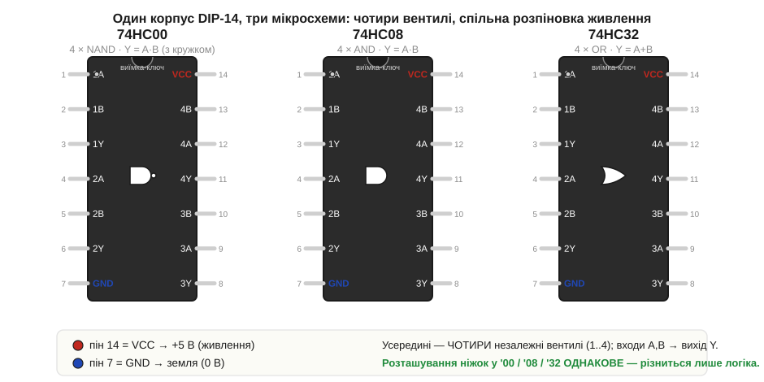
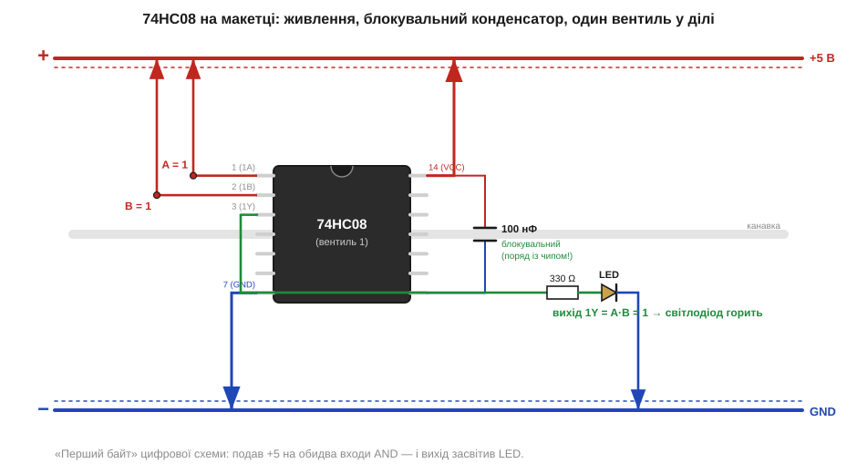
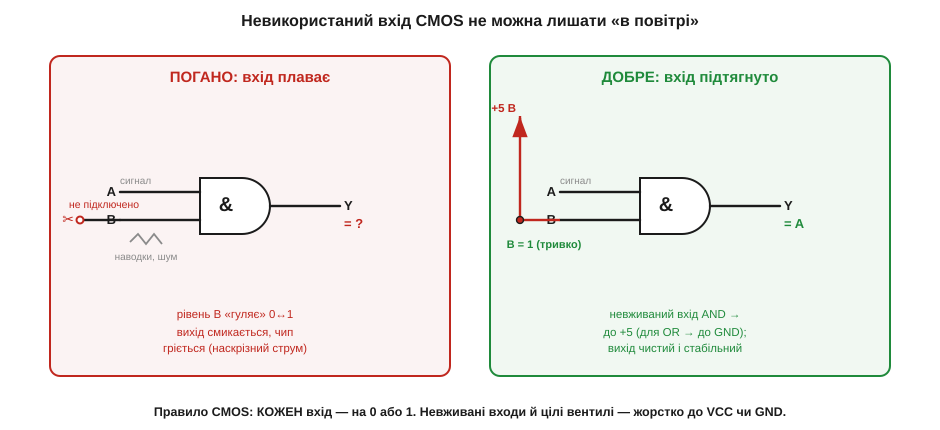

# 🔌 74HC00/08/32 на макетці: вентилі, які можна потримати в руках

> Компонентна вставка до теми [§3.2.2 «Базові вентилі: AND, OR, NOT»](ch15-logic-gates.md). §3.2.2 дав вентилям схемні символи й навчив простежувати 0/1 крізь з'єднання. Та символ на папері кортить замінити чимось, що клацає по-справжньому. Найкоротший шлях до цього — родина мікросхем **74HC**: копійчані корпуси, у кожному з яких сидять готові AND, OR чи NOT. Покладемо три з них на макетну плату (§1.4.1) і змусимо вихід засвітити світлодіод.

### Що це за клас: «розсипна» логіка в корпусі DIP

**74HC** — це сімейство **мікросхем дрібної логіки** (*small-scale logic*, технологія CMOS): кожен корпус містить **кілька однакових вентилів** з §3.2.2, повністю зібраних усередині й виведених на ніжки. Нічого, крім живлення й проводів, доточувати не треба — це той самий вентиль, тільки відлитий у пластмасу. Така «розсипна» логіка (її ще звуть *glue logic*, «клейова») — найнаочніший місток від символа до заліза: ти буквально тримаєш AND у руці.

Назва читається по частинах. **74** — родина (історична серія 74xx, до неї ще повернемось у §3.1.4). **HC** — підродина *High-speed CMOS*: живиться зазвичай від **2 до 6 В**, чудово почувається на звичних 5 В, мало гріється й майже не споживає струму в спокої. Останні дві-три цифри — **номер функції**, і саме вони цікавлять нас зараз:

- **74HC00** — чотири вентилі **NAND** (AND із кружком-інверсією, §3.2.2);
- **74HC08** — чотири вентилі **AND**;
- **74HC32** — чотири вентилі **OR**.

«Чотири» — не випадковість. Кожен вентиль має два входи й один вихід, тобто три ніжки; чотири вентилі — це дванадцять ніжок плюс дві на живлення, разом чотирнадцять. Тому всі три чипи живуть в однаковому корпусі **DIP-14** (*Dual In-line Package*, 14 ніжок двома рядами) — тому самому, під який зроблено канавку макетки (§1.4.1). Один корпус — чотири незалежні вентилі: зручно, коли схемі треба не один елемент, а кілька.

### Блок-схема: що сховано під чорною кришкою

Перш ніж тицяти ніжки в плату, корисно уявити, **що з чим усередині з'єднано**. Тут немає стабілізатора чи складної обв'язки — корпус простий, і вся його «карта» зводиться до чотирьох вентилів та двох ніжок живлення, спільних на всіх.


*Рис. 3.2.2c.1. Один корпус DIP-14, три мікросхеми. Усередині кожної — **чотири** однакові вентилі (пронумеровані 1..4); у вентиля номер n входи звуться nA, nB, вихід — nY. Живлення спільне: **пін 14 = VCC** (+, червоний) і **пін 7 = GND** (−, синій). Розташування ніжок у '00, '08 і '32 **однакове** — різниться лише логіка всередині (NAND / AND / OR). Виїмка-ключ на торці й крапка біля піна 1 показують, з якого боку рахувати ніжки.*

Карта проста, щойно засвоїш кілька правил. Ніжки рахують **проти годинникової** від кутка, позначеного крапкою чи виїмкою-ключем: ліворуч згори вниз ідуть піни 1–7, тоді переходиш на правий ряд і піднімаєшся знизу вгору — 8–14. Вентилі розкидані парами: вхід **1A** — пін 1, **1B** — пін 2, вихід **1Y** — пін 3; далі другий вентиль (4, 5, 6) і так до четвертого. Два піни стоять окремо: **7 — земля (GND)**, **14 — живлення (VCC)**. «Сьомий — мінус, чотирнадцятий — плюс» варто запам'ятати намертво — це рятує від найприкрішої помилки, про яку нижче.

Найцінніше на цьому рисунку — що **всі три чипи мають тотожну розпіновку**. Навчившись заводити один, ти автоматично вмієш заводити решту: міняється лише операція в нутрі, а ніжки лишаються на місцях. Тому далі підключатимемо для прикладу один корпус, тримаючи в голові, що для двох інших усе те саме.

### Підключення: живлення, входи, вихід

Тепер — від карти до плати. Покладемо **74HC08** (чотири AND) верхи на центральну канавку макетки, як у §1.4.1: кожна ніжка падає у свій окремий стовпчик-вузол, ліві ніжки відокремлені від правих. Лишається трьома кроками оживити схему — дати живлення, завести входи, зняти вихід.


*Рис. 3.2.2c.2. Підключення одного вентиля. **Живлення:** пін 14 (VCC) перемичкою на «+» шину (+5 В), пін 7 (GND) — на «−» шину; уздовж плати йдуть шини живлення з §1.4.1. **Блокувальний конденсатор 100 нФ** — впритул між пінами 14 і 7. **Входи:** 1A і 1B заведено на «+» (логічна 1). **Вихід:** 1Y через резистор 330 Ω на світлодіод і далі на землю. A=1, B=1 → AND=1 → LED горить.*

Розгляньмо кроки по черзі — кожен спирається на вже знайоме з Розділу 3.1.

**Живлення.** Чип німий, поки на ньому немає напруги. Пін 14 з'єднуємо короткою перемичкою з «плюсовою» шиною плати (+5 В), пін 7 — з «мінусовою» (GND, 0 В). Це ті самі логічні рівні, що в §3.1.2: усе, що чип видасть на виходах, лежатиме між цими межами — близько 0 В для нуля й близько 5 В для одиниці. Полярність переплутати не можна: «плюс» на сьомий пін — і мікросхема найімовірніше згорить.

**Блокувальний конденсатор.** Поряд із чипом, **впритул** між його пінами живлення, ставлять маленький конденсатор на **100 нФ** (*decoupling*, розв'язувальний). Навіщо? Перемикаючись, вентиль на мить хапає сплеск струму; тонкі доріжки живлення відповідають просіданням напруги, і сусіди можуть «побачити» хибний рівень. Конденсатор поруч працює місцевим резервуаром заряду, що згладжує ці поштовхи. Правило: **один конденсатор на кожен логічний корпус, якнайближче до ніжок 14 і 7** — це гігієна цифрових схем, не забаганка.

**Входи.** Кожен вхід має отримати чіткий рівень — 0 або 1. Найпростіше завести його перемичкою: на «+» шину — логічна 1, на «−» — логічний 0. На рисунку обидва входи (1A і 1B) сидять на «плюсі», тобто A = 1 і B = 1. Замість глухої перемички тут природно поставити кнопку — і міняти рівень входу руками, спостерігаючи за виходом.

**Вихід.** Вихід 1Y вже сам видає повноцінний логічний рівень. Щоб **побачити** його очима, чіпляємо світлодіод — але обов'язково через **струмообмежувальний резистор** (тут ~330 Ω), інакше світлодіод і вихід перевантажаться струмом (та сама межа потужності, що в §1.3.6). Тепер 1 на виході світить, 0 — гасить.

### «Перший байт»: як змусити вентиль заговорити

Зібравши схему з Рис. 3.2.2c.2, ти проводиш найперший цифровий експеримент — не на папері, а вживу. AND світить лише тоді, коли **обидва** входи в одиниці; будь-який нуль гасить світлодіод. Переберімо всі чотири комбінації входів руками — це буквально таблиця істинності AND з §3.2.2, прочитана по світлодіоду:

```
A=0, B=0  →  Y = 0·0 = 0  →  LED не горить
A=0, B=1  →  Y = 0·1 = 0  →  LED не горить
A=1, B=0  →  Y = 1·0 = 0  →  LED не горить
A=1, B=1  →  Y = 1·1 = 1  →  LED ГОРИТЬ
```

Світлодіод спалахує **рівно в одному** з чотирьох випадків — і ти на власні очі бачиш, що абстрактна операція «·» з §3.2.1 живе в шматочку кремнію. Тепер досить **переставити чип** на 74HC32 (та сама розпіновка!) — і LED світитиме у трьох випадках із чотирьох, бо OR гасне лише при двох нулях. Один стенд, три мікросхеми — і три таблиці істинності, перевірені пальцем і світлодіодом.

### Типові граблі

- **Невикористані входи — найголовніша пастка CMOS.** Якщо якийсь вхід (чи цілий зайвий вентиль) лишити **непідключеним**, його рівень не «нуль за замовчуванням», а **невизначений**: він плаває під дією наводок, вихід смикається, а сам чип може відчутно грітися від наскрізного струму. Тому **кожен** вхід має сидіти на чіткому рівні. Невживані входи й вентилі жорстко притягують до шини: для AND/NAND — до **VCC** (+5), для OR — до **GND**, щоб вони не заважали корисному сигналу. Це правило бачимо на наступному рисунку.


*Рис. 3.2.2c.3. Чому не можна лишати вхід «у повітрі». **Ліворуч:** другий вхід ні до чого не підключено — його рівень гуляє 0↔1 від наводок, вихід невизначений, чип гріється. **Праворуч:** невживаний вхід AND притягнуто до +5 (для OR притягували б до GND) — вихід чистий і стабільний, вентиль чесно повторює корисний вхід. Правило CMOS: кожен вхід — на 0 або 1, нічого не лишаємо плаваючим.*

- **Переплутана полярність живлення.** «Сьомий — мінус, чотирнадцятий — плюс». Подати +5 на пін 7 — найшвидший спосіб спалити мікросхему. Перед увімкненням варто ще раз простежити поглядом дві перемички живлення.
- **Світлодіод без резистора.** Пряме під'єднання світлодіода до виходу перевантажує і його, і вихід вентиля. Струмообмежувальний резистор обов'язковий (§1.3.6).
- **Забутий блокувальний конденсатор.** Без нього на довгих чи швидких ланцюжках вентилів сигнал «брудниться», з'являються хибні перемикання. 100 нФ біля кожного корпусу — дешеве страхування.
- **Плутанина в нумерації ніжок.** Рахунок завжди від крапки/виїмки-ключа, проти годинникової. Перевернеш корпус подумки не туди — і заведеш живлення в сигнальні ніжки.

### Варіації класу

За тією самою логікою влаштована **вся розсипна серія 74xx**: міняється лише функція в назві, а спосіб поводження — живлення, блокувальний конденсатор, чіткі рівні на входах — лишається тим самим. Тож, опанувавши три корпуси, ти фактично знаєш десятки. Поряд із нашими трьома найчастіше трапляються:

- **74HC04** — шість інверторів (NOT) і **74HC125** — буфери (той самий буфер без кружка з §3.2.2, що лише освіжає сигнал);
- **74HC02** — чотири NOR, **74HC86** — чотири XOR (про XOR — далі, у §3.2.4);
- варіанти за технологією й живленням: окрім **HC**, бувають **HCT** (приятелює з 5-вольтовим TTL-рівнем), **LVC/AHC** (на нижчі напруги, швидші) — це теж тема §3.1.4.

Так копійчаний корпус DIP-14 виявляється символом вентиля з §3.2.2, відлитим у кремній і виведеним на чотирнадцять ніжок: дай йому живлення з блокувальним конденсатором, заведи на входи чіткі 0 і 1 (а невживані — притягни до шини) — і вихід чесно обчислить булеву операцію, яку можна побачити по світлодіоду. Саме з таких корпусів, з'єднаних вихід-у-вхід, збирали логіку до приходу мікроконтролерів — і саме на них найлегше **відчути**, як математика з §3.2.1 стає залізом.
