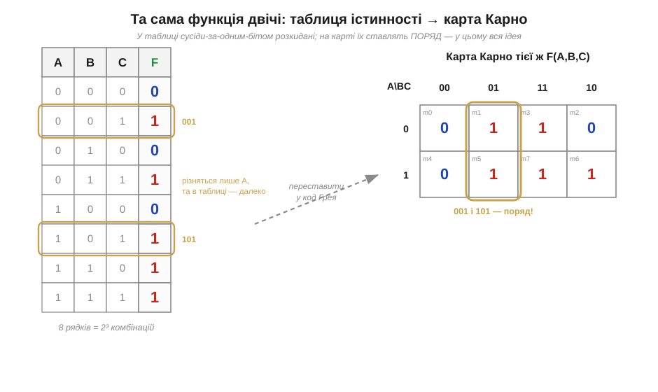
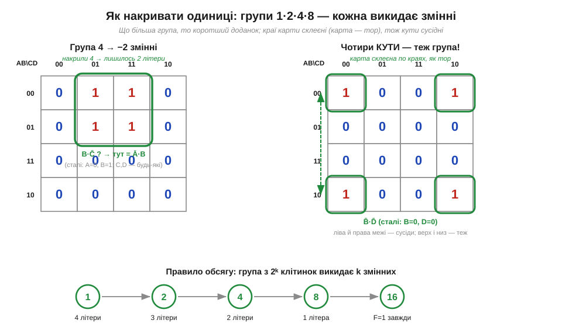
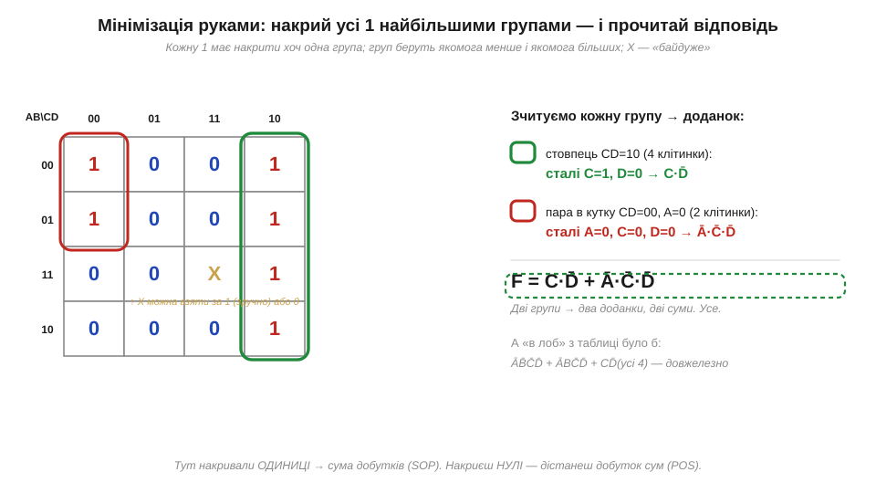

# 🧮 Карти Карно: мінімізація логіки руками

> Числова вставка до теми [§3.2.6 «Комбінаційні схеми»](ch15-logic-gates.md). Там ми складали суматори, мультиплексори й дешифратори з вентилів, а булеву функцію кожного блоку записували сумою добутків прямо з таблиці істинності (§3.2.1). Такий запис правильний, але майже завжди **надто довгий**: зайві доданки означають зайві вентилі. Згортати його законами Буля наосліп — марудно. Карта Карно (*Karnaugh map*, K-map) робить те саме **очима**, за лічені секунди.

### Звідки взялася задача

Будь-яку логіку можна виписати з таблиці істинності як **суму добутків** (*sum of products*, SOP): по доданку на кожен рядок, де вихід дорівнює 1. Для функції трьох змінних із п'ятьма одиницями це вже п'ять доданків по три літери — п'ятнадцять «входів» вентилів. Та частина з них зайва: сусідні рядки таблиці, що різняться **одним** бітом, завжди склеюються за правилом A·B̄ + A·B = A (та сама змінна то є, то нема — отже, вона не впливає). Проблема суто практична: у стовпчику таблиці такі сусіди розкидані далеко, і помітити їх оком важко. Карта Карно — це лише **інша розкладка** тієї самої таблиці, у якій сусіди-склейки опиняються поряд.

### Інтуїція: переставити так, щоб сусіди були поряд

Ідея одна: розкласти всі 2ⁿ комбінацій у прямокутну сітку, але занумерувати рядки й стовпці не звичайним рахунком 00, 01, 10, 11, а **кодом Грея** — 00, 01, 11, 10, де кожне наступне значення міняє рівно один біт. Тоді будь-які дві сусідні клітинки (по горизонталі чи вертикалі) різняться одним бітом — саме ті, що склеюються алгебраїчно. Мінімізація перетворюється на гру «обведи сусідні одиниці».


*Рис. 3.2.6m.1. Ліворуч — звичайна таблиця істинності F(A,B,C); рядки 001 і 101 різняться лише бітом A, але стоять далеко. Праворуч — та сама функція на карті: стовпці занумеровано кодом Грея (00, 01, 11, 10), і ті самі 001 та 101 опиняються **в одному стовпці, поряд**. Саме ця перестановка й робить склейки видимими.*

### Апарат: накривай найбільшими групами

Працюємо так. Одиниці на карті об'єднують у **групи**-прямокутники, розмір яких — тільки степінь двійки: 1, 2, 4, 8, 16. Кожна група зі 2ᵏ клітинок викидає k змінних: ті, що всередині неї міняються, зникають, а лишаються тільки сталі. Що більша група — то коротший доданок. Карта при цьому **склеєна по краях**, наче поверхня тора: ліва межа сусідня до правої, верхня — до нижньої, тож і чотири кути утворюють законну групу.


*Рис. 3.2.6m.2. Ліворуч — група з 4 клітинок: усередині неї C і D міняються, тож зникають, лишається Ā·B. Праворуч — чотири кути: вони сусідні через склейку країв (карта — тор), і разом дають B̄·D̄. Знизу — правило обсягу: чим більша група, тим менше літер у доданку.*

Сам рецепт мінімізації — кілька кроків, які легко тримати в голові:

```
1. Розстав 1 і 0 у сітку (рядки/стовпці — у коді Грея).
2. Накрий КОЖНУ одиницю хоч однією групою.
3. Бери групи якомога БІЛЬШІ (степінь 2) і якомога МЕНШЕ числом.
4. Кожну групу прочитай як доданок: лишай тільки сталі змінні.
5. З'єднай доданки через АБО — це й є мінімальна сума добутків.
```


*Рис. 3.2.6m.3. Зелена група — увесь стовпець CD=10 (сталі C=1, D=0 → C·D̄); червона — пара в кутку (сталі A=0, C=0, D=0 → Ā·C̄·D̄). Разом F = C·D̄ + Ā·C̄·D̄ — два доданки замість шести, що дала б таблиця «в лоб». Клітинку X («байдуже») вільно брати за 1 чи 0 — як зручніше для більшої групи.*

Дві дрібні, але корисні деталі видно вже тут. По-перше, клітинка-«байдуже» (*don't care*, X) — це комбінація входів, що ніколи не трапляється; її можна **на вибір** вважати одиницею (коли так група виходить більша) або нулем. По-друге, симетрія: якщо накривати не одиниці, а **нулі**, дістанемо мінімальний **добуток сум** (*product of sums*, POS) — другу канонічну форму тієї ж функції. Цей простий і дієвий прийом не звалився з неба — у нього довга й цілком колективна історія.

### Звідки взялися карти: Маркванд, Вейтч, Карно

Метод визрівав десятиліттями, і авторство тут радше спільне, ніж одноосібне. Ще 1881 року американський логік і філософ **Аллан Маркванд** (*Allan Marquand*) запропонував квадратну діаграму для логічних висловлювань — «діаграму Маркванда», прямого предка карти. У 1952-му інженер **Едвард Вейтч** (*Edward W. Veitch*) на з'їзді ACM описав «карту-таблицю для спрощення істиннісних функцій» — діаграму Вейтча. А наступного, 1953 року, фізик **Морис Карно** (*Maurice Karnaugh*) з лабораторії Bell Labs виклав свій варіант у статті «The Map Method for Synthesis of Combinational Logic Circuits»: його ключове уточнення — занумерувати осі **кодом Грея**, аби сусідство працювало автоматично, навіть через краї. Саме ця дрібниця зробила метод по-справжньому зручним, тож за ним і закріпилася назва «карта Карно», хоч точніше було б «діаграма Маркванда–Вейтча–Карно». Чи знав Карно про роботу Вейтча, а той — про діаграму Маркванда, чи кожен дійшов свого самостійно — у деталях непевно (перевірити). Незалежно подібну сітку запропонував і чеський інженер **Антонін Свобода** (*Antonín Svoboda*) 1956 року — звідси рідкісна назва «карти Свободи». А код Грея, на якому все тримається, названо на честь **Френка Грея** (*Frank Gray*), теж із Bell Labs.

### Де це в курсі

Карта Карно — це ручний інструмент рівно для того, що ми робили в §3.2.6: спростити вираз для блоку, перш ніж ставити вентилі. На практиці зручна вона до 4 змінних (плоска сітка 4×4), іноді до 5–6 із хитрощами; для більшого числа входів сусідство оком уже не схопити, і мінімізацію віддають алгоритмам та синтезаторам — але та сама ідея «склеювати сусідів за одним бітом» лежить і під ними. Тож карта корисна подвійно: нею ви **руками** урізаєте просту логіку, а заразом бачите, **що** саме робить інструмент, коли пізніше згортає за вас велику схему.
