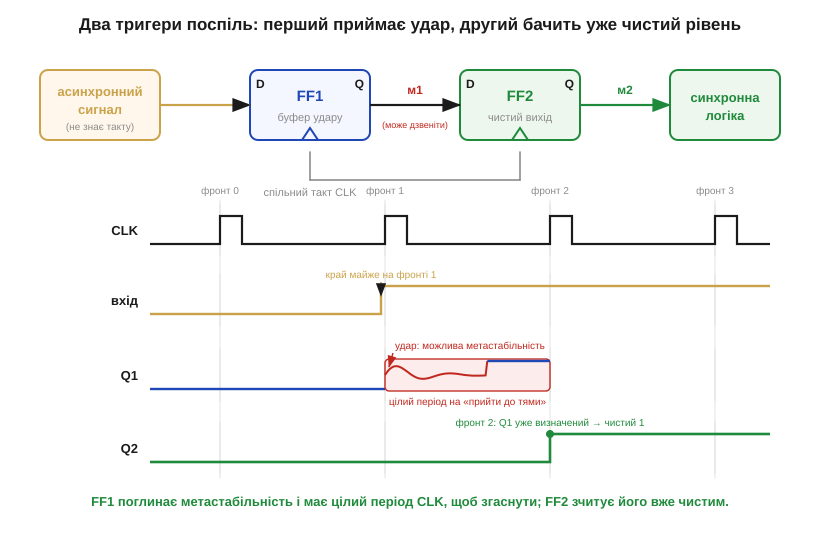
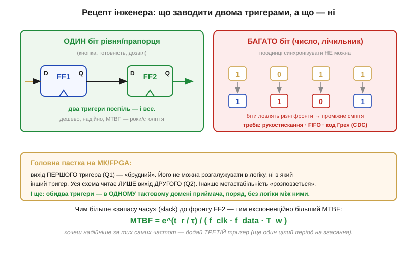

# 📜 Як інженери навчилися «впускати» чужий сигнал: коротка історія синхронізатора

> Це історична вставка до [§3.3.8 «Метастабільність і таймінг»](ch16-flip-flops-registers.md). У самій темі ми вже побачили **ліки** — пропустити асинхронний вхід крізь два тригери, перш ніж віддати його логіці. Рішення виглядає майже надто простим: де тут історія? А вона якраз і починається з того, що цьому «надто простому» прийому довго **не вірили** — і дорого за це платили. Окремо про сам **феномен** метастабільності та його першовідкривачів — у [📜 історії «Метастабільність: явище, в яке відмовлялися вірити»](ch16-s8-history-metastability.md); тут же — історія самого **захисту** й того, чому його неможливо зробити «ідеальним».

### Прийом, у який не вірили

Самопідтримні петлі, з яких зроблено тригер, людство приручило ще на телефонних станціях (про це — в [історії розділу](ch16-history-flip-flop.md)). Та одну їхню ваду довго вважали не вадою, а прикрою випадковістю. Коли в синхронну машину заводили сигнал «зі сторони» — від іншого блоку, від оператора, від давача, — система зрідка, раз на тисячі чи мільйони спрацювань, **збоїла** без жодної видимої причини. Збій не відтворювався: та сама схема на тому самому стенді поводилася бездоганно. Інженери списували це на завади, на «космічні промені», на брак паяння — на будь-що, тільки не на сам тригер.

Хитрість «постав ще один тригер поспіль» була відома й раніше — як народний прийом, без імені автора, без теорії під ним. Її передавали з рук у руки, але майже ніхто не міг **пояснити**, чому два тригери надійніші за один, і скільки саме надійності вони дають. Без числа за спиною прийом лишався забобоном: одні ставили два тригери «про всяк випадок», інші — жодного, і обидва не знали, чи мають рацію.

### Вашингтонський семінар 1972 року: проблема, яку визнали

Перелом стався, коли збої перестали бути поодинокими анекдотами й склалися в **закономірність**. У квітні 1972 року в Університеті Вашингтона в Сент-Луїсі (*Washington University in St. Louis*) зібрали **семінар із відмов синхронізаторів** (*Workshop on Synchronizer Failures*). І там з'ясувалося приголомшливе: машини **кількох різних виробників** страждали від того самого — невідтворюваних збоїв на стиках між блоками, що працювали кожен у своєму ритмі. Це була не вада окремої моделі, а **спільна** хвороба цілої галузі, яку доти кожен лікував наосліп.

Саме звідти проблема дістала ім'я й перестала бути соромливою таємницею окремих лабораторій. Невдовзі Томас Чейні та Чарльз Молнар (*Thomas J. Chaney, Charles E. Molnar*) опублікували вимірювання «аномальної поведінки» тригерів — про це детально в окремій історії. Для нас тут важливий наслідок: галузь **визнала**, що заводити чужий сигнал «напряму» не можна, і що захист потрібен **усім**, а не лише невдахам.

### Кіннімент і Вудс: коли захист дістав число

Визнати проблему — півсправи; інженерові потрібне **число**, щоб знати, скільки тригерів ставити. Це число дали британці Девід Кіннімент і Джон Вудс (*David J. Kinniment, John V. Woods*), що 1976 року в працях IEE («*Synchronization and arbitration circuits in digital systems*», Proc. IEE 123:961–966) поставили надійність синхронізатора на кількісну основу. Виявилося, що ймовірність того, що зависання триватиме довше за відведений час, спадає **експоненційно**, і середній час між збоями (*MTBF, mean time between failures*) можна **порахувати** з кількох вимірних величин — частоти такту, частоти подій на вході, технологічної сталої тригера.

Це й зробило прийом інженерним. Тепер «два тригери» означали не «помолитися», а конкретний MTBF у роках чи століттях; а якщо його бракувало — формула чесно казала додати ще один щабель і подовжити час на згасання. Прихований забобон став **розрахунком**. Десятиліттями пізніше Кіннімент зібрав цю науку в окрему книжку (*Synchronization and Arbitration in Digital Systems*, Wiley, 2008) — ознака того, що тема виявилася не дрібницею, а самостійним розділом цифрового проєктування.

### Чому «ідеального» синхронізатора не буде ніколи

Лишалося питання, що муляло теоретиків: невже не можна збудувати синхронізатор, який **гарантовано** вирішить за відведений час? Відповідь — глибша за електроніку, і дав її Леслі Лампорт (*Leslie Lamport*) у роботі «Принцип Бурідана» (*Buridan's Principle*). Лампорт сформулював просту й невблаганну тезу: **дискретне рішення, що спирається на вхід із неперервним діапазоном значень, не можна ухвалити за обмежений наперед час.**

Назва — від середньовічної притчі про **Буріданового віслюка**, що, поставлений рівно між двома однаковими оберемками сіна, не може обрати й гине з голоду. Тригер на фронті — той самий віслюк: щоб видати чистий 0 чи 1, він мусить «вирішити», по який бік порога опинився вхід, а якщо вхід застиг **рівно** на порозі, рішення може забаритися як завгодно. Звідси й випливає все: метастабільність не можна **усунути**, бо це не дефект схеми, а властивість самого акту вибору між двома станами. Її можна лише зробити **неймовірно рідкісною** — дати тригерові більше часу, і ймовірність невдачі впаде експоненційно, але ніколи не стане нулем. Двотригерний синхронізатор із §3.3.8 — саме така домовленість: не перемога над Бурідановим віслюком, а згода дати йому досить часу, щоб він майже завжди встиг обрати.

---

# ⚙️ Двотригерний синхронізатор: як безпечно завести асинхронний сигнал у тактову область

У [§3.3.8](ch16-flip-flops-registers.md) ми дійшли висновку: будь-який **асинхронний** вхід — кнопку, лінію від іншого чипа, сигнал з чужого тактового домену — не можна заводити в синхронну логіку напряму, бо рано чи пізно він зміниться на фронті й уведе тригер у метастабільність. Тут ми перетворимо цей висновок на **робочий рецепт**: що саме поставити на вході, як це виглядає в прошивці й HDL і де чигають пастки, коли ви робите це на справжньому мікроконтролері чи FPGA.

### Задача

Дано: сигнал, що змінюється **коли заманеться**, без жодного зв'язку з нашим тактом (*clock*, CLK). Треба: завести його значення в нашу синхронну схему так, щоб уся подальша логіка бачила **чистий** 0 або 1 — ніколи не «щось посередині». Повністю прибрати ризик метастабільності не можна (§3.3.8), тож реальна мета скромніша й чесніша: зробити збій настільки рідкісним, щоб середній час між випадками (*MTBF*) вимірювався роками чи століттями — далеко за межами строку служби пристрою.

### Ідея

Не **боротися** з метастабільністю, а дати їй **час розсмоктатися**. Ставимо два тригери (*flip-flops*) поспіль, обидва — на **нашому** такті. Перший ловить чужий сигнал і інколи зависає; але до того, як його зчитає другий тригер, минає **цілий період** CLK — досить, щоб «дзвін» згаснув у певний 0 чи 1. Другий тригер бачить уже визначений рівень і віддає його логіці чистим.


*Рис. 3.3.8a.1. Угорі — потік даних: асинхронний сигнал → FF1 → FF2 → логіка, обидва тригери на спільному CLK. Унизу — час: вхід міняється майже точно на **фронті 1**, тож FF1 на цьому фронті може зависнути (червона зона «дзвону»). Але він має **весь період** до **фронту 2**, щоб згаснути, — і на фронті 2 FF2 зчитує вже чистий рівень. Перший тригер приймає удар; другий бачить порядок.*

### Псевдокод

В апаратному описі (Verilog/VHDL чи логіка FPGA) синхронізатор — це буквально два регістри, що щотакту зсувають значення далі:

```
// усе — в тактовому домені приймача (CLK)
на кожному фронті CLK:
    ff1 <= async_in     // 1-й щабель: може стати метастабільним
    ff2 <= ff1          // 2-й щабель: за період ff1 уже згас
clean = ff2             // ТІЛЬКИ це віддаємо логіці
```

На мікроконтролері «два тригери» вам зазвичай дарує **сама периферія**: цифрові входи GPIO й лінії захоплення часто вже мають вбудований синхронізатор на тактовій частоті. Та коли ви читаєте швидку зовнішню лінію або міст між двома незалежними тактовими доменами всередині кристала, дворівневий ланцюг роблять явно — у залізі або, для повільних подій, повторним зчитуванням:

```
// повільна подія, зчитувана прошивкою синхронно з циклом опитування
s1 = read_pin(EXT)      // знімок входу
s2 = s1                 // зсуваємо попередній знімок
if (s2 == STABLE_LEVEL) // діємо лише за підтвердженим, «вистояним» рівнем
    handle_event()
```

### Складність і пастки на МК

Сам прийом коштує копійки — два тригери (або два байти стану) і один такт затримки. Платиш ти не ресурсами, а **увагою**: майже всі провали тут — не від браку елементів, а від недогляду в підключенні.


*Рис. 3.3.8a.2. Ліворуч (зелене) — для **одного** біта рівня двох тригерів досить. Праворуч (червоне) — **багатобітне** число так синхронізувати не можна: окремі біти ловлять різні фронти й дають проміжне сміття. Унизу — головна пастка: вихід **першого** тригера «брудний», його не можна розгалужувати; уся схема читає лише вихід **другого**. І важіль MTBF: більший запас часу — експоненційно надійніше.*

Чотири граблі, на які наступають найчастіше:

**Один біт, не число.** Два тригери рятують **рівень одного** дроту. Багатобітну величину — лічильник, координату, слово даних — так не передаси: біти «приїдуть» у різні такти, і логіка спіймає безглузде проміжне значення. Для переходу між тактовими доменами (*CDC, clock-domain crossing*) потрібен **протокол**: рукостискання (*handshake*), черга **FIFO** або код **Грея** (*Gray code*), де між сусідніми значеннями міняється лише один біт. До цих прийомів ми повернемося зі справжніми інтерфейсами.

**Не розгалужуй перший тригер.** Вихід FF1 — потенційно метастабільний; якщо завести його **в кілька місць** одразу (у логіку «зрізати кут» або в інший тригер), кожен «спостерігач» може вирішити по-різному, і метастабільність **розповзеться** по схемі. Правило просте: FF1 живить **лише** FF2, а вся решта читає **тільки** FF2.

**Обидва тригери — поряд і в одному домені.** Між FF1 і FF2 не можна вставляти комбінаційну логіку: вона з'їдає той самий запас часу (*slack*), за який метастабільність має згаснути. Обидва — на одному CLK приймача, поряд (у FPGA для цього є спеціальні атрибути синтезу).

**Два тригери — не завжди досить.** MTBF залежить не лише від кількості щаблів, а й від частоти, запасу часу, технології, температури й напруги. За високої частоти чи малого slack ставлять **третій** тригер — ще один цілий період на згасання робить MTBF як завгодно великим. І пам'ятайте: синхронізатор прибирає метастабільність, але **не** прибирає **дребезг** контактів — механічне «торохтіння» кнопки (§3.3.2) лишається задачею фільтрації, а не синхронізації. Це дві різні обережності зі світом, що не знає нашого такту, і потрібні вони обидві.
