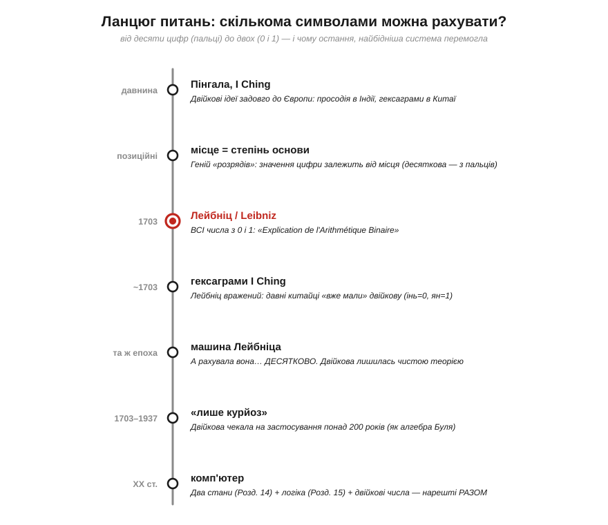
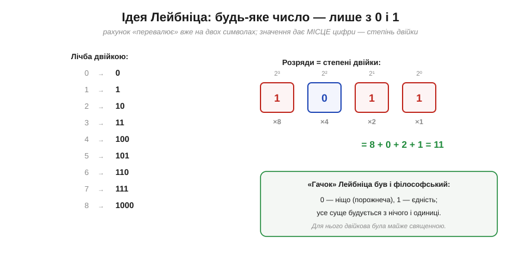
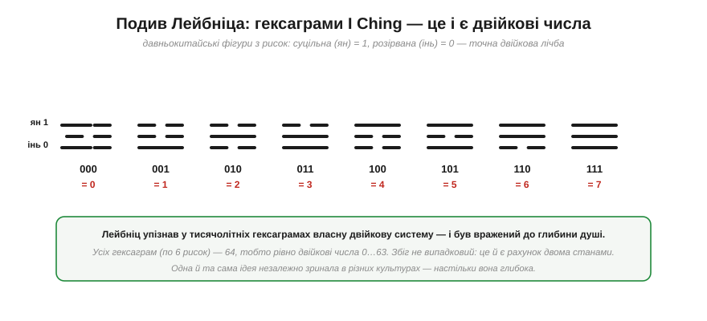
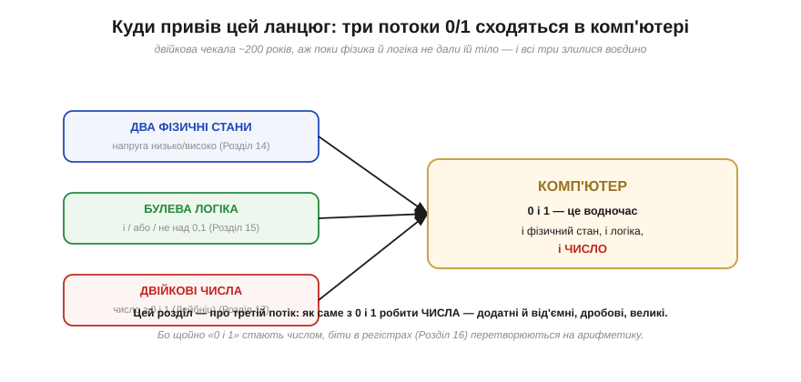

# 📜 Історія до Розділу 17 — Лейбніц і двійкова: математика задовго до машин

> Це історична вставка до [Розділу 17 «Представлення чисел»](ch17-number-representation.md). Вона веде **ланцюгом питань** до найбіднішого — і водночас наймогутнішого — способу записати число: лише двома символами, **0** і **1**. Цьому запису дав **систематичний, сучасний** вигляд не інженер і не програміст, а філософ-математик **Лейбніц** аж **1703 року** — за два з гаком століття до першої машини, яка змогла б ним скористатися. (Лейбніц не був абсолютно першим: двійку намацували й до нього — Гарріот рахував нею близько 1600-го, Карамуель надрукував систематичний виклад ще 1670-го, а Пінгала описав щось подібне ще в давній Індії, як ми побачимо наприкінці; та саме виклад Лейбніца став повним, впливовим і дав двійковій сучасну форму.) І, як уже двічі траплялося в нашому курсі (з алгеброю Буля в [Розділі 15](../ch15-logic-gates/ch15-history-boole.md) і з її застосуванням у [Розділі 14](../ch14-logic-levels/ch14-history-shannon.md)), геніальна ідея пролежала «непотрібною» сотні років — аж поки фізика й логіка не дали їй тіло. Наприкінці [Розділу 16](../ch16-flip-flops-registers/ch16-flip-flops-registers.md) ми навчилися тримати біти в регістрах; тепер настав час домовитися, **як саме** з цих 0 і 1 робити **числа**.

Уявіть, що ви рахуєте на пальцях. Їх десять — і саме тому наша звична система **десяткова**. Та в цьому числі «десять» немає нічого священного: воно — випадковість анатомії. А якби пальців було вісім? Чотири? Два? Скількома **найменшим** числом символів узагалі можна записати будь-яке число — і що ми за це заплатимо чи виграємо? Пройдімо шлях, яким людство дійшло до відповіді «двох досить».


*Рис. 17.0.1. Кожен щабель — крок до думки, що рахувати можна **двома** символами. Червоний вузол — Лейбніц, 1703, який дав двійковій системі сучасний, систематичний вигляд. А внизу — момент, коли три окремі потоки (фізика двох станів, булева логіка й двійкові числа) нарешті зійшлися в комп'ютері.*

---

## Скільки символів треба, щоб рахувати?

Почнімо з очевидного, що насправді не очевидне. Ми пишемо числа **десятьма** цифрами (0–9) — і це здається природним, мало не законом природи. Та це лише **звичка**, що тягнеться від десяти пальців. Історія знає й інші основи: вавилоняни рахували по **шістдесят** (звідси 60 хвилин і 360°), майя — по **двадцять**, а в багатьох мовах сліди дванадцяткової лічби (дюжина, грос). Жодна з цих систем не «правильніша» — основа лічби **довільна**.

А якщо основа довільна, виникає природне питання: яка **найменша**? Одним символом не порахуєш (паличками — хіба, та це не позиційна система). А от **двома** — уже можна. І тут потрібен другий, глибший винахід, без якого ні десяткова, ні двійкова не працюють, — **позиційність**.

---

## Геній позиції: значення з місця

Найбільший винахід в історії запису чисел — не самі цифри, а **позиційна** система: ідея, що значення цифри залежить від її **місця**. У числі 235 трійка означає не «три», а «три **десятки**», бо стоїть у розряді десятків. Кожна позиція — це степінь основи: одиниці (10⁰), десятки (10¹), сотні (10²)…

```
235 = 2·100 + 3·10 + 5·1 = 2·10² + 3·10¹ + 5·10⁰
```

Цей принцип працює для **будь-якої** основи — треба лише замінити степені десятки на степені іншого числа. Для двійкової основа — **два**, тож розряди стають степенями двійки: одиниці (2⁰), двійки (2¹), четвірки (2²), вісімки (2³)…


*Рис. 17.0.2. Зліва — лічба двійкою: вона «перевалює» вже на двох символах (0, 1, 10, 11, 100…), бо щойно вичерпали обидві цифри в розряді, додають новий розряд — точнісінько як у десятковій після 9. Справа — як читати двійкове число: кожен розряд множать на свій степінь двійки й додають, тож 1011 = 8 + 0 + 2 + 1 = 11. А внизу — несподіваний «гачок»: для Лейбніца двійкова була ще й **філософією**.*

Зверніть увагу, як економно: маючи лише два символи, ми платимо **довжиною** (двійкові числа довші за десяткові), зате виграємо неймовірну **простоту** кожного розряду — у ньому або 0, або 1, нічого проміжного. Саме ця простота, як ми вже знаємо з Розділу 14, ідеально лягає на фізику двох станів. Але до фізики було ще понад два століття; поки що двійкова цікавила одного-єдиного генія — з міркувань, далеких від інженерії.

---

## Лейбніц: усе з нуля й одиниці

**Ґотфрід Вільгельм Лейбніц** (*Gottfried Wilhelm Leibniz*, 1646–1716) — один із найуніверсальніших умів в історії: математик (незалежно від Ньютона створив диференціальне числення, і саме його позначення dx, ∫ ми вживаємо досі), філософ, дипломат, винахідник. Серед безлічі його ідей була й така: записати **всі** числа, користуючись лише **двома** знаками — 0 і 1.

Свою двійкову арифметику Лейбніц виклав 1703 року в статті з прямою назвою — **«Пояснення двійкової арифметики»** (*Explication de l'Arithmétique Binaire*), опублікованій у працях Паризької академії наук. Там він показав не лише **як** записувати числа двома символами, а й що з ними чудово працює вся **арифметика**: додавання, віднімання, множення — усе те саме, тільки простіше, бо таблиця додавання в двійковій майже порожня (0+0=0, 0+1=1, 1+1=10 — оце й усе).

> 🔧 **Навіщо це.** Запам'ятайте цей принцип «перенесення» з прикладу 1+1=10, бо ви буквально втілили його залізом ще в Розділі 15: біт суми (XOR) і біт переносу (AND) у півсуматорі — це і є двійкове «1+1=10». Те, що Лейбніц 1703 року виписав як арифметику двох символів, ви склали з вентилів у §15.6. Між пером філософа й кремнієвим суматором лежить пряма лінія завдовжки в триста років.

---

## Священна арифметика: 0 — ніщо, 1 — єдність

А тепер найдивовижніше: Лейбніца вабила двійкова не стільки практичною користю, скільки **філософським** і навіть **богословським** змістом. Він бачив у ній образ **творіння світу**. Нуль для нього означав **ніщо**, порожнечу; одиниця — **єдність**, Бога. І те, що **геть усе** розмаїття чисел можна побудувати з самих лише «нічого» та «одиниці», здавалося йому прямою аналогією до творення світу з нічого однією божественною волею.

Лейбніц так захопився цією думкою, що навіть запропонував викарбувати медаль на честь двійкової системи — з девізом на кшталт «одного досить, щоб вивести все з нічого» (*omnibus ex nihilo ducendis sufficit unum*). Для нас, що звикли до «бітів» як до сухої техніки, це звучить несподівано: біля колиски двійкової системи стояла не інженерія, а **метафізика**. Та в цьому й урок — фундаментальні ідеї часто народжуються з питань, що здаються «непрактичними»; користь приходить пізніше й звідки не чекали.

---

## Гексаграми I Ching: подив крізь століття

І тут історія робить поворот, від якого досі трохи мороз по шкірі. Лейбніц листувався з **Жоашеном Буве** (*Joachim Bouvet*) — французьким єзуїтом-місіонером, що жив у Китаї. Буве розповів Лейбніцу про давню китайську **«Книгу змін»** (*I Ching*, Yi Jing) — і про її **гексаграми**: 64 фігури, кожна складена з шести горизонтальних рисок двох видів — суцільної (**ян**) і розірваної (**інь**).

Лейбніц глянув на ці фігури — і **завмер**. Якщо суцільну риску прийняти за **1**, а розірвану за **0**, то гексаграми виявлялися… двійковими числами від 0 до 63, у бездоганному порядку.


*Рис. 17.0.3. Вісім триграм (із трьох рисок) — це двійкові числа 0…7: ян (суцільна) = 1, інь (розірвана) = 0. Повних гексаграм (по шість рисок) — рівно 64, тобто двійкові 0…63. Лейбніц упізнав у тисячолітніх китайських символах **власну** систему — і сприйняв це як підтвердження її глибини й універсальності.*

Лейбніц був вражений до глибини душі. Він навіть вирішив, що стародавні китайці (легендарний мудрець **Фусі**) **знали** двійкову арифметику й зашифрували її в «Книзі змін», а потім втратили ключ. Сучасні історики ставляться до цього обережніше — творці I Ching навряд чи мислили «числами» в нашому сенсі, — та сам **збіг** не випадковий і не містичний: щойно ти береш дві протилежні позначки й вибудовуєш із них усі комбінації, ти **неминуче** отримуєш двійкову лічбу. Тому одна й та сама структура незалежно зринала в Індії (просодія **Пінгали**, ще до нашої ери), у Китаї (гексаграми) і в Європі (Лейбніц). Двійкова — настільки глибока ідея, що людство натрапляло на неї знов і знов.

---

## А машина його рахувала десятковою

Тут ховається чудова іронія, яку варто прочути. Лейбніц був не лише теоретиком — він **збудував** обчислювальну машину, знаменитий «ступінчастий обчислювач» (*Stepped Reckoner*), що вмів додавати, віднімати, множити й ділити. Здавалося б — ось де застосувати свою улюблену двійкову!

Та ні. Машина Лейбніца рахувала **десятковою**. Він чудово розумів, що двійкова елегантніша **в теорії**, але для **ручних** обчислень і механічних коліщат вона незручна: числа задовгі, а людині звичніша десятка. Тобто сам винахідник двійкової арифметики, маючи в руках обчислювальну машину, двійкову в ній **не використав** — бо тоді в неї просто не було переваги. Двійкова потребувала зовсім іншого «заліза» — такого, де два стани **легші** за десять. А такого заліза (надійного перемикача, що любить саме два положення) ще не існувало.

Так двійкова й лишилася тим, чим була, — **прекрасною математичною іграшкою** без практичного дому.

---

## Двісті років чекання

І ось головний, уже знайомий нам мотив. Від Лейбніца (1703) до перших електронних машин (1940-ві) двійкова система пролежала **понад два століття** як цікавий, але «непотрібний» куточок математики. Її вивчали, нею милувалися, та ніхто не міг сказати, **навіщо** вона, — бо світ рахував десятковою, на папері й шестернях.

Це той самий урок, що його дали нам Буль (Розділ 15) і Шеннон (Розділ 14): фундаментальна ідея може **десятиліттями** (а то й століттями) чекати, поки світ доросте до проблеми, яку вона розв'язує. Двійкова Лейбніца, алгебра логіки Буля, навіть мрія самого Лейбніца про «обчислення міркувань» — усе це лежало напоготові, аж поки в XX столітті не зійшлося докупи.

---

## Три потоки сходяться

А зійшлося ось як. До XX століття назбиралося **три** окремі лінії думки, кожна про свої «0 і 1», — і комп'ютер злив їх в одне.


*Рис. 17.0.4. **Перший потік** — фізика: надійний перемикач має **два стани** (низько/високо), і це Розділ 14. **Другий** — логіка: Буль показав, що міркування зводиться до **і/або/не** над 0 і 1, а Шеннон приклав це до схем (Розділ 15). **Третій** — арифметика: Лейбніц показав, що з 0 і 1 будуються **числа** (цей розділ). У комп'ютері всі три злилися: те саме «0 і 1» там водночас і фізичний стан, і логічне значення, **і число**.*

Ось чому Розділ 17 такий важливий і чому він іде саме тут. Розділ 14 дав нам фізичні 0 і 1; Розділ 15 навчив виконувати над ними **логіку**; Розділ 16 — **зберігати** їх у регістрах. Та доти 0 і 1 були для нас лише **істина/хибність** і **стан**. Тепер, з Лейбніцем, вони стають **числами** — і це той ключ, що оживляє арифметику: біти в регістрі більше не просто прапорці, а **число**, яке можна додавати, віднімати, порівнювати. Двійкова система — це міст від «логіки» до «обчислень».

---

## Куди привів цей ланцюг

Озирнімося. Питання «скількома символами рахувати?» вело від десяти пальців через позиційні системи до двох символів Лейбніца — і далі, крізь двісті років чекання, до комп'ютера, де двійкова нарешті знайшла свій дім. Справедливості ради: Лейбніц не був абсолютно першим — двійкові ідеї до нього торкалися й Томас Гарріот, і Хуан Карамуель, а Пінгала описав щось подібне ще в давній Індії. Та саме Лейбніц дав двійковій **сучасний, систематичний** вигляд із повною арифметикою — і саме його ім'я стоїть біля її колиски.

Найвпертіший слід цієї історії — сама **глибина** ідеї. Двійкова не «винайдена» однією людиною з примхи — вона **неминуча**: щойно ти приймаєш, що символів два, усе інше випливає само. Тому вона й зринала незалежно в різних кутках світу й епохах. А коли фізика (Розділ 14) дала надійний двостановий перемикач, а логіка (Розділ 15) — спосіб над ним міркувати, двійкова Лейбніца виявилася **єдино правильною** мовою чисел для машин. Тримайте це в голові, входячи в розділ: усе, що ми робитимемо далі — від'ємні числа, дроби, переповнення, плаваюча кома — це **способи** виразити багатство чисел тими самими двома символами, що їх триста років тому філософ вважав образом творіння.

А тепер, маючи цю інтуїцію, перейдімо від історії до самої справи — і запитаймо строго: **чому для машин обрали саме двійкову, і як нею записувати числа?**

> ▶️ Далі: [§17.1 Чому двійкова: два стани надійніші](ch17-number-representation.md)
