# Розділ 3.4 — Представлення чисел

Модуль 3 дав нам багато: фізичні **0 і 1**, стійкі до шуму (Розділ 3.1), **логіку** над ними (Розділ 3.2) і **пам'ять**, що їх тримає й крокує в часі (Розділ 3.3). Та досі ці 0 і 1 були для нас лише **істина/хибність** і **стан**. Цей розділ робить наступний крок — перетворює їх на **числа**. Бо щоб машина не просто зберігала біти, а **рахувала** ними (додавала, віднімала, порівнювала), треба домовитися, **як саме** записувати числа двома символами: не лише додатні цілі, а й від'ємні, дробові, величезні й крихітні. Це — **мова чисел**, без якої суматор Розділу 3.2 і регістр Розділу 3.3 лишилися б купою бітів без сенсу. Дорога веде від «чому взагалі двійкова» через позиційний запис і шістнадцятковий зошит до доповняльного коду, переповнення, фіксованої й плаваючої коми. Тут біти нарешті оживають як арифметика.

> 📜 **Перед матеріалом — історія:** [Лейбніц і двійкова: математика задовго до машин](ch17-history-leibniz.md). Вона пояснює, як **систематичного, сучасного** вигляду двійковій арифметиці надав філософ ще 1703 року (з мало не священних міркувань) — хоч до нього двійку вже намацували інші (Карамуель надрукував систематичний виклад ще 1670-го, Гарріот рахував нею близько 1600-го, а Пінгала — ще в давній Індії); чому вона збіглася з давніми гексаграмами I Ching і як, пролежавши «непотрібною» двісті років, нарешті стала мовою комп'ютера. На цю ідею «всі числа з 0 і 1» ми спираємося від першого підрозділу.

---

## 3.4.1 Чому двійкова: два стани надійніші

З історії розділу ми знаємо, що записати числа двома символами **можна** — Лейбніц довів це триста років тому. Та лишається питання: чому машини обрали саме двійкову, а не звичну десяткову? Адже людині десяткова зручніша. Відповідь — пряме повернення до Розділу 3.1, і вона про **надійність**: два стани переживають шум, який убив би десять. Цей підрозділ — про те, чому «бідна» двійкова виявилася для заліза **найкращою**, і про найперші поняття, без яких далі не рушити: біт, байт, місткість.

### Десяткова в залізі — це кошмар

Уявімо, що ми вперто хочемо зберігати числа в **десятковій** прямо в апаратурі — і то найпрямолінійнішим способом: **одна десяткова цифра = один рівень напруги** на дроті, десять різних рівнів в одному діапазоні. (Реальні десяткові машини, як-от ENIAC, насправді робили інакше — через десяткові лічильники чи BCD-коди, де кожну цифру однаково складали з кількох двійкових елементів; та щоб відчути, чому «багато рівнів на одному дроті» — погана ідея, найнаочніша саме ця пряма модель.) А тепер згадаймо §3.1.1 і §3.1.3: що **більше** рівнів утиснути в той самий розмах напруги, то **вужчі** «ями» між ними й то легше шум переплутає сусідні значення.

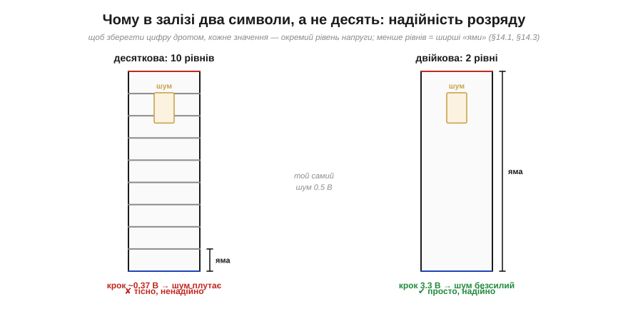
*Рис. 3.4.1.1. Зберігаючи десяткову цифру одним дротом, ми мусимо втиснути **десять** рівнів напруги — крок між ними мізерний (~0.37 В на 3.3 В), і навіть невеликий шум плутає сусідні цифри. У двійковій рівнів **два**, між ними зяє вся напруга — і той самий шум безсилий. Це точнісінько та сама «яма Шеннона» з §3.1.1, тепер застосована не до логіки, а до **зберігання числа**.*

Ось і відповідь. Десяткова в залізі вимагала б тонкого розрізнення десяти рівнів — крихкого, чутливого до найменшої завади, температури, старіння. Двійкова ж потребує розрізнити лише «низько» й «високо» — найгрубіше, найнадійніше рішення, яке тільки можна уявити. Машина обрала двійкову не тому, що вона «красива» (хоч Лейбніц вважав саме так), а тому, що вона **виживає** там, де десяткова потоне в шумі.

### Ціна — довжина, виграш — надійність

За цю надійність ми платимо — і чесно назвімо ціну. Двійкові числа **довші** за десяткові: одне й те саме число займає більше розрядів.

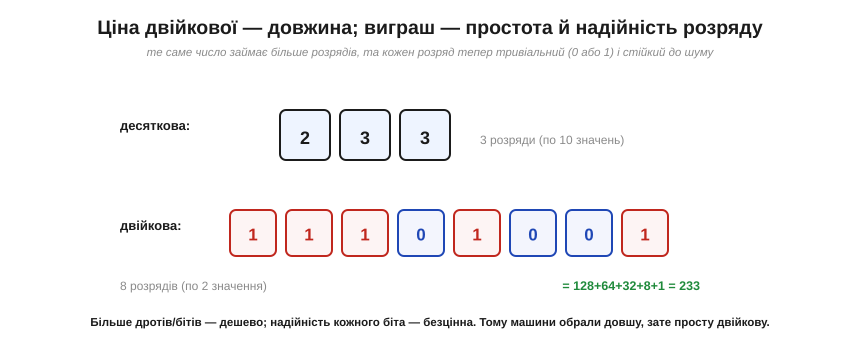
*Рис. 3.4.1.2. Число 233 у десятковій — це три розряди; у двійковій — аж вісім (11101001 = 128+64+32+8+1). Двійковий запис **утричі** довший. Та погляньте, чим ми заплатили й що отримали: кожен десятковий розряд мусив би розрізняти десять станів, а кожен двійковий — лише два. Розрядів більше, зате кожен — тривіальний і стійкий до шуму.*

Цей обмін — **довжина проти простоти розряду** — виявився надзвичайно вигідним. Додати ще один біт (ще один дріт, ще один тригер) — **дешево**: кремній дозволяє ставити їх мільярдами. А от зробити кожен розряд **надійним** — безцінно, бо від цього залежить, чи працюватиме машина взагалі. Тому інженерія без вагань обрала довшу, зате просту й надійну двійкову. Зайва довжина — дрібна плата за те, що кожен розряд має **величезний запас до шуму** й помиляється набагато рідше. (Зовсім без помилок не буває — лишаються і шум, і збої від випромінювання, і метастабільність на межах, §3.3.8; та двійковий розряд переживає те, що десятковий не пережив би.)

### Біт і місткість 2ᴺ

Тепер найперші терміни. Один двійковий розряд — це **біт** (*bit*, скорочення від *binary digit*; саме слово запропонував Джон Тьюкі 1947 року, а в науку його ввів Шеннон — історія Розділу 3.1). Біт — атом цифрової інформації: він зберігає рівно **одне з двох** значень, 0 або 1. А скільки різних значень зберігає кілька бітів разом?

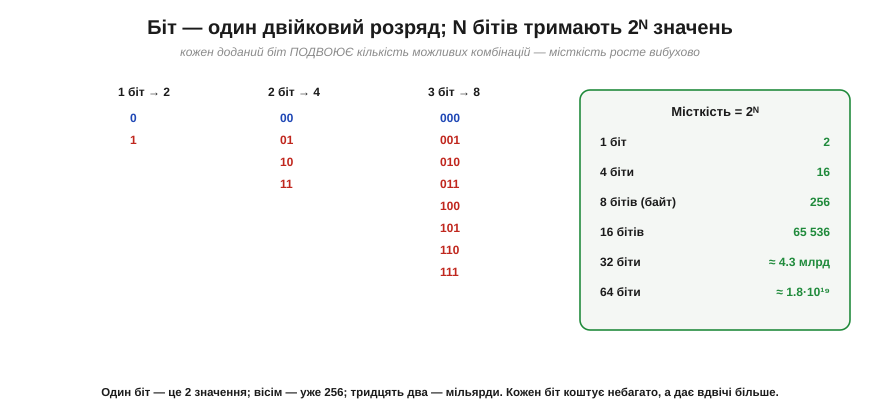
*Рис. 3.4.1.3. Кожен доданий біт **подвоює** кількість можливих комбінацій: 1 біт — це 2 значення (0, 1), 2 біти — 4 (00, 01, 10, 11), 3 біти — 8, і так далі. Загальне правило: **N бітів тримають 2ᴺ різних значень**. Місткість росте вибухово: 8 бітів — уже 256, 16 — понад 65 тисяч, 32 — більш як 4 мільярди, 64 — близько 1.8·10¹⁹.*

Запам'ятайте формулу **2ᴺ** — вона всюди. Це та сама «вибуховість», що в §3.2.7 лякала нас розміром таблиці істинності, а тут постає з **доброго** боку: як **місткість**. Кожен біт коштує небагато, а **подвоює** діапазон чисел, які можна виразити. Саме тому процесори бувають «8-бітні», «32-бітні», «64-бітні»: число бітів прямо каже, наскільки великі числа машина тримає в одному «шматку».

### Байт — і «те саме, та різне»

Серед усіх розмірів один став **стандартною порцією** — **байт** (*byte*), вісім бітів. Байт тримає 2⁸ = **256** значень, і саме байтами міряють пам'ять, файли, дані.

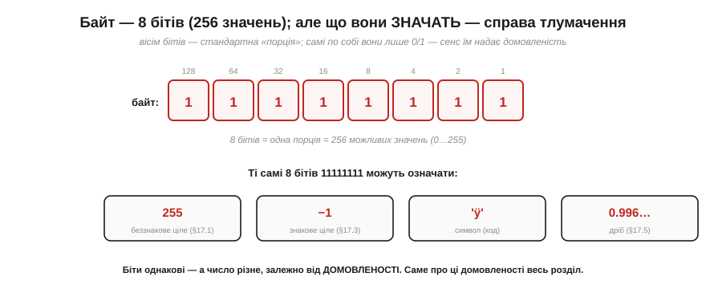
*Рис. 3.4.1.4. Байт — вісім бітів, 256 можливих комбінацій. Та ось ключова думка всього розділу: самі по собі біти — це лише 0 і 1, **без жодного вродженого сенсу**. Ті самі вісім одиниць 11111111 можуть означати 255 (беззнакове ціле), −1 (знакове, §3.4.3), якийсь символ або дріб 0.996… (§3.4.5) — залежно від **домовленості**, як їх тлумачити. Біти однакові, а число різне.*

Це — найважливіша ідея, яку треба засвоїти на самому початку. **Біти не містять сенсу — сенс надає їм домовленість.** Той самий байт 11111111 — це і 255, і −1, і буква, і частинка дробу, залежно від того, **як ми домовилися** його читати. І весь подальший розділ — це, по суті, каталог таких **домовленостей**: як тлумачити біти, щоб дістати додатні числа, від'ємні, дробові, великі. Кожна тема далі — це окремий «спосіб читання» тих самих 0 і 1.

### Усе цифрове — це біти

І останнє, що варто усвідомити перед зануренням. Не лише числа — **геть усе** цифрове закодоване тими самими 0 і 1.

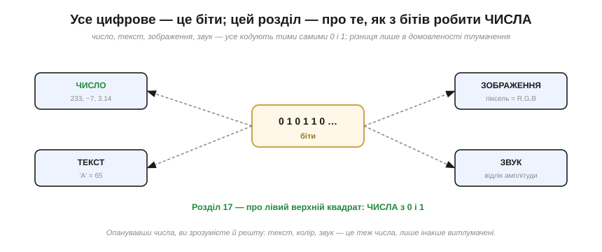
*Рис. 3.4.1.5. Число, текст, зображення, звук — усе це послідовності бітів; різниця лише в **домовленості тлумачення**. Текст — це числа-коди букв; піксель — це числа яскравості кольорів; звук — це числа-відліки амплітуди. У глибині все зводиться до чисел, а числа — до 0 і 1. Цей розділ — про лівий верхній квадрат: як із бітів зробити **числа**. Опанувавши його, ви зрозумієте й решту.*

Ось чому Розділ 3.4 такий фундаментальний: число — це **первинна** домовленість, з якої виростають усі інші. Навчившись кодувати числа, ви триматимете ключ до всього цифрового — бо текст, колір, звук — це теж числа, лише інакше витлумачені. А почати треба з найпростішого, але вже не зовсім очевидного: як власне читати двійковий запис і чому програмісти так люблять його шістнадцятковий «скоропис».

> 🔧 **Навіщо це.** Три думки на все життя з цифрою. Перша: машини двійкові не з примхи, а заради **надійності** — два рівні дають величезний запас на шум, десять — мізерний; це той самий компроміс §3.1.1, що визначив усю цифрову епоху. Друга: **N бітів = 2ᴺ значень** — ця формула підкаже, чи влізе ваше число в змінну: 8-бітна тримає 256 значень, 16-бітна — 65 тисяч, тож «лічильник на 8 біт» перерахує лише до 255 (а далі — переповнення, §3.4.4). Третя, найголовніша: **біти самі по собі не мають сенсу** — той самий байт може бути 255, −1, буквою чи дробом; що він означає, вирішує **тип/домовленість**, яку ви, програміст, оголошуєте. Більшість «дивних» багів із числами — це коли біти прочитали **не за тією** домовленістю (знакове як беззнакове, ціле як дріб). Тримайте це в голові — і половина таких пасток вас омине.

---

Підсумок §3.4.1: машини використовують **двійкову** не тому, що так зручно людині, а заради **надійності** — два рівні напруги дають широчезний запас на шум, тоді як десять рівнів потонули б у завадах (§3.1.1, §3.1.3). Ціна — більша **довжина** запису, та це дешева плата за простоту й стійкість кожного розряду. Один двійковий розряд — це **біт** (одне з двох значень); N бітів тримають **2ᴺ** значень (місткість росте вибухово: байт = 8 бітів = 256). А найважливіше: **біти не мають вродженого сенсу** — той самий байт 11111111 означає 255, −1, символ чи дріб залежно від **домовленості**, як його тлумачити. Увесь розділ — каталог таких домовленостей. Найперша з них — як власне **читати** двійковий запис як число; з неї й почнемо, заразом познайомившись із шістнадцятковим записом, який рятує програмістів від нескінченних рядків нулів та одиниць.

---

## 3.4.2 Позиційні системи: двійкова й шістнадцяткова

З історії розділу ми знаємо головний винахід — **позиційність**: значення цифри залежить від її **місця**, а кожне місце — це степінь основи. Тепер навчимося цим користуватися практично: **читати** двійковий запис як число, **переводити** туди й назад, і — найважливіше для щоденної роботи — записувати довгі двійкові числа компактно в **шістнадцятковій** системі, яку люблять усі програмісти. Це суто практичні навички, без яких не обійтися ні з даташитом, ні з кодом.

### Як прочитати двійкове: степені двійки

Двійкове число читають так само, як десяткове, лише степені беруть від **двійки**, а не від десятки. Кожен розряд (справа наліво) — це 2⁰=1, 2¹=2, 2²=4, 2³=8, 2⁴=16…

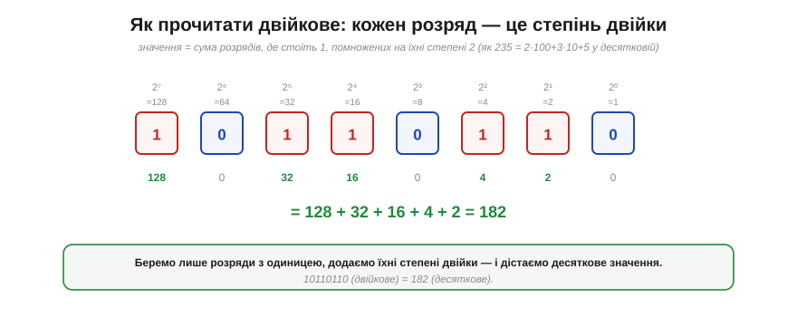
*Рис. 3.4.2.1. Над кожним бітом — його «вага» (степінь двійки). Щоб дістати десяткове значення, беремо лише розряди, де стоїть **1**, і додаємо їхні ваги. Для 10110110: 128 + 32 + 16 + 4 + 2 = 182. Усе, що для цього треба, — знати степені двійки (1, 2, 4, 8, 16, 32, 64, 128…) і вміти додавати.*

Запам'ятати перші степені двійки (1, 2, 4, 8, 16, 32, 64, 128, 256, 512, 1024…) дуже корисно — вони трапляються всюди в цифровій техніці, від розмірів пам'яті до меж змінних. А читати двійкове стає просто: знайди одиниці, додай їхні ваги.

### Десяткове → двійкове: ділення на 2

Зворотне перетворення — з десяткового в двійкове — теж механічне. Найнадійніший спосіб: раз за разом **ділити на 2** й записувати **остачу** (0 або 1), аж поки не дійдемо до нуля. Тоді стовпчик остач, прочитаний **знизу вгору**, і є двійковий запис.


*Рис. 3.4.2.2. Переведення 182 у двійкове. Ділимо на 2, щоразу занотовуючи остачу: 182÷2=91 (ост. 0), 91÷2=45 (ост. 1)… і так до нуля. Остачі, прочитані **знизу вгору**, дають 10110110. Працює це тому, що остача від ділення на 2 — це молодший біт числа, а саме ділення «зсуває» число на розряд правіше.*

**Приклад (туди й назад).** Переведімо 182 у двійкове й перевіримо зворотним читанням.

```
182 → ділення на 2 → остачі знизу вгору → 10110110
перевірка:  1·128 + 0·64 + 1·32 + 1·16 + 0·8 + 1·4 + 1·2 + 0·1
          = 128 + 32 + 16 + 4 + 2 = 182  ✓
```

(Є й швидший спосіб для тих, хто знає степені двійки: відняти найбільший степінь, що вміщається, поставити там 1, і повторити з рештою. 182 − 128 = 54 → ставимо біт 128; 54 − 32 = 22 → біт 32; 22 − 16 = 6 → біт 16; 6 − 4 = 2 → біт 4; 2 − 2 = 0 → біт 2. Виходить ті самі 10110110.)

### Двійкове задовге для очей → шістнадцятковий скоропис

Тепер — про головну незручність двійкового запису для людини. Він **довгий**. 8-бітне число — це вісім символів, 32-бітне — аж тридцять два нулі й одиниці поспіль. Прочитати такий рядок, не загубившись і не помилившись, майже неможливо.


*Рис. 3.4.2.3. 32-бітне число у двійковому — це стіна з 32 знаків, у якій легко збитися. Те саме число **шістнадцятково** — лише вісім знаків: 0xDEADBEEF (до речі, знаменита «налагоджувальна» позначка в пам'яті). Одне й те саме значення, та читати незрівнянно легше.*

Рішення — записувати двійкові числа в **шістнадцятковій** (*hexadecimal*, base 16) системі. І тут криється елегантність, що робить hex не просто «ще однією системою», а ідеальним **скорописом** саме для двійкового.

### Шістнадцяткова: 16 цифр, кожна — це 4 біти

Шістнадцяткова має **шістнадцять** цифр. Перші десять — звичні 0–9, а для значень 10–15 беруть **літери** A, B, C, D, E, F (A=10, B=11, …, F=15). Чому саме 16? Бо **16 = 2⁴** — і це означає, що одна hex-цифра відповідає **рівно чотирьом бітам**.

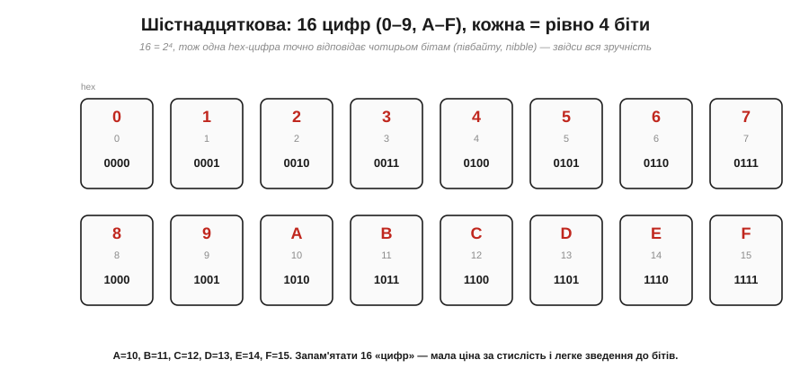
*Рис. 3.4.2.4. Усі 16 hex-цифр та їхні 4-бітні відповідники: 0=0000, 1=0001, …, 9=1001, A=1010, …, F=1111. Оскільки 16=2⁴, кожна hex-цифра — це точно **чотири біти** (їх звуть **півбайтом**, *nibble*). Саме ця рівність і робить hex таким зручним.*

Ось у чому суть: hex — це не довільна інша основа (як, скажімо, десяткова, що з двійковою «не дружить»), а саме та, що **точно лягає** на групи по 4 біти. Завдяки цьому переведення між двійковим і шістнадцятковим стає **тривіальним**.

### Двійкове ↔ hex: групуй по чотири

Щоб перевести двійкове в hex, не треба нічого ділити чи рахувати — досить **згрупувати** біти по чотири (справа наліво) і кожну четвірку замінити її hex-цифрою.

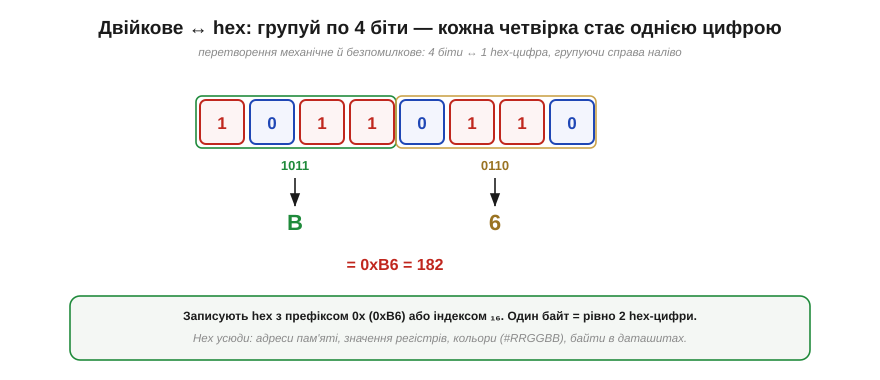
*Рис. 3.4.2.5. Байт 10110110 ділимо на дві четвірки: 1011 і 0110. Перша — це 11, тобто **B**; друга — 6. Разом 0xB6 (= 182, як ми вже рахували). У зворотний бік так само: кожну hex-цифру розкладаємо в чотири біти. Один байт — це **рівно дві** hex-цифри. Записують hex із префіксом **0x** (0xB6) або з індексом ₁₆.*

Ця простота — причина, чому hex усюди в роботі інженера й програміста. **Адреси пам'яті**, **значення регістрів** мікроконтролера, **кольори** на вебсторінці (#RRGGBB — по два hex-знаки на червоний, зелений, синій), **байти** в даташитах — усе записують шістнадцятково, бо це і компактно, і миттєво зводиться до бітів. (Колись із тих самих міркувань уживали ще **вісімкову** систему — base 8, по 3 біти на цифру, — та для 8-бітних байтів зручнішою виявилася саме hex, і вона перемогла.)

> 🔧 **Навіщо це.** Ці навички ви застосовуватимете буквально щодня, тільки-но візьметеся за мікроконтролер. Перше: **читати двійкове** (додати ваги одиниць) і **переводити в нього** (ділити на 2) — базова грамотність; знайте степені двійки до 1024 напам'ять. Друге, найпрактичніше: **hex — ваш робочий запис чисел**. Регістр периферії, адреса, маска бітів, колір — усе це ви бачитимете й писатимете в hex (0x...), і вміння миттєво розкласти hex-цифру в чотири біти (F=1111, A=1010, 0=0000) — щоденний інструмент, коли треба, наприклад, виставити чи перевірити окремий біт у регістрі. Третє: **один байт = дві hex-цифри = 8 бітів** — тримайте цю трійцю в голові, і дані в даташитах та налагоджувачі читатимуться легко. Hex — це не «складніша математика», а навпаки, **милиця для очей**, що економить вам помилки на довгих двійкових рядках.

---

Підсумок §3.4.2: двійкове число читають **позиційно** — сума ваг (степенів двійки) тих розрядів, де стоїть 1 (10110110 = 128+32+16+4+2 = 182). Назад переводять **діленням на 2** з читанням остач знизу вгору (або відніманням степенів двійки). Двійковий запис **задовгий** для людини, тож на практиці вживають **шістнадцяткову** (0–9, A–F): оскільки 16 = 2⁴, одна hex-цифра — це **рівно 4 біти** (півбайт), тож переведення двійкове↔hex зводиться до **групування по чотири** (10110110 = 0xB6). Один байт = дві hex-цифри. Hex усюди: адреси, регістри, кольори, байти. Досі всі наші числа були **додатні**. Та машині треба й **від'ємні** — а мінуса серед 0 і 1 немає. Як же записати «−5» самими бітами? Відповідь напрочуд хитра й красива — **доповняльний код**.

---

## 3.4.3 Від'ємні числа: доповняльний код

Маємо проблему: серед 0 і 1 немає знака «мінус». А машині конче потрібні **від'ємні** числа — без них ні відняти, ні полічити «нижче нуля». Як же закодувати −5 самими бітами? Цей підрозділ — про відповідь, яку інженерія шукала кілька спроб і нарешті знайшла геніальну: **доповняльний код** (*two's complement*). Він не лише вміщає від'ємні числа в біти без жодного спеціального «знака», а й робить щось майже чарівне — перетворює **віднімання на додавання**, тож той самий суматор із §3.2.6 обслуговує і плюс, і мінус. Це одна з найкрасивіших ідей усього курсу.

### Де взяти мінус? Наївний спосіб і його біди

Найперша думка проста: віддамо **старший біт** під знак. 0 угорі — число додатне, 1 — від'ємне; решта бітів — звичайна величина. Це **знак-величина** (*sign-magnitude*).

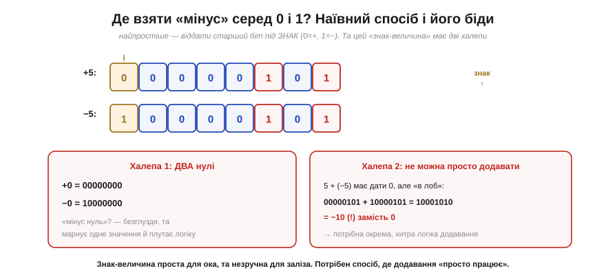
*Рис. 3.4.3.1. У знак-величині +5 = 00000101, а −5 = 10000101 (той самий «5», лише старший біт-знак піднято). Зрозуміло й людяно — та з двома халепами. **Перша**: виходить аж **два нулі** — +0 (00000000) і −0 (10000000); «мінус нуль» безглуздий, марнує значення й плутає схеми. **Друга**, гірша: не можна **просто додати**. 5 + (−5) мало б дати 0, але побітове додавання дає 10001010 = −10 — повну нісенітницю. Тобто арифметика потребує окремої, хитрої логіки.*

Знак-величина гарна для ока, та незручна для заліза: два нулі й потреба в спеціальному «знаковому» суматорі. (Був і проміжний винахід — **обернений код**, де від'ємне дістають інверсією всіх бітів; він теж мав два нулі й вимагав «закільцьованого переносу».) Інженери шукали спосіб, де **звичайне додавання просто працювало б** — і знайшли.

### Доповняльний код: інвертувати й додати 1

Рецепт доповняльного коду до смішного простий. Щоб дістати **−N**, треба взяти двійковий запис N, **перевернути всі біти** (інверсія) і **додати 1**.

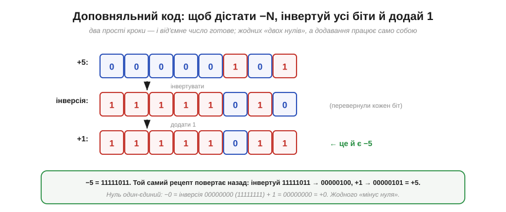
*Рис. 3.4.3.2. Як дістати −5 із +5. Беремо 00000101, інвертуємо кожен біт → 11111010, додаємо 1 → 11111011. Оце й є −5 у доповняльному коді. Той самий рецепт повертає назад: інвертуй 11111011 → 00000100, +1 → 00000101 = +5. І — головне — нуль тепер **один-єдиний**: інверсія 00000000 дає 11111111, +1 = 00000000 (перенос за межу байта викидаємо). Жодного «мінус нуля».*

**Приклад (туди й назад).** Закодуймо −5 і перевірмо, що рецепт оборотний.

```
+5:        00000101
інверсія:  11111010
+1:        11111011   ← це −5

назад:     інверсія(11111011) = 00000100,  +1 = 00000101 = +5  ✓
```

Просто й чисто. Але чому цей дивний рецепт «інвертувати й додати 1» дає саме від'ємне число — і чому з ним так гарно працює арифметика? Щоб це осягнути, найкраще уявити числа **на колі**.

### Чому це працює: коло чисел (одометр)

Доповняльний код стає очевидним, якщо згадати **одометр** автомобіля чи коло годинника. Числа в розрядній сітці не лежать на нескінченній прямій — вони **замкнені в коло**: дійшовши до максимуму, лічба «перевалює» назад у нуль (як 999999 → 000000 на одометрі). Доповняльний код просто домовляється, що **верхню половину** цього кола ми читаємо як **від'ємні** числа.

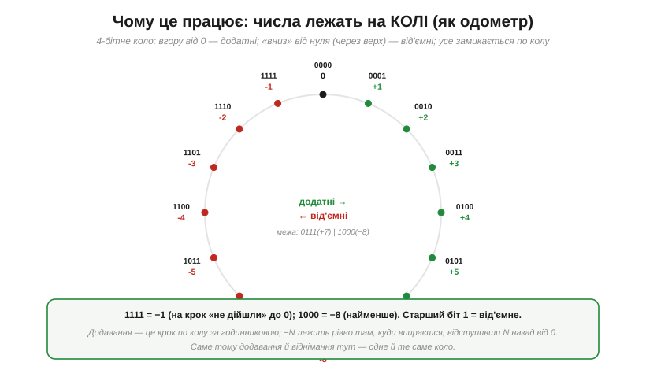
*Рис. 3.4.3.3. 4-бітне коло (16 значень). Від нуля вгору йдуть додатні: 0, 1, …, 7 (0111). А далі, замість «8», коло перевалює — і ми читаємо верхню половину як від'ємні: 1000 = −8 (найменше), 1001 = −7, …, 1111 = **−1** (рівно «на крок не дійшли» до нуля). Тобто **−N лежить там, куди впираєшся, відступивши N назад від нуля** по колу. Старший біт 1 завжди означає «ми у від'ємній половині».*

Тепер видно красу. «Відступити на N назад» по колу — це те саме, що «пройти вперед на (розмір кола − N)». Тому −5 у 8-бітному колі (256 значень) — це позиція 256 − 5 = 251 = 11111011. А оскільки додавання — це просто **крок уперед** по колу, додати −5 = додати 251, і коло саме «довертає» результат куди треба. Ось чому інвертувати-й-додати-1 працює: воно обчислює рівно 2ⁿ − N, тобто потрібну позицію на колі.

### Магія: віднімання — це додавання

А тепер — нагорода за всю цю хитрість, заради якої доповняльний код і переміг. **Віднімання перетворюється на додавання.** Щоб порахувати A − B, не потрібен жоден «віднімач»: достатньо додати A й **доповняльний код** від B.

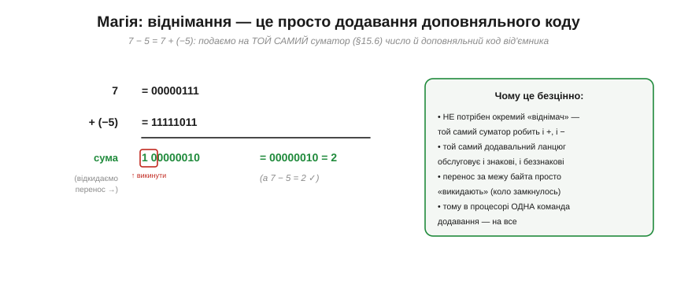
*Рис. 3.4.3.4. Порахуймо 7 − 5 як 7 + (−5). Беремо 7 = 00000111 і −5 = 11111011, подаємо на звичайний суматор (§3.2.6) і додаємо. Виходить 1 00000010 — дев'ятий, «зайвий» біт переносу просто **викидаємо** (коло замкнулось), і лишається 00000010 = 2. А 7 − 5 справді 2. Жодної окремої схеми віднімання — той самий суматор.*

**Приклад (віднімання додаванням).** Обчислімо 7 − 5 у доповняльному коді.

```
  00000111   (7)
+ 11111011   (−5)
-----------
1 00000010   ← перенос за байт відкидаємо
= 00000010 = 2     (а 7 − 5 = 2  ✓)
```

Осягніть, наскільки це потужно. У §3.2.6 ми збудували **суматор** — і виявляється, що цей **самий** суматор уміє й віднімати, варто лише подати від'ємник у доповняльному коді. Не треба окремого «віднімача», не треба окремої логіки для знакових чисел — **одна** додавальна схема обслуговує і плюс, і мінус, і знакові, і беззнакові числа (бо біти додаються однаково, різниться лише тлумачення результату — згадайте §3.4.1!). Саме тому в процесорі є **одна** команда додавання на все, а не зоопарк окремих операцій. Доповняльний код — це не просто «спосіб записати мінус», це спосіб **зекономити пів арифметики** заліза.

### Діапазон і як читати

Лишилося два практичні питання: який діапазон чисел уміщає знаковий байт і як швидко прочитати від'ємне.

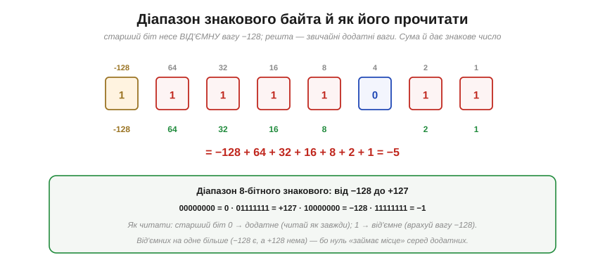
*Рис. 3.4.3.5. Найшвидший спосіб читати доповняльний код: вважати, що **старший біт має від'ємну вагу** (−128 для байта), а решта — звичайні додатні. Тоді 11111011 = −128 + 64 + 32 + 16 + 8 + 2 + 1 = −5. Діапазон 8-бітного знакового — від **−128 до +127**: від'ємних на одне більше, бо нуль «займає місце» серед додатних. Правило читання: старший біт 0 → число додатне (читай як завжди); 1 → від'ємне (врахуй вагу −128).*

Запам'ятайте діапазон знакового байта: **−128…+127** (а беззнакового — 0…255). Для 16 бітів — це −32768…+32767, для 32 — приблизно ±2 мільярди. І зверніть увагу на маленьку асиметрію: від'ємних значень на одне більше, ніж додатних (−128 є, а +128 нема), бо нуль єдиний і «рахується» з додатного боку. Ця дрібниця інколи кусає: спроба взяти `−(−128)` у 8 бітах не має куди дітися (бо +128 не існує) — і призводить до переповнення, про яке наступний підрозділ.

> 🔧 **Навіщо це.** Доповняльний код — це **стандарт** представлення цілих чисел у геть усіх процесорах, тож ви матимете з ним справу постійно, навіть не замислюючись. Винесіть головне. Перше: **−N = інвертувати всі біти й додати 1**; цей рецепт оборотний і дає єдиний нуль. Друге, найважливіше практично: **той самий суматор віднімає** — тому в процесора одна команда додавання, і ті самі біти обслуговують знакові й беззнакові числа; різниця лише в **тлумаченні** (§3.4.1). Третє: знайте **діапазони** — 8-бітний знаковий це −128…+127, беззнаковий 0…255; коли ви оголошуєте змінну `int8_t` чи `uint8_t`, ви буквально обираєте, читати старший біт як знак чи як вагу 128. І класична пастка, до якої ми переходимо: якщо результат **вилазить** за діапазон, коло «перевалює» — і додатне раптом стає від'ємним. Це **переповнення**, і саме воно — джерело найкласичніших числових багів.

---

Підсумок §3.4.3: щоб уписати від'ємні числа в біти, наївний **знак-величина** (старший біт — знак) не годиться — два нулі й незручне додавання. Перемогою став **доповняльний код**: −N дістають, **інвертувавши всі біти й додавши 1**. Він має **єдиний** нуль, а числа лежать на **колі** (одометр), де верхня половина читається як від'ємні (−N стоїть на позиції 2ⁿ − N). Головна нагорода — **віднімання стає додаванням**: A − B = A + (−B) на тому самому суматорі (§3.2.6), тож одна додавальна схема обслуговує і плюс, і мінус, і знакові, і беззнакові числа. Старший біт має **від'ємну вагу** (−128 для байта), діапазон знакового байта — **−128…+127**. А якщо результат вилазить за цей діапазон, коло «перевалює» й число псується — це **переповнення**, наш наступний сюжет і джерело класичних багів.

---

## 3.4.4 Переповнення (wrap-around; класичний баг)

Розрядна сітка скінченна: у 8 бітів влазить лише 256 значень, у 32 — близько чотирьох мільярдів. А що, як результат обчислення **вилізе** за ці межі? Тоді стається **переповнення** (*overflow*): число «перевалює» по колу (§3.4.3), і машина **тихо** видає неправильну відповідь. Без помилки, без зупинки — просто інше число. Це один із найпідступніших і найзнаменитіших багів в історії техніки, що коштував ракет, рекордів і нервів, і про який кожен інженер мусить пам'ятати. Розберімо, як він стається, як його помітити й як із ним жити.

### Беззнакове переповнення: 255 + 1 = 0

Найпростіший випадок. Беззнаковий байт тримає 0…255. Що буде, якщо до 255 додати 1?

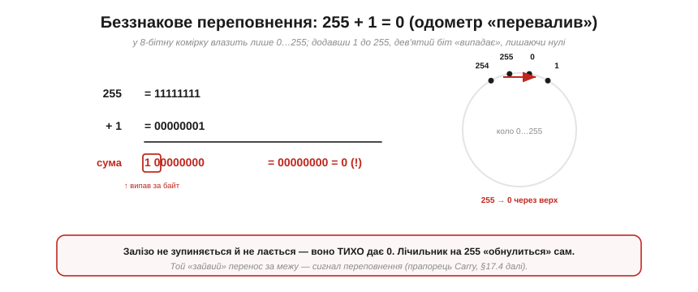
*Рис. 3.4.4.1. 255 = 11111111. Додаємо 1 — і результат 100000000 уже **дев'ятибітний**, але в байт влазить лише вісім молодших бітів: 00000000 = **0**. Дев'ятий, «зайвий» біт переносу просто випадає за межу. Це як одометр авто, що з 999999 «перевалює» на 000000: число пройшло повне коло й повернулося в нуль. Лічильник, що дійшов до 255, на наступному кроці **сам обнулиться**.*

Найважливіше тут — **тиша**. Залізо не зупиняється, не сигналить про помилку: воно слухняно дає 0, ніби так і треба. Якщо програміст не передбачив межі, лічильник «перескочить» через нуль, і подальша логіка працюватиме з безглуздим значенням, навіть не здогадуючись про це.

### Знакове переповнення: +127 + 1 = −128

А це — **найпідступніший** різновид, бо порушує саму інтуїцію арифметики. Знаковий байт тримає −128…+127. Додамо 1 до найбільшого додатного, +127.

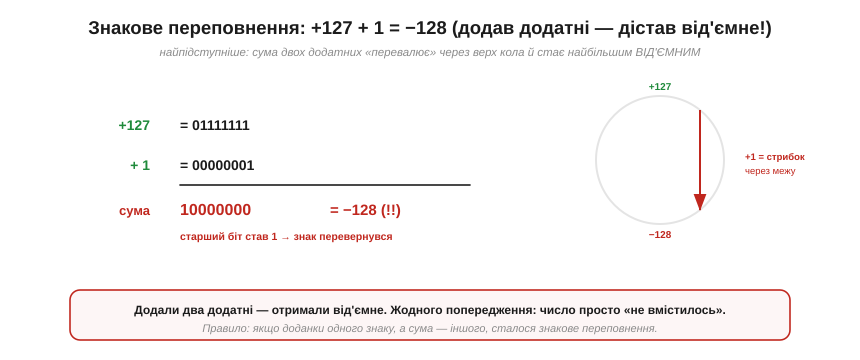
*Рис. 3.4.4.2. +127 = 01111111. Додаємо 1 — старший біт перекидається в 1, виходить 10000000, а це в доповняльному коді (§3.4.3) дорівнює **−128**. Тобто додавши **два додатні** числа, ми дістали **від'ємне**! На колі чисел сума «перевалила» через верхню межу (+127) прямо в найбільше від'ємне (−128). Жодного попередження — просто знак раптом перевернувся.*

Уявіть здивування програміста: він додає дві додатні величини й отримує від'ємну. Правило, за яким це впізнають: якщо **доданки одного знаку**, а **сума — іншого**, сталося знакове переповнення. Саме цей різновид стоїть за багатьма катастрофами, бо «температура раптом стала −128 замість +128» чи «баланс став від'ємним» — це не завжди помилка давача, інколи це переповнення.

### Як це помітити: прапорці C і V

Невже машина зовсім не знає про переповнення? Знає — і навіть **позначає** його. Після кожного додавання АЛП (§3.2.7) виставляє два спеціальні **прапорці** (згадайте регістр прапорців із §3.3.5).

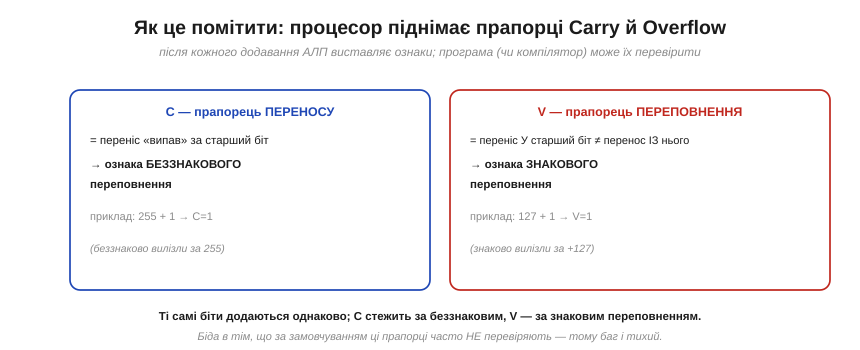
*Рис. 3.4.4.3. **Прапорець переносу C** (*Carry*) піднімається, коли переніс «випав» за старший біт, — це ознака **беззнакового** переповнення (255 + 1 → C=1). **Прапорець переповнення V** (*oVerflow*) піднімається, коли переніс **у** старший біт не дорівнює переносу **з** нього, — це ознака **знакового** переповнення (127 + 1 → V=1). Ті самі біти додаються однаково; різні прапорці стежать за двома способами тлумачення.*

Ось у чім корінь біди: прапорці **є**, та за замовчуванням більшість програм їх **не перевіряє**. Процесор чесно підняв V, але якщо ніхто не глянув — баг лишається тихим. Ось чому переповнення таке підступне: інформація про нього доступна, але потребує свідомої уваги, якої часто бракує. (Деякі мови й компілятори вміють перевіряти переповнення автоматично, та в «голому» C на мікроконтролері це здебільшого ваша турбота.)

### Залізо проти мови: «тиха перевалка» — ще не вся правда

Тут конче потрібне уточнення, бо саме воно рятує від найхитріших багів у C/C++. Усе, що ми досі описували — «число тихо перевалює по колу» — це поведінка **заліза**: двійковий суматор у доповняльному коді (§3.4.3) справді просто відкидає зайвий біт. Та на рівні **мови програмування** не все так однозначно, і два випадки треба чітко розрізняти.

Для **беззнакових** типів стандарт C/C++ цю поведінку **гарантує**: переповнення визначене як арифметика **за модулем 2ᴺ**. `255u + 1` у 8-бітному — це за стандартом рівно 0, і на це можна свідомо покладатися (таймери, хеші, кільцеві лічильники).

А ось **знакове** переповнення в C/C++ — це **невизначена поведінка** (*undefined behavior*, UB): стандарт не обіцяє **нічого**, і компілятор має право **припускати, що його взагалі не буває**. Наслідок підступний: оптимізатор може цілком викинути вашу ж перевірку `if (x + 1 < x)` (мовляв, «знакове не переповнюється, отже умова завжди хибна»), і програма поведеться зовсім не так, як підказує картинка «перевалювання по колу». Тому практичне правило: на знакове переповнення **не покладайтеся ніколи** — уникайте його ширшим типом або перевіркою **до** операції; а свідомий wrap робіть на **беззнакових** типах, де він визначений. (На рівні самих бітів обидва, звісно, перевалюють однаково — UB живе в **мові**, а не в залізі.)

### Славетні катастрофи переповнення

Щоб ви назавжди запам'ятали, наскільки це серйозно, — кілька **справжніх** історій, кожна варта окремої легенди.

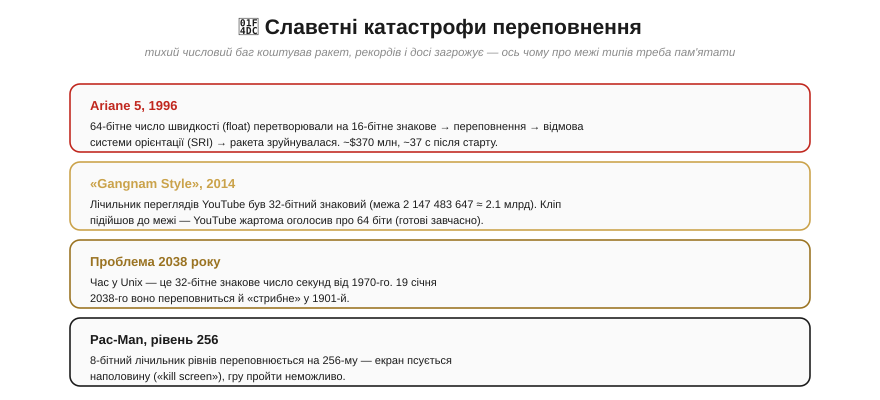
*Рис. 3.4.4.4. Чотири знамениті переповнення. **Ariane 5** (1996): 64-бітне число **з плаваючою комою** (горизонтальна швидкість) перетворювали на 16-бітне знакове ціле, воно переповнилося — програмна помилка зупинила **інерціальну систему орієнтації (SRI)**, обидва резервні блоки вимкнулися, і ракета вартістю близько 370 мільйонів доларів зруйнувалася приблизно за 37 секунд після старту. **«Gangnam Style»** (2014): лічильник переглядів YouTube був 32-бітним знаковим (межа 2 147 483 647 ≈ 2.1 млрд), і кліп до неї підійшов — YouTube із цієї нагоди жартома оголосив про перехід на 64-бітний лічильник (який насправді підготували завчасно). **Проблема 2038 року**: час у Unix — 32-бітне знакове число секунд від 1970-го, і 19 січня 2038-го воно переповниться, «стрибнувши» в 1901-й. **Pac-Man, рівень 256**: 8-бітний лічильник рівнів переповнюється, і екран псується — пройти гру неможливо.*

Кожна з цих історій — урок про одне й те саме: **межі типів реальні**, і коли число до них підходить, наслідки бувають від кумедних (зіпсований екран Pac-Man) до катастрофічних (вибух ракети). Особливо повчальна **Ariane 5**: код, що спричинив вибух, був узятий з попередньої ракети Ariane 4, де ця швидкість фізично **не могла** перевищити 16-бітну межу. На потужнішій Ariane 5 могла — і ніхто не перевірив. Триста сімдесят мільйонів доларів за одне невраховане переповнення.

### Як уникати — і коли wrap корисний

Та не поспішаймо вважати переповнення абсолютним злом. Біда не в самому «перевалюванні», а в тому, що воно **не заплановане**.

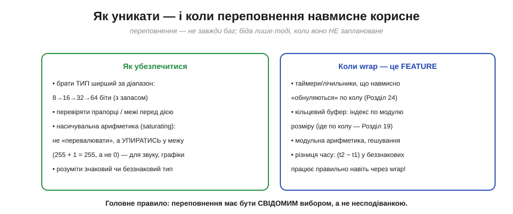
*Рис. 3.4.4.5. **Щоб убезпечитися** (ліворуч): брати тип **ширший** за очікуваний діапазон (8→16→32→64, із запасом); перевіряти межі чи прапорці; де доречно — **насичувальна** арифметика (*saturating*), що не «перевалює», а **впирається** в межу (255 + 1 = 255), як це роблять зі звуком і графікою, щоб не було різких стрибків. **Коли wrap — це фіча** (праворуч): таймери й лічильники, що навмисно йдуть по колу (Розділ 4.6); кільцеві буфери з індексом по модулю (Розділ 3.6); модульна арифметика; і навіть різниця часу (t₂ − t₁) у беззнакових працює **правильно** через переповнення лічильника — поки сам інтервал не перевищує період лічильника.*

Останній приклад вартий уваги, бо показує **красу** wrap-around. Якщо таймер — беззнаковий лічильник, що періодично «обнуляється», то різниця `t2 − t1` (теж у беззнакових) дає правильний інтервал **навіть** коли між замірами лічильник переповнився, — бо беззнакова арифметика на колі (визначена за модулем 2ᴺ) сама «довертає» результат. Важлива умова: це працює, **поки справжній інтервал не довший за період лічильника** — тобто між замірами не сталося більш ніж одне повне переповнення; інакше різниця збреше. (З тієї ж причини типову перевірку `now − start >= interval` пишуть саме як різницю беззнакових, а інтервал тримають у безпечних межах діапазону.) Тобто те саме «перевалювання», що в Ariane 5 знищило ракету, у вимірюванні часу працює нам на користь. Різниця лише в одному: чи **передбачив** його інженер.

> 🔧 **Навіщо це.** Переповнення — це баг, який спіймає кожного, хто працює з числами, тож вакцинуймося від нього заздалегідь. Винесіть головне. Перше: **межі типів реальні й тихі** — 8-бітне переповниться на 256, 16-бітне на 65536, і ніхто вас не попередить; коли оголошуєте змінну, питайте себе «а чи влізе сюди найбільше можливе значення?». Друге: **знакове переповнення перевертає знак** (додав додатні — дістав від'ємне), і це джерело найдивніших багів; якщо лічильник чи сума «раптом стали від'ємними» — підозрюйте переповнення. Третє: рішення прості — **ширший тип** (взяти int32 замість int8, якщо є сумнів), **перевірка меж**, або **насичення** (упертися в межу замість перевалити). Четверте: іноді wrap — **навмисний** (таймери, кільцеві буфери, різниця часу), і це нормально — головне, щоб він був **свідомим вибором**, а не несподіванкою. Пам'ятайте Ariane 5: один невеликий тип, одна неперевірена межа — і 370 мільйонів за 37 секунд.

---

Підсумок §3.4.4: **переповнення** стається, коли результат вилазить за діапазон розрядної сітки, і число **тихо** «перевалює» по колу (§3.4.3). **Беззнакове**: 255 + 1 = 0 (одометр обнуляється; переніс випадає, прапорець **C**). **Знакове**: +127 + 1 = −128 — найпідступніше, бо додавання двох додатних дає від'ємне (прапорець **V**, коли знаки доданків однакові, а суми — інший). Прапорці є, та їх часто не перевіряють — тому баг тихий. Важлива тонкість мови: у C/C++ беззнаковий wrap **визначений** як модуль 2ᴺ (на нього можна покладатися), а знакове переповнення — **невизначена поведінка** (UB), тож на нього розраховувати не можна. Історія знає славетні жертви: Ariane 5 (вибух ракети), «Gangnam Style» (32-бітний лічильник), проблема 2038 року, Pac-Man. Уникають переповнення **ширшими типами**, перевіркою меж і **насичувальною** арифметикою; а інколи wrap навмисний і корисний (таймери, кільцеві буфери, різниця часу) — головне, щоб він був **свідомим**. Досі всі наші числа були **цілі**. Та світ повний **дробів** — температура 23.5°, напруга 3.3 В. Як уписати кому між бітами? Найпростіший спосіб — **фіксована кома**.

---

## 3.4.5 Дробові числа: фіксована кома

Цілі числа — це чудово, та світ повний **дробів**: температура 23.5°, напруга 3.3 В, гучність 0.7. Як уписати кому між нулями й одиницями, якщо в бітах немає ні коми, ні десяткової крапки? Найпростіша й найшвидша відповідь — **фіксована кома** (*fixed-point*): домовитися, що кома стоїть у певному **нерухомому** місці розрядної сітки, а далі працювати зі звичайними цілими числами. Це робочий кінь дробової арифметики на мікроконтролерах, і працює він напрочуд просто — через **масштабування**.

### Двійкова кома: дробові розряди

Почнімо з того, як узагалі виглядає дріб у двійковій. Позиційність (§3.4.2) працює й праворуч від коми — лише ваги стають **від'ємними** степенями двійки: 2⁻¹ = ½ = 0.5, 2⁻² = ¼ = 0.25, 2⁻³ = ⅛ = 0.125…


*Рис. 3.4.5.1. Ліворуч від коми — звичні цілі ваги (8, 4, 2, 1), праворуч — дробові (0.5, 0.25, 0.125). Читають так само: беруть розряди з одиницею й додають їхні ваги. 1011.011 = 8 + 2 + 1 + 0.25 + 0.125 = 11.375. Жодної нової математики — та сама позиційність, лише з від'ємними степенями.*

Усе б добре, та є заковика: **апаратура коми не бачить**. У регістрі лежать просто біти, без жодної позначки, де там кома. Де ж вона тоді живе?

### Хитрість — масштабування

Відповідь елегантна: кома живе **у вашій голові** (точніше, у домовленості), а в залізі лежить **ціле число**. Фокус зветься **масштабування**: щоб зберегти дробове значення, його **множать** на масштаб (степінь двійки) і зберігають результат як звичайне ціле; а читаючи — ділять назад.

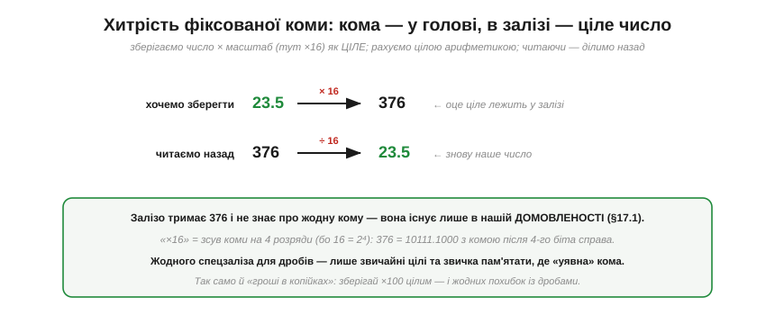
*Рис. 3.4.5.2. Хочемо зберегти 23.5 з чотирма дробовими бітами. Множимо на 16 (=2⁴) → 376, і саме це **ціле** число лежить у залізі. Читаючи назад, ділимо на 16 → знову 23.5. Залізо тримає 376 і нічого не знає про кому — вона існує лише в нашій **домовленості** (згадайте §3.4.1: біти не мають вродженого сенсу!). «×16» — це просто зсув уявної коми на 4 розряди.*

**Приклад (прочитати фіксовану кому).** Маємо ціле 376, домовлено про масштаб 16 (4 дробові біти). Яке це дробове число?

```
376 ÷ 16 = 23.5
перевірка через біти:  376 = 101111000,  кома після 4-го біта справа:
   10111.1000 = (16+4+2+1) + 0.5 = 23.5  ✓
```

Уся принада в тому, що **жодного спеціального заліза для дробів не треба** — лише звичайні цілі числа й звичка пам'ятати масштаб. Точнісінько так роблять із **грошима**: зберігають суму в **копійках** (тобто ×100) цілим числом, щоб уникнути похибок дробових обчислень. Копійки — це фіксована кома з масштабом 100.

### Запис Qm.n

Щоб не плутатися, де стоїть кома, домовленість записують форматом **Qm.n**: **m** бітів на цілу частину, **n** бітів на дробову. Одне застереження, через яке часто плутаються: існують **дві конвенції** щодо знакового біта — він або **входить** у m, або рахується окремо понад нього. У наших прикладах (як Q8.8 нижче) знак **включено** в m, тож Q8.8 — це знакове 16-бітне ціле з діапазоном −128…+127.99; та читаючи чужий код, завжди уточнюйте, яку конвенцію там мали на увазі.

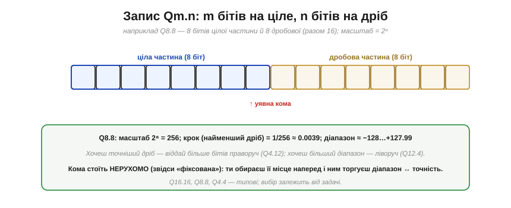
*Рис. 3.4.5.3. Формат Q8.8 у 16-бітному слові: 8 бітів ліворуч від (уявної) коми — ціла частина, 8 праворуч — дробова. Масштаб = 2ⁿ = 2⁸ = 256, тож найменший крок (роздільність) = 1/256 ≈ 0.0039, а діапазон ≈ −128…+127.99. Хочеш точніший дріб — віддай більше бітів праворуч (Q4.12); хочеш більший діапазон — ліворуч (Q12.4).*

Назва «**фіксована** кома» тепер очевидна: кома стоїть **нерухомо**, у наперед обраному місці. І саме звідси випливає головний компроміс: ділячи фіксовану кількість бітів між цілою й дробовою частинами, ви **вимінюєте діапазон на точність**. Більше дробових бітів — точніший дріб, але менший діапазон; більше цілих — навпаки. Вибрати треба **заздалегідь**, під свою задачу (типові формати — Q16.16, Q8.8, Q4.4).

### Арифметика: додавання просто, множення зі зсувом

А тепер найприємніше — як рахувати з фіксованою комою. Здебільшого це **звичайна ціла** арифметика, бо ж у залізі лежать цілі.

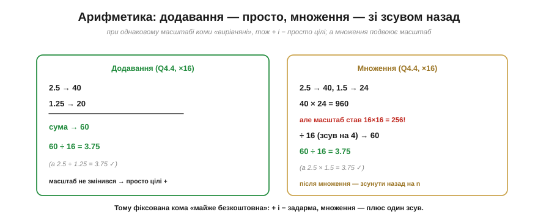
*Рис. 3.4.5.4. **Додавання** (і віднімання) за однакового масштабу — задарма: коми «вирівняні», тож просто додаємо цілі (2.5+1.25 → 40+20=60 → ÷16 = 3.75). **Множення** хитріше: добуток двох масштабованих чисел має масштаб **удвічі** більший (16×16=256), тож після множення треба **зсунути назад** на n бітів (2.5×1.5 → 40×24=960 → ÷16 = 60 → ÷16 = 3.75).*

**Приклад (множення з фіксованою комою).** Помножимо 2.5 на 1.5 у форматі Q4.4 (масштаб 16).

```
2.5 → 40,   1.5 → 24
40 × 24 = 960          ← але це вже масштаб 16·16 = 256!
960 ÷ 16 = 60          ← зсунули назад на 4 біти → знову масштаб 16
60 ÷ 16 = 3.75         ← читаємо результат   (а 2.5 × 1.5 = 3.75 ✓)
```

Ось чому фіксована кома така приваблива для слабкого заліза: додавання й віднімання — це просто цілі операції, а множення — звичайне ціле множення **плюс зсув** назад на n бітів. Тут варто пам'ятати про три дрібниці, щоб не нарватися на баг: проміжний добуток має **подвоєну** розрядність (Q4.4 × Q4.4 дає масштаб 256), тож беруть **ширший** тип, аби той добуток не переповнився; зсув назад **відкидає** молодші біти — це усічення, тож для точності інколи додають округлення; а в знаковому випадку — арифметичний зсув. Та головне лишається: жодних дорогих апаратних блоків дробів, усе на тих самих суматорах і зсувачах, що ми вже маємо (Розділи 3.2, 3.3).

### Плюси, мінуси й де вживають

Зведімо баланс.

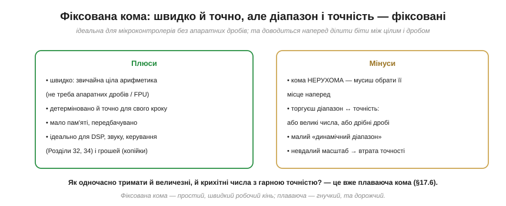
*Рис. 3.4.5.5. **Плюси**: швидко (звичайна ціла арифметика, не треба апаратних дробів), точно й детерміновано для свого кроку, мало пам'яті — ідеально для **цифрової обробки сигналів**, звуку, керування (Розділи 5.6, 5.8) і грошей. **Мінуси**: кома **нерухома**, тож діапазон і точність обирають наперед, міняючи одне на одне; малий «динамічний діапазон» — важко одночасно тримати й величезні, й крихітні числа.*

Саме цей останній мінус — **малий динамічний діапазон** — і є межа фіксованої коми. Якщо у вашій задачі трапляються і мільйони, і тисячні частки одночасно, жодне фіксоване місце коми не догодить обом. Як же тримати і дуже великі, і дуже малі числа з пристойною точністю? Відповідь — дати комі **плавати**, і це наступний, найскладніший і найпідступніший спосіб — **плаваюча кома**.

> 🔧 **Навіщо це.** Фіксована кома — ваш перший вибір для дробів на мікроконтролері, особливо без апаратного блоку дробових чисел (FPU). Винесіть головне. Перше: дріб зберігають як **ціле × масштаб** (наприклад, температуру в сотих градуса — ×100, як ціле); кома живе в **домовленості**, не в залізі. Друге: **додавання й віднімання — звичайні цілі** (швидко!), а після **множення** треба **зсунути** результат назад на n бітів — не забути цей зсув, бо інакше число «розпухне» в масштабі. Третє: ви **наперед** вимінюєте діапазон на точність (Q8.8, Q4.12…), тож прикиньте, які числа очікуєте, перш ніж обрати формат. Четверте, дуже практичне: для **грошей** і будь-де, де важлива точність дробів, фіксована кома (цілі копійки/міліметри/міліградуси) надійніша за плаваючу — без хитрих похибок округлення. Коли в Модулі 5 ви робитимете фільтри й керування на ESP32, фіксована кома часто буде швидшим і точнішим вибором, ніж float.

---

Підсумок §3.4.5: **фіксована кома** дає дробові числа найпростішим способом — через **масштабування**: значення множать на масштаб (степінь двійки) і зберігають як **ціле**, а кому тримають у **домовленості** (формат **Qm.n**: m цілих бітів, n дробових; масштаб 2ⁿ). Дробові розряди мають ваги ½, ¼, ⅛… Арифметика майже задарма: **додавання й віднімання** — звичайні цілі, **множення** — плюс один **зсув** назад на n бітів. Плюси — швидкість, точність, малі ресурси (ідеально для МК без FPU, для DSP, керування, грошей); мінус — кома **нерухома**, тож діапазон і точність обирають наперед, і динамічний діапазон малий. Коли треба тримати водночас і величезні, і крихітні числа з гарною точністю, фіксованої коми не вистачає — і тоді комі дають **плавати**. Це наймогутніший, та й найпідступніший спосіб, з власними пастками точності.

---

## 3.4.6 Плаваюча кома (точність/діапазон; чому float підступний)

Фіксована кома (§3.4.5) мала ваду: кома стоїть нерухомо, тож одночасно тримати й величезні, й крихітні числа неможливо. Розв'язок — дати комі **плавати**, як у науковій нотації: записувати число як «значущі цифри × степінь». Це **плаваюча кома** (*floating-point*, у народі **float**) — формат, на якому стоїть уся наукова й інженерна арифметика комп'ютерів. Він дає неймовірний **діапазон**, та за це бере дорогу плату: float **підступний**, повний неочевидних пасток точності, об які спіткнувся кожен програміст. Розберімо і його силу, і його підводні камені.

> 📜 **Дотична історія:** [Вільям Кехен і стандарт IEEE 754](ch17-s6-history-ieee754.md). До 1985 року кожен виробник робив плаваючу кому по-своєму, і та сама програма на різних машинах давала різні відповіді — хаос. Як один упертий математик навів лад і за що отримав премію Тюрінга — окремо. А тут — про сам формат.

### Як наукова нотація: кома пливе

Згадайте, як записують дуже великі чи малі числа в науці: 6.022 × 10²³ (число Авогадро) або 1.6 × 10⁻¹⁹ (заряд електрона). Тут два шматки: **мантиса** (значущі цифри, 6.022) і **порядок** (степінь, 23). Порядок каже, **куди** посунути кому, тож вона «пливе» куди завгодно.

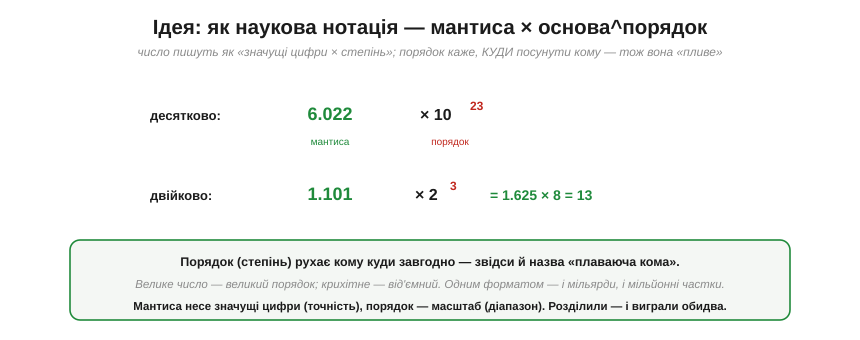
*Рис. 3.4.6.1. Та сама ідея у двійковій: число = **мантиса × 2^порядок**. Наприклад, 1.101 × 2³ = 1.625 × 8 = 13. **Порядок** рухає кому (велике число — великий порядок, крихітне — від'ємний), а **мантиса** несе значущі цифри. Розділивши «масштаб» (порядок) і «точність» (мантиса), float виграє обидва: одним форматом тримає і мільярди, і мільйонні частки.*

Це ключова ідея: замість фіксувати кому, ми **окремо** зберігаємо, де вона, — у порядку. Тому й «плаваюча»: кома пливе туди, куди вкаже порядок.

### Формат IEEE 754: знак, порядок, мантиса

Як саме розкласти ці шматки по бітах, домовляється всесвітній стандарт **IEEE 754**. Найпоширеніший формат — **одинарна точність** (*single*, **float32**), 32 біти, поділені на три поля.


*Рис. 3.4.6.2. **Знак** (1 біт): + чи −. **Порядок** (8 бітів): куди пливе кома (зберігається зі зсувом 127). **Мантиса** (23 біти): значущі цифри. Значення = (−1)ˢ × 1.мантиса × 2^(порядок−127) — для **нормальних** (звичайних скінченних) чисел. Хитрість: старша одиниця мантиси «мається на увазі» (число завжди 1.xxxx), тож дістаємо даровий зайвий біт точності. (Правило діє не завжди: для нуля, дуже малих **денормалей**, ±∞ і NaN поле порядку має крайні значення й тлумачиться окремо — про них наприкінці підрозділу.) Підсумок: float32 дає ≈ 7 значущих десяткових цифр; **подвійна точність** (float64, 1+11+52 = 64 біти) — ≈ 16 цифр.*

Той самий формат IEEE 754 живе в кожному ПК, телефоні й у вашому ESP32 — тому той самий набір бітів означає **те саме число** скрізь (на відміну від хаосу до 1985-го, про який історія поряд). Застережімо лише: однаковий **формат** ще не гарантує, що складний вираз дасть **біт-у-біт** однаковий результат на різних машинах, — на це впливають FMA (злите множення-додавання), ширша проміжна точність, режим округлення чи «швидка математика» компілятора; залізно тотожні тільки сам формат і коректно округлені базові операції. 23 біти мантиси й 8 порядку — це і є той компроміс, що дає float його силу й слабкість водночас.

### Виграш: величезний динамічний діапазон

Сила float — у **діапазоні**. Завдяки тому, що порядок рухає кому на десятки розрядів, float32 покриває приголомшливий розмах величин.

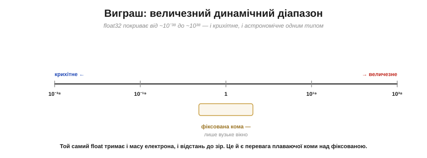
*Рис. 3.4.6.3. float32 тримає числа від ~10⁻³⁸ до ~10³⁸ — і масу електрона, і відстань до зір, одним типом. Фіксована кома (§3.4.5) на тлі цього — лише вузеньке віконце посередині. Оце «і крихітне, і астрономічне в одному форматі» — головна перевага плаваючої коми, заради якої її й терплять попри всі підступи.*

Якщо ваша задача має непередбачуваний або широкий розмах величин (наукові обчислення, фізика, графіка), float — природний вибір: не треба заздалегідь гадати про масштаб, як у фіксованій комі. Та щойно ви покладетеся на його **точність**, починаються сюрпризи.

### Чому float підступний

А тепер — найважливіше, заради чого варто запам'ятати цей підрозділ. Float **оманливий**: він виглядає як «справжні» дробові числа, але поводиться інакше, і це джерело найкласичніших, найважче вловних багів.

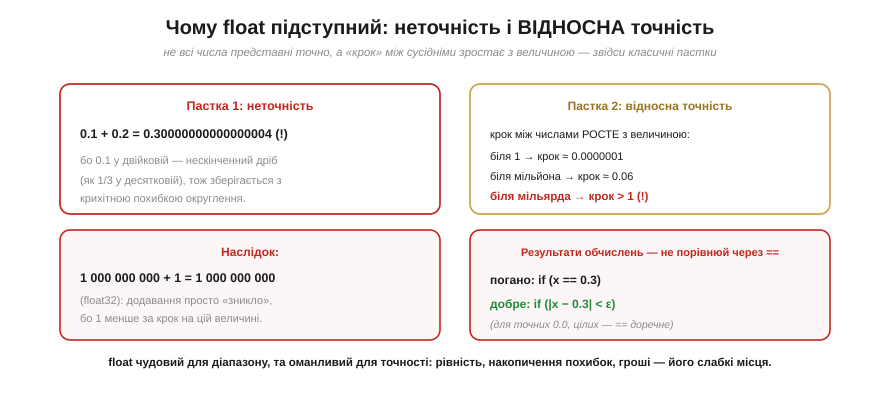
*Рис. 3.4.6.4. **Пастка 1 — неточність**: 0.1 + 0.2 у float дає не 0.3, а 0.30000000000000004, бо 0.1 у двійковій — **нескінченний** дріб (як 1/3 у десятковій), що зберігається з крихітною похибкою. **Пастка 2 — відносна точність**: «крок» між сусідніми float-числами **росте** з величиною (біля 1 ≈ 0.0000001, біля мільйона ≈ 0.06, біля мільярда вже > 1!). Наслідок: 1 000 000 000 + 1 = 1 000 000 000 (float32) — додавання просто «зникає». І звідси правило: **не порівнюй результати обчислень через ==**; перевіряй |x − 0.3| < ε (малий допуск). (== лишається доречним для точних значень — 0.0, цілих у межах точності, спеціальних sentinel-констант.)*

Осягніть ці пастки, бо вони ловлять усіх. **Не всі числа точні**: навіть «кругле» 0.1 не вписується точно у двійковий float, тож сума 0.1+0.2 трохи «промахується». **Точність відносна**: float гарантує не фіксований крок, а ~7 значущих цифр — тож що більше число, то грубіший крок, і маленький доданок до великого числа може просто **зникнути**. **Рівність зрадлива**: через ці похибки `if (x == 0.3)` для **обчисленого** x майже завжди хибне — результати обчислень порівнюють із допуском. (Натомість для **точних** значень — 0.0, цілих у безпечному діапазоні, спеціальних «сигнальних» констант — `==` цілком доречне.) А ще похибки **накопичуються**: підсумовуючи мільйон float-чисел, можна назбирати помітну помилку. Саме тому для **грошей** float — погана ідея (§3.4.5: краще цілі копійки).

### Особливі значення й ціна

Наостанок — дві практичні речі. По-перше, float уміє те, чого не вміють цілі: **особливі значення**. По-друге, він недешевий.


*Рис. 3.4.6.5. **Особливі значення**: **±∞** (переповнення чи ділення на 0), **NaN** («не число»: 0/0, корінь з від'ємного — і воно «заразне», бо будь-яка операція з NaN дає NaN), ±0, денормалі. **Ціна**: арифметика float складна (вирівняти порядки, нормалізувати, округлити), тож без апаратного **блоку дробових чисел** (*FPU*) її **емулюють програмою** — десятки тактів на операцію. ESP32 має FPU (одинарної точності), а дрібні 8-бітні МК — ні, тому на них float буває в рази повільніший за фіксовану кому.*

NaN вартий окремої уваги: він **заразний**, бо будь-яка арифметика з NaN дає знову NaN, тож одна помилкова операція може «отруїти» весь подальший розрахунок, поширившись по програмі. А ціна обчислень — причина, чому на мікроконтролерах float не завжди найкращий вибір: де треба швидко й точно (фільтри, керування), фіксована кома часто виграє.

> 🔧 **Навіщо це.** Float — зручний, та з ним треба бути насторожі, особливо на мікроконтролері. Винесіть головне. Перше: float дає **гігантський діапазон** (і крихітне, і величезне), але **відносну** точність (~7 цифр для float32), а не фіксований крок — тому великі й малі числа разом рахуються погано. Друге, найважливіше: **не порівнюйте результати обчислень через `==`** — використовуйте допуск `|a−b| < ε`; і не сподівайтеся, що 0.1+0.2 дасть рівно 0.3 (а от для точних значень — 0.0, цілих у межах точності, sentinel-ів — `==` доречне). Третє: для **грошей** і точних дробів беріть цілі (копійки, §3.4.5), а не float. Четверте: на МК float **дорогий** — ESP32 має FPU (тож одинарна точність швидка), а дрібні чипи без FPU емулюють його повільно, і там фіксована кома часто краща. Правило просте: **float — для зручності й діапазону, фіксована кома — для швидкості, точності й контролю**.

---

Підсумок §3.4.6: **плаваюча кома** — це наукова нотація у двійковій: число = мантиса × 2^порядок, де **порядок** рухає кому (звідси «плаваюча»). Формат **IEEE 754** (float32: 1 знак + 8 порядок + 23 мантиса; float64: 1+11+52) дає **величезний динамічний діапазон** (~10⁻³⁸…10³⁸) — головну перевагу над фіксованою комою. Платою є **підступність**: не всі числа точні (0.1+0.2 ≠ 0.3), точність **відносна** (крок росте з величиною, малий доданок до великого зникає), тож **результати** float-обчислень порівнюють не через `==`, а з допуском (хоча для точних значень — 0.0, цілих — `==` доречне), а похибки накопичуються. float має й особливі значення (±∞, заразний NaN), а арифметика його **дорога** — без FPU повільна. На МК: float для діапазону й зручності, фіксована кома — для швидкості й точності. Перш ніж читати про сам стандарт IEEE 754 (історія поряд), завершімо розділ найнижчим рівнем — як біти **групуються** в байти й слова та в якому **порядку** лежать у пам'яті.

---

## 3.4.7 Біти, байти, слова й порядок байтів (endianness)

Весь розділ ми перетворювали біти на **числа** — додатні, від'ємні, дробові, величезні. Лишилося замкнути коло найприземленішим, але напрочуд практичним питанням: як саме біти **групуються** в ті одиниці, якими ми оперуємо щодня (байт, слово), і — найпідступніше — у якому **порядку** окремі байти багатобайтового числа лежать у пам'яті. Останнє зветься **порядком байтів**, або **endianness**, і саме воно стоїть за цілим класом багів «байти прийшли задом наперед», коли дані переходять з машини на машину, з файлу в програму, з давача в мікроконтролер. А ще це природний місток до наступних розділів: у Розділі 3.5 (процесор) і Розділі 3.6 (пам'ять) байти житимуть за **адресами** — і тут ми вперше глянемо, як вони там укладаються.

### Сходинки групування: біт, півбайт, байт, слово

Почнімо з ієрархії одиниць. Біти не плавають поодинці — вони збираються в усе більші «порції», у кожної з яких є власна назва й роль.


*Рис. 3.4.7.1. **Біт** (*bit*) — один двійковий розряд, одне з двох значень (0/1), найменша одиниця інформації (слово запропонував Дж. Тьюкі, у науку ввів Шеннон — Розділ 3.1). **Півбайт** (*nibble*) — 4 біти; оскільки 16 = 2⁴, він точно відповідає **одній hex-цифрі** (§3.4.2). **Байт** (*byte*) — 8 бітів, 256 значень, дві hex-цифри; це **стандартна порція**, якою міряють пам'ять. **Слово** (*word*) — найбільша, **машинно-залежна** одиниця: стільки бітів, скільки процесор обробляє за один раз (16, 32 чи 64).*

Зверніть увагу на дві позначки над байтом: **MSB** і **LSB**. Це **старший** (*most significant bit*) і **молодший** (*least significant bit*) біти. Старший — той, що має найбільшу вагу (ліворуч, вага 128 у байті, як ми бачили в §3.4.2); молодший — з вагою 1 (праворуч). Це та сама позиційність, лише названа: «старший» розряд найдужче впливає на значення, «молодший» — найслабше, як у десятковому 235 цифра 2 (сотні) старша за 5 (одиниці). Біти зазвичай нумерують від нуля з **молодшого** кінця: біт 0 — це LSB (вага 1), біт 7 — MSB байта (вага 128). Цю термінологію — старший/молодший, MSB/LSB — ви зустрічатимете в кожному даташиті, тож варто засвоїти її твердо: вона ключова й для слова нижче, і для порядку байтів далі.

### Розмір слова: ширина машини

Біт і байт — сталі величини (біт завжди 1 розряд, байт завжди 8). А от **слово** — гнучке: це стільки бітів, скільки конкретна машина бере «за один присід». Саме ця ширина й ховається за словами «8-бітний», «32-бітний процесор».


*Рис. 3.4.7.2. «N-бітний процесор» означає, що його **регістри** (Розділ 3.3) і **шина** даних завширшки N бітів — тобто він тримає й переганяє N бітів за раз. 8 біт = 1 байт (діапазон 0…255; AVR в Arduino Uno); 16 біт = 2 байти (0…65 535); 32 біти = 4 байти (0…~4.29 млрд; ESP32, ARM Cortex-M); 64 біти = 8 байтів (0…~1.8·10¹⁹; ПК і телефони). Ширше слово — більше байтів за раз і більші числа в одному регістрі.*

Тут прямо змикаються кілька ниток розділу. Місткість слова — це наша формула **2ᴺ** з §3.4.1: 8-бітне слово тримає 2⁸ = 256 значень, 32-бітне — 2³² ≈ 4.3 мільярда. А межі цих діапазонів — це рівно ті межі, за якими чигає **переповнення** (§3.4.4): саме тому 8-бітний лічильник «обнуляється» на 256, а 32-бітний — аж на ~4.3 мільярда. Коли ви оголошуєте змінну `uint8_t`, `uint16_t` чи `uint32_t`, ви буквально обираєте, скільки байтів слова під неї віддати — і тим самим, які числа в неї влізуть.

Одне застереження про саме слово «слово». У теорії воно дорівнює природній ширині машини, але на практиці термін **неоднозначний**: у деяких системах (зокрема в Windows API) «word» історично закріпили за **16 бітами** назавжди, незалежно від машини, а ширші одиниці назвали **dword** (32 біти) і **qword** (64 біти). Тож, читаючи документацію, завжди уточнюйте, що там розуміють під «словом», — машинну ширину чи фіксовані 16 бітів.

### Порядок байтів: дві школи укладання

А тепер — серце цього підрозділу й найпідступніша його частина. Згадаймо (це детально буде в Розділі 3.6), що пам'ять — це **масив байтів**, де кожен байт має свою **адресу**: 0, 1, 2, 3… Кожна комірка тримає рівно **один** байт. І ось питання: якщо в нас є 32-бітне число — а це **чотири** байти, — і ми хочемо покласти його в пам'ять, у якому **порядку** розставити ці чотири байти по чотирьох послідовних адресах?

Виявляється, тут є **дві** рівноправні домовленості, і світ так і не дійшов згоди, обравши одну.


*Рис. 3.4.7.3. Число 0x12345678 складається з чотирьох байтів: старший 0x12 (MSB) … молодший 0x78 (LSB). **Big-endian** («великий кінець першим») кладе **старший** байт за **найменшою** адресою: 0x00→12, 0x01→34, 0x02→56, 0x03→78 — як ми пишемо числа зліва направо. **Little-endian** («малий кінець першим») кладе **молодший** байт за найменшою адресою: 0x00→78, 0x01→56, 0x02→34, 0x03→12 — дзеркально. Той самий колір — той самий байт: простежте, як 0x12 (червоний) переїжджає з адреси 0x00 у big-endian на 0x03 у little-endian.*

Вдумаймося, що відбувається. **Big-endian** інтуїтивно ближчий людині: байти лежать у тому ж порядку, як ми звикли читати число — найвагоміший спочатку. Саме його обрали як **мережевий порядок** (*network byte order*) у протоколах інтернету, а також процесори Motorola 68000, PowerPC, SPARC. **Little-endian** виглядає «перевернутим» — молодший байт першим, — та в нього є своя інженерна логіка (молодший байт завжди за тією самою, найменшою адресою, незалежно від того, 1-, 2- чи 4-байтове число ви читаєте). Його обрала переважна більшість сучасних масових процесорів: уся родина **x86/x86-64** (ПК), **ARM** у звичайному режимі (телефони), **RISC-V** і — важливо для нашого курсу — **ESP32** (ядро Xtensa). Тобто ваш мікроконтролер — little-endian.

Підкреслю ще раз ключове: **жоден порядок не «правильніший»**. Це чиста домовленість, як вибір боку дороги для руху. Біда лише тоді, коли дві сторони домовилися **по-різному**, а байти треба передати між ними.

### Велике й мале: звідки кумедна назва

Назви «big-endian» і «little-endian» звучать химерно — і недарма: вони з **сатири**.


*Рис. 3.4.7.4. У «Мандрах Гуллівера» (Джонатан Свіфт, 1726) ліліпути ведуть запеклу війну за те, **з якого кінця** правильно розбивати варене яйце — з тупого («тупоконечники») чи з гострого («гостроконечники»). 1980 року інженер **Денні Коен** у статті «On Holy Wars and a Plea for Peace» («Про священні війни й заклик до миру») запозичив цей образ і назвав два порядки байтів **big-endian** і **little-endian**. Його теза: жоден не кращий — головне **домовитися**, інакше машини не зрозуміють одна одну.*

Іронія Свіфта була влучна: суперечка про порядок байтів і справді безглузда по суті (обидва способи однаково робочі), а проте здатна породити нескінченні «принципові» баталії — точнісінько як ліліпутська війна за яйце. Коен своєю статтею не лише дав двом таборам назви, а й мудро закликав не воювати, а просто узгоджувати.

І ось де ця історія перестає бути кумедною й починає кусати на практиці. На **little-endian** машині (тобто на вашому ПК чи ESP32) число 0x12345678 у **hex-дампі** пам'яті виглядає як «**78 56 34 12**» — задом наперед щодо того, як ви його написали. Новачок, уперше побачивши таке в налагоджувачі, певен, що сталася помилка, — а насправді це просто little-endian чесно показує молодший байт першим. Тому варто закарбувати: **усередині однієї машини** порядок байтів цілком **невидимий** — процесор послідовно і пише, і читає в тому самому порядку, тож числа працюють правильно й ви про endianness навіть не згадуєте. Він **кусає лише на межі**: коли байти «виходять» із машини в зовнішній світ — у мережу, у файл, на іншу машину, у давач.

### На практиці: коли кусає й як із цим жити

Зберімо докупи, де саме порядок байтів стає проблемою — і як її щоразу знешкодити.


*Рис. 3.4.7.5. **Коли кусає** (ліворуч): коли ви читаєте багатобайтове значення **побайтно** (з файлу, мережевого пакета, регістра давача); коли обмінюєтеся даними між машинами **різної** ендіанності; коли hex-дамп виглядає «перевернутим»; коли відправник і отримувач у протоколі розійшлися в порядку — і виходить сміття. **Як жити** (праворуч): пам'ятати, що **мережевий порядок — big-endian**, і користуватися перетворювачами `htons/htonl/ntohs/ntohl`; **читати даташит** давача, де порядок (MSB-first чи LSB-first) завжди вказано; **складати** багатобайтове число явними зсувами; і пам'ятати, що **вдома, в межах машини, ендіанність невидима**.*

Найважливіша порада — остання в правій колонці, тож винесімо її окремо як **золоте правило**. Коли вам треба зібрати багатобайтове число з окремих байтів (типова ситуація: давач по I²C чи SPI віддає 16-бітну величину двома байтами), **не покладайтеся** на те, як байти лежать у пам'яті, — **складайте число явно зсувами**:

```c
// давач віддав старший байт hi й молодший байт lo
uint16_t value = ((uint16_t)hi << 8) | lo;   // працює на БУДЬ-ЯКІЙ машині
```

Такий код **самодостатній**: він каже точно, який байт старший, а який молодший, і дає той самий результат і на little-, і на big-endian машині. Натомість «хитрі» трюки на кшталт приведення вказівника на байтовий буфер до `uint16_t*` працюватимуть лише на машині «правильної» ендіанності — і це ще не вся біда: таке приведення наражає на дві інші пастки C, **незалежні** від порядку байтів. Перша — **вирівнювання** (*alignment*): на багатьох архітектурах читати 16-/32-бітне значення з невирівняної адреси не можна (апаратний виняток або тихо повільне читання). Друга — **суворе аліасування** (*strict aliasing*): стандарт C забороняє читати ті самі байти крізь вказівники несумісних типів, і компілятор має право «оптимізувати» такий код у несподіваний спосіб. Тому надійний шлях — **явне складання зсувами** (або `memcpy`), а не приведення вказівника: саме воно й породжує найневловиміші переносні баги. Те саме стосується мережі: дані в протоколах TCP/IP передають у big-endian, тож перед відправкою 16- чи 32-бітних чисел їх проганяють через `htons`/`htonl` (*host to network*), а після отримання — через `ntohs`/`ntohl` (*network to host*); на big-endian машині це нічого не робить, на little-endian — переставляє байти. Ви не зобов'язані пам'ятати, **яка** у вас машина, — ці функції роблять правильно скрізь.

> 🔧 **Навіщо це.** Порядок байтів — це те, об що спотикається кожен, хто вперше переганяє дані між пристроями. Винесіть головне. Перше, термінологія на все життя: **MSB — старший біт/байт, LSB — молодший**; «байт» — 8 бітів (256 значень), «слово» — машинна ширина (8/16/32/64 біти), і вона ж визначає межі ваших змінних (§3.4.1, §3.4.4). Друге, суть endianness: багатобайтове число можна покласти в пам'ять **двома** способами — **big-endian** (старший байт за меншою адресою, «як пишемо»; це мережевий порядок) або **little-endian** (молодший першим; так роблять x86, ARM, **ESP32**). Третє, найпрактичніше: **усередині машини це невидимо**, кусає лише на **межі** — мережа, файли, давачі; на little-endian машині 0x12345678 у пам'яті виглядає «78 56 34 12», і це нормально. Четверте, **золоте правило**: збирайте багатобайтові значення **явними зсувами** (`hi<<8 | lo`), а в мережі — через `htons/htonl` — і ваш код працюватиме скрізь, не залежно від ендіанності заліза. Більшість «байти переплутались» багів — це або неузгоджений порядок, або надія на розкладку пам'яті замість явного складання.

---

Підсумок §3.4.7: біти групуються в усе більші одиниці — **біт** (1 розряд), **півбайт** (4 біти = 1 hex-цифра), **байт** (8 бітів = 256 значень), **слово** (машинна ширина: 16/32/64 біти). Старший біт/байт — **MSB** (найбільша вага), молодший — **LSB**. Розмір слова — це ширина регістрів і шини («32-бітний процесор»), і він задає межі чисел (2ᴺ, §3.4.1; межа переповнення, §3.4.4). Головне ж — **порядок байтів** (endianness): багатобайтове число лягає в пам'ять або **big-endian** (старший байт за найменшою адресою; мережевий порядок, Motorola/PowerPC), або **little-endian** (молодший першим; x86, ARM, **ESP32**, RISC-V). Назви — із сатири Свіфта, узаконені Коеном 1980-го; жоден порядок не «кращий», важливо **узгодити**. Усередині машини endianness невидима, кусає лише на **межі** (мережа, файли, давачі), де little-endian показує число «задом наперед». **Золоте правило**: складайте багатобайтові значення **явними зсувами**, а в мережі — через `htons/htonl`, — і код буде переносним.

---

## 3.4.8 Текст як числа: ASCII і UTF-8

Увесь розділ ми вчилися перетворювати біти на **числа** — додатні й від'ємні, дробові, величезні. І весь час нас вела одна наскрізна думка (§3.4.1): біти не мають вродженого сенсу, сенс їм надає **домовленість**. Тепер ми застосуємо цю думку до того, що на перший погляд узагалі не схоже на числа, — до **тексту**. Адже коли ви набираєте «Привіт», у пам'яті немає жодних «букв»: там лежать ті самі байти, що ми вивчали (§3.4.7). Питання лише одне — за якою домовленістю їх читати, щоб байт став літерою. Ця тема — про дві такі домовленості: стару й просту **ASCII**, що лягла в основу всього, і сучасну **UTF-8**, якою сьогодні написаний майже весь текст у світі, зокрема й цей. А заразом ми побачимо, як той самий принцип «біти + угода» замикає весь розділ.

### Літера — це число за таблицею

Почнімо з найпростішого: як узагалі перетворити букву на число. Відповідь та сама, що й завжди в цьому розділі, — через **домовлену таблицю**. Ми просто заздалегідь вирішуємо, яке число відповідає якій букві: 'H' нехай буде 72, 'I' — 73, і так для кожного символу. Тоді рядок тексту стає послідовністю чисел, а число ми вже вміємо покласти в байти.


*Рис. 3.4.8.1. Рядок «HI» у пам'яті — це просто два байти: 72 і 73 (а за традицією мови C — ще й завершальний нуль, що позначає кінець рядка). Сама сітка бітів 01001000 не «знає», що вона літера: той самий байт — це і число 72, і символ 'H', залежно від того, за якою **таблицею** його читати. Це той самий принцип §3.4.1: біти без вродженого сенсу, сенс — у домовленості.*

Отже, текст зводиться до чисел — а з числами ми на «ти» від першої теми розділу. Лишилося домовитися про **саму таблицю**: яке число якій букві. Тут і криється весь сюжет, бо таблиць було багато, і шлях від першої спільної угоди до сьогоднішнього стандарту виявився довгим. Найперша така загальноприйнята таблиця — **ASCII** — і досі лежить у фундаменті всього, тож із неї й почнімо.

### ASCII: 128 кодів у семи бітах

**ASCII** (*American Standard Code for Information Interchange*, «американський стандартний код для обміну інформацією», 1963) призначив числа 0…127 базовому набору символів: латинським буквам, цифрам, розділовим знакам і кільком службовим командам. Цих кодів **128**, тобто рівно **2⁷**, — тому ASCII-символ уміщається в **сім** бітів, із запасом влізаючи в байт (восьмий біт лишається вільним — і це стане важливим далі).

Та найцінніше в ASCII — не самі числа, а те, що їх розставили **не абияк**, а продумано впорядкували. Саме цей порядок робить ASCII не просто таблицею, а зручним інструментом.

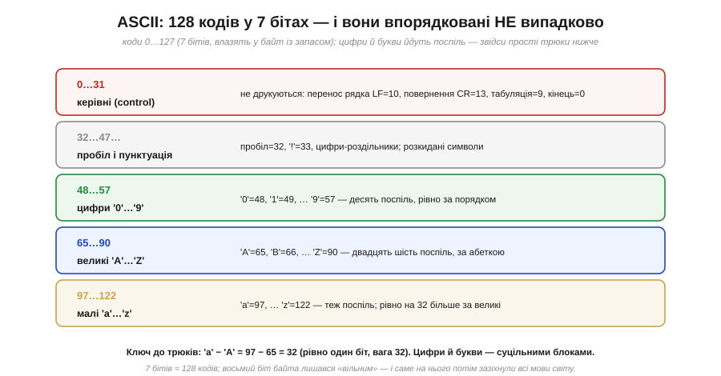
*Рис. 3.4.8.2. Коди ASCII лягають смугами. **0…31** — керівні (*control*) символи, що не друкуються, а керують: перенос рядка (LF=10), повернення каретки (CR=13), табуляція (9), нуль-кінець (0). **48…57** — десять цифр '0'…'9' поспіль. **65…90** — великі літери 'A'…'Z' за абеткою. **97…122** — малі 'a'…'z', рівно на 32 більші за відповідні великі. Цей лад — ключ до простих трюків нижче.*

Зверніть увагу на дві деталі, з яких усе випливає. По-перше, цифри й букви йдуть **суцільними блоками** за порядком: '0', '1', …, '9' — це підряд 48…57, а не врозкид. По-друге, велика й мала версії однієї літери різняться **рівно на 32**: 'A'=65, а 'a'=97. Ці дві властивості — не випадковість, а свідомий інженерний вибір, і саме завдяки їм робота з текстом часто зводиться до простої арифметики над кодами.

### Чому цей порядок зручний: три трюки

Покажімо на ділі, що дає продуманий порядок ASCII. Три прийоми, які з нього випливають, програміст застосовує буквально щодня.

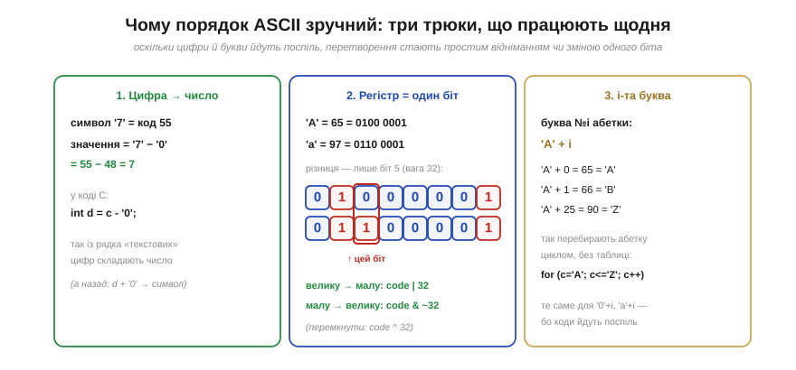
*Рис. 3.4.8.3. **Трюк 1 — цифра в число:** оскільки '0'…'9' ідуть поспіль, числове значення цифри-символу — це просто `символ − '0'` (для '7': 55 − 48 = 7). Так із текстового рядка цифр складають число. **Трюк 2 — регістр одним бітом:** велика й мала літери різняться лише бітом 5 (вага 32), тож `код | 32` робить літеру малою, `код & ~32` — великою, `код ^ 32` — перемикає. **Трюк 3 — i-та літера абетки:** `'A' + i` дає послідовні літери ('A'+0='A', 'A'+25='Z'), тож абетку перебирають циклом без жодної таблиці.*

**Приклад (рядок цифр у число).** Перетворимо текст «255» (три символи-цифри) на число 255, користуючись лише трюком 1.

```
символи:  '2'   '5'   '5'
коди:      50    53    53
−'0'(48):   2     5     5      ← кожна цифра стала своїм значенням
збираємо:  2·10 + 5 = 25,  далі 25·10 + 5 = 255   ✓
```

Саме так, цифра за цифрою, працює перетворення тексту на число «під капотом» функцій на кшталт `atoi`. Жодної магії — лише порядок ASCII і шкільне «помножити на 10 й додати». Цей приклад добре показує, **навіщо** взагалі впорядковували коди: правильно обраний лад перетворює роботу з текстом на звичайну арифметику, яку ми вже опанували.

> 🔧 **Навіщо це.** ASCII — це абетка, якою спілкуються майже всі давачі, модулі й протоколи: команди GPS, відповіді Wi-Fi-модулів, лог у термінал — усе це найчастіше **ASCII-текст**. Винесіть головне. Перше: **символ — це число** (буква 'A' — це байт 65), тож порівнювати, сортувати чи перебирати літери можна звичайними числовими операціями. Друге: **цифра-символ ≠ її значення** — '7' це 55, а не 7; щоб дістати число з тексту, віднімайте '0' (а щоб навпаки показати число — додавайте). Третє: знаючи, що великі й малі різняться бітом 32, ви легко робите порівняння без урахування регістру. Ці прийоми ви застосуєте, щойно почнете розбирати текстові відповіді пристроїв.

> ⚙️ **Поряд — алгоритм:** *UTF-8 декодер вручну* — як по бітах-префіксах першого байта впізнати довжину символу й зібрати його код-поінт, і чому завдяки цьому ASCII лишився підмножиною UTF-8.

### 256 значень — замало для світу

ASCII чудово служив, поки текст був англійський. Та щойно знадобилися інші мови — українська, грецька, китайська, — постала стіна: **кодів забракло**. Згадаймо нашу ж формулу місткості (§3.4.1): байт тримає лише 2⁸ = 256 значень. ASCII зайняв половину (0…127), лишивши вільними **128** кодів — а в самій лише кирилиці десятки букв, не кажучи вже про тисячі китайських ієрогліфів.


*Рис. 3.4.8.4. Вільних кодів (128) вистачало хіба що на одну-дві додаткові мови, тож верхню половину байта почали **перевизначати** під різні мови — постали десятки **кодових сторінок** (*code pages*): CP1251 для кирилиці, CP1252 для Заходу, KOI8-U, ISO-8859-… В одній код 200 — одна буква, в іншій — зовсім інша. Наслідок — **мохібейк** (*mojibake*), ті самі «кракозябри»: текст, збережений в одній таблиці, а прочитаний в іншій, перетворюється на нісенітницю. Байти ті самі — змінилася лише домовленість читання.*

Цей «зоопарк» кодувань був постійним джерелом болю, і біль цей мав цілком буденний вигляд: той самий файл на іншому комп'ютері розсипався на безглузді символи лише тому, що сторони мовчки прийняли **різні** таблиці. Гірше того — навіть для **однієї** мови таблиць було по кілька й вони сперечалися між собою: українську й російську кирилицю писали і в CP1251 (від Windows), і в KOI8-U, і в кількох інших, геть несумісних розкладках, тож текст із одного середовища регулярно «ламався» в іншому. А головне — кодова сторінка тримала лише **свою** жменю мов: змішати в одному файлі, скажімо, українську, грецьку й арабську було просто нікуди — байт фізично один, а наборів символів три. Та сама пастка, що проходить через увесь розділ, — біти прочитали не за тією домовленістю, — тут проявилася на тексті особливо боляче й щодня. Світу був потрібен **один** спільний список **усіх** символів **усіх** мов одразу, щоб раз і назавжди покінчити з плутаниною. Цим списком став **Unicode**.

### Unicode: один номер на кожен символ

**Unicode** розв'язує проблему в корені: він заводить **єдиний** велетенський каталог, де **кожному** символу будь-якої мови (і навіть емодзі) призначено власний унікальний номер — **код-поінт** (*code point*). Записують його як `U+` і шістнадцяткове число (згадайте §3.4.2, де ми полюбили hex): 'A' — це U+0041, 'Я' — U+042F, знак євро '€' — U+20AC.

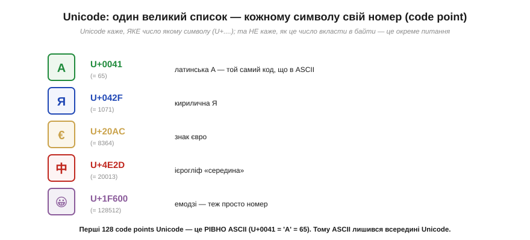
*Рис. 3.4.8.5. Unicode призначає номери всьому: латинська 'A' = U+0041 (= 65), кирилична 'Я' = U+042F, '€' = U+20AC, ієрогліф '中' = U+4E2D, емодзі '😀' = U+1F600 (= 128512). Критично важлива деталь: перші 128 код-поінтів Unicode — це **рівно ASCII** (U+0041 — це та сама 'A' = 65). Тобто ASCII цілком **уклали всередину** Unicode, не змінивши жодного коду.*

Простір цих номерів величезний: Unicode відводить під код-поінти діапазон від U+0000 аж до U+10FFFF — це понад мільйон можливих позицій, із яких заповнено вже близько 150 тисяч (усі писемності світу — живі й мертві, математичні знаки, технічні символи, емодзі), а решта чекає на майбутні доповнення. Запасу вистачить надовго. І зверніть увагу: Unicode свідомо **не прив'язаний** до жодного розміру байта чи слова — це просто **каталог номерів**, абстрактний список «символ → число», а не спосіб зберігання. Саме тому він і зміг охопити геть усе: його не обмежують ні 8, ні 16 бітів.

Та з цієї ж абстрактності випливає тонкість, яка визначить усе подальше: Unicode каже лише, **яке число** відповідає символу, — але **не каже**, як це число записати в байти. А це окреме й зовсім не тривіальне питання. Код-поінти ж бувають і малі (U+0041 = 65 влізе в один байт), і чималі (U+1F600 = 128512 — тут і двох байтів замало). Найпростіше, здавалося б, відвести під кожен символ однаково **чотири** байти — тоді влізе будь-який код-поінт (так і робить кодування UTF-32). Та це марнотратно: звичайний англійський текст роздувся б **учетверо**, бо кожна латинська буква, якій вистачило б одного байта, тягла б за собою три порожні. Як же укласти ці різнокаліберні номери в байти **ощадливо** — щоб дрібні коди займали мало, а великі вміщалися повністю? Відповідей вигадали кілька, та переможцем став напрочуд елегантний спосіб — **UTF-8**.

### UTF-8: від одного до чотирьох байтів

**UTF-8** (*Unicode Transformation Format, 8-bit*) — це конкретний спосіб **закодувати** код-поінт байтами. Його головна ідея — **змінна довжина**: малі коди займають один байт, більші — два, три або чотири. А щоб приймач завжди знав, скільки байтів читати, старші біти кожного байта несуть **префікс-мітку** його ролі.

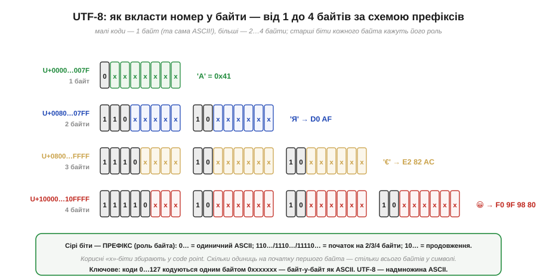
*Рис. 3.4.8.6. Схема UTF-8. Код-поінти **0…127** кодуються **одним** байтом `0xxxxxxx` — і це **точно той самий байт, що в ASCII**. Більші коди розкладають на 2–4 байти: початковий байт починається з `110…`, `1110…` чи `11110…` (стільки одиниць, скільки всього байтів у символі), а кожен наступний — із `10…` (мітка «я продовження»). Решта бітів (`x`) збирають у код-поінт. Так 'Я' → D0 AF (2 байти), '€' → E2 82 AC (3 байти), '😀' → F0 9F 98 80 (4 байти).*

Вдумаймося в красу цієї схеми. Перший байт сам каже, **скільки** байтів у символі: рахуй провідні одиниці. А кожен «продовжувальний» байт упізнаваний за початком `10`, тож його **неможливо сплутати** з початком символу. І найголовніше для нас — нижній рядок таблиці: оскільки коди 0…127 кодуються одним байтом `0xxxxxxx`, **усякий ASCII-текст уже є коректним UTF-8**, байт-у-байт. UTF-8 — це **надмножина** (*superset*) ASCII.

**Приклад (скільки байтів займе символ).** Прикиньмо, як закодується слово «Ti中» (латинські 'T', 'i' та ієрогліф).

```
'T' = U+0054 = 84      → 0…127  → 1 байт   (як ASCII: 0x54)
'i' = U+0069 = 105     → 0…127  → 1 байт   (як ASCII: 0x69)
'中' = U+4E2D = 20013  → 0x800…0xFFFF → 3 байти (E4 B8 AD)
разом: 1 + 1 + 3 = 5 байтів на 3 символи
```

Звідси видно важливий практичний висновок: у UTF-8 **кількість байтів не дорівнює кількості символів**. Латинська буква — це 1 байт, кирилична — 2, ієрогліф — 3, емодзі — 4. Тому довжину рядка в символах не можна визначити, просто полічивши байти, — про це варто пам'ятати, обробляючи текст.

### Чому переміг саме UTF-8

UTF-8 — не єдиний спосіб укласти Unicode в байти (є ще UTF-16 і UTF-32, що беруть по 2 чи 4 байти на символ). Та саме UTF-8 став стандартом вебу, файлів і систем. Чому? Через чотири дуже практичні чесноти, дві з яких прямо змикаються з темами цього розділу.

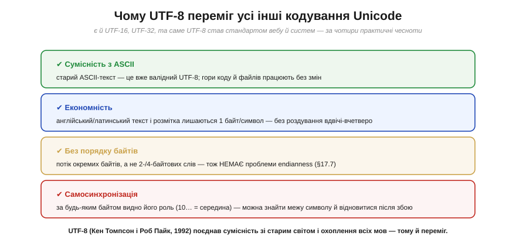
*Рис. 3.4.8.7. Чотири переваги UTF-8. **Сумісність з ASCII:** старі ASCII-тексти й код працюють без переробки. **Економність:** латинський текст і розмітка лишаються 1 байт/символ (а не роздуваються вдвічі-вчетверо, як у UTF-16/32). **Без порядку байтів:** UTF-8 — це потік **окремих байтів**, а не дво- чи чотирибайтових слів, тож проблеми endianness (§3.4.7) тут **просто немає**. **Самосинхронізація:** за будь-яким байтом видно його роль (`10…` — це середина символу), тож завжди можна знайти межу символу й відновитися після збою.*

Дві з цих чеснот — пряме відлуння щойно пройденого. Сумісність з ASCII означає, що та сама буква 'A' = 65 = байт `01000001` залишається собою скрізь: і в найдавнішому ASCII-файлі, і в сучасному UTF-8; усі гори вже написаного коду й файлів стали валідним UTF-8 самі собою, без жодної переробки. А відсутність проблеми порядку байтів — це прямий контраст із §3.4.7: оскільки UTF-8 оперує **окремими** байтами, а не багатобайтовими словами, переставляти нічого, і жоден `htons` тут не потрібен.

Щоб відчути цю перевагу гостріше, варто глянути на головного суперника — **UTF-16**, який кодує символи дво- чи чотирибайтовими одиницями. По-перше, він **не сумісний** з ASCII: навіть проста латинська 'A' займає там два байти (`00 41`), тож жоден старий ASCII-текст не є валідним UTF-16. По-друге, він одразу впирається в нашу пастку порядку байтів (§3.4.7): двобайтову одиницю можна покласти big- або little-endian, тож файли UTF-16 змушені носити на початку спеціальну **мітку порядку байтів** (*byte order mark*, BOM), аби читач знав, з якого кінця їх розбирати. По-третє, найбільші код-поінти (емодзі, рідкісні ієрогліфи) UTF-16 теж кодує **двома** двобайтовими одиницями — так званими сурогатними парами, — тож «два байти на символ» там насправді не завжди два. UTF-8 усіх цих ускладнень позбавлений за самою будовою: потік байтів, ASCII всередині, жодного BOM.

Лишилася четверта чеснота — **самосинхронізація**, і вона теж дорогого варта. Загубивши чи спотворивши один байт у потоці, декодер UTF-8 просто шукає наступний байт, що **не** починається з `10`, — і там знаходить початок цілого символу, відновлюючись далі. У кодуванні фіксованої довжини один зайвий чи загублений байт зсунув би **весь** подальший текст, перетворивши його на суцільну нісенітницю; UTF-8 же «гоїться» сам уже на наступному символі.

> 🔧 **Навіщо це.** Сьогодні UTF-8 — типове кодування тексту всюди: у вихідному коді, файлах, вебі, обміні даними. Винесіть головне. Перше: **Unicode** дає кожному символу номер (код-поінт U+…), а **UTF-8** кодує цей номер байтами змінної довжини (1–4). Друге, найпрактичніше: **байтів ≠ символів** — латинська буква це 1 байт, кирилична 2, емодзі 4; не рахуйте довжину тексту байтами й не «ріжте» рядок посеред багатобайтового символу (вийде зіпсутий символ). Третє: **ASCII — це вже UTF-8**, тож англійський текст і старі файли сумісні самі собою. Четверте: на відміну від UTF-16, UTF-8 **не має проблеми порядку байтів** (§3.4.7) — ще одна причина брати саме його за замовчуванням. І класична порада: якщо текст показується «кракозябрами», майже завжди річ у тім, що його **читають не тим кодуванням**, яким записали, — це та сама наскрізна пастка розділу, тільки про текст.

> 📜 **Поряд — історія:** *UTF-8 на паперовій підкладці в дайнері* — як Кен Томпсон і Роб Пайк за вечерею 1992 року накидали схему, що поєднала сумісність зі старим ASCII й охоплення всіх мов світу, і чому вона виявилася такою живучою.

---

Підсумок §3.4.8: **текст — це теж числа**, прочитані за домовленою **таблицею кодів** (§3.4.1): байт 72 за нею стає літерою 'H'. Найперша спільна таблиця — **ASCII** (0…127, сім бітів): її коди впорядковані продумано — цифри й букви йдуть **поспіль**, а регістр різниться **бітом 32**, звідки прості трюки (`символ − '0'`, `код ^ 32`, `'A' + i`). Та 256 значень байта **замало** для всіх мов, тож постали несумісні **кодові сторінки** й **мохібейк**. Розв'язок — **Unicode**: єдиний каталог, де кожному символу дано номер — **код-поінт** (U+…), причому перші 128 збігаються з ASCII. Сам номер кодують у байти, і переможним способом став **UTF-8**: **змінна довжина** 1–4 байти з префікс-мітками (`0…`, `110…`, `10…`). Він **сумісний з ASCII** (ASCII-текст — уже валідний UTF-8), економний, **самосинхронний** і **не має проблеми порядку байтів** (§3.4.7) — тому й переміг. Головне практичне: у UTF-8 **байтів ≠ символів**. На цьому каталог домовленостей розділу повний: ми навчилися читати з бітів і числа, і текст — усе через ту саму угоду тлумачення.

---

## Підсумок Розділу 3.4

Ми пройшли весь шлях від питання «**чому взагалі** двійкова» до того, як саме біти лягають у пам'ять, — і тепер 0 і 1 для нас уже не просто стан чи істина, а повноцінні **числа**, якими машина рахує.

Озирнімося на здобуте. Машини двійкові заради **надійності** (§3.4.1): два рівні напруги дають широчезний запас на шум там, де десять потонули б, — і ця «бідність» обернулася силою. Двійкове число читають **позиційно**, сумою степенів двійки, а пишуть компактно **шістнадцятково** (§3.4.2), бо одна hex-цифра — це рівно 4 біти. Від'ємні числа вписує геніальний **доповняльний код** (§3.4.3): інвертуй біти й додай 1 — і той самий суматор тепер і додає, і віднімає. Та розрядна сітка скінченна, тож на її межах чигає **переповнення** (§3.4.4) — тихий і підступний баг, що знищив ракету Ariane 5. Дроби дає **фіксована кома** (§3.4.5) — швидке масштабоване ціле, ідеальне для мікроконтролера, — або **плаваюча кома** (§3.4.6) з її величезним діапазоном, але й каверзною, відносною точністю (`0.1 + 0.2 ≠ 0.3`, ніколи не порівнюй float через `==`). Далі (§3.4.7) ми побачили, як біти збираються в байти й слова та в якому **порядку** лежать у пам'яті. А наостанок (§3.4.8) переконалися, що навіть **текст** — це числа: байти, прочитані за таблицею кодів (ASCII), зведеною в спільний Unicode і вкладеною в байти через UTF-8.

Та найголовніша думка всього розділу — не якась окрема формула, а одне наскрізне прозріння: **біти не мають вродженого сенсу; сенс їм надає домовленість**. Ті самі вісім бітів 11111111 — це і 255, і −1, і символ, і частинка дробу, залежно від того, **як ми домовилися** їх читати. Беззнакове чи знакове, ціле чи з фіксованою комою, big- чи little-endian, число чи літера — усе це різні **домовленості** тлумачення тих самих 0 і 1. Звідси й практичний висновок, що збереже вам незліченні години налагодження: більшість «дивних» числових багів — це коли біти прочитали **не за тією** домовленістю (знакове як беззнакове, ціле як float, чужу ендіанність як свою, текст не тим кодуванням). Тримайте в голові, **за якою угодою** ви читаєте кожне число, — і половина пасток вас омине.

Ми навчили машину **зберігати** й **тлумачити** числа. Лишилося найцікавіше: змусити її ними **діяти** — вибирати команди, виконувати їх одну за одною, керувати сама собою. Як купа логічних вентилів (Розділ 3.2) і регістрів (Розділ 3.3) перетворюється на **процесор**, що виконує програму? Це — серце комп'ютера, і саме до нього ми переходимо.

> ▶️ **Далі — Розділ 3.5: [Архітектура процесора](../ch18-processor-architecture/ch18-processor-architecture.md).** Як із вентилів і регістрів постає машина, що сама вибирає й виконує команди. А починається розділ з історії, що визначила всі комп'ютери: [фон Нейман і збережена програма](../ch18-processor-architecture/ch18-history-von-neumann.md).