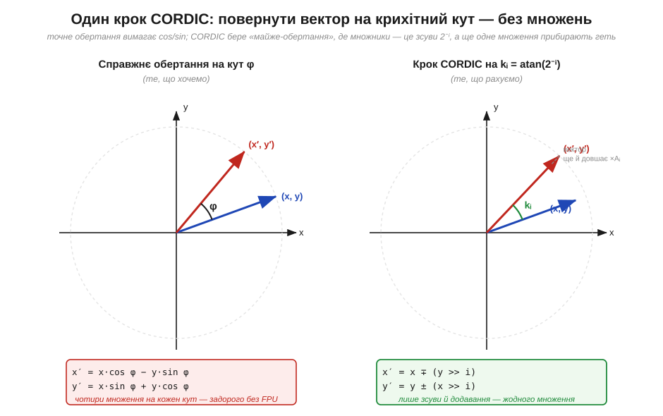

# 📜 CORDIC: тригонометрія для машини, що вміла лише додавати

> Історична вставка до ⚙️-вставки [«CORDIC без FPU»](ch17-s5-a-cordic.md) (тема [§3.4.5](ch17-number-representation.md)). Перш ніж розбирати сам алгоритм, варто зрозуміти, **звідки** взялася його дивна форма — самі зсуви й додавання замість чесних синусів. Бо CORDIC не вигадали з любові до елегантності: його народила цілком конкретна скрута — бортовий обчислювач кінця 1950-х, який мусив наводити бомбардувальник, маючи зі складної арифметики тільки суматор. Ця історія добре задокументована (на відміну від багатьох інженерних легенд), тож простежмо її чесно: від ручних таблиць логарифмів — через військовий проєкт однієї людини — до калькулятора в кишені, що порахував вам тангенс тими самими зсувами.

### Задовго до машин: рахунок «цифра за цифрою»

Думка, з якої виросте CORDIC, старша за електрику. Коли в XVII столітті обчислювали перші таблиці логарифмів і тригонометричних функцій, ніякого «натиснув кнопку — дістав синус» не існувало: кожне значення доводилося **виводити руками**, маючи лише додавання, віднімання й зсув коми. Англієць **Генрі Бріґґс** (*Henry Briggs*, 1561–1630), що вирахував десяткові логарифми до чотирнадцятого знака, користувався прийомами «крок за кроком»: складне множення зводив до додавань, а потрібну величину набирав послідовними поправками, кожна з яких дрібніша за попередню. Це ще не CORDIC, та сама **ідея** вже тут: якщо машинка (хай навіть жива, з пером і папером) уміє тільки додавати й зсувати, то трансцендентну функцію беруть не одним ударом, а **низкою щораз менших кроків**, доки залишок не стане незначущим. Через три століття цю саму філософію перенесуть у залізо — бо найперше цифрове залізо опиниться рівно в становищі Бріґґса: складних операцій у нього не буде.

### 1959, Convair: обчислювач, що мусив навести бомбардувальник

Перенесімося в кінець 1950-х, на авіаційну фірму **Convair** у Сан-Дієго. Там будували надзвуковий бомбардувальник **B-58 Hustler**, і його навігаційній системі треба було безперервно перераховувати координати: повороти векторів, синуси й косинуси кутів курсу, перетворення між системами відліку. Доти такі речі робили **аналогові** обчислювачі — на сельсинах (механічних «резолверах»), що крутили вали й знімали з них синуси. Аналог був громіздкий, дрейфував від температури й старів. Назрівав перехід на **цифру**, але тут поставала прикра перешкода: цифровий бортовий обчислювач того часу вмів швидко **додавати й зсувати**, а апаратного множення — не кажучи про синуси — у нього просто не було. Чесна формула обертання вектора (`x′ = x·cos φ − y·sin φ`) вимагала чотирьох множень на кожен крок; для бортової машинки 1959 року це було задорого.

Розв'язок знайшов інженер **Джек Волдер** (*Jack E. Volder*, 1924–2010). Його ідея, опублікована 1959 року під назвою **CORDIC** (*COordinate Rotation DIgital Computer* — «цифровий обчислювач обертання координат»), була несподівано простою. Повне обертання на довільний кут Волдер розклав на **послідовність крихітних псевдо-обертань** на наперед обрані кути — рівно такі, що множники в них дорівнюють степеням двійки. А множення на степінь двійки — це **зсув**. Отже, ціле обертання вектора зводилося до того, що залізо вже вміло: зсунути й додати, зсунути й відняти, і так десяток разів. Тригонометрію він замінив таблицею арктангенсів у пам'яті та циклом із самих додавань. Те, що раніше потребувало множника й функцій, тепер робив голий суматор.

За власним пізнішим спогадом Волдера, поштовхом стала суто практична морока: він шукав, як на цифровому залізі дешево порахувати потрібні навігаторам обертання, і впізнав у формулах ту саму структуру «крок за кроком», що давно жила в ручних методах обчислення функцій. Конкретні обставини цього осяяння в переказах різняться (*перевірити*: з якого саме довідника чи формули все почалося — деталі анекдота гуляють від джерела до джерела), та суть незмінна: ідея народилася не в пошуках краси, а під тиском дуже земного обмеження — «множника нема, а кути рахувати треба».

Тут варто бути точним в атрибуції. CORDIC — це не «осяяння нізвідки»: Волдер прямо спирався на давню техніку обчислення «цифра за цифрою» (ту саму лінію, що йде від Бріґґса й таблиць логарифмів) і на роботи попередників з обертання координат у навігації. Його власний внесок — **поєднати** це з двійковими зсувами й оформити як готовий алгоритм для конкретного цифрового заліза. Як майже завжди в інженерії, тут радше **доведення зрілої ідеї до робочого вигляду**, ніж одноосібний винахід на порожньому місці; саме тому ім'я Волдера стоїть на CORDIC по праву, але історія методу — колективна й довша за одне прізвище.

### 1971, Hewlett-Packard: один алгоритм на всі функції

Понад десятиліття CORDIC лишався відомий вузько — у колах авіоніки. Другий його розквіт настав, коли інженер **Джон Волтер** (*John Walther*) із **Hewlett-Packard** 1971 року показав разючу річ: ту саму схему «зсунь-додай-за-таблицею» можна **узагальнити**. Замінивши коло на гіперболу (а таблицю арктангенсів — на таблицю гіперболічних кутів), той самий цикл починав рахувати не лише синус і косинус, а й **логарифми, експоненти, корінь, множення й ділення** — увесь інженерний набір трансцендентних функцій, і все на одному скромному апаратному блоці. CORDIC із вузького трюку навігаторів перетворився на **універсальний обчислювач функцій для машин без множника**.

Саме це й зробило його зіркою епохи кишенькових калькуляторів. Коли HP випустила **HP-35** (1972) — перший науковий калькулятор, що вмістився в кишеню, — усередині не було ні FPU, ні таблиць значень на кожен кут: був чотиробітний процесор, кілька кілобайтів ПЗП і алгоритми родини CORDIC, що набирали синус, логарифм чи степінь тими самими зсувами й додаваннями. Розробку числової частини HP-35 вів **Девід Кохран** (*David S. Cochran*); конкретні внутрішні підпрограми калькулятора історики описують по-різному в деталях (*перевірити*: які саме функції лічилися чистим CORDIC, а які спорідненими «цифра-за-цифрою» методами, у різних джерелах подано неоднаково), але загальна картина безсумнівна — трансцендентну математику в перших калькуляторах тягнув не множник, а ця низка зсувів.

### Чому це не музейний експонат

Здавалося б, із приходом дешевих апаратних множників і FPU про CORDIC можна забути. Та він **пережив** свою початкову скруту й живий донині — рівно там, де множника або немає, або його шкода. У **ПЛІС/FPGA** CORDIC — стандартний спосіб порахувати синус чи atan2, бо він займає крихітну логіку (суматори й зсуви — найдешевше, що є в кристалі) і чудово конвеєризується. У дрібних **мікроконтролерах без FPU** він дає тригонометрію за ціну кільканадцяти цілих додавань. Його ставлять у DSP-блоки, у контролери двигунів (де atan2 потрібен для оцінки кута ротора), у графіку й обробку сигналів.

Є й цілком сучасний поворот цієї історії: **деякі мікроконтролери для керування двигунами віддають CORDIC просто апаратним блоком** — записуєш кут у регістр, читаєш синус і косинус, причому швидше, ніж порахувала б їх бібліотечна функція навіть на ядрі з FPU. Тобто алгоритм, придуманий, щоб **обійтися без** спеціального заліза, зрештою сам став спеціальним залізом — бо в керуванні двигунами синус-косинус потрібен так часто, що його варто «вшити» в кремній. Понад шістдесят років по тому ідея бортового обчислювача B-58 працює і в кожному другому FPGA-проєкті, і в контролерах двигунів — бо обмеження, яке її породило (множення дороге, додавання дешеве), у дрібному залізі нікуди остаточно не зникло.

Власне алгоритм — як ці зсуви складаються в синус, косинус і atan2, і де на мікроконтролері він кусає — розібрано в [сусідній ⚙️-вставці](ch17-s5-a-cordic.md).

---

# CORDIC: синус, косинус і atan2 без FPU — самі зсуви й додавання

> ⚙️ Алгоритмічна вставка до теми [§3.4.5 «Дробові числа: фіксована кома»](ch17-number-representation.md). У §3.4.5 ми навчилися тримати дроби цілими числами, а в [сусідній ⚙️-вставці](ch17-s5-a-fixed-point.md) — множити їх зсувом і насичувати результат. Лишилося питання, що неминуче спливає в керуванні двигунами, графіці й навігації: а як на тому самому залізі без FPU порахувати **синус, косинус чи кут вектора (atan2)**? Таблиця на кожен можливий кут — задорога по пам'яті, ряд Тейлора — це купа множень. CORDIC (з [історії поряд](ch17-s5-a-cordic.md)) дає третій шлях: тригонометрію **самими зсувами й додаваннями** над фіксованою комою. Розберімо його як алгоритм — від ідеї до пастки на МК.

## Задача

Уявімо контролер безколекторного двигуна без FPU. Щоб задати струми обмоток, йому десятки тисяч разів на секунду потрібні `sin θ` і `cos θ`; щоб оцінити кут ротора з двох давачів — `atan2(y, x)`. Прямі шляхи погані обидва. **Велика таблиця** значень з'їдає дефіцитну флеш-пам'ять і все одно дає лише дискретні кути. **Ряд Тейлора** (`sin θ ≈ θ − θ³/6 + …`) вимагає кількох множень на кожен член, а множення без апаратного множника — дороге. Потрібен метод, що дає тригонометрію за ціну того, що навіть найскромніше ядро робить швидко: **цілий зсув і ціле додавання**.

## Ідея

Уся хитрість CORDIC — у погляді на синус і косинус як на **обертання вектора**. Якщо взяти вектор (1, 0) і повернути його на кут θ, то його нові координати — це рівно (cos θ, sin θ). Тобто порахувати синус-косинус = вміти **обертати вектор** на заданий кут. А обертання, своєю чергою, можна не робити одним стрибком, а **набрати** з багатьох дрібних поворотів — і ось тут ховається трюк.


*Рис. 3.4.5a.1. Зліва — чесне обертання на кут φ: чотири множення на cos/sin, задорого без FPU. Справа — крок CORDIC. Замість довільного кута беруть **спеціальні** кути kᵢ = atan(2⁻ⁱ), для яких формула обертання містить множники рівно 2⁻ⁱ — а множення на 2⁻ⁱ це просто **зсув праворуч на i бітів**. Ціна за хитрість одна: псевдо-обертання не лише крутить вектор, а й трохи **видовжує** його (×Aᵢ) — цей «борг» зберемо й погасимо однією сталою наприкінці.*

Чому саме кути atan(2⁻ⁱ)? Бо в формулі обертання `x′ = x − y·tan φ`, `y′ = y + x·tan φ` множником стоїть **тангенс** кута. Якщо обрати φ так, що tan φ = 2⁻ⁱ (тобто φ = atan(2⁻ⁱ)), то `y·tan φ` перетворюється на `y >> i`, а `x·tan φ` — на `x >> i`. Множення зникло, лишилися зсув і додавання:

```
x′ = x ∓ (y >> i)      // знак ∓/± задає напрям повороту
y′ = y ± (x >> i)
```

Лишається питання: як із цих фіксованих кроків (45°, 26.565°, 14.036°, 7.125°…) набрати **довільний** кут θ? Відповідь — як у двійковому пошуку. Веземо з собою «лишок кута» z, спершу рівний θ. На кожному кроці дивимося на знак z: якщо z ще додатний — повертаємо **вперед** (віднімаємо kᵢ від z), якщо вже від'ємний — повертаємо **назад** (додаємо kᵢ). Кроки вдвічі менші щоразу, тож z неминуче стискається до нуля — а вектор тим часом доходить до потрібного кута.


*Рис. 3.4.5a.2. Ліворуч — таблиця кроків kᵢ = atan(2⁻ⁱ) (єдине, що CORDIC тримає в ПЗП). Праворуч — як лишок кута z біжить до нуля для θ = 30°: знак z вирішує «+» чи «−», і кожна поправка вдвічі менша за попередню. Це буквально двійковий пошук по куту: n кроків дають ≈ n правильних бітів результату. Жодних множень — лише читання таблиці, зсув і додавання.*

Один і той самий цикл дає **два різні корисні результати** залежно від того, що женемо до нуля. Жени до нуля **кут** z — і вектор повернеться на θ, а його координати стануть (cos θ, sin θ): це **режим обертання**. Жени до нуля **y** вектора — і вектор ляже на вісь x, а весь кут, який довелося «відмотати», накопичиться в z: це **режим векторизації**, і він повертає `atan2(y, x)` та заразом довжину вектора. Одна петля — три функції.


*Рис. 3.4.5a.3. **Режим обертання** (женемо z→0): старт (1/K, 0, θ) → дістаємо cos θ і sin θ за один прохід. **Режим векторизації** (женемо y→0): старт (x₀, y₀, 0) → дістаємо atan2(y₀, x₀) і довжину. Спільна «плата» — посилення K = Π√(1+2⁻²ⁱ) ≈ 1.64676: кожне псевдо-обертання трохи довшає вектор. K **не залежить від кута**, тож його гасять наперед — стартують із x = 1/K ≈ 0.60725 (тоді результат уже масштабований) або множать на 1/K один раз у кінці.*

## Псевдокод

Гаряча петля — режим обертання, що повертає sin і cos кута. Усе ціле, у фіксованій комі (§3.4.5): кут і координати — Q-числа, `ATAN[i]` — таблиця atan(2⁻ⁱ) у тому самому масштабі, `N` — число ітерацій (= бажана точність у бітах):

```
function cordic_sincos(theta):          # theta у Q-форматі, |theta| ≤ ~99°
    x = ONE_OVER_K                       # = 1/K у Q-форматі (гасить посилення наперед)
    y = 0
    z = theta                            # лишок кута, женемо до нуля
    for i in 0 .. N-1:
        if z >= 0:                       # знак z = напрям повороту
            x_new = x - (y >> i)         # псевдо-обертання вперед
            y_new = y + (x >> i)         #   (зсуви замість множень!)
            z     = z - ATAN[i]          # списали kᵢ з лишку
        else:
            x_new = x + (y >> i)         # псевдо-обертання назад
            y_new = y - (x >> i)
            z     = z + ATAN[i]
        x = x_new                        # ОНОВЛЮВАТИ РАЗОМ: y залежить від старого x
        y = y_new
    return (y, x)                        # y ≈ sin theta,  x ≈ cos theta
```

Дві деталі варто підкреслити. По-перше, `x` і `y` оновлюють **одночасно** зі старих значень: новий `y` рахується через **старий** `x`, тож не можна затерти `x` раніше, ніж порахуєш `y`. По-друге, зсуви `>>` тут — **арифметичні** над знаковими Q-числами (§3.4.5a): для від'ємних координат вони мусять тягнути знаковий біт, інакше поворот «назад» зіпсується. Режим векторизації (atan2) — той самий каркас, лише умова гілки міняється з `z >= 0` на `y < 0`, а накопичується відповідь у `z`.

## Складність і пастки на МК

**Вартість — O(N) на виклик:** один прохід циклу на кожен біт точності. Для 16-бітного результату це ≈ 16 ітерацій, у кожній — два зсуви, три додавання й перевірка знака; разом кілька десятків цілих інструкцій на повний синус-косинус, без жодного множення. На ядрі без множника це часто **швидше** за ряд Тейлора й ощадніше по пам'яті за велику таблицю — звідси й популярність CORDIC у FPGA та дрібних МК. Та перш ніж вставляти його в код, варто знати характерні граблі:

- **Обмежений діапазон збіжності.** Сума всіх кроків atan(2⁻ⁱ) дорівнює лише ≈ 99.7°, тож «у лоб» CORDIC бере кути приблизно **−99°…+99°**, не більше. Для решти кола роблять **попередній поворот на чверть**: зводять кут у цей діапазон через ±90° чи 180° (звичайна перестановка й зміна знаків координат), і лише потім запускають цикл. Забути про це — отримати сміття за межами перших квадрантів.
- **Не загубити посилення K.** Якщо не стартувати з 1/K і не помножити на 1/K у кінці, результат вийде роздутим у ≈ 1.647 раза — класична «тиха» помилка: форма синусоїди правильна, амплітуда — ні. Стала 1/K ≈ 0.60725 фіксована (для багатьох ітерацій), її просто кладуть константою у Q-форматі.
- **Таблиця ATAN у правильному масштабі.** `ATAN[i]` мусять бути у **тому самому** Q-форматі, що й z; популярний варіант — масштабувати весь кут так, щоб ціле коло вкладалося у розрядну сітку (тоді переповнення кута саме «обертається» по колу, як у §3.4.4 — і це тут на користь). Невідповідність масштабу таблиці й z — найчастіша причина, чому «майже працює, але кут пливе».
- **Скільки ітерацій — стільки й бітів, не більше.** Точність росте приблизно на біт за ітерацію й упирається в **розрядність** ваших Q-чисел: робити 30 ітерацій у 16-бітному форматі марно — молодші зсуви `y >> i` просто занулюються, щойно i перевищить число дробових бітів. Узгоджуйте N із шириною слова.
- **Постійний час виконання — і плюс, і мінус.** CORDIC завжди робить рівно N кроків незалежно від аргументу: зручно для жорсткого реального часу, та якщо десь потрібен лише грубий синус, повний цикл — надлишок, і там інколи дешевша коротка таблиця з інтерполяцією.

Підсумок: CORDIC перетворює тригонометрію на те, що вміє найскромніше ціле залізо, — **зсув і додавання над фіксованою комою**. Вектор повертають низкою псевдо-обертань на кути atan(2⁻ⁱ), де множник завжди є степенем двійки; знак лишку кута на кожному кроці грає роль двійкового пошуку, тож N ітерацій дають ≈ N бітів. Один режим віддає sin і cos, інший — atan2 і довжину; єдина плата, стала K ≈ 1.647, гаситься наперед. Саме тому, що CORDIC спирається лише на суматори й зсувачі (Розділи 3.2, 3.3) і ні разу не кличе множник, він і досі править там, де FPU немає, — у контролерах двигунів, обробці сигналів і кожному другому FPGA-проєкті.
