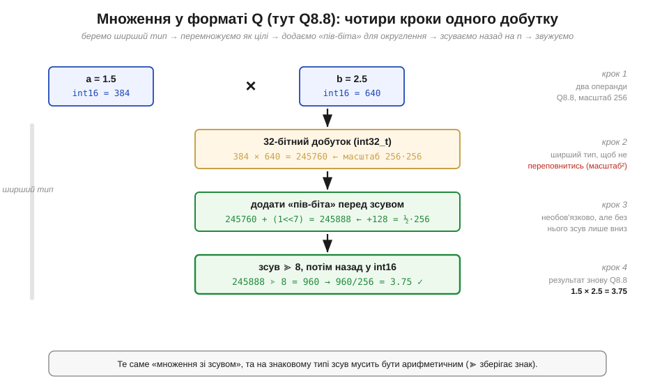
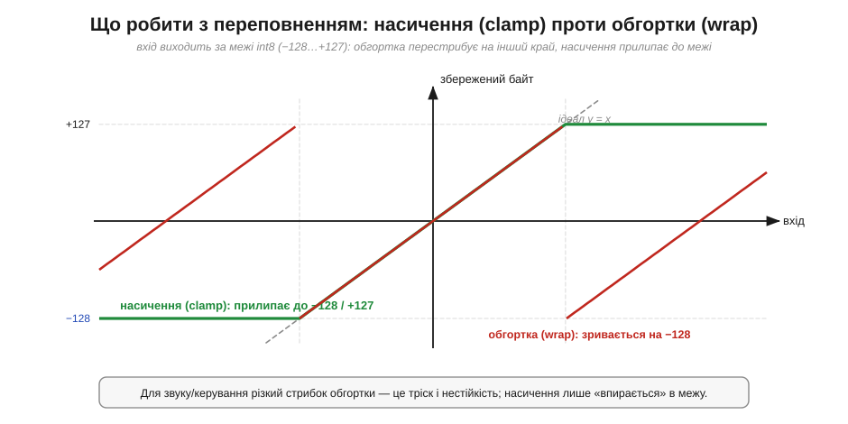

# Фіксована кома в коді: Q-формат, множення зі зсувом, насичення

> ⚙️ Алгоритмічна вставка до теми [§3.4.5 «Дробові числа: фіксована кома»](ch17-number-representation.md). Там ми з'ясували **ідею**: дріб зберігають як ціле, помножене на масштаб (степінь двійки), а кому тримають у домовленості — форматі **Qm.n**. Додавання виявилося задарма, а множення — «з одним зсувом назад». Тут доведемо цю ідею до **робочого коду**. Бо щойно фіксована кома потрапляє в реальний мікроконтролер без апаратного блока дробів (*FPU*), той «один зсув» обростає трьома практичними деталями, на яких легко спіткнутися: добуток треба рахувати **ширшим** типом, зсув варто **округлювати**, а результат — **насичувати**, щоб переповнення не зривалося стрибком. Розберемо кожну.

## Задача

Уявімо типову ситуацію без FPU: треба перемножувати дробові коефіцієнти — гучність на відлік звуку, підсилення в регуляторі, частку при змішуванні кольорів. Числа невеликі, але **дробові**, і рахувати їх доведеться десятки тисяч разів на секунду. Плаваюча кома відпадає: без FPU кожна операція над `float` коштує десятки тактів програмної емуляції. Лишається фіксована кома з §3.4.5 — усе цілими у форматі Q, а множення цілим зі зсувом.

Проблема в тім, що «наївна» реалізація цієї формули в лоб ховає три пастки. По-перше, добуток двох Q-чисел має **подвоєний** масштаб і легко вилазить за розрядність операнда. По-друге, зсув назад просто **відкидає** молодші біти — це систематичне заниження. По-третє, результат може вискочити за межі формату, і тоді тихе переповнення (§3.4.4) перетворить гучний звук на тріск. Наша мета — множення Q-чисел, яке **не переповнюється**, **округлює** замість усікати й **насичується** замість обгортатися, лишаючись суто цілим.

## Ідея

Почнімо з того, щоб формат **Qm.n перестав жити лише в голові** й став конкретним типом у коді. Візьмемо для прикладу **Q8.8** у 16-бітному знаковому слові: 8 бітів на цілу частину (зі знаком), 8 на дробову, масштаб = 2⁸ = 256. Тоді дробове значення `x` зберігається як ціле `X = round(x · 256)`, а читається назад як `x = X / 256`. У C це робиться парою рядків, після яких компілятор далі бачить звичайний `int16_t`:

```
typedef int16_t q8_8;            // Q8.8: масштаб 256, діапазон −128…+127.996
#define Q  8                     // дробових бітів (n)
#define TO_Q(x)   ((q8_8)((x) * (1 << Q) + ((x) < 0 ? -0.5 : 0.5)))   // float → Q (з округленням)
#define FROM_Q(X) ((float)(X) / (1 << Q))                            // Q → float (для друку/налагодження)
```

Тепер **множення**. Згадаймо спостереження з §3.4.5: добуток двох масштабованих чисел має масштаб **удвічі** більший (256 × 256 = 65536), тож результат треба зсунути назад на `n` бітів. Та ось перша деталь, яку тема лише позначила: проміжний добуток уже **не вміщається** в 16 біт. Q8.8 × Q8.8 у найгіршому разі дає близько 2³¹ — це 32-бітне число. Тому перед множенням операнди **розширюють** до ширшого типу (`int32_t`), і весь добуток живе там.


*Рис. 3.4.5a.1. Множення 1.5 × 2.5 у Q8.8. Крок 1: два 16-бітні операнди (384 і 640). Крок 2: добуток рахуємо у 32-бітному типі — 245760, він має масштаб 256² і в 16 біт не вліз би. Крок 3: перед зсувом додаємо «пів-біта» молодшого розряду результату (1≪7 = 128 = ½·256) — це і є округлення. Крок 4: зсуваємо ≫ 8 назад до масштабу 256, дістаємо 960 = 3.75 у Q8.8 і звужуємо назад у 16 біт. Без 32-бітного проміжку був би хибний результат, без «пів-біта» — завжди заниження.*

Друга деталь — **округлення**. Зсув `≫ n` відкидає `n` молодших бітів, тобто завжди округлює **вниз**. На одному множенні похибка дрібна, та в довгому ланцюжку (фільтр, інтегратор регулятора) це заниження накопичується й «з'їдає» сигнал. Лікують його старим трюком: перед зсувом додають **половину молодшого розряду** результату — константу `1 << (n−1)`. Тоді все, що було «за півкроку й далі», округлиться вгору, а ближче — вниз; систематичний нахил зникає. Для Q8.8 ця половинка дорівнює `1 << 7 = 128`.

Третя деталь — **насичення** (*saturation*). Навіть коли множення зроблено бездоганно, результат може не вміститися в Q8.8: 100.0 × 2.0 = 200.0, а стеля формату — лише +127.996. За звичайної цілої арифметики тут спрацює обгортка (§3.4.4) і +200 перескочить у район −56 — гучний звук миттєво стане від'ємним сплеском, тобто **тріском**. У сигнальній обробці це неприйнятно, тож замість обгортки результат **притискають** (*clamp*) до межі: усе, що понад максимум, стає максимумом, усе, що нижче мінімуму, — мінімумом.


*Рис. 3.4.5a.2. Дві стратегії на переповнення для знакового байта (−128…+127). Обгортка (червоне) — пилкоподібна: щойно вхід переходить +127, вихід зривається аж на −128 (різкий стрибок ≈ тріск, нестійкість регулятора). Насичення (зелене) — плавно «впирається» в межу й тримається на ній. Сіра пунктирна — ідеал y = x, де обидві стратегії ще збігаються. Для звуку й керування потрібне саме насичення: спотворення на перевантаженні чутне, але не катастрофічне.*

Три деталі — три рядки коду понад наївну формулу. Складемо їх докупи.

## Псевдокод

Гаряча операція — множення двох Q-чисел із насиченням результату. Усе ціле; `WIDE` — удвічі ширший тип (для Q8.8 це 32-бітний), `Q` — кількість дробових бітів, `QMAX`/`QMIN` — межі формату (+32767 / −32768 для Q8.8 у 16 бітах):

```
function q_mul(a, b):                 # a, b — Q-числа (масштаб 2^Q)
    p = (WIDE) a * (WIDE) b           # 1) ширший тип: добуток має масштаб 2^(2Q)
    p = p + (1 << (Q - 1))            # 2) додати пів-біта → округлення замість усічення
    p = p >> Q                        # 3) арифметичний зсув назад до масштабу 2^Q
    if p > QMAX: p = QMAX             # 4) насичення згори
    if p < QMIN: p = QMIN             #    і знизу
    return (Q_type) p                 #    звузити назад

function q_add(a, b):                 # додавання теж може переповнитись!
    s = (WIDE) a + (WIDE) b           # рахуємо ширше, щоб побачити вихід за межі
    if s > QMAX: s = QMAX
    if s < QMIN: s = QMIN
    return (Q_type) s
```

Зверніть увагу: додавання, яке в §3.4.5 було «задарма», тут теж обгорнуте в насичення — бо сума двох майже-максимальних Q-чисел так само вискакує за межу. «Задарма» воно лише доти, доки ви певні, що до переповнення не дійде. Перетворення на вхід (`TO_Q`) і вихід (`FROM_Q`) роблять раз, на краях тракту; уся гаряча петля всередині лишається цілою.

## Складність і пастки на МК

**Вартість — O(1) на операцію:** одне ціле множення, одне додавання, один зсув і дві перевірки меж. На ядрі з апаратним множенням (а таке є навіть у скромних Cortex-M0) це одиниці тактів — на порядок дешевше за програмний `float`. Та дешевизна оманлива, і характерні граблі варто знати наперед:

- **Замалий проміжний тип — мовчазне переповнення.** Найчастіша помилка: перемножити два `int16_t` і отримати… `int16_t`, бо в C добуток обчислюється в типі операндів. 384 × 640 переповнить 16 біт ще **до** будь-якого зсуву, і результат буде сміттям. Хоча б один операнд треба явно привести до ширшого типу (`(int32_t)a * b`) — тоді й усе множення піде в 32 бітах.
- **Арифметичний проти логічного зсуву.** Для знакових Q-чисел зсув назад мусить бути **арифметичним** (зберігати знак, тягнучи старший біт). У C `>>` на знаковому типі це робить, а на беззнаковому — ні; плутанина типів дає для від'ємних чисел хибний результат. Тримайте проміжок у **знаковому** ширшому типі.
- **Округлення для від'ємних.** Додавання `1 << (Q−1)` округлює коректно для додатних; біля нуля й для від'ємних поведінка асиметрична (округлення «до плюс нескінченності»). Для аудіо це зазвичай байдуже, для точного керування — інколи беруть симетричне округлення (додають половину з урахуванням знака).
- **Насичення коштує гілок — або однієї інструкції.** Дві перевірки меж — це передбачення переходів, що може гальмувати гарячу петлю. Багато ядер для DSP мають **апаратне** насичення (інструкції `SSAT`/`QADD` в Cortex-M4 і вище) — тоді clamp стає однією інструкцією без гілок; варто пошукати її в наборі команд свого МК, перш ніж писати `if` вручну.
- **Узгодженість масштабу.** Складати, порівнювати чи присвоювати можна лише Q-числа **однакового** формату. Q8.8 і Q4.12 — це різні масштаби (256 проти 4096); змішати їх без перерахунку — те саме, що додати метри до футів. Уніфікуйте формат у межах тракту, а конвертуйте свідомо й в одному місці.

Підсумок: ідея фіксованої коми з §3.4.5 перетворюється на надійний код трьома штрихами понад «ціле множення зі зсувом» — **ширший** проміжний тип (щоб добуток не переповнився), **пів-біта** перед зсувом (щоб округлювати, а не занижувати) і **насичення** на виході (щоб межа давала плавне «впирання», а не стрибок-тріск). Усе лишається цілою арифметикою на тих самих суматорах і зсувачах (Розділи 3.2, 3.3) — саме тому фіксована кома й досі править там, де FPU немає або де потрібні швидкість і передбачуваність.
