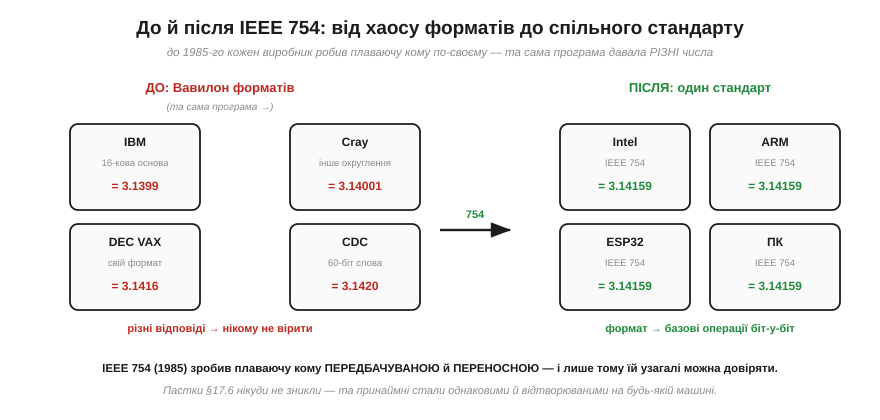
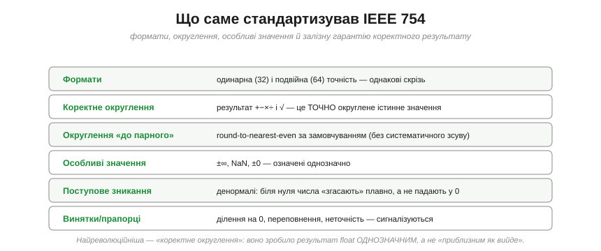
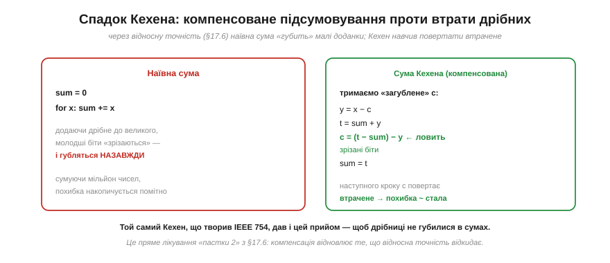

# 📜 Історія до §3.4.6 — Вільям Кехен і стандарт IEEE 754: як приборкали плаваючу кому

> Це історична вставка до [§3.4.6 «Плаваюча кома»](ch17-number-representation.md). Ми щойно з'ясували, що float **підступний** — повний пасток точності. Та ось що варто знати: до 1985 року було **значно гірше**. Плаваюча кома була не просто підступною, а **хаотичною**: кожен виробник комп'ютерів робив її по-своєму, і та сама програма на різних машинах давала різні (а часом і відверто хибні) відповіді. Цей безлад приборкав один упертий математик — **Вільям Кехен**, — за що його прозвали «батьком плаваючої коми» й дали премію Тюрінга. Його стандарт **IEEE 754** — причина, чому float сьогодні взагалі **можна** довіряти.

Уявіть, що ви — інженер 1970-х, який пише програму для розрахунку міцності мосту. Ви запускаєте її на машині IBM — одна відповідь. Переносите на DEC — інша. На Cray — третя. Котра правильна? Жодна не «правильна» з гарантією — бо кожна машина рахує дроби по-своєму. Це був **Вавилон** плаваючої коми, і вибратися з нього виявилося напрочуд важко.

*Рис. 3.4.6i.1. До 1985-го (ліворуч): IBM рахувала з шістнадцятковою основою, DEC — за своїм форматом, Cray округлював інакше, CDC мав 60-бітні слова — і та сама програма давала **різні** числа. Після IEEE 754 (праворуч): Intel, ARM, ESP32, ПК — усі дотримуються одного **формату**, тож кожна окрема базова операція (+, −, ×, ÷, √) **коректно округлена** й відтворювана біт-у-біт. (Застереження: цілий складний вираз усе ж може дати трохи різні результати — через FMA, ширшу проміжну точність чи режим округлення; гарантія стосується формату й базових операцій, а не довільних обчислень.) Пастки §3.4.6 нікуди не зникли, та принаймні стали **однаковими й відтворюваними** скрізь.*

---

## Вавилон плаваючої коми

У 1960–70-х комп'ютерів було багато, і кожен великий виробник вигадав **свою** плаваючу кому. IBM на мейнфреймах System/360 використовувала **шістнадцяткову** основу порядку (кома стрибала по 4 біти, що марнувало точність). DEC на машинах VAX мала свій формат із власними хитрощами. Cray заради швидкості жертвував коректністю округлення. CDC рахувала 60-бітними словами. Бази, розміри, правила округлення, поведінка на межах — усе **різне**.

Наслідки були болючі. Числове програмне забезпечення доводилося **переписувати** під кожну машину, бо те, що працювало на одній, на іншій давало нісенітницю. Не було жодних **гарантій**: ділення могло округлитися то так, то сяк; число, замале для формату, могло раптом стати нулем (і обвалити розрахунок діленням на цей нуль); а корінь із від'ємного давав то нуль, то випадкове сміття, то аварію — як кому заманулося. Програміст не міг **довіряти** жодному результату, не перевіривши його тричі на конкретному залізі.

> 🔧 **Навіщо це.** Уявіть сучасний світ без цього стандарту: ваша програма на ESP32 рахувала б float інакше, ніж та сама програма на ПК, де ви її налагоджували, — і баг, що відтворюється на телефоні, зникав би на ноутбуці. Уся **переносність** числового коду, яку ми сприймаємо як належне, — це прямий дарунок IEEE 754. Без нього кожен дріб був би лотереєю, залежною від заліза.

---

## Ставки: чому це було критично

Може здатися, що «трохи різні дроби» — дрібниця. Та плаваюча кома — це фундамент **усієї** наукової та інженерної обчислювальної техніки: розрахунки літаків, мостів, реакторів, прогнозу погоди, орбіт. Коли від відповіді залежать життя й мільярди, «приблизно правильно, по-різному на різних машинах» — неприйнятно. Потрібні були **залізні гарантії**: щоб однакова операція **завжди** давала однаковий, **точно означений** результат, хоч де її виконують.

Без таких гарантій числові аналітики змушені були закладати в програми безліч обережних «милиць», щоб обійти примхи конкретного заліза, — і все одно не могли поручитися за результат. Галузь задихалася від хаосу. Потрібен був **стандарт**. І потрібна була людина, яка зведе сварливих виробників за один стіл.

---

## Кехен і комісія

**Вільям Кехен** (*William «Velvel» Kahan*, нар. 1933 у Торонто) — канадсько-американський математик, професор Каліфорнійського університету в Берклі й один із найбільших знавців **числового аналізу** свого часу. Він глибоко розумів, **як саме** похибки округлення підкрадаються в обчислення й нищать результати, — і мав рідкісне поєднання теоретичної строгості з інженерним чуттям.

Наприкінці 1970-х Інститут інженерів електротехніки (**IEEE**) зібрав комісію, щоб нарешті домовитися про єдину плаваючу кому. Тут зійшлися зорі: компанія **Intel** саме проєктувала математичний співпроцесор **8087** і хотіла спертися на по-справжньому добрий стандарт, тож найняла Кехена консультантом. Кехен разом зі своїм аспірантом **Джеромом Куненом** (*Jerome Coonen*) і колегою **Гарольдом Стоуном** (*Harold Stone*) написав чернетку — її за іменами авторів назвали **«проєктом K-C-S»**, — і саме вона лягла в основу майбутнього стандарту.

Кехен підійшов до справи не як до інженерного компромісу, а як до **математичної задачі**: він хотів, щоб формат не просто «працював», а мав **доказові властивості**, на які можна спертися в розрахунках. Це й зробило 754 не черговою угодою виробників, а фундаментом, що тримає донині.

---

## Що навів лад

Стандарт **IEEE 754** (ухвалений 1985 року) поклав край хаосу, домовившись про все, що раніше було свавіллям.

*Рис. 3.4.6i.2. Стандарт зафіксував: єдині **формати** (одинарна 32 і подвійна 64 точність); **особливі значення** (±∞, NaN, ±0) з однозначним змістом; **поступове зникання** (денормалі) — щоб числа біля нуля згасали плавно, а не падали в нуль; **винятки/прапорці** для ділення на 0, переповнення, неточності. А найреволюційніше — **коректне округлення**: гарантію, що результат +, −, ×, ÷ і √ є **точно округленим** істинним значенням, а не «приблизно як вийшло».*

Це коректне округлення варто оцінити окремо, бо воно — серце стандарту. Раніше «3.14 поділити на 2.7» могло на різних машинах дати ледь різні відповіді, бо кожна округлювала на свій лад. Кехен наполіг: результат базової операції мусить бути **тим самим** числом, яке ви отримали б, порахувавши **точно** й тоді округливши до найближчого представного. Жодної свободи. Завдяки цьому float уперше став **однозначним**: одна **базова** операція (+, −, ×, ÷, √) над однаковими входами дає **однаковий** біт-у-біт результат на будь-якому залізі, що дотримується стандарту. Саме ця однозначність і робить float придатним для серйозних розрахунків.

А ще Кехен обстояв **NaN** і **±∞** як штатні значення: тепер ділення на нуль не валило програму, а давало означену нескінченність, а «не-число» (корінь з від'ємного, 0/0) чесно позначалося як NaN, поширюючись далі замість тихого сміття. І **поступове зникання** — щоб найдрібніші числа біля нуля не «обривалися» різко, а плавно втрачали точність.

---

## Битви за деталі

Стандартизація була **не** мирною. Виробники з уже наявними форматами не хотіли їх викидати; комісія роками сперечалася за кожну дрібницю. Найзапекліша битва точилася саме навколо **поступового зникання** (денормалей): воно ускладнювало й трохи сповільнювало залізо, тож **DEC**, у якої свій VAX цього не мав, рішуче опиралася. Кехен і Кунен стояли на своєму, доводячи, що без денормалей у числовому коді виникають підступні «діри» біля нуля, де віднімання близьких чисел дає брехливі результати.

Суперечка була настільки гострою, що замовили окреме незалежне дослідження — і воно стало на бік Кехена. Поступове зникання лишилося в стандарті. Ця історія повчальна: за кожним «технічним» пунктом 754 стоїть не випадковий вибір, а **виборена** математична правота, часто всупереч короткочасним інтересам виробників. Кехен бився за **користувача** числового коду, який ніколи його не побачить, але щодня покладається на його рішення.

---

## Перемога й нагорода

1985 року IEEE 754 ухвалили. Intel випустила 8087 за ним, далі підтягнулися всі — і за кілька років хаос форматів змінився **єдиною** плаваючою комою, яку ми маємо донині (стандарт лише оновлювали: 754-2008, 754-2019). Сьогодні практично **кожен** процесор підтримує IEEE 754 — хоча обсяг **апаратної** підтримки різниться: ESP32, наприклад, має FPU лише для **одинарної** точності (float), а **подвійну** (double) рахує програмно; а найдрібніші 8-бітні МК узагалі без FPU й емулюють float цілком. Формат і правила скрізь ті самі — та чи виконує їх залізо, чи програма, залежить від чипа.

1989 року Вільям Кехен отримав **премію Тюрінга** (найвищу нагороду в інформатиці, її «Нобеля») — за фундаментальний внесок у числовий аналіз і провідну роль у створенні стандарту 754. Його заслужено називають **«батьком плаваючої коми»** (*Father of Floating Point*). Рідкісний випадок, коли премію світового рівня дали не за блискучу теорему, а за **впорядкування** — за те, що людина змусила галузь домовитися про спільну, надійну основу.

---

## Суми Кехена: щоб дрібниці не губилися

Кехен лишив і суто практичний дарунок, що прямо лікує одну з пасток §3.4.6. Згадаймо «пастку 2»: через **відносну** точність, додаючи дрібне число до великого, ми «зрізаємо» молодші біти, і вони губляться; підсумовуючи мільйон чисел, можна назбирати помітну похибку.

*Рис. 3.4.6i.3. **Наївна** сума (ліворуч) щоразу зрізає молодші біти доданка — і вони зникають назавжди, а похибка накопичується. **Сума Кехена** (праворуч) тримає окрему змінну c, що **ловить** зрізане: на кожному кроці вона обчислює, що саме загубилося, і повертає це на наступному. Похибка лишається ~сталою замість того, щоб рости. Це пряме лікування «пастки 2».*

Алгоритм **компенсованого підсумовування** (його так і звуть — *Kahan summation*) геніально простий: окрема змінна-компенсація `c` запам'ятовує ту дещицю, що загубилася при останньому додаванні, і повертає її в наступному. Виходить, що низькі біти не зникають у безодні, а «доганяють» суму згодом. Той самий розум, що навів лад у стандарті, дав і цей повсякденний інструмент проти підступу плаваючої коми. (Коли ви далі сумуватимете багато float-вимірів — у фільтрах, інтеграторах, — згадайте Кехена.)

---

## Куди привів цей ланцюг

Озирнімося. Плаваюча кома пройшла шлях від **Вавилону** несумісних форматів, де кожна машина брехала по-своєму, до єдиного, математично обґрунтованого стандарту, якому можна **довіряти**. І ключове, що варто винести: IEEE 754 не зробив float **точним** — пастки §3.4.6 (0.1+0.2 ≠ 0.3, відносна точність, небезпека `==`) нікуди не поділися. Він зробив його **передбачуваним**: тепер ці пастки **однакові** на будь-якому залізі, **означені** до останнього біта й **відтворювані**. А передбачуваний підступ — це вже не лотерея, а інженерна задача, яку можна розв'язати (наприклад, сумою Кехена).

Найвпертіший слід цієї історії — думка, що **стандарт** буває важливішим за блискучий винахід. Кехен не вигадав плаваючої коми (її ідея стара) — він **впорядкував** її так, що ціла цивілізація обчислень дістала спільну, надійну землю під ногами. За це й Тюрінгова премія: інколи найбільша послуга науці — не нова теорема, а змусити всіх домовитися робити правильно.

А тепер, тримаючи в голові і силу, і підступ, і впорядкованість плаваючої коми, завершімо розділ найприземленішим, але важливим: як біти **складаються** в байти й слова та в якому **порядку** лежать у пам'яті.

> ▶️ Далі: [§3.4.7 Біти, байти, слова й порядок байтів (endianness)](ch17-number-representation.md)
