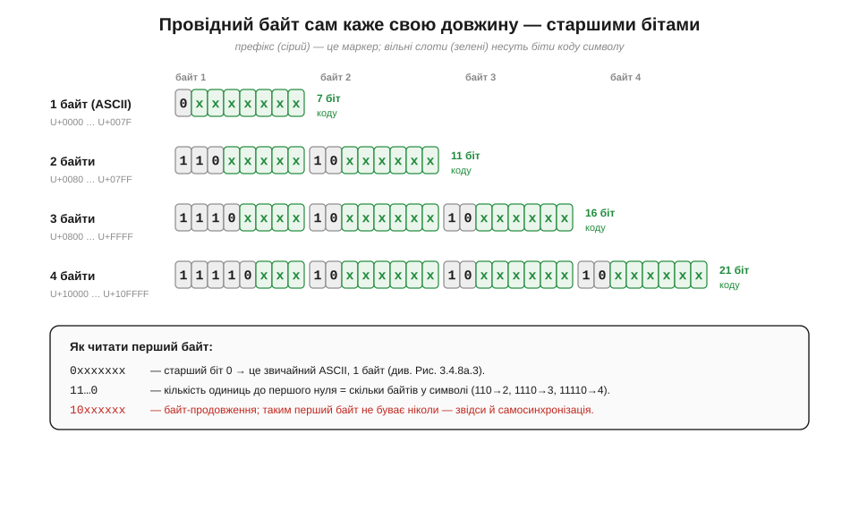
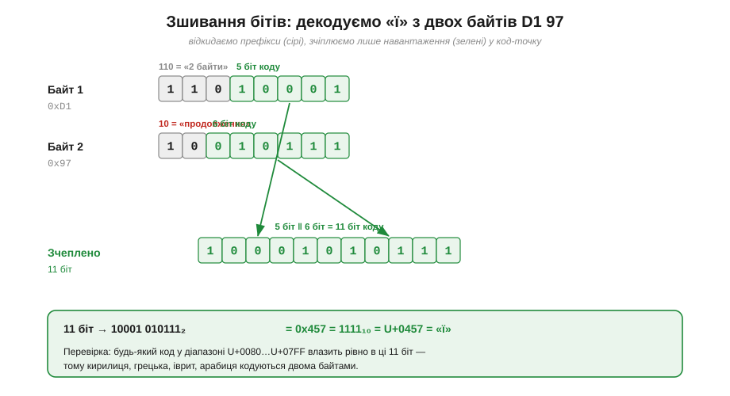
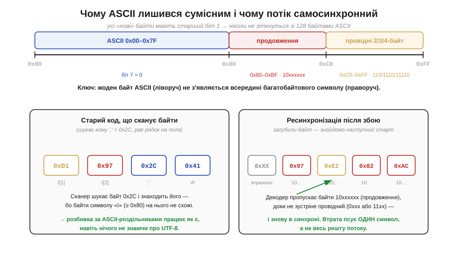

# ⚙️ До §3.4.8 — UTF-8 декодер вручну: біти-префікси й чому ASCII лишився сумісним

> Алгоритмічна вставка до теми [§3.4.8 «Текст як числа: ASCII і UTF-8»](ch17-number-representation.md). Там ми з'ясували головну ідею: текст — це теж числа, лише інакше витлумачені (повертаючись до наскрізної думки §3.4.1 — «біти не мають вродженого сенсу»), а **UTF-8** — це домовленість, як упакувати **мільйон з гаком** можливих символів у потік звичайних байтів. Тут ми доводимо цю домовленість до **робочого коду**: пройдемо байтовий потік власноруч, дістанемо з нього код-точки (*code points*) і заразом побачимо, чому стара добра латиниця ASCII пережила перехід на Юнікод **без жодної зміни байтів** — властивість, заради якої UTF-8 і переміг суперників.

## Задача

Уявімо найтиповішу для мікроконтролера ситуацію: у нас є **потік байтів** — рядок з серійного порту, вміст файлу на SD-картці, тіло HTTP-відповіді з мережі. Байти ми приймати вміємо (це просто числа 0–255). Та щойно в тексті трапляється не латинська літера, а кирилиця, емодзі чи знак євро, наївне припущення «один байт — один символ» розсипається: таких символів **тисячі**, у байт вони не влазять. Постає задача: **перетворити потік байтів на послідовність код-точок** — цілих чисел, кожне з яких називає один символ Юнікоду (для «ї» це U+0457, для «😀» — U+1F600).

Найпростіші відповіді не годяться. Відвести під кожен символ фіксовані 4 байти — це вчетверо роздути будь-який англійський текст і, гірше, **зламати сумісність**: усі наявні інструменти, що читають байти ASCII, перестали б розуміти такий файл. UTF-8 розв'язує обидві проблеми відразу — але платить за це **змінною** довжиною символу (від 1 до 4 байтів), і саме цю змінність наш код мусить розплутати, не спіткнувшись на півдорозі.

## Ідея

Ключ — у тім, що UTF-8 **сам себе розмічає**: перший байт символу старшими бітами оголошує, скільки байтів за ним іде, а кожен наступний байт несе впізнаваний префікс «я лише продовження». Декодеру не треба нічого вгадувати — досить прочитати ці біти-префікси.


*Рис. 3.4.8a.1. Схема префіксів UTF-8. Провідний байт `0xxxxxxx` (старший біт 0) — це 1-байтовий символ, тобто чистий ASCII. Якщо ж старший біт 1, то **кількість одиниць до першого нуля** дорівнює довжині символу: `110` → 2 байти, `1110` → 3, `11110` → 4. Усі байти-продовження мають незмінний префікс `10`. Сірі комірки — біти-маркери (їх відкидаємо), зелені — вільні слоти, що несуть власне код символу: 7 біт в ASCII, 11 у двобайтовому, 16 у трибайтовому, аж до 21 у чотирибайтовому. Цих 21 біта стачає на весь простір Юнікоду (до U+10FFFF).*

Розшифрувати символ — означає **зняти префікси й зчепити те, що лишилося**. Провідний байт віддає молодші біти свого вільного поля, кожен байт-продовження — свої шість бітів; зведені докупи в правильному порядку, вони й утворюють число код-точки. Простежмо це на живому прикладі.


*Рис. 3.4.8a.2. Декодування символу «ї» (байти 0xD1 0x97). З провідного `11010001` відкидаємо префікс `110` — лишається 5 біт навантаження `10001`. З продовження `10010111` відкидаємо `10` — лишається 6 біт `010111`. Зчеплені, вони дають 11-бітне число `10001 010111₂ = 0x457 = 1111₁₀`, тобто U+0457 — кирилична «ї». Жодних таблиць пошуку: саме лише складання бітів зсувами, тими самими, що в §3.4.7.*

Лишилася найкрасивіша частина задуму — **зворотна сумісність з ASCII**. Перші 128 код-точок (U+0000…U+007F) кодуються одним байтом `0xxxxxxx`, **бітоточно** як у старому ASCII. А всі байти багатобайтових символів — і провідні (`11…`), і продовження (`10…`) — обов'язково мають старший біт 1, тобто значення ≥ 0x80. Два світи не перетинаються, і з цього випливає диво.


*Рис. 3.4.8a.3. Уся числова вісь байта 0–255 поділена начисто: 0x00–0x7F — це ASCII (старший біт 0), а весь діапазон 0x80–0xFF зайнятий «новими» байтами UTF-8. Зліва: старий код, що шукає роздільник-кому (0x2C), безпомилково знаходить її навіть у тексті з кирилицею — бо байти «ї» (≥ 0x80) на жоден ASCII-символ не схожі, тож розбивка рядка за роздільниками працює, нічого не знаючи про Юнікод. Справа: якщо один байт загубився, декодер просто пропускає байти-продовження `10xxxxxx`, доки не натрапить на провідний, — і знову в синхроні. Збій псує **один** символ, а не весь решту потоку. Це і зветься **самосинхронізацією** (*self-synchronization*).*

Три властивості — три рядки коду понад наївний цикл. Зведімо їх докупи.

## Псевдокод

Гаряча операція — дістати **одну** код-точку з потоку. Читаємо провідний байт, за його префіксом дізнаємося довжину й початкові біти, тоді добираємо потрібне число байтів-продовжень, щоразу перевіряючи їхній префікс `10` і пришиваючи 6 біт навантаження:

```
function decode_one(bytes, i):        # i — позиція в потоці
    b0 = bytes[i]
    if b0 < 0x80:                     # 0xxxxxxx — ASCII, 1 байт
        return (b0, i + 1)
    else if (b0 & 0xE0) == 0xC0:      # 110xxxxx — 2 байти
        cp = b0 & 0x1F;  n = 1
    else if (b0 & 0xF0) == 0xE0:      # 1110xxxx — 3 байти
        cp = b0 & 0x0F;  n = 2
    else if (b0 & 0xF8) == 0xF0:      # 11110xxx — 4 байти
        cp = b0 & 0x07;  n = 3
    else:
        return ERROR(i + 1)           # 10xxxxxx як перший — биття/збій

    for k in 1 .. n:                  # добираємо байти-продовження
        bk = bytes[i + k]
        if (bk & 0xC0) != 0x80:       # кожен мусить бути 10xxxxxx
            return ERROR(i + 1)       # збій — шукаємо новий старт
        cp = (cp << 6) | (bk & 0x3F)  # пришиваємо 6 біт навантаження

    if cp < min_for_length[n]:        # відкинути overlong (див. нижче)
        return ERROR(i + 1)
    return (cp, i + n + 1)
```

Маски тут — пряме відображення Рис. 3.4.8a.1: `0xE0`/`0xC0` перевіряють префікс `110`, `0x1F` лишає 5 біт навантаження, `0x3F` лишає 6 біт продовження, а `<< 6` між кроками й зсуває вже накопичене, щоб звільнити місце під наступну шістку. Перетворення в інший бік (код-точка → байти) — дзеркальне: ділимо число на групи по 6 біт із хвоста й дописуємо префікси.

## Складність і пастки на МК

**Вартість — O(довжини в байтах) на символ**, тобто щонайбільше чотири читання, кілька масок і зсувів; ні таблиць, ні множень, ні `malloc`. Декодер ідеально **потоковий**: тримає лише поточну позицію, тож годиться навіть для крихітного буфера на ESP32. Та простота оманлива, і характерні граблі варто знати наперед.

- **Знаковість `char` — найчастіша пастка.** На багатьох МК тип `char` **знаковий**, тож байт 0xD1 стає від'ємним числом (−47), і порівняння `b0 < 0x80` спрацьовує хибно. Тримайте байти потоку в `uint8_t` (або маскуйте `b0 & 0xFF`) — інакше будь-який не-ASCII байт зламає всю логіку.
- **Обрив на межі буфера.** Якщо багатобайтовий символ розірвало між двома порціями (`read()` віддав байти провідний+перший, а решта приїде наступним пакетом), сліпе звертання `bytes[i + k]` вилізе за край буфера. Потокові декодери тримають **недодекодований хвіст** і доклеюють до нього наступну порцію; найпростіше — спершу перевірити, що в буфері лишилося ≥ `n+1` байтів.
- **Overlong-кодування — це діра в безпеці, а не дрібниця.** Той самий символ можна записати «з запасом» — закодувати ASCII-косу риску `/` двома чи трьома байтами замість одного. Стандарт це **забороняє**, і недарма: колись перевірки шляху обманювали саме так, ховаючи `../` у переобтяженому записі. Тому декодер мусить відкидати код-точку, коротшу за мінімум для своєї довжини (рядок `min_for_length` у псевдокоді: ≥ 0x80 для 2 байтів, ≥ 0x800 для 3, ≥ 0x10000 для 4).
- **Довжина рядка ≠ кількість символів.** `strlen` рахує **байти**, а не код-точки: для «привіт» це 12, а не 6. Тому позиціонувати курсор у текстовому полі чи різати рядок по «N-му символу» можна лише **через декодер**, а не індексуючи байти навмання, — інакше ризик розрубати символ навпіл і породити те саме биття, що на Рис. 3.4.8a.3.
- **Ширина на екрані — окрема історія.** Навіть правильно полічені код-точки не дорівнюють **колонкам** у терміналі: ієрогліфи займають дві позиції, а комбіновані знаки наголосу — нуль. Для рівних стовпчиків у консольному виводі цього теж не оминути, та це вже задача рівня відображення, а не декодування.

> 🔧 **Навіщо це.** Винесіть головне. Перше: **UTF-8 самоопис** — провідний байт старшими бітами каже свою довжину (`0`→1, `110`→2, `1110`→3, `11110`→4), а продовження завжди починаються на `10`; декодувати = зняти префікси масками й зчепити навантаження зсувами `(cp << 6) | (b & 0x3F)`. Друге: **ASCII вцілів дослівно** — байти 0x00–0x7F незмінні, а всі «нові» байти ≥ 0x80, тому старий код, що шукає ASCII-роздільники (коми, нові рядки, лапки), працює без переробки, а декодер після збою сам ресинхронізується на наступному провідному байті. Третє, найпрактичніше на МК: тримайте байти в **`uint8_t`** (знаковий `char` усе зламає), стережіться **обриву символу на межі буфера**, відкидайте **overlong** (це безпека, не педантизм) і пам'ятайте, що **`strlen` рахує байти, а не символи** — більшість «кракозябр» і збитих курсорів родом саме звідси.
