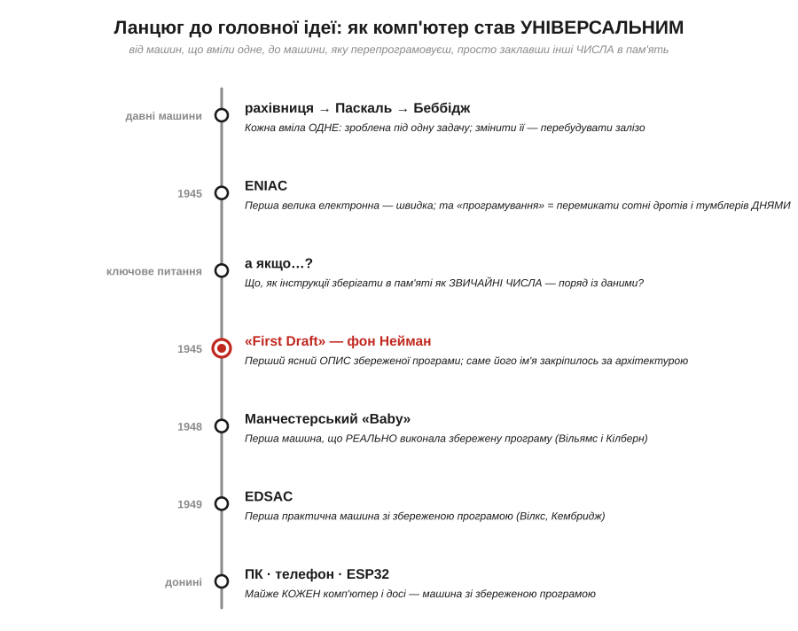
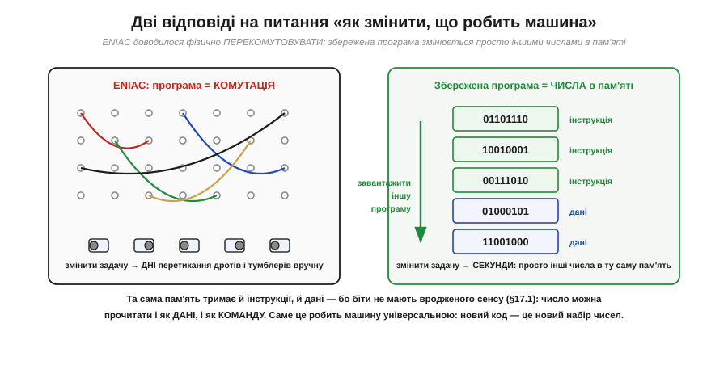
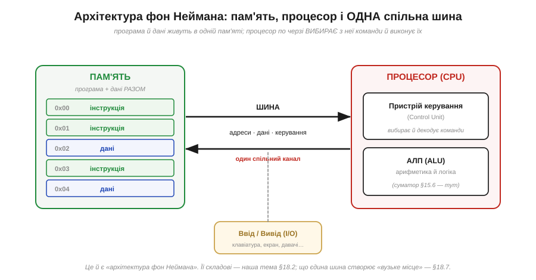
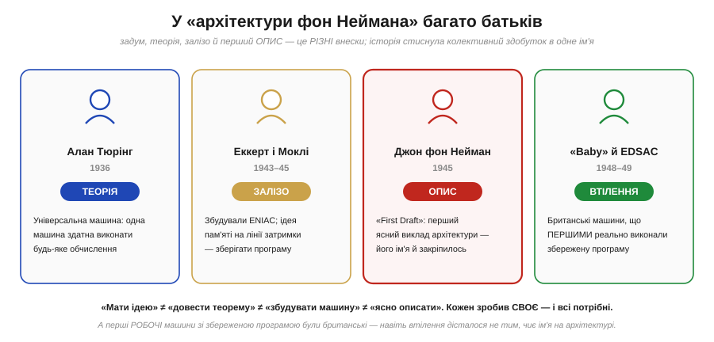
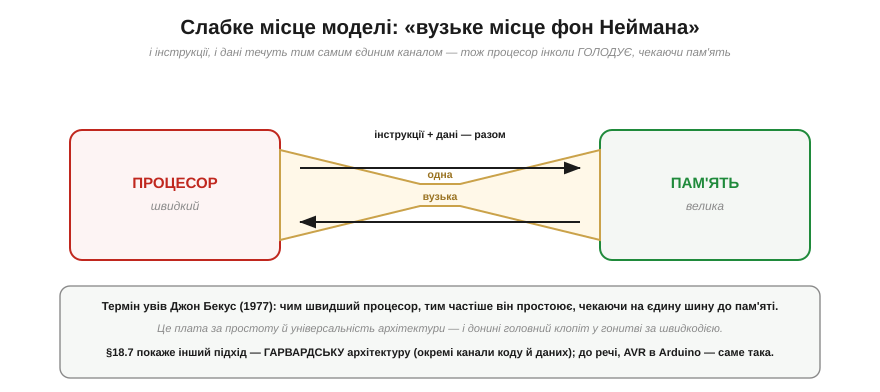

# 📜 Історія до Розділу 3.5 — Фон Нейман і збережена програма: ідея, що визначила всі комп'ютери

> Це історична вставка до [Розділу 3.5 «Архітектура процесора»](ch18-processor-architecture.md). Вона веде до **однієї** думки — настільки простої й настільки потужної, що саме вона відрізняє **комп'ютер** від будь-якої іншої машини: **програму треба зберігати в пам'яті як звичайні числа, поряд із даними**. Звучить буденно, та це і є та межа, за якою машина перестає вміти «щось одне» й стає **універсальною** — здатною робити будь-що, варто лише завантажити в неї інші числа. Цю ідею пов'язують з ім'ям **Джона фон Неймана**, хоч, як ми побачимо, батьків у неї було значно більше. У [Розділі 3.2](../ch15-logic-gates/ch15-logic-gates.md) ми зробили вентилі, у [Розділі 3.3](../ch16-flip-flops-registers/ch16-flip-flops-registers.md) — регістри й тактування, у [Розділі 3.4](../ch17-number-representation/ch17-number-representation.md) — числа. Тепер настав час скласти з них **машину, що виконує програму**. А починається все з питання: що взагалі робить комп'ютер «комп'ютером»?

Уявіть будь-яку машину, яку ви знаєте: годинник, пральну машину, калькулятор, музичну скриньку. Усі вони вміють **щось одне** — те, під що їх збудували. Щоб змусити їх робити інше, треба **перебудувати залізо**. А тепер згадайте телефон у вашій кишені: сьогодні він навігатор, за мить — камера, тоді — гра, книжка, гаманець. Те саме залізо, без жодної викрутки, робить тисячі різних речей. У чому секрет цієї **універсальності** — і звідки вона взялася? Пройдімо ланцюгом, яким людство дійшло до машини, що змінює своє ремесло, просто **читаючи інші числа**.

*Рис. 3.5.0.1. Кожен щабель — крок до думки, що машину можна **перепрограмовувати**, не чіпаючи заліза. Червоний вузол — «First Draft» 1945 року, перший ясний опис збереженої програми, за яким архітектура дістала ім'я фон Неймана. Та, як побачимо, і до, і після нього над цією ідеєю працювало багато людей: теорію дав Тюрінг, машину збудували Еккерт і Моклі, а першими **запустили** збережену програму британці.*

---

## Машини, які треба було перебудовувати

Щоб оцінити велич ідеї, треба спершу відчути біль, який вона зняла. Повернімося в середину 1940-х, до машини на ім'я **ENIAC** (*Electronic Numerical Integrator and Computer*) — першого великого електронного обчислювача, збудованого **Джоном Преспером Еккертом** (*J. Presper Eckert*) і **Джоном Моклі** (*John Mauchly*) у школі Мура Пенсільванського університету. ENIAC був дивом: вісімнадцять тисяч електронних ламп, лічба в тисячі разів швидша за будь-яку механіку. Та мав він одну страшну незручність.

ENIAC не **зберігав** програму. Він **був** нею. Щоб задати йому нове обчислення, треба було фізично **перекомутувати** машину: вручну переставити сотні кабелів між гніздами, виставити тисячі тумблерів — буквально **перебудувати** її електричні з'єднання. Ця робота лягала на плечі команди обчислювачок — здебільшого це були **жінки**: Кей Макналті, Бетті Дженнінгс, Бетті Снайдер, Мерлін Весков, Френ Білас, Рут Ліхтерман — їхні імена довго лишалися в тіні, хоча саме вони «програмували» ENIAC у єдиний доступний тоді спосіб. Нова задача означала **дні** перетикання дротів за схемами.

*Рис. 3.5.0.2. Ліворуч — ENIAC: «програма» існувала як фізична **комутація** дротів і тумблерів, тож зміна задачі вимагала днів ручної праці. Праворуч — ідея збереженої програми: інструкції лежать у пам'яті як **звичайні числа** поряд із даними, і змінити задачу — це просто **завантажити інші числа**, секундна справа. Ключ — у §3.4.1: біти не мають вродженого сенсу, тож одне й те саме число можна прочитати і як **дані**, і як **команду**.*

Парадокс був разючий: машина рахувала зі швидкістю блискавки, але **переналаштовувалася** зі швидкістю слюсарні. Уся гнучкість, уся швидкодія електроніки впиралася в те, що сама «програма» жила не всередині машини, а в **розкладці її дротів**. Очевидно напрошувалося питання: а що, як інструкції — кроки обчислення — теж зробити **даними**? Покласти їх у ту саму пам'ять, де лежать числа, якими машина оперує? Тоді змінити програму означало б не перепаювати залізо, а просто **записати інші числа** в пам'ять.

---

## Велика ідея: програма — це теж числа

Ось вона, думка, що народила сучасний комп'ютер. Вона спирається прямо на урок Розділу 3.4: **біти не мають вродженого сенсу — сенс їм надає тлумачення** (§3.4.1). Якщо число `01101110` може бути і значенням 110, і символом, і дробом, то чому б йому не бути ще й **командою** — наприклад, «додай», «перенеси», «порівняй»? А якщо команди — це теж числа, то їх можна зберігати в тій самій пам'яті, що й дані, читати звідти, як дані, і — найголовніше — **підмінювати**, просто завантаживши інші.

Це називають **концепцією збереженої програми** (*stored-program concept*). Її наслідки годі переоцінити. По-перше, машина стає **універсальною**: одне залізо виконує будь-яку програму, яку в нього завантажать, — калькулятор, гру, керування мотором, — бо «програма» більше не вшита в дроти, а лежить у пам'яті як змінний набір чисел. По-друге, з'являється сама ідея **програмного забезпечення** як чогось окремого від заліза: софт — це числа, які можна писати, копіювати, виправляти, не торкаючись машини. По-третє, машина може навіть **читати й змінювати власні інструкції** як дані (це і дар, і небезпека, та про це згодом).

*Рис. 3.5.0.3. Класична схема: **пам'ять** тримає програму й дані **разом** (ті самі комірки, лише по-різному витлумачені); **процесор** складається з **пристрою керування** (вибирає й декодує команди) і **АЛП** (рахує — це наш суматор із §3.2.6); їх з'єднує **одна спільна шина** для адрес, даних і керування. Процесор по черзі **вибирає** з пам'яті чергову команду-число, **розуміє** її й **виконує** — і так крок за кроком біжить програма. Складові цієї схеми — тема §3.5.2, а наслідки єдиної шини — §3.5.7.*

Придивіться до схеми, бо це — скелет **кожного** комп'ютера, який ви коли-небудь тримали в руках. Пам'ять, де код і дані лежать пліч-о-пліч; процесор, що по черзі тягне з неї команди й виконує їх; шина, якою все це сполучене. Уся подальша глава — детальний розбір цих частин. А зараз важливо вловити саму **суть**: машина працює, **читаючи з пам'яті числа й тлумачачи їх як накази собі**. Змінили числа — змінили поведінку. Оце й усе чудо.

> 🔧 **Навіщо це.** Ви користуєтеся збереженою програмою щоразу, коли **прошиваєте** мікроконтролер. Коли ви компілюєте код для ESP32 й заливаєте його в чіп, ви буквально **завантажуєте числа** (машинні інструкції) у його пам'ять — точнісінько як на правій половині Рис. 3.5.0.2. Процесор потім **вибирає** ці числа одне за одним і виконує. Саме тому той самий ESP32 без жодної зміни заліза стає то метеостанцією, то контролером дрона, то іграшкою — ви просто заклали **інший набір чисел**. І саме тому існує те, що ви робите, — **програмування**: якби кожна нова задача вимагала перепаювати плату, як ENIAC, жодного «софту» не було б. Уся ваша робота можлива тому, що 1945 року хтось вирішив зберігати програму в пам'яті як дані.

---

## Чиє це ім'я — і чия ідея

Тепер — найделікатніша частина історії, яку чесно розповісти важливіше, ніж зручно. Архітектуру на Рис. 3.5.0.3 у всьому світі звуть **«архітектурою фон Неймана»**. Але хто насправді придумав збережену програму?

**Джон фон Нейман** (*John von Neumann*, угор. *Neumann János Lajos*, 1903–1957) — один із найблискучіших умів XX століття: народжений у Будапешті математик, що зробив фундаментальний внесок у логіку, квантову фізику, теорію ігор, чисельні методи й проєкт атомної бомби. 1944 року він приєднався як консультант до команди, що проєктувала наступника ENIAC — машину **EDVAC**, уже задуману зі збереженою програмою. 1945 року фон Нейман написав документ під назвою **«First Draft of a Report on the EDVAC»** («Перший начерк звіту про EDVAC») — приблизно сто сторінок, де **вперше ясно, систематично й абстрактно** виклав архітектуру збереженої програми. Це був чудовий, впливовий текст, і саме він став **канонічним** описом, на який усі посилалися. Колега фон Неймана **Герман Голдстайн** розіслав «начерк» науковій спільноті — але на титулі стояло **лише одне ім'я**: von Neumann. Звідси й назва, що прижилася на десятиліття.

Проблема в тому, що ідея була **не лише його** — і навіть, мабуть, не його первісно.

*Рис. 3.5.0.4. **Алан Тюрінг** (1936) дав **теорію**: його «універсальна машина» довела, що одна-єдина машина здатна виконати будь-яке обчислення, читаючи опис задачі зі стрічки, — теоретичний предок збереженої програми. **Еккерт і Моклі** (1943–45) збудували **залізо** (ENIAC) і, за свідченнями, ще до фон Неймана продумали зберігання програми в пам'яті на лініях затримки. **Фон Нейман** (1945) дав перший ясний **опис** — і його ім'я закріпилось. А **британські машини** «Baby» й EDSAC (1948–49) першими це **втілили** в робочому залізі. Чотири різні внески — і всі необхідні.*

Інженери Еккерт і Моклі були **обурені**. Саме вони будували реальні машини, і саме Еккерт, за багатьма свідченнями, ще раніше запропонував зберігати програму в пам'яті на **ртутних лініях затримки**. Розсилка «начерку» з одним лише іменем фон Неймана не тільки приписала йому колективну ідею — вона ще й стала **публічним розкриттям**, через що Еккерт і Моклі втратили змогу запатентувати свій винахід (а пізніше, 1973 року, суд у справі *Honeywell v. Sperry Rand* і зовсім визнав патент на ENIAC недійсним, відзначивши, що частину ідей запозичено в ще одного піонера — **Джона Атанасова**). А над усім цим стояла **теорія Алана Тюрінга**: його «універсальна машина» 1936 року вже містила зерно думки, що машина може читати **опис** обчислення як дані.

Тож справедливо сказати так: фон Нейман **не вкрав** ідею — він зробив те, що вмів геніально, **ясно й глибоко її сформулював**, і його авторитет розніс цю ясність по світу. Та архітектура, що носить його ім'я, — **плід багатьох**: теорії Тюрінга, інженерії Еккерта й Моклі, праці цілої команди. Історія, як часто буває, стиснула колективний здобуток до **одного зручного імені**. Це не привід применшувати фон Неймана — це привід пам'ятати решту.

---

## Хто збудував першу

Є в цій історії й остання іронія. «First Draft» був **проєктом** — описом того, як машину варто збудувати. А хто збудував і **запустив** першу машину зі збереженою програмою насправді?

Не американці. Першою в світі програму, що лежала в пам'яті, виконала маленька експериментальна машина в **Манчестері** — її лагідно звали **«Baby»** (офіційно *Small-Scale Experimental Machine*, SSEM). Сталося це **21 червня 1948 року**; збудували її **Фредерік Вільямс** і **Том Кілберн**, а пам'яттю слугувала електронно-променева трубка (так звана трубка Вільямса). Невдовзі, 1949 року, у **Кембриджі** запрацював **EDSAC** **Моріса Вілкса** — перша **практична**, повноцінна машина зі збереженою програмою. Сам EDVAC, з якого все почалося на папері, запрацював лише близько 1951 року.

Тобто навіть **втілення** ідеї дісталося не тим, чиє ім'я стоїть на архітектурі. Британські інженери перетворили начерк на залізо, що **реально працювало**, — і зробили це першими. Ще одне нагадування: між «описати ідею» і «змусити її працювати» лежить величезна, окрема й важка робота, варта не меншої шани.

---

## Архітектура, що пережила всіх

Попри всю плутанину з авторством, сама **ідея** виявилася безсмертною. Майже **кожен** комп'ютер, збудований відтоді, — від перших мейнфреймів до вашого ноутбука, телефона й ESP32 — це машина зі збереженою програмою. Структура з Рис. 3.5.0.3 пережила зміну поколінь заліза: лампи, транзистори, інтегральні схеми, мільярди транзисторів на чипі — фізика мінялася, а **архітектура** лишалася тією самою. Це рідкісний випадок, коли інженерна ідея виявилася настільки правильною, що тримається вісім десятиліть.

Та в неї є одна вроджена слабкість, варта згадки, бо ми повернемося до неї в самій главі.

*Рис. 3.5.0.5. Якщо програма й дані живуть в одній пам'яті й ходять до процесора **однією спільною шиною**, то процесор не може водночас читати команду й читати/писати дані — усе тече **тим самим вузьким каналом**. Що швидший процесор, то частіше він **простоює**, чекаючи на пам'ять. Цю ваду назвав **«вузьким місцем фон Неймана»** (*von Neumann bottleneck*) Джон Бекус у своїй Тюрінговій лекції 1977 року. §3.5.7 покаже інший підхід — **Гарвардську** архітектуру з окремими каналами коду й даних; до речі, 8-бітний AVR в Arduino — саме гарвардський.*

Це «вузьке місце» — пряма плата за простоту й універсальність моделі: одна пам'ять для всього зручна, але створює затор. Уся подальша історія процесорів — це почасти **боротьба** з цим затором: кеші, окремі шини, конвеєри, передбачення — інструменти, щоб нагодувати голодний процесор попри вузьку шину. Ми торкнемося їх у главі. А поки достатньо знати, що навіть найвдаліша архітектура має свою ціну, і що інженерія — це завжди компроміс.

---

## Куди привів цей ланцюг

Озирнімося. Питання «що робить машину універсальною?» вело нас від машин, які доводилося **перебудовувати** під кожну задачу, до однієї рятівної думки: **зберігати програму в пам'яті як числа**. Щойно інструкції стають даними, машина перестає вміти «щось одне» — і починає вміти **будь-що**, варто лиш завантажити інші числа. Так народилися і сучасний комп'ютер, і саме поняття **програмування**, яким ви займаєтесь.

І ось головний слід цієї історії — навіть **подвійний**. Перший: збережена програма — це той міст, що перетворює купу вентилів (Розділ 3.2), регістрів (Розділ 3.3) і чисел (Розділ 3.4) на **машину, яка діє**; уся ця глава — про те, як саме вона діє. Другий, тонший: за гучним іменем «архітектура фон Неймана» стоїть **колективний** здобуток — теорія Тюрінга, залізо Еккерта й Моклі, втілення британців. Як і з двійковою системою (Лейбніц, Розділ 3.4) чи алгеброю логіки (Буль, Розділ 3.2), велика ідея рідко належить одній людині: хтось її **задумує**, хтось **доводить теоретично**, хтось **будує**, а хтось **ясно описує** — і всі ці ролі різні й усі потрібні. Чесна історія техніки — це історія багатьох рук, навіть коли підручник лишає одне ім'я.

А тепер, тримаючи в голові і велику ідею, і її справжніх батьків, перейдімо від історії до самої машини — і запитаймо строго: **що таке процесор і як він, крок за кроком, виконує інструкції?**

> ▶️ Далі: [§3.5.1 Що таке процесор: машина, що виконує інструкції](ch18-processor-architecture.md)
