# Розділ 3.5 — Архітектура процесора

Ми пройшли довгий шлях. Розділ 3.1 дав фізичні **0 і 1**, стійкі до шуму; Розділ 3.2 навчив виконувати над ними **логіку** (і навіть будувати суматор); Розділ 3.3 — **зберігати** біти в регістрах і крокувати їх у часі тактом; Розділ 3.4 — тлумачити біти як **числа**. У руках у нас уже всі цеглинки. Лишилося скласти з них **машину, що виконує програму** — процесор. Цей розділ — про те, як купа вентилів і регістрів перетворюється на щось, що вибирає інструкції з пам'яті, розуміє їх і виконує одну за одною, тим самим **оживляючи** програму. Ми розберемо, що таке процесор і інструкція, з яких частин він складається (регістри, АЛП, лічильник команд, шина), як працює його «серцебиття» — цикл вибірки й виконання, що таке набір інструкцій і частота, і чим різняться великі сімейства архітектур. Це — серце комп'ютера, і саме сюди сходяться всі попередні розділи Модуля 3.

> 📜 **Перед матеріалом — історія:** [Фон Нейман і збережена програма](ch18-history-von-neumann.md). Вона пояснює **головну ідею**, на якій стоїть увесь розділ: програму треба зберігати в пам'яті як звичайні числа, поряд із даними, — і тоді машина стає **універсальною**, бо змінити її роботу означає просто завантажити інші числа. Історія також чесно показує, що ця ідея — плід багатьох (теорія Тюрінга, залізо Еккерта й Моклі, перші робочі машини британців), хоч і носить одне ім'я. На цю «збережену програму» ми спираємося від першого підрозділу.

---

## 3.5.1 Що таке процесор: машина, що виконує інструкції

Слово «процесор» оточене ореолом таємниці. Його звуть «мозком комп'ютера», уявляють чимось майже розумним. Тож почнімо з чесного й трохи відрезвлюючого визначення, яке зніме весь туман: **процесор — це машина, що виконує інструкції, одну за одною**. І все. Він не думає, не розуміє, не має задумів. Він бере з пам'яті чергову команду-число, робить рівно те, що вона означає, і береться за наступну — і так мільярди разів на секунду. Уся складність і вся «розумність» комп'ютерів виростає саме з цього простого, невпинного перемелювання крихітних наказів. Цей підрозділ — про те, щоб відчути процесор таким, яким він є насправді: не чарівником, а **надшвидким слухняним виконавцем**. Без цієї інтуїції решта розділу здаватиметься магією; з нею — стане зрозумілою механікою.

> 📜 **Дотична історія:** [Беббідж і Ада Лавлейс — перший задуманий комп'ютер і перша програма](ch18-s1-history-babbage-lovelace.md). Ще за сто років до електроніки англієць Чарльз Беббідж спроєктував механічну машину, що виконувала б список інструкцій, а Ада Лавлейс написала для неї перший у світі алгоритм — і першою побачила, що така машина здатна на більше, ніж лічбу. Як народилася сама думка про «машину, що виконує програму», — окремо.

### Виконавець інструкцій, а не «мозок»

Згадаймо головний урок історії розділу: завдяки збереженій програмі інструкції лежать у пам'яті як **числа**, поряд із даними. Процесор — це та частина, що ці числа-команди **вибирає й виконує**.

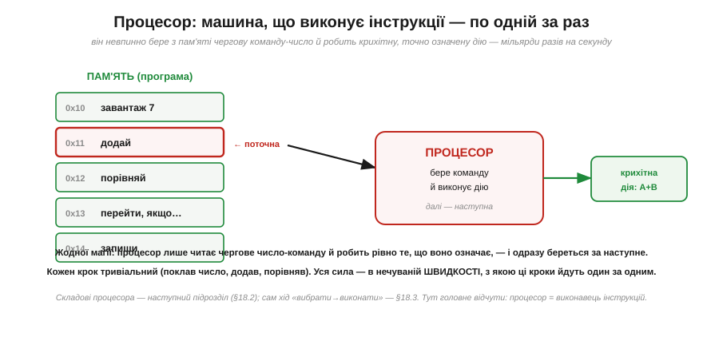
*Рис. 3.5.1.1. Процесор невпинно робить одне й те саме коло: бере з пам'яті чергову команду-число, виконує означену нею **крихітну** дію (поклав число, додав, порівняв) — і одразу переходить до наступної. Жодного «осягнення» задачі загалом: лише потік дрібних, точно визначених кроків, що йдуть один за одним із запаморочливою швидкістю. Складові процесора розкриє §3.5.2, а сам хід «вибрати → виконати» — §3.5.3; тут важливо вловити саму суть.*

Зверніть увагу, чого тут **немає**. Немає розуміння «навіщо». Немає погляду на задачу цілком. Процесор не знає, що ця низка додавань — то нарахування зарплати, а та — політ дрона. Він бачить лише **чергову команду** й виконує її. Уся «картина» існує тільки в голові програміста, що цей список склав. Для процесора програма — це не задум, а просто **наступне число, яке треба виконати**, і так знов і знов. Саме ця вузькість погляду й робить процесор таким простим у своїй основі — і таким передбачуваним.

### Що таке інструкція

Якщо процесор виконує інструкції, треба зрозуміти, що таке **одна інструкція**. І тут чекає головне відрезвлення: інструкція — це щось **до смішного дрібне**.

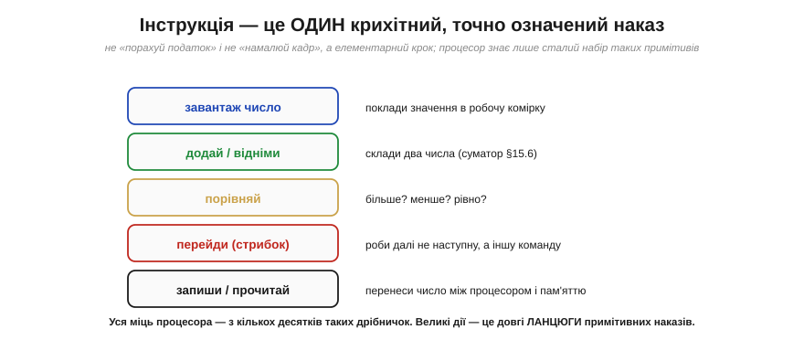
*Рис. 3.5.1.2. Інструкція — не «порахуй податок» і не «намалюй кадр», а елементарний крок: завантаж число, додай два числа, порівняй їх, перенеси число між пам'яттю й процесором, перейди до іншої команди. Процесор знає лише **сталий, невеликий набір** таких примітивів — кілька десятків. Усе грандіозне, що роблять комп'ютери, складається саме з цих дрібничок, вишикуваних у довгі ланцюги.*

Це поворотна думка. Ми звикли думати про комп'ютер у термінах великих дій — «відкрий файл», «надішли повідомлення», «розпізнай обличчя». Та процесор **не вміє** нічого з цього напряму. Він уміє лише крихітні кроки на кшталт «додай ці два числа» чи «порівняй, що більше». «Відкрити файл» — це **тисячі** таких дрібних наказів, складених у потрібному порядку. Велике збудовано з дрібного — точнісінько як у §3.2.7 складні функції поставали з простих вентилів, а тут складні дії постають із простих **інструкцій**. Уся майстерність — у тому, **як** скласти ці дрібнички, щоб з них вийшла осмислена робота.

### Програма — впорядкований список наказів

Якщо одна інструкція — крихітний крок, то **програма** — це довгий **список** таких кроків, що лежить у пам'яті, і процесор іде ним згори вниз.

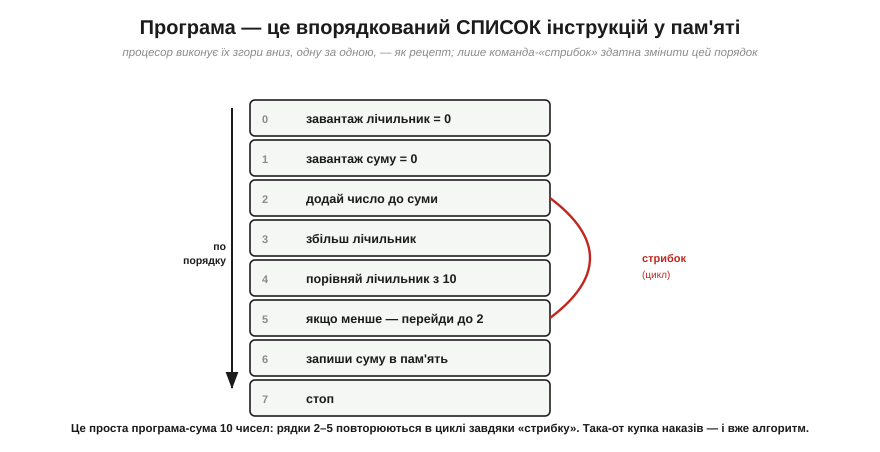
*Рис. 3.5.1.3. Проста програма, що додає десять чисел: інструкції лежать у пам'яті за порядковими адресами (0, 1, 2…), і процесор виконує їх **по черзі**, згори вниз, — як кроки рецепта. Особлива команда — **стрибок** (рядок 5: «якщо менше — перейди до 2») — здатна змінити цей порядок, відіславши процесор назад: так виходить **цикл**, що повторює рядки 2–5, поки не набереться десять. Із купки дрібних наказів уже постає алгоритм.*

Ось де ховається перша справжня сила. Сам собою «список кроків по порядку» — це лінійний рецепт. Та варто додати **стрибок** — команду «роби далі не наступний рядок, а інший», — і програма оживає: може **повторювати** (цикл), може **обирати** (зробити це або те залежно від порівняння). Уся логіка програм, хоч якими складними вони бувають, зводиться до цих простих можливостей: виконувати по порядку, повторювати й розгалужуватися. Процесор дає лише ці примітиви; усе інше — майстерність того, хто складає список.

### Дурний, але швидкий і слухняний

Тепер найважливіше для правильної інтуїції. Хоч процесор і звуть «мозком», він **не розумний** — і це не образа, а буквальна правда, яку конче треба засвоїти.

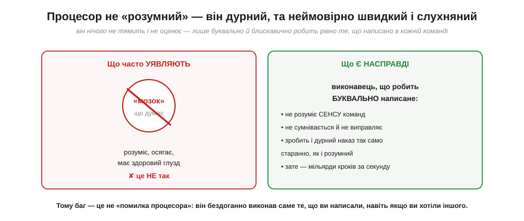
*Рис. 3.5.1.4. Зліва — поширена хибна уява: процесор як «мозок», що думає й розуміє. Справа — як є насправді: виконавець, що робить **буквально** написане, не тямлячи сенсу, не сумніваючись і не виправляючи. Він виконає дурний наказ так само старанно, як розумний. Уся його перевага — не в кмітливості, а в **швидкості**: мільярди простих кроків за секунду.*

Цю властивість варто прочути до кінця, бо вона пояснює природу **багів**. Процесор не має здорового глузду: він не помітить, що команда абсурдна, не здогадається, що ви «насправді мали на увазі інше». Він зробить **точно те, що написано**. Тому коли програма поводиться не так, як ви хотіли, — це майже ніколи не «помилка процесора»: процесор бездоганно виконав саме ваші інструкції; просто інструкції казали не те, що ви думали. Машина нескінченно слухняна й нескінченно буквальна — і вся відповідальність за **сенс** лежить на тому, хто пише команди. Ця думка — психологічний фундамент усього програмування: не чекайте від машини розуміння, давайте їй точні накази.

### Звідки ж береться складність

Виникає природне здивування: якщо кожен крок такий дурний і дрібний, **звідки** беруться ігри, відео, розпізнавання мови, керування літаком? Відповідь — одне слово: **швидкість**.

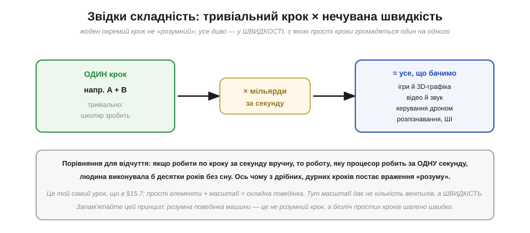
*Рис. 3.5.1.5. Жоден окремий крок не «розумний» — додати два числа здатен школяр. Та помножте цю тривіальність на **мільярди кроків за секунду** — і з неї постає все, що ми бачимо: 3D-графіка, відео, керування дроном, навіть штучний інтелект. Для відчуття масштабу: роботу, яку процесор робить за **одну** секунду, людина, роблячи по кроку щосекунди, виконувала б десятки років без сну.*

Це той самий принцип, що вже двічі траплявся нам у курсі, лише в новому вбранні. У §3.2.7 складна поведінка поставала з простих вентилів, узятих у величезній кількості; тут вона постає з простих інструкцій, узятих із величезною **швидкістю**. «Розумна» поведінка машини — це ілюзія, зіткана з безлічі дурних кроків, що йдуть надзвичайно швидко. Усвідомивши це, ви назавжди втратите містичний острах перед «розумом» комп'ютера — і натомість здобудете правильне відчуття: машина не мудра, вона **нечувано прудка**. А прудкість, помножена на простоту, і дає те, що здається дивом.

### Точна аналогія — і де вона ламається

Зберімо інтуїцію в один образ. Найточніша аналогія процесора — **надшвидкий, бездоганно слухняний клерк**, що сидить над списком однорядкових наказів і виконує їх по черзі, миттєво й без жодної помилки.

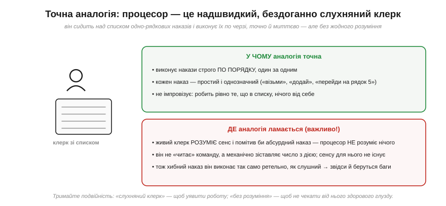
*Рис. 3.5.1.6. Аналогія **точна** в головному: клерк виконує накази строго по порядку, кожен наказ простий і однозначний, і він не імпровізує — робить рівно те, що в списку. Та вона **ламається** в одному вирішальному місці: живий клерк **розуміє сенс** і помітив би абсурдний наказ, а процесор не розуміє нічого — він лише механічно зіставляє число з дією. Тому хибний наказ він виконає так само ретельно, як слушний, — і саме звідси беруться баги.*

Як завжди з аналогіями (згадайте «висоту» для потенціалу в Розділі 1.1), важливо бачити **і** де вона працює, **і** де ні. «Слухняний клерк» чудово передає механіку: по порядку, по одному, точно. Але якщо уявляти клерка **розумним**, аналогія зрадить — бо найголовніша риса процесора в тому, що розуміння в ньому **нуль**. Він не «читає» команду в людському сенсі; для нього команда — це просто число, що вмикає певну дію в його схемах. Тримайте цю подвійність: образ клерка — щоб уявити **роботу**; застереження «без розуміння» — щоб не чекати від машини здорового глузду й завжди давати їй точні, однозначні накази.

> 🔧 **Навіщо це.** Ця інтуїція — фундамент усього, що ви робитимете з мікроконтролером, тож винесіть її твердо. Перше: процесор **виконує інструкції одну за одною** — ваш код на ESP32, скомпільований у машинні команди, це і є той список наказів, що лежить у пам'яті, і процесор сумлінно йде ним крок за кроком. Друге: інструкції **крихітні** (завантаж, додай, порівняй, перейди), а великі дії — це довгі ланцюги дрібних; розуміння цього рятує, коли треба прикинути, **скільки** машина насправді робить (важкий рядок коду може ховати тисячі кроків). Третє, найважливіше психологічно: машина **дурна, буквальна й слухняна** — вона робить рівно те, що написано, а не те, що ви хотіли; тому **баг — це майже завжди ваша інструкція, а не примха заліза**, і шукати причину треба у своєму списку наказів. Четверте: «розумність» комп'ютера — це **швидкість**, а не мудрість; коли ваш код гальмує, питання не «чи машина зрозуміла», а «скільки простих кроків я змусив її зробити». Думайте про процесор як про слухняного клерка, що не тямить сенсу, — і ви писатимете точніший, передбачуваніший код.

---

Підсумок §3.5.1: **процесор** — це машина, що **виконує інструкції одну за одною**, без розуміння й задуму. **Інструкція** — крихітний, точно означений наказ (завантаж, додай, порівняй, перенеси, перейди); процесор знає лише сталий невеликий набір таких примітивів. **Програма** — впорядкований список інструкцій у пам'яті, який процесор проходить згори вниз; команда-**стрибок** дає цикли й розгалуження, і з цього вже постає будь-який алгоритм. Найважливіша інтуїція: процесор **дурний, буквальний і слухняний** — він робить точно написане, тож баг — це майже завжди ваша інструкція, а не помилка заліза. А вся «розумна» поведінка машини — це ілюзія, зіткана з безлічі **простих кроків × нечувана швидкість** (мільярди за секунду). Найточніший образ — надшвидкий слухняний клерк, що виконує накази по черзі, але не тямить їхнього сенсу. Тепер, відчувши процесор як виконавця інструкцій, спитаймо конкретніше: **з яких частин** він складається, щоб усе це робити, — регістри, АЛП, лічильник команд, шина? Це наступний підрозділ.

---

## 3.5.2 Складові: регістри, АЛП, лічильник команд, шина

Ми знаємо, **що** робить процесор — виконує інструкції. Тепер відкриймо корпус і подивімося, **з чого** він зроблений, щоб це могти. На щастя, усі цеглинки нам уже знайомі з попередніх розділів: тут зійдуться суматор (§3.2.6), регістри (§3.3.5), лічильники (§3.3.7) і прапорці (§3.4.4). Процесор — не якесь нове диво, а **розумна композиція** того, що ми вже вміємо будувати. У ньому чотири головні органи: **регістри** (де тримати числа під рукою), **АЛП** (де їх рахувати), **лічильник команд** (де стежити за місцем у програмі) і **шина** (по чому спілкуватися з пам'яттю). Плюс п'ятий, диригент, — **пристрій керування**. Розберімо кожен — і побачимо, як з них складається машина, що виконує накази.

### Регістри: надшвидкий записник процесора

Першими — **регістри** (*registers*). Це крихітні комірки пам'яті **всередині** процесора, кожна завширшки в машинне слово, і їх **дуже мало** — від кількох до кількох десятків. Ми вже знаємо, що таке регістр з §3.3.5: це група тригерів, що тримає слово. Питання — навіщо вони, якщо є велика пам'ять?


*Рис. 3.5.2.1. Регістрів мало й вони крихітні, зате лежать **усередині** процесора, тож доступ до них — миттєвий, за частку такту. Пам'ять натомість величезна, але **далеко** й **повільна** (по неї треба йти через шину). Тому процесор працює так: тягне потрібні числа з пам'яті в регістри, виконує над ними обчислення **у регістрах** (швидко!), і лише тоді відправляє результат назад у пам'ять. Регістри — це робочі «руки» процесора, його чернетка під рукою.*

Це прямий наслідок **вузького місця**, про яке ми читали в історії розділу: пам'ять велика, але до неї довго йти спільною шиною. Якби процесор щоразу лазив у пам'ять по кожне число, він би вічно простоював. Тож конструктори дали йому жменьку **миттєвих** комірок просто всередині, де й кипить уся гаряча робота. Образно: пам'ять — це бібліотека (величезна, та йти далеко), а регістри — кілька аркушів на столі перед вами (мало місця, зате все під рукою й одразу). Розумний працівник тримає на столі рівно те, з чим зараз працює, — так робить і процесор.

### Не всі регістри рівні: спеціальні ролі

Частина регістрів — просто **чернетки** для будь-яких чисел (їх звуть *регістрами загального призначення*). Та кілька мають **особливу** роботу, без якої машина не крутилася б.


*Рис. 3.5.2.2. **PC** (*program counter*, лічильник команд) тримає адресу **наступної** команди — «де ми в програмі». **IR** (*instruction register*, регістр команд) тримає **поточну** команду, яку процесор саме виконує. **Регістри загального призначення** (R0…Rn, акумулятор) — робочі числа: операнди й результати. **FLAGS** (регістр прапорців) зберігає стан останнього обчислення: Z (нуль), N (знак), C (перенос), V (переповнення) — точно ті прапорці з §3.4.4.*

Зверніть увагу, скільки старих знайомих тут зібралося. **Прапорці** Z/N/C/V — це ті самі, що їх виставляла АЛП у §3.4.4, коли ми говорили про переповнення; тепер вони живуть в окремому регістрі стану. А **PC**, як побачимо за мить, — це по суті лічильник із §3.3.7. Процесор не вигадує нових сутностей — він **перевикористовує** все, що ми вже збудували в Розділах 3.2–3.4, лише дає кожному шматку чітку роль.

### АЛП: рахівниця процесора

Тепер серце обчислень — **АЛП** (*ALU, Arithmetic Logic Unit*, арифметико-логічний пристрій). Це той орган, що власне **рахує**: додає, віднімає, порівнює, виконує логічні AND/OR/NOT, зсуває біти. Це і є «Млин» Беббіджа з історії розділу.

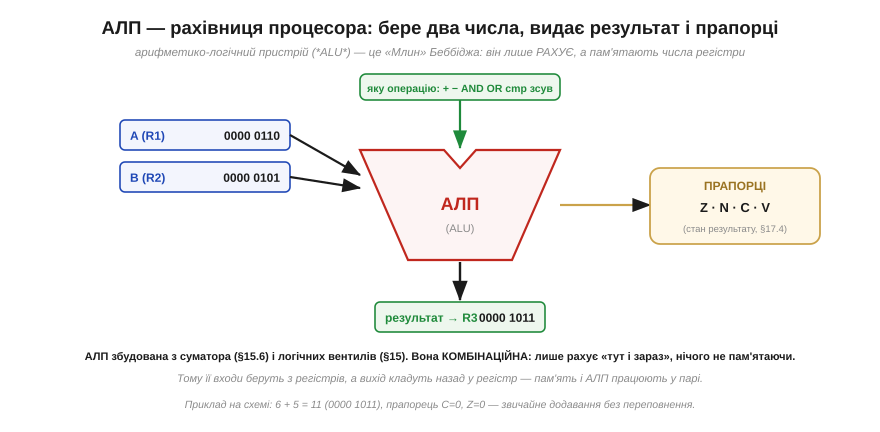
*Рис. 3.5.2.3. АЛП бере **два** числа (зазвичай із регістрів), пристрій керування каже їй, **яку** операцію зробити (+, −, AND, OR, порівняти, зсунути), і вона видає **результат** (назад у регістр) та **прапорці** Z/N/C/V (стан результату). На схемі: 6 + 5 = 11. Усередині АЛП — наш суматор (§3.2.6) і логічні вентилі (§3.2); вона **комбінаційна** (§3.2), тобто лише рахує «тут і зараз», нічого не пам'ятаючи між операціями.*

Ключова думка про АЛП — вона **нічого не пам'ятає** й нічого не вирішує. Це чиста **комбінаційна** схема (згадайте різницю комбінаційного й послідовнісного з Розділів 3.2 і 3.3): подав на входи числа й код операції — миттєво дістав на виході результат, прибрав входи — результат зник. Пам'ять — це робота **регістрів**, рішення — робота **пристрою керування**, а АЛП лише **рахує**. Саме тому її входи завжди беруть із регістрів, а вихід кладуть назад у регістр: АЛП і регістри працюють у нерозлучній парі — одна рахує, інші тримають. (До речі, **порівняти** два числа АЛП уміє тим самим відніманням: відніми B від A й глянь на прапорці — Z=1 означає рівність, знак результату каже, що більше.)

### Лічильник команд: закладка в програмі

Як процесор пам'ятає, **котру** інструкцію виконувати наступною? За це відповідає **лічильник команд** — **PC** (*program counter*). Це спеціальний регістр, що тримає **адресу** наступної команди в пам'яті.

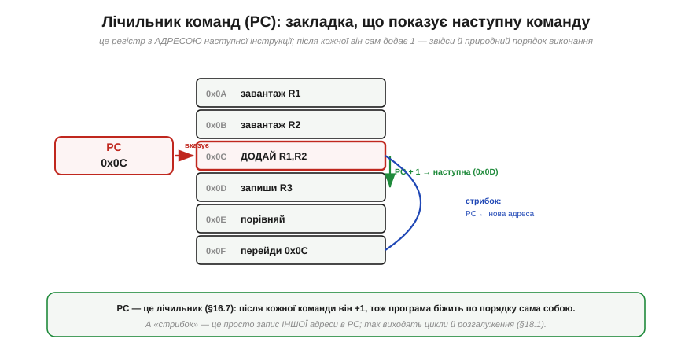
*Рис. 3.5.2.4. PC — це «закладка» в програмі: він указує на комірку з наступною командою. Після того як процесор узяв команду, PC **сам додає 1** і вже вказує на наступну — звідси й береться природне виконання «по порядку». А **стрибок** (jump) — це просто запис **іншої** адреси в PC: хочемо повторити цикл — кладемо в PC адресу його початку (тут 0x0C). PC — це буквально **лічильник** із §3.3.7, лише лічить він не події, а кроки програми.*

Ось де стає конкретним те «місце в списку», про яке ми говорили в §3.5.1. Програма — список команд за адресами; PC — палець, що по ньому веде. Звичайний хід: виконав команду — PC++ — наступна. Це й дає виконання згори вниз **само собою**, без жодних зусиль: лічильник просто рахує далі. А вся магія циклів і розгалужень (§3.5.1) зводиться до **одного** трюку — записати в PC не наступну адресу, а іншу. «Перейди на початок циклу» — це `PC ← адреса початку`. «Якщо рівно, пропусти команду» — це умовна зміна PC залежно від прапорця Z. Уся структура програм тримається на цьому скромному лічильнику.

### Шина: спільні дроти до пам'яті

Лишилося з'ясувати, **по чому** процесор спілкується з пам'яттю (і зі світом). По **шині** (*bus*) — наборах спільних дротів.


*Рис. 3.5.2.5. Шина — це три набори ліній. **Адресна** (*address bus*) каже, **куди** звертаємось — номер комірки пам'яті (її ширина задає, скільки пам'яті машина взагалі може адресувати). **Шина даних** (*data bus*) несе **саме число** — туди (записати) й назад (прочитати). **Шина керування** (*control bus*) передає сигнали «читати»/«писати» й такт. Тими самими дротами користуються й пам'ять, і пристрої вводу/виводу.*

Дві практичні дрібниці про шину. Перша: **ширина шини даних** — це і є та «розрядність», про яку ми говорили в §3.4.7. 8-бітна шина носить один байт за такт, 32-бітна — чотири; ось чому ширша шина (і слово) означає більшу пропускну здатність. Друга, вже знайома: шина **спільна** — і саме тому вона є тим **вузьким місцем**, про яке попереджав фон Нейман (історія розділу). І команди, і дані течуть тими самими дротами, тож процесор не може водночас брати інструкцію й возити дані — звідси затори, з якими інженери воюють кешами й хитрощами (а §3.5.7 покаже архітектуру, що дає коду й даним **окремі** шини).

### Як це збирається в машину

Тепер складімо все докупи. П'ятий орган, якого ми ще не називали, — **пристрій керування** (*control unit*) — і є той диригент, що змушує решту працювати злагоджено.


*Рис. 3.5.2.6. Повна картина: **пристрій керування** читає поточну команду (з IR), розуміє, що вона означає, і **диригує** рештою — каже PC рушити далі, обирає, які регістри подати на АЛП, задає АЛП операцію, командує шиною читати чи писати. **Регістри** тримають числа, **АЛП** їх рахує, **PC** стежить за місцем у програмі, **шина** возить усе до пам'яті. Кожен орган простий; разом вони й утворюють машину, що виконує інструкції.*

Не переймайтеся поки **точним порядком** цих дій — це сюжет наступного підрозділу. Тут важливо побачити саму **анатомію**: п'ять простих частин, кожна з яких ми вже розуміємо окремо (регістр — тригери; АЛП — суматор і вентилі; PC — лічильник; шина — дроти; керування — логіка, що декодує команду), з'єднані так, що разом вони вибирають команди з пам'яті й виконують їх. Жодної окремої «магії» — лише знайомі цеглинки в розумній композиції.

> 🔧 **Навіщо це.** Ця анатомія — не абстракція, а те, з чим ви зіткнетесь упритул, тільки-но візьметеся за мікроконтролер на нижчому рівні. Перше: **регістри** — найшвидша пам'ять, і вся гаряча робота йде в них; коли в Модулі 4 ви побачите асемблер чи оптимізації компілятора, мова йтиме саме про те, як ефективно «жонглювати» жменькою регістрів, не бігаючи зайвий раз у повільну пам'ять. Друге: **прапорці** Z/N/C/V (§3.4.4) — це те, на чому тримаються всі `if` і цикли: процесор порівнює числа АЛП, виставляє прапорці, а потім стрибає або ні залежно від них. Третє: **PC** — це «де виконується програма»; коли ваш код «вилітає» в незрозуміле місце (а в Модулі 4 ви побачите такі збої), це часто означає, що в PC потрапила хибна адреса. Четверте: **шина** та її ширина — це пряма межа швидкодії; розуміючи «вузьке місце», ви не дивуватиметеся, чому процесор із удвічі вищою частотою не завжди вдвічі швидший. Тримайте цю карту в голові — і робота мікроконтролера перестане бути чорною скринькою.

---

Підсумок §3.5.2: процесор складається з небагатьох простих органів, усі знайомі з Розділів 3.2–3.4. **Регістри** (§3.3.5) — крихітні надшвидкі комірки всередині CPU, робочий записник; серед них спеціальні: **PC** (адреса наступної команди), **IR** (поточна команда), регістри **загального призначення** (операнди/результати) і **FLAGS** (прапорці Z/N/C/V, §3.4.4). **АЛП** (§3.2.6 + вентилі §3.2) — комбінаційна «рахівниця»: бере два числа й код операції, видає результат і прапорці, нічого не пам'ятаючи. **Лічильник команд PC** — це лічильник (§3.3.7), що тримає адресу наступної команди, сам +1 (звідси порядок), а «стрибок» — це запис іншої адреси в PC. **Шина** (адресна + даних + керування) сполучає процесор із пам'яттю й В/В; ширина шини даних — це розрядність (§3.4.7), а її спільність — те саме «вузьке місце». Диригує всім **пристрій керування**. Ми розклали процесор на частини — та поки не бачили їх **у дії**. Як саме ці органи, такт за тактом, спільно виконують одну команду? Це — **цикл «вибірка → декодування → виконання»**, серцебиття процесора, і йому присвячено наступний підрозділ.

---

## 3.5.3 Цикл «вибірка → декодування → виконання»

У §3.5.2 ми розклали процесор на органи; тепер запустімо їх **у рух**. Бо процесор робить, по суті, одне-єдине — невпинно повторює коротке коло з трьох кроків, і кожен його оберт виконує рівно **одну** інструкцію. Це коло — **цикл «вибірка → декодування → виконання»** (*fetch–decode–execute cycle*), і його недарма звуть **серцебиттям** процесора: воно б'ється рівномірно, такт за тактом, від увімкнення живлення до вимкнення, мільярди разів на секунду. Зрозумівши цей цикл, ви зрозумієте найголовніше — **як насправді виконується програма**: не якимось чаклунством, а простим колом, що крутиться знов і знов. Розберімо кожну фазу окремо, потім проженемо крізь них одну команду, а тоді побачимо, як такт жене це серце.

### Серцебиття: три фази по колу

Спершу — погляд згори. Процесор безкінечно ходить тим самим колом із трьох фаз.

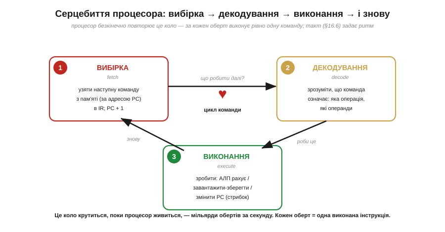
*Рис. 3.5.3.1. **Вибірка** (fetch): узяти з пам'яті наступну команду — ту, на яку вказує PC, — у регістр команд IR, і пересунути PC на наступну. **Декодування** (decode): пристрій керування розбирає, що ця команда означає (яка операція, які операнди). **Виконання** (execute): власне зробити — АЛП порахувати, або завантажити/зберегти число, або змінити PC (стрибок). А тоді коло замикається й починається знову. Один оберт = одна виконана інструкція.*

Зверніть увагу на красу цієї простоти. Хоч би що робив комп'ютер — рахував зарплату, малював гру, керував дроном — усередині процесор робить **тільки це**: вибрав, зрозумів, виконав, вибрав, зрозумів, виконав… Уся незліченна різноманітність програм зводиться до того, що в цьому колі щоразу трапляється **інша** команда. Коло те саме; команди різні. Це і є та глибока думка з §3.5.1 — складність із простоти й швидкості — тепер у конкретному, механічному вигляді.

### Фаза 1 — вибірка: узяти команду

Перша фаза відповідає на питання «**котру** команду виконувати?». Відповідь дає **PC** — у ньому лежить адреса наступної команди.

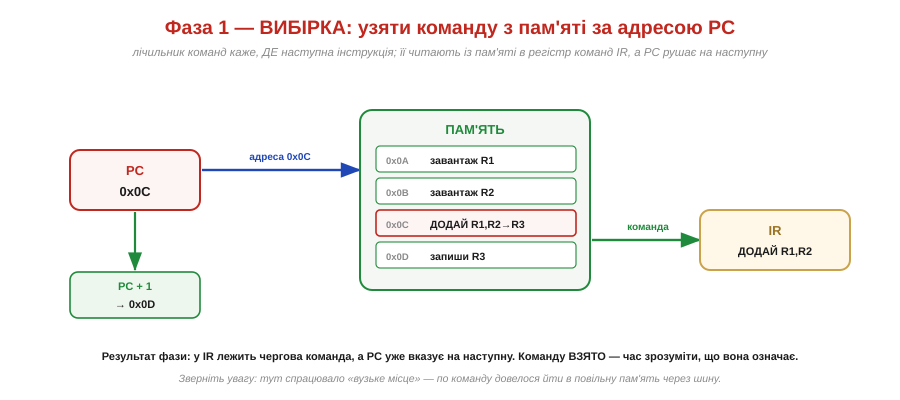
*Рис. 3.5.3.2. Процесор бере адресу з PC (тут 0x0C), виставляє її на адресну шину, і пам'ять повертає по шині даних команду, що там лежить, — у регістр команд **IR**. Одразу ж **PC += 1** (стає 0x0D), готуючись до наступної. Результат фази: у IR — чергова команда, PC уже вказує на наступну. Зауважте: по команду довелося сходити в **повільну** пам'ять через шину — це той самий обмін, що впирається у «вузьке місце».*

Це найпрямолінійніша фаза, та й найважливіша для розуміння **порядку**. Саме тут PC робить своє `+1`, і саме звідси береться те, що програма виконується «згори вниз» сама собою: вибрали команду за адресою N — PC став N+1 — наступного оберту виберемо команду N+1. Лічильник просто рахує далі, і код тече по порядку без жодних зусиль. (А якщо виконана команда виявиться «стрибком», вона в третій фазі **перепише** PC — і наступна вибірка прийде вже з іншого місця. Так природний порядок порушується лише там, де ми того схотіли.)

### Фаза 2 — декодування: зрозуміти команду

Команда вже в IR — але це лише **число**. Що воно означає? З'ясувати це — робота другої фази, яку виконує **пристрій керування**.


*Рис. 3.5.3.3. Пристрій керування читає число-команду в IR і **розкладає** його на складники: яка це **операція** (додати), які **операнди** (регістри R1 і R2), куди йде **результат** (R3). Тобто перетворює команду на набір **сигналів керування** — «увімкни в АЛП додавання, подай їй R1 і R2, наготуй R3 для результату». Як саме операція й операнди закодовані в числі — тема §3.5.4; тут важливо, що декодер **нічого не рахує**, лише розуміє наказ.*

Тут варто зупинитися на одній думці, що єднає цей розділ із §3.4.1. Команда в IR — це **число**, але пристрій керування читає його за певною **домовленістю** (це і є набір інструкцій, §3.5.4): такі-то біти кажуть «яка операція», такі-то — «який регістр». Декодування — це і є застосування цієї домовленості: перетворення байтів-команди на конкретні дії органів. Жодного розуміння «сенсу» (згадайте §3.5.1: процесор дурний) — лише механічне зіставлення бітів команди з тим, які дроти ввімкнути. Декодер — це, по суті, велика комбінаційна схема (§3.2), що з коду команди робить сигнали керування.

### Фаза 3 — виконання: зробити

Декодер усе наготував — лишилося **зробити**. Третя фаза власне виконує команду.


*Рис. 3.5.3.4. За сигналами декодера операнди з регістрів (R1=6, R2=5) подаються в **АЛП**, та виконує задану операцію (+), і результат (11) лягає в регістр R3; заразом **оновлюються прапорці** (Z=0, C=0…). Команду виконано — і цикл вертається до вибірки наступної. Для іншої команди третя фаза інша: «завантаж/запиши» возить число шиною між регістром і пам'яттю, а «стрибок» кладе нову адресу в PC. Та перші дві фази (вибірка й декодування) **завжди однакові**.*

Ось чому виконання — найрізноманітніша фаза. Вибірка завжди та сама (взяти команду за PC), декодування теж однотипне (розібрати команду), а от **що саме** робиться у виконанні, залежить від команди: арифметика йде в АЛП, доступ до пам'яті — по шині, стрибок міняє PC. Можна сказати, що перші дві фази **готують**, а третя **діє**. І хоч дій багато, усі вони — з того невеликого набору примітивів, що ми бачили в §3.5.1.

### Наскрізний прохід: одна команда від початку до кінця

Тепер найкорисніше — простежмо **одну** команду крізь усі три фази й подивімося, як міняється стан машини на кожному кроці.


*Рис. 3.5.3.5. Команда «ДОДАЙ R1,R2→R3» крізь цикл. **Після вибірки**: команда в IR, PC уже зсунутий на 0x0D, R3 ще порожній. **Після декодування**: відомо, що це додавання R1+R2 у R3, АЛП наготовлена. **Після виконання**: R3=11, прапорці оновлено (Z=0, C=0), і процесор негайно береться за наступну команду. Помножте цей крихітний танок на мільярди разів за секунду — і дістанете все, на що здатен комп'ютер.*

**Приклад (один оберт циклу).** Простежмо команду додавання покроково.

```
старт:    PC = 0x0C,  IR = ?,        R1=6, R2=5, R3=?
вибірка:  читаємо [0x0C] → IR = "ДОДАЙ R1,R2→R3";  PC стає 0x0D
декодув.: операція=+, джерела=R1,R2, призначення=R3
виконан.: АЛП: 6 + 5 = 11 → R3;  прапорці: Z=0, C=0, N=0, V=0
кінець:   PC = 0x0D,  R3 = 11   → і одразу вибірка команди [0x0D]
```

Ось вона, вся механіка «виконання програми» в одному прикладі. Зверніть увагу, що нічого таємничого не сталося — кожен крок робив рівно те, що ми вже розуміємо з §3.5.2: PC дав адресу, шина принесла команду, декодер її розібрав, АЛП порахувала, регістр прийняв результат, прапорці відбили стан. Програма «біжить» — це просто це коло, що крутиться.

### Такт жене серце; програма біжить

Що ж **рухає** цей цикл крок за кроком? **Такт** — той самий тактовий сигнал, що ми вивчали в §3.3.6 як спільний ритм для всіх тригерів.


*Рис. 3.5.3.6. Кожна фаза займає один-два **такти**, тож одна команда — це кілька тактів (вибірка, декодування, виконання). Цикл повторюється для команди за командою — і це **і є** програма, що біжить. «Стрибок» спрямовує цикл назад (виходить **повтор** — цикл програми) або вперед (розгалуження). Що швидший такт, то більше обертів за секунду — це і є «**частота**» процесора (§3.5.5). А робити кілька фаз водночас (поки одна команда виконується, наступну вже вибирати) навчимося в §3.5.6.*

Тут сходяться дві великі нитки курсу. Такт із §3.3.6 — це **метроном**, що відбиває ритм, під який цокає серцебиття процесора: кожен удар такту просуває цикл на крок. А «**збережена програма**» з історії розділу тепер постає в дії: процесор буквально **читає числа з пам'яті й тлумачить їх як накази собі** — оберт за обертом, за вказівкою PC. Програма не «запускається» якимось особливим чином; вона просто **лежить у пам'яті**, а цикл вибірка-декодування-виконання невпинно її **протягує** крізь процесор. Оце і є відповідь на питання, як купа вентилів і регістрів оживає програмою: вона не оживає — вона просто **дуже швидко крутить це коло**.

> 🔧 **Навіщо це.** Цикл вибірка-декодування-виконання — це ментальна модель, що пояснює дуже багато з того, з чим ви зіткнетеся. Перше: коли в Модулі 4 ви рахуватимете, скільки часу займе шматок коду, ви рахуватимете **такти** — скільки команд × скільки тактів на команду; ця модель дає основу таких оцінок. Друге: розуміння, що **кожна** команда йде через вибірку з пам'яті, пояснює, чому доступ до пам'яті дорогий і чому регістри (§3.5.2) такі цінні — вони пропускають похід по шині. Третє: коли програма «зависає» чи «вилітає», корисно думати в термінах циклу — найчастіше це PC потрапив не туди (виконав сміття замість команди) або цикл зациклився не на тому стрибку. Четверте: ця сама модель — фундамент розуміння **частоти** (§3.5.5: скільки циклів за секунду) і **конвеєра** (§3.5.6: як ці цикли перекривати), тож засвоївши її тепер, ви легко візьмете й те. Тримайте картину серцебиття в голові — і робота процесора стане прозорою, а не магічною.

---

Підсумок §3.5.3: процесор невпинно повторює **цикл із трьох фаз** — серцебиття машини. **Вибірка**: узяти команду з пам'яті за адресою PC у регістр IR, PC += 1 (звідси порядок виконання). **Декодування**: пристрій керування розбирає число-команду в IR на операцію й операнди, перетворюючи її на сигнали керування (за домовленістю — набором інструкцій, §3.5.4). **Виконання**: власне зробити — АЛП рахує (результат у регістр, прапорці оновлюються), або доступ до пам'яті по шині, або зміна PC (стрибок); перші дві фази завжди однакові, третя залежить від команди. Рухає цикл **такт** (§3.3.6): кожна фаза — такт-два, тож команда триває кілька тактів. Цей цикл, що крутиться, **і є** програма в дії: процесор читає числа з пам'яті й тлумачить їх як накази (збережена програма фон Неймана наживо). Ми бачили, що декодування читає команду «за домовленістю» — але **якою саме**? Який набір команд узагалі знає процесор і як вони закодовані числами? Це — **набір інструкцій (ISA)**, мова процесора, і про неї наступний підрозділ.

---

## 3.5.4 Набір інструкцій (ISA): мова процесора (машинний код)

У §3.5.3 декодер читав команду «за домовленістю». Настав час назвати цю домовленість на ім'я: **набір інструкцій**, або **ISA** (*Instruction Set Architecture*). Це — повний **словник** команд, які процесор уміє виконувати, разом із точним правилом, **як** кожна команда записана числом. Інакше кажучи, ISA — це **мова** процесора: усе, що йому можна наказати, і як ці накази закодувати в біти. Усе, що ми робили в Розділі 3.4 (кодували числа), і в §3.5.1–3.5.3 (виконували команди), сходиться тут: команда — це теж число, а ISA — домовленість, що робить із числа наказ. Цей підрозділ — про цю мову: як команда влаштована всередині, чим машинний код різниться від асемблера, які бувають родини команд, чому кожен процесор говорить **своєю** мовою — і чому ця мова виявляється однією з найдовговічніших речей у всій техніці.

### ISA — контракт між софтом і залізом

Найкорисніше думати про ISA як про **контракт** — узгоджену межу між двома світами.

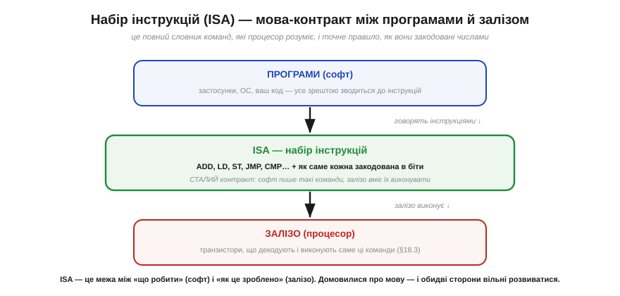
*Рис. 3.5.4.1. Згори — **програми** (ваш код, операційна система, застосунки); зрештою все це зводиться до інструкцій. Знизу — **залізо**: транзистори, що декодують і виконують команди (§3.5.3). Між ними — **ISA**: повний набір команд (ADD, LD, ST, JMP, CMP…) і правило їхнього кодування. Софт «говорить» цими командами, залізо вміє їх виконувати. Домовившись про мову, обидві сторони стають вільні: програміст не мусить знати, як саме збудований процесор, а інженер — які програми на ньому крутитимуться.*

Це і є головна цінність ISA — вона **розділяє** два світи. Програмісту достатньо знати **мову** (які команди є й що вони роблять), а не внутрішню будову кремнію. Інженеру-схемотехніку достатньо чесно **виконувати** цю мову, а не знати, які програми писатимуть. ISA — це немов спільна мова між замовником і виконавцем: домовилися про слова — і далі кожен робить своє. Ми ще побачимо, яку величезну свободу це дає обом сторонам.

### Команда — це число, розбите на поля

Зазирнімо всередину однієї команди. Ми вже знаємо з §3.5.1, що команда — це число; тепер подивімося, **як** у цьому числі закодовано наказ.

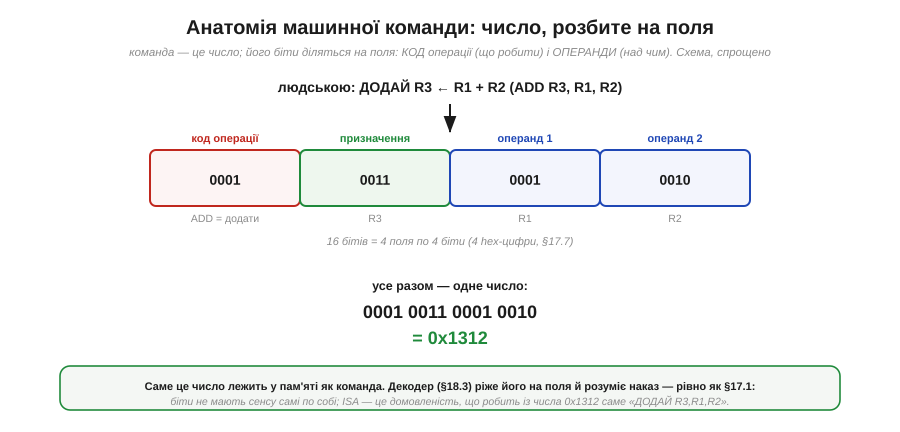
*Рис. 3.5.4.2. Команда «ДОДАЙ R3 ← R1 + R2» закодована числом, біти якого поділені на **поля**. Перше поле — **код операції** (*opcode*): 0001 означає «додати». Решта полів — **операнди**: куди покласти результат (R3), що додавати (R1 і R2). Тут — спрощена 16-бітна схема: чотири поля по 4 біти. Усі разом дають одне число: 0001 0011 0001 0010 = **0x1312**. Саме воно лежить у пам'яті як команда, і саме його декодер (§3.5.3) ріже на поля.*

Ось де остаточно змикається ниточка, протягнута з §3.4.1. Пам'ятаєте головну думку Розділу 3.4 — **біти не мають вродженого сенсу, сенс їм надає домовленість**? Число 0x1312 саме по собі — просто число. Та за домовленістю **ISA** його старші біти читаються як «яка операція», молодші — як «над якими регістрами», і число стає наказом «ДОДАЙ R3,R1,R2». Декодування з §3.5.3 — це і є застосування цієї домовленості: розрізати число на поля й увімкнути відповідні дроти. (Зверніть увагу й на §3.4.7: 16-бітна команда — це рівно чотири hex-цифри, і кожна тут — окреме поле, що робить 0x1312 таким зручним для читання. Реальні ISA кодують складніше, та принцип той самий: команда — число з полів.)

### Асемблер: читабельний правопис машинного коду

Писати програми числами на кшталт 0x1312 — пекло. Тому ту саму команду записують **словами**.

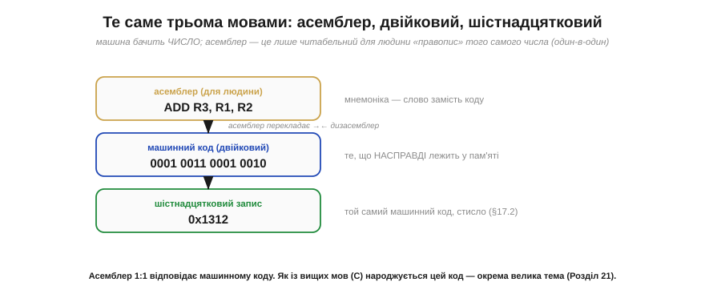
*Рис. 3.5.4.3. Одна команда у трьох виглядах. **Асемблер** — `ADD R3, R1, R2` — людська мнемоніка (слово замість коду). **Машинний код** — `0001 0011 0001 0010` — те, що насправді лежить у пам'яті. **Шістнадцятковий** — `0x1312` — той самий машинний код, лише стисло (§3.4.2). Програма-**асемблер** перекладає мнемоніки в числа, а **дизасемблер** — назад. Машина бачить тільки число; асемблер — це читабельний для людини «правопис» того самого числа, один-в-один.*

Підкреслимо: **асемблер** (*assembly language*) не є якоюсь окремою мовою «над» машинним кодом — це **той самий** машинний код, лише записаний словами замість чисел, рядок-у-рядок. `ADD R3,R1,R2` і `0x1312` — це одне й те саме, у різному вбранні. Саме тому асемблер — найнижча мова, якою ще пише людина: нижче вже самі числа. (А як із зрозумілих людині **вищих** мов, як-от C, народжується цей машинний код, — це окрема велика історія компіляції, якій присвячено цілий Розділ 4.2. Поки що тримаймо просте: що б ви не написали, зрештою воно стає числами-командами ISA.)

### Словник процесора: родини команд

Скільки ж усього команд у мові процесора? На диво **небагато** — кілька десятків, що групуються в кілька родин.

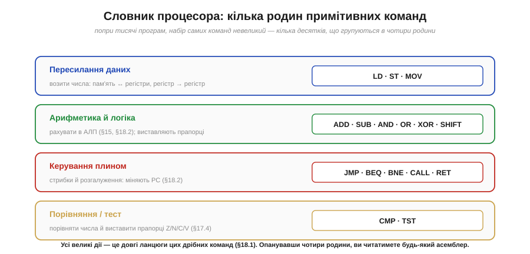
*Рис. 3.5.4.4. Майже всі команди будь-якого процесора падають у чотири родини. **Пересилання даних** (LD, ST, MOV) — возити числа між пам'яттю й регістрами. **Арифметика й логіка** (ADD, SUB, AND, OR, XOR, зсуви) — рахувати в АЛП (§3.2, §3.5.2). **Керування плином** (JMP, BEQ, BNE, CALL, RET) — стрибки й розгалуження, що міняють PC (§3.5.2). **Порівняння/тест** (CMP, TST) — виставити прапорці Z/N/C/V (§3.4.4). Попри тисячі програм, сам словник крихітний.*

Це пряме підтвердження думки з §3.5.1: процесор знає **мало** примітивів, а вся складність — у тому, як їх скласти в довгі ланцюги. Опанувавши ці чотири родини, ви, по суті, розумієте асемблер **будь-якого** процесора — бо хоч мнемоніки й кодування різняться, набір **ідей** усюди той самий: перенеси, порахуй, порівняй, стрибни. Це невеличкий, осяжний людиною словник — і з нього збудовано геть усе програмне забезпечення на світі.

### Різні процесори — різні мови

А тепер важлива практична правда: ISA **не одна**. Кожне сімейство процесорів має **власний** набір інструкцій.

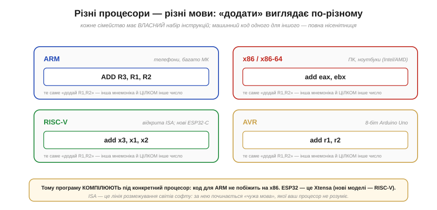
*Рис. 3.5.4.5. Та сама дія «додати два числа» різними мовами: **ARM** — `ADD R3,R1,R2`; **x86** — `add eax,ebx`; **RISC-V** — `add x3,x1,x2`; **AVR** (Arduino Uno) — `add r1,r2`. Різняться не лише мнемоніки — **цілком** різне кодування числами: машинний код для ARM на x86 — суцільна нісенітниця. Тому програму **компілюють** під конкретний процесор. ESP32 побудований на ядрах Xtensa (а новіші моделі серії C — на RISC-V).*

Ось чому ви не можете взяти готову програму з ПК (x86) і просто залити її в мікроконтролер (ARM чи Xtensa) — це **різні мови**, і число-команда однієї для іншої безглузда. Програму треба **скомпілювати** саме під ту ISA, на якій вона працюватиме (звідси й вибір «плати-цілі» в середовищі розробки). ISA — це лінія розмежування світів софту: за нею починається чужа мова, якої ваш процесор просто не розуміє. Чим саме мови різняться по **духу** (прості й однакові команди проти складних і різнокаліберних) — це окрема тема RISC проти CISC, до якої ми дійдемо у §3.5.8.

### Сила ISA — у сталості

Наостанок — найглибша властивість ISA, заради якої її варто оцінити. ISA — це не просто мова, а **довговічний контракт**, що дає софту й залізу розвиватися **окремо**.

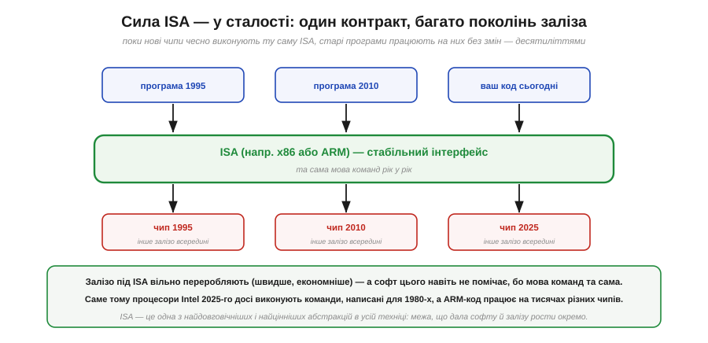
*Рис. 3.5.4.6. ISA посередині — стабільний інтерфейс. Згори — програми різних років; знизу — чипи різних поколінь. Поки кожен новий чип чесно виконує **ту саму** ISA, старі програми працюють на ньому **без змін**. Залізо під ISA можна як завгодно переробляти — швидше, економніше, з мільярдами нових транзисторів, — а софт цього навіть не помічає, бо мова команд та сама. Тому процесори Intel 2025 року досі виконують команди, написані в 1980-х, а той самий ARM-код працює на тисячах різних чипів.*

Це — одна з найпотужніших абстракцій в усій техніці. **Контракт** ISA розв'язує руки обом сторонам: інженери щороку переробляють кремній (швидше, менше енергії, нові хитрощі — кеші, конвеєри), не ламаючи **жодної** наявної програми; а програмісти пишуть код, не знаючи й не переймаючись, на якому саме чипі він колись побіжить. Без сталої ISA кожне нове залізо вимагало б переписувати весь софт — як за часів ENIAC, що його доводилося перекомутовувати під кожну задачу (історія розділу). ISA — це межа, що дала програмному й апаратному світам **рости незалежно** десятиліттями. У цьому її справжня велич — не в конкретних командах, а в **стабільності** домовленості.

> 🔧 **Навіщо це.** ISA — поняття, що прямо стосується вашої щоденної роботи, навіть якщо ви ніколи не писатимете асемблером. Перше: коли ви обираєте «плату» чи «ціль» у середовищі розробки, ви насправді обираєте **ISA**, під яку компілювати; код для ESP32 (Xtensa) не побіжить на Arduino Uno (AVR) — це різні мови. Друге: розуміння, що команда — це **число з полів** (opcode + операнди), знадобиться, коли ви заглядатимете в дизасембльований код чи налагоджуватимете на низькому рівні в Модулі 4 — ви бачитимете саме ці поля. Третє: **асемблер = машинний код словами**; коли компілятор покаже вам асемблерний вивід, знайте, що це буквально те, що виконає процесор, один-в-один. Четверте, найважливіше концептуально: **ISA — стабільний контракт**, тому ваш код переживе залізо; і навпаки — той самий код треба перекомпілювати під іншу ISA. Тримайте в голові цю межу між «мовою» (ISA) і «залізом, що її виконує» — вона пояснює і чому програми переносні в межах однієї ISA, і чому не переносні між різними.

---

Підсумок §3.5.4: **набір інструкцій (ISA)** — це мова процесора: повний словник команд, які він уміє, плюс правило, **як** кожна закодована числом. Команда — це число, поділене на **поля**: **код операції** (opcode — що робити) і **операнди** (над чим); декодер (§3.5.3) ріже число на ці поля. Це пряме втілення §3.4.1: ISA — домовленість, що робить із числа (0x1312) наказ (ДОДАЙ R3,R1,R2). **Асемблер** — той самий машинний код, записаний читабельними мнемоніками (один-в-один), найнижча людська мова. Команди групуються в кілька **родин**: пересилання даних, арифметика/логіка, керування плином, порівняння — словник невеликий, попри безмежжя програм. Кожне сімейство процесорів має **власну** ISA (ARM, x86, RISC-V, AVR, Xtensa ESP32), тож код **компілюють** під ціль. А найцінніше — ISA є **сталим контрактом**: поки нові чипи виконують ту саму ISA, старий софт працює без змін, і залізо та софт ростуть незалежно. Тепер про те, як швидко процесор крутить свій цикл: що насправді означає «**частота**» процесора в мегагерцах — наступний підрозділ.

---

## 3.5.5 Що означає «частота» процесора

«ESP32 на 240 МГц», «ПК на 4 ГГц» — частоту наводять усюди як головну міру швидкодії. Та що саме вона означає й чому це число оманливе? У §3.5.3 ми бачили, що процесор крутить цикл вибірка-декодування-виконання, а рухає цей цикл **такт** (§3.3.6). Частота — це і є **темп такту**: скільки разів за секунду він цокає. Здавалося б, усе просто: більше тактів — швидше. Та за цією простотою ховається кілька важливих підступів, через які «мегагерци» легко обертаються міфом. Цей підрозділ — про те, що частота означає насправді, чому однакові МГц не означають однакову швидкість, що ставить фізичну стелю частоті й чому гонитва за гігагерцами зрештою вперлася в стіну, розвернувши всю індустрію.

### Частота — це такти за секунду

Почнімо з означення. Частота (*clock frequency*) — це кількість тактів процесора за секунду, виміряна в **герцах** (*Hz*).

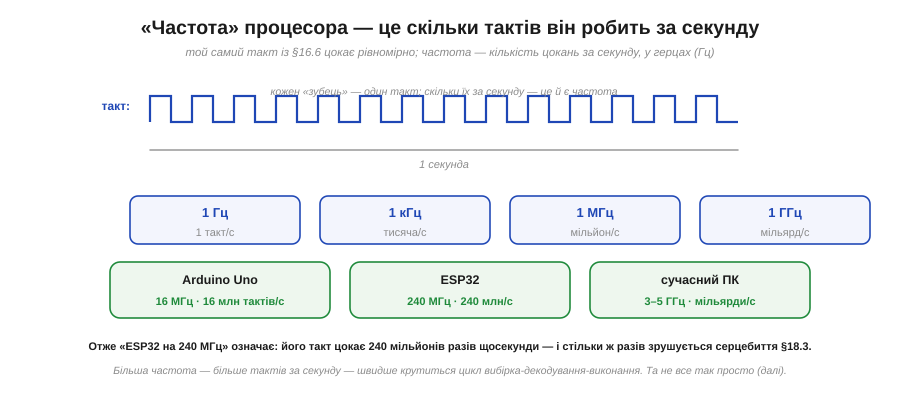
*Рис. 3.5.5.1. Той самий тактовий сигнал із §3.3.6 рівномірно цокає; частота — скільки «зубців» уміщається в секунді. 1 Гц = 1 такт/с, 1 **кГц** = тисяча, 1 **МГц** = мільйон, 1 **ГГц** = мільярд тактів за секунду. Тож Arduino Uno на 16 МГц робить 16 мільйонів тактів щосекунди, ESP32 на 240 МГц — 240 мільйонів, а сучасний ПК на 3–5 ГГц — кілька мільярдів.*

Отже, «240 МГц» — це не якась абстрактна «потужність», а буквально **240 мільйонів цокань такту щосекунди**. І кожне цокання, як ми знаємо з §3.5.3, просуває серцебиття процесора на крок. Це й робить частоту такою привабливою мірою: більше тактів за секунду — швидше крутиться цикл, більше встигається. Усе так — але це лише **початок** правди.

### Швидший такт — більше обертів циклу

Спершу закріпімо просту, **правильну** частину інтуїції: за тієї самої логіки швидший такт справді робить більше роботи.

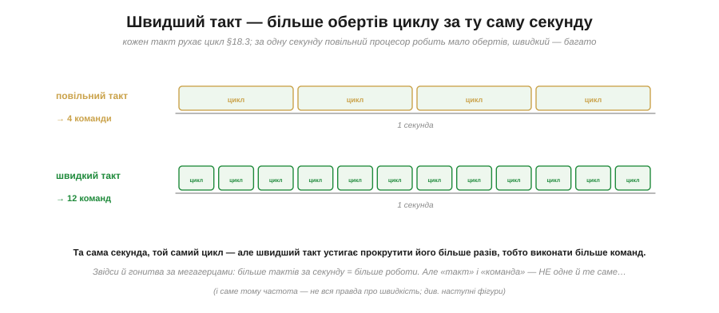
*Рис. 3.5.5.2. За одну й ту саму секунду повільний такт устигає прокрутити цикл §3.5.3 лише кілька разів (мало виконаних команд), а швидкий — багато (більше команд). Цикл той самий — різниться лише, скільки разів він обернувся. Звідси й уся гонитва за частотою: більше тактів за секунду = більше роботи.*

Це чесний бік медалі: якщо взяти **той самий** процесор і підняти йому частоту, він і справді працюватиме швидше — пропорційно. Саме тому розгін (overclocking) має сенс, і саме тому в налаштуваннях мікроконтролера ви можете обрати вищу частоту, щоб устигати більше (ціною тепла — про що далі). Проблема починається, коли частоту намагаються використати для порівняння **різних** процесорів. Бо тут вилазить перший підступ.

### Підступ: одна команда — це кілька тактів

Найпоширеніша помилка — гадати, що один такт = одна команда. Це **не** так.

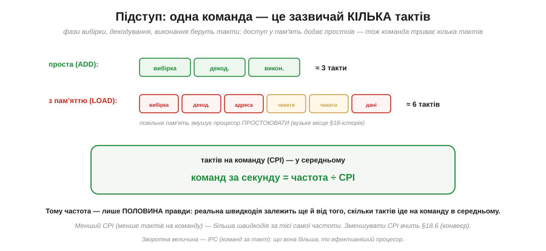
*Рис. 3.5.5.3. Навіть проста команда (ADD) проходить кілька фаз — вибірка, декодування, виконання — і кожна бере такт-два. А команда з доступом у пам'ять (LOAD) ще й **простоює**, чекаючи на повільну пам'ять (те саме «вузьке місце» з історії розділу), тож триває ще довше. Середню кількість тактів на команду звуть **CPI** (*cycles per instruction*). Реальна швидкодія: **команд за секунду = частота ÷ CPI**.*

Ось і ключова поправка. Частота каже, скільки **тактів** за секунду, а не скільки **команд**. Щоб дістати команди, треба поділити частоту на **CPI** — середнє число тактів, яке йде на одну команду. Якщо процесор витрачає в середньому 4 такти на команду, то на 200 МГц він виконує лише 50 мільйонів команд за секунду, а не 200. CPI залежить від багато чого: від ISA (§3.5.4), від того, як часто доводиться лазити в повільну пам'ять, від хитрощів самого процесора. (Зворотна величина — **IPC**, команд за такт: що вона більша, то ефективніший процесор. А зменшувати CPI — робити більше за такт — навчить наступний підрозділ про конвеєр, §3.5.6.) Висновок простий: **частота — лише половина правди**; друга половина — скільки тактів іде на команду.

### Міф мегагерців

З цієї поправки випливає знаменитий **«міф мегагерців»**: вища частота не означає вищу швидкість.

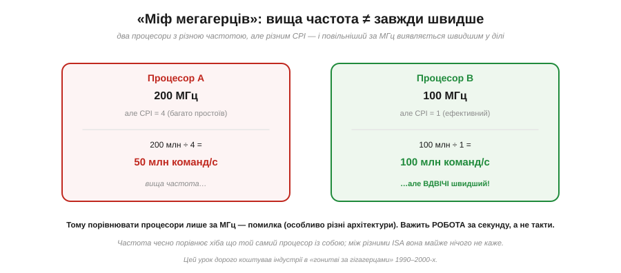
*Рис. 3.5.5.4. Процесор A працює на 200 МГц, але має CPI = 4 (багато простоїв) — отже, 200 ÷ 4 = **50 мільйонів** команд/с. Процесор B працює лише на 100 МГц, зате CPI = 1 (ефективний) — 100 ÷ 1 = **100 мільйонів** команд/с. Виходить, що B із **удвічі меншою** частотою працює **вдвічі швидше** за A! Бо важить не кількість тактів, а **робота** за секунду.*

Ось чому порівнювати процесори лише за мегагерцами — груба помилка, особливо коли архітектури різні. Частота чесно порівнює хіба що той самий процесор із собою (підняв МГц — пришвидшив). Між **різними** ISA вона майже нічого не каже, бо вони роблять різну кількість роботи за такт. Цей урок коштував індустрії дорого: у «гонитві за гігагерцами» 1990–2000-х виробники змагалися голими мегагерцами, аж поки не стало очевидно, що ефективний процесор на менших МГц б'є неефективний на більших. Справжня міра — **робота за секунду**, а не такти за секунду.

### Що ставить стелю частоті

А чому б тоді просто не задерти частоту до небес? Бо їй є **фізична** межа, і корінь її — у затримках, які ми вивчали ще в Розділах 3.1 і 3.3.

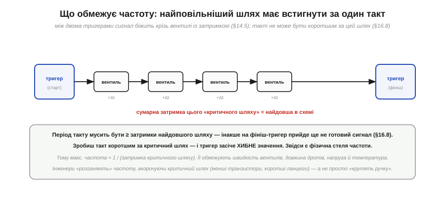
*Рис. 3.5.5.5. Між двома тригерами сигнал біжить крізь ланцюг вентилів, і кожен додає свою **затримку поширення** (§3.1.5). Сума затримок найдовшого такого ланцюга — **критичний шлях**. Період такту мусить бути **не меншим** за цю затримку: інакше на тригер-фініш сигнал прийде, ще не «устоявшись», і тригер засіче **хибне** значення (порушення setup-часу, §3.3.8). Тому максимальна частота ≈ 1 / (затримка критичного шляху).*

Це глибока й важлива межа. Такт не можна вкорочувати безкінечно — бо логіці треба **фізичний час**, щоб сигнал пробіг крізь вентилі й устоявся (згадайте §3.1.5: ніщо не миттєве, і §3.3.8: дані мусять бути готові до фронту такту). Зробиш такт коротшим за критичний шлях — і процесор почне рахувати **сміття**, бо тригери ловитимуть ще не готові значення. Тому інженери підвищують частоту не «крутінням ручки», а **вкороченням критичного шляху**: меншими транзисторами (швидші вентилі), коротшими дротами, розбиттям довгих ланцюгів. А ще на стелю тиснуть напруга й температура — гарячий чип повільніший. Фізика не дає рахувати швидше за те, що встигає устоятися сигнал.

### Ціна швидкості: стіна потужності

І останній, найдраматичніший підступ. Навіть там, де фізика дозволяла б трохи вищу частоту, на заваді стає **тепло**.

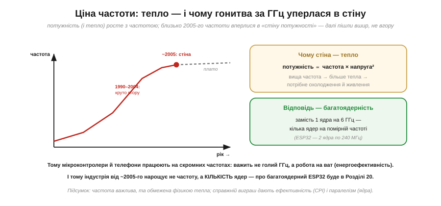
*Рис. 3.5.5.6. Споживана потужність (і тепло) росте з частотою — і навіть гірше, бо вища частота зазвичай потребує вищої напруги, а потужність пропорційна **частоті × напрузі²**. Десь близько 2005 року частоти процесорів уперлися в цю **«стіну потужності»**: далі підвищувати означало б нестерпний жар. Тому замість гнати один процесор до 6 ГГц індустрія розвернулася **вшир** — на кілька ядер помірної частоти (ESP32, наприклад, має 2 ядра по 240 МГц).*

Це поворотний момент в історії процесорів. Десятиліттями частоти стрімко росли — аж поки тепловиділення не зробило подальше зростання неможливим: чип почав би плавитися. І тоді стратегія змінилася: не швидше **одне** ядро, а **багато** ядер, що працюють паралельно на скромнішій частоті. Ось чому ваш телефон і ESP32 крутяться на «всього» сотнях мегагерців, а не гігагерцах: для них важить не голий ГГц, а **робота на ват** — енергоефективність, адже немає ні вентилятора, ні розетки, лише батарея. Багатоядерність — пряме породження стіни потужності, і саме до багатоядерного ESP32 ми придивимося в Розділі 4.1.

> 🔧 **Навіщо це.** Розуміння частоти вбереже вас від типових хибних висновків і допоможе в реальних рішеннях. Перше: **не порівнюйте чипи лише за МГц** — питайте про роботу за секунду; 100 МГц-процесор з ефективним ядром може бити 200 МГц-неборака. Друге: на мікроконтролері ви часто **самі обираєте частоту** (ESP32 дозволяє знизити її, скажімо, з 240 до 80 МГц), і це прямий компроміс «швидкість проти тепла й батареї» — для задачі, де не треба поспішати, нижча частота економить енергію. Третє: коли прикидаєте, чи встигне ваш код (наприклад, обробити дані між тактовими перериваннями в Модулі 4), рахуйте не лише МГц, а **такти на команду** — звідси й реальний час. Четверте: пам'ятайте про **стіну потужності** — більше швидкодії сьогодні беруть не вищою частотою, а ефективністю й паралелізмом (ядрами); тож, проєктуючи систему, думайте не «який найвищий ГГц», а «скільки роботи на ват мені треба». Частота — корисна, та лише одна з кількох ручок, і далеко не завжди головна.

---

Підсумок §3.5.5: **частота** процесора — це темп його такту (§3.3.6), кількість тактів за секунду (МГц = мільйон, ГГц = мільярд); кожен такт просуває цикл §3.5.3. За інших рівних більша частота = більше роботи. Але є підступи. По-перше, **команда ≠ такт**: одна команда триває кілька тактів (CPI — cycles per instruction), тож реальна швидкодія = **частота ÷ CPI**, а не сама частота. По-друге, звідси **міф мегагерців**: процесор із нижчою частотою, але меншим CPI, може бути швидшим — тож порівнювати різні архітектури за МГц хибно. По-третє, частоту обмежує **фізика**: такт не може бути коротшим за **критичний шлях** (найдовшу затримку між тригерами, §3.1.5, §3.3.8), інакше рахується сміття. По-четверте, вища частота — це більше **тепла** (потужність ∝ частота × напруга²), і близько 2005-го це створило **стіну потужності**, що розвернула індустрію від «вище» до «вшир» — до **багатоядерності** (ESP32: 2 ядра по 240 МГц). Підсумок: частота важлива, та лише одна з ручок; справжній виграш дають ефективність (менший CPI) і паралелізм. А як саме зменшити CPI — змусити процесор робити більше за такт, перекриваючи фази циклу, — це **конвеєр**, наступний підрозділ.

---

## 3.5.6 Конвеєр: робити кілька кроків водночас

У §3.5.5 ми пообіцяли спосіб зменшити CPI — змусити процесор завершувати більше команд за такт, не піднімаючи частоти. Цей спосіб — **конвеєр** (*pipeline*), і це одна з найгарніших ідей у будові процесорів. Вона помічає просту марнотратність у циклі §3.5.3 і лікує її трюком, який людство знає з часів складальних ліній Форда: поки одна річ проходить одну станцію, наступна вже може проходити попередню. Перенесений на процесор, цей трюк дає в рази більшу **пропускну здатність** майже задарма. Та, як усе в інженерії, він має й ціну — «затори», що крадуть частину виграшу. Розберімо і красу ідеї, і її підводні камені.

### Проблема: блоки процесора простоюють

Згадаймо §3.5.3: процесор виконує команду за три фази — вибірка, декодування, виконання, — і кожну робить **окремий** блок (вибіркою відає одне, АЛП — інше). У наївній схемі команди йдуть строго по черзі: доки одна не пройде всі три фази, наступна й не починається. І ось де марнотратство.


*Рис. 3.5.6.1. Коли команди виконуються строго по черзі, у кожен такт працює лише **один** із трьох блоків, а два інші **сплять**: поки команда виконується (АЛП зайнята), блоки вибірки й декодування байдикують. Три команди забирають 9 тактів, а дороге залізо простоює дві третини часу. Напрошується думка: а що, як поки одна команда **виконується**, наступну вже **декодувати**, а ще одну — **вибирати**? Адже це різні блоки, вони вільні!*

Це чисте марнотратство. Ми збудували три окремі блоки (§3.5.2), а використовуємо лише один за раз. Уявіть кухню з трьома кухарями — різальником, смажильником і прикрашальником, — де різальник стоїть і дивиться, поки смажильник працює, а тоді обидва дивляться на прикрашальника. Безглуздо. Очевидне рішення — хай **усі троє** працюють водночас, кожен над своєю стравою.

### Ідея: перекрити фази

Саме це й робить конвеєр. Замість чекати, поки команда пройде всі три фази, процесор **запускає наступну, щойно звільнився перший блок**.

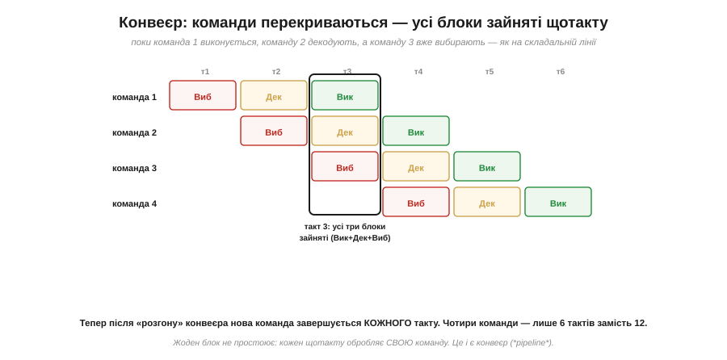
*Рис. 3.5.6.2. Команди **перекриваються** в часі. На такті 3 одразу три блоки зайняті: команда 1 **виконується**, команду 2 в цей же час **декодують**, а команду 3 вже **вибирають**. Кожен блок щотакту обробляє свою команду — ніхто не простоює. Після «розгону» конвеєра нова команда **завершується кожного такту**, тож чотири команди займають лише 6 тактів замість 12. Це і є конвеєр (*pipeline*).*

Придивіться до діагонального візерунка — це класична картина конвеєра. Кожна команда так само проходить три фази по черзі (нічого не перескочила), але команди **зсунуті** в часі на один такт, тож у кожен момент усі блоки зайняті різними командами. Це нагадує естафету, де щойно перший бігун передав паличку, він не йде відпочивати, а починає… ні, краща аналогія — пральня, до якої ми зараз і звернемося.

### Точна аналогія: пральня

Найкраща й найвживаніша аналогія конвеєра — **пральня** з трьох машин: пралка, сушарка, місце для складання.

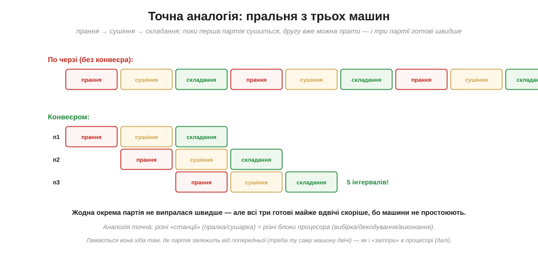
*Рис. 3.5.6.3. Треба випрати, висушити й скласти три партії білизни. **По черзі** (без конвеєра): повністю обробити першу партію (прати → сушити → складати), тоді другу, тоді третю — 9 інтервалів. **Конвеєром**: щойно перша партія пішла в сушарку, другу вже кидаємо в пралку; поки сушиться друга — пралка бере третю. Усі три готові за 5 інтервалів замість 9 — бо машини не простоюють.*

Ця аналогія точна в головному: різні «станції» (пралка, сушарка) — це різні блоки процесора (вибірка, виконання), і весь виграш у тому, що вони працюють **одночасно** над різними партіями. Жодна окрема партія не випралася швидше — пралка крутить свої умовні 30 хвилин незалежно від конвеєра, — але **всі разом** готові значно скоріше. І зверніть увагу, де аналогія застерігає: якщо якійсь партії знадобиться та сама машина двічі, або складання другої залежить від першої, виникне **затор** — як і в процесорі (про що далі). Ця паралель між пральнею й конвеєром команд настільки точна, що нею пояснюють процесори в кожному підручнику.

### Головна думка: затримка vs пропускна здатність

Тепер — найважливіша концепція цього підрозділу, без якої конвеєр легко зрозуміти хибно. Конвеєр **не робить одну команду швидше**. Він робить так, щоб команди **виходили частіше**.


*Рис. 3.5.6.4. **Затримка** (*latency*) — час однієї команди від початку до кінця — лишається **тією самою** (три такти): конвеєр її не скорочує, кожна команда йде крізь усі фази так само довго. А от **пропускна здатність** (*throughput*) — скільки команд **завершується за такт** — зростає: одна нова команда сходить «з лінії» щотакту. Як на заводі: конвеєр не складає один автомобіль швидше — він робить так, щоб машини сходили з лінії частіше.*

Ось ключ до правильного розуміння. Є дві різні величини: **затримка** (скільки чекати на одну команду) і **пропускна здатність** (скільки команд за секунду в потоці). Конвеєр множить **другу**, не чіпаючи першу. Саме тому це й є відповідь на обіцянку §3.5.5: у ідеалі конвеєр доводить **CPI до 1** — одна завершена команда за такт, — хоча кожна окрема команда так само триває кілька тактів. N-стадійний конвеєр у ідеалі дає до ~**N разів** більшу пропускну здатність за тієї **самої** частоти. Оце і є **пропускна здатність**: не швидкість однієї команди, а **темп** їхнього виходу.

### Чому конвеєр не безкоштовний: затори

Якби все було так гладко, конвеєр давав би рівно ×N. Та в реальності команди не завжди течуть конвеєром безперешкодно — трапляються **затори** (*hazards*).

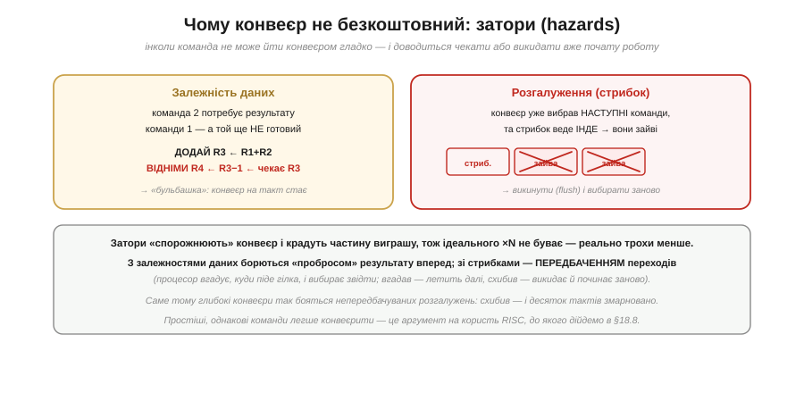
*Рис. 3.5.6.5. Два головні затори. **Залежність даних**: команда 2 потребує результату команди 1 (наприклад, `ВІДНІМИ R4←R3−1` одразу після `ДОДАЙ R3←R1+R2`), а той ще не готовий — доводиться зробити «бульбашку» (стати на такт). **Розгалуження**: конвеєр уже завчасно вибрав **наступні** команди, але стрибок веде в інше місце — і вже почата робота над зайвими командами **викидається** (flush). Затори спорожнюють конвеєр і крадуть частину виграшу.*

Тут криється важлива правда: ідеального ×N не буває. **Залежність даних** виникає, коли команда чекає на результат попередньої (з нею борються «пробросом» — forwarding — результату прямо в потрібний блок, не чекаючи запису в регістр). А **розгалуження** — підступніша біда: конвеєр, щоб не простоювати, завчасно вибирає команди, що йдуть **далі за порядком**, — але якщо трапився стрибок, ці команди виявляються не тими, і всю почату над ними роботу доводиться викинути. З цим борються **передбаченням переходів** (*branch prediction*): процесор **угадує**, куди піде гілка, і вибирає звідти; угадав — летить далі без втрат, схибив — викидає й починає заново. Саме тому глибокі конвеєри так бояться непередбачуваних розгалужень: один промах — і десяток тактів змарновано. (І, до речі, простіші, однакові за форматом команди конвеєрити **легше** — це сильний аргумент на користь архітектури RISC, до якої ми дійдемо в §3.5.8.)

### Виграш і реальність

Зведімо баланс.

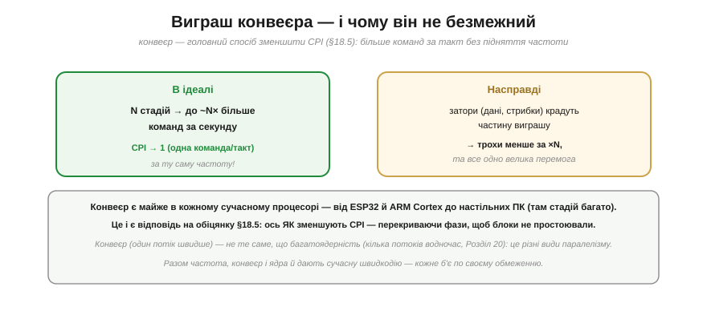
*Рис. 3.5.6.6. **В ідеалі**: N стадій → до ~N× більша пропускна здатність, CPI прямує до 1 — і все це за **тієї самої** частоти. **Насправді**: затори (залежності, стрибки) крадуть частину виграшу, тож виходить трохи менше за ×N — але все одно велика перемога. Конвеєр є майже в кожному сучасному процесорі: від ESP32 й ARM Cortex (кілька стадій) до настільних ПК (стадій багато). Це і є та відповідь на обіцянку §3.5.5: ось **як** зменшують CPI.*

Конвеєр — це елегантна перемога над марнотратством §3.5.3: замість простоювати, кожен блок щотакту працює над своєю командою. Він дав процесорам велику частину їхньої швидкодії, не вимагаючи ні вищої частоти (зі стіною потужності, §3.5.5), ні нового заліза — лише розумнішої організації наявного. Варто тільки чітко відрізняти його від **багатоядерності** (Розділ 4.1): конвеєр пришвидшує **один** потік команд (перекриваючи його фази), а кілька ядер виконують **різні** потоки водночас — це різні види паралелізму, і сучасні чипи поєднують обидва. Разом частота (§3.5.5), конвеєр (§3.5.6) і ядра (Розділ 4.1) і дають ту швидкодію, до якої ми звикли, — кожне б'є по своєму обмеженню.

> 🔧 **Навіщо це.** Конвеєр — це переважно турбота розробників процесорів, але його наслідки прямо стосуються й вас. Перше: він пояснює, **чому** сучасний процесор робить майже команду за такт (CPI≈1), хоча кожна команда «фізично» триває кілька тактів — без цього розуміння оцінки швидкодії з §3.5.5 не сходяться. Друге, дуже практичне: **розгалуження дорогі** на конвеєрних процесорах, бо промах передбачення спорожнює конвеєр; тому в гарячих циклах коду (які ви писатимете для давачів і керування в Модулях 5–6) варто уникати непередбачуваних `if` усередині, де можна, — рівний, передбачуваний потік виконується швидше за рваний. Третє: розуміння «затримка проти пропускної здатності» — універсальне; воно знадобиться не лише з процесором, а й із пам'яттю, шинами, зв'язком — скрізь, де є потік. Четверте: пам'ятайте, що конвеєр і ядра — **різні** речі; коли в Модулі 4 ви побачите два ядра ESP32, це паралелізм іншого роду, ніж конвеєр усередині одного ядра. Тримайте картину складальної лінії — і робота процесора «на повну» стане зрозумілою.

---

Підсумок §3.5.6: **конвеєр** (*pipeline*) лікує марнотратство §3.5.3 — у наївній схемі команди йдуть по черзі, тож у кожен такт працює лише один блок, а решта простоюють. Ідея конвеєра: **перекрити** фази — поки команда 1 виконується, команду 2 декодувати, а команду 3 вибирати (різні блоки вільні). Тоді після розгону **нова команда завершується кожного такту**. Класична аналогія — **пральня** (поки перша партія сушиться, другу вже перуть). Ключова думка: конвеєр не зменшує **затримку** однієї команди (вона так само йде крізь усі фази), а множить **пропускну здатність** (темп виходу команд) — у ідеалі до ~N× для N стадій, доводячи **CPI до 1** (відповідь на §3.5.5). Ціна — **затори**: залежність даних (команда чекає результату попередньої → «бульбашка» чи проброс) і розгалуження (вибрані наперед команди стають зайві після стрибка → викид; рятує **передбачення переходів**). Тому реально трохи менше за ×N, але виграш великий; конвеєр є майже в кожному процесорі (ESP32, ARM, ПК). Конвеєр ≠ багатоядерність (Розділ 4.1) — різні види паралелізму. Дотепер пам'ять у нас була **одна** на код і дані (фон Нейман). Та ми бачили, що це створює «вузьке місце». А що, як дати коду й даним **окремі** шляхи? Це — **фон Нейман проти Гарварда**, наступний підрозділ.

---

## 3.5.7 Фон Нейман vs Гарвард

Усю главу нас супроводжує «вузьке місце фон Неймана» — те, що код і дані живуть в **одній** пам'яті й ходять до процесора **однією** шиною, тож суперничають за неї (історія розділу, §3.5.2, §3.5.6). Настав час поставити пряме питання: а що, як дати коду й даним **окремі** пам'яті й окремі шини? Тоді процесор міг би брати команду й дані **водночас**, без суперництва. Це і є **Гарвардська** архітектура — альтернатива фон-нейманівській, — і вибір між ними є фундаментальною розвилкою в будові будь-якого процесора. Цей підрозділ — про дві архітектури, про те, що кожна виграє й програє, де яку вживають (і чому Arduino — Гарвардська, що ми обіцяли ще на початку), і чому насправді більшість сучасних чипів — десь **посередині**.

### Дві архітектури поряд

Уся різниця між ними зводиться до однієї речі — скільки «доріг» між процесором і пам'яттю.

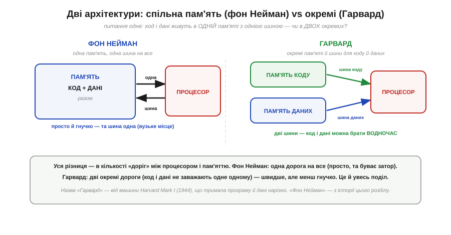
*Рис. 3.5.7.1. **Фон Нейман**: одна пам'ять тримає код і дані разом, і до процесора веде **одна** спільна шина — просто й гнучко, та шина одна на все (вузьке місце). **Гарвард**: **окремі** пам'яті для коду й для даних, кожна зі своєю шиною, тож процесор має дві незалежні дороги. Назва — від машини Harvard Mark I (1944), що тримала програму й дані нарізно; «фон Нейман» — з історії цього розділу.*

Ось і весь поділ: **одна** дорога чи **дві**. Фон-нейманівська машина елегантно проста — все в одній пам'яті, як ми й вивчали досі. Гарвардська ставить дві окремі пам'яті з двома шинами. Здавалося б, дрібниця в кількості дротів — та наслідки великі, бо саме ця кількість доріг визначає, чи можуть код і дані рухатися **одночасно**.

### Що дають дві шини

Подивімося, що конкретно купує друга шина.

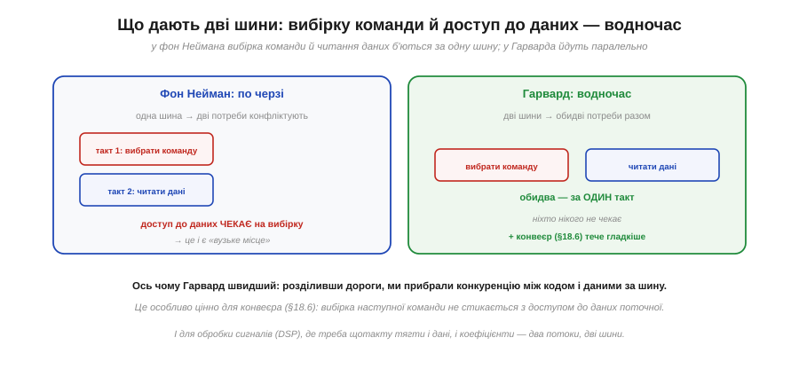
*Рис. 3.5.7.2. У **фон Неймана** одна шина, тож вибірка команди й читання даних **конфліктують**: спершу один доступ, потім другий — дані чекають на команду (це і є вузьке місце). У **Гарварда** дві шини, тож вибірку команди й читання даних роблять **за один такт паралельно** — ніхто нікого не чекає. Особливо це цінне для конвеєра (§3.5.6): вибірка наступної команди не стикається з доступом до даних поточної.*

Ось у чому виграш Гарварда. Згадайте конвеєр (§3.5.6): у ньому одна команда **виконується** (читає/пише дані), поки наступну **вибирають** з пам'яті. На фон-нейманівській машині ці два звертання до пам'яті б'ються за єдину шину — і конвеєр спотикається. На Гарвардській вони йдуть по різних шинах паралельно — конвеєр тече гладко. Та сама перевага безцінна для **обробки сигналів** (DSP), де щотакту треба тягти і дані, і коефіцієнти фільтра одночасно — два потоки, дві шини. Розділивши дороги, Гарвард прибирає саму причину затору.

### Компроміс: гнучкість проти швидкості

Якщо Гарвард швидший, чому не всі машини такі? Бо за швидкість він платить **гнучкістю**.

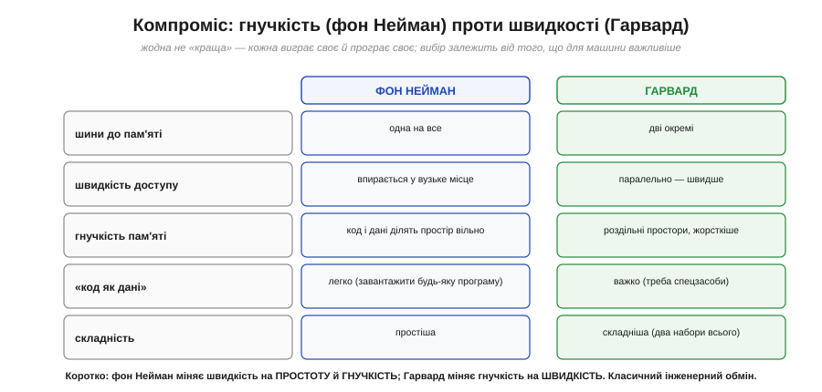
*Рис. 3.5.7.3. Порівняння. Фон Нейман: одна шина (вузьке місце), зате код і дані **вільно ділять** спільний простір пам'яті, легко «завантажити будь-яку програму як дані», і вся конструкція **простіша**. Гарвард: дві шини (паралельний, швидший доступ), зате **роздільні** простори (жорсткіше — розміри коду й даних фіксовані окремо), і «код як дані» дається важко (треба спецзасоби), а всього вдвічі більше (складніше).*

Це класичний інженерний обмін, без «переможця». Фон-нейманівська **гнучкість** — пряме породження тієї самої ідеї збереженої програми (історія розділу): якщо код і дані — в одній пам'яті, машина може завантажити нову програму просто **як дані** в ту саму пам'ять і запустити її. Це те, що робить ваш ПК таким універсальним — він щодня вантажить і запускає тисячі різних програм. Гарвардська машина з її роздільними просторами це робить **важко**: пам'ять коду — то пам'ять коду, і запхати туди свіжозавантажену програму непросто. Тож фон Нейман міняє швидкість на простоту й гнучкість, а Гарвард — навпаки.

### Де яку вживають

З цього компромісу прямо випливає, хто яку обирає.

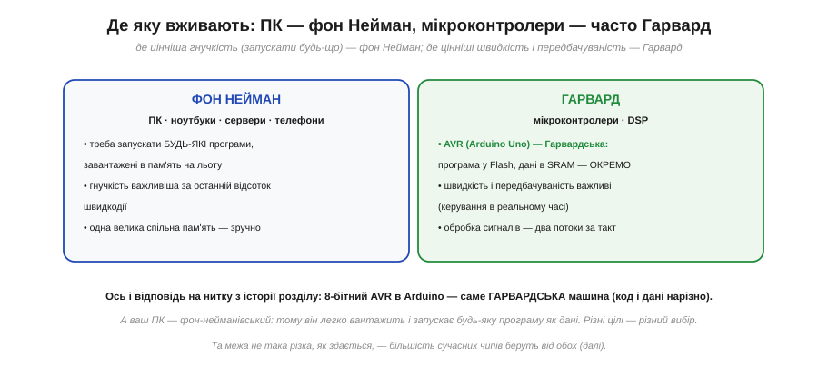
*Рис. 3.5.7.4. **Фон Нейман** — у ПК, ноутбуках, серверах, телефонах: там треба запускати **будь-які** програми, завантажені на льоту, тож гнучкість єдиної пам'яті важливіша за останній відсоток швидкодії. **Гарвард** — у мікроконтролерах і DSP: там цінніші **швидкість і передбачуваність**. Зокрема, 8-бітний **AVR** в Arduino Uno — Гарвардська машина: програма лежить у Flash-пам'яті, дані — в SRAM, **окремо**, з окремими шинами.*

Ось і відповідь на нитку, протягнуту через увесь розділ: **AVR в Arduino — Гарвардська** машина. Тепер зрозуміло, чому: мікроконтролеру важлива швидка, передбачувана робота в реальному часі (керувати мотором, читати давач точно вчасно), а не здатність вантажити довільні програми — він зазвичай виконує **одну** прошиту програму. Тож роздільні код і дані йому пасують. А ваш ПК — фон-нейманівський, бо його суть — запускати що завгодно. (Те, що програма МК лежить саме у **Flash**, а дані — в **SRAM**, — це вже про типи пам'яті, яким присвячено §3.6.3; тут важливо лише, що вони **окремі**.) Різні цілі — різний вибір архітектури.

### Реальність: модифікована Гарвардська

Та не варто думати, що світ чітко поділений на дві архітектури. Насправді це **спектр**, і більшість сучасних чипів живуть посередині.


*Рис. 3.5.7.5. Чисті форми рідкісні; типовий сучасний чип — **модифікована Гарвардська**: близько до ядра — **окремі** швидкі шляхи для коду й даних (Гарвард-стиль, паралельний доступ), а під ними — **спільна** головна пам'ять (фон-нейман-стиль, гнучкість). Так чип дістає і швидкість Гарварда, і гнучкість фон Неймана. ESP32 — саме модифікована Гарвардська; AVR — «чистіший» Гарвард, але має спецкоманду читати Flash як дані (бо константи програми лежать поруч із кодом).*

Це мудрий компроміс, що бере найкраще від обох. Там, де швидкість критична (близько до ядра), роблять роздільні шляхи для коду й даних — паралельний доступ; а глибше, де важить гнучкість і простота, лишають спільну пам'ять. ESP32, який ми вивчатимемо, — саме такий гібрид. Навіть «чисто Гарвардський» AVR має шпарину: спеціальну команду читати пам'ять програм як дані (бо ж сталі константи зручно тримати поруч із кодом). Тож «фон Нейман проти Гарварда» — не жорстке «або-або», а **палітра**, з якої інженер змішує потрібну пропорцію під свою задачу. Розуміти крайні точки цієї палітри важливо — але реальні чипи майже завжди десь між ними.

> 🔧 **Навіщо це.** Ця відмінність впливає на цілком практичні речі в роботі з мікроконтролером. Перше: **AVR (Arduino) і багато МК — Гарвардські**, тож пам'ять програм і пам'ять даних у них **роздільні** й адресуються окремо; саме тому, наприклад, на AVR великі сталі рядки чи таблиці спеціально кладуть у Flash (програмну пам'ять), щоб не з'їдати дефіцитну SRAM, — і для доступу до них потрібні особливі засоби. Друге: розуміння, що код і дані можуть бути в **окремих** просторах, пояснить вам поведінку компілятора й карти пам'яті, які ви побачите в Модулі 4. Третє: коли йтиметься про швидкодію МК у реальному часі (керування, обробка сигналів у Модулях 5–6), Гарвардський паралельний доступ — одна з причин, чому навіть скромний МК встигає робити багато за такт. Четверте, концептуально: пам'ятайте, що це **спектр**, а не двійковий вибір; реальні чипи (як ESP32) — гібриди. Знаючи, де на цій палітрі ваш процесор, ви краще розумітимете і його сильні сторони, і його обмеження.

---

Підсумок §3.5.7: дві фундаментальні архітектури різняться одним — скільки шляхів між процесором і пам'яттю. **Фон Нейман**: код і дані в **одній** пам'яті з **однією** шиною — просто й гнучко (легко завантажити будь-яку програму як дані — суть збереженої програми), та шина одна (вузьке місце). **Гарвард**: **окремі** пам'яті й шини для коду й даних — процесор бере команду й дані **водночас** (швидше, гладший конвеєр §3.5.6, ідеально для DSP), та менш гнучко (роздільні простори, «код як дані» важко). Це класичний обмін: фон Нейман — гнучкість і простота, Гарвард — швидкість. Тому **ПК** (запускати будь-що) — фон-нейманівські, а **мікроконтролери й DSP** (швидкість, передбачуваність) — часто Гарвардські; зокрема **AVR в Arduino — Гарвардська** (код у Flash, дані в SRAM, окремо). Та насправді це **спектр**: більшість сучасних чипів — **модифікована Гарвардська** (роздільні швидкі шляхи близько до ядра + спільна пам'ять глибше), як-от ESP32. Ми багато говорили про команди — прості й складні. А чи краще, щоб команд було **мало й простих**, чи **багато й потужних**? Це остання велика розвилка розділу — **RISC проти CISC**.

---

## 3.5.8 RISC vs CISC

Дійшли до останньої великої розвилки в будові процесора, і вона — про саму **філософію** його мови (ISA, §3.5.4). Питання просте на вигляд, та з далекосяжними наслідками: чи краще, щоб процесор знав **мало простих** команд, чи **багато потужних**? Перша відповідь — **RISC** (*Reduced Instruction Set Computer*, скорочений набір команд), друга — **CISC** (*Complex Instruction Set Computer*, складний набір). Навколо цього вибору точилася ціла епоха суперечок, він визначив дві великі гілки процесорів — і, що цікаво, зрештою «переміг» не зовсім так, як очікувалося. Цей підрозділ — про обидві філософії, про революцію, що схилила терези, про те, чому сьогодні межа між ними розмита, і чому майже все, що ви програмуватимете, — RISC.

### Питання: мало простих чи багато складних?

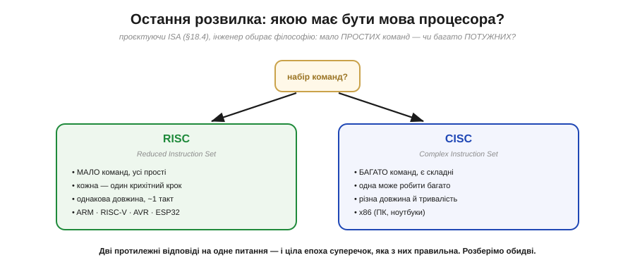
*Рис. 3.5.8.1. Проєктуючи набір команд (§3.5.4), інженер обирає філософію. **RISC**: мало команд, усі прості, кожна — один крихітний крок, однакової довжини, виконується приблизно за один такт (ARM, RISC-V, AVR, ESP32). **CISC**: багато команд, є дуже складні, одна може робити цілу низку дій, команди різної довжини й тривалості (x86 — процесори ПК). Дві протилежні відповіді на одне питання.*

Це не просто технічна дрібниця, а два світогляди. CISC каже: «дай програмісту (чи компілятору) **потужні** команди, щоб одна робила багато — тоді й програма буде коротша». RISC заперечує: «ні, дай **прості, однакові** команди, які залізо виконує блискавично, а складне нехай складеться з них». Щоб відчути різницю, найкраще побачити, як кожна філософія розв'язує одне й те саме завдання.

### Те саме завдання двома мовами


*Рис. 3.5.8.2. Завдання: додати число з пам'яті до регістра R1 і записати результат назад. **CISC** робить це **однією** складною командою `ADD [адреса], R1`, яка сама читає з пам'яті, додає й пише назад. **RISC** розкладає це на **три** прості команди: завантажити (`LD`), додати (`ADD`), зберегти (`ST`) — кожна проста, ~1 такт, легко конвеєрна. Однакова робота: CISC економить рядки коду, RISC — складність заліза.*

Зверніть увагу на принципову рису RISC, видну тут: у ньому пам'ять чіпають **лише** спеціальні команди завантаження й збереження (`LD`/`ST`), а всі обчислення йдуть **між регістрами**. Це звуть **архітектурою завантаження-збереження** (*load/store*): хочеш порахувати над числом із пам'яті — спершу **завантаж** його в регістр (§3.5.2), порахуй там, потім **збережи**. CISC же дозволяє командам прямо лізти в пам'ять посеред обчислення. Філософія RISC — тримати кожну команду простою й однаковою, навіть якщо їх через те більше; а простіше залізо, як ми зараз побачимо, легше зробити швидким.

### Компроміс

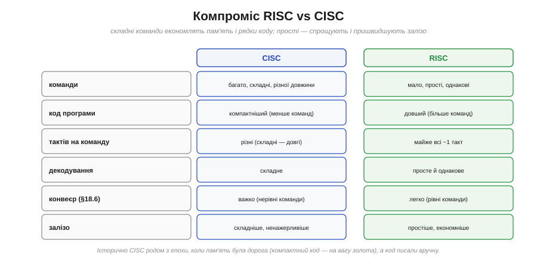
*Рис. 3.5.8.3. CISC: команди потужні, але різної довжини й тривалості — код **компактніший** (менше команд), зате декодування **складне**, конвеєр (§3.5.6) дається важко, а залізо складніше й ненажерливіше. RISC: команди прості й однакові — код **довший** (більше команд), зате декодування тривіальне, конвеєр тече гладко, залізо **простіше й економніше**. Історично CISC родом з епохи, коли пам'ять була дорога, а код часто писали вручну.*

Щоб зрозуміти, **чому** взагалі з'явився CISC, треба згадати його епоху. У 1960–70-х пам'ять була **дорогою й мізерною**, тож компактний код (менше команд) був на вагу золота — а складні команди давали саме компактність. До того ж програми часто писали **вручну** в асемблері, і потужна команда «зроби все одразу» економила працю програміста. За тих умов CISC мав сенс. Та коли пам'ять подешевшала, а код почали генерувати **компілятори**, ці переваги зблякли — і хтось мав це помітити.

### Революція RISC


*Рис. 3.5.8.4. На зламі 1970–80-х дослідники помітили дивне: компілятори користуються лише **жменькою** простих команд, а складні «потужні» CISC-команди — **рідкісні**, проте через них **усе** залізо складніше й гірше конвеєриться. Висновок: викинути рідкісні складні команди, лишити мало простих — і зробити їх **блискавичними** та ідеально конвеєрними, а складне хай складає з них **компілятор**. Піонери: Джон Кокк (IBM 801), Девід Паттерсон (Берклі, він і ввів слово «RISC»), Джон Геннессі (Стенфорд, MIPS).*

Це і була **революція RISC** — одна з найважливіших ідей в історії процесорів. Її серце — принцип «**оптимізуй типовий випадок**»: краще, щоб 95% простих, найчастіших команд летіли якнайшвидше, ніж щоб рідкісні складні команди тягли вниз геть усе залізо. Простота виявилася не слабкістю, а **силою**: прості однакові команди легше декодувати, легше конвеєрити (§3.5.6 — пам'ятаєте, як рівні команди гладко течуть конвеєром?), і вони доводять CPI до жаданої одиниці (§3.5.5). Це той самий наскрізний урок розділу, що ми зустріли ще в §3.5.1: складна поведінка краще постає з **простих швидких** кроків, ніж зі складних повільних. RISC просто застосував його до самої мови процесора.

### Сьогодні межа розмита

Хто ж переміг? Відповідь несподівана: **обидва — і жоден**.

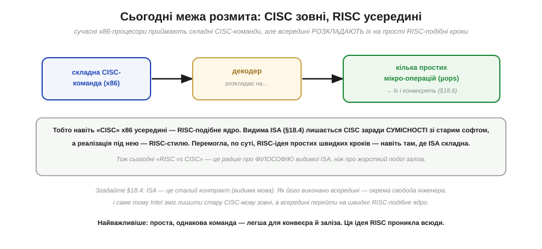
*Рис. 3.5.8.5. Сучасний x86 (CISC) приймає складні команди ззовні, але всередині **декодер розкладає** кожну на кілька простих RISC-подібних **мікро-операцій** (µops) — і вже їх конвеєрить. Тобто навіть «CISC»-процесор усередині має RISC-подібне ядро. Видима ISA (§3.5.4) лишається CISC заради **сумісності** зі старим софтом, а реалізація під нею — RISC-стилю. По суті, перемогла **ідея** RISC (прості швидкі кроки), навіть там, де видима мова складна.*

Ось де знову зблиснула мудрість §3.5.4 про ISA як **контракт**. Видима ISA — це стабільна мова (зовнішній контракт), а **як** її виконано всередині — окрема свобода інженера. Саме тому Intel зміг лишити стару CISC-мову x86 зовні (щоб не ламати десятиліття софту), а всередині тихо перейти на швидке RISC-подібне ядро, що перетворює складні команди на потік простих мікро-операцій. Тож сьогодні «RISC проти CISC» — це вже не жорсткий поділ заліза, а радше питання **філософії видимої ISA**. А на рівні **реалізації** RISC-ідея простоти проникла всюди: проста, однакова операція — легша і для конвеєра, і для заліза.

### Хто де панує

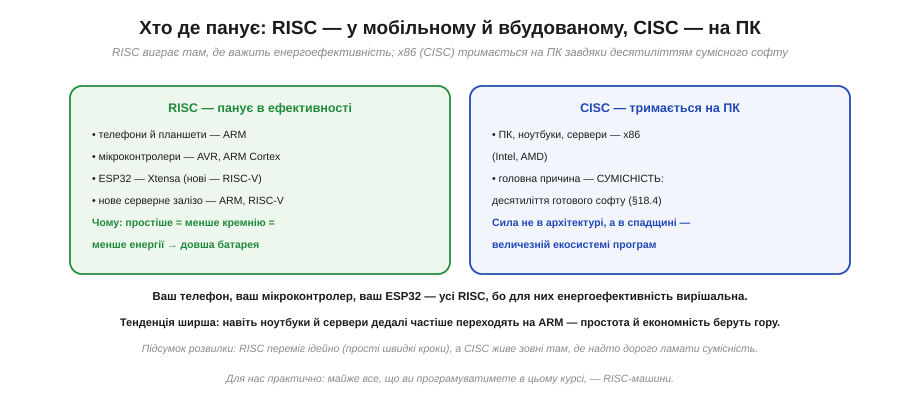
*Рис. 3.5.8.6. **RISC** панує там, де вирішальна **енергоефективність**: телефони й планшети (ARM), мікроконтролери (AVR, ARM Cortex), ESP32 (Xtensa, нові — RISC-V), дедалі більше серверів — бо простіше залізо означає менше кремнію й **менше енергії** (довша батарея). **CISC** (x86) тримається на ПК, ноутбуках і серверах головно завдяки **сумісності** — величезній спадщині готового софту (§3.5.4). Сила x86 — не в архітектурі, а в екосистемі.*

Для нас практичний висновок прямий: ваш телефон, ваш мікроконтролер, ваш **ESP32** — усі **RISC**, бо для них енергоефективність вирішальна (немає ні розетки, ні вентилятора). x86 лишається на ПК передусім через інерцію сумісності — десятиліття програм, які ніхто не хоче переписувати. Та й ця межа тане: навіть ноутбуки й сервери дедалі частіше переходять на ARM, бо простота й економність зрештою беруть гору. Тож майже все, що ви програмуватимете в цьому курсі, — RISC-машини, і це не випадковість, а наслідок тієї самої революції простоти.

> 🔧 **Навіщо це.** Хоч RISC/CISC і звучить як суто академічна суперечка, для вас вона має цілком конкретний сенс. Перше: **ваші цільові чипи — RISC** (AVR, ARM, ESP32), тож їхній асемблер складається з простих, однакових команд, і одна дія часто потребує кількох команд (як `LD`/`ADD`/`ST`) — це нормально й швидко. Друге: **архітектура завантаження-збереження** пояснює, чому в коді для МК так багато «завантажити в регістр → порахувати → зберегти»: пам'ять чіпають лише окремі команди, решта йде в регістрах (§3.5.2). Третє: **енергоефективність RISC** — пряма причина, чому МК і телефони на ньому; коли в Модулях 4–5 ви дбатимете про споживання (батарея!), пам'ятайте, що сама простота архітектури вже працює на вас. Четверте, ширше: урок «оптимізуй типовий випадок, прості швидкі кроки б'ють складні повільні» — універсальний принцип проєктування, корисний далеко за межами процесорів (зокрема й у вашому власному коді). RISC переміг не випадково — він утілив найглибшу ідею всього розділу.

---

Підсумок §3.5.8: остання розвилка — філософія набору команд. **CISC** (x86): багато команд, є складні (одна робить багато), різної довжини — код компактніший, та залізо складне й погано конвеєриться; має сенс з епохи дорогої пам'яті й ручного асемблера. **RISC** (ARM, RISC-V, AVR, ESP32): мало простих однакових команд, кожна ~1 такт, **архітектура завантаження-збереження** (пам'ять чіпають лише `LD`/`ST`, обчислення — в регістрах) — код довший, зате залізо просте, швидке й чудово конвеєрне (§3.5.6), CPI→1 (§3.5.5). **Революція RISC** (Кокк, Паттерсон, Геннессі, 1980-ті) на принципі «оптимізуй типовий випадок» показала: прості швидкі кроки б'ють складні повільні (наскрізний урок §3.5.1). Сьогодні межа **розмита**: x86 — CISC зовні (сумісність, §3.5.4), але RISC-подібний усередині (складні команди → прості мікро-операції). RISC панує в мобільному й вбудованому (енергоефективність), x86 — на ПК (спадщина). Для нас: майже все, що ми програмуємо, — RISC.

---

## Підсумок Розділу 3.5

Ми пройшли весь шлях від питання «що таке процесор?» до тонкощів його швидкодії — і тепер серце комп'ютера для нас уже не чорна скринька, а зрозуміла механіка.

Згадаймо здобуте. Процесор — це **машина, що виконує інструкції** одну за одною, дурна, буквальна й слухняна, а вся «розумна» поведінка постає з простих кроків × нечувана швидкість (§3.5.1). Складається він із небагатьох простих органів, усі знайомі з Розділів 3.2–3.4: **регістри** (швидкий записник), **АЛП** (рахівниця), **лічильник команд** (закладка в програмі), **шина** (дорога до пам'яті) і **пристрій керування** (диригент) (§3.5.2). Працює він, невпинно крутячи **цикл «вибірка → декодування → виконання»** — серцебиття, яке жене такт (§3.5.3). Мова його команд — **ISA**, де команда є числом із полів (opcode + операнди), а сам набір — сталий контракт між софтом і залізом (§3.5.4). Його **частота** — це темп такту, та справжню швидкодію визначає ще й CPI, обмежує критичний шлях, а вгору тисне стіна потужності (§3.5.5). Прискорюють його, **перекриваючи** фази в конвеєрі (§3.5.6), даючи коду й даним **окремі** шляхи (Гарвард, §3.5.7) і роблячи команди **простими й однаковими** (RISC, §3.5.8).

Та головна думка розділу — одна, наскрізна: **складне постає з простого, узятого швидко й багато.** Дурні крихітні кроки, помножені на мільярди за секунду; прості однакові команди, що гладко течуть конвеєром; невеликий словник примітивів, з якого складено все програмне забезпечення світу. Процесор не мудрий — він **організований і прудкий**, і саме в цій організації простого й криється вся його сила. А ще ми двічі побачили (з фон Нейманом і з Беббіджем та Лавлейс), що велика ідея — то завжди праця багатьох, навіть коли історія лишає одне ім'я.

Тепер ми знаємо, як процесор **виконує** програму. Та програма й дані мусять десь **жити** — у пам'яті, яку ми досі сприймали як належне. Як саме влаштована ця пам'ять? Як у ній знаходять потрібну комірку за адресою, де лежить код, а де змінні, як працює стек під час виклику функції й що таке «купа»? Це — **пам'ять, адресація, стек і купа**, тема наступного розділу, що завершує наш Модуль про цифрову електроніку й процесор.

> ▶️ **Далі — Розділ 3.6: [Пам'ять, адресація, стек і купа](../ch19-memory-stack-heap/ch19-memory-stack-heap.md).** Як влаштована пам'ять, у якій живуть і код, і дані: адреси й комірки, карта пам'яті, стек і купа. А починається розділ з історії про те, як машини вперше навчилися надійно **пам'ятати**: [магнітна пам'ять на осердях](../ch19-memory-stack-heap/ch19-history-core-memory.md).
