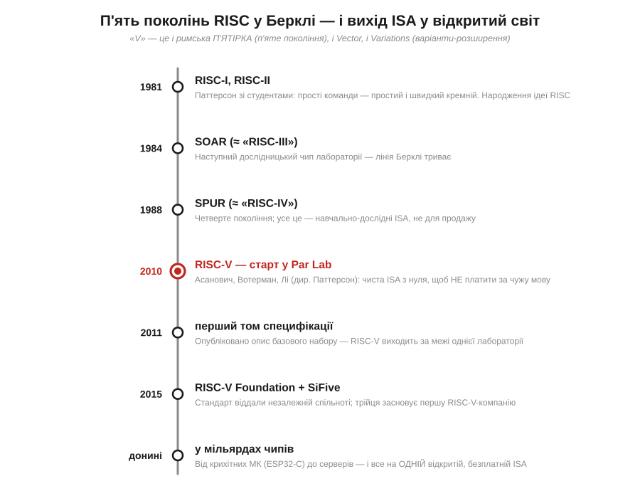
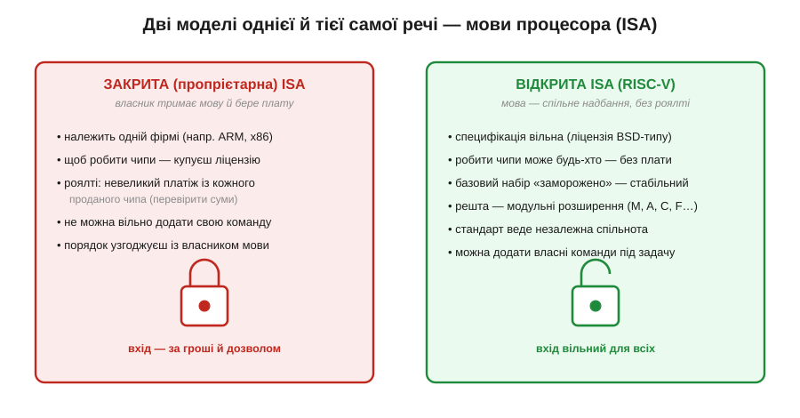
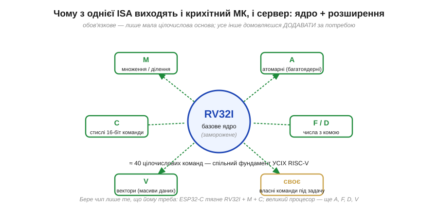
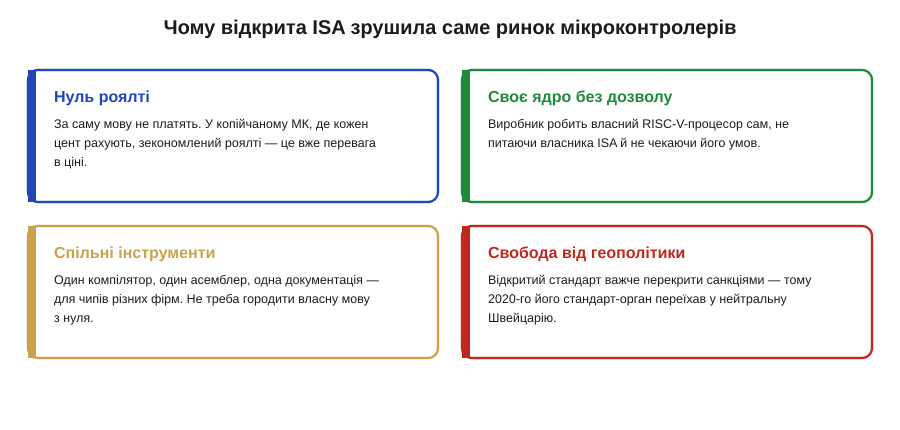
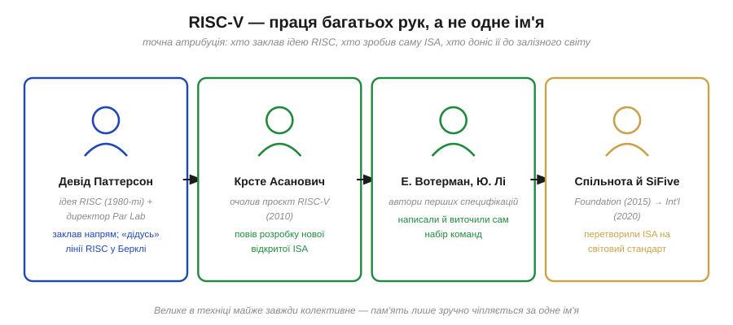

# 📜 Історія до §3.5.4 — RISC-V: відкрита ISA з Берклі і чому вона змінила ринок мікроконтролерів

> Це історична вставка до [§3.5.4 «Набір інструкцій (ISA): мова процесора»](ch18-processor-architecture.md). Ми щойно з'ясували головне про ISA: це **мова** процесора (повний словник команд плюс правило, як кожну закодувати числом), і — найважливіше — це **сталий контракт**, що дає софту й залізу рости незалежно. Але про одну річ §3.5.4 згадав лише мимохідь: ця мова комусь **належить**. Десятиліттями кожна вживана ISA була чиєюсь **власністю** — щоб робити процесори, які нею говорять, треба було купити дозвіл і платити з кожного чипа. А тоді, 2010 року, невелика група в Каліфорнійському університеті в Берклі зробила дивну на той час річ: спроєктувала нову ISA **з чистого аркуша** й віддала її світу **безплатно й відкрито**. Звали її **RISC-V**. Це історія про те, як мова процесора з університетського проєкту перетворилася на світовий стандарт, чому це зрушило саме ринок дешевих мікроконтролерів — і чому за «однією літерою V» стоїть праця багатьох рук і ціла традиція, старша за самих авторів.

Почнімо з питання, яке §3.5.4 лишив за дужками. Там ми бачили, що ISA — це контракт, і що різні сімейства процесорів говорять різними мовами (ARM, x86, AVR, Xtensa). Та хто пише ці контракти й хто ними **володіє**? Виявляється, до 2010-х відповідь майже завжди була та сама: мову тримала одна фірма, і за право нею користуватися платили. Саме цю тиху монополію на «мову» й зламав RISC-V — тож розберімо спершу, у чому полягала проблема, а потім — як її розв'язали в Берклі.

*Рис. 3.5.4i.1. Ланцюг подій. RISC-V — не випадковий стрибок, а **п'яте** покоління дослідницьких RISC-процесорів Берклі: RISC-I і RISC-II (1981), далі SOAR (≈ «RISC-III», 1984) і SPUR (≈ «RISC-IV», 1988). Звідси й назва — «V» це римська **п'ятірка** (а водночас, як жартома казали автори, «V for Vector, V for Variations» — натяк на вектори й модульні варіанти-розширення). Червоний вузол — старт 2010 року в лабораторії Par Lab; далі перший том специфікації (2011), передача стандарту незалежній спільноті (2015) — і прихід RISC-V у мільярди чипів, від крихітних мікроконтролерів до серверів.*

---

## Чому за «мову» процесора доводилося платити

Щоб відчути, наскільки незвичним був вчинок Берклі, треба згадати, як влаштований світ ISA, який ми описали в §3.5.4. Там ми підкреслили: ISA — це **контракт**, межа між софтом і залізом. Але контракт хтось складає й комусь належить, і саме тут ховалася давня незручність.

Уявімо інженерну фірму, що хоче зробити власний мікроконтролер. Транзистори, кремній, виробництво — усе це окремий клопіт. Та перш ніж навіть почати, треба обрати **мову**, якою чип говоритиме, — бо без ISA процесор не процесор. І тут вибір був небагатий. Можна взяти **x86** — але це фактично закрита територія двох фірм, і стороннього туди не пустять. Можна взяти **ARM** — найпопулярнішу мову мікроконтролерів — але за неї треба **купити ліцензію** в компанії-власника й платити **роялті** (*royalty*): невеликий відрахунок із кожного проданого чипа (точні суми залежать від угоди — **(перевірити)**). Можна взяти стару **AVR** чи якусь власну вузьку мову — але тоді ти сам, без багатої екосистеми інструментів.

*Рис. 3.5.4i.2. Ліворуч — звична до 2010-х модель: ISA **належить** фірмі, доступ до неї — за гроші й дозвіл (ліцензія + роялті з кожного чипа), і своєї команди до мови без власника не додаси. Праворуч — модель RISC-V: специфікація **вільна** (під ліцензією BSD-типу), робити чипи може будь-хто без плати, базовий набір «заморожено» заради сумісності, а решта — модульні розширення; стандарт веде незалежна спільнота. Те саме поняття «мова процесора» — але дві геть різні моделі володіння нею.*

Подивіться на це очима §3.5.4. ISA там — найпотужніша абстракція в техніці саме тому, що **стабільна** й дає двом світам розвиватися окремо. Та сама стабільність робить мову **цінним активом**: хто володіє популярною ISA, той тримає в руках вузьке горло цілого ринку — без його дозволу нову мову не запровадиш, а вже наявну треба ліцензувати. Для великих гравців роялті — стерпна стаття витрат. А от для дешевого мікроконтролера, де борються за **кожен цент** собівартості, і плата за мову, і сама залежність від чужого власника — відчутна вага. Питання визріло само собою: а чому, власне, **мова** має комусь належати? Букви алфавіту нічиї; чому набір машинних команд має бути приватним? Саме це питання й поставили в Берклі — щоправда, прийшли вони до нього не з ринку, а зі звичайної навчальної досади.

---

## Берклі, 2010: ISA, що почалася з навчального клопоту

Місце дії — **Каліфорнійський університет у Берклі**, лабораторія паралельних обчислень **Par Lab**. Її очолював **Девід Паттерсон** (*David Patterson*) — людина, чиє ім'я для цієї історії ключове, бо саме він ще на початку 1980-х був серед тих, хто сформулював сам **принцип RISC** (про що ми ще скажемо нижче). А безпосередньо проєкт повели молодший професор **Крсте Асанович** (*Krste Asanović*) і двоє аспірантів — **Ендрю Вотерман** (*Andrew Waterman*) і **Юнсуп Лі** (*Yunsup Lee*).

Поштовх був до буденного приземлений. Для досліджень і викладання команді треба було на чомусь будувати навчальні процесори й ставити досліди з паралельними обчисленнями. Брати для цього чужу ISA означало щоразу впиратися в ту саму стіну: **юридичні** обмеження (мову не можна вільно міняти й публікувати), **технічний** баласт (популярні ISA за десятиліття обросли купою застарілих команд, які нікому не потрібні, але тягнуться заради сумісності) і **гроші**. Для відкритого академічного проєкту, де хочеться вільно ділитися кожним кресленням зі студентами й колегами, це геть незручно.

І тоді в команди визріла думка, що спершу здавалася майже надмірною для такої дрібної потреби: а зробімо **власну** ISA. Чисту, без історичного мотлоху, акуратно поділену на маленьке обов'язкове ядро й окремі додатки. І — оскільки це все одно для відкритих досліджень — зробімо її **відкритою**: хай нею вільно користується будь-хто, без ліцензій і роялті. Почали в травні 2010-го; за легендою, на саму розробку базового набору пішло близько **трьох місяців** влітку (**(перевірити)** точні строки). Назву взяли в дусі лабораторної традиції — **RISC-V**, п'яте покоління берклівських RISC-машин. Спершу це був суто **внутрішній**, навчально-дослідний інструмент — ніхто й не думав, що за десяток років він стане світовим стандартом.

> 🔧 **Навіщо це.** Зверніть увагу, як народжуються великі абстракції — не з гучного задуму «змінимо світ», а з конкретної інженерної досади, яку треба розв'язати тут і тепер. Команді Берклі просто потрібна була **зручна, вільна, чиста мова** для власної роботи — рівно той «контракт» між софтом і залізом, що ми описали в §3.5.4, тільки без власника, що стоїть над ним. Коли наступного разу ви бачитимете в середовищі розробки ціль «ESP32-C» чи «RISC-V», згадайте: за цим словом — не корпоративний мегапроєкт, а академічне рішення зробити мову **спільним надбанням**, як математичну нотацію. І саме «нічийність» цієї мови виявилася її найбільшою силою на ринку.

---

## Чому «з нуля» — це була перевага, а не примха

Може здатися, що проєктувати нову ISA «з чистого аркуша» — забаганка перфекціоністів: мовляв, навіщо, якщо вже є робочі мови. Та насправді саме свіжий старт дав RISC-V дві риси, через які вона так добре лягла на мікроконтролери. Обидві — пряме продовження думок §3.5.4, тож варто їх розібрати.

Перша риса — **чистота й малість**. Згадаймо §3.5.4: словник процесора насправді **крихітний** — кілька десятків команд, що падають у кілька родин (пересилання даних, арифметика й логіка, керування плином, порівняння). Старі ISA теж починалися малими, але за десятиліття «прирощування заради сумісності» обросли сотнями рідковживаних команд — тим самим баластом, що його сталий контракт зобов'язує тягнути вічно. RISC-V, не маючи минулого, лишила обов'язковим тільки маленьке **цілочислове ядро** (його так і звуть — базовий цілочисловий набір, напр. RV32I, близько сорока команд). Усе складніше — множення, числа з комою, вектори — винесено в **окремі розширення**, які чип бере лише за потреби.

*Рис. 3.5.4i.3. Модульність RISC-V. У центрі — обов'язкове цілочислове ядро (напр. **RV32I**): мінімум команд, який зобов'язаний знати **кожен** RISC-V-процесор, тож код на ньому переносний усюди. Це ядро «заморожене» — гарантовано не зміниться, як і має бути зі сталим контрактом §3.5.4. Навколо — **стандартні розширення**: M (множення/ділення), A (атомарні операції для багатьох ядер), C (стислі 16-бітні команди — економлять пам'ять), F/D (числа з комою), V (вектори). Виробник складає чип, як із кубиків: крихітному мікроконтролеру вистачає ядра з M і C; великому процесору додають A, F, D, V. Жовтий блок — можливість додати **власні** команди під свою задачу, чого закрита ISA без дозволу власника не дозволяє.*

Друга риса прямо випливає з першої — **модульність**, і саме вона безцінна для дешевих чипів. У світі мікроконтролерів немає «одного правильного» процесора: десь треба надекономний, копійчаний, на одну дрібну задачу, а десь — потужніший, із числами з комою чи багатоядерний. Закрита монолітна ISA змушує тягнути все відразу. RISC-V натомість дозволяє взяти рівно потрібне: цілочислове ядро для крихітного МК — або те саме ядро **плюс** вектори й числа з комою для солідного процесора. А головне — оскільки мова відкрита, виробник може **дописати власні команди** під свою вузьку задачу (наприклад, під обробку сигналів), не питаючи ні в кого дозволу. Те, що в §3.5.4 ми бачили лише як «різні процесори — різні мови», тут стає інакшою свободою: **одна** мова, з якої кожен збирає свій діалект.

---

## Тиха революція на ринку мікроконтролерів

Тепер сходяться обидві нитки — про володіння мовою і про чистий модульний дизайн — і стає видно, **чому** RISC-V зрушив саме ринок мікроконтролерів, а не лишився черговою академічною цікавинкою. Причин кілька, і всі вони ростуть із того самого кореня: **мова стала нічийною**.

*Рис. 3.5.4i.4. Чотири наслідки відкритості — і всі особливо вагомі саме для дешевих чипів. **Нуль роялті**: за мову не платять, а в копійчаному МК зекономлений відрахунок одразу б'є по ціні. **Своє ядро без дозволу**: виробник робить власний RISC-V-процесор сам, не узгоджуючи умови з власником ISA. **Спільні інструменти**: один компілятор, асемблер і документація — для чипів різних фірм, не треба городити власну мову з нуля. **Свобода від геополітики**: відкритий стандарт важче перекрити торговими обмеженнями — і саме тому 2020-го його стандарт-орган переїхав у нейтральну Швейцарію (про що нижче).*

Перше і найочевидніше — **ціна**. У дешевому мікроконтролері рахують частки цента, тож відсутність роялті за мову — це пряма перевага в собівартості. Друге, глибше — **незалежність**: виробник більше не прив'язаний до одного власника ISA з його умовами, цінами й правилами; він робить **власний** процесор на спільній мові. Це особливо вабило компанії в країнах, що хотіли мати свою мікроелектроніку, не залежну від чужих ліцензій. Третє — і ось де відкритість дала несподіваний козир — **спільна екосистема**. Сама по собі гола ISA мало варта; мову оживляють **інструменти**: компілятор (що з C робить машинний код — §3.5.4), асемблер, відлагоджувач, операційні системи. Оскільки RISC-V одна на всіх, ці інструменти пишуть **спільно** для чипів різних фірм — і кожен новий виробник отримує готову екосистему задарма, замість будувати свою з нуля під власну закриту мову. Закриті ISA такого спільного фундаменту не мають за визначенням.

Тут варто бути чесними й не піддатися спокусі красивого міфу про «вбивцю ARM». RISC-V **не** витіснив усталені мови за одну ніч — ARM і x86 досі панують у телефонах, ПК і серверах, де роками накопичена екосистема важить більше за плату за ліцензію. Зрушення почалося саме **знизу** — у нішах, де ціна й свобода переважують: дрібні мікроконтролери, вузькоспеціальні чипи, керувальні ядра всередині більших систем, навчальні й дослідницькі плати. Доказ цього зрушення — близький нам ESP32: новіші його моделі **серії C** (як-от ESP32-C3) побудовані вже на ядрі **RISC-V**, тоді як старші ESP32 і ESP8266 використовували Xtensa (те саме ми мимохідь зауважили в §3.5.4 коло рис. 3.5.4.5). Коли в коді ви обираєте ціль «ESP32-C», ви компілюєте саме під RISC-V — відкриту мову зі шкільного проєкту Берклі. Тиха революція дійшла до звичайної хобі-плати на столі.

---

## Коли мова процесора стала питанням геополітики

Є в цій історії й несподіваний поворот, що яскраво показує: «нічийність» мови — не лише технічна, а й **політична** властивість. І він теж прямо продовжує думку §3.5.4 про ISA як **довговічний** контракт — бо що довговічніший і поширеніший контракт, то більше він важить за межами самої техніки.

2015 року, коли RISC-V уже переріс одну лабораторію, його стандарт передали окремій некомерційній організації — **RISC-V Foundation** (заснованій у США, штат Делавер), щоб мовою опікувалася незалежна **спільнота**, а не один університет чи фірма. Це сам по собі повчальний крок: автори свідомо **випустили** свій винахід із рук, віддавши його колективному органу, — рівно для того, щоб ніхто, навіть вони, не став новим «власником мови». А наприкінці 2019-го фонд оголосив несподіване: він **переїжджає** з США до нейтральної **Швейцарії** (сам переїзд завершився 2020 року).

Причина була не технічна, а **геополітична**. На тлі торговельних суперечок між США й іншими країнами члени спільноти з усього світу занепокоїлися, що американська юрисдикція може колись **обмежити** доступ до відкритого стандарту — і фонд вирішив застрахуватися, прописавшись у нейтральній країні, щоб мова лишалася по-справжньому **глобальною й доступною всім** (сьогодні організація зветься **RISC-V International**). Вдумаймося, що це означає: **набір машинних команд** — абстрактна домовленість із §3.5.4 — раптом став активом, який обговорюють у категоріях санкцій і державних кордонів. Сталий контракт виявився настільки цінним, що його захищали **переїздом до іншої країни**.

> 🔧 **Навіщо це.** Цей епізод — найкраще практичне підтвердження тези §3.5.4, що ISA є **стабільним контрактом**, який переживає залізо. Контракт, за який змагаються юрисдикціями, — це вже не дрібниця для інженерів, а **стратегічна** інфраструктура, як стандарти зв'язку чи формати файлів. Для вас, розробника, практичний висновок простий: обираючи **відкриту** ISA, ви робите ставку на мову, якої ніхто не може у вас «відібрати» — ні підняти ціну, ні закрити доступ. Саме тому RISC-V така приваблива не лише ціною, а й **довговічністю гарантій**: відкритий і нейтральний стандарт важче перекрити, ніж приватну власність однієї фірми в одній країні.

---

## Чия ж це заслуга: про колективну атрибуцію

Лишилося віддати належне — і зробити це **точно**, без зручного спрощення «один геній придумав RISC-V». Як майже завжди у великих винаходах техніки (ми вже бачили це в історії про Беббіджа й Лавлейс у [§3.5.1](ch18-s1-history-babbage-lovelace.md)), за RISC-V стоїть **праця багатьох рук і ціла попередня традиція**, а не одне ім'я.

*Рис. 3.5.4i.5. Точна атрибуція, по ролях. **Девід Паттерсон** — серед авторів самого принципу RISC ще на початку 1980-х і директор Par Lab; він заклав напрям, на якому виросло п'яте покоління. **Крсте Асанович** — очолив проєкт RISC-V у 2010-му. **Ендрю Вотерман і Юнсуп Лі** — аспіранти, що написали й виточили перші специфікації самого набору команд. **Спільнота й компанія SiFive** (засновники 2015 року) разом із фондом (2015 → Швейцарія 2020) — перетворили дослідницьку ISA на світовий стандарт. Велике в техніці майже завжди колективне; пам'ять лише зручно чіпляється за одне ім'я.*

Почати треба навіть не з 2010 року, а на тридцять років раніше. Сама ідея **RISC** — *Reduced Instruction Set Computer*, процесор із малим набором простих, однакових команд — народилася близько 1980-го в кількох місцях одночасно: у Берклі (проєкт RISC Паттерсона й колег, звідки й пішли RISC-I та RISC-II), у Стенфорді (проєкт MIPS під проводом **Джона Геннессі**) та в дослідницьких лабораторіях IBM (роботи **Джона Кока**). Тобто RISC-V — не початок, а **п'яте покоління** довгої лінії; його автори стояли на плечах власної тридцятирічної традиції. Що саме означає це «R» — простота й однаковість команд проти складності й розмаїття — і чому це окрема велика розвилка в світі процесорів, ми докладно розберемо у §3.5.8 («RISC vs CISC»); тут досить знати, що сам принцип старший за RISC-V на ціле покоління.

А тепер — самі ролі, чесно й нарізно. **Девід Паттерсон** — «дідусь» лінії: співавтор принципу RISC і керівник лабораторії, у якій усе відбувалося; його авторитет і напрям зробили проєкт можливим. **Крсте Асанович** — той, хто власне **повів** розробку нової відкритої ISA у 2010-му. **Ендрю Вотерман** і **Юнсуп Лі** — аспіранти, чиїми руками ISA була **спроєктована й описана**: саме вони виточували поля команд, кодування й перші томи специфікації (Вотерман згодом і захистив дисертацію по RISC-V — **(перевірити)**). А далі естафету підхопила **спільнота**: 2015 року та сама трійця — Асанович, Вотерман, Лі — заснувала компанію **SiFive**, першу, що почала робити процесори на RISC-V і доводити мову до реального заліза, а незалежний **фонд** узяв на себе сам стандарт. Тож «хто придумав RISC-V» — питання з кількома правильними відповідями: **ідею RISC** заклало попереднє покоління (Паттерсон, Геннессі, Кок та інші), **саму ISA** зробила берклівська команда 2010-х, а **світовим стандартом** її зробили спільнота, фонд і перші компанії. Кожен внесок справжній, різний і потрібний.

---

## Що з цієї історії взяти

Озирнімося на пройдений шлях. Ми почали з питання, яке §3.5.4 лишив у тіні: мова процесора, цей могутній сталий контракт, комусь **належить**, і за неї історично платили. Берклівська команда під проводом Паттерсона, Асановича, Вотермана й Лі зробила те, чого доти не робили: спроєктувала чисту модульну ISA з нуля й віддала її **відкрито й безплатно**. Чистота й модульність ідеально лягли на дешеві мікроконтролери, де рахують кожен цент і потрібна гнучкість; відсутність роялті й залежності від власника, спільна екосистема інструментів і навіть стійкість до геополітики — усе це тихо зрушило ринок знизу, від крихітних чипів (як наш ESP32-C) угору.

Та головний слід цієї історії — **подвійний**, і обидві його половини прямо живлять §3.5.4. Перший: те, що ISA є **контрактом**, означає не лише технічну межу між софтом і залізом, а й **питання власності** на цю межу — і RISC-V показав, що мову процесора можна зробити спільним надбанням, як математичну нотацію чи людський алфавіт. Другий, уже знайомий нам із Беббіджа й Лавлейс: велике в техніці **колективне**. За «однією літерою V» — і тридцятирічна традиція RISC, і конкретна команда 2010-х, і ціла спільнота, що понесла стандарт у світ; зводити це до одного імені було б і неточно, і несправедливо.

А тепер, відчувши, що сама **мова** процесора може бути відкритою чи закритою, нічиєю чи приватною, повернімося до §3.5.4 і тримаймо в голові цю нову грань ISA — а в наступних підрозділах розберемо, що означає **частота** цієї машини й чому однакові мегагерци не означають однакову швидкість.

> ▶️ Повернутися до теми: [§3.5.4 Набір інструкцій (ISA): мова процесора](ch18-processor-architecture.md)
