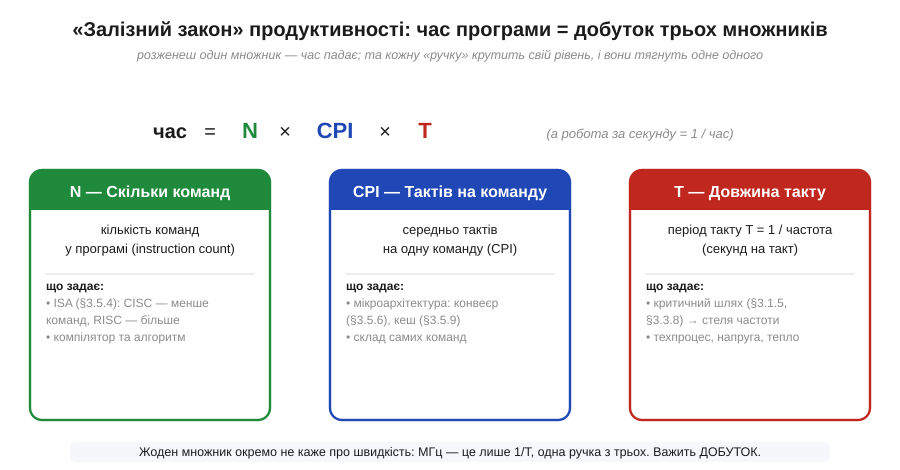
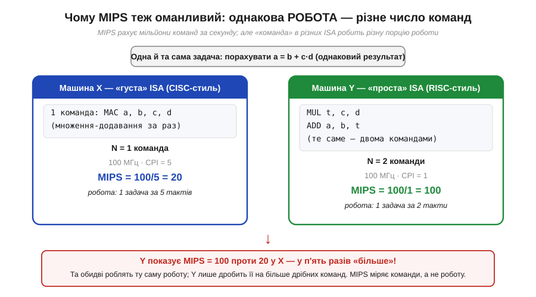
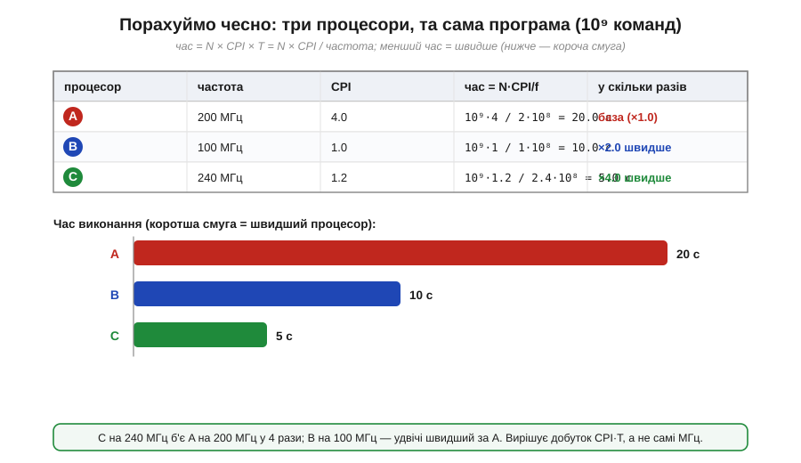

# 🧮 Арифметика продуктивності: CPI, IPC, MIPS — чому мегагерци не дорівнюють швидкості

> Числова вставка до теми [§3.5.5 «Що означає „частота" процесора»](ch18-processor-architecture.md). Тема вже показала головну ідею якісно: команда — це кілька тактів, тож реальна швидкодія = частота ÷ CPI, а звідси й «міф мегагерців». Тут ми доводимо цю думку до **формули, якою користуються інженери**. Зберемо три множники, що визначають час програми, в один вираз — його так і звуть «залізним законом» продуктивності, — і покажемо, чому навіть наступна за МГц спокуса, **MIPS**, теж оманлива. Наприкінці порахуємо все на числах: три процесори, та сама програма, чесне «у скільки разів швидше».

### Означення: що ми взагалі міряємо

Перш ніж щось рахувати, домовмося, **що** саме звемо швидкодією. §3.5.5 уже застерегла: частота — це такти за секунду, а не робота за секунду. Тож єдина чесна міра швидкості процесора на конкретній задачі — це **час її виконання** (*execution time*): скільки секунд від старту до завершення. Усе інше — МГц, MIPS — лише непрямі натяки на нього.

А час складається з трьох речей, кожну з яких ми вже зустрічали в темі окремо:

- **N** — скільки **команд** машина виконає, щоб доробити задачу (*instruction count*);
- **CPI** — скільки в середньому **тактів** іде на одну команду (*cycles per instruction*, §3.5.5);
- **T** — скільки **секунд** триває один такт, тобто період такту (*clock period*), обернений до частоти: T = 1 ÷ f.

Помножте їх — і отримаєте час. Це й є вся арифметика продуктивності в одному рядку.

### Інтуїція: чому саме добуток

Чому множення, а не щось складніше? Розгорнімо одиниці — і формула складеться сама, без жодного зусилля пам'яті. Нам потрібні **секунди на задачу**, а кожен множник — це одна ланка ланцюжка перетворень:

```
   команди      такти       секунди       секунди
  ───────── · ───────── · ─────────  =  ─────────
   задача      команда       такт         задача
       N          CPI          T          час
```

Сусідні дроби скорочують спільні одиниці — «команди» гасять «команди», «такти» гасять «такти», — і лишаються чисті секунди на задачу. Це той самий прийом аналізу розмірностей, що в §1.1.5: якщо одиниці зійшлися, формула майже напевно правильна. А читається ланцюжок як проста історія: задача розпадається на N команд, кожна команда триває CPI тактів, кожен такт триває T секунд. Перемножив три ланки — дістав повний час.


*Рис. 3.5.5m.1. Час програми — це добуток трьох незалежних множників, і кожну «ручку» крутить свій рівень рішень: число команд N задають ISA (§3.5.4) та компілятор; CPI задає мікроархітектура (конвеєр §3.5.6, кеш §3.5.9); період такту T = 1/f впирається в критичний шлях (§3.1.5, §3.3.8). Частота керує лише однією ланкою з трьох — ось чому самі МГц нічого не вирішують.*

Тепер видно, чому §3.5.5 наполягала, що МГц — «лише половина правди»: насправді це навіть не половина, а **одна третина**. Частота сидить тільки в множнику T і нічого не знає ні про N, ні про CPI. Можна задерти f до небес — і програти процесору з удвічі меншою частотою, якщо в того менший CPI або компілятор згенерував менше команд.

### Формальний апарат: «залізний закон» і його похідні

Зберемо означення в одне рівняння. Його називають **залізним законом продуктивності** (*iron law of performance*) — за те, що з нього не вислизнути жодними маркетинговими хитрощами; цю назву закріпив Дуглас Кларк (*Douglas Clark*) за дослідженнями 1980-х, а в широкий вжиток її ввели класичні підручники з архітектури:

```
час = N · CPI · T = (N · CPI) / f.
```

Усе інше — похідні від цього рядка, зручні скорочення для окремих випадків:

- **IPC** (*instructions per cycle*) — команд за такт, обернене до CPI: IPC = 1 ÷ CPI. Тема §3.5.5 уже згадала його: що більший IPC, то ефективніший процесор. Сучасні ядра з кількома конвеєрами беруть IPC > 1 (кілька команд за такт); скромний мікроконтролер тримається ближче до IPC ≈ 1, а то й менше, коли часто чекає на пам'ять.

- **Команд за секунду** — головна проміжна величина. Якщо помножити частоту на IPC (або, що те саме, поділити на CPI), дістанемо темп, з яким машина «проковтує» команди:

```
команд/с = f · IPC = f / CPI.
```

- **MIPS** (*million instructions per second*) — та сама величина, лише в мільйонах: зручна, кругла, історично найпопулярніша одиниця «швидкодії».

```
MIPS = (f / CPI) / 10⁶  =  f[МГц] / CPI.
```

Остання рівність гарна тим, що частоту в мегагерцах ділиш просто на CPI — і одразу маєш MIPS. Процесор на 100 МГц із CPI = 1 видає рівно 100 MIPS; той самий на 100 МГц, але з CPI = 4, — лише 25 MIPS. Здавалося б, нарешті чесна міра: вона ж уже враховує CPI, якого так бракувало голим мегагерцам. Та насправді MIPS ховає **ту саму ваду на крок глибше** — і саме тут вставка додає до §3.5.5 нове.

### Чому MIPS бреше так само, як МГц

Підступ у літері **I** — «instructions». MIPS рахує **команди** за секунду, а не **роботу** за секунду. А скільки команд потрібно на одну й ту саму роботу — залежить від ISA (§3.5.4): на «густій» системі команд одна команда робить багато, на «простій» те саме доводиться розписувати кількома дрібними. Тож множник N з нашого закону в різних архітектурах **різний для тієї самої задачі** — і MIPS, ділячи на CPI, цю різницю не ловить, а навпаки маскує.


*Рис. 3.5.5m.2. Обидві машини рахують той самий вираз a = b + c·d. «Густа» ISA робить це однією командою MAC за 5 тактів — на 100 МГц виходить 20 MIPS. «Проста» ISA розписує те саме двома командами по 1 такту — 100 MIPS. За числом MIPS друга «у п'ять разів швидша», хоча роботу обидві виконують однакову: вона просто дробить її на більше дрібніших команд. MIPS міряє темп команд, а не темп роботи.*

Ось чому над MIPS давно іронізують, розшифровуючи абревіатуру як *Meaningless Indicator of Processor Speed* — «беззмістовний показник швидкості процесора»: нарощувати MIPS можна, просто **роздрібнюючи** команди, від чого реальна робота не пришвидшується ні на йоту. MIPS чесно порівнює хіба що дві машини **однакової ISA** (тоді N на задачу однакове й скорочується) — рівно як частота чесно порівнює лише той самий процесор із собою. Щойно ISA різні, MIPS повертає нас до того самого міфу, тільки вже не мегагерцевого, а «мільйон-командного».

### Порахуймо чесно: три процесори, та сама програма

Складімо все докупи на числах. Нехай програма виконує **N = 10⁹ команд** (мільярд — порядок реального робочого циклу). Порівняємо три процесори; вирішувати має тільки **час**, бо це єдина чесна міра.


*Рис. 3.5.5m.3. Та сама програма (10⁹ команд) на трьох процесорах. Час рахуємо за залізним законом час = N·CPI/f; коротша смуга — швидший процесор. A на 200 МГц програє всім через величезний CPI = 4; C на 240 МГц із CPI = 1.2 виявляється найшвидшим, а B на «всього» 100 МГц обходить A удвічі. Самі мегагерци не вгадали б жодного місця.*

Процесор **A**: 200 МГц, CPI = 4 (багато простоїв на пам'яті). Період такту T = 1 ÷ (200·10⁶) = 5 нс.

```
час_A = N · CPI / f
      = 10⁹ · 4 / (200·10⁶)
      = 4·10⁹ / 2·10⁸
      = 20.0 с.
```

Процесор **B**: 100 МГц, CPI = 1 (ефективне ядро без простоїв). Удвічі менша частота за A.

```
час_B = 10⁹ · 1 / (100·10⁶)
      = 1·10⁹ / 1·10⁸
      = 10.0 с.
```

Процесор **C**: 240 МГц, CPI = 1.2 (як у класі ESP32 — швидкий такт і непоганий конвеєр).

```
час_C = 10⁹ · 1.2 / (240·10⁶)
      = 1.2·10⁹ / 2.4·10⁸
      = 5.0 с.
```

Тепер порівняємо — і ранжування виходить геть не таке, як підказали б самі МГц:

```
A: 200 МГц → 20.0 с   (база, ×1.0)
B: 100 МГц → 10.0 с   (×2.0 швидше за A)
C: 240 МГц →  5.0 с   (×4.0 швидше за A)
```

За частотою лідером «мав би» бути A (200 МГц) попереду B (100 МГц), а C ледь випереджав би A. Насправді **B удвічі швидший за A, дарма що його частота вдвічі менша**, а C — найшвидший і б'є A вчетверо. Уся різниця сидить у добутку CPI · T: A розтринькує по 4 такти на команду, тож його швидкий такт марнується на простої. Це і є залізний закон у дії: рахуй увесь добуток, а не один множник.

> 🔧 **Навіщо це.** Залізний закон — це робочий чекліст для трьох типів рішень. Перше — **читати специфікації**: побачивши «MIPS» чи «DMIPS» у даташиті мікроконтролера, згадайте, що це лише f/CPI в обраному вимірі й між різними ядрами майже нічого не доводить; питайте про час на вашій задачі, а не про абстрактний рекорд. Друге — **обирати частоту**: на ESP32 ви самі ставите f (скажімо, 240, 160 чи 80 МГц), і закон показує, що час падає обернено до f лише поки CPI не залежить від частоти; а от коли ядро дедалі частіше чекає на повільнішу за нього пам'ять, CPI росте — і подвоєння МГц дає менше, ніж удвічі (типова пастка «розігнав, а майже не пришвидшало»). Третє — **прикидати, чи встигне код**: щоб дізнатися, скільки часу займе шматок (наприклад, обробник між тактовими перериваннями в Модулі 4), не множте на МГц — рахуйте такти (N · CPI), а тоді ділíть на частоту. Усі три зводяться до одного: дивіться на добуток N · CPI · T, а не на жодне число поодинці.

### Де це працює далі в курсі

Залізний закон — це лінза, крізь яку видно сенс наступних тем розділу, бо кожна з них **тисне на свій множник**, не чіпаючи решти.

- **Конвеєр** (§3.5.6) б'є по **CPI**: перекриваючи фази команд, він підганяє CPI до ≈1 (IPC ≈ 1), і саме його §3.5.5 пообіцяла як спосіб зменшити CPI без підняття частоти.
- **Кеш** (§3.5.9) теж працює на **CPI**, але з іншого боку: він прибирає простої на пам'яті — ті самі, через які в нашого процесора A CPI роздувся до 4.
- **ISA** (§3.5.4) керує множником **N**: «густіша» система команд робить більше за команду, тож N на задачу менше — але, як ми щойно бачили, саме через це MIPS і стає несумісним між архітектурами.
- А **критичний шлях** (§3.1.5, §3.3.8) ставить підлогу множнику **T**: коротший за нього такт ловив би ще не готові дані, тож нижче цієї межі період не вкоротити — а отже, й частоту вище відповідної стелі не підняти.

Тому залізний закон — не лише формула для оцінок, а й карта розділу: кожен прийом прискорення зрештою смикає одну з трьох ручок — N, CPI або T, — і виграє рівно настільки, наскільки зменшує їхній добуток.
