# Розділ 3.6 — Пам'ять, адресація, стек і купа

Останній розділ Модуля 3. Ми збудували процесор, що **виконує** збережену програму (Розділ 3.5), — але і програма, і дані мусять десь **жити**: у пам'яті, до якої процесор миттєво дістає будь-яку комірку за адресою. Досі ми сприймали цю пам'ять як належне — «вона є». Тепер придивимося, **як** вона влаштована й як нею користуються. Розберемо найпершу модель — пам'ять як масив пронумерованих комірок; побачимо, де в ній лежить код, а де змінні (карта пам'яті); чим **постійна** пам'ять (Flash) відрізняється від **тимчасової** (RAM); що таке адреса й покажчик; і нарешті — два головні способи, якими програма розпоряджається пам'яттю: **стек** (для викликів функцій) і **купа** (для динамічних даних), а також типові біди, що з ними пов'язані. Це знання — місток від «заліза» до реального програмування, яким ви займетеся в наступних модулях: майже кожен серйозний баг має корінь у пам'яті.

> 📜 **Перед матеріалом — історія:** [Магнітна пам'ять на осердях](ch19-history-core-memory.md). Вона пояснює, як машини взагалі навчилися **надійно пам'ятати**: від жалюгідних ранніх пам'ятей до феритових кілець Джея Форрестера, що дали швидкий **випадковий доступ** і саму модель **решітки адресованих комірок**, яку ми вивчатимемо тут. Технологія відтоді змінилася (кремній замість фериту), а ідея адреси лишилась незмінною.

---

## 3.6.1 Пам'ять як масив комірок з адресами

Почнімо з найпростішої і найважливішої моделі, на якій тримається все інше. **Пам'ять — це довгий масив пронумерованих комірок.** Кожна комірка тримає один байт, і кожна має свій унікальний номер — **адресу**. Усе, що робить процесор із пам'яттю, зводиться до двох дій: **прочитати** комірку за її адресою або **записати** в неї. Звучить буденно — та саме в цій моделі ховаються поняття, без яких не зрозуміти ні покажчиків, ні стека, ні половини програмістських багів: різниця між **адресою** і **даними**, розмір **адресного простору**, і та сама наскрізна думка Розділу 3.4, що **байт — це лише число, а сенс йому надає вживання**. Розберімо все по черзі.

### Масив пронумерованих комірок

Уявімо пам'ять як **вулицю будинків**, кожен зі своїм номером.


*Рис. 3.6.1.1. Пам'ять — послідовність комірок, кожна тримає один **байт** (§3.4.1) і має унікальний номер — **адресу** (0x00, 0x01, 0x02…). Як на вулиці: номер будинку — це адреса, а мешканець усередині — дані. Дві геть різні речі: **адреса** каже, **де** комірка, а **вміст** — **що** в ній лежить. Це точнісінько та модель, що дали осердя (історія розділу): решітка комірок, до кожної — за її номером.*

Зверніть увагу на цю двоїстість «де» і «що» — вона фундаментальна. Адреса 0x03 і байт 0x41, що в ній лежить, — це **два різні числа** з різним змістом: одне вказує **місце**, інше — **вміст**. Плутати їх — класична помилка початківця (і джерело багів, особливо коли дійде до покажчиків, §3.6.4). Тримаймо їх чітко нарізно від самого початку. (Адреси, до речі, майже завжди записують **шістнадцятково**, §3.4.2 — 0x00, 0x1F, 0xFF — бо так компактно й зручно лягає на біти; ви бачитимете їх скрізь у роботі з пам'яттю.)

### Адреса проти даних

Закріпімо цю різницю, бо вона того варта, і заразом побачимо, де вона вже нам зустрічалася.

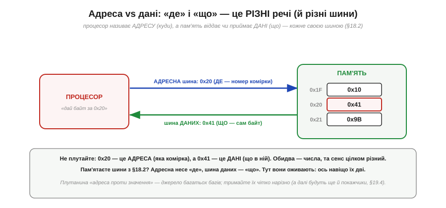
*Рис. 3.6.1.2. Процесор називає **адресу** (наприклад, 0x20 — «яка комірка»), а пам'ять віддає чи приймає **дані** (байт 0x41 — «що в ній»). І несуть їх **різні шини** (§3.5.2): адресна шина — «де», шина даних — «що». Ось навіщо в §3.5.2 їх було дві! 0x20 і 0x41 — обидва числа, та сенс цілком різний: одне — місце, інше — значення.*

Тут оживає те, що в §3.5.2 здавалося абстрактним. Пам'ятаєте **адресну** шину й шину **даних**? Тепер видно, навіщо вони окремі: процесор по адресній шині каже пам'яті, **куди** звернутися, а по шині даних іде сам **байт** — туди (при записі) чи назад (при читанні). Третя, шина **керування**, каже, що робити — читати чи писати. Уся розмова процесора з пам'яттю — це «адреса + операція + дані». А плутанина «адреса проти значення» — настільки поширене джерело багів, що варто закарбувати: **число-адреса ≠ число-значення**, навіть коли обидва виглядають однаково.

### Один байт на адресу

Скільки даних адресує одна адреса? Рівно **один байт** — найдрібнішу стандартну порцію (§3.4.1).

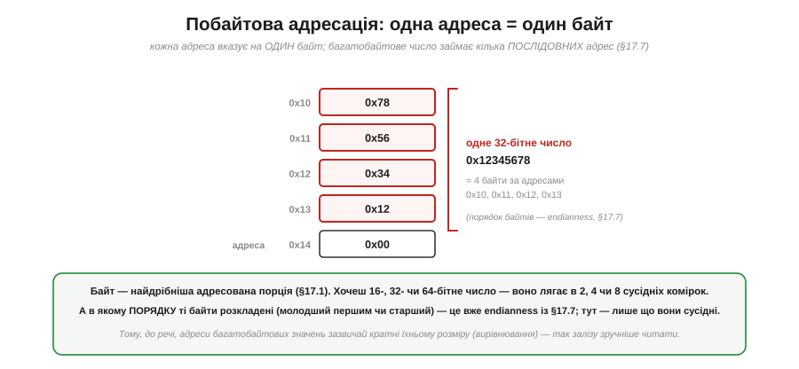
*Рис. 3.6.1.3. Кожна адреса вказує на **один байт**. Тож багатобайтове число займає кілька **послідовних** адрес: 32-бітне 0x12345678 лягає в чотири сусідні комірки (0x10, 0x11, 0x12, 0x13). А в якому **порядку** ті байти розкладені (молодший першим чи старший) — це вже endianness із §3.4.7; тут важливо лише, що вони **сусідні**.*

Це називають **побайтовою адресацією** (*byte-addressable*): найменша річ, яку можна назвати адресою, — байт. Хочете 16-бітне число — воно займе **дві** сусідні комірки, 32-бітне — **чотири**, 64-бітне — **вісім**. І тут прямо змикається §3.4.7: коли число розкладене на кілька байтів у пам'яті, виникає питання їхнього **порядку** (endianness) — старший байт за меншою адресою (big-endian) чи молодший (little-endian, як ESP32). Тепер ви бачите, **де саме** живе те питання порядку: у послідовних комірках пам'яті. (Через це, до речі, багатобайтові значення зазвичай кладуть за адресами, кратними їхньому розміру — це зветься **вирівнюванням** і допомагає залізу читати їх швидше.)

### Скільки комірок: 2ᴺ

Наскільки великою може бути пам'ять? Це визначає **ширина адреси** — скільки бітів у номері комірки.

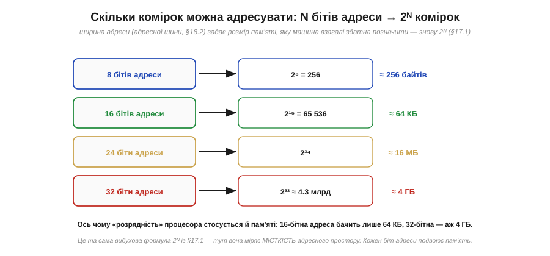
*Рис. 3.6.1.4. N бітів адреси дають **2ᴺ** різних адрес — стільки комірок машина може позначити. 8-бітна адреса бачить 256 байтів; 16-бітна — 65 536 (64 КБ); 24-бітна — 16 МБ; 32-бітна — близько 4.3 мільярда (4 ГБ). Це та сама вибухова формула **2ᴺ** із §3.4.1, тепер вона міряє **місткість адресного простору**: кожен доданий біт адреси **подвоює** обсяг пам'яті, яку можна адресувати.*

Ось іще одна причина, чому «розрядність» процесора важлива (§3.4.7, §3.5.2): вона стосується не лише чисел, а й **пам'яті**. Ширина адресної шини задає **стелю** пам'яті: 16-бітна адреса фізично не дотягнеться далі 64 КБ, хоч би скільки мікросхем ви приставили; 32-бітна бачить уже 4 ГБ. Саме тому перехід комп'ютерів із 32 на 64 біти був значною мірою про пам'ять — 32-бітна межа в 4 ГБ стала тісною. Запам'ятайте зв'язок: **N бітів адреси → 2ᴺ комірок**; він підкаже, скільки пам'яті здатна охопити дана машина.

### Дві операції: читання й запис

Що ж процесор робить із пам'яттю? Лише **дві** речі.

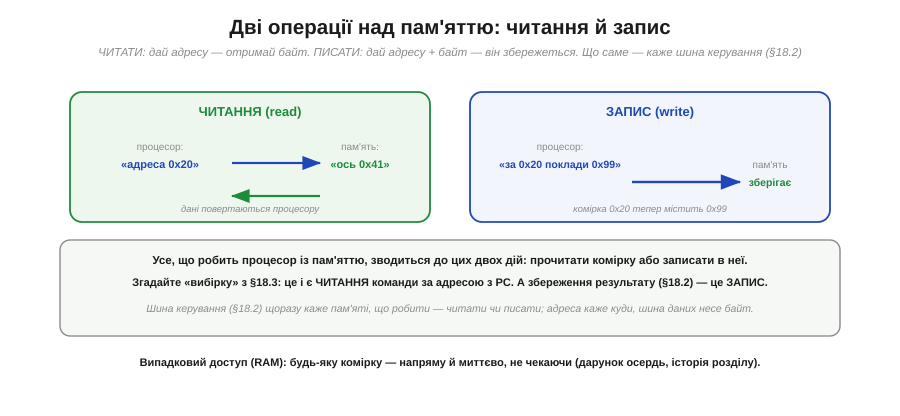
*Рис. 3.6.1.5. **Читання** (read): процесор дає адресу — пам'ять повертає байт із тієї комірки. **Запис** (write): процесор дає адресу **і** байт — пам'ять зберігає його в тій комірці. Що саме робити, каже шина керування (§3.5.2). І все: будь-яка робота з пам'яттю — це послідовність читань і записів.*

Усе, абсолютно все, що відбувається в пам'яті, зводиться до цих двох дій. І ви вже бачили їх у дії: **вибірка** команди в циклі §3.5.3 — це **читання** за адресою з PC; збереження результату обчислення — це **запис**. Завантаження змінної в регістр — читання; збереження назад — запис. Коли в наступних модулях ви оголошуватимете змінну й присвоюватимете їй значення, під капотом це й буде запис у комірку пам'яті за певною адресою, а використання змінної — читання звідти. А завдяки спадщині осердь (історія розділу) цей доступ — **випадковий** (*random access*, звідси RAM): будь-яку комірку напряму й миттєво, не чекаючи, поки вона «доїде».

### Комірка тримає просто число

І наостанок — найглибша думка, пряме відлуння Розділу 3.4. Що ж лежить у комірці? **Просто число.** Не «команда», не «буква», не «ціле» — лише вісім бітів, байт.


*Рис. 3.6.1.6. Байт 0x41 у комірці 0x20 — це просто число (0100 0001). Чим воно є — залежить від того, **як його вживають**: як ціле це 65, як символ — літера 'A', як частина команди — шматок opcode чи операнда, як частина float — кілька бітів дробу. Адреса каже лише **де** байт; що він **означає**, вирішує програма. Це наскрізна думка §3.4.1, тепер у пам'яті.*

Ось чому пам'ять така універсальна — і така небезпечна. Універсальна, бо в тих самих комірках можна тримати що завгодно: і код, і дані, і числа, і текст — усе це просто байти, різні лише **вживанням** (саме на цьому стоїть фон-нейманівська машина, Розділ 3.5: код і дані — однакові числа в одній пам'яті). А небезпечна — бо ніщо в самій комірці не каже, **як** її читати; це знає лише програма. Прочитати дані **не за тією домовленістю** (байти тексту як команду, ціле як дріб, адресу як значення) — і все ламається. Тримайте в голові: адреса — це **місце**, байт — це **число**, а **сенс** йому надаєте ви, програміст, тим, як цю комірку вживаєте.

> 🔧 **Навіщо це.** Ця модель — підмурок усього, що ви робитимете з пам'яттю в коді. Перше: **адреса ≠ значення** — комірка має номер (де) і вміст (що); плутати їх не можна, і ця відмінність стане критичною з покажчиками (§3.6.4). Друге: пам'ять **побайтова**, тож ваші 16-/32-бітні змінні займають по 2/4 сусідні комірки, а їхній порядок — це endianness (§3.4.7), що кусає при обміні даними. Третє: **N бітів адреси → 2ᴺ** комірок — звідси межі пам'яті вашого МК (наприклад, скільки SRAM здатна адресувати архітектура); коли впираєтесь у «брак пам'яті», згадайте цю стелю. Четверте, найважливіше концептуально: **байт у пам'яті — просто число, сенс надає вживання** (§3.4.1); більшість «незрозумілих» багів із пам'яттю — це коли байти прочитали не як треба (тип переплутано, дані затерли код, вийшли за межі масиву). А все, що робить процесор, — це **читання й запис** комірок за адресами. Засвоївши цю просту картину, ви легко візьмете й карту пам'яті, і покажчики, і стек.

---

Підсумок §3.6.1: **пам'ять — це масив пронумерованих комірок**, кожна тримає один **байт** (§3.4.1) і має унікальну **адресу** (де). Адреса й дані — **різні** речі: адреса каже, **яка** комірка, дані — **що** в ній; несуть їх різні шини (§3.5.2 — адресна й даних, а керування каже читати чи писати). Пам'ять **побайтова**: одна адреса = один байт, тож багатобайтові числа займають кілька сусідніх комірок, а їхній порядок — endianness (§3.4.7). Розмір адресного простору — **2ᴺ** для N бітів адреси (§3.4.1): 16 біт → 64 КБ, 32 → 4 ГБ; ширина адреси задає стелю пам'яті. Усі дії з пам'яттю — це **читання** (адреса → байт) і **запис** (адреса + байт → збережено); доступ **випадковий** (RAM, дарунок осердь). І наскрізне: **байт у комірці — просто число**, сенс йому надає вживання (§3.4.1) — код, дані, ціле, буква — усе різниться лише тим, **як** його читають. Ми знаємо, що пам'ять — це решітка комірок. Та в реальній машині різні її ділянки відведені під різне: тут код, там змінні, отам периферія. Як влаштована ця **карта пам'яті** — наступний підрозділ.

---

## 3.6.2 Карта пам'яті: де що лежить (регіони)

Адресний простір із §3.6.1 — це довга низка комірок від 0 до межі. Та було б хаосом, якби програма кидала код, змінні й дані абияк упереміш. Натомість простір **поділено на регіони**: кожен діапазон адрес відведено під певний рід даних — тут лежить код, там сталі, отам змінні, ще далі — стек і купа, а на мікроконтролері навіть **периферія** має свій діапазон адрес. Цю схему «що за якими адресами» називають **картою пам'яті** (*memory map*), і вона — друга за важливістю річ після самої моделі комірок. Знати карту — це наполовину розуміти будь-який баг із пам'яттю: куди вказує підозрілий покажчик, чому змінна обнулилася, де програма «впала». Розберімо типову карту, що тримає кожен регіон, і — найцікавіше для нас — як на мікроконтролері в цю карту вписані Flash, RAM і навіть органи керування залізом.

### Адресний простір — поділений на зони

Ось класична карта пам'яті програми — її варто закарбувати, бо вона майже однакова всюди.

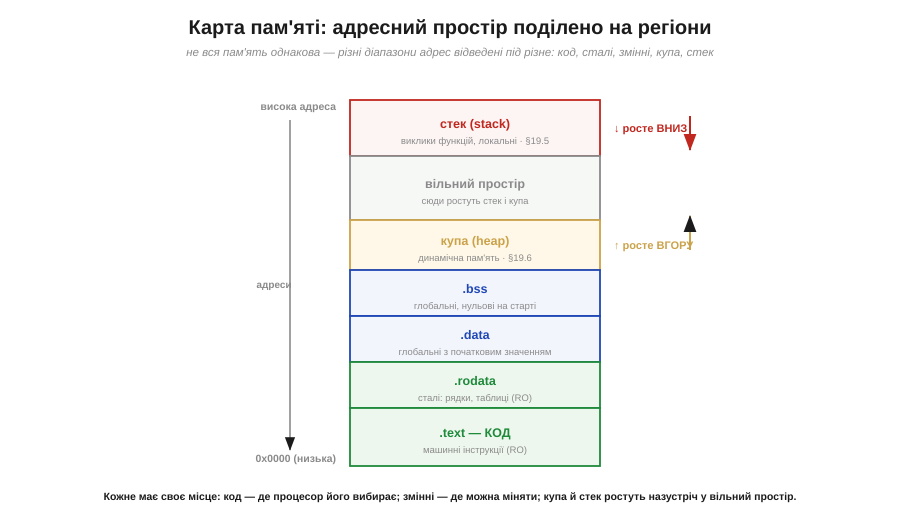
*Рис. 3.6.2.1. Адресний простір поділено на регіони (від низьких адрес угору): **.text** — машинний код (тільки читання); **.rodata** — сталі (рядки, таблиці, RO); **.data** — глобальні змінні з початковим значенням; **.bss** — глобальні, нульові на старті; **купа** — динамічна пам'ять, росте вгору; великий **вільний простір**; і **стек** на вершині, що росте вниз. Кожне має своє місце: код — де процесор його вибирає; змінні — де їх можна міняти; купа й стек ростуть назустріч у спільний вільний простір.*

Придивіться до логіки цього поділу. **Незмінне** (код і сталі) — внизу, окремою купкою: його ніхто не міняє під час роботи, тож воно лежить компактно й захищене від запису. **Змінне, але наперед відоме** (глобальні змінні — .data і .bss) — далі. А **те, що росте й міняється** під час роботи (купа й стек) — з протилежних кінців вільного простору, щоб гнучко його ділити. Цей поділ не випадковий, а продуманий: він віддзеркалює **час життя** й **мінливість** даних. (Дрібна деталь: .bss тримає глобальні змінні, що на старті дорівнюють нулю, — їх не треба зберігати в програмі поіменно, досить сказати «обнули цей шмат», що економить місце; .data ж зберігає початкові значення, бо вони ненульові.)

### Що тримає кожен регіон

Зведімо регіони в таблицю — це ваша шпаргалка на все життя.


*Рис. 3.6.2.2. **.text** — інструкції програми (RO). **.rodata** — сталі: рядки-літерали, таблиці (RO). **.data** — глобальні/статичні з початковим значенням (RW). **.bss** — глобальні/статичні, нульові на старті (RW). **Купа** — динамічні дані на запит (RW, росте вгору, §3.6.6). **Стек** — виклики функцій і локальні змінні (RW, росте вниз, §3.6.5). Код і сталі незмінні (RO), тож їх часто кладуть у постійну пам'ять (Flash, §3.6.3); змінні — в RW-пам'ять (RAM).*

Зверніть увагу на стовпчик **властивостей**: одні регіони «тільки читання» (RO), інші «читання-запис» (RW). Це не примха — це **захист**. Код позначають RO, щоб випадковий (чи зловмисний) запис не зіпсував інструкції; адже за §3.4.1 код — це теж байти, і нічого не заважало б їх перезаписати, якби не цей захист. А ще ця властивість прямо підказує, **де** регіон фізично житиме: незмінне (RO) — у постійній пам'яті, змінне (RW) — у тимчасовій. Саме до цього поділу постійної й тимчасової пам'яті (Flash і RAM) ми дійдемо в §3.6.3; тут досить бачити, що карта **групує** дані за їхньою мінливістю.

### Стек і купа ростуть назустріч

Два регіони на карті поводяться особливо — вони **міняють розмір** під час роботи. Це стек і купа, і їх не випадково ставлять з протилежних кінців.


*Рис. 3.6.2.3. **Стек** (виклики функцій, локальні) сидить угорі й росте **вниз**; **купа** (динамічні дані) — нижче й росте **вгору**; між ними — спільний **вільний простір**. Чому назустріч? Бо обидва міняють розмір на льоту, і наперед не знати, кому скільки треба. З протилежних кінців кожен бере стільки, скільки треба, з **одного** спільного запасу — гнучко. Небезпека: якщо вони **зійдуться** — зіткнення (переповнення, §3.6.7).*

Це елегантне рішення поширеної дилеми: маємо обмежений вільний простір і двох «пожильців», апетит яких непередбачуваний. Якби кожному виділити фіксовану половину, один міг би «голодувати», поки другий не дочерпав свою. Поставивши їх **назустріч**, ми дозволяємо кожному рости в спільну порожнечу, скільки треба, — поки між ними лишається місце. Стек роздувається при глибоких вкладених викликах функцій (§3.6.5), купа — при численних динамічних виділеннях (§3.6.6). А коли вони **зустрічаються**, стається лихо — переповнення стека чи купи (§3.6.7), один із найкаверзніших класів багів. Поки ж зосередьмося на самій **геометрії**: два рухливі регіони ділять один запас, ростучи назустріч. Механіку кожного розберемо в §3.6.5 і §3.6.6.

### На мікроконтролері: Flash, RAM, периферія

Дотепер карта була універсальною. А тепер — як вона виглядає на **мікроконтролері**, бо тут є важлива особливість, прямо пов'язана з Гарвардською архітектурою (§3.5.7).


*Рис. 3.6.2.4. На МК різні види пам'яті лежать у **різних** діапазонах адрес. **Flash** (низькі адреси) — постійна, нелетка: туди кладуть **код** (.text) і **сталі** (.rodata). **RAM** (SRAM, інший діапазон) — тимчасова, летка: там живуть .data, .bss, **купа** й **стек**. А ще окремий діапазон — **периферія**: адреси, що ведуть не до пам'яті, а до **регістрів керування** залізом (GPIO, таймери, UART…). Це і є Гарвардський поділ (§3.5.7), видимий просто в карті адрес.*

Ось де абстрактний поділ «фон Нейман проти Гарварда» (§3.5.7) стає **відчутним**. На типовому МК код фізично живе в одному діапазоні (Flash — щоб пережити вимкнення), змінні — в іншому (RAM — швидка, але летка), і вони мають **окремі** адресні діапазони. Тому, до речі, та сама числова адреса в Flash і в RAM — це **різні** комірки в різних пам'ятях. Чим саме Flash відрізняється від RAM (швидкість, нелеткість, обмеження на запис) — це вже §3.6.3; тут важливо побачити, що на МК карта пам'яті **фізично** розкладена по різних видах пам'яті. Але найцікавіший — третій діапазон, периферія, бо він ховає одну з найелегантніших ідей у будові комп'ютера.

### Пам'ять-відображений ввід-вивід

Зверніть увагу: у карті МК є адреси, за якими **немає пам'яті** — там сидять **регістри периферії**. І звернення до них працює навдивовижу красиво.


*Рис. 3.6.2.5. Деякі адреси — це не комірки RAM, а **регістри керування** залізом. Записавши байт у таку адресу тими самими командами `LD`/`ST` (§3.5.8), що й у звичайну пам'ять, процесор **керує пристроєм** — наприклад, засвічує світлодіод на ніжці. Периферію «підвісили» на адреси, тож не треба окремих команд вводу-виводу: записав у потрібну адресу — увімкнув залізо. Це зветься **пам'ять-відображений ввід-вивід** (*memory-mapped I/O*).*

Осягніть, наскільки це елегантно. Процесорові не потрібна окрема «мова» для спілкування із зовнішнім світом — ні особливих команд, ні окремих шин. Периферію просто **підвісили на адреси**, і тепер увімкнути світлодіод, запустити таймер чи послати байт по UART — це все той самий **запис у пам'ять** (§3.5.8: команда `ST`), лише за «магічною» адресою, що веде не до RAM, а до залізного регістра. Ось чому в коді для мікроконтролера ви раз у раз «пишете в регістр», щоб щось увімкнути, — під цим стоїть memory-mapped I/O. Це безпосередньо готує ґрунт для Розділу 4.1 (§4.1.3), де ми побачимо, як код через ці адреси «торкається» заліза. (І невеличке застереження на майбутнє: саме тому помилкова адреса небезпечна — вона може випадково зачепити периферію; а ще тому деякі змінні позначають `volatile`, щоб компілятор не «оптимізував» доступ до залізних регістрів, — але це вже Розділ 4.5.)

> 🔧 **Навіщо це.** Карта пам'яті — практичний інструмент, яким ви користуватиметеся постійно при налагодженні. Перше: знаючи **регіони**, ви розумітимете повідомлення компонувальника й налагоджувача — скільки у вас .text (код), скільки .bss і .data (глобальні), скільки лишилось RAM під стек і купу; коли МК «не влазить» у пам'ять, ви дивитеся саме на цю карту. Друге: на МК **код у Flash, змінні в RAM** — звідси практичні наслідки (великі сталі таблиці варто тримати у Flash, щоб не з'їдати дефіцитну RAM; §3.6.3). Третє: **стек і купа ростуть назустріч** у спільний простір — тому брак RAM проявляється як їхнє зіткнення (§3.6.7), і це частий корінь «незрозумілих» збоїв на МК. Четверте, дуже практичне: **memory-mapped I/O** означає, що керування залізом — це запис у регістри за адресами; майже весь код роботи з периферією (Модуль 4) — це читання й запис таких адрес. Тримайте карту пам'яті свого чипа під рукою — вона відповість на половину питань «чому воно так поводиться».

---

Підсумок §3.6.2: адресний простір **поділено на регіони** — це **карта пам'яті**. Типові регіони (від низьких адрес): **.text** (код, RO), **.rodata** (сталі, RO), **.data** (глобальні з початковим значенням, RW), **.bss** (глобальні, нульові на старті, RW), **купа** (динамічні дані, росте вгору, §3.6.6) і **стек** (виклики й локальні, росте вниз, §3.6.5); між купою й стеком — спільний **вільний простір**, у який вони ростуть **назустріч** (а зіткнуться — переповнення, §3.6.7). Поділ віддзеркалює **мінливість** даних: незмінне (RO) окремо від змінного (RW). На **мікроконтролері** карта фізично розкладена: **Flash** (код + сталі, нелетка) і **RAM** (змінні, стек, купа, летка) — окремі діапазони (Гарвардський поділ §3.5.7 наживо), плюс діапазон **периферії**. Останній ховає **пам'ять-відображений ввід-вивід**: регістри керування залізом «підвішені» на адреси, тож процесор керує периферією тими самими `LD`/`ST` (§3.5.8), що й пам'яттю, — записав у потрібну адресу й увімкнув пристрій (детально в §4.1.3). Ми кілька разів згадали постійну й тимчасову пам'ять — Flash і RAM. Чим вони насправді різняться й чому одне «пам'ятає» без живлення, а інше ні — наступний підрозділ.

---

## 3.6.3 Flash vs RAM: постійне й тимчасове

У §3.6.2 ми побачили, що на мікроконтролері код живе у Flash, а змінні — в RAM, у різних діапазонах адрес. Тепер з'ясуймо, **чому** так, бо за цим стоїть найпрактичніший поділ у всій пам'яті: на **летку** й **нелетку**. Одна забуває все при вимкненні живлення, інша пам'ятає. Цей поділ пояснює дві речі, з якими ви зіткнетеся в перший же день роботи з МК: чому ваша прошита програма **лишається** в чипі після від'єднання живлення, а змінні **обнуляються** при кожному перезапуску. А ще він тягне за собою низку практичних наслідків — від «де зберігати налаштування» до «чому Flash не можна перезаписувати щосекунди». Розберімо обидві пам'яті, їхні особливості й тонку, але важливу деталь про те, як глобальні змінні взагалі дістають свої початкові значення.

### Летка проти нелеткої

Найголовніше питання до будь-якої пам'яті: **чи пам'ятає вона дані без живлення?**


*Рис. 3.6.3.1. **RAM — летка** (*volatile*): тримає дані, лише поки є живлення; вимкнув — усе зникло, як напис на дошці, що стирається, щойно згасне світло. Тримає біт зворотним зв'язком, як тригер (§3.3), тож без струму забуває. **Flash — нелетка** (*non-volatile*): зберігає дані й знеструмлена, як чорнило на папері; пам'ятає фізично (заряд, замкнений в ізольованому «плавучому» затворі). Ось чому програма не зникає при вимкненні, а змінні обнуляються при перезапуску: програма у Flash, змінні в RAM.*

Тут прямо змикаються дві нитки нашого курсу. **Летка** RAM — родичка **тригера** з Розділу 3.3: вона тримає біт, лише поки тече струм (найшвидша RAM, **SRAM**, і справді складена по суті з тригерів — по кілька транзисторів на біт). Вимкнув живлення — петля зворотного зв'язку розпалася, біт забувся. А **нелетка** Flash — спадкоємиця ідеї **осердь** (історія розділу): вона зберігає стан **фізично**, у самому матеріалі, без жодного струму (як магнітне осердя «застрягало» в напрямку намагнічення, так комірка Flash утримує заряд). Тому ваш скетч, залитий у Flash, переживає вимкнення — а лічильник у RAM-змінній починає з нуля при кожному ввімкненні. (Слово «летка»/«volatile» ще зустрінеться вам як ключове слово мови програмування з геть іншим, хоч і спорідненим змістом — це Розділ 4.5; тут ідеться про **фізику** пам'яті.)

### Що куди: незмінне у Flash, мінливе в RAM

Тепер ясно, **чому** карта §3.6.2 групувала дані так, як групувала.

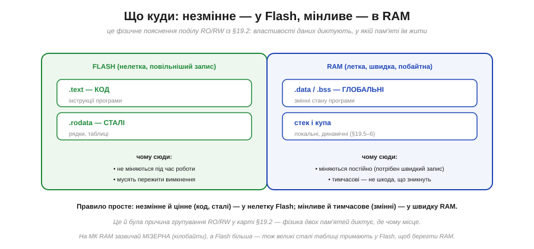
*Рис. 3.6.3.2. **Flash** (нелетка) тримає **код** (.text) і **сталі** (.rodata) — бо вони не міняються під час роботи й мусять пережити вимкнення. **RAM** (летка, швидка) тримає **змінні** (.data, .bss), **стек** і **купу** — бо вони міняються постійно (потрібен швидкий запис) і тимчасові (не шкода, що зникнуть). Це фізичне пояснення поділу RO/RW із §3.6.2: властивості даних диктують, у якій пам'яті їм жити.*

Правило просте й варте запам'ятовування: **незмінне й цінне** (код, сталі) — у нелетку Flash; **мінливе й тимчасове** (змінні) — у швидку RAM. І тут є дуже практичний наслідок саме для мікроконтролерів: на них RAM зазвичай **мізерна** — лічені кілобайти, — тоді як Flash значно більша. Тому **великі сталі дані** (таблиці, тексти, шрифти) свідомо тримають у Flash, щоб не з'їдати дефіцитну RAM (на AVR це робиться спеціально — пам'ятаєте Гарвардську архітектуру з §3.5.7, де програмна пам'ять окрема? — а на ESP32 сталі теж лягають у Flash). Розуміння цього поділу рятує, коли ваша програма «не влазить»: код тисне на Flash, змінні — на RAM, і це **дві різні** межі.

### Примхи Flash: чому її не можна перезаписувати щосекунди

Якщо Flash така зручна (нелетка!), чому б не тримати в ній і змінні? Бо **писати** у Flash — морока.


*Рис. 3.6.3.3. **RAM** пише легко: будь-який окремий байт, одразу, швидко, скільки завгодно разів. **Flash** пише важко: лише цілими **блоками** (не байтом), причому спершу треба **стерти** весь блок (усі біти → 1), а тоді записати потрібні нулі (1 → 0); це **повільно** (мікро- й мілісекунди проти тактів) і має **знос** — кожен блок витримує лише ~10 000–100 000 циклів стирання, після чого псується.*

Ось чому Flash чудова для **коду**, але погана для мінливих **даних**. Код записують **раз** при прошивці й потім лише **читають** мільйони разів — а читання з Flash швидке (процесор часто виконує код прямо з неї). Та якби ви писали у Flash щосекунди (скажімо, лічильник чи журнал), ви б **зносили** блок за лічені дні. Тому часті зміни — це робота для RAM, а збереження рідкісних налаштувань у Flash роблять **обережно** (рідко, рівномірно розподіляючи записи). Цей самий механізм, до речі, живе у ваших **SSD** і флешках — звідси їхній знос і складні алгоритми «вирівнювання зносу», що розмазують записи по всій пам'яті, аби жоден блок не зносився передчасно.

### Тонкість запуску: звідки глобальні беруть значення

Є тут одна тонкість, що спершу спантеличує, але красиво розв'язується. Глобальна змінна з початковим значенням (скажімо, `int speed = 100;`) — це **парадокс**: початкове значення (100) мусить пережити вимкнення, отже, зберігатися у **Flash**; але сама змінна **мінлива** (її змінюють під час роботи), отже, мусить жити в **RAM**. Як же бути?

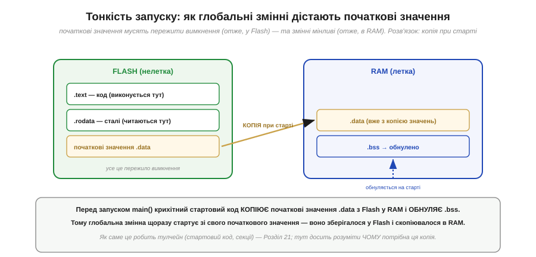
*Рис. 3.6.3.4. Розв'язок — **копія при старті**. Початкові значення .data зберігаються у **Flash** (щоб пережити вимкнення). Перед запуском `main()` крихітний стартовий код **копіює** їх із Flash у **RAM** (де змінні можуть мінятися), а заразом **обнуляє** .bss. Тому глобальна змінна щоразу стартує зі свого початкового значення — воно зберігалося у Flash і скопіювалося в RAM. (.text і .rodata лишаються у Flash і працюють звідти.)*

Це елегантне розв'язання парадоксу «мусить і пережити вимкнення, і бути мінливим»: зберігаємо **зразок** у нелеткій Flash, а **робочу копію** робимо в леткій RAM при кожному старті. Ось чому, до речі, .bss (нульові глобальні) не займають місця в прошивці — навіщо зберігати тисячу нулів, коли можна просто сказати стартовому коду «обнули цей шмат RAM»? А ось .data доводиться зберігати поіменно (бо значення ненульові) — тому багато великих ініціалізованих глобальних роздувають і Flash, і RAM. Як саме це влаштовано в тулчейні (стартовий код, секції образу) — окрема тема Розділу 4.2; тут досить розуміти **чому** ця копія потрібна.

### Родина пам'ятей

Наостанок — короткий огляд «зоопарку» пам'ятей, щоб назви не лякали.


*Рис. 3.6.3.5. **SRAM** — летка, дуже швидка (комірка ≈ тригер, §3.3); робоча RAM мікроконтролера й кеші. **DRAM** — летка, щільніша, але потребує **освіження** (заряд у конденсаторі стікає з часом); головна пам'ять ПК. **Flash** — нелетка, читання швидке, запис блоками зі зносом; програма МК, SSD, флешки. **EEPROM** — нелетка, повільна, зате побайтна; малі налаштування. **ROM** — нелетка, тільки читання, вшите назавжди. Для мікроконтролера головні дві: **Flash** (програма) і **SRAM** (змінні).*

Не лякайтеся розмаїття — для нашої роботи важать передусім **дві**: Flash тримає прошиту програму, SRAM тримає змінні під час роботи. Цікаво, що вся ця родина — варіації на дві теми з нашого курсу: летку пам'ять (тригери §3.3, що тримають біт струмом) і нелетку (фізичне «застрягання» стану, як в осердь). Навіть **DRAM** споріднена з осердями: її читання теж **руйнівне** — прочитавши біт, вона одразу записує його назад, точно як осердя. (Освіжати ж біти DRAM змушує вже інша причина: заряд у крихітному конденсаторі помалу стікає **з часом**, тож його доводиться відновлювати, поки не зник, — самі ж осердя були нелеткі й цього не потребували.) Технології змінюються, а фундаментальні ідеї — летке/нелетке, освіження — лишаються ті самі.

> 🔧 **Навіщо це.** Поділ Flash/RAM — одне з найпрактичніших знань для роботи з МК. Перше й найчастіше: **змінні обнуляються при перезапуску** (вони в леткій RAM), а програма й сталі — ні (вони в нелеткій Flash); коли ви дивуєтеся «чому моя змінна не зберегла значення після ресету», згадайте цей поділ. Друге: **RAM на МК мізерна** (кілобайти), тож великі сталі таблиці тримайте у **Flash**, щоб не вичерпати RAM (а коли «не влазить» — дивіться, котра з двох пам'ятей переповнена). Третє: **не пишіть часто у Flash** — вона зношується (~10–100 тис. циклів на блок) і пише повільно блоками; для даних, що весь час міняються, є RAM, а для рідкісних налаштувань — обережне збереження. Четверте: **глобальні з початковим значенням** дістають його через копію Flash→RAM при старті — звідси й те, що вони щоразу починають однаково. Тримайте в голові просту картину: Flash — постійна й повільна на запис «бібліотека» програми; RAM — швидкий, але тимчасовий «робочий стіл» змінних.

---

Підсумок §3.6.3: пам'ять ділиться на **летку** (RAM — забуває дані без живлення, як тригер §3.3) і **нелетку** (Flash — пам'ятає й знеструмлена, як осердя з історії розділу). На МК **код і сталі** живуть у нелеткій **Flash** (не міняються, мусять пережити вимкнення), а **змінні, стек і купа** — у леткій **RAM** (міняються постійно, тимчасові); це фізичне пояснення поділу RO/RW із §3.6.2. Flash чудова для коду (записав раз, читай мільйони разів), але **погана для частих змін**: пише лише **блоками** (стерти→записати), повільно й зі **зносом** (~10–100 тис. циклів) — тож часті зміни робить RAM. Глобальні з початковим значенням розв'язують парадокс «пережити вимкнення + бути мінливим» через **копію .data з Flash у RAM при старті** (а .bss обнуляється). Родина пам'ятей: **SRAM** (швидка робоча, ≈тригери) і **DRAM** (щільна, з освіженням — нащадок руйнівного читання осердь) — леткі; **Flash, EEPROM, ROM** — нелеткі; для МК головні Flash і SRAM. Ми навчилися адресувати пам'ять і знаємо, де що лежить. Тепер — потужне поняття, що дозволяє програмі **оперувати самими адресами** як даними: **покажчик**. Це і дар, і джерело найгрізніших багів.

---

## 3.6.4 Адреси й покажчики (поняття «адреса чогось»)

У §3.6.1 ми твердо засвоїли різницю між **адресою** (де комірка) і **даними** (що в ній). А тепер зробімо хід, що лякає новачків, але є однією з найпотужніших ідей у програмуванні: а що, як саму **адресу** взяти за дані — зберегти її в змінній, передати, скопіювати? Змінну, що тримає **адресу** іншої змінної, називають **покажчиком** (*pointer*). Він не містить самих даних — він «вказує» на них, тримаючи їхню адресу. Це поняття — **непрямість** (*indirection*) — відмикає купу можливостей: дешево ділитися великими даними, дозволяти функції змінити вашу змінну, обходити масиви, будувати гнучкі структури. І воно ж — джерело найгрізніших, найкаверзніших багів у всьому програмуванні. Покажчик — гострий інструмент: величезна сила в обмін на дисципліну. Розберімо і його красу, і його небезпеку.

### Покажчик: змінна, що тримає адресу

Почнімо з найпростішого образу.


*Рис. 3.6.4.1. Дві комірки. У змінній **x** (за адресою 0x20) лежать **дані** — число 42. У **покажчику p** (за адресою 0x10) лежить **адреса** — 0x20, тобто «де живе x». Тож p «знає, де» x, не тримаючи його значення; кажуть, що **p вказує на x**. Це пряме продовження §3.6.1: покажчик робить саму адресу повноцінними даними, які можна зберігати, копіювати, передавати.*

Уловіть суть **непрямості**: замість тримати саме значення, ми тримаємо **вказівку, де його знайти**. Здавалося б, зайвий крок — навіщо адреса, коли можна саме число? Та цей зайвий крок дає неймовірну гнучкість, яку ми зараз побачимо. А поки закарбуймо: у комірці-покажчику лежить **адреса**, і за цією адресою лежать справжні **дані**. Дві комірки, два числа, але одне — «де», інше — «що». Щоб працювати з покажчиком, потрібні **дві** операції: взяти адресу й піти за нею.

### Дві операції: взяти адресу й піти за нею


*Рис. 3.6.4.2. **«Адреса від»** (позначають `&x`): дай мені, **де** лежить x — повертає його адресу (0x20). Так покажчик і дістає адресу: `p = &x`. **«Розіменування»** (позначають `*p`): піди за адресою в p і візьми (чи зміни) **значення** там — `*p` дає 42, а `*p = 99` записує нове значення в x **через** p. Операції зворотні: `&` веде від значення до адреси, `*` — від адреси назад до значення.*

Ці дві операції — серце роботи з покажчиками. **«Адреса від»** (`&`) перетворює змінну на її адресу — так ви «націлюєте» покажчик. **«Розіменування»** (`*`) робить навпаки — іде за адресою до самих даних, щоб їх прочитати **або записати**. Останнє — критично важливе: через `*p` можна не лише дізнатися чуже значення, а й **змінити** його. Ось чому функція, отримавши адресу вашої змінної, здатна її змінити — вона розіменовує покажчик і пише за ним. (Значки `&` і `*` — із мови C, якою ви програмуватимете МК; та запам'ятайте передусім **ідеї** — «взяти адресу» й «піти за адресою», — а не самі символи.)

### Покажчик — це просто число

Попри всю містику навколо покажчиків, варто заземлитися: покажчик — це **просто число**.

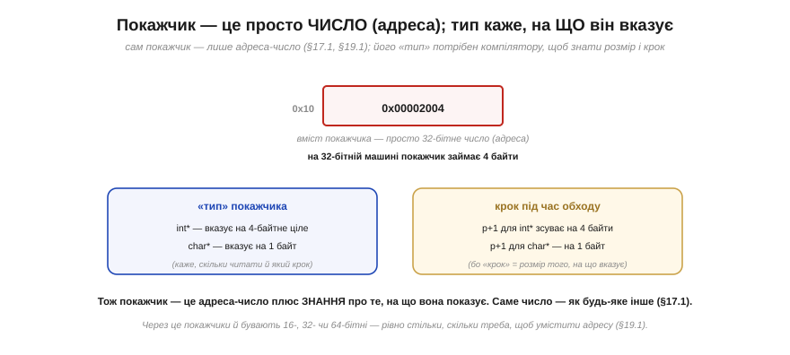
*Рис. 3.6.4.3. Вміст покажчика — лише адреса-число (на 32-бітній машині — 4 байти). Його «**тип**» (`int*` — вказує на 4-байтне ціле; `char*` — на 1 байт) потрібен не самому числу, а **компілятору**: щоб знати, скільки байтів читати за цією адресою і який «крок» робити при обході (`p+1` для `int*` зсуває на 4 байти, для `char*` — на 1). Саме число — як будь-яке інше (§3.4.1, §3.6.1).*

Це заземлення знімає половину страху. Покажчик не магічний — це адреса, тобто число (згадайте §3.4.1: усе є числами, §3.6.1: адреса — це число). Тому покажчики й бувають 16-, 32- чи 64-бітні — рівно стільки, скільки треба, щоб умістити адресу даної машини. А «тип» покажчика (`int*`, `char*`, …) — це не про саме число, а про **домовленість**, на що воно вказує: скільки байтів там читати й яким кроком крокувати. Тобто покажчик — це **адреса плюс знання про те, що за нею лежить**. Просто, коли бачиш наскрізну ідею Розділу 3.4: байти не мають вродженого сенсу, його надає вживання — і тут адреса-число набуває сенсу «покажчик на ціле» лише через тип.

### Точна аналогія: адреса на папірці

Повернімося до «вулиці будинків» із §3.6.1 — вона дає бездоганну аналогію покажчика.

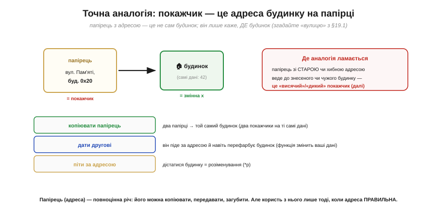
*Рис. 3.6.4.4. Покажчик — це **адреса будинку, записана на папірці**. Папірець — не сам будинок; він лише каже, **де** будинок (а в будинку — дані, число 42). З папірцем можна: **копіювати** його (два папірці → той самий будинок = два покажчики на ті самі дані); **дати другові** (він піде за адресою й навіть «перефарбує» будинок — функція змінить ваші дані); **піти за ним** (дістатися будинку = розіменування). Ламається аналогія там, де папірець містить **стару чи хибну** адресу — веде до знесеного чи чужого будинку (висячий/дикий покажчик).*

Ця аналогія варта золота, бо точно передає і силу, і небезпеку. **Сила**: папірець (адреса) — легка, повноцінна річ; його можна копіювати (дешево «передати» цілий будинок, не перевозячи його!), роздати багатьом, тримати в кишені. Кілька папірців з тією самою адресою ведуть до **того самого** будинку — тому кілька покажчиків можуть указувати на одні дані, і зміна через один «видно» через інші. **Небезпека**: користь із папірця лише тоді, коли адреса **правильна**. Папірець зі старою адресою пошле вас до знесеного будинку; з випадковою — до чужого. Саме звідси й ростуть страшні баги покажчиків.

### Навіщо покажчики

Перш ніж про небезпеки — заради чого вся ця морока? Заради чотирьох речей, без яких системне програмування неможливе.

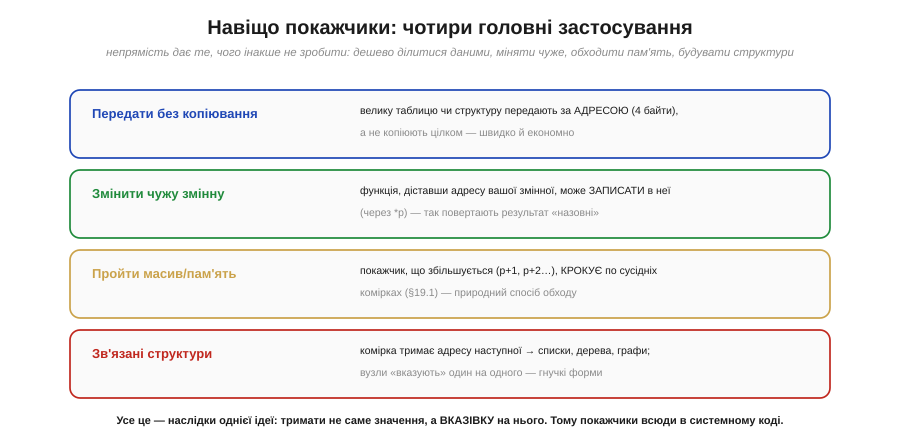
*Рис. 3.6.4.5. **Передати без копіювання**: велику таблицю чи структуру передають за адресою (кілька байтів), а не копіюють цілком — швидко й економно. **Змінити чужу змінну**: функція, діставши адресу вашої змінної, пише в неї через `*p` — так результат «повертають назовні». **Пройти масив/пам'ять**: покажчик, що збільшується (`p+1`, `p+2`…), крокує по сусідніх комірках (§3.6.1) — природний спосіб обходу. **Зв'язані структури**: комірка тримає адресу наступної → списки, дерева, графи; вузли «вказують» один на одного, даючи гнучкі форми.*

Усе це — наслідки **однієї** ідеї: тримати не саме значення, а **вказівку** на нього. Передати мільйонну таблицю в функцію, скопіювавши лише її 4-байтну адресу замість мільйона байтів, — величезна економія. Дозволити функції повернути результат, записавши його у вашу змінну за адресою, — основа багатьох інтерфейсів. Пройти масив, крокуючи покажчиком по сусідніх комірках, — природний спосіб обходу пам'яті (прямо спирається на побайтову адресацію §3.6.1). А зв'язані структури (де кожен елемент тримає адресу наступного) дозволяють будувати гнучкі форми, що ростуть і міняються на льоту. Покажчики — усюди в системному коді саме тому, що непрямість надзвичайно корисна.

### Інший бік: небезпеки

А тепер — ціна цієї сили. Покажчики — джерело **найгрізніших** багів у програмуванні, і кожен інженер мусить їх боятися з повагою.

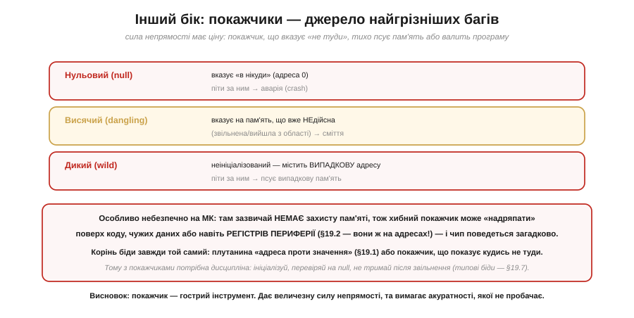
*Рис. 3.6.4.6. **Нульовий** (null) покажчик указує «в нікуди» (адреса 0) — піти за ним означає аварію. **Висячий** (dangling) вказує на пам'ять, що вже недійсна (звільнена чи вийшла з області видимості) — читаєш сміття. **Дикий** (wild) неініціалізований — містить випадкову адресу, і розіменування псує випадкову пам'ять. Особливо небезпечно на МК, де зазвичай **немає захисту пам'яті**: хибний покажчик може «надряпати» поверх коду, чужих даних чи навіть **регістрів периферії** (§3.6.2 — вони ж на адресах!), і чип поведеться загадково.*

Осягніть, чому це так підступно. Корінь усіх цих бід — той самий: або плутанина «адреса проти значення» (§3.6.1), або покажчик, що **показує кудись не туди**. І на мікроконтролері це особливо болить, бо там зазвичай **немає захисту пам'яті** (на відміну від ПК, де ОС спіймає звернення «не туди»): дикий покажчик на МК тихо перепише щось важливе — інструкцію, чужу змінну, а то й регістр периферії (а він, пам'ятаймо з §3.6.2, теж на адресі — тож запис за хибною адресою може випадково ввімкнути чи зламати залізо). Наслідок — «загадкові» збої, які годинами шукають. Тому з покажчиками потрібна **дисципліна**: завжди ініціалізуй, перевіряй на null перед розіменуванням, не тримай покажчик на звільнену пам'ять. Типові біди пам'яті, що з цього ростуть, ми зберемо окремо в §3.6.7.

> 🔧 **Навіщо це.** Покажчики — те, з чим ви зіткнетеся в реальному коді для МК буквально щодня, тож ставлення до них визначить, чи писатимете ви надійні програми. Перше: **покажчик тримає адресу, а не значення** — це та сама різниця «де/що» з §3.6.1, і плутати їх не можна (`p` — це адреса, `*p` — значення за нею). Друге: через покажчики **передають великі дані дешево** (за адресою, не копіюючи) і **дозволяють функції змінити вашу змінну** — ви постійно бачитимете це в бібліотеках (функція бере адресу буфера, давача, структури). Третє, найважливіше для безпеки: **хибний покажчик — катастрофа на МК**, бо немає захисту пам'яті; він може надряпати поверх коду чи периферії (§3.6.2), даючи «неможливі» збої — тому ініціалізуйте покажчики, перевіряйте на null, не використовуйте після звільнення. Четверте: **покажчик — це просто число-адреса**, тож не бійтеся його; розуміння, що то лише адреса з типом, знімає містику. Опанувавши покажчики з повагою до їхньої гостроти, ви відкриєте і їхню силу, і захиститеся від їхніх пасток.

---

Підсумок §3.6.4: **покажчик** — це змінна, значення якої є **адресою** іншої змінної; він «вказує» на дані, тримаючи їхню адресу (пряме продовження §3.6.1: адреса стає даними). Дві операції: **«адреса від»** (`&x` → адреса x; так націлюють покажчик) і **«розіменування»** (`*p` → значення за адресою; через нього й **читають**, і **пишуть** чужу змінну). Покажчик — це **просто число** (адреса, §3.4.1), а його **тип** каже компілятору, на що він вказує (скільки байтів, який крок). Аналогія — **адреса будинку на папірці**: можна копіювати, передавати, іти за нею (але користь лише з правильної адреси). Покажчики дають: передачу великих даних **без копіювання**, зміну **чужих** змінних, **обхід** масивів, **зв'язані** структури — усе через непрямість. Ціна — **найгрізніші баги**: нульовий (→ нікуди, аварія), висячий (→ недійсна пам'ять), дикий (→ випадкова адреса); на МК без захисту пам'яті хибний покажчик дряпає код чи периферію (§3.6.2). Дисципліна обов'язкова. Тепер — конкретне й щоденне застосування адрес: як працює **виклик функції**. Коли функція викликає іншу, де зберігаються її локальні змінні й куди повертатися? Це робить **стек** — наступний підрозділ.

---

## 3.6.5 Стек: як працює виклик функції (LIFO)

Кожна програма постійно **викликає функції** — а ми досі не питали, як це насправді працює в пам'яті. Коли функція `main` викликає `f`, а та — `g`, процесор мусить розв'язати дві задачі: запам'ятати, **куди повертатися** (бо після `g` треба продовжити `f`, а після `f` — `main`), і дати кожній функції **місце** під її параметри й локальні змінні — причому на будь-яку глибину вкладеності. Розв'язує це **стек** — одна з найелегантніших і найважливіших структур у всій інженерії. Зрозумівши стек, ви зрозумієте, як працюють виклики функцій, рекурсія, локальні змінні, і — що особливо цінно — звідки беруться цілі класи багів (переповнення стека, висячі покажчики на локальні). Розберімо механізм від проблеми до тонкощів.

### Проблема: виклики вкладаються


*Рис. 3.6.5.1. Функція викликає функцію, та — ще одну, і так у глибину. Кожна мусить: 1) запам'ятати **адресу повернення** — куди продовжити того, хто її викликав; 2) мати власне місце під параметри й **локальні** змінні. Ключове спостереження: хто викликаний **останнім** — повертається **першим** (`g` завершиться раніше за `f`, `f` — раніше за `main`). Ця поведінка «останній прийшов — перший пішов» має ідеальну структуру даних — стек.*

Зверніть увагу на те **спостереження** — воно і є ключ. Вкладені виклики розкручуються в **строго зворотному** порядку: остання викликана функція завершується перша. Це не випадковість, а сама природа вкладеності (як дужки в математиці: остання відкрита закривається першою). І така впорядкованість «останній увійшов — перший вийшов» точно відповідає одній простій структурі даних, яку ми зараз і розглянемо.

### Стек — це LIFO


*Рис. 3.6.5.2. **Стек** (*stack*) — структура «останній прийшов, перший пішов» (*LIFO, Last In First Out*), як **стос тарілок**: кладеш зверху (**push**) і береш зверху (**pop**); останнє покладене знімається першим. Це ідеально лягає на виклики: останній викликаний (`g`) повертається перший — знімаємо його кадр, тоді `f`, тоді `main`. Дві дії, і все: PUSH (увійшли у функцію — додали кадр) і POP (вийшли — зняли кадр).*

Стек — навмисно **проста** структура: лише дві операції, обидві працюють із **вершиною**. **Push** кладе щось наверх; **pop** знімає з верху. Жодного доступу до середини, жодного пошуку — тільки вершина. Саме ця простота робить стек блискавично швидким (про це далі) і саме вона ідеально відповідає вкладеним викликам: щойно функція починається — push її «кадру»; щойно завершується — pop. Порядок виходить сам собою правильний, бо LIFO стека збігається з порядком розкручування викликів. Лишилося з'ясувати, **що** саме кладеться на стек при виклику.

### Стековий кадр

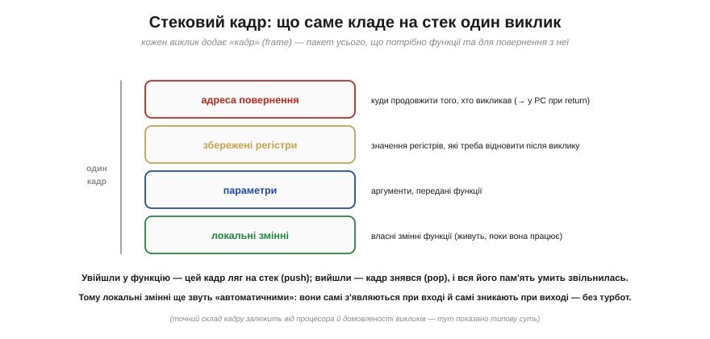
*Рис. 3.6.5.3. Кожен виклик додає на стек **кадр** (*stack frame*) — пакет усього потрібного: **адресу повернення** (куди продовжити того, хто викликав — піде в PC при `return`); **збережені регістри** (значення, які треба відновити після виклику); **параметри** (аргументи функції); **локальні змінні** (власні змінні функції). Увійшли у функцію — кадр ляг на стек (push); вийшли — кадр знявся (pop), і вся його пам'ять умить звільнилась.*

Ось чому локальні змінні ще звуть **«автоматичними»** (*automatic storage*): вони з'являються самі при вході у функцію (як частина її кадру) і зникають самі при виході (коли кадр знімається) — без жодного ручного керування з вашого боку. Це величезна зручність: ви оголошуєте локальну змінну, користуєтеся нею, а коли функція завершується, її пам'ять автоматично повертається в загальний запас. Кадр — це немов **робочий стіл**, який функції видають на час роботи й забирають, щойно вона закінчила. (Точний склад кадру залежить від процесора й «домовленості викликів» — calling convention, — але суть усюди та сама.) А найважливіша частина кадру — адреса повернення, бо саме вона відповідає на питання «як процесор знає, куди вертатися».

### Серце механізму: адреса повернення

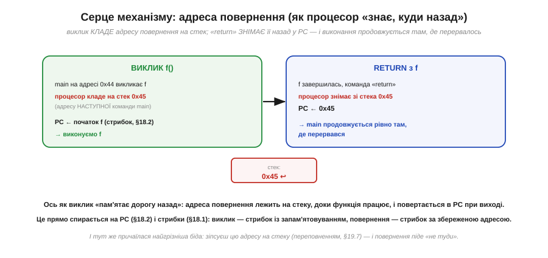
*Рис. 3.6.5.4. Коли `main` (на адресі 0x44) **викликає** `f`, процесор **кладе на стек** адресу наступної команди main (0x45) і стрибає в `f` (PC ← початок f, §3.5.2). Коли `f` робить **`return`**, процесор **знімає** 0x45 зі стека назад у **PC** — і `main` продовжується рівно там, де перервався. Це прямо спирається на PC (§3.5.2) і стрибки (§3.5.1): виклик — це стрибок із запам'ятовуванням, повернення — стрибок за збереженою адресою.*

Ось вона, серцевина всього. Пам'ятаєте лічильник команд **PC** і **стрибки** з §3.5.1–3.5.2? Виклик функції — це **стрибок із запам'ятовуванням**: перш ніж стрибнути в `f`, процесор зберігає на стеку адресу, куди потім повернутися. А `return` — це стрибок **за збереженою адресою**: дістати її зі стека в PC. Тому процесор завжди «знає дорогу назад» — вона лежить на стеку, доки функція працює. І завдяки LIFO-природі стека адреси повернення вкладених викликів складаються в ідеальному порядку: остання покладена знімається першою. (Тут же, до речі, причаїлася найгрізніша біда мікроконтролерів: якщо зіпсувати цю адресу на стеку — наприклад, переповнивши локальний масив, §3.6.7, — повернення піде «не туди», і програма стрибне в безодню. Але про це згодом.)

### Наскрізний прохід

Простежмо все разом на конкретному прикладі.

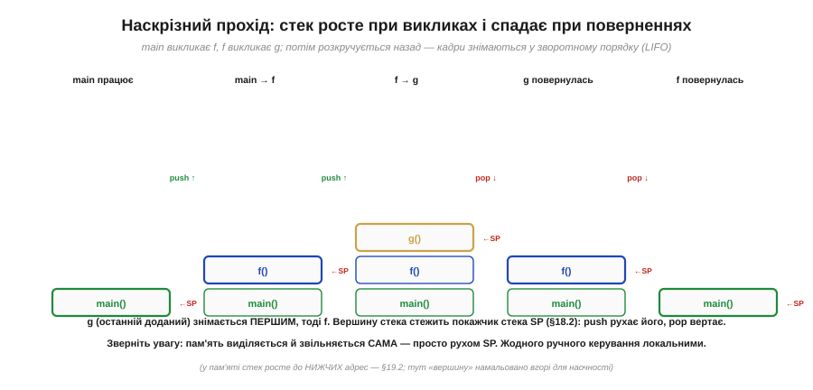
*Рис. 3.6.5.5. `main` викликає `f`, `f` викликає `g`, потім усе розкручується назад. Стек **росте** при викликах (push кадрів `f`, тоді `g`) і **спадає** при поверненнях — кадри знімаються у зворотному порядку (LIFO): `g` (доданий останнім) знімається першим, тоді `f`. Вершину стека стежить **покажчик стека SP** (*stack pointer*, §3.5.2): push рухає його, pop вертає. Пам'ять виділяється й звільняється **сама** — просто рухом SP.*

**Приклад (як росте й спадає стек).** Простежмо виклики покроково.

```
main працює        стек: [main]
main викликає f    push f       → [main][f]      (SP опустився)
f викликає g       push g       → [main][f][g]   (SP ще нижче)
g робить return    pop g        → [main][f]       (адреса повернення → PC)
f робить return    pop f        → [main]          (адреса повернення → PC)
main продовжується
```

Зверніть увагу на дві речі. По-перше, **SP** — спеціальний регістр (один із тих, що ми згадували в §3.5.2) — увесь час показує на вершину стека; push його зсуває, pop вертає. По-друге — і це чудово — пам'ять під кадри виділяється й звільняється **сама собою**, лише рухом SP: жодного ручного «виділи/звільни». Тому локальні змінні такі дешеві й безтурботні. (У пам'яті стек, як ми бачили в §3.6.2, росте до **нижчих** адрес; тут «вершину» намальовано вгорі для наочності, але SP насправді опускається при push.)

### Властивості стека

Зведімо баланс — переваги й важливі межі.


*Рис. 3.6.5.6. **Переваги**: **швидко** (виділення — це рух SP на крок), **само** (вхід у функцію виділяє, вихід звільняє — нічого не питають), локальні «автоматичні», ідеально лягає на вкладені виклики. **Межі**: стек **обмежений** за розміром (регіон §3.6.2) — надто глибоко (зокрема **рекурсія** без кінця) переповнить його (§3.6.7); і локальні **зникають при поверненні** — тому **не можна повертати покажчик на локальну змінну** (це створює висячий покажчик, §3.6.4).*

Стек — інструмент для **тимчасового**: для того, що живе рівно стільки, скільки триває виклик. У цьому його сила (швидко, безтурботно) і його межа. Дві застороги варто закарбувати. Перша: стек **скінченний** (це лише один регіон пам'яті, §3.6.2), тож надто глибока вкладеність — а надто **нескінченна рекурсія** — швидко його переповнює (це окрема велика тема §3.6.7). Друга, дуже підступна: локальна змінна живе **тільки** поки функція працює; повернути покажчик на неї — означає дати папірець з адресою **знесеного будинку** (§3.6.4: висячий покажчик), бо кадр уже знято. Для даних, що мусять **пережити** функцію (чи розмір яких заздалегідь невідомий), стек не годиться — для них є **купа**, наш наступний сюжет. (А ще стек рятує **переривання**, Розділ 4.5: на час обробника контекст теж кладуть на стек — той самий механізм.)

> 🔧 **Навіщо це.** Стек — те, що працює «за лаштунками» кожного вашого виклику функції, тож розуміння його рятує від цілого класу багів. Перше: **локальні змінні живуть на стеку** й зникають при виході з функції — тому ніколи не повертайте адресу (покажчик) на локальну змінну; коли «дані псуються після повернення з функції», підозрюйте саме це. Друге: **стек обмежений** (на МК — лічені кілобайти), тож стережіться глибокої рекурсії й великих локальних масивів — вони можуть переповнити стек (§3.6.7), а на МК це тихий і руйнівний збій. Третє: **виклик зберігає адресу повернення на стеку** — це пояснює і як працює `return`, і чому зіпсований стек веде до «стрибків у нікуди». Четверте: локальні — «автоматичні» й **дешеві** (виділення — рух SP), тож для тимчасових даних вони ідеальні; бережіть купу (§3.6.6) для того, що мусить жити довше. Тримайте картину стосу кадрів у голові — і поведінка викликів, рекурсії й локальних стане прозорою.

---

Підсумок §3.6.5: виклик функції потребує запам'ятати **адресу повернення** й дати функції місце під параметри й **локальні** змінні — на будь-яку глибину. Оскільки вкладені виклики розкручуються в зворотному порядку (останній викликаний — перший повертається), їх ідеально обслуговує **стек** — структура **LIFO** (останній прийшов, перший пішов) з двома діями: **push** (додати на вершину) і **pop** (зняти з вершини). Кожен виклик кладе на стек **кадр**: адресу повернення, збережені регістри, параметри, локальні. Вхід у функцію — push кадру, вихід — pop (тому локальні «**автоматичні**» — самі з'являються й зникають). Серце механізму — **адреса повернення**: виклик кладе її на стек і стрибає у функцію (PC, §3.5.2), `return` знімає її назад у PC — так процесор «знає дорогу назад». Вершину стежить **покажчик стека SP**; пам'ять виділяється й звільняється самим його рухом. Переваги: швидко й автоматично. Межі: стек **обмежений** (глибока рекурсія → переповнення, §3.6.7), а локальні **зникають** при поверненні (не повертай покажчик на локальну — висячий покажчик, §3.6.4). Стек чудовий для тимчасового, що живе рівно стільки, скільки виклик. Та як бути з даними, що мусять **пережити** функцію або чий розмір невідомий наперед? Для них є інша область — **купа**, наш наступний підрозділ.

---

## 3.6.6 Купа й динамічна пам'ять (фрагментація)

Стек (§3.6.5) — чудовий, але **жорсткий**: дані на ньому живуть рівно стільки, скільки триває виклик, а їхній розмір мусить бути відомий наперед. Та програмування раз у раз вимагає **іншого**: даних, що переживуть функцію, яка їх створила, і даних, чий розмір з'ясується лише під час роботи. Для цього існує **купа** (*heap*) — велика область пам'яті, з якої програма може **взяти** блок будь-якого розміру коли завгодно, тримати його скільки треба й **повернути**, коли більше не потрібен. Це **динамічна пам'ять** — гнучка й могутня, але за гнучкість доводиться платити: ручним керуванням, новою бідою на ім'я **фрагментація** й цілим виводком підступних багів. А на мікроконтролері купа взагалі вимагає особливої обачності. Розберімо і силу динамічної пам'яті, і чому до неї треба підходити з повагою.

### Навіщо купа: чого не може стек

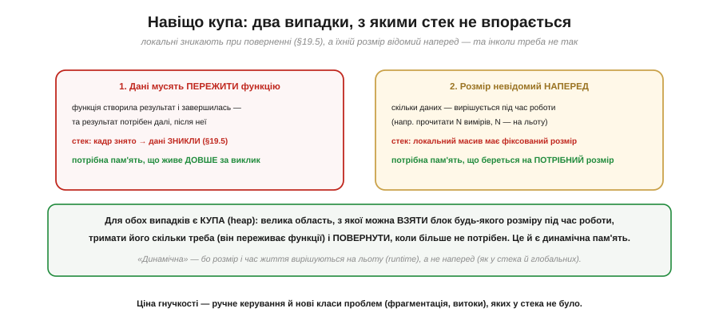
*Рис. 3.6.6.1. Два випадки, з якими стек не впорається. **Перший**: дані мусять **пережити** функцію — вона створила результат і завершилась, а він потрібен далі; та стек уже зняв її кадр, і дані зникли (§3.6.5). **Другий**: розмір невідомий **наперед** — скільки даних, вирішується під час роботи (наприклад, прочитати N вимірів, де N визначається на льоту); а локальний масив на стеку має фіксований розмір. Для обох потрібна пам'ять, яку беруть на льоту й тримають, скільки треба, — це й є купа.*

Слово «**динамічна**» тут ключове: і розмір, і час життя вирішуються **під час роботи** (*runtime*), а не наперед (як у стека чи глобальних змінних, де все зафіксовано при компіляції). Це величезна свобода — брати рівно стільки пам'яті, скільки треба, рівно тоді, коли треба, і тримати її рівно стільки, скільки потрібно. Та свобода, як завжди, має ціну: купою треба **керувати вручну**, і вона породжує проблеми, яких у дисциплінованого стека просто не було.

### Дві дії: взяти й повернути


*Рис. 3.6.6.2. **Взяти** (allocate): просиш блок потрібного розміру — купа знаходить вільне місце й повертає **покажчик** на нього (§3.6.4): `p = allocate(100)`. **Повернути** (free): `free(p)` віддає блок назад у спільний запас, звідки його можуть видати комусь іншому. На відміну від стека, купа **ручна**: ти сам береш і сам мусиш повернути, причому в **будь-якому** порядку (не LIFO). Покажчик — твоя **єдина** ниточка до блоку: у купи дані не мають імені, лише адресу.*

Ось де знову оживає §3.6.4: блок на купі **не має імені** — лише адресу, тож **покажчик** на нього — ваша єдина ниточка. Загубили покажчик (перезаписали, втратили з області видимості) — і блок лишився зайнятим, але **недосяжним**: це **витік** (про нього далі). Дві операції — «взяти» (`malloc` у C, `new` у C++) і «повернути» (`free`, `delete`) — здаються простими, але саме на них тримається вся відповідальність: ви, програміст, мусите **парувати** кожне «взяти» з рівно одним «повернути». За тим, які блоки вільні, а які зайняті, стежить **розпорядник купи** (*allocator*) — службова «бухгалтерія» над областю купи, що при allocate шукає вільний блок потрібного розміру, а при free повертає його в запас. Саме ця свобода брати будь-що будь-коли й породжує головну біду — фрагментацію.

### Стек проти купи

Зведімо два світи разом.

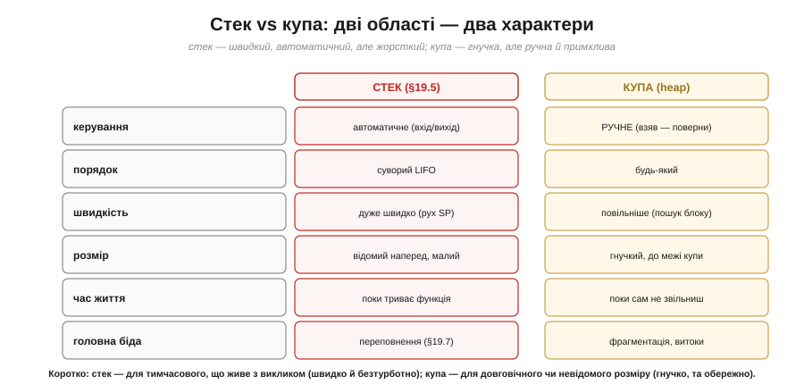
*Рис. 3.6.6.3. **Стек**: керування **автоматичне** (вхід/вихід функції), порядок суворий LIFO, дуже швидко (рух SP), розмір малий і відомий наперед, час життя — поки триває функція, головна біда — переповнення (§3.6.7). **Купа**: керування **ручне** (взяв — поверни), порядок будь-який, повільніше (пошук блоку), розмір гнучкий до межі купи, час життя — поки сам не звільниш, головні біди — фрагментація й витоки.*

Це порівняння — практична шпаргалка для вибору. **Стек** — для тимчасового, що живе з викликом: швидко, автоматично, безтурботно, але жорстко. **Купа** — для довговічного чи невідомого наперед розміру: гнучко й могутньо, але повільніше, вручну й примхливо. Більшість даних чудово живе на стеку (локальні змінні) чи в глобальних; купу беруть саме тоді, коли потрібна її гнучкість — і свідомо приймають її ціну.

### Головна біда: фрагментація

А тепер про найхитрішу проблему купи, винесену в назву теми.


*Рис. 3.6.6.4. Спочатку купа — суцільний вільний простір. Та після багатьох «взяти-повернути» блоків різного розміру в різному порядку вільне місце **дробиться** на дрібні розкидані шматки між зайнятими блоками. І ось біда: запит на великий блок (скажімо, 200 байтів) **не влазить**, хоча вільного загалом **вистачає** (70+60+80+90 = 300) — бо немає **суцільного** шматка на 200 поспіль. Це **зовнішня фрагментація**: пам'ять є, але роздроблена.*

Аналогія точна: це як **паркінг із проміжками**, у який не влазить автобус, хоч вільних місць сумарно й багато — вони просто розкидані. Фрагментація підступна, бо наростає **поступово й непомітно**: програма працює собі, бере й повертає блоки, а вільна пам'ять тихо кришиться на все дрібніші уламки, аж поки одного дня велике виділення раптом не зазнає невдачі — попри «достатню» вільну пам'ять. На великих системах із цим борються (ущільнення, пули блоків однакового розміру), та на крихітному мікроконтролері фрагментація особливо небезпечна (про що за мить). Це фундаментальна ціна свободи брати блоки будь-якого розміру в будь-якому порядку.

### Біди купи

Фрагментація — не єдина небезпека. Ручне керування означає **ручні помилки**, і всі вони підступні.


*Рис. 3.6.6.5. **Витік пам'яті** (leak): узяв блок і не повернув (чи загубив покажчик) — пам'ять помалу заповнюється, аж поки не вичерпається. **Використання після звільнення**: звільнив блок, та далі ним користуєшся через покажчик — це висячий покажчик (§3.6.4), що дає сміття або аварію. **Подвійне звільнення** (double free): звільнив той самий блок двічі — псує бухгалтерію розпорядника купи. Усі три ростуть із того самого кореня, що й біди покажчиків: пам'яттю керуєш ти, і ти ж за неї відповідаєш.*

Найпідступніший — **витік**: програма працює нібито нормально, але помалу «з'їдає» пам'ять; на сервері це можуть бути тижні до краху, на мікроконтролері — інколи години. А **використання після звільнення** — це прямий нащадок висячого покажчика з §3.6.4: ви тримаєте папірець з адресою будинку, який уже знесли. Усі ці біди мають спільний корінь: на відміну від автоматичного стека, купою керуєте **ви**, і кожна неуважність обертається багом, що проявляється не одразу, а згодом і не там. Звідси й **золоте правило**: кожному «взяти» — рівно одне «повернути», не раніше й не пізніше; і ніколи не чіпай блок після звільнення. (Повний звід типових бід пам'яті — і стека, і купи — зберемо в §3.6.7.)

### Купа на мікроконтролері: обережно

І нарешті — найважливіше практичне застереження саме для нашого курсу.


*Рис. 3.6.6.6. На крихітному МК динамічна пам'ять особливо ризикована. **Мізерна RAM** (кілобайти) — фрагментація вичерпує її швидко й фатально. **Витоки = крах** — пристрій працює тижнями без перезапуску, тож навіть крихітний витік зрештою його вб'є. **Недетермінований час** — allocate триває то довше, то коротше (пошук блоку), а це погано для керування в реальному часі. Тому вбудована практика часто **уникає** динамічної пам'яті, або виділяє один раз на старті, або бере фіксовані «пули» блоків.*

Це не означає, що «купа погана» — на великих системах (ПК, сервери) вона незамінна. Та на **крихітному залізі реального часу** до неї підходять сторожко. Типові підходи у вбудованих системах: **уникати** динамічної пам'яті зовсім; або виділити все потрібне **один раз на старті** (і більше не звільняти); або користуватися **пулами** блоків однакового розміру (де фрагментації не буває за визначенням); або взагалі обходитися **стеком і глобальними** (статичною пам'яттю). Правило просте: для постійних чи критичних до часу даних на МК — статика й стек; динамічна пам'ять — лише за справжньої потреби й обережно. Коли в Модулях 4–5 ви писатимете прошивки, віддавайте перевагу **передбачуваній** статичній пам'яті там, де можна, — і ваші системи будуть надійнішими.

> 🔧 **Навіщо це.** Динамічна пам'ять — потужний інструмент, що вимагає відповідальності, особливо на МК. Перше: **купа — для даних, що переживають функцію або чий розмір невідомий наперед**; для всього іншого є дешевший і безпечніший стек (§3.6.5) та глобальні. Друге: **кожному allocate — рівно один free**; забув повернути — витік (пам'ять тихо закінчиться), повернув і користуєшся далі — висяча біда (§3.6.4); це найчастіші й найпідступніші помилки. Третє: **покажчик — ваша єдина ниточка** до блоку на купі; загубили його — загубили пам'ять. Четверте, найважливіше для нас: **на мікроконтролері купу беруть обережно** — мізерна RAM, фатальна фрагментація, витоки, що валять довгопрацюючий пристрій, і недетермінований час; тому в прошивках часто уникають динамічної пам'яті або суворо її обмежують. Засвойте різницю стек/купа й дисципліну «взяв — поверни» — і ви оминете найгрізніші біди пам'яті, до повного зводу яких переходимо далі.

---

Підсумок §3.6.6: **купа** (heap) — велика область пам'яті для **динамічних** даних: тих, що мусять пережити функцію, або чий розмір відомий лише під час роботи (чого стек не може). Дві дії: **взяти** блок (allocate → повертає **покажчик**, §3.6.4) і **повернути** (free → у спільний запас); на відміну від стека, це **ручне** керування в **будь-якому** порядку, а покажчик — єдина ниточка до безіменного блоку. Стек vs купа: автоматичний/швидкий/LIFO/тимчасовий проти ручної/гнучкої/довговічної. Головна біда — **фрагментація**: після багатьох alloc/free вільне місце дробиться на розкидані шматки, і великий блок не влазить, **хоч сумарно пам'яті вистачає** (зовнішня фрагментація, «паркінг із проміжками»). Інші біди (з кореня §3.6.4): **витік** (не повернув → пам'ять вичерпується), **використання після звільнення** (висячий покажчик), **подвійне звільнення**. Правило: кожному allocate — рівно один free, і не чіпай блок після звільнення. На **МК купа особливо ризикована** (мізерна RAM, фатальна фрагментація, витоки, недетермінований час), тож вбудована практика її уникає чи суворо обмежує (статика, пули, стек). Ми вже згадали чимало бід пам'яті — переповнення стека, витоки, висячі покажчики. Зберімо їх докупи в останньому підрозділі розділу: **типові біди пам'яті** й чому вони такі небезпечні.

---

## 3.6.7 Переповнення стека й типові біди пам'яті

Ми пройшли всю пам'ять — від комірок і адрес (§3.6.1) до стека (§3.6.5) й купи (§3.6.6), — і дорогою раз у раз натрапляли на біди: переповнення, витоки, висячі покажчики. Час зібрати їх докупи, бо це не розрізнені дрібниці, а **найгрізніший клас багів** у всьому системному програмуванні — і особливо на мікроконтролері, де ніхто не страхує. Цей завершальний підрозділ — звід типових бід пам'яті: що це таке, чому вони такі підступні, який у них спільний корінь і як від них захищатися. Він якісний (без коду), бо мета — щоб ви **розуміли природу** цих бід і впізнавали їх, а не зубрили рецепти. Почнімо з двох найзнаменитіших переповнень, а тоді зведемо все докупи.

### Переповнення стека

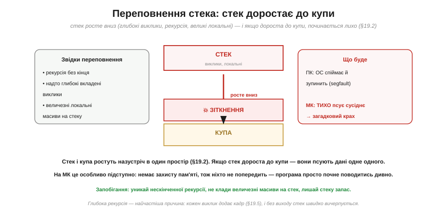
*Рис. 3.6.7.1. Стек росте вниз (глибокі виклики, рекурсія, великі локальні), а купа — вгору; між ними спільний простір (§3.6.2). Якщо стек **дороста до купи**, вони починають псувати дані одне одного — це **переповнення стека**. Причини: нескінченна рекурсія, надто глибокі вкладені виклики, величезні локальні масиви. На ПК ОС спіймає й зупинить програму; на МК **немає захисту пам'яті**, тож стек тихо псує сусіднє — і програма починає поводитись загадково.*

Найчастіша причина — **нескінченна (чи надто глибока) рекурсія**: кожен виклик додає кадр (§3.6.5), і якщо функція не доходить до виходу, стек росте, росте — і вичерпується. Або величезний локальний масив, що сам по собі не влазить у скромний стек МК. Підступність у тому, що на мікроконтролері **ніхто не попередить**: на ПК апаратний захист пам'яті (MMU) спіймає звернення «за межі» і впорядковано обірве програму, а на МК захисту зазвичай немає — стек просто залазить на купу чи глобальні, тихо їх перезаписує, і пристрій починає «дуріти» без жодного натяку на причину. Запобігання просте за ідеєю: уникати безкінечної рекурсії, не класти величезні масиви на стек, лишати стеку запас.

### Переповнення буфера

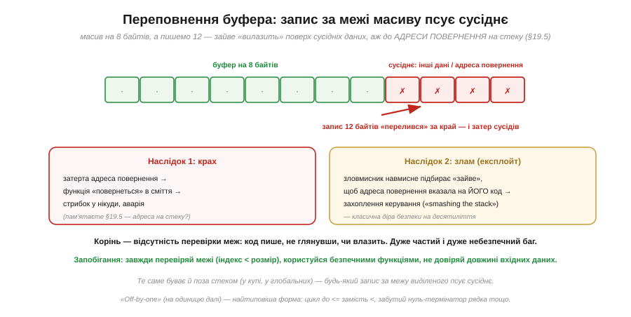
*Рис. 3.6.7.2. Маємо буфер (масив) на 8 байтів, а пишемо 12 — зайве «переливається» за край і затирає **сусідні** дані. А якщо буфер на стеку, поруч може лежати **адреса повернення** (§3.6.5) — і тоді функція «повернеться» в сміття (аварія) або, якщо «зайве» підібрав зловмисник, у **його** код (захоплення керування — класична діра безпеки «smashing the stack»). Корінь — відсутність перевірки меж: код пише, не глянувши, чи влазить.*

**Переповнення буфера** (*buffer overflow*) — мабуть, найзнаменитіший баг в історії, бо він не лише валить програми, а й десятиліттями був головною **дірою безпеки**. Механізм простий: пишеш у масив більше, ніж у нього влазить, і «зайве» псує те, що лежить поруч. На стеку поруч часто опиняється **адреса повернення** (§3.6.5) — і ось чому це так небезпечно: затерши її, ви відправляєте функцію «повертатися» казна-куди. А зловмисник може **навмисне** підібрати дані так, щоб адреса повернення вказала на його власний код, — і захопити керування машиною. Найтиповіша форма — **«off-by-one»** (на одиницю далі): цикл, що йде на крок задалеко, забутий нуль-термінатор рядка, недогляд на одиницю. Захист — **завжди перевіряти межі** (індекс менший за розмір), не довіряти довжині вхідних даних, користуватися безпечними функціями.

> 📜 **Історія.** Це не теоретична загроза: 2 листопада 1988 року рівно такий буфер на 512 байтів у сервісі `fingerd` став дверима, якими **хробак Морріса** за ніч паралізував тисячі машин тодішньої мережі — перший випадок, коли переповнення буфера стало зброєю масштабу мережі. Як саме «зайві» 24 байти підмінили адресу повернення, чому «зупинив інтернет» — гіпербола (насправді ~6 000 із ~60 000 хостів) і яку спадщину це лишило коду на МК — у вставці [📜 «Хробак Морріса (1988)»](ch19-s7-history-morris-worm.md).

### Звід типових бід

Зведімо всі біди пам'яті, що ми зустріли, в один список — це зведення всього розділу.


*Рис. 3.6.7.3. **Переповнення стека** — стек доріс до купи (§3.6.5). **Переповнення буфера** — запис за межі масиву псує сусіднє, аж до адреси повернення (§3.6.5). **Витік пам'яті** — узяв на купі й не повернув → вичерпання (§3.6.6). **Висячий покажчик** — на звільнену/зниклу пам'ять (§3.6.4–6). **Розіменування null** — піти за нульовим (§3.6.4). **Дикий покажчик** — випадкова адреса (§3.6.4). **Подвійне звільнення** (§3.6.6). **Читання неініціалізованого** — узяв змінну до присвоєння → сміття.*

Погляньте на стовпчик посилань — увесь цей розділ вів до цього зводу. Кожна біда — це зворотний бік потужного інструмента, який ми вивчали: адреси й покажчики дають непрямість (§3.6.4), але й дикі/висячі покажчики; стек дає дешеві локальні (§3.6.5), але й переповнення; купа дає гнучкість (§3.6.6), але й витоки та фрагментацію. Це не випадково: **сила й небезпека пам'яті — одне ціле**. А об'єднує всі ці біди одна риса, через яку вони й найважчі для лову.

### Чому біди пам'яті — найважчі


*Рис. 3.6.7.4. Біди пам'яті — **тихі** (не дають негайної помилки — псують пам'ять і виконуються далі, ніби все гаразд), **далекі** (симптом виринає не там, де причина: зіпсував одне — впало зовсім інше, згодом) і **несталі** (залежать від таймінгу й даних: то є, то нема — важко відтворити). На **МК** ще гірше — немає захисту пам'яті, тож ніхто не ловить хибний доступ; на **ПК** легше — апаратний захист (MMU) і ОС ловлять багато звернень «не туди» й валять програму одразу, ближче до місця помилки.*

Ось чому досвідчені інженери бояться бід пам'яті понад усе. Звичайний баг кричить про себе — неправильний результат, виняток, повідомлення. А баг пам'яті **мовчить**: він тихенько перезаписав щось не те й пішов далі, програма ще довго працює нібито нормально — аж раптом падає в геть іншому місці, через хвилину чи годину, та ще й не щоразу. Зв'язати такий симптом із причиною — справжнє детективне розслідування. І на мікроконтролері це особливо болить: там немає апаратного захисту пам'яті, що на ПК ловить багато таких звернень і обриває програму близько до помилки (segfault). На МК хибний доступ просто тихо псує сусіднє — а пристрій у полі ще й нема кому перезапустити. Тому до пам'яті на МК ставляться з особливою повагою.

### Спільний корінь — і спільний захист

Попри все розмаїття, майже всі біди пам'яті мають **спільний корінь**.


*Рис. 3.6.7.5. Дві помилки, і обидві — з понять цього розділу. **Доступ поза дійсною пам'яттю**: за межі масиву (буфер), за нульовою/випадковою адресою, стек до купи — корінь у плутанині «адреса/значення» (§3.6.1) і браку перевірки меж. **Вживання в не той час**: до ініціалізації (сміття), після звільнення (висячий), після виходу функції (локальна) — корінь у браку дисципліни покажчиків і керування часом життя (§3.6.4). Звідси й уся профілактика: не виходь за межі й не чіпай пам'ять не у свій час.*

Це чудова новина для практики: оскільки корінь спільний, то й **захист спільний**. Майже все зводиться до двох звичок — **не виходити за межі** виділеної пам'яті й **не чіпати** її не у свій час (до ініціалізації чи після звільнення). А дві наскрізні ідеї розділу тримають усе: чітка різниця **«адреса проти значення»** (§3.6.1) і **дисципліна покажчиків** (§3.6.4). І згадаймо §3.5.1: процесор **дурний і слухняний** — він залюбки перепише адресу повернення чи піде за диким покажчиком, якщо ви йому це звеліли; машина не вгадає ваш намір, вона зробить точно написане. Тому відповідальність за коректність пам'яті — цілком на програмістові.

### Як захищатися


*Рис. 3.6.7.6. Правильні звички гасять переважну більшість бід: **перевіряй межі** (індекс < розмір); **ініціалізуй усе** (змінні й покажчики одразу); **звільняй рівно раз** (кожному allocate — один free, обнуляй покажчик після); **бережи стек** (уникай нескінченної рекурсії й величезних локальних); **на МК — статика** (віддавай перевагу статичній/стековій пам'яті над купою); **інструменти й мови** (санітайзери, статичний аналіз; мови з безпекою пам'яті, як Rust, гасять цілі класи). C/C++ на МК **довіряє** вам — дисципліна на вас.*

Ці звички — не бюрократія, а те, що відрізняє **надійну** прошивку від примхливої, яка «іноді зависає». Особливо на мікроконтролері, де мова C (а часто й C++) **довіряє** вам повністю: ніхто не стереже пам'ять, ніхто не спіймає вихід за межі — уся обачність на вас. Великі системи мають помічників (санітайзери, що ловлять биті пам'яті під час тестів; статичний аналіз; мови на кшталт **Rust**, що **конструктивно** унеможливлюють цілі класи бід пам'яті) — та на голому МК у C ви здебільшого сам на сам із пам'яттю. І головне: засвоївши пам'ять **зсередини** (увесь цей розділ — від комірок до купи), ви розумієте не лише **як** уникати цих бід, а й **чому** вони виникають, — а це найнадійніший захист.

> 🔧 **Навіщо це.** Біди пам'яті спіймають кожного, хто пише для МК, тож готуймося свідомо. Перше: **переповнення стека** (глибока рекурсія, великі локальні) і **буфера** (запис за межі масиву) — найчастіші; перевіряйте межі й бережіть стек. Друге: на МК **немає захисту пам'яті**, тож баг пам'яті **тихий**, **далекий** і **несталий** — коли пристрій «дуріє» без явної причини, підозрюйте саме пам'ять (зіпсований покажчик, вихід за межі, переповнення стека). Третє: **спільний корінь** усіх бід — доступ поза межами або вживання не у свій час; дві звички (перевіряй межі, не чіпай пам'ять не вчасно) гасять більшість. Четверте: на МК **віддавайте перевагу статичній і стековій пам'яті** над купою (§3.6.6) — передбачуваність дорожча за гнучкість. І пам'ятайте наскрізну істину Модуля: процесор робить **рівно** що сказано (§3.5.1), тож коректність пам'яті — на вас. Засвоївши це, ви писатимете прошивки, що працюють тижнями без збоїв, а не «зависають раз на день».

---

Підсумок §3.6.7: біди пам'яті — найгрізніший клас багів. **Переповнення стека**: стек доростає до купи (глибока рекурсія, великі локальні, §3.6.5/§3.6.2) — на ПК ловить ОС, на МК тихо псує сусіднє. **Переповнення буфера**: запис за межі масиву затирає сусіднє, аж до **адреси повернення** на стеку (§3.6.5) — звідси і аварії, і класична діра безпеки. Звід інших: **витік** (§3.6.6), **висячий покажчик**/use-after-free (§3.6.4–6), **розіменування null**, **дикий покажчик** (§3.6.4), **подвійне звільнення** (§3.6.6), **читання неініціалізованого**. Усі вони **тихі** (не дають негайної помилки), **далекі** (симптом не там, де причина) і **несталі** (то є, то нема) — а на МК ще й нічим не спіймані (немає захисту пам'яті). Спільний корінь: доступ **поза** дійсною пам'яттю або вживання в **не той час**; в основі — різниця «адреса/значення» (§3.6.1) і дисципліна покажчиків (§3.6.4). Захист: перевіряй межі, ініціалізуй усе, звільняй рівно раз, бережи стек, на МК — статика над купою, користуйся інструментами й безпечними мовами. Засвоївши пам'ять зсередини, ви розумієте і чому ці біди виникають, і як їх оминути.

---

## 3.6.8 Фізика комірок пам'яті: SRAM, DRAM, floating gate

Ми засвоїли пам'ять «зсередини» — але досі лише як **поведінку**: §3.6.3 розповів, що RAM летка, а Flash нелетка; що SRAM швидка, DRAM щільна й потребує освіження, а Flash пише блоками й зношується. Усе це ми приймали як даність — «так влаштовано». Час зробити останній крок углиб і спитати: а **з чого** зроблена сама комірка? Що буквально тримає один біт у кремнії — і чому з цього випливає весь характер пам'яті, який ми вже знаємо? Виявляється, за трьома знайомими назвами стоять три зовсім різні фізичні ідеї зберегти біт: **петля з транзисторів** (SRAM), **заряд на конденсаторі** (DRAM) і **заряд, замкнений в ізольованому затворі** (Flash). Розібравши кожну, ви побачите, що всі «примхи» пам'яті — не випадкові, а **неминучі** наслідки будови комірки; а заразом замкнете велику дугу Модуля: від двох станів перемикача (Розділ 3.1) і тригера (§3.3) — до фізичних комірок, що тримають ці стани мільйонами.

### Три способи зберегти біт

Перш ніж занурюватися в кожну комірку, окинемо оком усі три — щоб бачити ліс, а не лише дерева.

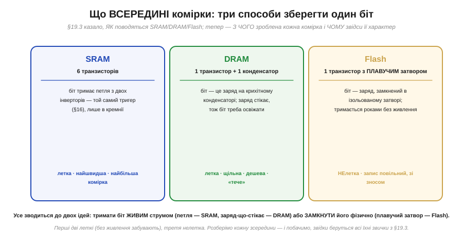
*Рис. 3.6.8.1. Три способи фізично зберегти один біт. **SRAM** — шість транзисторів, де біт тримає петля з двох інверторів (це той самий тригер §3.3, лише в кремнії): летка, найшвидша, але комірка велика. **DRAM** — один транзистор і один конденсатор: біт є зарядом на конденсаторі, що помалу стікає, тож його треба освіжати — летка, дуже щільна й дешева. **Flash** — один транзистор із **плавучим затвором** (*floating gate*), де заряд замкнено в ізоляторі: нелетка, тримає біт роками, але пише повільно й зі зносом. Усе зводиться до двох ідей: тримати біт **живим** (струмом чи зарядом-що-стікає) або **замкнути** його фізично.*

Зверніть увагу на головний вододіл, що пронизує всю картину: перші дві комірки тримають біт, лише **поки є живлення** (тому леткі, §3.6.3), а третя **замикає** заряд у пастці, тож пам'ятає й знеструмлена (нелетка). Це не три довільні інженерні рішення, а три відповіді на одне питання — «де і як утримати один біт», — кожна зі своїм компромісом між швидкістю, щільністю й леткістю. Решта теми — детальний погляд на кожну; почнімо з найшвидшої й найзнайомішої, бо ми її вже, по суті, бачили в Розділі 3.3.

### SRAM: біт тримає петля з транзисторів

Найшвидша пам'ять — **SRAM** (*Static RAM*, статична оперативна пам'ять) — насправді стара знайома: її комірка є не що інше, як **тригер** із §3.3, відлитий у кремнії.

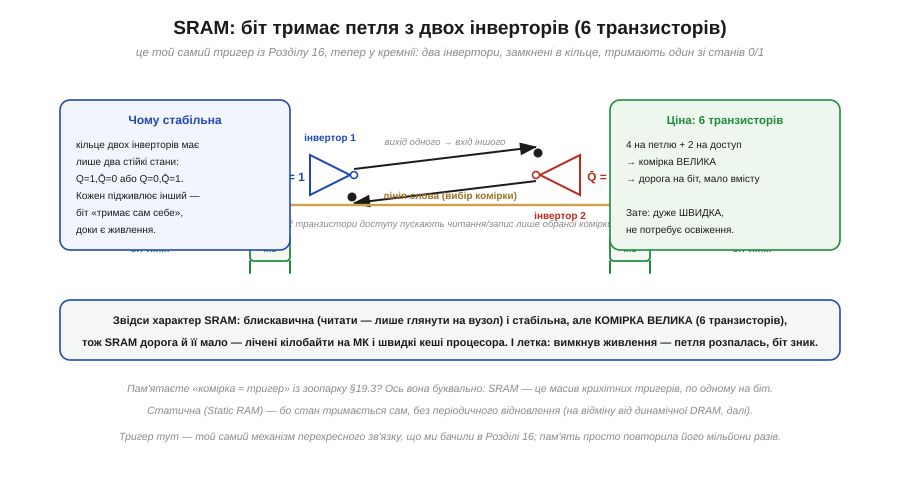
*Рис. 3.6.8.2. Комірка SRAM — **два інвертори, замкнені в кільце** (вихід одного йде на вхід іншого, і навпаки). Таке кільце має лише **два стійкі стани** (Q=1,Q̄=0 або навпаки), і кожен інвертор підживлює інший — біт «тримає сам себе», доки є живлення. Це буквально тригер (§3.3). Плюс **два транзистори доступу**, що за сигналом **лінії слова** (*word line*) під'єднують комірку до **біт-ліній** (*bit lines*) для читання чи запису. Разом — **шість транзисторів** (6T): чотири на петлю, два на доступ.*

Уся поведінка SRAM прямо випливає з цієї будови. Кільце з двох інверторів **стабільне**: воно саме себе тримає в одному з двох станів, без жодного зовнішнього втручання — звідси й «**статична**» в назві (на відміну від динамічної DRAM, яку доведеться раз у раз відновлювати). Читати такий біт **блискавично** — досить «глянути» на напругу у вузлі через транзистор доступу, нічого не руйнуючи. Але за швидкість і стабільність платять **розміром**: шість транзисторів на **один** біт — це багато, тож комірка велика, а отже, SRAM **дорога** й **місткості в неї мало**. Ось чому її лишають для того, де критична швидкість і потрібні лічені кілобайти: робоча RAM мікроконтролера й **кеші** процесора (§3.5.9). І, звісно, вона **летка**: вимкнув живлення — петля зворотного зв'язку розпалась, обидва інвертори згасли, біт зник. Згадайте «комірка ≈ тригер» із зоопарку пам'ятей (§3.6.3): тепер видно, що це не аналогія, а буквальна правда — SRAM є масивом крихітних тригерів, по одному на біт.

> 🔧 **Навіщо це.** Розуміння будови SRAM пояснює дві дуже практичні речі про ваш МК. Перше: **SRAM мала недарма** — шість транзисторів на біт фізично не дають зробити її місткою на дешевому чипі, тож кілька кілобайтів RAM — це не примха виробника, а ціна швидкості; саме тому ви постійно бережете RAM (§3.6.2, §3.6.3). Друге: SRAM **летка на рівні фізики** — біт тримає лише жива петля, тож будь-яке падіння живлення стирає змінні миттєво; це фундамент усього, що ми казали про обнулення RAM при перезапуску (§3.6.3). Коли бачите в даташиті «X КБ SRAM» — тепер ви знаєте, що за цим стоять X×8 крихітних тригерів.

### DRAM: біт — це заряд на конденсаторі

Якщо SRAM щедра на транзистори, то **DRAM** (*Dynamic RAM*, динамічна оперативна пам'ять) — гранична протилежність: вона тримає біт **найдешевшим** способом, який лише можна уявити, — крихітним зарядом.

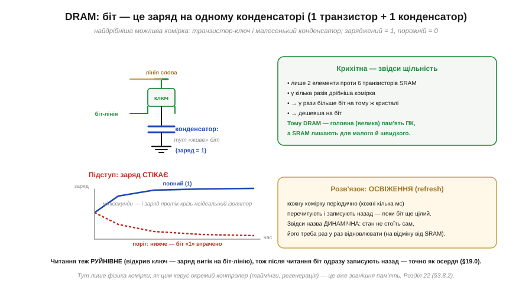
*Рис. 3.6.8.3. Комірка DRAM — **один транзистор-ключ і один малесенький конденсатор** (1T1C). Біт — це **заряд** на конденсаторі: заряджений = 1, порожній = 0. Транзистор за сигналом лінії слова лише під'єднує конденсатор до біт-лінії, щоб записати чи прочитати заряд. Лише два елементи проти шести транзисторів SRAM — звідси **щільність**: у рази більше біт на тому самому кристалі, а отже, дешевше. Підступ: заряд **стікає** крізь неідеальний ізолятор за мілісекунди, тож біт треба періодично **освіжати** (*refresh*) — перечитувати й записувати назад, поки він ще цілий. Звідси й «динамічна».*

Гляньмо, як із цієї мінімалістичної будови виростає весь характер DRAM. Комірка **крихітна** — лише транзистор і конденсатор, — тож на одному кристалі їх вміщається **в рази більше**, ніж громіздких 6T-комірок SRAM; саме тому DRAM стала **головною (великою) пам'яттю** комп'ютерів, де треба багато й дешево, а SRAM лишили для малого й швидкого. Але за щільність теж платять — і двічі. По-перше, конденсатор **не ідеальний**: заряд помалу **стікає** крізь ізоляцію, і вже за мілісекунди біт «1» розмився б до нерозрізнюваного, якби нічого не робити. Тому кожну комірку доводиться періодично **освіжати** — перечитати й записати назад, поки заряд ще впізнаваний; ця вічна «підкачка» і дала назву **динамічна**. По-друге, читання DRAM **руйнівне**: щоб дізнатися заряд, транзистор відкривають і випускають його на біт-лінію — сам акт читання спорожняє конденсатор, тож одразу після читання біт записують назад. Це те саме **руйнівне читання** (*destructive read*), що ми бачили в осердь (історія розділу) — фізика змінилася (заряд замість намагніченості), а проблема й розв'язок ті самі. Зауважте межу нашої теми: тут ми розбираємо **фізику комірки**; як саме цим керує окремий **контролер пам'яті** — коли освіжати, з якими таймінгами, — це вже мова про зовнішню пам'ять, до якої курс дійде далі (§3.8.2). Нам досить бачити, **звідки** в DRAM освіження й руйнівне читання: з одного крихітного конденсатора, що тече.

**Приклад (чому SRAM швидка й дорога, а DRAM щільна й «тече»).** Порівняймо дві комірки на пальцях, рахуючи елементи на біт.

```
SRAM-комірка:  4 транзистори (петля) + 2 транзистори (доступ) = 6 транзисторів / біт
DRAM-комірка:  1 транзистор + 1 конденсатор                   ≈ 1 елемент / біт

На тому самому кристалі:
  DRAM умістить приблизно вшестеро (й більше) біт, ніж SRAM  → дешевша на біт
Натомість:
  SRAM-біт   тримає сам себе (петля)        → читати миттєво, нічого не відновлювати
  DRAM-біт   тримає заряд, що стікає (~мс)   → треба освіжати + руйнівне читання
```
Звідси й розподіл ролей: SRAM — мало, швидко, дорого (кеші, RAM МК); DRAM — багато, дешево, але з вічним освіженням (велика пам'ять ПК). Будова комірки сама диктує, де якій місце.

> 🔧 **Навіщо це.** Хоча на типовому МК уся робоча пам'ять — це SRAM (§3.6.3), знати фізику DRAM вам знадобиться щонайменше двічі. Перше: щойно проєкту забракне вбудованих кілобайтів і ви додасте зовнішню пам'ять на більший обсяг (кадри дисплея, аудіо, буфери), це майже напевно буде DRAM — і її **освіження** та **руйнівне читання** пояснюють, чому вона не під'єднується «в лоб», а потребує контролера (детально — §3.8.2). Друге, концептуальне: DRAM — наочний урок, що **щільність купується ціною додаткового клопоту** (тут — вічної регенерації); цей компроміс «дешево, але з обслуговуванням» ви ще не раз зустрінете в інженерії. А руйнівне читання — гарне нагадування, що навіть «просто прочитати» інколи фізично означає «зіпсувати й відновити».

### Floating gate: транзистор, що пам'ятає заряд

Лишилася найхитріша й найдивовижніша з трьох — комірка, що тримає біт **без жодного живлення**, роками. Це серце **Flash** (і всієї нелеткої пам'яті), і в основі його — один особливий транзистор.

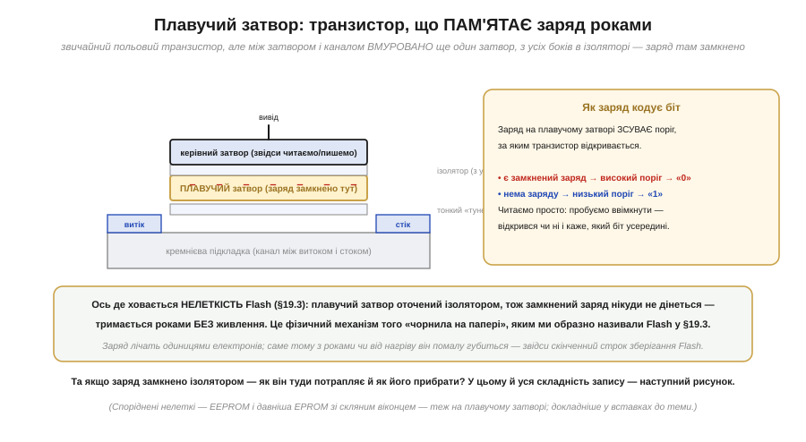
*Рис. 3.6.8.4. Комірка Flash — звичайний польовий транзистор, але між керівним затвором і каналом **вмуровано ще один затвор — плавучий** (*floating gate*), з усіх боків оточений ізолятором. У цій ізольованій пастці можна **замкнути заряд** (надлишок електронів), і він нікуди не дінеться — звідси **нелеткість**. Заряд на плавучому затворі **зсуває поріг**, за яким транзистор відкривається: є замкнений заряд → високий поріг → читаємо «0»; нема заряду → низький поріг → «1». Читають просто: пробують увімкнути транзистор — відкрився він чи ні і каже, який біт усередині.*

Осягніть елегантність ідеї. Звичайний транзистор керується напругою на затворі; тут між тим затвором (його звуть **керівним**, *control gate*) і каналом сидить **другий**, повністю ізольований затвор. Він «плаває» в ізоляторі, ні до чого не під'єднаний — і саме тому здатний **утримати** вкладений у нього заряд **необмежено довго**: електронам нема куди стекти крізь ізолятор. А наявність чи відсутність цього замкненого заряду **зсуває поріг спрацювання** транзистора — і ця різниця порогів кодує біт, який легко прочитати, лише спробувавши транзистор увімкнути. Ось де фізично ховається **нелеткість** Flash, про яку ми говорили в §3.6.3: образне «чорнило на папері» виявляється замкненим у пастці зарядом, що тримається роками без живлення. Щоправда, «роками», а не «вічно»: заряд — це лічені тисячі електронів, і з часом чи від нагріву він помалу губиться, тож у Flash є скінченний **строк зберігання даних** (*data retention*). На тому самому плавучому затворі побудована й споріднена нелетка пам'ять — **EEPROM** і давніша **EPROM** (та, що стиралася ультрафіолетом крізь кварцове віконце), — але їхні відмінності й історію ми лишаємо для вставок до цієї теми. Головна загадка тепер інша: якщо заряд замкнено ізолятором, то **як він туди взагалі потрапляє — і як його прибрати**?

### Як заряд потрапляє в пастку — і чому це зношує комірку

Саме у відповіді на це питання ховається фізичне коріння **всіх** «примх Flash», які ми в §3.6.3 просто прийняли на віру: повільний запис, запис блоками, знос.

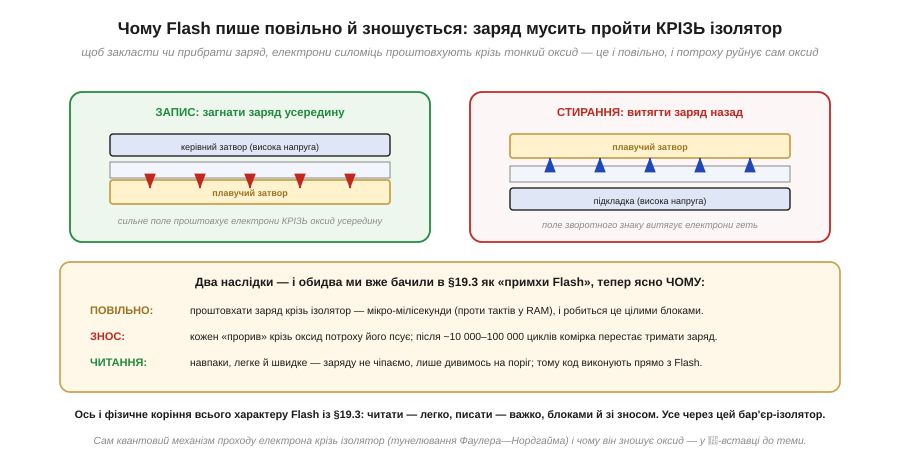
*Рис. 3.6.8.5. Щоб **записати** біт, на керівний затвор дають високу напругу — сильне електричне поле **проштовхує електрони крізь** тонкий ізолятор у плавучий затвор. Щоб **стерти**, поле зворотного знаку (з боку підкладки) **витягує** електрони назад. У будь-якому разі заряд мусить **пройти крізь ізолятор**, який у звичайному режимі його не пускає, — а це і повільно, і потроху руйнує сам оксид. **Читання** ж навпаки: легке й швидке, бо заряду не чіпає, лише дивиться на поріг — тому код можна виконувати прямо з Flash.*

Тепер кожна примха Flash стає **неминучою**, а не загадковою. **Повільність**: проштовхати заряд крізь бар'єр-ізолятор — фізично марудно, це мікро- й мілісекунди проти процесорних тактів, з якими пише SRAM; і робиться він великими **блоками** (так влаштована організація комірок), а не по байту — ось вам блочний запис із §3.6.3. **Знос**: кожне «проштовхування» крізь оксид трохи його **ушкоджує**, і після певної кількості циклів (порядку 10 000–100 000) ізолятор уже не тримає заряд як слід — комірка зношується; саме звідси скінченний ресурс Flash (а отже, і SSD та флешок), про який ми згадували, і потреба «розмазувати» записи рівномірно. А **читання** лишається швидким і необмеженим, бо воно заряду **не чіпає** — лише міряє поріг; тому з Flash зручно й **виконувати код** (процесор читає інструкції прямо звідти). Сам квантовий механізм, яким електрон долає ізолятор (його звуть **тунелюванням**), і те, чому кожен прохід поступово руйнує оксид, — окрема, тонша історія, винесена в 🧮-вставку до цієї теми; тут досить головного: уся вдача Flash — нелеткість в обмін на повільний, блочний, зношуваний запис — росте з одного факту, що заряд мусить **силою** проходити крізь ізолятор.

> 🔧 **Навіщо це.** Фізика плавучого затвора прямо диктує, як **правильно** користуватися Flash на МК — а це щоденна практика. Перше: **не пишіть у Flash часто** — кожен запис наближає знос (10–100 тис. циклів на блок), тож лічильники, журнали й телеметрію, що міняються щосекунди, тримайте в RAM, а у Flash зберігайте лише рідкісні налаштування (§3.6.3); це не пересторога «про всяк випадок», а пряма фізика зносу оксиду. Друге: **запис повільний і блочний** — звідси затримки на збереження й те, що не можна змінити «один байт» без роботи з цілим блоком; плануйте це в коді. Третє: **дані у Flash не вічні** — є скінченний строк зберігання, тож критичні дані варто час від часу перезаписувати, щоб «освіжити» заряд, поки він упевнено читається. І наскрізне: розуміючи, що Flash, EEPROM і SSD — усі на плавучому затворі, ви переносите ту саму інтуїцію («читати дешево, писати дорого й зі зносом») на будь-яку нелетку пам'ять, яку зустрінете.

### Три комірки поряд

Зведімо все докупи — це підсумок теми й заразом місток до підсумку всього розділу.

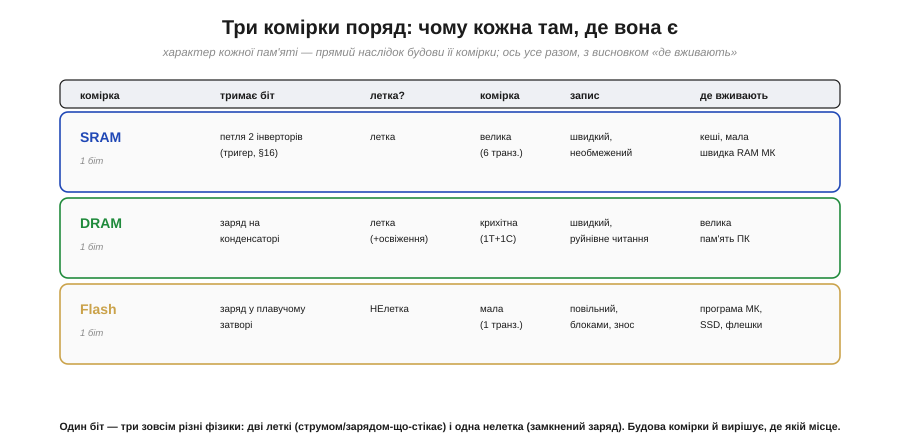
*Рис. 3.6.8.6. Один біт — три зовсім різні фізики. **SRAM**: біт тримає петля двох інверторів (тригер, §3.3); летка; комірка велика (6 транзисторів); запис швидкий і необмежений; місце — кеші й мала швидка RAM. **DRAM**: біт — заряд на конденсаторі; летка (+освіження); комірка крихітна (1T+1C); запис швидкий, але читання руйнівне; місце — велика пам'ять ПК. **Flash**: біт — заряд у плавучому затворі; **нелетка**; комірка мала (1 транзистор); запис повільний, блоками, зі зносом; місце — програма МК, SSD, флешки. Будова комірки сама вирішує, де якій місце.*

Гляньте на цю таблицю як на єдину думку, а не три рядки. У кожному стовпчику характер пам'яті — **прямий наслідок** будови комірки: шість транзисторів SRAM → швидко, але громіздко й дорого; крихітний конденсатор DRAM → щільно й дешево, але «тече» й потребує освіження; ізольований заряд Flash → пам'ятає без живлення, але пише повільно й зношується. Жодна примха не випадкова — усі вони запрограмовані фізикою того, що тримає біт. І ось ключове відлуння всього Модуля: біт зрештою завжди є якимось **фізичним станом** — напрямком намагніченості осердя, петлею струму в тригері, зарядом на конденсаторі чи в пастці затвора, — а «0» і «1» лишаються лише іменами, які ми цим станам даємо (§3.4.1, §3.1). Технології змінюються, носій біта міняється — а сама ідея двох розрізнюваних станів, з якої почався весь Модуль 3, незмінна.

---

Підсумок §3.6.8: за трьома знайомими назвами стоять три різні фізичні комірки. **SRAM** — **шість транзисторів**: петля з двох інверторів, тобто **тригер** (§3.3) у кремнії; тримає біт сама, доки є живлення (летка) — звідси блискавичне читання й стабільність, але велика комірка, тож SRAM **дорога й мала** (кеші, RAM МК). **DRAM** — **один транзистор + один конденсатор**: біт є **зарядом**, що стікає за мілісекунди, тож потребує **освіження**, а читання **руйнівне** (як в осердь, історія розділу); зате комірка крихітна — **щільна й дешева** (велика пам'ять ПК). **Flash** — **один транзистор із плавучим затвором**: біт — заряд, **замкнений в ізоляторі**, що тримається роками без живлення (**нелетка**); запис мусить проштовхувати заряд **крізь** ізолятор, тому **повільний, блочний і зношуваний** (~10–100 тис. циклів), а читання — легке (можна виконувати код). Усі «примхи» пам'яті з §3.6.3 (леткість, освіження, блочний запис, знос) виявляються **неминучими** наслідками будови комірки. І наскрізне: біт — це завжди якийсь **фізичний стан**, а «0»/«1» — лише імена для нього (§3.4.1). Як саме керують DRAM ззовні, чим NOR-флеш різниться від NAND і де брати додаткові мегабайти — це історія зовнішньої пам'яті, до якої курс ще дійде; тут ми дійшли до самого дна — до фізики одного біта. На цьому наша подорож пам'яттю завершена, і час озирнутися на весь розділ.

---

## Підсумок Розділу 3.6

Ми пройшли пам'ять наскрізь — від однієї комірки до цілої архітектури роботи з нею — і тепер вона для нас не «чорна скринька, де щось зберігається», а зрозумілий, упорядкований простір.

Згадаймо здобуте. Пам'ять — це **масив пронумерованих комірок**, кожна тримає байт, кожна має адресу; адреса (де) і дані (що) — різні речі (§3.6.1). Адресний простір **поділено на регіони** — карту пам'яті: код, сталі, глобальні, купа, стек, а на МК ще й периферія (memory-mapped I/O) — кожне на своєму місці (§3.6.2). Фізично пам'ять буває **летка** (RAM — швидка, та забуває без живлення) і **нелетка** (Flash — пам'ятає, та пише повільно блоками): код у Flash, змінні в RAM (§3.6.3). **Покажчик** робить саму адресу даними, даючи непрямість — велику силу й великі небезпеки (§3.6.4). **Стек** обслуговує виклики функцій за принципом LIFO, тримаючи адреси повернення й локальні, що з'являються й зникають самі (§3.6.5). **Купа** дає динамічну пам'ять — гнучку, та ручну й примхливу до фрагментації (§3.6.6). А зворотний бік усієї цієї сили — **біди пам'яті**, тихі й підступні, особливо на МК (§3.6.7).

Наскрізна думка розділу — **пам'ять і потужна, і небезпечна одночасно**, і це не два різні факти, а один: та сама непрямість, що дає покажчикам силу, дає й висячі покажчики; той самий стек, що робить виклики дешевими, переповнюється; та сама купа, що дає гнучкість, фрагментується. Володіти пам'яттю — означає поважати обидва її боки. І ще одне винесімо: усе тримається на двох простих, але невблаганних розрізненнях — **«адреса проти значення»** і **«коли ці дані живі»**. Тримайте їх ясними — і пам'ять із джерела найгрізніших багів стане надійним фундаментом.

---

## Підсумок Модуля 3 — від двох станів до комп'ютера

Цей розділ завершив **увесь Модуль 3**, тож озирнімося на весь пройдений шлях — він був великий. Ми почали з простого фізичного факту: **надійний перемикач має два стани** — і дійшли до повноцінного **комп'ютера, що виконує програму й пам'ятає її в адресованій пам'яті**. Між цими двома точками — ціла цивілізація ідей.

Ось дорога, якою ми пройшли. **Логічні рівні** (Розділ 3.1): чому цифра перемагає аналог — два стани переживають шум, що вбив би безперервну величину; «0» і «1» — це діапазони напруг, а не точні числа. **Логічні вентилі** (Розділ 3.2): як з тих 0 і 1 робити **логіку** (І, АБО, НЕ), як із транзисторів складаються вентилі, а з вентилів — суматори й комбінаційні схеми. **Тригери й регістри** (Розділ 3.3): як схема навчилася **пам'ятати** стан і крокувати його в часі під спільний **такт**. **Представлення чисел** (Розділ 3.4): як ті самі 0 і 1 стають **числами** — додатними, від'ємними, дробовими, плаваючими, — і наскрізна істина, що **біти не мають вродженого сенсу, його надає домовленість**. **Архітектура процесора** (Розділ 3.5): як купа вентилів і регістрів стає **машиною, що виконує інструкції** — цикл вибірки-декодування-виконання, ISA, частота, конвеєр, архітектури; і думка, що **складне постає з простого, узятого швидко й багато**. І нарешті **пам'ять** (Розділ 3.6): де живуть код і дані та як ними керувати.

А над усім цим — два наскрізні мотиви, що пронизали Модуль. Перший: **усе зводиться до 0 і 1, а сенс їм надає домовленість** — той самий байт є і числом, і командою, і адресою, залежно від того, як його вжити; це ключ і до фон-нейманівської машини, і до половини всіх багів. Другий, який ми бачили в кожній історії: **великі ідеї — то праця багатьох**. Двійкову систему дав Лейбніц, але до неї торкалися й інші; логіку — Буль; пам'ять-тригер — Екклз і Джордан; плаваючу кому впорядкував Кехен; збережену програму пов'язують із фон Нейманом, та над нею працювали й Тюрінг, і Еккерт із Моклі, і британські будівники; перший задуманий комп'ютер — Беббідж, а першу програму й бачення — Лавлейс; пам'ять на осердях — Форрестер, але й Ван, і інші. Історія техніки — це історія багатьох рук, навіть коли підручник лишає одне ім'я.

Ви тепер розумієте комп'ютер **зсередини** — від фізики двох станів до виконання програми в пам'яті. Це міцний фундамент. Настав час прикласти його до **справжнього заліза** — взяти конкретний мікроконтролер, **ESP32**, і побачити, як уся ця теорія оживає в чипі, який ви програмуватимете: його ядра, пам'ять, периферію, і те, як код через адреси «торкається» світу.

> ▶️ **Далі — Модуль 4: [Мікроконтролер і прошивка: ESP32](../../block-4-mcu-esp32/ch20-mcu-esp32/ch20-mcu-esp32.md).** Від теорії процесора й пам'яті — до конкретного чипа: анатомія мікроконтролера, архітектура ESP32, його пам'ять і периферія, і як ваш код стає прошивкою, що керує залізом. А починається Модуль 4 з історії про те, як комп'ютер уперше вмістився на одному чипі (перший мікроконтролер).
