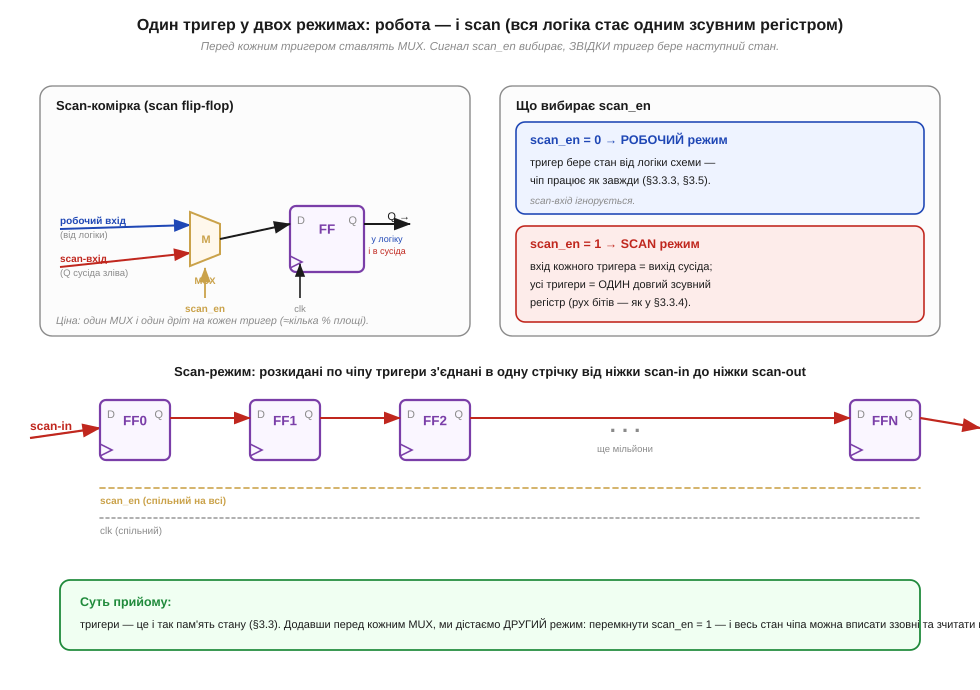
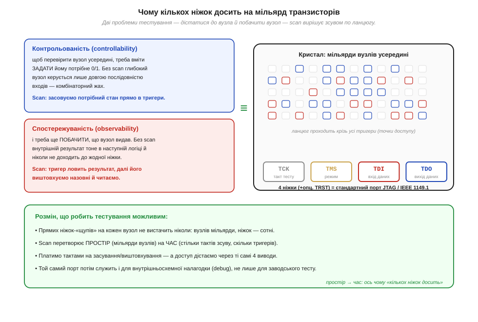
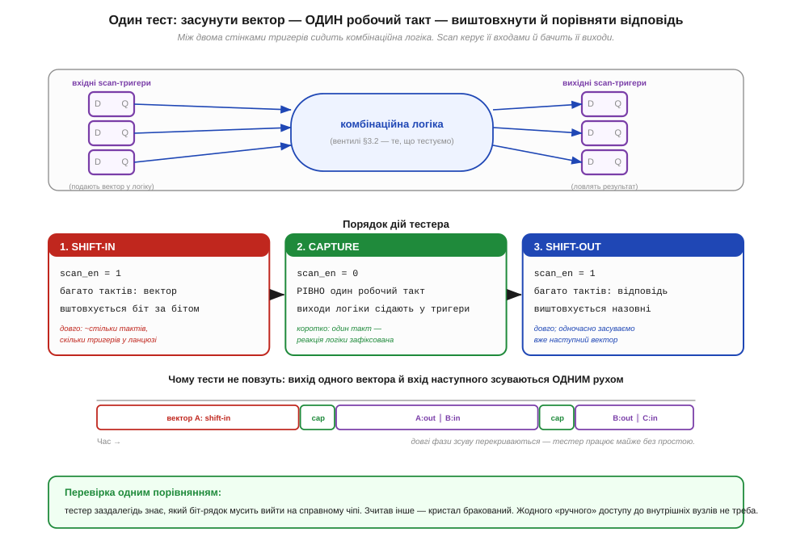

# Scan chain: як тестер перевіряє мільярд транзисторів через кілька ніжок

> ⚙️ Алгоритмічна вставка до теми [§3.10.6 «Тестування й binning»](chip-fabrication.md). Тема показала головне: після різання пластини **кожен** кристал спершу садять у тестер, і саме результат тесту вирішує його долю — у відро браку, на нижчий сорт чи у топовий бін. Лишилося нез'ясованим практичне: як той тестер за секунди перевіряє чіп, усередині якого мільярд транзисторів, маючи доступ лише до кількох десятків ніжок корпуса? Прямих «щупів» до внутрішніх вузлів немає й бути не може. Відповідь — прийом проєктування під тест, **scan chain** (*scan chain*, ланцюг сканування): тригери чіпа на час тесту перешиковують в один довжелезний зсувний регістр. Сусідня [🔌-вставка §3.10.6c](comp-chip-markings.md) розповідає, що з результатів тесту потрапляє на маркування корпуса; тут — сам алгоритм доступу.

## Задача

Сформулюємо проблему в числах. На кристалі — мільярди транзисторів і сотні мільйонів логічних вузлів, а на корпусі — кілька сотень ніжок, із яких на тест припадають одиниці. Щоб переконатися, що логіка справна, для кожного підозрілого місця треба вміти дві речі: **задати** йому вхідні значення й **побачити** результат. Без особливих заходів обидві недосяжні. Глибокий вузол керується не ніжкою, а довгою послідовністю входів крізь багато шарів вентилів (§3.2), а його результат тоне в наступній логіці й до жодної ніжки не доходить. Помножте на мільйони вузлів — і «подати всі комбінації й подивитися на виходи» стає нездійсненним ні за часом, ні за кількістю контактів. Потрібен спосіб дотягтися до стану всередині чіпа без окремого дроту на кожен вузол.

## Ідея

Ключ у тому, що в синхронній схемі весь стан тримають **тригери** (*flip-flops*, §3.3.3): їх багато, вони розкидані по кристалу, але саме вони запам'ятовують усе між тактами. Якби в них можна було довільно вписати будь-який стан і зчитати назад те, що там опинилося, проблема доступу зникла б. Scan робить рівно це. Перед входом кожного тригера ставлять мультиплексор (*MUX*, 2→1), а керує ним один спільний сигнал — назвемо його `scan_en`. При `scan_en = 0` тригер бере наступний стан від логіки схеми, як завжди (§3.5), і чіп працює штатно. При `scan_en = 1` вхід кожного тригера перемикається на **вихід сусіда** — і вся розсипана по кристалу пам'ять стає одним суцільним зсувним регістром, тим самим рухом бітів, що в §3.3.4.


*Рис. 3.10.6a.1. Ліворуч — scan-комірка зблизька: MUX перед тригером вибирає, звідки брати наступний стан, а селектором служить `scan_en`. Праворуч — що цей вибір означає: 0 → робочий режим (стан від логіки), 1 → scan-режим (стан від сусіда). Унизу — наслідок: у scan-режимі розкидані тригери з'єднані в одну стрічку від ніжки scan-in до ніжки scan-out, зі спільним тактом і спільним `scan_en`. Ціна — один MUX і один дріт на тригер, тобто кілька відсотків площі.*

Перетворення тут глибше, ніж здається: scan розмінює **простір на час**. Дотягтися дротом до кожного з мільярдів вузлів неможливо — натомість ми проходимо крізь усі тригери **послідовно**, по одному за такт. Контрольованість (*controllability*, здатність задати вузлу потрібне значення) дістається тим, що потрібний стан **засовують** у тригери зсувом ззовні. Спостережуваність (*observability*, здатність побачити результат) — тим, що тригери **ловлять** реакцію логіки, а далі її **виштовхують** назовні. Обидві властивості тепер ідуть через дві ніжки — вхід і вихід ланцюга — плюс такт і `scan_en`.


*Рис. 3.10.6a.2. Дві проблеми тесту — задати вузол і побачити вузол — scan вирішує зсувом по ланцюгу. Праворуч стандартний порт доступу: чотири ніжки (TCK — такт, TMS — режим, TDI — вхід даних, TDO — вихід даних), плюс необов'язковий TRST. Простір мільярдів вузлів обернувся на час: стільки тактів зсуву, скільки тригерів у ланцюзі. Той самий порт згодом служить і для внутрішньосхемної налагодки.*

## Псевдокод

Сам тест — це строга послідовність із трьох фаз, і весь фокус у тому, **коли** `scan_en` дорівнює одиниці, а коли нулю:

```
# дано: тестовий вектор V (значення для всіх тригерів)
#       та еталон R (що мусить вийти на справному чіпі)

# фаза 1 — SHIFT-IN: засунути вектор
scan_en ← 1
повторити (кількість тригерів) разів:
    подати наступний біт V на scan-in
    дати такт                       # біти зсуваються ланцюгом на крок

# фаза 2 — CAPTURE: один робочий такт
scan_en ← 0
дати РІВНО один такт                # виходи логіки сідають у тригери

# фаза 3 — SHIFT-OUT: виштовхнути відповідь (і вже засунути наступний вектор)
scan_en ← 1
відповідь ← порожньо
повторити (кількість тригерів) разів:
    зчитати біт зі scan-out → дописати у відповідь
    подати наступний біт НАСТУПНОГО вектора на scan-in
    дати такт

якщо відповідь ≠ R:  кристал бракований
```

Дві деталі вирішують, чи буде тест і коректним, і швидким. По-перше, **capture — рівно один такт**: ми хочемо побачити, що логіка робить за один крок між стінками тригерів, а не дати схемі «побігти» далі. По-друге, фази зсуву довгі (стільки тактів, скільки тригерів), тож їх **перекривають**: поки виштовхуємо відповідь на попередній вектор, тим самим зсувом уже засуваємо наступний. Через це довгі shift-фази амортизуються, і тестер працює майже без простою.


*Рис. 3.10.6a.3. Між двома стінками scan-тригерів сидить комбінаційна логіка — те, що тестуємо. Угорі — три фази по черзі: довгий shift-in, один такт capture, довгий shift-out. Унизу — конвеєр: shift-out попереднього вектора й shift-in наступного йдуть одним рухом, тому довгі фази зсуву перекриваються. Перевірка зводиться до одного порівняння виштовхнутого рядка з еталоном.*

## Складність і пастки на МК

За вартістю scan дешевий за площею, але дорогий за часом, і ця асиметрія визначає всі його межі. Для розробника вбудованих систем важливо, що **той самий ланцюг** — це не лише заводський тест, а й порт налагодки в його руках.

- **Час лінійний від глибини ланцюга.** Один тестовий вектор коштує приблизно *(довжина ланцюга) + 1 + (довжина ланцюга)* тактів. Мільйон тригерів в одному ланцюзі — це мільйони тактів на вектор, а векторів треба багато. Тому ланцюг ділять на десятки паралельних сегментів зі своїми scan-in/out, щоб зсувати їх одночасно й скоротити час пропорційно.
- **Тестовий такт ≠ робочий.** Зсув роблять на повільнішому такті, ніж штатна частота: під час shift перемикається багато тригерів одразу, і споживання та просідання живлення (§3.1) можуть перевищити робочі. Прискорений «at-speed» тест — окрема морока з таймінгом (§3.3.8).
- **Initial state не визначений.** Після ввімкнення тригери в довільному стані, тому **перший** вектор завжди повністю засовують через scan, не покладаючись на те, що там було. Це і є базова перевага: стан більше не «успадковується» загадково, його завжди задають явно.
- **Покриття — не «всі транзистори».** Scan дає доступ до тригерів, але справність *комбінаційної* логіки між ними перевіряють згенеровані вектори під конкретну **модель дефекту** (класична — «застрягло на 0/1», *stuck-at*). Покриття рахують у відсотках; 100 % буває рідко, і саме недопокриті місця інколи дають збій, що тест пропустив **(перевірити типові цифри покриття для сучасних вузлів)**.
- **Цей самий порт — ваш налагоджувач.** Чотири ніжки TAP (TCK/TMS/TDI/TDO) — це інтерфейс JTAG, через який МК не лише тестують на заводі, а й програмують та дебажать: зупинка ядра, читання регістрів і пам'яті йдуть тим самим ланцюгом. Тож «ніжки для тесту» на вашій платі — насправді вікно всередину чіпа.

## Звідки це взялося

Scan — типово **колективний** винахід: він визрівав паралельно по різні боки океану, і єдиного «автора» в нього немає.

### Stanford, 1973: тригер плюс мультиплексор

Ідею модифікувати тригер мультиплексором, щоб зібрати всі тригери в один scan-ланцюг, сформулювали **Томас Вільямс** (*Thomas W. Williams*) і **Джеймс Анджелл** (*James B. Angell*) у Стенфорді — у статті «Enhanced Testability of Large Scale Integrated Circuits via Test Points and Additional Logic» (*IEEE Transactions on Computers*, 1973). Це і є той MUX-scan, що на Рис. 3.10.6a.1.

### Японія, паралельна лінія: scan path у NEC

Майже водночас і незалежно до того самого підходу дійшли в Японії: ідею «тестового режиму», що зшиває синхронні тригери в ланцюг, приписують **Кобаясі** (*Kobayashi*) з колегами (кінець 1960-х), а опублікували її **С. Фунацу** (*S. Funatsu*) зі співавторами на Design Automation Conference 1975 року й утілили в кремнії в NEC під назвою **scan path**. Що дві групи прийшли до однієї конструкції нарізно — знак, що рішення «природне» для проблеми.

### IBM: дисципліна LSSD

Строгу гілку розвинули в IBM: **Едвард Айхельбергер** (*Edward B. Eichelberger*) і той самий Томас Вільямс оформили **LSSD** (*Level-Sensitive Scan Design*) — правила на засувках і кількох тактах, що гарантують тест без гонок і газардів. За ці роботи обидва 1989 року розділили нагороду IEEE Computer Society W. Wallace McDowell Award; саме промислове застосування в IBM зробило повний scan фактичним стандартом **(точні роки публікацій LSSD — приблизно 1977–1978, перевірити)**.

### Від чіпа до плати: boundary scan і JTAG

Наступний крок — винести ту саму ідею на **межу** корпуса, щоб перевіряти вже паяні з'єднання на платі. Це **boundary scan** (*boundary scan*, граничне сканування), який консорціум **JTAG** (*Joint Test Action Group*) на зламі 1980–1990-х оформив у стандарт **IEEE 1149.1** (близько 1990). Звідти й ростуть ті чотири ніжки TCK/TMS/TDI/TDO — але це вже про з'єднання між чіпами, тобто радше про корпусування й плату (§3.10.7), ніж про сам кристал.

Отже, від питання §3.10.6 «як тестер за секунди судить мільярд транзисторів» ми дійшли до конкретного механізму: перешити тригери в зсувний регістр, розміняти простір на час і пропустити стан чіпа через кілька ніжок. Що з вироку тесту лягає на корпус у вигляді сорту, дата-коду й ревізії — показує [🔌-вставка §3.10.6c](comp-chip-markings.md); звідки взялися самі «ніжки», у які впирається ланцюг, — наступна тема про корпусування.
