# Розділ 3.9 — Коди виявлення й корекції помилок

Дотепер Модуль 3 будував для нас машину, яка чесно зберігає й перетворює біти. Ми дали їй стійкі до шуму **рівні** (Розділ 3.1), **логіку** над ними (Розділ 3.2), **пам'ять**, що тримає й крокує стан у часі (Розділ 3.3), навчили її читати ці біти як **числа** й **текст** (Розділ 3.4), складати з вентилів і регістрів **процесор** (Розділ 3.5), адресувати **пам'ять** (Розділ 3.6) — і навіть виносити дані в окремі мікросхеми (Розділ 3.8). Усюди ми мовчки припускали одне: біт, який ми записали, через секунду, через рік, після польоту дротом чи радіо лишиться **тим самим**. Цей розділ ставить це припущення під сумнів — бо в реальному залізі воно неправда.

Біти **перевертаються**. Тепловий шум на межі рівнів читає «0» як «1»; завада на довгому дроті спотворює кадр; космічна частинка вибиває заряд із комірки пам'яті; зношена комірка Flash просто «забуває» записане. Кожна з цих причин рідкісна — але бітів у сучасній системі мільярди, і вони летять мільйонами щосекунди, тож рідкісна подія стає **постійною**. Питання не в тому, чи трапляються помилки, а в тому, **що ми з ними робимо**.

Відповідь дала ціла галузь — **теорія кодування** (*coding theory*). Її головна ідея напрочуд проста: до даних додають **надлишок** — кілька зайвих бітів, обчислених за самими даними так, що випадкова помилка цей зв'язок **порушить**. Залежно від того, скільки надлишку ми готові заплатити, ми отримуємо різні сили: від найдешевшого **виявлення** («щось зіпсовано — перешли ще раз») до повноцінного **виправлення** («зіпсовано ось цей біт — повертаю його на місце, нічого не перепитуючи»). Між цими полюсами лежить уся інженерія надійності даних.

Дорога розділу веде знизу вгору — від дешевого до потужного. Спершу подивимося, **звідки** взагалі беруться перевернуті біти й наскільки це масово (§3.9.1). Потім збудуємо найпростіший детектор — **біт парності** (§3.9.2) — і відразу побачимо його сліпу пляму. Далі підемо до **контрольних сум** (§3.9.3) і до короля виявлення — **CRC** (§3.9.4), що стоїть у кожному надійному каналі. Тоді перейдемо від виявлення до **виправлення**: зрозуміємо його геометрію через **відстань Геммінга** (§3.9.5), складемо перший виправний **код Геммінга (7,4)** на пальцях (§3.9.6), побачимо **ECC** у живому залізі — RAM і Flash (§3.9.7), якісно розберемо **Рід–Соломон**, завдяки якому грає подряпаний диск і читається брудний QR (§3.9.8), — і нарешті зведемо все в інженерну карту: **що ставити де** (§3.9.9). Наприкінці ця карта стане містком у Модуль 6, де ті самі CRC й контрольні суми зберуться у справжні пакети зв'язку.

> 📜 **Перед матеріалом — історія:** [Річард Геммінг: «якщо машина бачить помилку — чому не виправить?»](hist-hamming.md). Вона про те, як наприкінці 1940-х у Bell Labs інженер, чиї розрахунки щовихідних зривала одна перевернута комірка реле-машини, розлютився на питання «чому машина лише *зупиняється* на помилці, а не *виправляє* її» — і вивів перший код, що справді виправляє. На його ідею «надлишок, який сам вказує на помилку» спирається друга половина цього розділу.

---

## 3.9.1 Звідки беруться перевернуті біти

Перш ніж боротися з помилками, треба чесно зрозуміти ворога: **звідки** в цифровій системі береться перевернутий біт, **як часто** це стається й **чому** від цього неможливо просто відгородитися кращим дротом. Без цієї картини будь-який код виглядає зайвою перестраховкою. З нею стає очевидно: надлишок — не розкіш параноїка, а інженерна необхідність, така сама буденна, як запобіжник у колі живлення.

Почнімо з кореня, який ми вже знаємо. У Розділі 3.1 ми бачили, що «0» і «1» — це не точні напруги, а **діапазони**, розділені забороненою зоною, і що між ними є **запас завадостійкості** (§3.1.3). Уся надійність цифри трималася на тому, що цей запас широкий: щоб переплутати рівні, шумові треба перестрибнути цілу прірву. Перевернутий біт — це рівно той випадок, коли прірву таки перестрибнули. А причин, чому це може статися, кілька, і фізика в кожної своя.

### Чотири класи причин

Зручно тримати в голові чотири джерела помилок — два в **каналі** (коли біт кудись передається) і два в **комірці** (коли біт просто лежить і зберігається).

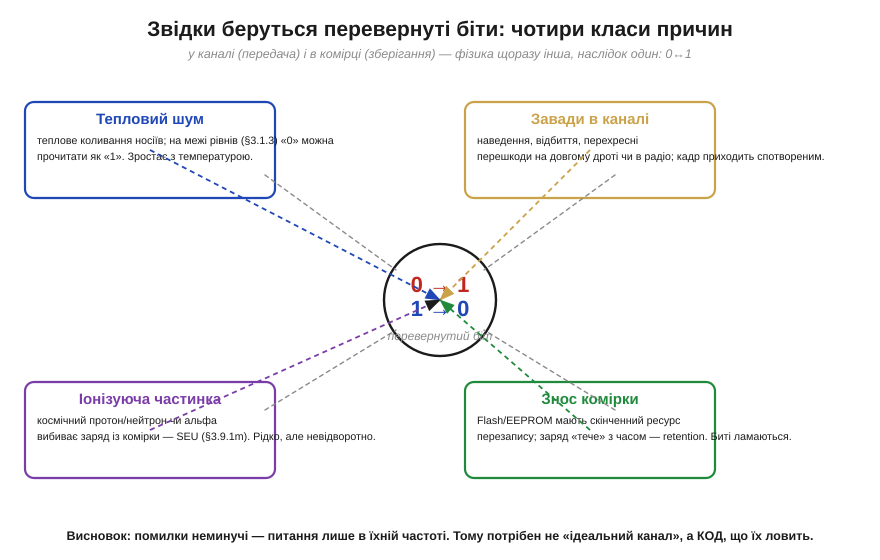
*Рис. 3.9.1.1. Чотири класи причин, чому біт перевертається. **Тепловий шум** — вічне коливання носіїв заряду; на межі рівнів воно здатне підштовхнути «0» до «1». **Завади в каналі** — наведення, відбиття й перехресні перешкоди на довгому дроті чи в радіо, через які кадр приходить спотвореним. **Іонізуюча частинка** (космічний протон, нейтрон чи альфа від домішок у корпусі) вибиває заряд із комірки. **Знос комірки** — скінченний ресурс перезапису Flash/EEPROM і повільне «стікання» заряду. Фізика щоразу різна, наслідок один: 0 стає 1 або навпаки.*

Перші два джерела — **аналогові за природою**. Тепловий шум присутній завжди й росте з температурою; саме він задає фундаментальну межу, нижче за яку жоден підсилювач не «почистить» сигнал. Завади в каналі — це вже зовнішній світ: що довший дріт, що вища частота, що ближче сильнострумові лінії, то більша ймовірність, що рівень на вході приймача на мить вийде за межі «свого» діапазону. Обидва ці механізми ми частково знаємо з Модуля 1 і повернемося до них предметно, коли говоритимемо про лінії передачі; тут важливо лише, що **передача — ризикована**, і що довший шлях, то ризикованіша.

Другі два джерела стосуються **зберігання** — і вони підступніші, бо діють, коли система ніби «нічого не робить». Комірка пам'яті — це крихітний заряд (Розділ 3.6, 3.8), і цей заряд можна **вибити**: пролітаючи крізь кремній, заряджена частинка лишає за собою слід вільних носіїв, і якщо їх вистачить, вузол перемкнеться. Таку поодиноку подію називають **одиничним збоєм від частинки** (*single-event upset*, SEU). А ще заряд можна **зносити**: кожне стирання Flash трохи руйнує ізолятор комірки, і після десятків чи сотень тисяч циклів комірка перестає надійно тримати заряд — або тече так швидко, що «забуває» біт за місяці замість років (це властивість **утримання**, *retention*).

> 🧮 **Поряд — математична вставка:** *SEU/SEL: біт-фліпи від частинок* — звідки беруться ці збої фізично, що таке переріз і LET, і чому на висоті польоту літака й тим паче в космосі їх на порядки більше, ніж біля землі.

### Усе зводиться до одного: запас з'їдено

Хоч причин чотири, корінь у всіх один — і він прямо повертає нас до §3.1.3. Хай що сталося — нагрілася комірка, прийшла завада, вдарила частинка чи зносився ізолятор, — **наслідок** однаковий: миттєвий «розмах» аналогового значення на вузлі перетнув межу між рівнями. Запас завадостійкості, який мав цю межу боронити, виявився **з'їдений**.

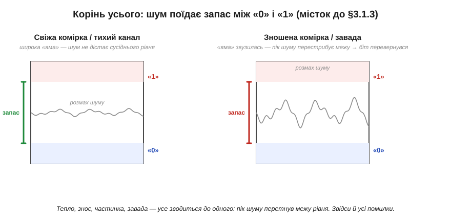
*Рис. 3.9.1.3. Той самий механізм за всіма причинами. Ліворуч — свіжа комірка чи тихий канал: «яма» між рівнями «0» і «1» широка, і навіть помітний шум до сусіднього рівня не дотягується. Праворуч — зношена комірка чи завада: рівні «з'їхалися», запас звузився, і тепер пік шуму перестрибує межу — біт перевертається. Усі чотири джерела (§3.9.1.1) роблять зрештою те саме: зменшують відстань між «0» і «1» або збільшують розмах завади.*

Це пояснює, чому з помилками не можна впоратися «в лоб» — просто зробивши канал чи комірку ідеальними. Ідеальних немає: тепловий шум невитравний, частинки летітимуть завжди, ресурс перезапису скінченний за фізикою. Можна **зменшити** ймовірність помилки — кращим екрануванням, нижчою частотою, свіжішою пам'яттю, — але не звести її в нуль. А отже, питання неминуче зміщується: не «**як уникнути** помилок», а «**як жити** з тим, що вони бувають». І саме тут на сцену виходять коди.

### Поодинокі помилки й пакети — два різні вороги

Перш ніж рахувати масштаб, варто розгледіти ще одну рису помилок, яка згодом визначить вибір коду: помилки приходять **по-різному за характером**, і ця відмінність важливіша, ніж може здатися. Один тип — **поодинокі** (*random*, незалежні) помилки: рідкі, розкидані випадково, кожна сама по собі. Так поводиться тепловий шум і поодинокі частинки — біт тут, біт там, без зв'язку між ними. Інший тип — **пакетні** (*burst*) помилки: коли одна подія псує **багато сусідніх бітів за раз**. Так діє завмирання радіосигналу, що на мить «гасить» цілий шматок кадру; так діє подряпина на диску, що стирає суцільну смугу доріжки; так діє короткий сплеск завади на дроті.

Ця різниця — не академічна тонкість, а ключ до всього подальшого. Код, чудовий проти поодиноких помилок, може виявитися безпорадним проти пакета тієї самої «сумарної» сили, і навпаки. Простий приклад інтуїції: уявімо код, що вміє виправити будь-який **один** перевернутий біт у блоці. Проти поодиноких помилок він майже бездоганний — адже два збої в одному короткому блоці малоймовірні. Та хай прийде пакет, що перекине п'ять сусідніх бітів, — і цей код захлинеться, бо п'ять у блоці він не подужає. Тому, проєктуючи захист, інженер питає не лише «скільки помилок», а й «**якої форми**»: розсипом чи згустком. До цього поділу ми ще не раз повернемося — він червоною ниткою пройде через увесь розділ і визначить, де доречний бітовий код, а де потрібен символьний.

### Рідкісне × масове = постійне

Лишається відчути **масштаб** — бо саме він робить рідкісну подію проблемою, яку не можна ігнорувати. Інтуїція підказує: «одна помилка на мільйон бітів — та це ж практично ніколи». Інтуїція помиляється, бо забуває, як **багато** бітів проходить через систему.


*Рис. 3.9.1.2. Чому рідкісне стає постійним. Ймовірність помилки на біт (*bit error rate*, BER) справді мала, але бітів — мільярди. У тихій серверній RAM збій трапляється кілька разів на рік на десятки гігабайтів; на довгому UART-шлейфі з BER 10⁻⁶ і потоком 1 Мбіт/с — це вже близько одного битого біта щосекунди; у радіоканалі на межі чутливості (BER 10⁻³) кадр на 256 байтів несе в середньому пару помилок; а зношена NAND може віддавати сотні битих бітів зі сторінки. Сама собою «одна на мільйон» — дрібниця; помножена на потік — це постійний потік помилок.*

Щоб ця думка перестала бути абстрактною, корисно один раз порахувати її руками. Хай маємо канал зі швидкістю 1 Мбіт/с і помірно поганою якістю — *bit error rate* 10⁻⁶ (один битий біт на мільйон). Здається, бездоганно. Та за секунду каналом проходить мільйон бітів, тож у середньому **щосекунди** один із них перевертається.

**Приклад (порахуймо потік помилок).** Оцінімо, скільки помилок дає той самий канал на різних обсягах.

```
канал: 1 Мбіт/с,  BER = 10⁻⁶  (одна помилка на мільйон бітів)

за 1 секунду:    10⁶ бітів × 10⁻⁶ = 1 битий біт   (щосекунди!)
за 1 годину:     3600 × 1        ≈ 3600 битих бітів
за добу:                          ≈ 86 400 битих бітів

кадр 256 байтів = 2048 бітів:
  ймовірність хоча б однієї помилки ≈ 2048 × 10⁻⁶ ≈ 0.2%
  → приблизно кожен 500-й кадр приходить битим
```
«Одна на мільйон» звучить як «ніколи», а на ділі це битий кадр щопівтисячі — у безперервному потоці помилки сиплються постійно.

Ось чому надійність даних — не екзотика для космічних апаратів, а щоденна інженерія. Сервер, що працює роками; накопичувач, який мусить віддати ваш файл біт-у-біт через п'ять років; дрон, що тримає радіолінк крізь завмирання, — усі вони щомиті стикаються з перевернутими бітами й **мусять** з ними якось давати раду. Хтось — перепитуючи зіпсований кадр, хтось — мовчки виправляючи збій у пам'яті, але **ніхто** не може просто вдавати, що помилок не буває.

> 🔧 **Навіщо це.** Три думки, які варто винести ще до будь-яких кодів. Перша: **помилки неминучі** — це не ознака поганого заліза, а фізика; навіть бездоганна система має ненульову BER. Друга: **передача й зношене зберігання — найризикованіші місця**; саме там (довгі дроти, радіо, стара Flash, пам'ять у радіації) код потрібен найбільше, тоді як у тихому регістрі поруч із ядром можна часто обійтися й без нього. Третя, найпрактичніша: проєктуючи систему, закладайте [**бюджет помилок**](book:math/error-budget) — оцініть BER каналу чи комірки, помножте на потік даних, і ви побачите, чи можна знехтувати помилками, чи треба ставити захист. Ця оцінка — перший крок будь-якого надійного дизайну, і саме до неї ми повернемося наприкінці розділу (§3.9.9), коли вибиратимемо інструмент під задачу.

> 📜 **Поряд — історія:** *4096 зайвих голосів* — як на виборах у Бельгії 2003 року кандидат раптом отримав рівно 4096 (тобто 2¹²) зайвих голосів, і як розслідування зійшлося на єдиному перевернутому біті в пам'яті лічильної машини. Космічну частинку як причину тут називають **правдоподібною, але не доведеною**: точну фізику збою встановити вже не вдалося, і в тексті її варто подавати саме так.

---

Підсумок §3.9.1: біти перевертаються, і це **фізика, а не дефект**. Чотири джерела — тепловий шум і завади (у каналі), іонізуючі частинки й знос комірок (у пам'яті) — діють по-різному, та зводяться до одного: пік аналогового значення перетинає межу рівнів, з'ївши запас завадостійкості §3.1.3. Уникнути цього повністю не можна — лише зменшити ймовірність; тому інженерія переходить від «уникати» до «жити з помилками». А оскільки рідкісна подія, помножена на мільярди бітів, стає постійним потоком, захист потрібен у будь-якій серйозній системі. Найдешевший його різновид — лише **помітити**, що щось зіпсовано; з нього й почнемо, збудувавши найпростіший детектор з одного-єдиного зайвого біта.

---

## 3.9.2 Біт парності

Ми з'ясували, що помилки неминучі й що першим кроком захисту є бодай **помітити** їх. Який найдешевший детектор узагалі можна уявити? Виявляється, вистачить **одного** зайвого біта на цілий блок даних — і він уже зловить найтиповішу поодиноку помилку. Цей біт називають **бітом парності** (*parity bit*), і він — найпростіший код виявлення в усій теорії. З нього ми почнемо не лише тому, що він простий, а тому, що на ньому видно **головну ідею** всіх кодів: додати надлишок, обчислений за даними так, щоб помилка його зрадила.

### Один біт, що рахує одиниці

Біт парності будується елементарно. Беремо всі біти даних і питаємо: скільки серед них одиниць — парне число чи непарне? Якщо непарне, додаємо один біт, що дорівнює 1, аби разом одиниць стало парне число; якщо вже парне — додаємо 0. Так влаштована **парна парність** (*even parity*): після додавання біта загальна кількість одиниць у блоці **завжди парна**.


*Рис. 3.9.2.1. Біт парності для семи бітів даних. Лічимо одиниці в даних: їх непарна кількість, тож ставимо P = 1, і разом одиниць стає парне число (even parity). Приймач робить те саме — рахує одиниці в усіх восьми бітах: парна сума означає, що однієї помилки не було, непарна — що один біт перевернувся. Самого P досить, щоб **побачити** помилку, але не щоб знати, **де** вона.*

Тут варто впізнати давнього знайомого. «Парне чи непарне число одиниць» — це рівно те, що рахує операція **XOR** (*виключне АБО*) з §3.2.4: XOR двох бітів дає 1, коли одиниць непарно (рівно одна), і 0, коли парно (нуль або дві). Поширивши XOR на весь рядок, дістаємо: **біт парності = XOR усіх бітів даних**. Те, що ми колись вивчали як «логіку порівняння», виявляється готовим обчислювачем парності — і в залізі він коштує один вентиль на біт, а в коді — один оператор `^`. Дешевше не буває.

Перевірка на боці приймача так само тривіальна й симетрична. Приймач не зберігає нічого зайвого — він просто перераховує XOR усіх отриманих бітів разом із бітом парності. Якщо результат 0 (одиниць парно), блок вважається цілим; якщо 1 (одиниць непарно) — десь усередині один біт перевернувся, і кадр оголошують битим. Жодних таблиць, жодної пам'яті — лише підрахунок одиниць.

Перш ніж рушити далі, варто прояснити дрібну, але практичну деталь, на яку натикаються всі, хто колись налаштовував послідовний порт: парність буває **двох видів**. Ми домовлялися добивати кількість одиниць до **парної** — це парна парність (*even parity*). Можна домовитися навпаки — добивати до **непарної** (*odd parity*): тоді біт парності ставлять так, щоб одиниць у блоці завжди було непарне число. Логічно ці два варіанти рівносильні: обидва ловлять рівно ту саму поодиноку помилку. Та між ними є тонка інженерна різниця. Уявімо, що дріт «застряг» на нулі (обрив, коротке на землю) і всі біти приходять нульовими. За **непарної** парності блок із самих нулів — заборонений (нуль одиниць — парно), тож такий обрив одразу видно; за **парної** ж парності суцільні нулі виглядають цілком «законно». Дрібниця — а часом саме вона ловить не випадковий шум, а грубу поломку лінії. Тому в реальних протоколах вибір even/odd роблять свідомо, і обидва кінці мусять домовитися про однаковий — інакше кожен «цілий» кадр виглядатиме битим.

> 🔧 **Навіщо це.** Парність — це не музейний експонат, вона жива й сьогодні саме там, де дорогий код був би недоречним. Класичний приклад — **UART** (послідовний порт, до якого ми ще дійдемо в Модулі 6): у його кадрі поряд зі стартовим і стоповим бітами є опційний **біт парності**, який приймач звіряє автоматично й піднімає прапорець помилки кадру; саме тому в налаштуваннях порту поряд зі швидкістю стоїть загадкове «8N1» чи «7E1» — число бітів даних, тип парності (None/Even/Odd) і число стопових бітів. Інший приклад — апаратні регістри й шини, де один біт парності на слово ловить поодинокий збій майже задарма. Правило просте: коли помилки в каналі **рідкі й поодинокі**, а ціна кожного зайвого біта висока, парність — оптимальний вибір. Її сила — у відношенні «користь на біт»: жоден інший код не дає виявлення за таку малу плату.

### Сліпа пляма: парне число помилок

Та за дешевизну треба платити, і платня тут конкретна. Біт парності реагує лише на **зміну парності** загальної кількості одиниць. Один перевернутий біт парність змінює — і його видно. А що, як перевернулися **два**?


*Рис. 3.9.2.2. Сліпа пляма. Без помилок одиниць парно — детектор каже «OK». Одна помилка робить кількість одиниць непарною — детектор спрацьовує, помилку **виявлено**. Але дві помилки змінюють парність двічі, тобто повертають її назад: одиниць знову парно, і детектор **мовчить**, хоча дані зіпсовано. Загальне правило: парність ловить **непарне** число помилок (1, 3, 5…) і **пропускає** парне (2, 4…).*

Логіка проста, якщо думати про зміни. Кожен перевернутий біт міняє загальну парність на протилежну. Один переворот — парність змінилася, видно. Два — змінилася й вернулася, не видно. Три — знов змінилася, видно. Отже, парність **сліпа до парного числа помилок**: вона чесно ловить будь-яку непарну кількість і повністю пропускає будь-яку парну. Для каналу, де помилки приходять **поодинці** (а тепловий шум часто саме такий — рідкі незалежні збої), це чудово. Для каналу, де завада б'є **пакетом**, перекидаючи кілька сусідніх бітів за раз, парність стає ненадійною: пакет із двох помилок вона прогавить.

**Приклад (парність ловить і пропускає).** Візьмімо байт даних `1011010`, додамо парну парність і перевіримо три сценарії.

```
дані          = 1011010   (одиниць 4 — парно)
біт парності P = 0         (щоб лишилось парно)  →  слово = 1011010 0

сценарій A: помилок немає
  приймач: одиниць = 4 (парно)        →  OK ✓

сценарій B: перевернувся 1 біт (3-й): 1010010 0
  приймач: одиниць = 3 (непарно)      →  ПОМИЛКА виявлена ✓

сценарій C: перевернулись 2 біти (3-й і 7-й): 1010011 0
  приймач: одиниць = 4 (парно)        →  OK ✗  (а дані ж зіпсовано!)
```
Один биток парність ловить, два — пропускає: подвійна помилка повертає парність до парної, і детектор її не бачить.

### Натяк на майбутнє: парність у двох вимірах

Перш ніж попрощатися з парністю, варто побачити один прийом, що несподівано виводить її далеко за межі простого «помітити». Що, як рахувати парність **не один раз на весь блок, а багато**? Розкладімо біти даних у прямокутну таблицю й додаймо біт парності **на кожен рядок** і **на кожен стовпець**. Тепер один перевернутий біт зіпсує парність рівно одного рядка **і** рівно одного стовпця — а їхній **перетин** однозначно вкаже зіпсовану клітинку. Іншими словами, кілька простих перевірок парності, поставлених хитро, разом утворюють **координати** помилки — і ми вже не просто бачимо збій, а можемо його **виправити**, перевернувши вказаний біт назад.

Цей фокус (його звуть **двовимірною парністю**, *2D parity*) ще далеко не ідеальний — він плутається, коли помилок кілька, — але він уперше показує думку, заради якої й затівалася ціла теорія: **надлишок можна влаштувати так, щоб він не лише сигналив про помилку, а й називав її місце**. Саме ця ідея, доведена до досконалості, дасть нам справжній виправний код Геммінга (§3.9.6), де три біти парності складуться в точний номер зіпсованого біта. Поки що це лише натяк — на головній лінії розділу ми все ще у світі простого «помітити».

А на цій головній лінії звичайна одновимірна парність лишається корисною, попри свою сліпу пляму: вона незамінна там, де помилки рідкі й одиничні, і платить за це лише одним бітом. Та щойно треба надійно ловити **кілька** помилок або **пакети**, одного біта замало — доводиться додавати багатший надлишок. Найприродніший наступний крок — не питати «парне чи непарне число одиниць», а порахувати за даними ціле число, чутливе до самих їхніх значень. Так ми приходимо до **контрольних сум**.

---

Підсумок §3.9.2: біт парності — найдешевший код виявлення, лише **один** зайвий біт на блок, обчислений як **XOR усіх бітів даних** (§3.2.4). Приймач перераховує цей XOR і за його значенням судить, чи був поодинокий збій. Парність ловить **непарне** число помилок і має сліпу пляму до **парного** (дві помилки маскують одна одну) — тому вона ідеальна для рідких поодиноких помилок (як у UART), але слабка проти пакетів. Щоб ловити більше, треба більше надлишку, ніж один біт; наступний крок — порахувати за даними ціле число-«підпис», тобто контрольну суму.

---

## 3.9.3 Контрольні суми: проста сума, Флетчер

Парність стиснула цілий блок до одного біта — і саме через це осліпла до половини помилок. Природна думка: а що, як лишити **більше** інформації про дані — не один біт, а ціле число? Тоді в нашого «підпису» буде більше можливих значень, і помилці буде важче випадково потрапити в те саме. Так народжується **контрольна сума** (*checksum*) — число, обчислене за всім блоком даних так, щоб майже будь-яка зміна даних його теж змінила. Це наступна сходинка надлишку: ще дешева, ще проста в коді, але вже значно зіркіша за парність.

### Найпростіша сума байтів

Найочевидніший спосіб «згорнути» блок у число — просто **скласти** всі його байти. Сума, звісно, не вміститься в один байт, тож її обрізають за модулем: лишають, скажімо, молодший байт суми (тобто беруть її за модулем 256). Це число й передають слідом за даними; приймач складає прийняті байти тим самим способом і звіряє результат.

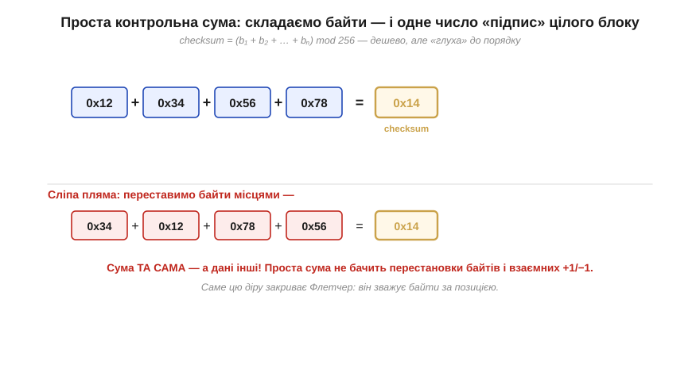
*Рис. 3.9.3.1. Проста сума: checksum = (b₁ + b₂ + … + bₙ) mod 256. Кілька байтів даних згортаються в одне число-«підпис». Це дешево й ловить багато помилок — але має характерну сліпу пляму: **перестановка** байтів. Переставивши байти місцями, ми лишаємо суму незмінною (додавання не залежить від порядку), тож проста сума цього не бачить; так само вона пропускає взаємні +1/−1 у різних байтах.*

Проста сума одразу сильніша за парність: вона реагує не лише на парність одиниць, а на саме **значення** кожного байта, тож ловить більшість одиночних і багатьох кратних помилок. Та в неї є фундаментальна вада, що випливає з самої природи додавання: **сума не залежить від порядку доданків**. Переставте байти місцями — сума не зміниться. Зіпсуйте один байт на +1, а інший на −1 — сума теж лишиться тією самою. Для пакетних завад і збоїв, що б'ють по структурі повідомлення, це серйозна діра: дані інші, а підпис той самий.

Є в простому обрізанні суми за модулем і друга, тонша слабкість: відкидаючи старші біти переносу, ми **викидаємо інформацію**. Перенос, що «вилетів» за межі байта, ніяк не впливає на результат — а отже, дві різні послідовності байтів, що дають однакові молодші вісім бітів суми, для детектора нерозрізненні. Цю діру частково латає прийом, який стоїть в основі **інтернет-суми** (*Internet checksum*) протоколів IP, TCP і UDP: замість викидати перенос, його **завертають назад** і додають до молодших розрядів (так званий *end-around carry*). Тоді жоден біт суми не пропадає даремно, а сама сума бере доповняльний (*one's complement*) вигляд. Сума така ж дешева, рахується на будь-якому процесорі за кілька інструкцій — але ловить трохи більше, бо не марнує переносу. Це гарний приклад того, що навіть у «простій сумі» є над чим подумати: **який саме** різновид суми взяти, залежить від того, які помилки треба зловити.

### Флетчер: друга сума запам'ятовує позицію

Цю діру елегантно закриває **контрольна сума Флетчера** (*Fletcher checksum*), названа на честь Джона Флетчера, який запропонував її 1982 року. Ідея — додати **другу** суму, яка накопичує не самі байти, а **поточне значення першої суми** на кожному кроці. Завдяки цьому внесок кожного байта в другу суму **залежить від його позиції**: ранній байт додається до другої суми багато разів (на кожному наступному кроці), пізній — лише раз.

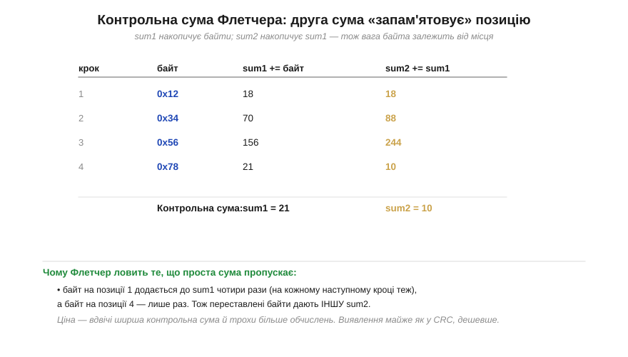
*Рис. 3.9.3.2. Флетчер тримає дві суми. На кожному кроці sum1 += байт (звичайна сума), а sum2 += sum1 (накопичує суму сум). Через це байт на ранній позиції потрапляє в sum2 стільки разів, скільки кроків лишилося до кінця, а байт на пізній — лише раз. Отже, переставлені байти дають **іншу** sum2 — саме те, чого проста сума не бачила. Ціна — вдвічі ширший підпис і трохи більше обчислень; виявлення натомість майже як у CRC.*

Чому ця нехитра добавка така дієва, видно з того, **скільки разів** кожен байт впливає на фінальний результат. У простій сумі всі байти рівноправні — кожен додається рівно один раз, тому порядок і губиться. У Флетчера ж байт на першій позиції встигає підсумуватися в sum2 на кожному з наступних кроків, а останній байт — лише наприкінці. Позиція стала **вагою**. Тому перестановка байтів, узаємні +1/−1, зсуви — усе, що проста сума пропускала, тепер змінює sum2 і виявляється. По суті, Флетчер за малу ціну наближається до виявної сили CRC, лишаючись при цьому звичайним додаванням, яке легко написати кількома рядками без жодних таблиць.

**Приклад (Флетчер крок за кроком).** Порахуймо контрольну суму Флетчера для чотирьох байтів `0x12 0x34 0x56 0x78` (модуль 255).

```
старт:  sum1 = 0   sum2 = 0
байт 0x12:  sum1 = 0+18  = 18    sum2 = 0+18   = 18
байт 0x34:  sum1 = 18+52 = 70    sum2 = 18+70  = 88
байт 0x56:  sum1 = 70+86 = 156   sum2 = 88+156 = 244
байт 0x78:  sum1 = 156+120 = 276 mod 255 = 21
                                  sum2 = 244+21 = 265 mod 255 = 10
контрольна сума:  sum1 = 21   sum2 = 10   →  два байти підпису

переставимо перші два байти: 0x34 0x12 0x56 0x78
  sum1 буде та сама (21), а sum2 зміниться (52 додасться раніше й внесеться більше разів)
  → Флетчер бачить перестановку, проста сума — ні.
```
Друга сума «зважує» байти за позицією, тому ловить перестановки, яких проста сума не помічає.

Дрібна деталь у прикладі — модуль **255**, а не звичні 256 — не випадкова. Якби ми брали суму за модулем 256, нульовий байт даних взагалі ніяк не впливав би на sum2 у певних позиціях, і код мав би сліпі плями до нулів. Модуль 255 (тобто 2⁸−1) цього уникає й робить розподіл значень рівномірнішим. Це знов та сама думка: контрольна сума здається елементарною, та її якість ховається в дрібницях — який модуль, чи завертати перенос, скільки сум тримати. Саме тому варто брати **перевірені часом** варіанти (інтернет-сума, Флетчер, Adler-32), а не винаходити власну «просто суму», яка легко виявиться сліпою там, де найменше очікуєш.

> 🔧 **Навіщо це.** Контрольні суми — робоча конячка там, де потрібне **дешеве й надійне виявлення без апаратної підтримки**. Класичний приклад — **інтернет-протоколи**: заголовки IP, TCP, UDP захищені простою (256-доповняльною) сумою, яку легко порахувати на будь-якому процесорі. Флетчер і споріднена з ним **Adler-32** стоять там, де хочеться сильнішого виявлення, ніж проста сума, але без витрат на CRC, — наприклад, у деяких форматах стиснення та легких протоколах. Практичне правило: якщо у вас є **апаратний CRC** (а в багатьох мікроконтролерах він є — §3.9.4), беріть його; якщо ж порахувати треба чисто програмно й дешево, контрольна сума Флетчера дає майже ту саму силу за частку зусиль.

> ⚙️ **Поряд — алгоритмічна вставка:** *Контрольні суми на практиці* — як саме рахується інтернет-сума (з її доповняльним «згортанням переносу») і Флетчер у коді, з готовими функціями й типовими граблями на кшталт переповнення акумулятора.

Варто чітко окреслити, **що** контрольна сума ловить, а що — ні, бо саме ця межа штовхне нас далі. На свою користь сума бере багато: будь-яку поодиноку помилку в байті, більшість випадкових кратних помилок, а Флетчер — ще й перестановки та зсуви. Проти неї лишаються два класи. Перший — рідкісні «щасливі» збіги, коли кілька помилок взаємно компенсуються в сумі (для простої суми це особливо легко — згадаймо +1 в одному байті й −1 в іншому). Другий, важливіший, — **довгі пакетні** помилки: коли завада псує великий суцільний шматок даних, ймовірність того, що понівечена сума випадково збіжиться зі справжньою, перестає бути зовсім мізерною.

Ось де проходить межа цілого підходу «складати числа»: контрольна сума — велике поліпшення проти одного біта парності, та для дротів і радіо, де пакети — звична річ, її «майже надійно» вже замало. Вона незамінна там, де канал спокійний, а заліза для кращого коду нема; але коли треба **гарантовано** ловити пакети, потрібен якісно інший інструмент. Щоб виявлення стало майже непробивним, інженерія перейшла від додавання до зовсім іншої математичної операції — **ділення**. Так з'явився **CRC**, найпоширеніший код виявлення у всій техніці.

---

Підсумок §3.9.3: контрольна сума згортає блок у ціле **число-підпис**, чутливіше за один біт парності. Найпростіша — **сума байтів** за модулем; вона ловить багато помилок, але сліпа до **перестановки** байтів і взаємних +1/−1, бо додавання не залежить від порядку. **Флетчер** додає другу суму, що накопичує першу, тож внесок байта залежить від його **позиції** — це закриває діру з перестановкою й майже дотягується до сили CRC за малу ціну. Контрольні суми ідеальні для дешевого програмного виявлення (інтернет-заголовки, легкі формати). Та для майже непробивного виявлення, надто проти пакетів, потрібна сильніша математика — ділення на многочлен, тобто CRC.

---

## 3.9.4 CRC: чому він скрізь

Контрольні суми показали межу підходу «складати числа»: хоч як його вдосконалюй, лишаються комбінації помилок, що дають ту саму суму. Щоб виявлення стало майже непробивним, потрібна операція, у якій помилка **майже завжди** лишає слід, — і такою операцією виявилося **ділення**. Код, побудований на діленні, називають **CRC** — *cyclic redundancy check*, циклічний надлишковий код, — і він заслужено став найпоширенішим кодом виявлення в усій цифровій техніці: від кадру в машині до пакета в інтернеті. Цей підрозділ пояснює його ідею (без зайвої алгебри), показує, чому він такий дешевий у залізі, і чому опинився буквально скрізь.

### Дані як одне велике число, поділене на дільник

Серце CRC — несподіваний погляд на дані: уявімо весь блок як одне **дуже довге двійкове число**. Що, як поділити це число на якийсь наперед домовлений **дільник** і взяти **остачу**? Остача від ділення дуже чутлива до будь-якої зміни діленого: змініть один біт — і остача майже напевно стане іншою. Цю остачу й беруть за контрольний код. Дільник у теорії CRC прийнято називати **поліномом** (*polynomial*, бо біти числа зручно трактувати як коефіцієнти многочлена), а сам CRC — остачею від ділення на цей поліном.

Є лише одна тонкість, через яку CRC рахується інакше, ніж шкільне ділення: арифметику беруть **без переносів**. Віднімання на кожному кроці ділення замінюють на **XOR** — те саме «виключне АБО» з §3.2.4. Це робить ділення оборотним і чистим: жодних позик, жодних переносів, лише побітовий XOR там, де старший біт поточного залишку дорівнює 1.

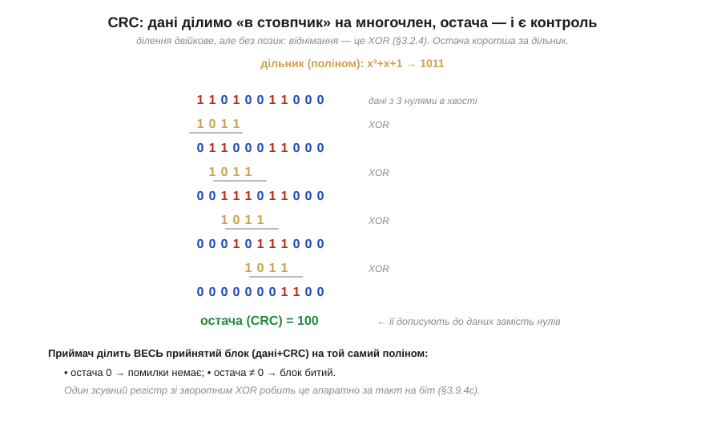
*Рис. 3.9.4.1. CRC — це ділення «в стовпчик», де віднімання замінено на XOR. Дані доповнюють нулями (стільки, скільки бітів у CRC) і ділять на поліном; на кожному кроці, де старший біт збігається, роблять XOR із поліномом і зсуваються далі. **Остача** коротша за поліном — це і є CRC, яку дописують до даних замість нулів. Приймач ділить увесь прийнятий блок (дані + CRC) на той самий поліном: остача 0 означає «помилки немає», остача ≠ 0 — «блок битий».*

> 🧮 **Поряд — математична вставка:** *Математика CRC* — чому ця арифметика без переносів називається полем GF(2), де XOR водночас і додавання, і віднімання, і чому ділення многочленів над цим полем виявляє помилки так надійно. Якщо хочеться зрозуміти CRC «до дна», ця вставка — туди.

Перевірка на приймачі влаштована красиво й симетрично. Передавач дописав остачу так, щоб **весь** блок (дані разом із CRC) націло ділився на поліном. Тому приймачеві досить поділити **весь прийнятий блок** на той самий поліном і глянути на остачу: якщо вона **нуль**, блок цілий; якщо **не нуль**, десь сталася помилка. Приймачеві навіть не треба окремо порівнювати CRC — сам факт нульової остачі підтверджує цілісність.

### Чому CRC такий дешевий у залізі

Якби CRC доводилося рахувати «довгим діленням» у програмі, він був би повільним. Та вся краса в тім, що це ділення ідеально лягає на **зсувний регістр зі зворотним зв'язком** (*linear-feedback shift register*, LFSR) — побратима тих регістрів, що ми будували в Розділі 3.3. Біти даних «вливаються» по одному, регістр на кожен такт зсувається, а в кількох точках стоять XOR-«крани» — рівно там, де в поліномі одиниці.

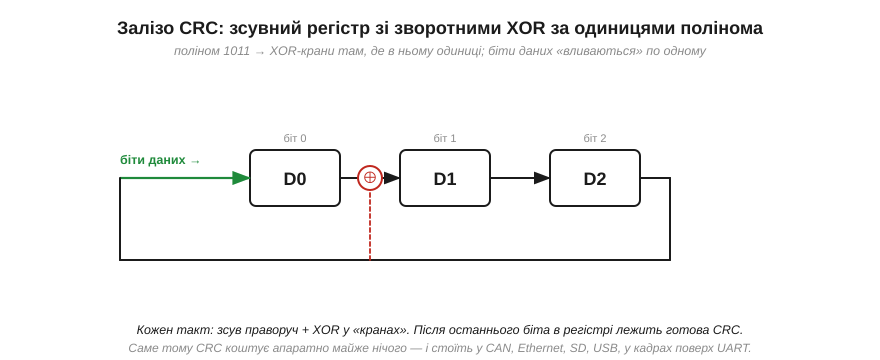
*Рис. 3.9.4.2. Апаратний CRC — це зсувний регістр із XOR-«кранами» в позиціях, де поліном має одиниці. Біти даних вливаються по одному; щотакту регістр зсувається, а зворотний зв'язок із виходу через XOR-крани підмішується назад. Після останнього біта в регістрі лежить готова остача — CRC. Уся схема — кілька тригерів і кілька вентилів XOR, тож рахує один біт за такт майже задарма. Саме ця дешевизна й зробила CRC всюдисущим.*

Ось чому CRC не просто потужний, а ще й практично **безкоштовний** там, де його вбудували в залізо: жменя тригерів і вентилів обробляє потік на повній швидкості шини, не забираючи в процесора жодного такту. А там, де апаратного блоку нема, той самий алгоритм рахується програмно — або «в лоб» бітовим циклом, або швидко за наперед порахованою **таблицею**.

> ⚙️ **Поряд — алгоритмічна вставка:** *CRC у коді* — повільний, але наочний бітовий цикл; швидка таблична версія; і як вибрати ширину й поліном (CRC-8/16/32) під свій канал, не винаходячи власного.

> 🔌 **Поряд — компонентна вставка:** *Апаратний CRC* — як виглядає CRC-блок у типовому мікроконтролері (STM32-клас) і де CRC заховано всередині SD- та CAN-контролерів, щоб ви не рахували його руками.

### Чому він буквально скрізь

Поєднання трьох якостей — сильне виявлення (надто пакетів), дешеве залізо й проста програмна реалізація — зробило CRC стандартом де тільки можна. Варто глянути, **де** саме він живе, щоб відчути масштаб.

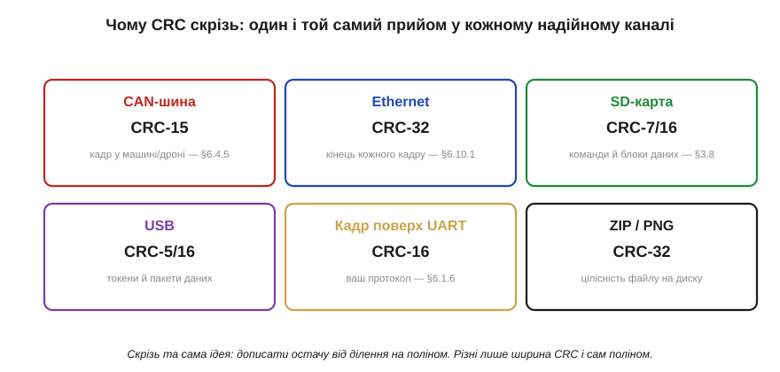
*Рис. 3.9.4.3. CRC скрізь, де треба надійне виявлення. CAN-шина в машині й дроні захищає кадр CRC-15; кожен кадр Ethernet несе CRC-32 у хвості; SD-карта боронить команди й блоки даних CRC-7/16; USB перевіряє токени й пакети; ваш власний кадр поверх UART зазвичай закривають CRC-16; навіть файли ZIP і PNG тримають CRC-32 для цілісності на диску. Скрізь та сама ідея — дописати остачу від ділення на поліном; різняться лише ширина CRC і сам поліном.*

Ця всюдисущість не випадкова — вона логічно випливає з того, **які** помилки трапляються в реальних каналах. Завади на дроті й у радіо часто приходять **пакетами** (короткий сплеск шуму перекидає кілька сусідніх бітів за раз), а CRC надзвичайно добрий саме проти пакетів: CRC-*n* гарантовано ловить будь-який пакет помилок завдовжки до *n* бітів і пропускає решту з мізерною ймовірністю близько 2⁻ⁿ. Для CRC-32 це приблизно один пропущений битий кадр на чотири мільярди — практично ніколи. Тому щоразу, коли інженерам потрібне було надійне «чи дійшов кадр цілим», відповідь майже завжди була одна: CRC.

**Приклад (мала CRC вручну).** Порахуймо 3-бітну CRC для даних `1101` з поліномом `1011` (тобто x³+x+1), щоб побачити механізм цілком.

```
дані 1101, дописуємо 3 нулі (ширина CRC): 1101 000

  1101000
⊕ 1011            (XOR, бо старший біт = 1)
  -------
  0110000
⊕  1011
  -------
  0011000
⊕   1011
  -------
  0000100  →  старші біти вже 0, лишилась остача в трьох молодших
остача (CRC) = 100

передаємо: 1101 100   (дані + CRC)
приймач ділить 1101100 на 1011 → остача 000 → блок цілий ✓
```
Остача 100 — це CRC; приймач ділить увесь блок на той самий поліном і за нульовою остачею впевнюється, що помилки немає.

### Не всякий поліном однаково добрий

Тут природно постає питання: якщо CRC — це ділення на поліном, то **який** поліном брати? Виявляється, від цього вибору залежить дуже багато, і саме тому в стандартах фігурують конкретні, освячені роками поліноми, а не перші-ліпші. Вдало дібраний поліном гарантує: код зловить **будь-яку** одиничну й подвійну помилку, будь-яке **непарне** їх число, будь-який **пакет** завдовжки до ширини CRC, а ще — переважну більшість довших пакетів. Невдалий поліном може мати прикрі сліпі плями, пропускаючи цілі класи типових помилок. Дослідники десятиліттями рахували й перевіряли поліноми на мільярдах випадків, і результат цієї праці — короткий список «золотих» поліномів (CRC-8, CRC-16-CCITT, CRC-32 та інші), які й стоять у стандартах. Звідси перше практичне правило: **не вигадуйте свій поліном** — візьміть перевірений під потрібну ширину.

А від чого залежить сама **ширина** — чому десь 8 бітів, а десь аж 32? Від двох речей: довжини блоку й ціни пропуску. Що довший кадр, то більше в ньому можливих помилок, і то більшої CRC треба, щоб тримати ймовірність пропуску низькою. І що дорожча помилка, то ширший код беруть про запас. Тому короткі команди SD-карти боронить CRC-7, кадр поверх UART зазвичай CRC-16, а великий кадр Ethernet — аж CRC-32: один пропущений битий кадр на чотири мільярди для нього прийнятний, а от CRC-8 на такому обсязі пропускав би забагато. Ширина CRC — це прямий обмін: більше бітів контролю означає менше пропусків, але й більше накладних витрат на кожен кадр.

Є й третя тонкість, об яку спотикається кожен, хто вперше звіряє свою CRC зі «стандартною» і дістає інше число. Реальні CRC, крім полінома, задають ще **початкове значення** регістра (часто не нуль, а всі одиниці), іноді **відбивають** (реверсують) порядок бітів на вході й виході, а наприкінці **інвертують** результат фінальним XOR. Усе це — не примха, а захист від конкретних слабкостей «голого» ділення (наприклад, нульовий старт не помічав би доданих на початку нулів). Практичний висновок простий: CRC задається **не лише поліномом**, а цілим набором параметрів, і щоб два кінці зійшлися, вони мусять збігтися в усьому. Тому беруть **іменований** стандарт цілком (скажімо, «CRC-16/CCITT-FALSE»), а не лише його поліном.

> 🔧 **Навіщо це.** Ці деталі рятують години налагодження. Перше: **не винаходьте власний CRC** — для будь-якої ширини є перевірені стандартні поліноми з відомими гарантіями; самопальний легко матиме сліпу пляму. Друге: **ширину** беріть під довжину кадру й ціну помилки — CRC-8 для короткого, CRC-16 для звичайного, CRC-32 для великого чи критичного. Третє, найчастіша пастка: якщо ваша порахована CRC не збігається з еталоном чи з іншим пристроєм — майже завжди річ у **параметрах** (початкове значення, відбиття бітів, фінальний XOR), а не в поліномі; звіряйте повний іменований профіль CRC, а не саму формулу ділення.

CRC дає виявлення, близьке до ідеального, і робить це дешево — недарма він став стандартом галузі. Та зверніть увагу: усе, що він уміє, — це сказати «**щось** зіпсовано», після чого кадр доводиться **перепитувати**. Доти ми взагалі лишалися у світі **виявлення**: помітити помилку й попросити повтор. Але повтор не завжди можливий — у пам'яті комп'ютера, на поверхні диска, у сигналі з далекого космосу перепитати ніде й нема в кого. Там потрібне дещо сильніше: не лише помітити помилку, а **виправити** її на місці. Щоб зрозуміти, як це взагалі можливо, треба спершу опанувати геометрію кодів — **відстань Геммінга**.

---

Підсумок §3.9.4: **CRC** дивиться на дані як на одне велике число й бере **остачу від ділення** на домовлений поліном, причому віднімання в цьому діленні — це **XOR** (§3.2.4). Приймач ділить увесь блок (дані + CRC) на той самий поліном: нульова остача означає цілість. CRC дешевий у залізі (зсувний регістр із XOR-кранами рахує біт за такт) і простий у коді (бітовий цикл або таблиця), а головне — **чудово ловить пакетні помилки**: CRC-*n* бере будь-який пакет до *n* бітів і пропускає решту з імовірністю ~2⁻ⁿ. Тому він буквально всюди — CAN, Ethernet, SD, USB, кадри поверх UART, файли. Та CRC лише **виявляє**: далі кадр перепитують. Коли перепитати ніде (пам'ять, диск, космос), потрібне **виправлення**, а до нього веде геометрія кодів.

---

## 3.9.5 Відстань Геммінга: скільки помилок видно, а скільки виправно

CRC довів виявлення майже до досконалості, але вперся в стіну: помітивши помилку, він може лише попросити повтор, а повтор доступний не завжди. Як же **виправити** помилку, не перепитуючи, — маючи на руках самі лише (можливо, зіпсовані) біти? Відповідь на це питання — не трюк, а **геометрія**. Виявлення й виправлення стають наочними, щойно ми навчимося міряти, наскільки два бітові слова «далеко» одне від одного. Ця міра зветься **відстанню Геммінга** (*Hamming distance*), і вона — фундамент усієї другої половини розділу.

### Відстань як кількість різних бітів

Означення Геммінгової відстані гранично просте: це **кількість позицій, у яких два слова однакової довжини різняться**. Слова `1011` і `1001` різняться в одній позиції — відстань 1. Слова `1011` і `0010` різняться у двох — відстань 2. Щоб порахувати її, досить узяти XOR двох слів і полічити одиниці в результаті: кожна одиниця — це позиція розбіжності.

Перш ніж рушити до геометрії, варто помітити одну спільну рису всіх кодів, що ми вже бачили, — вона прояснить, що означає «дозволене слово». Парність, контрольна сума, CRC влаштовані однаково: вони лишають дані **недоторканими** й **дописують** до них контрольні біти (один біт парності, байт суми, остачу CRC). Такі коди звуть **систематичними** (*systematic*): корисні дані видно в кодовому слові без розшифрування, а надлишок просто додано поруч. «Дозволене слово» в систематичному коді — це будь-які дані разом із **правильно** порахованим для них контролем; «заборонене» — це коли контроль не відповідає даним. Геммінг (§3.9.6), щоправда, перемішає дані й парності місцями, але суть лишиться та сама: серед усіх можливих бітових слів дозволені — лише ті, де надлишок узгоджений із даними, а помилка цю узгодженість руйнує. Тримаючи це в голові, перейдімо до геометрії — вона показує, **наскільки далеко** одне від одного сидять ці узгоджені слова.

Найкраще відстань відчути **геометрично**. Уявімо всі можливі слова заданої довжини як вершини багатовимірного куба: для трьох бітів це звичайний куб, де кожна з восьми вершин — одне зі слів від `000` до `111`, а ребро з'єднує слова, що різняться рівно одним бітом.

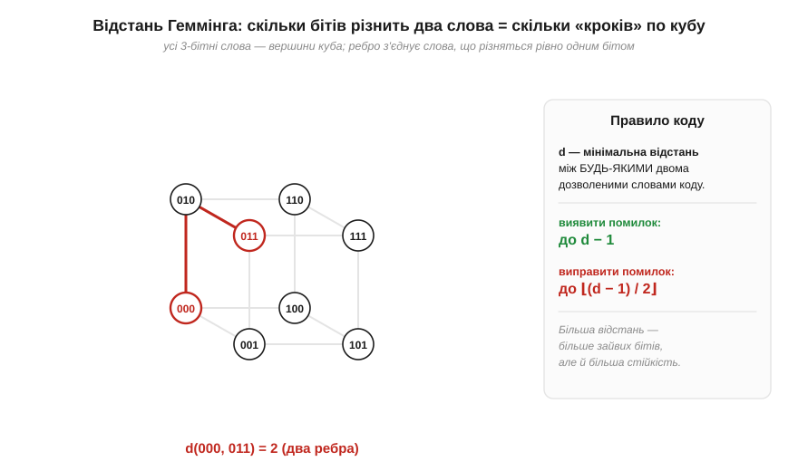
*Рис. 3.9.5.1. Усі 3-бітні слова — вершини куба; ребро з'єднує слова, що різняться одним бітом. Відстань Геммінга між двома словами — це найменша кількість ребер, якими треба пройти від одного до іншого: d(000, 011) = 2 (два кроки). Помилка в одному біті — це крок по одному ребру. Праворуч — головне правило коду: за **мінімальною** відстанню d між дозволеними словами визначається, скільки помилок код **виявить** (до d−1) і скільки **виправить** (до ⌊(d−1)/2⌋).*

У цій картині перевернутий біт — це просто **крок по ребру**: помилка зсуває нас із поточної вершини в сусідню. Дві помилки — два кроки, і так далі. Тому «скільки помилок сталося» — це буквально «на яку Геммінгову відстань нас віднесло від правильного слова». Уся теорія виправлення тепер зводиться до питання: як розкласти **дозволені** слова коду по цьому кубі так, щоб помилка не змогла непомітно перекинути одне дозволене слово в інше.

### Найпростіший виправний код: потрійне повторення

Щоб ця абстракція ожила, розгляньмо найгрубіший можливий код — **потрійне повторення** (*triple repetition*): кожен біт даних передаємо **тричі**. Біт 0 стає словом `000`, біт 1 — словом `111`. Дозволених слів лише два — `000` і `111`, — і вони сидять у **протилежних** кутах нашого куба, на відстані d = 3 одне від одного. Усі інші шість вершин — заборонені.

Тепер видно, як ця відстань перетворюється на виправлення. Хай ми передали `111`, а в каналі перевернувся один біт — приймач отримав, скажімо, `101`. Це слово заборонене, тож помилку **видно**. Але можна й більше: `101` відрізняється від `111` на один біт, а від `000` — на два, тобто воно **ближче** до `111`. За правилом «обираємо найближче дозволене слово» приймач відновлює `111` — і **виправляє** помилку, навіть не перепитуючи. Голосування «більшістю з трьох» — це той самий пошук найближчого кодового слова, лише сказаний простими словами: який біт трапився двічі, той і вважаємо правдою.

**Приклад (потрійне повторення виправляє один біт).** Простежмо передачу одного біта даних = 1.

```
дані = 1   →   передаємо кодове слово 111

канал перевернув середній біт:  приймач отримав 1 0 1

відстані до дозволених слів:
  d(101, 111) = 1   (різниться 1 біт)
  d(101, 000) = 2   (різниться 2 біти)
найближче → 111   →   відновлене дане = 1  ✓ (помилку виправлено)

а якби перевернулися ДВА біти: 1→ 0 0 1
  d(001, 000) = 1,  d(001, 111) = 2  → найближче 000 → дане «0»  ✗
  (два збої в трьох бітах код уже не подужав — це його межа)
```
Один биток повторення виправляє голосуванням більшості; два — переголосовують правду, і код помиляється. Саме це й означає d = 3: виправити можна ⌊(3−1)/2⌋ = 1 помилку.

Цей код наочний, але страшенно **марнотратний**: на один корисний біт припадає два зайвих — надлишок 200%, корисна частка лише третина. Тримати d = 3 можна **набагато** дешевше, ніж потроюючи кожен біт, — і саме це зробить код Геммінга (§3.9.6), діставши ту саму здатність виправити один біт лише за три біти парності на чотири біти даних. Повторення ж лишається корисним як **гранична інтуїція**: воно показує зв'язок «відстань → голосування → виправлення» у найчистішому вигляді.

### Мінімальна відстань коду вирішує все

Потрійне повторення підказало загальний принцип, який тепер сформулюймо точно. Код — це набір **дозволених** слів (їх звуть **кодовими словами**, *codewords*), розкиданих серед усіх можливих комбінацій; решта слів заборонені, і, побачивши заборонене, приймач знає про помилку. У повторенні дозволених слів було лише два, на відстані d = 3, — і саме ця відстань дала виправлення. Узагальнімо: силу будь-якого коду визначає одна-єдина величина — **мінімальна відстань** *d*, найменша Геммінгова відстань між будь-якими двома кодовими словами. Що більша *d*, то «далі» розсаджені дозволені слова й то важче помилці перекинути одне в інше.

Із цього прямо випливають дві формули, які варто запам'ятати раз і назавжди. Щоб **виявити** помилку, достатньо, аби зіпсоване слово не співпало з іншим дозволеним; це гарантовано, поки помилок не більше за **d − 1**. Щоб **виправити** помилку, треба, щоб зіпсоване слово лишилося ближчим до свого правильного, ніж до будь-якого чужого; це досягається, поки помилок не більше за **⌊(d − 1) / 2⌋**. Виправлення вимагає вдвічі більшої відстані, ніж виявлення, — бо виправити означає не лише помітити зсув, а й упевнено вказати, **звідки** він стався.

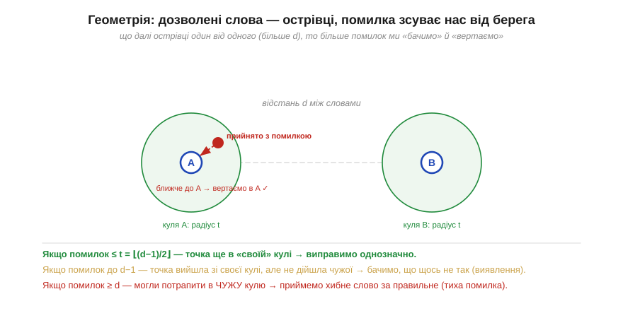
*Рис. 3.9.5.2. Геометрія виявлення й виправлення. Навколо кожного кодового слова уявімо «кулю» радіуса t = ⌊(d−1)/2⌋ — усі слова, що відрізняються не більш як на t бітів. Якщо помилок ≤ t, прийняте слово лишається у **своїй** кулі → виправляємо однозначно, повертаючи в центр. Якщо помилок аж до d−1, слово вийшло зі своєї кулі, але не дійшло чужої → бачимо, що щось не так (виявлення без виправлення). Якщо помилок ≥ d, можемо потрапити в **чужу** кулю → приймемо хибне слово за правильне (тиха помилка). Тому більша d коштує зайвих бітів, але дає більшу стійкість.*

Ця картина «куль навколо острівців» — суть усього виправлення помилок. Виправити помилку означає: побачивши прийняте (можливо, зіпсоване) слово, **знайти найближче** до нього дозволене кодове слово й оголосити його істинним. Поки помилок мало, прийняте слово лишається в кулі свого справжнього сусіда — і ми вгадуємо правильно. Щойно помилок забагато, ми можемо опинитися ближче до чужого острівця — і впевнено «виправити» дані на хибні, навіть не здогадуючись про це. Тому в кодів є чесна **межа**: вони не всемогутні, а гарантують виправлення лише до свого t — і це фундаментальна властивість, а не недоробка.

> 🧮 **Поряд — математична вставка:** *Відстань Геммінга формально* — як ці «кулі» означуються строго, звідки беруться межі на кількість кодових слів (межа Геммінга) і яка справжня **ціна** надлишковості: скільки зайвих бітів треба доплатити за кожен додатковий виправлений біт помилки.

> 🔧 **Навіщо це.** Відстань Геммінга — це лінза, крізь яку інженер дивиться на **будь-який** код. Перше практичне: коли в даташиті чи стандарті пишуть «код виправляє t помилок і виявляє d−1», за цим стоїть рівно ця геометрія — мінімальна відстань між кодовими словами. Друге: вона пояснює неминучий **компроміс** — більша стійкість (більша d) завжди означає більше зайвих бітів, тобто нижчу корисну швидкість; безкоштовної надійності не буває, і відстань Геммінга показує точний обмінний курс. Третє, найважливіше для проєктування: код треба підбирати під **очікувану кількість і характер помилок** у вашому каналі — слабкий код пропустить забагато, а надмірно сильний з'їсть пропускну здатність даремно. Саме цей розрахунок ми зведемо докупи в §3.9.9.

Тепер, коли ми бачимо геометрію — кодові слова як острівці, помилки як кроки, виправлення як пошук найближчого острівця, — лишилося побудувати **конкретний** код, що справді виправляє. Найпростіший і найнаочніший із них — той самий, з якого почалася ціла галузь: код Геммінга (7,4), де три біти парності розставлені так хитро, що самі вказують на номер зіпсованого біта.

---

Підсумок §3.9.5: **відстань Геммінга** — кількість позицій, у яких різняться два слова (XOR і підрахунок одиниць). Геометрично слова — вершини куба, помилка — крок по ребру, а код — набір **дозволених** слів (кодових), розсаджених по кубу. Усе вирішує **мінімальна відстань** d між кодовими словами: код **виявляє** до **d − 1** помилок і **виправляє** до **⌊(d − 1)/2⌋**. Наочно це «кулі» радіуса t навколо острівців-кодів: помилка в межах кулі виправна, далі — лише виявна, а зовсім далеко — веде до тихої хибної «корекції». Більша d коштує більше зайвих бітів — це точний обмін надійності на швидкість. Озброївшись цією геометрією, будуємо перший виправний код — Геммінга (7,4).

---

## 3.9.6 Код Геммінга (7,4): виправляємо один біт на пальцях

Геометрія §3.9.5 пообіцяла, що виправлення можливе, якщо розсадити кодові слова на достатній відстані. Тепер виконаймо цю обіцянку на найпростішому реальному прикладі — **коді Геммінга (7,4)**. Числа в дужках кажуть усе: **7** бітів у слові, з них **4** — корисні дані, а решта **3** — біти парності. Цей код має мінімальну відстань d = 3, а отже (за формулами §3.9.5) **виправляє один** перевернутий біт. І найкраще — він робить це так прозоро, що декодування можна провести **на пальцях**, без жодної таблиці: три перевірки парності самі складуться в **номер** зіпсованого біта.

### Розкладка: парності на степенях двійки

Геніальність схеми Геммінга — у **розташуванні** бітів парності. Їх ставлять не в кінець, а на позиції, що є **степенями двійки**: 1, 2, 4. Дані заповнюють решту позицій — 3, 5, 6, 7. На перший погляд дивно ховати контрольні біти всередину даних; сенс цього стане ясний за мить.


*Рис. 3.9.6.1. Семибітне слово (7,4): біти парності P1, P2, P4 стоять на позиціях-степенях двійки (1, 2, 4), а дані D1…D4 — на решті (3, 5, 6, 7). Кожна парність перевіряє свій набір позицій: P1 — позиції 1,3,5,7; P2 — 2,3,6,7; P4 — 4,5,6,7. Ключ унизу: набори визначені **двійковим номером** позиції — P1 накриває всі позиції, де молодший біт номера = 1, P2 — де середній, P4 — де старший. Тому, як побачимо, три перевірки прямо вкажуть номер битого біта.*

Чому саме так розбиті набори? Подивіться на **двійковий запис номера** кожної позиції. Позиція 5 — це `101`, позиція 6 — `110`, позиція 3 — `011`. Парність P1 (позиція 1 = `001`) накриває всі позиції, у двійковому номері яких **молодший** біт дорівнює 1: це 1, 3, 5, 7. P2 (позиція 2 = `010`) накриває ті, де **середній** біт = 1: 2, 3, 6, 7. P4 (позиція 4 = `100`) — де **старший** біт = 1: 4, 5, 6, 7. Кожна парність відповідає одному розряду двійкового номера позиції. Запам'ятаймо це — звідси й береться вся магія декодування.

Кодування при такому розкладі прямолінійне: біти даних кладуть на свої місця, а кожен біт парності обчислюють як XOR тих позицій, які він накриває, щоб у кожному наборі одиниць було парне число. Три незалежні умови парності — три рівняння, які однозначно задають P1, P2, P4 за чотирма бітами даних.

### Чому саме три біти парності

Чому для семи позицій вистачає рівно **трьох** парностей — не двох і не чотирьох? Тут працює красивий рахунок, що прямо випливає з ідеї «синдром = адреса помилки». Синдром із k бітів парності може набути 2ᵏ різних значень. Одне з них (`000`) ми резервуємо під «помилки немає». Решта 2ᵏ−1 значень мають вказувати на конкретну зіпсовану позицію — отже, код може охопити щонайбільше 2ᵏ−1 позицій. Для трьох парностей це 2³−1 = **7** позицій — рівно стільки, скільки бітів у нашому слові. Усе сходиться без жодного зайвого біта: три парності дають сім ненульових синдромів, по одному на кожну з семи позицій.

Цей рахунок одразу підказує й інші розміри сімейства Геммінга. Чотири парності накрили б 2⁴−1 = 15 позицій — це код (15,11): 11 бітів даних під захистом 4 парностей. П'ять — код (31,26), і так далі. Що довше слово, то **вигіднішим** стає Геммінг: на (7,4) ми платимо 3 біти контролю на 4 дані (надлишок аж 75%), а на (15,11) — лише 4 на 11 (близько 36%), на (31,26) — і поготів. Звідси видно й межу ідеї: одна на слово виправна помилка коштує дедалі менше відносно даних, але виправляє код **усе одно лише один** биток на все слово, хай яке воно довге. Тому довгі слова Геммінга дешеві, та вразливіші до того, що в них трапиться **дві** помилки замість однієї, — і саме з цього компромісу виросте практичний вибір ширини слова в пам'яті (§3.9.7).

### Синдром, що називає номер помилки

Тепер — кульмінація, заради якої все будувалося. Приймач отримує сім бітів і **перераховує** всі три парності. Для кожної він питає: набір, який вона накриває, усе ще має парне число одиниць? Результат кожної перевірки — один біт: **0**, якщо парність сходиться, **1**, якщо ні. Три ці біти, виписані разом, утворюють **синдром** (*syndrome*) — і ось чудо: синдром, прочитаний як двійкове число, є **номером** зіпсованої позиції.


*Рис. 3.9.6.2. Виправлення на пальцях. Нехай у каналі перевернувся біт на позиції 5. Приймач рахує три парності: перевірка набору 4,5,6,7 не сходиться (→1), набору 2,3,6,7 — сходиться (→0), набору 1,3,5,7 — не сходиться (→1). Синдром = c4 c2 c1 = 101₂ = 5 — точно номер битої позиції! Перевертаємо біт на позиції 5 — слово виправлено. Синдром 000 означав би «помилки немає». Геніальність: перевірки самі складаються в **адресу** помилки.*

Чому синдром дає саме номер, тепер цілком зрозуміло з розкладки. Перевернутий біт на позиції 5 (`101`) псує парність кожного набору, що цю позицію накриває, — тобто наборів P1 (молодший біт номера 1) і P4 (старший біт 1), але не P2 (середній біт 0). Тож «не сходиться» спрацює саме в P1 і P4, даючи синдром `101` = 5. Інакше кажучи, кожна парність повідомляє один **двійковий розряд** номера зіпсованої позиції, а разом вони складають **повний номер**. Якщо ж помилки не було, усі три парності сходяться, синдром `000` — і це чесно означає «все ціле». Виправлення зводиться до тривіальної дії: прочитати синдром як число й перевернути біт на відповідній позиції.

**Приклад (повний цикл (7,4)).** Закодуймо чотири біти даних, внесімо одну помилку й виправмо її.

```
дані D1 D2 D3 D4 = 1 0 1 1   (на позиції 3,5,6,7)
обчислюємо парності (even):
  P1 = XOR позицій 3,5,6,7 = D1⊕D2⊕D4 = 1⊕0⊕1 = 0
  P2 = XOR позицій 3,6,7   = D1⊕D3⊕D4 = 1⊕1⊕1 = 1
  P4 = XOR позицій 5,6,7   = D2⊕D3⊕D4 = 0⊕1⊕1 = 0
кодове слово (поз.1..7):  P1 P2 D1 P4 D2 D3 D4 = 0 1 1 0 0 1 1

канал перевертає біт на позиції 5:  0 1 1 0 [1] 1 1

приймач рахує синдром:
  c1 = парність поз.1,3,5,7 = 0⊕1⊕1⊕1 = 1
  c2 = парність поз.2,3,6,7 = 1⊕1⊕1⊕1 = 0
  c4 = парність поз.4,5,6,7 = 0⊕1⊕1⊕1 = 1
синдром c4 c2 c1 = 101 = 5  →  перевертаємо біт на позиції 5
відновлене слово: 0 1 1 0 0 1 1  ✓  дані D1..D4 = 1 0 1 1 знову цілі
```
Три перевірки парності склали двійковий номер 5 — рівно ту позицію, де сталася помилка; перевернувши її, ми відновили дані без жодного перепиту.

### Один зайвий біт — і код навчається бачити подвійну помилку

У «голого» Геммінга є небезпечна тонкість, яку конче треба розуміти перед переходом до реального заліза. Він гарантовано виправляє **один** биток — а що, як їх трапиться **два**? Тоді синдром усе одно вийде ненульовим і вкаже на якусь позицію — але **не ту**. Код «виправить» зовсім не той біт, тобто внесе **третю** помилку, щиро вважаючи, що полагодив дані. Це найгірший сценарій із усіх — тиха хибна корекція, після якої зіпсовані дані виглядають цілими.

Рятунок напрочуд дешевий: додати **один** загальний біт парності на все слово. Він рахує парність **усіх** бітів разом і дозволяє відрізнити одиничну помилку від подвійної. Логіка така: одна помилка міняє і синдром Геммінга, і загальну парність; дві помилки міняють синдром, але загальну парність лишають **незмінною** (бо два перевороти її не зачіпають). Тож якщо синдром ненульовий, а загальна парність порушена — це одна помилка, її виправляємо; якщо синдром ненульовий, а загальна парність ціла — це дві помилки, виправити їх не можна, але ми **точно бачимо**, що дані биті, і чесно б'ємо тривогу. Такий розширений код звуть **SECDED** — *Single Error Correct, Double Error Detect* (виправити одну, виявити дві). Один доданий біт підняв мінімальну відстань із d = 3 до d = 4 — і саме SECDED, а не «голий» Геммінг, працює в пам'яті комп'ютерів, бо тиха подвійна помилка там неприпустима.

> 🔧 **Навіщо це.** Код Геммінга — це не лише історична віха, а й жива основа сучасного ECC. По-перше, на ньому зрозуміла **сама ідея виправлення**: надлишок, обчислений так, що його розбіжності складаються в **адресу** помилки. По-друге, його розширення **SECDED** — це фактично той код, що захищає **пам'ять серверів**, до якого ми перейдемо в наступній темі. По-третє, він задає правильні очікування: одиничний Геммінг виправляє **один** биток на слово — чудово проти рідких поодиноких збоїв, але безсилий проти пакета; саме тому для пам'яті слово роблять коротким, а для пакетних каналів беруть інші коди. Зрозумівши (7,4) до кінця, ви розумієте кістяк усього виправлення помилок.

> ⚙️ **Поряд — алгоритмічна вставка:** *Кодер і декодер Геммінга (7,4) у 30 рядків C* — компактна реалізація кодування й синдромного декодування, яку можна вставити в прошивку, щоб захистити критичні дані в пам'яті чи на лінії.

Код Геммінга показав, що один перевернутий біт можна виправити **на льоту**, без перепиту, — і зробив це так дешево й прозоро, що цей самий прийом сьогодні працює всередині комп'ютерної пам'яті. Саме туди ми й рушимо далі: подивимося, як SECDED-варіант Геммінга боронить оперативну пам'ять серверів, а сильніші коди тримають у формі Flash-накопичувачі, — і чому через цей захист модуль пам'яті стає на цілих вісім бітів ширшим.

---

Підсумок §3.9.6: **код Геммінга (7,4)** — перший і найпрозоріший виправний код: 4 біти даних + 3 біти парності, мінімальна відстань d = 3, тож **виправляє один** перевернутий біт. Уся хитрість — у розкладці: парності стоять на позиціях-**степенях двійки** (1, 2, 4), а кожна накриває ті позиції, у двійковому **номері** яких стоїть її розряд. Тому приймач, перерахувавши три парності, дістає **синдром** — двійкове число, що **прямо вказує номер** зіпсованого біта (а 000 означає «все ціле»); лишається перевернути цей біт. Цей самий механізм (часто розширений до SECDED) лежить в основі ECC-пам'яті. Поглянемо, як він і сильніші коди живуть у реальному залізі — RAM і Flash.

---

## 3.9.7 ECC у RAM і Flash

Код Геммінга з попередньої теми виглядав як навчальна вправа — сім бітів, один биток, синдром на пальцях. Та насправді цей самий механізм, ледь розширений, **захищає пам'ять, у якій зараз працює ця книга**. Коди виправлення, вбудовані в пам'ять, називають **ECC** (*error-correcting code*, код виправлення помилок), і вони стоять усюди, де перепитати дані ніде: у RAM, що тримає стан запущених програм, і у Flash, що зберігає все надовго. Ця тема показує ECC у живому залізі — і пояснює дрібну на вигляд, але промовисту деталь: чому модуль ECC-пам'яті на цілих вісім бітів **ширший** за звичайний.

### SECDED у серверній RAM: 64 + 8

Почнімо з оперативної пам'яті. Її комірки — крихітні конденсатори (Розділ 3.6, 3.8), і саме вони — улюблена мішень для тих самих частинок із §3.9.1: пролітаючи крізь кристал, протон чи нейтрон може вибити заряд і перевернути біт прямо в працюючій програмі. У звичайному комп'ютері це рідкість, з якою миряться. У сервері, що тримає десятки гігабайтів і не вимикається роками, такі збої стаються регулярно — і там пам'ять захищають кодом.

Стандартний код для RAM — **SECDED** (*Single Error Correct, Double Error Detect*): він **виправляє один** перевернутий біт і **виявляє два**. Це прямий нащадок Геммінга (7,4): той самий синдром, що вказує биту позицію, плюс один додатковий біт загальної парності, який дозволяє відрізнити одиничну помилку (виправну) від подвійної (лише виявної). Аби захистити стандартні **64 біти** даних, SECDED потребує **8** контрольних бітів — і саме тому шина ECC-пам'яті має ширину не 64, а **72** біти.


*Рис. 3.9.7.1. Чому ECC-модуль ширший. До кожних 64 бітів даних SECDED додає 8 контрольних бітів, тож слово на шині — 72 біти. Один перевернутий біт код **знаходить і виправляє на льоту** — програма нічого не помічає, лише лічильник виправлених помилок у системі тихо росте. Два перевернуті біти виправити вже не може, але **точно бачить**, що дані зіпсовано, і піднімає тривогу (зупинка чи перезапуск) — бо краще чесно впасти, ніж тихо віддати хибне число. Вісім зайвих бітів на 64 (≈12.5% пам'яті) — ціна за те, щоб поодинокий збій не валив сервер.*

У цій парі поведінок — уся філософія ECC. Одиничний збій (а він найімовірніший) виправляється **непомітно**: процесор отримує правильні дані, ніби нічого й не було, а система лише занотовує подію в лічильник «виправлених помилок» — за його зростанням адміністратор бачить, що модуль починає сипатися, ще до того, як той відмовить. Подвійний збій виправити не вийде, та SECDED його принаймні **виявляє** й не дає пам'яті тихо збрехати: система свідомо зупиняється або перезапускається. Це ключовий принцип надійних систем — **гучна відмова краща за тиху помилку**: впасти чесно безпечніше, ніж віддати правдоподібне, але неправильне число, на якому далі будуватимуться розрахунки.

Та SECDED виправляє лише **одну** помилку на слово — а отже, є прихована загроза: якщо в слові вже сидить один невиправлений збій і поряд із часом ляже **другий**, разом вони складуться в подвійну помилку, яку код уже не полагодить. Поодинокі збої, накопичуючись, перетворюються на невиправні. Щоб цього не сталося, серйозні системи застосовують **очищення пам'яті** (*memory scrubbing*): фоновий процес неспішно проходить усю RAM, читає кожне слово, дає ECC виправити поодинокий збій і записує **виправлене** значення назад. Так одиничні помилки прибираються, **не встигнувши** зустрітися й стати подвійними. Це наочний приклад того, що ECC — не пасивна наліпка, а активна стратегія: код не лише виправляє в момент читання, а й систематично «підмітає» пам'ять, тримаючи кількість збоїв у слові на безпечному рівні. Та сама ідея «не дай помилкам накопичитися» повернеться у Flash, де роль прибиральника грає перезапис зношених блоків.

> 🔌 **Поряд — компонентна вставка:** *Де ECC у вашому залізі* — як виглядають 72-бітні серверні модулі пам'яті (DIMM з дев'ятою мікросхемою), де ховається ECC у контролерах NAND і навіть у кеші деяких мікроконтролерів, і як перевірити, чи працює ECC у вашій системі.

### BCH у Flash: код як умова роботи

Якщо в RAM ECC — це страховка від рідкісних частинок, то у Flash-пам'яті він уже не страховка, а **умова самого існування**. Причина — у §3.9.1: комірки NAND **зношуються** з кожним стиранням і **течуть** із часом, тож биті помилки тут не виняткова подія, а постійний фон, що лише густішає в міру старіння накопичувача. Без сильного виправлення сучасна NAND була б непридатна для зберігання вже з перших тижнів.

Тому в NAND кожну сторінку даних супроводжує **запасна зона** (*spare area*) — додаткові байти, де лежить ECC. І код тут потрібен куди потужніший за Геммінга: замість «один биток на слово» він мусить виправляти **десятки** битих бітів на сектор. Для цього беруть **BCH** (за іменами Боуза, Рей-Чаудгурі й Хоквінгема) — узагальнення коду Геммінга, що виправляє **багато** помилок, — а в найновіших накопичувачах ще сильніший **LDPC**.

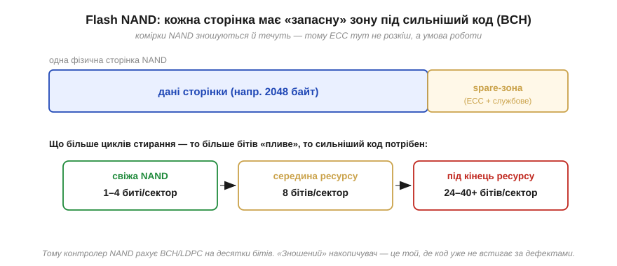
*Рис. 3.9.7.2. У NAND кожна сторінка даних має **запасну зону** під ECC і службові поля. Оскільки комірки зношуються й течуть, потрібен код, що росте разом із дефектами: свіжа NAND має 1–4 биті біти на сектор, до середини ресурсу — близько 8, а під кінець життя — десятки (24–40 і більше). Тому контролер рахує BCH чи LDPC на стільки бітів. «Зношений» накопичувач — це той, де код уже не встигає виправляти більше помилок, ніж народжується.*

Звідси випливає несподіване, але важливе розуміння того, що таке «смерть» Flash. Накопичувач відмовляє не тому, що комірки фізично розсипаються в пил, а тому, що кількість битих бітів на сектор **переростає** виправну спроможність коду. Поки ECC встигає виправляти більше помилок, ніж народжується, дані цілі; щойно дефектів стає більше за поріг коду — сектор оголошують непридатним і виводять з ужитку. Отже, ресурс Flash — це, по суті, **гонитва між зносом і кодом**: виробник підбирає силу ECC так, щоб накопичувач прожив обіцяну кількість циклів, перш ніж код «захлинеться».

Скільки ж пам'яті з'їдає весь цей захист? Корисно прикинути, і результат повчальний: накладні витрати ECC **падають** із ростом блоку — рівно з тієї причини, яку ми вивели для Геммінга в §3.9.6 (синдром із k бітів накриває аж 2ᵏ−1 позицій).

**Приклад (скільки коштує ECC).** Порівняймо частку контрольних бітів для слова RAM і сектора NAND.

```
RAM, SECDED на 64 біти даних:
  контрольних бітів = 8   (бо 2⁷−1 = 127 ≥ 64+7, тобто 7 для Геммінга + 1 на DED → 8)
  надлишок = 8 / 64 = 12.5%   →  шина 72 біти замість 64

якби SECDED ставили на 8 біт даних (коротке слово):
  потрібно ще 5 контрольних → надлишок 5/8 ≈ 62%  (дорого!)
  висновок: ширше слово — дешевший ECC на біт даних

NAND, BCH «виправити 8 бітів» на сектор 512 байтів:
  контрольних ≈ 13 байтів у spare-зоні на 512 байтів даних
  надлишок ≈ 13 / 512 ≈ 2.5%   →  дешево навіть за сильного коду
```
Той самий принцип, що й у Геммінга: на довшому блоці кілька контрольних бітів «обслуговують» багато даних, тож відносна ціна виправлення падає.

> 🔧 **Навіщо це.** ECC впливає на ваші рішення, навіть якщо ви ніколи не пишете кодів виправлення самі. Перше: коли система **мусить** працювати безперервно й не має права на тиху помилку (сервер, промисловий контролер, апаратура в радіації), беріть пам'ять з **ECC** — це прямо купується ширшою шиною (72 біти замість 64) і дев'ятою мікросхемою на модулі. Друге: розуміння, що Flash живе на ECC, пояснює, чому накопичувачі мають **скінченний ресурс** і чому «зношена» пам'ять починає віддавати помилки лавиною — корисно знати, проєктуючи логування чи часті перезаписи у вбудованій системі. Третє: лічильники «виправлених/невиправних помилок», які віддає і ECC-RAM, і контролер Flash, — це безцінний **ранній сигнал** деградації; вони ростуть **до** того, як залізо відмовить, тож стежити за ними варто. ECC — це інженерія, що перетворює неминучі фізичні збої на керований, передбачуваний параметр.

ECC у RAM і Flash чудово справляється з тим, для чого створений, — з **поодинокими** збоями, розкиданими по пам'яті. Та згадаймо межу коду Геммінга й SECDED: вони виправляють лічені біти **на слово**. А що, як помилки приходять не поодинці, а суцільним **пакетом** — коли подряпина на диску чи завмирання радіосигналу нищать сотні сусідніх бітів за раз? Бітовий код тут безпорадний. Потрібен зовсім інший підхід — рахувати не бітами, а цілими **символами**; саме так влаштований Рід–Соломон, завдяки якому грає подряпаний CD і читається брудний QR.

---

Підсумок §3.9.7: **ECC** — це коди виправлення, вбудовані в пам'ять, де перепитати дані ніде. У RAM серверів працює **SECDED** — нащадок Геммінга, що **виправляє 1** біт і **виявляє 2**; щоб захистити 64 біти даних, він додає **8** контрольних, через що шина ECC-пам'яті ширша — **72** біти. Одиничний збій виправляється непомітно (лічильник тихо росте), подвійний — чесно зупиняє систему: **гучна відмова краща за тиху помилку**. У Flash NAND, де комірки зношуються й течуть, ECC уже не страховка, а умова роботи: кожна сторінка має **запасну зону** під потужний **BCH/LDPC**, що виправляє десятки бітів, а «смерть» накопичувача настає, коли дефекти переростають силу коду. І RAM, і Flash віддають лічильники помилок — ранній сигнал деградації. Та всі ці коди б'ються з **поодинокими** збоями; проти **пакетів** потрібен символьний підхід — Рід–Соломон.

---

## 3.9.8 Рід–Соломон якісно: символи замість бітів

Усі коди, що ми будували досі, рахували **окремими бітами**: парність дивилася на одиниці, Геммінг виправляв один биток, SECDED — теж один на слово. Це чудово, поки помилки **розкидані поодинці**. Але реальний світ часто завдає удару інакше — **пакетом**: подряпина на компакт-диску стирає тисячі сусідніх бітів поспіль, завмирання радіосигналу гасить цілий шматок кадру, бруд закриває куток QR-коду. Бітовий код тут безсилий: сотня помилок поспіль — це далеко за межею будь-якого Геммінга. Потрібен принципово інший погляд, і його дав **код Рід–Соломона** (*Reed–Solomon*, RS): рахувати не бітами, а цілими **символами** — групами бітів. Ця одна зміна перетворює пакетну помилку з катастрофи на дрібницю, і саме завдяки їй грає подряпаний диск і читається брудний QR.

### Один символ — група бітів

Суть Рід–Соломона можна вхопити без жодної алгебри, якщо правильно змінити одиницю обліку. RS працює не з бітами, а з **символами** — наприклад, з байтами (групами по 8 бітів). Дані ділять на символи, додають кілька **контрольних символів** (обчислених за хитрою, але цілком конкретною математикою над скінченним полем), і код виправляє помилки на рівні **цілих символів**. Найважливіше: для RS байдуже, **скільки бітів** усередині символу зіпсовано — один чи всі вісім; зіпсований символ він рахує **за один** і однаково його виправляє.


*Рис. 3.9.8.1. Рід–Соломон рахує символами (групами бітів). Подряпина чи завмирання б'ють багато сусідніх бітів поспіль — але це лише **кілька символів**, хай навіть усі біти всередині них спотворені. RS, що додав t контрольних символів, виправляє до t/2 битих символів — байдуже, де саме в них помилки. Бітовий код (Геммінг) тут захлинувся б: 16 помилок поспіль — це далеко за його межею. Саме «символьність» робить RS королем носіїв і каналів із **пакетними** помилками.*

Ось чому RS такий могутній проти пакетів. Уявімо пакет із 16 спотворених бітів поспіль. Для **бітового** коду це 16 помилок — нездоланна стіна. А для RS, де символ = 8 бітів, цей самий пакет накриває щонайбільше **3** символи (бо 16 бітів зачіпають не більш як три сусідні байти) — а виправити три символи RS може легко, додавши всього кілька контрольних. Те, що бітовому коду здавалося катастрофою, для символьного — буденна задача. Грубо кажучи, RS міряє лихо в «зіпсованих байтах», і пакетна завада, хоч би яка щільна всередині, псує лише жменьку байтів.

> 📜 **Поряд — історія:** *Вояджери дзвонять додому* — як **каскад** із зовнішнього Рід–Соломона й внутрішнього згорткового коду дозволив апаратам «Вояджер» передавати знімки планет із відстані в мільярди кілометрів, де сигнал слабший за шепіт; і чому без цих кодів далекий космос лишався б німим.

### Чому подряпаний CD грає, а брудний QR читається

Найкраще силу RS видно на двох речах, які ми бачимо щодня. Компакт-диск зберігає музику як біти на доріжці; подряпина чи пилинка стирає суцільний шматок цих бітів — класичний пакет помилок. Саме RS (із додатковим **перемішуванням** даних по поверхні, щоб одна подряпина розкидалася на багато дрібних пошкоджень) дозволяє програвачеві відновити звук **без жодного чутного дефекту**: код вертає биті символи, і ви навіть не чуєте, що диск подряпаний. Та сама ідея — у QR-коді: він несе чималий запас контрольних символів RS, тож читається, навіть коли частина квадрата забруднена, затерта чи закрита логотипом. Бруд знищує цілий куток — а RS відновлює дані з решти.

В обох випадках працює та сама логіка: **пакетна** помилка, страшна для бітового коду, для символьного — лише кілька битих символів, які RS спокійно виправляє. Ось чому Рід–Соломон оселився всюди, де помилки приходять згустками, а не поодинці: оптичні носії (CD, DVD), штрих- і QR-коди, цифрове телебачення, супутниковий і глибококосмічний зв'язок. Скрізь, де канал чи носій схильний до пакетних збоїв, відповіддю майже завжди стає RS.

### Коли відомо ДЕ — виправляється вдвічі більше

Є у Рід–Соломона ще одна сила, яка пояснює, чому інженери так люблять **знати, де** сталося лихо. Розрізняють два випадки. **Помилка** (*error*) — це коли символ зіпсовано, але ми не знаємо, котрий саме: код мусить сам і **знайти** биту позицію, і **виправити** її значення — дві невідомі на кожен збій. **Стирання** (*erasure*) — це коли позиція битого символу **відома** наперед (наприклад, інший шар коду вже позначив цей шматок як підозрілий, або носій фізично «провалився» в цьому місці): тоді лишається одна невідома — саме значення. Через це RS із t контрольними символами виправляє до **t/2 помилок**, але аж до **t стирань** — **удвічі** більше, коли позиція відома.

Звідси випливає неочевидна, але глибока думка всієї надійності: **«відомо зіпсоване» набагато краще за «можливо зіпсоване»**. Якщо канал чи сусідній код уміє хоча б **показати пальцем** на ушкоджене місце, не виправляючи його, він уже вдвічі полегшує роботу RS. Саме так і влаштовані каскади на кшталт того, що на «Вояджерах»: внутрішній код не лише чистить дрібні помилки, а й, спіткнувшись, **позначає** свій блок як ненадійний — і зовнішній Рід–Соломон обробляє ці позначені блоки як стирання, виправляючи їх удвічі щедріше. Перетворити «десь тут помилка» на «ось тут стирання» — один із найдієвіших прийомів інженерії надійних даних.

### Перемішування: як розбити пакет на безпечні крихти

Лишилася ще одна деталь, без якої магія подряпаного диска була б неповною, — **перемішування** (*interleaving*). RS чудово бере кілька битих символів, але один **дуже довгий** пакет може зіпсувати стільки сусідніх символів **одного** кодового слова, що навіть RS не впорається. Рятунок — розкласти символи на носії **не підряд**, а вроздріб: символи одного кодового слова розкидають по поверхні так, щоб фізично сусідні біти належали **різним** словам. Тоді суцільна подряпина, накривши велику смугу, забирає лише **по одному-два** символи з кожного кодового слова — а стільки кожне з них легко відновлює.

Перемішування — це, по суті, перетворення **одного страшного пакета** на **багато дрібних, нестрашних** помилок, розподілених між кодовими словами. Воно нічого не виправляє саме — лише **переставляє** дані так, щоб з ними впорався RS. Цю пару — символьний код плюс перемішування — і застосовують на CD, у штрихкодах, у цифровому мовленні: разом вони роблять пакетну помилку керованою, хоч би якою довгою вона була.

**Приклад (чому символьність б'є пакети).** Порівняймо, як бітовий і символьний коди бачать один і той самий пакет з 12 спотворених бітів поспіль.

```
канал спотворив 12 бітів поспіль (типове завмирання / подряпина)

бітовий код (напр. Геммінг (7,4), виправляє 1 биток на слово):
  12 помилок поспіль = багато битих слів, у кожному >1 помилки
  → код НЕ впорається (його межа — 1 биток на 7)

Рід–Соломон, символ = 8 бітів:
  12 бітів поспіль накривають щонайбільше 2 символи (байти)
  → RS із 4 контрольними символами виправляє до 2 битих символів
  → дані відновлено повністю ✓
```
Та сама пакетна помилка для бітового коду — нездоланна, а для RS — лише два биті символи в межах його спроможності.

> 🔧 **Навіщо це.** Рід–Соломон — це готова відповідь на питання «що робити з **пакетними** помилками», і знати про нього корисно, навіть не реалізуючи його руками. Перше: щойно ваш канал чи носій схильний до **згустків** помилок (радіо із завмираннями, оптика з подряпинами, будь-що з фізичним зносом поверхні), бітові коди на кшталт Геммінга — невдалий вибір, а символьний RS — правильний. Друге: RS пояснює щоденну магію — чому подряпаний диск грає, брудний QR читається, а супутникове ТБ не розсипається на завадах; за всім цим стоїть один прийом «рахувати символами». Третє, практичне для систем: RS часто ставлять **зовнішнім** шаром у **каскаді** з іншим кодом (як на «Вояджерах») — внутрішній код чистить дрібні випадкові помилки, а RS добиває рідкі пакети; ця багатошаровість і є місток до наступної теми, де ми зведемо всі коди в одну інженерну карту.

Рід–Соломон закрив останню велику прогалину — **пакетні** помилки, перед якими пасували бітові коди. Тепер у нас на руках уся палітра: від одного біта парності до символьного RS, від простого виявлення до повноцінного виправлення пакетів. Лишилося найважливіше з інженерного боку — навчитися **вибирати** з цієї палітри під конкретну задачу: коли досить дешевого детектора, а коли потрібне дороге виправлення. Саме цьому — зведенню всього розділу в практичну карту рішень — присвячена остання тема.

---

Підсумок §3.9.8: **Рід–Соломон** рахує не бітами, а **символами** (групами бітів, часто байтами), і виправляє помилки на рівні **цілих символів** — байдуже, скільки бітів усередині символу зіпсовано. Через це **пакетна** помилка (подряпина, завмирання), смертельна для бітового коду, для RS — лише кілька битих символів, які він легко вертає, додавши контрольні. Саме тому грає подряпаний CD (RS + перемішування), читається брудний QR (запас контрольних символів), не сиплеться супутникове ТБ і дзвонять додому «Вояджери» (каскад RS + згортковий код). RS — стандарт скрізь, де помилки **пакетні**, а не поодинокі, і часто служить зовнішнім шаром у каскаді кодів. Маючи тепер усю палітру — від парності до RS, — лишається навчитися вибирати інструмент під задачу.

---

## 3.9.9 Інженерія надійності даних: що ставити де

Ми пройшли всю палітру — від одного біта парності до символьного Рід–Соломона, від дешевого «помітити помилку» до дорогого «виправити пакет». Кожен код ми вивчали окремо; тепер настав час, заради якого все будувалося, — звести їх в **одну інженерну карту** й навчитися **вибирати**. Бо в реальному проєкті питання звучить не «який код найкращий» (найкращого взагалі немає), а «**що ставити саме тут**, у цьому каналі, під ці помилки, за ці гроші». Ця завершальна тема — про мистецтво такого вибору; вона перетворює знання окремих кодів на вміння будувати надійні системи й виводить нас прямо до пакетів зв'язку Модуля 6.

### Три питання, що визначають вибір

Увесь вибір зводиться до трьох питань, які варто поставити над будь-яким каналом чи носієм. Перше: **чи треба виправляти, чи досить виявити?** Якщо зіпсований кадр можна дешево **перепитати** (двосторонній зв'язок, дані не зникають), то досить **виявлення** — а воно набагато дешевше. Якщо ж перепитати ніде (пам'ять, диск, односторонній чи дуже довгий канал, реальний час), потрібне **виправлення**. Друге: **які помилки — поодинокі чи пакетні?** Поодинокі (тепловий шум, рідкі частинки) добре бере **бітовий** код (парність, Геммінг, BCH); пакетні (подряпини, завмирання) вимагають **символьного** Рід–Соломона. Третє: **скільки можна заплатити?** Кожен зайвий біт надлишку — це втрачена пропускна здатність і пам'ять, тож сила коду має відповідати реальній загрозі, а не бути максимальною «про всяк випадок».

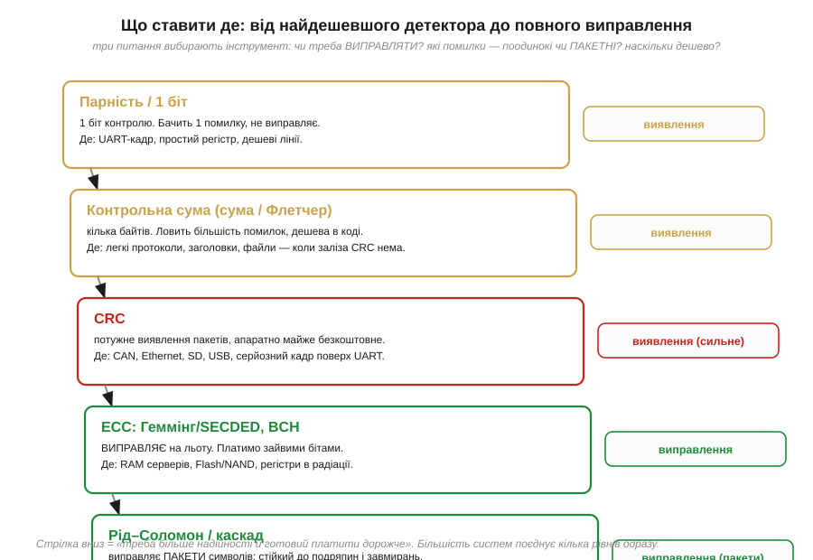
*Рис. 3.9.9.1. Сходи надійності — від найдешевшого до найпотужнішого. **Парність** (1 біт): бачить одну помилку, не виправляє — для UART-кадру, простого регістра. **Контрольна сума** (сума/Флетчер): дешеве програмне виявлення — для легких протоколів і файлів без апаратного CRC. **CRC**: потужне виявлення пакетів, апаратно майже безкоштовне — для CAN, Ethernet, SD, USB, серйозних кадрів. **ECC** (Геммінг/SECDED, BCH): **виправляє** на льоту — для RAM серверів, Flash, пам'яті в радіації. **Рід–Соломон/каскад**: виправляє **пакети** символів — для носіїв, супутника, далекого космосу. Стрілка вниз означає «треба більше надійності й готовий платити дорожче»; більшість систем поєднує кілька рівнів одразу.*

Ці сходи й дають готову відповідь. Піднімаючись від низу до верху, ми щоразу доплачуємо надлишком за більшу силу: парність — копійчана й найслабша, RS — найдорожча й найпотужніша. Інженер спускається цими сходами рівно настільки, наскільки вимагає **його** канал: для тихої внутрішньої шини вистачить парності, для радіолінка дрона потрібен CRC, для Flash — BCH, для супутникового каналу — RS. Жодного коду «взагалі найкращого» немає — є код, доречний **для конкретної загрози**, і вся майстерність у тому, щоб не недоплатити (пропустити помилки) і не переплатити (з'їсти швидкість даремно).

### Дві стратегії: перепитати чи виправити самому

За першим питанням — «виявляти чи виправляти» — ховається глибший вибір **стратегії**, який варто назвати прямо, бо саме він поєднує дві половини цього розділу. Перший шлях — **перепитування** (*automatic repeat request*, ARQ): ставимо дешевий код **виявлення** (CRC), і коли приймач бачить битий кадр, він просить **надіслати знову**. Другий шлях — **пряме виправлення** (*forward error correction*, FEC): ставимо дорожчий код **виправлення** (ECC, RS), що лагодить помилку **на місці**, без жодного зворотного запиту.

У кожної стратегії — своя ціна й своя сфера. ARQ дешевий **у звичайних умовах**: код виявлення малий, і поки помилок мало, ми майже не переплачуємо — повтори рідкі. Але ARQ потребує **зворотного каналу** й **часу** на повтор, а коли помилок багато, кадри доводиться слати по кілька разів, і пропускна здатність обвалюється. FEC, навпаки, платить **завжди** — надлишок їде в кожному кадрі, навіть бездоганному, — зате не потребує ні зворотного каналу, ні очікування й тримає сталу швидкість навіть на поганому каналі. Звідси й розподіл ролей: де є дешевий зворотний зв'язок і час (дротові протоколи, обмін між платами) — панує ARQ з CRC; де перепитати **ніде або нема коли** (пам'ять, диск, односторонній супутниковий канал, потокове відео, далекий космос) — лишається FEC. А найнадійніші системи беруть **обидві** стратегії заразом: FEC прибирає більшість помилок на льоту, а CRC згори ловить ті рідкісні, що FEC не подужав, і вмикає перепит. Виявлення й виправлення, які ми вивчали як окремі світи, у живій системі працюють пліч-о-пліч.

### Коди не змагаються — вони складаються в шари

І ось остання, найважливіша думка всього розділу, без якої карта була б оманливою. У реальних системах коди **не конкурують** за одне місце — вони **складаються в шари**, кожен ловить те, що пропустив попередній. Це не «або-або», а «і-і»: різні рівні захисту працюють одночасно на різних рубежах.

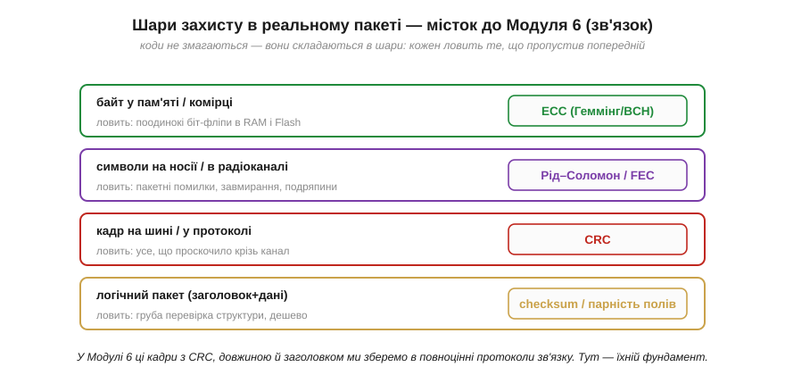
*Рис. 3.9.9.2. Коди складаються в шари, а не змагаються. На рівні **байта в пам'яті/комірці** працює ECC (Геммінг/BCH) проти поодиноких біт-фліпів. На рівні **символів на носії чи в радіоканалі** — Рід–Соломон проти пакетів і завмирань. На рівні **кадру на шині чи в протоколі** — CRC ловить усе, що проскочило крізь канал. На рівні **логічного пакета** (заголовок + дані) — контрольна сума чи парність полів дає дешеву грубу перевірку структури. Кожен шар підстраховує інші; разом вони дають надійність, недосяжну жодному поодинці.*

Ця багатошаровість — не надмірність, а правильна архітектура. Уявімо дані, що летять від давача до контролера: біти лежать у Flash під захистом **BCH**, ідуть радіоканалом під **Рід–Соломоном**, пакуються в кадр із **CRC**, а всередині кадру заголовок звіряється простою **контрольною сумою**. Кожен рівень бере на себе ту загрозу, проти якої він найсильніший, і прикриває слабкість сусіда: ECC чистить поодинокі збої пам'яті, RS — пакети каналу, CRC — усе, що прорвалося, контрольна сума — грубі помилки структури. Разом вони дають надійність, якої жоден код не дав би сам.

**Приклад (вибір під задачу).** Пройдімо три типові ситуації трьома питаннями.

```
ситуація A: кадр поверх UART між двома платами, зв'язок двосторонній
  виправляти? — ні, можна перепитати  → досить ВИЯВЛЕННЯ
  помилки? — рідкі, від завад на дроті
  ціна? — є час на кілька байтів
  → CRC-16 у кінці кадру (а в найпростішому разі — біт парності UART)

ситуація B: оперативна пам'ять промислового контролера 24/7
  виправляти? — так, перепитати ніде, тиха помилка недопустима
  помилки? — поодинокі біт-фліпи (частинки, шум)
  → ECC-пам'ять із SECDED (виправити 1, виявити 2)

ситуація C: дані на оптичному носії / радіо із завмираннями
  виправляти? — так, односторонній канал
  помилки? — ПАКЕТНІ (подряпини, завмирання)
  → Рід–Соломон (часто в каскаді з внутрішнім кодом)
```
Три питання — виправляти чи виявляти, поодинокі чи пакетні, скільки платити — щоразу однозначно вказують доречний інструмент.

> 🔧 **Навіщо це.** Це підсумкове правило — найкорисніше з усього розділу, бо ним ви користуватиметеся в кожному проєкті. Тримайте в голові сходи: **парність → контрольна сума → CRC → ECC → Рід–Соломон**, від дешевого виявлення до дорогого виправлення пакетів. Спочатку питайте, чи можна **перепитати** (тоді досить виявлення — найдешевшого), і лише як ні — беріть виправлення. Дивіться на **характер** помилок: поодинокі — бітовий код, пакетні — символьний. І не переплачуйте: надлишок коштує пропускної здатності, тож сила коду має відповідати реальній загрозі. Нарешті, пам'ятайте, що в серйозній системі коди **шаруються** — ECC у пам'яті, RS у каналі, CRC у кадрі, сума в заголовку працюють разом. Засвоївши цю карту, ви проєктуватимете надійність свідомо, а не навмання.

На цьому Розділ 3.9 робить повне коло. Ми почали з тривожного відкриття — біти перевертаються, і це неминуча фізика, — а закінчуємо спокійним інженерним інструментарієм, що перетворює цю неминучість на керований параметр. Між двома полюсами лягла вся теорія кодування: дешевий **біт парності** і його сліпа пляма; **контрольні суми** з Флетчером, що зважує позицію; всюдисущий **CRC** на діленні многочленів; геометрія **відстані Геммінга**, що відмежовує виявне від виправного; перший виправний **код Геммінга (7,4)** із синдромом-адресою; **ECC** у RAM і Flash, що боронить пам'ять серверів і накопичувачів; символьний **Рід–Соломон**, завдяки якому грає подряпаний диск; і, нарешті, **карта рішень**, що зводить усе в практику. Наскрізна нитка всього розділу одна: **надлишок, обчислений за даними, перетворює випадкову помилку на щось, що видно — а часто й можна виправити.**

Та помітьте, до чого ми прийшли наприкінці. Говорячи про вибір кодів, ми весь час натикалися на слово «**кадр**» і «**пакет**»: CRC у кінці кадру, контрольна сума в заголовку, шари захисту в повідомленні. Ми навчилися **боронити** пакет від помилок — але самого пакета ще не будували: що в його заголовку, як позначити довжину, куди покласти CRC, як приймач упізнає початок і кінець. Це вже не про окремі біти, а про те, як машини **домовляються** обмінюватися даними, — тема цілого Модуля 6, до якого цей розділ і прокладає місток. Коди виявлення й корекції — це фундамент надійного зв'язку; на ньому ми тепер і будуватимемо протоколи.

> ▶️ **Далі — Розділ 3.10: [Як народжується чіп: від піску до корпуса](../chip-fabrication/chip-fabrication.md).** Ми багато разів спиралися на «кремнієву комірку», «кристал» і «корпус мікросхеми» — час побачити, як їх насправді роблять: від кварцового піску до монокристала, від друку схеми світлом до «ніжок» на платі. А починається розділ з історії суперечки за сам винахід інтегральної схеми: [Кілбі проти Нойса](../chip-fabrication/hist-kilby-noyce.md).
