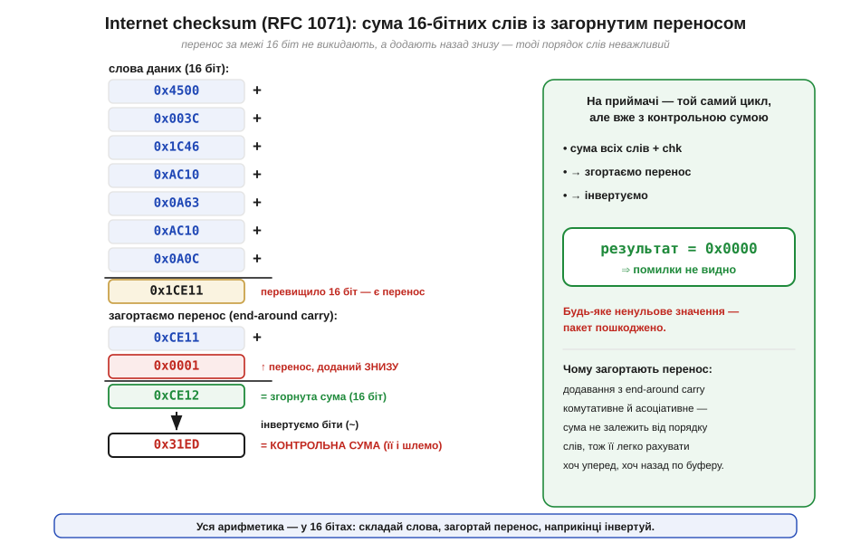
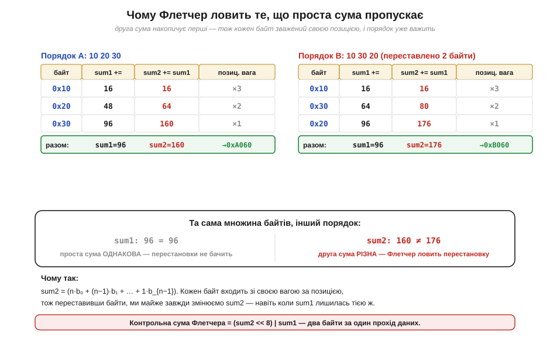
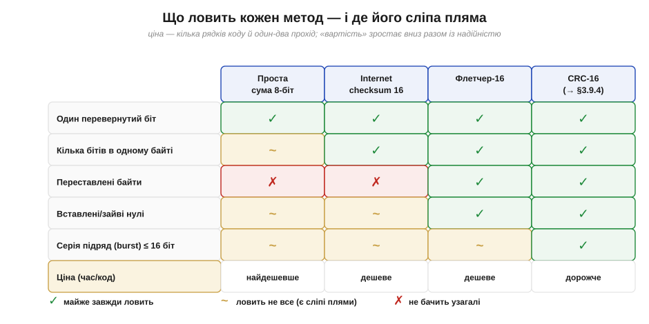

# Контрольні суми на практиці: Internet checksum і Флетчер у коді

> ⚙️ Алгоритмічна вставка до теми [§3.9.3 «Контрольні суми: проста сума, Флетчер»](error-correction.md). Тема пояснила **ідею** на пальцях: додаємо байти, шлемо суму поряд із даними, на тому кінці перераховуємо й порівнюємо. Тут ми перетворимо цю ідею на робочий код і розберемо два алгоритми, що реально крутяться в мережах і протоколах, — **Internet checksum** (нею захищені заголовки IP, TCP та UDP) і **контрольну суму Флетчера** (*Fletcher's checksum*). Заразом стане видно, **чому** проста сума — слабенький сторож і яким маленьким доважком Флетчер латає її головну діру. Усе спирається лише на пройдене: суматор і перенос (§3.2.6), бітові операції та зсуви (§3.2.2a), а сама природа перевернутих бітів — це сусідня §3.9.1.

## Задача

Тема вже окреслила, чого ми хочемо: дешевий спосіб помітити, що пакет приповз пошкодженим. Тепер сформулюймо це як інженерне завдання з трьома жорсткими умовами. По-перше, **дешево**: контрольну суму рахують на кожному пакеті, часто на крихітному мікроконтролері, тож дозволені хіба що додавання й зсуви — без множень і ділень. По-друге, **за один прохід**: дані течуть потоком, і вертатися буфером назад не можна. По-третє, і це найголовніше, сторож має **ловити реальні поломки** каналу: поодинокий перевернутий біт, серію зіпсованих біт підряд, а ще — переставлені чи загублені байти. Сама собою проста сума байтів першу умову складає блискуче, а от на третій провалюється, і саме звідти росте потреба в чомусь розумнішому.

## Ідея

Почнімо з того, що **майже** працює, — з простого додавання, але зробленого акуратно. Якщо просто скласти 16-бітні слова у 16-бітний регістр, перенос за верхній край губиться, а з ним губиться й частина інформації про старші біти. Internet checksum лагодить це прийомом **загорнутого переносу** (*end-around carry*): те, що вилізло за межі 16 біт, не викидають, а додають назад знизу. Завдяки цьому додавання стає по-справжньому комутативним і асоціативним — сума не залежить від того, у якому порядку складати слова, тож її однаково легко рахувати хоч уперед буфером, хоч назад. Наприкінці суму **інвертують** (порозрядне NOT, §3.2.2a) — це й є контрольне число, яке кладуть у пакет.


*Рис. 3.9.3a.1. Сім 16-бітних слів (тут — поля заголовка IPv4) складаються у 32-бітний акумулятор; його верхні біти (перенос) загортаються назад у нижні, а результат інвертується — це й є контрольна сума. Хитрість інверсії в тому, що на приймачі додають **усі** слова **разом із** контрольною сумою: правильний пакет дає рівно 0x0000, а будь-яке ненульове число означає поломку.*

Цей метод швидкий і чесно ловить поодинокі перевернуті біти, та має ваду, спільну для всіх простих сум: він **сліпий до порядку**. Переставте місцями два байти — сума не зміниться ні на йоту, і сторож нічого не помітить. А перестановки в реальних каналах трапляються: збій DMA, зрушений на байт буфер, плутанина в покажчиках. Тут і виходить на сцену **Флетчер**. Його думка геніально проста: вести **дві** біжучі суми. Перша, `sum1`, — це звичайна сума байтів. Друга, `sum2`, на кожному кроці додає до себе **поточне значення** `sum1`. Через це кожен байт входить у `sum2` зі **своєю вагою за позицією**: ранній байт устигає долити в `sum2` багато разів, пізній — мало. Порядок раптом починає важити, і перестановка, невидима для простої суми, миттєво зрушує `sum2`.


*Рис. 3.9.3a.2. Ті самі три байти у двох порядках. `sum1` (проста сума) однакова в обох — їй порядок байдужий. А `sum2` накопичує часткові суми, тож кожен байт зважений позицією (×3, ×2, ×1); варто переставити байти — і `sum2` стає іншою. Готова контрольна сума Флетчера — це два байти, склеєні в одне слово: `(sum2 << 8) | sum1`.*

## Псевдокод

Обидва алгоритми вкладаються в кілька рядків. Спершу Internet checksum над буфером із 16-бітних слів:

```
internet_checksum(words):
    sum = 0
    for w in words:
        sum = sum + w                 # 32-бітний акумулятор
        sum = (sum & 0xFFFF) + (sum >> 16)   # загорнути перенос
    return (~sum) & 0xFFFF            # інвертувати — це і є контрольна сума
```

Загортання можна робити не щокроку, а раз наприкінці (бо акумулятор не переповнить 32 біти на реальних пакетах) — результат той самий. Тепер Флетчер-16, що з потоку **байтів** дає 16-бітну суму:

```
fletcher16(data):
    sum1 = 0
    sum2 = 0
    for b in data:
        sum1 = (sum1 + b)   mod 255
        sum2 = (sum2 + sum1) mod 255
    return (sum2 << 8) | sum1
```

Лишилося пояснити загадковий `mod 255`. Якщо лишити суми рости у звичайному 8-бітному регістрі, вони згортатимуться за модулем 256 — а 256 є степенем двійки, і ця парність створює сліпі плями: ціла родина двобайтових поломок не змінює суму. Флетчер бере натомість модуль **255 = 2⁸−1**: він непарний, тож тієї конкретної діри вже не лишає (255 — це ще не просте число, 255 = 3·5·17, тож і воно не ідеальне; справді просте взяв пізніше Adler-32, див. історію). Узяти модуль 255 без ділення легко: `sum = (sum & 0xFF) + (sum >> 8)` — той самий прийом загорнутого переносу, що й в Internet checksum.

> 🔧 **Навіщо це.** Це не теорія, а щоденний інструмент вбудованика. Шлете телеметрію поверх UART чи свій кадр по радіоканалу — додайте в кінець кадру два байти Флетчера, і приймач відсіє більшість покручених пакетів за десяток зайвих інструкцій на байт. А коли заглядаєте у дамп IP- чи UDP-пакета, поле «checksum» — це рівно та сума з Рис. 3.9.3a.1; знаючи алгоритм, ви перевірите його вручну й зрозумієте, чому аналізатор лається «bad checksum».

## 📜 Звідки взялися ці дві суми

За кожним із цих алгоритмів стоїть не безіменна формула, а конкретні люди й конкретна потреба. Internet checksum народився разом із самим стеком TCP/IP наприкінці 1970-х і був канонізований 1988 року в короткому документі **RFC 1071** «Computing the Internet Checksum» (автори — Боб Бреден, Девід Борман і Крейг Партрідж — *Bob Braden*, *David Borman*, *Craig Partridge*). Вибір був свідомим компромісом інженерів-практиків: їм потрібна була сума, яку **тогочасні** машини рахували б майже задарма, навіть програмно, тому й зупинилися на додаванні із загорнутим переносом замість дорожчого, хай і надійнішого, ділення многочленів (його ми побачимо в §3.9.4). Слабкість до перестановок вони усвідомлювали й прийняли як ціну за швидкість — на той час канали й апаратура давали переважно поодинокі бітові помилки, проти яких простої суми вистачало.

Двома суми Флетчера завдячуємо **Джонові Флетчеру** (*John G. Fletcher*, 1934–2012) з Ліверморської національної лабораторії (*Lawrence Livermore*), який описав їх 1982 року в статті «An Arithmetic Checksum for Serial Transmissions» (*IEEE Transactions on Communications*). Його мета була прямою: дістати надійність, близьку до складніших кодів, але ціною, близькою до простого додавання, — і друга, накопичувальна сума цю мету влучно склала, бо коштує лише одне зайве додавання на байт. Тринадцятьма роками пізніше Марк Адлер (*Mark Adler*, співавтор zlib) узяв ту саму думку про дві суми й довів її до **Adler-32** (1995, частина формату zlib — RFC 1950), замінивши складене число-модуль Флетчера на справді **просте** число 65521 (найбільше просте, менше за 2¹⁶) — саме простота модуля прибирає той клас двобайтових поломок, який складене 255 ще пропускає. Тож «суми Флетчера» — то не примха одного інженера, а ціла родина рішень навколо однієї влучної ідеї: щоб сторож бачив порядок, навчіть його накопичувати власні часткові суми.

## Складність і пастки на МК

Обидва алгоритми коштують **O(n)** від довжини даних і **O(1)** пам'яті — один-два регістри, жодних таблиць. Уся хитрість, як завжди на мікроконтролері, у дрібницях, кожна з яких тихо компілюється, а потім дає неправильну суму:

- **Не той модуль у Флетчера.** Спокуса лишити суми у звичайному `uint8_t` і дати їм згортатися за модулем 256 — це поширена помилка: 256 має дільник 2, і частина поломок стає невидимою. Модуль мусить бути **255**; беріть його прийомом `(s & 0xFF) + (s >> 8)`, а не діленням.
- **Переповнення проміжної суми.** Якщо рахувати модуль не щокроку, а пачками заради швидкості, `sum2` росте швидко. Тримайте суми в `uint16_t` (чи ширше) і робіть згортання достатньо часто, інакше переповнення зіпсує результат. Для класичного Флетчера-16 безпечна пачка — близько 20 байтів між згортаннями.
- **Порядок байтів при склеюванні.** `(sum2 << 8) | sum1` кладе `sum2` у старший байт. Якщо приймач збере слово навпаки, суми не зійдуться навіть на цілих даних. Узгодьте порядок байтів (*endianness*, §3.4.7) обома кінцями й перевіряйте на спільному тестовому векторі.
- **Не плутати з простою сумою в безпеці.** Контрольна сума ловить **випадкові** поломки каналу, але не зловмисника: маючи дані, підробити суму тривіально. Це сторож від шуму, а не від атаки; для захисту від навмисних змін потрібні зовсім інші засоби.
- **«Нульовий» пакет.** Суцільні нулі дають нульову суму — для Флетчера це не проблема (позиційні ваги все одно працюють), а от проста сума на самих нулях сліпа до вставлених чи загублених нулів. Це ще одна причина не покладатися на голу суму, коли формат пакета припускає довгі нульові поля.

## Підсумок

Зведімо тепер усі три рівні захисту в одну картину — від голої суми до CRC, який чекає нас у наступній темі, — щоб бачити, який сторож що ловить і чим за це платить.


*Рис. 3.9.3a.3. Класи поломок проти трьох наших методів (і CRC-16 як орієнтир, §3.9.4). Видно закономірність: проста сума дешева, але сліпа до перестановок і слабка на серіях; Флетчер тим самим коштом ловить перестановки; а серії підряд по-справжньому бере вже CRC. «Ціна» в нижньому рядку зростає разом із надійністю — у цьому й полягає інженерний вибір.*

Ми перетворили ідею контрольної суми з §3.9.3 на робочий код і побачили, де закінчується «дешево» і починається «надійно». **Internet checksum** (RFC 1071) — це акуратна сума 16-бітних слів із загорнутим переносом та фінальною інверсією: швидка, але сліпа до порядку байтів. **Флетчер** додає лише одне додавання на байт — другу, накопичувальну суму, — і цим латає головну діру: позиційні ваги роблять його чутливим до перестановок, а непарний модуль 255 (замість степеня двійки 256) прибирає головну сліпу пляму простого додавання. Обидва коштують O(n) часу й кілька регістрів пам'яті, тож годяться навіть для найменшого МК. Чого жодна сума не вміє — це **виправити** помилку чи витримати довгу серію зіпсованих біт; для першого потрібні коди з §3.9.5–3.9.6, для другого — ділення многочленів CRC, до якого ми переходимо далі.
