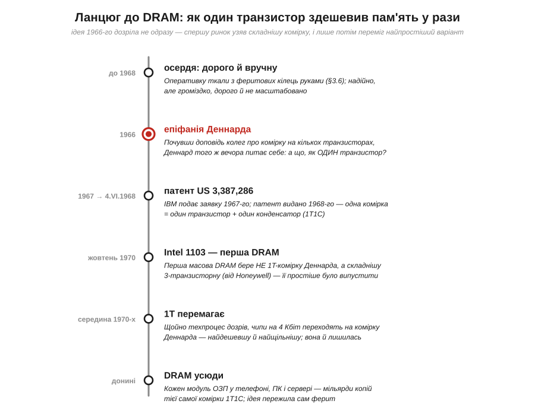
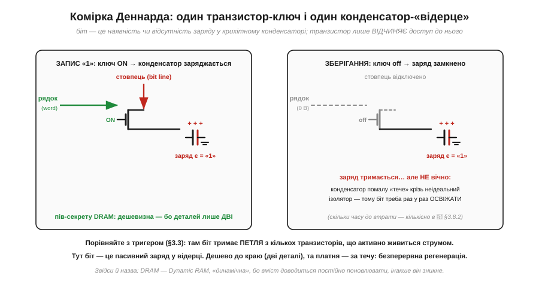
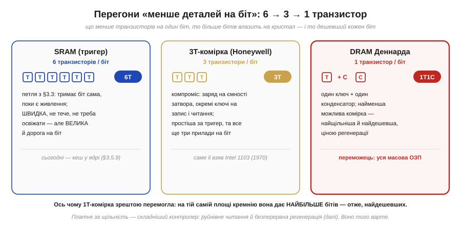
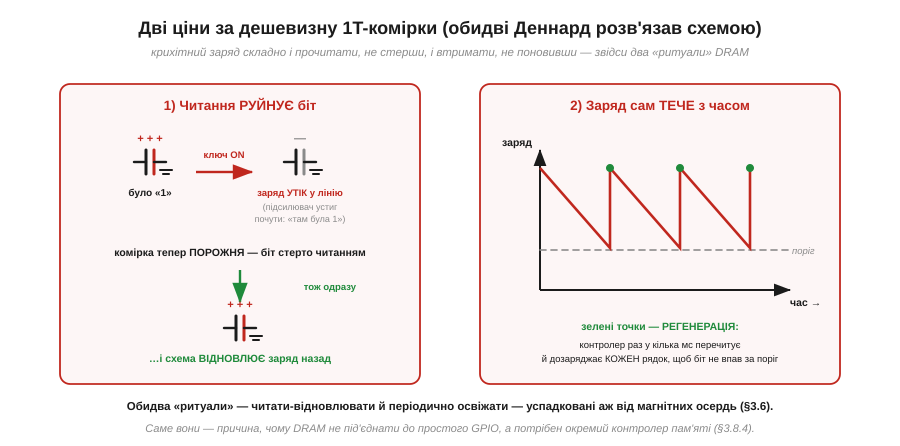
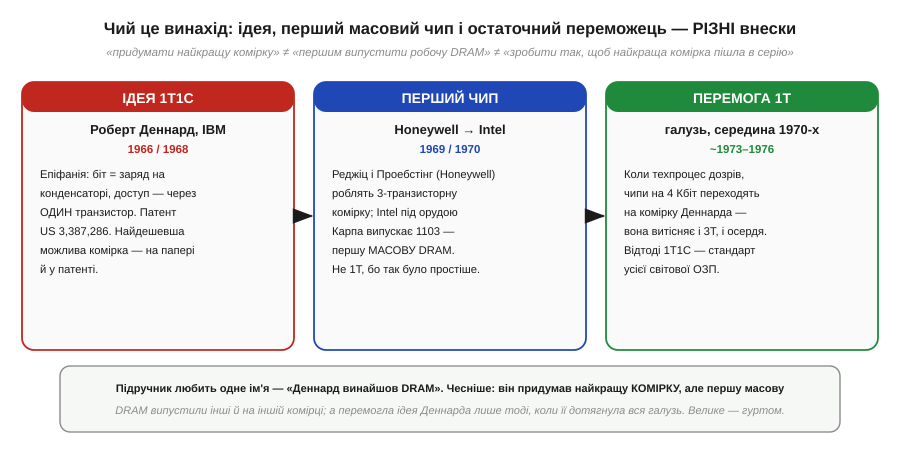

# 📜 Роберт Деннард: DRAM з одного транзистора (IBM, 1966–68)

> Це історична вставка до всього [Розділу 3.8 «Зовнішня пам'ять»](external-memory.md). У темах розділу ми беремо DRAM як даність: ось комірка з одного транзистора й конденсатора (§3.8.2), ось вона тече й вимагає регенерації, ось її обвішують синхронним інтерфейсом і контролером (§3.8.3, §3.8.4). Та сама ця комірка — не якась вічна аксіома кремнію, а **конкретна думка конкретної людини**, що сяйнула одного вечора 1966 року. Її автор — **Роберт Деннард** (*Robert H. Dennard*, 1932–2024), інженер дослідного центру IBM. До нього оперативну пам'ять або ткали руками з феритових кілець, або складали з громіздких комірок на кількох транзисторах; Деннард звів комірку до **двох деталей** — і цим здешевив пам'ять у рази, відкривши шлях до мегабайтів, а згодом і гігабайтів. Ця історія — про те, як народилася та думка, чому вона не одразу перемогла, яку ціну за свою простоту взяла (регенерацію) і чому ім'я Деннарда згодом прозвучало вдруге — уже в зовсім іншому контексті, коли йшлося про межі всієї мікроелектроніки.

Розробникові вбудованих систем ця історія не абстрактна. Щоразу, коли ви додаєте до плати зовнішню SDRAM чи DDR, ви користуєтеся прямим спадком тієї думки: однією-єдиною коміркою, скопійованою мільярди разів. А «дивні» риси DRAM, що ускладнюють вам життя, — потреба в контролері, безперервна регенерація, чутливість до таймінгів — усі ростуть із того самого кореня: із радикальної простоти комірки, за яку доводиться доплачувати клопотом. Зрозумівши, **звідки** ця комірка взялася й **чому** вона саме така, ви краще розумієте, з чим маєте справу. Почнімо з того, як виглядала пам'ять до Деннарда — бо саме її незручність і підштовхнула його до пошуку.

*Рис. 3.8.0.1. Дорога до DRAM розтяглася на десятиліття, і думка 1966-го дозріла не вмить. **До 1968** оперативку ткали руками з феритових кілець — надійно, та дорого й немасштабовано. **1966** — епіфанія Деннарда: а що, як зберігати біт ОДНИМ транзистором? **1967 → 1968** — IBM подає заявку й дістає патент US 3,387,286 на комірку «транзистор + конденсатор». **Жовтень 1970** — перша масова DRAM (Intel 1103) бере, однак, НЕ комірку Деннарда, а складнішу 3-транзисторну. **Середина 1970-х** — щойно техпроцес дозрів, чипи на 4 Кбіт переходять на найдешевшу комірку Деннарда, і вона лишається стандартом **донині**. Кожен вузол — окремий крок цієї дороги.*

## Як зберігали біти до Деннарда: засувки й феритові кільця

Щоб оцінити винахід, треба відчути проблему, яку він закрив. На середину 1960-х оперативну пам'ять комп'ютерів робили двома несхожими способами, і обидва впиралися в стелю.

Перший спосіб — **феритові осердя** (*magnetic core memory*): крихітні кільця з магнітного матеріалу, кожне з яких тримало один біт напрямком своєї намагніченості. Кільця нанизували на сітку дротів, і — головна біда — цю сітку доводилося **ткати руками**, часто під мікроскопом. Пам'ять виходила надійна й нелетка, але дорога до неможливості й геть немасштабована: щоб подвоїти ємність, треба було вдвічі більше ручної праці. Один біт коштував центи, а комп'ютеру їх потрібні були мільйони. (Цей спосіб і його спадок ми ще зустрінемо в розділі про нелетку пам'ять; тут важливо лише, що ферит був дорогий і впирався в ручну збірку.)

Другий спосіб з'явився з приходом інтегральних схем — зберігати біт **електронною засувкою** на транзисторах. Це той самий принцип, що ми вивчали у тригерах (§3.3): кілька транзисторів зчіплюють у петлю з двома стійкими станами, і вона тримає біт, поки є живлення. Така комірка швидка й не потребує жодного поновлення — біт стоїть сам. Біда інша: вона **громіздка**. Класична статична комірка (та сама SRAM із §3.6.8) бере **шість транзисторів** на один біт; навіть тодішні спрощені варіанти потребували чотирьох-п'яти. А кожен транзистор — це площа кремнію, а площа — це гроші. Зробити так мегабайти означало роздути кристал і ціну до небес. Виходила прикра вилка: ферит дешевший за транзистори на біт, але немасштабований і ручний; транзисторна засувка елегантна й електронна, та надто ненажерлива до площі. Бракувало третього шляху — **електронного, як засувка, але дешевого, як мрія**. Саме його й шукали інженери, і саме його знайшов Деннард.

## 1966: епіфанія на дивані — «а що, як один транзистор?»

Роберт Деннард працював у Дослідному центрі імені Томаса Вотсона (*IBM Thomas J. Watson Research Center*) під Нью-Йорком і займався саме пам'яттю. За переказами самого Деннарда, поштовхом стала чужа доповідь: він почув, як колеги описують проєкт пам'яті на комірці з **кількох** транзисторів — складній, із роздільними шляхами на запис і читання. Думка про всю цю громіздкість не давала йому спокою і ввечері, удома. І ось того вечора, сидячи на дивані у власній вітальні в окрузі Вестчестер і дивлячись, як гасне світло над ущелиною річки Кротон, Деннард спіймав ідею, що згодом перевернула цілу галузь: а що, як звести комірку до **абсолютного мінімуму** — **одного** транзистора?

Хід думки був такий. Біт не конче тримати активною петлею, що сама себе живить. Біт можна просто **запам'ятати як заряд** на крихітному конденсаторі: є заряд — це «1», немає — «0». А роль транзистора зводиться до ролі **ключа** (засувки доступу): він лише на мить **відмикає** конденсатор до спільної лінії, коли біт треба записати чи прочитати, а решту часу стоїть зачинений, замкнувши заряд усередині. Один транзистор, один конденсатор — і все. Жодної петлі з шести приладів, жодного ручного ткання феритів. Найменша мислима комірка пам'яті.

*Рис. 3.8.0.2. Серце винаходу. Біт — це наявність чи відсутність заряду у крихітному конденсаторі; транзистор лише ВІДЧИНЯЄ доступ до нього. **Ліворуч (запис «1»):** лінія рядка відмикає ключ, лінія стовпця заливає заряд у конденсатор. **Праворуч (зберігання):** ключ зачинено, заряд замкнено — але не навічно: крізь неідеальний ізолятор він помалу «тече», тож біт треба раз у раз освіжати. Порівняйте з тригером (§3.3), де біт тримає петля з кількох транзисторів, що активно живиться струмом: тут біт — пасивний заряд у «відерці». Дешево до краю (дві деталі) — ціною безперервної регенерації. Звідси й назва: DRAM, Dynamic RAM, «динамічна».*

У цій простоті — уся сила задуму, і варто проговорити, **чому** вона так багато важить. Площа кремнію під біт падає в рази, бо одна пара «транзистор + конденсатор» займає набагато менше місця, ніж шість транзисторів засувки. А менша площа на біт означає, що на тій самій пластині вміщується **в рази більше бітів** — отже, кожен біт дешевший. Саме ця арифметика згодом дозволила міряти оперативну пам'ять спершу кілобайтами, потім мегабайтами, а нині гігабайтами. Деннард, за власним зізнанням, тоді ще не уявляв усього розмаху наслідків — він просто шукав найощадливішу комірку. Та закладена ним межа «менше деталей на біт» виявилася тим важелем, що рухав індустрію пам'яті півстоліття.

> 🔧 **Навіщо це.** Уся дешевизна зовнішньої DRAM, якою ви користуєтесь, — прямий наслідок цієї думки 1966 року. Коли в §3.8.2 ми кажемо, що DRAM беруть під **велику робочу пам'ять**, а SRAM лишають для дрібного й швидкого, причина саме історична: комірка Деннарда коштує в рази менше деталей, ніж шеститранзисторна засувка, тож мегабайти на ній виходять дешево, а на SRAM — ні. Інакше кажучи, поділ праці «дешева ємна DRAM зовні / дорога швидка SRAM усередині», який визначає всю архітектуру пам'яті вашого пристрою, закладено в той вечір на дивані над річкою Кротон.

## 1967–68: патент US 3,387,286 — на папері й у законі

Думка — це ще не винахід; винахід — це думка, доведена до робочого вигляду й закріплена. IBM поставилася до ідеї Деннарда серйозно: команда невдовзі зібрала діючу комірку з одного транзистора й одного конденсатора, а компанія **1967 року** подала патентну заявку. **Патент видали 1968-го** — він дістав номер **US 3,387,286**. Цікава деталь, що добре передає дух часу: слова «DRAM» тоді ще не існувало, тож патент названо сухо й описово — **«Field Effect Transistor Memory»** («Пам'ять на польових транзисторах»). Назва, що сьогодні стоїть на кожній планці оперативки світу, народилася вже потім; у первісному документі її немає.

Тут варто зробити чесне уточнення — у дусі того, як ми ставимося до історії винаходів узагалі. Сказати «Деннард винайшов DRAM» — зручно, але неточно, і неточність повчальна. Деннард придумав і запатентував **найкращу комірку** — однотранзисторну. Але «придумати найкращу комірку» — це ще не «першим випустити робочу мікросхему пам'яті», і поготів не «зробити так, щоб найкраща комірка пішла в масову серію». Це **три різні внески**, і, як ми зараз побачимо, зробили їх **різні люди в різний час**. Патент Деннарда — це перший із трьох: блискуча ідея, зафіксована на папері й у законі. Двом іншим ще тільки належало статися.

## 1969–70: перша масова DRAM пішла не на комірці Деннарда

Здавалося б, далі все просто: є найдешевша комірка — берімо її й робімо чипи. Але історія розпорядилася інакше, і цей поворот — важливий урок про відстань між красивою ідеєю та виробництвом.

Першу **масову** динамічну пам'ять випустила **не** IBM і **не** на комірці Деннарда. 1969 року інженери компанії **Honeywell** — **Білл Реджіц** (*Bill Regitz*) і **Боб Проебстінг** (*Bob Proebsting*) — розробили **трьохтранзисторну** динамічну комірку й пішли шукати по галузі того, хто зможе її виготовити. Відгукнулася молода **Intel**: під орудою **Джоела Карпа** (*Joel Karp*), у тісній співпраці з Реджіцом, вона зробила два схожі чипи на 1024 біти — 1102 і 1103. І ось **у жовтні 1970 року** виходить **Intel 1103** — **перша комерційно доступна DRAM** в історії. Коштувала вона близько 60 доларів — приблизно цент за біт, — і цього вистачило, щоб уперше серйозно потіснити дорогі феритові осердя; уже до 1971-го 1103 стала найбільш продаваною мікросхемою пам'яті у світі.

Чому ж перша DRAM узяла **складнішу** комірку — три транзистори замість одного, — коли простіша вже була відома й запатентована? Бо «найдешевша на папері» не означає «найлегша у виробництві тоді». Однотранзисторна комірка віддає **мізерний** заряд, який треба ще зуміти **надійно прочитати**, не сплутавши «1» з «0», та ще й не стерши при цьому, — а для цього потрібні чутливі підсилювачі-детектори й зрілий техпроцес, яких на зламі 1960–70-х просто бракувало. Трьохтранзисторна комірка була більша й дорожча на біт, зате простіша в реалізації: заряд вона тримала на ємності затвора одного зі своїх транзисторів, мала окремі шляхи на запис і читання, а читалася **неруйнівно** — її не доводилося переписувати після кожного зчитування. Іншими словами, галузь спершу обрала те, що **могла випустити надійно сьогодні**, а не те, що було найдешевше в принципі. Однотранзисторна комірка чекала, поки виробництво до неї дозріє.

*Рис. 3.8.0.3. Три комірки динамічної ери, від найгроміздкішої до найощаднішої. **6T — SRAM-засувка (§3.3):** тримає біт сама, поки є живлення, швидка й не тече, але велика й дорога на біт (сьогодні — кеш у ядрі). **3T — комірка Honeywell:** компроміс, заряд на ємності затвора, окремі ключі на запис і читання, неруйнівне читання — простіша за тригер, та все ще три прилади на біт; саме її взяв Intel 1103. **1T1C — комірка Деннарда:** один ключ плюс один конденсатор, найменша можлива комірка — найщільніша й найдешевша, ціною регенерації. Що менше транзисторів на біт, то більше бітів влазить на кристал і то дешевший кожен біт; тому 1T зрештою й перемогла — щойно техпроцес це дозволив.*

## Плата за простоту: руйнівне читання й регенерація

За радикальну дешевизну однотранзисторна комірка править **двома** податками, і обидва треба було розв'язати схемно, перш ніж вона пішла в серію. Обидва ростуть із того, що біт у ній — це крихітний і **тендітний** заряд, тоді як у засувці біт активно тримався струмом.

Перший податок — **руйнівне читання**. Щоб дізнатися, чи є заряд у конденсаторі, доводиться відчинити ключ і випустити цей заряд у розрядну лінію — на чутливий **підсилювач-детектор** (*sense amplifier*), який ловить ледь помітний стрибок рівня й вирішує: «там була 1» чи «там був 0». Але, випустивши заряд, ми тим самим **спорожнили** комірку — біт **стерто самим актом читання**. Тому за кожним читанням ховається другий, невидимий крок: підсилювач мусить негайно **записати прочитане значення назад**, повним зарядом. Читання в DRAM — це насправді завжди «прочитати-і-відновити».

Другий податок — **витік**. Жоден реальний конденсатор не тримає заряд вічно: крізь неідеальний ізолятор і крізь закритий (але не ідеально закритий) транзистор-ключ заряд помалу **стікає**. Минають **мілісекунди** — і «1» осідає до рівня, який уже не відрізнити від «0». Біт **губиться сам собою**, без жодного звертання. Рятунок — **регенерація** (*refresh*): спеціальна схема мусить раз у кілька мілісекунд обійти **всі** комірки, перечитати кожну й дозаписати назад, поновивши заряд до повного. Звідси й сама назва пам'яті — **динамічна** (*Dynamic* RAM): на відміну від статичної засувки, вона не стоїть на місці, а живе лише в безперервному русі поновлення; спинись цей рух — і вміст випарується.

*Рис. 3.8.0.4. Обидва «ритуали» DRAM ростуть із тендітності крихітного заряду. **Ліворуч — читання РУЙНУЄ біт:** заряд комірки стікає в лінію, підсилювач устигає «почути» колишню одиницю — і схема мусить негайно ВІДНОВИТИ заряд назад, бо комірка вже спорожніла. **Праворуч — заряд сам ТЕЧЕ з часом:** без поновлення рівень спадає нижче порога й біт гине, тож контролер періодично РЕГЕНЕРУЄ кожен рядок (зелені точки), дозаряджаючи його, поки не пізно. Обидва ритуали — пряма плата за те, що комірка така дешева й крихітна; саме вони згодом і вимагатимуть окремого контролера пам'яті (§3.8.4), а кількісно «скільки часу до втрати біта» оцінено в 🧮-вставці до §3.8.2.*

Тут і криється глибока іронія винаходу Деннарда, яку варто прийняти свідомо. Та сама простота, що зробила комірку дешевою, **переклала складність деінде** — у схему довкола. Засувка SRAM дорога коміркою, зате проста у вжитку: записав — і читай скільки хоч, нічого не поновлюючи. Комірка DRAM дешева, зате тягне за собою цілий шлейф клопоту: підсилювачі-детектори, відновлення після кожного читання, невпинну фонову регенерацію. Складність не зникла — вона **переїхала** з комірки в обв'язку. І саме тому, як ми побачимо в §3.8.4, до DRAM не можна просто під'єднати кілька ніжок і читати: між нею та процесором обов'язково стоїть **контролер пам'яті**, що бере на себе весь цей успадкований клопіт. Дешевизна комірки оплачена складністю контролера — і цей розмін виявився надзвичайно вигідним для всієї галузі.

> 🔧 **Навіщо це.** Дві «дивні» вимоги DRAM, з якими ви стикаєтесь на практиці, — це не примха інженерів, а прямий історичний спадок розміну, на який пішов Деннард. **Регенерація** (§3.8.2, §3.8.4) існує тому, що комірку звели до одного конденсатора, який тече; саме через неї зовнішню DRAM не можна просто «приспати» в режимі економії, не втративши вміст, — через що вона невигідна в пристроях на батарейці з довгим сном. А потреба в **окремому контролері** (§3.8.4) — тому, що вся складність, прибрана з комірки, осіла в обв'язці, і хтось мусить її нести. Знаючи корінь, ви не дивуєтесь цим вимогам, а закладаєте їх у проєкт від початку.

## Чий це винахід: ідея, перший чип і остаточна перемога — три різні внески

Зведімо нитки докупи, бо повна картина авторства тут важливіша за зручний ярлик. Підручник любить одне ім'я: «Деннард винайшов DRAM». Чесніша ж версія розкладається на **три окремі заслуги різних людей** — і кожна по-своєму необхідна.

*Рис. 3.8.0.5. Три необхідні, але різні внески. **Ідея 1T1C** — Роберт Деннард, IBM, 1966/1968: біт = заряд на конденсаторі, доступ через ОДИН транзистор; патент US 3,387,286 — найдешевша можлива комірка на папері й у законі. **Перший масовий чип** — Реджіц і Проебстінг (Honeywell) роблять 3-транзисторну комірку, а Intel під орудою Карпа випускає 1103 (1970), першу масову DRAM, — НЕ на комірці Деннарда, бо так було простіше виготовити. **Перемога 1T** — уже галузь у середині 1970-х: щойно техпроцес дозрів, чипи на 4 Кбіт переходять на комірку Деннарда, і вона витісняє і 3T, і ферит. «Придумати найкращу комірку» ≠ «першим випустити робочу DRAM» ≠ «дотягнути найкращу комірку до серії»: велике зроблено гуртом.*

Перший внесок — **ідея й патент**: Роберт Деннард, IBM, 1966–68. Він придумав найощаднішу мислиму комірку й закріпив її патентом. Другий — **перший робочий масовий чип**: Білл Реджіц і Боб Проебстінг із Honeywell (трьохтранзисторна комірка) та Джоел Карп із Intel (мікросхема 1103, жовтень 1970). Вони першими довели динамічну пам'ять до серії — хоч і на іншій, складнішій комірці, бо ту було легше випустити надійно. Третій внесок — **остаточна перемога однотранзисторної комірки**: уже не одна людина й не одна фірма, а вся галузь у середині 1970-х. Коли техпроцес дозрів — підросли чутливість підсилювачів і якість кремнію, — нове покоління чипів на **4 Кбіт** перейшло саме на комірку Деннарда: вона давала найбільше бітів на тій самій площі, отже, найдешевших. Відтоді 1T1C витіснила і трьохтранзисторну комірку, і феритові осердя, і стала **єдиним стандартом** усієї світової оперативної пам'яті — від тієї пори й донині.

Висновок із цього родоводу той самий, що повторюється в історії техніки знов і знов: велике рідко робить **одна** людина одним стрибком. Деннард дав ідею; інші першими втілили динамічну пам'ять у залізо; галузь гуртом дотягнула найкращу комірку до виробництва й зробила її всюдисущою. Кожна ланка необхідна, і жодна сама собою не достатня. Ярлик «винахідник DRAM» за Деннардом закріпився заслужено — він **справді** автор тієї комірки, що зрештою перемогла, — але за ним стоїть не самотній геній, а ланцюг внесків.

## Друге життя імені: «масштабування Деннарда»

Ім'я Деннарда ви, найімовірніше, почуєте ще раз — і вже зовсім в іншому контексті, не про пам'ять. У **1974 році** Деннард зі співавторами опублікував працю, що сформулювала **масштабування Деннарда** (*Dennard scaling*) — правило, яке на десятиліття стало мовчазним двигуном усієї мікроелектроніки. Коротко й без забігання вперед: воно описувало, **чому** з кожним зменшенням транзисторів чипи ставали водночас **і швидшими, і ощаднішими до енергії** — той самий «безкоштовний обід», завдяки якому кожне нове покоління процесорів просто виходило кращим за попереднє. А приблизно з середини 2000-х це правило **зламалося**: транзистори меншали далі, але обіцяний виграш в енергії припинився — настав **кінець масштабування Деннарда**, що змінив усю траєкторію розвитку процесорів.

Чому ж тут лише натяк, а не пояснення? Бо «масштабування Деннарда» — це історія не про пам'ять, а про **економіку й фізику виготовлення чипів** загалом, і їй належить своє місце далі в курсі. Ми розгорнемо її кількісно — разом із законом Мура, його зламами та наслідками — у [🧮-вставці «Закон Мура як графік» до теми §3.10.8](../chip-fabrication/math-moore-dennard.md), коли йтиметься про фабрикацію кристалів. Тут досить запам'ятати одне: те саме прізвище стоїть і під коміркою, що породила всю дешеву пам'ять світу, і під правилом, що пояснювало піввіку прогресу процесорів. Рідкісний випадок, коли один інженер залишив по собі **два** наріжні камені цифрової техніки — у двох різних її кутках.

## Що з цієї історії — у вашому проєкті

Підсумуймо, забравши з собою практичне. Коли ви впаюєте у плату мікросхему SDRAM чи DDR і налаштовуєте до неї контролер (§3.8.4), ви тримаєте в руках прямий нащадок думки 1966 року: **один транзистор плюс один конденсатор на біт**, повторені мільярди разів. Дешевизна, заради якої ви взагалі обрали DRAM під кадри дисплея чи аудіобуфери (§3.8.1, §3.8.2), — це закладена Деннардом межа «менше деталей на біт». А весь супутній клопіт — обов'язкова регенерація, потреба в контролері, чутливість до таймінгів — це інша сторона тієї самої монети: складність, що пішла з комірки в обв'язку. Зрозумівши історію, ви читаєте даташит DRAM інакше: не як перелік химер, а як логічні наслідки одного давнього й дуже вдалого розміну — **гранична простота комірки в обмін на клопіт довкола неї**. Саме про цей розмін, уже технічно й кількісно, і написано теми §3.8.2–§3.8.4.

> ▶️ Повернутися до розділу: [Розділ 3.8 — Зовнішня пам'ять](external-memory.md), тема [§3.8.2 «DRAM: транзистор і конденсатор»](external-memory.md).
