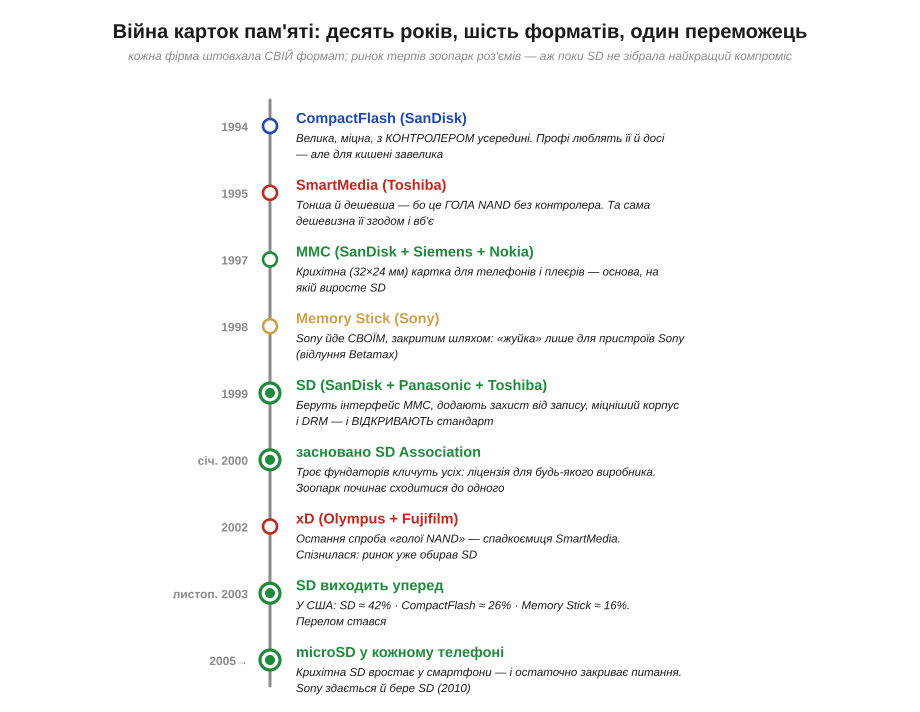
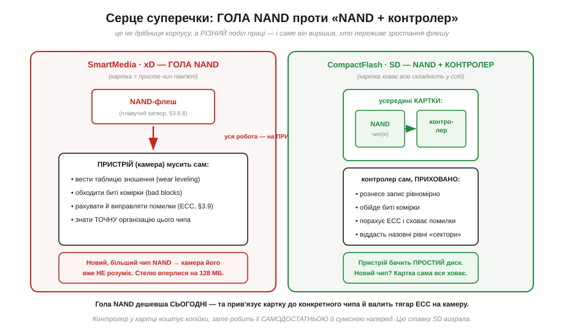
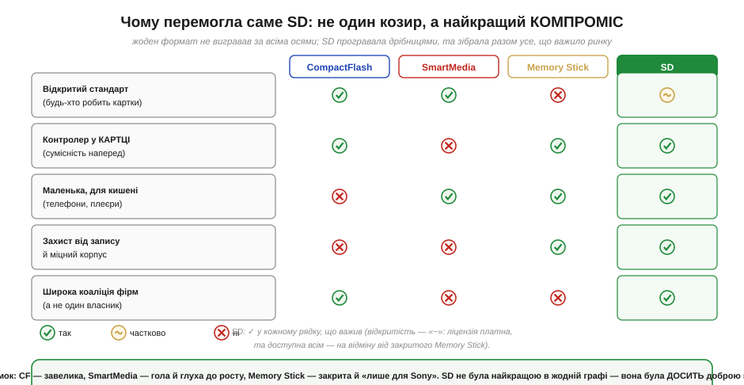

# 📜 Війна карток пам'яті: CF, MMC, SD, Memory Stick — як SD перемогла

> Це історична вставка до теми [§3.8.6 «SD-картка зсередини: NAND + контролер»](external-memory.md). У темі ми розбираємо SD так, ніби вона завжди була очевидним стандартом: вставив у тримач, увімкнув SPI-режим — і працюєш. Та очевидною вона стала не одразу. Наприкінці 1990-х на ринку точилася справжня **війна форматів**: щонайменше пів десятка несумісних карток від різних виробників, кожна зі своїм роз'ємом, своєю філософією й своїми покровителями. Фотоапарат брав одну, плеєр — іншу, кишеньковий комп'ютер — третю, і жодна не лізла в чужий слот. А вже за кілька років зоопарк згорнувся майже до однієї картки — **SD**, — яку сьогодні ви, не замислюючись, кладете у свій проєкт. Ця історія — про те, **чому** перемогла саме вона; і відповідь повчальна, бо SD не була найкращою в жодній окремій графі. Вона була розумним **компромісом**, зібраним широкою коаліцією фірм, — на противагу яскравим, але вузьким рішенням суперників. І, що важливо для нас, центром усієї цієї боротьби виявилася та сама технічна ідея, заради якої тему й написано: **контролер усередині картки**.

Розробникові вбудованих систем ця історія не абстрактна. Ви досі бачите в продажу і CompactFlash, і microSD, і подеколи навіть екзотичні Memory Stick зі старих камер; ви читаєте в даташитах «SPI-режим SD» і «класи швидкості» — і кожна з цих звичок має своє коріння в тій давній війні. Знаючи, чому одні картки відмерли, а одна вижила, ви краще розумієте, що саме купуєте, коли впаюєте тримач SD у свою плату. Почнімо з того, з чого почалася й сама війна, — з першого формату, що зробив флеш-картку практичною.

*Рис. 3.8.6h.1. Десять років змагання форматів. **1994** — SanDisk випускає CompactFlash, велику й міцну картку з контролером усередині. **1995** — Toshiba відповідає SmartMedia: тонша й дешевша, бо це гола NAND без контролера. **1997** — SanDisk із Siemens і Nokia роблять крихітну MMC для телефонів. **1998** — Sony йде власним, закритим шляхом із Memory Stick. **1999–2000** — SanDisk, Panasonic і Toshiba випускають SD і відкривають стандарт через SD Association. **2003** — SD виходить уперед за часткою ринку. **2005 і далі** — microSD вростає у смартфони й закриває питання остаточно. Кожен колір — окремий «табір» цієї війни.*

## 1994: CompactFlash — велика, міцна й з контролером усередині

Усе почалося з компанії, що в цій історії з'являтиметься знов і знов, — **SanDisk** (заснована 1988-го трьома інженерами, серед яких ізраїльтянин **Елі Гарарі**, *Eli Harari*, фахівець саме з фізики флеш-пам'яті). Саме SanDisk **1994 року** випустила **CompactFlash** (*CompactFlash*, CF) — один із перших комерційно успішних форматів флеш-карток. І хоча сьогодні CF здається громіздкою, її закладка визначила всю подальшу війну, тож варто зрозуміти, що саме там придумали правильно.

Ключове рішення CF — те, з якого виросте вся тема §3.8.6: усередину картки поклали не лише чипи NAND-флеш (ту саму пам'ять на плавучому затворі з §3.6.8), а й **контролер** — маленький процесор, що ховає всю незручну фізику флешу від зовнішнього світу. Сам по собі NAND капризний: писати можна лише сторінками, стирати лише великими блоками, комірки зношуються від перезапису (§3.6.8), а подеколи від народження бувають биті. Контролер CF брав усе це на себе: рознесення запису по комірках (щоб зношувалися рівномірно), обхід битих блоків, підрахунок кодів корекції помилок (саме ту роботу, що ми вивчатимемо в §3.9). Назовні картка вдавала простий **диск** із рівними секторами — її навіть під'єднували через інтерфейс, сумісний зі стандартом жорстких дисків того часу (ATA/IDE). Для камери чи комп'ютера це означало: можна не знати анічогісінько про NAND, просто читай і пиши сектори.

Платою за цю самодостатність був розмір. CF вийшла відносно великою й товстою — для професійної фототехніки це не біда (там і донині цінують її надійність та місткість), але в тонкий телефон чи плеєр така картка не лізла. Щойно цифрова техніка почала дрібнішати, постало очевидне питання: чи не можна зробити те саме, але **менше**? І першу відповідь дали ті, хто вирішив викинути з картки якраз найдорожче — контролер.

## 1995: SmartMedia — гола NAND, або чому простота вийшла боком

Відповідь Toshiba з'явилася влітку **1995 року** й називалася **SmartMedia** (*SmartMedia*; спершу — SSFDC, Solid State Floppy Disk Card). Її філософія була протилежна до CF і, на перший погляд, спокуслива: зробімо картку якомога тоншою й дешевшою, **викинувши контролер геть**. SmartMedia була, по суті, голим чипом NAND-флеш, заламінованим у тонку пластикову картку завтовшки менш ніж міліметр, із пласкими контактами назовні. Ні процесора, ні логіки — сама пам'ять.

Спершу це здавалося перемогою: картка вийшла справді тонка, дешева у виробництві й популярна в ранніх цифрових фотоапаратах. Та сама ощадливість, що дала їй фору, виявилася закладеною бомбою — і тут криється найважливіший технічний урок усієї історії. Якщо контролера в картці нема, то всю **брудну роботу** з NAND мусить робити **сам пристрій**: камера повинна власноруч вести облік зношення, обходити биті комірки, рахувати корекцію помилок і — найголовніше — знати **точну організацію** конкретного чипа пам'яті. А флеш-технологія в ті роки гнала вперед семимильними кроками: що рік — то новіший, більший, інакше влаштований чип NAND. І щоразу виходило, що **стара камера не розуміла нову картку**: її прошивка просто не знала, як адресувати незнайомий чип. SmartMedia вперлася в стелю місткості близько **128 МБ** (приблизно до 2001 року) — і не могла рости далі, не ламаючи сумісності з уже проданими апаратами.

> 🔧 **Навіщо це.** Саме цей контраст — «гола NAND проти NAND із контролером» — і є серце теми §3.8.6. SmartMedia наочно показала, **чому** SD-картці потрібен власний контролер: він розв'язує картку від конкретного чипа пам'яті. Усередині сучасної SD виробник може поставити будь-який новий NAND — а назовні вона лишається тією самою «простою флешкою», бо контролер ховає всі зміни. Без цього прошарку кожен новий чип ламав би сумісність, як і ставалося зі SmartMedia.

*Рис. 3.8.6h.2. Той самий поділ, що визначив усю війну. Ліворуч (SmartMedia, згодом xD): картка — це лише чип NAND, тож облік зношення, обхід битих комірок і корекцію помилок (§3.9) мусить робити сам пристрій, та ще й знати точну будову чипа; новий, більший NAND стара камера вже не розуміє. Праворуч (CompactFlash, SD): усередині картки сидить контролер, який бере всю цю роботу на себе й віддає назовні простий «диск» із рівними секторами; новий чип картка ховає сама. Контролер коштує копійки — а робить картку самодостатньою й сумісною наперед.*

Запам'ятаймо цей урок — він повториться ще раз, у 2002-му, коли спадкоємиця SmartMedia спробує наступити на ті самі граблі. А поки що інша компанія розв'язувала зовсім інший бік задачі — не «контролер чи ні», а **розмір**.

## 1997: MMC — крихітна картка для телефонів і плеєрів

Поки CF і SmartMedia билися у світі фотоапаратів, насувалася нова хвиля пристроїв, для яких навіть SmartMedia була завелика: мобільні телефони й перші цифрові аудіоплеєри. Їм потрібна була картка геть мініатюрна. І знову в центрі опинилася SanDisk — цього разу в спілці з німецьким напівпровідниковим гігантом **Siemens** (його чиповий підрозділ невдовзі стане окремою фірмою Infineon) та фінською **Nokia**. Разом вони близько 1996 року розробили, а **1997-го офіційно представили** **MMC** — **MultiMediaCard** (*MultiMediaCard*, мультимедійна картка).

MMC була разюче маленькою — приблизно **32 × 24 × 1.4 мм**, завбільшки з поштову марку й тонша за сірник. Усередині вона мала контролер (у дусі CF, а не SmartMedia), тож була самодостатня, а спілкувалася з пристроєм по простому послідовному інтерфейсу всього на кількох контактах — куди ощадливіше за широку паралельну шину CF. Це робило її ідеальною для тісних, економних до живлення пристроїв. Щоб просувати формат, чотирнадцять компаній **1998 року** заснували галузеве об'єднання — **MMCA** (MultiMediaCard Association).

Сама MMC масового ринку не завоювала, але її історична роль величезна: вона стала **фундаментом**, на якому збудують SD. Електричний інтерфейс, форм-фактор, сама ідея крихітної самодостатньої картки на послідовній шині — усе це SD успадкує майже без змін. У певному сенсі SD — це «MMC, доведена до пуття». Та перш ніж дійти до неї, у війну вступив гравець, що вирішив не домовлятися ні з ким, — і його приклад від протилежного пояснює половину перемоги SD.

## 1998: Memory Stick — Sony йде своїм, закритим шляхом

Наприкінці **1998 року** (зазвичай називають жовтень) до бійки долучилася **Sony** зі своїм форматом **Memory Stick** (*Memory Stick*) — характерною видовженою «жуйкою», яку важко з чимось сплутати. Технічно картка була цілком пристойна. Та визначальною стала не техніка, а **стратегія**: Memory Stick був **закритим, фірмовим** форматом Sony. Спершу його ставили майже виключно у власні пристрої Sony — камери, плеєри, ноутбуки, перші PlayStation Portable, — і стороннім виробникам потрапити в цю екосистему було важко.

Тут варто бути обережним і не зводити все до простого «жадібна Sony програла», як інколи спрощують перекази. Sony чудово пам'ятала власний болючий урок — **Betamax**: чудовий відеоформат 1970-х, що програв технічно гіршому VHS саме тому, що Sony тримала його надто закритим, тоді як конкуренти вільно ліцензували VHS усім охочим. Тож **у жовтні 1999 року** Sony таки почала **ліцензувати** Memory Stick стороннім — серед перших ліцензіатів називають Fujitsu, Aiwa, Sanyo, Sharp, Pioneer і Kenwood, — прямо посилаючись на бажання «не повторити провал Betamax». Згодом формат навіть розрісся цілим сімейством: компактніша **Memory Stick Duo** (2002), швидша **Memory Stick PRO** (2003, до речі — спільна розробка з тією ж SanDisk), зовсім крихітна **Memory Stick Micro / M2** (2006). Тобто Sony вчилася на помилках і відкривалася — але **запізно й половинчасто**: у масовій свідомості Memory Stick намертво лишився «карткою лише для Sony». А тим часом конкуренти готували формат, відкритий **із самого початку**.

## 1999–2000: SD — компроміс, що переміг

І ось **у серпні 1999 року** на сцену вийшла **SD** — **Secure Digital** (*Secure Digital*, «захищена цифрова»). Її створив союз одразу трьох вагомих гравців: **SanDisk**, **Panasonic** (тоді ще під назвою Matsushita) і **Toshiba**. Уже сам склад коаліції — досвід SanDisk у флеші, виробнича міць Panasonic і Toshiba — задавав їй вагу, якої не мав жоден поодинокий формат.

Технічно SD не винаходила велосипед, а **збирала найкраще з уже відомого**. За основу взяли перевірений електричний інтерфейс і форм-фактор **MMC** — настільки близько, що ранні SD-пристрої часто читали й старі MMC. До цієї основи додали три речі, яких бракувало. По-перше, **захист контенту** (DRM) — звідси й «Secure» у назві: галузь грамзапису й кіно тоді панічно боялася піратства, і картка з апаратним захистом відкривала двері до музики й відео (саме під це Microsoft разом із фундаторами SD у лютому 2000-го оголосила підтримку свого медіаформату на SD). По-друге, **механічний перемикач захисту від запису** — той самий зсувний язичок збоку, який ви бачите на повнорозмірній SD донині: зрушив — і картку не можна перезаписати випадково. По-третє, **міцніший корпус**, надійніший за тонку й ламку SmartMedia. Усередині, звісно, був **контролер** — тобто SD стала на бік CF і MMC у тій давній суперечці про «голу NAND», успадкувавши всю самодостатність, якої бракувало SmartMedia.

Та головний козир був не технічний, а **організаційний** — і саме тут SD виграла війну ще до першого пострілу. Замість тримати формат при собі, як Sony, троє фундаторів **у січні 2000 року** на виставці CES оголосили про створення **SD Association** (SDA) — неприбуткового об'єднання, відкритого для будь-якого виробника, що хоче робити SD-картки чи пристрої. Управління патентами й ліцензіями винесли в окрему компанію **SD-3C**. Так, ліцензія коштувала грошей і формат не був «вільним» у повному сенсі — тому на нашій матриці (Рис. 3.8.6h.3) відкритість SD позначено радше «частково», ніж беззастережним «так». Але порівняно із замкненим Memory Stick це була **прірва**: будь-яка фірма світу могла приєднатися й випускати сумісні картки та слоти. Ринок дістав те, чого прагнув найбільше, — **єдиний стандарт із багатьма постачальниками**, а не вотчину одного власника.

*Рис. 3.8.6h.3. Підсумкова матриця війни. Жоден формат не вигравав за всіма осями, що важили ринку: CompactFlash була завелика для кишені; SmartMedia — гола й глуха до росту флешу; Memory Stick — закрита й майже «лише для Sony». SD не була найкращою в жодній окремій графі (її відкритість — «частково»: ліцензія платна, та доступна всім), зате виявилася **досить доброю в кожній** — відкритий стандарт, контролер у картці, кишеньковий розмір, захист від запису й широка коаліція фірм. Перемагає не рекордсмен у вузькій дисципліні, а найкращий компроміс.*

## Чому перемогла саме SD

Тепер видно, чому війну виграла саме SD, — і це не один козир, а їхня сума. Зведімо нитки докупи. **CompactFlash** мала рацію щодо контролера, але програла на розмірі — й тому залишилася у нішевому професійному світі, де габарити не критичні. **SmartMedia** виграла на дешевизні «сьогодні», але голій NAND не було куди рости, і вона вмерла разом зі своєю стелею в 128 МБ. **Memory Stick** мала добру техніку, але закритість Sony відштовхнула решту галузі — а проти цілої коаліції самотужки не встояти. **SD** же не перемагала в жодній окремій графі: вона була **досить доброю в усіх** — досить мала, самодостатня завдяки контролеру, з потрібними дрібницями на кшталт захисту від запису, і, найголовніше, **відкрита для всіх виробників**.

Числа підтвердили перелом швидко. Уже до **листопада 2003 року** SD захопила в США близько **42%** ринку карток — попереду CompactFlash (≈ 26%) і Memory Stick (≈ 16%). А далі стався хід, що поставив крапку: у середині 2000-х з'явилася **microSD** — крихітна версія SD завбільшки з ніготь, — і вросла в кожен наступний смартфон. Це остаточно зробило SD **стандартом за замовчуванням** для всієї портативної електроніки. Промовистий фінал: навіть сама Sony, незламний прапороносець власного формату, **2010 року** почала ставити слоти SD у свої камери поряд із Memory Stick, а згодом тихо перейшла на SD геть — здавшись тому самому відкритому стандарту, проти якого колись виставила свою «жуйку».

І ось наскрізна нитка всієї цієї історії, яку варто забрати з собою: тут, як і всюди в техніці, перемогла **не геніальна одиночна ідея, а вдалий компроміс, підпертий широкою спілкою**. Memory Stick був, можливо, не гіршим за SD технічно — але стояв на самій лише Sony. SD стояла на трьох потужних фундаторах і відкритому об'єднанні, до якого міг пристати будь-хто, — і саме ця спільність, а не якась окрема перевага картки, зробила її всюдисущою. Урок не новий (ми вже бачили його з Betamax проти VHS), але тут він записаний особливо чисто.

Що з цієї війни лишилося у **вашому** проєкті? Коли ви впаюєте у плату [тримач microSD](book:components/microsd-card) і вмикаєте SPI-режим (про сам інтерфейс — у Модулі 6), ви користуєтесь прямим спадком тієї перемоги: відкритим стандартом, який реалізує будь-який виробник, і **контролером усередині картки**, що ховає від вас усю капризну фізику NAND — облік зношення, биті блоки, корекцію помилок (§3.9). Саме завдяки цьому контролеру ваша програма бачить не плавучі затвори й сторінки стирання, а простий рівний «диск» із секторами. Це і є та сама ідея, з якою народилася CompactFlash 1994 року, яку відкинула — собі на згубу — SmartMedia, і яку SD довела до досконалості. Тему §3.8.6 написано рівно про це осердя; історія ж пояснює, **чому** воно стало стандартом і яку ціну заплатили ті, хто на нього не зважив.
