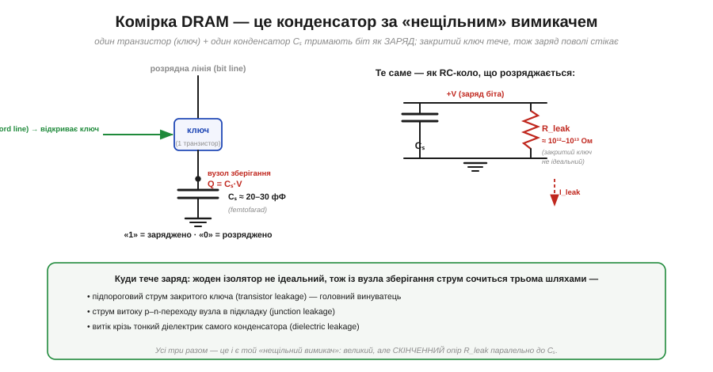
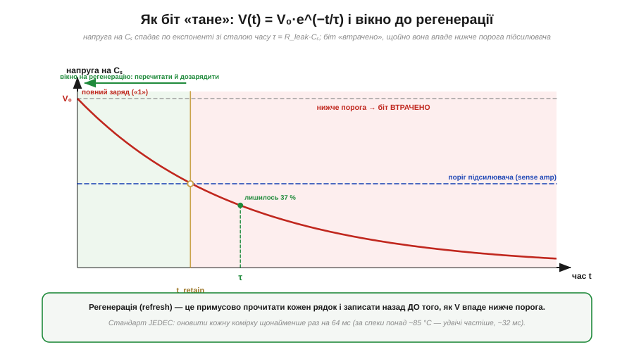
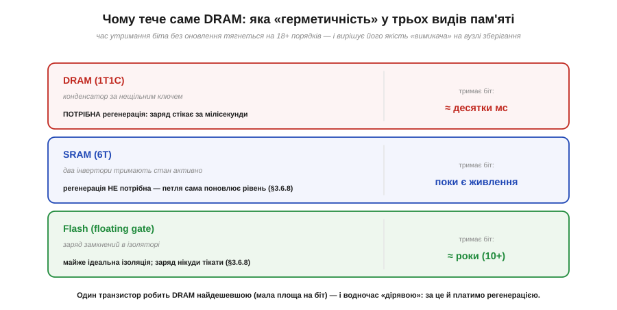

# 🧮 Чому DRAM «тече»: RC-оцінка комірки й мілісекунди до втрати біта

> Математична вставка до теми [§3.8.2 «DRAM: транзистор і конденсатор»](external-memory.md). Там ми побачили, з чого складена комірка — один транзистор-ключ і один крихітний конденсатор — і сказали, що заряд на ньому «з часом стікає», тому DRAM доводиться **регенерувати** (*refresh*). Тут ми це оцінимо числом: змоделюємо комірку як коло, що розряджається, виведемо, **як швидко** напруга на конденсаторі падає, і прикинемо той самий час до втрати біта, що в стандартах записаний як 64 мс. Уся фізика — це знайома вже **RC-стала часу**: та сама, що в §1.3.9 рахувала нагрів деталі, лише тепер вона міряє, скільки житиме записаний нуль чи одиниця.

### Означення: біт — це заряд, а ключ — не ідеальний

Почнімо з точного запису того, що §3.8.2 описав словами. Комірка DRAM — це **одна ємність зберігання** Cₛ (*storage capacitor*) і **один транзистор-ключ** (*access transistor*), що з'єднує її з розрядною лінією лише на час доступу. Біт — це **заряд** на Cₛ: повна ємність — логічна «1», порожня — «0». Кількісно заряд і напруга пов'язані основним співвідношенням конденсатора:

```
Q = Cₛ · V     (заряд = ємність × напруга)
```

Якби ключ був ідеальним вимикачем, зачинившись, він тримав би заряд вічно. Але в кремнії ідеальних вимикачів немає: закритий транзистор усе одно пропускає крихітний **підпороговий струм** (з §2.7), а заряд додатково сочиться крізь p–n-перехід вузла в підкладку й крізь тонкий діелектрик самого конденсатора. Усі ці шляхи разом — це **струм витоку** I_leak, який повільно спорожняє Cₛ. Саме тому комірку чесніше малювати не як «конденсатор за вимикачем», а як конденсатор, до якого паралельно підвішений дуже великий, але **скінченний** опір витоку.


*Рис. 3.8.2m.1. Ліворуч — фізична комірка: транзистор-ключ, конденсатор Cₛ ≈ 20–30 фФ і вузол зберігання, де живе заряд Q = Cₛ·V. Праворуч — та сама комірка як коло: Cₛ паралельно до витокового «резистора» R_leak ≈ 10¹²–10¹³ Ом. Знизу — три шляхи, якими заряд тікає (підпороговий струм ключа, витік переходу, витік діелектрика); їхня сума і є той «нещільний вимикач».*

### Інтуїція: конденсатор крізь опір — це експонента

Щойно ми домалювали R_leak паралельно до Cₛ, картина стала точнісінько такою, як у RC-колі з §1.3.9, лише «навпаки»: там ємність **заряджалася**, тут — **розряджається**. Заряджений конденсатор, з'єднаний з опором, віддає крізь нього заряд, і напруга на ньому спадає **не лінійно, а по експоненті**: спершу швидко, потім дедалі повільніше, бо що менший заряд лишився, то менший струм він жене. Це той самий закон, що описує охолодження чашки чаю чи розряд батарейки крізь резистор: швидкість падіння в кожну мить пропорційна тому, що ще лишилося.

### Апарат: стала часу τ = R_leak·Cₛ

Формально напруга на комірці спадає від початкової V₀ за законом:

```
V(t) = V₀ · e^(−t/τ),     де   τ = R_leak · Cₛ   (секунди)
```

Добуток опору на ємність дає **сталу часу** τ — єдину величину, що задає темп розряду. За час τ напруга падає в e ≈ 2.72 раза, тобто до ≈37 % від початкової; за 2τ — до ≈14 %, і так далі. Але біт «втрачено» **не тоді, коли заряд вичерпався повністю**, а значно раніше — щойно напруга впаде нижче **порога підсилювача читання** (*sense amplifier*), який відрізняє «1» від «0». Якщо взяти цей поріг приблизно на половині розмаху, момент утрати настає, коли V(t) = V₀/2:

```
V₀/2 = V₀ · e^(−t/τ)   →   t_retain = τ · ln 2 ≈ 0.69 · τ
```

Цю величину t_retain — час, доки комірка ще впевнено читається, — і називають **часом утримання** (*retention time*).


*Рис. 3.8.2m.2. Напруга на Cₛ спадає по V(t) = V₀·e^(−t/τ). За час τ лишається 37 % заряду; щойно крива опускається нижче порога підсилювача (синя лінія), біт уже не прочитати — це момент t_retain ≈ 0.7·τ. Зелена зона ліворуч — вікно, доки регенерація мусить устигнути перечитати рядок і дозарядити комірку; правіше (рожеве) біт уже втрачено. Стандарт JEDEC кладе на це вікно 64 мс.*

### Приклад (скільки житиме біт у реальній комірці)

Підставмо правдоподібні числа. Візьмемо ємність зберігання Cₛ = 25 фФ, повний заряд при V₀ = 1.0 В і поріг на половині (ΔV = 0.5 В). Найзручніше рахувати через струм витоку, бо саме він стоїть у даташитах; для «слабкої» комірки на межі допуску візьмемо I_leak ≈ 200 фА. Тоді час, за який напруга просяде на пів-вольта, дає елементарна «ємність-струм-час» (Q = C·V, тож I = C·ΔV/Δt):

```
t_retain = Cₛ · ΔV / I_leak
         = (25×10⁻¹⁵ Ф · 0.5 В) / (200×10⁻¹⁵ А)
         = 12.5×10⁻¹⁵ / 2.0×10⁻¹³
         = 6.25×10⁻² с ≈ 62 мс
```

Ось звідки беруться ті самі **десятки мілісекунд**: незалежна оцінка з фізики комірки впала майже точно на стандартні **64 мс**. Те саме число можна дістати й через опір витоку. Раз t_retain = τ·ln2, то τ ≈ 62 мс / 0.69 ≈ 90 мс, а отже:

```
R_leak = τ / Cₛ = 0.090 с / 25×10⁻¹⁵ Ф ≈ 3.6×10¹² Ом ≈ 3.6 ТОм
```

— тобто опір витоку справді тераомного масштабу, як і підписано на Рис. 3.8.2m.1. І, щоб відчути, наскільки крихкий цей заряд: повний Q = Cₛ·V₀ = 25 фКл — це лише

```
N = Q / e = 25×10⁻¹⁵ / 1.6×10⁻¹⁹ ≈ 1.5×10⁵ ≈ 150 000 електронів,
```

і втратити з них половину — уже катастрофа для біта. Тому важлива засторога: 64 мс — це **межа для найгірших** комірок плюс запас; типова «здорова» комірка тече на порядок-два слабше (одиниці фА) і втримала б заряд секундами. Але контролер мусить орієнтуватися на найслабшу комірку всього масиву — звідси й береться єдине жорстке обмеження для всіх.

> 🔧 **Навіщо це.** Ця оцінка пояснює саме існування **регенерації** — і її ціну. Раз кожна комірка втрачає біт за десятки мілісекунд, контролер мусить устигнути перечитати й дозарядити **кожен** рядок масиву щонайменше раз на 64 мс (а за нагріву понад ~85 °C — удвічі частіше: вищий струм витоку вкорочує τ). Звідси практичні наслідки, видимі в даташитах: фонове споживання DRAM навіть «у спокої», окремий струм самооновлення (*self-refresh*) у режимі сну, гарантована частка часу, яку шина витрачає не на корисні дані, а на регенерацію. Розуміючи механізм, ви читаєте ці рядки даташита не як магію, а як прямий наслідок RC-розряду крихітної ємності.

### Де це працює в курсі

Ця вставка ставить число під якісне твердження §3.8.2: DRAM дешева, бо комірка — це лише транзистор і конденсатор, і саме тому ж вона «тече» й потребує регенерації. Контраст із сусідами стає аж очевидним. **SRAM** (§3.6.8) тримає біт активною петлею з двох інверторів — вона не має конденсатора, що розряджається, тож регенерація їй не потрібна взагалі, поки є живлення. А **Flash** із плавним затвором (§3.6.8) замикає заряд усередині майже ідеального ізолятора — і та сама експонента розтягується з мілісекунд на роки. Один і той самий RC-механізм, лише з кардинально різним R, пояснює весь спектр: від «оновлюй щомиті» до «зберігає десятиліттями».


*Рис. 3.8.2m.3. Чому тече саме DRAM. Усе вирішує «герметичність» вузла зберігання: у DRAM заряд за нещільним ключем стікає за десятки мілісекунд (потрібна регенерація); SRAM активно поновлює рівень і тримає, доки є струм; Flash замикає заряд в ізоляторі й зберігає роками. Плата за дешевизну DRAM — постійне оновлення.*

Те, **як** контролер організовує це оновлення в часі — коли саме чергувати регенерацію з читанням і записом, щоб устигнути в 64-мілісекундне вікно й не загубити пропускної здатності, — це вже робота контролера пам'яті, до якої ми перейдемо далі в розділі. Тут важливо лише міцно тримати причину: біт DRAM — це заряд на конденсаторі за неідеальним ключем, а отже, він приречений танути по експоненті, і єдина рада — встигнути дозарядити його раніше, ніж він опуститься нижче порога.
