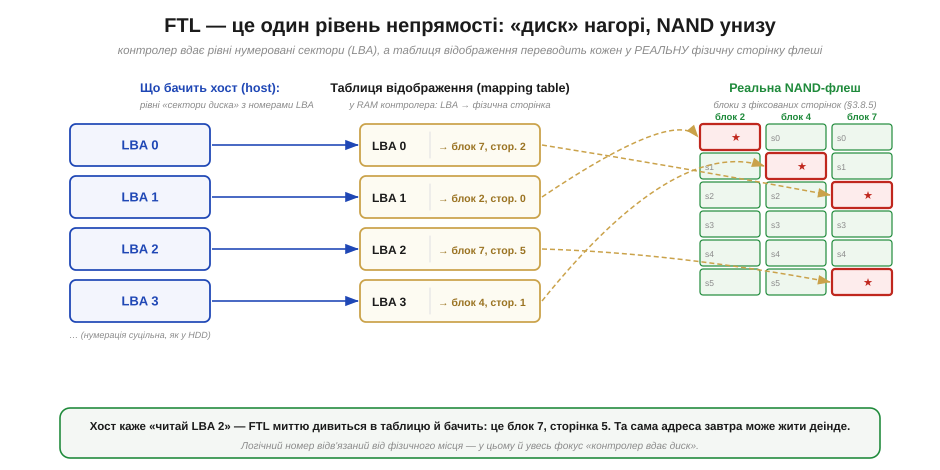
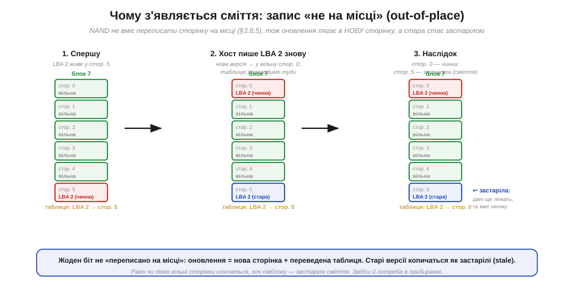
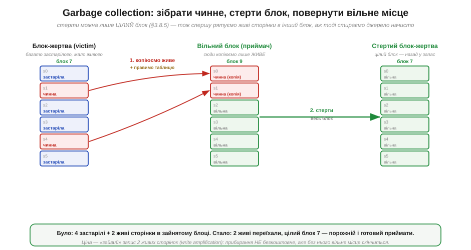

# ⚙️ Іграшковий FTL: таблиця відображення і garbage collection у 100 рядків

> Алгоритмічна вставка до теми [§3.8.7 «eMMC і SSD якісно: FTL — прошарок, що вдає з себе диск»](external-memory.md). Там ми з'ясували це **зовні**: операційна система гадає, що під нею звичайний диск із рівних нумерованих секторів, а насправді всередині — примхлива NAND-флеш, і контролер лише **вдає** диск через прошарок **FTL** (*Flash Translation Layer*, рівень трансляції флеші). Лишилося побачити **зсередини**, як саме цей фокус робиться. Найкоротший шлях — зібрати найпростіший робочий FTL власноруч: навмисне наївний, у сотню рядків, зате видно кожну шестерню, що перетворює «дірчасту» флеш на охайний диск.

## Задача

Згадаймо, чим NAND-флеш незручна (§3.8.5). Читати й писати її можна **посторінково** (*page*, типово кілька кілобайтів), але стерти окрему сторінку не можна — стирається лише **цілий блок** (*erase block*) з десятків чи сотень сторінок одразу. Гірше того: записати у сторінку можна, **лише** якщо вона перед тим стерта; переписати зайняту сторінку «поверх» не вийде. А хост (*host*) — комп'ютер, що звертається до накопичувача — нічого цього знати не хоче. Він шле прості команди «запиши сектор номер N» і «прочитай сектор номер N», де N — **логічна адреса** (*LBA, logical block address*), наче на старому жорсткому диску, де будь-який сектор переписують на місці скільки завгодно разів.

Отже, задача FTL — **видати рівний диск поверх нерівної флеші**: прийняти потік команд «читай/пиши сектор N» і виконати їх на залізі, що вміє лише посторінковий запис у попередньо стерті блоки. Усе непідходяще — стирання цілими блоками, заборону перезапису на місці — треба сховати від хоста.

## Ідея: таблиця відображення + запис «не на місці»

Ключ до всього — **один рівень непрямості** (*indirection*). Замість писати сектор N у якесь закріплене за ним місце, ми **відв'язуємо** логічний номер від фізичного й тримаємо **таблицю відображення** (*mapping table*): для кожного LBA — де **зараз** лежать його дані, тобто в якому блоці й на якій сторінці. Хост каже «читай сектор N» — FTL зазирає в таблицю й бачить фізичну сторінку (Рис. 3.8.7a.1). У цьому й увесь секрет «контролер вдає диск».


*Рис. 3.8.7a.1. FTL — один рівень непрямості. Хост бачить рівні сектори (LBA); таблиця в RAM контролера переводить кожен LBA у реальну фізичну сторінку всередині блока флеші. Логічний номер відв'язано від фізичного місця — тож та сама адреса завтра може жити в іншому блоці.*

Така непрямість одразу знімає **заборону перезапису на місці**. Коли хост пише в сектор, який уже десь лежить, ми не чіпаємо стару сторінку (на місці її однак не перезаписати) — а кладемо нові дані у **вільну** стерту сторінку, після чого **переводимо в таблиці** запис цього LBA на неї. Цей прийом — **запис «не на місці»** (*out-of-place write*): фізичне місце сектора щоразу нове, а логічний номер сталий (Рис. 3.8.7a.2).


*Рис. 3.8.7a.2. Оновлення сектора лягає в нову сторінку, а таблицю переводимо на неї. Стара сторінка з минулою версією даних стає **застарілою** (*stale*): дані ще лежать, та вже нікому не потрібні. Жоден біт не переписано «на місці».*

Та за елегантність доводиться платити, і плата нагромаджується сама. Кожен перезапис лишає по собі **застарілу сторінку** (*stale page*) — стару версію, яку вже ніхто не читає, але яка досі займає місце. Вільні сторінки тануть, і рано чи пізно їх не лишається зовсім, хоча добра частина флеші — застаріле сміття. Стерти ж його точково не можна: стирання працює лише **цілими блоками**, а в кожному блоці впереміш і застарілі сторінки, і ще потрібні, чинні.

Звідси сама собою постає друга половина FTL — **прибирання сміття** (*garbage collection*, GC). Ідея проста: вибрати блок, де застарілого багато, а чинного мало (його звуть **блоком-жертвою**, *victim block*); вцілілі **чинні** сторінки скопіювати у вільний блок (і, звісно, поправити на них таблицю); а тоді спорожнілий блок-жертву стерти **цілком** — і повернути в запас уже як свіжі вільні сторінки (Рис. 3.8.7a.3).


*Рис. 3.8.7a.3. Прибирання сміття: чинні сторінки блока-жертви переписуємо в інший блок, виправляємо таблицю — і аж тоді стираємо весь блок-жертву начисто. Він знову порожній і готовий приймати записи. Ціна — «зайвий» перезапис чинних сторінок.*

## Псевдокод

Стан FTL — це таблиця `map[LBA] → (блок, сторінка)`, позначка чинності кожної фізичної сторінки та лічильник вільних сторінок у поточному блоці для запису.

```
read(lba):
    (блок, стор) = map[lba]            # один погляд у таблицю
    повернути дані фізичної сторінки (блок, стор)

write(lba, дані):
    якщо вільних стерти-сторінок нема:
        garbage_collect()             # звільнити блок під запис
    (блок, стор) = наступна вільна сторінка
    записати дані у (блок, стор)       # завжди в стерту → «не на місці»
    стара = map[lba]
    якщо стара існує:
        позначити стара як ЗАСТАРІЛУ   # минула версія — сміття
    map[lba] = (блок, стор)            # перевести LBA на нове місце

garbage_collect():
    victim = блок із найбільшою часткою застарілих сторінок
    для кожної ЧИННОЇ сторінки p у victim:
        new = наступна вільна сторінка (в іншому блоці)
        скопіювати p → new
        map[ lba сторінки p ] = new   # таблиця тепер указує на копію
    стерти(victim)                     # цілий блок — назад у запас вільних
```

Два рядки тут варті окремого слова. Перший — позначка «застаріла»: без неї GC не відрізнить живі дані від мертвих і або зітре потрібне, або не звільнить нічого. Другий — правка таблиці **під час** копіювання в GC: щойно чинну сторінку переписано, її LBA мусить негайно вказувати на копію, інакше після стирання блока-жертви читання поведе в нікуди. Аби знати, **чий** LBA несе фізична сторінка (це потрібно рядкові `map[ lba сторінки p ]`), його зазвичай дописують поряд із самими даними — у службове поле сторінки.

## Складність і пастки на МК

- **Читання — швидке й передбачуване.** `read` — це один погляд у таблицю плюс посторінкове читання флеші: фактично O(1). Саме тому FTL і дає рівну, «дискову» поведінку на читанні.
- **Запис — нерівний у часі.** Звичайний `write` теж дешевий, та коли вільні сторінки вичерпались, його доганяє **garbage collection** — а це копіювання кількох сторінок плюс повільне стирання блока. Звідси **сплески затримки**: окремий запис раптом триває набагато довше за сусідні. Полегшують це тим, що GC роблять **наперед**, у простої, а не тоді, коли місце вже скінчилось.
- **Підсилення запису (write amplification).** GC переписує **чинні** сторінки блока-жертви, тож на один запис від хоста припадає більше **фізичних** записів у флеш. Що повніший накопичувач і що менше в блоках застарілого, то дорожче обходиться кожне прибирання — і то швидше зношується флеш.
- **Таблиця займає RAM.** Повна таблиця «сторінка-в-сторінку» — це запис на кожен LBA; для великого накопичувача вона величезна. На дрібному контролері (§3.8.6) часто відображають не сторінки, а цілі блоки, або тримають у RAM лише гарячу частину таблиці — компроміс між обсягом RAM і точністю відображення.
- **Зрив живлення на півдорозі.** GC і перезапис ідуть кількома кроками (записати копію → виправити таблицю → стерти джерело). Якщо живлення зникне посеред цього, таблицю треба вміти **відновити** з тих службових полів, що лишилися у сторінках; інакше відображення розсиплеться, а з ним і весь «диск».
- **Рівномірність зносу — окрема велика тема.** Наш іграшковий GC вибирає жертву лише за кількістю сміття. Справжній FTL мусить ще й **розмазувати знос** рівно по всіх блоках, бо комірки флеші витримують скінченне число стирань. Цей механізм — **вирівнювання зносу** (*wear leveling*) — докладно розбирається в §4.3.3; тут ми його свідомо лишаємо за дужками.

> ⚙️ **Навіщо це.** FTL — не магія, а проста бухгалтерія поверх флеші: **таблиця відображення** (LBA → фізична сторінка) плюс **запис не на місці**, який і дає ілюзію перезапису на місці. Розплата за непрямість — застарілі сторінки, тож друга половина FTL — **garbage collection**: зібрати чинне, стерти блок цілком, повернути вільне місце. Зрозумівши цю сотню рядків, ви читаєте поведінку справжнього eMMC чи SSD як відкриту книгу: і звідки в них сплески затримки, і чому повний накопичувач уповільнюється, і чому раптовий обрив живлення для них небезпечніший, ніж для простого жорсткого диска.

### Звідки взявся FTL

Наостанок — справжня історія самої ідеї (§10). Прийом «таблиця відображення + запис не на місці» молодший, ніж здається: він народився не з флеш-пам'яті, а з **журнально-структурованих файлових систем** (*log-structured file systems*). Думку «не переписуй на місці, а дописуй нову версію й переводь покажчик» систематизували **Мендел Розенблюм** (*Mendel Rosenblum*) і **Джон Остергаут** (*John Ousterhout*) у роботі про LFS (Берклі, 1991–92) — спершу заради швидкого запису на жорсткі диски, а не заради флеші.

Та саме флеш-пам'ять зробила цю ідею неминучою: її «стирай блоками, не переписуй на місці» — буквально те, на що журнальний підхід лягає як влитий. Прошарок, що ховає ці примхи за фасадом звичайного диска, оформив **Амір Бан** (*Amir Ban*) у компанії **M-Systems** (Ізраїль) — патент на флеш-«файлову систему» подано 1994 року (US 5,404,485). Невдовзі сам термін **FTL** закріпила специфікація флеш-карток асоціації **PCMCIA** (перевірити точну дату), і назва прижилася для всього класу таких прошарків. Паралельно дослідницькі флеш-файлові системи будували й інші — зокрема японська група **Кавагуті, Нісіока, Мотода** (*Kawaguchi, Nishioka, Motoda*), що представила свою на конференції USENIX 1995 року. Хто першим склав усі шматки докупи, документально розмежувати важко (перевірити) — як майже завжди в інженерії, ідея визрівала в кількох головах нараз. Наш іграшковий FTL — прямий нащадок цього клубка ідей, яким уже за тридцять років.
