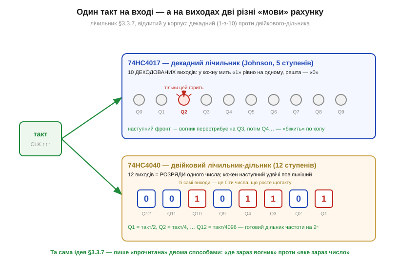
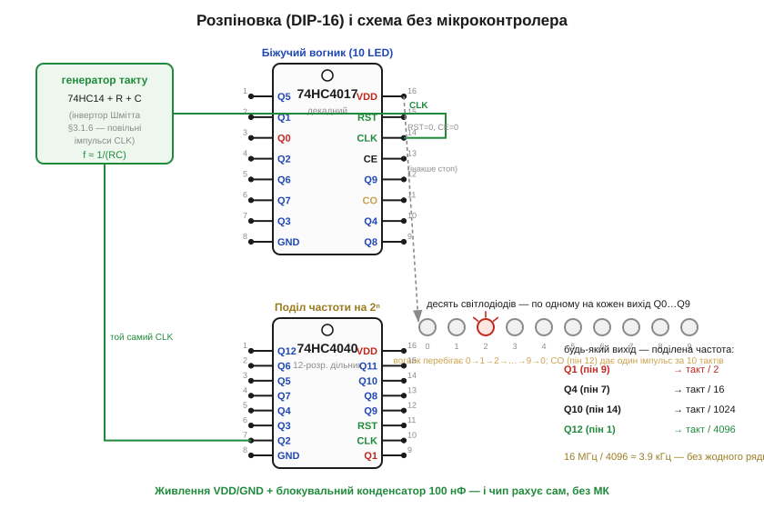
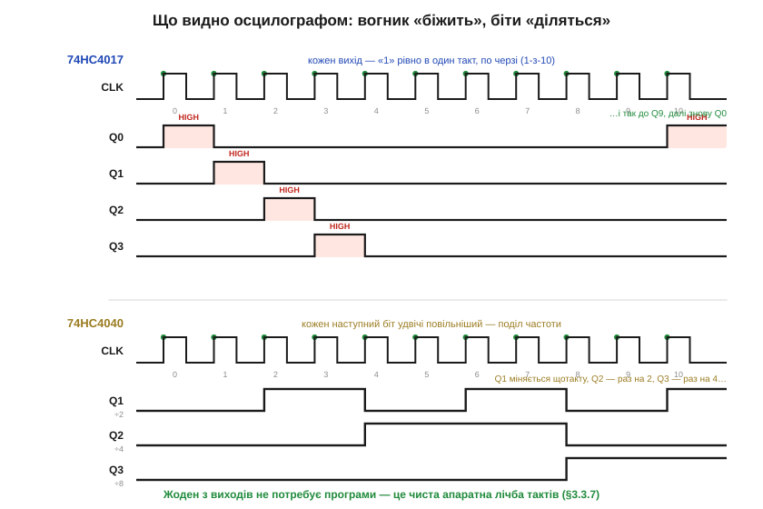

# 🔌 74HC4017/4040: біжучий вогник і дільник частоти без жодного коду

> Компонентна вставка до теми [§3.3.7 «Лічильники»](flip-flops-registers.md). У §3.3.7 ми зрозуміли лічильник зсередини: ланцюг toggle-тригерів ділить такт навпіл, а їхні виходи разом — це двійкове число, що росте щотакту. Тепер візьмемо цю саму схему вже **готовим чипом** — і змусимо її рахувати без мікроконтролера. Два копійчані корпуси, **74HC4017** і **74HC4040**, дають дві найужиткованіші форми лічильника: «біжучий вогник» по черзі й дільник частоти. Звідки взялася ця родина мікросхем — окрема історія, [§3.3.7i](hist-cmos-counters.md); тут — як її завести.

### Що це за клас: лічильник, відлитий у корпус

Обидва чипи належать до **серії 4000** (*CD4000*, технологія CMOS) і її швидшого продовження **74HCxx** (§3.1.4) — тобто живляться в широкому діапазоні (для HC — звичні 2…6 В, чудово на 5 В) і майже не їдять струму в спокої. Усередині кожного — той самий лічильник із §3.3.7, лише виведений на ніжки. Різниця між ними — у тому, **як прочитано виходи**:

- **74HC4017** — *декадний лічильник* (*decade counter*): десять **декодованих** виходів, з яких у кожну мить «у високому» рівно **один**, а наступний фронт такту перемикає вогник на сусідній. Це готовий «1-з-10».
- **74HC4040** — *двійковий лічильник-дільник* (*binary ripple counter*) на 12 розрядів: виходи Q1…Q12 — це **біти числа**, кожен наступний удвічі повільніший. Готовий поділ частоти на 2ⁿ.

*Рис. 3.3.7c.1. Один такт на вході — дві «мови» рахунку на виході. **74HC4017** запалює свої десять виходів по черзі (вогник «біжить» Q0→Q1→…→Q9→Q0); це лічильник Джонсона §3.3.7, у якому щокроку чисто, без глітчів, активний лише один вихід. **74HC4040** показує на виходах **двійкове число**, що зростає щотакту: Q1 = такт/2, Q2 = такт/4, … Q12 = такт/4096 — тобто водночас і лічильник, і дільник частоти, як ми й бачили в §3.3.7.*

### Блок-схема й розпіновка: майже самі виходи

Усередині немає ні стабілізатора, ні складної обв'язки — лише ланцюг тригерів і трохи декодувальної логіки. Тому й ніжок-«керма» обмаль: майже весь корпус DIP-16 зайнятий **виходами**, а керують чипом лічені входи.

У **4017** це **CLK** (такт), **RST** (*reset* — скинути в Q0), **CE** (*clock enable*, він же CLK INHIBIT — «стоп-такт») і службовий **CO** (*carry out*, перенос: один імпульс за повні 10 тактів — щоб каскадувати наступний чип). У **4040** усе ще простіше: лише **CLK** і **RST**. Плюс на обох — живлення **VDD/GND**.

*Рис. 3.3.7c.2. Підключення без МК. Повільний такт дає зовнішній генератор — інвертор Шмітта 74HC14 з резистором і конденсатором (§3.1.6), частота ≈ 1/(RC). У **4017** цей такт іде на CLK, а десять виходів засвічують десять світлодіодів — виходить «біжучий вогник»; RST і CE тримаємо в нулі, інакше лічильник стоїть. У **4040** той самий такт на CLK, а будь-який вихід Q — це поділена частота (Q4 = такт/16, Q12 = такт/4096). VDD/GND і блокувальний конденсатор 100 нФ — обов'язкові.*

### Підключення: дати такт і відпустити гальма

Схема живиться й заводиться трьома кроками, кожен — зі знайомого. **Живлення:** VDD на «плюс», GND на «мінус», блокувальний конденсатор 100 нФ упритул до ніжок живлення (та сама гігієна CMOS, що в §3.2.2c). **Такт:** лічильнику потрібен рівномірний CLK; найпростіше зробити його зовнішнім RC-генератором на 74HC14 (§3.1.6) — частота приблизно 1/(RC), тож резистором і конденсатором задаємо темп вогника чи вихідну частоту дільника. **Гальма:** входи керування не можна лишати в повітрі — у 4017 притягуємо **RST=0** (інакше чип вічно скинутий у Q0) і **CE=0** (інакше такт заблоковано); у 4040 притягуємо **RST=0**. Виходи навантажуємо обережно: світлодіоди — лише через струмообмежувальні резистори (§1.3.6).

### «Перший байт»: запустити й побачити рахунок

«Заговорити» тут означає просто **подати такт і подивитися на виходи** — програмувати нічого. Подайте на 4017 повільний CLK (скажімо, кілька герц) — і світлодіоди почнуть по черзі спалахувати по колу; це і є ваш «перший байт». На 4040 підімкніть осцилограф (чи ще один світлодіод) до Q1 — він блиматиме вдвічі повільніше за такт, до Q2 — вчетверо, і так далі.

*Рис. 3.3.7c.3. Що видно осцилографом. У **74HC4017** кожен вихід піднімається у «високий» рівно на **один** такт, по черзі (1-з-10), і знову Q0 — вогник біжить по колу. У **74HC4040** молодші біти діляться навпіл: Q1 міняється щотакту (÷2), Q2 — раз на два (÷4), Q3 — раз на чотири (÷8) … до Q12 (÷4096). Жоден вихід не потребує програми — це чиста апаратна лічба тактів §3.3.7.*

### Типові граблі

- **Плаваючі RST/CE.** Найчастіша помилка: лишити reset чи clock-enable «у повітрі». У CMOS такий вхід ловить наводки — і лічильник або стоїть, або скидається випадково. **Кожен** керівний вхід має сидіти на чіткому рівні (RST=0, CE=0 для нормального рахунку).
- **Який фронт рахує.** 4040 за класикою лічить за **спадним** фронтом такту, 4017 — за **наростаючим**. Якщо порядок вогника «дзеркальний» до очікуваного, річ зазвичай у фронті — звіртеся з даташитом.
- **Каскад через CO, а не через старший вихід.** Щоб з'єднати кілька 4017 у довший ланцюг, наступний чип тактують саме від **CO** (один імпульс на 10 тактів), а не від котрогось із Q-виходів.
- **Дзвін на швидкому такті.** HC-версія прудка; на високих частотах і довгих дротах край такту «дзвенить» — придушується послідовним резистором біля CLK (§3.1.5).
- **Світлодіод без резистора.** Виходи 4017 живлять світлодіоди напряму — спокуса, від якої згорають і вихід, і світлодіод. Резистор обов'язковий.

### Варіації класу

За тим самим принципом влаштована ціла полиця лічильників-чипів. **74HC4060** — той самий 4040, але з **вбудованим генератором** (досить причепити кварц або RC — окремий 74HC14 уже не потрібен). **74HC4020/4024** — двійкові дільники на іншу кількість розрядів. **74HC4022** — «вісімковий» родич 4017 (1-з-8). А там, де потрібні швидкість і синхронність (§3.3.7), беруть синхронні лічильники серії 74 — **74HC161/163**. Усі вони — той самий лічильник із §3.3.7, винесений у залізо: дайте такт, приберіть гальма з керівних входів — і чип рахує сам, без єдиного рядка коду.
