# Розділ 3.3 — Тригери, регістри й тактування

Розділ 3.2 навчив нас **рахувати**: з вентилів ми склали схеми, що додають, обирають і адресують. Та наприкінці (§3.2.7) ми вперлися в стіну — комбінаційна логіка нічого не **пам'ятає**. Її вихід залежить лише від входів **зараз**, тож вона не вміє ні зберегти результат, ні полічити кроки, ні виконати щось **по черзі**. А без пам'яті немає ні лічильника, ні регістра, ні машини, що виконує програму крок за кроком. Цей розділ переходить стіну: ми збудуємо **пам'ять** (схему, що тримає стан) і дамо їй **ритм** (тактовий сигнал, що відмірює кроки). Дорога веде від крихітної бістабільної комірки до **засувки**, тоді до **тригера**, з тригерів — до **регістрів** і **лічильників**, а спільний **такт** зв'яже все в синхронну машину. Саме тут логіка нарешті оживає в часі.

> 📜 **Перед матеріалом — історія:** [Тригер Екклза–Джордана, 1918 — перша електронна «комірка пам'яті»](hist-flip-flop.md). Вона пояснює, як двоє британців, перехрестивши дротами дві радіолампи, уперше змусили схему **тримати** свій стан — і чому кожен біт сучасної пам'яті є нащадком тієї схеми. На цю ідею перехресного зв'язку ми спираємося від першого підрозділу.

---

## 3.3.1 Пам'ять стану: схема, що «пам'ятає»

З історії розділу ми вже відчули головну ідею: щоб схема **пам'ятала**, її вихід треба завернути назад на вхід, аби стан **підкріплював сам себе**. Тепер перетворимо цю інтуїцію на строгий інженерний принцип. Бо перш ніж будувати конкретні засувки й тригери (§3.3.2 і далі), треба чітко зрозуміти **дві** речі: **чому** комбінаційна логіка пам'ятати не здатна — і **який саме** трюк цю здатність дає. Виявиться, що все вирішує одна тонка деталь — **парність** кількості інверсій у петлі.

### Чому комбінаційна логіка не пам'ятає

Спочатку — чітко про межу. Комбінаційна схема, хоч би яка складна, обчислює **функцію входів зараз**: подали входи — вона за свій час затримки видала вихід, і жодного сліду того, що було **раніше**, у ній не лишається.


*Рис. 3.3.1.1. Вихід комбінаційної схеми — це f(вхід зараз). У ній фізично немає шляху від «що було раніше» до виходу, тож вона не відповість на питання «чи натискали кнопку?», «це вже третій імпульс?» і не втримає рівень після зникнення сигналу. Щоб уміти таке, схемі потрібен **стан** — щось, що зберігається між подіями.*

Ключове слово — **стан** (*state*). Пам'ятати означає мати внутрішню змінну, яка переживає зміну входів і несе в собі «згусток минулого». Комбінаційна логіка такої змінної не має — і взяти її нізвідки, **якщо** не замкнути схему саму на себе.

### Розв'язок: зворотний зв'язок і стан

Трюк — **зворотний зв'язок** (*feedback*): частину виходу заводять назад на вхід. Тоді поточний вихід **впливає** на наступний, і схема дістає «пам'ять» про себе. Це перетворює комбінаційну логіку на **послідовнісну** (*sequential*) — таку, де результат залежить і від входів, і від накопиченого стану.

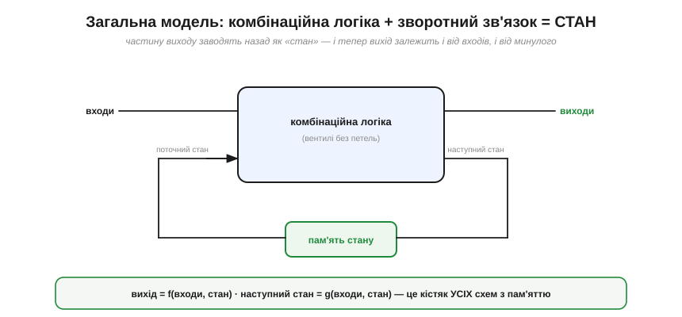
*Рис. 3.3.1.2. Кістяк **усіх** схем із пам'яттю. Комбінаційна логіка отримує і зовнішні **входи**, і поточний **стан** (із петлі зворотного зв'язку), а видає і **виходи**, і **наступний стан**, який зберігається в пам'яті й повертається на вхід. Формально: вихід = f(входи, стан), наступний стан = g(входи, стан). Уся послідовнісна техніка — від тригера до процесора — це варіації цієї схеми.*

Запам'ятайте цю картинку — це **архітектура** всього цифрового світу з пам'яттю. Та вона лишає відкритим головне питання: а **що** саме зберігає стан у тій зеленій коробці «пам'ять»? З чого зробити елемент, що тримає біт? Відповідь, як ми зараз побачимо, ховається в самому зворотному зв'язку — треба лише замкнути його **правильно**.

### Парна чи непарна: коли петля тримає, а коли коливається

Ось найтонша й найкрасивіша деталь усього розділу. Замкнути вихід на вхід — мало; **важливо, скільки інверсій** сигнал зустріне в петлі. І тут парність вирішує все.


*Рис. 3.3.1.3. Зліва — **один** інвертор, чий вихід заведено на власний вхід. Це **суперечність**: якщо на вході 0, вихід стає 1, але ж він і є вхід, тож вхід стає 1, вихід — 0, і так без кінця. Схема ніколи не вщухає — стійкого стану немає. Це принцип **кільцевого генератора** (*ring oscillator*); на практиці його роблять непарним ланцюгом із **3 і більше** інверторів (саме затримка по кільцю задає частоту), а один-єдиний інвертор у петлі — це радше вироджений випадок, що в реальному залізі «осідає» біля порога. Справа — **два** інвертори в петлі. Тепер усе **узгоджується**: Q=1 змушує Q̄=0, а Q̄=0 змушує Q=1 — несуперечливо й стійко. Таких узгоджених станів два, і схема спокійно тримає будь-який. Парна кількість інверсій → **пам'ять**; непарна → **генератор**.*

Осягніть цей вододіл — він глибокий. **Непарна** петля (три, п'ять, сім інверторів) не має жодного стійкого стану: хоч куди постав, сигнал «суперечить сам собі» й безперервно перекидається — виходить **генератор коливань** (до речі, корисна річ: так роблять найпростіші тактові генератори, §3.3.6). На практиці беруть **3 і більше** стадій: один інвертор у петлі чистих коливань не дає — він радше «зависає» біля порога й поводиться як підсилювач, тож робочі кільцеві генератори — це непарний ланцюг від трьох інверторів. А **парна** петля (два інвертори, чотири) має **два** стійкі стани, що не суперечать самі собі, — і саме вона стає **коміркою пам'яті**. Уся різниця між «схемою, що дзвенить» і «схемою, що пам'ятає», — у парності.

Два перехресно-зв'язані інвертори (парна петля) — це і є та сама схема Екклза–Джордана з історії, лише сучасною мовою. Вона тримає **один біт**: два комплементарні виходи Q і Q̄, два стійкі стани (Q=1,Q̄=0 і Q=0,Q̄=1). Це **атом** усієї цифрової пам'яті.

### Бістабільна комірка тримає біт у часі

Що означає «тримає» — найкраще видно **в часі**. Поки схему ніхто не чіпає, її вихід лежить незмінно; лише навмисний поштовх перекидає його в інший стан, де він знову лежить.

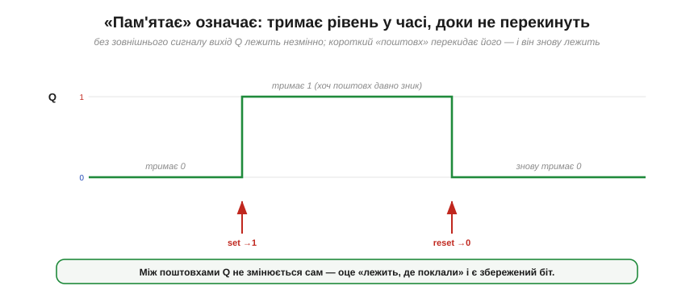
*Рис. 3.3.1.4. Вихід Q бістабільної комірки в часі. Між поштовхами він **не змінюється сам** — лежить на 0 чи на 1, скільки завгодно довго. Короткий керувальний сигнал (умовні «set» і «reset») перекидає його — і навіть коли той сигнал давно зник, Q **тримає** нове значення. Оце «лежить, де поклали, і само не зрушить» і є збережений біт.*

Зверніть увагу: значення тримається **навіть після зникнення поштовху**. Саме це відрізняє пам'ять від звичайної логіки: комбінаційний вихід «забув» би вхід тієї ж миті, а бістабільна комірка його **утримує**. Ми нарешті маємо те, чого бракувало в §3.2.7, — схему, що пам'ятає.

### Тонкість: ця пам'ять енергозалежна

Лишилася важлива засторога. Уся самопідтримка петлі тримається на тому, що крізь неї **тече струм** і елементи активно «штовхають» один одного. Прибери живлення — і петля розривається, штовхати нема чим, біт **зникає**.

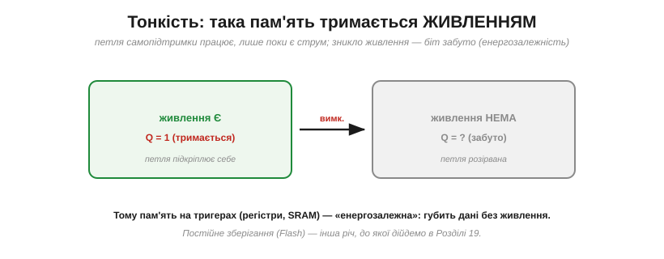
*Рис. 3.3.1.5. Поки є живлення, петля підкріплює себе й Q тримається. Зникло живлення — петля мертва, і значення забуто. Тому пам'ять на тригерах (регістри, кеш, **SRAM**) називають **енергозалежною** (*volatile*): вона миттєва й швидка, але губить усе без струму. Постійне зберігання, що переживає вимкнення (Flash), влаштоване зовсім інакше — про це в Розділі 3.6.*

Це не вада, а природа такої пам'яті: вона **найшвидша**, бо тримається активною петлею, та саме тому й **енергозалежна**. Поділ на «швидку, але забудькувату» (на тригерах) і «повільнішу, зате постійну» пам'ять супроводжуватиме нас аж до карти пам'яті мікроконтролера (Розділ 3.6).

> 🔧 **Навіщо це.** Три думки, які варто винести. Перша: **пам'ять = зворотний зв'язок**. Щоразу, побачивши в схемі петлю, що вертає вихід на вхід, підозрюйте «тут зберігається стан» — і навпаки, будь-яке «запам'ятати» в залізі неодмінно ховає таку петлю. Друга: **парність інверсій** вирішує, пам'ять це чи генератор, — парна петля тримає, непарна дзвенить (обидва корисні: одне для пам'яті, друге для тактів). Третя, суто практична: пам'ять на тригерах **енергозалежна** — регістри й SRAM миттєво забувають усе, щойно зникає живлення, тож важливі дані треба встигати скидати в постійну пам'ять. Цю різницю «забуде / не забуде» ви враховуватимете в кожному пристрої.

---

Підсумок §3.3.1: комбінаційна логіка не має **стану**, тож пам'ятати не вміє (§3.2.7). Пам'ять дає **зворотний зв'язок**: завернувши частину виходу на вхід, дістаємо **послідовнісну** схему, де вихід = f(входи, стан), а наступний стан = g(входи, стан). Та замкнути петлю мало — вирішує **парність** інверсій: **непарна** петля коливається (кільцевий генератор), **парна** має **два** стійкі стани й стає **бістабільною коміркою** — атомом пам'яті, що тримає 1 біт (Q/Q̄) у часі, доки його не перекинуть. Така пам'ять **енергозалежна**: живе, лише поки є живлення. Ми маємо комірку, що тримає біт, — але поки що «глуху»: у неї немає входів, якими можна **навмисно** поставити 0 чи 1. Додаймо їх — і дістанемо першу справжню керовану пам'ять, **SR-засувку**.

---

## 3.3.2 Засувка (latch): SR-засувка

У §3.3.1 ми дістали бістабільну комірку — два перехресно-зв'язані елементи, що тримають один біт. Та вона була «глуха»: тримати тримає, а **поставити** її в потрібний стан нічим. Виправмо це — додамо комірці **входи керування**, якими можна навмисно встановити 0 чи 1. Результат — **SR-засувка** (*SR latch*), найпростіша керована комірка пам'яті й прямий нащадок схеми Екклза–Джордана. Літери в назві кажуть усе: **S** — *set* (встановити в 1), **R** — *reset* (скинути в 0).

### SR-засувка з двох NOR

Найпоширеніший спосіб її зробити — два вентилі **NOR**, з'єднані навхрест (та сама парна петля з §3.3.1, тільки тепер у кожного NOR є вільний вхід для керування).


*Рис. 3.3.2.1. Два NOR навхрест: вихід кожного заведено на вхід іншого (петля пам'яті), а вільні входи — це S і R. Згадаймо NOR: одиниця на **будь-якому** вході дає на виході 0. Тому **S=1** притискає Q̄ до 0, що через петлю штовхає Q у 1 (**set**); **R=1** дзеркально дає Q=0 (**reset**); а коли **S=R=0**, обидва NOR працюють як прості інвертори в петлі — і засувка просто **тримає** те, що було (це і є пам'ять). Таблиця праворуч підсумовує всі випадки.*

Зверніть увагу на головний рядок таблиці — **S=R=0, «тримати»**. Це не «нічого не відбувається», а саме **збереження**: прибравши обидва керувальні сигнали, ми лишаємо засувку наодинці з її петлею, і вона утримує біт. Set і reset — це коли ми **пишемо**; hold — коли засувка **пам'ятає**.

### Чотири випадки: тримати / set / reset / заборона

Розгляньмо всі чотири комбінації входів по черзі — це і є повний «характер» засувки.

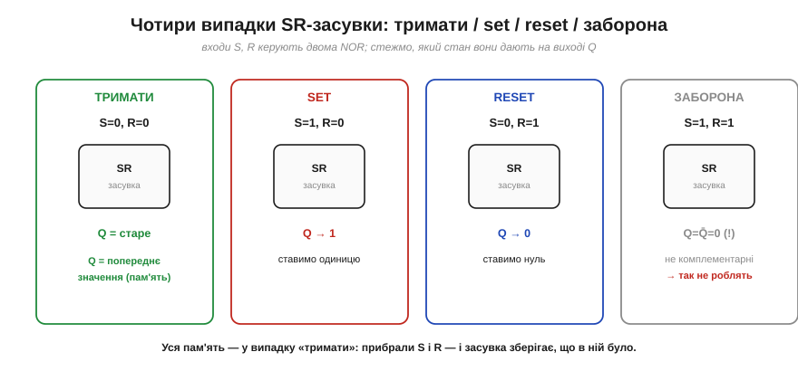
*Рис. 3.3.2.2. **00 — тримати**: Q лишається попереднім (пам'ять). **10 — set**: Q→1. **01 — reset**: Q→0. **11 — заборона**: обидва виходи стають 0, тобто Q і Q̄ більше не протилежні — недопустимий стан. Три перші режими корисні; четвертого уникають.*

**Приклад (простежити засувку).** Подамо на SR-засувку послідовність входів і простежмо Q (починаємо з невідомого стану).

```
R=1, S=0   →  reset:    Q = 0
S=0, R=0   →  тримати:  Q = 0   (зберегли)
S=1, R=0   →  set:      Q = 1
S=0, R=0   →  тримати:  Q = 1   (зберегли, хоч S уже зник!)
R=1, S=0   →  reset:    Q = 0
```

Зверніть увагу на рядки «тримати»: між записами Q **не змінюється сам**, хоч на входах уже нічого немає. Оце утримання й робить засувку **пам'яттю**, а не просто логікою.

### Заборонений стан S=R=1

Окремо — про четвертий випадок, бо він підступний. Подати **S=1 і R=1 одночасно** — означає водночас наказати «постав 1» і «постав 0». Засувка не може догодити обом і робить дивне: обидва виходи стають 0.


*Рис. 3.3.2.3. Поки S=R=1, обидва виходи Q=Q̄=0 — а вони ж мусять бути **протилежними**, тож наступна логіка, що очікує «Q і його інверсію», плутається. Та головна біда — коли S і R **падають у 0 воднораз**: засувка мусить «вистрелити» в один зі станів, і який саме переможе — залежить від мікроскопічних відмінностей у швидкості двох гілок. Результат **непередбачуваний** (а інколи засувка взагалі «зависає» посередині — це метастабільність, до якої повернемося в §3.3.8).*

Тому правило просте: **одночасно set і reset не подають**. У «причесаних» засувках і тригерах, які ми будуватимемо далі, цю ситуацію або апаратно унеможливлюють, або домовляються про пріоритет одного входу. Поки ж запам'ятайте: S=R=1 — заборонена комбінація.

### Часова діаграма

Усю поведінку найкраще зчитати з **часової діаграми** — як короткі імпульси S і R керують виходом Q.

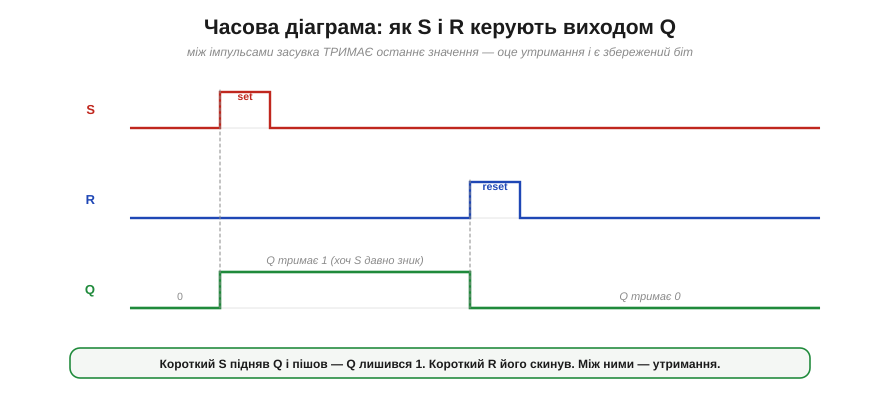
*Рис. 3.3.2.4. Короткий імпульс **S** підіймає Q у 1 — і коли S зникає, Q **лишається** 1 (утримання). Згодом короткий імпульс **R** скидає Q у 0 — і той знову тримається. Між імпульсами вихід незмінний: засувка зберігає останній наказ. Саме ця «пам'ять про останній імпульс» і є збережений біт.*

Зауважте принципову рису: засувка реагує на входи **миттєво й будь-коли** — щойно S чи R змінилися, відразу змінюється й вихід. Вона **рівнева** (*level-sensitive*), або «прозора»: немає жодного «розкладу», коли можна писати, а коли ні. Це і зручно, і небезпечно — і саме з цього виросте потреба в **тактуванні**, до якої ми дійдемо в §3.3.3.

### Активно-низька засувка й придушення дребезгу

Ту саму засувку можна зробити з **NAND** замість NOR — і тоді входи стають **активно-низькими** (їх позначають з рискою: S̄, R̄), тобто спрацьовують **нулем**, а не одиницею (згадайте бульбашку-інверсію з §3.2.2). Через це й таблиця в неї **дзеркальна** до NOR-версії, і це легко переплутати: режим «**тримати**» — це S̄=R̄=**1** (обидва входи високі, бездіяльні); set — S̄=0; reset — R̄=0; а **заборонена** комбінація — S̄=R̄=**0** (а не S=R=1, як у NOR-засувці). Тобто все саме навпаки за рівнями, бо входи активні нулем. NAND-засувка з активно-низькими входами — найпоширеніша на практиці, зокрема в класичному застосуванні: **придушенні дребезгу** механічного перемикача.


*Рис. 3.3.2.5. Механічний контакт, замикаючись, не дає чистого переходу — він кілька мілісекунд **торохтить** (дребезг, *bounce*), і наївна схема прочитала б десяток «натискань» замість одного. Та якщо завести перемикач (типу SPDT) на SR-засувку, **перший** же дотик контакту защепне її в потрібний стан — а подальше торохтіння вже не дістає **іншого** входу, тож засувка незворушно тримає чистий рівень. На виході — одне-єдине чисте перемикання. (Детальніше про дребезг і способи боротьби — у §4.4.5.)*

Це чудовий приклад того, **навіщо** засувка взагалі потрібна: вона перетворює брудну, тремтливу реальність механічного контакту на чистий цифровий рівень — бо вміє **зафіксувати** перший достовірний стан і відкинути решту шуму.

> 🔧 **Навіщо це.** SR-засувка — найпростіша «комірка», у яку можна **записати** біт і яка його **триматиме**. Три речі винесіть на практику. Перша: «тримати» (S=R=0) — це і є режим пам'яті; решта — це запис. Друга: **S=R=1 не подавайте** — це заборонена комбінація з непередбачуваним наслідком; реальні елементи від неї захищають. Третя: засувка **прозора** — реагує на входи будь-коли, тож якщо входи «брудні» чи змінюються в невдалий момент, вихід теж смикається. Саме ця прозорість непридатна там, де сотні комірок мусять оновлюватися **узгоджено**, — і веде нас до головної ідеї наступного підрозділу: писати в пам'ять не «коли заманеться», а **за командою такту**.

---

Підсумок §3.3.2: **SR-засувка** — це бістабільна комірка з §3.3.1, якій додали входи керування: **S** (set → Q=1), **R** (reset → Q=0). Її роблять із двох перехресно-зв'язаних **NOR** (активно-високі S/R) або **NAND** (активно-низькі S̄/R̄), і таблиці в них **дзеркальні**. Для **NOR**-версії: «тримати» — **S=R=0**, заборонено — **S=R=1**. Для **NAND**-версії навпаки: «тримати» — **S̄=R̄=1**, заборонено — **S̄=R̄=0**. Саме режим «тримати» зберігає біт; заборонена комбінація робить обидва виходи однаковими (а на знятті дає непередбачувану гонку). Засувка **рівнева, прозора** — реагує на входи миттєво й будь-коли, що добре для придушення дребезгу, але погано там, де потрібен **узгоджений** запис. Саме «будь-коли» нас і не влаштовує: коли в машині сотні комірок, писати в них треба **разом, за сигналом**. Час навчити засувку слухати **такт** — і дістати справжній тактований **тригер**.

---

## 3.3.3 Тактований D-тригер

SR-засувка з §3.3.2 має дві вади, що заважають будувати з неї великі машини. По-перше, вона **прозора** — пише будь-коли, щойно змінилися входи; а нам треба, щоб сотні комірок оновлювалися **узгоджено**, в один домовлений момент. По-друге, у неї є **заборонений** стан S=R=1, через який легко напартачити. Цей підрозділ усуває обидві вади двома кроками — і в кінці дає головний елемент пам'яті всієї цифрової техніки: **тактований D-тригер**, що захоплює дані рівно по **фронту** такту.

### Крок 1: тактований латч — писати лише за командою

Перша ідея проста: поставити перед входами засувки «ворота», які пропускають S і R лише тоді, коли дозволяє окремий сигнал — **такт** (*clock*). Зробити такі ворота легко двома вентилями AND.


*Рис. 3.3.3.1. Входи S і R проходять крізь AND, другий вхід яких — **такт**. Коли такт=1, AND «прозорі» — S і R доходять до засувки, і вона працює як звичайно. Коли такт=0, обидва AND видають 0 — на засувку йдуть нулі (режим «тримати»), і вона **ігнорує** входи. Тепер запис відбувається не «будь-коли», а лише **за дозволом такту**. Та поки такт=1, латч усе ще прозорий — стежить за входами цілий цей час.*

Це вже крок уперед: ми керуємо **коли** можна писати. Та лишилася друга вада — заборонений стан. Приберімо й її.

### Крок 2: D-латч — один вхід даних

Звідки брався заборонений стан? Із того, що S і R **незалежні**, і можна випадково підняти обидва. А що, як зробити їх **завжди протилежними**? Тоді ситуація S=R=1 стане просто неможливою. Для цього беремо **один** вхід даних D і подаємо його на S напряму, а на R — через інвертор (тобто R=D̄).


*Рис. 3.3.3.2. **D-латч**: вхід даних D іде на S, а його інверсія D̄ — на R. Тепер S і R **завжди** протилежні, тож заборонений стан виникнути не може. Поведінка проста: поки такт=1, вихід **стежить** за D (Q=D); коли такт=0, латч **тримає** останнє значення D. Один вхід, жодних заборон — куди зручніше за SR. Та одна риса лишилася: поки такт=1, латч **прозорий**, тобто будь-яка зміна D одразу проходить на вихід.*

D-латч — уже майже те, що треба: один вхід, без заборонених станів, керується тактом. Лишилася та сама **прозорість**: поки такт високий, вихід «бовтається» за входом. А це, як ми зараз побачимо, у складних схемах небезпечно.

### Проблема прозорості — і захоплення по фронту

Уявіть, що вихід D-латча через якусь логіку повертається назад на його ж вхід (а так буде в лічильниках і регістрах зсуву). Поки такт високий, латч прозорий — і нове значення може **прогнатися** крізь нього й повернутися ще раз у тому самому такті, зробивши схему непередбачуваною. Нам потрібно, щоб латч ловив значення D **рівно один раз** — і то в чітко визначену **мить**, а не протягом цілого рівня такту.

Розв'язок — перейти від реакції на **рівень** такту до реакції на **фронт** (*edge*) — на ту коротку мить, коли такт **перемикається** з 0 на 1. Елемент, що оновлює вихід лише в цю мить, називають **тригером** (*flip-flop*), на відміну від прозорого **латча**. (Глибше, чому фронт кращий за рівень, — у §3.3.4; тут збудуймо сам тригер.)

### D-тригер: майстер-слейв

Найкласичніший спосіб зробити «захоплення по фронту» — поставити **два** D-латчі поспіль, тактовані **протилежно**: перший («майстер») і другий («слейв»).

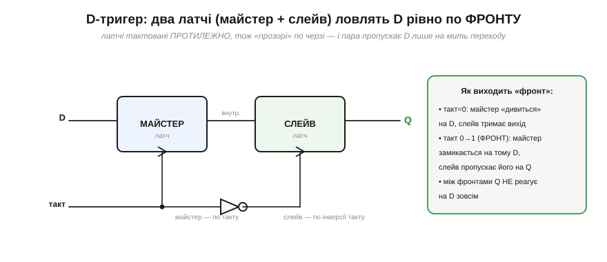
*Рис. 3.3.3.3. Майстер і слейв тактовані **в протифазі** (слейв — через інвертор такту), тож вони «прозорі» **по черзі**, і ніколи — водночас. Поки такт=0, майстер дивиться на D (а слейв тримає вихід); у мить **фронту** 0→1 майстер «замикається» на тому значенні D, що було якраз зараз, і передає його слейву, який виставляє його на вихід. Між фронтами вихід Q **не реагує** на D зовсім. Так пара латчів пропускає дані лише на коротку мить переходу — це й є **захоплення по фронту**.*

Суть трюку: оскільки два латчі прозорі в **різні** півперіоди, даним нема як «прослизнути» крізь обидва одразу — вони можуть «перестрибнути» з входу на вихід лише в **момент перемикання** такту. Виходить елемент, що оновлюється **раз за такт**, у строго визначену мить.

### Поведінка: Q ловить D по фронту

Найкраще цю поведінку видно на часовій діаграмі — і її варто прочитати уважно, бо це **головна** діаграма всієї синхронної логіки.

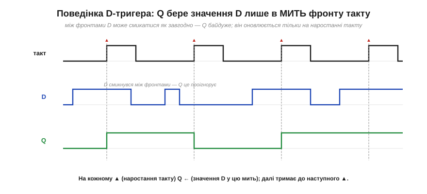
*Рис. 3.3.3.4. Угорі — **такт** (червоні ▲ позначають наростання — робочі фронти). Посередині — вхід **D**, що змінюється довільно. Унизу — вихід **Q**. На кожному фронті Q бере те значення, яке D має **саме в цю мить**, і тримає його до наступного фронту. Зверніть увагу: між фронтами D кілька разів смикається — і Q це **повністю ігнорує**. Тригер «фотографує» D у моменти фронтів, а решту часу не дивиться на нього взагалі.*

**Приклад (прочитати діаграму).** За Рис. 3.3.3.4 простежмо Q на чотирьох фронтах.

```
фронт 1:  D=1 у цю мить  →  Q ← 1   (тримає до фронту 2)
фронт 2:  D=0 у цю мить  →  Q ← 0
фронт 3:  D=1 у цю мить  →  Q ← 1
фронт 4:  D=1 у цю мить  →  Q ← 1   (без зміни)
між фронтами D смикався — Q не зреагував
```

Оце «фотографує по фронту, а між фронтами не дивиться» — і є та визначеність, якої бракувало прозорому латчу. Тепер усі тригери, тактовані спільним сигналом, оновлюються **одночасно**, в один момент, — і машина крокує злагоджено.

### Символ і роль робочого коня

Малюють D-тригер компактним символом, у якому є одна важлива деталь.


*Рис. 3.3.3.5. Прямокутник із входом **D**, виходами **Q** і **Q̄**, і тактовим входом, позначеним **трикутником** «❯». Цей трикутник — ключовий знак: він означає «спрацьовує по **фронту**» (а не по рівню). Побачивши його на схемі, ви одразу знаєте: елемент захоплює D у мить фронту такту. Без трикутника — це був би прозорий латч.*

D-тригер — справжній **робочий кінь** цифрової техніки, і ось чому. Він має один вхід, не має заборонених станів, а головне — пише **в чітко визначену мить**, тож уся машина може крокувати **синхронно**. Поставте 8 таких тригерів поряд, з'єднавши їхні такти, — і дістанете **регістр** на байт (§3.3.5). З'єднайте їх ланцюжком (вихід кожного → вхід наступного) — дістанете **зсувний регістр** (§3.3.4); а додавши перемикання (toggle, D=Q̄) — **лічильник** (§3.3.7). Майже вся пам'ять усередині процесора, всі його регістри — це D-тригери, що клацають разом по спільному такту.

> 🔧 **Навіщо це.** D-тригер — це елемент, який ви насправді використовуватимете (SR-засувку радше зустрінете в книжках, а D-тригер — у кожній схемі). Три речі винесіть. Перша: він бере **один** вхід D і запам'ятовує його по **фронту** такту — «що було на D в мить фронту, те й застрягло до наступного фронту». Друга: трикутник «❯» на тактовому вході в схемі = «по фронту»; це відрізняє тригер від латча, і плутати їх не можна. Третя, найважливіша для подальшого: оскільки всі тригери ловлять дані **одночасно** (на спільному фронті), цифрова система працює **тактами** — крок, крок, крок, — і це фундамент усієї синхронної логіки, аж до циклу процесора (§3.5.3). Запам'ятайте D-тригер як «комірку, що оновлюється раз за такт».

---

Підсумок §3.3.3: щоб засувка годилася для великих машин, її **тактують**. Спершу — **gated-латч**: вентилі AND пропускають S/R лише коли такт=1. Тоді — **D-латч**: один вхід D іде на S, а D̄ на R, тож заборонений стан зникає, і поки такт=1, Q=D. Та латч лишається **прозорим**; щоб ловити дані в одну **мить**, переходять від рівня до **фронту** — будують **D-тригер** (майстер-слейв із двох латчів у протифазі), що захоплює D рівно по фронту такту й тримає між фронтами. Його символ має **трикутник** «❯» на тактовому вході. D-тригер — основний елемент пам'яті: з нього роблять регістри (§3.3.5) і лічильники (§3.3.7), і саме він змушує цифрову машину крокувати синхронно. Ми кілька разів сказали «по фронту, а не по рівню» — але до пуття не пояснили, **чому** фронт надійніший. Розберімо це окремо.

---

## 3.3.4 Фронт vs рівень: чому тактують по фронту

У §3.3.3 ми збудували тригер, що захоплює дані по **фронту** такту, і мимохідь сказали: так надійніше, ніж реагувати на **рівень**. Тепер з'ясуймо, **чому** саме — бо це не дрібниця стилю, а фундамент, на якому стоїть уся синхронна цифрова техніка. Виявиться, що різниця між «прозорим» латчем і тригером по фронту вирішує, чи буде складна схема **передбачуваною**, чи перетвориться на хаос.

### Рівень vs фронт: іще раз про різницю

Спершу чітко, на одній діаграмі, побачимо, чим вони відрізняються поведінкою.


*Рис. 3.3.4.1. Той самий такт і той самий вхід D, але два різні елементи. **Латч** (рівневий) «прозорий» цілий час, поки такт=1, — тож коли D піднявся **посеред** високого такту, латч одразу пішов за ним. **Тригер** (по фронту) дивиться на D лише в мить наростання (▲) — на першому фронті D ще був 0, тож тригер лишився 0 й чекав аж до **наступного** фронту. Між першим і другим фронтом їхні виходи **різні**: латч уже 1, тригер ще 0.*

Отже, латч реагує **протягом усього** високого рівня такту, а тригер — лише в одну **мить**. Це здається дрібною різницею, та саме вона стає вирішальною, щойно схема має **зворотний зв'язок**.

### Біда прозорості: гонка крізь латч

Уявімо найпростіше: вихід латча через якусь логіку повертається на його ж вхід (а так буде в кожному лічильнику й регістрі). Поки такт високий, латч **прозорий** — і ось що тоді коїться.

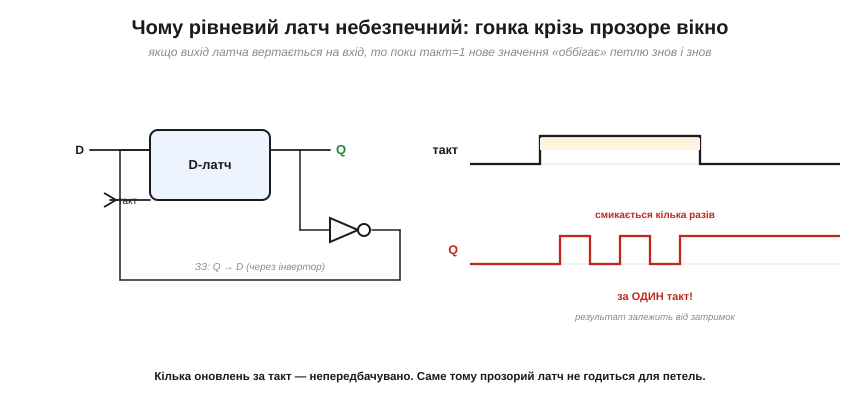
*Рис. 3.3.4.2. Вихід Q заведено назад на вхід D (тут через інвертор). Поки такт=1, латч відкритий, тож нове значення Q **оббігає** петлю, інвертується, повертається на вхід, знову змінює Q — і так **багато разів за один** високий такт. Скільки саме обертів устигне — залежить від мікроскопічних затримок вентилів, тож результат у кінці такту **непередбачуваний**. Це називають **гонкою** (*race-through*).*

Ось у чому корінь біди: прозорий латч під час високого такту — це **замкнена петля без гальма**. Один такт мав би означати «одне оновлення», а виходить казна-скільки оновлень, та ще й їхня кількість залежить від фізичних затримок, які щоразу трохи інші. Схема стає **невідтворюваною** — найгірше, що може бути в цифровій техніці.

### Фронт усе лагодить: одне оновлення за такт

Тепер замінімо латч на **тригер по фронту** — і та сама петля стає бездоганно передбачуваною.


*Рис. 3.3.4.3. Та сама петля «Q назад на D», але через тригер по фронту. Тепер захоплення триває лише **мить**, тож нове значення Q **не встигає** оббігти петлю й вплинути на цей самий фронт — воно вплине аж на **наступному**. Виходить рівно **одне** оновлення за такт (тут Q перемикається щофронту, ділячи такт навпіл). Захоплене значення стає входом для **наступного** кроку — стани чітко розділені в часі.*

Ось ключова перевага, заради якої все й затівалося: тригер по фронту **розриває** небезпечну петлю в часі. Те, що схема обчислює **зараз**, вона запам'ятає на **цьому** фронті, а використає — лише на **наступному**. «Поточний стан» і «наступний стан» (згадайте модель §3.3.1) виявляються **акуратно розділені** межею фронту, і ніякої гонки бути не може. Один фронт — один крок. Завжди.

### Демонстрація: зсувний регістр

Найнаочніше це видно на **зсувному регістрі** (*shift register*) — ланцюжку тригерів, де вихід кожного йде на вхід наступного, і всі тактовані **разом**.


*Рис. 3.3.4.4. Три D-тригери в ланцюзі, спільний такт. Подамо на вхід одиничку на один такт. На кожному фронті всі тригери оновлюються **одночасно**, причому кожен захоплює те, що було на вході його попередника **щойно перед** фронтом. Тому одиничка акуратно **крокує**: такт 1 — вона в Q1, такт 2 — у Q2, такт 3 — у Q3. По одному щаблю за фронт.*

А тепер уявіть, що тут стояли б **прозорі латчі**. На високому такті **всі** вони відкрилися б воднораз — і одиничка **прогналася** б крізь увесь ланцюг за один такт (Q1→Q2→Q3 миттєво, race-through), замість крокувати. Зсувний регістр просто **не працював** би. Він працює **тільки** тому, що тригери по фронту: кожен ловить **старе** значення сусіда, перш ніж той устигне змінитися. Це — найчистіша демонстрація, навіщо потрібен фронт.

### По якому фронту — і чому він мусить бути чистим

Лишилися дві практичні деталі. По-перше, **який саме** фронт: тригери бувають по **наростанню** (*positive/rising edge*, такт 0→1) і по **спаду** (*negative/falling edge*, такт 1→0). На символі це розрізняють кружком: трикутник «❯» без кружка — по наростанню, з кружком на тактовому вході — по спаду (та сама бульбашка-інверсія з §3.2.2).


*Рис. 3.3.4.5. Зліва — спрацювання по наростанню (▲), праворуч — по спаду (▼, кружок на тактовому вході). А внизу — важлива засторога: фронт такту мусить бути **крутим** і чистим (згадайте §3.1.5). Крутий фронт дає тригеру чітку **мить** спрацювання; кволий чи зашумлений — тригер «не знає», коли саме ловити, може смикнутися двічі або застрягти. Саме тут, на тактових лініях, у пригоді стає тригер Шмітта з §3.1.6.*

Це прямо повертає нас до Розділу 3.1. Тригер спрацьовує на **переході** такту — а перехід, як ми знаємо з §3.1.5, не миттєвий, він має скінченний час наростання. Щоб тригер захопив дані в чітко визначений момент, цей перехід має бути **крутим**: тоді «мить фронту» справді мить. Кволий, повільний чи брудний такт — і момент спрацювання «розмазується», тригер може зловити не те або смикнутися двічі. Ось чому до тактових ліній ставляться особливо прискіпливо, а де треба — «загострюють» їх тригером Шмітта (§3.1.6).

> 🔧 **Навіщо це.** Головне, що варто винести: **майже вся** цифрова техніка тактується **по фронту**, і не випадково. Прозорий латч у петлі дає **гонку** — кілька непередбачуваних оновлень за такт; тригер по фронту дає рівно **одне** оновлення, чисто розділяючи «поточний» і «наступний» стан межею фронту. Тому зсувні регістри, лічильники, конвеєри процесора майже завжди будують на тригерах по фронту, а не на латчах. (Це не абсолют: у деяких високопродуктивних процесорах і ASIC свідомо вживають латч-схеми — заради «позичання часу» (*time borrowing*), площі й потужності, — та для нашого рівня орієнтир «усе на тригерах по фронту» цілком надійний.) На практиці: побачивши трикутник «❯» на тактовому вході — знайте, що тут спрацювання по фронту (кружок = по спаду); і пам'ятайте, що **такт мусить бути чистим і крутим** (§3.1.5/3.1.6), бо саме від його фронту залежить, коли вся машина зробить крок. «Один фронт — один крок» — це девіз синхронної логіки.

---

Підсумок §3.3.4: **рівневий** латч прозорий цілий високий такт, **тригер** по фронту захоплює дані в одну мить. У петлях зі зворотним зв'язком прозорість дає **гонку** (*race-through*) — кілька непередбачуваних, залежних від затримок оновлень за один такт. Тригер по фронту цю біду усуває: рівно **одне** оновлення за такт, причому захоплене значення впливає лише на **наступному** фронті, чітко відділяючи поточний стан від наступного. Найнаочніше — **зсувний регістр**: на тригерах біт крокує на щабель за такт, а на прозорих латчах прогнався б наскрізь. Спрацьовувати можна по **наростанню** (❯) чи по **спаду** (❯ з кружком), і фронт такту мусить бути **крутим** (§3.1.5), щоб мить спрацювання була чіткою. Тепер у нас є надійний D-тригер. Поставмо вісім таких поряд — і дістанемо те, у чому процесор зберігає число: **регістр**.

---

## 3.3.5 Регістр: багато тригерів разом

Один D-тригер тримає **один** біт. Та числа складаються з багатьох бітів (байт — це вісім, слово процесора — 16, 32 чи 64). Щоб зберігати **ціле число**, тригери ставлять **поряд** і тактують **спільним** сигналом. Так народжується **регістр** (*register*) — базова комірка, у якій процесор тримає операнди, результати, адреси. Цей підрозділ — про регістр у двох його іпостасях: **паралельний** (зберегти слово) і **зсувний** (пересувати біти), і про те, чому без них немає ні зв'язку, ні процесора.

### Паралельний регістр: ціле слово за раз

Найпростіший регістр — це просто N тригерів пліч-о-пліч, кожен зі своїм входом і виходом, але з **одним на всіх** тактом.


*Рис. 3.3.5.1. Вісім D-тригерів зі **спільним тактом** утворюють 8-бітний регістр. Кожен тримає свій біт (D0…D7 на вході, Q0…Q7 на виході), та оскільки такт спільний, **усі вісім** захоплюють свої біти **одночасно**, на одному фронті. Один клац такту — і весь байт записано разом, як одне ціле.*

Це і є «місце, де лежить число». Спільний такт тут принциповий: завдяки йому всі біти оновлюються **синхронно**, і регістр поводиться як єдина комірка для слова, а не вісім незалежних. Скільки тригерів — стільки бітів: 8 для байта, 32 для 32-бітного слова.

### Дозвіл запису: тримати, поки не «завантажити»

Простий регістр захоплює вхід на **кожному** фронті. Та на практиці частіше треба, щоб він **тримав** число багато тактів і брав нове лише **за командою**. Для цього додають вхід **дозволу запису** (*load enable*).

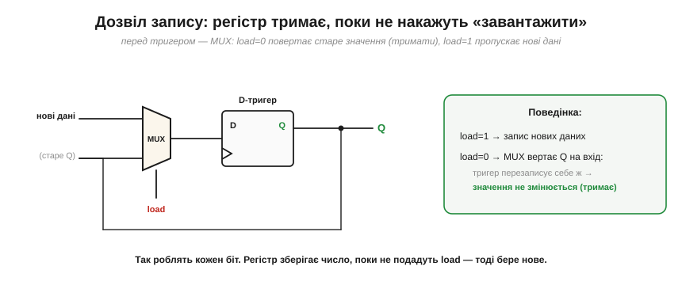
*Рис. 3.3.5.2. Перед кожним тригером ставлять **мультиплексор** (§3.2.6), що обирає, який сигнал подати на вхід D: за **load=1** — нові дані (запис), за **load=0** — **власний вихід Q** тригера (через зворотний зв'язок). У другому випадку тригер щотакту «перезаписує себе ж тим самим» — тобто значення **не змінюється**. Так регістр зберігає число скільки завгодно довго й бере нове лише тоді, коли подали load.*

Цей прийом — «годувати тригер його ж виходом, щоб тримати» — дуже типовий, запам'ятайте його. Тепер регістр став повноцінним: він **зберігає**, доки не накажеш, і **завантажує** за командою. Саме такі регістри стоять у процесорі.

### Зсувний регістр: дані їдуть уздовж

Є й інший спосіб з'єднати тригери — не паралельно, а **ланцюжком**: вихід кожного на вхід наступного. Тоді на кожному фронті вся низка бітів **зсувається** на один щабель (ми вже бачили цей рух у §3.3.4). Це **зсувний регістр** (*shift register*).

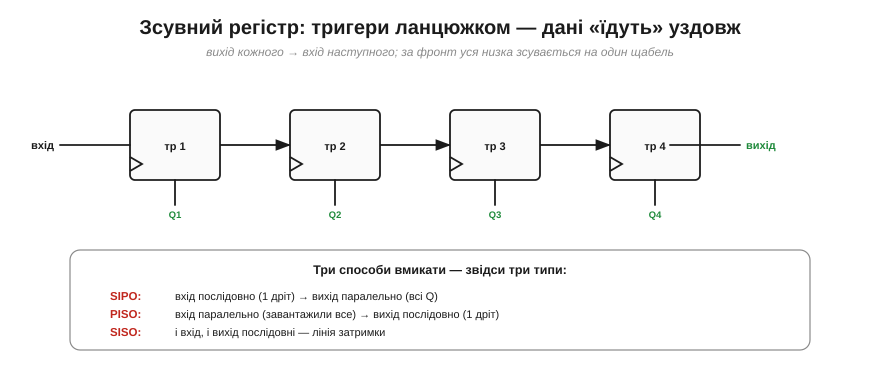
*Рис. 3.3.5.3. Чотири тригери ланцюжком зі спільним тактом: за кожен фронт уся низка зсувається праворуч на один щабель. Залежно від того, як **вмикати** дані та звідки **знімати**, виходять три типи: **SIPO** (вхід послідовний по одному дроту, вихід — усі Q одразу), **PISO** (завантажили все паралельно, виводимо по одному дроту), **SISO** (і вхід, і вихід послідовні — проста лінія затримки).*

Зсувний регістр уміє кілька корисних фокусів. Зсув уліво — це, до речі, **множення на 2** (а вправо — ділення на 2) у двійковій системі, бо кожен біт переходить у старший розряд (це стане очевидним у Розділі 3.4). Та головне його застосування — зовсім інше, і воно скрізь.

### Серійно ↔ паралельно: серце зв'язку

Найважливіша робота зсувного регістра — **перекладати** між «бітами по черзі» і «всіма бітами разом». А це — основа всього послідовного зв'язку.

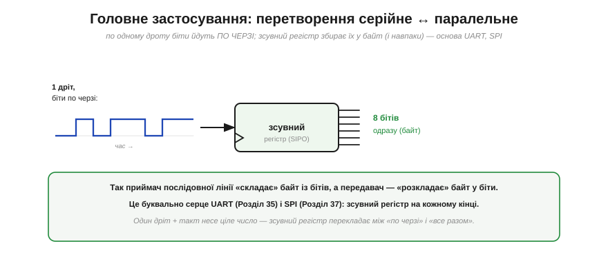
*Рис. 3.3.5.4. По **одному** дроту біти йдуть **по черзі** в часі (послідовно). Зсувний регістр типу **SIPO** приймає їх по одному на кожному такті — і коли назбирається повний байт, видає всі 8 бітів **одразу** (паралельно). У зворотний бік **PISO** бере байт і «висуває» його в лінію по одному біту. Це буквально серце **UART** (Розділ 6.1) і **SPI** (Розділ 6.3): на кожному кінці лінії стоїть зсувний регістр, що складає байт із бітів і розкладає назад.*

Осягніть, наскільки це фундаментально: щоб передати число **одним** дротом (а не вісьмома), його розкладають у потік бітів, шлють по черзі, а на тому кінці **збирають** назад у байт. Уся економія дротів у послідовних інтерфейсах — від UART до USB — стоїть на зсувному регістрі. Коли в Модулі 6 ми вивчатимемо протоколи зв'язку, пам'ятайте: усередині кожного — цей скромний ланцюжок тригерів.

### Регістри в процесорі

І нарешті — навіщо регістри процесору. Згадаймо §3.2.7: АЛП **рахує**, але йому потрібні **операнди** (звідки взяти числа) і місце для **результату**. Це й роблять регістри.


*Рис. 3.3.5.5. Регістри тримають числа, АЛП їх обробляє: два операнди йдуть із регістрів у АЛП, результат вертається в регістр. Купку робочих регістрів звуть **регістровим файлом**. Окремо є **спеціальні** регістри: **лічильник команд** (PC — де ми в програмі, §3.5.2), **регістр інструкції** (що саме виконуємо), регістри адреси й даних пам'яті, **прапорці** (нуль, перенос). Регістр + АЛП = **тракт даних** (*datapath*); лишається додати керування — і це вже процесор (Розділ 3.5).*

Ось де сходяться дві лінії Модуля 3: комбінаційна арифметика (Розділ 3.2) і пам'ять (цей розділ). АЛП без регістрів — як калькулятор без екрана й кнопок пам'яті: рахувати вміє, а тримати числа ні. Регістри дають йому «руки», у яких лежать операнди й результати. Саме тому процесор — це не лише АЛП, а АЛП **плюс регістри плюс керування**.

> 🔧 **Навіщо це.** Регістр — це слово «пам'ять» у найшвидшому, найближчому до обчислень сенсі. Винесіть три речі. Перша: **паралельний** регістр зберігає ціле число (всі біти захоплюються разом по спільному такту), а **дозвіл запису** дозволяє тримати його, доки не накажеш оновити. Друга: **зсувний** регістр перекладає між «послідовно» і «паралельно» — і саме він усередині кожного UART/SPI/USB (Модуль 6), тож, працюючи із зв'язком, ви матимете справу з ним постійно. Третя: **регістри процесора** — це найшвидша пам'ять у системі, де лежать числа, з якими АЛП працює **прямо зараз**; коли в Модулі 4 ви читатимете про регістри ESP32 чи писатимете оптимізований код, ідеться саме про ці комірки. Регістр — місток від «логіки» до «машини».

---

Підсумок §3.3.5: **регістр** — це група D-тригерів зі **спільним тактом**, що зберігає ціле **слово** (байт = 8 бітів): усі біти захоплюються **одночасно** на одному фронті. **Дозвіл запису** (через MUX, що за load=0 повертає Q на вхід) дозволяє регістру **тримати** значення, доки не накажуть завантажити нове. **Зсувний регістр** з'єднує тригери **ланцюжком**, тож біти зсуваються на щабель за такт; його головна робота — перетворення **серійне↔паралельне**, основа UART і SPI (Модуль 6), а заразом множення/ділення на 2. У процесорі регістри тримають **операнди, результат, лічильник команд, інструкцію**; регістр + АЛП = **тракт даних** (Розділ 3.5). Усі тригери регістра клацають по **спільному** такту — і це працює лише тому, що такт єдиний для всіх. Час придивитися до самого цього сигналу: що таке **тактовий сигнал** і чому вся машина «крокує» в його ритмі.

---

## 3.3.6 Тактовий сигнал: спільний ритм

Усі тригери регістра (§3.3.5), усі тригери процесора оновлюються по **спільному** сигналу — **такту**. Ми вже багато разів на нього спиралися, та досі сприймали як даність. Тепер придивімося до самого такту: що це за сигнал, чому завдяки йому вся машина працює **синхронно**, звідки він береться й чому саме він задає **швидкість** усієї системи. Такт — це серцебиття цифрової машини, і варто зрозуміти його як слід.

### Що таке такт

Тактовий сигнал (*clock*) — це проста, рівномірна **прямокутна хвиля**: 0, 1, 0, 1… з постійним ритмом. Уся машина звіряється з нею, як оркестр із паличкою диригента.


*Рис. 3.3.6.1. Такт — періодична хвиля. **Період** T — час одного циклу (від фронту до фронту); **частота** f = 1/T — скільки тактів за секунду (у герцах). Зазвичай половину періоду сигнал високий, половину низький (**шпаруватість** 50%). Частоти бувають різні: 1 Гц (раз на секунду), 16 МГц (ядро Arduino Uno), 80 МГц (шина периферії ESP32, APB), 240 МГц (ядро ESP32), гігагерци (процесор ПК) — і що вища частота, то більше кроків за секунду робить машина.*

Запам'ятайте зв'язок T і f — він усюди: 16 МГц означає період 1/16 000 000 ≈ 62.5 наносекунди, тобто кожні 62.5 нс машина робить крок. Частота — це буквально темп роботи: скільки разів за секунду відбувається «крок» синхронної логіки.

### Синхронність: усі крокують разом

Навіщо потрібен **один** такт на всіх? Бо він дає машині **єдиний момент**, коли стан змінюється, — і це робить її передбачуваною.


*Рис. 3.3.6.2. Один тактовий сигнал розходиться до **всіх** тригерів. На кожному його фронті **всі** вони оновлюються **одночасно** — машина робить один узгоджений крок. Між фронтами все «застигло»: стан не змінюється, і комбінаційна логіка спокійно встигає порахувати наступні значення. Потім — фронт, усі тригери захоплюють нові значення, — і знову пауза на обчислення. Крок — порахувати — крок. Це і є **синхронний** дизайн.*

Це найважливіша дисципліна всієї цифрової техніки. Завдяки спільному такту в системі є **домовлений ритм**: усі зміни стану відбуваються разом, у мить фронту, а весь час між фронтами віддано на **обчислення** комбінаційною логікою. Не треба гадати, хто коли оновився, — оновлюються **всі разом**, по команді диригента. Без цього сотні тисяч тригерів і вентилів злилися б у непередбачуваний хаос; з ним — машина крокує чітко й відтворювано.

### Звідки береться такт

Сам такт хтось має **створити** — потрібен **генератор** коливань. І тут згадаймо §3.3.1: непарна петля інверторів **осцилює**. Це й є найпростіший генератор.

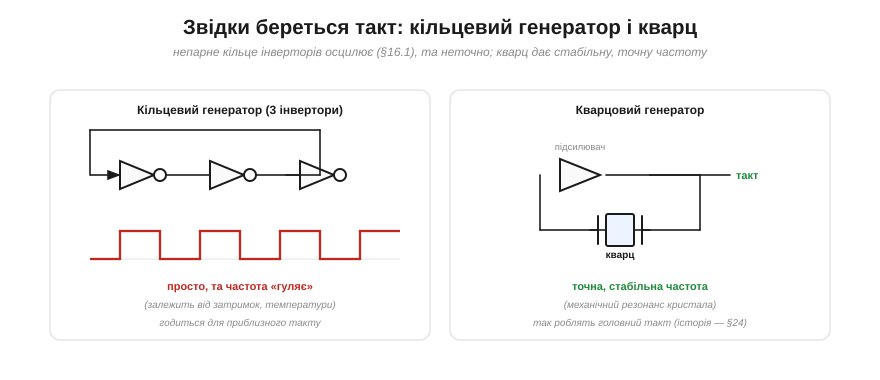
*Рис. 3.3.6.3. **Кільцевий генератор** (зліва): непарне число інверторів у петлі (тут три) ніколи не вщухає — сигнал безперервно перекидається, даючи коливання. Просто, але частота «гуляє»: вона залежить від затримок вентилів, які повзуть із температурою й напругою. Годиться для **приблизного** такту. **Кварцовий генератор** (справа): підсилювач із **кварцовим** резонатором у петлі. Кристал кварцу має дуже стабільний механічний резонанс на точній частоті — і нав'язує її всій схемі. Так роблять **головний, точний** такт системи.*

Ось чому для **точного головного** такту зазвичай беруть маленький **кварцовий** резонатор (часто видно як блискучу металеву «таблетку» біля процесора): він дає частоту, стабільну до мільйонних часток, бо спирається на механічні коливання кристала, а не на примхливі затримки вентилів. Дивовижну історію того, як кварц навчив машини й годинники точного часу (Воррен Маррісон, 1927), ми окремо розкажемо в Розділі 4.6. А прості **внутрішні RC- й кільцеві** генератори лишаються для невибагливих тактів, де точність не критична. (Часто з одного точного джерела роблять багато частот: схема **ФАПЧ** (*PLL*) множить опорну частоту кварцу — скажімо, 40 МГц ESP32 — до робочих 240 МГц ядра. Тож «кварц 40 МГц» і «ядро 240 МГц» уживаються в одному чипі, а кварц однаково лишається єдиним точним еталоном.)

### Такт — це «ручка швидкості»

Здавалося б, підкрути частоту вище — і машина працюватиме швидше. Так, але є **межа**, і вона прямо випливає з Розділу 3.1.

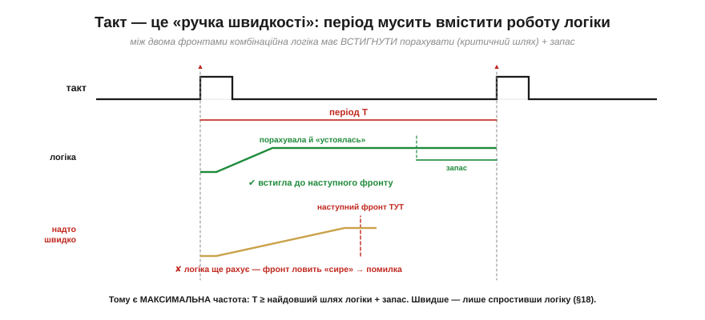
*Рис. 3.3.6.4. Між двома фронтами комбінаційна логіка мусить **встигнути** порахувати нові значення й «устоятися» (згадайте затримки й фронти §3.1.5). Найдовший шлях сигналу крізь логіку звуть **критичним шляхом**. Період такту T має бути **більшим** за цей шлях плюс невеликий запас (час setup тригера). Якщо ж розігнати такт надто високо (внизу), наступний фронт прийде, **поки логіка ще рахує**, — тригер захопить «сире», недолічене значення, і буде помилка.*

Звідси — фундаментальне обмеження: у кожної схеми є **максимальна** тактова частота, за якою її логіка вже не встигає. Щоб машина працювала швидше, мало підкрутити генератор — треба **скоротити критичний шлях**: спростити логіку чи розбити її на коротші ділянки (це **конвеєр**, до якого ми дійдемо в §3.5.6). А ще згадаймо §3.1.4/§3.2.5: вища частота — це й більше **тепла** (потужність росте з f). Тому такт — це завжди компроміс «швидкість проти затримок логіки й нагріву», і саме він визначає, скільки мегагерц «витягне» процесор (§3.5.5).

### Розведення такту й перекіс

Остання тонкість: такт мусить дійти до **всіх** тригерів майже **водночас**. А це не задарма — провідник має скінченну довжину, і фронт до далекого тригера доходить трохи пізніше.


*Рис. 3.3.6.5. Такт розводять «деревом», балансуючи довжини гілок, щоб фронт приходив до всіх тригерів рівно. Якщо ж до одного тригера такт дістається помітно **пізніше**, ніж до сусіда (це **перекіс**, *clock skew*), дані можуть «прослизнути» на зайвий щабель, і синхронність ламається. Тому в реальних чипах розведенню такту приділяють величезну увагу.*

Перекіс — одна з причин, чому проєктувати дуже швидкі синхронні системи складно: мало порахувати логіку, треба ще гарантувати, що **диригентська паличка** змахнула для всіх в один момент. Строгі часові межі, що з цього випливають (скільки даним треба «встояти» до фронту й «потриматися» після), ми розберемо в §3.3.8.

> 🔧 **Навіщо це.** Такт — це поняття, з яким ви матимете справу **постійно**, працюючи з мікроконтролером. Винесіть головне. Перше: такт задає **темп** машини (f = 1/T), і кожен «крок» синхронної логіки — це один його фронт; коли в даташиті ESP32 пишуть «240 МГц», це означає 240 мільйонів кроків за секунду. Друге: **синхронність** — спільний такт дає єдиний момент зміни стану, тож система передбачувана; майже все цифрове проєктують саме так. Третє: **головний такт роблять кварцом** (точна частота), а простіші — кільцевим генератором; і ви свідомо обиратимете джерело такту, налаштовуючи мікроконтролер (§4.1.4). Четверте, практичне: **вища частота = швидше, але гарячіше й важче за таймінгом**, і є межа, яку диктує найдовший шлях логіки. «Скільки герц» — це не просто число в налаштуваннях, а серцебиття, від якого залежить і швидкість, і споживання, і надійність.

---

Підсумок §3.3.6: **тактовий сигнал** — рівномірна прямокутна хвиля (період T, частота f = 1/T, шпаруватість ~50%), за якою синхронізується вся машина. **Спільний** такт дає **синхронність**: на кожному фронті всі тригери оновлюються разом, а між фронтами логіка встигає порахувати — «крок — обчислення — крок». Такт **генерують**: непарним **кільцем** інверторів (просто, та неточно) або **кварцовим** резонатором (стабільна, точна частота — головний такт; історія в §4.6). Такт — це **ручка швидкості**: період мусить вмістити **критичний шлях** логіки плюс запас, тож є максимальна частота, а вище неї — лише спростивши логіку (конвеєр, §3.5). І такт треба **розвести** до всіх тригерів рівно, бо **перекіс** ламає синхронність. Тепер у нас є тригери, регістри й такт. З'єднаймо їх хитро — і дістанемо схему, що сама **рахує** такти: **лічильник**.

---

## 3.3.7 Лічильники

Маючи тригери, регістри й такт, ми можемо побудувати першу по-справжньому «розумну» послідовнісну схему — **лічильник** (*counter*). Це схема, що **рахує**: на кожному такті її число зростає на одиницю. Здавалося б, дрібниця — та згадаймо §3.2.7 і §3.3.1, де ми чесно визнали, що комбінаційна логіка **не вміє** полічити, скільки разів щось сталося. Лічильник це нарешті вміє — і не лише лічить події, а ще й **відмірює час** і **ділить частоту**, ставши серцем годинників і таймерів. Розберімо, як він влаштований.

### Toggle-тригер: ділимо частоту навпіл

Цеглинка лічильника — особливий тригер, що на кожному такті **перемикається** в протилежний стан. Зробити його з D-тригера елементарно: з'єднати вхід D із власним виходом Q̄.


*Рис. 3.3.7.1. **Toggle-тригер** (*T flip-flop*): вхід D під'єднано до **власного** Q̄. На кожному фронті тригер захоплює Q̄ — тобто **протилежне** тому, що в ньому зараз, — і Q перемикається: 0, 1, 0, 1… А оскільки Q міняється раз на **два** такти, його частота **вдвічі менша** за тактову. Один toggle-тригер = поділ частоти на 2.*

Запам'ятайте цей факт: **один тригер ділить частоту навпіл**. На ньому стоїть усе подальше. А поставивши кілька таких поспіль, дістанемо не просто поділ, а справжній **рахунок**.

### Лічильник: рахуємо у двійковій

З'єднаймо toggle-тригери ланцюжком так, щоб кожен тактувався виходом попереднього. Тоді перший ділить такт на 2, другий — ще навпіл (на 4), третій — на 8, і разом їхні виходи утворюють… **двійкове число**, що зростає на одиницю щотакту.


*Рис. 3.3.7.2. Три тригери, виходи Q2 Q1 Q0. Молодший Q0 перемикається щотакту (÷2), Q1 — раз на два такти (÷4), Q2 — раз на чотири (÷8). Прочитайте їх **разом**, як двійкове число — і побачите рахунок: 001, 010, 011, 100, 101, 110, 111, 000… Лічильник буквально лічить такти, виражаючи число у двійковій системі. Загальне правило: біт n дає частоту такт / 2ⁿ⁺¹.*

Помилуйтеся, як гарно тут сходяться дві ідеї: **поділ частоти** (кожен біт удвічі повільніший) і **двійковий рахунок** (біти разом — це число) виявляються **одним і тим самим**. Лічильник, що ділить частоту, і лічильник, що рахує події, — це одна схема, побачена з двох боків.

### Ділення частоти: повільний такт із швидкого

Перший великий ужиток лічильника — **робити повільні ритми зі швидкого такту**. N-бітний лічильник на старшому біті дає частоту, поділену на 2ᴺ, — і це найпростіший спосіб дістати будь-який потрібний темп.

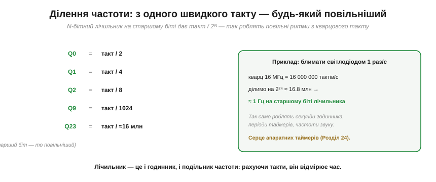
*Рис. 3.3.7.3. Кожен наступний біт лічильника вдвічі повільніший: Q0 = такт/2, Q9 = такт/1024, Q23 ≈ такт/16 мільйонів. Хочете блимати світлодіодом раз на секунду? Візьміть кварцовий такт 16 МГц і поділіть на ≈2²⁴ ≈ 16.8 млн — на відповідному біті лічильника якраз вийде ≈1 Гц. Так само лічильник відмірює секунди годинника, періоди таймерів, частоти звуку.*

Ось чому лічильник — це **одночасно** і дільник частоти, і **годинник**: рахуючи відомі такти, він відмірює час. Знаючи частоту кварцу, ми точно знаємо, скільки тактів — це секунда, тож порахувати їх — і є виміряти час. Саме на цьому стоять усі **апаратні таймери** мікроконтролера, до яких ми дійдемо в Розділі 4.6 (а заразом і дивовижна історія кварцового відліку часу).

### Ланцюговий проти синхронного

Лічильник, який ми щойно склали (кожен тригер тактується попереднім), зветься **ланцюговим** (*ripple*, асинхронним) — і він простий, та має ваду, знайому з Розділу 3.2.


*Рис. 3.3.7.4. У **ланцюговому** лічильнику зміна «біжить» від молодшого тригера до старшого, як перенос у суматорі (§3.2.6): старший біт перемикається лише після того, як спрацювали всі молодші, тож він **відстає** на суму затримок, і на мить число може бути «неправильним» (глітч). У **синхронному** всі тригери тактуються **спільним** сигналом, а окрема логіка вирішує, кому з них перемкнутися; це складніше, зате всі біти міняються **разом** — швидко й без глітчів.*

Це той самий компроміс «простота проти швидкості», що й усюди. Ланцюговий лічильник годиться для невибагливих задач (поділ частоти, де глітчі неважливі), а от там, де потрібні **швидкість і чистота** — як у лічильнику команд процесора, — будують **синхронний**. І знову бачимо рідну ідею Модуля 3: ланцюгова затримка переносу — та сама проблема, що в суматорі §3.2.6, лише в часовому, а не просторовому вигляді.

### Лічильник за модулем і навіщо лічильники взагалі

Звичайний N-бітний лічильник рахує до 2ᴺ і починає спочатку. Та часто треба рахувати до **довільного** числа — скажімо, до 10 для десяткової цифри. Тоді додають **детектор**, що скидає лічильник, щойно той досягне потрібного N. Виходить **лічильник за модулем N** (*modulo-N*), що рахує 0, 1, …, N−1 і повертається в 0.


*Рис. 3.3.7.5. **Mod-N**: лічильник, що скидається на числі N, лічить 0…N−1 по колу (mod-10 дає десяткову цифру 0…9). А праворуч — навіщо лічильники взагалі: **поділ частоти й відлік часу** (таймери, годинник — §4.6); **лічба подій** — «скільки імпульсів прийшло», те саме, чого комбінаційна логіка не вміла (§3.2.7, §3.3.1); і **лічильник команд** (PC), що крокує адресами програми, ведучи процесор від інструкції до інструкції (§3.5.2).*

Ось і замкнулося коло, відкрите ще в §3.2.7. Тоді ми поставили схемі питання «скільки разів натиснули кнопку?» — і комбінаційна логіка не змогла відповісти, бо не мала пам'яті. Тепер відповідь є: **це рахує лічильник**. Маючи пам'ять (тригери) і ритм (такт), машина нарешті вміє і запам'ятовувати, і лічити, і відмірювати час — усе, чого бракувало для повноцінного обчислювача.

> 🔧 **Навіщо це.** Лічильник — одна з найуживаніших схем, і ви зустрічатимете його постійно, навіть не торкаючись окремих тригерів. Винесіть головне. Перше: **один тригер ділить частоту на 2**, ланцюг із N — на 2ᴺ; так із кварцового такту роблять будь-який повільніший ритм. Друге: лічильник — це **і годинник, і дільник частоти, і лічильник подій** одночасно; усі апаратні **таймери** мікроконтролера (Розділ 4.6) — це лічильники, що рахують відомі такти й тому вміють відмірювати точний час. Третє: **лічильник команд** (PC) — це лічильник, що веде процесор програмою крок за кроком (§3.5.2). Коли в Модулі 4 ви налаштовуватимете таймер ESP32 «спрацювати через стільки-то мікросекунд», за лаштунками працюватиме саме лічильник, що рахує такти кварцу. Лічильник — це місток від «пам'яті» до «часу».

---

Підсумок §3.3.7: **лічильник** — це послідовнісна схема, що **рахує**. Цеглинка — **toggle-тригер** (D=Q̄), що перемикається щотакту й **ділить частоту на 2**. Ланцюг toggle-тригерів дає **двійковий рахунок** (Q2Q1Q0 = число, що зростає щотакту) і водночас **ділення частоти** (біт n = такт/2ⁿ⁺¹) — це одна схема з двох боків. Звідси два головні вжитки: робити **повільні ритми** зі швидкого такту (блимання, таймери, годинник — §4.6) і **лічити події**. **Ланцюговий** (ripple) лічильник простий, та перенос у ньому «біжить» із затримкою (як у суматорі §3.2.6); **синхронний** тактує всі тригери разом — швидше й чистіше. **Mod-N** лічильник рахує до довільного N. Лічильник закриває питання §3.2.7: «скільки разів сталося?» — тепер машина вміє відповісти. Ми побудували всю послідовнісну техніку — та обходили мовчанням небезпеку, що ховається в кожному тригері: що буде, якщо дані змінилися **рівно** в мить фронту? Це остання, найтонша тема розділу — **метастабільність і таймінг**.

---

## 3.3.8 Метастабільність і таймінг

Досі ми вважали тригер ідеальним: прийшов фронт — захопив D, та й по всьому. Та в нього є **умова**, яку ми мовчки порушувати не маємо права. Тригер захоплює дані чисто, **лише якщо** вхід D був стабільним у певне коротке вікно навколо фронту. А якщо D зміниться **рівно** в цю мить — тригер може **зависнути** в дивному, «ні 0 ні 1» стані. Це **метастабільність** — найтонша й найпідступніша річ у цифровій техніці, і саме розумінням її ми завершимо розділ. Тут немає нових схем — є глибше розуміння тих, що ми вже збудували.

### Setup і hold: вікно навколо фронту

Тригер усередині — це петля зі скінченними затримками ([📜 історія розділу](hist-flip-flop.md)). Щоб вона надійно «защепнула» нове значення, вхід D має **застигнути** на коротку мить **перед** фронтом і ще трохи **після** нього.

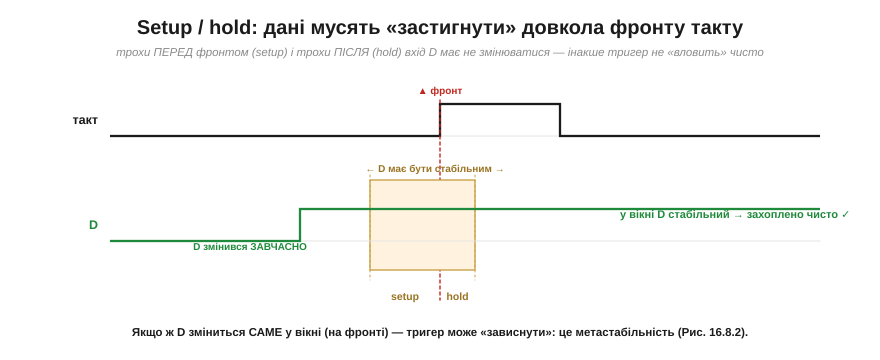
*Рис. 3.3.8.1. Тригерові потрібно, щоб D був стабільним протягом часу **setup** (*t_su*) **перед** фронтом і часу **hold** (*t_h*) **після** нього — це маленьке «заборонене вікно» довкола фронту. Якщо D змінився **завчасно** (зеленим) і у вікні стоїть незмінно — захоплення чисте. А от якщо D зміниться **саме у вікні**, тригер може не встигнути визначитися.*

Це не примха конкретного чипа, а наслідок фізики: внутрішня петля тригера має час відреагувати, і поки вона «вирішує», вхід смикати не можна. У даташиті будь-якого тригера ці t_su і t_h — серед перших параметрів. Порушити їх — означає напроситися на біду.

### Метастабільність: тригер «завис»

А біда така. Якщо D змінюється рівно на фронті, внутрішня бістабільна петля дістає **рівно посередині** поштовх — і може зависнути в **метастабільному** стані: вихід застигає десь між 0 і 1, ні те ні се.


*Рис. 3.3.8.2. Коли D змінився саме на фронті, вихід Q може **зупинитися посередині** — ні 0, ні 1 — і «дзвеніти» там невизначений час, перш ніж нарешті впасти в один зі станів. Найгірше — що **час** цього розв'язання **випадковий**: інколи наносекунди, інколи довше. Це той самий «горб» бістабільності з історії розділу: кулька, поставлена точно на вершину, балансує, а тоді падає ліворуч чи праворуч — і коли саме та куди, наперед не вгадати.*

Осягніть, наскільки це підступно. Тригер не просто видає неправильне значення — він видає **невизначене**, ще й на невідомий час. Наступна логіка, що очікує чистий 0 чи 1, бачить «щось посередині» й може зробити з ним казна-що. І, що найгірше, метастабільність **неможливо повністю усунути** — це фундаментальна властивість будь-якої бістабільної схеми. Її можна лише зробити вкрай **малоймовірною**. Як? Спершу зрозуміймо, де вона взагалі загрожує.

### Усередині синхронної схеми — безпечно, якщо таймінг дотримано

Хороша новина: **всередині** синхронної схеми, де **дотримано таймінг** (setup/hold кожного тригера), метастабільність практично **не виникає**. І це не везіння, а саме те, заради чого існує вся таймінг-дисципліна з §3.3.6.


*Рис. 3.3.8.3. Згадаймо §3.3.6: період такту підбирають так, щоб комбінаційна логіка **встигла** порахувати наступні значення й D **застиг** задовго до наступного фронту. А якщо D стабільний задовго до фронту — вікно setup/hold автоматично дотримано, і захоплення завжди чисте. Тобто синхронний дизайн **за побудовою** гарантує, що дані не змінюються на фронті.*

Ось чому вся цифрова техніка така одержима **спільним тактом** і **критичним шляхом**: дотримуючи їх, ми гарантуємо, що в кожній точці схеми дані «застигають» вчасно й жоден тригер не ловить зміну на фронті. Метастабільність усередині синхронного домену практично **не виникає** — бо, дотримуючи таймінг, ми навмисно не даємо D мінятися в небезпечну мить. Уся методологія Розділу 3.3 — це, по суті, спосіб уникнути метастабільності за рахунок дисципліни.

### Небезпека на межі: асинхронні входи

То де ж тоді ховається загроза? На **межі** — там, де в нашу синхронну схему заходить сигнал, що **не знає** про наш такт.


*Рис. 3.3.8.4. Натискання **кнопки**, сигнал з **іншого** пристрою чи з іншого тактового домену — усе це **асинхронні** входи: вони змінюються **коли заманеться**, не звіряючись із нашим фронтом. Рано чи пізно такий сигнал зміниться **майже точно** на фронті — і потрапить у вікно setup/hold, наразивши тригер на метастабільність. Заводити зовнішній сигнал «напряму» в синхронну логіку **не можна**.*

Це фундаментальна точка: щойно цифрова система мусить «поспілкуватися» із зовнішнім світом — кнопкою, давачем, іншим чипом, — вона стикається з сигналами, яким байдуже до її ритму. І саме на цих стиках криється майже вся реальна метастабільність. На щастя, є просте й елегантне ліки.

### Ліки: синхронізатор із двох тригерів

Класичний захист — **синхронізатор**: пропустити асинхронний сигнал крізь **два** тригери поспіль, перш ніж віддавати його логіці.


*Рис. 3.3.8.5. Асинхронний вхід заводять у **перший** тригер. Той інколи зависає метастабільно — але має **цілий період такту**, щоб розв'язатися в чистий 0 чи 1, перш ніж його зчитає **другий** тригер. Тож другий тригер майже завжди бачить уже **визначене** значення й передає його логіці чистим. Метастабільність не зникає зовсім — вона стає **неймовірно рідкісною** (її міряють середнім часом між збоями, MTBF). Для двох тригерів за помірних частот MTBF сягає років чи століть — але це **не константа**: він залежить від частоти, запасу часу (*slack*), технології, температури й напруги, тож за жорсткіших умов (висока частота, малий slack) додають третій тригер чи більше.*

Краса цього рішення в тому, що воно не **бореться** з метастабільністю (її не подолати), а дає їй **час розсмоктатися**. Перший тригер бере на себе удар, цілий такт «приходить до тями», і другий уже не бачить хаосу. Імовірність, що метастабільність протримається довше за період і прослизне далі, мізерна — і її роблять як завгодно малою, додаючи ще тригери. Це стандартний прийом, який ви побачите на кожному вході, що приймає зовнішній сигнал. Одне важливе «але»: два тригери синхронізують **один біт**. Ціле **багатобітне** число через межу тактових доменів так не передаси — окремі біти можуть «приїхати» в різні такти й дати безглузде проміжне значення. Для цього потрібен належний протокол переходу між доменами (*CDC, clock-domain crossing*): **рукостискання**, черга **FIFO** або код **Грея** (де між сусідніми значеннями міняється лише один біт). До цих прийомів ми ще повернемося зі справжніми інтерфейсами.

> 🔧 **Навіщо це.** Метастабільність — це «привид», який ви рідко бачите, але мусите знати, бо він пояснює цілий клас рідкісних, невідтворюваних багів. Винесіть головне. Перше: тригер потребує, щоб дані були стабільні у вікні **setup/hold** довкола фронту; порушите — ризикуєте «зависанням». Друге: **усередині** синхронної схеми це не загрожує, бо таймінг-дисципліна (§3.3.6) сама гарантує стабільність, — ось іще одна причина, чому все проєктують синхронно. Третє, найпрактичніше: **будь-який зовнішній, асинхронний сигнал** — кнопку, сигнал з іншого чипа — треба заводити в логіку **через синхронізатор** (два тригери), а не напряму; інакше колись-таки спіймаєте метастабільність. Коли в Модулі 4 ви читатимете зовнішні сигнали в мікроконтролер, пам'ятайте про це: дребезг кнопки (§4.4.5) і синхронізація — дві сторони однієї обережності зі світом, що не знає вашого такту.

---

Підсумок §3.3.8: тригер захоплює дані чисто, лише якщо D стабільний у вікні **setup/hold** довкола фронту. Зміна D **на фронті** може ввести тригер у **метастабільний** стан — «ні 0 ні 1», що розв'язується через **випадковий** час (той самий хиткий «горб» бістабільності з історії розділу). Усунути метастабільність неможливо — лише зробити малоймовірною. **Усередині** синхронної схеми її не буває: таймінг-дисципліна (§3.3.6) гарантує, що D застигає задовго до фронту. Небезпека — на **межі**, де заходять **асинхронні** сигнали (кнопки, інші домени), що можуть змінитись будь-коли. Ліки для **одного біта** — **синхронізатор** із двох тригерів: перший «гасить» метастабільність за період, другий бачить чисте значення (MTBF дуже великий, хоч і залежить від частоти, slack і технології — за потреби додають ще тригери). Для **багатобітних** переходів між тактовими доменами потрібен окремий протокол (CDC: рукостискання / FIFO / код Грея). 

---

## 3.3.9 Скінченні автомати: Мур і Мілі

Лічильник із §3.3.7 уже виглядав «розумним»: він пам'ятав, де зупинився, і на кожному такті робив наступний крок. Та крок у нього був завжди той самий — «додай одиницю». Він крокує по колу однаковим маршрутом і нічого не вирішує. А реальній машині потрібно більше: ловити старт-біт у потоці, чекати на готовність давача, вести багатокрокову операцію «по черзі», блимати світлофором за приписаним порядком. Усе це — не «лічба», а **поведінка**: машина має бути в певному **стані**, дивитися на **вхід** і залежно від нього **вирішувати**, куди перейти й що зробити. Інженерну форму цієї ідеї звуть **скінченний автомат** (*finite-state machine, FSM*), або **скінченний автомат станів**. Він — вершина всього розділу: тут пам'ять (тригери) і логіка (вентилі) нарешті зливаються в машину, що не просто рахує, а **керує**. Саме автомати ховаються в кожному контролері протоколу, у кожному апаратному блоці мікроконтролера, що «веде» якусь послідовність дій, — і, як ми побачимо в Модулі 3.5, навіть сам процесор у серці своєму є автоматом.

### Від лічильника до автомата: відв'яжемо «+1»

Почнімо з того, що ми вже маємо, і зробимо один крок убік. Лічильник — це регістр стану плюс жорстко зашите правило переходу: «наступне число = поточне + 1». Уся хитрість FSM у тому, щоб **замінити це правило довільним**: хай наступний стан буде не «+1», а **будь-яка** функція поточного стану й входів.


*Рис. 3.3.9.1. Ліворуч — лічильник: маршрут «зашитий», стан іде по колу 0→1→2→3→0 однаково, хоч би що довкола діялося. Праворуч — автомат: той самий регістр стану, але наступний стан тепер залежить і від **входу**. У стані A машина за входом=1 переходить у B, а за входом=0 лишається на місці; маршрут обирає вхід. Те, що раніше було сліпою лічбою, стало **керуванням** — машиною, яка приймає рішення.*

Бачите, як мало довелося змінити? Пам'ять стану лишилася та сама — той самий регістр на тригерах, що крокує по фронту такту (§3.3.7). Ми лише дозволили **логіці переходу** бути складнішою за суматор «+1» і впустили в неї **входи**. Цього досить, щоб з лічильника народилася машина зі справжньою поведінкою. У цьому й сила ідеї: FSM — не якась нова екзотична схема, а природне узагальнення того, що ми вже збудували. Лічильник виявляється **окремим, найпростішим випадком** автомата — таким, що ігнорує входи й завжди ходить по колу.

Затримаймося на слові **скінченний**. Воно не випадкове й несе цілком практичний зміст: станів — рівно стільки, скільки бітів у регістрі стану дозволяє розрізнити, тобто на k тригерах — щонайбільше 2ᵏ станів, і ні на один більше. Машина не може «вигадати» новий стан на ходу; усі її можливі становища перелічені наперед, як кімнати в будинку. Саме ця скінченність робить автомат таким зручним для проєктування: поведінку, хоч би яку звивисту, можна **повністю** описати скінченною діаграмою й бути певним, що інших станів не буде. Звідси й перше практичне питання, яким відкривають проєктування будь-якого автомата: «а скільки в нього станів?» — бо відповідь одразу каже, скільки треба тригерів (⌈log₂N⌉) і наскільки складною вийде логіка переходу. Мало станів — машина проста й дешева; багато — складна, та зате й поведінка багатша.

Дамо ідеї точні слова. **Стан** (*state*) — це «де зараз перебуває машина», та сама внутрішня змінна, що живе в регістрі. Скінченних станів — скінченна, наперед відома кількість (звідси й назва). **Перехід** (*transition*) — стрілка «з якого стану в який», і спрацьовує вона за певної **умови** на вході. На кожному фронті такту машина дивиться, у якому вона стані й що на входах, і за цими двома речами обирає **наступний стан**. Формально це дві функції:

```
наступний стан = f(поточний стан, входи)     ← логіка переходу
вихід          = g(поточний стан [, входи])   ← логіка виходу
```

Перший рядок ми вже зустрічали — це той самий «кістяк усіх схем з пам'яттю» з §3.3.1 (комбінаційна логіка плюс зворотний зв'язок). Другий рядок — новий і дуже важливий: машина має ще й **щось робити**, тобто видавати **виходи**. І ось саме від того, як ми означимо цей вихід — рядок `g`, — і походять дві школи автоматів, Мура й Мілі. Та спершу подивімося на автомат у дії.

### Діаграма станів: мова, якою малюють поведінку

Перш ніж будувати автомат із вентилів, його **малюють**. Стандартна мова для цього — **діаграма станів** (*state diagram*): кружок на кожен стан, стрілка на кожен перехід, а підпис на стрілці — умова, за якої цей перехід стається. Це той самий жанр, що й мапа: дивишся й одразу бачиш, куди машина може піти і коли.

Візьмімо живий приклад, до того ж знайомий. У §3.3.5 ми бачили, як **зсувний регістр** на приймачі послідовної лінії «складає» байт із окремих бітів, що приходять по одному дроту. Але хтось має тим зсувним регістром **керувати**: розпізнати початок посилки, відлічити рівно вісім бітів даних, перевірити кінець і повернутися чекати наступного. Оце «хтось» — і є автомат.


*Рис. 3.3.9.2. Контролер приймача послідовного байта як автомат із чотирьох станів. **IDLE** — спокій: доки лінія тримає 1 (тиша), машина лишається тут (петля «лишитись»); щойно лінія впала в 0 (старт-біт) — перехід у **START**. Звідти, перечекавши належний час, — у **DATA**, де машина рахує біти й крутиться на місці, доки їх менше за вісім. Зібравши всі вісім — у **STOP** перевірити стоп-біт, і нарешті назад в IDLE, готовою до нової посилки. Подвійне кільце на IDLE позначає **початковий** стан. Кожен такт машина дивиться на вхід (рівень лінії, лічильник бітів) — і вирішує, лишитись чи рушити далі.*

Прочитайте діаграму як інструкцію, і ви фактично прочитаєте **протокол**. Саме тому інженери малюють автомат перш, ніж писати бодай рядок логіки: діаграма — це повний, недвозначний опис поведінки, який видно оком. На ній одразу помітні й типові помилки: стан, з якого нема виходу (машина «застрягне»), або умова, що нікуди не веде. Зверніть увагу на дві **петлі-на-собі** (в IDLE і DATA) — це і є те саме «тримати», що ми так цінували в засувці (§3.3.2): за певної умови машина свідомо **лишається** у стані, тобто запам'ятовує, що подія ще не настала. FSM успадкував пам'ять прямо від тригера.

Корисно проглянути діаграму ще й «у русі», по тактах, бо так видно зв'язок із усім, що ми будували раніше. Уявімо посилку: лінія тримала 1, машина сиділа в IDLE — такт за тактом крутилася на петлі, нічого не змінюючи (це утримання стану, §3.3.2). Лінія впала в 0 — на найближчому фронті такту (а не «коли заманеться», бо стан живе в тактованому регістрі, §3.3.6) машина перейшла в START. Далі по фронтах вона проходить DATA, де всередині крутиться, доки внутрішній лічильник бітів (§3.3.7!) не добереться до восьми, тоді STOP — і назад в IDLE. Кожен **крок** діаграми — це рівно один **фронт** спільного такту; між фронтами машина стоїть незмінно. Тобто автомат — це не якась окрема абстракція «згори», а буквально та сама синхронна дисципліна §3.3.6, лише описана зрозумілою людині мовою станів і переходів замість купи рівнянь для кожного тригера.

### Дві школи: Мур проти Мілі

Тепер — головна розвилка теми, та сама відмінність у рядку `g`. Питання просте: **коли** автомат виставляє свій вихід — за самим лише станом чи ще й зважаючи на поточний вхід? Дві відповіді дали двоє інженерів Bell Labs у 1950-х, і їхні імена закріпилися за двома типами автоматів.

**Автомат Мура** (*Moore machine*, Едвард Мур) каже: вихід залежить **тільки від стану**. У кожному кружку діаграми написано, що на виході, поки машина в цьому стані, — і цей вихід тримається **весь такт**, незалежно від того, як смикається вхід. **Автомат Мілі** (*Mealy machine*, Джордж Мілі) каже інакше: вихід залежить **і від стану, і від входу разом**, тож його пишуть **на стрілці** переходу, а не в кружку.

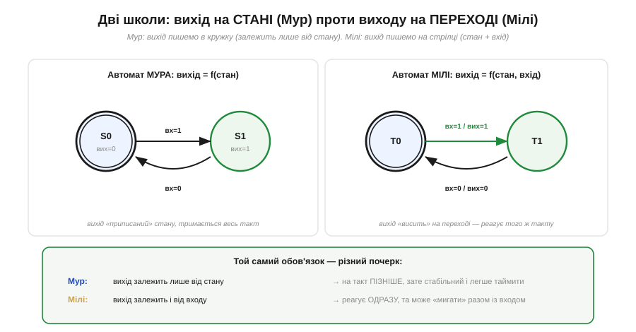
*Рис. 3.3.9.3. Та сама поведінка, два почерки. **Мур** (ліворуч): вихід приписаний станові — «вих=0» у S0, «вих=1» у S1, і він стабільно тримається, доки машина в цьому стані. **Мілі** (праворуч): вихід висить на переході — «вх=1 / вих=1» означає «коли вхід=1, переходимо й видаємо 1». Тому Мілі реагує на вхід **того ж такту**, а Мур — лише на **наступному** (спершу зміниться стан, а вже він задасть вихід). За це Мілі платить тим, що його вихід може «мигати» слідом за входом між фронтами, тоді як вихід Мура завжди чистий і вирівняний по такту.*

Різниця тонша, ніж здається, тож зважмо її чесно — це і є серце теми. Оскільки у Мура вихід проходить **крізь регістр стану** (спершу вхід міняє стан на фронті, а вже стан визначає вихід), вихід Мура **відстає на один такт**, зате він **синхронний і стабільний**: міняється лише на фронтах, ніколи не «дзвенить». У Мілі вихід — це комбінаційна функція входу, що йде **повз** регістр прямо на вихід, тому реагує **миттєво, того самого такту**, але й успадковує всі смикання входу: змінився вхід посеред такту — смикнувся й вихід (це знайомий привид прозорості з §3.3.4, лише на виході автомата). Звідси практичне правило: коли вихід керує чимось чутливим до чистоти — іншим тактованим блоком, лінією, що мусить бути рівною, — беруть **Мура**; коли критична швидка реакція й на такт чекати не можна — **Мілі**. Часто будують **мішаний** автомат: більшість виходів за Муром (стабільні), а один-два — за Мілі (швидкі).

Є ще один практичний бік, через який інженери часто тягнуться до Мілі, — **ощадність на станах**. Хай треба видати сигнал «так!» того такту, коли на вході одиниця, а машина перед тим уже була «насторожена». Автомат Мілі обходиться двома станами («спокій» і «насторожі»), а сам сигнал чіпляє на потрібний перехід — вихід народжується «на стрілці». Автомат Мура для того ж змушений завести **окремий стан** під сам факт «зараз видаю так!», бо інакше виходу нема де «жити», окрім як у кружку, — і станів стає більше. Загальне правило: Мілі нерідко описує ту саму поведінку **меншим числом станів**, зате Мур дає чистіший вихід. І ще важливе: будь-який автомат Мілі можна перетворити на еквівалентний автомат Мура (якраз ціною таких **додаткових станів**) і навпаки — це той самий клас машин, лише по-різному записаний. Вибір між ними — не про можливості, а про **компроміс** «затримка й кількість станів проти чистоти виходу», точнісінько в дусі решти Модуля 3.

### Як його будують: регістр стану плюс дві логіки

Лишилося показати — натяком, бо повний код буде окремою ⚙️-вставкою, — як автомат лягає в залізо. І тут на нас чекає приємний сюрприз: нічого нового будувати не треба. Автомат збирається рівно з тих цеглинок, що ми вже маємо, у конфігурації, яку ми вже бачили в §3.3.1.

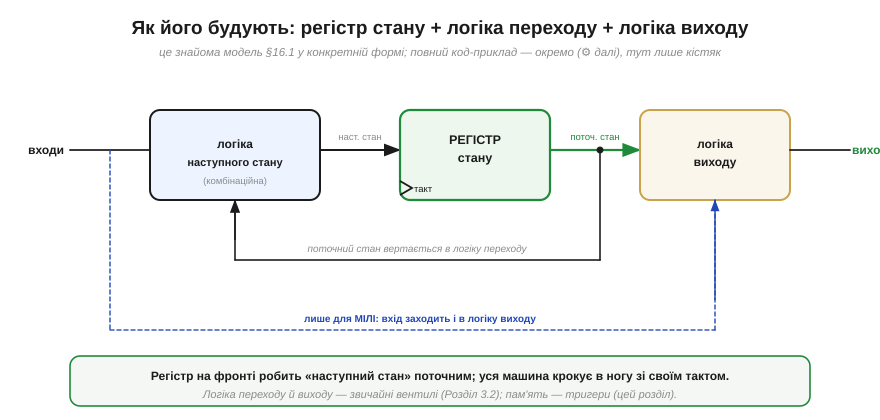
*Рис. 3.3.9.4. Канонічна «трикутна» схема будь-якого автомата. Серце — **регістр стану** (§3.3.5) на тригерах: він зберігає поточний стан і на кожному фронті такту робить «наступний стан» поточним. **Логіка наступного стану** — звичайна комбінаційна схема (вентилі з Розділу 3.2), що бере поточний стан і входи й обчислює, куди перейти. **Логіка виходу** — теж комбінаційна, обчислює виходи зі стану. Поточний стан **вертається** з виходу регістра назад у логіку переходу — ось і весь зворотний зв'язок. Пунктир — різниця Мілі: у нього входи заходять **і** в логіку виходу (тому вихід реагує одразу); у Мура цього пунктиру нема.*

Упізнаєте? Це той самий малюнок «комбінаційна логіка + пам'ять стану + зворотний зв'язок», з якого почався весь розділ (§3.3.1) — лише тепер кожен блок має ім'я й роль. Регістр стану дає **пам'ять** і **синхронність**: машина крокує строго по фронту спільного такту, тож усі тонкощі §3.3.6 і §3.3.8 (критичний шлях, setup/hold, метастабільність на асинхронних входах) діють тут так само — і так само рятують. Дві комбінаційні логіки — це просто два блоки вентилів, кожен з яких ми вміємо проєктувати ще з Розділу 3.2. Тобто весь Модуль 3 у цій одній схемі сходиться докупи: логіка рахує, тригери тримають, такт диригує — а разом вони дають **машину з поведінкою**.

Як саме «записати» стани в бітах регістра — окреме інженерне рішення (кодування станів): можна звичайними двійковими числами (компактно, та логіка переходу складніша), а можна так званим «один-із-багатьох», де на кожен стан — свій тригер (більше тригерів, зате логіка простіша й швидша). Це вже деталі реалізації, до яких разом із повним кодом автомата ми повернемося у ⚙️-вставці; тут досить розуміти **кістяк**.

> ⚙️ **Далі — у вставці.** Повна реалізація автомата (опис станів, таблиця переходів, кодування й готовий код контролера) винесена в окрему ⚙️-вставку до цієї теми, щоб тут лишити чисту теорію: ідею стану, діаграму й вибір Мур/Мілі.

> 🔧 **Навіщо це.** Скінченний автомат — це, мабуть, найважливіший спосіб **мислення** з усього розділу, бо саме так проєктують будь-яку керувальну логіку. Винесіть головне. Перше: щойно задача звучить як «зробити по черзі», «дочекатися», «розпізнати послідовність», «вести протокол» — це **автомат**, і першим ділом його **малюють** діаграмою станів, а не кидаються писати код. Друге: **стани — це пам'ять** машини (тригери), **переходи — її рішення** (вентилі за входами); ви свідомо обиратимете, які стани потрібні й коли між ними ходити. Третє, суто практичне: **Мур** дає чисті, вирівняні по такту виходи (беріть для всього, що керує іншою синхронною логікою), **Мілі** — швидку реакцію того ж такту (беріть, коли на такт чекати не можна); це компроміс «затримка проти чистоти». Коли в Модулі 3.5 ви побачите, що **процесор** сам є великим автоматом (вибірка → декодування → виконання — це його стани), а в Модулі 4 настроюватимете апаратні блоки ESP32, що «ведуть» обмін по шині, — за кожним таким блоком стоятиме саме скінченний автомат, який хтось намалював діаграмою.

**Приклад (скільки станів і тригерів).** Спроєктуймо «на пальцях» автомат для світлофора з послідовністю **зелений → жовтий → червоний → червоно-жовтий → (знову зелений)**, що перемикається по сигналу таймера. Скільки потрібно станів і тригерів і якого типу зробити вихід?

```
Кроки послідовності — і є стани:
    S0 = ЗЕЛЕНИЙ
    S1 = ЖОВТИЙ
    S2 = ЧЕРВОНИЙ
    S3 = ЧЕРВОНО-ЖОВТИЙ
  → кількість станів  N = 4

Скільки тригерів у регістрі стану:
  треба k бітів, щоб закодувати 4 стани → 2^k ≥ N
    2^k ≥ 4  →  k = 2          (двійкове кодування: 00,01,10,11)
  → регістр стану = 2 тригери

Перехід (логіка наступного стану):
  по сигналу таймера tick:  стан → наступний по колу
    S0→S1→S2→S3→S0  (це знов «лічильник», але за модулем 4!)
  без tick:  лишитись (петля на собі)

Вихід (три лампи: R, Y, G) — за станом, тому МУР:
  стан | R Y G
   S0  | 0 0 1     ← вихід залежить ЛИШЕ від стану,
   S1  | 0 1 0       тримається весь час, поки горить, —
   S2  | 1 0 0       лампі НЕ можна «мигати» з входом,
   S3  | 1 1 0       тож Мілі тут небезпечний → беремо Мур
```
Виходить машина на **двох тригерах** (стан) плюс трохи вентилів (перехід «по колу за tick» і таблиця ламп). Зверніть увагу на два уроки. По-перше, перехід «по колу за сигналом» — це по суті **mod-4 лічильник** із §3.3.7: світлофор виявляється лічильником, чий «рахунок» ми тлумачимо як кольори. По-друге, вихід тут **навмисно Мура**: лампа мусить горіти рівно й стабільно весь свій час, а не смикатися слідом за дрібними змінами входу, — і саме чистота виходу Мура це гарантує. Той самий автомат можна було б зробити й на Мілі, але довелося б пильнувати, щоб лампи не мерехтіли, — зайвий клопіт там, де Мур дає спокій задарма.

---

Підсумок §3.3.9: **скінченний автомат** (*FSM*) — це машина, що перебуває в одному зі **скінченного** числа **станів** і на кожному фронті такту за поточним станом і **входами** обирає **наступний стан** та **вихід**. Він — пряме узагальнення лічильника: відв'яжіть жорстке «+1», дозвольте логіці переходу залежати від входів — і сліпа лічба стає **керуванням** (лічильник виявляється найпростішим автоматом). Поведінку автомата малюють **діаграмою станів** (кружки-стани, стрілки-переходи з умовами), і ця діаграма — повний опис протоколу. Дві школи різняться тим, **звідки** береться вихід: **Мур** — вихід лише від стану (стабільний, чистий, але на такт пізніше), **Мілі** — вихід від стану й входу (реагує одразу, та може «мигати»); вибір — компроміс «затримка проти чистоти», а самі машини еквівалентні. Будують автомат канонічно: **регістр стану** (тригери) + **логіка переходу** + **логіка виходу** (вентилі) зі зворотним зв'язком — той самий кістяк §3.3.1, у якому зійшовся весь Модуль 3. Цим ми завершили послідовнісну техніку: маємо логіку, пам'ять, такт — і машину з поведінкою.

---

### Підсумок Розділу 3.3

Ми навчили схему **пам'ятати**, **крокувати в часі** й **поводитися**. Почали з того, чого бракувало логіці Розділу 3.2, — **пам'яті стану**, і знайшли її в **зворотному зв'язку**: парна петля дає бістабільну комірку, що тримає 1 біт (§3.3.1). Додали їй керування — вийшла **SR-засувка** (§3.3.2), тоді приборкали її прозорість і заборонені стани, дійшовши до **тактованого D-тригера**, що захоплює дані по **фронту** (§3.3.3), і зрозуміли, **чому** саме по фронту (§3.3.4). Поставивши тригери разом, дістали **регістр** для зберігання слова (§3.3.5), а спільний **такт** (§3.3.6) зв'язав усе в синхронну машину, що крокує в ногу. Ланцюг тригерів дав **лічильник** — годинник і дільник частоти (§3.3.7), розуміння **метастабільності й таймінгу** (§3.3.8) показало, на чому вся ця синхронність тримається, а **скінченний автомат** (§3.3.9) звів логіку й пам'ять в одну машину, що не лише рахує, а й **керує**. Тепер у нас є все: логіка, що рахує (Розділ 3.2), і пам'ять, що тримає, крокує й веде поведінку (Розділ 3.3). Лишилося домовитися, **як саме** ми записуватимемо числа в усіх цих бітах — додатні й від'ємні, дробові, великі й малі. Це — мова чисел.

> ▶️ Далі: [Розділ 3.4 — Представлення чисел](../number-representation/number-representation.md)