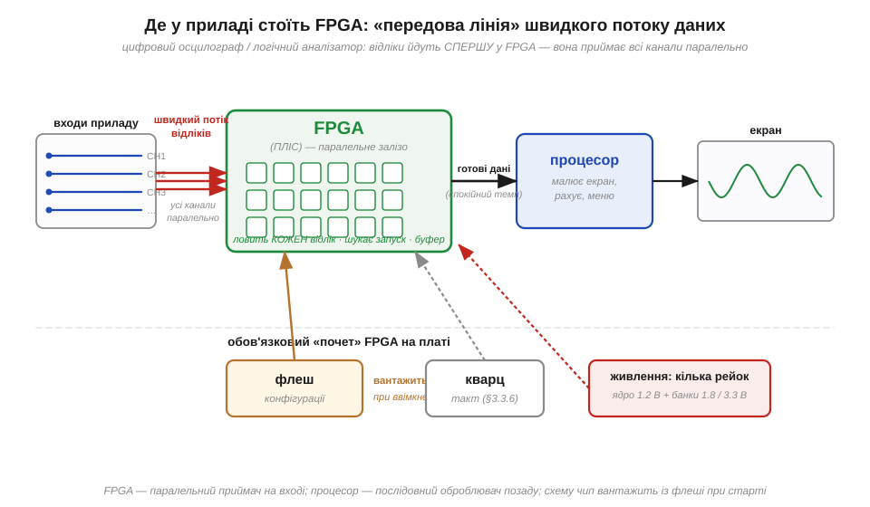

# 🔌 Де ви вже зустрічали FPGA: осцилограф, логічний аналізатор, SDR, ретро-консолі

> 🔌 Компонентна вставка до теми [§3.7.1 «Навіщо програмована логіка: паралельність у залізі»](fpga.md). §3.7.1 пояснив **ідею**: коли послідовний процесор не встигає по тактах, схему розгортають у залізі, щоб усе працювало паралельно. Тут — той самий чип у житті: виявляється, FPGA вже багато разів стояла у вас на столі, просто під чужою вивіскою. Розберемо, як вона туди потрапляє, чим відрізняється від мікросхеми з прошивкою й на чому об цей клас спотикаються вперше. Усе — на матеріалі вже пройденого: вентилі (§3.2), тригери й такт (§3.3), послідовний процесор (§3.5), осцилограф (§1.6.7) і логічний аналізатор (§1.6.9).

## Що це за клас

FPGA (*Field-Programmable Gate Array*, програмована користувачем вентильна матриця; українською — ПЛІС) — це чип, **схему** якого, а не програму, задають уже після виготовлення. Усередині нього — поле з тисяч однакових клітинок логіки й тригерів (§3.3) та густа мережа перемикачів між ними; чим саме стане кожна клітинка й куди підуть зв'язки, вирішує **конфігурація**, яку завантажують при ввімкненні. Тому той самий кристал в одному приладі працює лічильником, в іншому — приймачем сигналу, у третьому — цілою старою ігровою приставкою. На відміну від мікроконтролера (§3.5), який **по черзі** виконує інструкції, FPGA робить усе закладене **одночасно**, бо кожна функція живе у власному шматку заліза — саме та паралельність, заради якої її й беруть (§3.7.1).

Найчастіше ви бачили її у **вимірювальних приладах**. У цифровому осцилографі (§1.6.7) і особливо в логічному аналізаторі (§1.6.9) хтось мусить **без жодного пропуску** ловити відліки з кількох каналів на швидкості сотні мегавідліків за секунду, складати їх у пам'ять і шукати умову запуску. Процесор такий потік не витягне — не вистачить тактів. Тому «передову лінію» віддають FPGA: вона приймає дані з усіх входів **паралельно**, а процесор уже потім спокійно малює картинку й рахує. Так само влаштовані SDR (*Software-Defined Radio*, програмно-визначуване радіо): антена дає суцільний потік відліків, і FPGA на льоту фільтрує та проріджує його, перш ніж віддати комп'ютеру. А ще на FPGA точно відтворюють **ретро-консолі**: замість емуляції старого процесора програмою його схему **повторюють у залізі** клітинка в клітинку, тож гра йде з тим самим тактом, що й на оригіналі.

## Блок-схема: FPGA на платі приладу


*Рис. 3.7.1c.1. Типовий тракт вимірювального приладу. Швидкий потік відліків з входів іде **спершу** у FPGA — вона ловить кожен відлік без пропуску, шукає умову запуску (§1.6.9) і складає дані в буфер. Процесор підхоплює вже зібране й малює екран. Поряд із FPGA — обов'язкові супутники: мікросхема конфігурації, з якої вантажиться схема при ввімкненні, кварц такту (§3.3.6) і кілька джерел живлення.*

Звернімо увагу на те, що оточує FPGA на схемі: сама собою вона не стоїть — навколо неї завжди той самий «почет», за яким її й упізнаєш на фото плати. По-перше, окрема **флеш-мікросхема конфігурації** поруч: чип порожній після ввімкнення й мусить звідкись завантажити свою схему. По-друге, **кварц** (§3.3.6), бо вся та паралельна логіка тактується спільним ритмом. По-третє, аж **кілька** стабілізаторів: ядру треба низька напруга (часто 1.2 В), а виводам — окремо, та ще й різні групи виводів живляться різними рівнями. Кожен із цих сусідів далі ще нагадає про себе у «граблях».

## Розпіновка: ядро, банки, конфігурація, JTAG

Виводи FPGA групуються не «по функції», як у мікроконтролера, а **за призначенням**, і це впадає в око навіть на схемі:

```
              ┌──────────────────────────────┐
     VCCINT ──┤ живлення ядра (напр. 1.2 В)  │
      VCCIO ──┤ живлення банка (1.8 / 3.3 В) │
        I/O ══╡ банк A ◄─ сотні вільних      │══ I/O  банк B
        I/O ══╡ виводів: будь-який вхід      │══ I/O
              │     або вихід                │
        CLK ──┤ вхід такту (на кварц/ген.)   │
     CONFIG ──┤ SPI → флеш конфігурації      │
       JTAG ──┤ прошивка й налагодження      │
              └──────────────────────────────┘
```

- **VCCINT** — живлення внутрішнього поля логіки (низька напруга ядра); **VCCIO** — окреме живлення **банка** (*bank*) виводів. Виводи поділені на банки саме тому, що кожен банк можна підняти на свою напругу — один спілкується з 3.3-вольтовою логікою, сусідній — з 1.8-вольтовою (рівні — §3.1.4).
- **I/O** — сотні універсальних виводів: на відміну від фіксованих ніжок мікроконтролера, тут майже будь-який вивід ви самі **призначаєте** входом чи виходом, коли описуєте схему.
- **CLK** — спеціальні входи такту, заведені на кварц або зовнішній генератор.
- **CONFIG** — лінії (зазвичай SPI), якими чип при старті **зчитує** свою схему з флеші конфігурації.
- **JTAG** (TCK/TMS/TDI/TDO) — службова шина для прошивання й налагодження.

## Підключення й «перший байт»: схема вантажиться при ввімкненні

Головна відмінність цього класу від усього, що ми бачили, — у тому, **коли** з'являється функція. Прошивка мікроконтролера лежить у його флеші постійно; FPGA ж після ввімкнення живлення **порожня**, і її «перший байт» — це не команда по шині, а **вся схема цілком**, яку чип за перші мілісекунди старту вливає в себе з сусідньої флеші конфігурації (її кладуть туди наперед, через JTAG). Поки конфігурація не завантажилась, на виводах нічого осмисленого нема. Ознака, що чип «заговорив», — спеціальний вивід **DONE** піднімається у «1», і тільки після цього призначені вами виходи починають перемикатися. Тому «підключити» FPGA означає дати їй усі живлення в правильному порядку, кварц на вхід такту й справну флеш конфігурації поруч — далі вона піднімається сама.

## Граблі цього класу

Перші граблі, на які наступають усі, ростуть прямо з цієї будови — і кожен «почет» дається взнаки.

- **Чип «мертвий» після ввімкнення.** Він і має бути порожнім, поки не вантажиться конфігурація. Якщо DONE так і не піднявся — винна або порожня (чи неправильно записана) флеш конфігурації, або переплутаний порядок живлень. Шукати треба не «баг у логіці», а зрив самого завантаження.
- **Сплутані напруги банків.** Виводи різних банків живляться **окремо** (VCCIO). Подати на 1.8-вольтовий банк 3.3-вольтовий сигнал — те саме, що й будь-яка несумісність рівнів (§3.1.4): у кращому разі чип не зрозуміє вхід, у гіршому — псується вивід.
- **Голод по живленню й нагрів.** Густо завантажена паралельна логіка споживає помітний струм і гріється — звідси кілька стабілізаторів і часто радіатор. Кволе живлення дає плаваючі, «неможливі» збої.

## Варіації класу й де що шукати

Той самий принцип «схему вантажать при старті» носять чипи різного калібру, і впізнати їх легко за роллю на платі. У **вимірювальних приладах** (цифровий осцилограф §1.6.7, логічний аналізатор §1.6.9) FPGA сидить одразу за входами й тримає швидкий потік відліків. У **SDR** вона стоїть між антенним перетворювачем і USB, проріджуючи суцільний радіопотік. У **точних ретро-консолях** великий чип повторює схему старої приставки в залізі. А по сусідству живе дрібніша рідня — **CPLD**-клас: маленька програмована логіка, що тримає конфігурацію всередині й готова до роботи **зразу** після ввімкнення, без зовнішньої флеші; її ставлять там, де треба лише «склеїти» кілька ліній між чипами, а не розгортати ціле поле логіки. Як ця рідня співвідноситься з FPGA по дорозі еволюції — тема §3.7.2.
