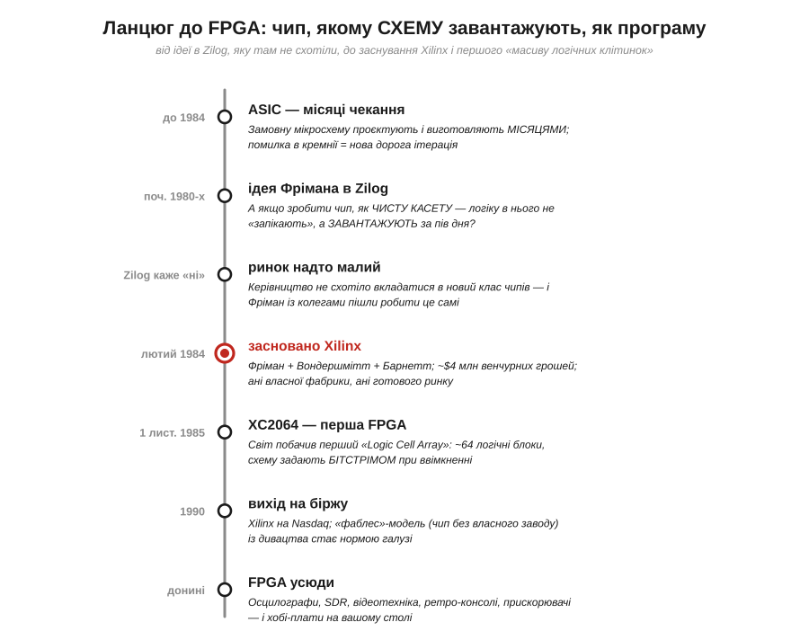
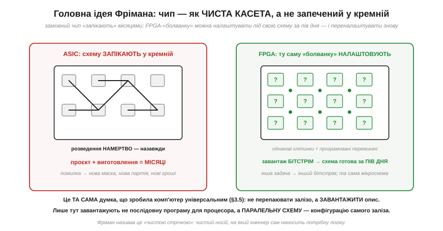
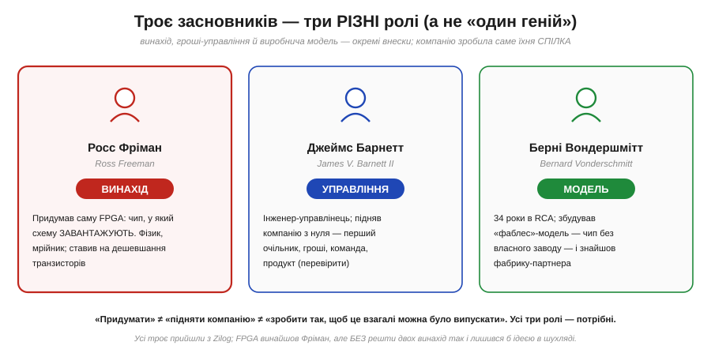
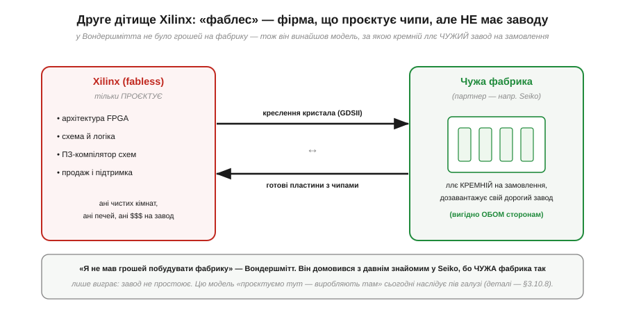
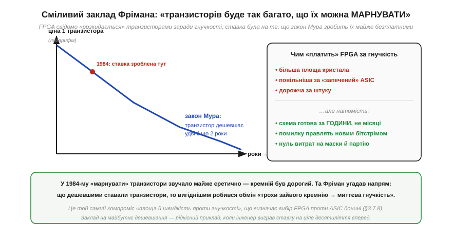

# 📜 Історія до Розділу 3.7 — Фріман, Вондершмітт і Барнетт засновують Xilinx: чип, якому схему завантажують, як програму

> Це історична вставка до [Розділу 3.7 «Програмована логіка: ПЛІС/FPGA»](fpga.md). Уся попередня глава вела нас однією дорогою: з транзисторів ми зробили вентилі ([Розділ 3.2](../logic-gates/logic-gates.md)), із вентилів — тригери й регістри ([Розділ 3.3](../flip-flops-registers/flip-flops-registers.md)), а тоді склали з них **процесор** — машину, що виконує програму крок за кроком ([Розділ 3.5](../processor-architecture/processor-architecture.md)). І ось ми підійшли до думки, яка повертає все це з ніг на голову. У процесора схема **застигла** в кремнії, а гнучкість живе в програмі, яку він читає. А що, якби гнучкою була **сама схема**? Якби існував чип, у який інженер завантажує не послідовність команд, а **креслення власного заліза** — і за пів дня тримає в руках мікросхему, що працює саме так, як він намалював? Цю на позір фантастичну річ зробили реальною троє інженерів, які 1984 року заснували компанію **Xilinx**: **Росс Фріман** (*Ross Freeman*), **Берні Вондершмітт** (*Bernard Vonderschmitt*) і **Джеймс Барнетт** (*James V. Barnett II*). Це історія про чип, якому схему **завантажують, як програму** — і про те, чому за цією одною ідеєю стоять насправді **три** різні внески й трохи нахабна ставка на майбутнє.

Почнімо з болю, який ця ідея зняла, — бо саме біль, як і завжди в інженерії, був її матір'ю. Згадаймо урок [§3.5](../processor-architecture/processor-architecture.md): процесор універсальний тому, що його поведінку задає **завантажений** набір чисел, а не розкладка дротів. Та сам процесор — це **застигла** мікросхема: його внутрішня схема назавжди впечена в кремній на заводі. І коли інженеру потрібна не загальна «машина команд», а **своя власна** швидка схема — особливий лічильник, нестандартний інтерфейс, обробник сигналу, що мусить встигати за кожним тактом, — він упирався в ту саму стіну, об яку колись бився творець ENIAC: щоб дістати інше залізо, треба **виготовити** інше залізо. Саме цю стіну й узявся проламати Фріман.

*Рис. 3.7.0.1. Як ідея визрівала й здійснювалася. Червоний вузол — заснування Xilinx у лютому 1984-го: троє людей, ~$4 млн венчурних грошей, ані власної фабрики, ані готового ринку. Усе почалося з відмови (у Zilog ідею не схотіли), а вивершилося чипом XC2064 — першим у світі «масивом логічних клітинок», якому схему задають **бітстрімом** при ввімкненні. Як і в історії про збережену програму (§3.5), велика думка тут проста: не **перебудовувати** залізо під задачу, а **завантажувати** в нього потрібну конфігурацію.*

---

## Стіна, об яку билися: щоб змінити схему — її треба виготовити

Щоб відчути зухвалість задуму Фрімана, треба спершу уявити, яким був світ замовних мікросхем на початку 1980-х. Інженер, якому бракувало готового чипа під його задачу, мав два невеселі шляхи. Перший — зібрати потрібну схему з **окремих логічних мікросхем** серії 74 (тих самих вентилів і тригерів із §3.2 і §3.3), розпаявши десятки корпусів на платі: громіздко, повільно, ненадійно. Другий — замовити **замовну мікросхему**, ASIC (*Application-Specific Integrated Circuit*), де всю його логіку **впікали** в кремній на фабриці.

ASIC був гарний усім, крім одного: він був **назавжди**. Спроєктувати такий чип, виготовити комплект фотошаблонів (масок), прогнати партію крізь фабрику — це **місяці** роботи й величезні гроші ще до того, як ти побачиш першу робочу мікросхему. А якщо в схемі виявлялася бодай дрібна помилка — а вона виявлялася майже завжди, — починай спочатку: нова маска, нова партія, нові місяці, нові гроші. Кремній не вибачав. Схема, раз упечена, не мінялася ніколи.

> 🔧 **Навіщо це.** Цей контраст — не музейна старовина, а вибір, що стоїть перед розробником і сьогодні, і ми розберемо його по-дорослому у [Розділі 3.7](fpga.md). Коли ваша задача вимагає швидкої, **паралельної** реакції в залізі — обробити потік із давача, згенерувати точний сигнал, встигнути там, де послідовний процесор уже не встигає по тактах, — ви опиняєтесь рівно перед тією самою розвилкою: збирати з окремих чипів, замовляти дорогий ASIC чи взяти щось **переналаштовуване**. Саме третій варіант Фріман і вигадав; усе подальше — про те, як він це зробив.

Отут і визріло питання, що здавалося майже єретичним: а **мусить** схема бути застиглою? Що, як зробити чип — однакову для всіх **«болванку»**, повну логічних елементів і перемикачів, — у якому потрібні з'єднання задаються **не на заводі**, а вже у вас на столі, простим завантаженням конфігурації? Тоді «спроєктувати власний чип» означало б не дорогу мандрівку на фабрику, а кількагодинну роботу за столом — і будь-яку помилку правив би не новий кремній, а **новий файл**.

---

## Ідея «чистої стрічки»: завантажити схему, а не запекти її

Людиною, в чиїй голові ця думка набула чітких обрисів, був **Росс Фріман** (*Ross Freeman*, 1948–1989) — американський інженер незвичної як на кремнієву долину породи. За освітою він був **фізик** (бакалаврат із фізики в Університеті штату Мічиган, 1969; магістратура в Університеті Іллінойсу, 1971), кілька років віддав Корпусу миру, викладаючи математику й електроніку в **Гані**, а вже тоді прийшов у мікроелектроніку. На початку 1980-х він працював у молодій, але славній компанії **Zilog** — тій самій, що зробила легендарний процесор Z80. І саме там у нього визріла ідея, яку він сам описував образом **чистої магнітної стрічки** (*blank tape*): чистий носій, на який інженер сам наносить потрібний «запис» — тільки записом тут була не музика, а **логічна схема**.

*Рис. 3.7.0.3. Дві відповіді на питання «звідки взяти потрібну схему». Ліворуч — ASIC: логіку **запікають** у кремній намертво, проєкт і виготовлення тривають місяці, а помилка означає нову маску й нову партію. Праворуч — задум Фрімана: ту саму універсальну «болванку» з однакових клітинок і програмованих перемикачів **налаштовують** під свою схему, завантаживши **бітстрім**, — за години, з правом переробити знову. Це та сама думка, що зробила універсальним процесор (§3.5): не перепаювати залізо, а **завантажити опис**. Різниця в тому, **що** саме завантажують: процесору — послідовну програму, а сюди — **паралельну схему**, конфігурацію самого заліза.*

Придивімося, чому цей образ такий влучний — і де він прямо спирається на пройдене. У [§3.5](../processor-architecture/processor-architecture.md) ми засвоїли, що сила збереженої програми в одному: біти не мають вродженого сенсу, тож одне й те саме залізо робить будь-що, варто **завантажити** інші числа. Фріман зробив наступний крок думки. Якщо вже можна завантажувати **програму** для застиглого процесора, то чому б не завантажувати **саму схему**? Уявімо чип, заповнений тисячами однакових крихітних логічних клітинок і густою мережею перемикачів між ними. Поки перемикачі «не зведені», чип не вміє нічого — це чиста стрічка. Але якщо подати йому **конфігурацію** — довгий рядок бітів, що каже кожному перемикачу «замкнись» чи «розімкнись», а кожній клітинці «будь такою логічною функцією», — мережа **сама збереться** в потрібну схему. Ту саму болванку сьогодні налаштовуєш як лічильник, завтра — як інтерфейс, післязавтра — як обробник сигналу. Залізо стало **м'яким**.

Глибока різниця з процесором — у самій природі того, що завантажують, і її варто проговорити одразу, бо вона визначає всю цінність ідеї. Процесору ми даємо **послідовну** програму: роби крок, тоді наступний, тоді ще — одне за одним у часі. А в цей чип ми завантажуємо **паралельну схему**: десятки незалежних шматків логіки, що працюють **усі водночас**, кожен у своєму куточку кремнію, не чекаючи один на одного. Процесор удає багатозадачність, шалено швидко перемикаючись між справами по черзі; переналаштовуваний чип робить багато справ **по-справжньому одночасно**, бо під кожну в ньому **фізично зведена окрема схема**. Саме тут — корінь усієї майбутньої сили програмованої логіки, до якої ми впритул підійдемо в [Розділі 3.7](fpga.md).

---

## Zilog каже «ні» — і троє людей ідуть робити це самі

Здавалося б, така ідея мала запалити роботодавця. Та сталося навпаки — і ця відмова, як часто буває, виявилася найважливішим поворотом усієї історії. Коли Фріман запропонував Zilog узятися за новий клас чипів, керівництво ідею **не підтримало**: ринок такої екзотики тоді оцінювали скромно (за переказами — близько сотні мільйонів доларів, замало, щоб відволікати сили від основного бізнесу процесорів). Велика компанія мислила вже наявними ринками, а не тими, яких ще немає. Для застиглого корпоративного мислення «чиста стрічка» була розв'язком без видимої задачі.

І тоді Фріман зробив те, що в кремнієвій долині не раз народжувало цілі галузі: пішов **робити це сам**. Та — і ось перший важливий акцент цієї історії — сам він пішов **не сам**. Поряд стали ще двоє людей із того ж таки Zilog, кожен зі своєю роллю, без якої винахід так і лишився б ідеєю в шухляді.

*Рис. 3.7.0.2. Точна, по ролях, атрибуція. **Росс Фріман** — **винахід**: сама ідея FPGA, чипа, у який схему завантажують. **Джеймс Барнетт** — **управління**: інженер-управлінець, що підняв компанію з нуля (гроші, команда, перший продукт). **Берні Вондершмітт** — **виробнича модель**: ветеран RCA, який придумав, як узагалі випускати ці чипи без власного заводу. Усі троє прийшли з Zilog. «Придумати» — це не те саме, що «підняти компанію», і не те саме, що «зробити так, щоб це взагалі можна було виробляти»; усі три внески різні й усі необхідні.*

Розгляньмо цих трьох по черзі — бо саме в розподілі ролей і ховається головний урок. **Росс Фріман** був **візіонером і винахідником**: батьком самої ідеї, людиною, що бачила чип-«чисту стрічку» там, де інші бачили лише дорожчий і повільніший спосіб робити логіку. **Джеймс Барнетт** (*James V. Barnett II*) був інженером-управлінцем із багатим досвідом у напівпровідниковій галузі (за плечима — Fairchild, Raytheon, Zilog та інші); він узяв на себе **підняття компанії**: гроші, людей, перетворення задуму на працюючий бізнес, і, за свідченнями, став її першим очільником (точний розподіл посад на самому старті — **(перевірити)**). А третім був чоловік, чия роль може здатися найменш ефектною, та насправді була не менш вирішальною за сам винахід, — **Берні Вондершмітт**.

Заснували Xilinx у **лютому 1984 року** в Каліфорнії (Сан-Хосе), піднявши на старті близько **чотирьох мільйонів доларів** венчурного капіталу від відомих інвесторів кремнієвої долини (зокрема Kleiner Perkins і Hambrecht & Quist; точна сума в різних джерелах коливається близько $4.25–4.5 млн — **(перевірити)**). Назва, до речі, з підморгуванням: химерна літера «X» натякає на «кремній» і на матрицю переплетених зв'язків чипа — інженерний жарт, що пережив десятиліття.

---

## Берні Вондершмітт і чип без власного заводу

Щоб оцінити внесок Вондершмітта, треба згадати очевидну, але незручну істину з [Розділу 3.10](../chip-fabrication/chip-fabrication.md), до якого ми ще дійдемо: **виготовлення** мікросхем — це найдорожча річ у всій електроніці. Фабрика напівпровідників коштує мільярди; чисті кімнати, фотолітографія, печі — усе це геть не по кишені трьом інженерам зі стартапу. Фріман придумав **що** робити; але **як** це взагалі випускати, не маючи заводу?

Відповідь знайшов **Берні Вондершмітт** (*Bernard Vonderschmitt*, 1923–2004) — і вона виявилася другим винаходом Xilinx, не менш впливовим за перший. Вондершмітт був не юним ентузіастом, а сивим ветераном галузі: **тридцять чотири роки** він віддав корпорації **RCA**, де свого часу очолював розробку кольорового телебачення (саме його команда виробила телевізійний стандарт NTSC, що прожив десятиліття) і керував напівпровідниковим підрозділом. Він знав виробництво кремнію зсередини, як мало хто. І саме його досвід підказав рішення, що звучало майже зухвало просто.

*Рис. 3.7.0.4. Модель «фаблес» (*fabless* — «без фабрики»). Xilinx робить лише «головну» частину: архітектуру, схему, програму-компілятор схем, продаж — і **жодного** власного кремнію. Виготовлення замовляють **чужій** фабриці (першим партнером стала японська Seiko): туди йде креслення кристала, звідти повертаються готові пластини з чипами. Хитрість у тому, що це вигідно **обом**: фабрика і так має дорогі лінії, тож додаткове замовлення лише **дозавантажує** її потужності. «Я не мав грошей побудувати фабрику», — пояснював Вондершмітт суть свого винаходу буквально однією фразою.*

Розв'язок, який пропонує ця схема, сьогодні здається очевидним, а тоді був майже єрессю: а **не будувати** фабрику взагалі. Хай Xilinx робить те, що вміє найкраще, — **проєктує** чипи (архітектуру, схему, та ще й хитре програмне забезпечення, що перетворює бажану схему на бітстрім). А саме **виготовлення** замовимо тому, у кого фабрика вже є. Вондершмітт скористався давнім особистим знайомством із керівником японської **Seiko** й переконав партнера простим, але незаперечним аргументом: дорога фабрика не повинна простоювати, тож стороннє замовлення лише **наповнить** її потужності й окупить устаткування. Вигода взаємна — отже, угода можлива.

Так народилася модель, яку назвали **«фаблес»** (*fabless* — «без власної фабрики»): компанія, що **проєктує** мікросхеми, але **не виробляє** їх сама. Сьогодні так працює пів напівпровідникової галузі (а самі фабрики-підрядники, **фаундрі**, виросли у велетнів — про цю економіку «проєктуємо тут, виробляють там» ми докладно поговоримо у [§3.10.8](../chip-fabrication/chip-fabrication.md)). Та на початку 1980-х це було сміливе нововведення, і Xilinx став одним із тих, хто проклав цей шлях. Ось чому Вондершмітта по праву ставлять поряд із Фріманом: один винайшов **продукт**, другий винайшов **спосіб взагалі його випускати**. Без другого винаходу перший просто не мав би де втілитися в кремнії.

---

## XC2064: перша «чиста стрічка» в кремнії

Маючи й ідею, і спосіб виробництва, команда взялася за роботу — і вже **1 листопада 1985 року** Xilinx оголосив свій перший продукт, мікросхему **XC2064**. Це і була перша у світі **FPGA** — *Field-Programmable Gate Array*, що дослівно перекладається як «вентильна матриця, програмована в польових умовах». За цією назвою варто затриматися, бо вона напрочуд точно описує суть: **матриця вентилів** (масив логічних елементів), яку програмують **«у полі»** (*in the field*) — тобто не на заводі-виробнику, а вже в руках інженера, на його столі. Сам Xilinx тоді гордо звав свій винахід ще й **«масивом логічних клітинок»** (*Logic Cell Array*) — образ, що добре передає внутрішній устрій: поле з однакових клітинок-комірок, кожну з яких можна налаштувати й з'єднати з сусідами.

За мірками сьогодення XC2064 був крихітний: усього близько **64** конфігурованих логічних блоків — мізерія проти мільйонів елементів у сучасних чипах. Та принцип, закладений у ньому, виявився **тим самим**, що живе й у найбільших нинішніх FPGA: поле однакових логічних клітинок, програмована мережа з'єднань між ними, і **конфігурація, що завантажується** при ввімкненні живлення й оживляє це поле в потрібну схему. Велике в техніці майже завжди починається з малого зразка, у якому вже видно всю майбутню ідею; XC2064 був саме таким зразком — і недарма згодом потрапив до інженерної «зали слави чипів». А кожна клітинка цього масиву, до речі, спиралася на речі, уже добре нам знайомі: логічні функції (§3.2) і тригери, щоб запам'ятовувати стан (§3.3), — програмована логіка не вигадала новий атом, а **по-новому склала** вже відомі.

> 🔧 **Навіщо це.** Та сама ідея, що дебютувала в XC2064, лежить в основі **кожної** FPGA-плати, з якою ви зустрінетесь у [Розділі 3.7](fpga.md) і далі. Коли ви «прошиваєте» FPGA, ви не міняєте в ній жодного дроту фізично — ви **завантажуєте бітстрім**, конфігурацію, яка зводить її внутрішні перемикачі в потрібну вам схему. Помилилися — завантажуєте інший бітстрім, і та сама мікросхема стає іншим залізом, без паяльника й без фабрики. Це пряме продовження дива збереженої програми з §3.5, тільки тепер «м'яким» стало не що **рахує** процесор, а **сама форма** заліза. Уся гнучкість, через яку FPGA узагалі існують, починається тут — з чистої стрічки Фрімана.

---

## Ставка на майбутнє: «транзисторів стане так багато, що їх можна марнувати»

Лишилася одна риса цієї історії, без якої вона неповна, — бо FPGA народилася не лише з технічної кмітливості, а й зі сміливого **парі про майбутнє**. І щоб його оцінити, треба чесно визнати ціну, яку платить «чиста стрічка» за свою гнучкість.

Універсальна болванка з полем однакових клітинок і морем перемикачів **неощадна** за самою своєю природою. Та сама схема, зібрана з конфігурованих клітинок, займає на кристалі **помітно більше** місця, працює **повільніше** й коштує **дорожче за штуку**, ніж якби її впекли в ASIC намертво й оптимально. Інакше кажучи, FPGA свідомо **«марнує» транзистори** — витрачає їх на перемикачі та зайву загальність, яких застиглий чип не потребує. У 1984-му, коли кожен транзистор на кристалі був дорогий, така марнотратність звучала майже єретично: навіщо платити кремнієм за гнучкість?

*Рис. 3.7.0.5. Парі, на якому стоїть уся ідея FPGA. Синя крива — закон Мура: ціна одного транзистора падає вдвічі приблизно що два роки. Фріман зробив ставку (червона позначка, 1984) саме на цей напрям: так, FPGA платить за гнучкість більшою площею, нижчою швидкістю й вищою ціною за штуку (червоне праворуч) — **але** дає схему за години замість місяців, правлення помилок новим бітстрімом і нуль витрат на маски (зелене). Що дешевшим ставав транзистор, то вигіднішим робився цей обмін «трохи зайвого кремнію → миттєва гнучкість». Заклад на десятиліття вперед — і Фріман його виграв.*

Та Фріман, фізик за вишколом, мислив на крок далі за сьогоднішню ціну кремнію. Він поставив на **закон Мура** — на те, що кількість транзисторів на чипі рік за роком подвоюватиметься, а отже, **ціна кожного окремого транзистора неухильно падатиме** (саму цю закономірність і її межі ми розберемо в [§3.10.8](../chip-fabrication/chip-fabrication.md)). А якщо так, міркував він, то колись транзисторів стане **настільки багато й настільки дешево**, що ними можна буде **дозволити собі розкидатися** — витрачати на гнучкість, бо ця гнучкість того варта. Сама по собі марнотратна болванка з часом подешевшає до того, що її переваги — миттєвий результат, право на помилку, нуль витрат на виготовлення — переважать плату за «зайвий» кремній.

Це й була суть парі: проміняти **площу й швидкість** на **гнучкість і час** — і покластися на те, що майбутнє зробить цей обмін дедалі вигіднішим. Парі виявилося виграшним. Транзистори справді подешевшали так, як він і передбачав; те, що в 1984-му здавалося розкішшю, стало буденністю — і програмована логіка з дорогої екзотики виросла в багатомільярдну індустрію. Це рідкісний в інженерії випадок, коли людина **свідомо** поставила на тенденцію на ціле десятиліття вперед — і не помилилася. Той самий компроміс «площа й швидкість проти гнучкості» ми зустрінемо знову, уже як практичне питання вибору, у [§3.7.8](fpga.md) — «FPGA чи мікроконтролер»; його корінь — отут, у ставці Фрімана.

---

## Чим скінчилося — і що з цього взяти

Зведімо нитки докупи. Xilinx розрісся: 1990 року вийшов на біржу, а «фаблес»-модель Вондершмітта з дивацтва перетворилася на стандарт цілої галузі. Сам Фріман не побачив більшої частини цього тріумфу — він **рано пішов із життя 1989 року**, у сорок один рік. Та його ім'я лишилося в історії техніки: 2006-го, уже посмертно, його ввели до **Національної зали слави винахідників** США як батька FPGA, а заснована компанією нагорода за технічні інновації носить його ім'я. Вондершмітт же ще роки вів Xilinx як керівник і встиг закласти культуру, що пережила засновників (він відійшов від справ у 1990-х, передавши кермо новому очільнику з HP); його не стало 2004 року. Так троє людей, що почали з відмови у великій компанії, лишили по собі і новий **клас чипів**, і новий **спосіб робити чипи**.

Та головний слід цієї історії — **подвійний**, і обидві його половини прямо живлять усе, що чекає на нас далі. Перший: програмована логіка — це **третій спосіб** мати потрібну схему, поряд із «зібрати з готових чипів» і «замовити застиглий ASIC». Її суть — пряме продовження дива збереженої програми з [§3.5](../processor-architecture/processor-architecture.md): не **перебудовувати** залізо під задачу, а **завантажувати** в універсальну болванку потрібну конфігурацію, — тільки тепер «м'якою» стає не програма для застиглого процесора, а **сама форма** заліза, та ще й паралельного. Це і є та головна ідея, з якою ми входимо в [Розділ 3.7](fpga.md).

Другий слід — уже знайомий нам з історій про Беббіджа й Лавлейс ([§3.5.1](../processor-architecture/hist-babbage-lovelace.md)) і про RISC-V ([§3.5.4](../processor-architecture/hist-riscv.md)): велике в техніці майже завжди **колективне**. За літерою «X» у назві Xilinx стоїть не один геній, а **троє** людей із різними, однаково необхідними ролями: Фріман **придумав** продукт, Барнетт **підняв** компанію, Вондершмітт **винайшов спосіб** його випускати. Прибери будь-кого — і FPGA лишилася б ідеєю в шухляді невдоволеного інженера. Це варто тримати в голові щоразу, коли підручник зручно зводить винахід до одного імені: за кожним «хтось придумав» зазвичай ховається кілька різних людей, що зробили кілька різних, але неподільних справ.

А тепер, відчувши і саму ідею «м'якого заліза», і людей, які зробили її реальною, перейдімо від історії до суті — і запитаймо строго: **навіщо потрібна програмована логіка, коли в нас уже є процесор, і що вона вміє такого, чого послідовна машина команд не встигає?**

> ▶️ Далі: [§3.7.1 Навіщо програмована логіка: паралельність у залізі](fpga.md)
