# Розділ 3.2 — Логічні вентилі й комбінаційні схеми

Розділ 3.1 дав нам **надійні** 0 і 1: логічні рівні, що переживають шум, мають запас завадостійкості й чисті фронти. Та сам по собі логічний рівень нічого не **робить** — це лише цеглина. Цей розділ навчить будувати з цих цеглин **обчислення**: брати 0 і 1, комбінувати їх — і отримувати нові 0 і 1, що несуть відповідь на якесь питання. Ми пройдемо весь шлях від **булевої алгебри** (математики логіки) через **вентилі** (її фізичне втілення) до **комбінаційних схем** — суматорів, мультиплексорів, дешифраторів, — з яких уже рукою подати до процесора. Це той момент, коли мертві рівні напруги оживають і починають **рахувати**.

> 📜 **Перед матеріалом — історія:** [Джордж Буль — алгебра, що навчилася думати](hist-boole.md). Вона пояснює, звідки взялася сама ідея звести логіку до алгебри з 0 і 1, чому значень саме два і як абстрактний «курйоз» XIX століття став основою всієї цифрової техніки. На цю алгебру ми спираємося від першого рядка розділу.

---

## 3.2.1 Булева алгебра: логіка як математика

З історії розділу ми вже знаємо зухвалу думку Буля: міркування — «і / або / не», «істинно / хибно» — підкоряється **алгебрі** з двома значеннями. Тепер перетворимо цю думку на **робочий інструмент**. Бо булева алгебра — це не філософія, а конкретний апарат, яким інженер щодня описує, перевіряє й **спрощує** цифрові схеми, ще не торкнувшись паяльника. Опанувавши її в цьому підрозділі, далі ми просто «віділлємо» її в залізо.

### Два значення — і все

Уся будова стоїть на тому, що змінна тут набуває лише **двох** значень: **0** і **1**. Що вони означають — залежить від контексту: «хибно / істинно» в логіці, «низько / високо» в напрузі (Розділ 3.1), «розімкнено / замкнено» в перемикачі (історія Шеннона), «нема / є». Алгебрі байдуже до фізичного сенсу — вона оперує чистими 0 і 1, а ми вже потім «приземляємо» їх на залізо. У цьому сила абстракції: один апарат описує і реле, і транзистор, і рядок коду.

Нагадаємо двомовність (Розділ 3.1): значення звуть **0 / 1**, або **false / true** (хибно / істинно), або **low / high**. У різних книгах і даташитах трапляються всі ці назви — це те саме.

### Таблиця істинності — повний опис функції

Найперший і найчесніший спосіб задати логічну функцію — **таблиця істинності** (*truth table*). Ідея проста до краю: перелічити **всі можливі** комбінації входів і навпроти кожної написати, яким буде вихід. Нічого не приховано, нічого не «домислюється» — функція задана **вичерпно**.

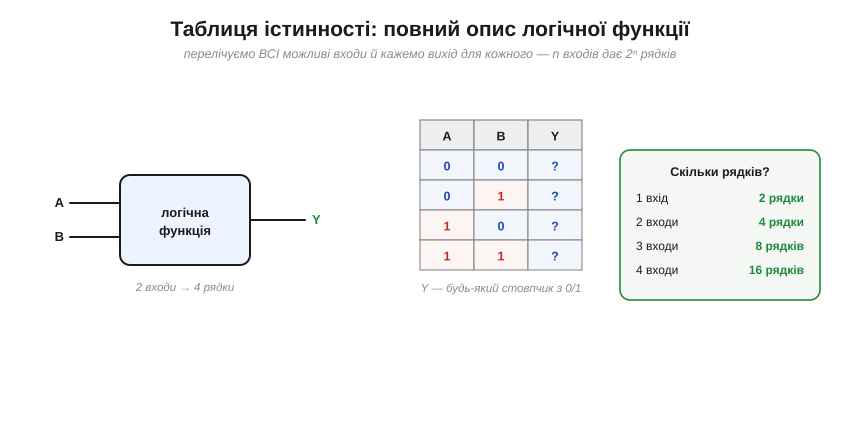
*Рис. 3.2.1.1. Логічна функція з двома входами A, B і виходом Y. Оскільки кожен вхід — це 0 або 1, усіх комбінацій рівно чотири, і таблиця має 4 рядки. Загальне правило: **n входів дають 2ⁿ рядків** (1→2, 2→4, 3→8, 4→16…). Заповнивши стовпчик Y нулями та одиницями як завгодно, ми задаємо конкретну функцію — і таких функцій для n=2 рівно 2⁴ = 16.*

Зверніть увагу на вибуховість показника: 3 входи — це вже 8 рядків, 4 входи — 16, 10 входів — понад тисяча. Таблиця істинності — чесний, але **громіздкий** опис; саме тому далі знадобиться компактніша мова — алгебра.

### Три дії: AND, OR, NOT

Уся ця алгебра тримається на **трьох** операціях, які ми вже зустріли в історії. Тут задамо їх строго — таблицями істинності.

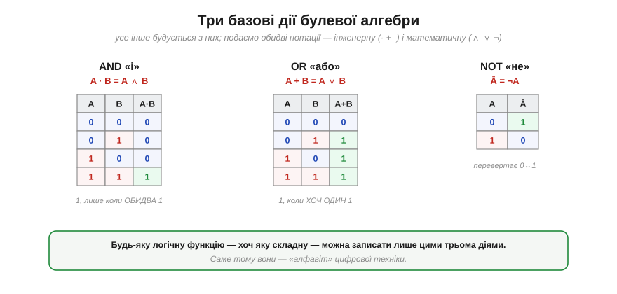
*Рис. 3.2.1.2. **AND** (*кон'юнкція*, «і»): A·B = 1, лише коли обидва входи 1. **OR** (*диз'юнкція*, «або»): A+B = 1, коли хоч один вхід 1. **NOT** (*інверсія*, «не»): Ā просто перевертає 0↔1. Подаємо обидві нотації: інженерну (· + ‾) і математичну (∧ ∨ ¬) — ви зустрінете обидві.*

Кілька слів про **нотацію**, бо вона спершу плутає. Інженери пишуть «і» як **множення** (A·B або просто AB), «або» — як **додавання** (A+B), а «не» — **рискою згори** (Ā) або апострофом (A'). Математики й програмісти частіше пишуть ∧, ∨, ¬ (або `&&`, `||`, `!`). Це **одне й те саме** — просто різні традиції; ми триматимемося інженерної (· + ‾), бо вона ближча до схем. Вибір символів «·» для «і» та «+» для «або» не випадковий: як ми зараз побачимо, ці операції справді поводяться **схоже** на множення й додавання — з одним дивовижним винятком.

### Та сама логіка — через множини

Перш ніж занурюватися в символи, корисно побачити логіку **очима**. Сам Буль думав про свої змінні як про **класи** (множини) предметів — і в цьому образі три операції стають наочними до прозорості.

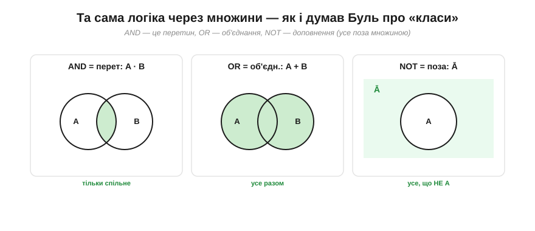
*Рис. 3.2.1.3. AND — це **перетин**: «належить і до A, і до B» (спільна частина). OR — **об'єднання**: «належить до A або до B» (усе разом). NOT — **доповнення**: «усе, що НЕ в A» (поза колом). Ця картинка — той самий зміст, що й таблиці істинності, лише геометрично; вона часто рятує інтуїцію, коли формули заплутуються.*

Тримайте цей образ напохваті: коли алгебраїчний вираз стане надто заплутаним, перемальовування його кругами Венна нерідко вмить показує, що до чого зводиться.

### Закони алгебри — інструмент спрощення

Тепер головне, заради чого Буль усе й затівав. Над операціями ·, + і ‾ діють **закони** — тотожності, які дозволяють **перетворювати** вирази, не міняючи їхнього змісту. Це той самий апарат, що й у шкільній алгебрі (розкрити дужки, винести спільний множник), але зі своїми правилами.

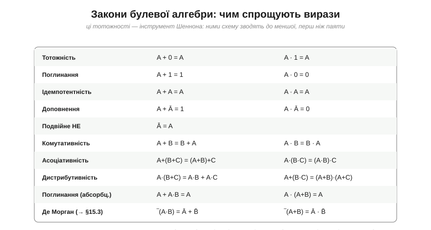
*Рис. 3.2.1.4. Основні тотожності. Більшість інтуїтивні: A+0=A (додати «нічого» — без змін), A·1=A, A+1=1 («або істина» — завжди істина). Дещо своєрідне: **A+A=A** та **A·A=A** (та сама ідемпотентність, що в історії дала x·x=x), і **A+Ā=1**, A·Ā=0 (щось або воно, або не воно). А найдивніша — **друга дистрибутивність** A+(B·C)=(A+B)·(A+C): в арифметиці чисел такого немає, а в булевій алгебрі вона справджується.*

Більшість законів очевидні, щойно згадаєш зміст «+» як «або», «·» як «і». Та два варто виокремити. **Ідемпотентність** (A+A=A) — це наслідок двозначності з історії: «істинно або істинно» = «істинно». А **друга дистрибутивність** (A+B·C = (A+B)·(A+C)) — це чиста екзотика булевого світу: спробуйте підставити числа (1+2·3 = 7, а (1+2)·(1+3)=12 — не рівні!), і побачите, що для чисел вона хибна, а для 0/1 — істинна. Саме такі тотожності й роблять булеву алгебру окремою наукою, а не просто «арифметикою нулів».

### Навіщо ці закони: спрощення схеми

Закони — не самоціль. Їхнє практичне призначення — **спрощувати**. Складний вираз (а отже, складна, дорога схема з багатьох вентилів) часто **тотожно дорівнює** значно простішому. Знайти це спрощення на папері — і є та «суперсила», яку алгебра Буля дала інженерії (згадайте тезу Шеннона з історії Розділу 3.1).

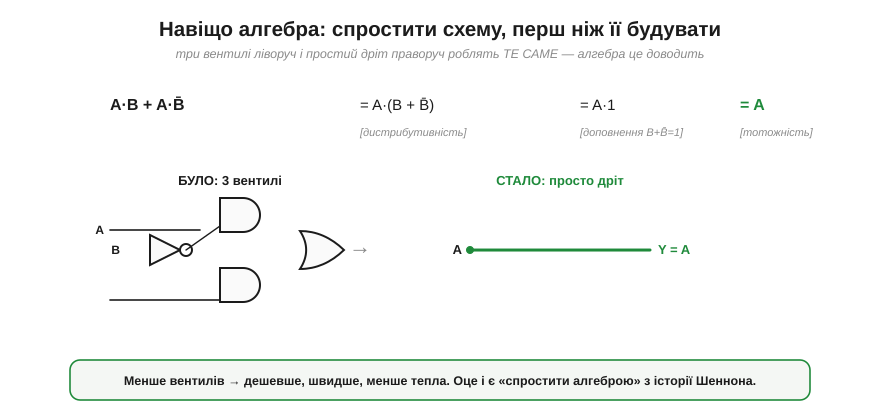
*Рис. 3.2.1.5. Вираз A·B + A·B̄ виглядає так, ніби потребує трьох вентилів (два AND, один OR, плюс інвертор). Та три кроки алгебри — винесли A за дужку, застосували B+B̄=1, тоді A·1=A — доводять, що все це **тотожно дорівнює просто A**. Тобто складну схему можна викинути й замінити **дротом**. Менше вентилів — дешевше, швидше, холодніше.*

**Приклад (спрощення).** Спростимо вираз `A·B + A·B̄` крок за кроком, посилаючись на закони.

```
A·B + A·B̄
= A·(B + B̄)      [дистрибутивність: винесли A]
= A·1            [доповнення: B + B̄ = 1]
= A              [тотожність: A·1 = A]
```

Результат вражає: громіздкий вираз із чотирьох літер і трьох операцій — це насправді **просто A**. Схема, яку ви вже зібралися паяти з кількох мікросхем, виявляється зайвою: вихід завжди дорівнює входу A. Уся книга «Закони думки» писалася заради таких миттєвостей — коли алгебра показує, що складне насправді просте.

### Будь-яка функція — це сума добутків

Лишилося питання, що замикає весь підрозділ: а чи **будь-яку** логічну функцію можна виразити цими трьома діями? Відповідь — **так**, і спосіб напрочуд механічний. Він зветься **сума добутків** (*sum of products*, SOP).

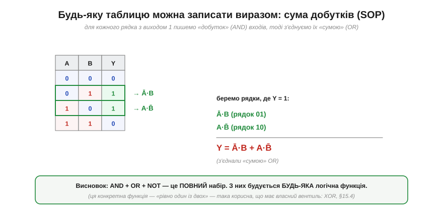
*Рис. 3.2.1.6. Рецепт. Дивимося в таблицю істинності й беремо лише рядки, де вихід Y = 1. Для кожного такого рядка пишемо **добуток** (AND) усіх входів — узявши сам вхід, якщо він тут 1, і його заперечення, якщо 0. Тоді всі ці добутки з'єднуємо **сумою** (OR). Готово: вираз точно відтворює таблицю.*

**Приклад (вираз із таблиці).** Нехай функція Y = 1 лише в рядках (A=0, B=1) і (A=1, B=0). Будуємо SOP:

```
рядок A=0,B=1  →  добуток  Ā·B
рядок A=1,B=0  →  добуток  A·B̄
з'єднуємо сумою:
Y = Ā·B + A·B̄
```

Перевірте по таблиці — збігається. А це означає фундаментальну річ: набір **{AND, OR, NOT}** є **функціонально повним** (*functionally complete*) — з нього будується **геть усе**, хоч яка складна логіка. Не треба вигадувати нових операцій: трьох вистачає на будь-що, від простого порівняння до цілого процесора. (До речі, ця конкретна функція — «рівно один із двох входів є 1» — настільки корисна, що їй дали окремий вентиль **XOR**; зустрінемося з ним у §3.2.4.)

> 🔧 **Навіщо це.** Булева алгебра — це не «теорія для іспиту», а щоденний робочий інструмент, який ви впізнаватимете повсюди. Умова `if (gotovo && !pomylka)` у коді — це булів вираз. Логіка ввімкнення живлення, блокування, дозволів на платі — теж. А таблиця істинності — це ваш найнадійніший спосіб **точно** описати, чого ви хочете від схеми чи функції, перш ніж її будувати, і **перевірити**, що вона робить саме це. Уміння спростити вираз законами — це вміння зробити пристрій дешевшим і швидшим, не змінивши його поведінки. Це буквально гроші й мілісекунди.

---

Підсумок §3.2.1: **булева алгебра** оперує змінними з двома значеннями (0/1) і трьома діями — **AND** (·), **OR** (+), **NOT** (‾), які строго задають **таблицями істинності** (n входів → 2ⁿ рядків); та сама логіка наочна як множини (перетин/об'єднання/доповнення). Над операціями діють **закони** (тотожність, поглинання, ідемпотентність, доповнення, дистрибутивність, Де Морган), якими вирази **спрощують** — зводячи складну схему до меншої (а то й до дроту). Будь-яку функцію можна записати як **суму добутків**, тож набір {AND, OR, NOT} **функціонально повний** — з нього будується вся цифрова логіка. Ми весь час казали «операція» та «функція», малюючи їх абстрактно. Час дати їм **тіло** — познайомитися з вентилями: їхніми схемними символами, з якими ці три дії стають фізичними елементами на платі.

---

## 3.2.2 Базові вентилі: AND, OR, NOT

У §3.2.1 «і», «або», «не» жили на папері — як абстрактні операції над 0 і 1. Тепер дамо їм фізичне тіло. **Вентиль** (*logic gate*) — це реальний електронний елемент (усередині — кілька транзисторів, як побачимо в §3.2.5), що **виконує** одну булеву операцію: бере на входи логічні рівні (0/1 у вигляді напруг із Розділу 3.1) і видає на вихід результат. Кожна з трьох операцій Буля має свій **схемний символ**, і вся подальша цифрова техніка малюється цими символами, як речення — літерами.

### Вентиль — це операція з тілом

Почнімо з трьох основних символів. Їхня форма не випадкова: вона **сама підказує** функцію, тож досвідчене око читає схему, не вчитуючись у підписи.

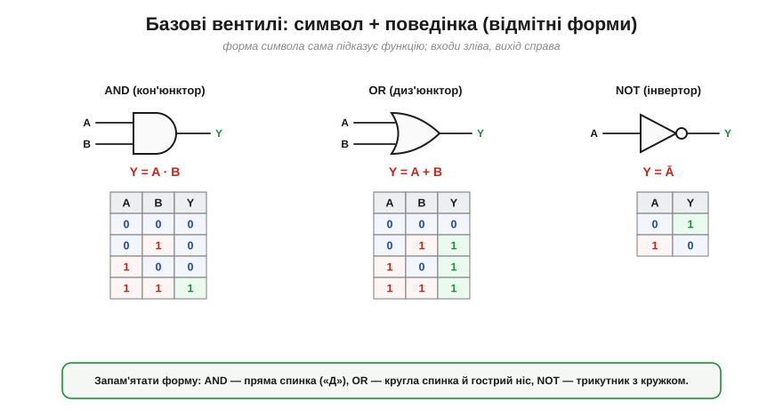
*Рис. 3.2.2.1. Три вентилі у відмітних формах (*distinctive shapes*). **AND** (*кон'юнктор*) — пряма «спинка» й округлий ніс, як латинська літера «D»; Y = A·B. **OR** (*диз'юнктор*) — кругла увігнута спинка й гострий ніс; Y = A+B. **NOT** (*інвертор*) — трикутник із кружком на виході; Y = Ā. Входи завжди зліва, вихід — справа. Поряд із кожним — його таблиця істинності з §3.2.1, тепер «прив'язана» до символа.*

Запам'ятати їх легко за асоціацією форми: **AND** має рівну спинку (треба, щоб «усе» зійшлося — строга пряма лінія), **OR** — округлу, ніби «вбирає» сигнали з боків, а **NOT** — гострий трикутник із характерним **кружком**, про який окремо нижче. Назви двомовні: український «кон'юнктор / диз'юнктор / інвертор» поряд з англійським AND / OR gate / inverter — і те, і те ви зустрінете.

### Кружок означає інверсію; буфер

Той маленький **кружок** на виході інвертора — не прикраса, а повноцінний знак, і його варто засвоїти окремо, бо він буде всюди. **Кружок (бульбашка) у будь-якій точці символа означає «тут інвертувати»**. Заберіть кружок з інвертора — і лишиться просто трикутник, який нічого не інвертує.

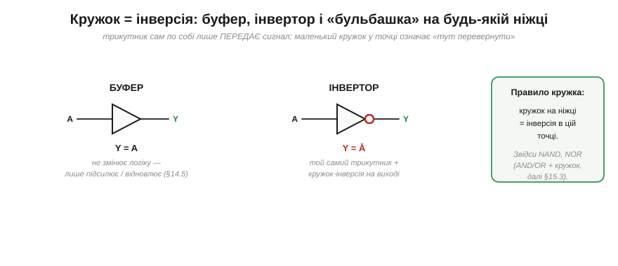
*Рис. 3.2.2.2. Трикутник **без** кружка — це **буфер** (*buffer*): Y = A, він не змінює логіку. Навіщо ж елемент, що «нічого не робить»? Він **відновлює** сигнал — підсилює кволий рівень, забезпечує крутий фронт і струм для багатьох навантажень (та сама регенерація з §3.1.5). Трикутник **із** кружком — **інвертор**: Y = Ā. А загальне правило таке: кружок на ніжці = інверсія в цій точці — звідси далі виростуть NAND і NOR (§3.2.3).*

Буфер варто оцінити окремо. Здавалося б, навіщо вентиль, чий вихід дорівнює входу? Та згадайте §3.1.5: реальний сигнал слабне, його фронт млявіє, один вихід не тягне багато входів. Буфер **освіжає** логічний рівень — видає чисті, повносилі 0 чи 1 з крутим фронтом, здатні керувати десятками наступних входів. Це «підсилювач для цифри»: логіки не додає, зате відновлює якість сигналу. А кружок-інверсія — це універсальний модифікатор, яким з AND роблять NAND, а з OR — NOR, просто домалювавши його на виході; це і є тема наступного підрозділу.

### Два стандарти символів

Тут чесно попередимо про джерело плутанини. Символи вентилів існують у **двох** стандартах, і обидва трапляються в схемах та даташитах.

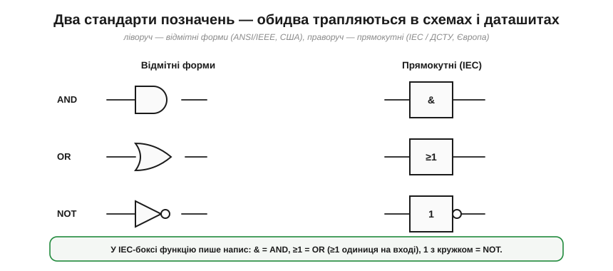
*Рис. 3.2.2.3. Ліворуч — **відмітні форми** (*distinctive-shape*, стандарт ANSI/IEEE, поширений у США й серед аматорів): різні фігури для різних вентилів. Праворуч — **прямокутні** символи (*IEC 60617 / ДСТУ*, поширені в Європі й офіційній документації): однаковий прямокутник, а функцію пише **напис** усередині: «&» — це AND, «≥1» — це OR (бо вихід 1, коли на вході одиниць ≥ 1), «1» з кружком — NOT.*

Користуватися ми будемо переважно **відмітними формами** — вони наочніші для навчання й найпоширеніші в аматорських схемах. Та знати IEC-позначення теж треба: відкривши європейський даташит чи стару пострадянську схему, ви побачите саме прямокутники з «&» і «≥1». Це той випадок із §2.1, коли нотації різняться, і впізнавати варто **обидві**.

### Багатовхідні вентилі

Досі ми малювали вентилі на два входи, але це не межа. AND і OR бувають на **3, 4, 8 і більше** входів — і правило лишається тим самим, лише поширеним на всі входи.

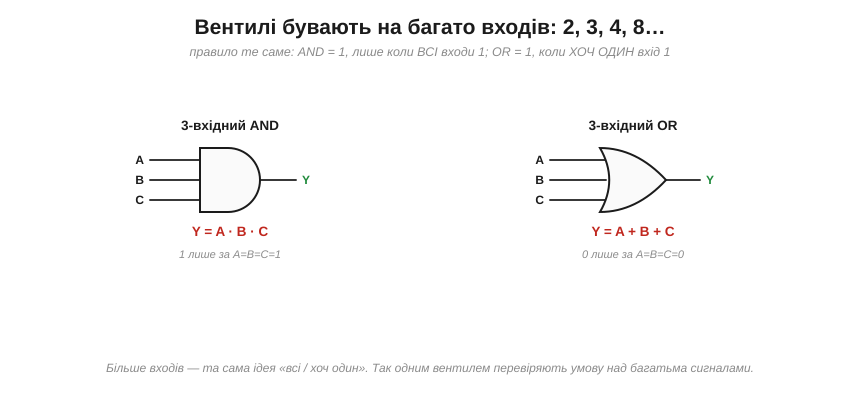
*Рис. 3.2.2.4. **3-вхідний AND**: Y = A·B·C, тобто вихід 1 **лише** тоді, коли всі три входи 1 (досить одному нулю — і вихід 0). **3-вхідний OR**: Y = A+B+C, вихід 0 **лише** коли всі три 0 (досить одній одиниці — і вихід 1). Кількість входів називають *fan-in*; вона буває 2, 3, 4, 8… Так одним елементом перевіряють умову одразу над багатьма сигналами.*

Це зручно на практиці: щоб перевірити «чи всі вісім давачів справні», беруть 8-вхідний AND, а не сім окремих. А якщо потрібного числа входів немає в наявності, його **складають** із менших (два 2-вхідні AND, послідовно, дають 3-вхідний) — і тут ми природно підходимо до головного вміння розділу: з'єднувати вентилі.

### З'єднуємо вентилі у вираз

Уся сила вентилів розкривається, коли **вихід одного стає входом іншого**. Так із кількох простих елементів складають будь-який, скільки завгодно складний вираз — точнісінько як у §3.2.1 ми складали функції з операцій.

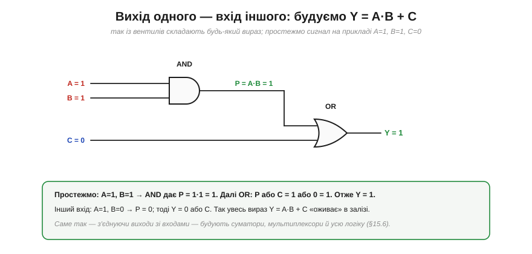
*Рис. 3.2.2.5. Реалізація виразу Y = A·B + C двома вентилями. Спершу AND обчислює проміжний сигнал P = A·B; його вихід заводять на вхід OR, другим входом якого є C. Вихід OR і є Y = P + C = A·B + C. Зелений підпис на проміжному дроті показує сигнал P — корисна звичка підписувати «внутрішні» вузли.*

**Приклад (простежити схему).** Подамо на схему з Рис. 3.2.2.5 вхід A = 1, B = 1, C = 0 і простежмо сигнал крізь вентилі.

```
крок 1 (AND):  P = A · B = 1 · 1 = 1
крок 2 (OR):   Y = P + C = 1 + 0 = 1
```

А для A = 1, B = 0, C = 0:

```
крок 1 (AND):  P = A · B = 1 · 0 = 0
крок 2 (OR):   Y = P + C = 0 + 0 = 0
```

Уміння отак «прогнати» 0 і 1 крізь схему, вентиль за вентилем, — найважливіша практична навичка цього розділу. Саме так читають будь-яку логічну схему: від входів до виходу, обчислюючи сигнал на кожному дроті. І саме так — з'єднуючи виходи зі входами — далі (§3.2.6) ми складемо суматори, мультиплексори й решту блоків, з яких збудовано процесор.

> 🔧 **Навіщо це.** Ці символи — алфавіт, яким написані **всі** цифрові схеми, що ви відкриєте далі: від найпростішого модуля до даташита мікроконтролера. Навчившись упізнавати форму (пряма спинка — AND, кругла — OR, трикутник із кружком — NOT) і простежувати 0/1 крізь з'єднання, ви читатимете логічну частину будь-якої схеми так само вільно, як текст. А кружок-інверсія — це той дрібний знак, що відрізняє AND від NAND і часто ховає всю «родзинку» схеми: проґавите кружок — і переплутаєте функцію на протилежну.

---

Підсумок §3.2.2: **вентиль** — це електронний елемент, що виконує одну булеву операцію; у нього свій схемний символ із входами зліва й виходом справа. Три базові: **AND** (пряма спинка), **OR** (кругла спинка, гострий ніс), **NOT** (трикутник із **кружком**-інверсією). Трикутник без кружка — **буфер**, що не міняє логіки, а лише **відновлює** сигнал (§3.1.5). Символи існують у двох стандартах — **відмітні форми** (ANSI) і **прямокутні** (IEC: &, ≥1, 1). AND/OR бувають **багатовхідними** (правило «всі / хоч один» поширюється на всі входи). З'єднуючи **вихід одного зі входом іншого**, будують будь-який вираз, а простеживши 0/1 крізь схему — читають її поведінку. Ми мимохідь сказали, що кружком з AND роблять NAND, а з OR — NOR. Виявляється, ці «перевернуті» вентилі ховають дивовижну властивість: кожного з них **самого по собі** досить, щоб побудувати геть усю логіку. До цієї магії й переходимо.

---

## 3.2.3 NAND і NOR: універсальні вентилі

У §3.2.2 ми навчилися дописувати до вентиля **кружок-інверсію**. Допишімо його на вихід AND — отримаємо **NAND** (NOT-AND); допишімо на вихід OR — **NOR** (NOT-OR). Здавалося б, дрібниця: просто інвертований результат. Та ці два «перевернуті» вентилі мають властивість, яка межує з дивом і визначила всю промислову цифрову електроніку: **кожен із них сам по собі універсальний** — маючи лише NAND (або лише NOR), можна побудувати **будь-яку** логічну схему на світі. Розберімо, чому це так і чому це так важливо.

### NAND і NOR: інверсія звичних вентилів

Спершу — самі вентилі. Усе просто: вони роблять те саме, що AND і OR, тільки результат **перевернутий**.

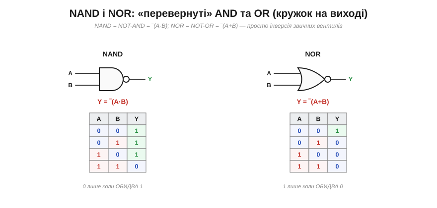
*Рис. 3.2.3.1. **NAND** — це AND із кружком на виході: Y = ‾(A·B). Його вихід — 0 **лише** тоді, коли обидва входи 1 (у решті випадків — 1), тобто точне «перевертання» таблиці AND. **NOR** — це OR із кружком: Y = ‾(A+B). Його вихід — 1 **лише** коли обидва входи 0. Запам'ятати легко: NAND і NOR — це «AND/OR, але навпаки».*

На вигляд нічого особливого — той самий символ із §3.2.2 плюс знайома бульбашка. Уся незвичайність — у тому, що з цих простих елементів виходить.

### Закони Де Моргана: міст між AND і OR

Щоб зрозуміти універсальність, треба згадати **закони Де Моргана** (їх ми зустріли і в історії розділу, і серед законів §3.2.1). Вони кажуть, як інверсія перетворює «і» на «або» й навпаки:

```
‾(A · B) = Ā + B̄        (НЕ«і» = «або» заперечень)
‾(A + B) = Ā · B̄        (НЕ«або» = «і» заперечень)
```

Це не суха формула, а **практичний фокус**: бульбашку-інверсію можна «перекидати» крізь вентиль, міняючи заразом його тип.

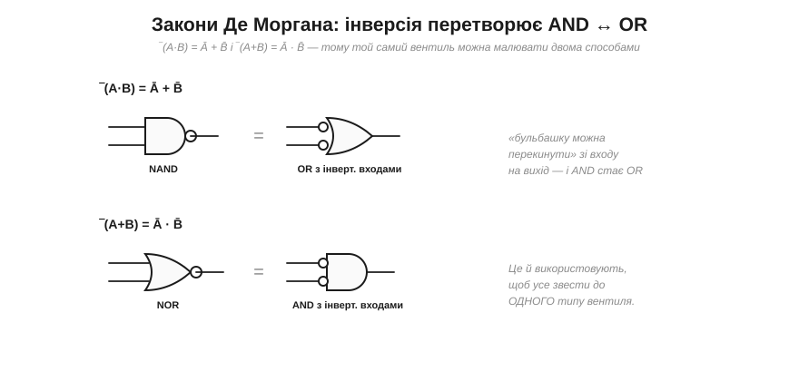
*Рис. 3.2.3.2. Те саме двома символами. **NAND** (AND + кружок на виході) **дорівнює** OR із кружками на **входах** — бо ‾(A·B) = Ā+B̄. Так само **NOR** дорівнює AND із інвертованими входами. Тобто, «перекинувши» бульбашки зі входів на вихід (чи навпаки), AND перетворюється на OR і назад. Саме цей місток і дозволяє звести всю логіку до одного типу вентиля.*

Цей прийом — «штовхання бульбашки» (*bubble pushing*) — інженери використовують щодня, щоб перемалювати схему в зручнішому вигляді. А для нас зараз він — ключ до головного фокуса розділу.

### NAND сам будує все

Тепер — серцевина. Покажемо, що **самих лише NAND** досить, щоб скласти всі три базові операції — а отже (згадаймо суму добутків із §3.2.1), і будь-яку логіку взагалі.

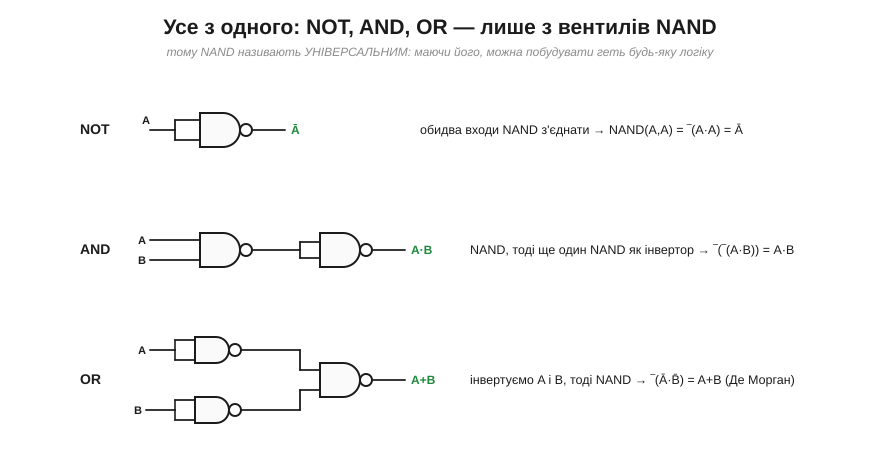
*Рис. 3.2.3.3. Три побудови з самого NAND. **NOT**: з'єднати обидва входи NAND разом — NAND(A,A) = ‾(A·A) = ‾A. **AND**: узяти NAND, а тоді ще один NAND як інвертор — ‾(‾(A·B)) = A·B. **OR**: інвертувати A і B (двома NAND-інверторами), тоді подати на третій NAND — ‾(Ā·B̄) = A+B (це прямий наслідок Де Моргана). Маючи NOT, AND і OR, ми вже вміємо будувати все.*

Логіка проста. NAND дає нам **інверсію** (NOT) майже задарма — досить з'єднати входи. А коли є NOT, то AND виходить як «NAND, потім інвертувати», а OR — через закон Де Моргана з трьох NAND. Оскільки набір {AND, OR, NOT} функціонально повний (§3.2.1), а ми щойно зробили всі три **самими NAND**, то й NAND **сам** функціонально повний. Звідси й назва — **універсальний вентиль** (*universal gate*).

**Приклад (OR із самих NAND).** Перевіримо побудову OR = NAND(NAND(A,A), NAND(B,B)) на кількох входах.

```
A=0, B=0:  NAND(0,0)=1 ; NAND(0,0)=1 ; NAND(1,1)=0   →  OR = 0  ✓
A=1, B=0:  NAND(1,1)=0 ; NAND(0,0)=1 ; NAND(0,1)=1   →  OR = 1  ✓
A=1, B=1:  NAND(1,1)=0 ; NAND(1,1)=0 ; NAND(0,0)=1   →  OR = 1  ✓
```

Збігається з таблицею OR з §3.2.1 рядок у рядок. Три однакові NAND — і маємо повноцінний OR, хоч жодного «справжнього» OR-вентиля ми не використали.

### Навіщо це: одна комірка — і простіше залізо

Гарний математичний фокус — це добре, але **навіщо** він на практиці? Відповідь — у **виробництві**, і вона переломна. Якщо одного типу вентиля досить на все, то завод може **вилизати єдину комірку** — зробити її якнайдешевшою, найшвидшою, найнадійнішою — і штампувати з неї цілі чипи. Менше різних елементів — простіше проєктувати, виготовляти й перевіряти.

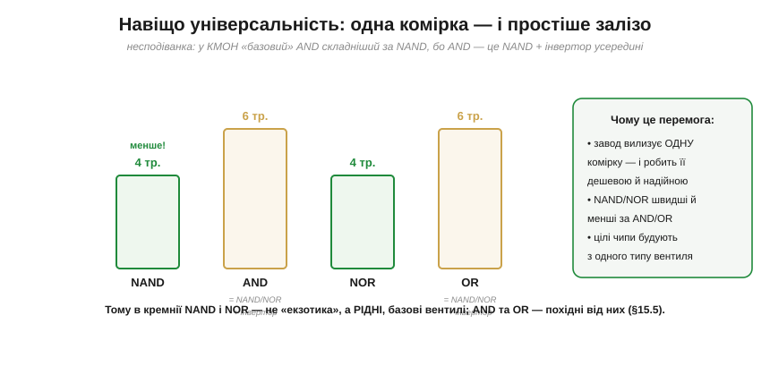
*Рис. 3.2.3.4. Несподіванка, що перевертає інтуїцію. У КМОН (Розділ 2.7) вентиль **NAND коштує 4 транзистори**, а «простий» **AND — аж 6**, бо AND усередині — це той самий NAND **плюс інвертор** (ще 2 транзистори). Тобто звичний нам AND **складніший** за NAND! Те саме з NOR (4) проти OR (6). Виходить, у кремнії NAND і NOR — це **рідні**, базові вентилі, а AND і OR — похідні від них. Тому масову логіку будують саме на NAND/NOR.*

Ось чому те, що в підручнику здається «основним» (AND, OR), у кремнії насправді **дорожче** за «похідні» NAND і NOR. Інвертор у CMOS — це пара транзисторів; AND — це NAND, до якого **доклеїли** інвертор, щоб перевернути вихід назад. Прибравши цей зайвий інвертор, дістаємо простіший, швидший, менший елемент — NAND. Деталі цієї транзисторної механіки чекають у §3.2.5; тут важливо засвоїти висновок: **NAND/NOR — не екзотика, а фундамент** реальних мікросхем.

### NOR теж універсальний; комп'ютер «Аполлона»

Усе сказане про NAND дзеркально справджується і для **NOR** — він теж універсальний (це наслідок тієї самої двоїстості Де Моргана: NAND-світ і NOR-світ — відображення один одного). А найкращий доказ, що це не теорія, а інженерна реальність, подарувала історія космонавтики.

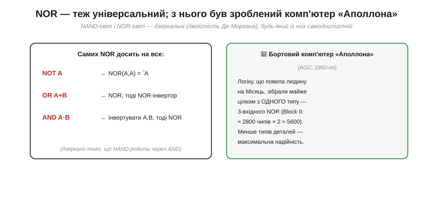
*Рис. 3.2.3.5. NOR самостійно будує NOT, OR і AND — дзеркально до NAND. А праворуч — славетний приклад: **логіку** бортового комп'ютера «Аполлона» (*Apollo Guidance Computer*, 1960-ті), що привів людину на Місяць, зібрали майже цілком з **одного типу вентиля** — 3-вхідного NOR. У версії Block II це ≈ 2800 мікросхем, кожна з **двома** такими NOR (≈ 5600 вентилів); у ранішій Block I — ≈ 4100 мікросхем по одному NOR (точний рахунок різниться за версією й способом лічби — вентилі, функції чи чипи; були в машині й окремі не-NOR чипи, як-от підсилювачі зчитування пам'яті). Та сама ідея: один тип логічного елемента на весь мозок машини — менше типів деталей, менше того, що може відмовити, і простіше все перевірити.*

Інженери NASA свідомо пішли на цю крайність заради **надійності**: коли від схеми залежать життя астронавтів, кожен зайвий тип деталі — це додатковий ризик і додаткова перевірка. Універсальність NOR дозволила звести всю логіку до одного, ретельно випробуваного компонента. Те, що Буль вивів як абстрактну повноту, а Шеннон приклав до реле, тут буквально полетіло на Місяць — на самих лише NOR.

> 🔧 **Навіщо це.** Практичний підсумок, який варто закарбувати. По-перше, побачивши в схемі чи даташиті NAND/NOR, не дивуйтеся, що їх **більше**, ніж «чистих» AND/OR, — вони дешевші й швидші, тож з них будують основну масу логіки. По-друге, «штовхання бульбашки» (Де Морган) — ваш щоденний інструмент: ту саму функцію часто зручніше реалізувати в одному базисі, ніж в іншому, і вміння перемалювати AND-з-інверсіями на NOR (чи навпаки) економить вентилі. По-третє, сам принцип «звести все до одного простого, перевіреного блоку» — універсальний інженерний хід, далеко за межами логіки: від NOR «Аполлона» до уніфікованих модулів у будь-якій надійній системі.

---

Підсумок §3.2.3: **NAND** (‾(A·B), AND із кружком) і **NOR** (‾(A+B), OR із кружком) — це інверсії звичних вентилів, та кожен із них **універсальний**: самого NAND (або самого NOR) досить, щоб побудувати NOT, AND, OR — а отже, будь-яку логіку. Ключ до цього — **закони Де Моргана** (‾(A·B)=Ā+B̄ і ‾(A+B)=Ā·B̄), що дозволяють «перекидати бульбашку» й міняти AND↔OR. Практична цінність величезна: у КМОН NAND/NOR **простіші** за AND/OR (AND = NAND + інвертор, 6 транзисторів проти 4), тож саме вони — рідні, базові вентилі кремнію, з яких будують масову логіку (а логіку комп'ютера «Аполлона» — узагалі майже цілком із 3-вхідних NOR). Ми вже маємо AND, OR, NOT, NAND, NOR. Лишився ще один особливий вентиль, без якого незручно порівнювати й додавати числа, — **XOR**, «виключне або». До нього й перейдемо.

---

## 3.2.4 XOR і логіка порівняння

Вентилі з §3.2.2–3.2.3 відповідають на питання «**всі**?» (AND), «**хоч один**?» (OR), «**не**?» (NOT). Та в цифровій техніці страшенно часто потрібне інше питання: «а вони **різні**?» або, що те саме навпаки, «вони **однакові**?». Це питання настільки повсюдне — у порівнянні, у додаванні, у виявленні помилок, — що йому виділили **окремий** вентиль: **XOR**, «виключне або» (*exclusive OR*). Цей підрозділ — про нього, його близнюка XNOR і про логіку порівняння, яку вони відкривають.

### XOR і XNOR: різниця та рівність

«Звичайне» OR дає 1, коли **хоч один** вхід — 1 (зокрема й коли обидва). **Виключне** OR відрізняється однією деталлю, але вирішальною: воно дає 1, лише коли входи **різні** — рівно один із них 1. Якщо ж обидва однакові (обидва 0 або обидва 1) — XOR дає 0.

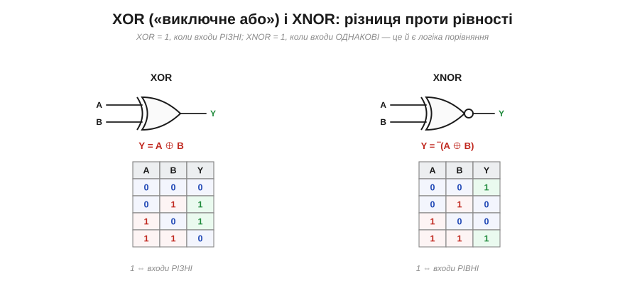
*Рис. 3.2.4.1. **XOR** (Y = A⊕B): вихід 1 ⇔ входи **різні**. Символ — як OR, але з додатковою дугою на «спинці». **XNOR** (Y = ‾(A⊕B)) — це XOR із кружком-інверсією: вихід 1 ⇔ входи **рівні**. По суті, XOR — це детектор різниці, а XNOR — детектор рівності. Саме тому XNOR іще звуть «рівнозначністю».*

Запам'ятати найпростіше так: **XOR = «не такі самі»**, **XNOR = «такі самі»**. Значок XOR — кружечок із плюсом усередині (⊕), що натякає на «додавання за модулем 2», — і ми зараз побачимо, чому це влучна назва.

### XOR — це сума добутків

XOR не належить до «найпростіших» вентилів — усередині це **складений** елемент. Згадаймо §3.2.1: там ми вивели сумою добутків функцію «рівно один із двох», і це був буквально вираз `Ā·B + A·B̄`. Оце і є XOR.

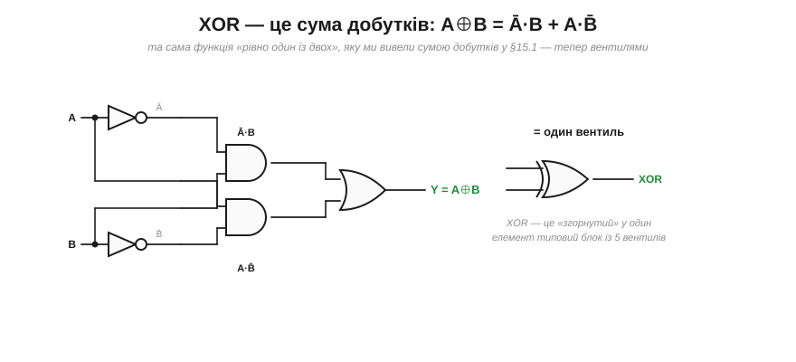
*Рис. 3.2.4.2. XOR, складений із базових вентилів за сумою добутків: інвертуємо A і B, беремо два AND (Ā·B для «A=0, B=1» і A·B̄ для «A=1, B=0»), з'єднуємо їх через OR. П'ять вентилів роблять одну функцію — і саме цей типовий блок «згорнули» в один зручний символ XOR. Тож коли в схемі стоїть XOR, пам'ятайте: усередині — оцей вузлик.*

Це пояснює, чому XOR виділили окремим символом: він трапляється так часто, що малювати щоразу п'ять вентилів було б марнотратно. XOR — це **скорочення** для дуже вживаного блоку, як абревіатура для довгої фрази. (До речі, на відміну від NAND/NOR, сам XOR **не** універсальний — з нього одного всю логіку не збудуєш; він зручний, а не всемогутній.)

### Порівняння на рівність

Перше велике застосування — **порівняння**. XNOR над парою бітів каже «ці два біти рівні». А щоб порівняти цілі **числа** (багато бітів), треба, щоб збіглися **всі** пари бітів одночасно — а «всі» — це, звісно, AND.

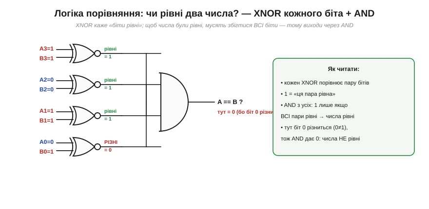
*Рис. 3.2.4.3. Цифровий порівнювач рівності двох 4-бітових чисел. Кожен біт числа A порівнюється зі своїм бітом числа B через окремий **XNOR** (1 = «ця пара рівна»). Усі чотири результати заводять на один **4-вхідний AND**: він дасть 1, лише якщо **всі** пари рівні, тобто числа збігаються повністю. Тут біт 0 різниться (0≠1), тож AND дає 0: числа **не рівні**.*

**Приклад (чи рівні числа).** Порівняймо A = 1010 і B = 1011 порозрядно.

```
біт 3:  A=1, B=1  →  XNOR = 1  (рівні)
біт 2:  A=0, B=0  →  XNOR = 1  (рівні)
біт 1:  A=1, B=1  →  XNOR = 1  (рівні)
біт 0:  A=0, B=1  →  XNOR = 0  (РІЗНІ)
AND усіх:  1·1·1·0 = 0   →   A ≠ B
```

Досить одній парі бітів розійтися — і загальний AND обнуляється, чесно повідомляючи «не рівні». Так будують **цифрові компаратори**: блоки, що за такт кажуть, чи дорівнюють одне одному два числа (а складніші — ще й «більше / менше»).

### Парність і виявлення помилок

Друге велике застосування ховається в значку ⊕ — «додавання за модулем 2». Якщо з'єднати **багато** входів ланцюжком XOR, на виході вийде **парність** (*parity*): 1, якщо серед бітів **непарна** кількість одиниць, і 0, якщо парна.

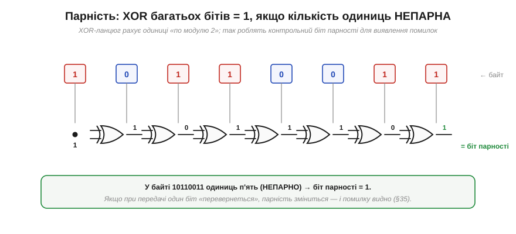
*Рис. 3.2.4.4. XOR-ланцюг над усіма бітами байта рахує одиниці «по модулю 2» — тобто видає лише, парна їх кількість чи ні. Для байта 10110011 одиниць п'ять (непарно), тож біт парності = 1. Цей біт додають до даних під час передачі; якщо в дорозі один біт «перевернеться», кількість одиниць змінить парність — і приймач **помітить** помилку.*

**Приклад (парність байта).** Порахуймо біт парності для 10110011.

```
одиниці: 1+0+1+1+0+0+1+1 = 5   (непарно)
біт парності (XOR усіх) = 1
```

Це найдешевший спосіб **виявити помилку** в переданих даних: один зайвий біт-парності ловить будь-яку **непарну** кількість перекидань (зокрема одне), але пропускає будь-яку **парну** — дві помилки воднораз відновлюють парність, і він їх не помітить. Тому для серйознішого захисту далі (Розділ 6.1, у зв'язку) ми зустрінемо потужніші схеми на кшталт CRC. Та ідея скрізь та сама: **надлишковий біт, обчислений логікою, стереже цілісність даних** — а в основі цього стереження лежить скромний XOR.

### Керований інвертор і детектор різниці

Третє застосування — найхитріше й найкорисніше далі. Подивімося на XOR під іншим кутом: нехай один його вхід буде **керуванням**. Тоді XOR стає **керованим інвертором**.

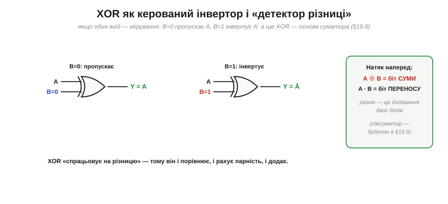
*Рис. 3.2.4.5. Якщо на один вхід XOR подати керування B: за **B=0** вихід дорівнює A (сигнал проходить незмінним, бо A⊕0=A), а за **B=1** вихід дорівнює Ā (сигнал інвертується, бо A⊕1=Ā). Тобто одним бітом ми вирішуємо, пропускати сигнал чи перевертати. А ще (натяк наперед): A⊕B — це **біт суми** при додаванні двох бітів, тоді як A·B — **біт переносу**; разом вони складають півсуматор, який ми побудуємо в §3.2.6.*

Ось чому XOR такий цінний: він «спрацьовує на **різницю**», і ця одна властивість дає три різні суперсили. Він **порівнює** (різниця = нерівність), він рахує **парність** (непарність — це теж про різницю), і він **додає** (додавання за модулем 2 — це знову XOR). Не дивно, що цей вентиль зустрічається в кожному процесорі тисячами: на ньому стоять і арифметика, і порівняння, і захист даних.

> 🔧 **Навіщо це.** XOR — один із найпрактичніших вентилів, і впізнавати його застосування варто навчитися. Бачите в схемі XOR над двома сигналами — найімовірніше, хтось перевіряє, чи вони **різні** (зміна стану, неузгодженість, фронт). Ціла шерега XOR із наступним AND — це **порівняння** чисел. Довгий XOR-ланцюг — це **парність** (контроль помилок). А XOR, один вхід якого — керувальний біт, — це **умовна інверсія** (наприклад, перемикання «додавати/віднімати» в арифметиці). Запам'ятайте гасло «XOR = детектор різниці» — і призначення цього вентиля в будь-якій схемі читатиметься з першого погляду.

---

Підсумок §3.2.4: **XOR** (A⊕B) дає 1, коли входи **різні**; **XNOR** — коли **рівні**. XOR — складений вентиль (Ā·B + A·B̄, сума добутків із §3.2.1), «згорнутий» в один зручний символ. Його три застосування виростають з однієї суті «детектор різниці»: **порівняння** (XNOR кожного біта + AND → рівність чисел), **парність** (XOR-ланцюг → контроль помилок одним надлишковим бітом), і **арифметика** (A⊕B — біт суми, A·B — біт переносу, місток до суматора §3.2.6). Ми вже маємо повний арсенал вентилів — AND, OR, NOT, NAND, NOR, XOR, XNOR. Та досі вони були для нас «чорними скриньками». Час зазирнути **всередину** й побачити, як насправді з тих самих транзисторів Модуля 2 народжується логічний вентиль.

---

## 3.2.5 Як із транзисторів роблять вентиль

Досі вентилі були для нас **чорними скриньками**: подав 0 і 1 — отримав результат за таблицею. Та всередині кожного вентиля — кілька **транзисторів**, тих самих MOSFET-ів, що ми вивчили в Розділі 2.7. Цей підрозділ відкриває скриньку й показує найголовніший трюк усієї цифрової електроніки — **CMOS** (комплементарну пару, §2.7.9), завдяки якому логіка вийшла дешевою, швидкою й майже не споживає енергії в спокої. Зробивши це, ми замкнемо обіцянку §3.2.3 (чому NAND/NOR — рідні, а AND/OR — похідні) і остаточно зведемо абстрактну булеву алгебру до фізики кремнію.

### Транзистор як ключ

Усе починається з простого погляду на MOSFET: це **керований напругою ключ** (§2.7). А вся магія — у тому, що бувають **два** взаємодоповняльні типи, які відкриваються **протилежними** рівнями.

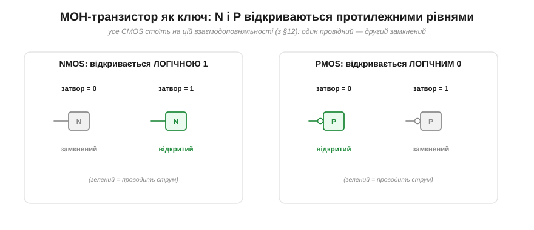
*Рис. 3.2.5.1. **NMOS** відкривається (проводить) логічною **1** на затворі, а нулем — замикається. **PMOS** — навпаки: відкривається логічним **0**, а одиницею замикається. Тобто за будь-якого рівня на затворі один із цих транзисторів **провідний**, а другий — **замкнений**. Саме на цій дзеркальності («комплементарності», звідки й «C» у CMOS) стоїть уся подальша побудова.*

Запам'ятати легко: **N любить 1, P любить 0**. Дайте обом однаковий сигнал на затвори — і вони завжди в протилежних станах: один відкритий, другий закритий. Ця проста властивість — фундамент, на якому тримається все.

### Принцип CMOS: дві взаємодоповняльні мережі

Ідея CMOS геніально проста. Вихід вентиля з'єднують із живленням **через мережу PMOS** (її звуть **підтяжкою**, *pull-up*) і з землею **через мережу NMOS** (**стягування**, *pull-down*). Мережі будують так, щоб за **будь-якого** набору входів провідною була **рівно одна** з них.


*Рис. 3.2.5.2. Загальна будова будь-якого CMOS-вентиля. Верхня мережа з PMOS тягне вихід до **Vdd** (дає «1»), нижня з NMOS — до **GND** (дає «0»). Входи керують обома мережами одночасно, і вони влаштовані **взаємовиключно**: коли провідна верхня — нижня замкнена, і навпаки. Тому вихід завжди **твердо** притиснутий або до Vdd, або до GND — ніколи не «висить» і в усталеному стані не з'єднує Vdd із GND наскрізь (а от під час самого перемикання обидві мережі на коротку мить прочиняються — про цей нюанс нижче).*

З цього принципу одразу випливають дві чудові властивості, які ми бачили «згори» ще в Розділі 3.1: вихід завжди **повносилий** (близько до шин — звідси чудові рівні й запас, §3.1.4), і крізь вентиль у спокої **не тече** наскрізний струм (бо одна з двох мереж завжди розірвана). Лишилося наповнити цю схему конкретними транзисторами.

### Інвертор — найпростіший вентиль

Почнімо з найменшого — **інвертора** (NOT). Тут кожна «мережа» — це один-єдиний транзистор: один PMOS згори, один NMOS знизу, обидва затвори — на спільний вхід.

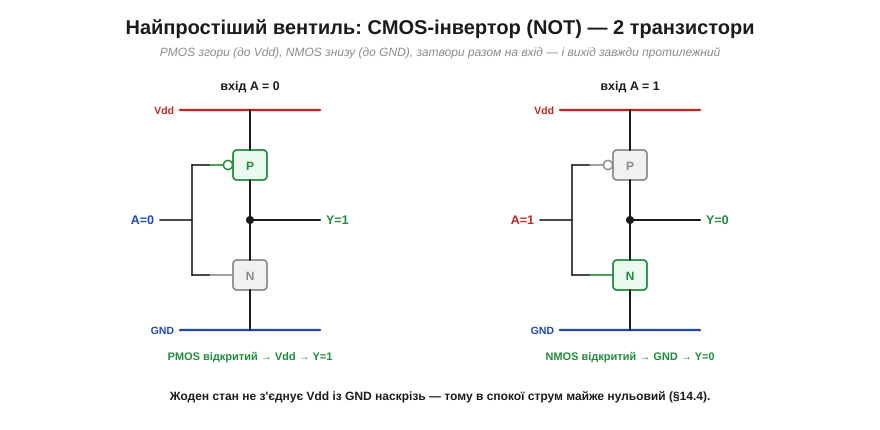
*Рис. 3.2.5.3. Інвертор із двох транзисторів. **Вхід A=0**: PMOS відкритий (любить 0), NMOS замкнений — вихід притягнуто до Vdd, Y=1. **Вхід A=1**: PMOS замкнений, NMOS відкритий (любить 1) — вихід притягнуто до GND, Y=0. Вихід завжди **протилежний** входу — це і є NOT. Зверніть увагу: в жодному стані немає наскрізного шляху Vdd→GND, тож у спокої струм майже нульовий.*

Ось вона — вся «магія» інверсії, у двох транзисторах. Подивіться, як гарно працює комплементарність: той самий вхід відкриває рівно один транзистор і замикає інший, тож вихід щоразу певно «знає», куди йому стати. Це **найважливіша** елементарна комірка кремнію — з інвертора (часом просто як «підсилювача-відновлювача») складають незліченні вузли, і саме його два транзистори ми додавали в §3.2.3, перетворюючи NAND на AND.

### NAND і NOR: послідовно ↔ паралельно

А тепер — вентилі на два входи, і тут відкривається елегантна **двоїстість**. Щоб дістати NAND чи NOR, ту саму пару транзисторів з'єднують **послідовно** або **паралельно** — дзеркально у верхній і нижній мережах.

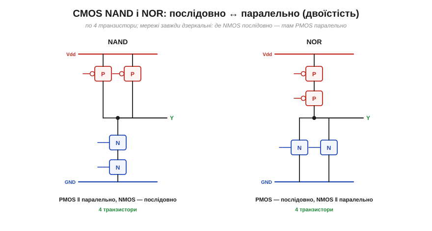
*Рис. 3.2.5.4. **NAND**: два NMOS **послідовно** в стягуванні (вихід піде в 0, лише коли ОБИДВА входи 1 — обидва відкриті, ланцюг до GND замкнено), і дзеркально два PMOS **паралельно** в підтяжці. **NOR**: навпаки — два NMOS **паралельно** (досить однієї 1, щоб стягнути вихід у 0) і два PMOS **послідовно**. Щоразу — рівно **4 транзистори**, а мережі завжди дзеркальні: послідовно в одній ⇔ паралельно в іншій.*

Вловіть логіку «послідовно = і». Щоб струм пройшов крізь **послідовний** ланцюг двох NMOS до землі, **обидва** мусять бути відкриті (обидва входи 1) — це й дає поведінку «0 на виході лише коли все 1», тобто NAND. А **паралельний** ланцюг проводить, якщо відкритий **хоч один**, — це «або», звідки NOR. Послідовність — це «і», паралельність — «або»: рівно те, що Шеннон побачив у реле дев'яносто років по Булю (історія Розділу 3.1), тільки тепер у транзисторах. Коло замкнулося.

### Чому CMOS виграв — і чому «простий» AND дорожчий

Лишилося пояснити, **чому** саме CMOS витіснив усі інші способи робити логіку — і нарешті розрахуватися за обіцянку §3.2.3.

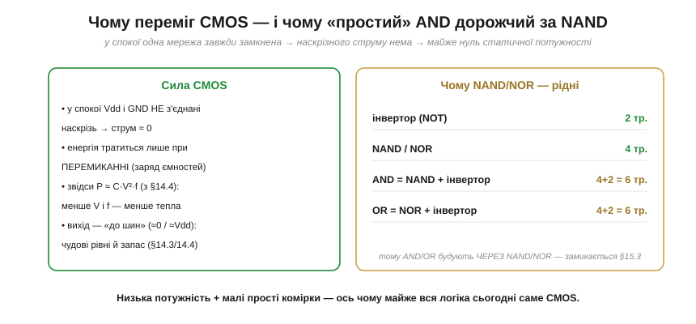
*Рис. 3.2.5.5. Ліворуч — сила CMOS: в усталеному стані Vdd і GND не з'єднані наскрізь, тож статичний струм **малий** (хоч і не точно нульовий — лишається струм витоку); енергія йде **переважно на перемикання** (перезаряд ємностей), звідси динамічна потужність P ≈ C·V²·f — і менші напруга й частота прямо означають менше тепла (це той самий зв'язок із §3.1.4). Праворуч — рахунок транзисторів: інвертор 2, NAND/NOR по 4, а **AND = NAND + інвертор = 6**, OR = NOR + інвертор = 6. Ось чому NAND/NOR — рідні, базові, а AND/OR будують **через** них.*

Тепер видно все разом. **Низька потужність**: оскільки одна з мереж завжди розірвана, постійного струму від живлення до землі немає — чип «їсть» майже тільки тоді, коли перемикається. Це й зробило можливими щільні мікросхеми на мільярди транзисторів, які не згоряють від власного тепла, і живлені від батареї пристрої на кшталт ESP32. А **рахунок транзисторів** остаточно пояснює парадокс із §3.2.3: «природний» CMOS-вентиль — це NAND чи NOR (бо мережа стягування з двох транзисторів природно дає інверсію), а щоб дістати «прямий» AND, доводиться **доклеїти** інвертор і витратити на два транзистори більше. У кремнії простота — на боці «перевернутих» вентилів.

Заради чесності додаймо, що «нульова статична потужність» — **ідеалізація**, зручна для моделі стабільних 0/1, але не вся правда. Реальний CMOS споживає й у спокої: крізь транзистори тече дрібний **струм витоку** (і що дрібніший техпроцес, то він помітніший — у сучасних чипах це вже відчутна частка). А під час **перемикання**, поки вхід проходить «середину» між 0 і 1, обидві мережі на мить **прочинені** — і крізь вентиль проскакує короткий **наскрізний струм** (*shoot-through*). Тому **повільні** фронти на вході шкідливі вдвічі: вони подовжують цей наскрізний струм (зайвий нагрів), а на високоомних входах можуть навіть спричинити паразитні **коливання** — через що даташити (приміром, TI на серію 74HC) прямо вимагають достатньо крутих вхідних фронтів (звідси й тригери Шмітта з §3.1.6 на «брудних» входах). Тож повна потужність CMOS — це **динамічна** (перемикання, головна) **плюс статична** (витоки), а не «лише під час перемикання». Для нашої моделі ідеалізація годиться, але в реальному проєктуванні враховують обидва доданки.

> 🔧 **Навіщо це.** Розуміння, що вентиль — це **кілька транзисторів-ключів**, а не магія, дає кілька дуже практичних висновків. По-перше, чому цифрова логіка майже не гріється в спокої, але починає споживати тим більше, чим **швидше** перемикається (P ∝ f) і чим **вища** напруга (P ∝ V²) — звідси вся боротьба за нижчий Vdd у Модулі 4. По-друге, чому вхід CMOS «нічого не споживає» (затвор — це ізольований конденсатор із §2.7), але його **ємність** доводиться перезаряджати на кожному фронті — а це й є та сама RC-затримка фронту з §3.1.5. По-третє, чому реальні чипи рясніють NAND/NOR: вони просто **дешевші** транзисторами. Логіка перестає бути абстракцією — за кожним вентилем стоять конкретні ключі, що жеруть конкретні джоулі.

---

Підсумок §3.2.5: вентиль зсередини — це **транзистори-ключі** (MOSFET із §2.7). Уся **CMOS**-логіка стоїть на комплементарності: **NMOS** відкривається 1, **PMOS** — 0, тож вихід з'єднують із Vdd через мережу PMOS (**підтяжка**) і з GND через мережу NMOS (**стягування**), влаштовані так, що провідна завжди **рівно одна**. Звідси **інвертор** (2 транзистори, вихід завжди протилежний входу), а далі — **NAND/NOR** (по 4 транзистори) за принципом «послідовно = і, паралельно = або», з дзеркальними мережами. CMOS переміг через **дуже малу статичну потужність** (енергія йде переважно на перемикання, P ≈ C·V²·f; у спокої лишається тільки струм витоку) і повносилі рівні, а рахунок транзисторів (AND = NAND + інвертор = 6) замикає §3.2.3: NAND/NOR — рідні вентилі кремнію. Ми навчилися робити **окремі** вентилі. Час з'єднати їх у щось корисне — у блоки, що **рахують**: суматори, мультиплексори, дешифратори. Це — комбінаційні схеми.

---

## 3.2.6 Комбінаційні схеми: суматор, мультиплексор, дешифратор

Окремий вентиль — як окрема літера: корисно, та не дуже. Сила починається, коли з вентилів складають **блоки**, що роблять щось осмислене — додають числа, обирають сигнал, вмикають потрібний вихід. Такі блоки звуть **комбінаційними схемами** (*combinational circuits*), і саме з них, як із цеглин, далі збудується процесор. У цьому підрозділі ми зберемо три найважливіші: **суматор** (рахує), **мультиплексор** (обирає) і **дешифратор** (адресує).

### Що таке комбінаційна схема

Спершу — означення, бо воно проводить важливу межу. Комбінаційна схема — це така, де **вихід залежить лише від того, що на входах ЗАРАЗ**. Подали ті самі входи — отримали той самий вихід, **завжди**, миттєво (з точністю до затримки вентилів). У неї немає **пам'яті**: вона не пам'ятає, що було секунду тому. (Одне застереження на майбутнє: поки сигнали ще «біжать» різними шляхами з **різними** затримками, на виході можливі короткі хибні сплески — **гонки** й **глітчі** (*hazards*); гарантована лише **усталена** відповідь, коли все вляглося. Для самої комбінаційної логіки це зазвичай не біда, але стане важливим, коли в Розділі 3.3 результат «защіпатимуть» за тактом — саме тому його читають уже після усталення.)

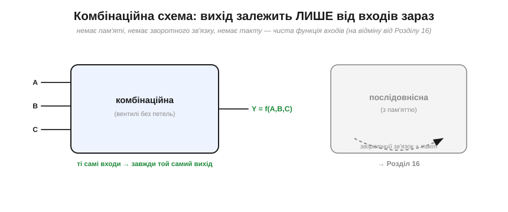
*Рис. 3.2.6.1. Комбінаційна схема — це «чиста функція» входів: ніяких петель зворотного зв'язку, ніякого такту, ніякої пам'яті (ліворуч). Усе, що ми будували досі (вентилі, з'єднані без кілець), — комбінаційне. Протилежність — **послідовнісні** схеми (праворуч), які **пам'ятають** свій стан завдяки зворотному зв'язку й такту; ними займеться Розділ 3.3. Поки що — світ без пам'яті.*

Тримайте цю межу в голові: усе в Розділі 3.2 — **без пам'яті**, а щойно з'явиться зворотний зв'язок і «запам'ятовування», ми перейдемо в Розділ 3.3. Зараз будуємо комбінаційні блоки.

### Півсуматор: додати два біти

Найпростіша «рахувальна» схема — та, що додає **два** біти. Згадаймо §3.2.4: коли додаєш 1+1, результат — двійкове «10», тобто **сума** 0 і **перенос** 1. Отже, потрібні два виходи.

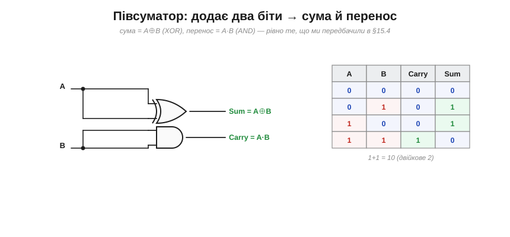
*Рис. 3.2.6.2. **Півсуматор** (*half-adder*). Біт **суми** — це A⊕B (XOR: 1, коли біти різні), а біт **переносу** — A·B (AND: 1 лише коли обидва 1). Таблиця підтверджує шкільне додавання: 0+0=00, 0+1=01, 1+0=01, 1+1=**10**. Саме це ми й передбачили наприкінці §3.2.4, коли назвали XOR «бітом суми», а AND — «бітом переносу».*

«Пів-» він тому, що вміє складати лише два біти, а не враховує **перенос, що прийшов** із попереднього розряду. А для додавання багатозначних чисел це конче потрібно.

### Повний суматор: три біти

**Повний суматор** (*full-adder*) додає вже **три** біти: два доданки A, B і **перенос-вхід** Cin із молодшого розряду. На виході — біт суми й перенос-вихід Cout у старший розряд.

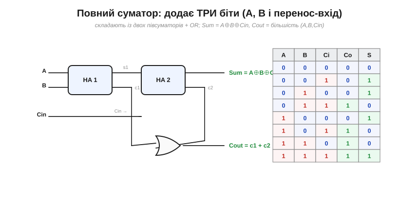
*Рис. 3.2.6.3. Повний суматор зручно скласти з **двох півсуматорів**: перший додає A і B, другий додає до результату Cin. Біт суми виходить Sum = A⊕B⊕Cin (непарність трьох бітів — знову XOR!), а перенос Cout = 1, коли одиниць серед трьох **щонайменше дві** (функція «більшості») — його дають два внутрішні переноси, з'єднані через OR. Таблиця істинності на 8 рядків задає його повністю.*

Зверніть увагу на красу: Sum — це XOR усіх трьох входів (парність), а Cout — «більшість» (хто переважив). Ці дві функції — серце арифметики, і обидві ми вже вміємо робити вентилями.

### Багатобітне додавання: ланцюговий перенос

Тепер головне. Щоб додати **багатобітні** числа, ставимо повні суматори в **ряд** — по одному на розряд — і з'єднуємо перенос-вихід кожного з перенос-входом наступного. Перенос **«біжить»** із молодшого розряду в старший, точно як ви переносите одиницю, додаючи стовпчиком на папері.

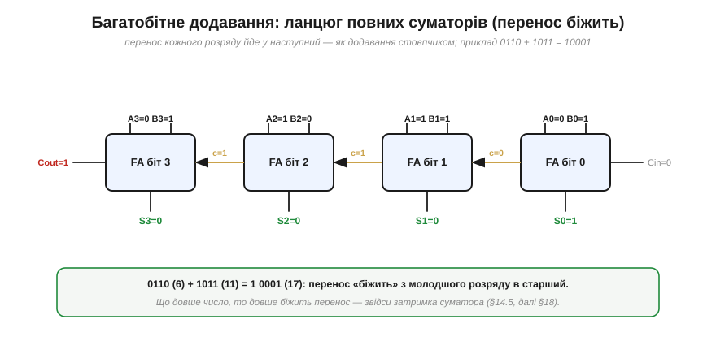
*Рис. 3.2.6.4. **Ланцюговий суматор** (*ripple-carry adder*) із чотирьох повних суматорів. Приклад: 0110 (6) + 1011 (11). Перенос народжується в розряді 1 (1+1=10) і **біжить** ланцюгом аж до виходу, даючи відповідь 1 0001 (17). Зверніть увагу на бурштинові стрілки переносу — це і є той «забіг» одиниці. А ще: що довше число, то довше біжить перенос, тож додавання великих чисел **повільніше** — звідси затримка, яку доведеться долати в архітектурі процесора (§3.5).*

**Приклад (4-бітне додавання).** Додамо 0110 + 1011 розряд за розрядом, ведучи перенос.

```
розряд 0:  0 + 1 + 0(Cin) = 1   →  S0=1, перенос 0
розряд 1:  1 + 1 + 0       = 10  →  S1=0, перенос 1
розряд 2:  1 + 0 + 1       = 10  →  S2=0, перенос 1
розряд 3:  0 + 1 + 1       = 10  →  S3=0, перенос 1 (Cout)
результат:  1 0001  =  17   (а 6 + 11 = 17 ✓)
```

Це вже **арифметика в залізі**: схема з комбінаційних вентилів, що додає числа за один прохід сигналу. Той самий блок, лише ширший і трохи доповнений, стане **арифметико-логічним пристроєм** (АЛП) — обчислювальним ядром процесора (Розділ 3.5). Додавання ми щойно збудували з нуля.

### Мультиплексор: обрати вхід

Друга незамінна схема нічого не рахує — вона **обирає**. **Мультиплексор** (*multiplexer*, MUX) має кілька входів даних і **лінію вибору**, що вирішує, який саме вхід пропустити на вихід. Це цифровий «перемикач».

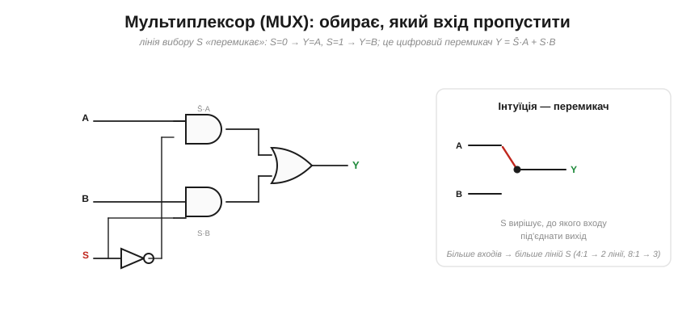
*Рис. 3.2.6.5. **Мультиплексор 2-в-1**. Лінія вибору S вирішує: за S=0 на вихід іде A, за S=1 — B. Логічно це Y = S̄·A + S·B (увімкнути A, коли S=0; увімкнути B, коли S=1; з'єднати через OR). Інтуїтивно — це перемикач, що під'єднує вихід до одного з входів (праворуч). Більше входів потребує більше ліній вибору: 4-в-1 — двох ліній, 8-в-1 — трьох (бо n ліній адресують 2ⁿ входів).*

Мультиплексор — усюдисущий: ним **спрямовують** дані («звідки взяти число — з пам'яті чи з регістра?»), будують програмовані функції, економлять дроти (багато сигналів по одній лінії по черзі). У процесорі MUX-и на кожному кроці вирішують, який сигнал куди тече.

### Дешифратор: один із багатьох

Третя схема — **дешифратор** (*decoder*). Він бере N-бітне число на вході й вмикає **рівно один** із 2ᴺ виходів — той, чий номер дорівнює вхідному числу. Решта виходів — нулі. Такий «один активний серед багатьох» називають **«один гарячий»** (*one-hot*).

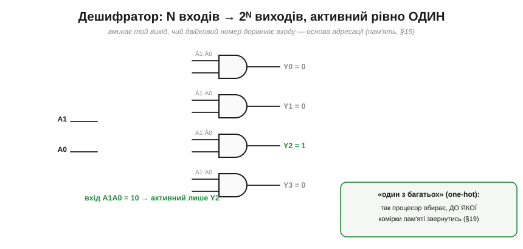
*Рис. 3.2.6.6. **Дешифратор 2-в-4**. Двобітний вхід A1A0 вмикає один із чотирьох виходів: 00 → Y0, 01 → Y1, 10 → Y2, 11 → Y3. Кожен вихід — це AND відповідної комбінації входів (із потрібними інверсіями), тож активним стає рівно той, чия умова збіглася. Тут вхід 10 → горить лише Y2.*

Дешифратор — це **адресація** в чистому вигляді: «номер на вході → виберемо саме цей об'єкт». Саме так процесор обирає, до якої **комірки пам'яті** звернутися (адреса декодується в сигнал «активувати цю комірку») — ключова річ, до якої ми прийдемо в Розділі 3.6. Дешифратори, мультиплексори й суматори — це той рівень, на якому інженер уже мислить **блоками**, а не окремими вентилями.

Кожен такий блок усередині — це булева функція, яку ми спершу записуємо «в лоб» сумою добутків (§3.2.1), а вона часто виходить надмірно довгою. Перетворювати її на коротший вираз законами Буля наосліп — марудно й легко помилитися. Є наочніший спосіб робити це **руками**, і він заслуговує на окремий погляд.

> 🧮 **Карти Карно.** Як згорнути громіздку суму добутків у мінімальний вираз без алгебраїчної гімнастики — переставивши таблицю істинності в сітку, де сусіди різняться одним бітом. Див. вставку [«Карти Карно: мінімізація логіки руками»](math-karnaugh-maps.md).

> 🔧 **Навіщо це.** Це поворотний момент усього розділу: ви перестаєте думати «вентилями» й починаєте думати **блоками**. Бачите в схемі «MUX» — знаєте: тут щось **обирається** лінією вибору. «Decoder» — щось **адресується**. «Adder/ALU» — щось **рахується**. Ці блоки — стандартна лексика цифрової техніки: з них складають усе, від простого керування до процесора, не опускаючись щоразу до транзисторів. І кожен із них, як ми бачили, всередині — просто грамотно з'єднані AND, OR, NOT, XOR. Уміння бачити «суматор» там, де насправді сотні вентилів, — це і є інженерна **абстракція**, без якої скласти щось складне неможливо.

---

Підсумок §3.2.6: **комбінаційна** схема — це чиста функція входів **без пам'яті** (на відміну від послідовнісних, Розділ 3.3). З вентилів складають корисні **блоки**: **півсуматор** (Sum=A⊕B, Carry=A·B) і **повний суматор** (три біти: Sum=A⊕B⊕Cin, Cout=більшість), а ланцюг повних суматорів дає **багатобітне додавання** з переносом, що «біжить» розрядами (основа АЛП, §3.5). **Мультиплексор** лінією вибору **обирає** один із входів (Y=S̄A+SB), а **дешифратор** вмикає **один із 2ᴺ** виходів за номером на вході (основа адресації, §3.6). Головне — навчитися мислити **блоками**, а не вентилями. Ми зробили великий стрибок: від однієї булевої операції — до схем, що додають і обирають. Лишилося поглянути, **куди** веде ця дорога: як із комбінаційних блоків виростають складні функції, і де межа того, що можна зробити **без пам'яті**.

---

## 3.2.7 Від вентилів до складних функцій

Ми пройшли разючий шлях: від однієї булевої операції — до блоків, що додають числа й спрямовують сигнали. Та постає природне питання: **куди** це веде і де межа? Цей підрозділ — замковий камінь розділу: він складає всі попередні теми в єдину картину, показує, що з вентилів можна (і чого не можна) збудувати, і ставить нас на поріг наступного великого кроку — процесора. Тут ми менше рахуємо й більше **бачимо ціле**.

### Драбина абстракції

Найважливіша ідея — навіть не конкретна схема, а **спосіб думати**. Складність приборкують **рівнями абстракції**: кожен рівень будують із нижнього й **ховають** його деталі, щоб на наступному рівні думати вже про нього як про цеглину.

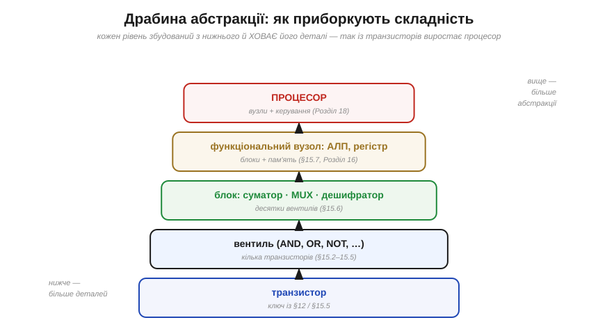
*Рис. 3.2.7.1. Уся історія Модуля 3 на одній драбині. **Транзистор** (ключ, §2.7/§3.2.5) → **вентиль** (кілька транзисторів, §3.2.2–3.2.5) → **блок** (десятки вентилів: суматор, MUX, дешифратор, §3.2.6) → **функціональний вузол** (АЛП, регістр — блоки плюс пам'ять) → **процесор** (вузли плюс керування, Розділ 3.5). На кожному щаблі ми **забуваємо** про нижчий: проєктуючи суматор, не думаємо про транзистори; пишучи програму, не думаємо про вентилі.*

Це і є відповідь на питання «як узагалі можна збудувати щось із мільярдів транзисторів?». Ніхто не тримає в голові мільярд — їх групують у вентилі, вентилі в блоки, блоки у вузли, і на кожному рівні працюють із кількома зрозумілими «цеглинами». Без цієї драбини сучасна електроніка була б неможлива; з нею — посильна. Запам'ятайте цей принцип: він повторюватиметься всюди, від схемотехніки до програмування.

### Збудувати можна будь-що — та не однією таблицею

Тепер — про силу й межу комбінаційної логіки. Сила вражає: ми довели (сума добутків §3.2.1, універсальність NAND §3.2.3), що **будь-яку** логічну функцію можна збудувати з наших вентилів. Дайте яку завгодно таблицю істинності — і ми складемо схему, що її точно відтворює. У цьому сенсі вентилі **всемогутні**.

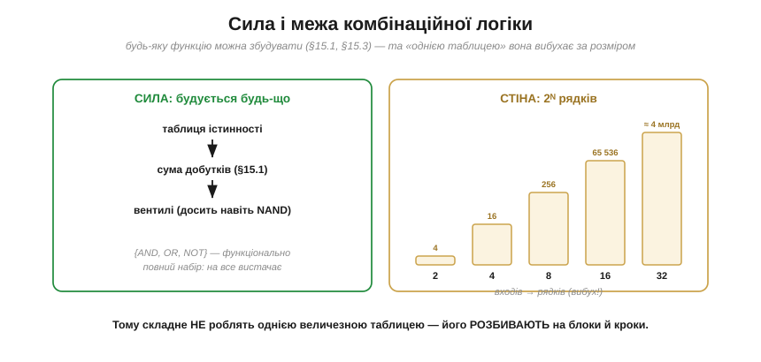
*Рис. 3.2.7.2. Ліворуч — сила: будь-яка таблиця істинності → сума добутків → вентилі (досить навіть самих NAND). Праворуч — стіна: пряма таблиця для функції з n входів має **2ⁿ** рядків, а це число **вибухає** (8 входів — 256, 16 — 65 тисяч, 32 — близько чотирьох мільярдів). Збудувати корисну функцію 32-бітних чисел «однією величезною таблицею» фізично неможливо.*

Ось перша межа. Теоретично «будь-що» — це правда, та практично гігантські функції **не роблять** однією плоскою таблицею-схемою: вона була б завбільшки з планету. Натомість складне **розбивають** на блоки (як ми розбили додавання на повні суматори) і — як побачимо далі — на **кроки в часі**. Всемогутність вентилів реальна, але користуватися нею треба з розумом ієрархії.

### Друга межа: немає пам'яті

Друга межа фундаментальніша. Комбінаційна схема, хоч би яка велика, **нічого не пам'ятає** — її вихід залежить лише від входів **зараз**. А отже, цілий клас задач їй просто не під силу.

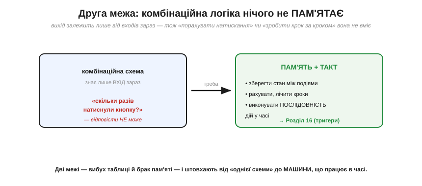
*Рис. 3.2.7.3. Спитайте комбінаційну схему «скільки разів натиснули кнопку?» — вона не відповість, бо не пам'ятає попередніх натискань, знає лише стан **зараз**. Так само вона не вміє рахувати, лічити кроки, виконувати дії **по черзі**. Для всього цього потрібні **пам'ять** (зберегти стан між подіями) і **такт** (ритм, що відмірює кроки) — а це вже Розділ 3.3.*

Це той самий поділ, що ми провели в §3.2.6: комбінаційне (без пам'яті) проти послідовнісного (з пам'яттю). Більшість по-справжньому корисного — лічильники, автомати, **виконання програми крок за кроком** — потребує пам'яті й часу. Дві межі разом — вибух таблиці й брак пам'яті — і штовхають інженерію від ідеї «одна схема = одна функція» до ідеї **машини, що працює в часі**.

### АЛП: де всі блоки сходяться

Перш ніж дійти до машини, зберімо §3.2.6-блоки в один вузол, що стане її серцем, — **арифметико-логічний пристрій** (*ALU*, АЛП). Це блок, що вміє **кілька** операцій і за командою видає потрібну.

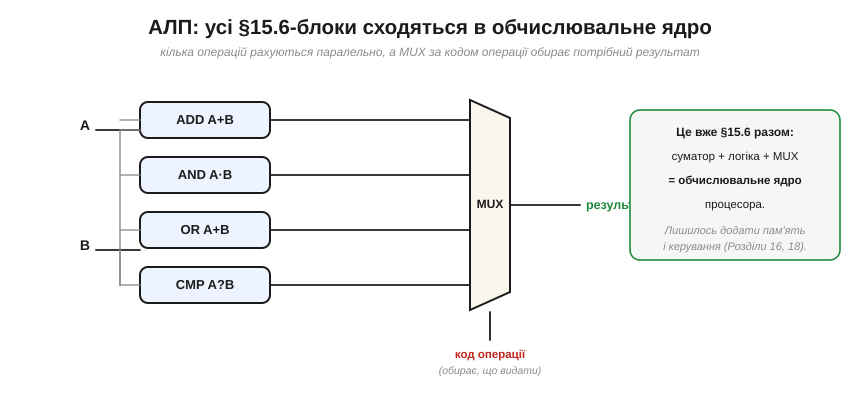
*Рис. 3.2.7.4. Усередині АЛП кілька схем рахують **одночасно**: суматор дає A+B, логіка дає A·B та A+B, компаратор порівнює. А **мультиплексор** (§3.2.6) за **кодом операції** обирає, який із результатів випустити назовні. Тобто АЛП — це суматор + логіка + MUX, з'єднані разом. Це вже **обчислювальне ядро** процесора; лишилося додати пам'ять (Розділ 3.3) і керування, що подаватиме коди операцій (Розділ 3.5).*

Погляньте, як гарно сходяться всі теми розділу: арифметика (§3.2.6 суматор), логіка (§3.2.2 вентилі), вибір (§3.2.6 мультиплексор) — в одному блоці, що за одним числом-командою робить будь-що з переліку. АЛП — це місток від «логіки» до «процесора»: дайте йому пам'ять для операндів і керування, що йтиме програмою, — і отримаєте машину, що виконує обчислення.

### Два способи обчислити: простором чи в часі

І нарешті — найглибша думка, що відкриває весь подальший курс. Одну й ту саму функцію можна реалізувати **двома принципово різними** способами.


*Рис. 3.2.7.5. **Просторово** (ліворуч): викладаємо вентилі так, щоб вони **прямо** обчислювали потрібну функцію. Швидко (відповідь — за один прохід сигналу), але **жорстко**: ця схема вміє лише цю функцію, а складніша функція потребує більше площі. **У часі** (праворуч): беремо **маленький** АЛП із регістрами й виконуємо функцію **по кроках**, такт за тактом, за програмою. Гнучко й компактно (один АЛП робить що завгодно), але **повільніше**. Це і є вибір «залізо проти програми».*

Осягніть цей вододіл — він визначає всю електроніку. Хочете **максимальної швидкості** однієї конкретної задачі — «відлийте» її в окрему схему (так роблять відеокарти, спеціалізовані чипи, ПЛІС). Хочете **гнучкості** — щоб один пристрій робив що завгодно, лише зміни програму — візьміть **процесор**: маленький АЛП, що крок за кроком виконує будь-який алгоритм. Перший шлях — це **апаратне** обчислення, другий — **програмне**. Майже все, що ми робитимемо далі (мікроконтролер ESP32, прошивка), — це другий шлях: гнучка машина, що виконує **програму**. А починається вона рівно тут, де ми зупинилися: АЛП є, лишилося дати йому пам'ять і ритм.

> 🔧 **Навіщо це.** Цей підрозділ дає вам **карту**, без якої легко загубитися далі. Перше: мисліть **рівнями** — не намагайтеся тримати в голові транзистори, коли працюєте з блоками, чи вентилі, коли пишете код; кожен рівень має свою «цеглину». Друге: пам'ятайте про **дві межі** комбінаційної логіки (вибух таблиці й брак пам'яті) — саме вони пояснюють, навіщо взагалі існують пам'ять, такт і процесор, до яких ми переходимо. Третє, найпрактичніше: за кожною задачею стоїть вибір «**схемою чи програмою**» — швидко-але-жорстко проти гнучко-але-повільніше. Уся подальша робота з мікроконтролером — це свідомий вибір **програмного** шляху, і тепер ви розумієте, що саме він означає на рівні заліза.

---

Підсумок §3.2.7: складність приборкують **драбиною абстракції** (транзистор → вентиль → блок → вузол → процесор), де кожен рівень ховає деталі нижчого. Комбінаційна логіка **функціонально всемогутня** (будь-яка таблиця → вентилі), але має **дві межі**: пряма таблиця **вибухає** як 2ⁿ, і вона **не має пам'яті**. Звідси — потреба у блочній ієрархії та в **машині, що працює в часі**. Блоки §3.2.6 сходяться в **АЛП** (суматор + логіка + MUX за кодом операції) — обчислювальне ядро процесора. А найглибше: ту саму функцію можна реалізувати **просторово** (окрема швидка, та жорстка схема) або **в часі** (гнучкий процесор, що виконує кроки за програмою) — це вибір «залізо проти програми», що визначає всю подальшу електроніку.

---

### Підсумок Розділу 3.2

Ми перетворили абстрактну логіку на залізо й назад. Почали з **булевої алгебри** (§3.2.1) — математики 0 і 1 з трьома діями, що описує будь-яку логіку. Дали діям тіло — **вентилі** з їхніми символами (§3.2.2), знайшли серед них **універсальні** NAND/NOR, що самі будують усе (§3.2.3), і особливий **XOR** для порівняння й арифметики (§3.2.4). Зазирнули **всередину** вентиля й побачили, як його роблять із транзисторів у **CMOS** (§3.2.5). А тоді піднялися рівнем вище — склали з вентилів **комбінаційні блоки**, що додають, обирають і адресують (§3.2.6), і побачили, **куди** це веде: до АЛП, до межі без пам'яті, до вибору «схема чи процесор» (§3.2.7). Тепер у нас є все, щоб **рахувати**, — але немає способу **запам'ятати**. Найперше, чого бракує машині, — це пам'ять: схема, що утримує стан між тактами. Саме її ми й збудуємо далі.

> ▶️ Далі: [Розділ 3.3 — Тригери, регістри й тактування](../flip-flops-registers/flip-flops-registers.md)