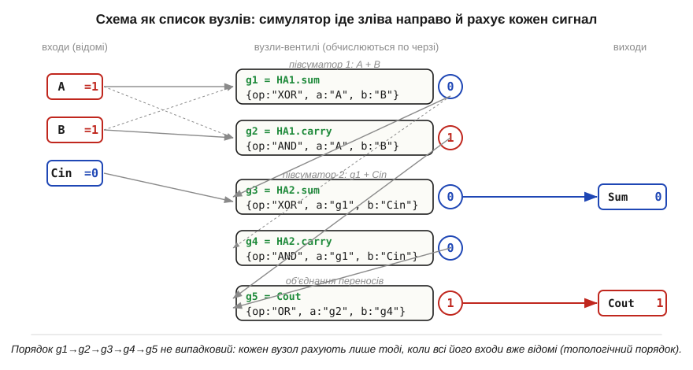
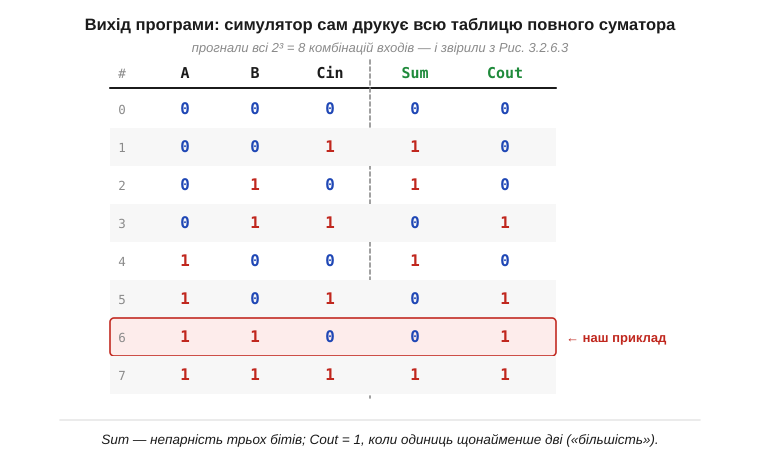

# ⚙️ Симулятор вентилів на 100 рядків: збираємо повний суматор і проганяємо таблицю істинності

> Це алгоритмічна вставка до теми [§3.2.6 «Комбінаційні схеми: суматор, мультиплексор, дешифратор»](logic-gates.md). Там ми **намалювали** повний суматор із двох півсуматорів і OR (Рис. 3.2.6.3) і **звірили його з рукою** на одному прикладі. Та одна перевірена комбінація — це ще не доказ: повний суматор має 2³ = 8 рядків, і помилка легко ховається в тому, який забули перебрати. Тут ми зробимо інакше — напишемо крихітну програму, що **сама** збере схему з вентилів і прожене **всі вісім** комбінацій, друкуючи таблицю істинності. Заразом побачимо, як інженери описують схему так, щоб її «зрозумів» комп'ютер, — це той самий принцип, на якому стоять справжні логічні симулятори (*logic simulators*).

### Задача

Маємо схему з вентилів — конкретно повний суматор із §3.2.6 — і хочемо, щоб машина обчислила її вихід для будь-якого набору входів, а тоді й для **всіх** наборів одразу. Звести це до коду непросто з однієї причини: вентилі з'єднані не як завгодно, а **ланцюжком**, де вихід одного стає входом іншого (Рис. 3.2.2.5). Щоб порахувати OR переносів, треба спершу знати обидва переноси; щоб знати їх — спершу обчислити перший півсуматор. Тобто порядок обчислення **диктує сама схема**, і програма мусить його дотримати.

### Ідея: схема як список вузлів

Ключ — описати схему не картинкою, а **даними**: списком вузлів, де кожен вузол каже, який він вентиль і звідки бере входи. Входи й проміжні сигнали отримують **імена** (як зелені підписи на проміжних дротах у §3.2.6), а вузол посилається на ці імена. Виходить структура, яку інженери звуть **нетлістом** (*netlist*, «список з'єднань»), — текстовий опис того, що на схемі намальовано лініями.


*Рис. 3.2.6a.1. Повний суматор, записаний нетлістом. Кожен вузол — це маленький запис «який вентиль (op) і два його входи за іменами». Входи A, B, Cin відомі (тут A=1, B=1, Cin=0); решта сигналів обчислюється по черзі: g1, g2 (перший півсуматор), тоді g3, g4 (другий, що бере g1 і Cin), і нарешті g5 = Cout (OR двох переносів). Сірі стрілки — залежності «хто від кого». Порядок g1→…→g5 не випадковий: вузол рахують лише тоді, коли всі його входи вже відомі.*

Цей порядок «обчислюй вузол лише після його входів» і є серцем усієї справи. Якщо вузли вже виписати в такій послідовності (а для невеликої схеми це легко зробити руками, як на Рис. 3.2.6a.1), то симулятор просто йде списком **згори вниз**, раз за разом беручи готові значення зліва й кладучи новий результат у словник сигналів. Жодної магії — лише акуратний обхід у правильному порядку.

### Псевдокод

Спершу — самі вентилі. Кожен із них (§3.2.2–3.2.4) — це елементарна дія над бітами, тож і кодується одним рядком:

```
AND(a, b)  = a & b            # 1 лише коли обидва 1
OR (a, b)  = a | b            # 1 коли хоч один 1
XOR(a, b)  = a ^ b            # 1 коли біти різні  (§3.2.4)
NOT(a)     = 1 - a            # перевертає 0↔1
```

Тепер — обчислювач нетліста. Він тримає словник `сигнали` (ім'я → 0/1), куди спершу кладе входи, а тоді проходить вузли по черзі:

```
функція обчислити(нетліст, входи):
    сигнали = копія(входи)              # A, B, Cin уже відомі
    для кожного вузла (імʼя, op, a, b) у нетлісті:   # порядок — топологічний
        va = сигнали[a]
        vb = сигнали[b] якщо b задано, інакше None   # NOT має лише один вхід
        сигнали[імʼя] = ВЕНТИЛЬ[op](va, vb)          # порахували — запамʼятали
    повернути сигнали
```

Сам повний суматор — це п'ять рядків нетліста, точно як на Рис. 3.2.6a.1 (два XOR і AND двох півсуматорів, плюс OR переносів):

```
суматор = [
    ("g1", XOR, "A",  "B"),     # півсуматор 1: сума         (A⊕B)
    ("g2", AND, "A",  "B"),     # півсуматор 1: перенос       (A·B)
    ("g3", XOR, "g1", "Cin"),   # півсуматор 2: сума = Sum    (A⊕B⊕Cin)
    ("g4", AND, "g1", "Cin"),   # півсуматор 2: перенос
    ("g5", OR,  "g2", "g4"),    # обʼєднаний перенос = Cout
]
```

Імена вузлів `g1…g5` — рівно ті ж, що на Рис. 3.2.6a.1: підсумкова сума виходить у `g3`, обʼєднаний перенос — у `g5`. Лишилося прогнати **всі** входи. Їх рівно 2³ = 8, і перебрати їх — це просто три вкладені цикли «0/1» (або один цикл від 0 до 7 із розбором на біти). Для кожного набору обчислюємо схему й друкуємо рядок:

```
друк "A B Cin | Sum Cout"
для A у (0,1):
  для B у (0,1):
    для Cin у (0,1):
        s = обчислити(суматор, {"A":A, "B":B, "Cin":Cin})
        друк A, B, Cin, "|", s["g3"], s["g5"]      # Sum, Cout
```

Усе разом — десь сотня рядків живого коду: чотири вентилі, обчислювач нетліста, опис суматора й цикл-драйвер. А на виході — повна таблиця, яку лишається звірити з тією, що ми вивели руками.


*Рис. 3.2.6a.2. Те, що друкує симулятор: усі вісім рядків. Підсвічений рядок A=1, B=1, Cin=0 дає Sum=0, Cout=1 — рівно те, що ми отримали руками в §3.2.6. Звіривши всі вісім, переконуємося, що схема правильна **скрізь**, а не лише в одній перевіреній точці. Sum — непарність трьох бітів, Cout — «більшість» (одиниць щонайменше дві).*

### Чому це працює

Програма не «розуміє» арифметики — вона лише чесно повторює те, що робить залізо: проводить біти крізь вентилі в тому порядку, в якому ті з'єднані. Оскільки нетліст виписано топологічно (кожен вузол **після** своїх входів), у мить обчислення вузла обидва його значення вже лежать у словнику. Тому результат збігається з фізичним суматором рядок у рядок — а вісім збігів поспіль уже не випадковість, а вичерпна перевірка: для схеми з трьох входів **усіх** можливих ситуацій рівно вісім, і всі вони пройдені.

### Складність і пастки на МК

- **Час росте як 2ⁿ.** Вичерпний прогін перебирає **всі** входи, а їх 2ⁿ. Для трьох входів це 8 рядків — дрібниця; для 32-бітного суматора (65 входів) — астрономічне число, повна таблиця нездійсненна (та сама «стіна» 2ⁿ, що в §3.2.7). Тоді входи або перебирають **вибірково** (важливі випадки + випадкові), або переходять до інших методів перевірки.
- **Порядок вузлів критичний.** Якщо у списку вузол стоїть **перед** тим, чий вихід йому потрібен, програма спіткнеться об невідоме ім'я. Для невеликої схеми порядок виставляють руками; для великої його шукають **топологічним сортуванням** графа (це окрема класична задача). А якщо у схемі є **кільце** зворотного зв'язку (як у тригерах Розділу 3.3), топологічного порядку не існує взагалі — такий простий «прохід згори вниз» там уже не годиться, і потрібен інший рушій.
- **Лише один біт на сигнал.** Модель тримає в кожному сигналі чистий 0 або 1 і **миттєву** відповідь — без затримок, без гонок і глітчів (*hazards*, §3.2.6) під час перемикання. Це правильна **усталена** картина, але не динаміка: справжні симулятори ще й моделюють час, щоб ловити перегони сигналів.
- **Пам'ять на МК — дрібниця.** Сам словник сигналів крихітний (кілька імен по біту), тож код легко влазить навіть у малий мікроконтролер; обмежує не пам'ять, а саме час перебору 2ⁿ. На МК біти зручно пакувати в одне ціле число (кожен сигнал — окремий розряд) і користуватися побітовими `&`, `|`, `^` — тими самими операціями, що й вентилі.

### Де ще це трапляється

Той самий підхід — «опиши схему нетлістом і прожени по вузлах» — лежить в основі промислових симуляторів цифрової логіки, на яких перевіряють процесори ще до того, як їх віллють у кремній. Наша сотня рядків — їхня крихітна, але чесна модель: ті самі вентилі, той самий обхід у топологічному порядку, та сама ідея вичерпної таблиці. А вміння звести схему до даних і «виконати» її кодом стане в пригоді щоразу, коли логіку треба перевірити раніше, ніж паяти.
