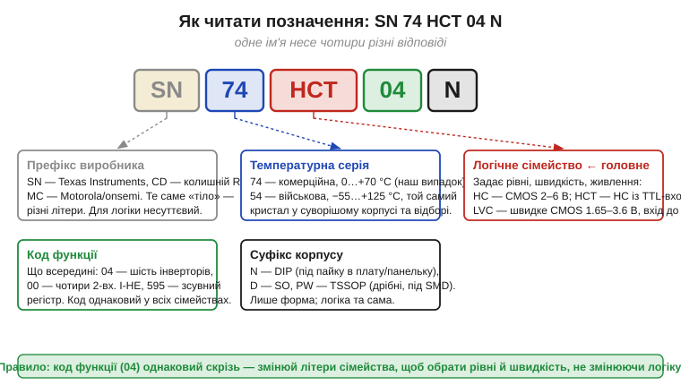
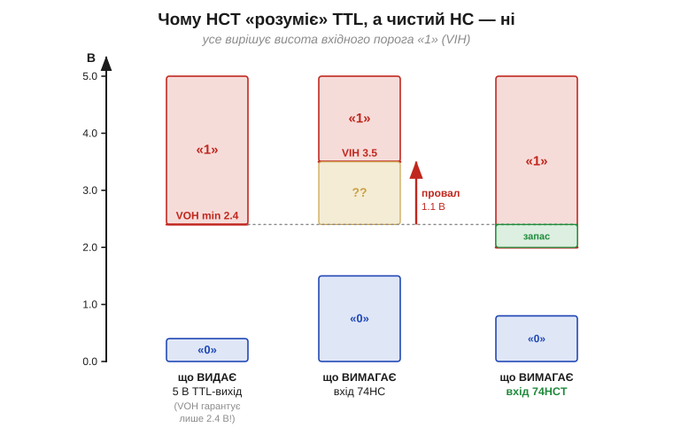
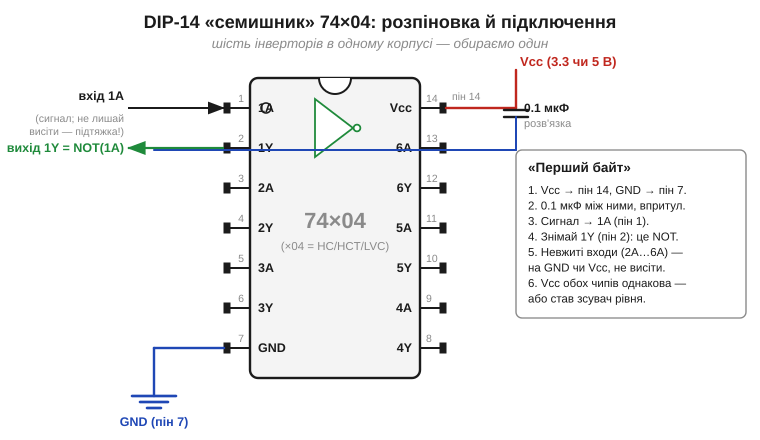

# 🔌 Серія 74: розшифровуємо 74HC/74HCT/74LVC і чому HCT «розуміє» 5-вольтовий TTL

> Вставка до [Розділу 3.1 «Логічні рівні»](logic-levels.md), теми §3.1.4. Там ми говорили про сімейства абстрактно — як про «договори» рівнів. Тут беремо в руки конкретний клас деталей, у якому ці договори застигли в назвах мікросхем: **серію 74**. Це той самий ряд логіки, з якого вже півстоліття складають цифрові схеми, і саме його маркування — `74HC04`, `74HCT00`, `74LVC245` — лякає новачка незрозумілою латиницею. Розберемо, де в цьому імені ховається відповідь на головне питання теми: **порозуміються чипи чи ні**.

## Клас пристрою: «розсип» логіки в одному корпусі

**Серія 74** (*74 series*, ще «74xx») — це не один чип, а ціла **бібліотека дрібних логічних блоків** у стандартних корпусах: окремі вентилі (І-НЕ, АБО-НЕ, інвертори), тригери, лічильники, зсувні регістри, буфери, мультиплексори. Її прозвали **glue logic** (*«клейова логіка»*) — це ті кілька корпусів, якими «склеюють» докупи великі мікросхеми, коли треба підправити рівень, розв'язати лінію, поділити частоту чи додати пару вентилів, яких бракує в процесорі.

Для нас серія 74 цінна навіть не як готовий вузол, а як **жива колекція рівнів із §3.1.4**. Один і той самий вентиль тут випускають у кількох сімействах — на 5 В і на 3.3 В, із TTL-порогами й без них, — і вся різниця винесена прямо в назву. Тобто маркування 74xx — це практичний словник до попередньої теми: навчившись його читати, ви відразу бачите, яке в чипа живлення, які пороги і з ким він стикується без зсувача.

## Анатомія назви: де читати рівні

Назва на корпусі здається мішаниною, та насправді вона жорстко поділена на поля, і кожне відповідає на своє питання. Розкладемо типове позначення `SN74HCT04N`.


*Рис. 3.1.4c.1. Одне ім'я — чотири незалежні відповіді. **Префікс** (`SN`, `CD`, `MC`) — лише виробник, для логіки несуттєвий. **Температурна серія**: `74` — комерційна (0…+70 °C), `54` — військова (−55…+125 °C), той самий кристал у суворішому виконанні. **Сімейство** (`HC`/`HCT`/`LVC`…) — головне поле: воно задає рівні, швидкодію й живлення (саме його ми «розшифровуємо»). **Код функції** (`04` — шість інверторів) — що чип робить; він однаковий у всіх сімействах. **Суфікс корпусу** (`N` — DIP, `D` — SO, `PW` — TSSOP) — лише форма.*

Ключ до всієї вставки — у тому, що ці поля **незалежні**. Код функції `04` означає «шість інверторів» хоч у `74HC04`, хоч у `74LVC04`; міняючи **літери сімейства**, ви обираєте рівні й швидкість, **не чіпаючи логіки**. Тому досвідчений розробник читає назву 74xx не зліва направо, а одразу «стрибає» на буквене поле сімейства — бо саме воно вирішує, чи стикується чип із сусідами. До цього поля ми й переходимо.

### Три головні сімейства, які варто знати

З десятків історичних сімейств (LS, ALS, F, AC, AHC, AUP…) для сучасної практики досить трьох, і вони якраз ілюструють драбину напруг із §3.1.4.

**74HC** (*High-speed CMOS*) — «робоча конячка» на чистому CMOS. Живлення широке, 2–6 В; на 5 В пороги **симетричні**, по-CMOS-ному: VIH ≈ 3.5 В, VIL ≈ 1.5 В (приблизно 0.7 і 0.3 від Vdd). Вихід тиснеться майже до шин (VOH ≈ Vdd, VOL ≈ 0), статичний струм мізерний. Це сімейство «за замовчуванням», коли весь вузол живиться від однієї напруги.

**74HCT** (*HC with TTL-compatible input*) — той самий HC, але з **навмисно зниженим вхідним порогом**: VIH = 2.0 В, VIL = 0.8 В — рівно як у старого TTL. Кристал майже той самий, що в HC; відрізняється лише вхідний каскад. Навіщо — побачимо в наступному підрозділі: HCT створили саме як **перекладач** між світом 5 В TTL і світом CMOS.

**74LVC** (*Low-Voltage CMOS*) — низьковольтна лінія для 3.3 В і нижче: живлення 1.65–3.6 В. Швидке, з потужним виходом, а головне — у більшості входів **витримує 5 В** (*5V-tolerant*), навіть коли саме живиться від 3.3 В. Це робить LVC улюбленим зсувачем «вниз»: 5-вольтовий сигнал можна подати прямо на вхід LVC-чипа, що живиться 3.3 В, не боячись спалити вхід (механізм небезпеки — у §3.1.4). Саме тому LVC так часто стоїть поряд із 3.3-вольтовими процесорами на кшталт ESP32.

> 🔧 **Навіщо це.** Назва 74xx — це згорнутий даташит рівнів. Побачивши `74HC` біля 5-вольтового живлення, ви вже знаєте: пороги симетричні, висячий вхід чіпати не можна. Побачивши `74LVC` біля 3.3 В — що вхід, найпевніше, стерпить 5 В і годиться як міст «вниз». А `74HCT` — що перед вами навмисний перекладач із TTL. Це економить похід у даташит на кожному стику.

## Чому HCT «розуміє» 5-вольтовий TTL

Тепер — обіцяна серцевина. Чому з двох майже однакових чипів, `74HC` і `74HCT`, **лише другий** надійно приймає сигнал від старої 5-вольтової TTL-логіки? Відповідь цілком уміщається в одне число — **висоту вхідного порога «1»** — і найкраще читається на спільній шкалі напруг.


*Рис. 3.1.4c.2. Три колонки на одній шкалі. Ліва — що **видає** 5 В TTL-вихід: його гарантований VOH(min) — лише **2.4 В** (не 5 В! решту «з'їдає» біполярний вихідний каскад). Середня — що **вимагає** вхід `74HC`: щоб упевнено прочитати «1», йому треба **3.5 В**. Між 2.4 і 3.5 — **провал 1.1 В**: TTL-«1» падає в бурштинову «??»-зону, де HC її не гарантує. Права — вхід `74HCT` із порогом **2.0 В**: ті самі 2.4 В дотягуються з невеликим, але додатним **запасом**. Тому HCT читає TTL, а HC — ні.*

Розкладемо логіку картинки по кроках, бо в ній — уся суть. По-перше, **TTL-вихід скупий на «1»**: його високий рівень гарантовано не нижчий за 2.4 В, а не «майже 5 В», як можна було б наївно очікувати (це спадщина біполярного двотактного каскаду, де на верхньому транзисторі й діоді гине частина напруги). По-друге, **чистий CMOS-вхід вимогливий**: щоб з певністю відрізнити «1» від «0», `74HC` хоче бачити щонайменше ≈ 3.5 В (≈ 0.7·Vdd при 5 В). Зведіть ці два факти разом — і видно прірву: драйвер дає максимум 2.4 В, приймач вимагає від 3.5 В. TTL-«1» падає в проміжок, де HC-вхід **не зобов'язаний** її впізнати: може прочитати правильно, може ні, ще й завмерти в забороненій зоні (§3.1.2) з наскрізним струмом.

`74HCT` розриває цей глухий кут одним прийомом: його вхідний каскад **перероблено так, щоб поріг VIH опустився до 2.0 В** — точно під TTL-договір. Тепер ті самі 2.4 В драйвера лягають **вище** порога приймача, з'являється невеликий додатний запас (≈ 0.4 В), і «1» читається надійно. Решта чипа — функція, виходи, швидкодія, економність — лишається HC-овою. По суті, HCT — це HC, якому «підкрутили вуха» під гучність старого TTL.

> 🔧 **Навіщо це.** Практичне правило, що випливає прямо з картинки: коли вам треба прийняти сигнал від **5 В TTL** (чи від будь-чого, що гарантує лише VOH ≈ 2.4 В) у CMOS-схему — беріть **HCT**, а не HC. Класична пастка: зібрати все на HC, з'ясувати, що від TTL-джерела схема працює «через раз», і шукати неіснуючий дефект пайки. Дефект — у даташиті: HC просто не дотягується до TTL-порога, і це не лагодиться нічим, окрім заміни на HCT або вставлення зсувача.

Варто додати чесне застереження, щоб правило не перетворилося на забобон. HCT приймає TTL завдяки **низькому** входу — але платить за це **вузьким запасом на «0»** і більшою чутливістю до завад на 5-вольтовій лінії. А ще трюк HCT прив'язаний до 5 В: на 3.3 В поріг 2.0 В уже не дає тієї переваги, і там грають інші сімейства (LVC та подібні; точні числа — за даташитом конкретного чипа). Тобто HCT — спеціалізований перекладач «5 В TTL → CMOS», а не універсальний місток на всі випадки.

## Розпіновка й підключення: гекс-інвертор 74×04

Від рівнів — до дроту. Візьмемо найпростіший і найпоширеніший чип серії — **гекс-інвертор** `74×04` (шість інверторів, тобто шість елементів NOT) у корпусі **DIP-14**. На ньому видно всю «обв'язку», спільну для майже будь-якої 74xx-мікросхеми.


*Рис. 3.1.4c.3. «Семишник» 74×04 і його підключення. Піни рахують **проти годинникової** від мітки-ключа (виїмки): 1 — лівий верхній, далі вниз до 7, потім 8 знизу праворуч і вгору до 14. **Живлення Vcc — пін 14** (верхній правий), **земля GND — пін 7** (нижній лівий) — пара по діагоналі, типова для DIP-логіки. Шість інверторів незалежні: вхід `nA` → вихід `nY` = NOT(`nA`). Біля живлення — обов'язковий **конденсатор розв'язки 0.1 мкФ** між Vcc і GND, впритул до корпусу. Праворуч — порядок «першого байта».*

Три речі на цій схемі — закон для всієї серії, не лише для `04`. **Перше — живлення по діагоналі.** У більшості DIP-логіки 74xx Vcc сидить на найвищому номері піна, а GND — на протилежному кутку (для 14-вивідного корпусу це 14 і 7). Переплутати їх — найшвидший спосіб спалити чип, тому мітку-ключ і номер піна звіряють **до** ввімкнення живлення. **Друге — конденсатор розв'язки** (*decoupling capacitor*) 0.1 мкФ між Vcc і GND, посаджений якомога ближче до ніжок живлення. Логічний вентиль у мить перемикання різко смикає струм із живлення; без локального «бачка» заряду ці ривки просадять напругу й засмітять лінію, і сусідні чипи почнуть збоїти. Чому саме так і скільки — строго в §4.7 і Модулі 4; тут досить правила «один керамічний 0.1 мкФ на кожен логічний корпус». **Третє — невикористані входи.** Це прямий наслідок §3.1.4: CMOS-вхід не можна лишати «висіти». Якщо з шести інверторів ви задіяли один, **решту п'ять входів** (2A…6A) усе одно прив'язують до GND або Vcc — інакше плавучі затвори ловитимуть наводки, а чип грітиметься наскрізним струмом.

### «Перший байт»: як змусити чип працювати

Найменша осмислена дія з `74×04` — пропустити один сигнал крізь один інвертор і побачити на виході його заперечення. Покроково, в тому самому порядку, що на схемі:

```
1. Vcc (3.3 чи 5 В)      → пін 14
   GND                   → пін 7
2. 0.1 мкФ керамічний    → між пінами 14 і 7, упритул до корпусу
3. вхідний сигнал        → пін 1  (1A)
4. знімаємо результат    → пін 2  (1Y);  1Y = NOT(1A)
5. невжиті входи 2A…6A   → на GND чи Vcc (не лишати висіти)
```

Перевірка тривіальна: подайте на `1A` логічний «0» (з'єднайте з GND) — на `1Y` буде «1» (≈ Vcc); подайте «1» — на `1Y` стане «0». Якщо так — чип живий і ви правильно прочитали розпіновку. Це і є «перший байт»: момент, коли купка ніжок перетворюється на робочий логічний елемент.

## Типові граблі

Більшість бід із серією 74 — не від складності, а від дрібниць, які даташит вважає очевидними. Зберемо найчастіші, спираючись на все сказане вище.

- **Сплутати HC і HCT** на стику з 5 В TTL. Зовні назви майже однакові, а поведінка різна: HC не прийме TTL-«1» (Рис. 3.1.4c.2). Перед стиком із TTL завжди питайте: це HC чи HCT?
- **Лишити вхід висіти.** Найпідступніше: схема ніби працює, але хаотично збоїть і гріється. Кожен невжитий CMOS-вхід — на шину (§3.1.4).
- **Забути конденсатор розв'язки.** Без 0.1 мкФ на корпус логіка «глючить» на швидких фронтах через просадки живлення — і це майже неможливо знайти осцилографом навмання.
- **Подати 5 В на вхід, що не 5V-tolerant.** На вхід `74HC`/`74HCT`, які живляться від 3.3 В, **не можна** заводити 5 В — поллється струм у захисний діод (§3.1.4). Для такого стику й беруть `74LVC` із 5-вольтостійким входом або окремий зсувач.
- **Помилитися з порядком пінів.** Рахунок іде проти годинникової від ключа; Vcc і GND — по діагоналі. Звіряйте мітку **до** подачі живлення.
- **Переплутати інвертувальні та неінвертувальні буфери.** `04` (інвертор) і, скажімо, буфер-повторювач — різні коди функції; уважно до цифри після літер сімейства.

## Варіації класу

Наостанок — як орієнтуватися в решті серії, не запам'ятовуючи сотні номерів. **Код функції — спільна мова всіх сімейств:** `00` — чотири 2-входові І-НЕ, `04` — шість інверторів, `08` — чотири 2-входові І, `74` — два D-тригери, `595` — 8-бітний зсувний регістр із засувкою. Цей код не залежить від рівнів, тож, вибравши потрібну функцію, ви окремо добираєте сімейство під своє живлення й пороги. **Буквене поле — вибір рівнів і швидкості:** `HC`/`HCT` для 5 В (другий — із TTL-входом), `LVC`/`AHC`/`LV` для 3.3 В і нижче, давні `LS`/`ALS`/`F` — біполярний TTL (нині радше в старих схемах, ніж у нових проєктах). **Корпус** від логіки не залежить узагалі: `N`/`P` — DIP під навчання й макет, `D`/`PW`/`DB` — поверхневий монтаж у серійні плати.

Звідси й проста стратегія читання будь-якого 74xx-номера: спершу зчитайте **функцію** (що робить), потім **сімейство** (на якій напрузі й з якими порогами), і лише наостанок — корпус (як паяти). Усе, що для цього потрібно знати про самі рівні й сумісність, ви вже маєте з §3.1.4; серія 74 — це просто та сама теорія, записана на боці мікросхеми.

---

# 📜 Звідки взялася серія 74: SUHL, військові 5400 і пластиковий 7400

> Історична частина цієї ж вставки (правила §10). Імена сімейств і навіть саме число «74» — не випадкові: за ними стоїть конкретна гонка кінця 1950-х — 1960-х і кілька колективів, що довели транзисторну логіку до зручного стандарту. Розповідь — про те, **що бентежило інженерів** і **чому ринок зрештою зійшовся на одному ряді чипів**, а не довідник «хто перший».

## Проблема, з якої все почалося: логіка з окремих деталей

До інтегральних схем логічний вентиль збирали **з розсипу** — окремих транзисторів, діодів і резисторів на платі. Це породило цілий зоопарк схемотехнік-родин: RTL (*resistor-transistor logic*), потім DTL (*diode-transistor logic*) і інші. Кожна була компромісом між швидкістю, споживанням і завадостійкістю, і жодна не була по-справжньому зручною: десятки деталей на один вентиль, ручне налаштування рівнів, погана повторюваність. Інженерів мучило просте питання: **чи можна зробити логічний елемент стандартним «цеглинкою»** — щоб брати готовий блок із гарантованими рівнями, а не паяти його щоразу заново?

Відповідь дав перехід від «діод плюс транзистор» до схеми, де вхідну роботу теж виконує транзистор, — **транзисторно-транзисторна логіка** (*transistor-transistor logic*, TTL). Багатоемітерний вхідний транзистор зробив вентиль швидшим і стійкішим за DTL, і саме TTL стала тим базисом, на якому виросла майбутня серія 74. (Поведінку TTL-рівнів — несиметричні пороги, споживання входу — ми вже розбирали в §3.1.4; тут важливо, **звідки** вони історично взялися.)

## SUHL: Sylvania дає TTL ім'я і корпус

Першою TTL у вигляді комерційно підтримуваного **сімейства** зробила компанія **Sylvania**: близько 1963 року вона випустила лінію під назвою **SUHL** — *Sylvania Universal High-Level Logic*. Це був важливий крок: не просто схема в статті, а **серія сумісних між собою чипів** із заявленими параметрами, яку можна було купувати й проєктувати під неї. SUHL встигла потрапити в серйозну техніку — її застосовували, зокрема, в керуванні ракети Phoenix.

Та склалося так, що в історію широкого ринку увійшла не сама Sylvania. Її роль — **піонерська, але не переможна**: SUHL задала шаблон «універсальної високорівневої логіки», показала, що TTL можна продавати сімейством, — а далі ініціативу перехопив інший, потужніший гравець. Це типовий для електроніки сюжет: той, хто зробив **перший** добрий продукт, і той, хто **виграв** ринок, — часто різні компанії.

## Texas Instruments і число «74»: військові 5400, тоді цивільні 7400

Цим гравцем стала **Texas Instruments** (TI). Її команда під керівництвом інженера **Джеррі Луеке** (*Jerry Luecke*) фактично відтворила схемні рішення в дусі Sylvania на власному техпроцесі TI — і в **жовтні 1964 року** випустила першу мікросхему нового ряду — `5400`, чотири 2-входові вентилі І-НЕ в одному військовому металевому пласкому корпусі. Це ключова деталь, що пояснює саму нумерацію: ряд **почався з військового сімейства 5400** (розширений діапазон температур −55…+125 °C), а вже потім, у **1966 році**, TI випустила **дешевий пластиковий `7400`** для цивільного ринку (0…+70 °C).

Саме цивільний `7400` і «вистрелив». Дешевий пластиковий корпус зробив якісну логіку масовою: ряд швидко захопив понад половину ринку логічних мікросхем і **де-факто став стандартом** — настільки, що його розпіновки й коди функцій інші виробники почали копіювати, щоб їхні чипи були сумісні. Так число «74» з внутрішнього індексу TI перетворилося на **спільну мову галузі**: коли сьогодні кажуть «сімдесят четверта серія», мають на увазі вже не одну фірму, а цілий **відкритий стандарт** дрібної логіки, який підтримують десятки виробників. (Чому військовий ряд дістав саме «54», а цивільний «74», а не якісь інші числа, — деталь внутрішньої номенклатури TI; точне обґрунтування **(перевірити)**.)

## CMOS наздоганяє: як з'явилися HC і HCT

Перші двадцять років «сімдесят четверта» означала **біполярний TTL** і його швидкісно-економні підваріанти — `74LS`, `74S`, `74ALS`, `74F`. Та поряд росла інша технологія — **CMOS** (її фізику — пари NMOS+PMOS — ми проходили в §2.7, а поведінку в логіці в §3.1.4). Класична CMOS-логіка серії 4000 була економна, але повільна й несумісна за рівнями з усюдисущим TTL. Виникла природна потреба: **узяти економність CMOS, але вкласти її в звичний корпус і рівні серії 74**.

Так наприкінці 1970-х — у 1980-х з'явилося сімейство **74HC** (*high-speed CMOS*) — швидке CMOS у звичних 74xx-корпусах і з 74xx-розпіновками. Лишалася одна незручність, та сама, що на Рис. 3.1.4c.2: чистий HC **не дотягувався** за входом до того, що видавав старий 5-вольтовий TTL. Розв'язали її елегантно — випустили **74HCT**, підгрупу HC зі спеціально зміненим вхідним каскадом, поріг якого посунули до TTL-сумісних 2.0 В. Літера `T` у назві — це й є слід тієї інженерної правки: «той самий HC, але з TTL-входом». Пізніше, коли живлення поповзло вниз до 3.3 В і нижче (драбина напруг §3.1.4), у тій самій серії 74 з'явилися низьковольтні лінії на кшталт **74LVC** — уже під 3.3-вольтовий світ і часто з 5-вольтостійкими входами.

Звідси й висновок усієї історії, який варто тримати в голові, читаючи маркування: букви в назві 74xx-чипа — це **закам'янілі шари технологій**. `LS` — епоха біполярного TTL; `HC` — прихід CMOS у корпус серії 74; `T` у `HCT` — місток назад до 5-вольтового TTL; `LVC` — спуск на 3.3 В. Розшифровуючи сімейство, ви насправді читаєте коротку історію цифрової електроніки, спресовану в кілька літер на корпусі.
