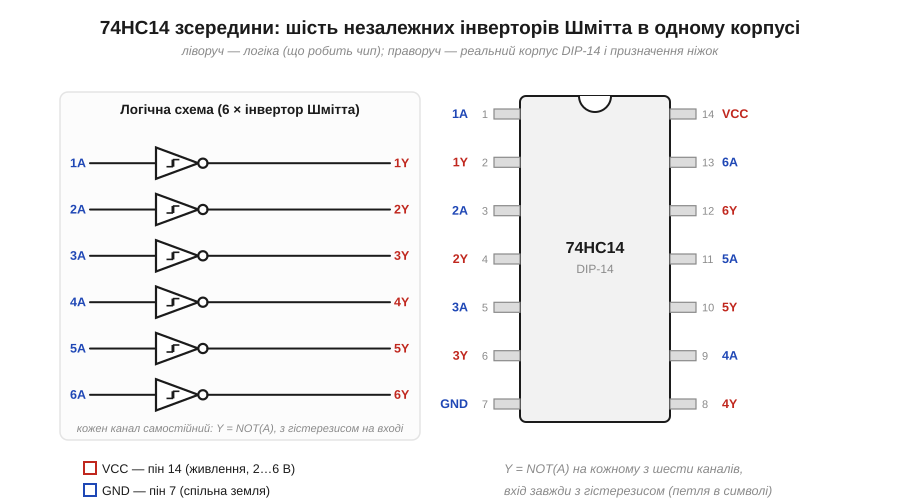
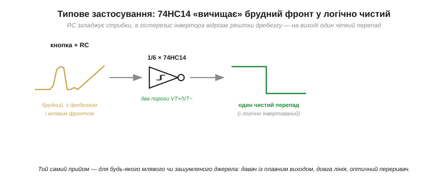

# 📜 Звідки взявся «тригер Шмітта»: кальмар, нерв і чесна історія назви

> Це історична частина 🔌-вставки до теми [§3.1.6 «Перетворення аналог→цифра на порозі»](logic-levels.md). У §3.1.6 ми вже зрозуміли, **що** робить гістерезис: два пороги VT+ і VT− замикають шум усередині «мертвої смуги». Тут — про те, **звідки** в цього прийому така назва й чому вона прив'язана до однієї людини, тоді як саме явище старіше за будь-яку електроніку. Технічну, практичну частину про мікросхему 74HC14 шукайте нижче, після риски.

Назва «тригер Шмітта» (*Schmitt trigger*) звучить так, ніби це чийсь патент чи фірмова марка. Насправді за нею стоїть жива історія про те, як спостереження за **нервом кальмара** перетворилося на схему, без якої сьогодні не обходиться жоден цифровий вхід. І, як майже завжди в електроніці, «винайшов» тут — слово неточне: ідею підказала природа, формалізував її студент, а в кремній її вклали вже інші інженери через десятиліття. Розплутаймо ці нитки чесно.

### Отто Шмітт і нерв, що вмикався «клац»

Отто Герберт Шмітт (*Otto Herbert Schmitt*, 1913–1998) — американський біофізик, а не «чистий» електронник, і це ключ до всієї історії. На початку 1930-х, ще аспірантом, він вивчав, **як нервовий імпульс біжить уздовж аксона**. Зручним об'єктом був гігантський аксон кальмара — нервове волокно настільки товсте, що в нього вдавалося застромити електроди (саме на цьому препараті пізніше виросла вся нейрофізіологія). Шмітта вразила одна річ: нерв не реагує на подразник плавно. Доки сигнал слабкий — мовчить; щойно той переступає поріг — спрацьовує різко, «клац», на повну, і вже не тремтить біля межі. Жива клітина поводилася саме як **пороговий вирішувач із запасом** — той самий, що нам потрібен на вході цифрової схеми.

Щоб відтворити цю поведінку на лабораторному столі й вивчати її кількісно, Шмітт побудував електронну схему-аналог на вакуумних лампах. Опис цього кола ввійшов у його докторську дисертацію 1937 року — «An electrical theory of nerve impulse propagation» («Електрична теорія поширення нервового імпульсу»). Сам прилад він спершу назвав сухо — **термойонним тригером** (*thermionic trigger*; «термойонний» — бо лампа емітує електрони гарячим катодом). Назва «тригер Шмітта» приклеїлася потім, уже стараннями колег і підручників, а не самого автора.

> 🔧 **Навіщо це.** Це не просто красива легенда. Вона пояснює, **чому** гістерезис настільки природний для будь-якого порогового рішення: жива система, якій мільярди років еволюції шліфували надійність у шумі, дійшла рівно до того самого прийому, що ми в §3.1.6 виводили з міркувань про завадостійкість. Коли наступного разу ставитимете на вхід елемент із петлею-символом, згадайте: ви копіюєте нерв.

### Чому «винайшов» — слово неточне: природа, теорія, кремній

Тут варто зупинитись і не повторити типову помилку підручників, які стискають усе до «Шмітт винайшов тригер у 1934-му». Розкладімо чесно, **що саме** зробив кожен учасник — бо інженерні «винаходи» майже завжди колективні, а дати в популярних джерелах гуляють.

Перше: саме **явище** гістерезису з додатним зворотним зв'язком Шмітт не вигадав — він **підгледів** його у природи й **формалізував** в електричному колі. Це чесніше формулювання, ніж «винайшов». Друге: дата. Часто пишуть «1934» (рік, коли Шмітт, за різними переказами, зібрав схему ще студентом), але єдиний твердий документ — це дисертація **1937** року; ранішу дату слід вважати правдоподібною, проте документально слабшою *(перевірити за первинними джерелами)*. Третє, і найважливіше для нас: між ламповою схемою Шмітта й мікросхемою 74HC14, яку ви тримаєте в руках, лежить **тридцять із гаком років** і праця зовсім інших людей — тих, хто переніс ідею спершу на транзистори, а тоді інтегрував її в кремній серій 7400 і 4000. Жодного з них «винахідником тригера Шмітта» не називають, хоч саме вони зробили його дешевим і повсюдним.

Є ще одна деталь, що багато говорить про самого Шмітта: він **не став домагатися грошей із цього винаходу** — упродовж життя його більше цікавили ідеї й методи, ніж патентна боротьба *(за біографічними нарисами; точний патентний статус різні джерела подають по-різному — перевірити)*. Тож коли ми кажемо «тригер Шмітта», ми вшановуємо людину, яка дала електроніці не патент, а **спосіб думати** про поріг.

### Біоміметика: коли інженер ходить учитися до природи

Історія Шмітта має ще й ширше відлуння, доречне для всього курсу. Саме Отто Шмітт згодом увів термін **біоміметика** (*biomimetics*) — інженерія, що свідомо **підглядає рішення в живої природи** замість винаходити їх з нуля. Тригер Шмітта — хрестоматійний приклад такого підходу: проблему «як надійно ухвалити рішення в шумі» природа розв'язала в нервовій клітині задовго до інженерів, а людина лише розпізнала готову відповідь і переклала її мовою схем. Для нас, у Модулі 3, це нагадування: багато «цифрових» ідей мають коріння поза електронікою — у математиці (Буль, Розділ 3.2), у логіці, а ось тут — у фізіології нерва.

---

# 🔌 74HC14: шість інверторів Шмітта — «чистильник» сигналів за пів долара

У §3.1.6 ми розібрали тригер Шмітта як **ідею**: гістерезис, два пороги, петля на передавальній характеристиці. Тепер — про найдешевший і найпоширеніший спосіб тримати цю ідею в руках. Якщо вам треба «вичистити» млявий чи зашумлений сигнал у чисту цифру, не пишучи ні рядка коду, відповідь майже завжди одна: мікросхема **74HC14**. Вона коштує копійки, ставиться на будь-яку макетну плату й робить рівно те, чого ми хотіли в §3.1.6 — загострює фронт і вбиває дребезг.

### Що це за клас пристрою

74HC14 — це **шестиканальний інвертувальний буфер із входами-тригерами Шмітта** (*hex inverting Schmitt-trigger*). Кожне слово тут робоче. «Інвертор» (*inverter*) — канал видає логічне заперечення: подали «1» — на виході «0», і навпаки (вентиль NOT, який ми докладно вивчимо в §3.2.2). «Шість» (*hex*) — таких незалежних інверторів у корпусі **шість**, кожен сам по собі. А найголовніше для нас — **«входи-тригери Шмітта»**: на вході кожного стоїть саме той гістерезис із §3.1.6, два пороги замість одного. Тобто 74HC14 — не «логіка для обчислень», а передусім **формувач сигналу**: шість маленьких чистильників в одному корпусі.

Літери теж не випадкові й читаються прямо з §3.1.4: **HC** означає «High-speed CMOS» — швидку КМОН-логіку, що живиться від 2 до 6 В і добре пасує до 5-вольтових і 3.3-вольтових систем. Є близький родич **74HCT14** з тих самих шести інверторів, але з вхідними порогами під старий TTL — про відмінність скажемо наприкінці, у варіаціях.

### Блок-схема: що всередині

Усередині корпусу немає нічого, крім шести однакових ланцюжків «вхід → тригер Шмітта → інвертор → вихідний буфер». Жодного спільного вузла, крім живлення й землі.


*Рис. 3.1.6c.1. Ліворуч — логіка: шість незалежних інверторів, у кожного на вході петля-символ гістерезису (той самий тригер Шмітта з §3.1.6). Праворуч — реальний корпус DIP-14: входи позначено nA, виходи nY, живлення VCC — пін 14, спільна земля GND — пін 7. Канали самостійні: можна задіяти один, а решту п'ять лишити вільними (але не «висіти» — про це в граблях).*

### Типова розпіновка

Розводка ніжок у 74HC14 — стандартна для всієї «чотирнадцятиногої» логіки, тож запам'ятавши її раз, ви впізнаєте сотні інших мікросхем. У звичному корпусі DIP-14 (чи його поверхневих родичах SOIC/TSSOP) пари «вхід–вихід» ідуть поряд:

```
        ┌───────∪───────┐
 1A  1 ─┤               ├─ 14  VCC   (живлення +2…6 В)
 1Y  2 ─┤               ├─ 13  6A
 2A  3 ─┤               ├─ 12  6Y
 2Y  4 ─┤    74HC14     ├─ 11  5A
 3A  5 ─┤               ├─ 10  5Y
 3Y  6 ─┤               ├─  9  4A
GND  7 ─┤               ├─  8  4Y
        └───────────────┘
```

Орієнтир на корпусі — **виїмка-ключ** (півколо) з одного торця: тримаючи її вгорі, пін 1 знаходимо ліворуч зверху, далі нумерація йде **проти годинникової** стрілки. Живлення завжди в одному кутку (пін 14, VCC), земля — навпроти по діагоналі (пін 7, GND). Шість входів — це піни 1, 3, 5, 9, 11, 13; шість виходів — 2, 4, 6, 8, 10, 12.

### Підключення

Завести 74HC14 в роботу гранично просто. **Живлення:** на пін 14 — ту саму напругу, що живить вашу логіку (зазвичай 3.3 В або 5 В), пін 7 — на спільну землю. **Обов'язково** поставте керамічний конденсатор 0.1 мкФ між VCC і GND **впритул** до корпусу — блокувальний (*decoupling*) конденсатор гасить кидки струму в момент перемикання; без нього швидка КМОН-логіка ловить власні наводки (мотивацію ми бачили в §3.1.5, говорячи про фронти). **Сигнал:** на будь-який вхід nA, очищений результат — з відповідного виходу nY. Пам'ятайте лише, що вихід **інвертований**: якщо інверсія заважає, пропустіть сигнал через **два** канали поспіль — подвійне заперечення повертає полярність, а гістерезис спрацьовує двічі.

### «Перший байт»: як змусити її заговорити

Найкрасивіший спосіб познайомитися з 74HC14 — навіть не подавати на неї сигнал ззовні, а змусити її **саму себе розгойдати**. Один інвертор, один резистор і один конденсатор утворюють **генератор прямокутних імпульсів** (*relaxation oscillator*) — повністю без кварцу, без коду, без мікроконтролера.


*Рис. 3.1.6c.2. Вихід інвертора через резистор R заряджає конденсатор C, під'єднаний до власного входу. Поки напруга Vc повзе вгору й росте до VT+ — вихід тримає високий рівень; щойно Vc проб'є VT+, вихід перекидається в низький і починає **розряджати** C — аж доки Vc впаде нижче VT−, і все повторюється. На вході — пилка між двома порогами, на виході — чистий меандр. Саме гістерезис робить цей цикл можливим: без двох порогів схема просто застрягла б посередині.*

Підключіть осцилограф (чи навіть світлодіод із резистором) до виходу — і побачите рівні імпульси. Період коливання задає добуток опору на ємність:

```
f ≈ 0.8 / (R · C)      (порядкова оцінка для 74HC14)
T = 1/f ≈ 1.2 · R · C

приклад:  R = 100 кОм = 1×10⁵ Ом
          C = 1 мкФ   = 1×10⁻⁶ Ф
          T ≈ 1.2 × 10⁵ × 10⁻⁶ ≈ 0.12 с   →   f ≈ 8 Гц, близько 8 блимань за секунду
```

Коефіцієнт наближений: точне число залежить від того, де саме лягли пороги VT+ і VT− конкретного екземпляра, тож різні джерела дають частоту в межах ≈ (0.8…1.2)/(R·C). Для прикидки цього досить. Хочете швидше блимання — зменшіть R чи C; хочете повільніше — збільшіть. Це і є ваш «перший байт»: схема ожила, і ви на власні очі бачите, як гістерезис із §3.1.6 перетворює плавний заряд конденсатора на чисті цифрові перепади.

Друге типове застосування — те, заради чого 74HC14 і ставлять найчастіше: **вичистити брудний сигнал**.


*Рис. 3.1.6c.3. Зліва — типовий «брудний» сигнал реального світу: млявий фронт із дребезгом (наприклад, від механічного контакту, згладженого RC-ланцюжком). Посередині — інвертор Шмітта з його двома порогами. Праворуч — на виході один чіткий перепад без жодного фантомного імпульсу (і логічно інвертований). Той самий прийом працює для будь-якого повільного чи зашумленого джерела.*

### Типові граблі

Попри простоту, на 74HC14 легко наступити на кілька класичних грабель — усі вони ростуть із природи КМОН-входу (§3.1.4).

- **Невикористані входи не можна лишати «в повітрі».** КМОН-вхід має дуже високий опір, тож вільний (*floating*) вхід ловить наводки, плаває біля порога й змушує внутрішні транзистори постійно перемикатися — чип гріється й шумить. Кожен незадіяний вхід nA **притягніть** прямо до VCC або до GND (можна навіть просто перемкнути на сусідній сигнал). Гістерезис тут не рятує: він приборкує шум на корисному фронті, але не утримує абсолютно вільний пін.
- **Гістерезис кінцевий, а не нескінченний.** Смуга VT+ − VT− у 74HC14 — близько 0.4…1.4 В залежно від живлення (за даташитом, при VCC = 4.5 В типово VT+ ≈ 2.4 В, VT− ≈ 1.4 В, тобто смуга ≈ 1 В). Якщо розмах шуму перевищує цю смугу — дребезг проб'ється і крізь Шмітт. Для дуже брудних сигналів спершу згладьте їх RC-фільтром, а вже потім подавайте на 74HC14 (саме цей дует «RC + Шмітт» і показано на Рис. 3.1.6c.3).
- **Пороги «плавають» від екземпляра й від напруги.** VT+ і VT− не фіксовані: вони зсуваються разом із VCC і трохи різняться від чипа до чипа. Не закладайтеся на точні їх значення — 74HC14 чудовий формувач, але **не** прецизійний компаратор. Потрібен точний поріг — беріть окремий компаратор з опорним джерелом (§2.8.7).
- **Швидкі фронти можуть «дзвеніти» на довгих доріжках.** Виходи HC мають круті фронти; на довгій лінії це збуджує дзвін (та сама проблема, що в §3.1.5). Лікується серійним резистором 22…33 Ом біля виходу.

### Варіації класу

74HC14 — лише один представник великого сімейства «гекс-Шміттів», і сусідів корисно знати. Найближчий — **74HCT14**: ті самі шість інверторів, але входи з нижчими, «TTL-сумісними» порогами, щоб надійно читати старі 5-вольтові TTL-сигнали (рівні TTL проти CMOS ми розбирали в §3.1.4). Сучасніший швидкий родич — **74LVC14** на нижчі напруги (аж до ~1.65 В) і часто з толерантністю входів до 5 В. Потрібен **не**інвертувальний варіант — є аналог із буферами замість інверторів. А коли шести каналів забагато — той самий тригер Шмітта випускають і поодинці, в крихітних корпусах на один-два вентилі. Принцип скрізь той самий — гістерезис із §3.1.6; різняться лише кількість каналів, рівні порогів і корпус.

Отже, 74HC14 — це той випадок, коли ціла теоретична тема §3.1.6 згортається в одну дешеву мікросхему: подав млявий чи брудний сигнал — зняв чисту цифру. Її варто тримати в шухляді як універсальний «чистильник», а коли далі (§4.4.5) ми візьмемося за **дребезг механічної кнопки**, вона буде одним із перших апаратних рішень, що спадуть на думку.
