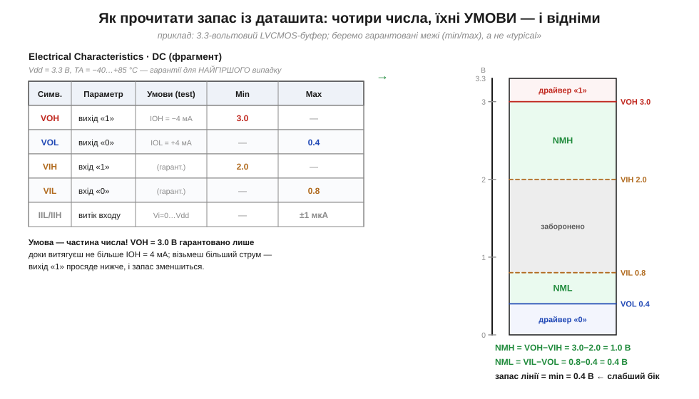
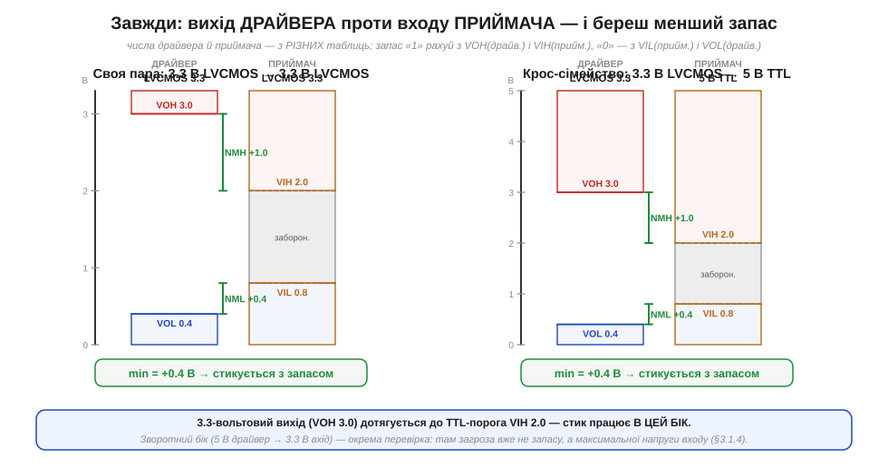

# 🧮 Бюджет завадостійкості: VOH/VOL/VIH/VIL і розрахунок noise margin з даташита

> Це математична вставка до [§3.1.3 «Запас завадостійкості»](logic-levels.md). Там ми вивели запас із чотирьох рівнів і записали NMH = VOH − VIH, NML = VIL − VOL. Та в тексті теми ці чотири числа були «прикладом, узятим зі стелі». Тут ми дістанемо їх там, де вони живуть насправді, — у таблиці даташита, — і доведемо розрахунок до кінця: з умовами тесту, з дисципліною «найгіршого випадку» і з найважчим практичним випадком, коли драйвер і приймач — з різних сімейств.

## Де живуть чотири числа: розділ DC Characteristics

Відкривши даташит будь-якої цифрової мікросхеми, ці чотири величини шукають в одному місці — у таблиці **електричних характеристик постійного струму** (*DC Electrical Characteristics*). Там кожен рядок — це **гарантія** виробника у формі «не менше / не більше» (стовпці **Min** і **Max**), а не одне «типове» число. Саме тому означення §3.1.3 беруть **граничні** значення: для одиниці драйвер обіцяє VOH(min) — найнижче, до якого «1» іще може просісти; для нуля він обіцяє VOL(max) — найвище, до якого «0» іще може піднятися; симетрично приймач вимагає VIH(min) і дозволяє VIL(max).


*Рис. 3.1.3m.1. Зліва — фрагмент таблиці DC Characteristics 3.3-вольтового LVCMOS-буфера; справа — ті самі чотири числа, перенесені на шкалу напруг, і обидва запаси між ними. Кожен рядок несе не лише значення, а й **умови тесту** (третій стовпець): VOH = 3.0 В гарантовано лише доти, доки з виходу витягають не більше IOH = 4 мА. Результат внизу: NMH = 1.0 В, NML = 0.4 В, тож стійкість лінії = min = 0.4 В.*

## Інтуїція: число без умови — не число

Головна пастка, через яку розрахунок «на папері сходиться, а в залізі ні», ховається в третьому стовпці — **умовах тесту** (*test conditions*). Рівень виходу — не стала властивість чипа, а **обіцянка за певних обставин**. VOH виміряний за конкретного **струму навантаження** IOH (його пишуть зі знаком мінус — струм *витікає* з виходу) і за конкретного живлення Vdd; VOL — за струму IOL, що *втікає* у вихід. Сенс простий: вихід — це не ідеальне джерело напруги, а транзистор зі скінченним опором у відкритому стані (згадаймо КМОН-пару з §2.7). Що більший струм крізь нього тягнуть, то більше падає на цьому опорі — і то ближче «1» сповзає до порога. Тому VOH = 3.0 В «за 4 мА» і VOH того самого чипа «за 20 мА» — **різні** числа, і друге помітно нижче. Брати рівень без його умови — однаково що цитувати ціну без валюти.

> 🔧 **Навіщо це.** Звідси правило, яке рятує реальні плати: рахуючи запас, **переконайся, що твій робочий струм не більший за той, за якого виміряний VOH/VOL**. Світлодіод, довга шина з підтяжками, кілька паралельних входів — усе це додає навантаження; перевищиш умову даташита — і гарантований рівень уже не гарантований, а запас, який ти порахував, фіктивний.

## Апарат: підставляємо й беремо мінімум

Коли всі чотири числа взяті за узгоджених умов (те саме Vdd, той самий діапазон температур, у межах дозволеного струму), решта — арифметика двох віднімань, як у §3.1.3:

```
NMH = VOH(min) − VIH(min) = 3.0 − 2.0 = 1.0 В
NML = VIL(max) − VOL(max) = 0.8 − 0.4 = 0.4 В
запас лінії = min(NMH, NML) = min(1.0, 0.4) = 0.4 В
```

Зверніть увагу: тут пороги **несиметричні** (це типова LVCMOS-картина з TTL-сумісними входами, а не «навчальні» рівні §3.1.3, де обидва запаси вийшли по 0.7 В). Через несиметрію один бік помітно слабший: запас нуля (0.4 В) удвічі з лишком менший за запас одиниці (1.0 В). А оскільки лінія настільки міцна, наскільки міцний її слабший бік, **стійкість усієї лінії визначає саме нуль** — 0.4 В. «Середнє» цих двох (0.7 В) звучало б оптимістично, та воно бреше: зрив прийде по нулю, тож у бюджет беруть **мінімум**, ніколи не середнє.

## Найважчий випадок: драйвер і приймач із різних сімейств

Доти ми мовчки припускали, що рівні беруть з **одного** даташита. Та найкорисніше — і найпідступніше — питання виникає, коли стикують **різні** чипи: тоді VOH/VOL читають з даташита **драйвера**, а VIH/VIL — з даташита **приймача**, і поєднують навхрест. Запас одиниці міряє, чи «1» драйвера дотягується до порога приймача; запас нуля — чи «0» драйвера достатньо низький для приймача:

```
NMH = VOH(драйвера) − VIH(приймача)
NML = VIL(приймача) − VOL(драйвера)
```


*Рис. 3.1.3m.2. Дві перевірки поряд. Ліворуч — своя пара (LVCMOS → LVCMOS): обидва запаси додатні, лінія стикується. Праворуч — крос-сімейний стик 3.3-вольтового LVCMOS-драйвера на вхід 5-вольтового TTL: VOH драйвера (3.0 В) бере з запасом TTL-поріг VIH (2.0 В), тож «1» проходить. В обох випадках вердикт дає **менший** із двох запасів.*

Саме так розрахунок ловить найклятішу категорію багів — несумісність рівнів. Якщо хоча б один із двох запасів виходить **від'ємним**, стик ненадійний: приймач читатиме рівень випадково, найчастіше «майже завжди працює», поки не зведуться докупи кілька дрібних завад. Якщо обидва додатні — пристрої «розуміють» одне одного на будь-яких екземплярах. Тут варто зробити одне чесне застереження, щоб не плутати дві різні небезпеки: цей розрахунок перевіряє **завадостійкість** (чи дотягуються рівні), а не **електричну цілість входу**. Зворотний стик (5-вольтовий драйвер на 3.3-вольтовий вхід) запас за «1» дав би з надлишком, та загроза там інша — завелика напруга на вході, яку без захисту вхід може не пережити. Це вже не про noise margin, а про допустиму напругу входу, і цим займається §3.1.4.

> 🔧 **Навіщо це.** Практичний підсумок вставки — звичка з трьох кроків, перш ніж з'єднати два цифрові піни. Перше: випиши з обох даташитів чотири числа **разом з умовами** (Vdd, струм, температура). Друге: підстав їх навхрест — VOH(драйв.) проти VIH(прийм.) і VIL(прийм.) проти VOL(драйв.) — і візьми **менший** із двох запасів. Третє: переконайся, що цей мінімум помітно більший за очікувані завади з бюджету §3.1.3. Якщо так — стик переживе і слабший чип, і трохи довший дріт. Якщо ні — потрібен зсувач рівнів, і краще дізнатися про це з арифметики, ніж із загадкового збою.
