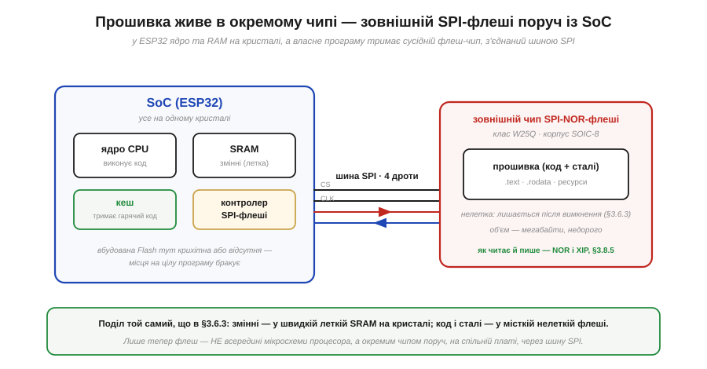
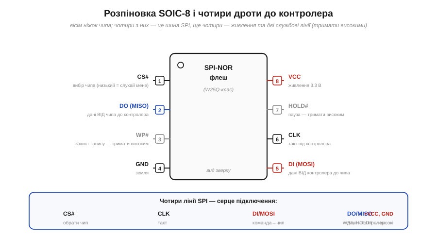
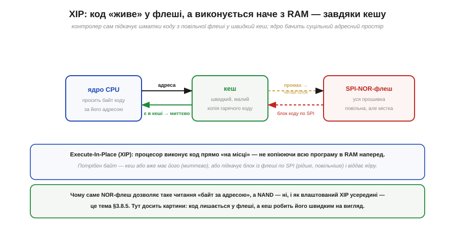

# 🔌 Чип W25Q-класу поруч із ESP32: де насправді живе прошивка

> Компонентна вставка до **теми [§3.6.3 «Flash vs RAM: постійне й тимчасове»](memory-stack-heap.md)**. У темі ми з'ясували, **чому** код і сталі мусять лежати в нелеткій Flash, а змінні — у леткій RAM. Та залишилося тихе припущення: ніби Flash сидить «усередині» процесора. На ESP32 це не зовсім так — і ця вставка показує, де прошивка живе фізично. Деталі самої NOR-технології та механізму XIP лишаємо на **§3.8.5**; тут — рівно стільки, щоб зрозуміти картину плати.

## Що це за клас пристрою

Беручи в руки плату на ESP32, поряд із самим процесорним чипом майже завжди бачимо ще одну маленьку чорну мікросхему на вісім ніжок. Це **зовнішня SPI-флеш** (*SPI flash*) — окремий чип нелеткої пам'яті, у якому й лежить уся ваша прошивка. Найпоширеніший клас таких чипів — **W25Q** (родина від Winbond), і саме його маркування — `W25Q32`, `W25Q128` — найчастіше трапляється на платах; число в назві — це об'єм у мегабітах (W25Q128 = 128 Мбіт = 16 МБ). Усередині — пам'ять типу **NOR** (*NOR flash*), а спілкується чип із процесором по тій самій шині **SPI**, що ми вже знаємо як спосіб з'єднати дві цифрові мікросхеми кількома дротами.

Постає природне запитання: навіщо окремий чип, якщо §3.6.3 малювала Flash просто як один із регіонів пам'яті МК? Бо вмістити багато нелеткої пам'яті **на одному кристалі** з процесором — дорого. Дешевше зробити кристал процесора компактним (ядро, трохи SRAM, контролери), а місткому сховищу коду відвести **сусідній спеціалізований чип**. Тому в ESP32 власної вбудованої Flash для програми обмаль або зовсім немає — її роль виконує цей зовнішній W25Q-клас (Рис. 3.6.3c.1).


*Рис. 3.6.3c.1. Поділ із §3.6.3 нікуди не зник — лише розклався на дві мікросхеми. У SoC (ESP32) на кристалі живуть ядро, летка SRAM (змінні), кеш і контролер SPI-флеші. Сама ж прошивка — код, сталі, ресурси — лежить у **зовнішньому** чипі NOR-флеші класу W25Q, з'єднаному з процесором шиною SPI на чотири дроти. Нелетке й містке — у флеші; швидке й тимчасове — у SRAM поруч із ядром.*

## Блок-схема й розпіновка

Корпус цього чипа — крихітний **SOIC-8** (вісім ніжок, *eight-pin*), і його виводи майже стандартні для всього класу, тож, навчившись читати один, ви читаєте їх усі. Чотири ніжки — це лінії шини SPI, ще чотири — живлення та дві службові лінії (Рис. 3.6.3c.2):

```
CS#  (ніжка 1) — Chip Select: вибір чипа, активний низький
DO   (ніжка 2) — MISO: дані ВІД чипа до контролера
WP#  (ніжка 3) — Write Protect: апаратний захист запису
GND  (ніжка 4) — земля
DI   (ніжка 5) — MOSI: дані ВІД контролера до чипа
CLK  (ніжка 6) — такт від контролера
HOLD#(ніжка 7) — пауза обміну
VCC  (ніжка 8) — живлення 3.3 В
```


*Рис. 3.6.3c.2. Вісім ніжок чипа. Чотири з них утворюють шину SPI: **CS#** (обрати чип), **CLK** (такт), **DI/MOSI** (команда йде до чипа), **DO/MISO** (дані йдуть назад до контролера). Решта чотири — живлення 3.3 В, земля та дві службові лінії **WP#** і **HOLD#**, які за звичайної роботи просто тримають високими. Решітка «#» біля назви означає «активний у нулі».*

## Підключення

Звідси й підключення виходить коротким — а найважливіше, що на платах ESP32 ця флеш уже **розведена на самій платі** до виводів SPI процесора: паяти нічого не треба, чип працює сам, і коли ви заливаєте скетч, він лягає саме сюди. Сам принцип з'єднання простий: чотири лінії SPI (CS#, CLK, DI, DO) йдуть до контролера, **VCC** — на 3.3 В, **GND** — на землю, а службові **WP#** і **HOLD#** підтягують до високого рівня, щоб вони не «плавали» й не заважали обміну. Біля ніжки VCC, як завжди для цифрового чипа, ставлять керамічний конденсатор 0.1 µF — підпору живлення на час швидких перемикань.

Одне варто підкреслити окремо — **рівні**: W25Q-клас живиться від 3.3 В, як і логіка ESP32. Тут немає мороки з 5-вольтовим світом — рідкісний випадок, коли про рівні (§3.1) можна не хвилюватися.

## Перший байт

Як «заговорити» з таким чипом? Базовий рух для будь-якого SPI-пристрою той самий: опустити **CS#** у нуль (обрати чип), подати по **CLK** такти, на кожному висунути біт команди по **DI** й одночасно прийняти біт відповіді по **DO**, а наприкінці підняти **CS#**. Найперша корисна команда — попросити чип назватися: він повертає свій **ідентифікатор** (*JEDEC ID*) — кілька байтів про виробника й об'єм пам'яті. Прийшли осмислені байти, а не суцільні нулі чи одиниці, — зв'язок є, чип живий.

Цього образу досить, щоб розуміти **картину**. А конкретні коди команд — як прочитати дані за адресою, як стерти й записати сторінку — це вже **протокол** флеші, і йому місце у Модулі 6 разом із самою шиною SPI; деталі читання NOR і режим XIP розбираємо в §3.8.5. Тут важить інше: за звичайної роботи ESP32 ви цих команд руками не пишете — їх шле **завантажувач** (*bootloader*) і вбудований контролер SPI-флеші, поки ви просто заливаєте скетч.

## XIP: чому код «живе» у флеші

Залишилося пояснити те, що спершу дивує. Якщо програма лежить у **зовнішній** флеші, а флеш повільна (§3.6.3), то як процесор виконує код достатньо швидко? Адже не копіює ж він мегабайти прошивки в крихітну SRAM. Відповідь — **XIP**, *Execute-In-Place*, «виконання на місці»: код **лишається** у флеші, а процесор виконує його прямо звідти, наче з пам'яті (Рис. 3.6.3c.3).


*Рис. 3.6.3c.3. XIP робить повільну зовнішню флеш на вигляд швидкою. Ядро просить байт коду за його адресою; між ядром і флешшю стоїть **кеш**. Якщо потрібний шматок уже в кеші — байт віддається миттєво. Якщо ні (промах) — контролер сам підкачує блок коду з флеші по SPI у кеш і віддає ядру. Часто потрібні шматки осідають у швидкому кеші, тож попри повільну флеш програма біжить жваво.*

Уся хитрість — у **кеші** (*cache*), невеликій швидкій пам'яті на кристалі, що тримає копії гарячих шматків коду. Контролер SPI-флеші підставляє флеш у загальний адресний простір, а кеш робить так, що ядро здебільшого працює зі швидкою копією й тягнеться до повільної флеші лише зрідка. Тому й кажуть, що код «живе» у флеші: він нікуди звідти не переїжджає, а кеш приховує, що під ним повільне сховище. Це елегантно змикається з §3.6.3: код **читають** мільйони разів і майже ніколи не **пишуть**, тож читати його прямо з нелеткої флеші — саме те, для чого вона добра.

> 🔧 **Навіщо це.** Тримайте в голові, що на ESP32 прошивка лежить у **зовнішньому** чипі флеші, а не «в процесорі». По-перше, **об'єм програми обмежений** саме цим чипом — коли проєкт «не влазить у Flash», ідеться про його ємність (часто 4 МБ), а поділ на розділи (*partitions*) — це поділ цього самого чипа. По-друге, **дані теж можна там зберігати** поруч із кодом (налаштування, файли) — але пам'ятайте про знос блоків із §3.6.3: часті записи зношують флеш так само. По-третє, коли бачите на платі другу восьминіжкову мікросхему біля ESP32 — тепер ви знаєте, де живе ваш код.

## Типові граблі

- **Сплутати об'єм у бітах і байтах.** `W25Q128` — це 128 **Мбіт**, тобто 16 **МБ**, а не 128 МБ. Число в назві завжди в мегабітах; ділимо на 8, щоб дістати байти.
- **Залишити WP# чи HOLD# «у повітрі».** Ці лінії активні в нулі; плаваючий вхід може випадково ввімкнути захист запису чи заморозити обмін. Якщо їх не задіюють — підтягують до високого рівня.
- **Очікувати швидкості RAM від коду в XIP.** Гарячий код із кешу швидкий, а перший доступ до «холодного» шматка тягне підкачку з повільної флеші по SPI й помітно повільніший. Це нормальна риса XIP, не несправність.
- **Сприйняти флеш як «диск» із вільним перезаписом.** Це NOR-флеш: писати можна лише в стертий блок, а стирання повільне й зношує комірки (§3.6.3). Журнали й лічильники, що міняються щосекунди, — робота для RAM, а не для цього чипа.
- **Здивуватися, що скетч пережив від'єднання живлення.** Так і має бути: чип нелеткий. Дивуватися варто радше зворотному — чому **змінні** обнуляються (бо вони в леткій SRAM, §3.6.3).

## Варіації класу

Маркування W25Q від Winbond найвідоміше, та клас широкий і сумісний на рівні базових команд: ту саму роль грають **GD25Q** (GigaDevice), **MX25** (Macronix), **EN25Q** (Eon) та інші **SPI-NOR**-чипи — той самий SOIC-8, та сама шина SPI, той самий принцип «прошивка тут, виконання через XIP»; різняться об'ємом, граничною частотою такту й дрібними деталями команд. Корисна можливість багатьох із них — **Quad SPI** (*QSPI*): замість одного дроту даних задіюють чотири паралельно, і читання прискорюється в кілька разів, що для XIP помітно. А коли коду чи даних треба **дуже** багато, на зміну NOR приходить **NAND-флеш** — інша будова, що жертвує зручністю заради ще більшого об'єму. Чим NOR відрізняється від NAND і чому саме NOR годиться для XIP — це і є тема **§3.8.5**, до якої ми тепер підготовлені.
