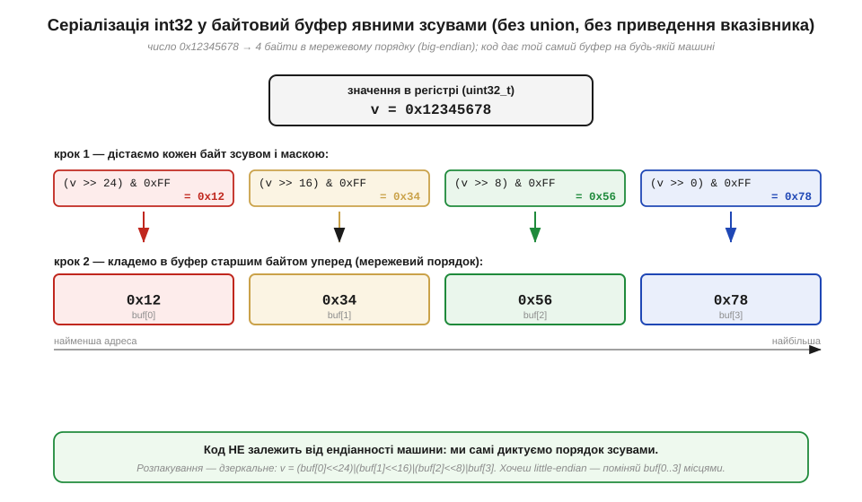
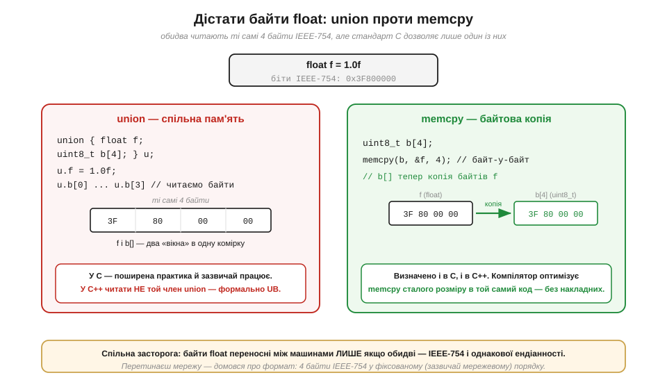

# Серіалізація чисел: пакуємо int32 і float у байти (union vs memcpy; мережевий порядок)

> ⚙️ Алгоритмічна вставка до теми [§3.4.7 «Біти, байти, слова й порядок байтів»](number-representation.md). Там ми вивели **золоте правило**: збирати багатобайтове число з окремих байтів треба **явними зсувами** (`hi<<8 | lo`), а не приведенням вказівника, бо приведення наражає на ендіанність, вирівнювання й суворе аліасування. Те правило ми застосували до однієї величини, що «прийшла» двома байтами з давача. Тут робимо наступний крок — повертаємо рух у зворотний бік: треба не **зібрати** число з байтів, а **розкласти** ціле чи дробове число **на** байти, щоб відправити його в мережу, записати у файл чи в кадр протоколу. Ця операція зветься **серіалізацією** (*serialization*), і на ній сходяться три нитки розділу: зсуви й маски (§3.4.2), бітова розкладка `float` (§3.4.6) і порядок байтів (§3.4.7).

## Задача

Уявімо типову ситуацію: мікроконтролер виміряв температуру (32-бітне ціле в сотих градуса) і коефіцієнт калібрування (`float`) — і має надіслати їх по UART, Wi-Fi чи в лог-файл. Канал передає **байти**, не «числа»: на тому кінці дроту чи у файлі лежить рівний потік октетів (байтів), один за одним. Тож обидві величини доведеться **розкласти** на байти на одному кінці й **зібрати** назад на іншому. І тут одразу спливає засторога з §3.4.7: відправник і отримувач можуть мати **різну** ендіанність (ваш ESP32 — little-endian, а сервер на умовному SPARC — big-endian), а `float` ще й передбачає, що обидві сторони розуміють біти однаково (IEEE-754). Наївне «скопіюю чотири байти змінної як є» дасть на тому кінці число задом наперед — рівно той клас багів, що ми обіцяли уникати. Наша мета — **переносний** пакувальник: він кладе int32 і float у буфер у **домовленому** порядку, не покладаючись на розкладку пам'яті конкретної машини.

## Ідея

Для **цілого** рецепт уже майже готовий — це золоте правило §3.4.7, лише обернене. Замість того щоб *читати* байти з пам'яті в невідомому порядку, ми самі **диктуємо** порядок зсувами: старший байт дістаємо як `(v >> 24) & 0xFF`, наступний — `(v >> 16) & 0xFF`, і так до молодшого. У який слот буфера покласти який байт — то наш вибір, і саме він задає ендіанність на дроті. Оберемо **мережевий порядок** (*network byte order*) — big-endian, старший байт за найменшою адресою, — бо так домовилися протоколи інтернету (§3.4.7).


*Рис. 3.4.7a.1. Число 0x12345678 розкладається на чотири байти зсувами й маскою (крок 1), а тоді лягає в буфер старшим байтом уперед (крок 2). Колір простежує кожен байт: 0x12 (червоний) — у `buf[0]`, 0x78 (синій) — у `buf[3]`. Код жодного разу не питає, яка ендіанність у машини: порядок задають **зсуви**, тож результат однаковий і на little-, і на big-endian. Розпакування — дзеркальне складання тими ж зсувами.*

З **`float`** складніше: над ним не можна робити зсуви — `>>` для дробового типу в C не визначений. Але ж ми знаємо з §3.4.6, що `float` — це ті самі чотири байти (знак, порядок, мантиса за IEEE-754); треба лише **дістатися до них як до байтів**, не змінивши жодного біта. Тут і виникає класична розвилка C: **union проти memcpy**.


*Рис. 3.4.7a.2. Два способи прочитати байти `float`. Зліва — **union**: float і масив байтів ділять одну комірку пам'яті, тож запис у `.f` одразу «видно» крізь `.b[]`. Зручно й популярно, та читати **не той** член, у який писали, формально дозволено лише в C — у C++ це невизначена поведінка. Справа — **memcpy**: побайтова копія `&f` у масив; визначено і в C, і в C++, а компілятор для сталого розміру перетворює виклик на той самий код без накладних. Спільна засторога — внизу: байти `float` переносні між машинами **лише** якщо обидві IEEE-754 і однакової ендіанності.*

Ключова відмінність — у тому, що каже **стандарт**. `union` спирається на «type punning»: пишемо в один член, читаємо інший. У C це з певними застереженнями дозволено, у C++ — ні (формально UB). `memcpy(b, &f, sizeof f)` натомість визначений завжди: він просто копіює байти, а компілятор GCC/Clang при сталому розмірі «бачить» це наскрізь і генерує те саме, що й union, — тобто переносність дається задарма. Тому канонічна порада: **для серіалізації float бери memcpy**, а вже діставши чотири байти, ставиш їх у буфер у тому ж мережевому порядку, що й для цілого.

## Псевдокод

Складемо обидва пакувальники в мережевий порядок. `buf` — масив байтів, `off` — поточне зміщення в ньому; усе ціле, жодного дотику до ендіанності машини:

```
function put_u32_be(buf, off, v):       # v — 32-бітне ціле
    buf[off+0] = (v >> 24) & 0xFF        # старший байт — першим (big-endian)
    buf[off+1] = (v >> 16) & 0xFF
    buf[off+2] = (v >>  8) & 0xFF
    buf[off+3] = (v >>  0) & 0xFF

function get_u32_be(buf, off):           # дзеркально: збираємо назад
    return (buf[off+0] << 24) | (buf[off+1] << 16)
         | (buf[off+2] <<  8) |  buf[off+3]

function put_f32_be(buf, off, f):        # float — через байти, не через зсув
    uint8 tmp[4]
    memcpy(tmp, &f, 4)                    # дістали байти IEEE-754, не чіпаючи бітів
    # tmp лежить у ПОРЯДКУ ПАМ'ЯТІ машини → вирівнюємо до мережевого:
    if host_is_little_endian:
        reverse(tmp)                      # 4 байти задом наперед
    copy tmp[0..3] → buf[off..off+3]
```

Зверніть увагу на головний нюанс `float`: `memcpy` віддає байти **в порядку пам'яті машини**, тож на little-endian їх ще треба **розвернути**, щоб на дроті був мережевий порядок. Для цілого розвороту не потрібно — там байти диктують **зсуви**, які не залежать від машини. Це та сама ідея, що в `htons`/`htonl` із §3.4.7: на big-endian машині розворот — порожня операція, на little-endian — переставляння байтів; обидва шляхи дають однаковий буфер.

Тут доречно нагадати, **звідки** взялася сама конвенція мережевого порядку — і чому вона big-endian. Це не примха: коли на початку 1980-х будували стек TCP/IP, у грі були машини обох ендіанностей, і котрусь треба було оголосити «спільною мовою дроту». Big-endian закріпили в ранніх специфікаціях інтернету (його так і називають — *network byte order*); тоді ж, у статті Денні Коена «On Holy Wars and a Plea for Peace» (1980, §3.4.7), і прозвучав заклик просто **домовитися**. Звичні функції-перетворювачі `htonl`/`ntohl` прийшли з **сокетів Берклі** (*Berkeley sockets*) — мережевого API, що його створила група CSRG у Каліфорнійському університеті в Берклі для **4.2BSD** (1983) і яке згодом стало галузевим стандартом (*перевірити точні дати й авторство конкретних функцій*). А для складніших структур (не одне число, а цілий запис) Sun Microsystems тоді ж стандартизувала окремий формат серіалізації — **XDR** (*External Data Representation*), теж big-endian, що ліг в основу RPC і мережевих файлових систем. Тобто наш «мережевий порядок» — це колективна інженерна домовленість кількох команд, а не винахід однієї особи.

## Складність і пастки на МК

**Вартість — O(1) на число:** для цілого це чотири зсуви, чотири маски й чотири записи; для `float` — копія чотирьох байтів і, можливо, їх розворот. На будь-якому ядрі це одиниці тактів. Дешевизна, проте, оманлива — кілька характерних грабель на мікроконтролері варто знати наперед.

- **Цілочислове підвищення в зворотному складанні.** Збираючи `get_u32_be`, пишемо `buf[0] << 24` — а `buf[0]` має тип `uint8_t`, який у виразі підвищується до `int` (це ми вже бачили у вставці [§3.4.4](proj-overflow-checks.md)). Зсув `<< 24` 8-бітного значення, підвищеного до **знакового** 32-бітного `int`, може зачепити знаковий біт — формально UB. Лікують приведенням до `uint32_t` **перед** зсувом: `((uint32_t)buf[0] << 24)`. Класична тиха пастка переносності.
- **memcpy, а не приведення вказівника.** Спокуса написати `uint32_t v = *(uint32_t*)buf;` повертає всі три біди з §3.4.7 одразу: ендіанність, **вирівнювання** (буфер може стояти за непарною адресою — апаратний виняток на ARM) і **суворе аліасування** (компілятор має право переставити такий доступ). `memcpy` обходить усі три: він не вимагає вирівнювання й не порушує аліасування, а оптимізатор усе одно згортає його в одну-дві інструкції.
- **`sizeof(float)` — припущення, не гарантія.** Код вище мовчазно вважає, що `float` — це 4 байти IEEE-754. На масових МК (ESP32, ARM Cortex-M) так і є, але переносний серіалізатор варто захистити `static_assert(sizeof(float) == 4)`, щоб на екзотичному ядрі складання не дало тихого сміття.
- **Підписуй формат, а не лише байти.** Навіть бездоганний пакувальник марний, якщо отримувач не знає **угоди**: скільки байтів, у якому порядку, ціле чи float, зі знаком чи без. Це наскрізна думка §3.4.7 — біти не мають вродженого сенсу. Тож формат кадру (порядок полів, ендіанність, розрядність) фіксують у **специфікації протоколу** обабіч, а не лишають «як вийшло в пам'яті».

> 🔧 **Навіщо це.** Серіалізація — це міст між «числами в пам'яті» й «байтами на дроті», і будь-який мережевий чи файловий код починається саме з неї. Винесіть головне. Перше: **ціле** пакуйте **зсувами** (`(v>>24)&0xFF` …) — так ви самі диктуєте порядок, незалежно від ендіанності машини; складаючи назад, приводьте байт до `uint32_t` **перед** зсувом. Друге: **float** не зсунеш — діставайте його байти через **`memcpy`** (а не union і не приведення вказівника): це визначено в C і C++, обходить вирівнювання й аліасування, а компілятор робить його безкоштовним. Третє: на дроті тримайте **мережевий порядок** (big-endian) — спадок BSD-сокетів і TCP/IP; на little-endian машині float-байти перед відправкою **розверніть** (та сама логіка, що `htonl`). І головне: **домовтеся про формат** обабіч — більшість багів серіалізації це не математика, а розбіжність відправника й отримувача в порядку та розрядності полів.
