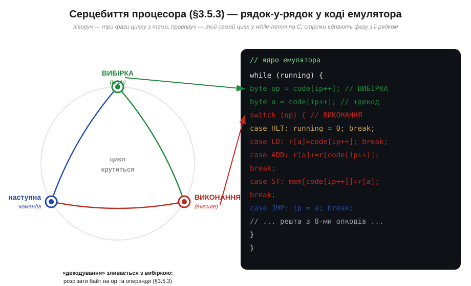
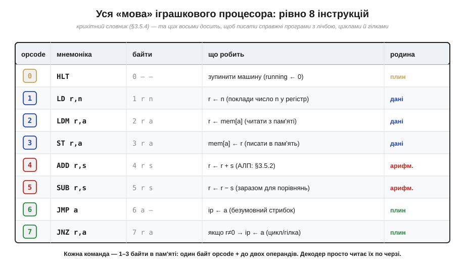
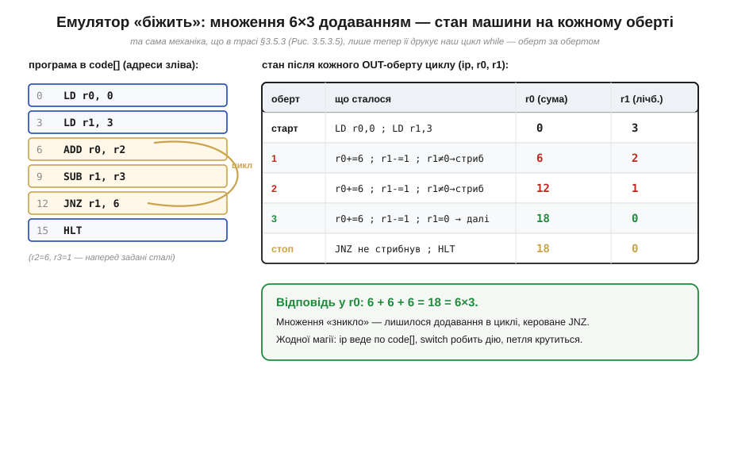

# ⚙️ Іграшковий процесор-емулятор: 8 інструкцій і цикл fetch–decode–execute у 100 рядків C

> Алгоритмічна вставка до теми [§3.5.3 «Цикл вибірка → декодування → виконання»](processor-architecture.md). У §3.5.3 ми побачили серцебиття процесора **зсередини заліза**: PC дає адресу, шина несе команду, декодер її розбирає, АЛП рахує. Тут зробимо те саме **в коді**: напишемо крихітну програму, яка сама грає роль процесора — читає байти-команди з масиву й виконує їх. Коли той самий цикл, що ви бачили на схемах, проступить як звичайна `while`-петля на C, остання таємниця «як програма біжить» зникне остаточно.

### Задача: зробити процесор, якого можна потримати в руках

Схема серцебиття з §3.5.3 переконлива, та вона лишається **картинкою**. Легко кивати головою, дивлячись на стрілки «вибірка → декодування → виконання», і все одно мати в голові тонкий серпанок магії: ну добре, дроти, такти — а **де саме** число-команда перетворюється на дію? Найнадійніший спосіб прогнати цей серпанок — побудувати процесор, який **виконується на іншому процесорі**: емулятор. Це програма, що тримає в собі модель машини (її регістри, пам'ять, лічильник команд) і чесно крутить той самий цикл, тільки кожен його крок — це рядок коду, який можна прочитати, поставити на паузу й роздрукувати. Мета скромна й тому досяжна: **8 інструкцій і повний цикл fetch–decode–execute приблизно у 100 рядків C** — щоб уся «магія» вмістилася на одному екрані.

### Ідея: пам'ять — це масив, цикл — це while, декодер — це switch

Уся хитрість у тому, щоб помітити, як прямо органи процесора з §3.5.2 лягають на звичайні конструкції мови. Пам'ять — це просто **масив байтів** `code[]`: адреса комірки — це індекс у масиві. Регістри — маленький масив `r[]` на кілька чисел. Лічильник команд PC — це звичайна змінна-індекс `ip` (*instruction pointer*), що вказує, який байт читати наступним. А серцебиття — це **`while`-петля**, що крутиться, доки машина «жива».


*Рис. 3.5.3a.1. Ліворуч — три фази циклу з §3.5.3; праворуч — той самий цикл як `while`-петля. **Вибірка** — це `code[ip++]`: узяти байт за лічильником і одразу зсунути лічильник (те саме «PC += 1»). **Декодування** зливається з вибіркою: прочитаний байт — це opcode, наступні — операнди. **Виконання** — це `switch(op)`: кожна гілка `case` робить дію однієї команди. Коло замикається само, бо `ip` уже вказує на наступну команду.*

Декодування варте окремого слова, бо саме воно здавалося найзагадковішим. У залізі декодер — це велика комбінаційна схема (§3.5.3), що зіставляє біти opcode з дротами, які треба ввімкнути. У коді ця сама ідея стискається до одного **`switch`**: число-команда обирає, яка гілка `case` виконається. «Зіставити команду з дією» і «обрати гілку switch за числом» — це буквально одне й те саме, лише раз у кремнії, а раз у C. Ось де серпанок розвіюється: ніякої магії в декодуванні немає — є таблиця відповідностей «число → що робити».

Тепер словник нашої машини. Він **навмисне крихітний** — рівно вісім команд, як обіцяє §3.5.4 («процесор знає мало примітивів»), і цього вистачає на справжні програми.


*Рис. 3.5.3a.2. Уся ISA (§3.5.4) іграшки: вісім опкодів 0–7, по чотири родини з §3.5.4. **Дані**: LD (поклади число), LDM/ST (читай/пиши пам'ять). **Арифметика**: ADD, SUB (рахує АЛП, §3.5.2). **Керування плином**: JMP, JNZ (стрибки — запис у `ip`), HLT (стоп). Кожна команда — 1–3 байти: opcode плюс до двох операндів, рівно як «число з полів» у §3.5.4.*

### Псевдокод: ядро емулятора

Серце всього — десяток рядків. Решта зі «100» — це оголошення масивів, завантаження програми та друк стану; справжній **двигун** ось:

```
r[4] = {0}            // регістри загального призначення (§3.5.2)
mem[256] = {0}        // пам'ять для даних
code[]                // програма: потік байтів-команд
ip = 0                // лічильник команд PC (§3.5.2)
running = 1

while (running):                       // ── серцебиття (§3.5.3) ──
    op = code[ip]; ip = ip + 1         // ВИБІРКА: байт за PC, PC += 1
                                       // ДЕКОДУВАННЯ + ВИКОНАННЯ:
    switch (op):
        case LD:  d=code[ip++]; n=code[ip++];  r[d] = n
        case LDM: d=code[ip++]; a=code[ip++];  r[d] = mem[a]
        case ST:  s=code[ip++]; a=code[ip++];  mem[a] = r[s]
        case ADD: d=code[ip++]; s=code[ip++];  r[d] = r[d] + r[s]
        case SUB: d=code[ip++]; s=code[ip++];  r[d] = r[d] - r[s]
        case JMP: a=code[ip++];                ip = a
        case JNZ: s=code[ip++]; a=code[ip++];  if r[s] != 0: ip = a
        case HLT:                              running = 0
```

Придивіться, як кожна гілка — це дослівний переклад фази «виконання» з §3.5.3. ADD бере два регістри й кладе суму назад — це наша АЛП. JMP пише нову адресу в `ip` — це той самий «стрибок є запис у PC» з §3.5.2. JNZ робить це **за умовою** (`r[s] != 0`) — і ось вам розгалуження й цикли, на яких тримається будь-який алгоритм (§3.5.1). Усе, що ми малювали стрілками, тепер виконується присвоєннями.

Лишилось побачити двигун **у русі** — бо саме рух і переконує. Проженемо програму, яка множить 6 на 3, хоча команди «помножити» в наборі **немає**: множення тут — це додавання в циклі, рівно як на ранніх машинах.


*Рис. 3.5.3a.3. Ліворуч — програма в `code[]` за адресами; жовтим — тіло циклу (ADD, SUB, JNZ). Праворуч — стан машини після кожного оберту: r0 (сума) і r1 (лічильник) крок за кроком. JNZ повертає `ip` на адресу 6, поки r1 не дійде нуля; тоді стрибок не спрацьовує, машина доходить до HLT — і у r0 лежить 18 = 6×3. Та сама траса, що в §3.5.3 (Рис. 3.5.3.5), лише тепер її крутить наш `while`.*

### Складність і пастки на МК

Час роботи такого емулятора лінійний — **O(виконаних команд)**: одна ітерація `while` на кожну команду, кожна гілка `switch` — кілька дій сталого часу. Це робить його ідеальним навчальним інструментом, та варто чесно знати **ціну** й **межі** підходу, особливо коли йдеться про мікроконтролер.

- **Емуляція дорога: десятки реальних команд на одну змодельовану.** Кожна команда іграшки — це вибірка, `switch`, кілька присвоєнь, тобто **багато** машинних команд реального процесора. Тому емулятор повільніший за «голе» залізо у десятки разів. На ПК це непомітно, а от на МК — пряма межа: інтерпретувати чужий код у циклі коштує тактів, і для чогось швидкого вже потрібні хитрощі (таблиця переходів замість довгого `switch`, компіляція в рідний код). Для навчання й нечастих сценаріїв простий цикл — ідеальний; для гарячого шляху — ні.
- **`switch` — це і є декодер; його повнота критична.** Якщо у потік потрапить байт, для якого немає гілки `case`, машина не знатиме, що робити. На ПК рятує `default`, що чесно повідомить про збій. На МК такий «невідомий opcode» — це модель реальної біди з §3.5.3: коли PC потрапляє на сміття замість команди, процесор виконує казна-що. Завжди майте гілку `default`, що зупиняє машину з помилкою, а не «проковтує» невідоме мовчки.
- **`ip` нічим не обмежений — стережіться виходу за межі.** У моделі `ip` — простий індекс, і ніщо не заважає йому переповзти за кінець `code[]` чи стрибнути на безглузду адресу (хибний операнд JMP). На ПК це впіймає перевірка меж; на МК **вихід за межі масиву — мовчазне псування пам'яті**, найгидкіший клас багів. Тримайте `ip` і всі адреси в межах розміру масивів явною перевіркою — модель тут вчить тієї самої обережності, що знадобиться з реальними вказівниками в Модулі 4.
- **Розрядність і ширина типів.** Іграшка лічить у простих цілих, та на реальному 8-бітному наборі регістр — це один байт, і `r[d] + r[s]` мусить **переповнюватися** за модулем 256, як у §3.4.4. Якщо моделюєте конкретну машину, беріть для регістрів тип потрібної ширини (`uint8_t`), інакше ваш емулятор «рахуватиме» точніше за оригінал — і розійдеться з ним саме там, де справжнє залізо переповнюється.

Отже, іграшковий емулятор — це місток від схеми до коду: пам'ять стає масивом, лічильник команд — індексом `ip`, серцебиття §3.5.3 — петлею `while`, а декодер — одним `switch`. Вісім команд і десяток рядків двигуна виконують справжні програми з лічбою, циклами й гілками — і роблять це у вас на очах, крок за кроком. Магії в «оживленні програми» немає: є масив байтів, індекс, що ним повзе, і таблиця «число → дія», що крутиться, поки не трапиться HLT. Саме це й робить кремній, лише в мільярди разів швидше.
