# Розділ 3.7 — Програмована логіка: ПЛІС/FPGA

Увесь Модуль 3 ми будували один тип машини — **процесор**, що бере інструкції з пам'яті й виконує їх **одну за одною**: вибірка, декодування, виконання (§3.5.3). Це гнучко до неможливого: змінив програму — і та сама залізяка робить геть інше. Та за гнучкість плачено фундаментальною ціною: процесор **послідовний**. Скільки б трюків ми не додавали — конвеєр (§3.5.6), вищу частоту (§3.5.5), кілька ядер — у кожен момент одне ядро тягне по суті одну дію за такт. А що, коли дій потрібно **тисячі за такт**? Коли потік даних летить швидше, ніж процесор устигає його навіть прочитати? Коли реакція потрібна не «за сто тактів», а за **кілька наносекунд**?

Тоді на сцену виходить інша ідея: не **виконувати** опис обчислення крок за кроком, а **збудувати під нього схему** — стільки паралельних шматків заліза, скільки треба, усі працюють водночас. Саме це дає **програмована логіка**, вершина якої — **ПЛІС**, або **FPGA** (*field-programmable gate array*, програмована вентильна матриця). Це мікросхема, чию **схему** — а не програму — задають уже після випуску чипа: заливаєш у неї опис — і вона **стає** потрібною цифровою схемою, хоч фільтром сигналу, хоч контролером дисплея, хоч цілим процесором.

Цей розділ — про те, як таке взагалі можливе. Ми почнемо з **мотивації**: чому послідовний процесор іноді програє і де паралельність у залізі рятує (§3.7.1). Простежимо **родовід** програмованих чипів — від простих матриць PAL до сучасних FPGA (§3.7.2). Розберемо центральну цеглинку — **LUT**, таблицю істинності замість вентилів (§3.7.3), і зазирнемо всередину чипа: логічні блоки, маршрутизація, блочна пам'ять, DSP (§3.7.4). Побачимо, як схему **описують** мовою HDL (§3.7.5) і яким **потоком інструментів** опис перетворюється на конфігурацію чипа (§3.7.6). Дійдемо до **таймінгу** — що насправді обмежує частоту (§3.7.7). І, нарешті, чесно зважимо: **FPGA чи мікроконтролер** (§3.7.8) — і коли всередину FPGA має сенс покласти **процесор** (§3.7.9). Усе спирається на вже пройдене: вентилі (§3.2), тригери й тактування (§3.3), числа (§3.4), архітектуру процесора (§3.5) і пам'ять (§3.6).

> 📜 **Перед матеріалом — історія:** [Фріман, Вондершмітт і Барнетт засновують Xilinx (1984–85)](r07-history-xilinx.md). Вона розповідає, як трійця інженерів пішла з National Semiconductor, щоб зробити дивну на той час річ — чип без власної логіки, якому **схему завантажують, як програму**, — і заклала цілу індустрію, без якої сьогодні не обходяться ні зв'язок, ні відео, ні наукові прилади.

---

## 3.7.1 Навіщо програмована логіка: паралельність у залізі

Перш ніж розбирати, **як** улаштована FPGA, треба чесно відповісти на питання **навіщо**. Адже ми щойно витратили цілий модуль на процесор — машину, що вміє виконати **будь-який** алгоритм. Якщо вона універсальна, навіщо взагалі щось іще? Відповідь схована в одному слові, яке ми досі обходили: процесор робить усе **по черзі**. Поки роботи небагато або вона некваплива, цього досить. Та є цілий клас задач, де послідовність — це стіна, об яку розбивається будь-яка тактова частота. Саме там народжується потреба в іншому підході, і цей підрозділ — про те, у чому полягає ця стіна й чому паралельне залізо її обходить.

### Корінь проблеми: один за одним у часі

Згадаймо, що насправді відбувається в процесорі (§3.5.3). У кожен такт він робить **одну** елементарну дію: дістати команду, додати два числа, записати результат. Конвеєр (§3.5.6) дозволяє перекрити сусідні стадії, кілька ядер додають кілька паралельних потоків — але порядок величини незмінний: **одна арифметична операція на ядро за такт**. Якщо задача вимагає мільярда операцій за секунду, а ядро дає двісті мільйонів, ніяка майстерність програміста цього не подолає — бракує тактів.


*Рис. 3.7.1.1. Процесор розкладає роботу в **часі**: одна АЛП виконує крок за кроком, N дій — за N тактів. FPGA розкладає ту саму роботу в **просторі**: N окремих апаратних блоків, кожен зі своєю логікою, отримують входи одночасно й дають усі N результатів за **один** такт. Перше — швидке перемикання однієї залізяки; друге — багато залізяк нараз.*

Ось і вся суть протиставлення, і її варто закарбувати, бо з неї випливає весь розділ. **Процесор торгує простором за час**: маленьке ядро, зате багато тактів. **FPGA торгує часом за простір**: один такт, зате багато заліза. Коли роботи мало, виграє процесор — навіщо будувати сто суматорів, якщо один упорається за сто тактів. Та коли роботи **багато й вона однотипна**, картина перевертається: сто суматорів видадуть усе за такт, а одне ядро захлинеться. Питання лише в тому, де проходить межа — і відповідь, на щастя, не туманна, а арифметична.

### «Не встигає по тактах» — це проста лічба

Розмова «процесор не встигає» звучить розпливчасто, поки її не перевести в числа. А переводиться вона легко, бо швидкодія будь-якої цифрової машини — це добуток двох множників: **скільки операцій вона робить за такт** і **скільки тактів має за секунду**.

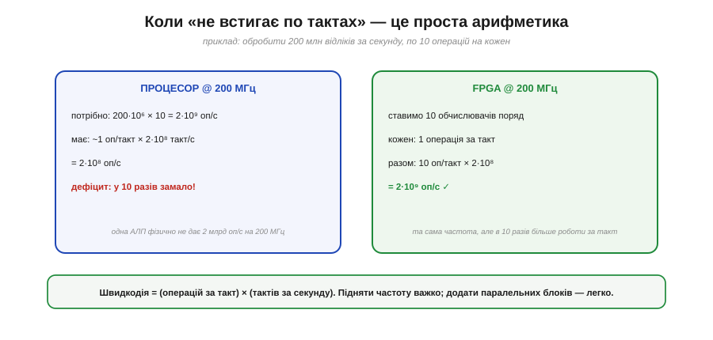
*Рис. 3.7.1.2. Та сама задача — 200 млн відліків за секунду по 10 операцій кожен (2 млрд оп/с). Процесор на 200 МГц дає ~1 операцію за такт = 2·10⁸ оп/с — у десять разів замало. FPGA на тій самій частоті ставить 10 обчислювачів поряд: 10 операцій за такт × 2·10⁸ тактів = 2·10⁹ оп/с. Частота однакова — різниця лише в кількості заліза, що працює водночас.*

Зверніть увагу, що FPGA на рисунку виграла **не частотою** — вона навіть не вища. Виграла шириною: десять обчислювачів замість одного. І це ключ до всього: підняти частоту дуже важко (заважає фізика — §3.3.8, і ми ще повернемось до цього в §3.7.7), а **додати паралельних блоків** — легко, поки на кристалі є місце. Тому коли процесор упирається в стелю, відповідь FPGA — не «крутитися швидше», а «робити більше за один оберт». Швидкодія росте не від поспіху, а від ширини.

> 🔧 **Навіщо це.** Перша практична користь — уміти **прикинути наперед**, чи впорається процесор. Помножте потрібну кількість операцій на секунду й порівняйте з добутком «частота × операцій за такт» вашого ядра. Якщо бюджету бракує в рази — ніяка оптимізація коду не врятує, потрібне інше залізо. Це рятує від тижнів марних спроб «дотиснути» прошивку там, де задача фізично не лягає на одне ядро.

### Друга перевага: мала й передбачувана затримка

Пропускна здатність — не єдине, чим бере паралельне залізо. Є друга річ, часто навіть важливіша в керуванні: **затримка реакції** (*latency*) — скільки часу мине від «вхідний сигнал змінився» до «вихід відреагував». І тут процесор програє не лише в швидкості, а й у **сталості** цієї затримки.


*Рис. 3.7.1.3. Щоб зреагувати на зовнішній сигнал, процесор має перервати поточну роботу, зберегти стан і виконати код-обробник — десятки чи сотні тактів, і час «плаває» залежно від того, чим ядро було зайняте (джитер). FPGA проводить сигнал крізь кілька вентилів напряму: одиниці–десятки наносекунд, і **такт у такт однаково**.*

Різниця тут не кількісна, а якісна. Процесор реагує на подію через механізм переривань (його ми докладно розберемо в наступному модулі): треба кинути те, що робив, запам'ятати, де спинився, стрибнути в обробник — і лише потім зреагувати. Це не тільки повільно, а й **непостійно**: якщо ядро саме було зайняте чимось критичним, відповідь спізниться. У FPGA ж вихід — це просто результат комбінаційної схеми (§3.2.6) від входу; він з'являється рівно за час прольоту крізь вентилі, завжди той самий. Там, де важлива не середня швидкість, а **гарантія** «не пізніше ніж за стільки-то наносекунд», паралельне залізо поза конкуренцією.

### Де ця перевага вирішує

Абстрактні «пропускна здатність» і «затримка» стають відчутними, щойно глянути на типові задачі, заради яких беруться за FPGA. У всіх них спільне: потік даних надто широкий або реакція потрібна надто рання для одного ядра.

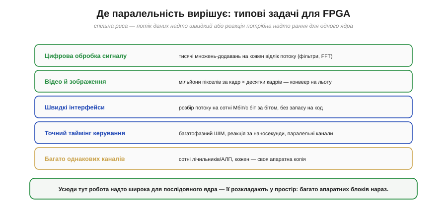
*Рис. 3.7.1.4. П'ять класичних царин: цифрова обробка сигналу (тисячі множень на відлік), відео й зображення (мільйони пікселів за кадр), швидкі інтерфейси (розбір потоку на сотні Мбіт/с біт за бітом), точний таймінг керування (реакція за наносекунди, багатофазний ШІМ) і «багато однакових каналів» (сотні лічильників, кожен — своя апаратна копія). Скрізь робота надто широка для послідовного ядра.*

Помітьте, що це **не** задачі «порахувати щось складне один раз» — там якраз сильний процесор. Це задачі «**робити просте, але дуже багато й водночас**». Обробити кожен із мільйонів пікселів однаково; крутити сотню незалежних ШІМ-каналів; ловити кожен біт швидкого потоку, не пропустивши жодного. Для людини-програміста це нудна одноманітність; для FPGA — рідна стихія, бо однакові дрібні дії ідеально лягають на однакові дрібні блоки заліза, розставлені поряд. Саме цю однорідну масовість ми й побачимо в будові чипа (§3.7.4).

### Місце FPGA серед усіх обчислювачів

Щоб закріпити інтуїцію, корисно розставити всі способи рахувати на одній осі — від найгнучкішого до найшвидшого. FPGA займе на ній дуже промовисте місце: посередині, де гнучкість іще є, а швидкість уже майже як у спеціального чипа.

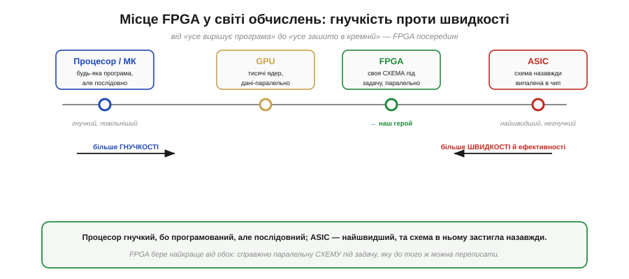
*Рис. 3.7.1.5. Зліва направо — від гнучкості до швидкості: процесор/МК (будь-яка програма, але послідовно), GPU (тисячі ядер для даних-паралельних задач), FPGA (своя **схема** під задачу, паралельно, і її можна переписати), ASIC (схема назавжди випалена в кремній — найшвидше й найощадніше, але незмінно). FPGA бере паралельність ASIC, зберігаючи здатність переписати себе.*

Ось чим FPGA унікальна: вона стоїть між двома світами й бере від кожного потроху. Від процесора — **програмованість**: схему можна змінити, перезаливши конфігурацію, навіть коли пристрій уже в полі (звідси й *field-programmable* у назві). Від спеціалізованого чипа ASIC (*application-specific integrated circuit*) — **справжню паралельну схему**: не імітацію обчислення інструкціями, а фізичні вентилі під конкретну задачу. Платою є те, що FPGA повільніша й ненажерливіша за ASIC рівної логіки (бо несе всю «машинерію переналаштування») і складніша в розробці за процесор. Але саме ця золота середина — гнучка, як софт, паралельна, як залізо — і зробила її незамінною там, куди ми ще не раз зазирнемо в цьому розділі.

Ця незамінність зовсім не абстрактна: ви майже напевно вже тримали в руках пристрої з FPGA всередині, навіть не здогадуючись. Цифрові осцилографи й логічні аналізатори, що ловлять сигнал на сотнях мегагерц; програмовані радіо (SDR), які перемелюють широку смугу ефіру; точні відеоконтролери; навіть точні відтворення старих ігрових консолей — усе це тримається на паралельному залізі, бо в усіх цих задачах потік даних надто швидкий для звичайного ядра.

> 🔌 **Загляньте у вставку:** [Де ви вже зустрічали FPGA: осцилографи, логічні аналізатори, SDR, ретро-консолі](r07-s1-c-fpga-in-the-wild.md) — конкретні приклади того, як паралельне залізо працює всередині знайомих приладів.

> 🔧 **Навіщо це.** Головна користь §3.7.1 — навчитися **ставити правильне питання на старті проєкту**. Не «якою мовою це писати», а «чи послідовна ця задача взагалі». Якщо обчислення природно вкладається в потік «крок за кроком» і встигає за тактами — беріть процесор, він простіший і дешевший. Якщо ж задача вимагає робити багато однакового **водночас** або реагувати за наносекунди зі сталою затримкою — це сигнал, що пора дивитися в бік паралельного заліза. Уміння розпізнати цей сигнал економить і час, і гроші: зекономлені тижні марних спроб втиснути паралельну задачу в послідовне ядро — найкраща винагорода за цю інтуїцію.

---

Підсумок §3.7.1: процесор **послідовний** — у кожен такт одне ядро тягне приблизно одну операцію (§3.5.3), і це фундаментальна межа. Швидкодія = (операцій за такт) × (тактів за секунду); підняти частоту важко, а **додати паралельних блоків** легко — у цьому суть FPGA, що розкладає роботу в **просторі**, а не в часі. Друга її сила — **мала й стала затримка**: реакція за час прольоту крізь вентилі, без джитера переривань. Виграє вона там, де роботи **багато й вона однотипна**: обробка сигналу, відео, швидкі інтерфейси, точний таймінг, безліч однакових каналів. На осі «гнучкість↔швидкість» FPGA сидить між процесором і ASIC, беручи паралельність другого й програмованість першого. Ми зрозуміли **навіщо** потрібна програмована логіка. Тепер прослідкуймо, **звідки** вона взялася: шлях від найпростіших програмованих матриць до сучасної FPGA.

---

## 3.7.2 Від PAL до FPGA: еволюція програмованих чипів

Ідея «чипа, чию логіку задають після випуску» не звалилася з неба готовою FPGA — вона визрівала десятиліттями, від зовсім простих мікросхем до велетенських матриць. Простежити цей шлях варто не заради дат, а заради **розуміння**: кожна сходинка розв'язувала конкретну ваду попередньої, і, пройшовши їх по черзі, ми природно прийдемо до того, чому сучасна FPGA влаштована саме так. До того ж проміжні ланки — PAL, GAL, CPLD — **не музейні експонати**: вони й сьогодні працюють там, де FPGA була б надмірною. Почнімо з найпершої ідеї, що зробила логіку програмованою.

### Найперша ідея: програмована матриця AND-OR

Згадаймо ключовий факт із булевої алгебри (§3.2.1): **будь-яку** логічну функцію можна записати як **суму добутків** — кілька доданків, з'єднаних OR, де кожен доданок є AND кількох входів (можливо, інвертованих). Якщо ми вміємо будувати довільні добутки, а потім їх додавати, ми вміємо будувати **будь-яку** функцію. Саме на цьому стоїть найперший програмований чип — **PAL** (*programmable array logic*).


*Рис. 3.7.2.1. Входи (a, b, c та їхні інверсії) йдуть у **програмовану матрицю AND**: користувач **пропалює** потрібні з'єднання (червоні точки), задаючи, які входи входять у кожен добуток (a·b, b·c̄, a·c). Далі **фіксована матриця OR** додає ці добутки в результат F = a·b + b·c̄ + a·c. Так одна мікросхема замінювала жменю окремих корпусів-вентилів серії 74.*

Геній цієї конструкції — у слові **пропалити**. На заводі чип виходить із усіма можливими з'єднаннями в матриці AND; розробник за допомогою програматора **руйнує зайві** (колись — буквально пропалюючи плавкі перемички), лишаючи тільки потрібні. Так із однієї універсальної заготовки народжується конкретна схема. Це вже величезний крок уперед від паяння десятків окремих вентилів: замість плати, всипаної корпусами 74-ї серії (§3.2), — одна мікросхема, у яку «вшито» потрібну логіку. Але PAL — лише найпростіший представник цілого сімейства, і його родичі відрізняються тим, **яку саме** з двох матриць дозволено програмувати.

### Сімейство простих програмованих логік (SPLD)

Варто на мить упорядкувати близьку рідню PAL, бо ці чотири абревіатури плутають найчастіше. Усі вони — **прості програмовані логіки** (SPLD, *simple programmable logic device*), усі побудовані з двох матриць AND і OR, і вся різниця між ними — у тому, котра матриця фіксована, а котра програмована.


*Рис. 3.7.2.2. **PROM**: матриця AND фіксована (повний дешифратор), OR — програмована; добра для таблиць. **PAL**: AND програмована, OR фіксована — дешево й швидко, тому найпопулярніша. **PLA** (*programmable logic array*): обидві матриці програмовані — найгнучкіша, але повільніша. **GAL** (*generic array logic*): як PAL, але на стирній пам'яті (EEPROM) — її можна **перепрограмувати**, а не пропалити раз.*

З цієї таблиці видно дві лінії розвитку, які триватимуть і далі. Перша — **гнучкість проти швидкості**: PLA дозволяє програмувати обидві матриці, тож уміщує більше, але зайвий рівень перемикачів її сповільнює; PAL поступається гнучкістю, зате швидша й дешевша — і саме тому стала робочою конячкою. Друга лінія, важливіша для нас, — **багаторазовість**: GAL замінила плавкі перемички на стирну пам'ять EEPROM, і чип із «пропали раз і назавжди» перетворився на «перепиши скільки хочеш». Ця друга ідея — конфігурація, яку можна змінювати, — і є зернятко, з якого виросте вся FPGA. Та перш ніж рости вшир, програмованій логіці бракувало ще однієї речі — **пам'яті стану**.

### Додаємо стан: макрокомірка з тригером

Сама лиш матриця AND-OR, хоч пропалена, хоч стирна, дає тільки **комбінаційну** логіку (§3.2.6): вихід залежить винятково від поточних входів, минулого вона не пам'ятає. Але справжні цифрові пристрої повні **стану** — лічильники, регістри, скінченні автомати (§3.3). Тож наступний крок очевидний: поставити біля кожного виходу **тригер** (§3.3.3).

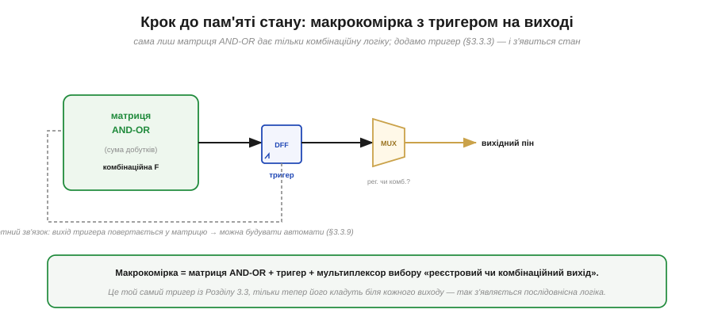
*Рис. 3.7.2.3. Макрокомірка = матриця AND-OR (комбінаційна функція) + **тригер** (§3.3.3) + мультиплексор, що обирає, віддати назовні **реєстровий** (через тригер) чи **комбінаційний** вихід. Зворотний зв'язок повертає вихід тригера назад у матрицю — і це вже дозволяє будувати скінченні автомати (§3.3.9): наступний стан рахується з поточного.*

Ось де зійшлися дві лінії всього Модуля 3: комбінаційна логіка з §3.2 і пам'ять стану з §3.3, разом в одній комірці. Ця **макрокомірка** (*macrocell*) — уже мініатюрна самодостатня цифрова схема: вона і обчислює функцію, і запам'ятовує результат, і може подати його назад на вхід, замикаючи петлю зворотного зв'язку. А петля зворотного зв'язку — це рівно те, що потрібно для автомата (§3.3.9): «новий стан = функція(старий стан, входи)». Лишалося зробити один крок — **зібрати багато** таких комірок на одному кристалі й навчити їх з'єднуватися між собою. І тут програмована логіка розділилась на дві різні архітектури.

Перш ніж рушити далі, варто розвіяти можливе враження, що PAL і GAL — лише історія. Навпаки: ідея «крихітного програмованого чипа на жменю функцій» жива й сьогодні, просто змінила нішу. Колись такі мікросхеми ставили, щоб **замінити купу окремих вентилів** серії 74 (§3.2) однією деталлю; нині ту саму роль грає **клейова логіка** (*glue logic*) — дрібні програмовані чипи, що «склеюють» між собою більші мікросхеми: підганяють рівні (§3.1.4), формують такти скидання, перемикають сигнали. Сучасні представники цього класу вміщують жменю LUT і тригерів у корпус завбільшки з рисове зерно й коштують копійки — і вони незамінні там, де тягнути велику FPGA було б безглуздо. Тобто навіть найнижчий щабель програмованої логіки нікуди не зник — він просто знайшов своє місце між великими чипами.

> 🔌 **Загляньте у вставку:** [Клейова логіка сьогодні: GreenPAK-клас — програмована дрібнота між чіпами](r07-s2-c-greenpak.md) — що вміщує такий мікроскопічний чип і де його ставлять на платі.

### Дві дороги: CPLD і FPGA

Коли постало питання «як скласти багато програмованих комірок в один великий чип», знайшлося дві принципово різні відповіді. Перша дала **CPLD**, друга — **FPGA**, і саме друга виявилась здатною вирости до мільйонів елементів.


*Рис. 3.7.2.4. **CPLD** (*complex PLD*): кілька «жирних» PAL-блоків із макрокомірками, зв'язаних однією центральною матрицею. Блоків небагато, та кожен потужний; затримка передбачувана, чип стартує миттєво. **FPGA**: море **дрібних** клітинок у регулярній сітці з гнучкою програмованою маршрутизацією. Клітинок тисячі чи мільйони — ємність на порядки більша.*

Різниця між ними — це різниця між «кількома великими» і «безліччю дрібних». **CPLD** взяв кілька повноцінних PAL-блоків і поєднав їх однією передбачуваною центральною матрицею. Через це CPLD невеликий, але дуже **прогнозований**: будь-який сигнал проходить однаковий короткий шлях, тож затримка стала й мала, а конфігурація зазвичай зберігається прямо в чипі, тож він готовий до роботи відразу по ввімкненні. **FPGA** пішла протилежним шляхом: замість кількох великих блоків — **тисячі крихітних** клітинок, розкиданих сіткою, і складна мережа програмованих проводів між ними. Це коштувало передбачуваності (шлях сигналу тепер залежить від того, як його проклали) і миттєвого старту (конфігурацію зазвичай доводиться завантажувати ззовні — §3.7.6), зате відчинило двері до колосальної ємності. Саме цій, «дрібнозернистій», архітектурі присвячено решту розділу.

### Уся драбина разом

Звівши сходинки в один ряд, побачимо наскрізну логіку розвитку — і заразом переконаємось, що нижні щаблі нікуди не зникли.


*Рис. 3.7.2.5. Від PAL/PROM (одна матриця, десятки вентилів, пропалюється раз) через GAL (те саме, але стирне) і CPLD (багато PAL-блоків + матриця, нелеткий) до FPGA (сітка LUT-клітинок із маршрутизацією, блоками RAM і DSP, до мільйонів LUT). Кожен щабель додавав ємності й гнучкості, не міняючи головної ідеї — «логіка, яку задають після випуску чипа».*

Найважливіше з цієї драбини — не верхній щабель, а **незмінність ідеї** на всіх щаблях: чип, чию схему визначають **після** виготовлення. Мінялися лише ємність (від десятків вентилів до мільйонів) і зручність (від одноразового пропалювання до миттєвого перезавантаження). І нижні щаблі живі донині, кожен у своїй ніші: PAL і GAL — для дрібної «клейової» логіки між мікросхемами; CPLD — для невеликого керування, де цінні миттєвий старт і стала затримка; FPGA — коли логіки треба багато й паралельно. Вибір між ними — це не «старе проти нового», а відповідність масштабу задачі.

> 🔧 **Навіщо це.** Практична користь — **не хапатися за FPGA там, де вистачить меншого**. Якщо завдання — лише «склеїти» кілька сигналів, замінити жменю вентилів чи зробити простий дешифратор, CPLD або навіть GAL буде дешевшим, простішим і запуститься миттєво без зовнішньої флеші. FPGA окупає свою складність лише тоді, коли потрібна **велика паралельна логіка** — багато каналів, обробка потоку, складні конвеєри. Знати весь спектр означає брати рівно стільки програмованості, скільки треба, і не платити за надлишок ні грошима, ні складністю плати.

---

Підсумок §3.7.2: програмована логіка визрівала сходинками. **PAL** реалізує суму добутків (§3.2.1) у пропалюваній матриці AND з фіксованою OR; родичі (**PROM**, **PLA**, **GAL**) різняться тим, котру матрицю програмують, а GAL ще й **перепрограмовна** (EEPROM) — зерно майбутньої FPGA. **Макрокомірка** додала до матриці **тригер** (§3.3.3) і зворотний зв'язок, давши стан і автомати (§3.3.9). На питанні «як зібрати багато комірок» шляхи розійшлися: **CPLD** — кілька великих PAL-блоків через центральну матрицю (малий, передбачуваний, миттєвий старт), **FPGA** — море **дрібних** клітинок із гнучкою маршрутизацією (величезна ємність). Наскрізна ідея незмінна — «логіка, яку задають після випуску»; усі щаблі живі, кожен під свій масштаб. Тепер придивимось до серця FPGA — крихітної комірки, що замінює вентилі **таблицею**.

---

## 3.7.3 LUT: таблиця істинності замість вентилів

Ми дійшли до центрального винаходу, на якому тримається вся FPGA. У §3.7.2 програмованість досягалася **пропалюванням зв'язків** у матриці вентилів — підхід прямий, але незграбний: щоб змінити функцію, треба фізично переробити мережу з'єднань. FPGA робить інакше, дотепніше. Вона взагалі **не будує функцію з вентилів** — вона **зберігає її відповіді** в крихітній пам'яті й просто читає звідти готовий результат. Цей фокус зветься **LUT** (*look-up table*, таблиця підстановки), і щоб оцінити його красу, треба згадати, що таке таблиця істинності.

### Головна ідея: зберегти стовпець відповідей

Будь-яка логічна функція повністю задана своєю **таблицею істинності** (§3.2.1): для кожної комбінації входів — один біт виходу. Зазвичай ми дивимося на таблицю як на **опис** того, що схема з вентилів має обчислити. LUT перевертає погляд: а що, як просто **запам'ятати останній стовпець** таблиці — самі відповіді — і при кожному наборі входів **діставати** потрібний рядок?

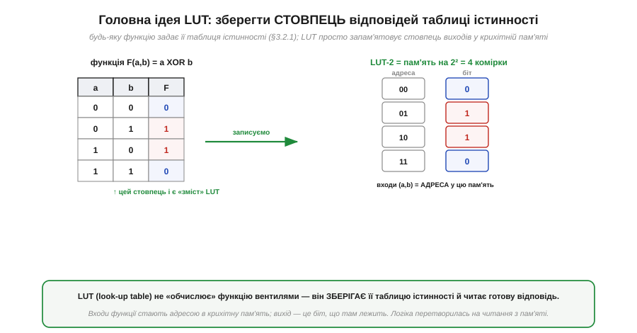
*Рис. 3.7.3.1. Функція F(a,b) = a XOR b задана таблицею істинності. LUT **запам'ятовує її стовпець виходів** (0, 1, 1, 0) у пам'яті на 2² = 4 комірки. Входи (a, b) працюють як **адреса** в цю пам'ять: пара (0,1) читає комірку «01» і повертає збережену там 1. Логіка перетворилась на **читання з пам'яті**.*

У цьому й полягає весь винахід, і він напрочуд простий, коли його побачиш. LUT **не обчислює** — вона **пам'ятає**. Входи функції стають **адресою** (точнісінько в тому сенсі, що й у §3.6.1: число, яке вказує комірку), а виходом служить **біт, що лежить за цією адресою**. Жодних вентилів, що реалізують саме XOR; є лише чотири збережені біти й механізм їх діставати. І тут одразу постає природне питання: а як саме «дістати потрібний рядок» — адже всередині пам'яті теж мусять бути якісь схеми? Відповідь на нього показує, чому LUT така універсальна.

### Що всередині: біти пам'яті й дерево мультиплексорів

Зазирнімо в LUT. Вона складається з двох частин: **комірок пам'яті**, де лежать збережені біти (це маленька статична пам'ять, SRAM — її ми згадували в §3.6.3), і **дерева мультиплексорів** (§3.2.6), яким входи обирають, котрий саме біт випустити назовні.

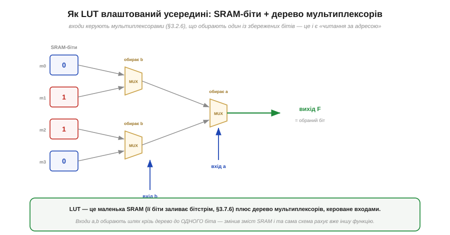
*Рис. 3.7.3.2. Чотири SRAM-біти (для LUT-2) ліворуч; їх заливає бітстрім (§3.7.6). Вхід b керує першим рівнем мультиплексорів (з кожної пари бітів обирає один), вхід a — другим рівнем (обирає між двома вцілілими). На виході — рівно один біт, що відповідає набору (a,b). Зміни вміст SRAM — і та сама схема рахує іншу функцію.*

Тепер видно, чому це працює й чому це гнучко. Мультиплексор — це «керований перемикач»: біт-адреса обирає, який із входів пропустити (§3.2.6). Складене з них **дерево** поступово звужує чотири збережені біти до одного, крок за кроком відсікаючи половину за кожним входом — рівно так, як адреса звужує вибір комірки в пам'яті. А головне: **самі вентилі тут постійні** (мультиплексори завжди ті самі), міняється лише **вміст SRAM**. Тому щоб перетворити XOR на AND, не треба чіпати жодного дроту — досить залити в ті чотири комірки інші чотири біти. Ось де народжується вся програмованість FPGA: не в перекладанні з'єднань, а в **перезаписі пам'яті**. І ця сама конструкція пояснює найсильнішу властивість LUT — її універсальність.

### Чому LUT-4 реалізує будь-яку функцію 4 змінних

Тепер найголовніше твердження, яке варто зрозуміти до кінця, бо воно — суть усього підходу. **Чотиривходова LUT здатна реалізувати будь-яку логічну функцію чотирьох змінних.** Не «багато функцій», не «майже всі» — **геть усі**. І це не диво, а проста лічба.

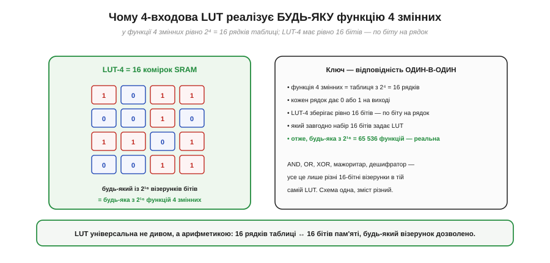
*Рис. 3.7.3.3. Функція 4 змінних має таблицю істинності з 2⁴ = 16 рядків, кожен дає 0 або 1. LUT-4 зберігає рівно **16 бітів** — по біту на рядок. Який завгодно з 2¹⁶ = 65 536 наборів цих 16 бітів задає якусь функцію, і **кожна** функція 4 змінних — це один із цих наборів. Відповідність один-в-один: 16 рядків таблиці ↔ 16 комірок пам'яті.*

Стежте за міркуванням, воно коротке й залізне. Функція чотирьох змінних повністю описується тим, який вихід (0 чи 1) вона дає на кожному з 2⁴ = 16 можливих наборів входів — тобто **16 бітами**. LUT-4 має рівно **16 комірок** пам'яті. Отже, кожному рядку таблиці відповідає рівно одна комірка, і навпаки. Заповнивши ці 16 комірок певним візерунком, ми задаємо певну функцію; а оскільки візерунок може бути **будь-який**, реалізовна й будь-яка з 2¹⁶ функцій. AND, OR, XOR, «вихід 1, якщо більшість входів — одиниці», шматок дешифратора — усе це лише різні 16-бітні візерунки в **одній і тій самій** LUT. Універсальність тут не магічна, а арифметична: скільки рядків у таблиці, стільки бітів у пам'яті.

**Приклад (та сама LUT — три різні функції).** Покажемо, що міняється лише вміст, а схема стала.

```
Двовходова LUT, біти змісту йдуть у порядку адрес 00, 01, 10, 11:

  AND(a,b):  зміст = 0 0 0 1   (1 лише коли a=1 і b=1)
  OR(a,b):   зміст = 0 1 1 1   (0 лише коли a=0 і b=0)
  XOR(a,b):  зміст = 0 1 1 0   (1 коли входи різні)

Перевірка XOR для (a,b) = (1,0):
  адреса = 10 (двійкове)  →  читаємо комірку «10»
  у XOR-змісті комірка «10» містить 1
  отже, F = 1     ✓  (1 XOR 0 = 1, правильно)
```
Жодного перепаювання: щоб AND став XOR, ми лише замінили чотири біти змісту. Це і є «програмована логіка» в найчистішому вигляді.

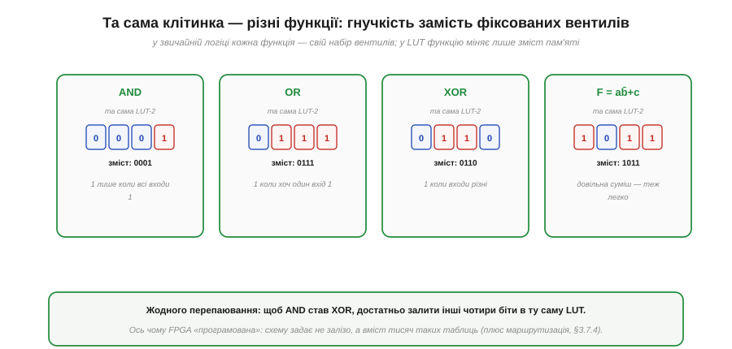
*Рис. 3.7.3.4. Одна й та сама двовходова LUT стає різними вентилями залежно лише від чотирьох бітів змісту: AND — це 0001, OR — 0111, XOR — 0110, а довільна суміш `a·b̄+c` — 1011. У звичайній логіці кожна з цих функцій вимагала б свого набору вентилів; у LUT досить залити інший вміст. Схема стала — змінюється лише пам'ять.*

Саме в цьому — практичний бік універсальності з попереднього рисунка: у класичній схемі (§3.2) кожна функція має власні вентилі, а в FPGA вся «схема» зводиться до **вмісту тисяч таких таблиць** плюс налаштування маршрутизації між ними (§3.7.4). Ось чому чип «програмований» у буквальному сенсі: ви не міняєте залізо, ви міняєте біти, що в ньому лежать.

> 🔧 **Навіщо це.** Розуміння LUT прямо впливає на те, як ви пишете опис схеми (§3.7.5) і читаєте звіти інструментів. По-перше, **ресурс FPGA рахують у LUT**, а не у вентилях: коли інструмент каже «дизайн зайняв 3200 LUT», ви тепер знаєте, що це 3200 таких таблиць. По-друге, складність вашої логіки міряється **кількістю входів** на ділянку: функція від чотирьох-п'яти сигналів сяде в одну LUT і порахується за один прохід, а від двадцяти — розкладеться на дерево LUT, що додасть затримки (§3.7.7). По-третє, **конфігурація — це дані, а не схема**: одну й ту саму FPGA можна щоразу заливати по-новому, бо ви міняєте лише вміст таблиць і перемикачів. Думаючи про логіку як про «таблиці, які треба заповнити», ви точніше уявляєте, у що перетвориться ваш опис.

### Скільки входів має LUT: чому 4–6

Якщо більша LUT уміщує складнішу функцію, чому б не робити їх велетенськими — на десять, двадцять входів? Тут вступає та сама вибухова формула 2ⁿ, що завадила великим адресним просторам (§3.6.1), тільки тепер вона б'є по самій LUT.

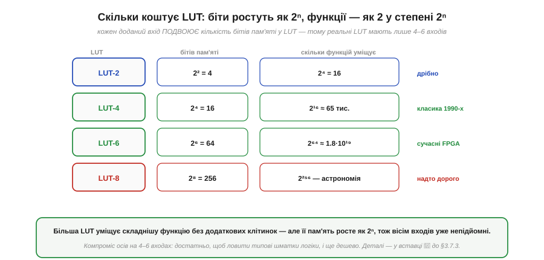
*Рис. 3.7.3.5. Кількість бітів у LUT росте як 2ⁿ від числа входів n: LUT-2 — 4 біти, LUT-4 — 16, LUT-6 — 64, LUT-8 — уже 256. А кількість функцій, які вона вміщує, росте як 2 у степені 2ⁿ — астрономічно. Восьмивходова LUT непідйомно велика й майже завжди недовикористана, тож реальні FPGA осіли на 4–6 входах — досить, щоб ловити типові шматки логіки, і ще дешево.*

Ось чому реальні LUT мають саме **чотири–шість** входів — це знайдена досвідом «солодка точка». Кожен доданий вхід **подвоює** пам'ять комірки: LUT-4 коштує 16 бітів, LUT-6 — уже 64, LUT-8 — 256, і більшість цих бітів простоюватиме, бо типові шматки логіки рідко залежать від восьми сигналів одразу. З іншого боку, занадто дрібна LUT (на два входи) змушувала б розкладати майже все на дерева, плодячи затримку й марнуючи маршрутизацію. Чотири-шість входів — компроміс: достатньо широко, щоб типовий фрагмент функції вліз у одну комірку, і достатньо дешево, щоб таких комірок помістилися мільйони. До точної арифметики цього компромісу ми ще повернемось у вставці 🧮 до §3.7.3.

> 🧮 **Загляньте у вставку:** [Скільки функцій уміщує LUT: формула 2 у степені 2ⁿ і чому 4–6 входів — солодка точка](r07-s3-m-lut-math.md) — там ця формула розписана повністю, з прикладами, чому восьмивходова LUT недоцільна.

---

Підсумок §3.7.3: **LUT** (look-up table) реалізує логіку не вентилями, а **пам'яттю**: зберігає стовпець виходів таблиці істинності (§3.2.1), а входи функції правлять за **адресу** в цю пам'ять (§3.6.1). Усередині — комірки **SRAM** (§3.6.3) плюс дерево **мультиплексорів** (§3.2.6), яким входи обирають один біт; вентилі сталі, міняється лише вміст SRAM — звідси програмованість. **LUT-4 реалізує будь-яку з 2¹⁶ функцій 4 змінних**, бо 16 рядків таблиці точно відповідають 16 коміркам — універсальність суто арифметична. Кількість бітів росте як 2ⁿ, тож реальні LUT мають **4–6 входів** — солодка точка між ємністю й ціною. Ресурс FPGA рахують саме в LUT. Але сама LUT — це лише комбінаційна частина; щоб мати стан і складати з клітинок велику схему, потрібне ще багато чого. Зазирнімо всередину FPGA цілком.

---

## 3.7.4 Усередині FPGA: логічні блоки, маршрутизація, блочна RAM, DSP

LUT з §3.7.3 — потужна, але сама по собі вона лише рахує комбінаційну функцію й нічого не пам'ятає між тактами. Справжня FPGA — це не купа окремих LUT, а **ціла фабрика** з кількох видів блоків, ретельно припасованих один до одного: логічні клітинки, мережа проводів, що їх з'єднує, готові блоки пам'яті й спеціальні арифметичні блоки. Цей підрозділ — оглядова екскурсія по цій фабриці. Ми підемо знизу вгору: від найдрібнішої клітинки до того, як із них збирається весь кристал, а тоді додамо «спеціальні острови», без яких сучасна FPGA була б безпорадною. Почнімо з тієї самої клітинки, до якої LUT додає те, чого їй бракувало, — **пам'ять**.

### Базова клітинка: LUT плюс тригер

Щоб клітинка вміла не лише рахувати, а й **пам'ятати**, до LUT приставляють її давнього напарника з §3.3 — **тригер**. Ця пара і є атом, з якого складено всю логіку FPGA.


*Рис. 3.7.4.1. Логічна клітинка: **LUT** рахує комбінаційну функцію входів (§3.7.3), а **тригер** (§3.3.3) фіксує її результат по фронту такту. Мультиплексор обирає, віддати назовні **комбінаційний** вихід (прямо з LUT) чи **реєстровий** (із тригера). Такт приходить на тригер. Із таких клітинок складено всю тканину FPGA.*

Уся міць цієї крихітної схеми — у тому, що вона поєднує **обидві** половини цифрової електроніки, які ми вивчали окремо. LUT — це §3.2 (комбінаційна логіка): миттєва функція від входів. Тригер — це §3.3 (пам'ять стану): значення, зафіксоване тактом і збережене до наступного фронту. Мультиплексор на виході дозволяє взяти одне з двох — і саме завдяки цьому вибору одна й та сама клітинка може бути то чистою логікою (коли потрібен миттєвий результат), то регістром (коли потрібно запам'ятати). Помножте цю гнучкість на тисячі чи мільйони клітинок — і ви маєте полотно, на якому можна «намалювати» будь-яку синхронну цифрову схему. Та тримати мільйони клітинок поодинці незручно, тож їх групують.

### Клітинки в блоках, блоки в сітці

Окрема клітинка надто дрібна, щоб бути одиницею організації. Тому кілька клітинок об'єднують у **логічний блок** зі спільними швидкими лініями, а блоки викладають **регулярною сіткою** по всьому кристалу.


*Рис. 3.7.4.2. Кілька LUT-тригерних клітинок об'єднані в **логічний блок** (CLB у Xilinx, LAB в Altera) зі спільним **ланцюгом переносу** (швидкою лінією для арифметики) та локальними зв'язками. Уся мікросхема — однорідна **сітка** таких блоків; між ними проходить програмована маршрутизація (далі на черзі).*

Це групування — не просто впорядкування, а оптимізація. Клітинки в одному блоці з'єднані **короткими швидкими** лініями, тож логіку, що тісно взаємодіє, інструмент намагається покласти поруч — і вона працює швидше. Особливо важливий **ланцюг переносу** (*carry chain*) — спеціальна пряма лінія між сусідніми клітинками: вона потрібна для додавання багатобітних чисел, де перенос біжить від молодшого розряду до старшого (§3.4.2), і без неї суматори були б помітно повільніші. А над усім цим — **регулярність**: однаковий блок, повторений тисячі разів, утворює рівне «полотно» логіки. Лишається питання, яке ми відкладали вже двічі: як ці блоки **з'єднати** між собою так, щоб вихід будь-якого міг дійти до входу будь-якого іншого?

### Маршрутизація: половина чипа — це проводи

Ось відповідь, і вона часто дивує новачків: **більша частина** площі FPGA зайнята не логікою, а **проводами** та перемикачами, що ними керують. Адже мало мати мільйон клітинок — треба вміти з'єднати будь-яку з будь-якою, причому по-різному для кожного дизайну.


*Рис. 3.7.4.3. Між логічними блоками тягнуться **канали проводів** (сірі), а на їхніх перетинах сидять **комутаційні матриці** (switch box, бурштинові): програмовані перемикачі, що з'єднують відрізки дротів у потрібний шлях. Червоним показано один прокладений зв'язок між двома блоками. Саме перемикачі вирішують, який вихід куди йде; на великих чипах маршрутизація займає більше площі, ніж логіка.*

Тут ховається ключова відмінність FPGA від попередників із §3.7.2. У CPLD зв'язки йшли через одну передбачувану центральну матрицю; у FPGA маршрутизація **розподілена** по всьому кристалу — сітка каналів і безліч перемикачів на перетинах. Кожен перемикач — це, по суті, ще одна комірка конфігурації: вона каже, чи з'єднати даний відрізок дроту з сусіднім. Заливаючи конфігурацію, ми задаємо не лише вміст усіх LUT, а й положення **всіх** цих перемикачів — і так із однорідної сітки народжується конкретна схема з'єднань. Плата за гнучкість — затримка: сигнал, що йде здалеку крізь багато перемикачів, повільніший за сусідський, і це прямо вплине на швидкість (§3.7.7). Якщо глянути на всю цю конструкцію згори, проступає характерний візерунок, який інженери називають острівним.

### Острівна структура: логіка в морі проводів

Загальний план типової FPGA має промовисту назву — **острівний** (*island-style*): острівці логіки, омиті морем маршрутизації, а по берегах кристала — контакти із зовнішнім світом.


*Рис. 3.7.4.4. Класичний план: логічні блоки — **острови** (зелені) — оточені **каналами маршрутизації** (море), а весь периметр кристала зайнятий **пінами вводу-виводу** (I/O, сині), якими FPGA спілкується із зовнішнім світом. Спеціальні блоки (RAM, DSP) вставлені стовпцями просто серед островів.*

Ця картина зводить докупи все, що ми вже бачили, і додає останній шар. **Острови** — це логічні блоки з клітинок (LUT + тригер). **Море** — це канали проводів і комутаційні матриці. А **береги** — це піни вводу-виводу (*I/O pads*): контакти на краю кристала, через які сигнали заходять у FPGA і виходять із неї до решти плати. Кожен такий пін теж гнучкий — його можна налаштувати на потрібний логічний рівень і напрямок (§3.1.4). Виходить струнка триярусна організація: логіка рахує, маршрутизація з'єднує, піни сполучають із світом. Але на самих лише LUT-клітинках сучасну FPGA не збудуєш — дві дуже поширені задачі вони виконують украй марнотратно, і саме тому серед островів вставлено блоки іншого роду.

### Блочна пам'ять: готові кілобіти RAM

Перша така задача — **зберігати дані**. Тригер у клітинці тримає рівно один біт; зробити з них буфер на кілька кілобайтів — божевільне марнотратство. Тому FPGA несе вбудовані **блоки пам'яті**.


*Рис. 3.7.4.5. Робити буфер на тригерах клітинок (ліворуч) — це біт на цілу клітинку, тисячі клітинок на дрібний буфер. Тому в чип вбудовано **блочну RAM** (BRAM, *block RAM*): компактні блоки на 18–36 кбіт кожен, зазвичай **двопортові** (можна одночасно й незалежно читати з одного порту й писати в інший). Десятки чи тисячі таких блоків розкидані стовпцями по кристалу.*

Логіка тут проста й переконлива. Пам'ять — це регулярна, щільна структура, яку в кремнії роблять дуже компактно (§3.6.8); відтворювати її з універсальних тригерів означало б платити в десятки разів більше площі за той самий обсяг. Тому розробники чипа заздалегідь вбудовують **спеціалізовані** блоки RAM — і вони ідеально лягають на типові потреби цифрових схем: буфери відео, черги (FIFO), таблиці коефіцієнтів, невелика пам'ять для м'якого процесора (§3.7.9). Особливо цінна **двопортовість**: один бік схеми пише в буфер, а інший тієї ж миті читає — те, що постійно потрібно в конвеєрній обробці потоку. Друга марнотратна задача — арифметика, і для неї є свій спеціальний блок.

### DSP-блоки: апаратне множення

Друге, що погано дається самим лише LUT, — це **множення**. Скласти два числа дешево (ланцюг переносу допомагає), а от помножити — це купа додавань і зсувів, що з'їдає сотні LUT на один множник. Для задач обробки сигналу, де множення — основна операція, цього не пробачиш, тож у FPGA вбудовують готові **DSP-блоки**.


*Рис. 3.7.4.6. **DSP-блок** містить готовий апаратний **множник** і **суматор-акумулятор** — операцію «помножити й додати» (MAC, *multiply-accumulate*: A×B + сума) за один такт у спеціальному блоці, а не на десятках LUT. Сотні чи тисячі таких блоків працюють паралельно — звідси сила FPGA у цифрових фільтрах і нейромережах.*

Чому саме «помножити й додати», а не просто «помножити»? Бо ця парна операція — **серце** майже всієї обробки сигналу. Цифровий фільтр множить кожен відлік на коефіцієнт і **накопичує** суму; множення матриць робить те саме; згортка в нейромережі — теж. Маючи сотні DSP-блоків, FPGA виконує сотні таких MAC-операцій **одночасно** за один такт — це і є та паралельність із §3.7.1, доведена до апаратної досконалості. BRAM і DSP завершують картину: до однорідного «моря» універсальних клітинок додано **спеціалізовані острови** — пам'ять і арифметику, — і саме поєднання універсального з спеціалізованим робить сучасну FPGA такою продуктивною.

> 🔧 **Навіщо це.** Знати внутрішню будову означає **тверезо оцінювати, що влізе у ваш чип і як швидко працюватиме**. По-перше, FPGA характеризують **чотирма ресурсами**: кількість LUT (логіка), тригерів (стан), блоків BRAM (пам'ять) і DSP (множники) — і дизайн «не влазить», якщо вичерпано **будь-який** із них, навіть коли решта вільна; тому, обираючи чип, дивляться на всі чотири числа. По-друге, **користуйтеся спеціальними блоками**: тримати буфер у BRAM, а не «в логіці», і доручати множення DSP-блокам — це і економія LUT, і вища швидкість. По-третє, пам'ятайте про **маршрутизацію**: коли дизайн заповнює чип під зав'язку, сигналам стає тісно в каналах, і затримка зростає — інколи варто лишати запас. Ця внутрішня картина — підмурок для розмови про таймінг (§3.7.7) і про вибір між FPGA та мікроконтролером (§3.7.8).

> 🔌 **Загляньте у вставку:** [Перші FPGA-плати хобіста: плати iCE40- і Gowin-класу](r07-s4-c-hobby-fpga-boards.md) — що саме розпаяно поряд із чипом (флеш для бітстріму, генератор такту, рівні I/O) і чому.

---

Підсумок §3.7.4: FPGA — це **кілька видів блоків** разом. Атом логіки — **клітинка** = **LUT** (комбінаційна функція, §3.7.3) + **тригер** (стан, §3.3.3) + мультиплексор вибору «комбінаційний/реєстровий вихід». Клітинки згруповані в **логічні блоки** (CLB/LAB) зі спільним **ланцюгом переносу** для арифметики, а блоки викладені регулярною **сіткою**. Між ними — **програмована маршрутизація**: канали проводів і **комутаційні матриці**, чиї перемикачі (теж комірки конфігурації) задають з'єднання; на великих чипах вона займає більше площі за логіку. Загальний план — **острівний**: острови логіки в морі проводів, по берегах — піни **I/O** (§3.1.4). Серед островів вставлено **спеціалізовані** блоки: двопортову **BRAM** (готові кілобіти замість буферів на тригерах) і **DSP** (апаратне «помножити-додати», MAC). Чип характеризують чотири ресурси — LUT, тригери, BRAM, DSP. Ми знаємо, **з чого** складається FPGA. Тепер — як її **програмують**: не кодом інструкцій, а **описом схеми**.

---

## 3.7.5 HDL: описуємо залізо, а не пишемо програму

Ми бачили будову FPGA (§3.7.4), та лишилось найголовніше для практики: **як** людина задає потрібну схему? Не ж розставляти мільйони бітів конфігурації вручну. Відповідь — окремий клас мов, **HDL** (*hardware description language*, мова опису апаратури), і найпоширеніша з них — **Verilog**. Але перш ніж писати бодай рядок, треба пережити один злам у голові, без якого HDL збиває з пантелику кожного, хто прийшов із звичайного програмування. Цей злам — у самому слові **опис**. Розберімося, чому це не програмування, хоч на вигляд буває схоже.

### Головний злам: опис, а не послідовність кроків

Звичайна програма (як на C для мікроконтролера) — це **послідовність дій у часі**: спершу це, потім те, крок за кроком виконує процесор (§3.5.3). Код на HDL — це геть інше: це **креслення залізяки**, що існує цілком і **водночас**, як існує намальована на схемі мікросхема.


*Рис. 3.7.5.1. У програмі на C рядки виконуються **по черзі**: спершу одне читання, потім друге, потім додавання — кроки в часі. У Verilog рядок `assign c = a + b;` не «виконується» — він **описує** постійно існуючий апаратний суматор, що завжди тримає на виході суму своїх входів. Усі рядки HDL «працюють» одночасно, бо це й є схема.*

Цей злам вартий того, щоб затриматись. Однакова на вигляд стрічка означає в двох світах протилежне. У C `c = a + b` — це **наказ**: «у цю мить візьми a і b, склади, поклади в c»; він станеться один раз, коли до нього дійде черга. У Verilog `assign c = a + b` — це **констатація факту про залізо**: «існує суматор, чий вихід c назавжди дорівнює a + b»; він не «трапляється», він просто **є**, постійно. Тому в HDL немає «порядку виконання рядків»: усе описане існує паралельно, бо паралельно існують і дроти на платі. Звикнути до цього — половина опанування HDL; друга половина — навчитися думати, **яку схему** малює кожна конструкція. Почнімо з найбільшої одиниці опису.

### Модуль: чорна скринька з виводами

Будівельний блок Verilog — **модуль** (*module*). Це опис шматка схеми як «чорної скриньки» з названими **входами** й **виходами**, дуже схожої на корпус мікросхеми з ніжками.


*Рис. 3.7.5.2. `module adder` оголошує **виводи**: входи `a`, `b` і вихід `sum` (запис `[7:0]` означає 8-бітну шину — §3.4.7). Тіло (`assign sum = a + b;`) описує, що всередині. Фізично це 8-бітний суматор, чиї `input`/`output` — ніби ніжки корпусу. Модулі вкладають один в одного, як корпуси на платі, будуючи велику систему.*

Аналогія з мікросхемою тут глибша, ніж здається, і дуже допомагає. **Оголошення виводів** (`input`/`output`) — це як розпіновка корпусу: воно каже, якими сигналами модуль обмінюється зі світом, і нічого не каже про нутрощі. **Тіло** модуля — це сама схема всередині. А запис `[7:0]` — пряме відлуння §3.4.7: це не один провід, а **шина** з восьми, що несе ціле число. Найважливіше ж — **вкладеність**: великий проєкт будують не одним велетенським модулем, а ієрархією — дрібні модулі (суматор, лічильник, інтерфейс) збирають у більші, як мікросхеми на платі сполучають у пристрій. Усередині ж тіла модуля опис буває двох дуже різних родів, і плутати їх не можна.

### Два роди опису: комбінаційний і реєстровий

Усе, що ми вивчали в Модулі 3, ділилося на дві половини: комбінаційну логіку без пам'яті (§3.2) і послідовнісну логіку з тригерами (§3.3). У Verilog цей поділ проступає прямо в синтаксисі: є опис **комбінаційний** (миттєвий) і **реєстровий** (по такту).

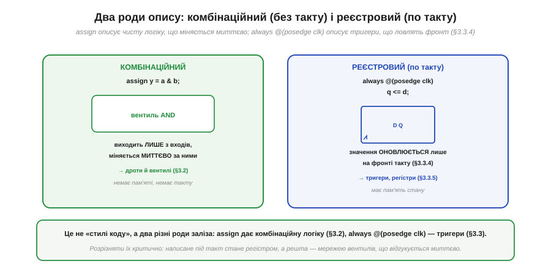
*Рис. 3.7.5.3. `assign y = a & b;` описує **комбінаційну** логіку: вихід залежить лише від входів і міняється миттєво за ними — це вентиль AND (§3.2), без пам'яті й такту. `always @(posedge clk) q <= d;` описує **реєстровий** елемент: значення оновлюється тільки на фронті такту (§3.3.4) — це тригер (§3.3.3), що має пам'ять стану.*

Розрізняти ці два роди — критично, бо вони породжують **фізично різне залізо**. `assign` (і логіка всередині блоку, що реагує на будь-яку зміну входів) дає **мережу вентилів**: вона відгукується на входи негайно, не чекаючи такту, і нічого не пам'ятає. `always @(posedge clk)` — конструкція, що спрацьовує **на фронті такту** (§3.3.4), — дає **тригери**: значення фіксуються по фронту й тримаються до наступного, тобто з'являється пам'ять стану. Це не косметичні «стилі коду», а вибір між §3.2 і §3.3: написане під такт стане регістром і займе тригери клітинок, написане без такту — комбінаційною логікою на LUT. Звідси й типова пастка новачка: забув про такт там, де потрібен стан, — отримав миттєву логіку без пам'яті; або, навпаки, ненавмисно описав регістр і здивувався зайвій затримці на такт. А все тому, що **код не виконується — він синтезується**.

### Синтез ≠ виконання

Час назвати прямо те, що ми обходили: код на HDL **не «біжить»**. Його не виконує жоден процесор. Спеціальний інструмент — **синтезатор** — **перетворює** опис на схему, яку потім втілить тканина FPGA. Це настільки інакше, ніж компіляція й виконання програми, що варто поставити їх поряд.


*Рис. 3.7.5.4. Софт: компілятор перекладає код C на **інструкції** (LD, ADD, ST), які процесор **виконує** крок за кроком у часі. HDL: **синтезатор** перекладає код Verilog на **схему** (вентилі, тригери, дроти), яку тканина FPGA **втілює** — і вона працює вся нараз. Однакові на вигляд мови — геть різна доля коду.*

Це порівняння переставляє на місце багато інтуїцій, винесених із програмування. Найважливіша — про **оптимізацію**. У софті «зробити швидше» зазвичай означає «виконати менше інструкцій». У HDL інструкцій немає взагалі; «зробити швидше» означає **вкоротити критичний шлях** у схемі — найдовший ланцюжок логіки між двома тригерами (його ми розберемо в §3.7.7). Так само переосмислюються «цикли» й «змінні»: цикл у HDL частіше означає не повторення в часі, а **розмноження заліза** (стільки однакових блоків, скільки витків), а змінна — не комірку пам'яті, а **дріт** або **регістр**. Думати треба не «що робить машина крок за кроком», а «яку схему я описую». І ця зміна оптики має один особливо повчальний наслідок.

### Той самий вираз — різне залізо

Оскільки HDL описує **намір**, а не кроки, кількість заліза, що з нього виросте, залежить від **контексту**. Той самий вираз «c = a + b» розгортається в дуже різну схему залежно від того, як і де його вжито.


*Рис. 3.7.5.5. Один `assign c = a + b;` дає **один** суматор. Той самий вираз, повторений для восьми пар даних, дає **вісім** суматорів, що працюють паралельно. А вираз усередині `always @(posedge clk)` дає суматор **плюс регістр**, де результат фіксується тактом. Опис однаковий — залізо різне, бо різний контекст.*

Тут і сила HDL, і його головна пастка, дві сторони однієї медалі. **Сила**: щоб подвоїти продуктивність, інколи досить описати дві копії блоку — і синтезатор побудує вдвічі більше заліза, що працюватиме вдвічі паралельніше (рівно та масштабованість із §3.7.1). **Пастка**: необережний опис так само легко **намножить** десятки суматорів там, де ви уявляли один, або породить небажаний регістр, що зсуне таймінг. Тому досвідчений розробник HDL завжди тримає в голові питання «**скільки** заліза я зараз описую і **яке**» — бо пише він не програму, а креслення, і кожен рядок чогось коштує в кремнії. До перших практичних кроків на Verilog ми ще дійдемо у вставці ⚙️ до §3.7.5.

> 🔧 **Навіщо це.** Цей зсув свідомості — найважливіше, що варто винести перед першим проєктом на FPGA, бо без нього код «компілюється», а схема поводиться загадково. Запам'ятайте три речі. Перше: **усе паралельно** — рядки HDL не виконуються по черзі, вони описують одночасно існуюче залізо. Друге: **під такт — регістр, без такту — комбінаційна логіка** (§3.3 проти §3.2); саме це визначає, чи буде у вашій схемі пам'ять, тож стежте, що пишете в `always @(posedge clk)`. Третє: **думайте про кількість заліза** — цикл часто означає розмноження блоків, а не повторення в часі. Хто опанував цей погляд, перестає «програмувати FPGA» й починає **проєктувати схему** — а саме цього вона й вимагає. Як цей опис перетворюється на реальну конфігурацію чипа — наступний підрозділ.

> ⚙️ **Загляньте у вставку:** [Перші проєкти на Verilog: мигалка й UART-передавач](r07-s5-a-verilog-first-projects.md) — від найпростішого модуля до тестбенча, на якому опис перевіряють ще до заливання в чип.

---

Підсумок §3.7.5: схему для FPGA задають мовою **HDL** (Verilog), і головне тут — **зрозуміти, що це опис заліза, а не програма**: код **не виконується** по черзі, а описує схему, що існує **цілком і водночас**. Одиниця опису — **модуль** із названими `input`/`output` (як корпус мікросхеми; `[7:0]` — 8-бітна шина, §3.4.7), і модулі **вкладають** ієрархічно. Опис буває двох родів: **комбінаційний** (`assign` — мережа вентилів, §3.2, миттєво) і **реєстровий** (`always @(posedge clk)` — тригери, §3.3, по фронту, §3.3.4); плутати їх не можна, бо це різне залізо. Код **синтезується** (перетворюється на схему), а не виконується, тож «швидше» означає не «менше інструкцій», а «коротший критичний шлях» (§3.7.7), а цикл часто означає **розмноження заліза**. Той самий вираз дає різну схему залежно від контексту — звідси і сила (легко намножити паралельні блоки), і пастка (легко намножити ненавмисно). Опис готовий — як із нього постає працююча FPGA?

---

## 3.7.6 Потік розробки: синтез → розміщення → трасування → бітстрім

У §3.7.5 ми навчилися **описувати** схему мовою HDL, але між текстом опису й мікросхемою, що ожила, лежить ціла низка перетворень. На відміну від софту, де компілятор за один крок дає готовий машинний код, шлях до FPGA довший і має кроки, **яких у програмуванні взагалі немає**. Зрозуміти цей потік (*flow*) важливо не лише з цікавості: кожен його етап може щось повідомити чи на щось поскаржитися, і розробник постійно читає ці звіти. Пройдімо весь конвеєр — від коду до працюючого чипа — крок за кроком, тримаючи в голові, що половина цих кроків суто **апаратна**.

### Чотири головні кроки

Спершу — карта всього шляху, щоб не загубитися в деталях. Опис HDL проходить чотири головні перетворення й стає **бітстрімом** — потоком бітів, що налаштовує кожну клітинку й перемикач чипа.

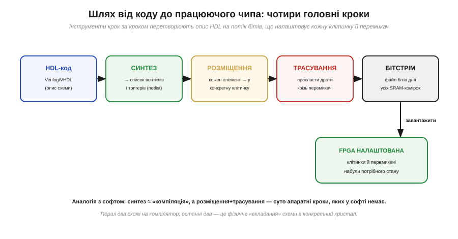
*Рис. 3.7.6.1. Чотири кроки: **синтез** (HDL → список вентилів і тригерів, netlist), **розміщення** (кожен елемент → у конкретну клітинку чипа), **трасування** (прокласти дроти між ними крізь перемикачі) і **бітстрім** (файл бітів для всіх комірок конфігурації), який заливають у FPGA. Перші два кроки нагадують компілятор; останні два — суто апаратне «вкладання» схеми в кристал.*

Звернімо увагу на головну відмінність від звичної компіляції, бо саме вона визначає всю своєрідність роботи з FPGA. Програму компілятор перекладає на інструкції — і все, далі їх виконує процесор. Тут після «компіляції» (синтезу) лишається ще **фізична** робота: схему треба **вкласти** в конкретний кристал — вирішити, у яку з мільйонів клітинок сяде кожен елемент (розміщення) і якими саме дротами їх з'єднати (трасування). Цих кроків у софті немає в принципі, бо там немає кристала з фіксованою геометрією. Розгляньмо кожен крок ближче, починаючи з найзнайомішого.

### Синтез: від тексту до списку елементів

Перший крок — **синтез** (*synthesis*) — найближчий до звичної компіляції. Інструмент «розуміє» опис HDL і будує з нього еквівалентну схему з примітивів: вентилів і тригерів, поки що **без** прив'язки до конкретних місць на чипі.


*Рис. 3.7.6.2. Синтезатор перекладає текст HDL (`assign y = (a & b) | (c & d);`) на **netlist** — список з'єднаних примітивів: два вентилі AND, один OR і зв'язки між ними. Це вже конкретна схема, але «схема взагалі» — ще без відповіді, у якій клітинці кристала що опиниться.*

Синтез робить рівно те, що й розумний компілятор, тільки ціль інша. Він розбирає опис, **розпізнає**, де комбінаційна логіка, а де регістр (той самий поділ §3.2 проти §3.3, що ми бачили в §3.7.5), **відкидає** зайве (недосяжну логіку, сталі, які можна згорнути) і видає **netlist** — список елементів і провідників, що їх з'єднують. Можна сказати, синтез відповідає на питання «**що** будувати»: з яких вентилів і тригерів складається схема. Але він свідомо не чіпає питання «**де**» — у нього ще немає поняття конкретної клітинки. На це питання відповідає наступний крок, перший із суто апаратних.

### Розміщення й трасування: вкладаємо схему в кристал

Тепер — двоє кроків, які роблять FPGA унікальною. **Розміщення** (*placement*) вирішує, у яку фізичну клітинку сяде кожен елемент netlist'а. **Трасування** (*routing*) прокладає реальні дроти між цими клітинками крізь комутаційні матриці (§3.7.4).

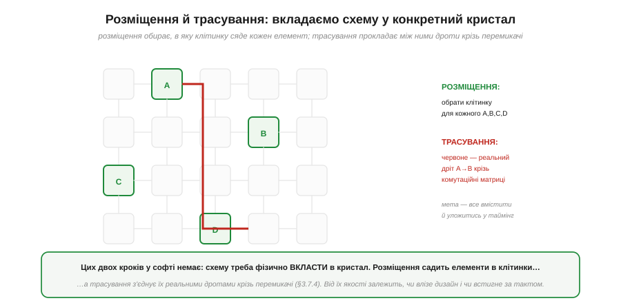
*Рис. 3.7.6.3. **Розміщення**: кожному елементу (A, B, C, D) обирається конкретна клітинка в сітці. **Трасування**: між обраними клітинками прокладаються дроти (червоне — реальний шлях A→B) крізь перемикачі маршрутизації. Мета — все вмістити **й** уложитися в таймінг: зв'язані елементи краще класти ближче, щоб дроти були коротші.*

Ці два кроки часто об'єднують абревіатурою **P&R** (*place and route*), і вони — серце апаратної частини потоку. Тут вирішується доля **таймінгу** (§3.7.7): якщо два тісно пов'язані елементи опиняться на протилежних кінцях кристала, дріт між ними буде довгий, затримка велика, і схема не встигне за тактом. Тому інструмент намагається класти взаємодійну логіку поруч, мінімізуючи довжину критичних з'єднань, і водночас **усе вмістити** в наявні клітинки й канали. Це складна оптимізаційна задача (математично споріднена з тим, що роблять при проєктуванні самих чипів), і саме вона зазвичай триває найдовше у великих дизайнах. Коли і розміщення, і трасування завершені, схема повністю «лягла» на конкретний кристал — лишається перетворити цей результат на те, що чип розуміє.

### Бітстрім: образ схеми у вигляді бітів

Підсумок усього потоку — **бітстрім** (*bitstream*): один великий файл бітів, що задає стан **кожної** комірки конфігурації — вміст усіх LUT і положення всіх перемикачів маршрутизації.

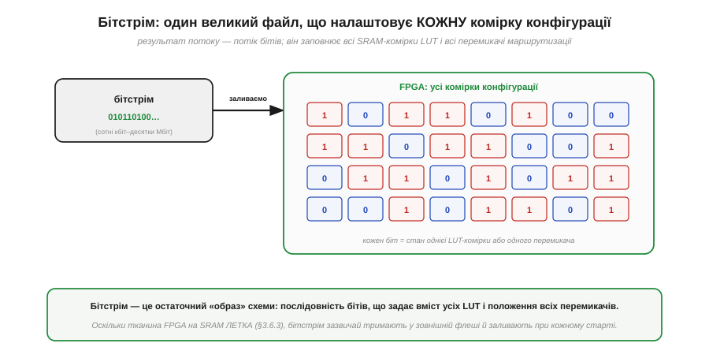
*Рис. 3.7.6.4. Бітстрім — потік бітів (від сотень кілобітів до десятків мегабітів), що заповнює **всі** комірки конфігурації FPGA. Кожен біт задає стан однієї SRAM-комірки LUT (§3.7.3) або одного перемикача маршрутизації (§3.7.4). Залив бітстрім — і однорідна тканина набула вигляду потрібної схеми.*

Бітстрім — це остаточний **образ** вашої схеми, переведений у єдину «мову», яку розуміє кремній: послідовність бітів конфігурації. Згадайте, що вся програмованість FPGA зводилась до двох речей — вмісту LUT (§3.7.3) і положення перемикачів (§3.7.4); бітстрім — це рівно набір значень для **всіх** них разом. Тому його розмір прямо відповідає ємності чипа: що більше клітинок і маршрутів, то довший потік бітів. Лишається одна практична деталь, без якої картина неповна: куди цей бітстрім подіти, адже тканина FPGA, побудована на SRAM, **летка**.

### Звідки береться конфігурація при кожному старті

Тут спливає наслідок того, що ми знаємо ще з §3.6.3: **SRAM летка** — вона забуває все без живлення. А LUT і перемикачі FPGA побудовані саме на SRAM-комірках. Отже, при кожному ввімкненні чип прокидається **порожнім** — і мусить звідкись узяти свій бітстрім.


*Рис. 3.7.6.5. Тканина FPGA на SRAM **летка** (§3.6.3): після вимкнення схема зникає. Тому бітстрім тримають у малій **нелеткій флеш-пам'яті** поряд із чипом; при кожному ввімкненні FPGA **завантажує себе** з флеші (процес configuration) і за частки секунди постає готовою. Окремий клас FPGA має флеш-пам'ять прямо всередині.*

Це пояснює одну з тих відмінностей FPGA від CPLD, що ми відзначали в §3.7.2. CPLD зазвичай зберігає конфігурацію в собі й готовий до роботи відразу; SRAM-based FPGA — ні, їй потрібна **зовнішня флеш** із бітстрімом і коротка пауза на завантаження при старті. Це невелика плата за гнучкість і колосальну ємність SRAM-тканини: її можна перезаписувати безкінечно, і саме на ній будують найбільші чипи. (Існує й проміжний клас FPGA з вбудованою флеш-пам'яттю — вони стартують миттєво, як CPLD, ціною дещо меншої ємності.) Як саме виглядає цей потік на практиці, з конкретними відкритими інструментами, ми ще побачимо у вставці ⚙️ до §3.7.6.

> 🔧 **Навіщо це.** Знати потік потрібно, щоб **читати, що кажуть інструменти, і розуміти, де щось пішло не так**. По-перше, **звіти приходять із різних кроків**: синтез скаржиться на двозначності опису й оцінює ресурси; розміщення-трасування каже, чи все вмістилось і чи дотримано таймінг (§3.7.7); саме сюди дивляться, коли дизайн «не збирається». По-друге, **P&R — найдовший крок** у великих проєктах, тож терпіння (і запас часу) — частина роботи з FPGA. По-третє, **передбачте флеш для бітстріму** на платі (або візьміть чип із вбудованою), інакше SRAM-based FPGA після ввімкнення просто лишиться порожньою. Розуміючи весь конвеєр, ви перестаєте сприймати інструменти як чорну скриньку й починаєте свідомо вести дизайн від коду до робочого чипа. А найважливіший його критерій — чи встигає схема за тактом — заслуговує окремої розмови.

> ⚙️ **Загляньте у вставку:** [Відкритий тулчейн: Yosys → nextpnr → бітстрім](r07-s6-a-open-toolchain.md) — як ці самі кроки проходять у вільних інструментах для чипів класу iCE40.

---

Підсумок §3.7.6: шлях від опису до чипа — **потік** із чотирьох кроків. **Синтез** перетворює HDL на **netlist** (список вентилів і тригерів, відповідь на «що будувати»; розпізнає §3.2 проти §3.3, відкидає зайве) — це найближче до компіляції. Далі — два суто **апаратні** кроки, яких у софті немає: **розміщення** (кожен елемент → у конкретну клітинку) і **трасування** (реальні дроти крізь перемикачі, §3.7.4); разом **P&R**, де вирішується таймінг (§3.7.7), і це зазвичай найдовший етап. Підсумок — **бітстрім**: потік бітів, що задає вміст усіх LUT (§3.7.3) і положення всіх перемикачів. Оскільки SRAM-тканина **летка** (§3.6.3), бітстрім тримають у зовнішній **флеші** й завантажують при кожному старті (configuration); є й чипи з вбудованою флеш-пам'яттю. Інструменти повідомляють про проблеми на різних кроках — їх треба вміти читати. Найважливіший критерій успіху — таймінг; розберімо, що це таке.

---

## 3.7.7 Таймінг у FPGA: критичний шлях і обмеження

Ми не раз згадували слово «таймінг» і обіцяли пояснити, що насправді обмежує частоту FPGA. Час виконати обіцянку. Це питання — пряме продовження §3.3.8, де ми вперше зустріли setup/hold і метастабільність, тільки тепер ми застосуємо ті ідеї до цілого дизайну на десятки тисяч клітинок. Тема має репутацію складної, але її ядро напрочуд просте й тримається на одному понятті — **критичний шлях**. Зрозумівши його, ви зрозумієте і звідки береться максимальна частота, і чому деякі дизайни «не збираються» на потрібному такті, і як це лікувати. Почнімо з того, що відбувається між двома фронтами такту.

### Що обмежує частоту: шлях від тригера до тригера

Уся синхронна схема (а майже всі дизайни на FPGA синхронні) працює тактами: на кожному фронті тригери **захоплюють** нові значення, між фронтами комбінаційна логіка ці значення **перемелює** (§3.3.6). Питання частоти зводиться до одного: чи встигає сигнал за **один період** такту вийти з одного тригера, пройти логіку й **усістися** на вході наступного?


*Рис. 3.7.7.1. Між двома тригерами, що тактуються спільним сигналом (§3.3.6), сигнал має встигнути: вийти з тригера-джерела (час t_cq, clock-to-Q), пройти комбінаційну логіку між ними (t_logic) і прибути на вхід тригера-приймача завчасно — за час t_setup до фронту (§3.3.8). Сума цих часів і є довжина шляху; найдовший такий шлях у дизайні зветься **критичним**.*

Тут оживає все, що в §3.3.8 здавалося абстрактним. Згадайте **setup-час** — інтервал перед фронтом, протягом якого вхід тригера має вже бути стабільним, інакше тригер зірветься в метастабільність. Тепер ми бачимо його в дії: сигнал, що виходить із джерела, **зобов'язаний** прибути на приймач не пізніше ніж за t_setup до наступного фронту. Загальний час подорожі складається з трьох частин: вийти з джерела (t_cq), пролетіти логіку й дроти (t_logic) і встигнути на setup. Цей маршрут «від регістра до регістра» — і є той самий «один крок» роботи FPGA, який ми протиставляли процесорному такту ще в §3.7.1. А оскільки в дизайні таких шляхів безліч, доля частоти вирішується **найдовшим** із них.

### Від критичного шляху до Fmax

Найдовший шлях зветься **критичним** (*critical path*), і саме він диктує, наскільки коротким може бути такт. Звідси — формула максимальної частоти, проста й невблаганна.

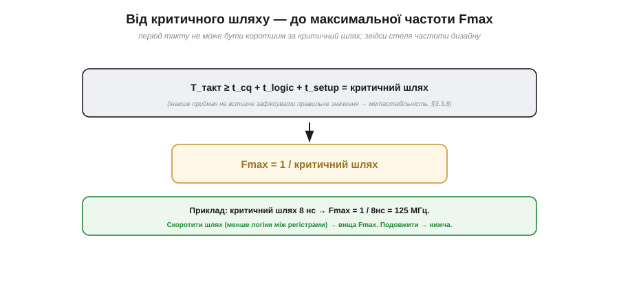
*Рис. 3.7.7.2. Період такту не може бути коротшим за критичний шлях: T_такт ≥ t_cq + t_logic + t_setup. Інакше приймач не встигне зафіксувати правильне значення (метастабільність, §3.3.8). Звідси максимальна частота: Fmax = 1 / критичний шлях. Приклад: шлях 8 нс → Fmax = 1/8нс = 125 МГц.*

Логіка тут залізна, і її варто проговорити. Якщо найдовший шлях триває, скажімо, 8 наносекунд, то давати новий фронт частіше ніж раз на 8 нс **не можна**: сигнал на найповільнішому маршруті просто не добіжить, приймач захопить недороблене значення й зірветься. Отже, період такту обмежений знизу критичним шляхом, а частота — обмежена зверху: **Fmax = 1 / критичний шлях**. Зверніть увагу на наслідок, протилежний інтуїції з §3.5.5: частоту тут визначає **не якийсь паспортний показник чипа**, а **ваш власний дизайн** — те, скільки логіки ви нагромадили між тригерами. Покладете багато — шлях довгий, Fmax низька; розкладете ощадливо — навпаки. Інструмент же має сказати вам, чи вкладається ваш критичний шлях у бажаний такт, і робить це через поняття запасу.

### Slack: запас або борг часу

Після трасування (§3.7.6) інструмент рахує **таймінг-аналіз**: для кожного шляху порівнює потрібний час із доступним періодом такту. Різниця зветься **slack** (запас), і її знак — це вирок дизайну.


*Рис. 3.7.7.3. Slack = період такту − потрібний час шляху. Ціль 100 МГц = період 10 нс. Шлях A триває 8 нс → slack = +2 нс (встигаємо, є запас). Шлях B триває 12 нс → slack = −2 нс (не встигаємо, **таймінг провалено**). Перший обов'язок після трасування — переконатися, що найгірший slack невід'ємний.*

Поняття slack робить таймінг **вимірюваним**, і саме ним оперує розробник щодня. Додатний slack означає «встигаємо із запасом стільки-то наносекунд» — добре, дизайн працюватиме надійно. Нуль — «рівно на межі», тривожно. **Від'ємний** slack — «не встигаємо», і це вирок: на заданій частоті схема працюватиме ненадійно або не працюватиме зовсім, бо найдовший шлях не вкладається в період. Тому першим ділом, отримавши результат трасування, дивляться на **найгірший** (worst-case) slack по всьому дизайну: якщо він невід'ємний — таймінг зійшовся, можна заливати; якщо ні — треба втручатися. Найчастіше втручання зводиться до одного перевіреного прийому. (Точну механіку розрахунку slack ми розпишемо у вставці 🧮 до §3.7.7.)

### Як лікують довгий шлях: конвеєр

Що робити, коли slack від'ємний — критичний шлях задовгий? Очевидне «знизити частоту» рятує не завжди, бо частота буває задана ззовні (швидкістю інтерфейсу, потоком даних). Головний прийом інший: **розрізати** довгий шлях тригером навпіл, перетворивши його на дві коротші ділянки. Це і є **конвеєризація** (*pipelining*), уже знайома нам із §3.5.6.


*Рис. 3.7.7.4. Було: уся логіка (12 нс) між двома тригерами → критичний шлях ≈ 12 нс, Fmax ≈ 83 МГц. Стало: посередині додано **регістр** (конвеєрний щабель), що ділить логіку на дві половини по 6 нс → критичний шлях ≈ 6 нс, Fmax ≈ 166 МГц (удвічі вище). Платою є зайвий такт латентності (§3.5.6): результат з'являється на такт пізніше.*

Тут елегантно змикаються дві теми Модуля 3. Конвеєр ми вперше зустріли в процесорі (§3.5.6) як спосіб перекрити стадії команди; у FPGA він стає універсальним інструментом таймінгу. Ідея та сама: довгий шлях — це багато роботи за один такт; уставивши регістр посередині, ми ділимо роботу на **два** такти, і кожна половина тепер коротша, тож період можна вкоротити, а Fmax підняти. Платимо тим самим, що й у процесорі: **латентністю** (§3.5.6) — результат тепер виходить на такт пізніше, бо проходить через зайвий регістр. Але **пропускна здатність** при цьому навіть зростає: дані течуть конвеєром швидше. Це фундаментальний компроміс цифрового проєктування — більше тактів затримки заради вищої частоти, — і на FPGA ним користуються постійно. До точного розрахунку, скільки щаблів і де додати, ми повернемось у вставці 🧮 до §3.7.7.

**Приклад (порахуймо Fmax до й після конвеєра).** Нехай ланцюг логіки між тригерами дає таку розкладку часу.

```
Параметри (типові порядки для навчального прикладу):
  t_cq    (clock-to-Q тригера)        = 0.5 нс
  t_setup (вимога setup приймача)      = 0.5 нс
  t_logic (затримка логіки на шляху)   = 11.0 нс   ← домінує

Критичний шлях = t_cq + t_logic + t_setup
              = 0.5 + 11.0 + 0.5 = 12.0 нс
Fmax = 1 / 12.0 нс ≈ 83.3 МГц

Розрізаємо логіку регістром навпіл (по 5.5 нс кожна половина):
  новий t_logic однієї ділянки = 5.5 нс
  критичний шлях = 0.5 + 5.5 + 0.5 = 6.5 нс
Fmax = 1 / 6.5 нс ≈ 153.8 МГц     (майже вдвічі вище)

Ціна: латентність зросла з 1 такту до 2 (результат на такт пізніше).
```
Висновок: вузьке місце — t_logic; розрізавши його регістром, ми майже подвоїли частоту ціною одного зайвого такту затримки.

> 🔧 **Навіщо це.** Таймінг — це те, на що розробник FPGA дивиться **після кожної збірки**, тож звикайте до трьох звичок. Перше: **читайте найгірший slack** — невід'ємний означає «дизайн працюватиме на цій частоті», від'ємний означає «ні», і доти, доки він від'ємний, заливати чип немає сенсу. Друге: **скорочуйте критичний шлях**, а не «оптимізуйте код» у софтовому сенсі — менше рівнів логіки між тригерами, обережніше з довгими ланцюгами арифметики; саме це, а не кількість рядків, визначає швидкість (§3.7.5). Третє: **конвеєризуйте**, коли частоти бракує, — додавайте регістрові щаблі, свідомо обмінюючи латентність на Fmax (§3.5.6). Ці три звички відрізняють дизайн, що надійно працює на потрібній частоті, від такого, що «то працює, то ні». Маючи цілісну картину — від мотивації до таймінгу, — ми готові до чесного порівняння FPGA з мікроконтролером.

> 🧮 **Загляньте у вставку:** [Критичний шлях і slack: звідки береться максимальна частота](r07-s7-m-critical-path.md) — повний розрахунок із урахуванням перекосу такту й часу логіки.

---

Підсумок §3.7.7: частоту FPGA обмежує **критичний шлях** — найдовший маршрут «від тригера до тригера». За один період такту сигнал має вийти з джерела (t_cq), пройти логіку (t_logic) і встигнути на вхід приймача за t_setup до фронту (§3.3.8); сума цих часів на найдовшому шляху не може перевищувати період. Звідси **Fmax = 1 / критичний шлях**, і визначає її **ваш дизайн**, а не паспорт чипа. Інструмент рахує **slack** = період − потрібний час: додатний — встигаємо, від'ємний — **таймінг провалено**; першим ділом перевіряють найгірший slack. Лікують довгий шлях **конвеєризацією** (§3.5.6): розрізають логіку регістром навпіл, кожна половина коротшає, Fmax росте — ціною зайвого такту **латентності**, але з вищою пропускною здатністю. Ми знаємо про FPGA достатньо, щоб тверезо зважити її проти звичного мікроконтролера.

---

## 3.7.8 FPGA чи мікроконтролер: чесні критерії вибору

Тепер, коли FPGA перестала бути загадкою, час на найпрактичніше питання, яке постає перед кожним інженером на старті проєкту: **FPGA чи мікроконтролер?** Питання це часто ставлять як «що краще», і саме така постановка хибна. Краще — **те, що пасує задачі**; у кожного інструмента є царина, де він явно сильніший, і царина, де він явно зайвий. Цей підрозділ не агітує ні за кого — він дає **чесні критерії**, за якими ви самі зважите конкретний випадок. Зберемо все, що ми вже знаємо з §3.7.1–§3.7.7, в одну порівняльну рамку, додамо те, про що досі мовчали — ціну й поріг входу, — і виведемо просте практичне правило.

### Порівняння за критеріями

Почнімо з прямого зіставлення по найважливіших осях. Зверніть увагу: жодна сторона не виграє за всіма — кожна має свої сильні клітинки.


*Рис. 3.7.8.1. Шість критеріїв. Справжня **паралельність**: МК — ні (одне ядро по черзі), FPGA — так (своя схема на канал). **Затримка**: у МК такти + джитер, у FPGA — наносекунди, стало. Складна **послідовна логіка**: МК легко (код, бібліотеки), FPGA громіздко. **Поріг входу**: у МК низький (годинами), у FPGA крутий (тижнями). **Ціна** простої задачі: МК — копійки, FPGA — дорожче плюс флеш. Зелене — де сторона явно сильніша.*

Прочитаймо цю таблицю не як змагання, а як **розподіл ролей**. Перші два рядки — вотчина FPGA, і ми вже знаємо чому (§3.7.1): справжня паралельність і стала наносекундна затримка недосяжні для послідовного ядра. Наступні рядки, навпаки, на боці мікроконтролера. Складна **послідовна** логіка — розбір протоколу, меню, файлова система, мережа — природно лягає на код із готовими бібліотеками, а на FPGA вимагала б громіздкого опису скінченних автоматів (§3.3.9). **Поріг входу** в МК незрівнянно нижчий: працюючу прошивку можна написати за години, тоді як опанування потоку FPGA (§3.7.6) і мислення схемами (§3.7.5) забирає тижні. І **ціна**: простий мікроконтролер коштує копійки й не потребує зовнішньої флеші, тоді як FPGA дорожча й тягне за собою обв'язку. Найнаочніше ця двоїстість видно на одному показнику — затримці.

### Один наочний приклад: затримка реакції

Щоб критерії не лишалися абстрактними, візьмемо одну вісь — **затримку реакції** — і покажемо порядки величин. Це той випадок, де перевага FPGA не на відсотки, а в рази.

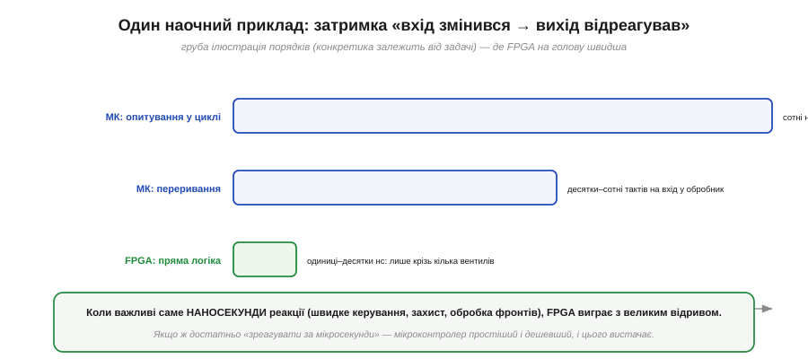
*Рис. 3.7.8.2. Груба ілюстрація порядків (конкретика залежить від задачі). МК з опитуванням у циклі: сотні нс–мкс, поки дійде черга до перевірки. МК через переривання: десятки–сотні тактів на вхід у обробник. FPGA з прямою логікою: одиниці–десятки нс — лише крізь кілька вентилів. Коли важливі саме наносекунди, FPGA виграє з великим відривом.*

Цей приклад добре окреслює, **де проходить вододіл**. Якщо вашій задачі досить зреагувати «за мікросекунди» — спалахнути світлодіодом на натискання, опитати давач, оновити дисплей, — мікроконтролер це робить легко, і його простота й дешевизна переважують. Але якщо реакція потрібна **за наносекунди й зі сталою затримкою** — швидке аварійне відключення, обробка фронтів швидкого сигналу, точне багатоканальне керування, — тут навіть переривання МК завеликі й «плавають», і потрібна пряма логіка FPGA. Затримка — лише одна вісь, але вона добре ілюструє загальний принцип: збігаються вимоги задачі з природною силою інструмента — він виграє; ні — програє. Перш ніж зводити все в дерево рішень, треба чесно зважити ще дві осі, які новачки часто недооцінюють: **ціну** й **поріг входу**.

### Ціна, енергія й поріг входу — те, про що мовчать порівняння швидкодії

Розмови про FPGA зазвичай крутяться навколо швидкості, та на практиці проєкт частіше вбивають **інші** три речі — гроші, енергія й час на опанування. Почнімо з **ціни**. Простий мікроконтролер коштує копійки й самодостатній: вставив у плату — і він працює. FPGA дорожча сама по собі, та головне — вона **тягне за собою обв'язку**: окрему флеш для бітстріму (§3.7.6), часто кілька різних напруг живлення з власними стабілізаторами, ретельне розведення плати під швидкі сигнали. Тож реальна ціна рішення на FPGA — це не лише чип, а вся ця інфраструктура; для дрібносерійного чи бюджетного пристрою вона нерідко вирішує справу на користь МК ще до будь-яких технічних аргументів.

Друга вісь — **енергія**, і тут картина не однобока. Само собою FPGA не «економніша» й не «ненажерливіша» — усе залежить від навантаження. На **ват корисної логіки** паралельне залізо часто ефективніше: те, на що процесор витратив би мільйони тактів (а отже, й енергію на кожен такт), FPGA робить кількома спеціалізованими блоками за раз. Але порожня чи слабко завантажена FPGA все одно споживає помітний струм спокою на саму свою тканину й конфігурацію, тоді як мікроконтролер у режимі сну опускається до мікроамперів. Тому для пристрою «прокинувся, швидко щось зробив, заснув на годину» — типова автономна задача на батарейці — МК майже завжди ощадливіший, а перевага FPGA в енергоефективності розкривається лише під **постійним важким паралельним навантаженням**.

Третя, і часто найнедооціненіша, вісь — **поріг входу** (*barrier to entry*), а з ним і час до робочого пристрою. Працюючу прошивку для МК пишуть готовими бібліотеками за години, відлагоджують звичним покроковим налагоджувачем, а помилку виправляють перезаливанням за секунди. Дорога на FPGA крутіша: треба перебудувати мислення з «кроків» на «схему» (§3.7.5), опанувати весь потік синтезу й P&R (§3.7.6), а кожна збірка великого дизайну триває довго, і відлагоджувати паралельне залізо складніше, ніж читати лог послідовної програми. Цей **час на опанування й ітерацію** — реальна стаття витрат проєкту, і її легко недооцінити, надивившись на самі лиш цифри швидкодії. Маючи всі осі — паралельність, затримку, ціну, енергію, поріг входу, — звести їх у рішення вже неважко.

### Орієнтовне дерево рішень

Звівши міркування докупи, дістанемо кілька запитань, що зазвичай вирішують справу. Це не догма, а здоровий глузд, оформлений як послідовність розвилок.


*Рис. 3.7.8.3. Грубий орієнтир. Немає жорсткої паралельності й наносекундної реакції? Якщо потік ще й уміщується в одне ядро — **мікроконтролер**. Потрібні паралельність чи наносекунди? Якщо поряд є й купа складної послідовної логіки — **FPGA з процесором усередині** (softcore, §3.7.9); якщо ні — **чиста FPGA**. Вибір диктує задача, а не мода.*

Логіка цього дерева підсумовує весь розділ. Стартова розвилка — головна: **чи є жорстка паралельність або потреба в наносекундній реакції** (§3.7.1)? Якщо ні, і задача вкладається в послідовне ядро по тактах, — беріть мікроконтролер, він простіший, дешевший і швидший у розробці; шукати тут FPGA означало б платити складністю ні за що. Якщо ж так — далі питання, **чи багато поряд звичайної послідовної логіки** (меню, мережа, конфігурація). Якщо її чимало, найкраще рішення — не «або-або», а **обидва разом**: FPGA для паралельного заліза плюс процесор **усередині неї** для рутини. Саме до цього гібрида — softcore — ми перейдемо в §3.7.9. А якщо потрібна тільки паралельна швидкість без рутини — чиста FPGA. Зверніть увагу, що в дереві немає переможця за замовчуванням: кожна гілка веде до інструмента, відповідного **конкретним** вимогам.

> 🔧 **Навіщо це.** Це питання ви розв'язуватимете на старті **кожного** серйозного проєкту, і ціна помилки висока — невдалий вибір тягне за собою тижні переробок. Тримайте в голові суть: **мікроконтролер — типова відповідь** (дешево, просто, гнучко через код), і відходити від неї варто лише за вагомої причини; **FPGA — коли задача жорстко паралельна або вимагає наносекундної детермінованої реакції** (§3.7.1), бо саме цього послідовне ядро дати не може; **обидва разом** — коли поряд зі швидким залізом потрібна й «звичайна» логіка (§3.7.9). І не забувайте про **поріг входу й ціну**: FPGA коштує і грошей, і часу на опанування, тож тягнути її в задачу, що чудово лягає на МК, — поширена й дорога помилка. Чесно зваживши критерії, ви оберете не модне, а **доречне**. Лишився останній місток між двома світами — процесор, що живе всередині FPGA.

---

Підсумок §3.7.8: вибір «FPGA чи мікроконтролер» — це **не «що краще», а «що пасує задачі»**. FPGA явно сильніша у двох речах (§3.7.1): справжня **паралельність** і **стала наносекундна затримка**. Мікроконтролер сильніший у решті: складна **послідовна** логіка (код і бібліотеки проти громіздких автоматів), низький **поріг входу** (години проти тижнів) і **ціна** (копійки без зовнішньої флеші). Наочний вододіл — затримка: досить мікросекунд — беріть МК; потрібні наносекунди зі сталістю — FPGA. Практичне правило: **МК — типова відповідь**, FPGA — коли задача жорстко паралельна чи вимагає наносекундної реакції, **обидва разом** — коли поряд зі швидким залізом треба й рутинна логіка. Останній випадок підводить нас до елегантного гібрида — процесора, зібраного прямо в тканині FPGA.

---

## 3.7.9 М'яке ядро: процесор усередині FPGA (softcore)

Розділ замикає коло несподіваним поворотом. Ми почали з того, що протиставили FPGA процесорові (§3.7.1): паралельне залізо проти послідовних інструкцій. А закінчуємо тим, що кладемо **процесор усередину FPGA** — будуємо його з тих самих LUT і тригерів, що й решту схеми. Звучить як суперечність, та насправді це природний підсумок усього, що ми дізналися: якщо FPGA вміє стати **будь-якою** цифровою схемою, то вміє стати й процесором, бо процесор — теж цифрова схема (§3.5). Такий процесор зветься **м'яким ядром** (*soft core*, softcore), і цей підрозділ — про те, що це таке і, головне, **коли** воно має сенс. Почнімо з того, чим м'яке ядро відрізняється від звичного.

### Тверде ядро проти м'якого

Процесор усередині чипа з FPGA буває двох ґатунків, і їх важливо не плутати. **Тверде ядро** (*hard core*) — це готовий процесор, випалений у кремнії поряд із тканиною. **М'яке ядро** — процесор, **зібраний** із програмованих клітинок самої тканини.

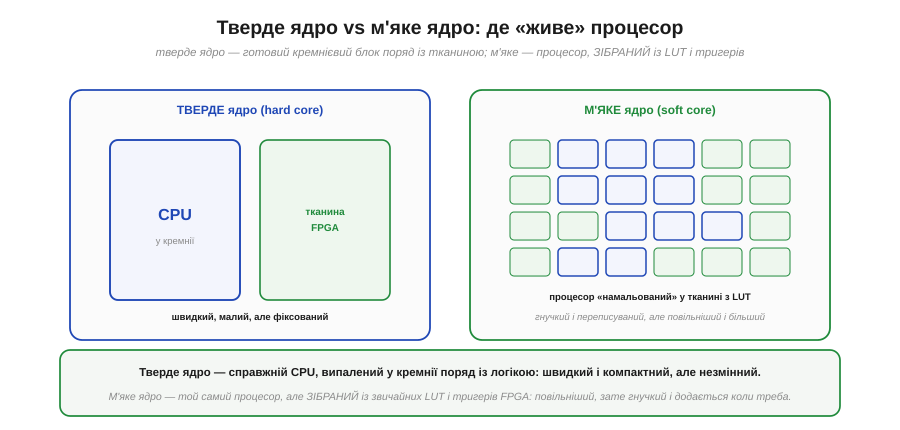
*Рис. 3.7.9.1. **Тверде ядро**: справжній CPU, випалений у кремнії поруч із тканиною FPGA, — швидкий і компактний, але **фіксований** (його не зміниш). **М'яке ядро**: той самий процесор, але «намальований» у тканині з LUT і тригерів (§3.7.4), — повільніший і більший, зате **гнучкий**, переписуваний і додається тоді, коли потрібен.*

Різниця між ними — це знайомий компроміс «спеціалізоване проти універсального», тільки всередині одного чипа. **Тверде ядро** — як спеціальні блоки BRAM і DSP із §3.7.4: зроблене в кремнії заздалегідь, тож працює на повній швидкості й займає мало місця, але його **не переробиш** — який є, такий є. **М'яке ядро** будується з універсальної тканини, як і будь-яка ваша логіка, тож воно повільніше (бо складене з LUT, а не виточене в кремнії) і з'їдає клітинки, зате його можна **налаштувати під себе**, перенести на інший чип і додати рівно тоді, коли треба, не змінюючи мікросхему. Саме гнучкість м'якого ядра й робить його цікавим — особливо у поєднанні з рештою тканини.

### Сила softcore: процесор поряд із власним залізом

Найцінніше в м'якому ядрі розкривається, коли воно працює **не саме**, а в парі зі спеціалізованими апаратними блоками в тій самій тканині. Тоді кожна частина робить те, що їй найкраще вдається.


*Рис. 3.7.9.2. В одній FPGA: **м'яке ядро** веде «повільну» рутину (меню, мережу, налаштування, неспішні рішення), а поряд — окремі **апаратні блоки** (DSP-фільтр, швидкий ввід-вивід, ШІМ-канали), що беруть на себе «гарячі» потоки. Процесор і прискорювачі спілкуються шиною; кожен прискорювач працює паралельно й реагує за наносекунди.*

Ось де гібрид показує справжню силу й знімає уявну суперечність початку розділу. Згадайте дилему з §3.7.8: FPGA незрівнянна в паралельному залізі, але складна послідовна логіка — меню, протоколи, конфігурація — лягає на неї громіздко. М'яке ядро розв'язує цю дилему **всередині однієї мікросхеми**: рутину пише **процесор** (зручно, звичним кодом, як на будь-якому МК), а «гарячі» паралельні потоки беруть на себе **апаратні блоки** поряд (швидко, з наносекундною затримкою, §3.7.1). Виходить найкраще з обох світів: гнучкість програмування там, де вона доречна, і паралельна швидкість заліза там, де потрібна вона. Понад те, до м'якого ядра можна **долучати власну периферію** прямо в тканині — навіть додавати **свої інструкції**, яких немає в жодному готовому процесорі. Та попри всю принадність, м'яке ядро доречне не завжди — і чесно окреслити межі важливо.

### Коли це має сенс, а коли ні

М'яке ядро — спокуслива ідея, тож варто тверезо назвати, **коли** воно виправдане, а коли краще взяти окремий мікроконтролер. Адже softcore не безкоштовний: він з'їдає клітинки й працює повільніше за «справжній» процесор того ж класу.


*Рис. 3.7.9.3. **Доречно**: FPGA вже в системі з іншої причини; потрібна гнучка послідовна логіка поряд зі швидким залізом; хочеться власних інструкцій чи периферії; зручно тримати все на одному чипі; потрібна переносимість між FPGA. **Зайве**: потрібен лише процесор без логіки; критичні максимальна частота чи ціна; вистачає дешевого готового МК; немає паралельних блоків; у цій FPGA вже є тверде ядро.*

Правило, що випливає з цього зіставлення, просте й чесне. М'яке ядро виправдане тоді, коли FPGA **вже потрібна** заради паралельного заліза, а поряд зручно мати «звичайний» процесор для рутини — тоді softcore економить окрему мікросхему й тримає все в одному чипі, ще й дає гнучкість власних інструкцій і переносимість. Натомість якщо вам потрібен **лише** процесор — без паралельної логіки, без наносекундних блоків, — окремий мікроконтролер майже завжди буде **дешевшим, швидшим і простішим** (§3.7.8): не платіть тканиною FPGA за те, що готовий МК робить краще й за копійки. М'яке ядро — не заміна мікроконтролеру, а **доповнення** до FPGA там, де процесорна зручність потрібна поруч із паралельним залізом. У цьому й увесь сенс: воно живе не замість одного зі світів, а на містку між ними — тому ним і годиться завершити розділ про програмовану логіку.

> 🔧 **Навіщо це.** Практична користь — **не сприймати softcore як безкоштовний обід і не плутати його роль**. По-перше, м'яке ядро — це варіант лише тоді, коли **FPGA вже у вашому проєкті** з паралельних причин; тягнути FPGA **заради** softcore майже завжди гірше за окремий МК (§3.7.8) — дорожче, повільніше, складніше. По-друге, його справжня цінність — у **гібриді**: процесор веде рутину (меню, протоколи, конфігурацію), а апаратні блоки поряд тягнуть паралельні потоки; розподіляйте роботу за цим принципом. По-третє, пам'ятайте про **ціну в ресурсах**: softcore з'їдає LUT, тригери й BRAM (§3.7.4), які могли б піти на корисну логіку, тож беріть найпростіше ядро, що покриває потребу. Розумно вжите м'яке ядро дає рідкісне поєднання — гнучкість коду й швидкість заліза на одному кристалі; невдало вжите — лише марнує ресурси.

---

Підсумок §3.7.9: оскільки процесор — теж цифрова схема (§3.5), FPGA може **стати** процесором; такий процесор, зібраний із LUT і тригерів тканини (§3.7.4), зветься **м'яким ядром** (softcore). Його протилежність — **тверде ядро**, випалене в кремнії поряд із тканиною: швидке й компактне, але фіксоване; м'яке — повільніше й більше, зате гнучке, переносиме й додається за потреби. Сила softcore — у **гібриді**: процесор веде складну **послідовну** рутину (меню, мережу, конфігурацію) звичним кодом, а спеціалізовані **апаратні блоки** поряд тягнуть паралельні «гарячі» потоки (§3.7.1) — найкраще з обох світів, ще й із власними інструкціями та периферією. Але softcore **не безкоштовний** (з'їдає клітинки, повільніший за рівний МК), тож доречний лише коли FPGA **вже потрібна** заради паралельного заліза; якщо потрібен **лише** процесор — окремий мікроконтролер дешевший і простіший (§3.7.8). М'яке ядро — не заміна, а **доповнення** на містку між послідовним і паралельним світами.

---

Цим завершується Розділ 3.7. Ми пройшли всю програмовану логіку — від **мотивації** (паралельність у залізі там, де послідовний процесор не встигає, §3.7.1) через **родовід** чипів (PAL → GAL → CPLD → FPGA, §3.7.2), серцевину — **LUT** (таблиця замість вентилів, §3.7.3), **будову** чипа (клітинки, маршрутизація, BRAM, DSP, §3.7.4), **опис** схеми мовою HDL (синтез ≠ виконання, §3.7.5) і **потік** інструментів (синтез → P&R → бітстрім, §3.7.6) до **таймінгу** (критичний шлях і Fmax, §3.7.7), чесного **вибору** між FPGA та МК (§3.7.8) і **м'якого ядра** як містка між ними (§3.7.9). Тепер ви знаєте, як працює залізо, що **стає** схемою на вашу команду. Та хоч би яким потужним був процесор чи FPGA, вони раз у раз упираються в брак власної пам'яті — для кадрів дисплея, аудіо, логів. Як підключають **зовнішню** пам'ять — велику, але повільнішу — і чому DDR не приєднаєш до звичайних ніжок, — про це наступний розділ.

> ▶️ Далі: [Розділ 3.8 — Зовнішня пам'ять](../r08-external-memory/r08-external-memory.md)
