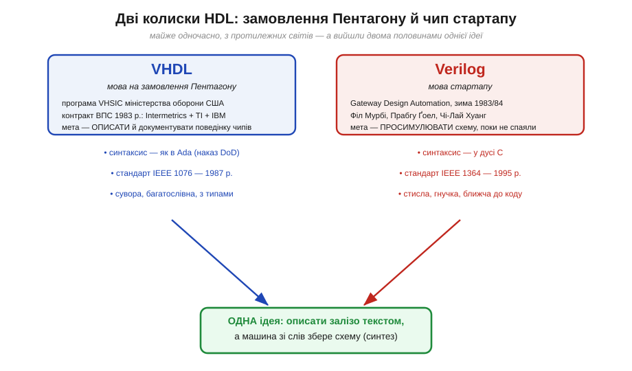
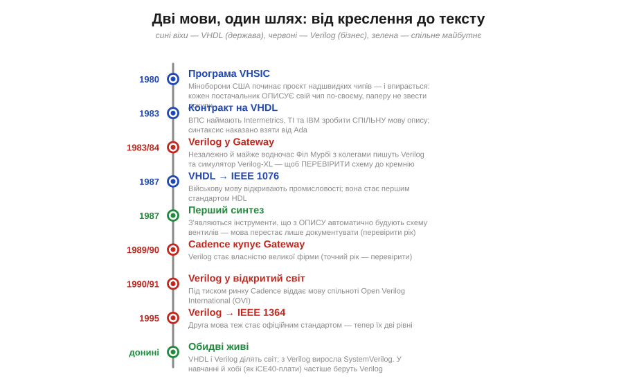
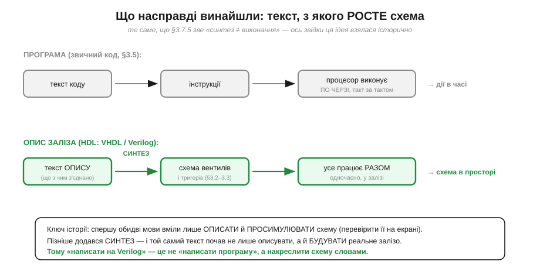
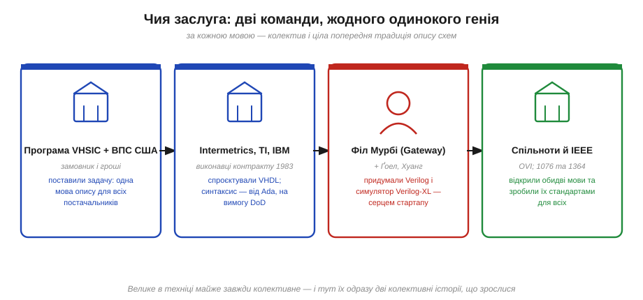

# 📜 Народження VHDL і Verilog: мова на замовлення Пентагону й мова стартапу

> Це історична вставка до теми [§3.7.5 «HDL: описуємо залізо, а не пишемо програму»](r07-fpga.md). Ми щойно засвоїли несподівану річ: текст на HDL — це не програма, яку процесор виконує по черзі (§3.5), а **опис схеми**, з якого машина потім збирає реальне залізо. Слово «синтез» там стояло поряд зі словом «виконання» з нагадуванням: це **різні** дії. Але звідки взялася сама ця дивна ідея — креслити схему словами? Хто перший вирішив, що замість малювати вентилі (§3.2) і тригери (§3.3) на схемі їх можна **описати реченнями** — і чому таких мов одразу дві, VHDL і Verilog, а не одна? Виявляється, за цими двома назвами стоять дві майже одночасні, але геть протилежні історії: одну мову замовив **Пентагон** великим корпораціям, другу за зиму написала жменька людей у **стартапі**. Розберімо, як ці два світи незалежно дійшли до однієї думки — і чому в підсумку обидві мови дожили до наших днів і ділять світ навпіл.

Почнімо з питання, яке §3.7.5 лишив за дужками. Там ми побачили, **що** таке HDL і чим опис відрізняється від програми. Та чому ця ідея взагалі знадобилася — адже схеми десятиліттями просто **малювали**? Щоб відчути, навіщо знадобилося описувати залізо текстом, треба повернутися в кінець 1970-х і подивитися, у яку стіну вперлися ті, хто будував складні цифрові системи. Стіна ця була подвійна, і кожна з двох мов народилася як відповідь на свій бік цієї стіни.

*Рис. 3.7.5i.1. Дві мови з протилежних світів. Ліворуч — **VHDL**: її замовило міністерство оборони США як частину великої програми, мета була **документувати** поведінку чипів від різних постачальників однією строгою мовою. Праворуч — **Verilog**: її за зиму написав маленький стартап, щоб **просимулювати** свою схему ще до того, як її спаяють у кремнії. Світи різні — а дійшли вони до однієї думки: описати залізо текстом, а решту хай зробить машина. Саме цю спільну думку §3.7.5 і називає «синтез».*

---

## Стіна, у яку вперлися всі: схему вже не намалюєш

Згадаймо, як виглядала цифрова схема в нашому курсі досі. У §3.2 ми малювали вентилі AND, OR, NOT і з'єднували їх лініями; у §3.3 додавали тригери й такт. Поки схема — це десяток-другий елементів, її чудово видно на одному аркуші: дивишся й розумієш, що з чим з'єднано. Саме так десятиліттями й проєктували — **малюючи** схему, елемент за елементом. Цей спосіб навіть має назву, яку ви ще зустрінете: схемне введення (*schematic capture*).

Але наприкінці 1970-х кількість елементів на одному кристалі почала зростати **лавиною**. Там, де колись було сто вентилів, ставало десять тисяч, потім сто тисяч. І спосіб «намалювати схему» просто **зламався об масштаб** — з тієї самої причини, з якої неможливо охопити оком карту з мільйоном вулиць. Аркуш, на якому сто тисяч вентилів сполучені лініями, не читає вже ніхто: у ньому неможливо ні розібратися, ні знайти помилку, ні щось змінити, не зачепивши сотні інших ліній. Складність переросла малюнок.

Тут і визріла думка, що лежить в основі всього §3.7.5. А що, як схему не **малювати**, а **описувати** — реченнями якоюсь точною мовою? Адже коли ми кажемо «вихід дорівнює A AND B», ми передаємо рівно той самий зв'язок, що й намальована лінія між вентилем і двома входами, — тільки текстом. Текст же має чудові властивості, яких немає в малюнка: його легко правити, у ньому легко шукати, його можна збирати з частин, як програму, і — головне — його може **прочитати інша машина** й щось із ним зробити. Сама ідея описати залізо мовою, схожою на мову програмування, і дала клас, який ми звемо **HDL** (*Hardware Description Language*, мова опису апаратури).

Та сама стіна мала два боки, і вони дошкуляли двом дуже різним людям. **Військового замовника** мучив бік **документування**: як описати чужий складний чип так, щоб опис був однозначний, переживав свого автора й годився будь-якому підряднику. **Інженера-розробника** мучив бік **перевірки**: як переконатися, що схема правильна, **поки** її не віддали на дорогий і незворотний випуск кремнію. Перший біль породив VHDL, другий — Verilog. Підемо за кожним окремо.

---

## Мова на замовлення Пентагону: як народжувався VHDL

Перша з двох історій починається не в інженерній фірмі, а в кабінетах **міністерства оборони США**. На початку 1980-х воно вело велику програму під назвою **VHSIC** (*Very High Speed Integrated Circuit*, надшвидкі інтегральні схеми) — ставку на нове покоління швидких чипів для військової техніки. І ось у цій програмі спливла нудна на вигляд, та насправді болюча проблема, прямо з нашої «стіни».

Військова система живе **десятиліттями**, а складають її з чипів, які роблять **різні** підрядники, кожен по-своєму. Через кілька років після випуску постачальника може не стати, документація — застаріти, інженери — піти. Як тоді зрозуміти, що саме робить чип усередині складної ракети чи радара, якщо єдиний його опис — креслення, зрозуміле лише авторові? Потрібна була **єдина строга мова**, якою будь-який підрядник описав би поведінку свого чипа так, щоб цей опис був однозначним, повним і зрозумілим через двадцять років будь-кому іншому. Спершу йшлося саме про **документування** — описати **поведінку** чипа, а не накреслити його начинку.

*Рис. 3.7.5i.2. Спільний таймлайн обох мов. Сині віхи — лінія VHDL (від держави): програма VHSIC (1980) впирається в різнобій описів, тож 1983 року ВПС замовляють спільну мову, а 1987-го вона стає стандартом IEEE 1076. Червоні віхи — лінія Verilog (від бізнесу): майже водночас (зима 1983/84) Філ Мурбі з колегами пишуть свою мову й симулятор, далі її купує Cadence, а під тиском ринку відкриває спільноті; 1995 року Verilog теж стає стандартом (IEEE 1364). Зелене — спільне: десь у цей час з'являється **синтез**, і обидві мови з документації перетворюються на креслення, з якого росте залізо.*

Щоб таку мову зробити, 1983 року Військово-повітряні сили США уклали контракт (його номер — `F33615-83-C-1003`, він і досі гуляє в історичних довідках) із трьома виконавцями, кожен зі своєю роллю. Фірма **Intermetrics** була головним підрядником і відповідала за саму мову; **Texas Instruments** додавала досвід проєктування чипів; **IBM** — досвід побудови обчислювальних систем. Уже з цього складу видно характер майбутньої мови: її робили не одинаки-ентузіасти, а консорціум великих гравців під наглядом держави — звідси її строгість, ґрунтовність і певна офіційна важкість. Назвали її **VHDL** — за тією самою програмою: *VHSIC Hardware Description Language*, тобто «мова опису апаратури з програми VHSIC».

Одна деталь цього замовлення варта окремої уваги, бо вона добре пояснює, **чому VHDL виглядає саме так**. Міністерство оборони на той час уже мало улюблену мову програмування — **Ada** (її, до речі, назвали на честь Ади Лавлейс, із чиєю історією ми зустрічалися у [§3.5.1](../ch18-processor-architecture/ch18-s1-history-babbage-lovelace.md)). І замовник прямо **зажадав**: хай синтаксис нової мови якомога більше повторює Ada — щоб не винаходити наново поняття, які в Ada вже були ретельно продумані й перевірені. Тому, відкривши код на VHDL сьогодні, ви побачите багатослівні, суворі, повні оголошень типів конструкції — це впізнаваний почерк Ada, а отже й слід військового замовлення в кожному рядку. Мова, по суті, успадкувала дисципліну тієї традиції, з якої її попросили вирости.

> 🔧 **Навіщо це.** Зверніть увагу, як часто характер інструмента визначається не технікою, а тим, **хто і навіщо його замовив**. VHDL сувора й багатослівна не випадково: її робили, щоб **однозначно й надовго описати** чужий чип у системі, яка житиме десятиліття, — і строгість тут не вада, а вимога. Коли вам трапиться код на VHDL, що здається надміру церемонним проти стислого Verilog, згадайте: це не примха авторів, а спадок Пентагону, якому потрібна була мова-документ, зрозуміла будь-кому й через двадцять років. Інструменти несуть на собі відбиток своєї колиски.

Програма, замовлена державою, мала б лишитися у вузькому військовому світі. Та сталося протилежне: 1987 року VHDL **відкрили** для всієї промисловості, зробивши її стандартом інституту **IEEE** під номером **1076** (звідси й звична назва — «VHDL-87», а далі редакції 1993, 2008 та інші). Мова, народжена як внутрішній військовий інструмент опису, стала першим у світі офіційним стандартом HDL — і пішла гуляти цивільною інженерією. Але поки держава неквапом доводила свою мову до стандарту, у зовсім іншому кінці світу — у крихітному стартапі — уже кипіла друга, геть несхожа історія.

---

## Мова стартапу: Verilog, написаний за зиму

Друга колиска HDL не могла бути дальшою від першої. Жодних міністерств, контрактів і консорціумів — маленька каліфорнійська фірма, кілька людей і конкретний інженерний головний біль. І біль цей був не про документування, а про **перевірку**.

Поставмо себе на місце розробника чипа десь на початку 1980-х. Ти спроєктував складну схему — і мусиш віддати її на виготовлення, а це довго й **дуже** дорого. Якщо в схемі ховається помилка, ти дізнаєшся про неї лише за тижні, коли з фабрики приїде непрацездатний кремній, — і весь цикл (а з ним гроші й час) доведеться повторити. Болюче питання очевидне: як **перевірити** схему **до** того, як її спаяли? Як «прокрутити» її на комп'ютері, подати на входи сигнали й подивитися, що буде на виходах, — поки ще нічого не вилито в кремній і все можна виправити одним рухом?

Саме цю задачу й узялася розв'язати фірма, яку 1985 року назвали **Gateway Design Automation** (спершу вона звалася інакше — *Automated Integrated Design Systems*). Її душею став інженер **Філ Мурбі** (*Phil Moorby*); поряд із ним історія називає **Прабгу Ґоела** (*Prabhu Goel*), засновника фірми, і **Чі-Лая Хуанга** (*Chi-Lai Huang*). Десь упродовж зими **1983/84 років** ця невелика команда зробила відразу дві зв'язані речі: придумала мову, якою описують схему, — назвали її **Verilog**, — і написала програму-**симулятор**, що цей опис «прокручує». Симулятор дістав ім'я **Verilog-XL** і згодом на ціле десятиліття став фактичним галузевим стандартом перевірки схем.

Вдумаймося в разючий збіг у часі. Поки великі корпорації за державним контрактом ретельно будували VHDL як мову-**документ**, маленький стартап **майже водночас і незалежно** робив Verilog як мову-**інструмент перевірки**. Жодна команда не повторювала іншу — вони навіть не йшли до однієї мети: одним треба було **описати** чужий чип на майбутнє, іншим — **просимулювати** власний чип просто зараз. І все ж обидві прийшли до однієї серцевинної ідеї §3.7.5: **схему описують текстом**. Це той самий випадок, що ми вже не раз бачили в історії техніки, — коли ідея **визріла** в повітрі, і до неї незалежно доходять різні люди з різних боків, щойно час настав.

> 🔧 **Навіщо це.** Запам'ятайте цю пару протилежностей — вона пояснює дуже практичну річ: **чому VHDL і Verilog такі різні на вигляд**. VHDL виросла з документування у великих структурах — звідси її строгість і багатослівність. Verilog виросла з живої інженерної потреби швидко перевіряти схему — звідси її стислість, гнучкість і близькість до звичного коду в дусі C. Коли ви обиратимете, з чого почати (а в навчанні й у хобі, як-от на платах класу iCE40, частіше беруть саме Verilog), ви насправді обираєте не лише синтаксис, а й **дух** однієї з цих двох колисок. Жодна не «правильніша» — вони просто народилися розв'язувати різні половини одного болю.

---

## Перелом: коли опис навчився будувати залізо

Тут історія робить найважливіший для §3.7.5 поворот — і його легко проґавити. Зверніть увагу: і VHDL, і Verilog **спершу** вміли лише дві речі — **описати** схему й **просимулювати** її, тобто прокрутити на комп'ютері й подивитися поведінку. Це вже багато, але це ще **не** те, про що говорить §3.7.5. Опис-документ і опис-для-симуляції самі по собі **не** перетворюються на залізо: вони лише розповідають **про** схему, а зібрати її з вентилів і тригерів усе одно мусив інженер.

Перелом стався, коли з'явився **синтез** (*synthesis*) — інструмент, який бере той самий текст опису й **сам** будує з нього схему вентилів і тригерів (§3.2–3.3). Ось тоді HDL і став тим, чим його знає §3.7.5: мовою, з якої **росте залізо**. Текст перестав лише описувати схему — він почав її **створювати**. Саме поява синтезу й проводить ту різку межу між «програмою» і «описом заліза», на якій наголошує тема: одна й та сама мова з документації перетворилася на **креслення**, що його машина втілює в реальні з'єднання. (Точні роки появи перших придатних синтезаторів варто уточнювати — **(перевірити)**; важлива тут не дата, а сам якісний стрибок.)

*Рис. 3.7.5i.3. Звідки взялося «синтез ≠ виконання» (§3.7.5). Угорі — звична **програма** (§3.5): текст коду → інструкції → процесор виконує їх **по черзі**, такт за тактом; результат розгорнуто **в часі**. Унизу — **опис заліза** на HDL: текст опису → **синтез** → схема вентилів і тригерів → усе працює **разом**, одночасно; результат розгорнуто **в просторі**. Спершу обидві мови вміли лише описати й просимулювати схему; із приходом синтезу той самий текст почав не просто описувати, а **будувати** реальне залізо. Тому «написати на Verilog» — це не «написати програму», а накреслити схему словами.*

Ця відмінність — не дрібний відтінок, а сама суть того, що ми вивчаємо в §3.7.5, тож затримаймося на ній. Коли ви пишете **програму** (§3.5), кожен її рядок — це **дія в часі**: процесор бере інструкцію за інструкцією й виконує їх **послідовно**, одну по одній. Коли ви пишете **опис на HDL**, кожен його рядок — це **частина схеми в просторі**: усі описані шматки заліза існують і працюють **одночасно**, бо кожен живе у власному фрагменті кремнію. Через це той самий на вигляд текст означає геть різне: програму машина **виконує** крок за кроком, а опис заліза машина **синтезує** — будує з нього схему, що потім працює вся й відразу. Сплутати ці два режими — найперша й найтиповіша пастка тих, хто переходить від програмування до HDL; історично ж бачимо, що навіть самі мови дійшли до синтезу не одразу, а спершу були лише описом і симуляцією.

---

## Дві мови, один світ: чому вижили обидві

Лишилося звести обидві нитки — державну й стартапну — і подивитися, чим усе скінчилося. А скінчилося несподівано рівноправно: жодна мова не перемогла іншу, і сьогодні вони мирно ділять світ. Як так вийшло?

Доля Verilog якийсь час висіла на волосині — і ось чому. Належала вона приватній фірмі Gateway, а коли близько **1989–1990 років** (точний рік у джерелах різниться — **(перевірити)**) Gateway купила велика компанія **Cadence**, мова стала **власністю** одного гравця. Тут історія перегукується з тим, що ми вже бачили в долі набору команд RISC-V у [§3.5.4](../ch18-processor-architecture/ch18-s4-history-riscv.md): доки мова комусь **належить**, її поширення впирається в інтереси власника. Над Verilog нависла та сама тінь приватної монополії, що колись — над «мовою процесора».

Розв'язали це так само, як згодом і з RISC-V, — **відкритістю**. Під тиском ринку, де конкурент уже мав свій відкритий стандарт (VHDL від IEEE), Cadence близько **1990–1991 років** **віддала** Verilog у вільне користування, передавши мову незалежній спільноті **Open Verilog International** (OVI). А 1995 року Verilog, як перед тим VHDL, став повноцінним стандартом **IEEE** — під номером **1364** (звідси «Verilog-95», далі редакція 2001 року й інші). Відкриття зрівняло мови в правах: тепер їх було **дві**, обидві стандартні, обидві доступні всім — і ринок просто прийняв обидві.

*Рис. 3.7.5i.4. Точна атрибуція, по ролях. **Програма VHSIC і ВПС США** — замовник: поставили задачу та дали гроші на єдину мову опису для всіх підрядників. **Intermetrics, Texas Instruments, IBM** — виконавці контракту 1983 року, що спроєктували VHDL (синтаксис — від Ada, на вимогу міноборони). **Філ Мурбі** з колегами **Ґоелом і Хуангом** у стартапі Gateway — придумали Verilog і симулятор Verilog-XL. **Спільноти й IEEE** (OVI; стандарти 1076 і 1364) — відкрили обидві мови та зробили їх надбанням усіх. Двох одиноких геніїв тут немає — є дві колективні історії, що зрослися в один інструмент.*

І ось тут, наприкінці, варто віддати належне **точно** — без зручного спрощення «таку-то мову придумав такий-то геній». Як майже завжди у великих винаходах техніки (ми бачили це і з Беббіджем та Лавлейс у §3.5.1, і з відкритою ISA RISC-V у §3.5.4), за HDL стоїть **праця багатьох рук** — ба більше, тут одразу **дві** колективні історії. VHDL — не витвір однієї людини, а плід **державного замовлення** й роботи трьох корпорацій: задачу поставила програма VHSIC і ВПС, а саму мову зробили команди Intermetrics, Texas Instruments та IBM, спираючись на готову традицію Ada. Verilog ближчий до образу «винаходу однієї людини» — рушієм був **Філ Мурбі**, — та й він працював не сам, а з **Прабгу Ґоелом** і **Чі-Лаєм Хуангом** у Gateway, і саму мову до світового стандарту довела вже **спільнота** через OVI та IEEE. Тож на питання «хто придумав мови опису заліза» чесна відповідь — **багато хто, з двох різних світів**: держава й корпорації з одного боку, інженери стартапу з іншого, а відкрили все для всіх — спільноти й комітети стандартів.

---

## Що з цієї історії взяти

Озирнімося на пройдений шлях. Ми почали з питання, яке §3.7.5 лишив у тіні: **звідки** взялася дивна ідея описувати залізо текстом? Виявилося, що до неї майже одночасно й незалежно дійшли два протилежні світи, бо обидва вперлися в одну стіну — складність схем переросла малюнок. **Пентагон** замовив VHDL як строгу мову-**документ**, щоб однозначно й надовго описувати чужі чипи; **стартап** Gateway написав Verilog як гнучкий **інструмент перевірки**, щоб прокрутити власну схему до кремнію. Різні колиски — а серцевина одна: схему **описують**, а не малюють.

Та головний слід цієї історії — той самий, що й у §3.7.5, тільки тепер видно його **коріння**. Спершу обидві мови лише **описували** й **симулювали** схему; справжній перелом настав із появою **синтезу**, коли той самий текст почав не розповідати про схему, а **будувати** її з вентилів і тригерів. Ось чому тема так наполягає: HDL — це не програма, яку «виконують» крок за кроком, а **креслення**, з якого синтез **вирощує** залізо, що працює все й одночасно. Історія двох мов — це, по суті, історія того, як людство навчилося креслити схеми словами, а тоді віддало машині збирати їх у кремній.

І ще одне, тихіше, але важливе. Доля Verilog — від приватної власності Cadence до відкритого стандарту IEEE — майже дослівно повторила пізнішу долю набору команд RISC-V (§3.5.4): доки мова комусь належить, вона скута, а відкритий стандарт оживає для всіх. Тримаймо цю думку в голові, повертаючись до §3.7.5: коли ви напишете свій перший опис на Verilog і побачите, як із кількох рядків тексту синтез збирає реальну схему, згадайте — за цією буденною дією стоять і військова програма Пентагону, і безсонна зима маленького стартапу, і ціла спільнота, що зробила обидві мови спільним надбанням.

> ▶️ Повернутися до теми: [§3.7.5 HDL: описуємо залізо, а не пишемо програму](r07-fpga.md)
