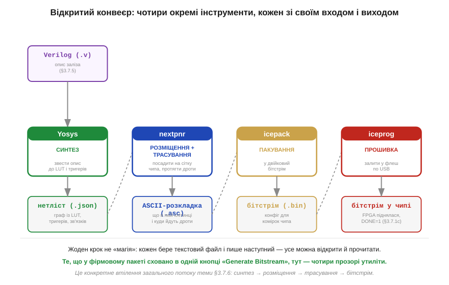
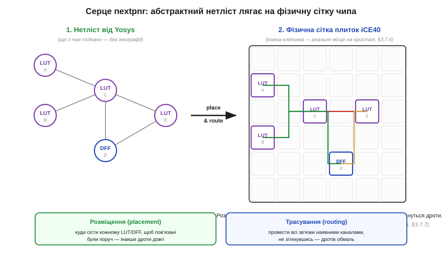
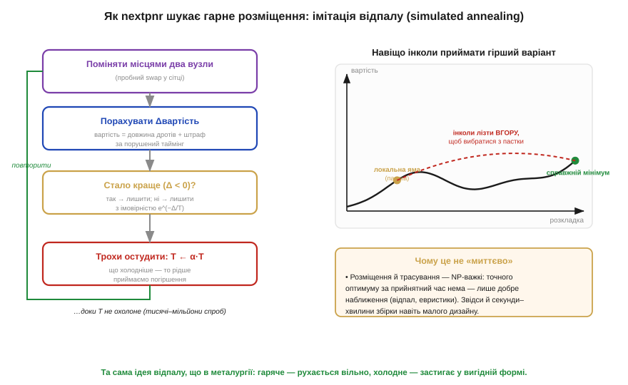

# Відкритий тулчейн: Yosys → nextpnr → бітстрім для iCE40

> ⚙️ Алгоритмічна вставка до теми [§3.7.6 «Потік розробки: синтез → розміщення → трасування → бітстрім»](r07-fpga.md). Тема описала потік **узагальнено** — чотири стадії, якими опис заліза перетворюється на конфігурацію чипа. Тут ми ставимо за цим потоком конкретні, до того ж **відкриті** інструменти й заглядаємо всередину найцікавішої стадії — розміщення-трасування, бо саме там ховається справжній алгоритм. Усе спирається лише на пройдене: Verilog як опис заліза (§3.7.5), LUT (§3.7.3), будова кристала з плиток (§3.7.4), порядок старту FPGA (§3.7.1c).

## Задача: від тексту до прошитого кристала

Ми вже знаємо, що FPGA не виконує програму, а **стає** схемою (§3.7.1), і що цю схему ми описуємо на Verilog (§3.7.5). Лишається питання, яке тема §3.7.6 ставить, але навмисно не «приземляє»: хто саме перетворює рядки `module … endmodule` на ту жменю бітів, що вливається в кристал при ввімкненні? Довго відповідь була одна — закритий пакет від виробника чипа, велика чорна скринька з єдиною кнопкою. Та для родини Lattice iCE40 існує повністю **відкритий** ланцюжок, і він зручний саме тим, що розкладає чорну скриньку на чотири прозорі утиліти, кожну з яких видно й можна спинити та оглянути.

## Ідея: чотири маленькі утиліти замість однієї чорної скриньки

Замість монолітного пакета потік збирають із дрібних інструментів, де вихід одного — це вхід наступного, і всі проміжні файли можна відкрити текстовим редактором.


*Рис. 3.7.6a.1. Той самий потік §3.7.6, але з конкретними утилітами. **Yosys** робить синтез: зводить Verilog до нетлісту з LUT і тригерів. **nextpnr** виконує розміщення й трасування: садить ці вузли в реальні плитки кристала (§3.7.4) і протягує між ними дроти. **icepack** пакує результат у двійковий бітстрім, а **iceprog** заливає його у флеш по USB — після чого чип піднімається сам (DONE=1, §3.7.1c).*

Перший крок — **синтез** (*synthesis*): Yosys читає опис і зводить його до елементів, які реально є на кристалі, — таблиць істинності LUT (§3.7.3) і тригерів (§3.3). Виходить **нетліст** (*netlist*) — граф «що з чим з'єднано», поки ще без жодної географії. Далі починається найважче.

## Серце потоку: розміщення й трасування

Нетліст каже, *що* з'єднано, але мовчить про те, *де* це лежить на кристалі. Дати кожному вузлу фізичне місце й фізичні дроти — і є робота nextpnr, наступника старішого arachne-pnr.


*Рис. 3.7.6a.2. Розміщення (*placement*) вирішує, який LUT чи тригер сяде в яку плитку сітки (§3.7.4); трасування (*routing*) проводить усі зв'язки наявними каналами між плитками. Пов'язані вузли вигідно тримати поруч: довший і звивистіший дріт — більша затримка, а з неї згодом виростає критичний шлях (§3.7.7).*

Чому це алгоритмічно важко, видно одразу. Плиток — тисячі, дротяних каналів — обмаль, а варіантів «хто куди сяде» — астрономічно багато. Перебрати всі не вийде: задачі розміщення й трасування **NP-важкі**, точного оптимуму за прийнятний час нема. Тому nextpnr не шукає ідеал, а **наближається** до нього евристикою.

## Псевдокод: розміщення імітацією відпалу

Класична евристика тут — **імітація відпалу** (*simulated annealing*): почати з абияк розкиданих вузлів і потроху «вистуджувати» розкладку, інколи навмисне приймаючи навіть гірший крок, щоб не застрягнути в першій-ліпшій ямі.

```
T ← T_почат                       # «температура»: дозвіл на погіршення
розкладка ← випадкова посадка вузлів у плитки
поки T > T_край:
    повторити багато разів:
        (a, b) ← два випадкові вузли
        Δ ← вартість_після_swap(a, b) − вартість_зараз
        # вартість = сумарна довжина дротів + штраф за таймінг
        якщо Δ < 0:                # стало краще — беремо завжди
            застосувати swap
        інакше з імовірністю e^(−Δ / T):   # гірше — інколи теж беремо
            застосувати swap
    T ← α · T                      # повільно остудити (α ≈ 0.95)
повернути розкладку               # далі — трасувати дроти між плитками
```


*Рис. 3.7.6a.3. Зліва — цикл відпалу: пробний обмін двох вузлів, оцінка зміни вартості, прийняття або відкидання, далі легке остудження. Справа — навіщо це: поверхня вартості зрита локальними ямами; готовність інколи **піднятися вгору** дає змогу вибратися з пастки й дійти до справжнього мінімуму. Що холодніше (менше T) — то рідше приймаємо погіршення, тож наприкінці розкладка застигає у вигідній формі. Назва й сама ідея — з металургії: гарячий метал рухається вільно, повільне охолодження дає впорядковану структуру.*

Інтуїція проста: спершу метал «гарячий» і атоми рухаються вільно (T велике — приймаємо майже будь-що); далі його повільно студять, і структура застигає в добрій формі (T мале — лишаємо тільки покращення). Множник `e^(−Δ/T)` точно це й виражає: при високому T навіть помітне погіршення проходить часто, при низькому — майже ніколи. Коли розкладку знайдено, лишається **трасування**: протягти кожен зв'язок наявними каналами, ні з ким не зіткнувшись; за принципом — той самий пошук компромісу, бо вільних доріжок завжди менше, ніж хочеться.

## Звідки це взялося: відкритий ланцюжок для iCE40

Цей потік не виник «офіційно» — його зворотною інженерією зібрала спільнота. Формат бітстріму iCE40 розкрив **проєкт IceStorm**: дослідження **Маттіаса Лассера** (*Mathias Lasser*) і **Кліффорда Вольфа** (*Clifford Wolf*), документація переважно Вольфа, 2015 рік; 25 травня 2015-го показано наскрізний ланцюжок від Verilog до бітстріму, що працював на платі iCEstick **(перевірити точну дату)**. Синтез дає **Yosys** (також авторства Вольфа), пакування — утиліти IceStorm. Перший маршрутизатор, **arachne-pnr**, був демонстрацією й однієї родини; його заступив **nextpnr** — переносний інструмент під багато родин і з оцінкою таймінгу, серед авторів якого **Девід Шах** (*David Shah*); базу кристалів для споріднених чипів ECP5 готує **проєкт Trellis**. Тобто за цими чотирма утилітами стоїть не один герой, а **колективна** робота кількох людей і спільнот — типова для відкритих інструментів історія. Докладніше про дійових осіб і дати — у §10.

## Складність і пастки на МК

Кілька наслідків цієї будови варто тримати в голові заздалегідь.

- **Збірка не миттєва.** Через NP-важкість і відпал навіть малий дизайн збирається секунди-хвилини, а великий — суттєво довше; це не «гальмо», а ціна пошуку наближення.
- **Та сама схема — щораз інша розкладка.** Відпал випадковий, тож від запуску до запуску посадка вузлів і дроти різняться. Якщо щось «майже не влазить» по таймінгу, результат стає нестабільним — фіксований seed або легше навантаження кристала повертають передбачуваність.
- **Помилки прориваються пізно.** Yosys охоче синтезує опис, який нічим не керує реальними виводами; виявиться це аж на платі — мовчазним чипом. Тому ще на вході варто свідомо призначати виводи, а не сподіватися, що інструмент «здогадається».
- **Бітстрім — не програма.** На відміну від прошивки МК, тут «перший байт» — це **вся конфігурація разом** (§3.7.1c): iceprog заливає її у флеш, а далі чип піднімається без жодного коду, що «біжить».
