# Розділ 3.8 — Зовнішня пам'ять

Минулий розділ дав нам карту внутрішньої пам'яті мікроконтролера: Flash для коду, SRAM для змінних, стек і купа, що ростуть назустріч у спільний простір (§3.6). І весь той розділ ми мовчки припускали, що цієї пам'яті **досить**. Та варто взятися за справжній пристрій — кольоровий екран, запис звуку, журнал на тижні роботи — як вбудовані сотні кілобайтів закінчуються вже на першому ж буфері. Один кадр дисплея більший за всю SRAM дешевого чипа; хвилина логів не вміститься в купу; а прошивка серйозного застосунку давно переросла внутрішню Flash. Тоді інженер виносить пам'ять **назовні**: ставить поруч із процесором окремі мікросхеми — швидку робочу пам'ять, ємне сховище, крихітне надійне місце під налаштування.

Цей розділ — про те, **яка** буває зовнішня пам'ять, **як** вона влаштована всередині й **чому** одна підходить для кадрів дисплея, друга — для гігабайтів відео, а третя — для одного-єдиного лічильника, що мусить пережити вимкнення. Ми почнемо з мотивації — порахуємо, де саме вбудованої пам'яті бракне (§3.8.1). Далі розкриємо **DRAM** — головну робочу пам'ять світу: одну комірку з транзистора й конденсатора, дешеву настільки, що нею міряють мегабайти, але таку, що **тече** й вимагає постійного поновлення (§3.8.2). Побачимо, як синхронний інтерфейс і подвійна швидкість на фронтах перетворюють DRAM на **SDRAM** і **DDR** (§3.8.3), і чому цей складний чіп не підключиш до простих ніжок без **контролера пам'яті** (§3.8.4). Потім перейдемо до нелеткого боку — двох флешей, **NOR** і **NAND**, що народжені для протилежних задач (§3.8.5); розберемо **SD-картку** як «NAND плюс контролер» (§3.8.6); піднімемося до **eMMC і SSD** з прошарком **FTL**, що вдає диск (§3.8.7); і дійдемо до **EEPROM та FRAM** — маленьких сховищ під уставки, де цінний кожен окремий записаний байт (§3.8.8). Наприкінці зведемо все в одну таблицю рішень: як обрати пам'ять під конкретний проєкт за обсягом, швидкістю, ресурсом, енергією й ціною (§3.8.9).

> 📜 **Перед матеріалом — історія:** [Роберт Деннард і DRAM з одного транзистора](r08-history-dennard-dram.md). Вона пояснює, звідки взялася сама ідея, на якій тримається половина цього розділу: 1966 року в IBM Роберт Деннард збагнув, що біт можна зберігати не на громіздкій засувці, а як **заряд на крихітному конденсаторі**, керований **одним** транзистором. Ця думка зробила пам'ять у десятки разів дешевшою — і подарувала світові дилему «дешево, але тече», яку відтоді розв'язують регенерацією. Технології змінилися, а комірка Деннарда — й досі основа кожної планки оперативної пам'яті.

---

## 3.8.1 Коли вбудованої пам'яті мало: кадри дисплея, аудіо, логи

Перш ніж вивчати зовнішні пам'яті, варто чесно відповісти на питання: а **навіщо** вони взагалі, якщо мікроконтролер уже має на борту і Flash, і SRAM? Адже весь Розділ 3.6 ми будували карту саме внутрішньої пам'яті й нею задовольнялися. Відповідь проста й кількісна: типові задачі реального пристрою **переростають** внутрішню пам'ять — і переростають не на відсотки, а в рази. Щоб це не лишалося гаслом, порахуймо три найчастіші випадки, де SRAM закінчується перша: кадр дисплея, буфер аудіо й журнал логів. Числа тут — головний аргумент усього розділу, бо саме вони змушують виносити пам'ять назовні.

### Скільки в нас є: кишеня вбудованої SRAM

Спершу згадаймо стелю. Вбудована SRAM мікроконтролера (§3.6.8) — це швидка, але дорога пам'ять: вона займає багато площі кристала (шість транзисторів на біт, як ми побачимо вже за тему), тож її дають **скупо**. У дрібних чипів це одиниці–десятки кілобайтів, у середніх — сотні; навіть популярні модулі рідко переходять за пів мегабайта внутрішньої SRAM. Це наша кишеня, і її розмір — сотні кілобайтів у кращому разі. Тримаймо цю межу в голові: усе подальше — про задачі, що в неї не влазять.

І відразу варто зняти наївне заперечення: «то нехай виробник просто покладе на кристал більше SRAM». Не кладе — і не з примхи. Кожен біт SRAM коштує площі кремнію, а площа — це гроші (до економіки кристала ми ще дійдемо у Розділі 3.10); пам'ять на кілька мегабайтів роздула б чип і його ціну в рази. Тому SRAM на кристалі лишають рівно стільки, скільки треба «звичайним» задачам керування, а під великі дані пропонують інший шлях — винести пам'ять **назовні** окремою мікросхемою, де біт дешевший. Виходить розподіл праці: всередині — дрібна швидка SRAM під робочі дрібниці, зовні — велика й дешевша пам'ять під справжні обсяги. Решта розділу — про те, **яку саме** зовнішню пам'ять вибрати, а ця тема показує, **коли** взагалі без неї не обійтися. Розгляньмо три типові випадки.

### Кадр дисплея: піксель за пікселем

Найшвидший спосіб переповнити SRAM — підключити кольоровий екран. Зображення на ньому зберігається в **кадровому буфері** (*framebuffer*) — ділянці пам'яті, де лежить колір **кожного** пікселя. А пікселів багато.

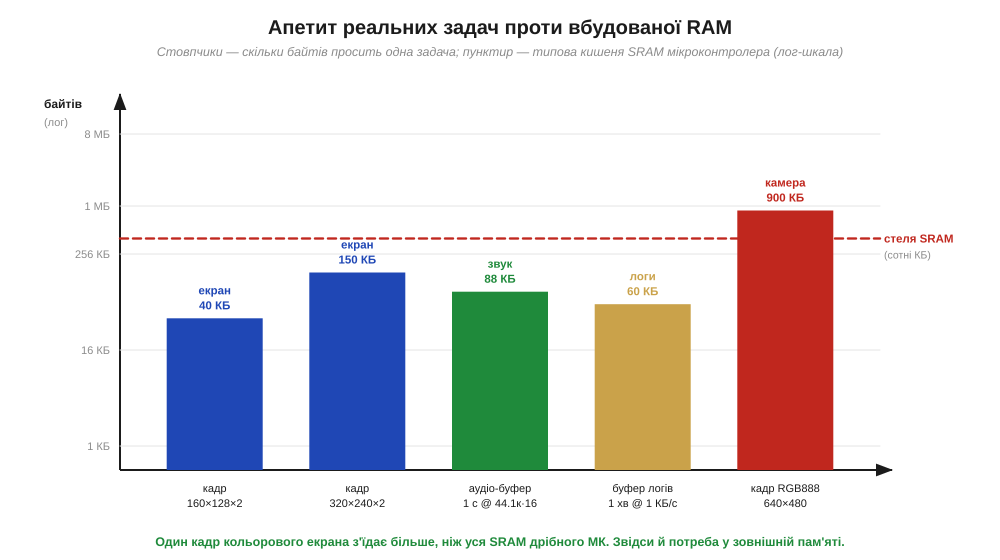
*Рис. 3.8.1.1. Скільки байтів просить одна задача (стовпці, лог-шкала) проти типової стелі SRAM мікроконтролера (червоний пунктир). Кадр невеликого екрана 160×128 — це вже 40 КБ; кадр 320×240 — близько 150 КБ; секунда стереозвуку — 88 КБ; хвилина логів — десятки КБ; а один кадр кольорової камери 640×480 — майже мегабайт. Більшість цих стовпців пробиває стелю SRAM наскрізь.*

Звідки беруться ці байти, видно з простої арифметики. Кожен піксель кодують кількома байтами кольору; найпоширеніший компактний формат — **RGB565** (*16-bit color*), де на піксель іде 2 байти (5 бітів на червоний, 6 на зелений, 5 на синій). Помножмо це на кількість пікселів.

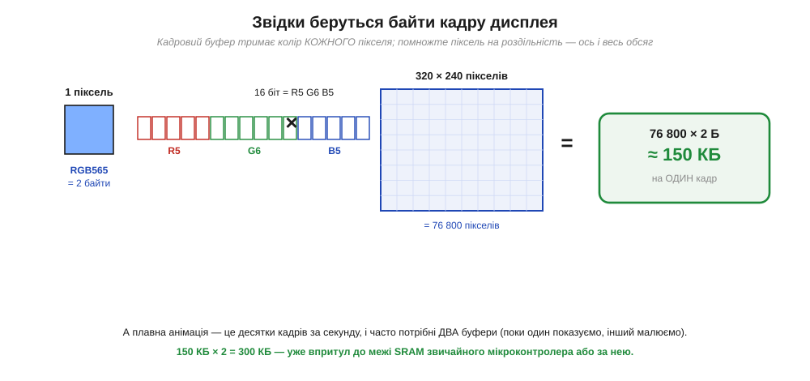
*Рис. 3.8.1.2. Обсяг кадрового буфера = (байтів на піксель) × (кількість пікселів). Для екрана 320×240 у форматі RGB565 це 2 × 76 800 ≈ 150 КБ — на **один** кадр. А плавна анімація потребує ще й другого буфера (поки один показуємо, інший малюємо), тобто 300 КБ, що для звичайного мікроконтролера вже за межею SRAM.*

**Приклад (кадр кольорового екрана).** Порахуймо буфер для типового модуля 320×240 у форматі RGB565.

```
пікселів       = 320 × 240          = 76 800
байтів/піксель = 2                  (RGB565)
один кадр      = 76 800 × 2         = 153 600 Б ≈ 150 КБ
подвійна буферизація = 150 КБ × 2   = 300 КБ
```

Уже один кадр з'їдає 150 КБ; з подвійним буфером — 300 КБ. У чипа з 64 КБ SRAM це не вміститься навіть наполовину, а в чипа з 256 КБ забере весь бюджет, не лишивши місця ні на стек, ні на дані застосунку. Висновок прямий: серйозна графіка вимагає **зовнішньої** робочої пам'яті.

Варто зрозуміти, **чому** другий буфер не примха, а майже неминучість. Якби екран малювали в той самий буфер, з якого він зчитує зображення, око ловило б напівдомальований кадр — «розрив» картинки, мерехтіння, артефакти. Тому роблять **подвійну буферизацію** (*double buffering*): поки один буфер показуємо на екрані незмінним, у другий спокійно малюємо наступний кадр, а коли він готовий — буфери міняють ролями миттєво. Це коштує **подвоєння** пам'яті, але дає плавну картинку без розривів. І чим більший екран чи глибший колір (формат RGB888 — уже 3 байти на піксель), тим швидше росте апетит: квадратична залежність від роздільності означає, що перехід від 320×240 до 640×480 збільшує буфер не вдвічі, а вчетверо. Звідси й висновок рисунка 3.8.1.1: один кадр кольорової камери — уже під мегабайт, а це більше за всю SRAM навіть немаленького мікроконтролера.

### Аудіо: безперервний потік, що не можна «затинати»

Звук додає до проблеми обсягу нову вимогу — **безперервність**. Цифрове аудіо — це потік відліків (*samples*): компакт-дискова якість — 44 100 відліків за секунду, по 2 байти на канал, два канали. Перемножмо.

```
відліків/с   = 44 100
байтів/відлік= 2 × 2 (16 біт, стерео) = 4
потік        = 44 100 × 4    ≈ 176 КБ/с
буфер 0.5 с  = 176 × 0.5     ≈ 88 КБ
```

Сам по собі буфер на пів секунди — 88 КБ — ще міг би влізти. Але аудіо не терпить пауз: якщо процесор не встигне підкинути нову порцію відліків, динамік **клацне** або замовкне. Тому звук тримають у достатньо великих кільцевих буферах, які постійно поповнюють, і ця пам'ять має бути **швидкою** — щоб устигати за потоком. Знов-таки робоча пам'ять, знов-таки часто більша за зручний шмат SRAM.

Чому буфер не можна зробити крихітним, заощадивши пам'ять? Бо процесор не сидить над звуком безперервно — він водночас обробляє інші задачі, і між його «підходами» до аудіо минає час. Кільцевий буфер (*ring buffer*) — це той запас, що годує динамік, поки процесор зайнятий іншим: відтворення тягне відліки з одного кінця, програма досипає з іншого, і доки в буфері є запас, звук ллється рівно. Замалий буфер спорожніє раніше, ніж процесор устигне повернутися, — і ось вам провал у звуці. А запис кількох звукових каналів, або вища частота дискретизації, або одночасне відтворення й запис помножують потребу. Тому аудіо-задачі швидко впираються в той самий бар'єр, що й графіка: робочих даних більше, ніж зручно тримати в дефіцитній внутрішній SRAM, і потрібна зовнішня швидка пам'ять.

### Логи: дані, що мусять пережити вимкнення

Третій випадок інший за природою. Кадри й аудіо — це **робочі**, тимчасові дані: зникли з живленням — і нехай. А **журнал** вимірів, навпаки, цінний саме тим, що **лишається**. Реєстратор, який пише по кілобайту на секунду, за годину накопичує близько 3.5 МБ, за добу — під сотню. Стільки не втримає жодна SRAM, та головне — навіть якби втримала, усе пропало б при першому ж вимкненні, бо SRAM **летка** (§3.6.3). Логам потрібне **нелетке сховище** великого обсягу — окремий клас пам'яті, ніж робоча RAM.

Зверніть увагу, що в логів і вимоги до пам'яті інакші, ніж у кадрів. Журнал росте **повільно** — кілобайти за секунду, не мегабайти; його не читають щомиті, а здебільшого лише **дописують** у кінець, а перечитують зрідка (коли пристрій підключають по кабелю чи виймають носій). Зате обсяг накопичується **величезний** із часом, і кожен записаний байт мусить **витримати** і вимкнення живлення, і випадковий збій. Тобто швидкість тут другорядна, а на перший план виходять **ємність** і **нелеткість**. Це геть інший профіль, ніж у кадрового буфера, якому потрібні швидкість і обсяг, але байдужа нелеткість. Один тип пам'яті не може бути водночас і блискавично-швидким, і дешево-ємним, і нелетким — фізика не дозволяє; тому під робочі дані й під сховище ставлять **різні** пам'яті. Саме цей поділ — наскрізна вісь усього розділу.

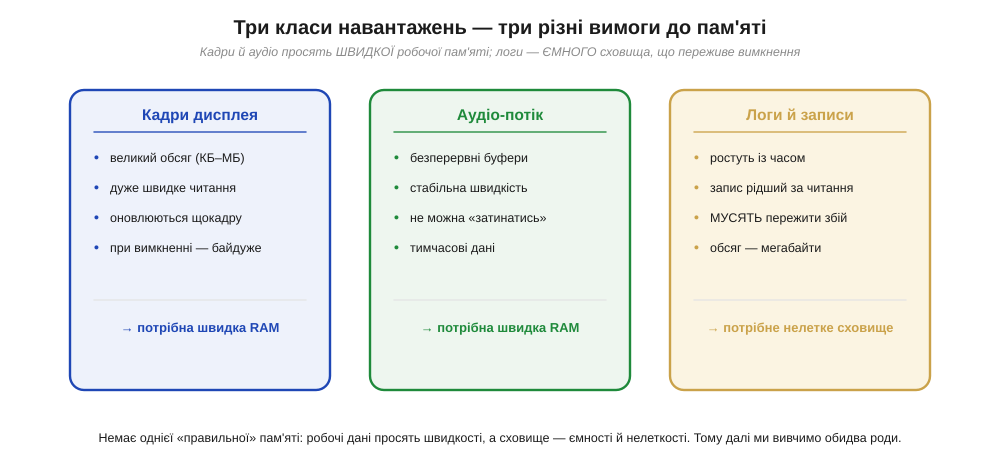
*Рис. 3.8.1.3. Три типові навантаження висувають **різні** вимоги. Кадри дисплея й аудіо просять **швидкої робочої RAM** (великий обсяг, миттєвий доступ, а нелеткість не потрібна). Логи й записи просять **ємного нелеткого сховища** (мегабайти, мусять пережити збій, запис рідший за читання). Одна пам'ять не закриє обидві потреби.*

> 🔧 **Навіщо це.** Перш ніж додавати до проєкту зовнішню пам'ять, варто прикинути бюджет на серветці — і ці три приклади дають готові формули. Графіка: (байтів на піксель) × (пікселів) × (1 або 2 буфери); вийшли сотні КБ — внутрішньої SRAM не вистачить, потрібна зовнішня RAM. Аудіо: (частота) × (байтів на відлік) × (секунди буфера) плюс вимога не «затинатися» — знову швидка RAM. Логи: (потік за секунду) × (час роботи) — мегабайти, та ще й нелеткі, тобто окреме сховище. Уже на цьому етапі видно головний поділ розділу: **робочі дані** (швидко, тимчасово) проти **сховища** (ємно, надовго). Він і визначить, що саме ставити.

---

Підсумок §3.8.1: вбудованої SRAM (сотні КБ у кращому разі) реальним задачам **бракне**, причому в рази. Кадр кольорового екрана 320×240 — це ≈150 КБ, з подвійним буфером 300 КБ; секунда стереозвуку — ≈176 КБ і вимога безперервності; журнал логів — мегабайти на добу, та ще й такі, що мусять пережити вимкнення. Звідси два різні класи потреб: **робоча пам'ять** (кадри, аудіо — великий обсяг, висока швидкість, нелеткість байдужа) і **сховище** (логи, файли — ємність і нелеткість важливіші за швидкість). Саме під ці два класи й існують два роди зовнішньої пам'яті. Почнемо з робочої — і з найдешевшого способу зберігати біти масово, що його винайшов Деннард: динамічної пам'яті DRAM.

---

## 3.8.2 DRAM: транзистор і конденсатор

Ми щойно з'ясували, що кадрам і аудіо потрібна **велика** й **швидка** робоча пам'ять — більша за вбудовану SRAM. Але чому б просто не поставити зовнішню SRAM на ті самі сотні кілобайтів чи мегабайти? Бо SRAM **дорога**: ми вже знаємо з §3.6.8, що її комірка — це ціла засувка на шести транзисторах. Дешево зберігати мегабайти так не вийде. Потрібен інший принцип — і його дала комірка Деннарда з історії розділу: **один транзистор плюс один конденсатор**. Саме на ній стоїть DRAM (*Dynamic RAM*, динамічна оперативна пам'ять) — головна робоча пам'ять усіх комп'ютерів. Розберімо, чому вона така дешева — і яку ціну за цю дешевину доводиться платити.

### Одна комірка проти шести транзисторів

Уся різниця починається з того, **як** зберігається один біт. Порівняймо дві комірки поряд.

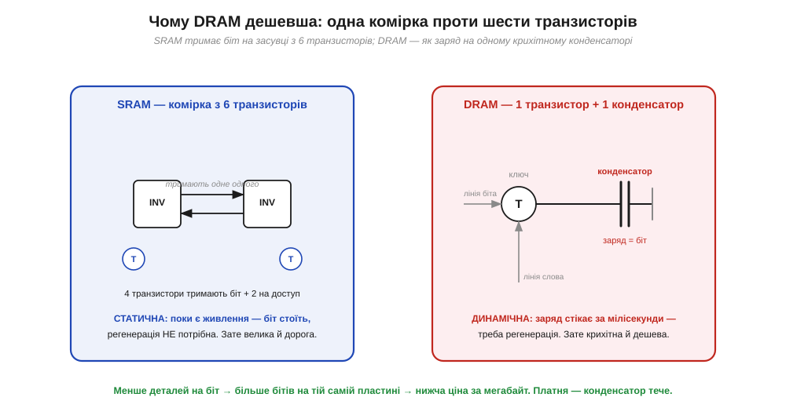
*Рис. 3.8.2.1. **SRAM** тримає біт на засувці з шести транзисторів: чотири утворюють два інвертори, що «тримають одне одного» в стійкому стані, плюс два — на доступ. Поки є живлення, біт стоїть сам, без поновлення (статична пам'ять). **DRAM** зберігає біт як **заряд на конденсаторі**, до якого веде **один** транзистор-ключ. Менше деталей на біт — більше бітів на пластині — нижча ціна за мегабайт. Платня: конденсатор тече.*

Інтуїція тут фізична й чесна. У SRAM біт **активно утримується**: два інвертори замкнені в кільце так, що виходом одного є вхід іншого, і ця пара має лише два стійкі стани — «0» і «1». Поки тече струм живлення, стан не зрушиться сам; звідси й назва **статична**. Але шість транзисторів на біт — це багато площі, а площа кремнію — це гроші (до економіки кристала ми ще дійдемо у Розділі 3.10). DRAM іде на радикальне спрощення: біт — це просто **є заряд** чи **немає заряду** на крихітному конденсаторі, а транзистор-ключ лише підмикає цей конденсатор до лінії, коли біт треба прочитати чи записати. Одна комірка замість шести деталей — і на тій самій пластині вміщується в рази більше бітів. Ось чому оперативну пам'ять міряють гігабайтами, а вбудовану SRAM — кілобайтами: різниця в ціні за біт колосальна.

Корисно відчути масштаб цієї економії на числах. Грубо кажучи, шість транзисторів SRAM займають у кілька разів більшу площу, ніж пара «транзистор + конденсатор» DRAM, — а конденсатор у сучасній DRAM узагалі ховають у глибину кристала або згортають у вертикальну структуру, щоб майже не витрачати поверхню. У підсумку на одному й тому самому шматку кремнію DRAM уміщує приблизно вшестеро–вдесятеро більше бітів, ніж SRAM. Помножте це на масовий випуск — і ось чому планка оперативної пам'яті на 8 гігабайтів коштує копійки за мегабайт, а кожен кілобайт вбудованої SRAM мікроконтролера, навпаки, помітно піднімає ціну чипа. Дешевизна DRAM — не випадковість, а прямий наслідок того, що один біт коштує **менше деталей**.

### Чому DRAM «динамічна»: заряд тече

За дешевину доводиться платити, і платня закладена в самій фізиці конденсатора. Ідеальний конденсатор тримав би заряд вічно, але реальний — ні: крізь транзистор-ключ і саму ізоляцію заряд поволі **стікає**. Минають **мілісекунди** — і «1» перетворюється на ледь помітний рівень, який уже не відрізнити від «0». Біт **губиться сам собою**. Саме тому пам'ять і зветься **динамічною**: вона не стоїть на місці, як SRAM, а потребує постійного руху, щоб жити.

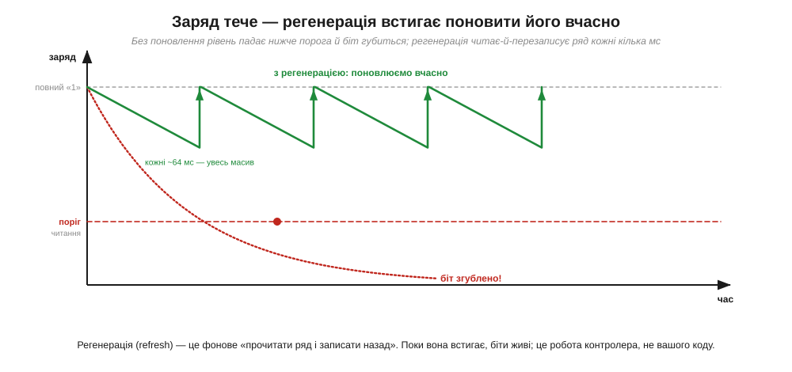
*Рис. 3.8.2.2. Без поновлення (червоний пунктир) заряд комірки спадає експоненційно й за мілісекунди падає нижче порога читання — біт згублено. **Регенерація** (*refresh*, зелена пилка) встигає поновити заряд раніше: вона періодично читає ряд комірок і записує назад, повертаючи «1» до повного рівня. Поки поновлення встигає (типово кожні ~64 мс на весь масив), біти живі.*

Корисна аналогія — **дірявий бак з водою**. Рівень води — це заряд (наш біт): «повний» означає «1». Бак трохи протікає, тож рівень поволі падає; якщо не доливати, через якийсь час уже не скажеш, повний він був чи порожній — біт втрачено. Регенерація — це і є те доливання: час від часу хтось перевіряє рівень і, якщо він був «повний», доливає до краю. Аналогія добра ще й тим, що показує межу: доливати треба **встигати** до того, як рівень упаде нижче розпізнаваного, — звідси й жорсткий період. Якби бак не протікав (як у SRAM з її активною засувкою), доливати не довелося б зовсім; уся «динамічність» DRAM — наслідок того, що її «бак» нещільний за самою конструкцією.

Рятунок зветься **регенерацією** (*refresh*) і за суттю до подиву простий: треба **прочитати** значення комірки, поки воно ще читається, і одразу **записати** його назад — повним зарядом. Це поновлення доводиться повторювати знов і знов, для **кожної** комірки, поки чіп під живленням. Стандартний інтервал — пройти весь масив приблизно кожні 64 мілісекунди. Найважливіше для нас зараз: ця робота **постійна** й **обов'язкова**, інакше дані випаровуються. Хто саме її виконує — побачимо в §3.8.4; поки досить знати, що DRAM ніколи не «спить» по-справжньому.

**Приклад (скільки часу з'їдає регенерація).** Прикиньмо, яку частку роботи забирає поновлення, якщо масив має 8192 ряди й кожен ряд треба регенерувати раз на 64 мс.

```
рядів у масиві         = 8192
період на весь масив   = 64 мс
час на один ряд        = 64 мс ÷ 8192    ≈ 7.8 мкс між регенераціями ряду
тривалість регенерації ряду ≈ 50 нс (порядок величини)
зайнято регенерацією    ≈ 50 нс ÷ 7.8 мкс ≈ 0.6 % часу
```

Висновок прикладу: регенерація відбирає лише близько відсотка часу — небагато, тож на пропускну здатність вона майже не впливає. Та головне не у відсотку, а в тому, що ця робота **невпинна**: чіп мусить регенеруватися завжди, і саме тому DRAM не можна просто «приспати» в режимі економії енергії, не втративши дані, — про що ми ще згадаємо, коли йтиметься про живлення від батареї.

### Як улаштований масив: рядки, стовпці й буфер

Лишилося зрозуміти, як мільйони таких комірок складають у робочий чіп — і ця будова прямо пояснює, **чому** регенерацію роблять не комірка за коміркою, а цілими рядами. Комірки шикують у двовимірну **решітку** з рядків і стовпців.

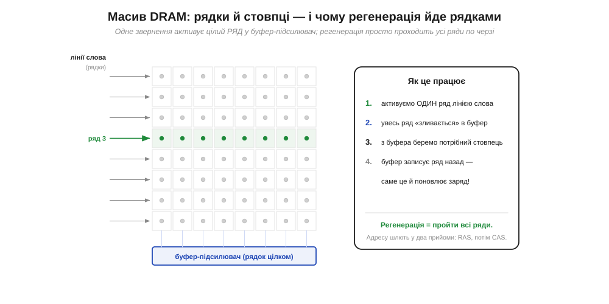
*Рис. 3.8.2.3. Комірки утворюють решітку. Щоб звернутися до однієї, спершу **лінією слова** активують цілий **ряд** — усі його комірки «зливають» свій заряд у **буфер-підсилювач** (рядок цілком). З буфера вже беруть потрібний **стовпець**. А коли буфер записує ряд **назад**, він тим самим **поновлює** заряд — тому регенерація природно йде по рядах. Адресу при цьому шлють у два прийоми: спершу номер ряду (RAS), потім стовпця (CAS).*

Тут ховається елегантність, яка стане в пригоді далі. Доступ до DRAM **дворівневий**: не можна просто назвати адресу однієї комірки. Спершу сигнал **RAS** (*Row Address Strobe*) активує цілий ряд — і всі його комірки виливають свій крихітний заряд у **буфер-підсилювач** (*sense amplifier*), який підсилює ці слабкі рівні до чітких «0» і «1». Тепер увесь ряд лежить у буфері; сигнал **CAS** (*Column Address Strobe*) вибирає з нього потрібний стовпець — це і є наш байт. А найкрасивіше попереду: коли звернення завершується, буфер записує ряд **назад** у комірки, відновлюючи їхній заряд. Тобто **будь-яке** читання ряду заразом його **регенерує**. Звідси й висновок: регенерувати масив — це просто **по черзі активувати всі ряди**; не треба чіпати кожну комірку окремо. Ця дворівнева адресація (ряд, потім стовпець) і буфер-підсилювач — не дрібниця реалізації, а ключ до того, як DRAM працює швидко й як її поновлюють.

Чому взагалі решітку, а не один довгий ряд комірок? З двох причин, обидві практичні. Перша — **економія ніжок**: якби кожна комірка мала власну повну адресу на окремих лініях, чіп потребував би безліч виводів; натомість ту саму адресу шлють **у два прийоми** тими самими ніжками — спершу номер ряду (RAS), потім номер стовпця (CAS), — і ліній удвічі менше. Друга — швидкість сусіднього доступу: оскільки активований ряд цілком лежить у буфері-підсилювачі, узяти з нього **ще один** стовпець майже нічого не коштує (ряд уже відкритий). Звідси випливає річ, на якій трималася вся наступна тема: читати з DRAM **підряд** (сусідні стовпці одного ряду) набагато дешевше, ніж **стрибати** по випадкових адресах, кожна з яких вимагає закрити старий ряд і відкрити новий. Запам'ятаймо цю асиметрію «дорогий ряд — дешевий сусідній стовпець»: саме її використають пакетний режим і банки в §3.8.3.

> 🔧 **Навіщо це.** Розуміння комірки DRAM прямо впливає на проєктні рішення. По-перше, **ціна**: DRAM дешева за біт саме тому, що комірка крихітна (1 транзистор + конденсатор проти 6 транзисторів SRAM) — ось чому зовнішню робочу пам'ять на мегабайти роблять із DRAM, а не з SRAM. По-друге, **нелеткість**: DRAM летка **подвійно** — і живлення зникне, і навіть під живленням заряд стече за мілісекунди; тому в DRAM **ніколи** не тримають те, що має пережити вимкнення, — лише робочі дані. По-третє, **регенерація** коштує: вона з'їдає частку часу й енергії та ускладнює чіп — а в режимах глибокого сну саме потреба регенерувати DRAM часто й не дає вимкнути пам'ять зовсім. По-четверте, **дворівнева адресація** (ряд → стовпець) пояснить нам у §3.8.3, чому послідовний доступ до DRAM швидший за випадковий: поки потрібний ряд уже в буфері, сусідні стовпці беруться майже даремно.

---

Підсумок §3.8.2: **DRAM** зберігає біт як **заряд на конденсаторі**, керований **одним** транзистором (комірка Деннарда), — на противагу шеститранзисторній засувці SRAM (§3.6.8). Менше деталей на біт → більше бітів на пластині → DRAM **дешева** за мегабайт, тому з неї роблять велику робочу пам'ять. Платня — заряд **стікає** за мілісекунди, тож пам'ять **динамічна**: її треба постійно **регенерувати** (читати-й-записувати назад, ~кожні 64 мс), інакше біти губляться. Комірки складені в **решітку**; доступ дворівневий — спершу активують **ряд** (RAS) у **буфер-підсилювач**, потім беруть **стовпець** (CAS), а запис ряду назад заразом його поновлює (тому регенерація йде рядами). DRAM летка **подвійно**: і без живлення, і навіть із ним. Ми описали саму комірку й масив, але ще не сказали, як із цим чіпом **швидко розмовляти**. Сама по собі DRAM віддавала б дані повільно й непередбачувано; щоб вичавити з неї швидкість, її прив'язали до такту й навчили віддавати дані пакетами — так народилися SDRAM і DDR.

---

## 3.8.3 SDRAM і DDR якісно: синхронний інтерфейс, банки, подвійна швидкість на фронтах

Комірку DRAM ми розібрали: дешева, ємна, але повільна й норовлива через регенерацію та дворівневу адресацію (§3.8.2). Сама по собі рання DRAM мала ще одну ваду — вона відповідала **асинхронно**: процесор подавав адресу й мусив **чекати**, поки чіп «коли-небудь» віддасть дані, не знаючи точно, коли. Для швидкої системи це погано: чекати наосліп — марнувати такти. Тому DRAM еволюціонувала. Спершу її прив'язали до **такту** — вийшла **SDRAM** (*Synchronous DRAM*); потім навчили віддавати дані вдвічі частіше — вийшла **DDR** (*Double Data Rate*). Розберімо три ідеї, що з повільної комірки роблять швидку пам'ять: синхронний інтерфейс, банки й подвійна швидкість на фронтах. Усі вони не про саму комірку (вона лишилася тією ж), а про **спосіб спілкування** з нею.

### Синхронний інтерфейс: працюємо в такт

Перша й засаднича зміна — прив'язка до **тактового сигналу** (§3.3.6). Замість «питання — невизначена пауза — відповідь» усі дії відбуваються **на фронтах такту**, за розкладом.

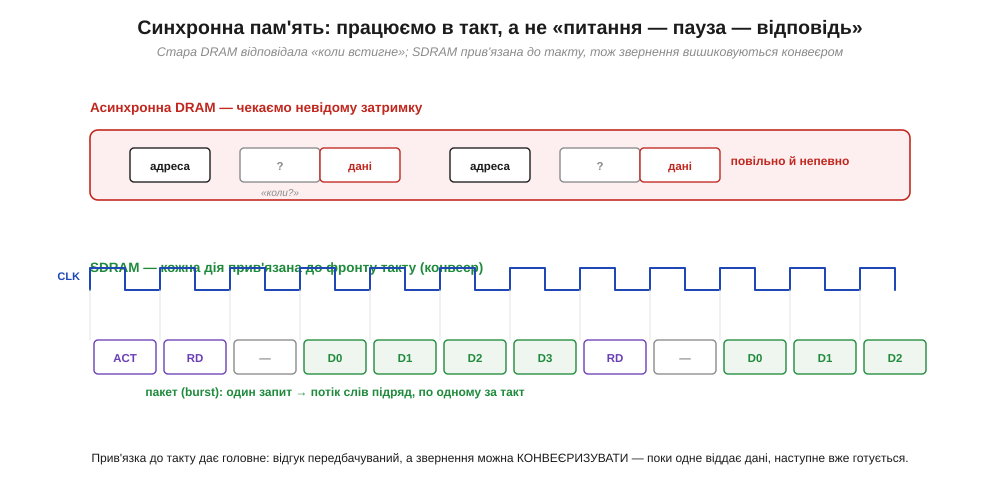
*Рис. 3.8.3.1. Зверху — асинхронна DRAM: подали адресу й чекаємо невідому затримку, поки прийдуть дані; повільно й непередбачувано. Знизу — **SDRAM**: кожна команда й кожне слово даних прив'язані до фронту **такту**, тож відгук передбачуваний, а звернення можна **конвеєризувати** — поки одне віддає дані, наступне вже готується. Один запит породжує **пакет** (*burst*): потік слів підряд, по одному за такт.*

Користь від синхронності двояка. По-перше, **передбачуваність**: процесор точно знає, що дані з'являться, скажімо, через рівно стільки тактів після команди, — тож не чекає наосліп, а планує роботу. По-друге, і це важливіше, синхронність вмикає **конвеєр** (та сама ідея, що в конвеєрі процесора, §3.5.6): команди можна подавати потоком, не чекаючи завершення попередньої. Поки чіп віддає дані за однією адресою, контролер уже шле наступну команду. А ще SDRAM віддає не одне слово на запит, а цілий **пакет** (*burst*) — потік слів підряд, по одному за такт. Згадаймо §3.8.2: активувати ряд дорого (RAS), зате коли ряд уже в буфері-підсилювачі, сусідні стовпці беруться майже даремно. Пакетний режим саме це й використовує: один раз відкрили ряд — і висипали з нього потік сусідніх слів. Тому послідовне читання з DRAM **набагато** швидше за випадкове.

Тут зручно усвідомити, чому слово «синхронна» в назві SDRAM таке важливе. Асинхронна пам'ять — це діалог: «дай адресу — почекай — отримай». Кожен такий обмін має «мертвий» проміжок очікування, і поки чекаєш, нічого корисного не відбувається. Синхронна пам'ять перетворює діалог на **конвеєрну стрічку**: на кожному фронті такту на стрічку кладуть нову команду чи знімають готове слово, і стрічка не зупиняється. Той самий перехід від «крок — пауза — крок» до безперервного потоку ми вже бачили в конвеєрі процесора (§3.5.6) — і він тут дає той самий виграш. До того ж прив'язка до спільного такту знімає купу клопоту з узгодженням сигналів між контролером і чіпом: обидва живуть за одним ритмом (§3.3.6), тож не треба гадати, коли саме читати лінії даних.

### Банки: ховаємо затримку за паралелізмом

Навіть із пакетами лишається вузьке місце: відкриття ряду (RAS) забирає час, протягом якого шина даних простоює. Рішення — поділити масив на кілька незалежних **банків** (*banks*), що працюють **з перекриттям**.

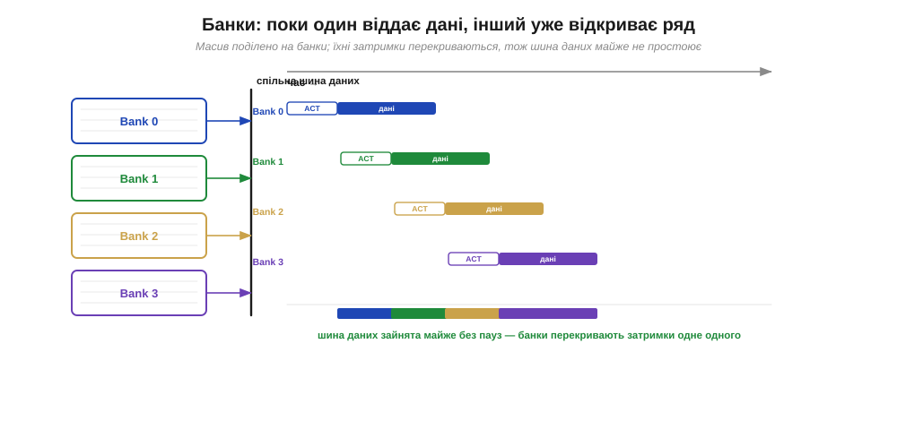
*Рис. 3.8.3.2. Масив поділено на банки (типово 4 або 8), у кожного — свій буфер-підсилювач. Поки **Bank 0** віддає дані на спільну шину, **Bank 1** уже відкриває свій ряд, **Bank 2** готує наступний, і так далі. Затримки відкриття **перекриваються**, тож спільна шина даних зайнята майже без пауз. Чергуючи звернення між банками, контролер ховає «дорогу» фазу RAS за «корисною» фазою віддачі даних сусіда.*

Ідея та сама, що скрізь у швидкому залізі: **перекрити** повільну підготовку однієї одиниці корисною роботою іншої. Один банк не може водночас і відкривати ряд, і віддавати дані — між цими фазами є пауза. Але якщо банків кілька, контролер чергує звернення: поки перший банк зайнятий віддачею даних, другий у цей самий час відкриває свій ряд. Коли перший закінчить, другий уже готовий — і шина даних не простоює ні такту. Це не прискорює окрему комірку, зате **піднімає пропускну здатність** усього чіпа: даних за секунду проходить помітно більше. Банки — стандартна риса будь-якої SDRAM, і саме завдяки їм велика пам'ять віддає дані суцільним потоком, а не ривками.

### Подвійна швидкість: дані на обох фронтах такту

Третя ідея дала пам'яті літери, які ви бачите щодня, — **DDR**. Звичайна (SDR, *Single Data Rate*) SDRAM передає одне слово за **такт** — на висхідному фронті. DDR передає слово й на висхідному, **і** на спадному фронті — тобто **двічі** за період.

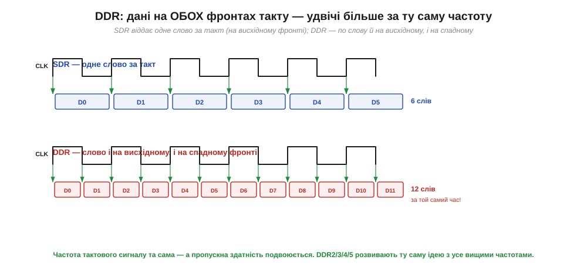
*Рис. 3.8.3.3. Угорі — **SDR**: одне слово на період такту (на висхідному фронті). Унизу — **DDR**: слово і на висхідному, і на спадному фронті, тобто **два** слова за період. Тактова частота **та сама**, а даних проходить **удвічі** більше. Покоління DDR2, DDR3, DDR4, DDR5 розвивають цю саму ідею з усе вищими частотами й ширшими пакетами.*

Хитрість елегантна: щоб подвоїти пропускну здатність, не обов'язково подвоювати **частоту** такту (а це важко — швидкі фронти шумлять, §3.1.5). Досить навчитися ловити дані на **обох** фронтах того самого такту. Так DDR за ту саму тактову частоту віддає вдвічі більше слів. Кожне наступне покоління — DDR2, DDR3, DDR4, DDR5 — піднімає робочі частоти й розширює пакети, тож пропускна здатність зростає з року в рік, а базовий принцип «двічі за період» лишається. Ось чому планку оперативної пам'яті комп'ютера підписують саме як DDR-щось: це і є та сама дешева комірка Деннарда, обвішана синхронним інтерфейсом, банками й подвійною швидкістю заради потоку даних.

**Приклад (звідки береться пропускна здатність).** Порахуймо, скільки даних за секунду віддає пам'ять, і розкладемо маркування «DDR-щось» на множники.

```
тактова частота шини   = 800 МГц
передач за такт        = 2          (обидва фронти — DDR)
ефективна швидкість    = 800 × 2    = 1600 мільйонів передач/с  → «DDR-1600»
ширина шини            = 8 байтів   (64-бітна шина модуля)
пропускна здатність    = 1600 млн × 8 Б ≈ 12.8 ГБ/с
```

Висновок прикладу: число в назві (1600) — це **передачі за секунду** (такт × 2), а не частота такту (800 МГц); а реальний потік байтів виходить, коли помножити передачі на **ширину** шини. Звідси видно три важелі пропускної здатності — частота такту, подвоєння на фронтах і ширина шини, — і чому навіть «не дуже швидка» за частотою пам'ять віддає десяток гігабайтів за секунду. Така цифра потрібна, наприклад, щоб щомиті перемальовувати великий екран із зовнішнього кадрового буфера (§3.8.1).

> 🔧 **Навіщо це.** Ці три ідеї пояснюють практичні речі, з якими стикається розробник. **Синхронність і пакети**: послідовний доступ до DRAM у рази швидший за «стрибання» по випадкових адресах — тому код, що обходить дані **підряд**, працює помітно швидше (та сама причина, що й дружність до кешу, §3.5.9); це не каприз, а наслідок дорогого RAS і дешевого пакета. **Банки**: вони дають змогу великій пам'яті віддавати суцільний потік — корисно знати, чому реальна пропускна здатність залежить від характеру доступу, а не лише від частоти. **DDR**: коли бачите маркування на кшталт «DDR4-3200», розумієте, що 3200 — це подвоєна частота передачі, а не такту. І найголовніше для нашого курсу: уся ця складність — синхронність, банки, фронти, пакети — означає, що DRAM **не підключиш напряму** до простих ніжок мікроконтролера. Між ними мусить стояти спеціальний пристрій, який знає весь цей протокол. Саме до нього — контролера пам'яті — ми переходимо.

---

Підсумок §3.8.3: рання DRAM відповідала **асинхронно** (чекай наосліп), тож її прив'язали до **такту** — вийшла **SDRAM**. Синхронність дала **передбачуваність** і **конвеєр**, а пакетний режим (*burst*) — потік сусідніх слів з одного відкритого ряду (бо RAS дорогий, а сусідні стовпці дешеві, §3.8.2), через що послідовний доступ набагато швидший за випадковий. **Банки** (4–8 незалежних масивів) працюють **з перекриттям**: поки один віддає дані, інший відкриває ряд — шина не простоює, пропускна здатність росте. **DDR** передає слово на **обох** фронтах такту — удвічі більше за ту саму частоту; покоління DDR2–DDR5 розвивають цю ідею. Уся ця складність — ціна швидкості, і вона ж означає, що такий чіп не заговорить «сам». Потрібен посередник, який розкладе адресу на ряд і стовпець, видасть команди з точними паузами й не забуде про регенерацію. Цей посередник — контролер пам'яті.

---

## 3.8.4 Контролер пам'яті: таймінги, регенерація, ініціалізація

Ми зібрали повний портрет DRAM: дешева комірка, що тече (§3.8.2), обвішана синхронним інтерфейсом, банками й подвійною швидкістю (§3.8.3). І щоразу впиралися в той самий висновок: цей чіп **складний у спілкуванні**. Він не розуміє простого «дай байт за адресою»; йому треба слати команди (відкрити ряд, читати стовпець, закрити ряд) з **точними паузами** між ними, постійно його **регенерувати** й навіть правильно **розбудити** при ввімкненні. Усю цю роботу бере на себе окремий пристрій — **контролер пам'яті** (*memory controller*). Зрозуміти його роль важливо ще й тому, що він пояснює просте, але часте запитання новачка: чому зовнішню DDR не можна просто припаяти до ніжок GPIO й читати, як звичайну Flash.

### Контролер як перекладач

Найкраще уявити контролер як **перекладача** між двома мовами: простою мовою процесора й складною мовою DRAM.

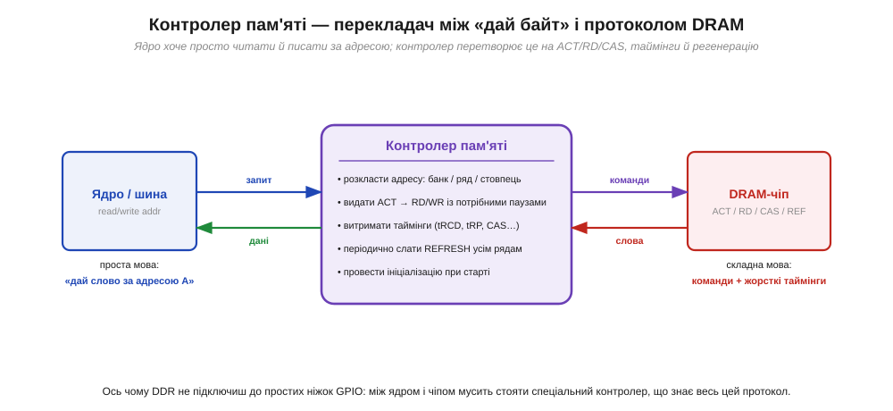
*Рис. 3.8.4.1. Ядро говорить **просто**: «дай слово за адресою A», «запиши слово за адресою B». **Контролер пам'яті** перекладає це на мову DRAM: розкладає адресу на банк / ряд / стовпець, видає команди ACT (відкрити ряд) → RD/WR із потрібними паузами, витримує таймінги, періодично шле REFRESH усім рядам і проводить початкову ініціалізацію. Назовні (до ядра) — проста шина; усередину (до чіпа) — складний протокол.*

Поділ обов'язків тут чіткий. **Процесор** хоче бачити пам'ять як рівний масив комірок (модель із §3.6.1): назвав адресу — отримав байт. Він не повинен знати ні про ряди й стовпці, ні про таймінги, ні про регенерацію. **Контролер** ховає всю цю кухню: приймає простий запит, розкладає адресу на трійку «банк, ряд, стовпець», видає чіпу потрібну послідовність команд із витриманими паузами, забирає дані з пакета й повертає їх ядру. Для решти системи зовнішня DRAM завдяки контролеру виглядає просто як **ще один діапазон адрес** на карті пам'яті (§3.6.2) — у нього можна писати й читати тими самими інструкціями. Уся складність замкнена всередині контролера.

Цей поділ — приклад дуже корисної інженерної звички: **сховати складність за простим інтерфейсом**. Ми вже бачили цю звичку в memory-mapped I/O (§3.6.2), де керування залізом видали за звичайний запис у пам'ять; тут вона працює так само. Згадаймо й розклад адреси з §3.8.2: одна лінійна адреса, яку дає процесор, насправді кодує **три** координати — який банк, який ряд, який стовпець. Контролер бере, скажімо, адресу 0x60001000 і «нарізає» її біти на ці три поля, бо саме так влаштований чіп (рядки й стовпці решітки). Програмісту ця нарізка невидима — він мислить рівним простором адрес, а вся геометрія масиву лишається турботою контролера. Завдяки цьому той самий код працює хоч із внутрішньою SRAM, хоч із зовнішньою DDR: різниця лише в тому, що по дорозі до DDR стоїть перекладач.

### Таймінги: чому між командами потрібні паузи

Серце роботи контролера — **таймінги** (*timing parameters*): жорсткі мінімальні паузи між командами, що їх диктує фізика чіпа. Порушити їх не можна — дані спотворяться.

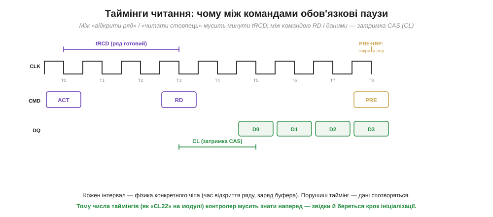
*Рис. 3.8.4.2. Одне читання: команда **ACT** відкриває ряд, але читати стовпець можна лише через **tRCD** — час, поки ряд «доїде» в буфер-підсилювач. Команда **RD** замовляє дані, але вони з'являються на шині не одразу, а через **затримку CAS** (CL) — кілька тактів. Наприкінці **PRE** закриває ряд, і перед відкриттям наступного мусить минути **tRP**. Кожен інтервал — фізика конкретного чіпа.*

Звідки ці паузи? З §3.8.2 ми вже знаємо механіку: відкрити ряд (ACT) означає влити заряд комірок у буфер-підсилювач і дати йому **підсилити** слабкі рівні — на це потрібен час **tRCD** (*RAS-to-CAS delay*). Замовити стовпець (RD) — теж не миттєво: дані з'являться через **затримку CAS** (*CAS Latency*, CL), поки спрацює вся вибірка. А закрити ряд і записати його назад (PRE, *precharge*) перед роботою з іншим рядом — це **tRP** (*Row Precharge time*). Ці числа — фундаментальна властивість чіпа; ви бачите їх у маркуванні планок (горезвісне «CL16» чи «CL22»). Контролер мусить **знати** їх і відлічувати кожну паузу до такту. Відлічив замало — прочитав напівготові дані, отримав сміття; відлічив забагато — втратив швидкість. Тому точне дотримання таймінгів — головна щоденна робота контролера.

Чому ці паузи не можна просто «вимкнути» заради швидкості? Бо за ними стоїть фізика, а не домовленість. Буфер-підсилювач ловить з комірки **крихітний** заряд (згадаймо, комірка — це мікроскопічний конденсатор) і мусить його розгойдати до повноцінного логічного рівня — на це йде реальний час, і поспішиш — прочитаєш половинчастий, ще не визначений рівень, тобто сміття. Так само precharge мусить вернути лінії в чітко відомий вихідний стан, перш ніж відкривати інший ряд, — інакше новий ряд накладеться на «недоприбраний» слід попереднього. Ось чому таймінги — це **мінімуми**, нижче яких опускатися не можна: вони відображають швидкодію конкретного кремнію. Тому, до речі, «розгін» пам'яті — це насамперед обережне зменшення цих пауз до межі, за якою чіп ще встигає; перейдеш межу — і дані почнуть псуватися. Для нашого курсу висновок простіший: контролер мусить мати **правильні** числа таймінгів саме того чіпа, що до нього під'єднаний.

### Ініціалізація: розбудити чіп, далі — вічна регенерація

Лишилося два обов'язки, що замикають картину: **запустити** чіп при ввімкненні й **регенерувати** його довіку. SDRAM/DDR не готова до роботи одразу після подачі живлення — її треба провести через фіксовану процедуру.

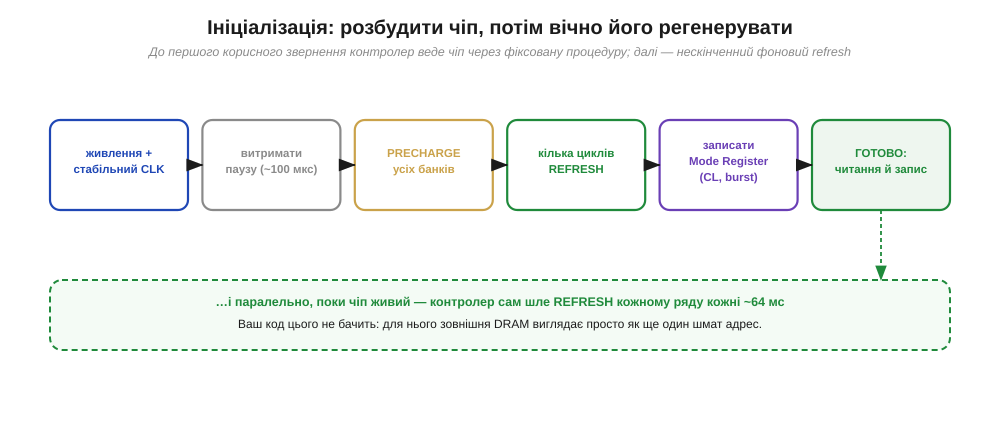
*Рис. 3.8.4.3. До першого корисного звернення контролер веде чіп за суворим розкладом: дочекатися стабільного живлення й такту → витримати паузу → закрити всі банки (PRECHARGE) → дати кілька циклів REFRESH → записати **Mode Register** (там осідають CL, довжина пакета й інші режими) → і лише тоді чіп **готовий**. А паралельно, поки він живий, контролер **вічно** шле REFRESH кожному ряду кожні ~64 мс. Вашого коду це не стосується.*

**Приклад (що бачить ваш код).** Простежмо, хто що робить, коли програма читає слово із зовнішньої SDRAM.

```
ваш код:     value = *(uint32_t*)0x60001000;   // просто читання за адресою
   │
контролер:   адреса 0x60001000 → банк 2, ряд 0x081, стовпець 0x010
             ACT  банк 2, ряд 0x081      ; відкрити ряд
             (пауза tRCD)
             RD   банк 2, стовпець 0x010  ; замовити дані
             (пауза CL)
             ← чіп віддає пакет слів; беремо потрібне
   │
ваш код:     отримав value — і не здогадується про ACT/RD/CL/REFRESH
```

Висновок прикладу: для програми зовнішня DRAM **невідрізнима** від звичайної пам'яті — те саме читання за адресою. Уся послідовність команд, паузи й фонова регенерація сховані в контролері; програміст їх не пише й зазвичай навіть не бачить (хіба що один раз **налаштовує** контролер таймінгами свого чіпа при старті системи).

### Де живе контролер — і чому це межа для дрібних чипів

Лишилося відповісти на питання, винесене на початок теми: чому ж DDR таки не припаяти просто до ніжок GPIO. Тепер відповідь очевидна. Те, що ми тільки-но описали — розклад адреси, послідовність команд із наносекундними паузами, ініціалізація, безперервна регенерація, — це **спеціалізована логіка**, яку фізично втілюють у залізі. Її не зімітуєш, смикаючи звичайні виводи з програми: GPIO керують надто повільно й непередбачувано, щоб витримати таймінги, а регенерувати масив у фоні, поки процесор робить інше, програмний цикл просто не встигне. Тому контролер пам'яті роблять **апаратним блоком** — або всередині процесора, або поруч у складі мікросхеми.

З цього випливає практична межа, яку варто знати наперед. Зовнішню DRAM можна підключити **лише** до тих процесорів і мікроконтролерів, у яких такий контролер **уже є** на кристалі. Потужніші чипи (ті, що тягнуть екрани, відео, повноцінні операційні системи) контролер DRAM мають; дрібні економні мікроконтролери — здебільшого ні, бо такий блок коштує площі й енергії, а їхнім задачам вистачає внутрішньої SRAM. Тому, плануючи пристрій із великою робочою пам'яттю, дивляться не лише на саму планку DRAM, а насамперед на те, чи має обраний процесор **інтерфейс зовнішньої пам'яті**. Немає контролера — немає й зовнішньої DRAM, хоч би скільки чіпів ви приставили.

> 🔧 **Навіщо це.** Контролер пам'яті пояснює кілька дуже практичних речей. Перше й головне: **DDR не підключиш до GPIO** — між чіпом і ядром обов'язково мусить стояти контролер, що знає протокол; тому зовнішню DRAM можна додати лише до тих мікроконтролерів і процесорів, у яких такий контролер є на борту (а в дрібних його просто немає — звідси й межа). Друге: при налаштуванні системи контролеру треба **згодувати таймінги** саме вашого чіпа (tRCD, CL, tRP, період регенерації) — помилитесь у числах, і пам'ять працюватиме нестабільно або не запуститься; ці числа беруть з даташита чіпа. Третє: **регенерація йде фоном завжди**, з'їдаючи частку пропускної здатності та енергії, — це одна з причин, чому зовнішня DRAM невигідна в пристроях на батарейці, що мусять надовго засинати. Четверте, заспокійливе: щойно контролер налаштований, у коді ви працюєте із зовнішньою пам'яттю **звичайними** читаннями й записами за адресою — уся складність лишається під капотом.

---

Підсумок §3.8.4: **контролер пам'яті** — перекладач між простою мовою ядра («читай/пиши за адресою») і складним протоколом DRAM. Він розкладає адресу на **банк/ряд/стовпець**, видає команди (ACT → RD/WR → PRE) з точними **таймінгами** (tRCD — поки ряд дійде в буфер; CL — затримка появи даних після RD; tRP — на закриття ряду), які диктує фізика чіпа й порушити які не можна. Він проводить **ініціалізацію** при старті (пауза → precharge → кілька refresh → запис Mode Register із CL і довжиною пакета) і **вічно регенерує** масив фоном. Завдяки контролеру зовнішня DRAM для коду виглядає як звичайний діапазон адрес. А **немає контролера — немає й зовнішньої DRAM**: ось чому її не чіпляють до простих ніжок і чому дрібні МК її не підтримують. На цьому ми завершуємо робочу, **летку** пам'ять. Та реєстратору з §3.8.1 потрібне було сховище — те, що переживе вимкнення. Переходимо до нелеткого боку: до флеш-пам'яті, якої, виявляється, буває **два** дуже різні роди.

---

## 3.8.5 NOR vs NAND: дві флеші для двох задач

Робочу пам'ять ми закрили: DRAM під контролером дає швидкий летучий простір для кадрів і аудіо. Але логи, файли й сама прошивка мусять **пережити вимкнення** — тут потрібна **нелетка** пам'ять. Флеш ми вже зустрічали як внутрішнє сховище коду (§3.6.3) і знаємо механізм її комірки — плаваючий затвор, що тримає заряд роками без живлення (§3.6.8). Тепер настав час важливого уточнення: флеш буває **двох** принципово різних родів — **NOR** і **NAND**, — і вони народжені для **протилежних** задач. Одна створена, щоб із неї **виконувати код**, друга — щоб **зберігати гори даних**. Плутати їх — типова помилка; розберімо, звідки росте різниця й коли яку брати.

### Звідки різниця: як з'єднані комірки

Назви NOR і NAND — не випадкові: вони відображають, **як саме** комірки сполучені в масив, а вже з цього випливає весь характер пам'яті.

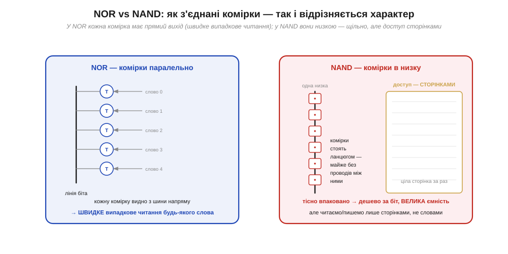
*Рис. 3.8.5.1. У **NOR** кожна комірка під'єднана до спільної лінії біта **паралельно** — її видно з шини напряму, тож будь-яке слово читається **миттєво й випадково**. У **NAND** комірки з'єднані **послідовно**, низкою, майже без проводів між ними — це дуже **щільно** (дешево за біт, велика ємність), але доступ іде не до окремого слова, а до цілої **сторінки**.*

Логіка тут механічна. У **NOR** комірки висять на лінії біта **паралельно**, кожна зі своїм виходом, — як будинки вздовж вулиці, до кожного під'їзд окремий. Тому будь-яку комірку можна адресувати й прочитати **прямо**, за випадковою адресою, без розгону. Платня — кожна комірка потребує своїх з'єднань, тож вони займають більше площі: NOR **менш щільна**, отже дорожча за біт і менша за ємністю. У **NAND** комірки, навпаки, з'єднані **послідовно** в довгі низки, з мінімумом проводів між сусідами, — як вагони одного потяга. Це дає колосальну **щільність** (звідси дешевизна за біт і ємності в гігабайти), але ціною доступу: не можна вихопити одну комірку посеред низки — читають і пишуть цілими **сторінками** (*pages*), а стирають ще більшими **блоками**. Ось корінь усієї різниці: паралельне з'єднання → прямий доступ, послідовне → щільність ціною посторінкового доступу.

Варто чіткіше розрізнити три операції, бо обидві флеші тут поводяться особливо. **Читати** обидві вміють (NOR — окреме слово, NAND — сторінку). А ось **писати** й **стирати** у флеші не симетричні, і це спадщина плаваючого затвора (§3.6.8): запис може лише **додавати** заряд (умовно перетворювати «1» на «0»), а зняти заряд назад окремо з однієї комірки не можна — стирання тягне за собою **цілу велику ділянку** (блок). Тому будь-яка флеш живе за правилом «стерти блок → потім писати в нього». У NAND блоки великі, і це нормально лягає на її «оптову» натуру; у NOR стирання теж блокове, але блоки менші. Звідси й випливає, що флеш погано пасує для частих дрібних змін окремих байтів — думку, яку ми розгорнемо аж у §3.8.8, коли шукатимемо пам'ять саме під такі зміни. А поки тримаймо просту картину: читання різне (слово проти сторінки), а стирання в обох — блокове.

### Дві ролі: виконувати код vs зберігати дані

З цієї фізичної різниці випливає різне **призначення**. NOR годиться, щоб процесор виконував код **прямо з неї**; NAND — щоб тримати великі дані, які перед уживанням копіюють у RAM.

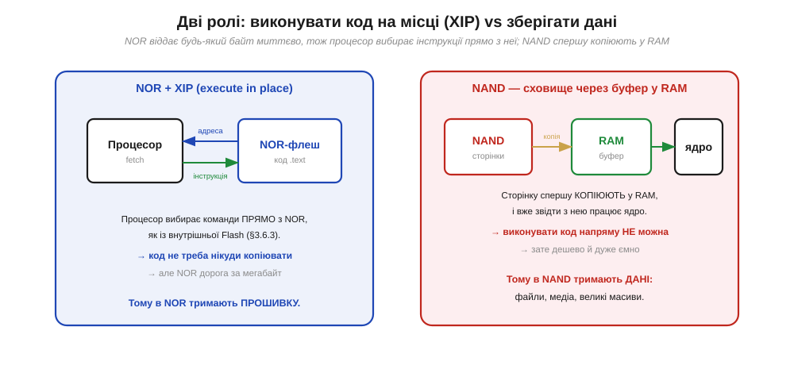
*Рис. 3.8.5.2. Оскільки NOR віддає **будь-який** байт миттєво й за випадковою адресою, процесор може **вибирати інструкції прямо з неї** — це звуть **XIP** (*execute in place*, виконання на місці), і код нікуди копіювати не треба. NAND так не вміє: щоб із нею працювати, сторінку спершу **копіюють у RAM** і виконують уже звідти. Тому в NOR тримають **прошивку** (код), а в NAND — **дані**: файли, медіа, великі масиви.*

Згадаймо цикл процесора (§3.5.3): на кожному кроці він **вибирає** інструкцію за адресою з лічильника команд. Для цього пам'ять із кодом мусить віддавати будь-яке слово **миттєво й за випадковою адресою** — а це рівно те, що вміє NOR. Тому процесор здатний виконувати програму **просто з NOR-флеші**, не переписуючи її кудись; цей режим звуть **XIP** (*execute in place*). NAND до цього нездатна — вона віддає лише сторінки, не окремі слова, тож код із неї спершу **завантажують** у швидку RAM і вже звідти виконують. Звідси й розподіл ролей: **NOR — для коду** (прошивка, що має просто запуститися), бо XIP економить дефіцитну RAM; **NAND — для даних** (журнали, фото, відео, файлові системи), бо її дешевизна й ємність незамінні там, де байтів багато. Це не суперництво «хто кращий», а поділ праці.

Чому XIP такий цінний, видно з простого підрахунку. Виконувати код «на місці» означає, що його **не треба** дублювати в RAM — а RAM, як ми пам'ятаємо з §3.8.1, дефіцитна. Якби прошивку довелося спершу цілком скопіювати в оперативну пам'ять, ця копія з'їла б стільки RAM, скільки важить код, — і на робочі дані лишилося б менше. З NOR код лежить у нелеткій пам'яті й виконується **прямо звідти**, а вся RAM вільна під змінні, буфери й стек. Саме тому прошивку — те, що має **просто запуститися** одразу після ввімкнення, — кладуть у NOR (чи внутрішню Flash, що теж NOR-подібна за доступом). А коли пристрій на NAND усе ж мусить виконати код, у нього є невеликий **завантажувач** у NOR-подібній пам'яті, який при старті копіює основну програму з NAND у RAM і передає їй керування. Тобто навіть «NAND-системи» десь усередині спираються на маленький шматок пам'яті з прямим доступом — без неї процесор просто не мав би звідки взяти першу інструкцію.

### Коротка таблиця рішення

Зведімо все в одну табличку — щоб у проєкті швидко обрати потрібну флеш.

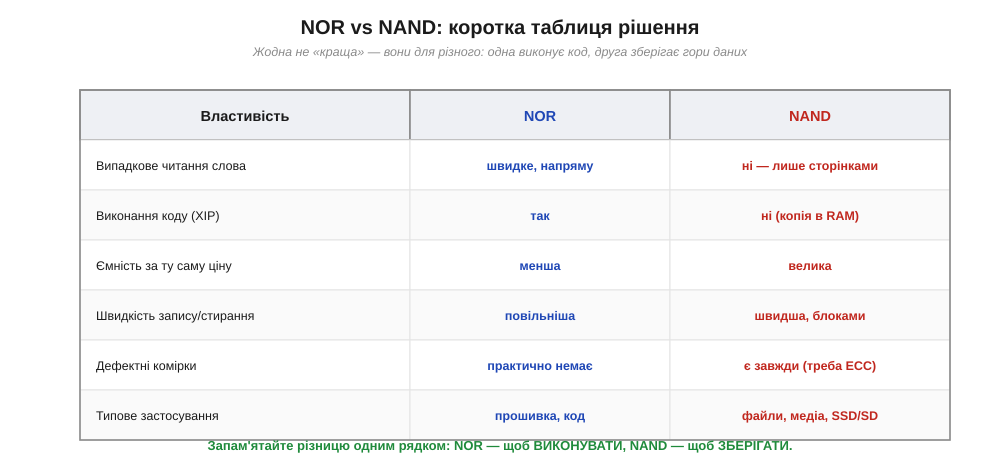
*Рис. 3.8.5.3. NOR: швидке випадкове читання слова, придатна до XIP, менша ємність за ту саму ціну, повільніший запис, практично без дефектних комірок — звідси роль «прошивка, код». NAND: лише посторінковий доступ, для коду треба копія в RAM, велика ємність, швидший блоковий запис, але дефектні комірки є **завжди** (тому потрібен ECC) — звідси роль «файли, медіа, накопичувачі». Одним рядком: **NOR — щоб виконувати, NAND — щоб зберігати**.*

Один рядок таблиці варто підкреслити окремо, бо він стане важливим далі: NAND **завжди** має дефектні комірки — це нормальна частина її дешевої, надщільної природи, а не брак. Тому над NAND **обов'язково** працює механізм виправлення помилок (ECC, докладно — Розділ 3.9) і обліку зіпсованих блоків. NOR така чиста, що ECC їй здебільшого не потрібен. Цю розбіжність варто запам'ятати: вона прямо приведе нас до наступних тем, де NAND ніколи не зустрічається «голою», а завжди — у парі з розумним контролером.

**Приклад (яку флеш брати під дві потреби).** Пристрій має прошивку на 2 МБ, яку треба виконувати, і має писати фотознімки по кілька мегабайтів кожен — десятки мегабайтів сумарно. Яку флеш під що?

```
потреба 1: прошивка 2 МБ, ВИКОНУВАТИ код
   → випадкове читання слова + XIP        → NOR-флеш (код іде прямо звідти)

потреба 2: фото, десятки МБ, лише ЗБЕРІГАТИ
   → великий обсяг, дешево за біт,
     доступ сторінками прийнятний           → NAND-флеш (через буфер у RAM)

помилковий вибір: тримати фото в NOR        → дорого й малоємно (NOR коштовна за біт)
помилковий вибір: виконувати код із NAND     → неможливо напряму (немає випадкового доступу)
```

Висновок прикладу: дві потреби лягають на **дві різні** флеші, бо вимоги протилежні — одній потрібен прямий доступ для виконання, другій ємність для зберігання. Спроба заощадити на одній мікросхемі тут програє: NOR під гори фото вийде дорогою й тісною, а код із NAND просто не запуститься без копіювання. Це наочно показує, чому NOR і NAND — не конкуренти, а дві ролі.

> 🔧 **Навіщо це.** Поділ NOR/NAND визначає вибір сховища в проєкті. Якщо треба **виконувати код** із зовнішньої пам'яті (велика прошивка не влізла у внутрішню Flash) — це робота для **NOR** із XIP. Якщо треба **зберігати багато даних** (логи, медіа, файлова система) — це **NAND** через її дешевизну й ємність, але з усвідомленням, що працювати з нею доведеться сторінками й через буфер у RAM. Друге практичне: **дефектні комірки NAND** — норма, тож над «голою» NAND завжди потрібен ECC і керування зіпсованими блоками; самотужки це робити складно — і саме тому в реальних виробах NAND майже завжди постачають уже **в парі з контролером**, який ховає весь цей клопіт. Власне, цю пару «NAND + контролер» ви тримаєте в руках щодня — це SD-картка, з якої й почнемо.

---

Підсумок §3.8.5: флеш буває **двох** родів, і різниця росте з того, **як з'єднані комірки**. У **NOR** вони ввімкнені **паралельно** на лінію біта → прямий випадковий доступ до будь-якого слова → можна **виконувати код на місці** (XIP), але менша щільність (дорожче за біт). У **NAND** комірки з'єднані **послідовно**, низками → дуже щільно (дешево, ємно), але доступ лише **сторінками**, і код напряму не виконати — його копіюють у RAM. Звідси ролі: **NOR — для прошивки/коду**, **NAND — для даних** (файли, медіа). NAND **завжди** має дефектні комірки, тож потребує **ECC** (§3.9) і обліку биті блоків — самостійно це робити незручно. Тому NAND у реальному житті майже не буває «голою»: її дають у комплекті з контролером, що ховає дефекти, ECC і доступ. Найзнайоміший приклад такої пари — **SD-картка**: усередині та сама NAND, але назовні вона виглядає простою й слухняною. Розберемо, як це влаштовано.

---

## 3.8.6 SD-картка зсередини: NAND + контролер

Ми щойно дійшли висновку, що «голою» NAND користуватися незручно: вона має дефектні комірки, вимагає ECC, доступу сторінками й обліку зношення (§3.8.5). Найпоширеніший спосіб сховати всю цю складність — узяти NAND і поставити поруч **власний контролер**, замкнувши їх в один корпус зі стандартними контактами. Так і влаштована **SD-картка** (*Secure Digital*) — найзнайоміша зовнішня пам'ять, яку розробник вставляє в пристрій буквально руками. Зрозуміти її будову корисно подвійно: по-перше, це наочний приклад принципу «NAND + контролер», що повторюється в усьому решта розділу; по-друге, з карткою справді працюють у проєктах — пишуть на неї логи, читають конфігурацію, зберігають медіа.

### Що сховано в корпусі

Перше, що варто усвідомити: SD-картка — це **не** просто шматок флеш-пам'яті на ніжках. Усередині неї живе невеликий комп'ютер.


*Рис. 3.8.6.1. У корпусі картки — один або кілька **NAND-кристалів** (гори комірок) і власний **контролер**. Контролер веде **ECC** (ловить і виправляє биті біти), **ховає дефектні** блоки й підставляє запасні, **відображає** «сектори», які бачить зовні, на реальні фізичні сторінки, і **рівномірно розкидає** запис, щоб комірки зношувалися рівно. Назовні картка віддає просту команду «читай/пиши сектор N» — усю каверзу NAND контролер бере на себе.*

Це і є ключова ідея. Усередині — дешева, ємна, але норовлива NAND з усіма її дефектами й посторінковим доступом. А контролер картки перетворює її на щось зручне: для зовнішнього світу картка виглядає як **проста блокова пам'ять** — масив пронумерованих **секторів** (зазвичай по 512 байтів), куди можна писати й звідки читати простими командами, не думаючи ні про сторінки, ні про ECC, ні про дефекти. Згадаймо §3.8.5, де «голу» NAND доводилося б копіювати в RAM і самотужки виправляти помилки, — тут усе це вже **зроблено** всередині картки. Ви платите за зручність трохи вищою ціною й тим, що довіряєте контролеру; натомість отримуєте мегабайти-гігабайти нелеткого сховища, з яким працювати не складніше, ніж із файлом.

І це не просто зручність — це **роздільність обов'язків**, що повторюється в усьому розділі. Той самий прийом ми бачили з контролером DRAM (§3.8.4): складний пристрій ховають за простим інтерфейсом, і користувач має справу лише з простим боком. Тут картка бере на себе всю «брудну» роботу з NAND — а ви на своєму мікроконтролері просто звертаєтеся до секторів. Більше того, над цими секторами зазвичай кладуть ще один зручний шар — **файлову систему** (наприклад, FAT), яку розуміє й комп'ютер. Тоді логи й конфігурація на картці стають звичайними **файлами**: пристрій їх пише, а ви потім виймаєте картку, вставляєте в комп'ютер і читаєте, як зі звичайної флешки. Так дві прості абстракції — сектори від контролера й файли від файлової системи — перетворюють норовливу NAND на щось буденно-зручне.

### Два способи говорити: SPI і нативний SD

З карткою можна спілкуватися **двома** різними протоколами, і вибір між ними — типове рішення розробника. Один простий і повільний, другий швидкий, але вимогливіший.

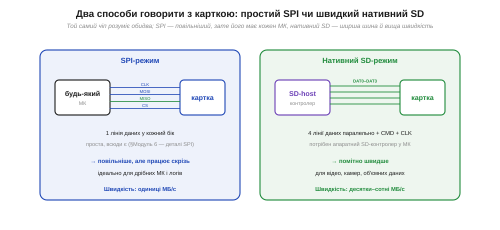
*Рис. 3.8.6.2. **SPI-режим**: картка спілкується кількома лініями (такт, дані туди, дані назад, вибір), по **одній** лінії даних у кожен бік. Простий протокол, який має **кожен** мікроконтролер, — але повільніший (одиниці МБ/с). **Нативний SD-режим**: **чотири** лінії даних паралельно плюс командна, потрібен апаратний SD-контролер у МК — зате помітно швидше (десятки-сотні МБ/с). Той самий чіп розуміє обидва способи.*

Вибір тут — класичний компроміс «простота проти швидкості». **SPI-режим** використовує загальну послідовну шину (детально протокол SPI ми розберемо в Модулі 6; тут досить знати, що це проста й всюдисуща чотирипровідна шина): один провід тактує, один несе дані до картки, один — від картки, один обирає картку. Так уміє **будь-який** мікроконтролер, навіть найдрібніший, тож SPI — стандартний спосіб підчепити картку до простого пристрою для логів чи конфігурації. Платня — швидкість лише в одиниці мегабайтів за секунду. **Нативний SD-режим** використовує **чотири** лінії даних одночасно й вимагає, щоб у мікроконтролері був спеціальний апаратний SD-host-контролер. Зате й швидкість на порядок вища — десятки й сотні мегабайтів за секунду, що потрібно для відео чи камер. Та сама картка слухняно працює в обох режимах; вибирає розробник — за тим, що важливіше в конкретному пристрої.

### Класи швидкості: число — це гарантований мінімум

Останнє, що варто розуміти про картки, — **класи швидкості** на маркуванні. І головне тут — що саме число **означає**.


*Рис. 3.8.6.3. Клас швидкості (Class 2/4/6/10, потім U1/U3, потім V30/V60/V90) — це **гарантований мінімум** швидкості **запису** в МБ/с, а не піковий показник. Наприклад, V30 обіцяє «не повільніше за 30 МБ/с при безперервному записі». Горизонтальні лінії показують, що потребують застосування: Full HD відео ≈ 6 МБ/с, 4K ≈ 30 МБ/с, 4K 60 к/с і 8K — 60-90 МБ/с.*

Чому виробники гарантують саме **мінімум**, а не пік? Бо для головного застосування карток — **запису відео** — важлива не максимальна, а **найгірша** швидкість. Запис відеопотоку не можна «наздогнати» потім: якщо картка хоч на мить **просіла** нижче потоку даних, кадр загублено назавжди. Тому стандарт обіцяє: «при безперервному записі швидкість **не впаде** нижче стільки-то МБ/с» — і камера, знаючи цю цифру, певна, що встигне записати кожен кадр. Для розробника висновок практичний: обираючи картку під задачу з безперервним записом, дивіться саме на **клас** (гарантований мінімум), а не на рекламне «до стількох МБ/с», бо рекламна цифра — це пік читання, який до безперервного запису стосунку не має.

**Приклад (чи витримає картка запис відео).** Камера пише потік 4K-відео близько 100 мегабітів за секунду. Картка якого класу потрібна?

```
бітрейт відео     = 100 Мбіт/с
переведемо в байти= 100 ÷ 8        = 12.5 МБ/с  (треба гарантовано писати стільки)

Class 10 / U1     гарантує  ≥ 10 МБ/с   → НЕ вистачає (12.5 > 10): можливі пропуски
U3 / V30          гарантує  ≥ 30 МБ/с   → вистачає із запасом
```

Висновок прикладу: переводимо бітрейт у мегабайти за секунду (ділимо на 8) і добираємо клас із **запасом** над цим числом. Class 10 тут уже на межі й ризикує гублити кадри, а V30 дає надійний запас. Зверніть увагу: дивимося саме на гарантований мінімум класу, а не на пікову рекламну швидкість, — бо при записі важлива «підлога», а не «стеля».

> 🔧 **Навіщо це.** SD-картка — найдоступніший спосіб дати пристрою об'ємне нелетке сховище, і знати її будову корисно щодня. Перше: всередині — **NAND плюс контролер**, тож картка сама веде ECC, ховає дефекти й розкидає знос; вам не треба робити це руками — досить читати/писати сектори (а поверх них зазвичай кладуть файлову систему). Друге, дуже практичне: **SPI чи нативний SD** — це ваш вибір за критерієм «простота проти швидкості». Для логера на дрібному МК беріть SPI (його має кожен чіп, швидкості вистачає); для відео чи камери потрібен нативний 4-лінійний режим з апаратним SD-контролером. Третє: **клас швидкості — це гарантований мінімум запису**; під безперервний запис (відео, потокові дані) обирайте картку за класом (V30, V60…), а не за піковою рекламною цифрою. Четверте, на майбутнє: картка зношується від запису (NAND має обмежений ресурс) — для частих дрібних оновлень вона погана, і ми побачимо в §3.8.8, що для цього є інша пам'ять.

---

Підсумок §3.8.6: **SD-картка** — це втілення принципу «NAND + контролер» у знімному корпусі. Усередині — один чи кілька **NAND-кристалів** і власний **контролер**, що веде **ECC**, ховає **дефектні** блоки, відображає логічні **сектори** на фізичні сторінки й рівномірно розкидає знос; назовні картка виглядає як проста **блокова** пам'ять («читай/пиши сектор N»), і вся каверза NAND (§3.8.5) лишається схованою. Говорити з карткою можна двома способами: **SPI** (одна лінія даних, є в кожного МК, повільніше — одиниці МБ/с) або **нативний SD** (чотири лінії, потрібен апаратний контролер, швидше — десятки-сотні МБ/с); вибір — компроміс простоти й швидкості. **Класи швидкості** (Class/U/V) задають **гарантований мінімум запису**, що критично для безперервного відео. SD-картка — лише один представник великої родини «розумної» NAND. Та сама ідея «контролер ховає NAND і вдає просту пам'ять» масштабується вгору — до впаяних eMMC і великих SSD, де прошарок, що вдає диск, дістав окрему назву й окрему важливість.

---

## 3.8.7 eMMC і SSD якісно: FTL — прошарок, що вдає з себе диск

SD-картка показала нам потужний прийом: сховати норовливу NAND за контролером, який віддає назовні прості **сектори** (§3.8.6). Той самий прийом працює й у більшому масштабі — у впаяній пам'яті телефонів (**eMMC**) і у великих накопичувачах комп'ютерів (**SSD**). Усі вони — це «NAND плюс контролер», лише потужніший контролер, ширша шина й більше кристалів. Але тепер варто придивитися до **самого** того прошарку всередині контролера, бо в нього є ім'я й окрема роль: **FTL** (*Flash Translation Layer*, прошарок трансляції флеш). Саме він робить головний фокус — змушує флеш **вдавати з себе диск**. Зрозуміти ідею FTL важливо, бо вона пояснює, чому будь-яке флеш-сховище — від картки до серверного SSD — поводиться так, як поводиться.

### Навіщо взагалі вдавати диск

Питання, з якого все починається: чому не дати системі працювати з NAND **напряму**? Бо NAND **незручна** саме тими рисами, що ми бачили в §3.8.5, а звичні файлові системи й операційні системи очікують зовсім іншого — рівного диска з секторами, які можна **перезаписувати на місці**.


*Рис. 3.8.7.1. Зверху операційна система бачить **рівний диск**: пронумеровані сектори, кожен можна читати, писати й **перезаписувати на місці**. Знизу — реальна **NAND**: доступ сторінками, стирання великими блоками, дефектні комірки, обмежений ресурс. Між ними сидить **FTL** усередині контролера: він тримає таблицю «логічний сектор → фізична сторінка», ховає дефекти, розкидає знос і прибирає сміття. Увесь бруд NAND лишається внизу й нагору не просочується.*

Суть невідповідності варто проговорити, бо вона й породжує FTL. Файлова система хоче сказати «перезапиши сектор 1000» — і щоб це просто спрацювало. Але NAND так **не вміє**: щоб змінити вже записану сторінку, її не можна просто перекрити — спершу треба **стерти** цілий блок (а блок великий, у ньому багато сторінок), і лише потім писати. Прямо віддати NAND системі означало б змусити кожну файлову систему знати про сторінки, блоки, стирання, дефекти й знос — нездійсненно. Тому контролер ставить **FTL** — прошарок, що приймає прості «диско-подібні» запити зверху й перекладає їх на реальні операції з NAND знизу, ховаючи всю незручність. Для системи флеш виглядає як звичайний диск; уся складність замкнена у FTL.

### Що робить FTL: відображення й підміна

Як саме FTL створює цю ілюзію? Через **таблицю відображення** (*mapping table*) і свободу класти дані **куди завгодно** фізично.

Головний трюк такий: коли система просить «перезаписати сектор 1000», FTL **не** стирає старе місце. Натомість він пише нові дані на якусь **вільну** сторінку, а в таблиці просто змінює запис: «сектор 1000 тепер ось тут». Старій сторінці ставиться позначка «застаріла», і колись пізніше, у спокійний момент, FTL збере такі застарілі сторінки й гуртом **прибере** (зітре блок, щоб звільнити місце) — це звуть **збиранням сміття** (*garbage collection*). Завдяки цій непрямості FTL вільний класти кожен запис туди, де зручно, — а отже, може **рівномірно розкидати** записи по всіх комірках, щоб жодна не зносилася швидше за інших, і **обходити** дефектні блоки, підставляючи замість них запасні. Логічний номер сектора, який бачить система, і фізичне місце, де дані лежать насправді, **роз'єднані** — і саме це роз'єднання дає FTL свободу творити всі свої хитрощі.

Аналогія — **бібліотекар із каталогом**. Уявіть, що ви просите «книгу №1000». Читачеві байдуже, на якій саме полиці вона лежить, — він знає лише номер у каталозі. Бібліотекар (FTL) тримає каталог «номер → полиця» і вільний переставляти книги між полицями, аби читач завжди знаходив потрібну за номером. Коли книгу оновлюють, бібліотекар не стирає стару на її полиці (це довго), а кладе нову на будь-яку вільну й **виправляє каталог**; стару позначає «на викидання» й прибирає згодом гуртом. Ця непрямість і дає всю гнучкість: книги можна розкладати рівномірно (щоб одні полиці не зношувалися, поки інші порожні) і обминати **зламані** полиці. Так само й FTL: каталог-таблиця відв'язує номер сектора від фізичного місця, і саме ця свобода дозволяє рівно зношувати комірки й обходити дефекти, не турбуючи систему вгорі.

**Приклад (як перезапис стає переадресацією).** Простежмо, що робить FTL, коли система двічі пише в той самий сектор.

```
система:  записати сектор 1000 = "AAAA"
FTL:      кладу на фізичну сторінку 5; таблиця: [сектор 1000 → стор. 5]
          ─────────────────────────────────────────────────────────
система:  перезаписати сектор 1000 = "BBBB"
FTL:      НЕ чіпаю сторінку 5 (стирати дорого!);
          кладу "BBBB" на вільну сторінку 9;
          таблиця: [сектор 1000 → стор. 9];  стор. 5 ← позначка "сміття"
          ─────────────────────────────────────────────────────────
згодом:   garbage collection зітре блок зі сторінкою 5, повернувши її у вільні
```

Висновок прикладу: «перезапис на місці», який бачить система, насправді — **переадресація** на нове фізичне місце плюс відкладене прибирання старого. Так FTL і примиряє вимогу системи (перезаписуй будь-який сектор) із природою NAND (стирати можна лише блоками).

Із цієї механіки випливають дві поведінки, які корисно розуміти на практиці. Перша: флеш-сховище може **пригальмовувати непередбачувано**. Поки є запас вільних сторінок, запис летить швидко; коли вільне місце вичерпується, FTL мусить спершу **прибрати сміття** (зібрати застарілі сторінки й стерти блоки), щоб звільнити простір, — і саме в ці моменти запис ненадовго просідає. Тому повний накопичувач часто пише повільніше за порожній, і це не поломка, а наслідок роботи FTL. Друга, важливіша для надійності: оскільки в момент запису FTL **оновлює таблицю** відображення й перекидає дані, **раптове зникнення живлення посеред запису** може лишити цю внутрішню кухню в напівготовому стані. Хороші контролери захищаються від цього, та висновок для розробника простий: не висмикуйте живлення (і не виймайте картку) під час активного запису, а в пристрої, де живлення може зникнути будь-коли, передбачте акуратне завершення запису — інакше ризикуєте пошкодити не один сектор, а структуру сховища.


*Рис. 3.8.7.2. Одна ідея в трьох масштабах. **SD-картка** — знімна, один контролер і кілька NAND-кристалів, шина SD/SPI, десятки МБ/с. **eMMC** — той самий комплект, але **впаяний** у плату одним корпусом, ширша шина, сотні МБ/с; це типова пам'ять телефонів та IoT-пристроїв. **SSD** — окремий накопичувач із **потужним** контролером і кеш-пам'яттю, шина SATA чи NVMe, тисячі МБ/с; це диски ПК і серверів. Скрізь усередині — «NAND + FTL», росте лише потужність контролера й ширина шини.*

> 🔧 **Навіщо це.** Ідея FTL пояснює поведінку **будь-якого** флеш-сховища, з яким ви працюєте. Перше: контролер **вдає диск**, тож для вашого коду й SD, і eMMC, і SSD — це прості блокові пристрої з секторами; складність NAND вас не стосується, нею опікується FTL. Друге: оскільки «перезапис на місці» насправді є переадресацією плюс відкладене прибирання, продуктивність флеш-сховища **непостійна** — буває, що збирання сміття на мить пригальмовує запис; це нормально й закладено в природу FTL. Третє, концептуальне: **роз'єднання** логічного й фізичного розташування — це те, що дає змогу взагалі надійно зберігати дані на пам'яті з обмеженим ресурсом і дефектами. А ось **деталі** того, як саме FTL вирівнює знос комірок (wear leveling), — окрема велика тема, до якої ми повернемося у Розділі 4.3 (§4.3.3); тут досить твердо засвоїти головну ідею: **контролер вдає диск**.

---

Підсумок §3.8.7: **eMMC** і **SSD** — це той самий принцип «NAND + контролер», що й SD-картка (§3.8.6), лише в більшому масштабі (потужніший контролер, ширша шина, більше кристалів): eMMC — впаяна пам'ять телефонів/IoT, SSD — накопичувачі ПК і серверів. Серце контролера — **FTL** (Flash Translation Layer): прошарок, що змушує флеш **вдавати з себе диск**. Зверху система бачить рівні сектори з перезаписом на місці; знизу — NAND зі сторінками, блоковим стиранням і дефектами. FTL примиряє їх через **таблицю відображення** «логічний сектор → фізична сторінка»: замість стирати старе місце він пише нові дані на вільну сторінку й **переадресовує** сектор, а застаріле згодом прибирає **збиранням сміття**. Це роз'єднання логічного й фізичного дає змогу рівномірно розкидати знос і обходити дефекти. Головне для нас — ідея «контролер вдає диск»; деталі вирівнювання зносу — у §4.3.3. Уся ця родина (SD, eMMC, SSD) добра для **великих** даних. Та є зовсім інший випадок — крихітне налаштування, яке хочеться оновлювати **окремими байтами** й часто. Для нього велика блокова флеш незручна, і тут на сцену виходять EEPROM та FRAM.

---

## 3.8.8 EEPROM і FRAM: маленькі сховища налаштувань

Усі сховища, що ми досі бачили — NAND, SD, eMMC, SSD, — заточені під **великі** дані й працюють **блоками**: щоб змінити байт, флеш мусить стерти цілу сторінку чи блок (§3.8.5, §3.8.7). Це чудово для файлів і медіа, але геть незручно для іншого, дуже частого випадку: коли треба зберегти **крихітку** даних — серійний номер, калібрувальну поправку, лічильник напрацювання, одну уставку — і час від часу її **оновлювати**. Городити заради одного байта стирання цілого блоку — марнотратство. Для таких маленьких сховищ існують дві спеціальні нелеткі пам'яті з **побайтовим** записом: давня й дешева **EEPROM** і молодша, майже ідеальна **FRAM**. Розберімо, чим вони зручні й чим відрізняються одна від одної.

### Головна перевага: пишемо окремий байт

Найважливіша риса цих пам'ятей — можна записати **рівно один байт**, не чіпаючи сусідів і нічого попередньо не стираючи.

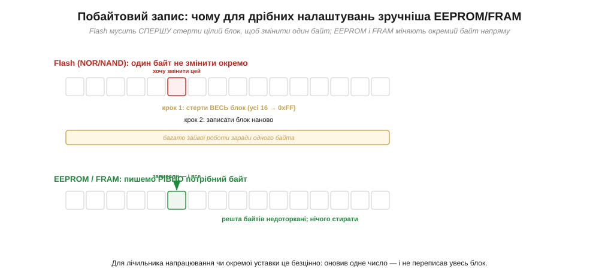
*Рис. 3.8.8.1. Щоб змінити один байт у **Flash**, доводиться спершу **стерти цілий блок** (усі його байти), а потім записати блок наново, — багато зайвої роботи заради однієї комірки. **EEPROM і FRAM** пишуть **рівно потрібний байт** напряму: решта комірок недоторкані, стирати нічого не треба. Для окремої уставки чи лічильника це безцінно.*

Різниця в зручності тут разюча. У флеші, як ми знаємо, дрібне оновлення обертається важкою процедурою «стерти блок → переписати блок», бо стирати можна лише гуртом. EEPROM (*Electrically Erasable Programmable ROM*) і FRAM (*Ferroelectric RAM*) працюють інакше: кожна комірка адресується й перезаписується **окремо**, як у звичайній RAM, але при цьому пам'ять лишається **нелеткою** — дані стоять без живлення. Записати нове значення лічильника чи поправки — це одна проста операція над потрібним байтом, без жодного стирання й без зачіпання решти. Саме тому ці пам'яті — природний дім для **налаштувань**: маленьких, але важливих даних, що мусять пережити вимкнення й час від часу оновлюватися.

Виглядають ці пам'яті скромно — здебільшого це **крихітні мікросхеми** на кілька кілобайтів, що під'єднуються до мікроконтролера простою послідовною шиною (тими самими I²C чи SPI, які детально розберемо в Модулі 6). Для коду робота з ними зводиться до «прочитати байт за адресою» / «записати байт за адресою» — рівно та модель пам'яті як масиву комірок, що з §3.6.1. Деякі мікроконтролери навіть мають невеличку вбудовану EEPROM (або **імітують** її в куточку своєї Flash), щоб тримати дрібні уставки без окремого чіпа. Обсяг тут навмисно малий — кілобайти, не мегабайти, — бо й призначення дрібне: не файли й медіа (для цього є NAND/SD, §3.8.6), а кілька важливих чисел, які мусять пережити вимкнення. Тримаймо цей контраст у голові: велике сховище й маленьке сховище — це різні пам'яті під різні потреби.

### EEPROM проти FRAM: ресурс, швидкість, енергія

Маючи спільну рису (побайтовий нелеткий запис), EEPROM і FRAM різняться в трьох вимірах, що й визначають вибір між ними: **ресурс** перезаписів, **швидкість** запису й **енергія**.

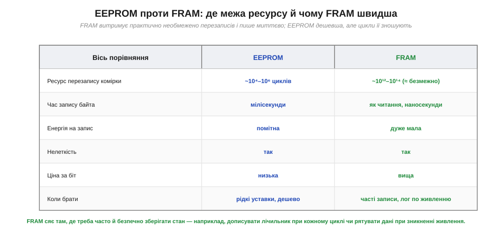
*Рис. 3.8.8.2. **EEPROM** дешева, але її комірка зношується: вона витримує близько 10⁴–10⁶ перезаписів, запис байта триває мілісекунди й помітно споживає. **FRAM** витримує ~10¹²–10¹⁴ циклів (практично необмежено), пише **миттєво** (наносекунди, як читання) і майже не споживає на запис, — але дорожча за біт. Обидві нелеткі. Звідси й вибір: рідкі уставки — EEPROM; часті записи чи рятування даних при зникненні живлення — FRAM.*

Розберімо ці три осі, бо вони вирішальні. **Ресурс** (*endurance*) — скільки разів комірку можна перезаписати, поки вона не зноситься: у EEPROM це від десятків тисяч до мільйона циклів — багато для рідкісних змін, але мало, якщо писати щосекунди (адже основа EEPROM — той самий плаваючий затвор, що зношується від запису, §3.6.8). FRAM зберігає біт інакше — поляризацією особливого матеріалу, — і тому витримує трильйони циклів, тобто **практично необмежено**. **Швидкість**: EEPROM пише байт мілісекунди (помітна пауза), FRAM — за наносекунди, не повільніше за читання. **Енергія**: запис у EEPROM відчутно споживає, у FRAM — майже задарма. Підсумок очевидний: FRAM кращий майже в усьому, крім **ціни** — він дорожчий за біт, тому EEPROM досі живий там, де треба дешево й зрідка. А там, де записувати треба **часто** — наприклад, дописувати лічильник при кожному циклі роботи чи блискавично зберегти стан у мить зникнення живлення, — FRAM незамінний.

**Приклад (ресурс лічильника напрацювання).** Уявімо пристрій, що при кожному ввімкненні дописує лічильник у нелетку пам'ять. Скільки циклів він переживе на EEPROM і на FRAM?

```
сценарій: запис лічильника 1 раз за хвилину, 24/7

EEPROM (ресурс ≈ 100 000 циклів комірки):
   100 000 циклів ÷ (60 запис/год × 24 год) ≈ 69 діб → комірка зношена!
   (рятує «розмазування» запису по багатьох комірках, але це ускладнення)

FRAM (ресурс ≈ 10¹³ циклів):
   10¹³ ÷ (1440 запис/добу) ≈ 19 мільярдів діб → практично вічно
```

Висновок прикладу: для **частого** запису EEPROM швидко вичерпує ресурс однієї комірки (за тижні!), і доводиться хитрувати, розкидаючи запис; FRAM же витримує такий режим **необмежено** — тому саме його ставлять, коли стан оновлюють постійно.

Окремо варто розкрити випадок «зберегти стан в останню мить», де FRAM незрівнянний. Уявімо пристрій, у якого зненацька зникає живлення — висмикнули кабель, сіла батарея. Між миттю, коли напруга почала падати, і миттю, коли її вже замало для роботи, минає крихітний проміжок: конденсатори на платі ще тримають заряд кілька мілісекунд. Цього вікна вистачає, щоб **встигнути записати** найважливіше — поточні лічильники, останній стан, незавершені дані, — **якщо** пам'ять пише швидко. FRAM пише за наносекунди й майже без енергії, тож устигає зберегти все за це коротке вікно; EEPROM зі своїми мілісекундами на байт часто **не встигає** — напруга впаде раніше. Тому в пристроях, де живлення може обірватися будь-коли, а втрачати стан не можна, FRAM — не примха, а правильний інструмент: він перетворює «раптову смерть» на акуратне збереження.

> 🔧 **Навіщо це.** EEPROM і FRAM закривають той клас даних, з яким велика флеш незручна, — **маленькі налаштування**. Перше: коли треба зберегти серійний номер, калібрування, уставки користувача чи лічильник — це робота для **побайтової** нелеткої пам'яті, а не для блокової флеші чи картки (городити стирання блоку заради байта безглуздо). Друге, критично важливе — **ресурс**: якщо записуєте **часто**, рахуйте цикли. EEPROM (10⁴–10⁶ циклів) вичерпується за тижні безперервного запису в одну комірку — для такого беріть **FRAM** (практично безмежний ресурс) або «розмазуйте» запис по EEPROM. Третє: **FRAM пише миттєво й майже без енергії**, тому він ідеальний, щоб **зберегти стан у момент зникнення живлення** (встигаєте записати, поки конденсатори ще тримають напругу) — для EEPROM з її мілісекундами це часто запізно. Коротко: рідко й дешево — EEPROM; часто, швидко чи «в останню мить» — FRAM.

---

Підсумок §3.8.8: для **маленьких** даних, які треба оновлювати **окремими байтами** (серійний номер, калібрування, уставки, лічильники), велика блокова флеш незручна — вона стирає цілими блоками (§3.8.5, §3.8.7). Тут служать дві нелеткі пам'яті з **побайтовим** записом: **EEPROM** і **FRAM**. Обидві дають змінити рівно потрібний байт, не чіпаючи сусідів і нічого не стираючи, та зберегти дані без живлення. Різниця — у трьох осях: **EEPROM** дешева, але зношується (~10⁴–10⁶ циклів, бо плаваючий затвор, §3.6.8), пише мілісекунди й помітно споживає; **FRAM** витримує ~10¹²–10¹⁴ циклів (практично безмежно), пише за наносекунди й майже без енергії, але дорожча. Звідси вибір: рідкі уставки — EEPROM; часті записи чи рятування стану в мить зникнення живлення — FRAM. На цьому ми зібрали **повний набір** зовнішніх пам'ятей: швидку летку (DRAM/SDRAM/DDR під контролером), ємне нелетке сховище (NOR, NAND, SD, eMMC, SSD) і крихітне побайтове (EEPROM, FRAM). Лишилося навчитися **обирати** з-поміж них під конкретний проєкт — зведемо все в одну таблицю рішень.

---

## 3.8.9 Як обрати пам'ять для проєкту

Ми пройшли весь спектр зовнішньої пам'яті: від летучої DRAM під контролером (§3.8.2–3.8.4) через нелеткі флеші NOR і NAND (§3.8.5), SD-картки (§3.8.6), eMMC і SSD з їхнім FTL (§3.8.7) — до крихітних EEPROM і FRAM (§3.8.8). Кожну ми розглядали окремо; час **зібрати** все в одне рішення. Бо в реальному проєкті питання стоїть не «що таке DRAM?», а «яку пам'ять **поставити** під цю конкретну задачу?». Ця підсумкова тема — практична: вона перетворює весь розділ на **процедуру вибору** за п'ятьма критеріями (обсяг, швидкість, ресурс, енергія, ціна) і дерево, що веде від характеру даних до потрібного чіпа. Жодних нових пам'ятей тут не буде — лише спосіб упевнено орієнтуватися серед уже знайомих.

### Перше питання: робоче чи сховище?

Увесь вибір починається з одного поділу, який ми провели ще в §3.8.1 і відтоді бачили знову й знову: дані **робочі** (швидкі, тимчасові) чи це **сховище** (мусить пережити вимкнення)? Від відповіді розходяться дві великі гілки.

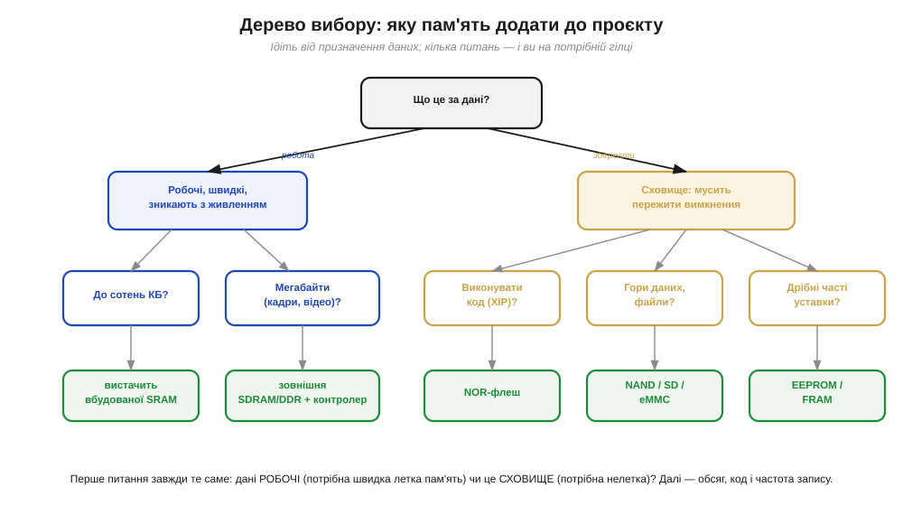
*Рис. 3.8.9.1. Ідіть від призначення даних. **Робочі, швидкі, зникають із живленням** → летка RAM: до сотень КБ вистачить вбудованої **SRAM**, мегабайти (кадри, відео) — зовнішня **SDRAM/DDR з контролером**. **Сховище, мусить пережити вимкнення** → нелетка пам'ять, а далі за уточненнями: виконувати **код** (XIP) → **NOR**; гори файлів і медіа → **NAND / SD / eMMC**; дрібні часті уставки → **EEPROM / FRAM**.*

Логіка дерева — це стиснутий весь розділ. Якщо дані **робочі** (буфер кадру, аудіо, проміжні масиви) — потрібна **летка** пам'ять, і питання лише в обсязі: сотні кілобайтів покриє вбудована SRAM, а мегабайти вимагають зовнішньої DRAM, отже й контролера (§3.8.4), отже й мікроконтролера, що його має. Якщо дані — **сховище** (мусять лишитися), гілка йде до **нелеткої** пам'яті, де далі вирішують три уточнення: чи треба **виконувати з неї код** (тоді NOR із XIP, §3.8.5), чи це **великі** файли й медіа (тоді NAND у вигляді SD/eMMC/SSD, §3.8.6–3.8.7), чи це **дрібні часті** уставки (тоді EEPROM або FRAM, §3.8.8). Одне-два питання — і ви на потрібній гілці. Це і є головний робочий інструмент розділу.

### П'ять осей компромісу

Дерево дає клас пам'яті; щоб обрати остаточно, зважують **п'ять** осей, за якими пам'яті й різняться. Тримаймо їх усі перед очима.

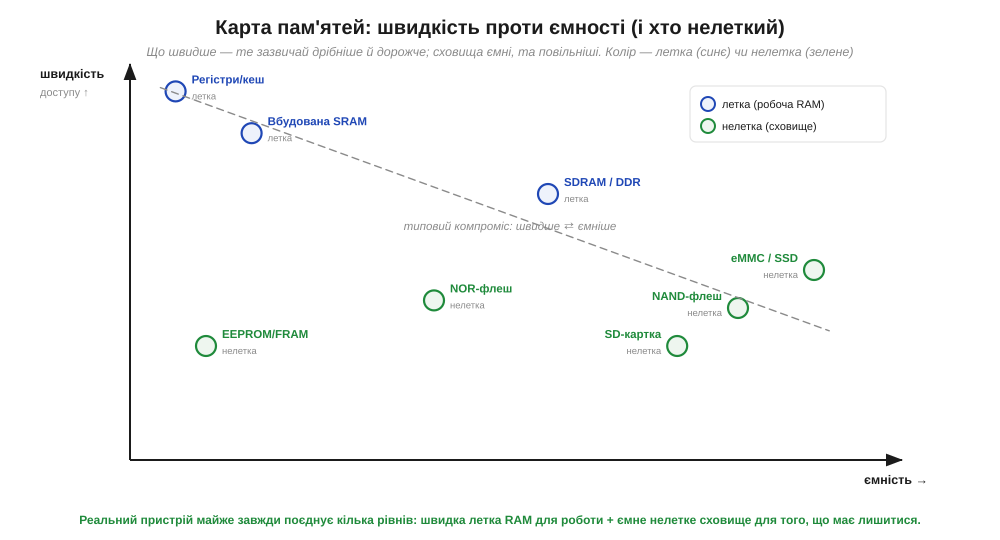
*Рис. 3.8.9.2. Пам'яті на площині **швидкість ↔ ємність**; колір — летка (синє, робоча RAM) чи нелетка (зелене, сховище). Угорі-ліворуч — найшвидше, але дрібне й дороге (регістри, SRAM); праворуч — ємне сховище, та повільніше (NAND, SD, eMMC/SSD); посередині — DRAM (швидка робоча) і NOR (нелетка, але не надто ємна). Пунктир — типовий компроміс: що швидше, те зазвичай дрібніше й дорожче.*

Ось ці п'ять осей, що їх варто прикинути для будь-якого вибору. **Обсяг** — скільки байтів треба (кілобайти, мегабайти, гігабайти): він одразу відкидає половину варіантів. **Швидкість** — як хутко потрібен доступ і чи послідовний він, чи випадковий (DRAM швидка, флеш повільніша; XIP вимагає миттєвого випадкового читання). **Ресурс** — чи багато буде **перезаписів**: рідкісні не страшні нікому, а часті вбивають EEPROM і зношують NAND, тоді як SRAM, DRAM і FRAM витримують практично будь-що (§3.8.8). **Енергія** — чи живиться пристрій від батареї: DRAM постійно споживає на регенерацію (§3.8.4), флеш дорого платить за запис, а нелеткі пам'яті нічого не їдять у спокої. **Ціна** — за біт і за корпус: SRAM дорога, DRAM і NAND дешеві за мегабайт, FRAM дорожчий за EEPROM. Реальне рішення майже завжди **зважує** ці осі одна проти одної: ідеальної пам'яті немає, є та, що найкраще лягає під конкретні вимоги.

Карта на рисунку 3.8.9.2 показує головну причину, чому ці осі неможливо задовольнити одним чіпом: вони **тягнуть у різні боки**. Що швидша пам'ять, то вона дрібніша й дорожча (вершина — крихітні швидкі регістри й SRAM); що ємніша й дешевша, то повільніша (низ-праворуч — гігабайтні, але неквапні NAND-сховища). Це не недогляд інженерів, а фундаментальний компроміс: фізика не дає водночас і блискавичну швидкість, і дешеву ємність, і нелеткість. Ту саму закономірність ми вже зустрічали всередині процесора — там швидкий, але крихітний кеш стояв перед повільнішою, зате більшою основною пам'яттю (§3.5.9). Тут вона повторюється на рівні цілого пристрою: шикувати пам'яті **сходинками** — трохи дуже швидкої вгорі, багато повільної внизу — це універсальний спосіб мати водночас і швидкість там, де треба, і ємність там, де треба. Тому правильна відповідь на «яку пам'ять обрати» майже завжди — **кілька**, а не одна.

### Реальний пристрій поєднує кілька пам'ятей

І останнє, найважливіше для практики: серйозний пристрій рідко обходиться **однією** пам'яттю. Зазвичай у ньому співіснує **кілька** — кожна закриває свою потребу.

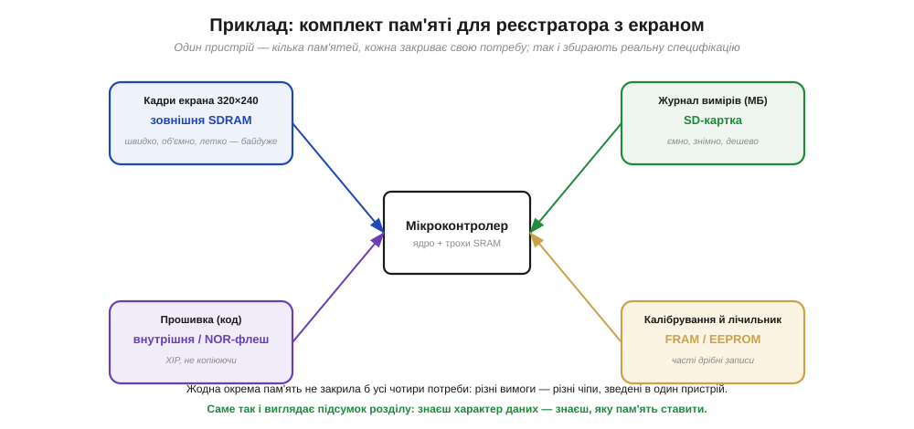
*Рис. 3.8.9.3. Реєстратор з екраном поєднує чотири пам'яті, кожну — під свою потребу. **Кадри екрана** → зовнішня **SDRAM** (швидко, об'ємно; летко — байдуже). **Прошивка (код)** → внутрішня або **NOR**-флеш (XIP, без копіювання). **Журнал вимірів** (мегабайти) → **SD-картка** (ємно, знімно, дешево). **Калібрування й лічильник** (часті дрібні записи) → **FRAM** чи **EEPROM**. Жодна окрема пам'ять не закрила б усі чотири потреби.*

**Приклад (підбираємо комплект під реєстратор).** Пройдімо вибір для пристрою з екраном, що пише журнал, по кожній потребі окремо — це і є практичний підсумок розділу.

```
потреба                  → ось вибору                  → рішення
─────────────────────────────────────────────────────────────────
кадр 320×240, подвійний   обсяг ~300 КБ, швидко, летко   зовнішня SDRAM
буфер  (робочі дані)       байдуже                       (+ контролер)

прошивка застосунку        нелетке, виконувати код        NOR-флеш (XIP)
(код)                      на місці

журнал вимірів, дні        нелетке, мегабайти, дешево,    SD-картка
роботи (сховище)           знімне                        (SPI або SD-режим)

калібрування + лічильник   нелетке, дрібне, ЧАСТІ         FRAM
напрацювання               перезаписи → ресурс!          (безмежний ресурс)
```

Висновок прикладу: кожна з чотирьох потреб лягає на **різну** пам'ять, бо в них різні вимоги за обсягом, швидкістю, нелеткістю й ресурсом. Зібравши ці чотири чіпи навколо мікроконтролера, ми й дістаємо специфікацію пам'яті реального пристрою. Саме так — потреба за потребою — її й складають на практиці.

> 🔧 **Навіщо це.** Це підсумкове вміння — те, заради чого писався весь розділ. Беручись за пристрій, не питайте «яка пам'ять найкраща» (такої немає) — питайте **за кожною групою даних окремо**: робочі вони чи сховище, який обсяг, як часто перезаписуються, чи критична енергія, скільки можна витратити. Перше питання (робоче/сховище) одразу ділить вибір надвоє; обсяг і код звужують далі; ресурс і енергія роблять остаточний вибір усередині класу. І не дивуйтеся, що пам'ятей у пристрої виявиться **кілька**: швидкій робочій RAM, ємному сховищу й крихітному місцю під уставки місце знайдеться окреме, бо вимоги в них несумісні. Тримайте перед очима дерево (рис. 3.8.9.1) і п'ять осей (обсяг, швидкість, ресурс, енергія, ціна) — і вибір пам'яті з лотереї перетвориться на коротку інженерну процедуру.

---

Підсумок §3.8.9: вибір пам'яті — це **процедура**, а не вгадування. Починається вона з одного питання: дані **робочі** (швидкі, тимчасові — потрібна летка RAM) чи **сховище** (мусять пережити вимкнення — потрібна нелетка)? Робочі: до сотень КБ — вбудована **SRAM**, мегабайти — зовнішня **SDRAM/DDR з контролером**. Сховище ділиться далі: код для виконання — **NOR** (XIP); великі файли й медіа — **NAND** (SD/eMMC/SSD); дрібні часті уставки — **EEPROM/FRAM**. Остаточний вибір зважує **п'ять осей**: обсяг, швидкість, ресурс (кількість перезаписів), енергія, ціна. І ключове: реальний пристрій майже завжди поєднує **кілька** пам'ятей — кожна під свою несумісну з іншими вимогу (швидка RAM для кадрів + NOR для коду + SD для логів + FRAM для лічильника). Знаєш характер даних — знаєш, яку пам'ять ставити. На цьому ми завершуємо зовнішню пам'ять, а заразом і знайомство з тим, **де** живуть код і дані. Але ми кілька разів зачепили незручну правду: біти в пам'яті бувають **перевернуті** — заряд стік, комірка зносилася, завада спотворила сигнал, частинка вдарила в кристал. NAND ми взагалі назвали пам'яттю, що дефектна **за задумом** і працює лише завдяки виправленню помилок. Як машина **помічає** й **виправляє** зіпсовані біти — окрема глибока тема наступного розділу.

> ▶️ Далі: [Розділ 3.9 — Коди виявлення й корекції помилок](../r09-error-correction/r09-error-correction.md)
