# Розділ 3.10 — Як народжується чіп: від піску до корпуса

Цілий Модуль 3 ми будували комп'ютер із чистих ідей: два надійні стани (Розділ 3.1), вентилі з транзисторів (Розділ 3.2), пам'ять-тригер (Розділ 3.3), числа з бітів (Розділ 3.4), процесор, що виконує програму (Розділ 3.5), і пам'ять, у якій ця програма живе (Розділ 3.6). Потім ми побачили, що логіку можна не лише «вилити» в кремній, а й програмувати в полі (ПЛІС, Розділ 3.7), розширювати зовнішньою пам'яттю (Розділ 3.8) і захищати від перевернутих бітів (Розділ 3.9). Усе це — **архітектура**: що чіп робить і чому. Лишилося єдине, найфізичніше питання, на яке ми досі заплющували очі: а **звідки сам чіп узявся**? Як мільярд транзисторів, кожен у кілька десятків атомів завширшки, опиняється на пластинці кремнію розміром із ніготь — і працює?

Цей розділ — про **виробництво**: шлях від звичайнісінького кварцового піску до запаяного в чорний корпус чипа з блискучими «ніжками», який ви тримаєте в руках, припаюючи до плати. Дорога довга й напрочуд красива. Спершу з піску добувають **кремній** і вирощують із нього єдиний бездоганний кристал (§3.10.1). Тоді на тонких пластинах цього кристала **світлом друкують** малюнок схеми (§3.10.2) і шар за шаром **вирощують** самі транзистори — легуванням, травленням, металізацією (§3.10.3); тут оживе вся фізика напівпровідників із Модуля 2. Далі ми чесно розберемося, що́ означає горезвісне маркетингове «5 нанометрів» (§3.10.4), чому жоден великий кристал не виходить ідеальним і як **дефекти стають статистикою** (§3.10.5), як один і той самий кристал тестуванням перетворюють на кілька різних продуктів (§3.10.6), як його **запаковують** у корпус із виводами (§3.10.7) і, нарешті, чому за всім цим стоїть економіка на мільярди доларів, через яку майже ніхто у світі не має власної фабрики (§3.10.8).

Навіщо це розробникові вбудованих систем, який чіпи не виготовляє, а лише застосовує? Бо знання, як народжується чіп, прибирає магію з даташита. Ви зрозумієте, звідки беруться ціна й дефіцит, чому існують «errata» й ревізії кристала, що насправді криється за назвою техпроцесу, чому той самий мікроконтролер продають у кількох корпусах і сортах, і чому одні чипи коштують центи, а інші — як автомобіль. Це останній розділ, що замикає всю «апаратну» частину курсу: від фізики двох станів — до фізичного предмета, який тримає логіку. А починається він, як майже кожна історія в техніці, зі суперечки про те, хто ж винайшов головне, — у нашому випадку інтегральну схему.

> 📜 **Перед матеріалом — історія:** [Кілбі проти Нойса: хто винайшов інтегральну схему](r10-history-kilby-noyce.md). Вона про те, як майже одночасно (1958–59) Джек Кілбі (*Jack Kilby*) у Texas Instruments і Роберт Нойс (*Robert Noyce*) у Fairchild дійшли до ідеї вмістити цілу схему на одному шматку напівпровідника — і чому насправді промисловим зробив її **планарний процес** Жана Ерні (*Jean Hoerni*), без якого все, що ми опишемо далі, було б неможливе. Ця історія пояснює, **чому** чіпи взагалі вирощують пласкими шарами на пластині, а не паяють із окремих деталей.

---

## 3.10.1 Кремній: від кварцового піску до монокристала

Почнімо з найнесподіванішого факту в усій електроніці: основа кожного процесора, кожного мікроконтролера, кожної мікросхеми пам'яті — це **пісок**. Точніше, кремній, добутий із кварцового піску, найпоширенішої після кисню речовини в земній корі. Сировина буквально лежить під ногами й коштує копійки. Уся складність — і вся вартість — у тому, щоб довести цей пісок до стану, який потрібен електроніці: майже ідеально чистого, з атомами, вишикуваними в один бездоганний кристал. Розберімо цей шлях, бо він задає тон усьому розділу: виробництво чіпів — це передусім **боротьба за чистоту й порядок** на атомному рівні.

### Чому саме кремній

Перше питання — чому взагалі кремній (*silicon*, Si)? Відповідь ми, по суті, уже знаємо з §2.5.1: кремній — **напівпровідник**, тобто речовина, що сидить рівно посередині між провідником і ізолятором, і — головне — його провідністю можна **керувати**, додаючи мікроскопічні домішки (легування, §2.5.2). Саме ця керованість робить можливими і діод (§2.5), і транзистор (§2.7). Германій, з якого складали перші транзистори, цю властивість теж має, але кремнію пощастило з кількома дрібницями, що виявилися вирішальними.

Найголовніша з них — **оксид**. Природний оксид кремнію (SiO₂ — той самий кварц, скло, пісок) — чудовий, стабільний **ізолятор**, який легко виростити прямо на поверхні кристала, просто нагрівши його в кисні. Германій такого подарунка не має: його оксид нестійкий, розчинний у воді й непридатний. А, як ми побачимо в §3.10.3, уся планарна технологія тримається саме на тому, що ізолятор можна вирощувати локально на поверхні й використовувати і як підзатворний діелектрик транзистора (§2.7.2), і як маску, і як захист. Друга перевага — кремній витримує вищі температури, ніж германій, не «розпливаючись», а виробництво вимагає нагрівів до сотень градусів. Третя — він **дешевий і всюдисущий**: після кисню це найпоширеніший елемент земної кори, тоді як германій рідкісний. Складіть усе — і стане ясно, чому кремній переміг: не тому, що він найкращий напівпровідник за чистою фізикою (за рухливістю носіїв його перевершують і германій, і арсенід галію), а тому, що він **найзручніший у масовому виробництві**. Це повторюваний урок усього розділу: перемагає не теоретично найкраще, а технологічно найпридатніше.

### Ланцюг очищення

Між піском і чіпом лежить ціла низка хімічних перетворень, кожне з яких прибирає чергову порцію домішок.


*Рис. 3.10.1.1. Шлях від піску до монокристала. Кварцовий пісок (SiO₂, чистота ~98%) у дуговій печі з вуглецем відновлюють до **технічного кремнію** (~99%). Його перетворюють на леткий **трихлорсилан** (SiHCl₃) і ретельно дистилюють — саме тут відсікаються домішки. Очищений газ осаджують назад у твердий **полікремній** дуже високої чистоти. І нарешті з нього вирощують **єдиний монокристал**. Чистота росте зліва направо: від кар'єрного піску до «дев'яти дев'яток».*

Простежмо логіку цього ланцюга, бо вона повчальна. Спершу пісок **відновлюють** — у величезній дуговій печі при майже 2000 °C вуглець відбирає в SiO₂ кисень, лишаючи металічний кремній. Та цей «технічний» кремній (його так і звуть — *metallurgical-grade*) для електроніки безнадійно брудний: ~99% чистоти означає цілий відсоток чужих атомів, а це астрономічно багато. Чому саме «астрономічно» — побачимо за хвилину, коли порівняємо з потрібним рівнем; поки досить інтуїції, що для напівпровідника відсоток домішки — це катастрофа.

Прямо очистити твердий кремній до потрібного рівня неможливо — домішки сидять у ньому надто міцно. Тому хитрість наступного кроку — обхідна: кремній переводять у **рідку леткий сполуку** (трихлорсилан, SiHCl₃), яку вже можна **дистилювати**, як спирт. Сенс у тому, що різні речовини киплять за різних температур, тож, багаторазово випаровуючи й конденсуючи трихлорсилан, домішки відсікають одну за одною — рівно так, як перегонка розділяє суміш рідин. Це і є місце, де народжується чистота: не в печі, а в дистиляційній колоні. Уже очищений газ тоді **розкладають назад** на твердий кремній: у реакторі (так званий процес Сіменса) гарячі стрижні «обростають» чистим кремнієм, що осідає з газу шар за шаром, — виходять палички **полікремнію** (*polysilicon*), сировина вже електронної чистоти.

Та є нюанс, який і веде нас до наступного кроку. «Полі-» означає, що цей кремній складається з безлічі дрібних кристаликів, зрослих в усіх напрямках абияк — як купа піщинок, спечених докупи. Чистота вже є, а от **порядку** немає. А чому порядок узагалі важливий? Бо на межах між кристаликами (їх звуть **зернами**) ґратка обривається, і там електрони розсіюються й застрягають — поведінка напівпровідника на таких межах непередбачувана. Транзистор же завтовшки в десятки атомів не терпить, щоб посеред його каналу проходила границя зерна. Йому потрібен **єдиний** кристал з нерозривною ґраткою — а отже, потрібен ще один крок.

### Що означає «чистота 9N»

Слово «чистий» в електроніці має дуже конкретну міру, і вона вражає.

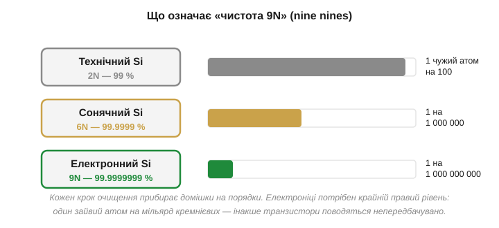
*Рис. 3.10.1.2. Чистоту записують числом «дев'яток» (nines). **2N** (99%) — технічний кремній: один чужий атом на сто. **6N** (99.9999%) — «сонячний», для фотопанелей: один на мільйон. **9N** (99.9999999%) — електронний: один чужий атом на **мільярд** кремнієвих. Кожен крок очищення прибирає домішки на порядки; електроніці потрібен крайній рівень.*

Закарбуймо цей масштаб, бо він пояснює всю дорожнечу процесу. «Дев'ять дев'яток» — це **один сторонній атом на мільярд** атомів кремнію. Уявіть стадіон, заповнений людьми, і помножте його населення в мільйони разів — і серед усього цього натовпу має бути лише кілька «чужих». Чому така параноя? Бо легування (§2.5.2) — це додавання домішки в концентрації якраз порядку «кілька атомів на мільйон-мільярд». Якщо вихідний кремній уже забруднений на цьому рівні **неконтрольовано**, то контрольоване легування втрачає сенс: ви не знатимете, скільки насправді носіїв у вашому напівпровіднику, і транзистори поводитимуться як заманеться. Чистота тут — не перфекціонізм, а передумова самої керованості, на якій тримається вся електроніка.

### Метод Чохральського: один кристал

Полікремній уже чистий, але «зернистий» — безліч дрібних кристаликів. А транзистор хоче рости в **ідеально впорядкованій** ґратці, єдиній на всю пластину. Як виростити **один** кристал розміром із відро? Відповідь знайшов 1916 року польський хімік **Ян Чохральський** (*Jan Czochralski*) — і, що характерно, знайшов випадково: за легендою, замислившись, він умочив перо не в чорнильницю, а в тигель із розплавленим металом, висмикнув — і за пером потяглася тонка застигла нитка-монокристал. Метод, названий його іменем, і досі лежить в основі виробництва кремнію.


*Рис. 3.10.1.3. Полікремній розплавляють у тиглі (~1420 °C). До поверхні розплаву торкаються маленькою **затравкою** (seed) — шматочком кремнію з потрібною орієнтацією ґратки. Затравку повільно **тягнуть угору**, водночас **обертаючи**. Розплав застигає на ній, атом за атомом копіюючи її кристалічну структуру, — і за затравкою росте суцільний монокристал (boule, злиток) діаметром 200–300 мм.*

Осягніть, наскільки це елегантно. Розплавлений кремній — це хаос вільних атомів. Затравка дає їм **зразок для наслідування**: кожен атом, що пристає до фронту кристалізації (тонкого шару на межі розплаву й твердого), стає на «правильне» місце за прикладом сусідів, продовжуючи ту саму ґратку. Виходить, увесь майбутній злиток «успадковує» орієнтацію однієї маленької затравки — тому її кристалографічний напрямок обирають заздалегідь, і він задає орієнтацію всіх майбутніх пластин. Повільно витягуючи затравку, ми ніби «намотуємо» на неї дедалі довший монокристал.

Тонкощів тут чимало, і кожна важлива. Швидкість витягування й температуру тримають у дуже вузьких межах: трохи швидше — і ґратка не встигає копіюватися рівно, з'являються дефекти; трохи повільніше — і злиток роздувається. На самому початку затравку навмисно тягнуть **швидко**, утоншуючи кристал до вузької «шийки», — цей прийом виганяє з кристала успадковані від затравки дефекти, бо вони «висипаються» на тонкому перешийку й не йдуть далі в тіло злитка. Лише потім швидкість зменшують, і кристал розростається до повного діаметра. Обертання тигля й кристала усереднює неминучі неоднорідності розплаву й температури, щоб злиток вийшов рівним і однаковим по всьому перерізу. Так за кілька десятків годин виростає циліндр — **злиток** (*ingot*, *boule*) — багатокілограмовий, дзеркально-сірий, і весь він — **один кристал** з єдиною нерозривною ґраткою від краю до краю. Тут же, на стадії розплаву, у кремній часто вводять і первинне **легування**, кидаючи в тигель точно відважену дрібку домішки, — так весь злиток рівномірно «підфарбовують» у слабкий n- чи p-тип, що стане підкладкою майбутніх транзисторів (§2.5.2).

### Від злитка до пластини

Злиток — це ще не те, на чому роблять чіпи. Його треба перетворити на тонкі круглі **пластини** (*wafer*) — ті самі блискучі диски, що стали символом мікроелектроніки.


*Рис. 3.10.1.4. Циліндричний злиток ріжуть тонкою дротяною пилкою на зрізи завтовшки ~0.7 мм — майбутні пластини. Кожен зріз шліфують і **полірують** до дзеркального, атомарно-гладенького стану. На краю роблять зріз (flat) або виїмку (notch) — позначку орієнтації ґратки. Виходить кругла полірована пластина, на якій далі друкуватимуть схеми.*

Логіка останніх кроків проста, але вимоглива. Злиток **нарізають** надтонкою дротяною пилкою на сотні зрізів — кожен стане окремою пластиною. Помітна частина дорогого кремнію при цьому буквально йде в тирсу (пропил завширшки з саму пластину), і з цим мовчки миряться — інакше тонких рівних зрізів не дістати. Та поверхня після різання шорстка й пошкоджена, а майбутні транзистори завтовшки в нанометри не терплять і найменшої нерівності, тож пластини **шліфують і полірують** (механічно й хімічно), доки вони не стають гладенькими на **атомному** рівні й дзеркальними — настільки, що в них можна дивитися, як у люстро. Невеличкий зріз (flat) чи виїмка (notch) на краю — не прикраса, а **позначка орієнтації** кристалічної ґратки: за нею обладнання точно знає, як пластина повернута, що критично, бо кристал має напрямки, уздовж яких його легше травити чи розколювати.

Чому ж пластини роблять дедалі більшими? Бо обробка йде **цілою пластиною за раз** — багато кроків (печі, осадження, травлення, а почасти й друк) обробляють увесь диск одним заходом, і їхня вартість слабо залежить від того, велика пластина чи мала. Отже, що більша пластина, то більше чіпів виходить за ту саму обробку, і то дешевший кожен. Саме тому індустрія десятиліттями нарощувала діаметр — від перших пластин у кілька сантиметрів до сьогоднішнього стандарту 300 мм (12 дюймів). Наступний логічний крок до 450 мм, утім, забуксував: вигода від більшого диска не покрила страшної ціни нового покоління обладнання, тож перехід поки відклали — рідкісний випадок, коли економіка масштабу спіткнулася. Скільки ж чіпів дає одна пластина — питання не риторичне, а грошове, тож оцінімо його прямо.

**Приклад (скільки кристалів на пластині).** Пластина діаметром 300 мм; кристал процесора — квадрат 10 мм × 10 мм. Грубо оцінимо, скільки кристалів поміститься.

```
Площа пластини:     S = π·r²  = 3.14 × (150 мм)²  ≈ 70 700 мм²
Площа кристала:     A = 10 × 10                    =     100 мм²
Наївна оцінка:      N ≈ S / A = 70 700 / 100       ≈     707 шт.
Поправка на край:   круглий диск ↔ квадратні кристали — по краю
                    кристали «не влазять» цілими, втрата ~10–15%
Реально:            N ≈ 600 кристалів
```

Сімсот складних процесорів з одного диска кремнію — ось чому окремий чіп може коштувати недорого, попри захмарну вартість заводу: витрати розмазуються на сотні штук із кожної пластини, а пластин — потік. Зверніть увагу й на **поправку на край**: круглий диск погано б'ється на квадрати, і частина периферії пропадає — це той самий «геометричний податок» на круглу форму, що нагадає про себе в §3.10.5, коли йтиметься про вихід. На цій-от полірованій круглій пластині й розгортається вся подальша магія, до якої ми переходимо.

> 🔧 **Навіщо це.** Здавалося б, де ви — і де вирощування кристалів. Та ця стадія пояснює базові факти, з якими ви стикаєтесь постійно. Перше: **кремнієва підкладка — це монокристал надвисокої чистоти**, і саме тому «сире» виробництво напівпровідників таке дороге й зосереджене в кількох країнах; ціна вашого чипа починається тут. Друге: **пластини круглі, а кристали чипів прямокутні** — звідси неминучі втрати по краях круга й сама ідея «скільки чіпів влізе на пластину», що прямо впливає на собівартість (до цього ми ще повернемося в §3.10.5). Третє, концептуальне: уся електроніка тримається на **контрольованій чистоті** — один зайвий атом на мільярд псує гру; це підкаже вам, чому навіть мікроскопічне забруднення на будь-якому етапі фатальне (а саме тому й потрібні чисті кімнати, §3.10.2). Тримайте в голові образ: ваш процесор виріс із піску, який спершу зробили чистішим за будь-що у природі, а тоді вишикували в один бездоганний кристал.

---

Підсумок §3.10.1: основа кожного чипа — **кремній** (Si), напівпровідник із Модуля 2, добутий із кварцового піску. Сировина копійчана, але її доводять до **електронної чистоти 9N** — один чужий атом на мільярд — низкою кроків: відновлення піску до технічного кремнію, перетворення на леткий трихлорсилан і **дистиляція** (тут відсікаються домішки), осадження назад у **полікремній**. Така чистота — передумова керованого **легування** (§2.5.2): інакше не знати, скільки в кремнії носіїв. Полікремній іще «зернистий», тож **методом Чохральського** (Ян Чохральський, 1916) із нього вирощують **єдиний монокристал**: затравку тягнуть із розплаву, обертаючи, і за нею наростає злиток з ідеальною ґраткою. Злиток ріжуть, шліфують і полірують на круглі **пластини** (wafer) — дзеркальні диски діаметром 300 мм. Маємо чисту впорядковану підкладку; тепер на ній треба «намалювати» схему — і роблять це не різцем, а світлом.

---

## 3.10.2 Фотолітографія: схему друкують світлом

Перед нами полірована кремнієва пластина — чиста, гладенька, порожня. На ній треба розмістити мільярди транзисторів і дроти між ними, кожен у десятки нанометрів завширшки. Жоден різець, жодна голка такого не вміють — деталі надто дрібні, дрібніші за будь-який механічний інструмент, дрібніші навіть за довжину хвилі видимого світла. Спокуса намалювати схему «вістрям» хибна вже на старті: навіть якби існувало вістря потрібної тонкості, виводити ним мільярди елементів по одному довелося б тисячі років на кожен чіп. Потрібен спосіб нанести **весь** складний візерунок **одразу**, а не по точці.

Як же це роблять? Відповідь — одна з найкрасивіших ідей у техніці: малюнок **друкують світлом**, як фотографію, цілою картиною за раз. Процес зветься **фотолітографією** (*photolithography*, буквально «світло-каменепис»), і саме він — серце всього виробництва, бо саме він задає, наскільки дрібні деталі взагалі можливі, і саме він — найдорожчий і найскладніший крок. Розберімо, як це працює, чому межу дрібності ставить сама природа світла й чому заради подолання цієї межі будують найскладніші машини на Землі.

### Ідея: фотографія навпаки

Принцип легше зрозуміти через знайому аналогію — старе плівкове фото. Там світло крізь негатив падало на світлочутливий папір і «проявляло» зображення. У фотолітографії — те саме за механізмом, тільки інше за метою: не отримати картинку для очей, а **створити фізичну маску** з малюнком схеми просто на пластині, маску, що далі керуватиме хімією й фізикою наступного кроку. Слово «літографія» (грец. «каменепис») прийшло зі старого способу друку, де малюнок наносили на камінь; «фото-» означає, що тепер «пише» світло. Аналогія з фотографією точна рівно доти, доки ми пам'ятаємо різницю: фотографія — кінцевий продукт, а тут «знімок» — лише проміжний трафарет.

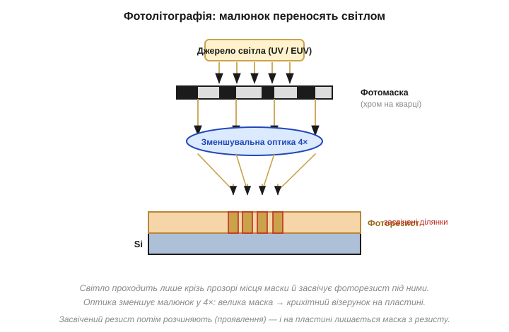
*Рис. 3.10.2.1. Світло від джерела проходить крізь **фотомаску** (*photomask*) — пластину кварцу з малюнком схеми, викладеним непрозорим хромом. Там, де хром, світло затримується; крізь прозорі ділянки воно проходить далі. **Зменшувальна оптика** (зазвичай 4×) стискає цей малюнок і проєктує його на пластину, вкриту тонким шаром світлочутливого **фоторезисту** (*photoresist*). Світло засвічує резист лише під прозорими місцями маски. Засвічений резист потім розчиняють (**проявлення**), і на пластині лишається рельєфна маска з резисту, що точно повторює рисунок.*

Простежмо хід світла. Спершу всю пластину вкривають рівним тонким шаром **фоторезисту** — речовини, яка змінює свою розчинність там, де її торкнулося світло. Наносять його красиво: краплю ллють на центр пластини й розкручують її на тисячі обертів — відцентрова сила розганяє резист рівним мікронним шаром по всій поверхні (так зване центрифугування). Над пластиною розміщують **маску**: прозорий кварц із візерунком схеми, накресленим непрозорим хромом. Світло проходить крізь маску — але тільки там, де **немає** хрому, — і засвічує резист під цими прозорими «вікнами».

Між маскою й пластиною стоїть **лінза**, що робить дивовижну річ: вона **зменшує** малюнок, зазвичай у чотири рази. Тут варто спинитися, бо це не дрібниця, а ключ до здійсненності всього процесу. Зробити маску з деталями в сотні нанометрів — посильно: вона велика, її роблять повільно й ретельно. А от прямо «накреслити» деталь у десятки нанометрів нічим не вийшло б. Зменшувальна оптика розв'язує це елегантно: на масці малюнок учетверо **більший**, а лінза стискає його, проєктуючи на пластину вже в потрібному дрібному масштабі. Похибки маски при цьому теж зменшуються вчетверо — ще один подарунок. Через це маску ще звуть **ретиклом** (*reticle*), а машину, що крок за кроком «штампує» нею пластину, — **степером** (*stepper*) чи **сканером**: вона засвічує не всю пластину разом, а по одному кристалу (чи кількох) за спалах, тоді зсувається на крок — і знову, аж поки не вкриє весь диск.

Після засвічення пластину «проявляють»: спеціальний розчинник змиває резист за певним правилом (про яке — за хвилину), лишаючи на кремнії рельєфну маску — копію схеми у твердому резисті. Ця маска з резисту й керуватиме наступним кроком обробки (§3.10.3): вона захищає одні ділянки пластини й відкриває інші. Сама по собі вона нічого в кремнії не змінює — вона лише **трафарет** для дії, що настане далі.

Варто оцінити й темп цієї роботи. Сканер засвічує кристали один по одному, та робить це шалено швидко — десятки, а то й понад сотню пластин за годину, кожна з сотнями кристалів, і так цілодобово. Машина вартістю в сотні мільйонів доларів не може дозволити собі простоювати: її окупає саме потік. А оскільки масок на один чіп — десятки, кожна пластина проходить крізь літографію **багато разів**, щоразу з новим ретиклом для наступного шару, перемежовуючись із кроками обробки §3.10.3. Літографія — не одна операція, а цілий ритм, що повторюється шар за шаром.

### Позитивний і негативний резист

Тут є тонкість, яку варто знати, бо вона повторюється скрізь у мікровиробництві: резист буває двох протилежних типів.

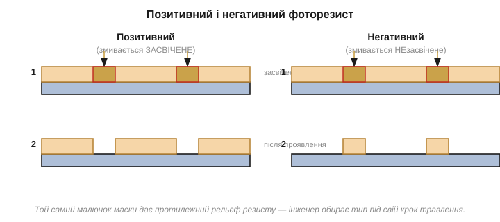
*Рис. 3.10.2.2. **Позитивний** резист: світло **руйнує** зв'язки, тож при проявленні змивається саме **засвічене** — на пластині лишається рисунок «у негативі» до світлих місць маски. **Негативний** резист: світло, навпаки, **зшиває** його, роблячи стійким, тож змивається **незасвічене**. Та сама маска дає протилежний рельєф резисту — інженер обирає тип під свій крок обробки.*

Різниця проста, але практична. У **позитивному** резисті світло **руйнує** хімічні зв'язки, роблячи засвічене розчинним; проявник змиває саме ті місця, куди впало світло, — рельєф резисту виходить «у позитиві» до прозорих ділянок маски (звідси й назва). У **негативному** — навпаки: світло **зшиває** молекули в стійку сітку, тож змивається все, **окрім** засвіченого. Виходить, з однієї і тієї ж маски можна дістати два протилежні рельєфи — залишити резист там, де було світло, або там, де його не було.

Навіщо взагалі ця двоїстість? Бо наступний крок (§3.10.3) буває різним за смислом. Якщо ми збираємось **витравити** вузькі канавки, нам зручно, щоб резист лишився суцільним полем із дірками-вікнами там, де канавки. Якщо ж, навпаки, нам треба захистити лише тонкі смужки металу, а решту прибрати, — зручніший протилежний рельєф. Інженер обирає тип резисту під конкретну операцію, як столяр обирає, з якого боку прикласти трафарет. Здебільшого в сучасному виробництві панує **позитивний** резист — він дає чіткіші, різкіші краї, а на нанометрових масштабах різкість краю важить над усе. Це гнучкість, яку дає сама хімія резисту, і вона нам знадобиться, коли ми побачимо, як із цих масок виростають реальні шари транзистора.

### Чому дрібність обмежена довжиною хвилі

Тепер — найголовніше питання всього виробництва: наскільки **дрібний** малюнок можна надрукувати світлом? Виявляється, межу ставить сама природа світла — його **довжина хвилі**.

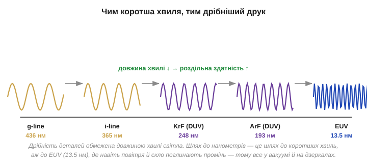
*Рис. 3.10.2.3. Світлом не можна чітко намалювати деталь, набагато дрібнішу за його **довжину хвилі** — хвиля «розмазується» на надто малих ознаках. Тому індустрія десятиліттями переходила на дедалі коротші хвилі: видиме й близьке ультрафіолетове (g-line 436 нм, i-line 365 нм) → глибоке ультрафіолетове DUV (KrF 248 нм, ArF 193 нм) → і нарешті екстремальне EUV (13.5 нм). Коротша хвиля — дрібніший друк.*

Інтуїція тут фізична й глибока. Світло — це хвиля, і коли вона огинає чи проходить крізь отвір, набагато менший за її довжину, вона **дифрагує** — розпливається, і чіткого краю не виходить. Намалювати хвилею завдовжки 193 нм деталь у 20 нм — це як писати товстим маркером дрібний шрифт: лінії зливаються в пляму. Інженери виражають цю межу формулою роздільної здатності, але суть її проста:

```
мінімальна деталь  ≈  k · λ / NA

λ   — довжина хвилі світла
NA  — числова апертура оптики (наскільки «широко» лінза збирає світло)
k   — коефіцієнт процесу (хитрощі друку; фізична межа ~0.25)
```

Дивіться, які важелі вона дає. Зменшити деталь можна трьома шляхами: узяти **коротшу хвилю** λ, зробити **ширшу апертуру** NA або стиснути коефіцієнт k хитрощами процесу. Усіма трьома індустрія й користувалася десятиліттями. Найпряміший — **коротша хвиля**: весь поступ був, серед іншого, гонитвою за меншою λ, від видимого світла через глибоке ультрафіолетове (DUV, 193 нм). На 193 нм індустрія застрягла надовго — і виграла ще кілька поколінь хитрощами: **занурила** оптику у воду (вода збільшує ефективну NA), навчилася друкувати один шар **за кілька проходів** зі зсувом (multiple patterning, що зменшує крок), додала на маски спеціальні поправки, що компенсують дифракцію. І лише коли всі ці резерви вичерпалися, зробила стрибок до **екстремального ультрафіолету** (EUV, 13.5 нм). Дався він страшенно важко: промінь такої короткої хвилі поглинається **геть усім** — повітрям, склом лінз, навіть звичайними дзеркалами, — тож працювати доводиться у глибокому вакуумі й на особливих багатошарових дзеркалах, а саме світло народжують, вистрілюючи потужним лазером по краплинах розплавленого олова, що спалахують плазмою. Машину, що це робить, недарма звуть найскладнішим серійним пристроєм в історії людства; її історію винесено в окрему 📜-вставку до цієї теми.

### Чому повітря мусить бути надчистим

І остання, дуже практична умова, без якої фотолітографія марна. Якщо деталі — десятки нанометрів, то будь-яка порошинка стає катастрофою.

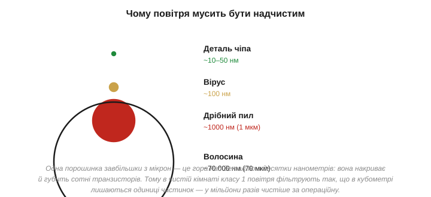
*Рис. 3.10.2.4. Масштаби в нанометрах. Деталь сучасного чіпа — десятки нанометрів. Дрібна порошинка — близько 1000 нм (1 мкм), у десятки разів **більша** за транзистор; людська волосина — ~70 000 нм, ціла гора. Одна пилинка, що сіла на пластину під час друку, накриває й губить сотні транзисторів. Тому повітря у виробництві фільтрують до одиниць частинок на кубометр.*

Уявіть масштаби буквально. Якщо транзистор — це купина, то пилинка — гора над нею, а волосина — цілий гірський хребет. Порошинка, що опустилася на пластину саме там, де друкується схема, спотворить малюнок резисту або затулить світло — і **вб'є** всі транзистори під собою, а це може бути цілий функціональний блок чи весь кристал. Звичайне кімнатне повітря містить **мільйони** частинок пилу в кожному кубометрі; для фотолітографії це смертельно. Тому чіпи виготовляють у **чистих кімнатах** (*cleanroom*) найвищого класу, де повітря безперервно й потужно проганяють згори вниз крізь фільтри тонкого очищення так, що в кубометрі лишаються **одиниці** частинок — у мільйони разів чистіше, ніж в операційній хірурга.

Боротьба з пилом пронизує тут усе. Працівники ходять у герметичних костюмах-«кролях» (*bunny suit*) не щоб захистити себе, а щоб захистити **пластину** від себе: людина — потужне джерело частинок (лусочки шкіри, волосся, волокна одягу, краплі від дихання). Повітря рухається ламінарним потоком, щоб не закручувати пил; матеріали добирають такі, що не пилять; навіть папір і олівці звичайні заборонені. А найдорожчі операції (як EUV-друк) узагалі ховають у вакуум — там пилу немає за визначенням. Ось чому «чисте повітря критичне»: на цих масштабах пил — головний ворог виходу (§3.10.5), і боротьба з ним коштує не менше, ніж саме обладнання. Це ще одна грань наскрізної теми розділу — **порядок проти випадковості**: чистота кремнію боролася з чужими атомами, чистота кімнати бореться з чужими порошинками.

> 🔧 **Навіщо це.** Фотолітографія пояснює дві речі, що прямо позначаються на вашій роботі й гаманці. Перше: **дрібність деталей обмежена фізикою світла**, і просування до менших вузлів коштує дедалі божевільніших грошей (машини EUV — сотні мільйонів доларів за штуку); звідси й ціна передових чипів, і те, чому новий техпроцес з'являється повільно. Друге: **виробництво гранично чутливе до забруднення** — звідси чисті кімнати, звідси й те, чому напівпровідникові заводи неможливо «зліпити на коліні», а їх будують роками за мільярди. Концептуально ж засвойте головне: чіп **не вирізають, а друкують** — світлом, через маску, цілою пластиною за раз; саме масовість цього «друку» (тисячі однакових кристалів одним спалахом) робить кожен окремий транзистор практично безплатним, хоча сам процес шалено дорогий. Це фундамент економіки всієї галузі, до якої ми дійдемо в §3.10.8.

---

Підсумок §3.10.2: схему на пластину не вирізають, а **друкують світлом** — це **фотолітографія**. Усю пластину вкривають **фоторезистом**; над нею ставлять **фотомаску** (хром на кварці з рисунком схеми); світло проходить крізь прозорі ділянки маски, а **зменшувальна оптика** (4×) проєктує стиснутий малюнок на резист. Засвічений резист **проявляють** — і лишається рельєфна маска з резисту, що керуватиме наступним кроком. Резист буває **позитивний** (змивається засвічене) і **негативний** (змивається незасвічене) — той самий рисунок дає протилежний рельєф. Дрібність деталей обмежена **довжиною хвилі** світла: що коротша λ, то дрібніший друк, тож індустрія йшла від видимого світла до DUV (193 нм) і **EUV** (13.5 нм, лазер по краплинах олова, вакуум, дзеркала). А оскільки деталі — десятки нанометрів, **одна порошинка** губить сотні транзисторів, тож працюють у **чистих кімнатах** з одиницями частинок на кубометр. Ми надрукували маску з резисту; але резист — це ще не транзистор. Як із цих масок шар за шаром виростає реальна схема — наступний підрозділ.

---

## 3.10.3 Шар за шаром: легування, травлення, метал

Маска з фоторезисту, надрукована в §3.10.2, сама собою нічого не робить — це лише трафарет. Справжній транзистор треба **збудувати** у самому кремнії й над ним: створити області з потрібним типом провідності, виростити ізолятор, покласти затвор, простягнути металеві дроти. І робиться це не за один прийом, а **шар за шаром** — десятками послідовних циклів, у кожному з яких фотолітографія наносить чергову маску, а тоді один фізичний крок щось **додає** або **прибирає** крізь відкриті місця цієї маски. Тут нарешті сходяться вся фізика Модуля 2 (легування §2.5.2, будова MOSFET §2.7.2) і друк із попереднього підрозділу. Простежмо, як із порожньої пластини виростає працездатний транзистор — це кульмінація всього розділу.

### Три базові дії

Хоч кроків у реальному процесі сотні, усі вони — комбінації трьох елементарних дій над пластиною.

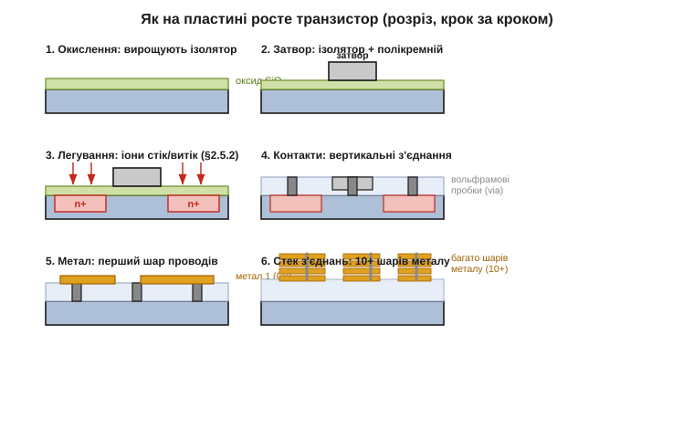
*Рис. 3.10.3.1. Транзистор виростає в розрізі за кілька груп кроків. (1) **Окислення**: на кремнії вирощують тонкий шар ізолятора SiO₂. (2) **Затвор**: поверх оксиду осаджують і формують полікремнієвий затвор. (3) **Легування**: крізь маску в кремній вживляють домішку, створюючи n⁺-області витоку й стоку (§2.5.2). (4) **Контакти**: крізь ізолятор пробивають вертикальні отвори й заповнюють металом (вольфрамові пробки). (5)–(6) **Металізація**: зверху кладуть шар за шаром металеві дроти (мідь), з'єднуючи транзистори у схему, — у сучасних чипах таких шарів понад десяток.*

Придивіться до трьох дій, з яких усе складається. Перша — **додати шар** (осадження або вирощування): на поверхні нарощують плівку — оксид-ізолятор (вирощують, нагріваючи кремній у кисні), полікремній затвора чи метал (осаджують із газу або напиленням). Друга — **прибрати зайве** (травлення, *etch*): крізь відкриті місця маски витравлюють непотрібний матеріал — або «мокро» (хімічним розчином), або «сухо» (агресивною плазмою, що вибиває атоми). Третя — **змінити сам кремній** (легування, *doping*): крізь маску в підкладку вганяють атоми домішки, перетворюючи відкриті ділянки на n- або p-тип.

Уся хитрість у тому, як ці три дії **спрямовують** — адже піч, пучок іонів і плазма діють на всю пластину однаково, без розбору, де треба, а де ні. Спрямованість дає саме маска з резисту (§3.10.2): де вона відкриває кремній, дія спрацьовує; де закриває — ні. Маска перетворює «грубий» загальний вплив на **точно окреслений** локальний — рівно так, як трафарет перетворює суцільне фарбування на чіткий напис. Тож кожен повний цикл — це чотири такти: «нанесли резист → надрукували на ньому маску → виконали одну з трьох дій крізь відкриті вікна → змили резист». Один цикл додає чи змінює **один** шар майбутньої структури.

Повторивши такий цикл десятки (а на складних чипах — сотні) разів із різними масками, з пласкої пластини нарощують об'ємну тривимірну структуру — спершу самі транзистори в кремнії, потім багатоповерхову мережу дротів над ними. Порядок масок — це фактично «креслення» чипа, розкладене на шари: кожна маска — один поверх. Уявіть, що ви будуєте складний рельєф не різьбленням, а так: накладаєте трафарет, бризкаєте шар, знімаєте трафарет, накладаєте інший, додаєте наступний шар — і так сотні разів, доки з плоскої заготовки не виросте об'ємна конструкція. У цьому й суть **планарного процесу** (того самого, що зробив можливим Жан Ерні, історія розділу): чіп не збирають із готових деталей, як радіоприймач із окремих транзисторів, а **вирощують пошарово** на місці, як друкований багатошаровий рельєф. Саме це й зробило інтегральну схему можливою — і досі лишається серцем усієї технології.

### Як вживляють домішку

Зупинимося на легуванні — кроці, що перетворює інертний кремній на власне транзистор. Згадаймо з §2.5.2: додавши донори (як-от фосфор чи миш'як), дістаємо n-тип (надлишок електронів), додавши акцептори (бор) — p-тип (надлишок дірок). У виробництві це роблять **іонною імплантацією**: атоми домішки іонізують, розганяють у потужному електричному полі до великих швидкостей і буквально **вистрілюють** ними в пластину, як з мікроскопічної гармати. Там, де поверхню відкрито (маска прибрана), іони вганяються в кремній і застрягають у ньому на потрібній глибині; там, де її захищає товстий резист чи оксид, — застрягають у масці й кремнію не дістаються.

Чому саме «вистрілюють», а не просто «насипають»? Бо так можна **точно** керувати і кількістю, і глибиною. Кількість домішки задають **дозою** — скільки іонів пролетіло (це просто електричний струм пучка, помножений на час, тож вимірюється дуже точно). Глибину задають **енергією** — швидші іони залітають глибше. Після пострілу пластину прогрівають (**відпал**), щоб вибиті з місць атоми ґратки вляглися назад, а вживлені домішки стали на вузли кристала й «увімкнулися» як донори чи акцептори. Так за один захід крізь потрібну маску створюють точно окреслені й точно дозовані області витоку й стоку — ті самі n⁺-зони обабіч затвора (§2.7.2). І ось де змикається вся параноя §3.10.1 щодо чистоти: концентрація корисної домішки тут — лічені атоми на мільйон-мільярд, тож якби вихідний кремній містив **стільки ж** випадкового бруду, він заглушив би сигнал. Чистота кремнію — це передумова того, щоб **навмисно** вживлені атоми визначали поведінку транзистора, а не випадкові чужинці. Дві теми — чистота сировини й точність легування — виявляються двома боками однієї медалі.

### Складаємо MOSFET

Зведімо кроки докупи й подивімося на готовий транзистор — той самий MOSFET, будову якого ми вивчали в §2.7.2, тільки тепер очима виробника.

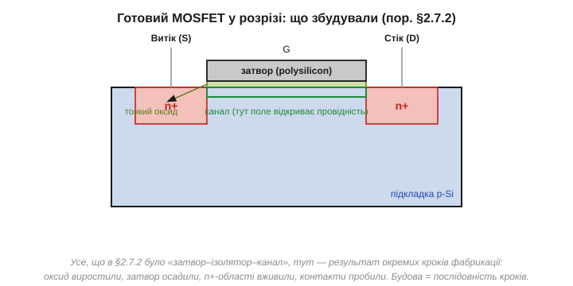
*Рис. 3.10.3.2. Той самий MOSFET, що в §2.7.2, як результат фабрикації. У p-підкладці — дві n⁺-області (**витік** і **стік**), вживлені імплантацією. Між ними — **канал**, накритий згори тонким **оксидом** (вирощеним окисленням) і **затвором** із полікремнію (осадженим і витравленим за формою). Усе, що в §2.7.2 було абстрактним «затвор–ізолятор–канал», тут — прямий підсумок окремих кроків: оксид виростили, затвор поклали, n⁺-зони вживили, контакти пробили.*

Тепер видно, що будова MOSFET — це не довільна картинка з підручника, а **запис послідовності кроків** виробництва. Тонкий підзатворний оксид — результат акуратного окислення (його товщина в кілька атомів критична: тонший — сильніше керує каналом, але легше пробивається полем; саме межа цього оксиду колись і поставила одну з фізичних стін масштабування, §3.10.4). Затвор — осаджений і витравлений за рисунком полікремній (історично саме він дав вислів «кремнієвий затвор», хоч у найновіших чипах метал повернувся, бо полікремній на крихітних розмірах став заважати). Витік і стік — вживлені імплантацією n⁺-області. А канал між ними — це просто ділянка підкладки під затвором, провідністю якої затвор керує полем, рівно як ми розбирали в §2.7.3.

Тут є один момент, що часто дивує. Мільярди таких структур друкують на пластині **одночасно**, тим самим набором масок: один комплект трафаретів описує весь процесор, і кожен його транзистор виходить за ті самі спільні кроки, що й сусід. Виробництво не «викладає» транзистори по одному — воно проявляє відразу **всю** картину кожного шару, як фотографія проявляє весь кадр разом, а не піксель за пікселем. Ось чому додати в чіп ще мільйон транзисторів майже нічого не коштує: вони народжуються тим самим друком, тими самими печами й тією самою імплантацією, що й решта. Дорого коштує **процес** і **площа**, яку схема займе, а не кількість приладів сама собою. Це — фундаментальна економіка інтегральної схеми, і саме вона дала змогу класти на чіп спершу тисячі, потім мільйони, а тепер мільярди транзисторів, не роздуваючи ціну пропорційно.

### Додати чи прибрати

Корисно ще раз поглянути на дві протилежні за напрямком дії — бо саме їх чергуванням і нарощують усю структуру.

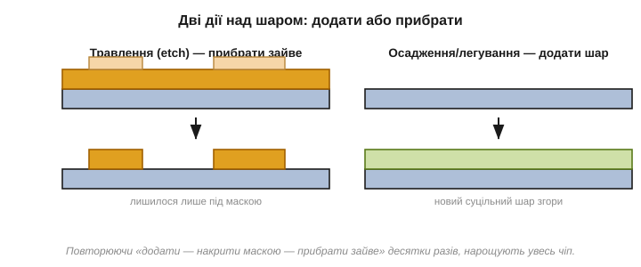
*Рис. 3.10.3.3. Дві дії над шаром. **Травлення** (субтрактивне): шар уже є, маска захищає потрібне, а відкрите — витравлюють; лишається матеріал лише під маскою. **Осадження/легування** (адитивне): на поверхню кладуть новий суцільний шар або вживляють домішку крізь вікна маски. Чергуючи «додати — накрити маскою — прибрати зайве» десятки разів, нарощують увесь чіп пошарово.*

Уся фабрикація — це ритмічне чергування цих двох жестів. Хочемо вузькі металеві доріжки — кладемо суцільний шар металу (додали), накриваємо маскою у формі доріжок і витравлюємо проміжки (прибрали). Хочемо контактні отвори крізь ізолятор — навпаки, маска відкриває лише точки майбутніх отворів, які й протравлюють наскрізь, а тоді заповнюють металом (знову додали). У найновіших процесах мідні дроти роблять навіть «у зворотному порядку» — спершу травлять у ізоляторі канавки, а потім заповнюють їх міддю й зчищають надлишок (це звуть дамасценним процесом, за технікою інкрустації металом по сталі), бо мідь складно травити прямо.

Над транзисторами так вибудовують **багатоповерхову розв'язку** з дротів: у сучасному процесорі понад десяток шарів металу, з'єднаних між собою вертикальними «пробками» (via), несуть сигнали й живлення до мільярдів транзисторів — як багатоповерхова транспортна розв'язка над містом, де нижні вузькі «вулиці» ведуть до окремих транзисторів, а верхні широкі «магістралі» розносять живлення по всьому кристалу. Ця мережа з'єднань за обсягом роботи й складністю не поступається самим транзисторам, а часом і перевершує їх: значну частину площі й шарів чипа займає саме «дротяна» частина, а не активні прилади.

Є тут і прихована умова, що зв'язує весь процес, — **тепловий бюджет**. Ранні кроки (окислення, відпал легування) вимагають високих температур, а от коли вже покладено метал, сильно гріти не можна — мідь і алюміній попливуть, а дбайливо вживлені домішки розповзуться, розмивши тонко окреслені області. Тому кроки шикують у строгому порядку: спершу все «гаряче» (транзистори в кремнії), потім усе «холодне» (метал згори). Порушити цей порядок не можна — звідси й жорстка послідовність шарів, де кожен наступний крок мусить терпіти менше тепла за попередній.

Окрема краса в тому, як ці сотні кроків узгоджені між собою. Кожна маска мусить лягти точно поверх попередніх — із похибкою в частки нанометра, інакше контакт промахнеться повз область, до якої веде. Це суміщення (*overlay*) — окреме мистецтво: машина орієнтується по спеціальних мітках, залишених попередніми шарами, і вирівнює новий малюнок по них. Уявіть сотню трафаретів, накладених один на одного так точно, що навіть під мікроскопом їхні краї збігаються, — і ви відчуєте, чому виробництво чипів недарма вважають вершиною точної інженерії. Підсумок простий і потужний: чіп **вирощують**, а не складають, — пошарово, друком, у точно заданому температурному порядку й з ідеальним суміщенням шарів, цілою пластиною за раз; і саме тому окремий транзистор практично безплатний, а от увесь процес — ні.

> 🔧 **Навіщо це.** Цей погляд «зсередини» прибирає містику з кількох речей, з якими ви стикаєтесь. Перше: ви тепер розумієте, чому **схему чипа не можна «трохи підправити»** після випуску — будь-яка зміна означає новий комплект масок і фактично новий запуск виробництва; звідси дорожнеча помилок у кремнії й саме явище ревізій кристала. Друге: **кількість транзисторів майже не впливає на собівартість** (усі друкуються разом), а от **площа кристала** впливає прямо — бо визначає, скільки штук влізе на пластину й наскільки ймовірний дефект (§3.10.5). Третє, концептуальне: усе «залізо», яке ви програмуєте, — це **застиглий результат послідовності фізичних кроків**, а не магія; той самий MOSFET із §2.7 і той самий p-n-перехід із §2.5 буквально вирощені на пластині описаними діями. Засвоївши це, ви читатимете будь-який опис техпроцесу як інженер, а не як споживач реклами, — до чого ми зараз і переходимо.

---

Підсумок §3.10.3: транзистор не вирізають, а **вирощують шар за шаром** — десятками циклів, де фотолітографія (§3.10.2) наносить маску, а один крок крізь її вікна щось додає чи прибирає. Усе зводиться до трьох дій: **додати шар** (осадження/окислення), **прибрати зайве** (травлення, etch) і **змінити кремній** (легування, §2.5.2). Легування роблять **іонною імплантацією** — вистрілюють іонами домішки крізь маску, створюючи n⁺-області витоку й стоку; точність дози й вимагала надчистого вихідного кремнію. Зібраний MOSFET (§2.7.2) — це прямий **запис кроків**: вирощений оксид, осаджений затвор, вживлені n⁺-зони, пробиті контакти, а зверху — **понад десяток шарів** металевих з'єднань. Мільярди транзисторів друкуються **одночасно** одним комплектом масок, тому зайвий транзистор майже безплатний, а вирішальною для ціни стає **площа кристала**. Це і є **планарний процес** (історія розділу): чіп вирощують, а не складають. Ми збудували транзистори потрібного розміру — і саме цей розмір ховається за гучними «нанометрами» в рекламі. Що вони насправді означають — наступний підрозділ.

---

## 3.10.4 «5 нанометрів» маркетингу: що насправді означає техпроцес

Кожен анонс нового процесора супроводжується магічним числом: «зроблено за технологією 5 нанометрів», «3 нанометри», «2 нанометри». Звучить так, ніби це розмір транзистора, і що менше число — то він дрібніший. Інтуїція природна, бо в §3.10.3 ми справді бачили, що чіп — це візерунок крихітних структур, а §3.10.2 — що дрібність обмежена фізикою друку. Здавалося б, «нанометри» якраз і мали б називати ту дрібність. Але — на жаль — давно ні.

Сьогоднішні «нанометри» техпроцесу не дорівнюють **жодному** фізичному розміру на чипі; це **маркетингова назва покоління**, а не виміряна величина. Це твердження звучить майже скандально — як так, число у нанометрах нічого не міряє в нанометрах? — тому розберімося ретельно: що це число означало колись, чому відірвалося від реальності, що ховається за ним тепер і на яку чесну величину дивитися замість нього. Ця тема ідеально показує, як легко точний технічний термін перетворюється на рекламний ярлик, і вчить читати специфікації тверезо — навичка, корисна далеко за межами чипів.

### Колись число було чесним

Щоб зрозуміти теперішній стан, треба знати, з чого все почалося. Колись «технологічний вузол» (*process node*) і справді був чесною мірою.

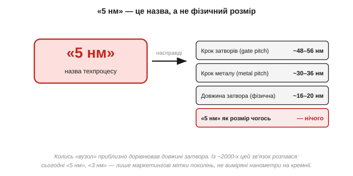
*Рис. 3.10.4.1. Що насправді за назвою «5 нм». Жоден ключовий розмір сучасного «5-нм» процесу не дорівнює 5 нанометрам: крок між затворами (gate pitch) — близько 50 нм, крок металевих доріжок — близько 30 нм, навіть фізична довжина затвора — близько 16–20 нм. «5 нм» як розмір **чогось** на чипі не відповідає нічому. Колись «вузол» приблизно дорівнював довжині затвора; із ~2000-х цей зв'язок розпався, і число стало просто міткою покоління.*

Логіка історичної назви була проста. У ранні десятиліття **довжина затвора** транзистора (а отже, і найменша деталь, яку треба було надрукувати) приблизно збігалася з числом вузла: «1 мікрон», «0.5 мікрона», «180 нм» — це справді були характерні розміри на кремнії. І зменшення давало одразу кілька благ разом, що й робило його таким бажаним.

**Приклад (що дає зменшення транзистора).** Нехай нове покоління зменшує всі лінійні розміри транзистора в 0.7 раза (історичний «крок» вузла). Подивімося на наслідки.

```
Лінійний розмір:   ×0.7
Площа (∝ розмір²): 0.7 × 0.7  ≈ 0.49   → транзистор займає вдвічі менше місця
Щільність:         1 / 0.49   ≈ 2.0    → на тій самій площі вдвічі більше транзисторів
```

Подвоєння щільності з кожним кроком — це і є знаменитий **закон Мура** (Гордон Мур, *Gordon Moore*, 1965): кількість транзисторів на чипі подвоювалася приблизно кожні два роки. До того ж дрібніший транзистор перемикається швидше й (історично) споживає менше — тобто зменшення дарувало більше логіки, вищу швидкість і нижчу енергію **водночас**. Не дивно, що десятиліттями вся індустрія гналася саме за меншими розмірами, а число вузла чесно їх відображало.

Та з початку 2000-х фізика почала чинити опір. Затвори вже не вдавалося просто зменшувати, не втрачаючи керованість каналом; струми витоку зросли так, що енергоощадність від простого зменшення зникла. Тож виробники почали **змінювати геометрію** транзистора (про це далі) і вдаватися до хитрощів друку (multiple patterning з §3.10.2). Різні розміри перестали зменшуватися так само дружно й в однаковій пропорції, а **назва вузла відірвалася від реальних вимірів**: «28 нм», «14 нм», «5 нм» стали позначати радше «наступне покоління, приблизно вдвічі щільніше за попереднє», ніж конкретні нанометри. Сьогодні різні виробники під однаковою назвою «5 нм» випускають процеси з відчутно різними реальними розмірами — бо це вже **бренд покоління**, а не фізична одиниця. Назва лишилася від тих часів, коли вона щось означала, — як «кінські сили» в двигуні, що давно не міряють у конях.

### На що дивитися замість назви

Якщо «нанометри» брешуть, то яка ж величина чесно описує поступ? Та, заради якої все й робиться, — **щільність транзисторів**.

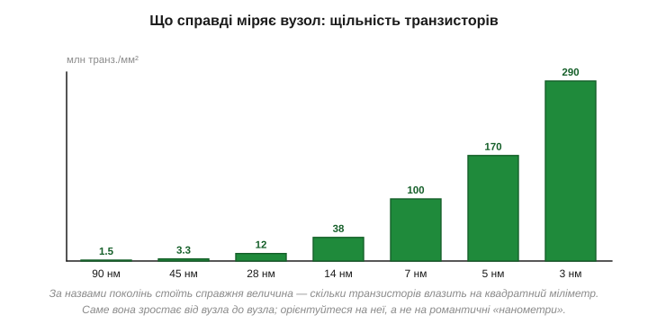
*Рис. 3.10.4.2. Що справді росте від вузла до вузла — **щільність транзисторів**, тобто скільки їх влазить на квадратний міліметр кристала. Від ~1.5 млн/мм² на 90 нм до сотень мільйонів на найновіших процесах. Саме ця величина має практичний сенс: більше логіки на тій самій площі — дешевше й енергоощадніше. Орієнтуйтеся на неї, а не на романтичні «нанометри».*

Ось чесна міра поступу. **Щільність** (*transistor density*, млн транзисторів на мм²) прямо каже те, що нас цікавить: скільки обчислювальної логіки вміщується на одиниці дорогої кремнієвої площі. Більша щільність означає, що той самий процесор займе менший кристал (дешевший — згадайте §3.10.3 і статистику виходу §3.10.5, де площа визначає ціну), або що на тому самому кристалі вміститься більше ядер і пам'яті. Саме зростання щільності — справжній, вимірний зміст закону Мура: кожні приблизно два роки кількість транзисторів на одиниці площі подвоювалася.

Чому ж тоді індустрія не перейшла на щільність як офіційну одиницю? Почасти через інерцію маркетингу (звучне «3 нм» продає краще за «197 мільйонів транзисторів на мм²»), почасти тому, що й щільність залежить від типу схеми (логіка пакується щільніше за пам'ять, тож одне число на весь чіп — теж спрощення). Та для **порівняння поколінь** вона все одно куди чесніша за «нанометри», бо її принаймні **можна виміряти** на готовому чипі — порахувати транзистори й поділити на площу, — і порівняти між виробниками, тоді як «нанометри» в кожного свої. Тому інженери дедалі частіше говорять саме про щільність, а заразом про конкретні **кроки** (gate pitch, metal pitch) — реальні відстані, що теж вимірні.

Є ще тонший наслідок, про який варто згадати. Оскільки «нанометри» різних виробників неспівставні, з'явилася навіть плутанина в номенклатурі: процес, що в одного зветься «7 нм», за реальною щільністю може дорівнювати «10 нм» іншого — або навпаки. Це породило безкінечні суперечки й маркетингові ігри з назвами, коли виробник перейменовує свій процес, щоб «число» виглядало конкурентнішим, без жодних змін у самому кремнії. Для вас висновок простий: **не порівнюйте чіпи за числом вузла різних виробників** — це порівняння яблук із грушами. Коли побачите гучне «N нанометрів», подумки перекладайте: «нове покоління цього виробника, приблизно вдвічі щільніше за його ж попереднє» — і не помилитеся, тоді як буквальне читання числа майже завжди оманливе.

### Чому це не лише про розмір

Є ще одна причина, чому «нанометри» оманливі: поступ давно вже **не зводиться до зменшення**. Коли транзистор став зовсім крихітним, довелося міняти саму його **форму**.

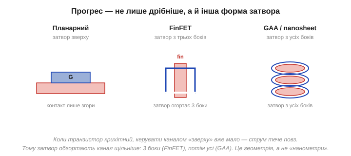
*Рис. 3.10.4.3. Прогрес — це не лише «дрібніше», а й інша **форма** затвора. У **планарному** транзисторі затвор керує каналом лише згори. Коли канал став дуже короткий, цього стало мало — струм «протікає» повз закритий затвор. Рішення: **FinFET** — канал піднімають ребром (fin), і затвор огортає його з трьох боків. Далі — **GAA** (gate-all-around, nanosheet): затвор оточує канал з усіх боків. Краще керування — менші витоки, нижча напруга.*

Ось де ховається друга половина правди. Зменшуючи транзистор, інженери наштовхнулися на фізичну стіну: у дуже короткому каналі затвор, що тисне лише **згори**, перестає його надійно перекривати — стік підступає так близько до витоку, що струм просочується навіть у «закритому» стані (це ми по суті бачили в §2.7.3, де поріг і керування каналом залежать від геометрії). Закритий транзистор перестає бути по-справжньому закритим, а отже, ламається сама основа цифрової логіки — чіткі «0» і «1» (§3.1). Вихід знайшли не в подальшому зменшенні, а в **тривимірній формі** затвора, щоб той охоплював канал щільніше: спершу канал підняли вертикальним ребром і обгорнули затвором з трьох боків (**FinFET**, масово — з ~2011 року), а в найновіших процесах — оточили з **усіх** боків стосиком тонких «листів» (**GAA**, *gate-all-around*, *nanosheet*). Що з більшого боку затвор тримає канал, то надійніше він його перекриває й то менше витоку.

Це геть інша фізична структура, ніж плаский транзистор Модуля 2, — і все ж ідея, що лежить в основі, та сама, що в §2.7.1: керувати струмом **полем**. Змінилася лише геометрія прикладання цього поля — затвор обхоплює канал дедалі повніше, щоб тримати його залізною рукою навіть на крихітних розмірах. І ось що важливо для нашої теми: жодне з цих покращень **не вловлюється** числом «нанометрів» — воно про якість керування каналом, про форму, про матеріали затвора (давно вже не лише полікремній і оксид кремнію, а й «високо-к» діелектрики та метали), а не про якийсь один лінійний розмір. Тому сучасний «вузол» — це насправді цілий **пакет рішень** (розмір + форма транзистора + матеріали + хитрощі друку), стиснутий у одну маркетингову мітку. Два процеси з однаковим «числом» можуть відрізнятися саме формою транзистора й матеріалами — і, відповідно, економністю та швидкістю. Назва це приховує; розуміння — ні.

### Де фізична межа

Якщо «нанометри» — лише назва, то чи є взагалі **справжня** межа зменшенню? Є, і вона жорстка: атом.

Згадаймо масштаб. Атом кремнію — близько 0.2 нм у поперечнику, а відстань між сусідніми атомами в ґратці — приблизно 0.5 нм. Це означає, що канал транзистора «5-нм» покоління завдовжки ~16–20 нм — це лише кілька десятків атомів упоперек, а найтонші шари (підзатворний оксид) — буквально **кілька атомів** завтовшки. Далі зменшувати нема куди не через брак майстерності, а через те, що менше за атом не буває, а на товщині в кілька атомів починає панувати квантова фізика: електрони **протуннельовують** крізь надтонкий ізолятор (те саме тунелювання, що ми бачили у Flash, §3.6.8), і затвор перестає тримати канал. Тому простого «дрібнішання» лишилося обмаль — фізика стіни вже видно.

Що ж робить індустрія, коли класичне зменшення вичерпується? Шукає поступ **в інших вимірах**. Уже згадані FinFET і GAA — це виграш формою, а не розміром. Наступний рубіж — **третій вимір**: складати транзистори й цілі кристали **один на одного** (3D-інтеграція), а не лише зменшувати в площині, та зшивати кілька дрібних кристалів-чиплетів у один корпус (§3.10.5, §3.10.7). По суті, коли вшир рости вже нікуди, починають рости **вгору** й **розумніше пакувати**. Тому майбутній поступ дедалі менше про «нанометри» й дедалі більше про архітектуру, тривимірне складання й упакування — а назви вузлів («2 нм», «1.4 нм») котяться далі вже майже як порядкові номери поколінь, відірвані від будь-якої фізики.

> 🔧 **Навіщо це.** Ця тема — щеплення від маркетингу, корисне щодня. Перше: коли в даташиті чи новині бачите «N нм», **не сприймайте це як фізичний розмір** — це назва покоління; порівнювати «5 нм» одного виробника з «5 нм» іншого напряму **не можна**, бо за однаковим числом — різні реальні процеси. Друге: для практики важливіша не назва вузла, а наслідки — **щільність** (скільки логіки на площі → ціна), енергоощадність і частота; саме вони визначають, який чіп брати під задачу. Третє: розуміючи, що поступ — це й **геометрія** (FinFET, GAA), і **третій вимір** (3D, чиплети), ви не дивуватиметеся, чому новіший чіп на «тому самому» числі вузла раптом помітно економніший. А головне — ви бачите межу: зменшувати вічно не вийде (атоми скінченні), тому індустрія дедалі більше виграє не «нанометрами», а архітектурою, упакуванням і хитрістю. Тверезе читання цих чисел вирізняє інженера з-поміж тих, хто вірить рекламі.

---

Підсумок §3.10.4: «N нанометрів» техпроцесу — це **маркетингова назва покоління**, а не фізичний розмір. Колись (до ~2000-х) число вузла приблизно дорівнювало **довжині затвора**, але потім цей зв'язок **розпався**: жоден ключовий розмір «5-нм» процесу не дорівнює 5 нм (крок затворів ~50 нм, крок металу ~30 нм, довжина затвора ~16–20 нм), а різні виробники під одним числом мають різні реальні процеси. Чесна міра поступу — **щільність транзисторів** (млн/мм²): її можна виміряти й порівняти, і саме вона визначає ціну та економність; це і є справжній, вимірний зміст **закону Мура** (Гордон Мур, 1965). До того ж прогрес давно не зводиться до зменшення: коли канал став надто коротким і затвор перестав його тримати згори, форму змінили — **планарний → FinFET** (затвор з 3 боків) **→ GAA** (з усіх боків), хоч ідея керування полем (§2.7.1) лишилась. Тож вузол — це пакет «розмір + форма + матеріали», стиснутий у одну мітку. Ми розібрали, що означає розмір транзистора; але навіть на бездоганному процесі великий кристал не виходить ідеальним. Чому — наступний підрозділ.

---

## 3.10.5 Yield: дефекти як статистика

Дотепер ми мовчки припускали, що з пластини виходять справні чіпи. Насправді — далеко не всі, і часто навіть не більшість. Хоч би якою чистою була кімната (§3.10.2) і досконалим процес (§3.10.3), на пластині неминуче трапляються **дефекти**: випадкова порошинка, що все ж прослизнула крізь фільтри, дрібний збій у друку чи травленні, точкова неоднорідність кристала, мікроскопічна подряпина. На масштабах мільярдів елементів і сотень кроків абсолютна бездоганність недосяжна в принципі — десь та щось та піде не так. Кожен такий дефект, що влучив у кристал, найчастіше робить його непрацездатним.

Частку придатних кристалів називають **виходом** (*yield*), і це — одне з найважливіших чисел в усій економіці чипів, не менш важливе за саму архітектуру: від нього прямо залежить, скільки коштує кожен проданий чіп. Найцікавіше й найнесподіваніше тут — **не** сам факт браку, а те, як вихід залежить від **розміру** кристала. Здавалося б, удвічі більший кристал мав би коштувати приблизно вдвічі дорожче. А виявляється — у **рази** дорожче, бо великий кристал програє за виходом непропорційно своїй площі. Саме цей нелінійний зв'язок — серцевина теми, і він пояснює дуже багато: від ціни топових процесорів до моди на чиплети. Розберімо його — це красива й дуже практична статистика.

### Дефекти випадкові, кристал або живий, або ні

Почнімо з картини того, що відбувається на пластині. Дефекти розкидані по ній **випадково**, з певною середньою густиною (стільки-то дефектів на см²). А пластина поділена на прямокутні кристали — майбутні чіпи.

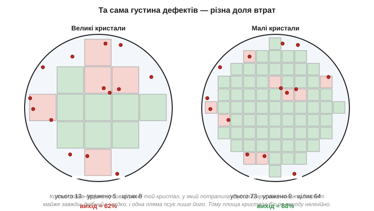
*Рис. 3.10.5.1. Дві пластини з **однаковою** густиною й розташуванням дефектів (червоні точки), але різним розміром кристала. На лівій — великі кристали: майже кожен ловить хоч один дефект, тож **придатних мало** (низький вихід). На правій — дрібні кристали з тих самих дефектів: уражено лише ті кілька, у які точка справді влучила, а решта ціла (високий вихід). Кожна точка вбиває рівно той кристал, у який потрапила, — тому площа кристала визначає, наскільки ймовірно він «спіймає» дефект.*

Суть — у простому, але неочевидному міркуванні. Кристал гине, якщо в нього влучив **хоч один** дефект (зазвичай досить однієї пошкодженої ділянки — обірваного дроту, закороченого транзистора, — щоб уся складна схема не запрацювала; для логіки це майже завжди так, хоч пам'ять часом рятують запасними рядками). А ймовірність, що в кристал влучить дефект, зростає з його **площею**: великий кристал — велика мішень, він «збирає» дефекти майже напевно; дрібний — мала мішень, повз нього дефекти переважно проходять, влучаючи лише в той один, на який сіли.

Цю інтуїцію легко відчути на крайнощах. Уявіть пластину, нарізану на **один-єдиний** велетенський кристал на всю площу: будь-який дефект на пластині — у ньому, тож вихід практично нульовий, варто з'явитися хоч одній пилинці. Тепер уявіть протилежне — нарізку на **тисячі крихітних** кристалів: кожен дефект псує лише один із них, а решта тисяч цілі, тож вихід близький до 100%. Реальність — десь поміж, але напрямок ясний: що більший кристал, то ймовірніше він містить дефект і гине. Це не випадковість конкретної пластини, а **статистика площі**.

Корисно тут і відчуття реальних чисел. Густина дефектів на зрілому процесі — порядку часток одиниці на квадратний сантиметр (скажімо, 0.1–0.5 деф./см²); на щойно запущеному — помітно більша. Тобто на пластині 300 мм (площею ~700 см²) сидять десятки-сотні дефектів, розкиданих випадково. Дрібний кристал у кілька міліметрів збоку має непогані шанси їх оминути; кристал у сантиметри — майже напевно котрийсь та спіймає. Ось чому навіть на чудовому процесі великі кристали мають відчутний відсоток браку, тоді як дрібні виходять майже всі. Звідси й випливає головний кількісний висновок розділу.

### Модель: вихід падає експоненційно

Цю залежність можна записати простою формулою — і вона пояснює, чому великі чіпи такі дорогі.


*Рис. 3.10.5.2. Залежність виходу Y від площі кристала A за моделлю Пуассона: Y ≈ e^(−D·A), де D — густина дефектів. Крива падає **експоненційно**: подвоїти площу — отримати не вдвічі менше придатних, а значно менше. Дві криві — для меншої й більшої густини дефектів; точки показують, як на одній і тій самій кривій малий кристал має високий вихід, а великий — низький. Саме ця експонента робить великий кристал непропорційно дорогим.*

Звідки взагалі береться експонента? З простого ймовірнісного міркування. Уявімо, що площа кристала складається з безлічі крихітних клітинок, і в кожну дефект може влучити чи ні незалежно від інших. Імовірність, що **жодна** клітинка не вражена, — це добуток багатьох «не влучив» по всіх клітинках; а добуток безлічі однакових малих імовірностей якраз і дає експоненту. Чим більше клітинок (тобто чим більша площа A), тим більше множників менше за одиницю — і тим стрімкіше падає шанс «усі цілі». Формально це і є розподіл Пуассона. Запишімо результат:

```
Y  ≈  e^(−D · A)

Y  — вихід (частка придатних кристалів)
D  — густина дефектів (на см²)
A  — площа одного кристала (см²)
```

Ключове тут — що залежність **експоненційна**, а не лінійна. Подвоївши площу A, ми не зменшуємо вихід удвічі — ми підносимо його до квадрата (бо e^(−2DA) = (e^(−DA))²), а число менше за одиницю в квадраті падає набагато швидше. Покажімо це конкретними числами.

**Приклад (вихід малого й великого кристала).** Густина дефектів D = 0.5 на см². Порівняймо два кристали: малий (площа 0.5 см², як у мікроконтролера) і великий (площа 6 см², як у потужного процесора).

```
Малий кристал:   Y = e^(−0.5 × 0.5)  = e^(−0.25)  ≈ 0.78   → 78% придатних
Великий кристал: Y = e^(−0.5 × 6.0)  = e^(−3.0)   ≈ 0.05   → лише 5% придатних!

Площа зросла в 12 разів (0.5 → 6 см²),
а вихід упав у ~16 разів (78% → 5%) — непропорційно.
```

Відчуйте різницю: малий кристал виходить справним у трьох випадках із чотирьох, а великий — лише в одному з двадцяти. Дев'ятнадцять із двадцяти таких велетнів ідуть у відходи, і кожен проданий мусить «відбити» вартість усіх загиблих сусідів. Саме ця математика — серцевина економіки чипів: вона каже, що **велика площа кристала карається непропорційно**. Тому розробники процесорів так бережуть кожен квадратний міліметр, а коли кристал мусить бути величезним (потужні серверні чи графічні процесори), його ціна злітає не лінійно, а круто вгору. Тут же корінь сучасної моди на **чиплети** — розбивати один великий чіп на кілька дрібних і з'єднувати їх в одному корпусі (§3.10.7): за нашим прикладом, шість окремих кристалів по 1 см² матимуть куди вищий сукупний вихід, ніж один на 6 см². Точну математику чиплетів і моделі Пуассона винесено в окрему 🧮-вставку до цієї теми.

### Подвійний удар по ціні

Зведімо економічний наслідок докупи, бо великий кристал програє одразу за двома лініями.


*Рис. 3.10.5.3. Чому великий кристал дорогий непропорційно — два множники в один бік. Перший: на пластині фіксованої площі великих кристалів просто **менше** вміщається. Другий: через більшу площу кожен із них **частіше бракований** (вихід Y нижчий). Обидва ефекти діють разом, тож **ціна за один придатний кристал** росте набагато швидше за саму площу — подвоєння площі може здорожчати чіп у кілька разів.*

Тут спрацьовує неприємна арифметика «двічі». З одного боку, на круглій пластині фіксованого розміру (§3.10.1) великих кристалів **фізично менше** — простий геометричний факт, помножений ще й на «крайовий податок» круга, про який ми згадували в §3.10.1. З іншого боку, **більша частка** цих і так нечисленних кристалів виявляється бракованою через експоненційне падіння виходу. Помножте одне на одне — і собівартість **одного придатного** кристала злітає набагато швидше, ніж зростає його площа.

Покажімо це в грошах одним ланцюжком міркування. Нехай пластина коштує фіксовану суму — скажімо, умовні $5000, незалежно від того, що на ній. Якщо це дрібні кристали (600 штук, вихід 78%), придатних виходить ~470, і кожен «коштує» 5000 / 470 ≈ $11. Якщо ж це великі кристали (нехай 80 штук, вихід 5%), придатних лише ~4, і кожен «коштує» 5000 / 4 ≈ $1250 — у понад сто разів дорожче, хоч пластина та сама! Ось чому два процесори з однаковою архітектурою, але різною площею кристала, можуть коштувати разюче по-різному, і чому індустрія так тисне на зменшення (щоб та сама логіка займала меншу площу, §3.10.4) і на чиплети. Запам'ятайте цей зв'язок: **площа кристала — головний важіль собівартості**, і важіль різко нелінійний — кожен зайвий квадратний міліметр б'є по гаманцю сильніше за попередній.

### Вихід — величина рухлива

Досі ми брали густину дефектів D як дане число. Насправді вона **не стала** — вона падає з часом, у міру того як фабрика «навчається» робити новий чіп. І це теж пояснює багато з того, що ви бачите на ринку.

Коли процес тільки запускають, дефектів багато: технологію щойно освоїли, причини збоїв ще не всі знайдено, вихід може бути жалюгідні відсотки — буває, що з пластини живими виходять одиниці кристалів. Та інженери методично полюють на джерела дефектів — крок за кроком знаходять, чому гинуть кристали (тут забруднення, там нерівність шару, отам збій машини, ще десь поганий контакт), і усувають причини, одну за одною. Густина D повзе вниз, вихід — угору. Цей процес звуть **дозріванням** (*yield ramp*, *yield learning*), і він тягнеться місяцями, а то й роками для зовсім нового вузла. Зрілий, відпрацьований процес дає вихід у високі десятки відсотків навіть для великих кристалів, тоді як той самий дизайн на щойно запущеному процесі ледь жив. По суті, вихід — це міра не лише дизайну, а й того, **наскільки добре фабрика навчилася** робити саме цей чіп.

Звідси — реальні наслідки, які ви відчуваєте. **Дефіцит і ціна на старті**: коли виходить новий чіп на новому процесі, його мало й він дорогий саме тому, що вихід ще низький; за рік-два, у міру дозрівання, і ціна падає, і доступність зростає — той самий кремній стає дешевшим без жодних змін у дизайні. **Зрілі процеси дешевші**: старіші вузли (як-от 28 нм чи 65 нм), де процес давно відшліфований і обладнання окуплене, дають високий вихід за малі гроші — тому переважна більшість мікроконтролерів і простих чипів робиться зовсім **не** на найновіших «нанометрах», а на зрілих процесах, де вони дешеві й надійні. Передовий вузол беруть лише там, де без нього ніяк (топові процесори, графіка). Це прямо стосується вибору компонентів: «старий» техпроцес вашого мікроконтролера — не вада, а ознака дешевизни й зрілості.

> 🔧 **Навіщо це.** Yield пояснює речі, які інакше здаються примхами ринку. Перше: **чому потужні чіпи коштують непропорційно дорого** — не вдвічі більший кристал коштує вдвічі більше, а в рази, через експоненту виходу; це прямо формує ціни процесорів і пам'яті, які ви закладаєте в кошторис пристрою. Друге: **чому існують дешевші «урізані» версії** — кристал із дрібним дефектом не викидають, а продають із вимкненим бракованим блоком (саме до цього ми перейдемо в §3.10.6); binning виростає прямо з реальності дефектів. Третє: **чому нові чіпи спершу дорогі й дефіцитні, а зрілі — дешеві** — це дозрівання виходу в дії; прості компоненти роблять на зрілих вузлах саме заради дешевизни. Четверте, проєктне: коли обираєте мікроконтролер, ви опосередковано платите за площу його кристала — простіший чіп дешевший не лише «бо слабший», а й бо **дрібніший і має вищий вихід**. А загальний урок інженерний: на масштабах мільярдів транзисторів досконалість недосяжна, тож виробництво мислить **статистикою й виходом**, а не «справно/несправно» поштучно. Це той самий перехід від детермінізму до ймовірності, що й у кодах помилок (Розділ 3.9), тільки тепер у залізі.

---

Підсумок §3.10.5: не всі кристали з пластини придатні — частку справних звуть **виходом** (yield). На пластині неминуче трапляються **випадкові дефекти** (пилинка, збій друку), і кристал гине, якщо в нього влучив **хоч один**. Імовірність влучити зростає з **площею** кристала, тож вихід описує модель Пуассона: **Y ≈ e^(−D·A)** (D — густина дефектів, A — площа). Залежність **експоненційна**: подвоєння площі підносить вихід у квадрат, тобто валить його куди швидше, ніж удвічі. До цього додається другий удар — великих кристалів **менше** вміщається на круглій пластині. Разом це робить **площу кристала головним і нелінійним важелем собівартості**: великий чіп коштує непропорційно дорого. Звідси й тиск на зменшення (§3.10.4), і мода на **чиплети** (дрібні кристали мають вищий вихід). Виробництво мислить статистикою, а не «справно/ні» поштучно. А що ж робити з кристалами, які вийшли не зовсім справними або не однаково швидкими? Їх не викидають — їх сортують. Як саме — наступний підрозділ.

---

## 3.10.6 Тестування й binning: один кристал — кілька продуктів

З §3.10.5 ми винесли незручну правду: кристали виходять **різні**. Одні бездоганні, інші з дрібним дефектом у якомусь блоці, треті працюють, але не тримають високої частоти, четверті споживають трохи більше за норму. Це прямий наслідок статистичної природи виробництва — повна однаковість недосяжна. Постає питання: що з усім цим розкидом робити? Найгірша відповідь — викидати все, що не ідеальне; вона руйнівно дорога, бо, як ми бачили (§3.10.5), бездоганних кристалів буває меншість.

Індустрія робить розумніше: **тестує** кожен кристал і **сортує** його за реальними можливостями, перетворюючи розкид якості з біди на **товарний асортимент**. Замість боротися з тим, що кристали різні, вона цю різницю **продає**: кращі — дорожче, гірші — дешевше, дефектні — з вимкненою ваддю ще дешевше. Цей сорт-розподіл називають **binning** (від англ. *bin* — «кошик», «сорт»: кристали ніби розкладають по кошиках за якістю), і саме завдяки йому з **одного** дизайну кристала виходить ціла лінійка продуктів за різною ціною. Розберімо, як кристали перевіряють і як той самий шматок кремнію стає то дорогою, то дешевою моделлю, — це остання ланка перед тим, як чіп запакують у корпус.

### Спершу — перевірити кожен

Перш ніж сортувати, треба виміряти. Тестування починається ще на пластині, до того як її розріжуть на окремі кристали.

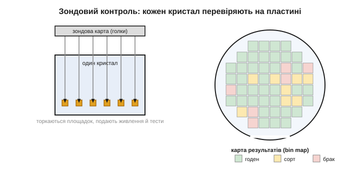
*Рис. 3.10.6.1. **Зондовий контроль** (wafer probe): на контактні площадки кожного кристала прямо на пластині опускають тонкі голки **зондової карти**, подають живлення й проганяють тести. Несправні кристали одразу позначають. Результат — **карта пластини** (bin map): для кожного кристала записано, придатний він, до якого сорту належить чи бракований. Так відсіюють брак ще до різання й корпусування, щоб не витрачати грошей на завідомо мертві кристали.*

Логіка раннього тесту суто економічна. Корпусування (§3.10.7) коштує грошей, тож **немає сенсу** пакувати кристал, який і так не працює, — це викинуті гроші на упаковку мерця, а заразом і марно зайняте місце на тестері й конвеєрі. Дешевше відсіяти брак якомога **раніше**, поки в кристал не вклали ще й вартість корпуса. Тому спершу роблять **зондовий контроль** (*wafer probe*, або *wafer sort*): спеціальна «зондова карта» з безліччю тонесеньких голок-щупів торкається контактних площадок кожного кристала прямо на нерозрізаній пластині, подає живлення й тестові сигнали й дивиться на відповідь. По суті, голки заміняють майбутні виводи й «розмовляють» із кристалом ще до того, як його відрізали від пластини, — як видно на малюнку вище. Кристал, що провалив тест, позначають — на пластині будується **карта придатності** (bin map). Після різання браковані кристали просто відкидають, а решту пакують.

Та сам тест не зводиться до «живий/мертвий». Це повноцінний іспит: кристалові подають десятки, ба сотні тисяч тестових векторів (готових комбінацій входів із наперед відомою правильною відповіддю), щоб упевнитися, що **кожен** його блок рахує правильно, а не лише «вмикається». Як узагалі перевірити мільярд транзисторів через жменю контактів, не маючи доступу до кожного зокрема, — окрема хитра інженерна задача (її розв'язок, scan chain, винесено в ⚙️-вставку до теми). Водночас вимірюють і **аналогові** межі: на якій **частоті** кристал ще працює стабільно, за **якої напруги** живлення, скільки **споживає**, чи не гріється надміру, які блоки цілі, а які ні. Тест триває секунди на кожен кристал, а кристалів — мільйони, тож швидкість і вартість тестування самі стають важливим чинником економіки. Саме ці виміри — функціональність, частота, напруга, цілість блоків — і стають підставою для сортування, до якого ми переходимо.

### Сортування за швидкістю й дефектами

Ось де відбувається головна магія: розкид якості перетворюється на лінійку продуктів.


*Рис. 3.10.6.2. **Binning**: однакові кристали з однієї пластини сортують за результатами тесту. Ті, що тримають високу частоту з усіма справними блоками, ідуть у **топ-сорт** (дорожчий). Ті, що стабільні лише на нижчій частоті, — у середній. А кристали, де якийсь блок (наприклад, одне з ядер) **бракований**, продають із **вимкненим** цим блоком як дешевшу модель. Так із одного дизайну виходить ціла лінійка — і майже жоден кристал не марнується.*

Тут — два різні механізми сортування, і обидва красиві. Перший — **за частотою**: через неминучий розкид процесу (§3.10.5) одні кристали стабільно працюють на вищій тактовій частоті, ніж інші, хоч схема в них однакова й вони з тієї самої пластини. Звідки розкид? Дрібні відхилення товщини оксиду, дози легування, ширини доріжок від місця до місця на пластині (і навіть від центру до краю одного диска) роблять одні транзистори трішки «жвавішими», інші — «млявішими». Поодинці ці відхилення мізерні, та помножені на мільярди транзисторів і зведені докупи, вони складаються в помітно різну максимальну частоту цілого кристала — один упевнено бере високу планку, сусід на тій самій планці вже збоїть. Кращі за цим показником («швидкий кремній») маркують вищою частотою й продають дорожче; повільніші — нижчою й дешевше. Це чистий binning за якістю: продукт той самий, відрізняється лише гарантована частота, на якій виробник ручається за безпомилкову роботу.

Другий механізм — **вимкнення дефектних блоків**, і він прямо рятує кристали, що інакше пішли б у відходи. Тут у пригоді стає те, що сучасні чипи навмисно будують з багатьох **однакових** повторюваних блоків — кількох ядер, багатьох банків кешу, масивів обчислювачів. Така регулярність зручна не лише для проєктування, а й для рятунку: якщо в кристалі з кількома однаковими блоками один виявився бракованим, а решта ціла, увесь кристал **не викидають** — натомість мертвий блок назавжди вимикають (перепалюють крихітні перемички чи виставляють конфігурацію) і продають чіп як модель «з меншою кількістю ядер». Кристал, що мав стати восьмиядерним, але з одним мертвим ядром, стає цілком справним шестиядерним і знаходить свого покупця. Часом виробник навіть вимикає **справні** блоки — коли дешевших моделей бракне на ринку, а дорогих кристалів забагато: тоді добрий кристал свідомо «урізають» до молодшої моделі. Це вже чистий ринковий розрахунок, а не дефект, — і саме звідси беруться легенди про «розблоковування» прихованих ядер. Так увесь розкид виробництва монетизується: замість викидати все, що не ідеальне, індустрія знаходить полицю майже для кожного кристала.

Закріпімо кількісну логіку binning маленьким прикладом — він показує, наскільки це вигідно.

**Приклад (вихід восьмиядерних кристалів).** Нехай великий восьмиядерний кристал має вихід **повністю** справних (усі 8 ядер цілі) лише 40%. Ще 35% кристалів мають рівно одне браковане ядро, а 15% — два. Скільки кристалів можна **продати**, якщо є моделі на 8, 6 і 4 ядра?

```
Повністю справні (8 ядер):        40%  →  модель «8 ядер»  (топ)
Рівно одне мертве ядро:           35%  →  модель «6 ядер»  (вимкнули 2)
Два мертвих ядра:                 15%  →  модель «4 ядра»  (вимкнули 4)
                                  ----
Придатні до продажу:              90%

Брак (≥3 мертвих ядра, інше):     10%  →  у відходи
```

Без binning придатними були б лише **40%** кристалів (тільки ідеальні) — решту довелося б викинути, і кожен проданий чіп мусив би «відбити» вартість майже двох мертвих. З binning продається **90%**: ті самі дефектні кристали стають дешевшими, але цілком реальними моделями на 6 і 4 ядра. Собівартість одного проданого кристала падає більш ніж удвічі — ось чому binning не примха маркетингу, а пряме економічне продовження статистики дефектів із §3.10.5.

Зверніть увагу й на зворотний бік цієї логіки — він пояснює дещо, що часто дивує покупців. Молодші, дешевші моделі тут — не «гірший товар», спеціально зроблений поганим, а той **самий** кремній, лише з природним дефектом або свідомо вимкненою частиною. Виходить майже парадокс: дешева модель і дорога народжуються на одній пластині, з одного дизайну, за ті самі гроші виробництва, а різниця в ціні відображає не різницю в собівартості, а **готовність ринку платити** за вищу якість і повноту. Виробникові вигідно мати всю лінійку: топові кристали збирають вершки з тих, кому потрібна максимальна продуктивність, а молодші — охоплюють масовий ринок, заразом рятуючи дефектні кристали від смітника. Це елегантний спосіб видобути максимум цінності з неминучого розкиду — і тепер, бачачи в магазині лінійку «однакових, але різних» чипів, ви розумієте, що насправді за нею стоїть.

### Тестують двічі, а слабких відсіюють заздалегідь

Зондовий контроль — лише **перший** іспит, на пластині. Після корпусування (§3.10.7) кристал перевіряють **ще раз** — це **фінальний тест** уже запакованого чипа. Навіщо двічі? Бо корпусування саме по собі може щось пошкодити (дротик відірвався, кулька припою не лягла, кристал тріснув при монтажі), тож готовий чіп зобов'язаний пройти повний іспит наново, на своїх справжніх виводах і на робочих частотах. Лише той, хто склав обидва іспити, їде до замовника.

Є й третій, тонший рівень відбору. Частина чипів справні **зараз**, але мають приховану ваду, що проявиться за тиждень чи місяць роботи, — так звана дитяча смертність електроніки (раптові ранні відмови приладів, що з виду були нормальні). Щоб такі не дісталися виробу, відповідальні чіпи (для авто, медицини, серверів) ганяють під підвищеною температурою й напругою кілька годин — це **припрацювання** (*burn-in*). Ідея в тому, що жорсткий режим **прискорює старіння**: слабка ланка, яка в полі здалася б за місяці, тут здається за години — і гине на стенді, а не в готовому пристрої. Виживають лише ті, що це випробування витримали, — на них можна покластися надовго.

Так формується поняття **гарантовано-доброго кристала** (*known-good die*) — особливо важливе для чиплетів (§3.10.5). Логіка тут невблаганна: якщо ви збираєте дорогий корпус із кількох кристалів, кожен із них мусить бути перевірений **до** складання, бо один поганий занапастить увесь дорогий збір — а викинути доведеться вже не один кристал, а цілий зібраний модуль із кількох справних сусідів. Що дорожчий і складніший збір, то критичніше впевнитися в кожному кристалі заздалегідь; тому тестування й чиплетна інтеграція ростуть пліч-о-пліч.

Звідси й проста економічна істина: **тестування саме по собі коштує грошей** — і часу на дорогих тестерах, і стендів припрацювання. Для дешевого масового чипа довгий тест економічно не виправданий, тож його тестують коротко; для відповідального — навпаки, перевіряють прискіпливо, і ця перевірка помітно додає до ціни. Тому той самий за кристалом чіп у «промисловому» чи «автомобільному» виконанні дорожчий за «споживчий» не лише через відбір за температурним діапазоном, а й через значно ретельніше тестування.

> 🔧 **Навіщо це.** Binning пояснює багато з того, що ви бачите на ринку чипів. Перше: **чому той самий за архітектурою процесор продають у кількох версіях** (різні частоти, різна кількість ядер) за різною ціною — це не різні кристали, а **відсортовані** за якістю однакові; розуміючи це, ви тверезіше обираєте модель під задачу. Друге: **чому дешевша модель часто розганяється до дорожчої** — бо фізично це може бути той самий «хороший» кристал із вимкненими (іноді цілком справними) блоками; звідси й уся культура розгону. Третє: **чому промислові й автомобільні версії дорожчі** — за ними стоїть жорсткіший відбір і припрацювання (burn-in), а не лише ширший діапазон температур; для надійних виробів це варто закладати в кошторис. Четверте, проєктне: лінійка мікроконтролерів з різним обсягом пам'яті чи периферії нерідко **росте з одного кристала** з частково задіяними блоками — тому «молодші» моделі бувають несподівано здатні на більше. А загальний урок: виробництво **витискає цінність із розкиду**, замість боротися за недосяжну однаковість, — той самий інженерний прагматизм, що й скрізь у цьому розділі. Кристал відсортовано, перевірено й визнано придатним; тепер його треба вдягнути в корпус, щоб ним можна було користуватися.

---

Підсумок §3.10.6: кристали виходять різні (§3.10.5), тож їх **тестують і сортують** — це **binning**. Спершу — **зондовий контроль** ще на пластині: голки зондової карти торкаються кожного кристала, подають живлення й тести, будуючи **карту придатності**; брак відсіюють до різання й корпусування, щоб не платити за мертві кристали. Тест міряє не лише «живий/ні», а й **частоту**, напругу, споживання, цілість блоків. За цим сортують двома способами: **за частотою** (кращий «швидкий кремній» — у дорожчий топ-сорт, повільніший — дешевше) і **вимкненням дефектних блоків** (кристал із одним мертвим ядром продають як модель із меншим числом ядер; іноді вимикають і справні блоки з ринкових міркувань). Як показує приклад, binning піднімає частку проданих кристалів із ~40% (лише ідеальні) до ~90%, удвічі знижуючи собівартість. Тому **один дизайн дає лінійку продуктів**, а майже жоден кристал не марнується. Відсортований кристал готовий до останнього кроку — корпусування, до якого ми й переходимо.

---

## 3.10.7 Корпусування: wire bonding, flip-chip, QFN/BGA

Відсортований у §3.10.6 кристал — це крихітна, тендітна пластинка кремнію з контактними площадками в кілька мікронів. Сам по собі він **непридатний до вжитку**: узяти його руками — розчавиш або забрудниш; припаяти до плати — нема до чого, бо контакти мікроскопічні; лишити просто так — деградує від вологи й пилу за лічені дні. Між готовим кристалом і деталлю, яку можна тримати, паяти й експлуатувати, лежить ще ціла прірва, і перекидає її останній крок виробництва — **корпусування** (*packaging*).

Суть проста: кристал вкладають у захисний **корпус** і виводять його контакти назовні у вигляді тих самих «ніжок» чи площадок, які ви бачите на будь-якій мікросхемі й паяєте до плати. Саме тут абстрактний «чіп» з попередніх підрозділів перетворюється на **фізичну деталь**, яку тримаєш у руках, — той чорний прямокутник із виводами, що для більшості людей і є «мікросхема». Ми вже коротко бачили корпуси з боку даташита в §2.9.5 (як їх розпізнавати й читати розпіновку); тепер подивимося з іншого боку — **як** кристал у них опиняється і чому корпус узагалі влаштований саме так. Розберімо три речі: навіщо корпус потрібен, двома головними способами з'єднати кристал із виводами й кількома типами самих корпусів.

### Навіщо взагалі корпус

Спершу — навіщо ця оболонка, бо без неї годі зрозуміти решту. Корпус виконує одразу три роботи, і кожна необхідна.

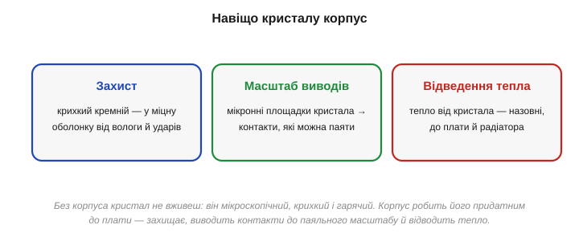
*Рис. 3.10.7.1. Навіщо кристалу корпус — три ролі. **Захист**: крихкий кремній ховають у міцну оболонку від вологи, пилу й ударів. **Масштаб виводів**: мікронні площадки кристала виводять на контакти, достатньо великі, щоб їх можна було паяти. **Відведення тепла**: тепло, що його виділяє кристал під час роботи, корпус відводить назовні — до плати й радіатора. Без корпуса кристал ні застосувати, ні захистити, ні охолодити.*

Осягнімо кожну роль. **Захист** очевидний: гола кремнієва пластинка завтовшки з аркуш паперу тріснула б від найменшого дотику, подряпини чи вигину плати, а волога й кисень із часом роз'їли б її тонкі структури — особливо тонкі металеві доріжки й контакти. Корпус (пластиковий чи керамічний) дає кристалу міцну герметичну броню, а сам кристал усередині ще й заливають захисною смолою чи закривають кришкою, тож до вразливого кремнію не дістанеться ні волога, ні пил, ні палець. Без цього захисту чіп прожив би недовго навіть у лабораторії, не кажучи про реальний пристрій. **Масштаб виводів** — тонша, але не менш важлива річ. Контактні площадки на кристалі — мікронні, з кроком у мікрони; до них не підлізти жодним паяльником і не розвести під ними доріжки на платі. Корпус працює **перекладачем масштабу**: він «розводить» ці мікроскопічні контакти на виводи в сотні разів більші й рідше розставлені, які вже посильно припаяти й розвести на звичайній платі. Без цього кроку кристал просто **нічим** не з'єднати зі світом. І **відведення тепла**: мільярди транзисторів, перемикаючись, гріються (згадайте динамічне споживання CMOS, §2.7.9 — енергія витрачається на кожне перемикання), і це тепло, сконцентроване на крихітній площі кристала, треба кудись відводити, інакше він швидко перегріється й вийде з ладу. Корпус прокладає теплу шлях від кристала назовні — до плати, а від неї до радіатора; у потужних чипів для цього навіть роблять металеву кришку чи відкриту тильну поверхню кристала під радіатор. Тож корпус — не просто «упаковка», а повноцінна функціональна частина приладу, що робить кристал придатним до життя на платі.

### Дротики чи перевернутий кристал

Найперше технічне питання корпусування: як **електрично з'єднати** площадки кристала з виводами корпусу? Є два головні способи.

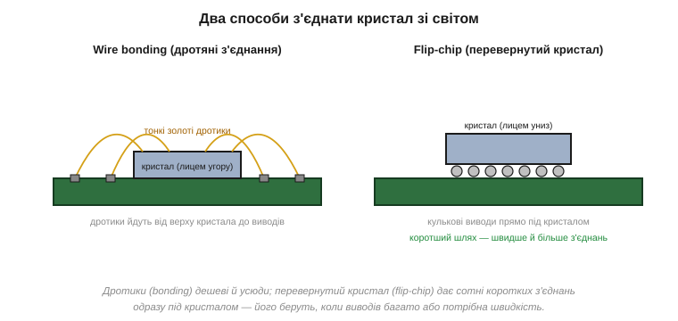
*Рис. 3.10.7.2. Два способи з'єднати кристал зі світом. **Wire bonding** (дротяне з'єднання): кристал лежить **лицем угору**, а від його площадок до виводів корпусу простягають тонесенькі золоті (чи мідні) дротики — по одному на контакт. **Flip-chip** (перевернутий кристал): на площадки кристала наносять **кульки припою**, кристал перевертають **лицем униз** і саджають прямо на підкладку — з'єднання йдуть найкоротшим шляхом просто під кристалом.*

Порівняймо два підходи. **Wire bonding** — старший, простіший і досі найпоширеніший: кристал приклеюють до основи корпусу лицем догори, а тоді спеціальна машина з величезною точністю «пришиває» від кожної його площадки тонюсінький дротик (тонший за волосину, із золота чи міді) до відповідного виводу корпусу. Робить вона це блискавично — сотні з'єднань за секунди, одне за одним. Дешево, надійно, перевірено десятиліттями. Та є дві природні межі. Перша: дротики можна вести лише від **краю** кристала (по периметру), бо в середину не підлізти, — а периметр, як ми ще побачимо, обмежений. Друга: кожен дротик — це кілька міліметрів проводу, що додає трохи опору й затримки, а на дуже високих частотах це вже завважає.

**Flip-chip** знімає обидві межі ціною складнощів. На площадки кристала вирощують маленькі **кульки припою**, кристал **перевертають** контактами вниз і саджають прямо на підкладку, де всі кульки припаюються разом у печі. Тепер з'єднання йдуть **прямо вниз** найкоротшим шляхом (а не дугою вбік), тож опір і затримка мінімальні; і, головне, контакти можуть покривати **всю** площу кристала, а не лише край, — отже, їх може бути на порядок більше. Платою стає складніший і дорожчий процес: треба точно нанести кульки, ідеально сумістити кристал із підкладкою, рівномірно все пропаяти. Тому вибір між двома способами — класичний інженерний компроміс: wire bonding беруть, коли важливі **простота й дешевизна** (більшість звичайних чипів), flip-chip — коли потрібні **швидкість і багато виводів** (потужні процесори, графіка). Це той самий тип рішення «дешевше проти краще», що пронизує всю інженерію.

### QFN і BGA: звідки «ніжки»

Тепер — самі типи корпусів, тобто те, **якими** виводи виходять назовні й лягають на плату. Їх багато (ми бачили перелік у §2.9.5), та принципова відмінність — між виводами **по краю** і виводами **під усім корпусом**.

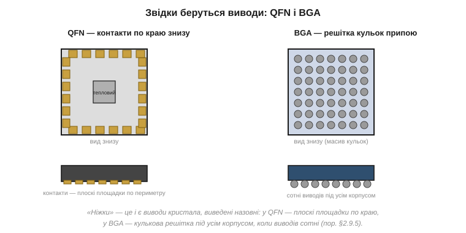
*Рис. 3.10.7.3. Два підходи до виводів. **QFN** (Quad Flat No-leads): плоскі контактні площадки розташовані по **краю** корпусу знизу, плюс часто великий тепловідвідний майданчик посередині. **BGA** (Ball Grid Array): виводи — це **решітка кульок** припою по **всій** нижній площі корпусу. QFN добрий для помірного числа виводів; BGA дозволяє вивести сотні й тисячі контактів, бо використовує всю площу, а не лише периметр.*

Логіка проста й геометрична — і варто проговорити її кількісно, бо вона пояснює весь зоопарк корпусів. Якщо виводів небагато (десятки), їх вистачить розмістити **по периметру** корпусу — так роблять у QFN, де знизу по краю йдуть плоскі контактні площадки (а посередині часто додають тепловий майданчик, що притискається до плати й відводить тепло). Але периметр росте лише **лінійно** з розміром корпусу, а потреба у виводах у складних чипів — куди швидше. Зробити корпус удвічі більшим заради вдвічі більшого периметра — марнотратство місця на платі; до того ж і самі виводи не можна розташовувати як завгодно густо, бо їх ще треба розвести доріжками на платі. Тож рано чи пізно периметр упирається в стелю, і потрібен інший підхід.

**Приклад (периметр проти площі).** Квадратний корпус зі стороною L, виводи з кроком 0.5 мм. Скільки їх влізе по краю й скільки — по всій площі?

```
Сторона L = 10 мм, крок виводів 0.5 мм

По периметру (QFN):   4 × (L / крок) = 4 × (10 / 0.5)  = 80 виводів
По всій площі (BGA):  (L / крок)²    = (10 / 0.5)²      = 400 виводів

Збільшимо корпус удвічі, L = 20 мм:
По периметру:  4 × 40 = 160   (×2 — лінійно)
По площі:      40²    = 1600  (×4 — квадратично)
```

Видно суть: периметр дає десятки-сотні виводів, а **площа** — тисячі, і відрив зростає з розміром. Тому коли виводів стають сотні чи тисячі (сучасний процесор потребує саме стільки — для живлення, пам'яті, шин), периметра не вистачає, і переходять до **BGA**, де виводи — це **решітка кульок** припою по **всій** нижній поверхні корпусу. Ось звідки «беруться ніжки» в найскладніших чипів — у вигляді кулькової матриці під усім корпусом. Платою за щільність стає монтаж: BGA не припаяєш звичайним паяльником, бо контакти сховані **під** чипом — потрібна піч, що розплавляє всі кульки разом, і рентген, щоб перевірити приховані з'єднання. А внутрішнє з'єднання кристала з цими виводами — це або wire bonding, або flip-chip, який ми щойно розібрали (під BGA з тисячами виводів — майже завжди flip-chip, бо стільки дротиків не простягнеш). Так замикається весь шлях: кристал → з'єднання → корпус → виводи на плату.

### Від великих «ніжок» до складання кристалів

QFN і BGA — лише дві точки на широкому **спектрі** корпусів, який ви вже бачили з боку даташита в §2.9.5. На одному його кінці — старі великі корпуси з довгими дротяними виводами, що встромляються в **отвори** плати (DIP та подібні): з ними легко працювати руками, але вони громіздкі й мають мало виводів. Далі — **поверхневий монтаж** (SMD): корпус не встромляється, а лягає контактами на поверхню плати (SOIC, QFP з виводами-«лапками» по краю, потім QFN без виводів, далі BGA з кульками). Уся ця еволюція — рух у один бік: **менше місця, більше виводів, ближче до кристала**. Що сучасніший і складніший чіп, то правіше по цьому спектру його корпус.

А на самому передовому краю корпус перестає бути просто «коробкою для одного кристала» й сам стає **ареною інтеграції**. Це **передове складання** (*advanced packaging*): в одному корпусі поруч чи один на одному розміщують **кілька** кристалів — ті самі чиплети (§3.10.5) — і з'єднують їх надкороткими доріжками через спільну кремнієву чи органічну підкладку. Так, наприклад, поруч із процесором кладуть стос кристалів пам'яті, з'єднаних тисячами вертикальних каналів просто крізь кремній, — і пам'ять опиняється буквально впритул до ядра, що різко прискорює обмін.

Чому це робиться, ми вже знаємо з §3.10.5: дрібні кристали мають вищий вихід, тож вигідніше зробити кілька малих і зібрати їх у корпусі, ніж один велетенський. Але вигода не лише у виході. Різні кристали можна робити на **різних** процесах — швидку логіку на найновішому й найдорожчому вузлі, а допоміжні блоки на дешевшому зрілому, — і поєднати в одному корпусі, не переплачуючи за все одразу. Так корпусування з останнього, «механічного» кроку перетворюється на повноцінну частину архітектури — і саме туди зміщується значна частина боротьби за продуктивність тепер, коли просте зменшення транзистора (§3.10.4) уповільнилося. Те, що колись робило саме масштабування, дедалі частіше дає розумне складання.

> 🔧 **Навіщо це.** Корпусування — це вже впритул до вашої щоденної роботи з платами. Перше: **тип корпусу прямо вирішує, чи зможете ви паяти чіп вручну** — DIP і SOIC легкі, QFN ще посильний (хай і з навичкою), а BGA вимагає печі й професійного монтажу; обираючи компонент для свого пристрою, ви враховуєте це з першої хвилини (детальний гід по корпусах — в окремій 🔌-вставці до теми). Друге: **корпус відводить тепло**, тож тепловий майданчик QFN під чипом треба припаювати до плати з полігоном-радіатором — інакше потужний чіп перегріється; це пряма дія в розведенні плати. Третє: розуміючи **wire bonding vs flip-chip** і спектр корпусів, ви знаєте, чому той самий кристал у «швидкому» корпусі дорожчий і чому виводів у складних чипів так багато. А концептуально — тепер «ніжки» на мікросхемі для вас не дані з неба, а **виведені назовні контакти кристала**, і ви бачите весь місток від кремнію до паяльної площадки. Власне фізичний предмет, який ви програмуєте, нарешті повністю зібраний.

---

Підсумок §3.10.7: останній крок — **корпусування**: крихітний кристал вкладають у **корпус** і виводять його мікронні контакти назовні як «ніжки» чи площадки. Корпус виконує три ролі: **захищає** крихкий кремній, **масштабує виводи** з мікронів до паяльного розміру й **відводить тепло** (§2.7.9). Кристал з'єднують із корпусом двома способами: **wire bonding** (кристал лицем угору, тонкі золоті дротики від площадок до виводів — дешево й усюди) або **flip-chip** (кристал перевертають лицем униз на кульки припою — коротші з'єднання, для високих швидкостей і багатьох виводів). Самі корпуси різняться розташуванням виводів: **QFN** — плоскі контакти по **краю** знизу (+тепловий майданчик), добрий для десятків виводів; **BGA** — **решітка кульок** по **всій** нижній площі, для сотень і тисяч виводів (бо площа росте як квадрат, а периметр — лінійно). Так замикається шлях кристал → з'єднання → корпус → плата, і «ніжки» виявляються просто виведеними контактами кристала (пор. §2.9.5). Чіп зібрано. Лишається останнє питання — економічне: хто все це робить і чому майже ніхто у світі не має власної фабрики.

---

## 3.10.8 Фаби й fabless: економіка за мільярди

Ми пройшли весь технічний шлях — від піску (§3.10.1) до запакованого чипа (§3.10.7). Та за кожним його кроком — за чистими кімнатами, EUV-машинами, сотнями масок — стоїть **економіка**, без якої картину не зрозуміти й не можна пояснити, чому ринок чипів влаштований саме так. А влаштований він дивовижно. Сучасний напівпровідниковий завод — **фабрика** (*fab*, від *fabrication*) — коштує **десятки мільярдів** доларів, а кожне нове покоління дорожче за попереднє.

Така ціна породила ситуацію, що на перший погляд здається безглуздою: **майже ніхто у світі не має власної фабрики**. Компанії, чиї чіпи стоять буквально в усіх пристроях навколо вас, самі ці чіпи **не виготовляють** — вони лише проєктують, а власне виробництво замовляють у кількох гігантів-фабрик на іншому кінці світу. Уявіть автовиробника, що не має жодного заводу й замовляє складання машин у спільного підрядника разом із конкурентами, — у чипах це норма. Чому так склалося і чому це насправді розумно — і є тема цього останнього підрозділу. Розберімо економіку: хто за що відповідає в ланцюгу, чому фабрики такі немислимо дорогі й чому колись єдина індустрія розкололася на «тих, хто проєктує» і «тих, хто виготовляє». Це фінальний штрих, що пояснює весь ринок, на якому ви купуєте компоненти, — і його дефіцити, ціни та залежності.

### Ланцюг, де кожен робить своє

Сучасне виробництво чипа — не справа однієї компанії, а **ланцюг** спеціалізованих гравців, кожен зі своєю роллю.


*Рис. 3.10.8.1. Хто за що відповідає. **Fabless-компанія** проєктує чіп (логіку, схему), користуючись **EDA-інструментами** (ПЗ для проєктування) і готовими **IP-ядрами** (ліцензовані блоки — процесор, USB, пам'ять). Готовий проєкт у вигляді файлу масок (GDSII) передають на **foundry** (фабрику), яка виготовляє пластини на своєму обладнанні (ASML та інші). Готові кристали корпусують і тестують спеціалізовані **OSAT**-компанії. Жодна ланка не робить усе сама.*

Простежмо ланцюг зліва направо. **Fabless-компанія** (буквально «без-фабрична») робить найголовніше інтелектуально — **проєктує** чіп: вирішує архітектуру, описує логіку, розкладає мільярди транзисторів і доріжок. Але робить вона це не з нуля, інакше жодного життя б не вистачило. По-перше, користується **EDA** (*Electronic Design Automation*) — складними програмами, що допомагають описати схему, перевірити її й автоматично розкласти мільярди елементів по кристалу (як саме алгоритми place & route перетворюють опис на фізичний малюнок — у ⚙️-вставці до §3.10.2). По-друге, ліцензує готові **IP-ядра** (*intellectual property*): перевірені блоки на кшталт процесорного ядра, контролера USB чи інтерфейсу пам'яті, які не має сенсу винаходити щоразу заново — їх «вставляють» у свій чіп, як готові цеглини. Це теж окрема індустрія: компанії, що **тільки** проєктують і ліцензують ядра, самі не випускаючи жодного чипа.

Готовий проєкт перетворюється на **файл масок** (формат GDSII — по суті, повне пошарове креслення всіх масок, §3.10.3) і вирушає на **foundry** — фабрику, що власне виготовляє пластини за описаним у цьому розділі процесом, на обладнанні, яке постачають ще інші спеціалісти (як-от ASML з її EUV-машинами, §3.10.2). Нарешті готові кристали відправляють до **OSAT**-компаній (*Outsourced Assembly and Test*), що спеціалізуються на корпусуванні й тестуванні (§3.10.6–§3.10.7). Виходить вражаюча картина: у створенні одного чипа беруть участь розробники EDA, постачальники IP, дизайнерська команда, фабрика, виробники обладнання, складальники — і всі вони **різні** компанії, часто з різних країн. Уся індустрія — це конвеєр вузьких спеціалізацій, де кожен робить **своє** найкраще; а тримає цю спеціалізацію вкупі сувора економіка фабрик, до якої ми й переходимо.

### Чому фабрику не збудуєш у гаражі

Серце всієї цієї економіки — божевільна вартість фабрики. Саме вона пояснює, чому виробництво зосереджене в кількох руках.

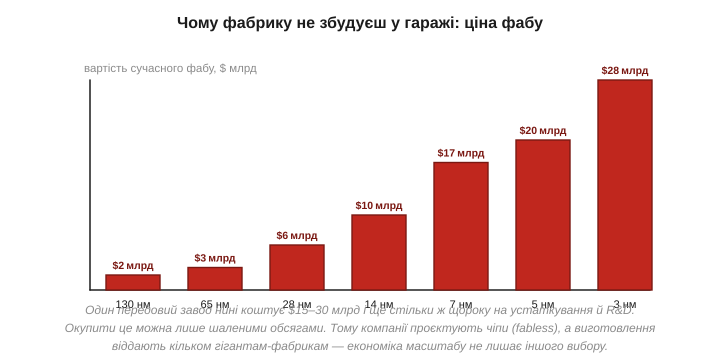
*Рис. 3.10.8.2. Вартість будівництва передового напівпровідникового заводу зростає з кожним поколінням: від кількох мільярдів доларів на старих вузлах до **$15–30 млрд** на найновіших — і ще стільки ж щороку на устаткування й розробку. Окупити такі гроші можна лише шаленими обсягами виробництва. Тому збудувати конкурентний фаб під силу буквально кільком компаніям у світі.*

Осягніть масштаб цих чисел. Передовий завод сьогодні коштує **$15–30 мільярдів** — як кілька авіаносців, — і це лише будівництво; додайте мільярди щороку на нове обладнання (одна EUV-машина — сотні мільйонів доларів) і на дослідження наступного покоління. Така сума має сенс, **лише** якщо завод працюватиме на повну й випускатиме чіпи **колосальними** тиражами роками поспіль. Покажімо це прямо.

**Приклад (чому фабрику окупає лише обсяг).** Завод вартістю $20 млрд треба окупити за ~5 років. Скільки чіпів він має випустити, щоб ця вартість «розмазалася» прийнятно?

```
Капітальні витрати:         $20 000 000 000
Строк окупності:            5 років
На рік:                     $4 млрд / рік треба відбити лише на будівлю

Якщо завод робить 20 000 пластин/місяць × 600 чіпів = 12 млн чіпів/міс
                            ≈ 144 млн чіпів/рік
Частка вартості заводу на 1 чіп:  $4 млрд / 144 млн  ≈  $28 / чіп

Якби обсяг був у 100 разів менший (1.44 млн чіпів/рік):
                            $4 млрд / 1.44 млн  ≈  $2800 / чіп  (!)
```

Різниця приголомшлива: при масовому випуску вартість заводу додає до чипа десятки доларів, а при дрібному — тисячі, що робить чіп неконкурентним. Звідси два наслідки. Перший: побудувати й окупити конкурентний передовий фаб під силу буквально **жменьці** компаній і країн у світі — це поріг, нездоланний для решти. Другий, і вирішальний для індустрії: переважній більшості компаній **немає сенсу** мати власну фабрику, навіть якби вони могли її збудувати, — вони просто **не завантажать** її на повну своїми обсягами, а недозавантажений завод (як показує приклад) робить кожен чіп золотим. Дешевше **замовити** виготовлення в того, хто збирає замовлення багатьох клієнтів і тримає завод завантаженим. Ця проста економіка масштабу й розколола індустрію, давши життя самій моделі fabless.

### Три моделі бізнесу

Зведімо все в три способи існувати в цій індустрії — і побачимо, куди рухається ринок.

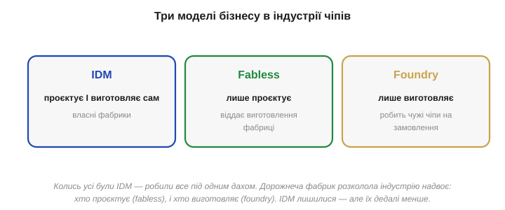
*Рис. 3.10.8.3. Три бізнес-моделі. **IDM** (Integrated Device Manufacturer) — проєктує **і** виготовляє сам, маючи власні фабрики (класична стара модель). **Fabless** — лише **проєктує**, а виготовлення віддає фабриці. **Foundry** (pure-play) — лише **виготовляє**, роблячи чужі чіпи на замовлення, своїх дизайнів не маючи. Дорожнеча фабрик розколола колишню єдину модель IDM надвоє — на тих, хто проєктує, і тих, хто виготовляє.*

Тут видно всю еволюцію галузі. Колись **усі** були **IDM** — велика компанія робила все під одним дахом: і проєктувала, і виготовляла на власних заводах. Поки фабрики були відносно дешеві, це мало сенс і навіть давало перевагу — повний контроль над усім ланцюгом. Та коли вартість фабу злетіла до десятків мільярдів (і кожне покоління дорожчало), тримати власне передове виробництво стало по кишені одиницям. Тоді й сталося велике розщеплення.

З одного боку з'явилися **fabless**-компанії: вони зосередилися на тому, що вміють найкраще, — на **проєктуванні** й архітектурі, — а виготовлення цілком віддали назовні. Це звільнило їх від мільярдних капітальних витрат: проєктувати чіпи можна талантом і комп'ютерами, без власного заводу. З іншого боку постали **pure-play foundry** — фабрики, що нічого свого **не проєктують**, а лише **виготовляють** чужі чіпи на замовлення. Їхній геній — у бізнес-моделі: зібравши замовлення **багатьох** fabless-клієнтів, вони тримають свій захмарно дорогий завод **повністю завантаженим**, а отже (згадайте приклад вище), роблять кожен чіп дешевим. Жоден окремий клієнт не завантажив би завод сам — а всі разом завантажують. Саме поява таких великих незалежних фабрик і зробила модель fabless узагалі можливою: доти дизайнерові не було куди віддати проєкт, а тепер з'явився підрядник.

Класичний і вирішальний для всієї індустрії приклад — фабрика, що принципово працює **на всіх** і ні з ким не конкурує власними дизайнами, тож клієнти не бояться віддавати їй секрети своїх схем (її історію винесено в окрему 📜-вставку до теми). Саме ця нейтральність — «ми лише виготовляємо, вашим конкурентом ніколи не станемо» — і зробила модель foundry такою успішною: вона зняла головний страх fabless-компанії віддати креслення на чужий завод. IDM-компанії досі існують і подекуди процвітають, особливо там, де власний процес дає унікальну перевагу, але їхня частка на передовому краї меншає: економіка невблаганно тягне до поділу праці, бо спеціалізований гравець на кожній ланці ефективніший за універсала, що тягне все сам. Так замикається весь розділ: чіп, що народжується з піску складним фізичним процесом, існує ще й у складній **економічній** екосистемі, де проєкт, інструменти, IP, виготовлення й корпусування — справа різних спеціалізованих гравців, часто з різних кінців світу.

### Концентрація, тонкі місця й чому це питання світового рівня

Спеціалізація дала індустрії неймовірну ефективність, але й несподівано **крихку** структуру. Коли кожну ланку роблять кілька гравців, увесь світ стає залежним від кількох точок. І це не абстракція, а цілком конкретні «тонкі шийки» ланцюга.

Найгостріший приклад — **передові фабрики**: виготовлення найновіших чипів зосереджене буквально в кількох заводах кількох компаній, та ще й географічно в одному регіоні (Східна Азія). Поруч — **обладнання**: машини EUV для найдрібнішого друку (§3.10.2) у світі робить **одна** компанія (ASML у Нідерландах), і без неї передовий завод просто не збудувати жодній країні, хоч би скільки грошей вона мала. Додайте сюди особливі **матеріали** (надчисті хімікати, спеціальні фоторезисти, кремнієві пластини), що теж походять із небагатьох постачальників, часом теж зосереджених в одній-двох країнах. Виходить ланцюг, де кожна ланка — вузьке місце, і збій у будь-якій (стихійне лихо, аварія, політична заборона, банальне перевантаження попитом) відлунює по **всьому** світу одночасно.

Найгостріше цю крихкість показав **дефіцит чипів** початку 2020-х. Сплеск попиту, накладений на збої постачання, оголив, наскільки тонкий ланцюг: бракувало навіть найпростіших, копійчаних мікроконтролерів на зрілих процесах — і через це **зупинялися автозаводи**, відкладався випуск техніки, дорожчало геть усе електронне. Виявилося, що сучасна промисловість тримається на безперебійному потоці чипів, як на кисні, а сам цей потік іде крізь кілька вузьких місць. Це був наочний урок для цілих держав — і саме він підштовхнув нинішні мільярдні програми будівництва власних фабрик.

Саме тому чіпи з суто технічної теми перетворилися на питання **світової політики й безпеки**: країни усвідомили, що залежать від кількох заводів за тисячі кілометрів, і тепер укладають мільярди в спроби збудувати власні фабрики й диверсифікувати ланцюг. Для вас як розробника з цього випливає дуже практичне: **ризик постачання** — реальна частина проєктування, не менш важлива за технічні характеристики. Закладаючи конкретний чіп у виріб, варто думати не лише про те, чи він підходить, а й про його доступність наперед, про запасні альтернативи на випадок дефіциту й про те, на скількох заводах він узагалі виробляється. Чіп, якого не дістати, — не кращий за чіп, якого нема.

> 🔧 **Навіщо це.** Економіка чипів пояснює реалії, з якими ви живете як розробник. Перше: **чому бувають дефіцити й черги** на чіпи — виробництво зосереджене в кількох фабриках і навіть одному регіоні, тож збій, перевантаження чи геополітика б'ють одразу по всьому ринку (і по доступності компонентів для ваших пристроїв); ризик постачання варто закладати в проєкт. Друге: **чому ціни такі, які є** — за вашим копійчаним мікроконтролером стоять мільярдні заводи, окуплені лише масовістю; звідси й те, що популярні масові чіпи дешеві, а нішеві — ні. Третє, корисне для розуміння галузі: коли в новині звучать назви компаній, ви тепер розрізняєте, **хто проєктує, а хто виготовляє** (fabless / foundry / IDM), і чому контроль над передовими фабриками й над єдиним виробником EUV — питання світового рівня. А загальний підсумок: чіп, який ви тримаєте, — продукт не лише фізики, а й безпрецедентної **глобальної кооперації**, де жодна країна й компанія не робить його самотужки від початку до кінця. Це варто тримати в голові, коли плануєте виріб і його залежність від ланцюга постачання.

---

Підсумок §3.10.8: за технічним шляхом «пісок → чіп» стоїть **економіка на мільярди**. Сучасна **фабрика** (fab) коштує **$15–30 млрд** і дорожчає з кожним вузлом, тож окупна лише за шалених обсягів — збудувати її під силу кільком гравцям у світі. Тому виробництво — це **ланцюг спеціалізацій**: **fabless** проєктує чіп (на **EDA**-інструментах і ліцензованих **IP-ядрах**), **foundry** виготовляє пластини (на обладнанні постачальників на кшталт ASML), **OSAT** корпусує й тестує. Дорожнеча фабів розколола колишню єдину модель **IDM** (проєктує і виготовляє сам) на **fabless** (лише проєктує) і **pure-play foundry** (лише виготовляє чуже); поява великих незалежних фабрик і зробила fabless можливим. IDM лишаються, але їх меншає. Звідси реальні наслідки для розробника: дефіцити (виробництво в кількох руках), структура цін (масове — дешеве), геополітика чипів. Чіп — продукт глобальної кооперації, де ніхто не робить його сам від початку до кінця.

---

## Підсумок Розділу 3.10

Ми пройшли весь шлях народження чипа — від кар'єрного піску до запаяної в корпус деталі з блискучими виводами — і тепер за словом «мікросхема» для нас стоїть не магія, а зрозумілий фізичний і економічний процес.

Згадаймо здобуте. Основа всього — **кремній**, добутий із піску й доведений до чистоти 9N, з якого методом Чохральського вирощують **монокристал** і ріжуть на пластини (§3.10.1). На пластині схему **друкують світлом** — фотолітографією, чия дрібність обмежена довжиною хвилі (аж до EUV), а ворог номер один — пилинка, тож працюють у чистих кімнатах (§3.10.2). Транзистори **вирощують шар за шаром** — легуванням, травленням, металізацією, — і тут оживає вся фізика Модуля 2 (§3.10.3). Горезвісні «нанометри» виявляються **маркетинговою назвою** покоління, а не розміром, тоді як справжня міра поступу — щільність транзисторів (§3.10.4). Не всі кристали справні: дефекти — це **статистика**, і великий кристал дорогий непропорційно (§3.10.5). Тому кристали **тестують і сортують** (binning), роблячи з одного дизайну лінійку продуктів (§3.10.6). Готовий кристал **корпусують**, виводячи його контакти назовні (§3.10.7). А над усім цим — **економіка на мільярди**, що розколола індустрію на тих, хто проєктує, і тих, хто виготовляє (§3.10.8).

Наскрізна думка розділу — виробництво чипів є **боротьбою за порядок і чистоту проти випадковості**, доведеною до краю людських можливостей. Чистота кремнію — один чужий атом на мільярд; точність друку — десятки нанометрів хвилею світла; чистота повітря — одиниці частинок на кубометр. І водночас на масштабах мільярдів транзисторів абсолютна досконалість недосяжна, тож індустрія навчилася **мислити статистикою** — виходом, сортуванням, виведенням цінності з неминучого розкиду. Це той самий перехід від «ідеально/зламано» до ймовірності, що пронизував Розділ 3.9, тільки тут він керує не бітами, а самим залізом. І останнє, що варто винести: чіп, який ви тримаєте й програмуєте, — це **застиглий результат** найскладнішого виробничого ланцюга, який будь-коли створило людство, де сходяться фізика напівпровідників, оптика на межі можливого й глобальна кооперація. Тепер, знаючи, **як** він народжується, ви читатимете будь-який даташит і будь-яку новину про чіпи зрозуміло — як інженер.

На цьому завершується вся **апаратна** частина курсу: від фізики двох станів до фізичного предмета, що цю логіку втілює. Ми знаємо, як влаштований і як народжується процесор «узагалі». Час узяти **конкретний** чіп — мікроконтролер ESP32 — і побачити, як уся ця теорія оживає в залізі, яке ви програмуватимете.

> ▶️ **Далі — Модуль 4: [Мікроконтролер і прошивка: ESP32](../../block-4-mcu-esp32/ch20-mcu-esp32/ch20-mcu-esp32.md).** Від «як народжується й працює чіп узагалі» — до конкретного мікроконтролера: анатомія ESP32, його ядра, пам'ять і периферія, і як ваш код стає прошивкою, що керує реальним залізом. А починається Модуль 4 з історії про те, як цілий комп'ютер уперше вмістився на одному чипі.
