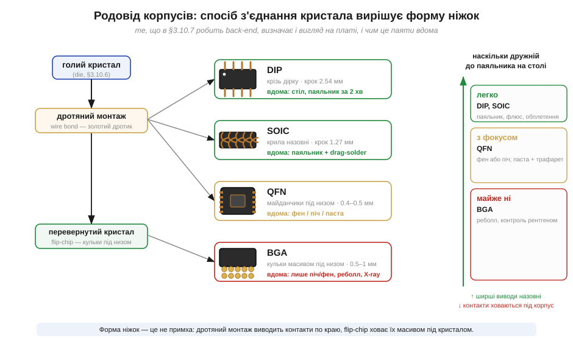
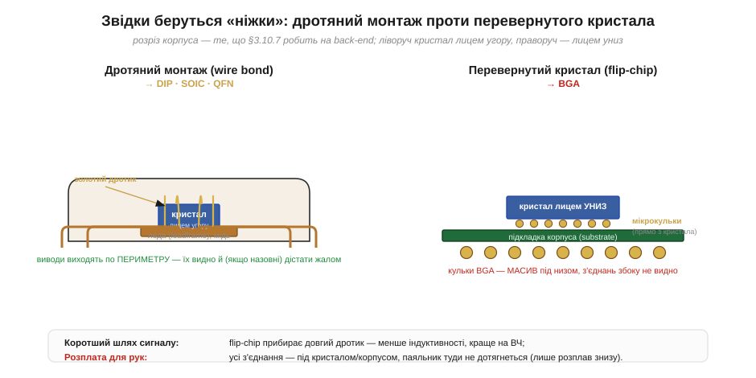
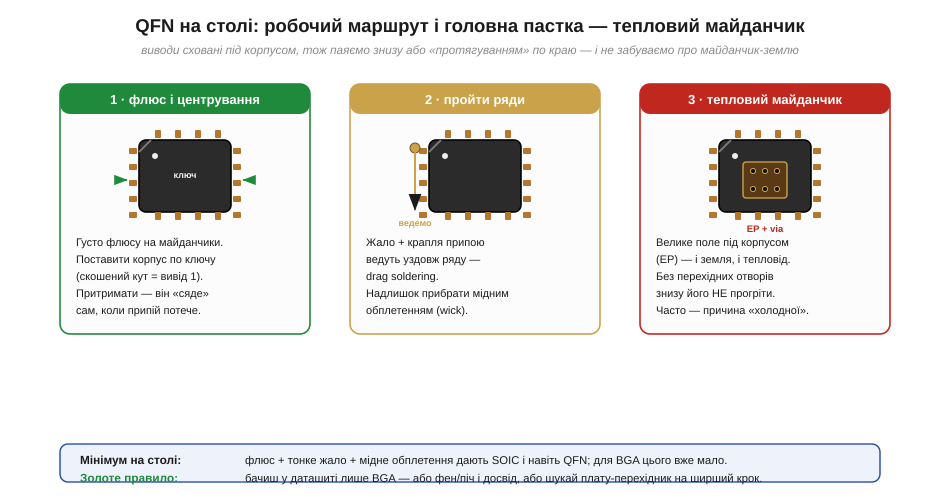

# 🔌 Гід по корпусах на платі: DIP, SOIC, QFN, BGA — що реально паяти вдома

> Компонентна вставка до теми [§3.10.7 «Корпусування: wire bonding, flip-chip, QFN/BGA»](r10-chip-fabrication.md). Тема показала, *як* на back-end кристал з'єднують зі світом — золотим дротиком чи перевернувши його на кульки. Тут ми виходимо з тієї самої точки **назовні**: у який корпус це вбирається, як він лягає на плату — і, найголовніше для столу, **чи дістанеться до його з'єднань ваше жало**. Чисто «який корпус обрати за кроком виводів» уже розібрано в [§2.9.5](../../block-2-components-analog/r09-reading-datasheets/r09-s5-c-packages.md); тут ідемо від нутрощів чіпа до того, чим його брати на стіл.

## Спосіб з'єднання всередині диктує форму ніжок

Корпус виглядає як випадковий шматок пластику з ніжками, але форма цих ніжок — прямий наслідок того, як кристал з'єднали зсередини (§3.10.7). Це і є ключ, який упорядковує весь зоопарк корпусів.

*Рис. 3.10.7c.1. Дротяний монтаж виводить контакти золотим дротиком на леду — звідси DIP, SOIC, QFN з виводами по периметру. Flip-chip перевертає кристал на кульки — звідси BGA з контактами масивом під низом. Праворуч — наслідок для рук: що ширші й відкритіші виводи, то простіше паяти на столі.*

**Дротяний монтаж** *(wire bonding)* лишає кристал лицем угору й тягне від його контактних площадок тонкі золоті дротики до мідної рамки-**леди** *(leadframe)*. Рамка й стає ніжками — по **периметру** корпуса. Усі корпуси цієї гілки споріднені: різняться лише тим, наскільки далеко ніжки стирчать назовні.

**Flip-chip** натомість перевертає кристал лицем **униз** і садить його прямо на кульки припою. Дротиків нема; контакти виходять **масивом під усім кристалом**. Так народжується BGA. Цей шлях коротший електрично (менше паразитної індуктивності, [§2.9.4](../../block-2-components-analog/r09-reading-datasheets/r09-reading-datasheets.md)) — але саме він ховає з'єднання так, що жалом до них не дотягтись.

## Чотири корпуси від простого до неможливого

Ця спорідненість і вишиковує їх у чітку сходинку складності — від такого, що паяється за пару хвилин, до такого, що руками не береться зовсім. Візьмемо по одному представнику з кожної сходинки.

**DIP** *(dual in-line package)* — старий «жук» із двома рядами товстих ніжок і кроком аж **2.54 мм**. Ніжки прошивають плату наскрізь *(through-hole)*; це найдружніший до рук корпус взагалі — припій сам затягується в металізований отвір, деталь стирчить і тримається. Тут досі живуть таймери, логіка, операційні підсилювачі для макетки.

**SOIC** *(small-outline IC)* — той самий дротяний монтаж, але вже поверхневий: пласкі ніжки-«крила» *(gull-wing)* обабіч, крок **1.27 мм**. Ніжки відкриті й відстань велика, тож паяльник бере їх легко.

**QFN** *(quad flat no-lead)* — теж дротяна гілка, але леду «підвернули» під корпус: ніжок назовні **нема**, лише контактні майданчики знизу по краю плюс велике теплове поле посередині, крок **0.4–0.5 мм**. Дім сучасних МК і радіочипів. Жало під корпус не лізе — паяти доводиться знизу.

**BGA** *(ball grid array)* — вершина flip-chip гілки: десятки-сотні кульок масивом під низом, крок 0.5–1 мм. Тут сидять великі процесори й пам'ять. З'єднань збоку не видно взагалі.

## Звідки беруться ніжки — у розрізі

Щоб побачити, чому DIP «відкритий», а BGA «глухий», корисно зазирнути в розріз обох корпусів і простежити шлях від кристала до плати.

*Рис. 3.10.7c.2. Ліворуч — дротяний монтаж: кристал лицем угору, золоті дротики ведуть від його площадок на леду, а та виходить ніжками по периметру (їх видно й, якщо назовні, можна дістати жалом). Праворуч — flip-chip: кристал лицем униз на кульках, ті виходять на підкладку, а вона — масивом кульок BGA під низом; усі з'єднання сховані, паяльнику нема куди.*

Видно головне: у дротяної гілки контакт завжди виходить на **край** — тому DIP і SOIC дістаються жалом, а QFN хоч і ховає майданчики під корпус, та лишає їх по периметру, куди доходить розплав знизу. У BGA контакт фізично під центром кристала — туди не дістатися інакше, ніж прогрівши весь корпус.

## Перший контакт: як насправді посадити QFN

DIP і SOIC «перший контакт» не потребують — приставив жало й паяй. Цікаве починається на QFN: виводи сховані, але корпус усе ще реально посадити на столі, якщо діяти за маршрутом.

*Рис. 3.10.7c.3. Три кроки: густо флюсу й центрування по ключу (скошений кут = вивід 1); прохід рядів «протягуванням» краплі вздовж ніжок із прибиранням надлишку мідним обплетенням; і головна пастка — велике теплове поле під корпусом, яке без перехідних отворів знизу просто не прогріти.*

Послідовність така: щедро **флюсу** на майданчики, поставити корпус по **ключу** (скошений кут чи крапка — вивід 1), притримати — він сам «сяде», коли припій потече. Далі веде жало з краплею вздовж кожного ряду (*drag soldering*), а надлишок знімає мідне обплетення *(solder wick)*. Останнє — і найпідступніше — це **теплове поле** *(thermal pad)* під центром: воно і земля, і тепловідвід, і без перехідних отворів *(via)* у платі прогріти його знизу майже неможливо. А BGA цей маршрут уже не бере: під центр не дотягнешся нічим, окрім повного розплаву корпуса.

## Типові граблі

- **Вивід 1 не туди.** Ключ (скошений кут, крапка, фаска) легко проґавити — і корпус сяде поверненим. Знайдіть мітку **до** того, як капнули флюс.
- **Забутий thermal pad.** Майданчик знизу не прогрівся — чіп або не стартує (нема землі), або перегрівається. На платі під ним мають бути via.
- **Перегрів дрібного корпуса.** QFN малий і тонкий; довгий фен «варить» кристал. Грійте до розтікання припою — і знімайте жар.
- **«Сховані» дефекти BGA.** Холодну кульку під корпусом видно лише рентгеном; без нього діагностика BGA вдома — гра наосліп.

## Варіації й сусіди

Кожен із цих чотирьох має ширшу рідню тієї ж гілки. Поряд із DIP — той самий наскрізний **SIP** з одним рядом; біля SOIC — дрібніший **SSOP/TSSOP** і ще ширший виводами **QFP** *(quad flat package)*, де крила йдуть з усіх чотирьох боків. QFN має рідню з кроком 0.5 і 0.4 мм та підвид з відкритим тепловим полем зверху. У flip-chip гілці поруч із BGA стоїть **LGA** *(land grid array)* — ті самі контакти масивом, але пласкими майданчиками без кульок (часто притискається, а не паяється). Сімейство велике, проте поділ наскрізний: **дротяний монтаж виводить контакти на край і лишає шанс рукам, flip-chip ховає їх під низ і віддає корпус печі.**

> 🔧 **Навіщо це.** Перш ніж брати чіп, гляньте не лише на крок виводів ([§2.9.5](../../block-2-components-analog/r09-reading-datasheets/r09-s5-c-packages.md)), а й на **тип з'єднання**, що стоїть за корпусом. **DIP** — макетка й перші схеми, паяльник за дві хвилини. **SOIC** — поверхневий, але відкритий: жало + drag-solder. **QFN** — реально посадити феном чи пастою, якщо не забути ключ і thermal pad. **BGA** — лише піч/фен і досвід, а діагностика без рентгена наосліп; для ручного прототипу беріть той самий чіп у ширшому корпусі або плату-перехідник. Форма ніжок — це слід back-end (§3.10.7) на вашому столі.

> ▶️ Повернутися до теми: [§3.10.7 — Корпусування: wire bonding, flip-chip, QFN/BGA](r10-chip-fabrication.md)
