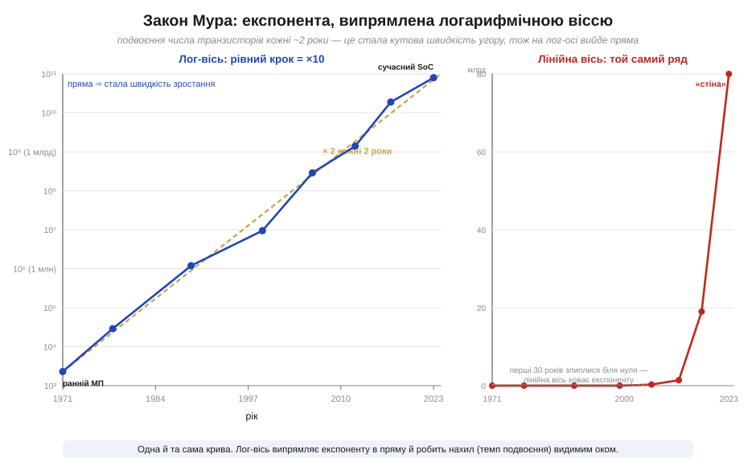
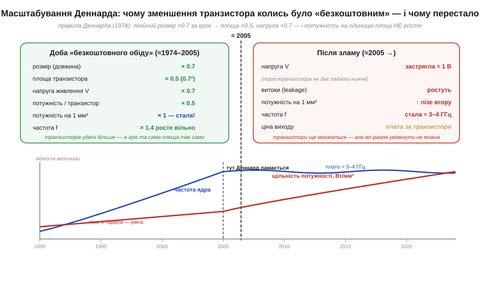
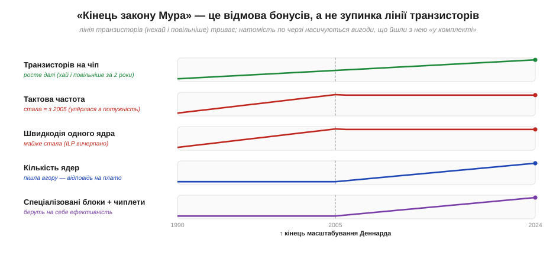

# 🧮 Закон Мура як графік: експонента, її злами й кінець масштабування Деннарда

> Числова вставка до теми [§3.10.8 «Фаби й fabless: економіка за мільярди»](r10-chip-fabrication.md). Тема показує, чому будівництво фабрики коштує десятки мільярдів і дорожчає з кожним поколінням. За цією економікою стоїть одна крива — славнозвісний «закон Мура». Тут розберемо її як математичний об'єкт: чому вона експонента, чому її прийнято малювати прямою, що означали «зручні роки», коли менший транзистор діставався майже задарма, — і чому цей подарунок закінчився, хоча сама лінія транзисторів іще тягнеться вгору.

### Означення: що саме стверджує закон Мура

Почнімо з того, що це **не закон фізики**, а помічена закономірність — і навіть радше економічне правило. 1965 року Гордон Мур (*Gordon Moore*) у журналі *Electronics* зауважив: число компонентів, які вигідно вмістити на одному кристалі, **подвоюється приблизно щороку**. За десять років, 1975-го, він переглянув темп до **подвоєння кожні ~2 роки** — і саме ця версія дожила донині. Назву «закон Мура» пустив у вжиток Карвер Мід (*Carver Mead*); сам Мур її не вигадував.

Подвоєння за сталий проміжок — це визначення **експоненційного росту** (*exponential growth*). Якщо N(t) — число транзисторів, а час подвоєння T₂ ≈ 2 роки, то

```
N(t) = N₀ · 2^(t / T₂)        T₂ ≈ 2 роки
```

Експонента тим і підступна, що «на око» здається нескінченно крутою: за десять подвоєнь — це ×1024, за двадцять — мільйон. Саме тому її майже ніколи не малюють у звичайних координатах.

### Інтуїція: чому експоненту випрямляють у пряму

Логарифм (його ми розбирали окремо у [§2.4.4m](../../block-2-components-analog/r04-frequency-response/r04-s4-m-logarithms.md)) перетворює подвоєння на **рівний крок**. Прологарифмуймо обидва боки:

```
log₂ N(t) = log₂ N₀ + t / T₂
```

Праворуч — рівняння **прямої** виду y = a + b·t. Тобто на осі, де по вертикалі відкладено не саме число, а його логарифм, експонента розпрямляється в пряму лінію, а її нахил — це **темп подвоєння**. Це не косметика: пряма дає змогу оком зчитати, чи тримається закон, бо будь-яке вповільнення одразу видно як злам нахилу.


*Рис. 3.10.8m.1. Та сама послідовність чіпів двома способами. Ліворуч — логарифмічна вісь: подвоєння за ~2 роки лягає на пряму (пунктир — ідеальний темп ×2), і реальні точки тримаються її кілька десятиліть. Праворуч — лінійна вісь: перші тридцять років злипаються біля нуля, а потім крива «злітає в стіну». Один ряд чисел, але лог-вісь робить зростання читабельним, а лінійна — ховає його.*

### Формальний апарат: масштабування Деннарда — джерело «безкоштовного обіду»

Закон Мура каже лише, **скільки** транзисторів поміститься. Те, що кожне нове покоління ще й працювало **швидше та холодніше**, — заслуга окремого правила. 1974 року група інженерів IBM на чолі з Робертом Деннардом (*Robert Dennard*) сформулювала **масштабування Деннарда** (*Dennard scaling*): якщо всі розміри транзистора й напругу живлення зменшувати в те саме число разів κ, фізика складається напрочуд вдало. Нехай за крок лінійний розмір ×0.7 (κ ≈ 1.4):

```
довжина, ширина : × 0.7          площа : × 0.5   (0.7²)
напруга V        : × 0.7          ємність : × 0.7
потужність / транзистор : × 0.5   (∝ C · V² · f)
число транзисторів на мм² : × 2
─────────────────────────────────────────────
потужність на 1 мм²  :  × 1   — СТАЛА
```

Ось у чому подарунок: транзисторів на одиниці площі **вдвічі більше**, кожен **удвічі ощадніший**, тож гріє той самий квадратний міліметр **так само**, а частоту можна вільно піднімати. Кожне покоління саме собою давало і щільність (Мур), і швидкодію без перегріву (Деннард) — звідси й вираз «безкоштовний обід» (*free lunch*).


*Рис. 3.10.8m.2. Дві ери на одній осі. Доки напруга падала разом із розміром (ліворуч, до ~2005), щільність потужності лишалася рівною, а частота вільно зростала. Потім напруга вперлася в поріг транзистора (≈1 В) і поповзли витоки — щільність потужності полізла вгору, а частота стала на місці (нижня панель).*

> 🔧 **Навіщо це.** Саме кінець масштабування Деннарда пояснює, чому ваш мікроконтролер уже багато років працює на одиницях чи десятках мегагерців і не «розганяється» сам собою щороку: дармова частота скінчилася. Подальший виграш дають не вищі такти, а архітектура — паралельність і спеціалізовані блоки.

### Де ламається лінія — і де ні

Близько 2005 року правило Деннарда **перестало виконуватися**: напругу далі знижувати не виходило (нижче порога транзистор не вимикається як слід, а витоки ростуть експоненційно). Множник «потужність на мм²» зірвався з одиниці й поліз угору — це й називають **стіною потужності** (*power wall*). Наслідок видно у [§3.5.5](../ch18-processor-architecture/ch18-processor-architecture.md): тактова частота настільних процесорів застрягла на ≈3–4 ГГц і відтоді майже не росте.

Важливо не сплутати два злами. **Лінія транзисторів** (закон Мура) триває й досі, хоч і повільніше, ніж раз на два роки. А от **бонуси**, що йшли з нею в комплекті, насичуються по черзі: спершу частота, потім швидкодія одного ядра. Промисловість відповіла, витрачаючи нові транзистори інакше — на багатоядерність, спеціалізовані прискорювачі й чиплети (їхню економіку ми рахували у [§3.10.5m](r10-s5-m-yield-math.md)).


*Рис. 3.10.8m.3. «Кінець закону Мура» — це відмова бонусів, а не зупинка лінії транзисторів. Число транзисторів іде вгору; частота й швидкодія одного ядра вийшли на плато з ~2005; натомість угору пішли кількість ядер і спеціалізовані блоки. Кінець масштабування Деннарда — той самий вододіл.*

### Де це працює в курсі

Ця крива — мовчазне тло всього модуля. Вона пояснює економіку фаб із [§3.10.8](r10-chip-fabrication.md): кожне подвоєння щільності вимагає дедалі дорожчого обладнання, тож фабрики коштують мільярди, а охочих їх будувати лишаються одиниці. Вона ж стоїть за «стіною частоти» процесорів із [§3.5.5](../ch18-processor-architecture/ch18-processor-architecture.md) і за тим, чому подальший поступ перемкнувся на ядра та чиплети ([§3.10.5m](r10-s5-m-yield-math.md)). А головний урок — методичний: коли наступного разу вам покажуть «вибух» якоїсь технології, перевірте, чи це справді експонента, чи лінійна вісь просто драматизує звичайний ріст. Лог-вісь із цієї вставки розрізняє їх миттєво.
