# Розділ 4.8 — Аналого-цифрове перетворення (АЦП)

У попередньому розділі ми навчили мікроконтролер **віддавати** аналог: ШІМ і ЦАП перетворювали **число на напругу**. Та частіше потрібен **зворотний** шлях. Світ навколо аналоговий — температура, освітленість, звук, напруга з давача змінюються плавно й неперервно, — а процесор розуміє лише числа. Перетворити неперервну напругу на число — робота **аналого-цифрового перетворювача (АЦП, англ. *analog-to-digital converter, ADC*)**. Це один із найважливіших мостів між залізом і кодом: майже кожен давач урешті впирається в АЦП. Перш ніж розбирати, як він улаштований, варто почути історію великої ідеї, що лежить під усім цифровим вимірюванням, — [📜 теореми дискретизації](hist-sampling.md): скільки разів треба виміряти сигнал, щоб нічого не втратити.

Будуємо крок за кроком: спершу **сам міст аналог→цифра** — як напруга стає числом ([§4.8.1](adc.md)); далі — [дискретизація й квантування як два окремі кроки](adc.md), [біти й роздільність — ціна одного кроку (LSB)](adc.md), [опорна напруга: проти чого АЦП міряє](adc.md), [частота дискретизації, Найквіст і аліасинг](adc.md), [похибки реального АЦП і калібрування](adc.md), [як правильно зчитати сигнал](adc.md) і нарешті [типи АЦП: SAR і дельта-сигма](adc.md). Спираємося на вже знайоме: **ЦАП і крок LSB** ([§4.7.6](../pwm-dac/pwm-dac.md)), **двійкову лічбу** (Модуль 3) та **опорну напругу** — бо АЦП багато в чому є дзеркалом ЦАП.

---

## 4.8.1 АЦП: перетворити напругу в число (міст аналог→цифра)

У минулому розділі ми вчили мікроконтролер **говорити** аналоговою мовою — ШІМ і ЦАП перетворювали число на напругу. Та значно частіше потрібне зворотне: щоб машина **слухала** світ. Температура, освітленість, звук, положення ручки, заряд батареї — усе це неперервні аналогові величини, а процесор оперує самими лише числами. Хтось має стати перекладачем «з аналога в цифру»: виміряти напругу й сказати, **яким числом** вона є. Цей перекладач — **аналого-цифровий перетворювач (АЦП, англ. *analog-to-digital converter, ADC*)**, і він, без перебільшення, — найважливіший вхідний міст мікроконтролера. Ця тема оглядова: побачимо саму **ідею** перетворення «напруга → число», як вона дзеркалить уже знайомий ЦАП, як це виглядає в коді й де застосовується. Тонкощі — скільки рівнів, проти чого міряти, як швидко й які бувають АЦП — розберемо далі в розділі, тема за темою.

### АЦП — дзеркало ЦАП

Найлегше зрозуміти АЦП через те, що ми вже знаємо. У §4.7.6 ЦАП брав число й видавав пропорційну напругу: **код → напруга**. АЦП робить точно зворотне: бере напругу й видає пропорційне число — **напруга → код**. Це той самий міст між цифрою й аналогом, лише пройдений у другий бік.

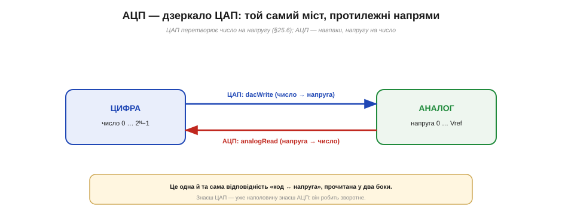
*Рис. 4.8.1.1. Та сама відповідність «код ↔ напруга», прочитана у два боки. ЦАП (`dacWrite`) синтезує напругу з числа; АЦП (`analogRead`) вимірює число з напруги. Знаючи ЦАП (§4.7.6), ви вже наполовину знаєте АЦП — він робить зворотне.*

Тому півроботи з розуміння АЦП ми зробили ще на ЦАП. Та сама думка «діапазон напруги 0…Vref відповідає діапазону кодів 0…2ᴺ−1», лише читаємо її навпаки. Якщо ЦАП — це «синтезатор» напруги з числа, то АЦП — «вимірювач» числа з напруги. І так само, як у ЦАП, тут є дві ключові величини: **опорна напруга** Vref, що задає верхню межу шкали (проти чого міряємо), і **роздільність** у бітах, що задає, на скільки рівнів поділено шкалу. Обом присвячено окремі теми далі; поки що тримаймо в голові саму симетрію.

Ця дзеркальність — не просто гарна аналогія. Якби ми ЦАП'ом виставили якусь напругу, а тоді виміряли її **назад** АЦП'ом, то в ідеалі дістали б те саме число, з якого почали: код → напруга → код. Саме тому АЦП і ЦАП часто живуть **поряд** в одному пристрої: у звукових кодеках, наприклад, один блок оцифровує мікрофон, а другий озвучує динамік. Освоївши одну половину мосту, ви майже задарма отримуєте розуміння другої — і дзеркальні формули, і дзеркальні поняття.

### Вхідний міст: де сидить АЦП

Щоб відчути роль АЦП, корисно побачити, де він стоїть у ланцюжку. Аналоговий світ — температура, світло, звук, тиск — спершу перетворюється давачем на **напругу**, а вже цю напругу АЦП обертає на число, з яким працює код. АЦП — це ворота, крізь які все «відчуте» процесором заходить усередину.

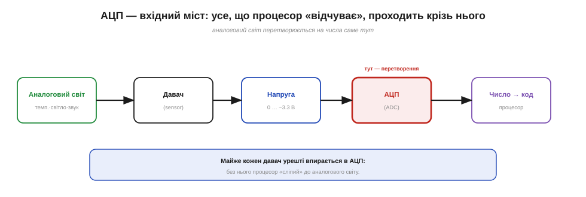
*Рис. 4.8.1.2. АЦП — вхідний міст мікроконтролера. Фізична величина → давач → напруга (0…~3.3 В) → АЦП → число → процесор. Майже кожен давач урешті впирається в АЦП; без нього процесор «сліпий» до аналогового світу.*

Це пояснює, чому АЦП — одна з найуживаніших периферій. Хочеш виміряти температуру, освітленість, рівень звуку, кут повороту ручки, заряд акумулятора — усе це врешті зводиться до «прочитати напругу». Давачі бувають різні: одні дають напругу прямо (як давач температури LM35), інші змінюють опір (термістор, фоторезистор), і тоді напругу знімають із простого подільника. Та хоч би яким був давач, остання ланка завжди та сама — **АЦП**, що переводить напругу в число. Опанувавши його, ви відмикаєте собі майже всю «давачну» частину електроніки.

Варто наголосити на цій універсальності. Один давач сам видає напругу (як LM35, де 10 мВ відповідають одному градусу), інший лише змінює опір — тоді його ставлять у подільник із постійним резистором, і вже подільник перетворює зміну опору на зміну напруги. Третій дає крихітний сигнал, який спершу підсилюють. Та для самого АЦП ці відмінності неважливі: він бачить лише **напругу на своєму вході** й переводить її в число, байдуже, звідки вона взялася. Тому, навчившись читати один аналоговий вхід, ви вмієте читати їх **усі** — змінюється давач і обв'язка перед АЦП, а не сам спосіб вимірювання.

### Від напруги до числа

Тепер придивімося до самого перетворення. АЦП ділить свій робочий діапазон напруг (від 0 до Vref) на багато рівних щаблів і для кожної вхідної напруги повертає **номер найближчого щабля** — код. Передавальна характеристика — знову **сходинки**, тільки дзеркальні до ЦАП: на вході тепер напруга, на виході — код.

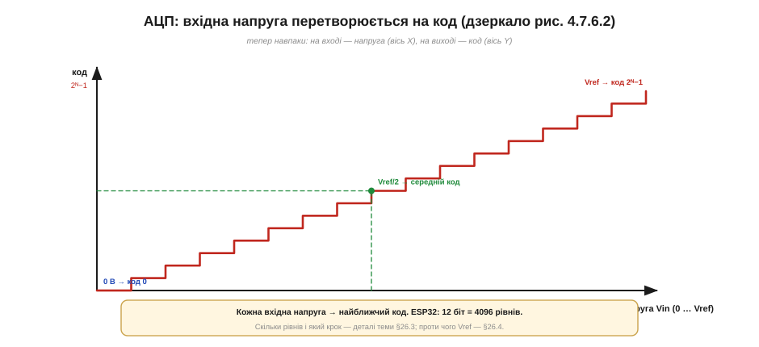
*Рис. 4.8.1.3. Дзеркало рис. 4.7.6.2: тепер вісь X — вхідна напруга, вісь Y — код. 0 В дає код 0, Vref — максимальний код 2ᴺ−1, а середина шкали — середній код. ESP32 має 12-бітний АЦП: 4096 рівнів. Скільки рівнів і який крок — §4.8.3; проти чого Vref — §4.8.4.*

Зв'язок між напругою й кодом простий і прямо пропорційний. Якщо роздільність — N біт, а опорна напруга — Vref, то:

```
код  ≈  Vin / Vref × (2ᴺ − 1)      (напруга → число)
Vin  ≈  код × Vref / (2ᴺ − 1)      (число → напруга, назад)
```

Помічаєте? Друга формула — це буквально формула ЦАП із §4.7.6. Тобто, отримавши код від АЦП, ми тим самим виразом перетворюємо його назад у вольти, коли хочемо знати «скільки ж там було напруги». Для ESP32 з його 12 бітами це 4096 рівнів (коди 0…4095) — досить дрібно, щоб виміряти напругу з точністю до приблизно мілівольта. Але **точне** число рівнів, розмір кроку й те, проти якої саме Vref усе міряється, — це окремі важливі теми (§4.8.3 і §4.8.4); тут нам досить знати, що зв'язок лінійний і дзеркальний до ЦАП.

Чому зв'язок саме лінійний? Бо щаблі **рівномірні**: уся шкала 0…Vref поділена на однакові кроки, тож удвічі більша напруга дає вдвічі більший код. Зручний образ — мірна склянка з рівними поділками: скільки рідини налито, на такій поділці й зупиниться рівень. Два краї шкали закріплено намертво — 0 В це код 0, а повна напруга Vref це найбільший код, — а все між ними лягає на пряму, що з'єднує ці два кінці. Через те й перерахунок такий простий: одне множення туди, одне назад.

### У коді це один рядок: `analogRead`

На щастя, уся ця механіка захована за однією функцією. У середовищі Arduino читання АЦП — це виклик `analogRead(pin)`, що повертає готове ціле число. На ESP32 за замовчуванням воно 12-бітне, тобто в діапазоні 0…4095.

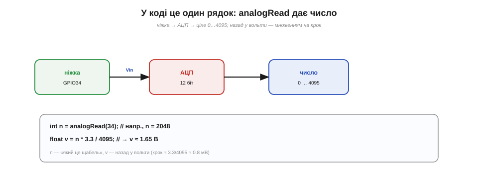
*Рис. 4.8.1.4. У коді — один рядок. `analogRead` дає ціле 0…4095 («який це щабель»); щоб дістати вольти, множимо на крок Vref/4095. Наприклад, число 2048 відповідає приблизно 1.65 В (середина шкали).*

Важливо тримати в голові, що `analogRead` повертає **число**, а не вольти. Це «номер щабля», і щоб перевести його в напругу, його треба домножити на крок (Vref/4095). Часто це й не потрібно: якщо ви просто стежите, «світліше стало чи темніше», вистачить і сирого числа — більше означає більшу напругу. А коли треба саме вольти (виміряти заряд батареї, опорну напругу давача), застосовуєте формулу назад. Ще одна практична дрібниця: не кожна ніжка вміє АЦП — на ESP32 для цього є спеціальні входи (позначені як ADC), і саме їх треба обирати.

На практиці сире число з `analogRead` часто і є кінцевою відповіддю. Якщо завдання — «темніше чи світліше», «ручку покрутили ліворуч чи праворуч», то порівнювати можна прямо коди, не переводячи їх у вольти взагалі. А коли потрібна фізична величина — градуси, люкси, вольти заряду, — між кодом і нею ставлять свій **перерахунок**, інколи з калібруванням під конкретний давач (про точність і калібрування реальних АЦП — окрема тема далі). Тобто `analogRead` дає сирий «номер щабля», а сенсу — градуси це чи люкси — йому надає вже ваш код.

> 🔧 **Навіщо це.** Запам'ятайте різницю: `analogRead` дає **код**, а людині зазвичай потрібні **вольти** — тож майже завжди поряд живе рядок `v = n * Vref / макс`. І стережіться відомої пастки ESP32: один із двох його АЦП-блоків (**ADC2**) конфліктує з **Wi-Fi** — коли радіо ввімкнене, читати ним не можна. Тому для звичайних вимірів беріть ніжки першого блоку (**ADC1**), і «чому analogRead повертає сміття при ввімкненому Wi-Fi» більше вас не здивує.

### Де АЦП усюди

Варто окинути оком, наскільки АЦП поширений — це переконує краще за будь-яке означення.


*Рис. 4.8.1.5. Усе, що дає змінну напругу, читають АЦП: ручка-потенціометр, давач температури, фоторезистор, мікрофон, подільник для напруги батареї, джойстик (дві осі — два канали). Спільне одне: фізична величина → напруга → АЦП → число.*

За всіма цими прикладами стоїть один і той самий шаблон: щось у фізичному світі змінює напругу, а АЦП перетворює її на число, з яким уже працює програма. Потенціометр перетворює **поворот** на напругу подільника; термістор — **тепло** на зміну опору, а отже й напруги; фоторезистор — **світло**; мікрофон — **звук** на крихітні коливання напруги. Навіть щоб дізнатися, **наскільки сіла батарея**, її напругу через подільник заводять на АЦП. Один блок — і процесор «бачить», «чує» й «відчуває» десятки різних величин.

Розгляньмо крихітний приклад, як це сходиться докупи. Зробімо автоматичний нічник: фоторезистор у подільнику дає напругу, що падає в темряві; ми раз у раз читаємо `analogRead`, і коли число опускається нижче порога — вмикаємо світло, а коли підіймається — гасимо. Жодної математики з вольтами тут і не треба: досить **порівняти код із порогом**. Так само працює автояскравість екрана, давач присмерку вуличного ліхтаря, індикатор розрядженої батареї — усе це той самий АЦП, поріг і проста умова в коді. Бачите, як небагато треба, щоб залізо почало реагувати на світ.

### АЦП як лінійка: знайти найближчий щабель

Насамкінець — корисний образ того, що АЦП робить по суті. Уявіть лінійку напруги від 0 до Vref, поділену рисками на рівні щаблі. АЦП прикладає до неї вхідну напругу й каже, до **якого щабля** вона найближча, повертаючи його номер. Це і є код.


*Рис. 4.8.1.6. Суть АЦП — округлення. Діапазон 0…Vref поділено на рівні; будь-яка вхідна напруга «приписується» до найближчого щабля, чий номер і є кодом. Саме це округлення породжує неминучу похибку квантування. ЯК АЦП шукає щабель (SAR, дельта-сигма) — §4.8.8.*

З цього образу одразу видно дві речі. По-перше, відповідь АЦП **завжди округлена**: реальна напруга майже ніколи не лягає точно на щабель, тож між істинним значенням і виміряним лишається маленька різниця — її звуть **похибкою квантування** (*quantization error*), і вона тим менша, чим дрібніші щаблі. По-друге, видно, що «оцифрувати» — означає трохи **втратити**: безкінечно багату аналогову напругу ми замінюємо одним із скінченного набору номерів. Скільки рівнів брати, як саме округлення впливає на якість і чим один тип АЦП відрізняється від іншого — про це наступні теми. Поки що вистачить головного образу: **АЦП — лінійка, що знаходить найближчий щабель**.

І ще одна думка наостанок. Дрібніші щаблі (більше біт) дають точніший вимір, але задарма це не дається: точніший АЦП складніший, повільніший і дорожчий, тож роздільність завжди обирають **під задачу**, а не «якомога більшу». А оскільки кожен вимір округлено, оцифрування — це завжди трішки **необоротна** втрата: з коду ми відновимо напругу лише з точністю до щабля, не точніше. Ці компроміси — точність проти швидкості й ціни — наскрізна тема всього розділу, і повертатимемося до них раз по раз.

> 🔧 **Навіщо це.** Округлення до щабля означає, що в кожному вимірі вже «вшита» невеличка похибка — і це нормально, аби вона була меншою за вашу потрібну точність. Тому, обираючи АЦП чи режим, завжди прикидайте: який крок (щабель) дає ця роздільність і чи дрібніший він за похибку, яку ви готові терпіти? Цю саму логіку ми вже бачили з боку ЦАП (§4.7.6) — і вона дзеркально працює тут.

**Приклад (напруга ↔ код на 12-бітному АЦП ESP32).** Vref ≈ 3.3 В, N = 12.

```
рівнів = 2¹² = 4096,  коди 0…4095
крок (LSB) = 3.3 / 4095 ≈ 0.000806 В ≈ 0.81 мВ

Vin = 1.0 В  → код ≈ 1.0 / 3.3 × 4095 ≈ 1241
код 3000     → Vin ≈ 3000 × 3.3 / 4095 ≈ 2.42 В
```
Один щабель — менш як мілівольт: для більшості давачів цього з головою. А назад у вольти переводимо тією самою формулою, що й у ЦАП, — ще раз нагадуючи, що АЦП і ЦАП дзеркальні.

Отже, АЦП — це вхідний міст: він вимірює напругу й повертає число, дзеркально до ЦАП, округляючи вхід до найближчого щабля. На цьому загальна картина повна. Та сказане досі мовчки змішувало **два різні** кроки, що насправді відбуваються окремо: спершу сигнал «фотографують» у певні моменти часу, а вже потім кожен знімок округляють до щабля. Розділити дискретизацію в часі й квантування за рівнем — наступна тема розділу.

## 4.8.2 Дискретизація й квантування (два окремі кроки)

У попередній темі ми для простоти говорили про перетворення «напруга → число» як про один рух. Та насправді всередині АЦП відбуваються **два цілком різні кроки**, і вміння бачити їх окремо — ключ до всього подальшого: і до похибок, і до підступного питання частоти, і до роздільності. Перший крок — **дискретизація (*sampling*)**: зробити час дискретним, узяти значення сигналу лише в окремі миті, наче серію знімків. Другий крок — **квантування (*quantization*)**: зробити дискретним саме значення, округливши кожен знімок до найближчого доступного рівня (коду). Сплутати їх легко, бо в готовому числі вони вже злиті; та причини їхні різні, наслідки різні — тож розгляньмо кожен окремо.

### Дві неперервності — два кроки

Чому кроків саме два? Бо реальний сигнал неперервний у **двох** різних сенсах одразу. По-перше, він існує в **кожну мить** часу — між будь-якими двома моментами є ще нескінченно багато інших. По-друге, він може мати **будь-яке значення** — між двома близькими напругами теж лежить нескінченно багато проміжних. Щоб звести таку подвійну нескінченність до скінченного потоку чисел, обидві неперервності треба «приборкати» — і робиться це двома незалежними операціями: одна займається **часом**, друга — **значенням**.

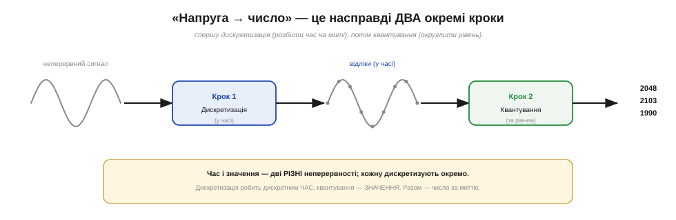
*Рис. 4.8.2.1. «Напруга → число» — це два окремі кроки. Дискретизація робить дискретним **час** (беремо знімки в миті 0, T, 2T, …); квантування робить дискретним **значення** (округлюємо кожен знімок до найближчого рівня-коду). Час і значення — різні неперервності, тож і кроки різні.*

Найважливіше тут — що ці кроки **незалежні** (ортогональні, як сказали б математики). Дискретизація чіпає тільки **вісь часу**: коли саме дивитися на сигнал. Квантування чіпає тільки **вісь значення**: до якого рівня округлити побачене. Можна уявити, що сигнал спершу проходить крізь «часове сито» (лишаються тільки миттєві знімки), а потім кожен знімок — крізь «рівневе сито» (округлюється до щабля). Саме тому й похибки в них різні: про одну подбає роздільність, про іншу — частота, і плутати їх не можна.

Корисний образ — аркуш у клітинку. Дискретизація малює **вертикальні** лінії (миті), квантування — **горизонтальні** (рівні), і відстань між вертикальними жодним чином не пов'язана з відстанню між горизонтальними: їх задають **окремими ручками**. Можна мати частий-частий час і грубі рівні — або навпаки, рідкі знімки, та дуже дрібні щаблі. Через цю незалежність і всю решту розділу зручно вести двома паралельними лініями: одна про час, друга про значення.

### Крок 1: дискретизація — знімки в часі

Перший крок дивиться на сигнал не безперервно, а **спалахами**. У рівні миті — назвімо їх 0, T, 2T, 3T і так далі — АЦП фіксує поточне значення сигналу, а проміжки між цими митями просто не бачить. Це наче знімати рух не відео, а серією фотографій через однакові паузи: між кадрами життя триває, але на плівці його немає.

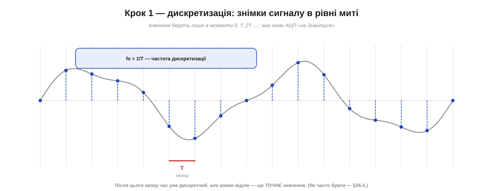
*Рис. 4.8.2.2. Крок дискретизації. Сірим — неперервний сигнал; сині точки — його значення в рівні миті, узяті через період T. Між знімками АЦП «не дивиться». Частота цих знімків fs = 1/T зветься частотою дискретизації. Після цього кроку дискретним став лише час — самі значення поки що точні.*

Відстань між знімками — це **період дискретизації** T, а скільки знімків припадає на секунду — **частота дискретизації (*sampling rate*)** fs = 1/T. Наприклад, fs = 1000 Гц означає тисячу знімків за секунду, по одному щомилісекунди. Зверніть увагу на тонкість: після самої лише дискретизації значення кожного знімка ще **точне** — ми просто перестали дивитися неперервно, але те, що встигли побачити, бачимо без спотворення. Час уже «нарізаний», а значення — ні.

І одразу постає тривожне питання: а раптом між знімками сигнал устиг зробити щось важливе — і ми це проґавили? Як часто треба «кліпати», щоб нічого не втратити? Це і є серцевина теореми дискретизації з історії розділу, а кількісно — з усіма пастками на кшталт аліасингу — ми розберемо це в окремій темі про частоту дискретизації далі. Поки що нам важливо інше: **дискретизація відповідає лише за час**.

Варто наголосити на цьому ще раз, бо це неочевидно: сама по собі дискретизація **нічого не округлює** й не псує значень. Кожен знімок миттєвий і точний, наче ідеальне фото з нескінченно короткою витримкою. Якби світ був такий, що між знімками нічого важливого не стається, ми б по них відновили сигнал **без жодної втрати**. Уся хитрість дискретизації — не в точності окремого знімка, а в тому, **чи достатньо часто** ми їх робимо.

### Крок 2: квантування — округлення за рівнем

Тепер другий крок. Кожен зроблений знімок — це поки що точна напруга, але зберегти точну напругу числом неможливо: чисел-щаблів у нас скінченна кількість. Тому знімок **округлюють** до найближчого доступного рівня — і саме номер цього рівня стає кодом. Це вже знайома нам із §4.8.1 «лінійка зі щаблями», тільки тепер ми бачимо її як **окремий** другий крок, що працює над уже взятими знімками.


*Рис. 4.8.2.3. Крок квантування. Доступні лише рівні-щаблі; точне значення відліку «приклеюють» до найближчого з них, і його номер стає кодом. Різниця між точним значенням і обраним рівнем — похибка квантування, не більша за ½ кроку. Скільки рівнів (біт) і який крок — §4.8.3.*

Відстань між сусідніми рівнями — це **крок квантування**, він же молодший значущий розряд (LSB, *least significant bit*). А оскільки реальне значення майже ніколи не лягає точно на щабель, між ним і обраним рівнем лишається **похибка квантування** — не більша за половину кроку. Це принципова відмінність від дискретизації: сам знімок ми взяли точно, а от **округлення вже втрачає** трохи інформації — і це втрата необоротна. Скільки тих рівнів брати й яким буде крок у мілівольтах — окрема велика тема (§4.8.3); тут досить розуміти, що **квантування відповідає лише за значення** і саме воно вносить похибку округлення.

Чому взагалі рівнів скінченна кількість? Бо число в пам'яті машини скінченне: 12-бітне поле має лише 4096 можливих значень, і жодного «між» ними не існує. Тому квантування — не примха, а неминучість цифрового світу: щоб **зберегти** значення числом, його доводиться підігнати під один із наявних щаблів. І саме на цьому кроці аналоговий сигнал уперше стає по-справжньому **цифровим** — а заразом і трохи збіднюється, бо назад зі щабля точну напругу вже не дістати.

### Разом — сітка: час × рівень

Складімо два кроки докупи — і вийде напрочуд наочна картина. Дискретизація розкреслює простір вертикальними лініями (миті часу), квантування — горизонтальними (рівні напруги). Разом вони утворюють **сітку**, а АЦП «приклеює» сигнал до найближчого **вузла** цієї сітки.

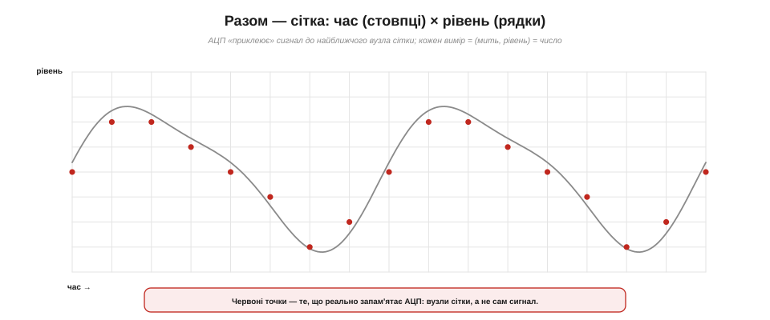
*Рис. 4.8.2.4. Два кроки разом утворюють сітку: стовпці — миті часу (дискретизація), рядки — рівні напруги (квантування). Червоні точки — те, що реально запам'ятає АЦП: найближчі вузли сітки, а не сам неперервний сигнал. Кожен вимір — це пара (мить, рівень), тобто число у відому мить.*

Ця сітка — чи не найкорисніший образ усього розділу. Кожен результат АЦП — це насправді відповідь на два питання водночас: **коли** (який стовпець, котра мить) і **який рівень** (котрий рядок, котрий код). Сирий сигнал тече гладко поміж вузлами, та машині дістаються лише вузли. Звідси одразу видно, що оцифрування завжди **щось спрощує**: дрібніша сітка (частіші знімки й дрібніші рівні) — ближче до правди, грубіша — далі. І видно, що дві осі сітки регулюються **окремо**: можна частіше знімати, не змінюючи рівнів, і навпаки.

Ця роздільність двох осей нарізно — не абстракція, а щоденне інженерне рішення. Частіші знімки означають більше даних за секунду (більше пам'яті, швидший АЦП); дрібніші рівні — більше біт на кожен відлік. Гарний вимір **припасовують** до сигналу: для повільної температури вистачить рідких знімків, зате хочеться дрібних рівнів; для звуку, навпаки, критична часта дискретизація. Розуміючи сітку, ви свідомо крутите кожну ручку окремо — а не берете «щоб було побільше» наосліп, марнуючи то пам'ять, то біти.

### Семпл-холд: чому напругу «заморожують»

Залишається практичне питання: квантування — округлення до щабля — триває **час** (АЦП мусить якось «зважити» напругу). А що, як сигнал за цей час зміниться? Тоді АЦП міряв би одне значення на початку й інше в кінці — і повернув би мішанину. Щоб цього не сталося, перед квантуванням напругу **заморожують** спеціальним вузлом — **семпл-холдом (*sample-and-hold*)**.

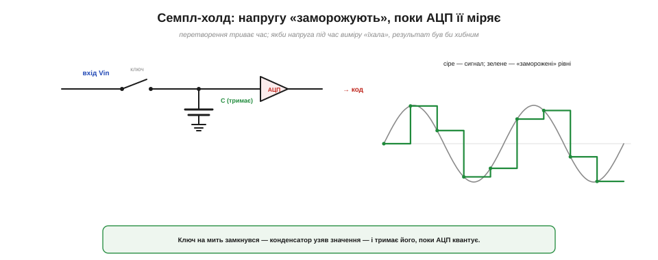
*Рис. 4.8.2.5. Семпл-холд. У мить знімка ключ на коротко замикається, конденсатор C набирає поточну напругу — і, коли ключ розмикається, **тримає** її незмінною, поки АЦП спокійно квантує. Праворуч: сірий сигнал і зелені «заморожені» рівні, кожен утримується до наступного знімка.*

Влаштований він просто: керований **ключ** і невеликий **конденсатор**. У мить дискретизації ключ замикається, конденсатор миттю набирає поточну напругу входу — це і є «знімок». Потім ключ розмикається, і конденсатор **утримує** цю напругу незмінною (заряд нікуди не дівається), даючи АЦП спокійно її округлити. Виходить, що семпл-холд — це фізичне втілення кроку дискретизації: він буквально «бере й тримає» значення, поки крок квантування робить свою справу.

Маленька чесна обмовка до слова «миттєвий». Насправді конденсаторові треба **трохи** часу, щоб набрати напругу входу, — цей проміжок звуть **часом захоплення (*acquisition time*)**. Тому ідеально миттєвого знімка не буває: якщо сигнал змінюється надто швидко або джерело надто «кволе» (високоомне, з великим внутрішнім опором), конденсатор не встигає зарядитися до правди, і знімок виходить трохи змазаним. Для повільних сигналів це дріб'язок, та для швидких саме час захоплення, а не квантування, стає вузьким місцем. Ось іще причина бачити дискретизацію окремим кроком зі **своїми** межами: у неї є не лише питання «як часто», а й питання «чи встиг конденсатор», — і обидва не мають стосунку до округлення значень.

> 🔧 **Навіщо це.** Семпл-холд пояснює, чому АЦП має скінченну швидкість і чому не можна міряти сигнал, що змінюється надто швидко для одного перетворення. На щастя, у мікроконтролері семпл-холд вбудований і спрацьовує сам із кожним `analogRead` — та знати про нього варто: саме він вимагає, щоб джерело сигналу встигало **зарядити** конденсатор (а отже, не було надто «кволим», високоомним). Цю вимогу до джерела ми ще згадаємо, коли йтиметься про правильне зчитування.

### Похибка квантування

Повернімося до неминучої ціни округлення. Похибка квантування — це різниця між справжнім значенням і обраним щаблем; вона завжди лежить у вузькій смузі **±½ кроку**. Якщо подивитися на неї окремо, вона скидається на тонкий, майже випадковий «шум», домішаний до сигналу, — тому її часто й називають **шумом квантування (*quantization noise*)**.

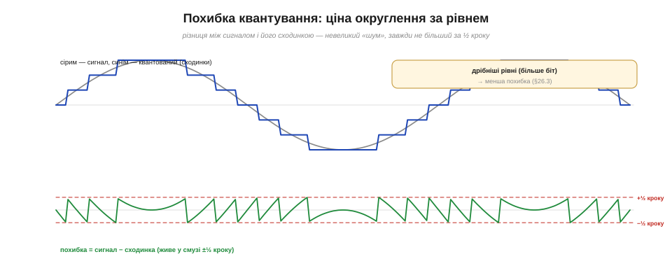
*Рис. 4.8.2.6. Похибка квантування. Угорі — сигнал (сіре) та його квантована сходинка (синє). Унизу — їхня різниця: маленька «пилка», що ніколи не виходить за межі ±½ кроку. Дрібніші рівні (більше біт) роблять цю смугу вужчою — похибка меншає (§4.8.3).*

Тут варто чітко розвести два джерела недосконалості, бо їх постійно плутають. **Квантування** псує **значення**: воно округлює, і ця похибка ≤ ½ кроку — нікуди не дінешся, лише зменшуй крок. **Дискретизація** ж значення не псує зовсім (знімок точний!) — натомість вона стосується **часу**, і її власна небезпека зовсім іншого роду: якщо знімати надто рідко, швидкі зміни «перевдягнуться» в повільні (той самий ефект колеса, що крутиться назад). Тобто похибка округлення й пастка рідких знімків — це **різні** біди з різних кроків, і лікують їх різним: першу — дрібнішими рівнями (§4.8.3), другу — частішими знімками (§4.8.5). Саме тому й варто від початку бачити в АЦП два окремі кроки.

> 🔧 **Навіщо це.** Розрізняти два кроки — ще й практичний навик діагностики. Якщо виміри виходять «сходинкуватими», грубими, з помітними дискретними стрибками — винне **квантування**, і лікувати треба роздільністю (більше біт, §4.8.3). А якщо швидкий сигнал відтворюється примарно, з'являються повільні хвилі-привиди — винна **дискретизація**, бо знімків замало (§4.8.5). Знаючи, який крок дав ваду, ви одразу знаєте, **яку ручку крутити**, — і не марнуєте час, збільшуючи біти там, де бракує швидкості.

> 🧮 **Порахувати шум.** Наскільки шкідливе це округлення ЧИСЛОМ — звідки береться діюче значення σ = LSB/√12 і знаменита стеля SNR = 6.02·N + 1.76 дБ — у вставці [Шум квантування: ±½ LSB і звідки формула](math-quantization-noise.md).

**Приклад (два кроки на 12-бітному АЦП ESP32).** Vref ≈ 3.3 В.

```
Квантування:  крок (LSB) = 3.3 / 4095 ≈ 0.806 мВ
              → похибка квантування ≤ ½ кроку ≈ 0.40 мВ
Дискретизація: fs = 1000 Гц → знімок щомиті T = 1/1000 = 1 мс

відлік 1.2003 В → код = round(1.2003 / 3.3 × 4095) = 1489
             назад: 1489 × 3.3 / 4095 ≈ 1.1999 В  → похибка ≈ 0.4 мВ
```
Два кроки — два окремі ефекти: часова сітка (тут — 1 мс між знімками) і округлення значення (тут — до 0.4 мВ). Жоден не залежить від іншого.

Отже, за кожним числом АЦП стоять дві дискретизації — у часі й за рівнем, — і вони незалежні: одна вирішує, **коли** дивитися, друга — **до якого щабля** округлити. Розуміючи це, ми готові точно поставити обидва питання. Перше — наскільки дрібні рівні (а отже, який крок і скільки потрібно біт) — і є наступною темою.

## 4.8.3 Біти й роздільність: скільки мВ в одному кроці (LSB)

У попередній темі ми з'ясували, що квантування округлює значення до найближчого щабля, а відстань між щаблями назвали кроком (LSB). Тепер відповімо на головне кількісне питання **рівневої осі**: скільки тих щаблів і яка між ними відстань у вольтах? Це і є **роздільність (*resolution*)** АЦП — і вона прямо визначає найдрібнішу зміну напруги, яку перетворювач узагалі здатний помітити. Усе впирається в одне число — кількість **біт**.

Варто з самого початку відчути, що роздільність — це **гострість зору** вимірювача. Грубий АЦП бачить світ великими сходинками й не помічає дрібних змін; тонкий розрізняє ледь помітні відтінки напруги. Жоден із них не «правильніший» — просто один годиться зміряти, чи ввімкнено світло, а інший — уловити кволий сигнал термопари. Тож питання роздільності — це завжди питання «наскільки дрібну зміну мені треба бачити», а не «чим більше біт, тим краще».

### Біти → рівні: степінь двійки

АЦП зберігає результат у двійковому числі з певної кількості розрядів — біт. А число з N біт може набувати рівно **2ᴺ** різних значень — отже, стільки в АЦП і рівнів. Тут діє нещадна арифметика степеня двійки: кожен доданий біт **подвоює** кількість рівнів.


*Рис. 4.8.3.1. Кожен біт подвоює кількість рівнів: 4 біти — 16, 8 біт — 256, 10 біт — 1024, 12 біт — 4096, 16 біт — 65 536. Зростання експоненційне, тож кілька зайвих біт дають надзвичайно дрібну шкалу.*

Числа ростуть так швидко, що інтуїція за ними не встигає. 8 біт — це вже 256 рівнів, 10 біт — понад тисяча, 12 біт (як в ESP32) — понад чотири тисячі, а 16 біт — за шістдесят п'ять тисяч. Тому, коли кажуть «АЦП на 12 біт», мають на увазі не «трохи краще за 10», а **4096 щаблів** замість 1024 — учетверо дрібніша шкала. Саме розрядність — головна «ручка» роздільності: побільшив N на одиницю — і рівнів удвічі більше.

Чому саме подвоєння? Бо кожен біт — це одне двійкове «так чи ні», одна поділка діапазону навпіл. Один біт ділить шкалу на дві половини (верх чи низ), другий — кожну половину ще навпіл, і так далі: N біт ставлять N послідовних питань «вище чи нижче?», звужуючи відповідь щоразу вдвічі. Власне код, що його повертає АЦП, — це і є відповіді на ці питання, записані двійковим числом. Тому роздільність і кількість біт — те саме, що глибина гри у «вгадай число»: більше питань — точніша відповідь.

### Крок (LSB): скільки вольтів у щаблі

Кількість рівнів сама по собі ще нічого не каже про напругу — її треба поділити на робочий діапазон. Якщо весь діапазон від 0 до опорної напруги Vref поділити на 2ᴺ рівнів, дістанемо розмір **одного кроку**, він же **молодший значущий розряд (LSB, *least significant bit*)**:

```
крок (LSB) = Vref / (2ᴺ − 1)
```

Це найдрібніша зміна напруги, яку АЦП відрізняє: усе, що менше за крок, для нього зливається в один код.

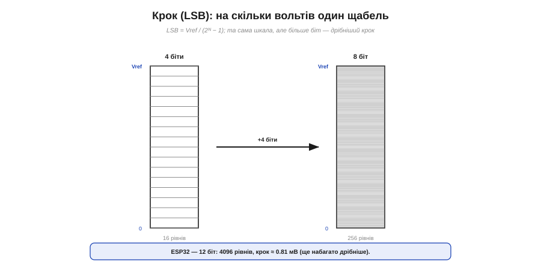
*Рис. 4.8.3.2. LSB — це Vref, поділена на рівні. Та сама шкала 0…Vref з 4 бітами дає грубі щаблі (крок ≈ 0.22 В), а з 8 бітами — уже дрібні (≈ 12.9 мВ). В ESP32 з його 12 бітами крок ще менший — близько 0.81 мВ.*

Підставмо числа для ESP32: Vref ≈ 3.3 В, N = 12, отже крок = 3.3 / 4095 ≈ **0.806 мВ**. Тобто кожен код відрізняється від сусіднього лише на восьмисоті частки вольта — для переважної більшості давачів цього з головою. А ось у простого 8-бітного АЦП крок був би 3.3 / 255 ≈ 12.9 мВ — у шістнадцять разів грубіше. Звідси й практичний сенс роздільності: **крок LSB — це «ціна поділки» вашого вимірювального приладу**, і саме він каже, чи помітите ви потрібну вам зміну напруги.

Назва LSB (молодший значущий розряд) тут не випадкова: це «вага» наймолодшого біта числа — найменша порція напруги, яку він представляє; на протилежному кінці старший біт (MSB, *most significant bit*) важить половину всієї шкали. І ще пересторога щодо слів: «роздільність» у даташитах подають то як кількість біт, то як крок у вольтах, то навіть як кількість рівнів — це той самий факт із трьох боків. Тож завжди дивіться, що саме мають на увазі, аби не сплутати 12 біт із 12 мілівольтами.

### Зайвий біт — удвічі дрібніше

Варто закарбувати, що саме дає кожен доданий біт, бо це найшвидший спосіб оцінити виграш. Один біт подвоює кількість рівнів — а отже, **удвічі зменшує крок** і рівно так само вдвічі зменшує максимальну похибку квантування.


*Рис. 4.8.3.3. Сенс одного біта. Додали розряд — кожен щабель розділився навпіл: рівнів стало вдвічі більше, крок і похибка — вдвічі менші. Тому 12 біт замість 10 означають крок учетверо менший (два біти — це ×4).*

Звідси легко рахувати в умі: кожні **+2 біти дрібнять крок учетверо**, +4 біти — у шістнадцять разів. Перехід від 10-бітного АЦП (як у класичного Arduino Uno) до 12-бітного (ESP32) — це вчетверо тонша шкала за ту саму напругу. Це й пояснює, чому розрядність так цінують: вона входить у крок не лінійно, а **експоненційно**, тож навіть скромна на вигляд різниця в кілька біт обертається разючою різницею в точності.

Щоб відчути це числами, порівняймо крок за Vref ≈ 3.3 В: 8 біт — ≈ 12.9 мВ, 10 біт — ≈ 3.2 мВ, 12 біт — ≈ 0.81 мВ, 14 біт — ≈ 0.20 мВ. Кожен рядок учетверо дрібніший за той, що на два біти грубіший. Та сама напруга, та сама ніжка — а «зерно» вимірювання відрізняється в десятки разів лише через кілька біт. Ось чому розрядність вважають однією з найважливіших цифр у даташиті АЦП.

### Роздільність — не те саме, що діапазон

Тут чигає поширена плутанина, тож розведімо два поняття чітко. **Роздільність** — це на скільки щаблів поділено шкалу (скільки біт). **Діапазон (повна шкала, *full scale*)** — це наскільки високу напругу шкала взагалі охоплює, тобто Vref. А крок залежить від **обох**: крок = діапазон / рівні.

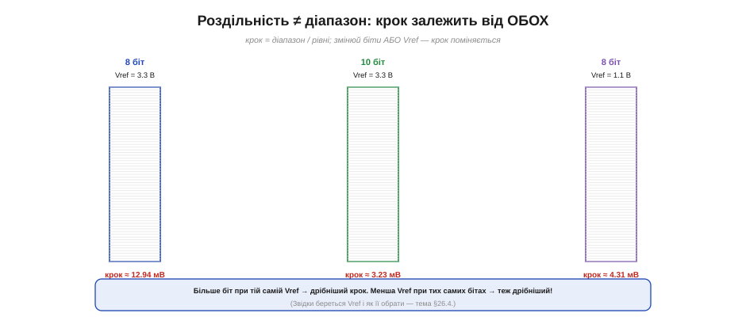
*Рис. 4.8.3.4. Крок = діапазон / рівні, тож на нього впливають дві різні речі. Більше біт за тієї самої Vref → дрібніший крок. Але й менша Vref за тих самих біт → теж дрібніший крок (бо ту саму кількість щаблів «упаковано» у вужчий діапазон). Звідки береться Vref — тема §4.8.4.*

Це означає, що дрібнішого кроку можна досягти **двома** шляхами: або додати біт, або звузити діапазон Vref. Якщо ви міряєте давач, що дає напругу лише 0…1 В, то, обмеживши Vref до ~1 В замість 3.3 В, ви втричі здрібните крок навіть без зайвих біт — бо ті самі 4096 рівнів ляжуть на вужчий діапазон. Це потужний прийом, але він тягне за собою питання, що ж таке ця опорна напруга й як її задають, — а це вже окрема тема (§4.8.4). Поки що головне: **не плутайте «скільки біт» (роздільність) із «до скількох вольтів» (діапазон)** — це різні ручки, що разом визначають крок.

З цього випливає й поширена помилка — **марнувати діапазон**. Якщо ваш давач видає щонайбільше 1 В, а АЦП міряє проти Vref = 3.3 В, то понад дві третини щаблів просто ніколи не задіються: сигнал тиснеться в нижню третину шкали, і реально вам дістається не 12, а лише близько 10 корисних біт. Підігнавши діапазон під сигнал — меншою Vref або підсиливши сам сигнал до повної шкали, — ви повертаєте собі ті втрачені біти майже задарма. Тому досвідчений розробник завжди питає не лише «скільки біт», а й «чи добре сигнал заповнює шкалу».

> 🔧 **Навіщо це.** Обираючи АЦП чи режим, рахуйте не біти, а **крок у вольтах**, бо саме він порівнюється з вашою потрібною точністю. Питання ставте так: «яку найменшу зміну напруги мені треба помітити?» — і доберіть біти й діапазон так, щоб крок був дрібніший за неї (із запасом). Часто звузити діапазон Vref під свій сигнал вигідніше, ніж ганятися за зайвими бітами.

### Поширені роздільності та ESP32

Корисно тримати в голові кілька орієнтирів — типові розрядності й те, де вони трапляються.


*Рис. 4.8.3.5. Орієнтири роздільності за Vref ≈ 3.3 В: 8 біт (256, ≈ 12.9 мВ) — прості МК; 10 біт (1024, ≈ 3.2 мВ) — Arduino Uno; **12 біт (4096, ≈ 0.81 мВ) — ESP32, STM32**; 16 біт (65 536, ≈ 50 мкВ) — точні вимірювання; 24 біти — аудіо й ваги. Кожні +2 біти дрібнять крок учетверо.*

АЦП у ESP32 — рідно **12-бітний**: `analogRead` за замовчуванням повертає число 0…4095. У коді розрядність задають так:

```
analogReadResolution(12);     // ESP32: рідні 12 біт (0..4095)
int n = analogRead(34);       // напр., 0…4095
```

Важлива чесна засторога: функція `analogReadResolution` лише змінює **ширину результату**, але не додає точності понад те, що вміє залізо. Попросите в ESP32 «16 біт» — він просто допише молодші нулі, а реальних щаблів так і лишиться 4096. Тож рідні 12 біт — це стеля справжньої роздільності цього АЦП; усе, що «більше», — косметика.

Варто звикнути читати АЦП у «сирих відліках» (англ. *counts*) — цілих числах 0…4095, — а переводити їх у вольти лише там, де справді треба. Для порівняння: класичний Arduino Uno на ATmega328 має 10-бітний АЦП (0…1023) із кроком близько 3.2 мВ на 3.3 В, тож ESP32 з його 4096 рівнями вже вчетверо точніший «з коробки». Це одна з тих дрібниць, через які навіть прості виміри на ESP32 виходять помітно чистішими, ніж на старших 8-бітних платах.

Не дивно, що саме 12 біт стали негласним стандартом сучасних мікроконтролерів: це золота середина. Крок під мілівольт уже задовольняє майже будь-який звичайний давач, а схема лишається простою, швидкою й дешевою. Менше було б відчутно грубо, а більше — здебільшого надмірно: зайві біти все одно потонули б у шумі звичайної плати. Тому, починаючи проєкт, 12 біт варто вважати розумним типовим вибором, від якого відштовхуються лише за особливої потреби.

> 🔧 **Навіщо це.** Не женіться за числом біт у даташиті як за магією: 12-бітний АЦП ESP32 дає чудовий крок ≈ 0.8 мВ, і для більшості давачів (температура, світло, напруга батареї) цього вдосталь. А якщо колись знадобиться по-справжньому тонше — мікровольти для термопари чи тензодавача, — беруть **зовнішній** 16- чи 24-бітний АЦП окремою мікросхемою, бо вбудований стелю вже не підніме.

### Скільки біт справді корисні: шум

Насамкінець — важлива правда, про яку даташити кажуть пошепки. Чим дрібніший крок, тим ближче він підходить до рівня власного **шуму** схеми — крихітних випадкових коливань напруги, що завжди є в реальному залізі. Коли крок стає меншим за шум, наймолодші біти перестають нести корисну інформацію: вони просто **миготять** від наведень, а не міряють сигнал.


*Рис. 4.8.3.6. Старші біти несуть сигнал, а кілька молодших «тонуть у шумі» й безладно миготять. Тому реально корисних біт (ENOB, *effective number of bits*) завжди менше за номінальні. Орієнтир: динамічний діапазон ≈ 6 дБ на біт (12 біт ≈ 72 дБ).*

Через це вводять поняття **ефективної кількості біт (ENOB, *effective number of bits*)** — скільки розрядів реально корисні, коли відкинути ті, що потонули в шумі. ENOB майже завжди менший за номінальну розрядність: 12-бітний АЦП на практиці може давати, скажімо, 10–11 «чесних» біт. Звідси й важливий висновок: нарощувати розрядність має сенс лише доти, доки крок не вперся в шум; далі зайві біти оцифровують саму лише тремтячу «травичку». Як зменшити цей шум і витиснути більше чесних біт (усереднення, екранування, правильне джерело) — теми §4.8.6 і §4.8.7; а корисний орієнтир запам'ятаймо вже: кожен біт додає близько **6 дБ** динамічного діапазону, тож 12 біт — це приблизно 72 дБ.

Практичний наслідок простий: **не довіряйте останнім цифрам** виміру наосліп. Якщо два сусідні читання АЦП відрізняються на одиницю-дві коду навіть за нерухомого входу — це і є той шум у молодших бітах, а не реальна зміна сигналу. Найдешевший спосіб відіграти частину втрачених біт — **усереднити** кілька читань: шум, бувши випадковим, частково взаємознищується, і результат стає стабільнішим. Докладніше про цей прийом — у темі про правильне зчитування сигналу далі в розділі.

**Приклад (роздільність 12-бітного АЦП ESP32).** Vref ≈ 3.3 В.

```
рівнів = 2¹² = 4096
крок (LSB) = 3.3 / 4095 ≈ 0.806 мВ
похибка квантування ≤ ½ LSB ≈ 0.40 мВ
динамічний діапазон ≈ 6.02 × 12 ≈ 72 дБ

Треба розрізняти зміну 1 мВ?
  крок ≤ 1 мВ  →  2ᴺ ≥ 3.3 / 0.001 = 3300  →  N ≥ 12 (4096 рівнів) ✓
8 біт дали б крок ≈ 12.9 мВ — для такої задачі замало.
```
Отже, 12 біт ESP32 розрізняють менш як мілівольт — рівно те, чого бракувало б 8-бітному АЦП. А коли хочеться ще дрібніше, згадайте: крок залежить не лише від біт, а й від опорної напруги — і ось вона якраз і є темою наступного кроку.

## 4.8.4 Опорна напруга (reference): проти чого міряє АЦП

Дотепер ми вільно писали у формулах «Vref», ніби це щось очевидне. Час придивитися до неї уважно, бо саме **опорна напруга (*reference voltage*, Vref)** — це та лінійка, якою АЦП міряє світ. Несподівана, але ключова правда: АЦП **не вміє** міряти вольти в абсолюті. Усе, що він робить, — порівнює вхідну напругу з опорною й каже, **яка вона частка** від неї. Тому Vref — це не дрібна технічна деталь, а сам зміст слів «повна шкала»: від її точності прямо залежить, чи означають ваші виміри хоч щось у вольтах.

### АЦП міряє відношення, а не вольти

Почнімо з найважливішого. Коли АЦП повертає код, він відповідає не на питання «скільки на вході вольтів?», а на питання «**яку частку** від Vref становить вхід?». Уся його формула — це відношення:

```
код = (Vin / Vref) × максимум
```

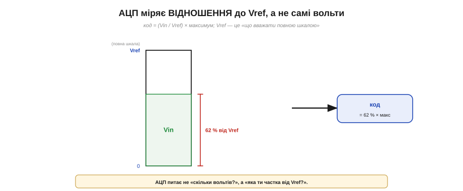
*Рис. 4.8.4.1. АЦП порівнює вхід з опорною напругою й видає їхнє відношення. Якщо Vin становить 62 % від Vref, то й код буде 62 % від максимуму. Перетворювач питає не «скільки вольтів?», а «яка ти частка від Vref?».*

Це пояснює, чому Vref така важлива. Машина повністю **довіряє** опорній напрузі: вона приймає її за істинну «повну шкалу» й усе міряє відносно неї. Якщо ви не знаєте Vref точно, то код у вас є, а перевести його в вольти ви не можете — бракує самої одиниці виміру. Це як міряти стіл лінійкою без поділок із числами: відношення («стіл — це три лінійки») ви бачите, а скільки то сантиметрів — ні, доки не знаєте довжини лінійки.

Можна сказати й так: усередині АЦП сидить не вольтметр, а **ваги**. На одну шальку кладуть вхідну напругу, на другу — відомі частки опорної (половину Vref, чверть, восьму…), і перетворювач зважує, якій комбінації цих часток вхід дорівнює. Результат завжди виходить у «частках Vref», ніколи в абсолютних вольтах. Тому-то опорна й вплетена в кожен код: вона буквально є набором гир, якими міряють, — і якщо гирі несправжні, то й вага брехлива.

### Та сама напруга, різний Vref — різний код

Щоб остаточно вкарбувати цю думку, погляньмо, що буде з тим самим входом за різних опорних напруг. Нехай на вході стабільні 0.55 В. Підставмо їх до АЦП спершу з Vref = 3.3 В, а потім з Vref = 1.1 В.

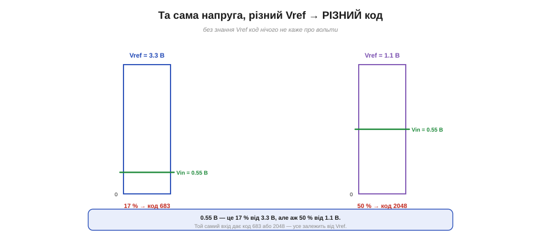
*Рис. 4.8.4.2. Один і той самий вхід — два різні коди. 0.55 В — це лише 17 % від 3.3 В (код ≈ 683), але аж 50 % від 1.1 В (код 2048). Без знання Vref код сам по собі не каже про вольти нічого.*

Отакої: незмінні 0.55 В обертаються то кодом 683, то кодом 2048 — лише через те, що ми оголосили «повною шкалою». Звідси два практичні висновки. По-перше, **код без відомої Vref безглуздий** як вимір напруги — це просто частка невідомо чого. По-друге, з рис. 4.8.4.2 видно й корисне: під вужчу Vref (тут — 1.1 В) той самий сигнал розкладається на більше щаблів, тобто міряється **точніше**. Це та сама ідея «підігнати діапазон під сигнал» із §4.8.3, тільки тепер ми бачимо її механізм — звуження Vref.

Тут варто з'єднати дві теми. У §4.8.3 ми вивели, що крок = діапазон / рівні; тепер ясно, що «діапазон» — це і є Vref. Отже, **звузити Vref — майже те саме, що додати біт**: і там, і там щаблі дрібнішають. Різниця в тім, що додавання біт здрібнює крок усюди, а звуження Vref — лише в межах нового, вужчого діапазону (усе, що поза ним, АЦП уже не побачить — код просто впреться в максимум). Тому раціональний порядок дій — спершу підігнати Vref під розмах сигналу, а вже потім, якщо треба, нарощувати біти.

### Vref — це лінійка, і вона має бути точною

Коли вся точність вимірювання впирається в одне число, до нього виникають суворі вимоги. Адже АЦП довіряє Vref **беззастережно**: він не має іншого еталона, щоб її перевірити. Тож якщо опорна напруга «попливе» — наприклад, від нагрівання чи просідання під навантаженням, — попливуть і **всі** виміри одразу, пропорційно до її помилки.

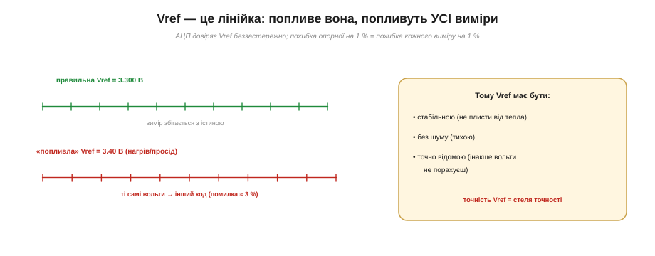
*Рис. 4.8.4.3. Vref — лінійка, якою АЦП міряє все. Якщо лінійка «розтягнулася» (наприклад, 3.30 → 3.40 В), то ті самі вольти на вході дадуть інший код, і кожен вимір збіжиться приблизно на 3 %. Похибка опорної прямо стає похибкою результату.*

Тому до опорної напруги три вимоги: вона має бути **стабільною** (не змінюватися від тепла, часу, навантаження), **тихою** (без шуму, що домішувався б до кожного відліку) і **точно відомою** (інакше код ні в що не перевести). Запам'ятаймо чітке правило: **точність Vref — це стеля точності всього АЦП**. Можна мати скільки завгодно біт, але якщо опорна гуляє на 2 %, то й кожен ваш вимір невірний на 2 % — і жодна роздільність цього не врятує.

Що ж змушує опорну «плисти»? Передусім **температура**: у дешевих джерел напруга помітно повзе на градусах (це характеризують температурним коефіцієнтом — скільки частин на мільйон, ppm, на °C). Далі — **навантаження**: коли від опорної тягнуть струм, вона трохи просідає (це звуть регуляцією під навантаженням). І нарешті — **шум** та наведення від сусідніх кіл, що домішуються до кожного відліку. Прецизійні джерела саме й коштують дорожче за те, що тримають свою напругу попри тепло, струм і час.

> 🔧 **Навіщо це.** Коли виміри «дивно плавають» або системно завищені/занижені, перша підозра — **опорна напруга**, а не сам АЦП. Поширений приклад: живити АЦП (і брати Vref) прямо від шумної цифрової шини, яку просідає Wi-Fi чи мотор. Рішення — або тиха, стабільна опорна, або раціометрична схема (про неї нижче), або калібрування. Пам'ятайте: АЦП ніколи не «бачить» вольтів — лише частку від Vref, тож усе ваше вимірювання настільки ж добре, як ця опорна.

### Звідки беруть Vref: три джерела

Звідки ж узяти добру опорну напругу? Є три типові шляхи, від найдешевшого до найточнішого.

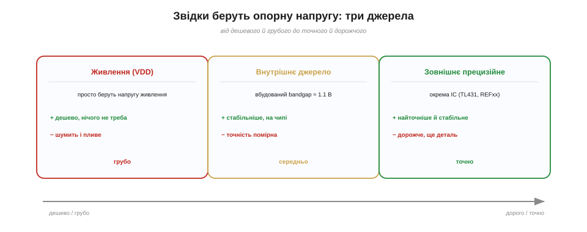
*Рис. 4.8.4.4. Три джерела Vref. Живлення (VDD) — дешево, та шумить і пливе. Внутрішнє джерело (bandgap ≈ 1.1 В) — стабільніше й уже в чипі. Зовнішня прецизійна мікросхема (TL431, серія REF) — найточніше, але це окрема деталь і витрати. Вибір — компроміс «дешево/грубо ↔ дорого/точно».*

Найпростіше — взяти за опорну саму **напругу живлення (VDD)**. Нічого додавати не треба, та біда в тому, що живлення рідко буває чистим: воно просідає під навантаженням і шумить, надто в платі з радіо чи моторами. Надійніше — **внутрішнє джерело** на кристалі, так зване **bandgap-джерело**: хитра схемка, що з фізики самого кремнію створює напругу близько 1.1–1.2 В, майже байдужу до температури. Вона стабільніша за живлення, хоч і не ідеально точна. А коли потрібна справжня метрологія, ставлять **зовнішню прецизійну опорну** — окрему мікросхему (класичний TL431 чи спеціальні мікросхеми серії REF), що тримає напругу з похибкою в частки відсотка. Багато АЦП (зокрема й класичний Arduino Uno) дають **обрати** джерело: живлення, внутрішні 1.1 В або зовнішній вивід AREF — під потрібну точність.

Варто на мить спинитися на bandgap-джерелі — це елегантна фізика. Воно складає докупи дві напруги з протилежним ходом від температури: одна з нагрівом росте, друга спадає, — і в сумі вони дають майже незмінні ~1.2 В. Звідси й назва: ця величина відповідає «ширині забороненої зони» (*bandgap*) кремнію — фундаментальній сталій матеріалу. Тому внутрішня опорна мікроконтролера куди стабільніша за живлення, хоч до прецизійної зовнішньої їй усе ж далеко: її точність обмежує неминучий розкид виробництва від чипа до чипа.

### Раціометрія: коли Vref може «гуляти»

А тепер — гарний трюк, що інколи звільняє від гонитви за ідеальною опорною. Він зветься **раціометричним вимірюванням (*ratiometric*)** і ґрунтується на тому, що АЦП міряє **відношення**. Ідея: якщо живити сам давач і опорну напругу від **одного й того самого** джерела, то його коливання скоротяться.

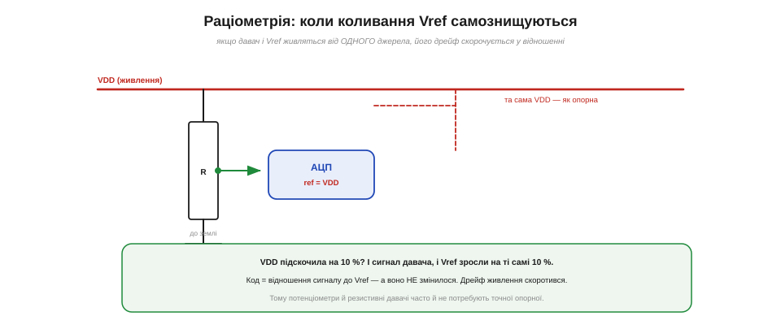
*Рис. 4.8.4.5. Раціометрія в дії. Потенціометр (чи резистивний давач) живиться від VDD, і та сама VDD є опорною для АЦП. Підскочила VDD на 10 % — на ті самі 10 % зросли і сигнал давача, і Vref. Та код є їхнім відношенням, а воно не змінилося. Дрейф живлення «самознищився».*

Розберімо чому. Нехай потенціометр стоїть між VDD і землею, а його повзунок — на вході АЦП, опорна ж теж дорівнює VDD. У середньому положенні повзунок дає рівно половину VDD. Якщо VDD підскочить — половина VDD підскочить так само, але й Vref зросте рівно настільки ж, тож **відношення** половини до повної VDD лишиться 0.5, і код не зрушить. Виходить, що нестабільність живлення для такої схеми просто **не існує** — вона скорочується в дробі. Саме тому потенціометри, резистивні подільники й чимало мостових давачів чудово працюють навіть від брудного живлення, не потребуючи точної опорної.

> 🔧 **Навіщо це.** Перш ніж шукати прецизійну опорну, спитайте: а чи не **раціометричний** мій давач? Якщо він живиться від того самого VDD, що й АЦП, і ви берете Vref = VDD, то стабільність живлення стає неважливою — і дешева шумна шина раптом цілком годиться. Це класичний прийом для потенціометрів, фоторезисторів у подільнику й тензомостів: не борися з дрейфом живлення, а **зший** із ним опорну — і дрейф зникне сам.

### Vref в ESP32: внутрішні ≈ 1.1 В і ослаблення

Тепер чесно зізнаймося в спрощенні, яким ми досі користувалися. Усюди вище ми писали «Vref ≈ 3.3 В» — і це зручна, але не точна картинка. Насправді опорна напруга АЦП в ESP32 — **внутрішня, близько 1.1 В**. Як же тоді він міряє входи аж до 3.3 В? За допомогою **ослаблення (*attenuation*)**: перед перетворювачем вхід пропускають через подільник, що зменшує його в кілька разів, аби ≈1.1-вольтова опорна «накрила» більший діапазон.

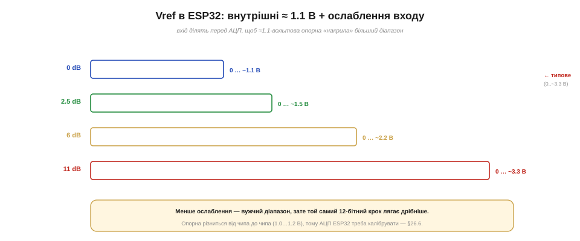
*Рис. 4.8.4.6. Як ESP32 розтягує діапазон. Внутрішня опорна ≈ 1.1 В, а ослаблення входу задає повну шкалу: 0 dB → ~1.1 В, 2.5 dB → ~1.5 В, 6 dB → ~2.2 В, 11 dB → ~3.3 В (типове). Менше ослаблення — вужчий діапазон, зате той самий 12-бітний крок лягає дрібніше.*

Ослаблення задають у коді — `analogSetAttenuation(ADC_11db)` (за замовчуванням саме 11 dB, тобто повна шкала ~3.3 В) або окремо для ніжки. Звідси й практичний висновок у дусі §4.8.3: якщо ваш сигнал не перевищує, скажімо, 1 В, виберіть менше ослаблення (0 чи 2.5 dB) — діапазон звузиться під сигнал, і ті самі 4096 щаблів дадуть **дрібніший крок**, тобто точніший вимір.

Через це на ESP32 радять брати напругу не сирим `analogRead`, а через `analogReadMilliVolts()`: ця функція сама застосовує заводську поправку опорної й повертає вже **мілівольти**, а не сирі відліки, — і робить це точніше, ніж множення на «3.3/4095» з голови. Ще варто знати, що крайні ділянки шкали ESP32 — біля нуля й біля максимуму — помітно **нелінійні**, тож сигнал краще тримати ближче до середини діапазону, де АЦП поводиться найчесніше. Та є й тонкість, яку чесно слід назвати: ця внутрішня опорна **різниться від чипа до чипа** — у когось 1.05 В, у когось 1.15 В, — тому «3.3 В» завжди приблизні, а сирі виміри ESP32 без поправки можуть бути на кілька відсотків неточні. Щоб це виправити, кожен чип **калібрують** (Espressif навіть зашиває індивідуальну опорну в чип на заводі), і функції на кшталт `analogReadMilliVolts()` уже враховують цю поправку. Як саме калібрування рятує точність — окрема тема далі в розділі (§4.8.6).

**Приклад (раціометрія проти абсолютного виміру).** Vref «гуляє» на 3 %; що буде?

```
Абсолютний вимір (опорна окремо від давача):
  Vref зсунувся 3.30 → 3.40 В (≈ +3 %)  →  кожен вимір занижений на ≈ 3 %
  напр., істинні 1.500 В прочитаються як ≈ 1.456 В — помилка є.

Раціометрія (давач і Vref від спільної VDD):
  VDD: 3.30 → 3.40 В;  повзунок 50 %: 1.65 → 1.70 В;  Vref: 3.30 → 3.40 В
  код = 1.70 / 3.40 × 4095 = 0.5 × 4095 = 2048  (як і було!)
  → дрейф живлення повністю скоротився.
```
Висновок простий: де можна — робіть вимір раціометричним, і вимоги до опорної різко слабшають; де ні — дбайте про стабільну, точну Vref, бо саме вона ставить стелю точності.

Отже, опорна напруга — це лінійка АЦП: він міряє лише частку від неї, тож її стабільність і точність прямо стають точністю результату, а звузивши її під сигнал, можна виграти роздільність задарма. Ми розібралися з усім, що стосується **значення** виміру — рівнями, кроком, опорною. Лишилося повернутися до другої осі, **часу**: як часто треба робити знімки, щоб не потрапити в халепу, про яку попереджала теорема дискретизації. Це — наступна тема.

## 4.8.5 Частота дискретизації, Найквіст, аліасинг (класична пастка)

Тепер — кульмінація осі **часу**. З §4.8.2 ми знаємо, що дискретизація бере знімки сигналу в рівні миті, а питання «як часто?» свідомо відклали. З історії розділу ми вже чули, що відповідь дала теорема дискретизації. Час перетворити цю відповідь на чітке правило — і побачити, що стається, коли його порушити. А стається підступна біда, яку звуть **аліасингом**: швидкий сигнал, знятий зарідко, безповоротно перевдягається в повільний і бреше про себе. Це класична пастка цифрових вимірів, тож розберімо її до дна.

### Частота дискретизації й межа Найквіста

Скільки знімків за секунду робить АЦП — це **частота дискретизації (*sampling rate*, fs)**. Інтуїція проста: що швидше змінюється сигнал, то частіше треба дивитися, аби встигнути за ним. Теорема дискретизації робить цю інтуїцію точною. Вона каже: щоб без утрат схопити сигнал, чия найвища частота дорівнює fmax, треба брати відліки **частіше ніж удвічі** за цю частоту:

```
fs  >  2 × fmax
```

Половину частоти дискретизації називають **частотою Найквіста (fs/2)** — це найвища частота, яку взагалі можна чесно передати за даної fs. Усе, що нижче за неї, АЦП ще здатний відновити; усе, що вище, — приречене.

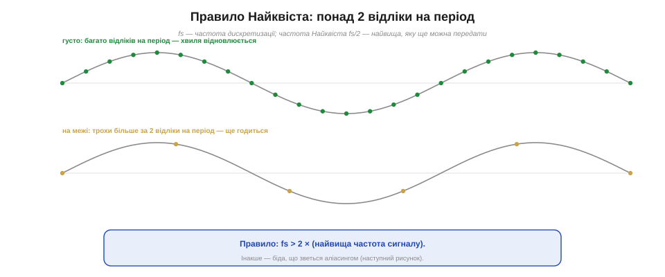
*Рис. 4.8.5.1. Те саме правило «з боку періоду»: на один період сигналу має припадати **більше ніж два** відліки. Густо (багато відліків на період) — хвиля впевнено відновлюється; на самій межі (трохи більше за два) — ще годиться. Менше двох — і починається аліасинг.*

Звідки та «двійка»? Щоб розрізнити коливання, треба впіймати і його «гору», і його «долину» — мінімум дві точки на період, а насправді трохи більше. Один відлік на період побачив би лише однакові точки й вирішив би, що сигнал стоїть на місці. Тому правило fs > 2·fmax — не примха, а абсолютний мінімум, нижче якого інформація про швидкі коливання просто не вміщається у відліки.

Чому саме «більше», а не «рівно» вдвічі? Бо на самій межі може не пощастити з фазою. Уявіть, що відліки випадково лягають точно на нулі синусоїди — на її переходи через середину: тоді всі знімки будуть нульові, і хвиля «зникне» зовсім, хоч за частотою ми її начебто «двома точками на період» і зловили. Саме тому беруть строго більше за дві точки на період, а на практиці — ще з добрим запасом, щоб жодна невдала фаза не змогла приховати сигнал.

### Аліасинг: коли хвиля бреше

Що ж буде, якщо порушити правило — брати відліки заповільно для наявних у сигналі частот? Тоді швидка хвиля «складеться» й прикинеться зовсім іншою, повільною. Це і є **аліасинг (*aliasing*, накладання)**.

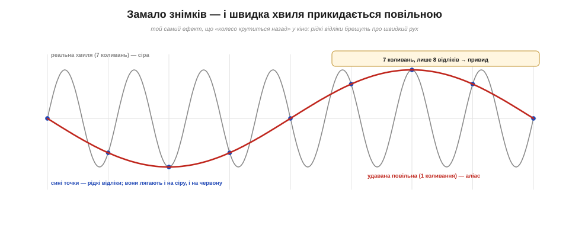
*Рис. 4.8.5.2. Сіра хвиля робить 7 коливань, але ми взяли лише 8 відліків. Сині точки лягають і на сіру швидку хвилю, і на червону повільну — тож із самих відліків сигнал видається повільним «привидом». Це той самий ефект, що «колесо їде назад» у кіно: кадри-знімки брешуть про швидкий обертовий рух.*

Це не абстракція, а явище, яке ми бачимо щодня. У кіно колеса возів та гвинти літаків часто «крутяться назад» або стоять — бо кадри камери є рідкими знімками, і швидке обертання між ними передається хибно. Стробоскоп «зупиняє» вентилятор за тим самим принципом. Аліасинг у АЦП — це рівно те саме, тільки для напруги: швидке коливання, не вловлене досить частими відліками, постає у даних повільним — і жодним чином не позначене як підробка.

Цей самий обман трапляється й там, де його найменше чекають. Сходи на відео іноді «течуть» угору-вниз, лопаті гелікоптера завмирають у повітрі, спиці велосипеда крутяться навспак — усе це аліасинг частоти кадрів проти швидкого руху. У вимірах він не менш підступний: оцифруєш вібрацію двигуна заповільно — і отримаєш у графіку гладеньку повільну хвилю, якої в реальності немає. Найгірше, що така хвиля виглядає абсолютно правдоподібно, тож хибу легко прийняти за відкриття.

### Механізм: дзеркало на fs/2

Щоб не лякатися аліасингу, а керувати ним, корисно знати, **куди саме** перевдягнеться зайва частота. Правило «складання» просте: частоти вище за Найквіста (fs/2) **відбиваються** від цієї межі, наче від дзеркала, і повертаються в діапазон нижче неї.

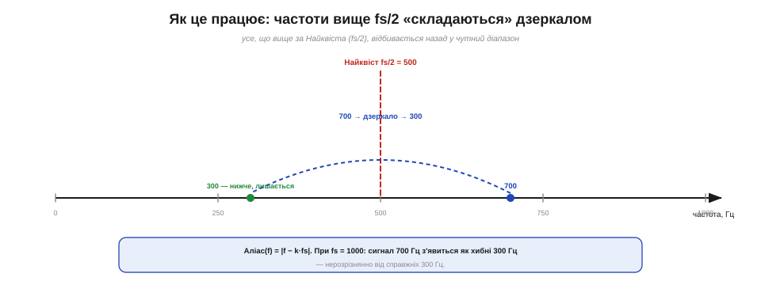
*Рис. 4.8.5.3. Частота Найквіста fs/2 — це «дзеркало». Сигнал нижче неї (300 Гц) лишається собою. А сигнал вище (700 Гц при fs = 1000) відбивається й з'являється як хибні 300 Гц — нерозрізнянно від справжніх. Загалом аліас(f) = |f − k·fs|.*

Числом це легко перевірити. Нехай fs = 1000 Гц, тоді Найквіст — 500 Гц. Сигнал на 700 Гц вищий за межу, тож складеться до 1000 − 700 = **300 Гц**. Сигнал на 900 Гц дасть хибні 100 Гц, на 1300 Гц — знову 300 Гц (1300 − 1000). Найгірше тут те, що аліас лягає **точно** на те місце, де міг би бути справжній сигнал: хибні 300 Гц від 700-герцового джерела нічим не відрізняються від чесних 300 Гц. Дзеркало не лишає підпису.

Глибша причина цього «дзеркала» така: дискретизація ніби **розмножує** спектр сигналу, створюючи його копії довкола кожної кратної fs частоти. Поки сигнал вміщається нижче за fs/2, копії стоять окремо й не заважають одна одній. Та щойно в ньому з'являються частоти вище за межу, сусідні копії **перекриваються** — і саме це накладання спектрів ми й бачимо як аліас (звідси і його друга назва — «накладання»). Знати цю механіку не обов'язково, щоб уникати пастки, але вона пояснює, чому межа пролягає саме по fs/2, а складання саме дзеркальне.

### Чому це пастка: аліас невиправний

І ось чому аліасинг звуть класичною пасткою, а не просто похибкою. Похибку квантування (§4.8.2) можна було хоч оцінити й зменшити; аліас же **неможливо виправити після оцифрування** — взагалі ніяк.


*Рис. 4.8.5.4. Усе, що зберіг АЦП, — це точки. Та сама множина точок однаково добре лягає і на швидку (сіру), і на повільну (червону) хвилю. З самих лише даних відновити, котра була насправді, **неможливо** — інформацію втрачено в мить дискретизації. Лишається тільки запобігати.*

Причина проста: у мить дискретизації швидка й повільна хвилі дали **однакові** числа, а різниця між ними просто не потрапила у відліки. Жоден найрозумніший алгоритм потім не відрізнить їх — бо в даних цієї різниці вже нема. Звідси найважливіший практичний висновок усієї теми: з аліасингом не борються постфактум — йому **запобігають** ще до АЦП. А способів запобігти два: зрізати зайві частоти фільтром і брати відліки досить часто.

Ця невиправність робить аліасинг особливо підступним у наукових і промислових вимірах. Бувало, що цілі набори даних доводилося викидати, бо в них «оселялася» низькочастотна осциляція, якої насправді не було, — складений аліас від невидимого швидкого шуму, який ніхто не подумав відфільтрувати. Тож звичка завжди ставити фільтр і брати запас за частотою — це не педантизм, а дешева страховка від тихо й непомітно зіпсованих даних.

### Лік: антиаліасинговий фільтр

Перший і головний лік — поставити перед АЦП **антиаліасинговий фільтр (*anti-aliasing filter*)**: аналоговий фільтр низьких частот, що зрізає все вище за fs/2 ще до того, як воно потрапить у пастку дискретизації. Якщо високих частот на вході вже немає, то й складатися нема чому.


*Рис. 4.8.5.5. Аналоговий ФНЧ (фільтр низьких частот) стоїть ПЕРЕД АЦП і зрізає все вище за fs/2. На спектрі: до фільтра був небезпечний ВЧ-шум, після — лишився тільки корисний НЧ-сигнал. Це той самий RC-фільтр, що й у §4.7.4, лише в новій ролі — захисника від аліасингу.*

Тут важливо побачити зв'язок із попереднім розділом: антиаліасинговий фільтр — це і є знайомий **RC-фільтр** із §4.7.4, тільки тепер його мета не згладити ШІМ, а захистити АЦП. І ще одна підступність, про яку легко забути: аліасинг небезпечний навіть тоді, коли **ваш сигнал повільний**. Бо в реальному світі поряд із повільним корисним сигналом завжди є **високочастотний шум** — наведення від радіо, мережі, моторів, імпульсних перетворювачів. Без фільтра цей ВЧ-шум складеться вниз і сяде просто в смугу вашого сигналу, безнадійно його зіпсувавши. Тому антиаліасинговий фільтр потрібен майже завжди, а не лише коли міряєш щось швидке.

Зверніть увагу на слово **аналоговий**. Фільтр мусить стояти до АЦП і бути зробленим із реального заліза — резистора з конденсатором, операційного підсилювача, — бо він має прибрати високі частоти, **поки вони ще є**, до фатальної миті дискретизації. Програмний фільтр у коді, хоч який хитрий, тут уже безсилий: він працює з числами, у яких аліас невідрізнянно змішаний із сигналом, і відділити одне від одного нема за чим.

> 🔧 **Навіщо це.** Запам'ятайте золоте правило: **фільтруй до того, як оцифровуєш**. Цифровий фільтр після АЦП від аліасингу вже не врятує — хибна частота на той момент невідрізнянна від справжньої. Тож якщо в сигналі можливий ВЧ-шум (а він можливий майже завжди), між джерелом і входом АЦП має стояти аналоговий ФНЧ із зрізом нижче за fs/2. Навіть простенький RC-фільтр (§4.7.4) — уже величезний крок проти аліасингу.

### Із запасом: передискретизація

Другий прийом — не скупитися на відліки. Теоретичний мінімум fs > 2·fmax на практиці беруть із добрим **запасом**; брати помітно більше називають **передискретизацією (*oversampling*)**.

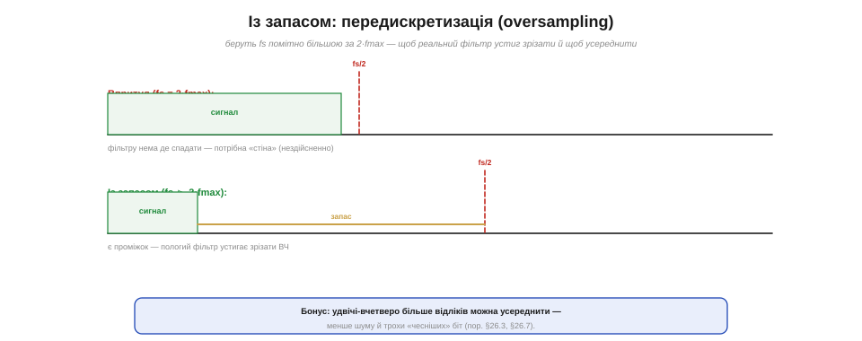
*Рис. 4.8.5.6. Чому беруть із запасом. Якщо fs рівно вдвічі за fmax, між сигналом і fs/2 немає проміжку — фільтр мусив би бути ідеальною «стіною», а таких не буває. Узявши fs значно більшою, ми лишаємо проміжок, де пологий реальний фільтр устигає зрізати ВЧ. Бонус: багато відліків можна усереднити — менше шуму.*

Передискретизація розв'язує одразу дві проблеми. По-перше, вона дає **простір реальному фільтру**: ідеального фільтра-стіни не існує, будь-який спадає поступово, тож йому потрібен проміжок між найвищою корисною частотою й межею Найквіста, де він устигне «дотиснути» зайве до нуля. По-друге, надлишок відліків можна **усереднити**: оскільки шум випадковий, усереднення кількох сусідніх вимірів частково його гасить, роблячи результат стабільнішим і навіть додаючи трохи «чесних» біт (згадаймо §4.8.3).

Виграш від усереднення піддається оцінці: шум спадає приблизно як корінь із кількості усереднених вимірів, тож, усереднивши чотири відліки, його зменшують удвічі, а кожне чотириразове передискретизування з усередненням додає приблизно один «ефективний» біт роздільності. Це майже безкоштовний спосіб витиснути з 12-бітного АЦП якість, ближчу до 13–14 біт, — звісно, ціною швидкості: ви віддаєте зайві відліки за чистоту. Тому передискретизація — улюблений прийом там, де сигнал повільний, а точність дорога. Докладніше про усереднення як прийом правильного зчитування — у наступних темах; тут важливо засвоїти принцип: **бери частоту дискретизації із запасом**, а не впритул.

> 🔧 **Навіщо це.** Частоту дискретизації добирають **від сигналу**, а не навмання. Міряєте повільну температуру (зміни за секунди)? Кількох відліків за секунду досить — куди важливіший антиаліасинговий фільтр від мережевих наведень. Ловите звук до кількох кілогерц? Беріть десятки тисяч відліків за секунду. Загальне правило: визнач найвищу потрібну частоту, помнож щонайменше на 2 (а краще на 4–10 для запасу) — і неодмінно постав фільтр перед АЦП.

Лишається питання, **чим** задають цю частоту. У мікроконтролері fs визначається тим, **як часто код викликає читання АЦП**, а рівність інтервалів забезпечує таймер (§4.6): саме він «цокає» через рівні проміжки й каже, коли брати наступний відлік. Якщо ж зчитувати абияк, у циклі без годинника, інтервали «гулятимуть», і вся теорія дискретизації попливе разом із ними — адже вона спирається на **рівний** крок у часі. Тому для серйозного вимірювання відліки беруть за таймером (на ESP32 — точним апаратним таймером або рівними `millis`-інтервалами, §4.6.5), а не «коли дійшли руки». Рівномірність у часі тут така сама важлива, як і рівні щаблі за рівнем.

**Приклад (вибір частоти й розрахунок аліаса).**

```
Звук, який чує людина: до ~20 кГц
  → fs > 2 × 20 = 40 кГц;  компакт-диск бере 44.1 кГц (запас ~10 %)

Нехай fs = 1000 Гц  → Найквіст = 500 Гц
  сигнал 300 Гц (нижче 500) → лишається 300 Гц ✓
  шум   700 Гц (вище 500)   → аліас |700 − 1000| = 300 Гц ✗
        сяде ПРЯМО в смугу сигналу — звідси й потреба у фільтрі < 500 Гц
```
Висновок: спершу вирішують, яка найвища потрібна частота, беруть fs удвічі-вчетверо більшою, а все зайве вище за fs/2 зрізають аналоговим фільтром ще до АЦП. Дотримаєш цих двох правил — і класична пастка тебе обмине.

Отже, вісь часу має своє суворе правило: дискретизуй частіше ніж удвічі за найвищу частоту, фільтруй усе зайве **до** АЦП і бери частоту із запасом — інакше швидкий сигнал безповоротно перевдягнеться в повільний. Ми розібрали обидві осі ідеального АЦП — і рівні, і час. Та реальний перетворювач має ще й власні **недосконалості**: він трохи бреше навіть у межах своєї шкали, і його доводиться калібрувати. Саме цим — похибками справжнього АЦП та їх виправленням — і займеться наступна тема.

## 4.8.6 Похибки реального АЦП і калібрування (нелінійність АЦП ESP32)

Дотепер ми малювали АЦП ідеальним: рівні щаблі, ідеально пряма залежність коду від напруги. Це було корисне спрощення — але саме спрощення. Справжній перетворювач трохи **бреше** навіть у межах своєї шкали: його сходинки не зовсім рівні, його пряма трохи зсунена, нахилена й вигнута. Добра новина в тім, що ці хиби — **системні**: вони повторюються від виміру до виміру, а отже, їх можна виміряти раз і потім **виправляти** — це й зветься калібруванням. У цій темі розберемо, які бувають похибки реального АЦП, чому АЦП ESP32 особливо непокірний, і як калібрування перетворює грубий вимір на точний.

### Ідеал був спрощенням

Почнімо з повної картини. Якщо накласти на ідеальну пряму «напруга → код» справжню характеристику АЦП, ми побачимо три види відхилень одразу: крива може починатися не з нуля (зсув), мати не той нахил (масштаб) і ще й вигинатися (нелінійність).

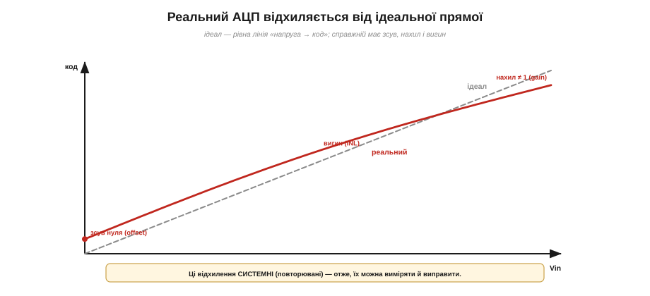
*Рис. 4.8.6.1. Сіра пунктирна — ідеальна пряма «напруга → код». Червона — реальна характеристика: вона починається вище за нуль (зсув), іде з іншим нахилом (масштаб) і вигинається (INL). Ключове: усі ці відхилення системні, тож їх можна виміряти й виправити.*

Похибки реального АЦП заведено розкладати на кілька окремих, добре названих складників — це той «бюджет похибок», яким оперують у даташитах. Дві з них **лінійні** (крива лишається прямою, тільки зсуненою чи нахиленою), а дві — **нелінійні** (крива перестає бути прямою). Розгляньмо їх по черзі, бо лікують їх по-різному.

Звідки взагалі ці хиби? З фізики виготовлення. Усередині АЦП напругу зважують набором елементів — резисторів чи конденсаторів, — і жоден із них не виходить із конвеєра ідеально точним: десь резистор на частку відсотка більший, десь конденсатор трохи менший. Ці крихітні неузгодженості й дають нерівні щаблі та вигин кривої. Додайте сюди неідеальний компаратор, мікроскопічні витоки струму, вплив температури — і стане зрозуміло, чому досконалої прямої не буває й бути не може. Питання лише в тім, наскільки відхилення мале й чи враховане воно.

### Зсув нуля й похибка масштабу

Найпростіші — дві лінійні похибки. **Зсув нуля (*offset error*)** означає, що вся характеристика зміщена паралельно: за 0 В на вході АЦП дає не код 0, а якесь маленьке число (або навпаки). **Похибка масштабу (*gain error*)** означає, що неправильний **нахил**: повної шкали коду перетворювач досягає не точно на Vref, а трохи раніше чи пізніше.

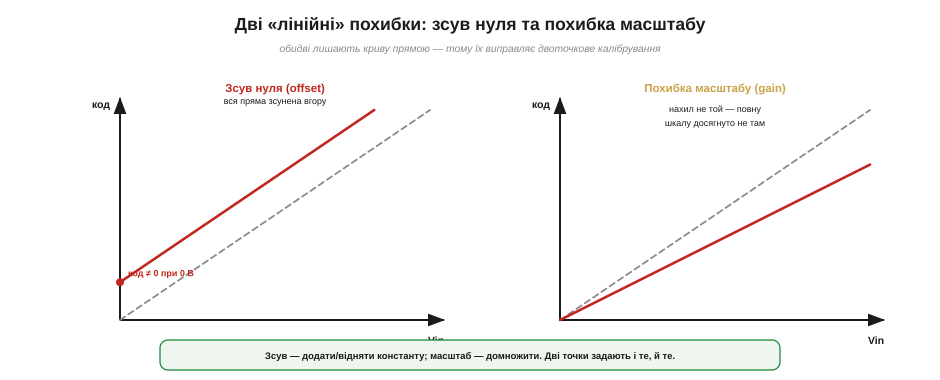
*Рис. 4.8.6.2. Дві лінійні похибки. Ліворуч — зсув нуля: пряма ціла, але піднята (код ≠ 0 за 0 В). Праворуч — похибка масштабу: пряма виходить із нуля, та нахил не той, тож повну шкалу досягнуто не там. Обидві лишають характеристику прямою — тому їх легко виправити.*

Чим хороші ці дві похибки — тим, що вони **лінійні**, а отже, виправляються елементарно: зсув прибирають, додавши чи віднявши константу, а масштаб — домноживши на поправковий коефіцієнт. Геометрично: щоб задати будь-яку пряму, досить **двох точок**. Тому, вимірявши реакцію АЦП на дві відомі напруги, ми відновлюємо і правильний зсув, і правильний нахил — і обидві лінійні похибки зникають. До цього ми ще повернемося, коли говоритимемо про двоточкове калібрування.

У даташитах ці похибки наводять у частках LSB або у відсотках повної шкали — і в добрих АЦП вони невеликі, одиниці LSB. Корисно знати їхній «характер»: зсув додає однакову помилку по всьому діапазону (а тому найпомітніший на **малих** сигналах, де він становить велику частку значення), тоді як масштаб росте до **верху** шкали, бо це похибка нахилу. Звідси проста діагностика: якщо ваші виміри систематично «з'їхали» біля нуля — підозрюйте зсув; якщо ж розходяться чимдалі більше до повної шкали — масштаб.

### Нелінійність: DNL і пропущені коди

Складніші — нелінійні похибки, де крива перестає бути прямою. Перша з них — **диференціальна нелінійність (*differential nonlinearity, DNL*)**: вона міряє, наскільки ширина **кожного окремого** щабля відрізняється від ідеального одного LSB. У реального АЦП щаблі трохи різні: одні ширші, інші вужчі.

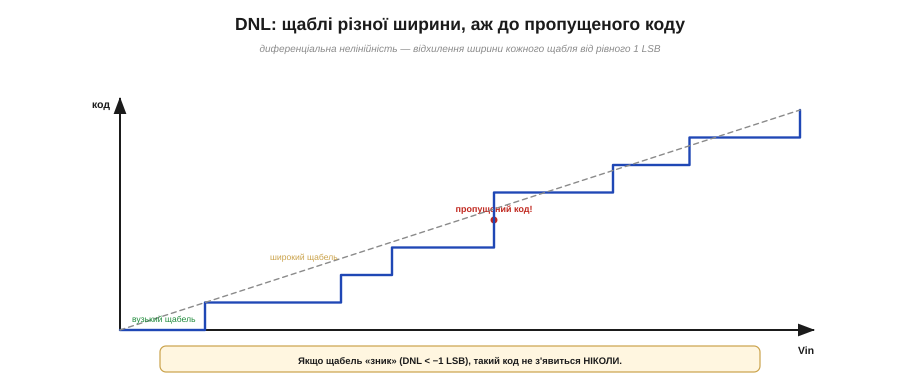
*Рис. 4.8.6.3. Диференціальна нелінійність: щаблі виходять різної ширини замість рівного 1 LSB. У крайньому разі щабель «схлопується» до нуля (DNL < −1 LSB) — і відповідний код не з'являється НІКОЛИ. Це зветься пропущеним кодом.*

Невелика DNL просто означає, що крок між сусідніми кодами трохи «дихає». Але якщо вона стає надто великою — менш як −1 LSB, — трапляється прикрий **пропущений код (*missing code*)**: певне значення АЦП не видає взагалі, перестрибуючи через нього. Тобто хоч би як плавно ви міняли напругу, деяких чисел на виході просто не буде. Це вже не косметична хиба: пропущений код — це безповоротно втрачена роздільність у тому місці шкали, і жодне калібрування його не «оживить», бо інформації там від початку немає.

### Нелінійність: INL — вигин кривої

Друга нелінійна похибка — **інтегральна нелінійність (*integral nonlinearity, INL*)**. Якщо DNL дивиться на кожен щабель окремо, то INL — на криву **загалом**: наскільки вся характеристика відхиляється від ідеальної прямої. Маленькі нерівності щаблів накопичуються, і пряма поволі **вигинається**.

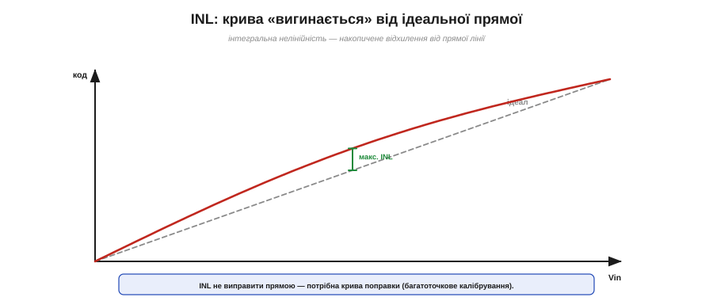
*Рис. 4.8.6.4. Інтегральна нелінійність: реальна крива плавно відходить від ідеальної прямої, найбільше — десь посередині шкали. INL — це найбільша така відстань. Прямою її не виправити: потрібна крива поправки, тобто багатоточкове калібрування.*

INL і є той «вигин», що ми бачили на загальній картині (рис. 4.8.6.1). Його підступність у тім, що його **не виправити** ні зсувом, ні масштабом — адже крива вже не пряма, її не випрямити, посунувши чи нахиливши. Щоб прибрати вигин, треба знати форму кривої в багатьох точках і будувати **криву поправки** — а це вже багатоточкове калібрування, складніше за двоточкове. Саме INL зазвичай і ставить межу справжньої точності АЦП, коли зсув та масштаб уже враховано.

І DNL, і INL у даташитах подають у частках LSB — наприклад, «INL ±2 LSB» означає, що крива ніде не відходить від ідеальної прямої більш як на два кроки. Причина обох — та сама неузгодженість внутрішніх елементів, що й вище: дрібні відмінності зважувальних резисторів чи конденсаторів накопичуються в плавний вигин (INL) і водночас дають нерівні окремі щаблі (DNL). Тому ці дві цифри — серед головних, на які дивляться, обираючи прецизійний АЦП: вони кажуть, наскільки можна довіряти його шкалі поза самими лише зсувом і масштабом.

### АЦП ESP32 особливо нелінійний

Тепер — чесна правда про конкретне залізо. Вбудований АЦП класичного ESP32 має репутацію **помітно нелінійного**, і це варто знати наперед, аби не дивуватися. Найгірше він поводиться **по краях** шкали: біля нуля крива «глуха» (малі напруги читаються неточно), а ближче до верху — «насичується» й завалюється.


*Рис. 4.8.6.5. Характеристика АЦП ESP32 далека від прямої: біля 0 В крива «глуха», а під стелею насичується. Надійна лише **середина** діапазону. Тому сигнал тримають подалі від країв (нижче за ~0.1 В і під самою стелею), а ще пам'ятають про розкид між окремими чипами.*

Складається ця непокірність із двох речей. По-перше, сама форма кривої нелінійна — звідси завали по краях. По-друге, як ми вже знаємо з §4.8.4, внутрішня опорна напруга в ESP32 **різниться від чипа до чипа** (1.0–1.2 В), що додає кожному екземпляру свій зсув і масштаб. Через усе це сире `analogRead` без поправки може помилятися на кілька відсотків — небагато для «темно/світло», та забагато для точного вимірювання напруги.

> 🔧 **Навіщо це.** Два прості правила рятують більшість вимірів на ESP32. Перше: **тримай сигнал у середині шкали** — не заводь на АЦП напруги, близькі до 0 чи до стелі, бо саме там крива бреше найбільше; за потреби підбери ослаблення (§4.8.4) так, щоб робочий діапазон сигналу ліг у надійну середину. Друге: **не довіряй сирому `analogRead` для точних вольтів** — бери відкалібровані значення (нижче побачимо як). Ці дві звички прибирають левову частку «чому мій ESP32 міряє неправильно».

А якщо навіть відкаліброваного вбудованого АЦП замало — скажімо, треба міряти милі- й мікровольти з тензодавача чи термопари, — на ESP32 чинять просто: ставлять **зовнішній** АЦП окремою мікросхемою (популярні 16-бітний ADS1115 чи 24-бітні для ваг), що спілкується з контролером цифровою шиною. Такі мікросхеми й лінійніші, і тихіші, і мають власну точну опорну. Це той самий висновок, що й у §4.8.3: коли впираєшся в стелю вбудованого перетворювача, точність докуповують зовнішнім.

### Калібрування: одно-, дво- й багатоточкове

Як же виправляють системні похибки? Калібруванням — тобто вимірюванням реакції АЦП на **відомі** напруги й побудовою поправки. Глибина калібрування буває різна, залежно від того, які похибки треба прибрати.

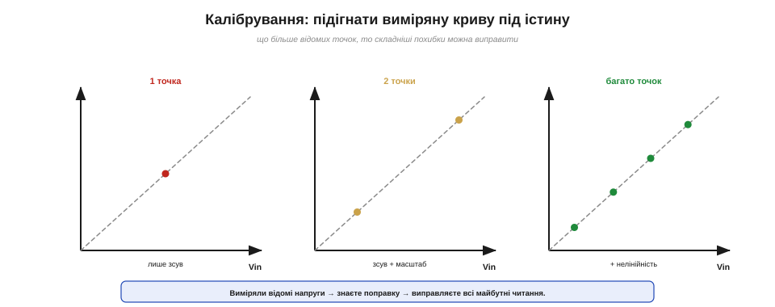
*Рис. 4.8.6.6. Три рівні калібрування. Одна точка прибирає лише зсув. Дві точки задають пряму — отже, виправляють і зсув, і масштаб. Багато точок дають криву поправки, що бере й нелінійність (INL). Що більше відомих точок, то складніші похибки можна виправити.*

**Одноточкове** калібрування використовує одну відому напругу (часто — нуль) і прибирає лише **зсув**: дізнавшись, що за 0 В АЦП дає, скажімо, код 20, ми надалі віднімаємо ці 20 з кожного читання. **Двоточкове** — найпопулярніше: подавши дві відомі напруги (одну ближче до низу, другу до верху шкали), ми проводимо через них пряму й тим самим виправляємо **і зсув, і масштаб** одразу. Цього досить, поки головні похибки лінійні. А коли заважає вже **нелінійність** (INL), переходять до **багатоточкового** калібрування: міряють багато відомих напруг по всій шкалі й будують **таблицю** чи криву поправки, що випрямляє вигин. Чим більше точок — тим складніші похибки під силу прибрати, але тим марудніша й сама процедура.

Знайдені поправки десь зберігають, щоб не калібрувати щоразу при ввімкненні: зазвичай — у незмінній пам'яті (флеш, NVS), звідки код читає їх при старті. Варто пам'ятати й те, що калібрування не вічне: характеристика трохи повзе з **температурою** і повільно старіє з роками, тож особливо відповідальні прилади періодично перекалібровують — а дешеві побутові живуть на заводській поправці все життя. Для аматорських вимірів зазвичай досить раз зняти поправку — і спокійно нею користуватися.

### Калібрування ESP32: eFuse і `analogReadMilliVolts`

На щастя, для ESP32 більшу частину цієї роботи вже зробив виробник. Espressif калібрує **кожен чип на заводі** й зашиває його індивідуальні поправки (зокрема справжню опорну напругу) у спеціальну незмінну пам'ять — **eFuse**. А функція `analogReadMilliVolts()` (та нижчий рівень `esp_adc_cal`) сама читає ці заводські дані, застосовує поправку й повертає вже **відкалібровані мілівольти** замість сирих відліків.

> 🔧 **Навіщо це.** Практичний висновок короткий: для точних вимірів на ESP32 беріть `analogReadMilliVolts(pin)`, а не `analogRead(pin)` з ручним множенням на «3.3/4095». Перша враховує заводське калібрування конкретного чипа й дає на кілька відсотків точніший результат буквально задарма. А якщо вам потрібна точність, ще вища за заводську, — додайте власне двоточкове калібрування під свій сигнал: виміряйте дві відомі напруги й випряміть характеристику самі.

### Чого калібрування не виправить

Насамкінець — важлива межа. Калібрування лікує **системні** похибки: ті, що повторюються й однакові щоразу (зсув, масштаб, навіть вигин). Але воно безсиле проти **випадкового** — проти шуму, що з кожним читанням різний. Шум не має сталої поправки, бо непередбачуваний; його приборкують іншим прийомом — **усередненням** багатьох вимірів, про що йтиметься в наступній темі. Так само калібрування не «оживить» пропущені коди (їхньої інформації немає від початку) і не прибере похибку квантування (це вроджена межа, §4.8.2). Коротко: калібрування випрямляє те, що криве **завжди однаково**, а з тим, що **тремтить** випадково, борються вже усередненням.

**Приклад (двоточкове калібрування АЦП).** Подаємо дві відомі напруги й будуємо пряму поправки.

```
подаємо 0.500 В → АЦП дає код 600   (мав би ≈ 620 — є зсув і масштаб)
подаємо 2.500 В → АЦП дає код 3000

пряма поправки:
  V = 0.500 + (2.500 − 0.500) × (код − 600) / (3000 − 600)
  V = 0.500 + 2.000 × (код − 600) / 2400

перевірка: код 1800 → V = 0.500 + 2.000 × 1200 / 2400 = 1.500 В
```
Двох відомих точок вистачило, щоб прибрати і зсув, і масштаб одним виразом. Якби заважав ще й вигин (INL), додали б третю, четверту точку — і будували б уже криву.

Отже, реальний АЦП — не ідеальна пряма: він має зсув, масштаб і нелінійність (DNL, INL), а ESP32 ще й особливо непокірний по краях і різний від чипа до чипа. Та оскільки всі ці хиби системні, їх знімає калібрування — від простого зсуву до повної кривої поправки, а на ESP32 здебільшого вистачить заводської через `analogReadMilliVolts`. Лишився останній бік справи — **випадковий** шум і правильна процедура зчитування, яких калібрування не бере. Як читати АЦП так, щоб результат був чистим і стабільним, — про це наступна тема.

## 4.8.7 Як правильно зчитати сигнал (усереднення; антиаліас; імпеданс джерела)

Ми вже знаємо, як АЦП влаштований і де він бреше. Тепер — практичне **ремесло**: як насправді зняти чистий, надійний відлік, а не «що вийде». Бо той самий АЦП у недбалих руках дає тремтливе сміття, а в дбайливих — стабільне число до молодшого біта. У цій темі зберемо докупи прийоми чистого вимірювання: **усереднення** проти шуму, правильний **імпеданс джерела** (чи не найчастіша причина загадкових помилок), **усталення**, антиаліас — і нарешті єдиний рецепт, що в'яже все це разом.

### Усереднення: лік від випадкового шуму

Почнімо з найдешевшого й найкориснішого прийому. Калібрування (§4.8.6) прибирало **системні** похибки, але проти **випадкового** шуму воно безсиле — бо шум щоразу інший, сталої поправки для нього нема. Зате в шуму є слабке місце: він **випадковий**, тобто однаково часто штовхає вимір угору й униз. Тож якщо зчитати АЦП багато разів і **усереднити**, ці поштовхи частково взаємознищаться, і середнє ляже куди ближче до істини, ніж будь-яке окреме читання.

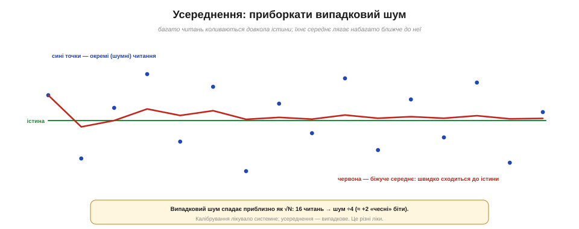
*Рис. 4.8.7.1. Окремі читання (сині) розкидані довкола істинного значення. Їхнє біжуче середнє (червона) швидко сходиться до істини. Випадковий шум спадає приблизно як √N: 16 читань зменшують його вчетверо — наче додалося два «чесні» біти.*

Виграш піддається оцінці: шум спадає приблизно як **корінь** із кількості усереднених вимірів. Усереднили 4 читання — шум удвічі менший; 16 — учетверо (а це ще десь два «ефективні» біти роздільності); 100 — у десять разів. Закон кореня, щоправда, скупуватий: щоб зменшити шум удесятеро, треба аж сто читань, тож без міри нарощувати їх немає сенсу — лише гаєш час. Зазвичай беруть розумні 4–64 відліки, залежно від того, наскільки тихий результат потрібен.

Чому саме корінь? Бо незалежні випадкові поштовхи складаються не прямо, а «по діагоналі» — у квадратах: половина тягне вгору, половина вниз, і сумарне відхилення росте повільніше за саму їх кількість. Звідси й головний компроміс: усереднення завжди **міняє швидкість на чистоту**. Кожен зайвий відлік — це час, тож для швидкозмінних сигналів багато не усереднеш. Для неперервного ж потоку зручне «біжуче середнє»: тримати ковзне вікно останніх N відліків і весь час оновлювати їхнє середнє, не чекаючи цілої пачки.

> 🔧 **Навіщо це.** Усереднення — перше, що варто додати, коли виміри «тремтять» в останніх цифрах. Кілька рядків коду: зчитати АЦП N разів у циклі, скласти, поділити на N — і шум помітно вщухне. Пам'ятайте поділ праці: **калібрування** випрямляє те, що криве завжди однаково, а **усереднення** гасить те, що тремтить випадково. Разом вони й дають чистий, точний відлік; поодинці кожне лишає половину біди.

### Медіана: коли заважають викиди

Усереднення чудове проти рівномірного «трав'яного» шуму, та має слабину: один великий **викид** — раптова іскра, перемикання потужного навантаження — здатний помітно потягнути середнє за собою. На такий випадок є стійкіший прийом — **медіана**: вишикувати кілька читань за зростанням і взяти те, що стоїть посередині. Викид опиниться скраю шеренги, і на серединне значення він майже не вплине.

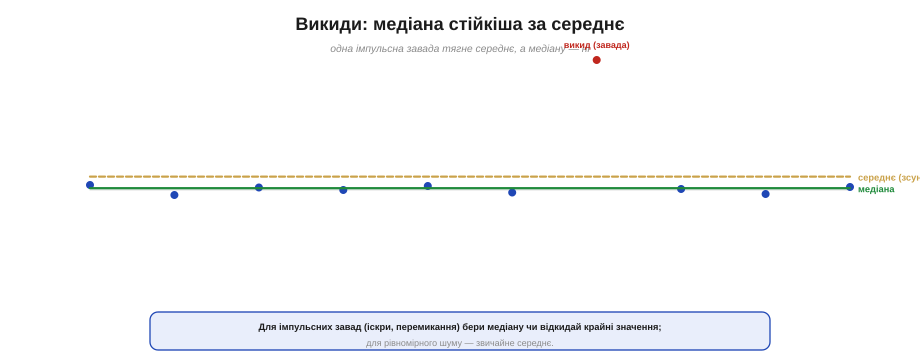
*Рис. 4.8.7.5. Одна імпульсна завада (червона точка) помітно тягне **середнє** (жовта лінія), а **медіану** (зелена) лишає на місці. Для імпульсних завад беруть медіану чи відкидають крайні значення; для рівномірного шуму досить звичайного середнього.*

Звідси проста настанова: знаєте, що в системі бувають різкі поодинокі завади (реле, двигуни, іскріння), — фільтруйте **медіаною** або відкидайте кілька найбільших і найменших значень перед усередненням. Якщо ж шум рівний і дрібний, без викидів, звичайне середнє і простіше, і не гірше. Часто поєднують обидва: спершу медіаною прибирають викиди, потім усереднюють решту для гладкості.

### Імпеданс джерела: чому «кволе» джерело бреше

А тепер — найпідступніша й найменш очевидна причина хибних вимірів, через яку згаяно безліч годин. Згадаймо семпл-холд із §4.8.2: щоб узяти знімок, АЦП на мить замикає ключ і **заряджає** свій крихітний конденсатор до напруги входу. Та заряд тече не миттєво — він мусить **протекти крізь опір джерела**. І якщо джерело «кволе», тобто має великий внутрішній опір, конденсатор просто **не встигає** зарядитися до правди за відведене коротке вікно виміру.

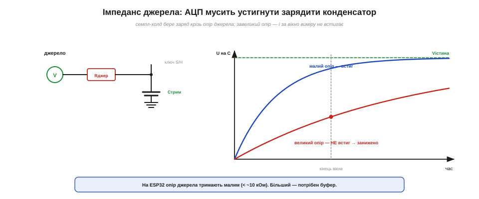
*Рис. 4.8.7.2. АЦП заряджає свій конденсатор семпл-холду крізь опір джерела. Малий опір джерела — конденсатор устигає набрати істинну напругу (синя крива). Великий — за вікно виміру він не доходить до правди (червона), і АЦП повертає **занижене** значення.*

Наслідок дуже характерний: вимір виходить **систематично заниженим**, і то тим сильніше, чим вищий опір джерела й чим швидше АЦП намагається міряти. Класична пастка — завести на АЦП сигнал просто з виходу високоомного подільника (з резисторів у сотні кілоом чи мегаоми) і дивуватися, чому напруга «недобирає». На ESP32 для надійного виміру опір джерела радять тримати **малим — приблизно до 10 кОм**; що більший, то гірше. Лікують це трьома способами: зменшити опір самого джерела, дати АЦП **довше** вікно захоплення (де можливо) — або поставити **буфер**.

Глибша причина — та сама, що й час захоплення з §4.8.2: конденсатор заряджається зі сталою часу, пропорційною опору джерела, тож великий опір розтягує заряд далеко за коротке вікно виміру. Є й другий, тонший бік: вхід АЦП сам потроху «підтікає» (має малесенький струм витоку), і на дуже високому опорі джерела навіть цей крихітний струм створює відчутне падіння напруги. Тому мегаомні джерела підступні **подвійно** — і повільні в заряді, і чутливі до витоку; обидві біди знімає той самий буфер.

> 🔧 **Навіщо це.** Якщо вимір **систематично занижений** (а калібрування й усереднення не допомагають) — підозрюйте надто **високий опір джерела**. Найшвидша перевірка: тимчасово під'єднайте до входу АЦП щось завідомо низькоомне (свіжу батарейку через подільник на кілька кілоом) — якщо «недобір» зник, винен був імпеданс. І не вішайте АЦП прямо на подільник із мегаомних резисторів: або зменшіть номінали, або поставте буфер (нижче).

### Буфер: посередник для високоомного джерела

Коли джерело за природою високоомне (а таких чимало — багато давачів, подільники для економії струму), його не змусиш віддавати заряд швидко. Розв'язок — поставити між ним і АЦП **буфер**, тобто операційний підсилювач у режимі **повторювача (*voltage follower*)**.

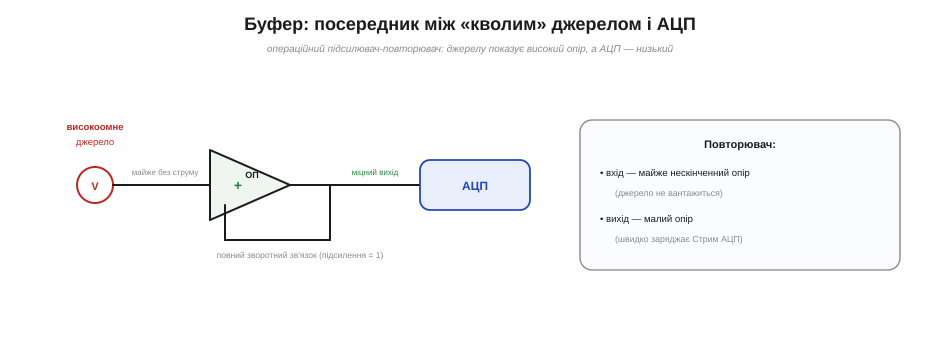
*Рис. 4.8.7.3. Повторювач на операційному підсилювачі — ідеальний посередник. Своїм входом він показує джерелу **майже нескінченний** опір (тож не вантажить його й не спотворює напруги), а виходом дає АЦП **низькоомне**, «міцне» джерело, що вмить заряджає конденсатор семпл-холду. Напруга на виході дорівнює вхідній (підсилення 1).*

Працює це красиво. Вхід операційного підсилювача майже не бере струму, тож для кволого джерела повторювач — наче й не навантаження зовсім: напруга на ньому не просідає. А вихід підсилювача, навпаки, **міцний** — низькоомний, здатний швидко віддати заряд, — тож конденсатор АЦП він заповнює миттєво. Підсилення такого ввімкнення дорівнює одиниці (звідси й назва «повторювач»): він не змінює напругу, лише **«перепаковує» її в низький опір**, зручний для АЦП. Це стандартний прийом усюди, де треба зміряти високоомне джерело без спотворень.

На практиці буфер і антиаліасинговий фільтр часто стоять поряд: спершу RC-фільтр згладжує сигнал, а тоді повторювач «перепаковує» його в низький опір для АЦП — або, навпаки, буфер ставлять перед фільтром, щоб саме коло фільтра не вантажило високоомне джерело. Порядок добирають під схему, та разом ці двоє — фільтр і буфер — закривають більшість бід аналогового входу.

### Дай йому час: усталення

Ще одна практична дрібниця, що рятує від загадкових перших значень. Конденсатор семпл-холду тримає **попередню** напругу, аж поки не набере нову. Тому одразу після того, як ви **перемкнули канал** АЦП на інший вхід (або щойно ввімкнули пристрій), перший відлік може бути ще «застряглим» — сумішшю старого й нового.

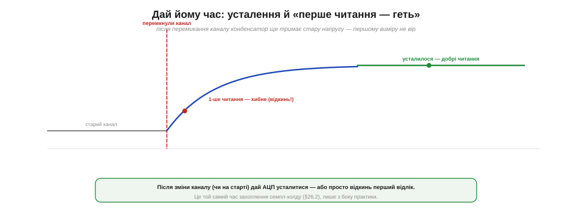
*Рис. 4.8.7.4. Після перемикання каналу конденсатор семпл-холду ще тримає стару напругу й переходить до нової не миттєво. Перше читання в цей момент — хибне; його просто **відкидають**, а беруть наступні, коли напруга вже усталилася. Це той самий час захоплення (§4.8.2), лише з боку практики.*

Лік простий і дешевий: після зміни каналу або на старті дайте АЦП **трохи усталитися** — зробіть один «холостий» вимір і **відкиньте** його, а до діла беріть уже наступні. Це той самий час захоплення семпл-холду, про який ми говорили в §4.8.2, лише побачений з практичного боку. Звичка «перше читання — геть» коштує одного зайвого виклику, а позбавляє цілого класу примарних помилок, які інакше з'являються «через раз».

Найчастіше це кусає там, де один АЦП обслуговує **кілька** входів по черзі через вбудований перемикач (мультиплексор): зчитав канал А, перемкнувся на Б — а конденсатор ще пам'ятає напругу А. Саме в таких схемах звичка відкидати перше читання після кожного перемикання стає обов'язковою, інакше канали «протікають» один в одного, і виміри плутаються між собою — особливо підступно, бо помилка залежить від того, який канал читали попереднім.

### Антиаліас і достатня частота

Нарешті, не забуваймо двох правил **часу** з §4.8.5, бо вони теж частина чистого зчитування. По-перше, якщо в сигналі можливий високочастотний шум (а він можливий майже завжди), між джерелом і АЦП має стояти **антиаліасинговий RC-фільтр** (§4.7.4), щоб зайві частоти не склалися вниз у вашу смугу. По-друге, відліки треба брати **досить часто** (fs понад подвоєну найвищу частоту сигналу) і **рівномірно** — за таймером, а не «коли дійшли руки». Ці дві речі ми вже розібрали докладно; тут вони входять у загальний рецепт як обов'язкові ланки.

Варто лише пам'ятати, що антиаліасинговий RC-фільтр має й зворотний бік: він **сповільнює** реакцію входу — що сильніше згладжуєш, то повільніше встигаєш за змінами сигналу. Тому зріз фільтра ставлять нижче за fs/2, але не надто низько, щоб не «з'їсти» сам корисний сигнал. Це той самий знайомий компроміс «гладкість проти швидкості», що й в усередненні, — тільки тепер у залізі, а не в коді.

Сюди ж належить і охайний **монтаж**: тримати доріжку до входу АЦП короткою й подалі від шумних кіл (силових ключів, радіо), а землю вести «зіркою» до спільної точки. Жоден фільтр не врятує, якщо наведення лізе просто у вхід, минаючи його. Чистий вимір починається з чистої землі — про це легко забути, ганяючись за бітами в коді.

### Повний рецепт чистого виміру

Зберімо все докупи. Надійний відлік — це не один виклик `analogRead`, а маленький **конвеєр**, де кожна ланка прибирає свою біду.

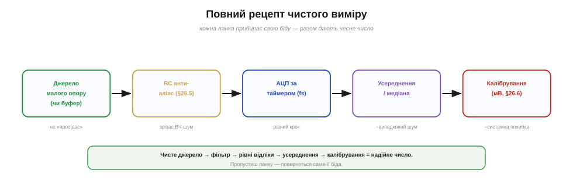
*Рис. 4.8.7.6. Рецепт чистого виміру. Низькоомне джерело (чи буфер) — щоб не «просідало»; RC-антиаліас — зрізати ВЧ-шум; АЦП за таймером — рівний крок у часі; усереднення/медіана — проти випадкового шуму; калібрування — проти системної похибки. Пропустиш ланку — повернеться саме її біда.*

Кожна ланка цього конвеєра відповідає за свою з пройдених тем: **джерело малого опору або буфер** дбає, щоб конденсатор устигав зарядитися; **RC-антиаліас** і **достатня fs за таймером** рятують від аліасингу (§4.8.5); **усереднення чи медіана** гасять випадковий шум; **калібрування** (на ESP32 — просто `analogReadMilliVolts`, §4.8.6) прибирає системні зсув, масштаб і нелінійність. Жодна ланка не зайва: пропустиш — і саме її біда повернеться у вимір. Звісно, для грубого «світло/темно» вистачить і голого `analogRead`; та коли треба чесні вольти, проходять увесь рецепт.

Головне — не плутати, де яка ретельність потрібна. Для індикатора «світло/темно» чи «ручку покрутили» досить сирого читання й, може, легкого усереднення — городити буфери й калібрування тут марно. А для вимірювача напруги, ваг чи термометра кожна ланка рецепта на своєму місці. Мудрість не в тім, щоб завжди робити максимум, а в тім, щоб **дібрати зусилля під задачу** — і знати, яка ланка від якої біди рятує, коли результат таки «попливе».

**Приклад (усереднення та опір джерела).**

```
Усереднення: окреме читання має шум σ ≈ 3 LSB
  N = 16  →  шум σ/√16 = 3/4 = 0.75 LSB  (≈ +2 «чесні» біти)
  N = 64  →  3/8 ≈ 0.38 LSB

Опір джерела: конденсатор S/H заряджається зі сталою часу τ = R · C
  (R — опір джерела, C — ємність конденсатора семпл-холду)
  мале R (~ кОм)  → τ крихітна, встигає за вікно виміру ✓
  велике R (~ МОм) → τ велика, НЕ встигає → занижено ✗  → потрібен буфер
```
Два прийоми, дві різні біди: усереднення б'є по випадковому шуму, низький опір джерела (чи буфер) — по систематичному недобору від кволого джерела. Разом із калібруванням і антиаліасом вони й роблять вимір таким, якому можна вірити.

Отже, правильне зчитування — це маленький конвеєр звичок: тримай джерело низькоомним (інакше — буфер), став антиаліасинговий фільтр, бери відліки рівно й досить часто, усереднюй проти шуму, відкидай перший відлік після перемикання й переводь у вольти відкаліброване значення. Ми пройшли весь шлях аналогового входу — від ідеї перетворення до чистого числа. Лишилося зазирнути **всередину** самого перетворювача: якими хитрощами залізо насправді знаходить код для напруги. Цим — типами АЦП — і завершиться розділ.

## 4.8.8 Типи АЦП: SAR, дельта-сигма

Увесь розділ ми вважали АЦП «чорною скринькою», що якось знаходить найближчий щабель для напруги. Час відкрити цю скриньку: **як саме** залізо це робить? Виявляється, єдиного способу нема — є кілька різних **архітектур**, і кожна обирає свій компроміс між швидкістю, роздільністю й ціною. Дві з них правлять світом мікроконтролерів: **SAR** — невтомний робочий кінь (саме він в ESP32) — і **дельта-сигма** — спеціаліст із високої точності. Розберімо обидві, а заразом коротко глянемо на крайнощі — найшвидший Flash і конвеєрний. Це не лише цікаво «як влаштовано»: знаючи тип АЦП, ви розумієте його сильні й слабкі сторони наперед.

### Немає єдиного способу: компроміс швидкість ↔ роздільність

Перше, що варто засвоїти: **ідеального** АЦП не буває. Швидкість і роздільність тягнуть конструктора в різні боки — зробити і дуже швидко, і дуже точно, і дешево одночасно неможливо. Тому кожна архітектура сідає у свій кут цього компромісу.

Чому ж швидкість і точність ворогують? Бо більше біт — це або більше **кроків** (як зважувань у SAR), або більше **усереднення** (як у дельта-сигми), а і те, і те коштує часу. До того ж дрібніший крок дедалі ближче підходить до власного **шуму** схеми (§4.8.3), і щоб його подолати, доводиться міряти повільніше й ретельніше. Тож «швидко та точно водночас» упирається у саму фізику, а не лише в гроші, — і кожна архітектура обирає, чим саме пожертвувати.

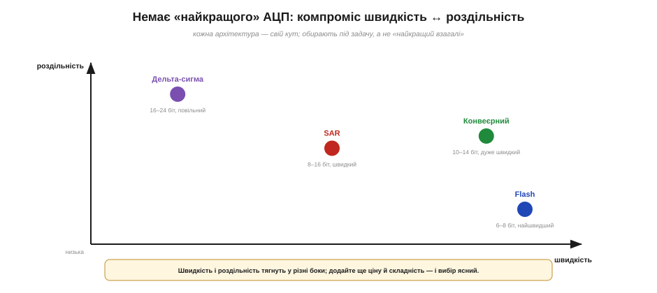
*Рис. 4.8.8.1. Чотири головні архітектури в координатах «швидкість ↔ роздільність». Дельта-сигма — повільний, та дає 16–24 біти; Flash — найшвидший, але 6–8 біт; SAR — золота середина; конвеєрний — швидкий і доволі точний. «Найкращого взагалі» нема — є найкращий під задачу.*

Ця картина одразу пояснює, чому в різних пристроях стоять різні АЦП. В осцилографі головне — **швидкість** (зловити наносекундні фронти), і роздільністю там жертвують. У вагах чи цифровому термометрі головне — **точність**, а міряти можна повільно. У мікроконтролері загального призначення треба «всього потроху» й дешево — звідси й компромісний вибір. Тримаючи цей трикутник у голові, легко передбачити, який АЦП де доречний.

### SAR: зважування за двійковим пошуком

Найпоширеніша в мікроконтролерах архітектура — **SAR (*successive approximation register*, регістр послідовного наближення)**. Її ідея — це чистий **двійковий пошук**, той самий, що й у грі «вгадай число»: спершу питаємо про найбільший розряд, тоді про менший, і так звужуємо відповідь.

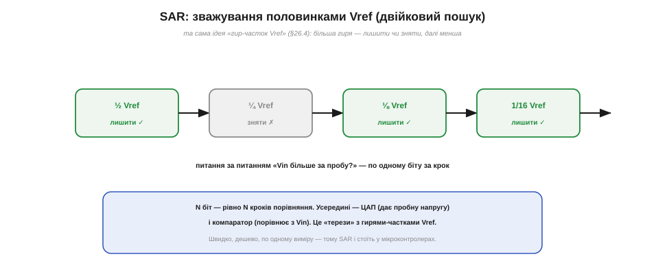
*Рис. 4.8.8.2. SAR зважує вхід «гирями»-частками Vref: спершу пробує ½ Vref (лишити чи зняти?), тоді ¼, ⅛… — по одному біту за крок. Усередині — ЦАП (видає пробну напругу) і компаратор (порівнює її з Vin). Це буквально терези з гирями-частками опорної (пор. §4.8.4).*

Згадайте образ із §4.8.4 — АЦП як **терези з гирями-частками Vref**. SAR утілює його буквально. Усередині він має маленький **ЦАП** і **компаратор**. Перетворювач кладе на шальку найбільшу гирю — половину Vref — і питає компаратор: «Vin більше за це?» Якщо так, гирю лишають (старший біт = 1), якщо ні — знімають (біт = 0). Тоді пробують наступну, удвічі меншу гирю (чверть Vref), і так далі, аж до найменшої. Через N таких зважувань відомі всі N біт коду. Ця архітектура **швидка, дешева й компактна**, дає один відлік за раз і помірну роздільність (8–16 біт) — ідеально для мікроконтролера, що по черзі опитує кілька давачів. Тому SAR і стоїть в ESP32, в Arduino, у STM32.

Варто оцінити елегантність SAR і з боку «заліза». Він обходиться **одним** компаратором, який просто **використовує N разів** поспіль, — на відміну від Flash, що тримає 2ᴺ компараторів і вмикає їх лише раз. Звідси і його дешевизна, і компактність. Внутрішній ЦАП у сучасних SAR зазвичай не резисторний, а на **матриці конденсаторів** (заряд перерозподіляють між ними) — це точно й енергоощадно, та водночас пояснює, чому в SAR є той самий конденсатор, що вимагає семпл-холду й боїться високого опору джерела.

### SAR крок за кроком

Придивімося до самого процесу зважування — він елегантний. На кожному кроці пробна напруга з внутрішнього ЦАП або підскакує, або відкочується, дедалі точніше підбираючись до Vin.

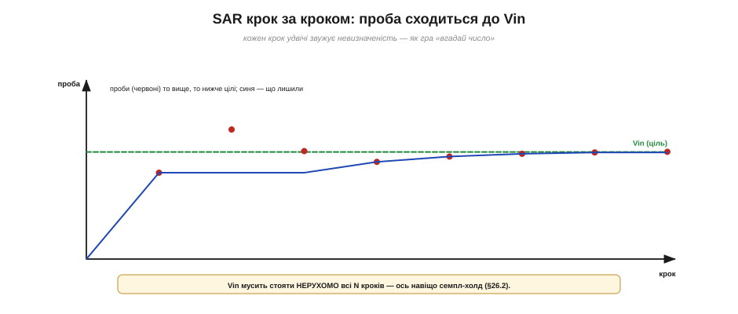
*Рис. 4.8.8.3. Збіжність SAR. Червоні точки — пробні напруги: то вище цілі (тоді біт скидають), то нижче (тоді лишають). Синя лінія — те, що вже «зважено». Кожен крок удвічі звужує невизначеність, тож за N кроків проба впритул підходить до Vin.*

Видно, що пошук разюче ефективний: кожне зважування **вдвічі** звужує діапазон невизначеності, тож 12 біт знаходяться всього за 12 кроків (а не за тисячі проб). Та звідси й важлива вимога: усі ці N кроків вхідна напруга мусить стояти **нерухомо** — інакше зважування зіб'ється, бо порівнюватимемо гирі з різними значеннями. Ось чому SAR конче потребує **семпл-холду** (§4.8.2), що заморожує Vin на час перетворення. Тепер зрозуміло, чому вся ця машинерія з конденсатором, що тримає напругу, була потрібна: без неї двійковий пошук просто не мав би сталої цілі.

Є в SAR і дуже зручна риса — **передбачуваність**. Він завжди дає результат рівно через N кроків, ні швидше, ні повільніше, хоч би яка була напруга: 12-бітний — за 12 тактів зважування, і крапка. Така стала затримка безцінна, коли виміри треба робити за розкладом (а ми пам'ятаємо з §4.8.5, що рівність у часі критична). Це наче гра «вгадай число від 0 до 4095»: правильними питаннями «більше чи менше?» ви гарантовано вгадуєте рівно за 12 спроб, ні на одну більше.

> 🔧 **Навіщо це.** Знання, що в ESP32 саме SAR, одразу пояснює його характер: він міряє по одному відліку за N кроків (тому не безмежно швидкий), потребує семпл-холду (тому чутливий до опору джерела, §4.8.7) і має помірну роздільність (12 біт). Якщо вам треба багато каналів по черзі й помірна точність — SAR саме для цього; а от для дуже високої роздільності він не призначений, і тут на сцену виходить інша архітектура.

### Дельта-сигма: передискретизація до краю

Коли потрібні справді багато біт — 16, 20, 24 — беруть зовсім іншу архітектуру: **дельта-сигма (ΔΣ, *delta-sigma*)**. Її ідея спершу здається парадоксальною: міряти **дуже грубо, але дуже часто**, а тоді усереднити це в надточний результат.

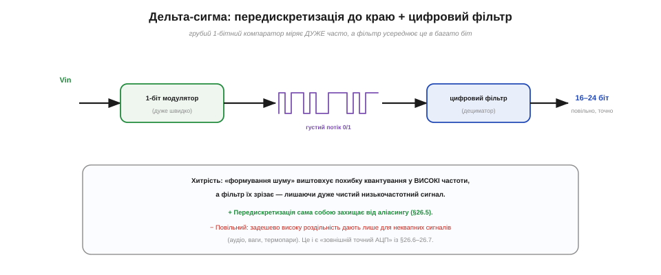
*Рис. 4.8.8.4. Дельта-сигма міряє входом грубим 1-бітним компаратором, зате на шаленій частоті, видаючи густий потік нулів та одиниць. Цифровий фільтр (дециматор) усереднює цей потік у повільні, але дуже точні 16–24-бітні відліки. «Формування шуму» виштовхує похибку у високі частоти, де фільтр її зрізає.*

Працює це так. Замість того щоб ретельно зважувати кожен відлік, як SAR, дельта-сигма прикладає до входу простесенький **1-бітний** перетворювач (по суті, компаратор «більше/менше»), але запускає його на **величезній** частоті — мільйони разів за секунду. Виходить густий потік одиниць і нулів, у якому частка одиниць відображає рівень напруги. Далі **цифровий фільтр-дециматор** усереднює цей потік, перетворюючи мільйони грубих 1-бітних вимірів на повільніші, зате надточні багатобітні відліки — згадайте, як усереднення додає «чесних» біт (§4.8.7), тільки тут воно доведене до краю. Додаткова хитрість, що зветься **формуванням шуму (*noise shaping*)**, навмисне виштовхує похибку квантування у високі частоти, звідки фільтр її легко прибирає, лишаючи знизу майже бездоганний сигнал.

Звідки химерна назва? «Дельта» — це **різниця**: модулятор щокроку дивиться, наскільки вхід відрізняється від уже виданого, і кодує саме цю різницю. «Сигма» — це **сума** (інтегрування): ці різниці накопичуються. Поєднання «кодувати різницю й інтегрувати» з шаленою передискретизацією й дає диво: грубий 1-бітний компаратор обертається на 24-бітну точність. По суті, це те саме усереднення з §4.8.7, доведене до краю й підсилене формуванням шуму.

> 🔧 **Навіщо це.** Дельта-сигма — це і є той «зовнішній точний АЦП», що ми згадували в §4.8.6 і §4.8.7. Коли вбудованих 12 біт SAR замало (термопара, тензодавач ваги, якісне аудіо), беруть мікросхему дельта-сигма на 16–24 біти. Платять за точність **швидкістю**: такі АЦП повільні (від десятків герц до кількох кілогерц), тож годяться для неквапних сигналів, а не для лову швидких фронтів. Приємний бонус — передискретизація сама собою захищає від аліасингу (§4.8.5), тож зовнішній антиаліасинговий фільтр часто й не потрібен.

### Flash і конвеєрний: коли важлива швидкість

Заради повноти — дві «швидкісні» крайнощі. **Flash (паралельний)** АЦП — найшвидший з усіх: він порівнює вхід з **усіма** рівнями шкали **одночасно**, видаючи код буквально за один такт.

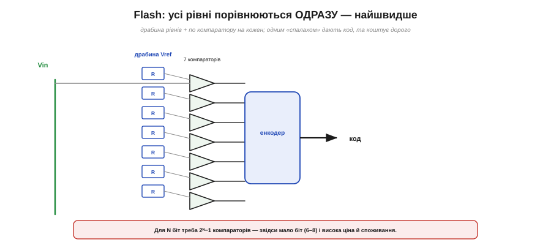
*Рис. 4.8.8.5. Flash-АЦП: драбина опорних рівнів і окремий компаратор на кожен рівень порівнюють Vin з усіма щаблями водночас, а енкодер обертає це на код за один такт. Найшвидше з можливого — та для N біт потрібно 2ᴺ−1 компараторів, тож біт мало (6–8), а ціна й споживання великі.*

Розплата за швидкість — **кількість**: щоб розрізнити 2ᴺ рівнів, потрібно майже стільки ж компараторів (для 8 біт — аж 255!). Тому Flash роблять лише малорозрядним (6–8 біт) і застосовують там, де потрібна шалена швидкість, а точність другорядна, — в осцилографах і відеотехніці. Вихід усіх цих компараторів утворює характерну картину: знизу всі «спрацювали», згори всі «мовчать», а межа між ними й показує рівень — її влучно звуть **термометровим кодом** (як ртуть у термометрі), а енкодер уже переводить цю межу у звичайне двійкове число. Така армія компараторів, що всі разом працюють щотакту, ще й добряче гріється — тому Flash і ненажерливий до енергії. Проміжний варіант — **конвеєрний (*pipeline*)** АЦП: він розбиває перетворення на кілька грубих flash-щаблів, що працюють конвеєром, і так поєднує високу швидкість із пристойними 10–14 бітами; його місце — швидкісний зв'язок і відео. Цікава деталь конвеєрного АЦП — **затримка**: кожен відлік проходить кілька щаблів по черзі, тож від моменту виміру до готового коду минає кілька тактів. Зате нові відліки виходять щотакту суцільним потоком — висока пропускність ціною невеликої сталої затримки, точнісінько як конвеєр на заводі. Жодну з цих двох архітектур у простому мікроконтролері ви навряд чи зустрінете, але знати про них корисно — щоб бачити всю палітру.

### Який АЦП де

Зведімо все в коротку мапу — щоб з назви архітектури одразу читати її призначення.


*Рис. 4.8.8.6. Чотири архітектури та їхні ніші: SAR — мікроконтролери загального призначення (★ ESP32); дельта-сигма — аудіо, ваги, термопари (зовнішні мікросхеми на кшталт ADS1115); Flash — осцилографи й відео; конвеєрний — відео та швидкий зв'язок. Вбудований АЦП ESP32 — SAR; коли треба більше біт, докуповують зовнішній дельта-сигма.*

Тепер у вас є повна карта. Вбудований АЦП вашого ESP32 — **SAR**, і це пояснює все його поводження: помірну швидкість, потребу в семпл-холді, чутливість до опору джерела, 12 біт роздільності. Коли цього замало, ви знаєте, куди дивитися: зовнішній **дельта-сигма** на 16–24 біти для точних повільних вимірів. А Flash і конвеєрний лишаються для світу осцилографів та відео, куди мікроконтролер зазвичай не заходить.

До речі, в ESP32 таких SAR-перетворювачів **два** (ADC1 і ADC2, §4.8.1) — звідси й кілька аналогових входів, які чіп опитує по черзі через внутрішній перемикач. Усе поводження АЦП, що ми розбирали цілий розділ, — зважування, потреба в семпл-холді, чутливість до опору джерела, 12 біт, — це поводження саме SAR; тепер ви знаєте його не лише ззовні, а й зсередини.

**Приклад (швидкість проти роздільності у трьох архітектурах).**

```
SAR (12 біт):   12 кроків зважування на 1 відлік
   при тактовій ~2 МГц → ~6 мкс/відлік → сотні тисяч відліків/с
Дельта-сигма (24 біт): мільйони грубих 1-бітних вимірів,
   усереднених фільтром → десятки Гц…кГц, зате 24 «чесні» біти
Flash (8 біт):  код за ОДИН такт, але 2⁸−1 = 255 компараторів
```
Три архітектури — три точки компромісу: SAR збалансований, дельта-сигма міняє швидкість на біти, Flash — біти на швидкість. Розуміючи це, ви ніколи не оберете АЦП «навмання».

На цьому ми закриваємо розділ про **аналого-цифрове перетворення**. Ми пройшли всю дорогу: від ідеї моста «напруга → число» (§4.8.1) через два кроки дискретизації й квантування (§4.8.2), кількість біт і крок (§4.8.3), роль опорної напруги (§4.8.4), пастку аліасингу (§4.8.5), реальні похибки й калібрування (§4.8.6), мистецтво чистого зчитування (§4.8.7) — і нарешті зазирнули всередину самого перетворювача (§4.8.8). Тепер АЦП для вас не чорна скринька, а зрозумілий інструмент, яким можна свідомо й точно міряти аналоговий світ. Разом із ЦАП із Розділу 4.7 це замикає повний міст між аналоговим світом і цифрою: один бік — читати (АЦП), другий — віддавати (ЦАП), і обидва ви тепер розумієте до останнього щабля. Та вимірювати — це лише частина роботи мікроконтролера; інша велика частина — **як він узагалі організовує свою роботу в часі**: один великий цикл, кілька задач, планувальник. Саме про модель виконання й реальний час — наступний, завершальний розділ модуля.

> ▶️ Далі: [Розділ 4.10 — Модель виконання й RTOS](../execution-rtos/execution-rtos.md)


