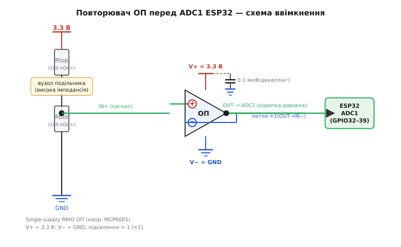
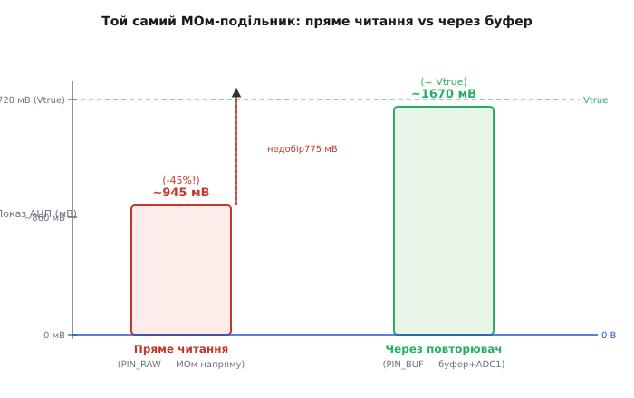

# 🔌 Повторювач на ОП перед АЦП: розв'язуємо імпеданс джерела (ESP32)

> **Компонентна вставка до теми [§4.8.7 «Як правильно зчитати сигнал»](adc.md).** У §4.8.7 (підрозділ «Буфер: посередник для високоомного джерела») ми з'ясували ідею: повторювач показує джерелу великий вхідний опір, а АЦП — малий вихідний. Ця вставка про ремесло на залізі ESP32: яку мікросхему взяти, як підключити її до одного рейла 3.3 В, куди підпаяти, як кодом перевірити, що недобір зник. Глибша фізика опору джерела залишається у §4.8.7; узагальнений буфер як клас схем ОП — у §2.8.5 і вставці §2.8.5c; тут — конкретика «ОП ↔ SAR-АЦП ESP32», без повтору тих двох.

---

## Клас пристрою: буфер-повторювач — що це і коли

Коли операційний підсилювач охоплений стовідсотковим від'ємним зворотним зв'язком — вихід підключений напряму до інвертувального входу — підсилення дорівнює рівно одиниці. Такий ОП не підсилює напругу, він «перепаковує» її: на виході з'являється та сама напруга, що й на вході, але вже з дуже малим вихідним опором. Схема називається **повторювач (voltage follower, unity-gain buffer)**, і її єдине призначення — ізолювати джерело сигналу від навантаження.

У контексті ESP32 така ізоляція потрібна саме тоді, коли опір джерела перевищує приблизно 10 кОм — поріг, визначений у §4.8.7. Практичні ситуації: великий резистивний подільник для економії струму з батареї (сотні кОм), фоторезистор чи NTC-термістор у плечі подільника, RC-антиаліасний фільтр із великим R заради малої частоти зрізу. В усіх цих випадках SAR-АЦП ESP32 намагається зарядити внутрішній конденсатор семпл-холду крізь великий зовнішній опір і не встигає — результат систематично занижений, §4.8.7.

Важлива межа: коли вимір грубий — «світло/темно», «торкнулись чи ні» — буфер не потрібен. Зусилля мають відповідати задачі (порада §4.8.7). Повторювач вартий місця й ціни лише тоді, коли потрібні чесні вольти з кволого, високоомного джерела.

> 🔧 **Навіщо це.** Симптом: АЦП систематично занижує покази з подільника на сотнях кОм або МОм, причому заниження стабільне (не шум) і тим більше, чим більший опір. Це і є випадок для повторювача. Буфер усуває саме цю систематичну похибку — випадковий шум він не лікує.

---

## Блок-схема тракту: джерело → [буфер] → ніжка ADC1

Ланцюг тракту виглядає так: є високоомний вузол — наприклад, середня точка подільника Rtop–Rbot — від нього провід іде на неінвертувальний вхід «+» ОП. Вихід ОП, замкнений петлею зворотного зв'язку на інвертувальний вхід «−», подається короткою доріжкою безпосередньо на ніжку ADC1 мікроконтролера. Буфер стоїть між подільником і АЦП, а не замість подільника.

Чому саме ADC1, а не ADC2? Це пастка, детально описана у §4.8.1: другий АЦП конфліктує з Wi-Fi і дає непередбачувані результати, щойно вмикається радіо. Для виміру слід обирати ніжки ADC1: GPIO32, GPIO33, GPIO34, GPIO35, GPIO36, GPIO39 — вони завжди стабільні незалежно від стану Wi-Fi.

Де у цьому тракті живе RC-антиаліасний фільтр (§4.8.7)? Залежно від задачі повторювач ставлять або після фільтра, або перед ним. Якщо «буфер після фільтра» — фільтр не навантажує джерело, бо буфер далі за ним перебирає весь струм зарядки АЦП на себе. Якщо «буфер перед фільтром» — дешевший варіант, але потрібен малий вихідний опір буфера, щоб RC працював точно.

> 🔧 **Навіщо це.** Вихід буфера — «жорстке» низькоомне джерело. Маленький конденсатор безпосередньо на ніжці ADC1 (резервуар заряду для S/H) тепер справді встигне зарядитися за відведений час вікна виміру — він живиться від буфера, а не від кволого джерела. Цей прийом описаний у примітках до §2.8.5c як корисний стик з аналоговим трактом.

Конкретна схема вмикання показана на Рис. 4.8.7c.1.

---

## Розпіновка реального ОП: 8-pin SOIC/SOT-23-5 на одному рейлі 3.3 В

Типовий одинарний ОП в корпусі 8-DIP або 8-SOIC має таку цоколівку: пін 2 — IN− (інвертувальний вхід), пін 3 — IN+ (неінвертувальний вхід), пін 4 — V− або GND (від'ємна шина живлення), пін 6 — OUT (вихід), пін 7 — V+ (додатня шина). Піни 1, 5, 8 або залишені не підключеними (N/C), або використовуються для частотної корекції — у повторювачі їх лишають у повітрі. Здвоєний ОП у тому ж корпусі містить два незалежних підсилювачі — зручно, коли треба забуферувати два канали АЦП одразу.

Тепер — центральна специфіка ESP32, яка відрізняє цю вставку від теорії §2.8.5. Живимо ОП від одного рейла 0…3.3 В, і це накладає вимоги відразу на обидва кінці шкали.

**Низ шкали (сигнал близько 0 В).** Темний фоторезистор, холодний NTC або нижнє плече подільника подає на вхід ОП напругу, що може наближатися до нуля. Звичайний «двополярний» ОП класу TL072, живлений від ±15 В або ±5 В, просто не вміє обробляти сигнали біля своєї нижньої рейки: вхід не «дотягується» до землі, і якщо вхідна напруга падає нижче певного порогу (зазвичай кілька сотень мВ над V−), підсилювач виходить з лінійного режиму й обрізає результат. На одному рейлі 3.3 В V− = GND, і ОП без функції **rail-to-rail** (RR) просто заблокує нижню частину діапазону. Детальний механізм описаний у §2.8.9 («Rail-to-rail»); тут — лише практичний висновок: потрібен ОП із **rail-to-rail входом і виходом (RRIO)**, здатний обробляти сигнали від 0 В до 3.3 В.

**Верх шкали (сигнал близько 3.3 В).** Навіть RRIO-вихід не дотягує до рейки буквально — під навантаженням залишається кілька мВ зазору. Зазвичай це не суттєво (схожий ефект «зайві біти тонуть у шумі» описаний у §4.8.3), але варто пам'ятати при прецизійному калібруванні.

**Вхідний струм.** Джерело з опором у МОм разом із вхідним струмом ОП дає постійний зсув: Verr = Ib · Rджерела. Для МОм-джерела навіть вхідний струм 10 нА дає 10 мВ похибки — а це вже ~12 LSB на 12-бітовому АЦП з діапазоном 3.3 В. Звідси ще одна вимога: **CMOS або FET-вхід** (вхідний струм у наноамперах або менше), а не біполярний вхід (де Ib може сягати мікроамперів).

Конкретні сімейства, що відповідають усім трьом вимогам (single-supply, RRIO, CMOS-вхід): **MCP6001** (одинарний, SOT-23-5, дуже дешевий), **MCP602** (здвоєний, SOIC-8), **OPA340** (точніший). Якщо потрібна мінімальна дрейфова похибка нуля — **MCP6V01/MCP6V02** (клас auto-zero, автоматично компенсує власний зсув). Для двоканальної задачі ESP32 (два входи ADC1) вистачає одного здвоєного корпусу замість двох.

> 🔧 **Навіщо це.** На 3.3 В беріть single-supply RRIO ОП із CMOS/FET-входом. Тоді «обрізало низ» і «вхідний струм псує МОм-джерело» зникають відразу й одним вибором мікросхеми.

**Рис. 4.8.7c.1.** Схема вмикання зі всіма елементами: рейки, декаплінг, петля ×1, вхід від подільника, вихід на ADC1.



*Рис. 4.8.7c.1. Повторювач перед АЦП ESP32 на рейлі 3.3 В: цоколівка ОП, декаплінг 0.1 мкФ біля V+, петля ×1 (OUT→IN−), вхід від подільника, вихід коротко на ADC1.*

---

## Підключення: рейки, декаплінг, заземлення, замкнена петля повторювача

Підключення повторювача складається із шести кроків, і кожен з них важливий.

**Крок 1.** V+ ОП підключаємо до рейки 3.3 В — тієї самої, що живить АЦП-рейл ESP32 і слугує відліковою точкою для Vref. Це не просто «будь-яке 3.3 В»: коли ОП і АЦП живляться від спільної шини, їхній «нуль» збігається, і шум на шині однаково зсуває обидва — взаємний вплив мінімальний.

**Крок 2.** V− підключаємо до GND — того ж загального нуля схеми.

**Крок 3.** Безпосередньо біля корпусу ОП (відстань — кілька міліметрів) ставимо кераміку 0.1 мкФ між V+ і GND. Це місцевий декаплінг (основна теорія — §ch07): він поглинає короткі імпульси струму, які ОП споживає при зміні вихідного рівня, і не дає їм розтікатися по рейці до інших вузлів.

**Крок 4.** IN+ з'єднуємо з вузлом подільника — тією самою точкою, яку хочемо виміряти.

**Крок 5.** OUT підключаємо напряму до IN−, замикаючи петлю зворотного зв'язку. Жодних резисторів у петлі — підсилення рівно 1.

**Крок 6.** З цього самого вузла OUT ведемо коротку доріжку до ніжки ADC1 ESP32. «Коротка» — не естетика, а функція: довга доріжка додає індуктивність і паразитну ємність.

Спільна земля «зіркою» між ОП, подільником і ESP32 — це продовження поради §4.8.7 про чисту точку відліку: якщо землі роз'єднані або з'єднані через довгий провід зі спадом напруги, буфер вимірює «не те».

Є одна практична пастка: повторювач, що виходить на ємнісне навантаження — довга доріжка або великий конденсатор безпосередньо на ніжці АЦП — може «дзвонити», тобто збуджувати коливання. Рецепт простий: невеликий послідовний резистор 10–50 Ом між виходом ОП і ніжкою АЦП гасить ці коливання демпфуванням. Детальний механізм ємнісного навантаження ОП описаний у §2.8.5c (стик «cap-load stability»); тут — лише що робити.

> 🔧 **Навіщо це.** Три речі, без яких «буфер не допоміг»: спільна земля (інакше різниця потенціалів землі підмішується у вимір), декаплінг біля ОП (інакше рейковий шум підмішується через V+) і ОП, живлений від тієї самої 3.3 В, що й АЦП (інакше Vref і живлення ОП «плавають» незалежно й взаємопосилюють похибку).

---

## «Перший байт»: перший вимір крізь буфер і перевірка коду

У ОП немає регістрів і ніякого «першого байта» в прямому сенсі. «Заговорити» тут означає: зробити перший `analogReadMilliVolts` через буфер і довести числами, що систематичний недобір зник.

Найпряміший спосіб перевірки — читати одночасно два входи: той самий вузол подільника напряму (PIN_RAW) і той самий вузол через буфер (PIN_BUF). Різниця `buf − raw` повинна бути позитивною і помітною, якщо джерело справді було високоомним.

**Перевірочний код (Arduino-ESP32, реальний компільований фрагмент):**

```cpp
// ADC1, 12 біт; PIN_RAW — вузол подільника напряму,
// PIN_BUF — вихід повторювача → той самий вузол
const int PIN_RAW = 34;   // ADC1 (GPIO34), напряму до МОм-подільника
const int PIN_BUF = 35;   // ADC1 (GPIO35), вихід ОП-буфера

static uint32_t avg_mv(int pin, int n) {
    uint32_t s = 0;
    for (int i = 0; i < n; i++) s += analogReadMilliVolts(pin);
    return s / n;
}

void setup() {
    Serial.begin(115200);
    analogReadResolution(12);       // рідні 12 біт ESP32 (§4.8.3)
    // analogSetPinAttenuation(PIN_RAW, ADC_11db); // якщо Vin > 1 В (§4.8.4)
    // analogSetPinAttenuation(PIN_BUF, ADC_11db);
}

void loop() {
    uint32_t raw = avg_mv(PIN_RAW, 16);  // висока імпедансія — занижує
    uint32_t buf = avg_mv(PIN_BUF, 16); // через буфер — істина
    // Очікуваний вивід:
    //   raw=945 mV  buf=1670 mV  dif=+725 mV   (джерело ~1.72 В, 1 МОм подільник)
    //   або raw≈buf (джерело й так низькоомне — буфер зайвий)
    Serial.printf("raw=%u mV  buf=%u mV  dif=%d mV\n",
                  raw, buf, (int)buf - (int)raw);
    delay(200);
}
```

Усереднення по 16 семплах (§4.8.7) пригнічує випадковий шум і робить різницю чистішою.

Якщо у Serial Monitor `buf − raw` помітне — десятки або сотні мВ, і воно позитивне — діагноз §4.8.7 підтверджено числово: причиною був опір джерела, буфер його усунув. Якщо різниця близька до нуля — джерело й так було низькоомним, і буфер у цьому тракті зайвий (зусилля під задачу). Рис. 4.8.7c.2 показує саме такий результат: лівий стовпець — raw із недозарядженим S/H, правий — buf із повністю зарядженим конденсатором.



*Рис. 4.8.7c.2. Той самий високоомний подільник: пряме читання занижене (S/H не дозарядився), через повторювач — істинна напруга. Те, що друкує перевірочний код.*

---

## Типові граблі на МК: де АЦП-буфер «не злітає»

**Взяв двополярний ОП (клас TL072) на одному рейлі.** Нижня частина сигналу — біля 0 В — обрізана: ОП не «дотягується» до своєї нижньої рейки. Виміри у темряві або на нижньому плечі подільника просто брешуть. Лік однозначний: single-supply RRIO (§2.8.9).

**Вхідний струм ОП × великий опір джерела = зсув.** Навіть нА-рівний Ib біполярного входу разом із МОм-джерелом дає мВ похибки: Verr = Ib · Rджерела. Числово: для 12-бітового АЦП з діапазоном 3.3 В один LSB = 3300 / 4096 ≈ 0.8 мВ. Джерело 1 МОм і Ib = 50 нА (прийнятний для біполярного ОП) дають Verr = 50 мВ, тобто 62 LSB систематичної похибки — незалежно від того, встановлено буфер чи ні. Лік: CMOS/FET-вхід, де Ib ≤ 1 нА, а похибка падає до рівня шуму.

**Власний зсув ОП (Voffset) додається до показу.** Дешеві CMOS-ОП мають Voffset у 0.5–5 мВ — зазвичай кілька LSB, що прийнятно. Якщо потрібна прецизія на рівні мВ, беруть auto-zero (клас MCP6V): він вимірює і компенсує власний зсув у кожному циклі.

**Перевантаження виходу ємністю → дзвін.** Довга доріжка або конденсатор ≥ 1 нФ безпосередньо на виході нестабілізованого повторювача призводять до коливань. Послідовний резистор 10–50 Ом між OUT і ніжкою АЦП демпфує задачу. Механізм — §2.8.5c («cap-load stability»).

**Забув декаплінг або живив ОП від іншої шини, ніж рейл Vref АЦП.** Дрейф напруги живлення ОП не збігається з дрейфом Vref АЦП (§4.8.4), і «чистий» сигнал на вході буфера перетворюється на зашумлений вихід. Буфер не рятує від поганої спільної точки відліку.

**«Буфер не прибрав шум».** Повторювач усуває систематичний недобір, спричинений опором джерела. Випадковий шум АЦП лікується усередненням, медіаною та oversampling (§4.8.7) — буфер тут ні при чому. Плутанина між цими двома видами похибок — найпоширеніша причина розчарування: «поставив буфер, але все одно шумить». Так і мало бути — просто різні хвороби і різні ліки.

---

## Варіації класу: коли повторювача замало або забагато

**Готові ADC driver-мікросхеми.** Існує клас буферів, спеціально оптимізованих під імпульсний заряд конденсатора семпл-холду SAR-АЦП: вони мають малий вихідний опір, широку смугу і мінімальний час відновлення після ступінчастого стрибка. Коли висока швидкість виміру критична, а звичайний ОП-повторювач не встигає заряджати S/H між конверсіями — розглядають саме цей клас.

**Здвоєний ОП — два буфери в корпусі.** Якщо потрібно забуферувати два канали ADC1 одночасно (наприклад, два плечі моста або два давачі), один корпус 8-SOIC MCP602 або аналога вирішує задачу. При мультиплексованому зчитуванні (один АЦП перемикається між каналами) час усталення після перемикання зростає — деталі у §4.8.7.

**Якщо треба не лише розв'язати, а й масштабувати.** Сигнал з термопари або тензомоста може бути у мілівольтах — далеко від повної шкали 3.3 В. Щоб не «марнувати» біти (§4.8.3), ставлять неінвертувальний підсилювач з K > 1 замість повторювача ×1. Схема та формула — у §2.8; тут лише точка переходу: якщо потрібен лише розв'язок — повторювач; якщо ще й масштабування — неінвертувальний ОП з резисторами у зворотному зв'язку.

**Дуже чутливе або диференційне джерело.** Термопара, тензоміст, pH-електрод із опором у десятки МОм або з диференційним виходом вимагають спеціалізованого **вимірювального підсилювача (instrumentation amplifier)** або зовнішнього **delta-sigma-АЦП** (§4.8.6, §4.8.8, §2.8.6). Простий повторювач тут вже замалий — надто низький CMRR, надто великий Ib.

**Внутрішній буфер ESP32?** У деяких мікроконтролерах є вбудований PGA або аналоговий буфер перед АЦП. У ESP32 (SAR, 12-бітовий) його фактично немає — тому зовнішній буфер на ОП і є практичним стандартом для роботи з «кволими» джерелами.

> 🔧 **Підсумок.** На ESP32 міряєш високоомний вузол — постав single-supply RRIO повторювач із CMOS-входом між вузлом і ніжкою ADC1: подільник лишається економним (великий R = малий струм із батареї), S/H заряджається миттєво (малий вихідний опір буфера), а код читає правду. Перевір це двома читаннями (`raw` vs `buf`) — і «загадковий систематичний недобір» закрито назавжди.
