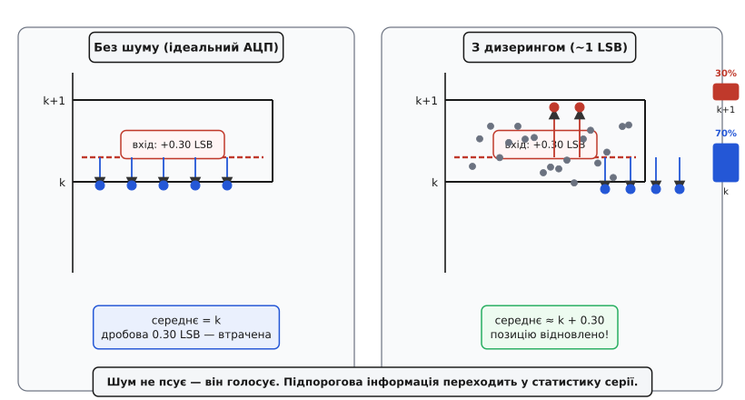
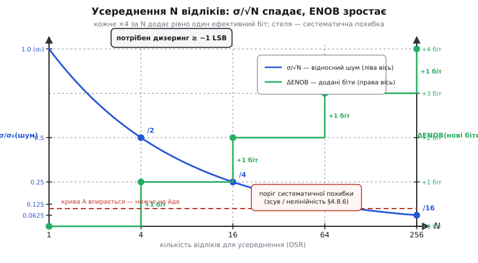

# 🧮 Дизеринг і передискретизація: чому дрібка шуму додає бітів

> Це математична вставка до теми [§4.8.3 «Біти й роздільність АЦП»](adc.md). У §4.8.3 та §4.8.5 ми заявили, що передискретизація (oversampling, OSR) зменшує шум як √N і дозволяє відіграти «чесні» ефективні біти (ENOB). Але залишився відкритим один незвичний парадокс: АЦП повертає цілі коди — і середнє з мільйона однакових цілих лишається тим самим цілим. Звідки ж нові біти? Відповідь криється в шумі, і нижче ми покажемо, чому дрібка шуму не шкодить — а додає роздільності.

## Означення: дизеринг і передискретизація

Дизеринг (dithering) — навмисне або природне невелике випадкове збурення, додане до аналогового сигналу перед квантуванням; амплітуда — порядку одного кроку квантування (1 LSB, §4.8.3). Передискретизація (oversampling, OSR) — набір N відліків там, де змістовно потрібен один, із подальшим усередненням; коефіцієнт OSR = N.

Важливо одразу зрозуміти: це різні, але споріднені речі. Дизеринг перекладає підпорогову інформацію у статистику серії відліків, а усереднення цю статистику видобуває й повертає у вигляді дрібніших розрядів. Поодинці кожне з них майже марне — разом вони дають справжні нові біти.

## Інтуїція: чому без шуму усереднення безсиле

Уявіть, що вхідна напруга «застрягла» між двома щаблями квантувача рівно на 0.3 LSB вище рівня k. Ідеальний, абсолютно тихий АЦП завжди повертає k — стрибку на k+1 немає, бо перехідний поріг так і не досягається. Середнє з хоч мільйона таких відліків дорівнює k, і дробову частину 0.30 LSB ви ніколи не побачите. Квантувач — глуха стіна: різниця, менша за LSB, губиться, бо нелінійність-сходинка (§4.8.2) безжально відрізає все між щаблями.

Тепер додайте тремтіння з амплітудою близько 1 LSB. Відліки більше не стоять на місці — вони стохастично блукають навколо вхідного значення, і частина з них переступає поріг k+1. Яка саме частина? Рівно та, що відповідає дробовому залишку: якщо вхід лежить на 0.30 LSB вище k, то приблизно 30 % відліків дадуть k+1, а 70 % — k. Середнє серії:

```
середнє ≈ 0.70 · k + 0.30 · (k+1) = k + 0.30
```

Ми відновили позицію 0.30 LSB, якої жоден окремий відлік не містив. Шум переклав підпорогову інформацію в статистику серії. Сформулюємо це як ключовий принцип: **шум не псує — він голосує**.



*Рис. 4.8.3m.1. Чому дрібка шуму додає роздільності: без дизерингу — глуха стіна; з дизерингом — голосування серії відновлює підпорогову позицію.*

> 🔧 **Навіщо це.** Якщо ваш АЦП на нерухомому вході повертає абсолютно стабільний, незмінний код — усереднення вам нічого не додасть: дизерингу немає, голосування не відбувається. Трохи власного шуму схеми — це не завжди ворог. Якщо він випадковий і некорельований, він грає роль безкоштовного дизерингу. Саме тому §4.8.3 зазначав: «молодші біти миготять» — це нормально і навіть корисно для oversampling.

## Апарат: скільки бітів і чому √N

**Закон √N.** Беремо N незалежних відліків; випадкова похибка кожного має стандартне відхилення σ. Середнє з N відліків має відхилення σ/√N — незалежні похибки частково взаємознищуються (позитивні компенсуються негативними), тому сумарне відхилення зростає лише як √N, а не як N:

```
σ_avg = σ / √N

N = 4    →  σ_avg = σ / 2
N = 16   →  σ_avg = σ / 4
N = 256  →  σ_avg = σ / 16
```

**Від шуму до бітів.** За правилом §4.8.3, +1 ефективний біт відповідає зменшенню кроку вдвічі (6 дБ/біт). Зменшити шум удвічі означає, що квантувач «чує» вдвічі дрібніші деталі — це рівнозначно одному додатковому ефективному біту. Скільки разів треба учетверити N, щоб σ/√N впала вдвічі? Рівно один раз (√4 = 2). Звідси правило, яке §4.8.5 анонсував:

```
ΔENOB = ½ · log₂(N)              (додані ефективні біти)

N = 4    →  ΔENOB = 0.5 · 2  = 1.0 біт
N = 16   →  ΔENOB = 0.5 · 4  = 2.0 біт
N = 64   →  ΔENOB = 0.5 · 6  = 3.0 біт
N = 256  →  ΔENOB = 0.5 · 8  = 4.0 біт
```

Чесна стеля: правило працює, лише доки є дизеринг ≥ ~1 LSB і шум справді випадковий та незміщений. Систематичну похибку — зсув, підсилення, нелінійність — усереднення не прибирає. Ці ефекти лишаються незмінними від відліку до відліку і тому не усереднюються: їх усуває тільки калібрування (§4.8.6).



*Рис. 4.8.3m.2. Усереднення N відліків глушить шум як σ/√N, а кожне ×4 додає рівно один ефективний біт; виграш упирається в систематичну похибку.*

**Приклад (ESP32: відіграти 13–14 біт із рідних 12).**

```
дано: 12 біт, LSB ≈ 0.806 мВ (§4.8.3), шум ≈ 1 LSB (є природний дизеринг)
ціль: +2 ефективні біти  →  N = 4² = 16 відліків на один результат

σ_avg ≈ 0.806 мВ / √16  =  0.806 / 4  ≈ 0.20 мВ
ΔENOB  = ½ · log₂(16)   =  ½ · 4      =  2.0 біт
ефективно ≈ 14 біт  (крок «по шуму» вчетверо дрібніший)

ціна: 16× відліків  →  у 16 разів повільніше або більше навантаження на CPU
```

Майже безкоштовні біти ціною швидкості вибірки — саме тому прийом призначений для повільних сигналів (перегук із §4.8.5).

## Де в курсі це працює

Дизеринг і усереднення — це і є той самий oversampling, який §4.8.5 порадив «брати fs із запасом»: дизеринг забезпечує умову (шум є), усереднення знімає виграш. Рівні часові інтервали між відліками при цьому критичні — їх гарантує апаратний таймер (§4.6), інакше нерівномірна дискретизація за часом вносить додаткові спотворення. Усе разом глушить те, що природно дрібне й випадкове. Проте систематичні похибки реального АЦП — зсув нуля, відхилення підсилення, нелінійність передавальної характеристики — від відліку до відліку не змінюються, і жодне усереднення їх не зменшить. Ця межа й веде нас до наступної теми: §4.8.6 покаже, як прибрати систематичне калібруванням.
