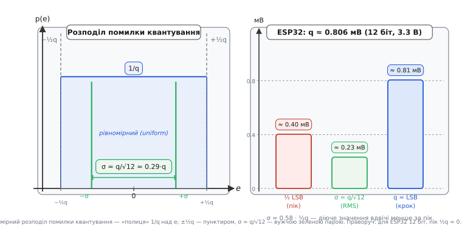

# 🧮 Шум квантування: ±½ LSB і звідки SNR = 6.02·N + 1.76 дБ

<!-- Тип: 🧮 математична вставка (AUTHORING §16). Файл: ch26-adc/ch26-s2-m-quantization-noise.md. Прив'язка: тема 4.8.2. -->

У темі 4.8.2 ми з'ясували, що округлення лишає похибку ≤ ½ кроку, й назвали її шумом квантування — але наскільки вона шкодить **кількісно**? Ця вставка перетворює «≤ ½ LSB» на одне точне число — **діюче (RMS) значення шуму** — і показує, звідки беруться конкретні константи 6.02 і 1.76, що у §4.8.3 з'явилися майже як факти. Центральна величина тут — **відношення сигнал/шум** (signal-to-noise ratio, SNR): скільки разів корисний сигнал «гучніший» за неминучий шум округлення.

---

## Що рахуємо

Щоб знайти SNR, потрібні два числа: **розкид шуму** і **розмах сигналу**. Їхнє відношення в децибелах і є SNR.

Почнемо з шуму. Позначимо похибку квантування як `e = виміряне − істинне`. З §4.8.2 (рис. 4.8.2.6) відомо, що ця похибка лежить строго в смузі `[−½ LSB, +½ LSB]` — пилкоподібна крива, яка ніколи за неї не виходить. Але «максимум ½ LSB» — поганий показник якості: це найгірший миттєвий сплеск, тоді як тракт і вухо реагують на **середній рівень** енергії, а не на пік. Потрібне щось на зразок «середнього», але для величин зі знаком — і тут на допомогу приходить RMS (root-mean-square, σ): корінь із середнього квадрата. Саме RMS є природним мірилом «шкоди» шуму: він враховує і знак, і розподіл значень у часі. Апарат RMS ми вже будували в §7.4 (r07-s4-m-rms-derivation.md) — тут спираємося на нього без повторення з нуля.

---

## Чому похибка — це «рівномірний» шум

Поставимо запитання: якщо сигнал гуляє по всій шкалі АЦП, куди саме всередині щабля він потрапляє в кожен момент? Для активного, широкосмугового сигналу — наперед невгадно: з однаковою ймовірністю будь-куди в `[−½ LSB, +½ LSB]`. Це ключове припущення: **рівномірний (uniform) розподіл** похибки. Воно справедливе, коли сигнал достатньо динамічний і охоплює багато рівнів АЦП. Там, де це припущення ламається — тихий або повільний сигнал, що довго «сидить» в одному щаблі, — похибка стає корельованою й шумом уже не є (натяк на дизеринг — детальніше: [ch26-s3-m-dithering.md](math-dithering.md)).

Саме тому рис. 4.8.2.6 нагадує «пилку без структури»: статистично похибка поводиться як доданий випадковий сигнал. Ми маємо право назвати її шумом — і обчислити її потужність через RMS.

> 🔧 **Навіщо це.** На повношкальному сигналі шум квантування задає стелю якості АЦП: нижче за неї дрібніти крок (додавати біти) марно — поліпшення не матиме фізичного сенсу, якщо реальний апаратний шум схеми вже перевищує цю межу. Саме тому розуміння теоретичної стелі SNR є відправною точкою для оцінки «ефективних біт» реального перетворювача — ідея ENOB у §4.8.3.

---

## Апарат 1: RMS рівномірного шуму = LSB/√12

Тепер — серцевина вставки. Позначимо крок q = LSB. Помилка `e` рівномірно розподілена на `[−q/2, +q/2]`, тобто щільність ймовірності — горизонтальна «полиця» висотою `1/q`. Середній квадрат помилки:

**Вивід σ шуму квантування.**
```
e ∈ [−q/2, +q/2],  q = LSB,  розподіл рівномірний
⟨e²⟩ = (1/q) · ∫ e² de  (від −q/2 до +q/2) = q² / 12
σ_шуму = √⟨e²⟩ = q / √12 ≈ 0.289 · q
```

Маємо два важливі орієнтири: √12 ≈ 3.464, тому σ_шуму ≈ 0.29·LSB ≈ 0.58·(½ LSB). Діюче значення — **приблизно втричі менше за пікову межу**: саме тут виникає типова плутанина між «похибка ≤ ½ LSB» і реальним рівнем шуму.


*Рис. 4.8.2m.1. Ліворуч: смуга помилки квантування `[−½ LSB, +½ LSB]` — «полиця» висотою 1/q; межі ±½q позначено пунктиром, вужча зелена пара ліній — діюче σ = q/√12 ≈ 0.29·q. Видно оком: діюче значення помітно вужче за пік. Праворуч: ті самі величини в мВ для ESP32 (12 біт, 3.3 В): пік ≈ 0.40 мВ, σ ≈ 0.23 мВ.*

Числовий місток до ESP32: q ≈ 0.806 мВ (з §4.8.3) — тоді σ_шуму ≈ 0.233 мВ. Це помітно менше за «½ LSB ≈ 0.40 мВ», яке §4.8.2 і §4.8.3 наводять як максимум похибки. Тепер видно різницю між піком і діючим значенням.

---

## Апарат 2: RMS повношкального синуса = (FS/2)/√2

Шум знайдено — тепер чисельник, сам сигнал. Чому синус? Це стандарт технічних специфікацій: SNR та SINAD реальних АЦП вимірюють саме на повношкальному синусоїдному вході — він дає найбільш представницький і водночас найкращий можливий результат заповнення шкали.

Синус амплітудою `A = FS/2` (де повний розмах `FS = 2ᴺ·LSB ≈ Vref`) має RMS рівно `A/√2`. Це відомий факт зі §7.4 (детальніше — [r07-s4-m-rms-derivation.md](../../math-rms-derivation.md)); тут лише застосовуємо готовий результат.

**RMS повношкального синуса.**
```
розмах FS = 2ᴺ · LSB,  амплітуда A = FS/2 = 2ᴺ⁻¹ · LSB
σ_сигн = A / √2 = 2ᴺ⁻¹ · LSB / √2
```

Зверніть увагу: у σ_сигн фігурує LSB — той самий, що стоїть і в знаменнику σ_шуму = LSB/√12. При діленні σ_сигн / σ_шуму крок LSB **скорочується** — і SNR залежить **лише від N**. Це та елегантність, яку §4.8.3 лише назвав «6 дБ/біт»; нижче ми її виведемо.

---

## Апарат 3: складаємо SNR і добуваємо 6.02·N + 1.76

Маємо обидва RMS — їхнє відношення в децибелах і є SNR. Для амплітуд (не потужностей) формула: `SNR = 20·log₁₀(відношення)`. Нагадаємо: **децибел (decibel, dB)** — логарифмічна одиниця відношення двох значень (детальніше: [r04-s4-m-logarithms.md](../../math-logarithms.md), [r04-s4-history-decibel.md](../../hist-decibel.md)).

**SNR ідеального N-бітного АЦП.**
```
SNR = 20·log₁₀( σ_сигн / σ_шуму )
    = 20·log₁₀( (2ᴺ⁻¹·LSB/√2) / (LSB/√12) )
    = 20·log₁₀( 2ᴺ · √(12)/(2·√2) )      ← LSB скоротився
    = 20·N·log₁₀2 + 20·log₁₀(√(3/2))
    = 6.0206·N + 1.7609   (дБ)
```

Два доданки мають різну природу.

Перший — `6.02·N` — це **внесок розрядності**: `20·log₁₀2 ≈ 6.0206 дБ` за кожен біт. Ось воно, «6 дБ/біт» зі §4.8.3, тепер із точним числом замість округленого «6».

Другий — `+1.76 дБ` — **«бонус форми сигналу»** з `√(3/2)`: синус заповнює шкалу краще, ніж рівномірний шум. Цей доданок **не є** константою для всіх сигналів: для прямокутної хвилі він буде іншим, для шумового сигналу — ще іншим. Поширена помилка — писати «SNR = 6N» і забувати +1.76; для 12 біт це означає хибу майже 2 дБ. Пам'ятаймо: «6.02·N + 1.76 дБ» — лише для синуса.

> 🔧 **Навіщо це.** За виміряним SNR (з даташита або власного вимірювання спектра) розраховують **ефективні біти (ENOB)**: якщо реальний SNR нижчий за теоретичний 6.02·N+1.76, частина бітів «проїдена» апаратним шумом. Навпаки: щоб «почути» сигнал, що лежить на X дБ нижче повної шкали, можна одразу прикинути мінімальну кількість бітів. Скільки біт виживає в реальному залізі й як усереднення повертає частину — у вставці ENOB (§4.8.3): [ch26-s3-m-enob.md](math-enob.md).

---

**Приклад (SNR 12-бітного АЦП ESP32).** Vref ≈ 3.3 В, N = 12.

```
q = LSB = 3.3 / 4095      ≈ 0.806 мВ
σ_шуму  = q / √12         ≈ 0.233 мВ        (а не 0.40 мВ = ½ LSB!)
A       = FS/2 = 3.3/2    = 1.65 В
σ_сигн  = A / √2          ≈ 1.167 В
SNR     = 20·log₁₀(1.167 / 0.000233) ≈ 74.0 дБ
перевірка: 6.02·12 + 1.76 = 72.24 + 1.76 ≈ 74.0 дБ ✓
```

74 дБ — **ідеальна теоретична стеля**. У §4.8.3 фігурував грубий орієнтир «≈ 72 дБ» (просто 6·N, без +1.76) — тепер видно різницю між наближеною оцінкою й точним числом. Реальний ESP32-АЦП дає помітно менше: апаратний шум схеми «з'їдає» частину бітів — саме це і є ENOB (§4.8.3).

---

Тепер «шум квантування» з §4.8.2 — не просто пилка на графіку, а цілком конкретні σ = LSB/√12 і стеля 6.02·N + 1.76 дБ, виведені з першопринципів. Скільки з цих теоретичних бітів виживає в реальному залізі й як усереднення повертає частину назад — наступний крок: вставка ENOB (§4.8.3), [ch26-s3-m-enob.md](math-enob.md).
