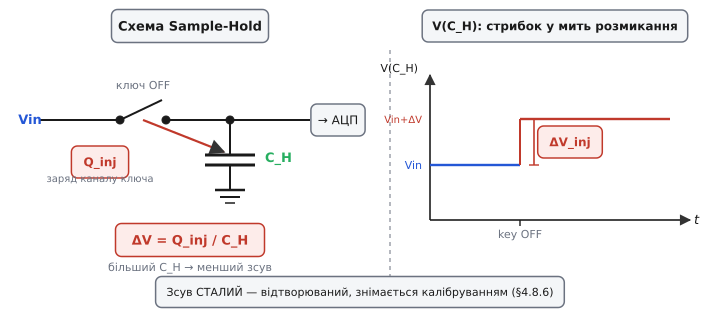
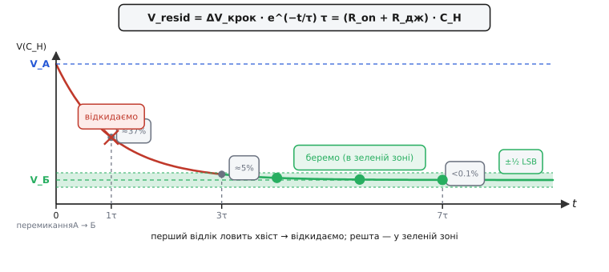

# 🧮 Семпл-холд зблизька: charge injection і перетікання між каналами

> Математична вставка до **теми §4.8.7 «Як правильно зчитати сигнал»**. Там ми сказали якісно: «кволе джерело занижує», «перше читання після перемикання — геть, бо канали протікають один в одного». Тут — **числа під цими двома правилами**: звідки береться фіксований зсув від ключа (charge injection) і за яким законом старий канал «тече» в новий (перехресна завада, crosstalk), і скільки чекати, щоб він зник.

---

## Означення

У §4.8.2 ми побудували модель семпл-холду: керований **ключ** (switch) перед **конденсатором зберігання** C_H (hold capacitor). У мить знімка ключ замикається, C_H за час захоплення t_acq заряджається до Vin, потім ключ розмикається — і конденсатор тримає зафіксоване значення, поки АЦП рахує біти. Ідеально просто. Але реальний ключ вносить дві дрібні неідеальності, які §4.8.7 назвав, та не порахував: їх і закриємо тут.

**Інжекція заряду** (charge injection, Q_inj) — перша неідеальність. Фізичний ключ — це МОН-транзистор: у відкритому стані він утримує в каналі між витоком і стоком певний заряд q_channel, пропорційний напрузі керування і геометрії затвора. Коли ключ **розмикається**, цьому заряду нікуди подітися — і частина його, Q_inj, скидається прямо на C_H, миттєво підіймаючи напругу на ΔV_inj. Важливо, що за сталих умов заряд каналу відтворюється від відліку до відліку — і ΔV_inj виходить **сталим, відтворюваним** зсувом. Це системна похибка, що усувається калібруванням (§4.8.6), а не шум.

**Перехресна завада між каналами** (channel crosstalk) — друга неідеальність. Коли АЦП з мультиплексором (§4.8.7) опитує кілька каналів по черзі, перед кожним новим виміром C_H ще тримає напругу **попереднього** каналу. За скінченний час захоплення t_acq вона спадає до нової напруги не повністю, а лишає «хвіст» — залишок від сусіда підмішується у вимір поточного каналу. Саме це і є кількісний бік фрази §4.8.7 «канали протікають один в одного».

Природа двох ефектів різна — і це визначає спосіб усунення кожного. Charge injection дає **фіксований** зсув від самого ключа: він не залежить від того, який канал читали перед цим, лише від параметрів транзистора і C_H. Crosstalk — це **залежний від передісторії** залишок: він прямо пропорційний різниці між попереднім і поточним каналами. Перший усувається калібруванням (зсув однаковий — просто відняти), другий — витриманим часом або відкинутим першим відліком.

> 🔧 **Навіщо це.** Ці два дрібні ефекти і є тим, чому §4.8.7 радить «перше читання після перемикання — геть» і чому навіть нерухомий вхід дає крихітний сталий зсув від нуля. Знаючи формули, ти бачиш **скільки це у мВ** і **коли хвіст зникне** — і більше не дивуєшся загадковій похибці в три коди.

Назвали — тепер порахуємо обидва.

---

## Формальний апарат

### А. Charge injection як зсув напруги

Інтуїція тут така сама, як завжди з конденсатором: напруга на C_H визначається зарядом через Q = C·V, тож будь-який «доданий» заряд ΔQ змінює напругу на ΔV = ΔQ / C. Ключ у момент розмикання скидає на конденсатор саме Q_inj — частину заряду каналу:

```
ΔV(inj) = Q(inj) / C_H        // зсув від скинутого заряду ключа
Q(inj) ≈ q(channel) · k       // k — частка каналу, що йде на C_H (≈ ½ за симетрії)
```

З формули відразу видно: зсув **обернено пропорційний** C_H. Більший конденсатор «розчиняє» той самий заряд у меншу напругу — і похибка падає. Але тут же ховається компроміс, знайомий з §4.8.2 і §4.8.7: великий C_H → менший charge-injection-зсув → але повільніший заряд (більша τ, гірше для високоомного джерела). Вибір C_H — це знову «точність проти швидкості», наскрізний мотив всього розділу.



*Рис. 4.8.7m.1. Ліворуч: схема S/H; у мить розмикання ключа заряд Q_inj перетікає на C_H. Праворуч: стрибок ΔV_inj на V(C_H) — сталий зсув, тим менший, чим більший C_H.*

### Б. Crosstalk як недоусталений експоненційний хвіст

Після перемикання мультиплексора на новий канал конденсатор C_H стартує від старої напруги V_А і заряджається до нової V_Б через опір — суму R_on (опір відкритого ключа) і R_джерела (опір джерела сигналу, §4.8.7). Це звичайний RC-перехід, і стала часу τ = (R_on + R_джерела) · C_H. Через час t_acq від перемикання напруга на C_H ще не дійшла до V_Б: залишок «старого» каналу дорівнює:

```
τ = (R(on) + R(джерела)) · C_H            // стала часу заряду S/H
V(resid) = ΔV(крок) · e^(−t(acq) / τ)     // залишок старого каналу через час t(acq)
ΔV(крок) = V(старий канал) − V(новий)     // повний стрибок між каналами
```

Прочитаємо формулу словами: за кожні τ залишок зменшується в e ≈ 2.718 раза; за 3τ — вже менше 5%; за 7τ — менше 0.1%, тобто нижче ½ LSB для 12-бітного АЦП за будь-якого розумного ΔV_крок. Звідси і виводиться кількісне правило «скільки чекати» — або, що те саме, «скільки холостих читань відкинути»: потрібно, щоб t_acq ≳ ln(ΔV_крок / допустима похибка) · τ.

«Допустимо мало» означає «менше за ½ LSB» — інакше залишок сусіднього каналу перекручує молодші біти результату. Тобто потрібне число τ прямо залежить від кроку LSB (§4.8.3): що дрібніший LSB, то довше треба чекати. Дванадцятибітний АЦП ESP32 з кроком ~0.8 мВ вимагає більшого часу усталення, ніж восьмибітний з кроком 13 мВ.



*Рис. 4.8.7m.2. Часовий графік після перемикання А → Б. Хрестик — відкинутий холостий відлік (ще в хвості); зелені кружки — нормальні відліки (у ±½ LSB смужці). Червоним — хвіст залишку, зеленим — зона норми.*

> 🔧 **Навіщо це.** Дві формули — дві ручки налаштування. ΔV_inj крутять вибором C_H і калібруванням (зсув сталий — один раз виміряв, завжди компенсуєш). V_resid крутять часом — довше вікно захоплення АБО викинуте перше читання після кожного перемикання каналу. Експонента пояснює, чому **одного** відкинутого відліку зазвичай досить: один повний цикл перетворення — це вже кілька τ, і хвіст іде нижче ½ LSB.

---

## Робочий приклад — числа для ESP32

**Приклад (charge injection і перетікання каналів на 12-бітному АЦП ESP32).** Візьмемо правдоподібні параметри порядку величини для вбудованого SAR S/H (точні — у даташиті конкретного кристала):

```
ВХІДНІ (типові порядки для вбудованого SAR S/H; точні — у даташиті):
  C_H ≈ 3 пФ,  Q(inj) ≈ 0.3 пКл,  R(on)+R(дж) ≈ 2 кОм,  крок LSB ≈ 0.806 мВ

(1) Зсув від charge injection:
  ΔV(inj) = Q(inj)/C_H = 0.3e−12 / 3e−12 ≈ 0.1 В  ← у «голому» S/H помітно!
  у кодах: 0.1 / 0.000806 ≈ 124 LSB   → СТАЛИЙ зсув, знімається калібруванням §4.8.6
  (саме тому виробник додає апаратну компенсацію — без неї похибка величезна)

(2) Перетікання між каналами (стрибок 3.0 В → 0.3 В):
  τ = 2000 · 3e−12 = 6 нс
  ΔV(крок) = 3.0 − 0.3 = 2.7 В
  щоб залишок < ½ LSB ≈ 0.40 мВ:
    e^(−t/τ) < 0.0004/2.7 ≈ 1.5e−4  →  t > τ·ln(6700) ≈ 6 нс · 8.8 ≈ 53 нс
  висновок: за час одного перетворення (~мкс) хвіст давно згас → ОДНЕ відкинуте
  читання після перемикання дає з головою (кількісне обґрунтування правила §4.8.7)
```

Два числа — два характери. Charge injection дає **сталий зсув** ~0.1 В (124 коди) — великий, але однаковий щоразу: саме тому analogReadMilliVolts() і §4.8.6 (калібрування) прибирають його простим відніманням константи. Crosstalk з τ ≈ 6 нс згасає до норми за ~50 нс — набагато швидше, ніж мікросекундний цикл перетворення; тому один відкинутий відлік дає достатньо часу. Це і є поділ «системне / часове», що тримає всю логіку §4.8.7: одне усувається калібруванням, інше — очікуванням протягом кількох τ.

---

## Код: відкинути перше читання після перемикання

Формула сказала «після перемикання каналу викинь перший відлік і усередни решту» — ось як це виглядає в реальному коді ESP32 на Arduino-core. Функція читає заданий ADC1-канал чисто: гасить crosstalk-хвіст і випадковий шум.

```cpp
// ESP32 Arduino-core; у setup(): analogReadResolution(12);
// читає канал ADC1 чисто: гасить перетікання каналу і шум
int readClean(int pin, int n = 16) {
    analogRead(pin);                 // холостий: викидаємо — гасить хвіст старого каналу
    uint32_t acc = 0;                // 32 біти: 16×4095 = 65520, не переповнить
    for (int i = 0; i < n; ++i)      // усереднення: шум ↓ як √n  (§4.8.7)
        acc += analogRead(pin);
    return (int)(acc / n);           // середнє, 0..4095
}
```

Кілька пасток, на які варто зважати при роботі з МК. По-перше, **переповнення суми**: накопичувач `acc` оголошений `uint32_t`, а не `int16_t` — сума 16 відліків по 4095 дає 65520, що спокійно вміщується в 32 біти, але переповнить 16-бітний тип. По-друге, **ADC2 і Wi-Fi**: холостий відлік не допоможе, якщо взяти пін ADC2 — Wi-Fi-радіо захоплює ADC2 і перетворення повертає сміття або −1 (§4.8.1); функцію написано під ADC1. По-третє, **ефект холостого виклику**: платформа сама робить один «прогрівний» цикл усередині кожного `analogRead`, тому тут «викидаємо» **цілий зайвий виклик** саме в момент **перемикання каналу** — на тому самому каналі поспіль цей додатковий виклик уже не потрібен. По-четверте, **назад у вольти**: `analogReadMilliVolts()` (§4.8.6) на ESP32-Arduino додатково знімає заводський зсув і нелінійність через вбудовану таблицю калібрування — це наступний крок від «сирого коду» до реальних мілівольтів.

---

## Де в курсі це працює

Ця вставка — кількісний фундамент двох конкретних практик §4.8.7. «Відкинь перше читання після перемикання» тепер має ім'я: це час, потрібний, щоб V_resid = ΔV_крок · e^(−t/τ) впав нижче ½ LSB (формула Б). «Навіть нерухомий вхід має дрібний сталий зсув» — це ΔV_inj = Q_inj / C_H (формула А), і саме тому §4.8.6 / `analogReadMilliVolts` прибирає його калібруванням. C_H — той самий конденсатор §4.8.2; τ = R·C_H — та сама стала часу, що в §4.8.7 «опір джерела»; «менше ½ LSB» — крок §4.8.3. Усе вже знайоме, тільки тепер зв'язано числами.

Обидва ефекти — наслідок того, що всередині схеми сидить **реальний** ключ і конденсатор, а не ідеальна математика. Коли каналів багато і вони перемикаються швидко, питання усталення стає головним і впливає на максимальну безпечну частоту опитування. А чому АЦП взагалі тримає той конденсатор і як він робить кроки зважування — зсередини покаже §4.8.8 (типи АЦП, SAR). Дві формули — одна про сталий зсув (калібрування), друга про час згасання (відкинутий відлік) — і є тим поділом «системне/часове», що тримає весь §4.8.7.
