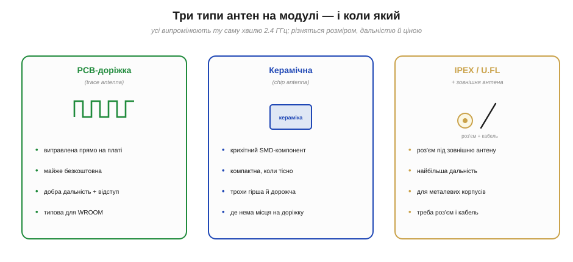
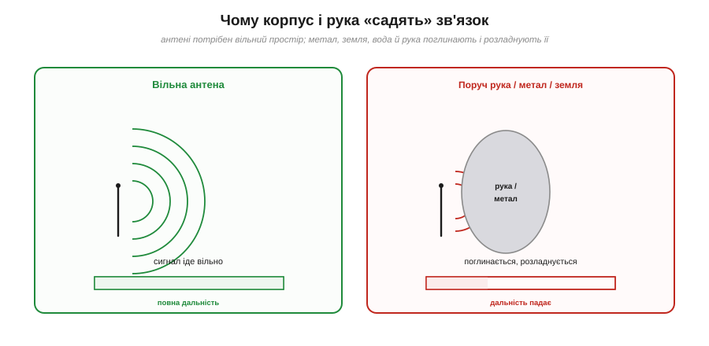

# 🔌 Антена: PCB-доріжка, керамічна, IPEX — і чому корпус «садить» зв'язок

> Друга компонентна вставка до **теми [§4.1.2 «Складові МК»](ch20-mcu-esp32.md)**, продовження розмови про [модуль](ch20-s2-c-wroom-module.md). Радіо без антени німе; тут — які антени бувають і чому зв'язок так легко зіпсувати. Фізику радіохвиль детально розберемо в **Розділі 6.8** — тут лише практичний бік.

## Що це за деталь

**Антена** — частина, що перетворює електричний сигнал радіо на хвилі в повітрі (і навпаки). На модулях ESP32 вона буває **трьох видів**, і вибір між ними — це компроміс «розмір ↔ дальність ↔ ціна» (Рис. 4.1.2c.3).

*Рис. 4.1.2c.3. Три варіанти. **PCB-доріжка** — витравлена прямо на платі: майже безкоштовна, з доброю дальністю, типова для WROOM. **Керамічна** — крихітний SMD-компонент: коли на доріжку бракує місця. **IPEX/U.FL роз'єм** — під зовнішню антену: найбільша дальність і єдиний вихід для металевих корпусів, ціна — роз'єм і кабель.*

- **PCB-доріжка (*trace antenna*).** Мідний візерунок-меандр на краю плати модуля. Нічого не коштує (це просто частина друку), а працює добре — тому це варіант за умовчанням на більшості модулів WROOM-класу.
- **Керамічна (*chip antenna*).** Маленький окремий компонент із діелектрика. Бере менше місця, ніж доріжка, але трохи дорожча й зазвичай трохи гірша. Її ставлять, коли плату треба зробити дуже тісною.
- **IPEX / U.FL роз'єм.** Не антена сама по собі, а **гніздо** для зовнішньої антени на кабелі. Дає найбільшу дальність і — головне — дозволяє винести антену **назовні** металевого корпусу.

## Чому корпус і рука «садять» зв'язок

Антена випромінює добре лише тоді, коли довкола неї **вільний простір**. Усе провідне чи вологе поруч — суцільна мідь землі, металева стінка корпусу, акумулятор, вода, людська рука — **поглинає** енергію й **розладновує** антену, зсуваючи її з робочої частоти. Дальність падає, інколи в рази (Рис. 4.1.2c.4).

*Рис. 4.1.2c.4. Та сама антена, дві ситуації. Ліворуч — вільна: сигнал іде на повну дальність. Праворуч — поряд рука чи метал: хвиля поглинається й розладновується, дальність обвалюється. Звідси «затискання» зв'язку рукою, знайоме за телефонами.*

Звідси два головні правила. По-перше, **зона відступу (*keep-out*)**: під антеною й біля неї **не можна** класти мідь, доріжки чи полігон землі, а сам модуль ставлять **краєм плати** назовні. По-друге, **металевий корпус ≈ глуха коробка для радіо**: якщо пристрій у металі, антену треба винести назовні — саме для цього й існує IPEX-роз'єм.

## Типові граблі

- **Мідь чи земля під антеною** — найчастіша помилка розводки; зв'язок слабшає, хоч усе «начебто працює».
- **Металевий корпус без зовнішньої антени** — пристрій ловить за пів метра замість десятків метрів. Лік — модуль із IPEX і антена назовні.
- **Антена впритул до акумулятора, екрана чи руки** — той самий ефект поглинання; лишай їй простір.
- **Дешевий U.FL-пігтейл** поганої якості з'їдає частину виграшу від зовнішньої антени.

## Варіації класу

Той самий модуль часто випускають у двох версіях: з **PCB-антеною** (для пластикових корпусів) і з **U.FL-роз'ємом** (для металевих чи задач на дальність) — їх легко відрізнити за маркуванням (часто суфікс **-U**). Зовнішні антени теж різні (штир, диполь, спрямовані), але їхній підбір і фізику підсилення лишаємо Розділу 6.8.

> ▶️ Повернутися до теми: [§4.1.2 — Складові МК](ch20-mcu-esp32.md) · поряд: [модуль зсередини](ch20-s2-c-wroom-module.md)
