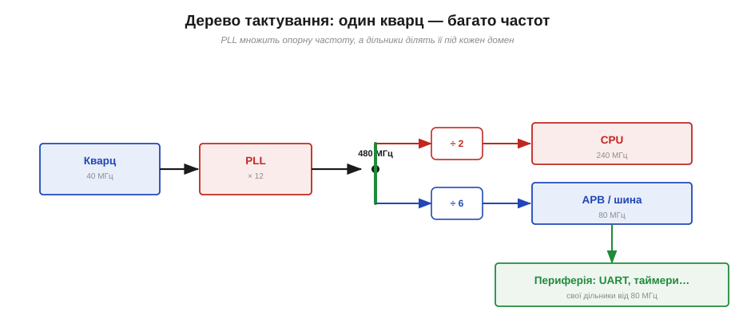
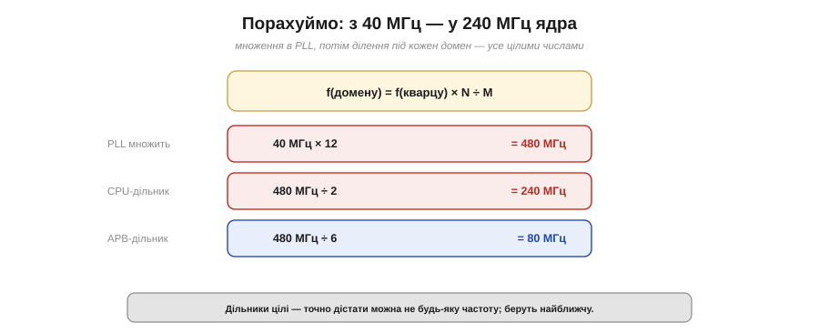

# 🧮 Дерево тактування: PLL і дільники — з 40 МГц у 240 МГц

> Математична вставка до **теми [§4.1.4 «Тактування й живлення»](ch20-mcu-esp32.md)**. Там ми бачили, що в чипа один кварц, але багато ритмів. Тут — як саме арифметика перетворює **40 МГц** кварцу на **240 МГц** ядра й решту тактів.

## Означення

**PLL** (*phase-locked loop*, петля фазового автопідстроювання) — схема, що **множить** опорну частоту на ціле число: з 40 МГц робить, скажімо, 480 МГц. **Дільник** (*divider*) — навпаки, **ділить** частоту на ціле. А **дерево тактування** (*clock tree*) — це мережа, що розводить похідні такти кожному вузлу: ядру, шині, периферії.

## Інтуїція: чому множать, а не беруть кварц одразу на 240 МГц

Здавалося б, простіше поставити кварц на потрібну частоту. Але високочастотні кварці незручні й менш стабільні, а головне — опорну частоту тут **диктує радіо**: йому потрібні саме 40 МГц (про це — [вставка про кварц](ch20-s4-c-crystal.md)). Тож роблять розумніше: беруть один **чистий і точний** опорний такт і **множать** його вгору до «майстра», а тоді **ділять** під кожен домен (Рис. 4.1.4m.1). Одне стабільне джерело — багато похідних частот. Це той самий прийом, що й у «дорослому» комп'ютері: там базовий такт у сотню мегагерц так само множать до гігагерців ядра — інженерія всюди однакова.


*Рис. 4.1.4m.1. Від кварцу до доменів. PLL множить 40 МГц на 12 → 480 МГц «майстер». Звідти дільники: ÷2 дає 240 МГц ядру, ÷6 — 80 МГц шині APB, а вже від неї периферія робить свої такти власними дільниками.*

## Формальний апарат

Уся арифметика зводиться до множення в PLL і ділення дільником:

```
f(PLL)    = f(кварцу) × N           ← множення в PLL
f(домену) = f(PLL)    ÷ M           ← дільник домену
```

Підставмо числа ESP32 (Рис. 4.1.4m.2):

```
PLL:   40 МГц × 12 = 480 МГц        ← «майстер»
CPU:   480 МГц ÷ 2  = 240 МГц       ← ядро на повній швидкості
APB:   480 МГц ÷ 6  = 80  МГц       ← шина периферії
```


*Рис. 4.1.4m.2. Та сама формула в числах. Спершу PLL підіймає 40 до 480, а тоді цілі дільники роздають 240 ядру і 80 шині.*

Тут ховається важлива тонкість: **дільники цілі**. Тому з даної опорної частоти точно дістати можна **не будь-яку** частоту, а лише ту, що ділиться націло. На практиці беруть **найближчу можливу** й живуть із невеликою похибкою — про це варто пам'ятати, коли потрібна якась конкретна частота (швидкість UART, крок таймера). Деякі чипи додають ще й **дробові** дільники (*fractional-N* PLL), щоб дотягтися до незручних частот точніше, — але ціною трохи більшого тремтіння такту (джитера).

## Де це працює в курсі

Дерево тактування — не абстракція, а основа щоденних розрахунків:

- **Швидкість CPU ↔ споживання.** Зменшив дільник або частоту PLL — ядро повільніше, зате гріється й їсть менше (енергоощадність — §4.1.4). Це той самий важіль, що й режими сну, тільки плавніший.
- **Такти периферії.** UART, таймери, ШІМ, АЦП беруть свій такт **від APB (80 МГц)** і ділять його далі власними дільниками. Тому й швидкість порту, і крок таймера — це знову «80 МГц ÷ щось».
- **Похибка частоти.** Цілі дільники означають, що рівно потрібну швидкість UART чи частоту ШІМ можна не влучити; як рахувати цю похибку й обирати найближчий дільник — у Розділі 4.6 (таймери) і далі.

> ▶️ Повернутися до теми: [§4.1.4 — Тактування й живлення](ch20-mcu-esp32.md)
