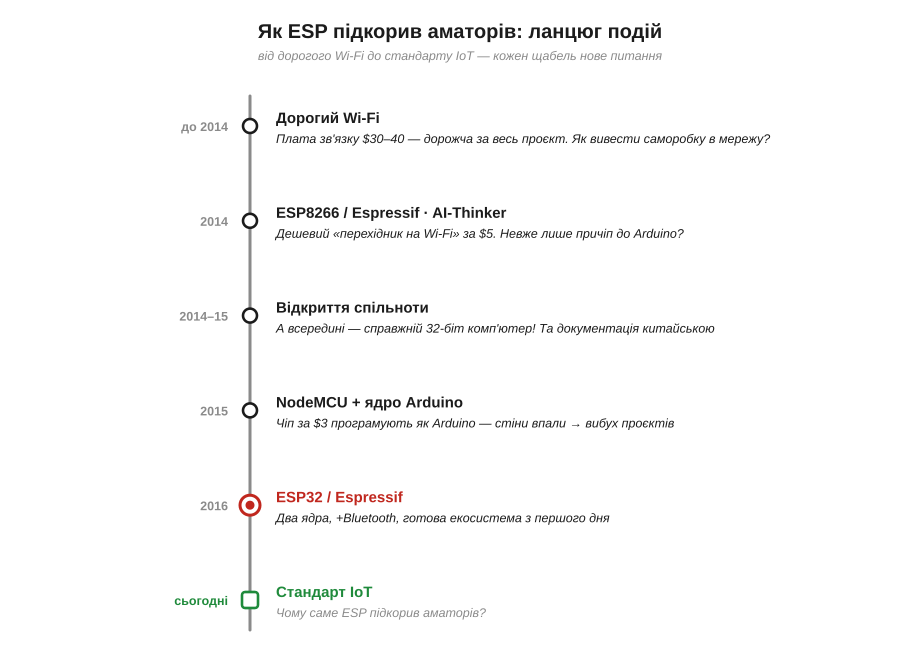
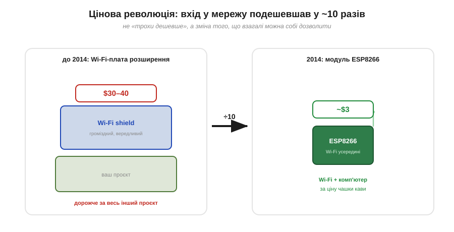
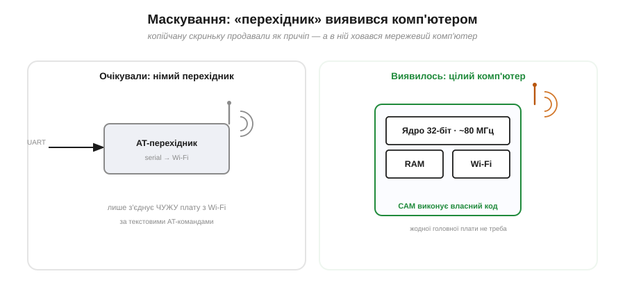
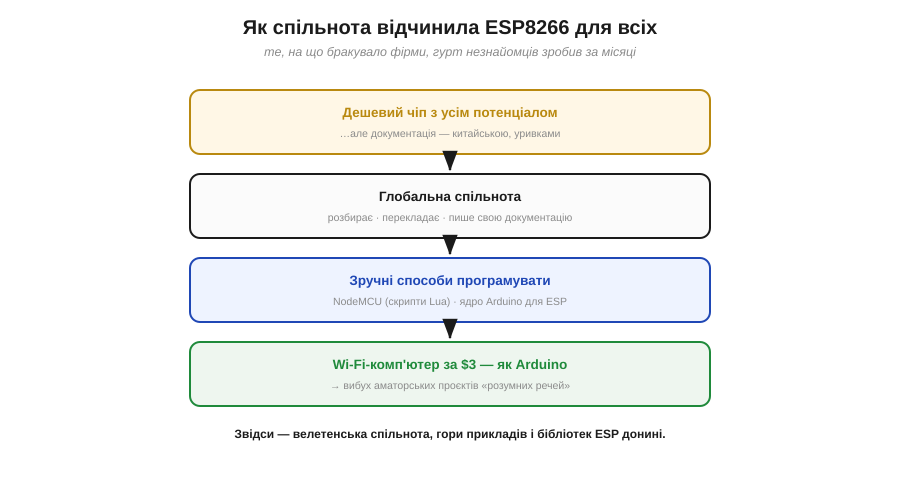
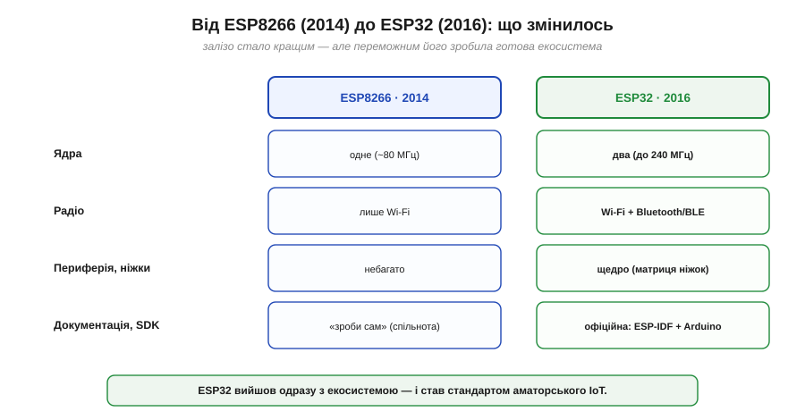

# 📜 Як дешевий Wi-Fi чип підкорив аматорів: ESP8266 → ESP32

> Історична вставка до [§20.5 «Архітектура ESP32»](ch20-mcu-esp32.md). Тут — не суха хроніка «фірма випустила чіп», а **детективна історія** про те, як безіменна дешева крихта з Шанхаю, яку продавали за кілька доларів як простенький «перехідник на Wi-Fi», виявилася замаскованим комп'ютером — і за пару років, руками тисяч ентузіастів з усього світу, перевернула всю аматорську електроніку. Це розповідь про випадок, про глобальну добровольчу спільноту, що зробила за рік те, чого не зробила компанія, і про рідкісну мудрість фірми, яка **обійняла власних хакерів** замість того, щоб із ними воювати.

У [§20.5](ch20-mcu-esp32.md) ми розібрали, **що** в ESP32 всередині: два ядра, пам'ять, радіо, щедра периферія. Та лишилося питання, на яке сама специфікація не відповідає: **чому** саме цей чіп — а не вироби славетних, давно знаних брендів — став фактичним стандартом «розумних речей» у мільйонах майстерень? Відповідь не в транзисторах, а в історії. І починається вона з прозаїчної біди: колись вивести свій проєкт у мережу коштувало непристойно дорого.

*Рис. 20.5i.1. Шлях ESP: дорогий Wi-Fi до 2014 → несподіваний дешевий ESP8266 («перехідник») → відкриття, що це комп'ютер → спільнота робить його зручним (NodeMCU, ядро Arduino) → ESP32 (2016) з уроками засвоєними → стандарт аматорського IoT. Кожен щабель — нове питання, що штовхало далі.*

---

## Доба дорогого Wi-Fi: чому проєкт важко було «вивести в мережу»

Уявімо аматора десь до 2014 року. Зібрати щось на мікроконтролері — кнопку, давач, мотор — коштувало копійки. Та варто було захотіти **під'єднати це до інтернету** чи бодай до домашньої мережі — і ціна стрибала в небо. Wi-Fi-плата розширення (*shield*) для популярних плат коштувала **30–40 доларів** — часто **дорожче за весь інший проєкт разом узятий**, — а ще й була вередливою в налаштуванні й ненажерливою до пам'яті.

Виходив гіркий парадокс: обчислення подешевшали до копійок, а **зв'язок** лишався розкішшю. Бездротова мережа була привілеєм «справжніх» промислових виробів, а не десятидоларової саморобки. Тисячі макерів хотіли, щоб їхні речі «заговорили» в мережу, — і впиралися в ту саму стіну ціни.

*Рис. 20.5i.2. Що сталося з ціною входу в мережу. Ліворуч — типова Wi-Fi-плата розширення до 2014 року: ≈30–40 доларів, дорожча за решту проєкту. Праворуч — модуль ESP8266: **кілька доларів** за чіп, що несе Wi-Fi усередині. Десятикратне падіння ціни — не «трохи дешевше», а зміна того, **що взагалі можна собі дозволити** в аматорському проєкті.*

> 🔧 **Навіщо це.** Ціна — не дрібниця десь «поряд» з технікою, а сила, що вирішує, які проєкти взагалі **народяться**. Поки під'єднання до мережі коштувало як невеликий прилад, «розумних речей» від аматорів майже не було. Щойно воно впало до ціни чашки кави — їх ринули робити тисячами. Тримайте це в голові, коли в [§20.6](ch20-mcu-esp32.md) зважуватимете, який чіп брати: іноді головний аргумент — не швидкість, а те, що вже **вбудовано** в копійчаний корпус.

---

## Несподіваний гість із Шанхаю: ESP8266 (2014)

Героя цієї історії зробила маловідома тоді китайська компанія **Espressif Systems** (Шанхай) — «безфабрична» (*fabless*) фірма, заснована **2008 року** (її незмінний керівник — **Тео Сві Анн**, *Teo Swee Ann*). 2014 року Espressif випустила крихітний і вкрай дешевий Wi-Fi-чіп — **ESP8266**.

До західного світу макерів він прийшов не сам, а в подобі малесенького модуля **ESP-01** від стороннього виробника **AI-Thinker**: плата завбільшки з поштову марку, вісім ніжок, антена-доріжка — і ціна на торгових майданчиках усього **кілька доларів** (а згодом і того менше). На вигляд — дрібничка, якій важко довіряти.

І продавали його **не як комп'ютер**. ESP8266 пропонували як **«перехідник із послідовного порту на Wi-Fi»** (*serial-to-Wi-Fi*): мовляв, під'єднай цей модуль до своєї звичної плати по проводах UART, надсилай йому прості текстові команди (так звані **AT-команди**) — і твоя плата дістане Wi-Fi. Модуль мав бути скромним «радіо-причепом» до головного мікроконтролера, не більше.

Варто оцінити, наскільки доброю була ця крихта **на свою ціну**. За кілька доларів ESP8266 ніс 32-бітне ядро, пристойний обсяг пам'яті й повноцінний Wi-Fi — те, що ще вчора коштувало вдесятеро більше. Дешевим його робила й сама **бізнес-модель**: Espressif — «безфабрична» (*fabless*) фірма, тобто лише **проєктує** чіп, а виготовляють його на чужих заводах; а вже сторонні майстерні (як та ж AI-Thinker) клепають із нього копійчані **модулі** — чіп плюс кварц, флеш і антена на маленькій платі. Цей поділ праці й давав на виході ту смішну ціну, за якою чіп розходився мільйонами, — а заразом і строкатий «зоопарк» модулів різних виробників навколо одного й того ж кремнію.

*Рис. 20.5i.3. Розрив між очікуванням і дійсністю. **Очікували:** дешевий німий «перехідник», що тільки й уміє, що з'єднати чужу плату з Wi-Fi за AT-командами. **А всередині виявилось:** повноцінне 32-бітне ядро (~80 МГц) з пам'яттю й тим самим Wi-Fi — тобто самодостатній комп'ютер, якому жодна «головна плата» не потрібна. Маскування під дрібничку й стало головним сюрпризом.*

---

## Таємниця в корпусі: це ж цілий комп'ютер!

Допитливі ентузіасти, колупаючи цей «перехідник», зробили відкриття, що й заклало всю подальшу історію: усередині ESP-01 ховався **справжній 32-бітний процесор** (ядро Tensilica Xtensa, близько 80 МГц) із цілком пристойним обсягом пам'яті. Тобто чіп, який продавали як безмозкий додаток до Arduino, **сам був комп'ютером** — і чудово міг виконувати **власний** код користувача, без жодної головної плати поряд. За кілька доларів людина діставала не «радіо-причіп», а маленький мережевий комп'ютер.

Був, однак, серйозний затик. Уся документація й мізерний набір інструментів від виробника були майже повністю **китайською**, уривчасті й загадкові. Світова спільнота тримала в руках копійчану скриньку з величезним потенціалом — і **без зрозумілої інструкції**, як цей потенціал дістати. Саме цей розрив — гігантські можливості при нульовій документації — і перетворив ESP8266 з товару на **спільну справу**.

---

## Світ розбирає чіп: спільнота за рік зробила те, чого не зробила фірма

Те, що сталося далі, — узірець сили відкритої спільноти. Навколо чипа стихійно зібралася **глобальна добровольча громада**: ентузіасти з усього світу на форумах (зокрема на esp8266.com) і в репозиторіях коду заходилися **розбирати чіп на гвинтики** — досліджувати, перекладати уривки китайських даташитів, писати власну документацію, ділитися знахідками. Те, на що в компанії бракувало рук і бажання, гурт незнайомців зробив **за лічені місяці**. І робив це з самої лише цікавості й азарту: тисячі людей, що ніколи не бачили одне одного, складали спільну мозаїку знань про чужий чіп швидше, ніж устигав би будь-який відділ розробки. Кожна знахідка — який регістр за що відповідає, як обійти ваду, як залити свою прошивку — миттєво ставала спільним надбанням на форумах і в сховищах коду.

Двома вирішальними «ключами», що відчинили чіп для всіх, стали зручні способи його **програмувати**. Спершу з'явилася прошивка **NodeMCU**, яка дала змогу писати для ESP8266 простими скриптами (мовою Lua) — і заразом подарувала ім'я цілій популярній платі. А далі сталося головне: спільнота (на чолі з розробником **Іваном Грохотковим**, *Ivan Grokhotkov*, та багатьма дописувачами) зробила **ядро Arduino для ESP8266** — прошарок, що дозволив програмувати цей китайський чіп у звичному, знайомому мільйонам середовищі **Arduino**, тими самими `setup()` і `loop()`.

Оце й був переломний момент. Зненацька **комп'ютер із Wi-Fi за три долари** можна було програмувати так само легко, як шкільну Arduino. Вартісна стіна впала, технічна стіна впала — і почався вибух: проєкти «розумних речей» полилися тисячами.

І проєкти полилися найрізноманітніші: метеостанції, що самі викладають погоду в інтернет; вимикачі світла, керовані з телефону; лічильники води, давачі вологи ґрунту, поштові скриньки, що шлють сповіщення на пошту. Усе те, що доти або не існувало в аматорів, або вимагало дорогої й вередливої обв'язки, тепер робилося на копійчаному модулі за вечір. Дешевий мережевий комп'ютер, який легко програмувати, не просто здешевив старі ідеї — він **відчинив двері цілому жанру** саморобок, яких раніше й не уявляли.

*Рис. 20.5i.4. Ланцюг, що відчинив ESP8266 світові. Дешевий чіп з усім потенціалом, але документація — китайською й уривками. Глобальна спільнота розбирає, перекладає, документує. З'являються зручні способи програмувати: NodeMCU (скрипти Lua) і, головне, **ядро Arduino**. Підсумок: комп'ютер із Wi-Fi за $3, програмований як Arduino, — і вибух аматорських проєктів.*

> 🔧 **Навіщо це.** Ось звідки слова й інструменти, які ви ще зустрінете. **AT-команди** — спадок тих часів, коли ESP був «перехідником» (досі так керують деякими радіомодулями). **NodeMCU** — і прошивка, і назва дешевої плати на ESP8266. **Ядро Arduino для ESP** — те, завдяки чому ви програмуєте ESP32 знайомими `setup()`/`loop()`. А головне — ось **чому** в ESP така велетенська спільнота, гори прикладів і бібліотек: екосистему збудували самі користувачі, і ця інерція добра живе досі.

---

## Фірма, що обійняла власних хакерів

Тут історія могла піти банально: компанія сердиться, що її чіп «використовують не так», судиться, закручує гайки — і вбиває диво. Espressif вчинила навпаки, і саме це рішення зробило її переможцем. Замість воювати зі спільнотою, що самочинно розкрила її чіп, фірма **повернулася до неї обличчям**: почала покращувати документацію, підтримувати відкриті інструменти, а ключових дописувачів громади — зокрема того ж Івана Грохоткова — **взяла до себе на роботу**.

Це рідкісна й далекоглядна мудрість: визнати, що твою річ найкраще «доробили» сторонні, і не привласнити перемогу силою, а **спертися** на тих людей. Espressif перестала бути просто виробником кремнію й почала свідомо плекати **екосистему** — бо зрозуміла, що продає не лише чіп, а й усю гору спільнотного коду, прикладів і доброзичливості навколо нього.

Плоди цього рішення видно й нині. Навколо ESP виросла повноцінна **інструментальна екосистема**: офіційний набір **ESP-IDF** на операційній системі реального часу — для серйозних проєктів; підтримка звичного **Arduino** — для швидких; зручні середовища на кшталт PlatformIO; гори бібліотек, прикладів і форумних відповідей мало не на будь-яке питання. Фірма, що колись віддала чіп геть без інструкції, за кілька років перетворилася на одну з найвідкритіших до спільноти в усій галузі — і саме ця відкритість, не менше за вдалі транзистори, тримає ESP на вершині донині.

---

## Тіснота ESP-01 і дорога до ширших модулів

У піонера були й болючі вади, і саме вони накреслили, що має виправити наступник. Найвідоміша — **тіснота ніжок**: у крихітного ESP-01 назовні виводилося лише дві придатні ніжки, і для справжнього проєкту їх катма. Спільнота швидко перейшла на ширші модулі тієї ж родини (як-от популярний **ESP-12**) з куди більшим числом виводів. Та сам чіп усе одно лишався затісним: **одне** ядро, обмаль периферії, вічна боротьба за кожну ніжку й кілобайт пам'яті. До того ж радіо й програма ділили один процесор, тож складний обмін по Wi-Fi міг «затинати» вашу логіку.

Коли Espressif сідала проєктувати наступника, перед очима був готовий, вистражданий спільнотою **список претензій**: мало ніжок, мало периферії, одне ядро, нема Bluetooth. І вона врахувала їх усі.

## ESP32 (2016): уроки засвоєно

З цим новим розумінням Espressif і випустила **2016 року** наступника — **ESP32**, той самий чіп, що ми його розбирали в [§20.5](ch20-mcu-esp32.md). Він виправив усі тісні місця ESP8266, яких спільнота нахльоталася: замість одного ядра — **два**; до Wi-Fi додався **Bluetooth** (і класичний, і енергоощадний BLE); побільшало пам'яті, ніжок і периферії.

Та головний урок був **не про залізо**. ESP32 вийшов **одразу з екосистемою**: пристойною документацією, офіційним набором інструментів (**ESP-IDF**, побудованим на операційній системі реального часу) і підтримкою того самого Arduino **з першого дня**. Там, де ESP8266 був скарбом, який спільнота відкопувала наосліп, ESP32 подавали вже з картою й лопатою. Espressif проєктувала тепер **не просто чіп, а цілий світ навколо нього** — і саме тому ESP32 так стрімко став типовим «мозком» аматорського IoT, а заразом прописався в безлічі серійних виробів. (Через кілька років, 2019-го, Espressif вийшла на біржу — гідний фінал для фірми, що почалася з копійчаного «перехідника».)

*Рис. 20.5i.5. Від ESP8266 до ESP32. Зліва — піонер 2014-го: одне ядро, лише Wi-Fi, мало ніжок, документація «зроби сам». Справа — ESP32 2016-го: **два ядра**, Wi-Fi **і Bluetooth**, багато периферії — і, найважливіше, **офіційна екосистема** (ESP-IDF, Arduino, документи) з першого дня. Залізо стало кращим, але переможним його зробив саме готовий світ навколо.*

---

## Що з цього лишилось нам

Озирнімося на цей стрімкий злет — якихось два роки від «перехідника» за п'ять доларів (2014) до ESP32 (2016), що став стандартом. Чим він навчає й що по собі лишив:

- **ESP32 — фактичний стандарт** аматорського «інтернету речей» і частий гість серійних виробів; його популярність — не випадковість і не лише заслуга транзисторів, а наслідок цієї історії.
- слова й інструменти, з якими ви працюватимете, — **AT-команди**, **NodeMCU**, **ESP-IDF**, **ядро Arduino для ESP** — це закам'янілі сліди тих подій;
- велетенська **спільнота, приклади й бібліотеки** навколо ESP — пряме відлуння того, що екосистему від початку будували самі користувачі, а фірма мудро на них сперлася;
- і головний урок, ширший за електроніку: **дешеве + відкрите + спільнота** перемагає **дороге + закрите + наодинці**. ESP демократизував мережевий комп'ютер — зробив його доступним кожному, хто має кілька доларів і цікавість;
- а ще — **очікування** змінилися назавжди: дешевий комп'ютер із бездротовим зв'язком на борту став сприйматися як належне, а не розкіш, — і саме на цій новій нормі тримається весь сучасний «інтернет речей».

Тепер зрозуміло, **чому** чіп із §20.5 такий улюблений і так добре підтриманий: за його щедрою специфікацією стоїть не лише вдале залізо, а й рідкісно щаслива історія. А далі ми спустимося з небес на землю й тверезо спитаємо: чи **завжди** потрібна така потужність — і коли для справи цілком досить простого, ще дешевшого 8-бітного МК?

---

- ▶️ Далі: [§20.6 ESP32 проти простого 8-біт МК — коли більша потужність важлива](ch20-mcu-esp32.md)
- [§20.5 Архітектура ESP32](ch20-mcu-esp32.md) — що саме в цьому чипі всередині (залізо, яке тут дістало свою історію).
- [Історія розділу: перший мікроконтролер](ch20-history-first-mcu.md) — де цей епізод стоїть у загальному ряду (калькулятор → перший МК → … → ESP32).
