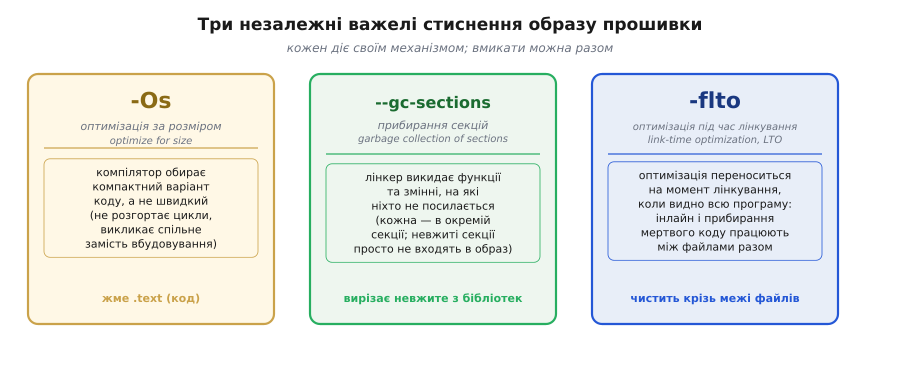
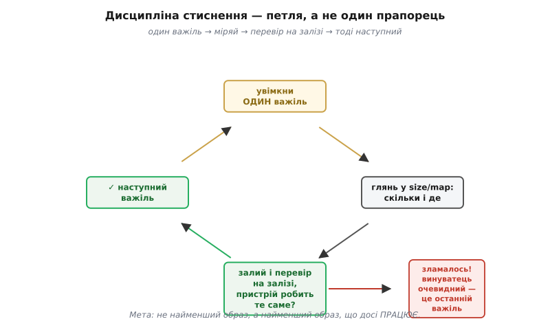

# ⚙️ -Os, gc-sections і LTO: стиснути образ, не зламавши його

> Алгоритмічна вставка до **теми [§4.2.4 «Образ прошивки й карта пам'яті»](ch21-toolchain.md)**. Образ не вміщується у Flash — або ви просто хочете лишити запас. Є три перевірені важелі, щоб його стиснути, і кожен діє по-своєму. Та кожен має й тіньовий бік: надто завзяте стиснення інколи **викидає потрібне**. Розберімо, що вмикати й у якому порядку — і як переконатися, що образ після цього досі живий.

## Задача

Map-файл назвав винуватця (§4.2.4a) — і тепер постає нове питання: як зменшити `.text`, не переписуючи логіку? Бюджет Flash = `.text` + `.data` вже знайомий із §4.2.4; там само ми побачили, що OTA-оновлення потребує місця для двох версій прошивки одночасно. Коли лінкер раптово видає «`region 'iram0_0_seg' overflowed by 4832 bytes`», або коли ви хочете залишити запас для другого слота OTA, — перша думка буває «треба різати». Але різати що і як?

Тут два абсолютно різних питання: зробити образ **меншим** — і переконатися, що він і далі **робить те саме**. Саме в цьому й полягає складність: компілятор і лінкер мають кілька важелів стиснення, кожен тисне свій шар, і кожен може щось зламати, якщо не розуміти механізму. Тому розберемо три незалежні інструменти — і відразу дисципліну перевірки після кожного з них.

## Ідея: три незалежні важелі стиснення

Кожен важіль вирішує задачу по-своєму й не чіпає решту. Вмикати їх можна разом, але розуміти — окремо (Рис. 4.2.4b.1).

### Важіль 1 — -Os: попросити компілятор про малий код

Рівні `-O0` / `-O2` / `-Os` ми вже бачили в [оптимізаторі](ch21-s2-a-optimizer.md); тут важливий лише наслідок для розміру. З прапорцем `-Os` компілятор обирає серед можливих варіантів машинного коду найкомпактніший: не розгортає цикли, вважає за краще зробити виклик спільного фрагмента, ніж вбудовувати його щоразу заново. Ціна — трохи повільніший код; на мікроконтролері це здебільшого прийнятно, бо Flash зазвичай тісніший за такти. Зона дії — суто `.text` (код): `.bss`-буфери та глобальні змінні не зачіпаються.

### Важіль 2 — gc-sections: викинути код, якого ніхто не кличе

Це серце вставки, і тут найбільше нового. Механізм двоступеневий — і обидві половини обов'язкові. Спочатку пара прапорців `-ffunction-sections` / `-fdata-sections` каже компілятору покласти **кожну** функцію й кожну змінну в окрему секцію ELF-файлу. Потім лінкер із прапорцем `-Wl,--gc-sections` (прибирання секцій, *garbage collection of sections*) викидає будь-яку секцію, на яку **жодна** інша не посилається. Без першого кроку — розкладання по секціях — лінкеру нема звідки вибирати: він не може вирізати половину секції, лише цілу. Тому обидві частини завжди ходять у парі.

Звідки економія: підключили бібліотеку заради однієї функції — решта її функцій просто не потрапить в образ. Це точне продовження «прибирання мертвого коду» з §4.2.3, і саме той прийом, що його рекомендує map-файл у рядку «жирна бібліотека → `--gc-sections`» (§4.2.4a).

Чесне застереження: на ESP32 та в Arduino-ядрі ці прапорці зазвичай **вже ввімкнені за замовчуванням**. Говоримо про них не для того, щоб «увімкнути те, що вже ввімкнено», — а щоб зрозуміти механізм і не зламати образ ненароком. Про те, де саме можна помилитися, — у пастках нижче.

### Важіль 3 — LTO: оптимізувати наскрізь, через межі файлів

Роздільна компіляція з §4.2.2 дає зручність, але й обмеження: компілятор бачить лише один `.c`-файл за раз. Через це він не може вбудувати крихітну функцію із сусіднього файлу і не виявить мертвий код, розкиданий між двома одиницями трансляції. LTO (оптимізація під час лінкування, *link-time optimization*) переносить частину оптимізації на момент компонування, коли в пам'яті — вся програма цілком: тоді вбудовування функцій і прибирання невжитого коду працюють і через межу файлу. Прапорець `-flto` треба вказати і на стадії компіляції, і на стадії компонування.

Ціна подвійна. По-перше, помітно довша збірка: компонувальник тримає в пам'яті «IR» усіх файлів і потім ще раз їх оптимізує. По-друге, LTO інколи виявляє приховані помилки невизначеної поведінки (UB), що перетинали межі файлів: нагадування з §4.2.2a — оптимізатор вважає, що UB не трапляється, і тепер ця логіка поширюється ширше. Зона дії LTO охоплює і розмір, і швидкість водночас.



*Рис. 4.2.4b.1. Три незалежні способи зменшити образ. **-Os** — компілятор обирає компактний код (жме .text). **gc-sections** — лінкер викидає секції без посилань (вирізає невжите з бібліотек). **LTO** — оптимізація під час лінкування бачить усю програму і чистить крізь межі файлів. Кожен діє своїм механізмом; вмикати можна разом.*

## Як це вмикають: робочий приклад

У ESP-IDF це перемикач у `menuconfig` → Compiler optimization → **Size** (`-Os`); прапорці gc-sections увімкнені в дефолтному наборі; LTO можна додати вручну. В Arduino ситуація схожа: `gc-sections` здебільшого вже в дефолті, `-Os` — в налаштуваннях плати. Але ось що за цим стоїть:

```
-Os                                  ← компактний код (не розгортає цикли)
-ffunction-sections -fdata-sections  ← кожна функція/змінна в окрему секцію
-Wl,--gc-sections                    ← лінкер викидає секції без посилань
-flto                                ← оптимізація крізь межі файлів
```

**Де gc-sections рятує — і де воно небезпечне:**

```cpp
#include <Arduino.h>

// Велика таблиця тонів — читається лише DMA-периферією за покажчиком,
// статичного посилання з коду нема → gc-sections може вирізати!
// Атрибут __attribute__((used)) каже лінкеру: «лишити навіть без посилань»
static const uint16_t TONE_TABLE[] __attribute__((used)) = {
    261, 294, 330, 349, 392, 440, 494, 523
};

// Цю функцію кличе loop() — статичне посилання видно лінкеру,
// gc-sections її не чіпає
static void play_tick(uint16_t freq) {
    // ... виводить частоту на таймер ...
    (void)freq;
}

// Обробник переривання: на нього посилається лише таблиця векторів,
// яку збирає лінкер-скрипт — статичного виклику з C-коду немає.
// Без __attribute__((used)) gc-sections може його вирізати!
void IRAM_ATTR TIMER0_IRQHandler() __attribute__((used));
void IRAM_ATTR TIMER0_IRQHandler() {
    // ... обслуговує переривання таймера ...
}

void setup() {}

void loop() {
    play_tick(TONE_TABLE[0]);  // ← статичне посилання: лінкер бачить, лишає
}
```

Для звичайного коду `gc-sections` безпечне — статичні виклики компонувальник бачить і нічого не вирізає. Небезпечним воно стає рівно там, де посилання **не статичне**: таблиця векторів переривань, реєстрація через покажчик під час виконання, доступ лише з апаратного блоку. Для таких випадків — `__attribute__((used))` або `KEEP()` у скрипті компонувальника.

## Складність і пастки на МК

- **Міряй до і після.** Після кожного важеля гляньте у звіт `size` або map-файл (§4.2.4, §4.2.4a): скільки байтів стало менше і в якій секції. Стиснення наосліп — це змарнований день; число зі звіту каже, чи мав важіль взагалі сенс (Рис. 4.2.4b.2).

- **gc-sections викидає потрібне, якщо посилання не статичне.** Типові випадки: обробник переривання в таблиці векторів; функція, зареєстрована покажчиком під час виконання (зворотний виклик); символ, потрібний лише завантажувачу або скрипту компонувальника. Це та сама пастка, що «зниклий код» в [оптимізаторі](ch21-s2-a-optimizer.md), — лише тепер вирізає компонувальник, а не компілятор. Ліки: `__attribute__((used))`, `KEEP()` у скрипті компонувальника, або явне посилання з коду.

- **-Os змінює швидкість, не лише розмір.** Критичний за часом фрагмент — точна затримка, бітбенґ, програмний SPI — під `-Os` може зсунути тайминг. На мікроконтролерах це реально ламає протоколи; там, де темп критичний, такий фрагмент залишають із власним рівнем оптимізації або перевіряють осцилографом.

- **LTO коштує часу збірки й виявляє приховане UB.** Якщо при вмиканні `-flto` з'явилися несподівані попередження чи помилки — це майже напевно не «LTO зламав», а LTO **побачив** давній UB через межу файлу (відлуння §4.2.2a: компілятор вважає, що UB не трапляється, і тепер бачить ширше). Спершу полагодьте UB — не вимикайте LTO наосліп.

- **Спочатку закінчується RAM, а не Flash (нагадування з §4.2.4).** Ці три важелі тиснуть переважно `.text` (Flash). Якщо бракує саме RAM — вони майже не зарадять: там скорочують `.bss` і `.data` (менші буфери, const-таблиці переносять у Flash ключовим словом `const`). Тому спочатку подивіться в map-файл, **чого** бракує, і вже тоді беріть правильний важіль.

- **Вмикай по одному — тоді перевіряй.** Дисципліна: один важіль → збірка → прошивання → переконайтеся, що пристрій робить те саме → лише тоді наступний. Якщо щось зламалось, винуватець очевидний. Мета не «найменший образ», а **«найменший образ, що досі ПРАЦЮЄ»**.



*Рис. 4.2.4b.2. Дисципліна стиснення — петля, а не один постріл. Увімкни ОДИН важіль → глянь у size/map (скільки збереглося і де) → залий і переконайся, що пристрій робить те саме → лише тоді наступний. Так і виграєш байти, і одразу впіймаєш важіль, що зламав образ.*

> ▶️ Повернутися до теми: [§4.2.4 — Образ прошивки й карта пам'яті](ch21-toolchain.md)
