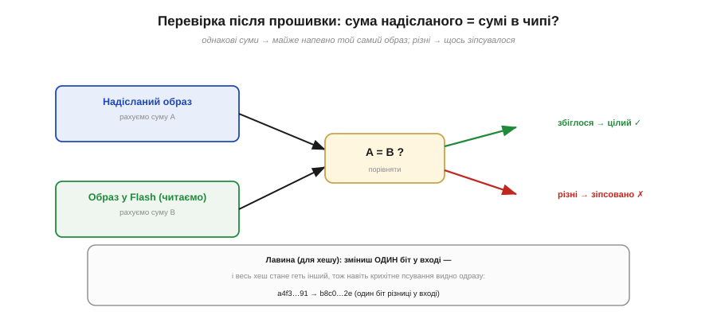
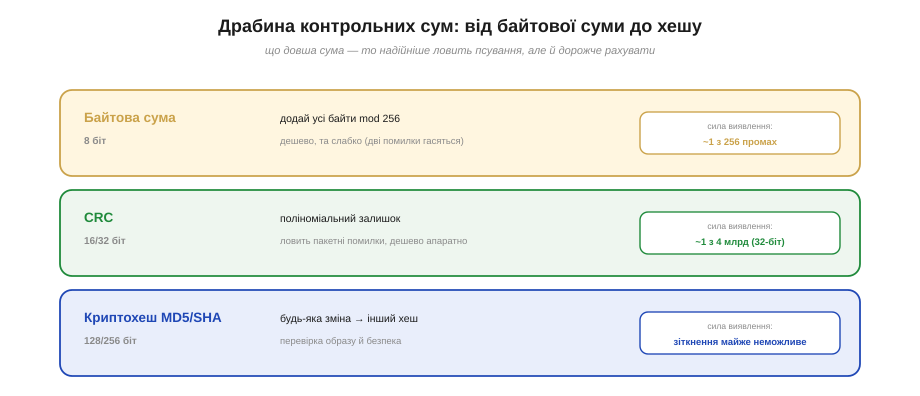

# 🧮 Контрольні суми образу: від байтової суми до хешів

> Математична вставка до **теми [§4.2.4 «Образ прошивки й карта пам'яті»](ch21-toolchain.md)**. Образ заливають у Flash по неідеальному дроту — звідки впевненість, що він доїхав **цілим**? Відповідь дають контрольні суми; розберімо їх від найпростішої до криптографічної.

## Означення

**Контрольна сума** (*checksum*) — невелике число, пораховане з даних так, щоб найменша їхня зміна **майже напевно** змінила і його. Зберігши суму поряд із даними, потім можна **перерахувати** її й порівняти: збіглося — дані цілі; ні — щось зіпсувалося. Бувають три рівні сили: проста **байтова сума**, **CRC** і криптографічний **хеш**.

## Інтуїція: порахувати з обох боків і звірити

Перевірка після прошивки проста (Рис. 4.2.4m.2): рахуємо суму **надісланого** образу (A) і суму того, що **тепер лежить** у Flash (B), і порівнюємо. A = B — образ доїхав цілим; A ≠ B — десь біт спотворився, треба перезаливати.


*Рис. 4.2.4m.2. Рахуємо суму з обох боків і звіряємо: збіглося — образ цілий, різні — зіпсовано. Для хешу працює «лавина»: зміна **одного** біта на вході дає геть інший хеш, тож навіть крихітне псування видно одразу.*

## Формальний апарат: драбина сили

Сила суми міряється просто: якщо вона має **k бітів**, то випадкове псування проскочить непоміченим із імовірністю приблизно **1 ∕ 2ᵏ**. Звідси й драбина (Рис. 4.2.4m.1):

```
байтова сума (8 біт):   sum = (b₀ + b₁ + … + bₙ) mod 256
                        промах ~ 1/256 — і дві помилки можуть погасити одна одну

CRC (16/32 біт):        залишок від «ділення» даних на сталий многочлен
                        промах ~ 1/2³² ≈ 1 з 4 млрд; ловить ПАКЕТНІ помилки

криптохеш MD5/SHA       digest фіксованої довжини з будь-якого входу;
(128/256 біт):          зіткнення випадково — астрономічно малоймовірне
```


*Рис. 4.2.4m.1. Три рівні. **Байтова сума** — дешева, але слабка (8 біт, дві помилки гасяться). **CRC** — поліноміальна, ловить пакетні помилки, дешева апаратно (робоча конячка цілісності). **Криптохеш** — найдовший: будь-яка зміна дає інший хеш.*

Чому CRC сильніший за просту суму при тій самій ідеї «одне число з даних»? Бо порядок байтів у ньому **важить**: проста сума не відрізнить переставлені байти, а CRC — відрізнить, та ще й ловить характерні **пакетні** спотворення лінії. Тому саме CRC десятиліттями стереже цілісність у зв'язку й на дисках.

Чому ж не брати завжди найсильніший хеш? Бо за силу платять **часом і пам'яттю**: порахувати MD5 мегабайтного образу відчутно дорожче, ніж CRC, а той — дорожчий за байтову суму. Тому під випадкові помилки лінії беруть дешевий CRC, а важкий хеш — лише там, де ставка справді висока (перевірка всього образу чи безпека).

## Де це працює в курсі

- **Перевірка прошивки.** Після заливання `esptool` рахує **MD5** залитого регіону й звіряє з очікуваним — це і є той фінальний крок «перевірити» з [протоколу прошивки](ch21-s5-a-flash-protocol.md). Кожен блок під час передачі теж несе свою контрольну суму (§4.2.5).
- **Випадкове проти навмисного.** Тут важлива чесна межа. Контрольна сума й навіть MD5 ловлять **випадкове** псування чудово — але від **навмисної** підміни образу не захищають (MD5 криптографічно зламаний саме на зіткнення). Щоб упевнитися, що образ не лише цілий, а й **той самий**, потрібен хеш **плюс цифровий підпис** — це вже захищене завантаження (про нього — у §4.3.9).
- Та сама ідея стереже й збережені дані: NVS, файли, OTA-оновлення кладуть поряд контрольну суму, щоб помітити зіпсований запис.

> ▶️ Повернутися до теми: [§4.2.4 — Образ прошивки й карта пам'яті](ch21-toolchain.md)
